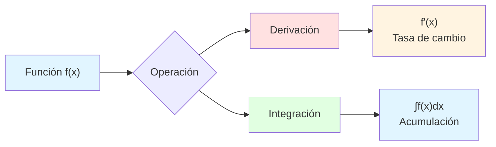

# 🧮 Propiedades de la Integral en Cálculo

## 🎯 Introducción

> [!info]- 💡 ¿Qué es la Integración? La **integración** es una operación fundamental en cálculo que, en esencia, representa dos conceptos complementarios:
> 
> 1. **El proceso inverso de la derivación** (antiderivada)
> 2. **El cálculo de áreas bajo curvas** (acumulación)
> 
> **Analogía práctica:** Imagina que tienes dos perspectivas de un viaje:
> 
> - **Derivada:** Conoces la velocidad en cada momento → ¿qué tan rápido vas?
> - **Integral:** Conoces la velocidad en cada momento → ¿qué distancia total recorriste?
> 
> **¿Por qué es importante?**
> 
> |Aspecto|Descripción|Ejemplo de Uso|
> |---|---|---|
> |**Acumulación**|Sumar infinitas cantidades infinitesimales|Área, volumen, trabajo|
> |**Antiderivación**|Encontrar función original|Recuperar posición desde velocidad|
> |**Física**|Modelar fenómenos continuos|Movimiento, electricidad, fluidos|
> |**Probabilidad**|Distribuciones continuas|Cálculo de probabilidades|
> |**Economía**|Análisis de cambios acumulativos|Costos totales, beneficios|



---

## 📐 1. Propiedades de la Integral Indefinida

### 🔄 Concepto de Integral Indefinida

> [!example]- 📘 Definición y Notación
> 
> La **integral indefinida** de una función f(x) es el conjunto de todas sus primitivas (antiderivadas).
> 
> **Notación:** $$\int f(x),dx = F(x) + C$$
> 
> Donde:
> 
> - **∫** : Símbolo de integración
> - **f(x)** : Función integrando
> - **dx** : Variable de integración
> - **F(x)** : Una primitiva de f(x)
> - **C** : Constante de integración
> 
> **Relación fundamental:** $$\frac{d}{dx}[F(x)] = f(x) \quad \Leftrightarrow \quad \int f(x),dx = F(x) + C$$
> 
> ```mermaid
> graph LR
>     A[f(x) = 2x] --> B[Integración]
>     B --> C[F(x) = x² + C]
>     C --> D[Derivación]
>     D --> A
>     
>     style A fill:#ffe1e1
>     style C fill:#e1ffe1
>     style B fill:#fff4e1
>     style D fill:#e1f5ff
> ```
> 
> **Ejemplo simple:**
> 
> $$\int 2x,dx = x^2 + C$$
> 
> **Verificación:** $$\frac{d}{dx}(x^2 + C) = 2x \quad ✅$$

### ➕ Linealidad de la Integral Indefinida

> [!success]- 🎯 Propiedad Fundamental
> 
> La integral indefinida es un **operador lineal**, lo que significa que respeta la suma y la multiplicación por constantes.
> 
> **Propiedad 1: Integral de una suma**
> 
> $$\int [f(x) + g(x)],dx = \int f(x),dx + \int g(x),dx$$
> 
> **Ejemplo práctico:**
> 
> $$\int (3x^2 + 2x),dx = \int 3x^2,dx + \int 2x,dx$$ $$= x^3 + x^2 + C$$
> 
> **Propiedad 2: Constante multiplicativa**
> 
> $$\int k \cdot f(x),dx = k \cdot \int f(x),dx$$
> 
> donde k es una constante.
> 
> **Ejemplo práctico:**
> 
> $$\int 5x^3,dx = 5 \int x^3,dx = 5 \cdot \frac{x^4}{4} + C = \frac{5x^4}{4} + C$$
> 
> **Combinación de ambas propiedades:**
> 
> $$\int [af(x) + bg(x)],dx = a\int f(x),dx + b\int g(x),dx$$
> 
> **Tabla de ejemplos:**
> 
> |Expresión|Aplicación de Linealidad|Resultado|
> |---|---|---|
> |∫(4x³ - 2x)dx|4∫x³dx - 2∫xdx|x⁴ - x² + C|
> |∫(6x² + 3x - 5)dx|6∫x²dx + 3∫xdx - 5∫dx|2x³ + (3x²)/2 - 5x + C|
> |∫(x + 1)²dx|∫(x² + 2x + 1)dx|x³/3 + x² + x + C|
> 
> ```mermaid
> flowchart TD
>     A[∫ af(x) + bg(x) dx] --> B{Linealidad}
>     B --> C[a∫f(x)dx]
>     B --> D[b∫g(x)dx]
>     C --> E[aF(x)]
>     D --> F[bG(x)]
>     E --> G[aF(x) + bG(x) + C]
>     F --> G
>     
>     style A fill:#e1f5ff
>     style B fill:#fff4e1
>     style G fill:#e1ffe1
> ```
> 
> **⚠️ Importante:**
> 
> - La linealidad NO aplica para productos: ∫f(x)·g(x)dx ≠ [∫f(x)dx]·[∫g(x)dx]
> - La linealidad NO aplica para cocientes: ∫[f(x)/g(x)]dx ≠ [∫f(x)dx]/[∫g(x)dx]

### 🔐 Constante de Integración

> [!warning]- ⚠️ Elemento Crucial de la Integral Indefinida
> 
> La **constante de integración C** representa la familia infinita de funciones que tienen la misma derivada.
> 
> **¿Por qué existe C?**
> 
> Cuando derivamos, perdemos información sobre las constantes:
> 
> $$\frac{d}{dx}(x^2 + 5) = 2x$$ $$\frac{d}{dx}(x^2 - 3) = 2x$$ $$\frac{d}{dx}(x^2 + C) = 2x$$
> 
> Por lo tanto: $$\int 2x,dx = x^2 + C$$
> 
> **Visualización gráfica:**
> 
> ```mermaid
> graph TD
>     A[f'(x) = 2x] --> B[f(x) = x² + C]
>     B --> C[C = 0: y = x²]
>     B --> D[C = 2: y = x² + 2]
>     B --> E[C = -3: y = x² - 3]
>     B --> F[C = k: y = x² + k]
>     
>     style A fill:#ffe1e1
>     style B fill:#fff4e1
>     style C fill:#e1ffe1
>     style D fill:#e1ffe1
>     style E fill:#e1ffe1
>     style F fill:#e1f5ff
> ```
> 
> **Interpretación geométrica:**
> 
> La constante C representa **traslaciones verticales** de la función primitiva.
> 
> |Valor de C|Función|Interpretación|
> |---|---|---|
> |C = 0|F(x) = x²|Curva base|
> |C = 3|F(x) = x² + 3|Desplazamiento 3 unidades arriba|
> |C = -2|F(x) = x² - 2|Desplazamiento 2 unidades abajo|
> |C = k|F(x) = x² + k|Familia infinita de parábolas|
> 
> **Determinación de C:**
> 
> Para encontrar el valor específico de C, necesitamos una **condición inicial** o **punto conocido**.
> 
> **Ejemplo con condición inicial:**
> 
> Encontrar F(x) tal que:
> 
> - F'(x) = 3x² + 2
> - F(1) = 5
> 
> **Solución:**
> 
> 1. Integrar: $$F(x) = \int (3x^2 + 2),dx = x^3 + 2x + C$$
>     
> 2. Aplicar condición inicial: $$F(1) = 1^3 + 2(1) + C = 5$$ $$3 + C = 5$$ $$C = 2$$
>     
> 3. Solución particular: $$F(x) = x^3 + 2x + 2$$
>     
> 
> **⚠️ Error común:**
> 
> ```java
> // ❌ MAL - Olvidar la constante
> ∫2x dx = x²  // INCOMPLETO
> 
> // ✅ BIEN - Incluir siempre C
> ∫2x dx = x² + C
> ```

### 🔄 Relación con la Derivada

> [!note]- 🔗 Operaciones Inversas
> 
> La integración y la derivación son **operaciones inversas**, como la suma y la resta, o la multiplicación y la división.
> 
> **Propiedad fundamental:**
> 
> $$\frac{d}{dx}\left[\int f(x),dx\right] = f(x)$$
> 
> $$\int \frac{d}{dx}[F(x)],dx = F(x) + C$$
> 
> **Diagrama de relación:**
> 
> ```mermaid
> graph LR
>     A[F(x) = x³] -->|Derivación| B[f(x) = 3x²]
>     B -->|Integración| C[F(x) = x³ + C]
>     
>     D[F(x) + C] -->|Derivación| E[f(x)]
>     E -->|Integración| F[F(x) + C]
>     
>     style A fill:#e1ffe1
>     style B fill:#ffe1e1
>     style C fill:#e1ffe1
>     style D fill:#e1ffe1
>     style E fill:#ffe1e1
>     style F fill:#e1ffe1
> ```
> 
> **Tabla comparativa:**
> 
> |Operación|Símbolo|Pregunta|Resultado|
> |---|---|---|---|
> |**Derivación**|d/dx|¿Cuál es la tasa de cambio?|Función derivada f'(x)|
> |**Integración**|∫ dx|¿Cuál es la función original?|Primitiva F(x) + C|
> 
> **Ejemplos de verificación:**
> 
> **Ejemplo 1:** $$\text{Integral: } \int 4x^3,dx = x^4 + C$$ $$\text{Verificación: } \frac{d}{dx}(x^4 + C) = 4x^3 \quad ✅$$
> 
> **Ejemplo 2:** $$\text{Integral: } \int \cos(x),dx = \sin(x) + C$$ $$\text{Verificación: } \frac{d}{dx}[\sin(x) + C] = \cos(x) \quad ✅$$
> 
> **Ejemplo 3:** $$\text{Integral: } \int e^x,dx = e^x + C$$ $$\text{Verificación: } \frac{d}{dx}(e^x + C) = e^x \quad ✅$$
> 
> **Propiedad de composición:**
> 
> $$\frac{d}{dx}\left[\int_a^x f(t),dt\right] = f(x)$$
> 
> Esta propiedad es la base del **Teorema Fundamental del Cálculo**.

### 🎨 No Unicidad de la Primitiva

> [!tip]- 🔢 Familia Infinita de Soluciones
> 
> Una función tiene **infinitas primitivas**, todas diferenciándose por una constante.
> 
> **Concepto:**
> 
> Si F(x) es una primitiva de f(x), entonces cualquier función de la forma: $$G(x) = F(x) + C$$
> 
> también es primitiva de f(x), donde C ∈ ℝ.
> 
> **Demostración:**
> 
> Si F'(x) = f(x), entonces: $$G'(x) = [F(x) + C]' = F'(x) + 0 = f(x)$$
> 
> **Visualización:**
> 
> ```mermaid
> graph TD
>     A[f(x) = 2x] --> B[Primitivas]
>     B --> C[F₁(x) = x² + 0]
>     B --> D[F₂(x) = x² + 5]
>     B --> E[F₃(x) = x² - 3]
>     B --> F[F₄(x) = x² + π]
>     B --> G[Fₙ(x) = x² + C]
>     
>     C -.-> H[Todas tienen<br/>la misma derivada]
>     D -.-> H
>     E -.-> H
>     F -.-> H
>     G -.-> H
>     
>     style A fill:#ffe1e1
>     style B fill:#fff4e1
>     style G fill:#e1ffe1
>     style H fill:#e1f5ff
> ```
> 
> **Ejemplos:**
> 
> |Función f(x)|Familia de Primitivas F(x) + C|Valores específicos|
> |---|---|---|
> |2x|x² + C|x², x²+1, x²-5, x²+π|
> |3x²|x³ + C|x³, x³+2, x³-7|
> |sin(x)|-cos(x) + C|-cos(x), -cos(x)+3|
> |eˣ|eˣ + C|eˣ, eˣ+1, eˣ-2|
> 
> **Interpretación gráfica:**
> 
> Para f(x) = 2x:
> 
> - Todas las primitivas son parábolas y = x² + C
> - Cada valor de C da una parábola diferente
> - Todas son **traslaciones verticales** de y = x²
> - Todas tienen la **misma pendiente** en cada punto x
> 
> **Problema de valor inicial (PVI):**
> 
> Para obtener UNA primitiva específica, necesitamos una condición adicional:
> 
> **Ejemplo:** $$\text{Encontrar } F(x) \text{ tal que } F'(x) = 6x^2 \text{ y } F(0) = 4$$
> 
> **Solución:**
> 
> 1. Familia general: $$F(x) = 2x^3 + C$$
> 2. Aplicar F(0) = 4: $$2(0)^3 + C = 4 \Rightarrow C = 4$$
> 3. Solución única: $$F(x) = 2x^3 + 4$$
> 
> **Flujo de solución:**
> 
> ```mermaid
> flowchart LR
>     A[f(x) dada] --> B[Integrar]
>     B --> C[F(x) + C<br/>Familia infinita]
>     C --> D{¿Hay condición<br/>inicial?}
>     D -->|No| E[Mantener C<br/>Solución general]
>     D -->|Sí| F[Calcular C]
>     F --> G[F(x) específica<br/>Solución particular]
>     
>     style A fill:#ffe1e1
>     style C fill:#fff4e1
>     style E fill:#e1f5ff
>     style G fill:#e1ffe1
> ```

---

## 📏 2. Propiedades de la Integral Definida

### 📐 Concepto de Integral Definida

> [!info]- 📊 Definición y Notación
> 
> La **integral definida** de f(x) desde a hasta b representa el **área neta** entre la curva y el eje x en el intervalo [a,b].
> 
> **Notación:** $$\int_a^b f(x),dx$$
> 
> Donde:
> 
> - **a** : Límite inferior de integración
> - **b** : Límite superior de integración
> - **f(x)** : Función integrando
> - **[a,b]** : Intervalo de integración
> 
> **Diferencias clave con integral indefinida:**
> 
> |Aspecto|Integral Indefinida|Integral Definida|
> |---|---|---|
> |**Notación**|∫f(x)dx|∫ₐᵇf(x)dx|
> |**Resultado**|Función F(x) + C|Número real|
> |**Límites**|No tiene|a y b|
> |**Constante C**|Sí incluye|No incluye|
> |**Interpretación**|Familia de funciones|Área o acumulación|
> 
> ```mermaid
> graph TD
>     A[Integración] --> B[Indefinida<br/>∫f(x)dx]
>     A --> C[Definida<br/>∫ₐᵇf(x)dx]
>     
>     B --> D[Resultado:<br/>F(x) + C]
>     C --> E[Resultado:<br/>Número]
>     
>     D --> F[Antiderivada]
>     E --> G[Área / Acumulación]
>     
>     style A fill:#fff4e1
>     style B fill:#ffe1e1
>     style C fill:#e1ffe1
>     style D fill:#ffcccc
>     style E fill:#ccffcc
> ```
> 
> **Interpretación geométrica:**
> 
> Para f(x) ≥ 0 en [a,b]: $$\int_a^b f(x),dx = \text{Área bajo la curva}$$
> 
> **Signo del área:**
> 
> - Área sobre el eje x: **positiva** (+)
> - Área bajo el eje x: **negativa** (-)
> - Resultado: **área neta** (suma algebraica)

### ➕ Linealidad de la Integral Definida

> [!success]- 🎯 Propiedades Lineales
> 
> Al igual que la integral indefinida, la integral definida es un **operador lineal**.
> 
> **Propiedad 1: Integral de una suma**
> 
> $$\int_a^b [f(x) + g(x)],dx = \int_a^b f(x),dx + \int_a^b g(x),dx$$
> 
> **Ejemplo numérico:**
> 
> $$\int_0^1 (x^2 + 2x),dx = \int_0^1 x^2,dx + \int_0^1 2x,dx$$ $$= \left[\frac{x^3}{3}\right]_0^1 + \left[x^2\right]_0^1$$ $$= \frac{1}{3} + 1 = \frac{4}{3}$$
> 
> **Propiedad 2: Constante multiplicativa**
> 
> $$\int_a^b k \cdot f(x),dx = k \cdot \int_a^b f(x),dx$$
> 
> donde k es una constante.
> 
> **Ejemplo numérico:**
> 
> $$\int_1^3 5x,dx = 5 \int_1^3 x,dx = 5 \left[\frac{x^2}{2}\right]_1^3$$ $$= 5 \cdot \left(\frac{9}{2} - \frac{1}{2}\right) = 5 \cdot 4 = 20$$
> 
> **Linealidad completa:**
> 
> $$\int_a^b [cf(x) + dg(x)],dx = c\int_a^b f(x),dx + d\int_a^b g(x),dx$$
> 
> **Tabla de ejemplos:**
> 
> |Expresión|Aplicación|Resultado|
> |---|---|---|
> |∫₀¹(3x² + 2x)dx|3∫₀¹x²dx + 2∫₀¹xdx|3(1/3) + 2(1/2) = 2|
> |∫₁²(4x - 5)dx|4∫₁²xdx - 5∫₁²dx|4(3/2) - 5(1) = 1|
> 
> ```mermaid
> flowchart TD
>     A[∫ₐᵇ cf(x)+dg(x) dx] --> B{Linealidad}
>     B --> C[c∫ₐᵇf(x)dx]
>     B --> D[d∫ₐᵇg(x)dx]
>     C --> E[c·A₁]
>     D --> F[d·A₂]
>     E --> G[Resultado:<br/>c·A₁ + d·A₂]
>     F --> G
>     
>     style A fill:#e1f5ff
>     style B fill:#fff4e1
>     style G fill:#e1ffe1
> ```

### 🔄 Cambio de Límites

> [!example]- 🔀 Propiedades de Inversión y Punto
> 
> **Propiedad 1: Inversión de límites**
> 
> $$\int_a^b f(x),dx = -\int_b^a f(x),dx$$
> 
> Cambiar el orden de los límites cambia el signo del resultado.
> 
> **Ejemplo numérico:**
> 
> $$\int_0^2 x,dx = \left[\frac{x^2}{2}\right]_0^2 = 2$$
> 
> $$\int_2^0 x,dx = \left[\frac{x^2}{2}\right]_2^0 = 0 - 2 = -2$$
> 
> **Verificación:** $$\int_0^2 x,dx = -\int_2^0 x,dx \quad ✅$$
> 
> **Propiedad 2: Límites iguales**
> 
> $$\int_a^a f(x),dx = 0$$
> 
> Una integral con límites iguales siempre es cero (no hay intervalo).
> 
> **Ejemplo:**
> 
> $$\int_5^5 x^{100},dx = 0$$ $$\int_3^3 \sin(x),dx = 0$$
> 
> **Interpretación geométrica:**
> 
> ```mermaid
> graph LR
>     A[∫ₐᵇf(x)dx] -->|Inverso| B[∫ᵇₐf(x)dx]
>     A -->|Área| C[+ A]
>     B -->|Área| D[- A]
>     
>     E[∫ₐₐf(x)dx] --> F[Ancho = 0]
>     F --> G[Área = 0]
>     
>     style A fill:#e1ffe1
>     style B fill:#ffe1e1
>     style E fill:#fff4e1
>     style G fill:#e1f5ff
> ```
> 
> **Tabla resumen:**
> 
> |Condición|Expresión|Resultado|Significado|
> |---|---|---|---|
> |Orden normal|∫ₐᵇf(x)dx|Valor positivo/negativo|Área de a a b|
> |Orden invertido|∫ᵇₐf(x)dx|-∫ₐᵇf(x)dx|Cambia el signo|
> |Límites iguales|∫ₐₐf(x)dx|0|Sin intervalo|

### ➕ Aditividad del Intervalo

> [!note]- 📊 Partición de Intervalos
> 
> La integral sobre un intervalo puede **dividirse** en suma de integrales sobre subintervalos.
> 
> **Propiedad fundamental:**
> 
> Si a < c < b, entonces: $$\int_a^b f(x),dx = \int_a^c f(x),dx + \int_c^b f(x),dx$$
> 
> **Interpretación geométrica:**
> 
> El área total es la suma de las áreas parciales.
> 
> ```mermaid
> graph TD
>     A[Área total<br/>∫ₐᵇf(x)dx] --> B{Dividir en c}
>     B --> C[Área 1<br/>∫ₐᶜf(x)dx]
>     B --> D[Área 2<br/>∫ᶜᵇf(x)dx]
>     C --> E[Total = Área1 + Área2]
>     D --> E
>     
>     style A fill:#e1f5ff
>     style B fill:#fff4e1
>     style C fill:#ffe1e1
>     style D fill:#ffe1e1
>     style E fill:#e1ffe1
> ```
> 
> **Ejemplo numérico:**
> 
> Calcular ∫₀⁴x dx dividiendo en c = 2:
> 
> $$\int_0^4 x,dx = \int_0^2 x,dx + \int_2^4 x,dx$$
> 
> **Cálculo de cada parte:**
> 
> $$\int_0^2 x,dx = \left[\frac{x^2}{2}\right]_0^2 = 2$$
> 
> $$\int_2^4 x,dx = \left[\frac{x^2}{2}\right]_2^4 = 8 - 2 = 6$$
> 
> $$\int_0^4 x,dx = 2 + 6 = 8$$
> 
> **Verificación directa:** $$\int_0^4 x,dx = \left[\frac{x^2}{2}\right]_0^4 = 8 \quad ✅$$
> 
> **Generalización a múltiples puntos:**
> 
> Para a < c₁ < c₂ < ... < cₙ < b:
> 
> $$\int_a^b f(x),dx = \int_a^{c_1} f(x),dx + \int_{c_1}^{c_2} f(x),dx + \cdots + \int_{c_n}^b f(x),dx$$
> 
> **Aplicaciones prácticas:**
> 
> |Situación|Uso de Aditividad|Beneficio|
> |---|---|---|
> |Función definida por partes|Integrar cada tramo|Simplifica cálculo|
> |Cambio de comportamiento|Dividir en puntos críticos|Análisis por zonas|
> |Cálculo numérico|Dividir en subintervalos|Aproximaciones|
> |Discontinuidades|Evitar puntos problemáticos|Validez matemática|

### ✅ Positividad y Cotas

> [!tip]- 📈 Propiedades de Orden
> 
> **Propiedad 1: Positividad**
> 
> Si f(x) ≥ 0 para todo x ∈ [a,b], entonces: $$\int_a^b f(x),dx \geq 0$$
> 
> **Interpretación:** Si la función está sobre el eje x, el área es positiva.
> 
> **Propiedad 2: Monotonía**
> 
> Si f(x) ≤ g(x) para todo x ∈ [a,b], entonces: $$\int_a^b f(x),dx \leq \int_a^b g(x),dx$$
> 
> **Interpretación:** Si una función está "debajo" de otra, su integral es menor.
> 
> ```mermaid
> graph TD
>     A["f(x) ≤ g(x)"] --> B["∫ₐᵇf(x)dx ≤ ∫ₐᵇg(x)dx"]
>     
>     C["f(x) ≥ 0"] --> D["∫ₐᵇf(x)dx ≥ 0"]
>     
>     E["m ≤ f(x) ≤ M"] --> F["m(b-a)0"]
> ```
> **Propiedad 3: Cotas para la integral**
> 
> Si m ≤ f(x) ≤ M para todo x ∈ [a,b], entonces: $$m(b-a) \leq \int_a^b f(x),dx \leq M(b-a)$$
> 
> **Ejemplo numérico:**
> 
> Para f(x) = sin(x) en [0, π]:
> 
> - Sabemos: 0 ≤ sin(x) ≤ 1
> - Longitud del intervalo: π - 0 = π
> - Cota inferior: 0·π = 0
> - Cota superior: 1·π = π
> 
> $$0 \leq \int_0^\pi \sin(x),dx \leq \pi$$
> 
> **Valor real:** $$\int_0^\pi \sin(x),dx = [-\cos(x)]_0^\pi = 2$$
> 
> **Verificación:** 0 ≤ 2 ≤ π ≈ 3.14 ✅
> 
> **Tabla de propiedades:**
> 
> |Condición|Conclusión|Uso|
> |---|---|---|
> |f(x) ≥ 0|∫ₐᵇf(x)dx ≥ 0|Áreas siempre positivas|
> |f(x) ≤ g(x)|∫ₐᵇf(x)dx ≤ ∫ₐᵇg(x)dx|Comparar integrales|
> |m ≤ f(x) ≤ M|m(b-a) ≤ ∫ₐᵇf(x)dx ≤ M(b-a)|Estimaciones|
> 

### 🎨 Interpretación Geométrica

> [!success]- 📐 Significado Visual de la Integral Definida
> 
> **Concepto fundamental:**
> 
> La integral definida representa el **área neta** entre la curva y(x) y el eje x en el intervalo [a,b].
> 
> **Casos según el signo de f(x):**
> 
> |Caso|Condición|Interpretación|Valor|
> |---|---|---|---|
> |**Por encima**|f(x) > 0|Área positiva|+A|
> |**Por debajo**|f(x) < 0|Área negativa|-A|
> |**Mixto**|f(x) cambia signo|Área neta|A₁ - A₂|
> |**Sobre el eje**|f(x) = 0|Sin área|0|
> 
> ```mermaid
> graph TD
>     A[∫ₐᵇf(x)dx] --> B{Signo de f(x)}
>     
>     B -->|f(x) > 0| C[Área sobre eje<br/>Resultado: +]
>     B -->|f(x) < 0| D[Área bajo eje<br/>Resultado: -]
>     B -->|f(x) cambia| E[Área neta<br/>Suma algebraica]
>     
>     style A fill:#e1f5ff
>     style B fill:#fff4e1
>     style C fill:#e1ffe1
>     style D fill:#ffe1e1
>     style E fill:#e1e1ff
> ```
> 
> **Ejemplo visual 1: Área positiva**
> 
> Para f(x) = x en [0, 2]:
> 
> $$\int_0^2 x,dx = \left[\frac{x^2}{2}\right]_0^2 = 2$$
> 
> Representa el área del triángulo: (base × altura)/2 = (2 × 2)/2 = 2
> 
> **Ejemplo visual 2: Área negativa**
> 
> Para f(x) = x - 3 en [0, 2]:
> 
> $$\int_0^2 (x-3),dx = \left[\frac{x^2}{2} - 3x\right]_0^2 = (2-6) - 0 = -4$$
> 
> La función está bajo el eje x, por lo que el resultado es negativo.
> 
> **Ejemplo visual 3: Área neta**
> 
> Para f(x) = x - 1 en [0, 2]:
> 
> - En [0, 1]: f(x) < 0 → área negativa
> - En [1, 2]: f(x) > 0 → área positiva
> 
> $$\int_0^2 (x-1),dx = \left[\frac{x^2}{2} - x\right]_0^2 = 0$$
> 
> Las áreas se cancelan exactamente.
> 
> **Interpretaciones adicionales:**
> 
> |Contexto|f(x) representa|∫ₐᵇf(x)dx representa|
> |---|---|---|
> |**Física**|Velocidad v(t)|Desplazamiento|
> |**Economía**|Ingreso marginal|Ingreso total|
> |**Probabilidad**|Densidad de probabilidad|Probabilidad acumulada|
> |**Trabajo**|Fuerza F(x)|Trabajo realizado|
> 
> **Valor promedio:**
> 
> El **valor promedio** de f en [a,b] es:
> 
> $$f_{prom} = \frac{1}{b-a}\int_a^b f(x),dx$$
> 
> **Interpretación:** La altura de un rectángulo con la misma área que la curva.

---

## 🔗 3. Relación entre Integral Indefinida y Definida

### 🎓 Teorema Fundamental del Cálculo

> [!example]- 🌟 El Puente entre Derivación e Integración
> 
> El **Teorema Fundamental del Cálculo** (TFC) conecta las dos operaciones fundamentales del cálculo y proporciona un método práctico para calcular integrales definidas.
> 
> **Primera Parte del TFC:**
> 
> Si f es continua en [a,b] y definimos: $$F(x) = \int_a^x f(t),dt$$
> 
> entonces F es derivable y: $$F'(x) = f(x)$$
> 
> **Interpretación:** La derivada de una integral es la función original.
> 
> **Segunda Parte del TFC (Regla de Barrow):**
> 
> Si F es una antiderivada de f en [a,b], entonces: $$\int_a^b f(x),dx = F(b) - F(a)$$
> 
> **Notación compacta:** $$\int_a^b f(x),dx = \left[F(x)\right]_a^b = F(b) - F(a)$$
> 
> ```mermaid
> graph TD
>     A[Teorema Fundamental<br/>del Cálculo] --> B[Primera Parte]
>     A --> C[Segunda Parte]
>     
>     B --> D[d/dx ∫ₐˣf(t)dt = f(x)]
>     B --> E[La integral<br/>acumula]
>     B --> F[La derivada<br/>extrae]
>     
>     C --> G[∫ₐᵇf(x)dx = F(b)-F(a)]
>     C --> H[Evaluar<br/>antiderivada]
>     C --> I[Restar límites]
>     
>     style A fill:#fff4e1
>     style B fill:#e1ffe1
>     style C fill:#e1f5ff
>     style D fill:#ffe1e1
>     style G fill:#ffe1e1
> ```
> 
> **Ejemplo completo:**
> 
> Calcular ∫₁³x² dx
> 
> **Paso 1:** Encontrar antiderivada $$F(x) = \frac{x^3}{3}$$
> 
> **Paso 2:** Evaluar en los límites $$F(3) = \frac{3^3}{3} = \frac{27}{3} = 9$$ $$F(1) = \frac{1^3}{3} = \frac{1}{3}$$
> 
> **Paso 3:** Restar $$\int_1^3 x^2,dx = F(3) - F(1) = 9 - \frac{1}{3} = \frac{26}{3}$$
> 
> **Importancia histórica:**
> 
> |Antes del TFC|Después del TFC|
> |---|---|
> |Áreas mediante sumas infinitas|Áreas mediante antiderivadas|
> |Proceso largo y tedioso|Proceso directo y rápido|
> |Limitado a figuras simples|Aplicable a funciones generales|
> 
> **Verificación de la primera parte:**
> 
> Sea $$F(x) = \int_0^x t^2,dt = \frac{x^3}{3}$$
> 
> Entonces: $$F'(x) = \frac{d}{dx}\left(\frac{x^3}{3}\right) = x^2 = f(x) \quad ✅$$

### ⚙️ Evaluación por Antiderivadas

> [!success]- 🔧 Método Práctico de Cálculo
> 
> La **evaluación por antiderivadas** es el método estándar para calcular integrales definidas, basado en la Segunda Parte del TFC.
> 
> **Algoritmo paso a paso:**
> 
> ```mermaid
> flowchart TD
>     A[∫ₐᵇf(x)dx] --> B[Paso 1:<br/>Encontrar F(x)<br/>antiderivada de f(x)]
>     B --> C[Paso 2:<br/>Evaluar F(b)]
>     C --> D[Paso 3:<br/>Evaluar F(a)]
>     D --> E[Paso 4:<br/>Calcular F(b) - F(a)]
>     E --> F[Resultado final]
>     
>     style A fill:#e1f5ff
>     style B fill:#fff4e1
>     style E fill:#ffe1e1
>     style F fill:#e1ffe1
> ```
> 
> **Tabla de proceso:**
> 
> |Paso|Acción|Ejemplo: ∫₀²(3x² + 2x)dx|
> |---|---|---|
> |**1**|Encontrar F(x)|F(x) = x³ + x²|
> |**2**|Evaluar en b|F(2) = 8 + 4 = 12|
> |**3**|Evaluar en a|F(0) = 0 + 0 = 0|
> |**4**|Restar F(b) - F(a)|12 - 0 = 12|
> 
> **Ejemplo 1: Polinomio**
> 
> $$\int_1^4 (2x + 3),dx$$
> 
> **Solución:**
> 
> - Antiderivada: $$F(x) = x^2 + 3x$$
> - Evaluar: $$\left[x^2 + 3x\right]_1^4$$
> - Calcular: $$F(4) - F(1) = (16 + 12) - (1 + 3) = 28 - 4 = 24$$
> 
> **Ejemplo 2: Función trigonométrica**
> 
> $$\int_0^{\pi/2} \cos(x),dx$$
> 
> **Solución:**
> 
> - Antiderivada: $$F(x) = \sin(x)$$
> - Evaluar: $$\left[\sin(x)\right]_0^{\pi/2}$$
> - Calcular: $$\sin(\pi/2) - \sin(0) = 1 - 0 = 1$$
> 
> **Ejemplo 3: Función exponencial**
> 
> $$\int_0^1 e^{2x},dx$$
> 
> **Solución:**
> 
> - Antiderivada: $$F(x) = \frac{e^{2x}}{2}$$
> - Evaluar: $$\left[\frac{e^{2x}}{2}\right]_0^1$$
> - Calcular: $$\frac{e^2}{2} - \frac{e^0}{2} = \frac{e^2 - 1}{2}$$
> 
> **⚠️ Errores comunes:**
> 
> |Error|Incorrecto|Correcto|
> |---|---|---|
> |**Olvidar la constante**|F(x) = x² (con C)|❌ No afecta en definidas|
> |**Orden de resta**|F(a) - F(b)|✅ F(b) - F(a)|
> |**Evaluar solo un límite**|F(b)|✅ F(b) - F(a)|
> |**Antiderivada incorrecta**|∫x²dx = x³|✅ ∫x²dx = x³/3|
> 
> **Comparación con sumas de Riemann:**
> 
> |Método|Complejidad|Precisión|Rapidez|
> |---|---|---|---|
> |**Sumas de Riemann**|Alta|Aproximada|Lenta|
> |**Antiderivadas (TFC)**|Media|Exacta|Rápida|
> 
> **Casos especiales:**
> 
> **Caso 1: Límites iguales** $$\int_3^3 f(x),dx = F(3) - F(3) = 0$$
> 
> **Caso 2: Límites invertidos** $$\int_b^a f(x),dx = F(a) - F(b) = -[F(b) - F(a)] = -\int_a^b f(x),dx$$
> 
> **Propiedades útiles en evaluación:**
> 
> 1. **Linealidad:** $$\int_a^b [cf(x) + dg(x)],dx = c\int_a^b f(x),dx + d\int_a^b g(x),dx$$
>     
> 2. **Aditividad:** $$\int_a^b f(x),dx = \int_a^c f(x),dx + \int_c^b f(x),dx$$
>     
> 3. **Simetría (funciones pares):** Si f(-x) = f(x): $$\int_{-a}^a f(x),dx = 2\int_0^a f(x),dx$$
>     
> 4. **Simetría (funciones impares):** Si f(-x) = -f(x): $$\int_{-a}^a f(x),dx = 0$$
>     

---

## 📊 Tabla Resumen Comparativa

> [!note]- 📋 Síntesis de Propiedades
> 
> |Propiedad|Integral Indefinida|Integral Definida|
> |---|---|---|
> |**Resultado**|Función F(x) + C|Número real|
> |**Linealidad**|∫[af + bg]dx = a∫fdx + b∫gdx|∫ₐᵇ[af + bg]dx = a∫ₐᵇfdx + b∫ₐᵇgdx|
> |**Constante C**|✅ Siempre incluida|❌ Se cancela en F(b)-F(a)|
> |**Límites**|No tiene|Tiene [a,b]|
> |**Inversión**|N/A|∫ₐᵇf = -∫ᵇₐf|
> |**Límites iguales**|N/A|∫ₐₐf = 0|
> |**Aditividad**|N/A|∫ₐᵇf = ∫ₐᶜf + ∫ᶜᵇf|
> |**Interpretación**|Familia de funciones|Área/acumulación|
> |**Relación con derivada**|∫f'dx = f + C|d/dx[∫ₐˣfdt] = f(x)|
> |**Unicidad**|Infinitas (difieren en C)|Única para límites fijos|

---

## 🎯 Ejercicios Guiados

> [!example]- 💪 Práctica con Ejemplos Resueltos
> 
> **Nivel Básico:**
> 
> **Ejercicio 1: Propiedades de indefinida**
> 
> Calcular: ∫(4x³ - 6x² + 2)dx
> 
> **Solución:** $$\int (4x^3 - 6x^2 + 2),dx = 4\int x^3,dx - 6\int x^2,dx + 2\int dx$$ $$= 4 \cdot \frac{x^4}{4} - 6 \cdot \frac{x^3}{3} + 2x + C$$ $$= x^4 - 2x^3 + 2x + C$$
> 
> **Ejercicio 2: Evaluación definida**
> 
> Calcular: ∫₀³(2x + 1)dx
> 
> **Solución:** $$\int_0^3 (2x + 1),dx = \left[x^2 + x\right]_0^3$$ $$= (9 + 3) - (0 + 0) = 12$$
> 
> **Nivel Intermedio:**
> 
> **Ejercicio 3: Aditividad de intervalos**
> 
> Si ∫₀²f(x)dx = 5 y ∫₂⁵f(x)dx = 8, calcular ∫₀⁵f(x)dx
> 
> **Solución:** $$\int_0^5 f(x),dx = \int_0^2 f(x),dx + \int_2^5 f(x),dx = 5 + 8 = 13$$
> 
> **Ejercicio 4: Inversión de límites**
> 
> Si ∫₁⁴g(x)dx = -3, calcular ∫₄¹g(x)dx
> 
> **Solución:** $$\int_4^1 g(x),dx = -\int_1^4 g(x),dx = -(-3) = 3$$
> 
> **Nivel Avanzado:**
> 
> **Ejercicio 5: Función definida por partes**
> 
> Calcular: $$\int_0^3 f(x),dx$$ donde $$f(x) = \begin{cases} x^2 & 0 \leq x < 2 \ 2x & 2 \leq x \leq 3 \end{cases}$$
> 
> **Solución:** $$\int_0^3 f(x),dx = \int_0^2 x^2,dx + \int_2^3 2x,dx$$ $$= \left[\frac{x^3}{3}\right]_0^2 + \left[x^2\right]_2^3$$ $$= \frac{8}{3} - 0 + 9 - 4 = \frac{8}{3} + 5 = \frac{23}{3}$$

---

## 🎓 Conceptos Clave para Recordar

> [!success]- 🌟 Resumen Esencial
> 
> **Integral Indefinida:**
> 
> 1. Resultado es una **función + C**
> 2. Representa **familia de primitivas**
> 3. C es **esencial** (infinitas soluciones)
> 4. Operación **inversa** a la derivación
> 5. Es **lineal**: ∫[af + bg] = a∫f + b∫g
> 
> **Integral Definida:**
> 
> 6. Resultado es un **número**
> 7. Representa **área neta**
> 8. También es **lineal**
> 9. Inversión de límites **cambia signo**
> 10. Se puede **dividir** el intervalo
> 
> **Teorema Fundamental del Cálculo:**
> 
> 11. **Conecta** derivación e integración
> 12. Permite calcular integrales definidas **fácilmente**
> 13. Primera parte: $$\frac{d}{dx}\int_a^x f(t),dt = f(x)$$
> 14. Segunda parte: $$\int_a^b f(x),dx = F(b) - F(a)$$
> 
> ```mermaid
> mindmap
>   root((Integración))
>     Indefinida
>       Función + C
>       Linealidad
>       Primitivas
>       Inversa de derivada
>     Definida
>       Número
>       Área neta
>       Límites [a,b]
>       Aditividad
>     TFC
>       Une ambas
>       Evaluación práctica
>       F(b) - F(a)
> ```

---

**Tags:** #cálculo #integrales #integración #derivadas #teorema-fundamental #área #antiderivadas #límites #propiedades #matemáticas #mermaid #diagramas
