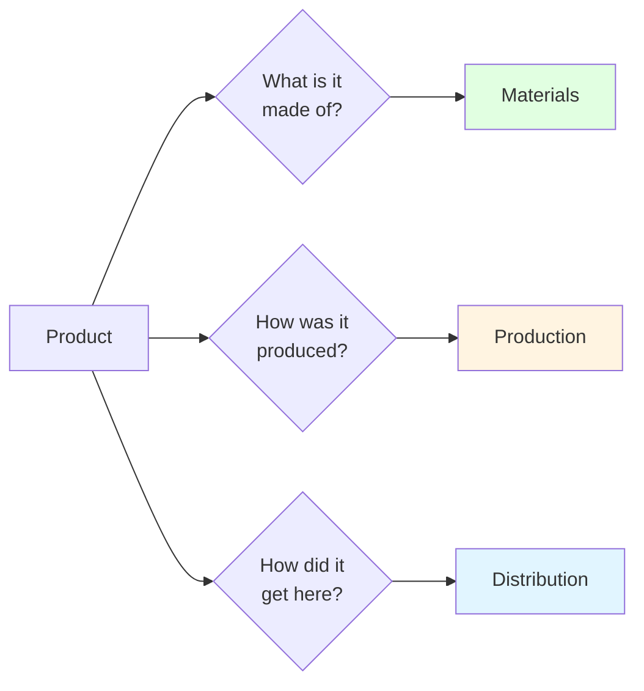
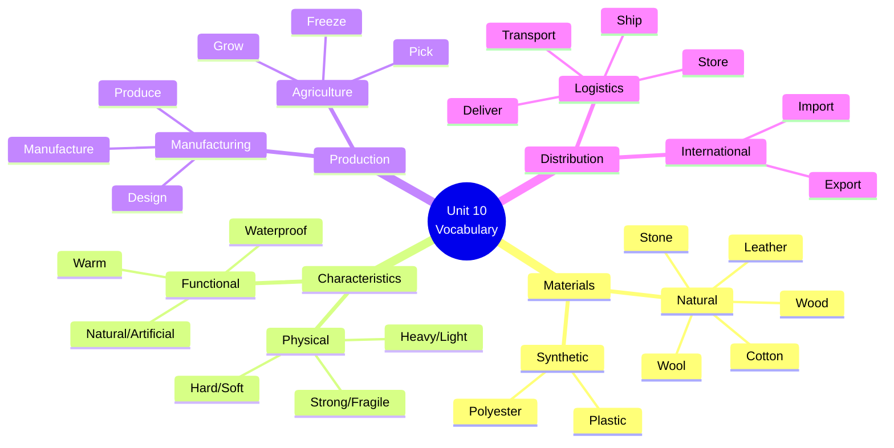

# 🛍️ Vocabulary & Use: Materials + Production & Distribution

## 🎯 Introducción

> [!info]- 💡 ¿Por qué es importante este vocabulario?
> 
> El vocabulario de **materiales, producción y distribución** es fundamental para:
> 
> - **Describir productos** en situaciones cotidianas y profesionales
> - **Entender etiquetas** y especificaciones técnicas
> - **Hablar sobre comercio internacional** y cadenas de suministro
> - **Expresar preferencias** basadas en características de materiales
> - **Participar en conversaciones** sobre consumo responsable y sostenibilidad
> 
> **Analogía práctica:** Imagina que eres un detective de productos. Cada objeto tiene una "historia" que contar: de qué está hecho, dónde se fabricó, cómo llegó hasta ti. Este vocabulario te da las herramientas para descifrar esa historia.
> 
> **¿Dónde lo usarás?**
> 
> |Situación|Ejemplo de Uso|
> |---|---|
> |**Shopping**|"Is this jacket waterproof?"|
> |**Business**|"We manufacture shoes in Italy"|
> |**Travel**|"This product is made of natural materials"|
> |**Sustainability**|"I prefer products made from recycled plastic"|
> |**Product reviews**|"The material is soft but very strong"|



---

## 🧵 A. Materials (Describing Products)

> [!example]- 📦 Materiales Básicos
> 
> **Materiales fundamentales:**
> 
> |Material|Spanish|Pronunciation|Common Products|
> |---|---|---|---|
> |**Cotton**|Algodón|/ˈkɒt.ən/|T-shirts, jeans, towels|
> |**Glass**|Vidrio|/ɡlɑːs/|Bottles, windows, mirrors|
> |**Leather**|Cuero|/ˈleð.ər/|Shoes, jackets, bags|
> |**Metal**|Metal|/ˈmet.əl/|Cars, tools, jewelry|
> |**Plastic**|Plástico|/ˈplæs.tɪk/|Bottles, toys, packaging|
> |**Polyester**|Poliéster|/ˌpɒl.iˈes.tər/|Sportswear, curtains|
> |**Stone**|Piedra|/stəʊn/|Buildings, countertops|
> |**Wood**|Madera|/wʊd/|Furniture, floors, paper|
> |**Wool**|Lana|/wʊl/|Sweaters, blankets, coats|
> 
> **Visualización de materiales:**
> 
> ```mermaid
> mindmap
>   root((Materials))
>     Natural
>       Cotton
>       Leather
>       Stone
>       Wood
>       Wool
>     Synthetic
>       Plastic
>       Polyester
>     Mixed
>       Glass
>       Metal
> ```
> 
> **Ejemplos en contexto:**
> 
> ```
> ✅ This shirt is made of cotton.
> ✅ The window is made of glass.
> ✅ My jacket is made of leather.
> ✅ The toy is made of plastic.
> ✅ This sweater is made of wool.
> ```
> 
> **Collocations importantes:**
> 
> |Collocation|Example|
> |---|---|
> |**made of** + material|made of cotton, made of wood|
> |**100% + material**|100% cotton, 100% wool|
> |**pure + material**|pure leather, pure silk|
> |**natural + material**|natural stone, natural wood|
> |**recycled + material**|recycled plastic, recycled metal|

> [!success]- 🎨 Características de Materiales (Adjectives)
> 
> **Propiedades físicas:**
> 
> |Adjective|Spanish|Opposite|Example|
> |---|---|---|---|
> |**Artificial**|Artificial|Natural|Artificial leather is cheaper|
> |**Fragile**|Frágil|Strong|Glass is very fragile|
> |**Hard**|Duro|Soft|Metal is hard and durable|
> |**Heavy**|Pesado|Light|Stone is very heavy|
> |**Light**|Ligero|Heavy|Plastic is light and cheap|
> |**Natural**|Natural|Artificial|I prefer natural materials|
> |**Soft**|Suave|Hard|Cotton is soft and comfortable|
> |**Strong**|Fuerte/Resistente|Weak|Steel is very strong|
> |**Warm**|Cálido|Cold|Wool is warm in winter|
> |**Waterproof**|Impermeable|Absorbent|This jacket is waterproof|
> 
> **Matriz de características comunes:**
> 
> |Material|Typical Characteristics|
> |---|---|
> |**Cotton**|Natural, soft, warm, absorbent|
> |**Glass**|Fragile, hard, transparent|
> |**Leather**|Natural, strong, durable|
> |**Metal**|Hard, heavy, strong|
> |**Plastic**|Light, waterproof, artificial|
> |**Polyester**|Artificial, light, waterproof|
> |**Stone**|Natural, hard, heavy, strong|
> |**Wood**|Natural, warm, relatively light|
> |**Wool**|Natural, soft, warm|
> 
> **Combinaciones frecuentes:**
> 
> ```mermaid
> graph TD
>     A[Product Description] --> B[Material]
>     A --> C[Characteristic 1]
>     A --> D[Characteristic 2]
>     
>     B --> E[made of cotton]
>     C --> F[very soft]
>     D --> G[and comfortable]
>     
>     style E fill:#e1ffe1
>     style F fill:#fff4e1
>     style G fill:#e1f5ff
> ```
> 
> **Frases modelo para descripción:**
> 
> ```
> Pattern: This [product] is made of [material]. It's [adj1] and [adj2].
> 
> ✅ This backpack is made of polyester. It's light and waterproof.
> ✅ The table is made of wood. It's natural and warm.
> ✅ My boots are made of leather. They're strong and durable.
> ✅ This bottle is made of glass. It's fragile but recyclable.
> ```

---

## 🏭 B. Production & Distribution (Verbs)

> [!note]- 🔨 Verbos de Producción
> 
> **Verbos clave del proceso productivo:**
> 
> |Verb|Spanish|Type|Example|
> |---|---|---|---|
> |**Catch**|Atrapar/Pescar|Extraction|They catch fish in the ocean|
> |**Design**|Diseñar|Creation|Apple designs phones in California|
> |**Freeze**|Congelar|Preservation|They freeze vegetables after picking|
> |**Grow**|Cultivar|Agriculture|Ecuador grows bananas|
> |**Manufacture**|Fabricar|Production|We manufacture cars in Japan|
> |**Pick**|Recoger/Cosechar|Harvesting|Workers pick coffee beans by hand|
> |**Produce**|Producir|General|China produces most electronics|
> 
> **Flujo del proceso de producción:**
> 
> ```mermaid
> graph LR
>     A[Raw Materials] --> B[Grow/Catch/Extract]
>     B --> C[Pick/Harvest]
>     C --> D[Process/Manufacture]
>     D --> E[Product]
>     
>     style A fill:#fff4e1
>     style D fill:#e1ffe1
>     style E fill:#e1f5ff
> ```
> 
> **Ejemplos por categoría:**
> 
> **Agriculture:**
> 
> ```
> ✅ They grow coffee in Colombia.
> ✅ Farmers pick apples in autumn.
> ✅ We freeze berries to preserve them.
> ```
> 
> **Fishing:**
> 
> ```
> ✅ Fishermen catch tuna in the Pacific.
> ✅ They freeze the fish immediately.
> ```
> 
> **Manufacturing:**
> 
> ```
> ✅ Samsung manufactures smartphones in Korea.
> ✅ Designers design new models every year.
> ✅ Factories produce millions of units.
> ```

> [!tip]- 🚚 Verbos de Distribución
> 
> **Verbos del proceso de distribución:**
> 
> |Verb|Spanish|Stage|Example|
> |---|---|---|---|
> |**Deliver**|Entregar|Final|Amazon delivers packages daily|
> |**Export**|Exportar|International|Ecuador exports bananas worldwide|
> |**Import**|Importar|International|We import technology from Asia|
> |**Ship**|Enviar/Transportar|Transport|They ship products by sea|
> |**Store**|Almacenar|Warehousing|We store goods in warehouses|
> |**Transport**|Transportar|General|Trucks transport goods to stores|
> 
> **Cadena de distribución:**
> 
> ```mermaid
> flowchart LR
>     A[Factory] --> B[Store]
>     B --> C[Transport/Ship]
>     C --> D[Import/Export]
>     D --> E[Store]
>     E --> F[Deliver]
>     F --> G[Customer]
>     
>     style A fill:#fff4e1
>     style D fill:#e1f5ff
>     style G fill:#e1ffe1
> ```
> 
> **Patrones de uso comunes:**
> 
> |Pattern|Example|
> |---|---|
> |**export + product + to/from + place**|Ecuador exports bananas to Europe|
> |**import + product + from + place**|We import electronics from China|
> |**ship + product + by + method**|They ship furniture by sea|
> |**deliver + product + to + customer**|DHL delivers packages to your door|
> |**transport + product + by + vehicle**|They transport oil by tanker|
> |**store + product + in + location**|We store wine in cool cellars|
> 
> **Métodos de transporte:**
> 
> ```
> 🚢 by sea/ship → slow but cheap (furniture, cars)
> ✈️ by air/plane → fast but expensive (electronics, flowers)
> 🚛 by truck → flexible, medium distance (food, goods)
> 🚂 by train → economical, large volumes (coal, grain)
> ```

---

## 📚 C. Mini-Glosario EN → ES

> [!quote]- 📖 Referencia Rápida Completa
> 
> ### Materials
> 
> |English|Spanish|Category|
> |---|---|---|
> |Cotton|Algodón|Natural fiber|
> |Glass|Vidrio|Mineral|
> |Leather|Cuero|Animal product|
> |Metal|Metal|Mineral|
> |Plastic|Plástico|Synthetic|
> |Polyester|Poliéster|Synthetic|
> |Stone|Piedra|Mineral|
> |Wood|Madera|Natural|
> |Wool|Lana|Animal product|
> 
> ### Characteristics
> 
> |English|Spanish|Notes|
> |---|---|---|
> |Artificial|Artificial|Man-made|
> |Fragile|Frágil|Breaks easily|
> |Hard|Duro|Opposite of soft|
> |Heavy|Pesado|Opposite of light|
> |Light|Ligero|Easy to carry|
> |Natural|Natural|From nature|
> |Soft|Suave|Comfortable to touch|
> |Strong|Fuerte/Resistente|Durable|
> |Warm|Cálido/Abrigado|Keeps heat|
> |Waterproof|Impermeable|Repels water|
> 
> ### Production Verbs
> 
> |English|Spanish|Context|
> |---|---|---|
> |Catch|Atrapar/Pescar|Fish, animals|
> |Design|Diseñar|Creative process|
> |Freeze|Congelar|Preservation|
> |Grow|Cultivar|Plants, crops|
> |Manufacture|Fabricar|Factory production|
> |Pick|Recoger/Cosechar|Harvest|
> |Produce|Producir|General creation|
> 
> ### Distribution Verbs
> 
> |English|Spanish|Context|
> |---|---|---|
> |Deliver|Entregar|To customer|
> |Export|Exportar|Out of country|
> |Import|Importar|Into country|
> |Ship|Enviar/Transportar|Long distance|
> |Store|Almacenar|Warehouse|
> |Transport|Transportar|General movement|

---

## 💬 D. Collocations & Real Phrases

> [!success]- 🎯 Combinaciones Frecuentes
> 
> **1. Material Collocations**
> 
> |Collocation|Example|Usage Frequency|
> |---|---|---|
> |**made of + material**|made of cotton|⭐⭐⭐⭐⭐|
> |**100% + material**|100% pure leather|⭐⭐⭐⭐|
> |**natural/synthetic + material**|natural cotton|⭐⭐⭐⭐|
> |**high-quality + material**|high-quality wool|⭐⭐⭐|
> |**recycled + material**|recycled plastic|⭐⭐⭐⭐|
> |**durable + material**|durable metal|⭐⭐⭐|
> 
> **2. Production Collocations**
> 
> ```
> ✅ mass-produce products → producción en masa
> ✅ locally produced goods → productos locales
> ✅ hand-crafted items → artículos hechos a mano
> ✅ factory-made products → productos de fábrica
> ✅ sustainably grown → cultivado sosteniblemente
> ✅ organically grown → cultivado orgánicamente
> ```
> 
> **3. Distribution Collocations**
> 
> ```
> ✅ export products abroad → exportar al extranjero
> ✅ import goods from → importar de
> ✅ ship worldwide → enviar a todo el mundo
> ✅ deliver within 24 hours → entregar en 24h
> ✅ free shipping → envío gratis
> ✅ same-day delivery → entrega el mismo día
> ```
> 
> **Frases completas modelo:**
> 
> ```mermaid
> graph TD
>     A[Product Description] --> B[Material]
>     A --> C[Production]
>     A --> D[Distribution]
>     
>     B --> E["This jacket is made of<br/>waterproof polyester"]
>     C --> F["It's manufactured in<br/>Vietnam using<br/>sustainable methods"]
>     D --> G["We ship worldwide and<br/>deliver within 5-7 days"]
>     
>     style E fill:#e1ffe1
>     style F fill:#fff4e1
>     style G fill:#e1f5ff
> ```

---

## 🌍 E. Aplicaciones Reales

> [!example]- 💼 Situaciones Prácticas
> 
> **Scenario 1: Shopping for Clothes**
> 
> ```
> Customer: What is this jacket made of?
> Sales: It's made of waterproof polyester with a soft cotton lining.
> Customer: Is it warm enough for winter?
> Sales: Yes, it's very warm and light. It's also machine washable.
> Customer: Where is it manufactured?
> Sales: It's produced in Portugal using sustainable materials.
> ```
> 
> **Scenario 2: Business Meeting**
> 
> ```
> Manager: Where do we manufacture our products?
> Team: We manufacture shoes in Italy and bags in Spain.
> Manager: And our materials?
> Team: We import high-quality leather from Argentina 
>        and export finished products to over 50 countries.
> Manager: How do we ship them?
> Team: Small orders go by air, large orders by sea.
> ```
> 
> **Scenario 3: Product Review**
> 
> ```
> Review: ⭐⭐⭐⭐⭐
> "This backpack is made of strong, waterproof material.
> It's light but very durable. I've used it for 2 years
> and it still looks new. The company ships fast - 
> I received it in 3 days. Highly recommended!"
> ```
> 
> **Scenario 4: Sustainability Discussion**
> 
> ```
> A: I try to buy products made of natural materials.
> B: Me too. I prefer cotton over polyester.
> A: Do you know where your clothes are manufactured?
> B: Most of mine are produced locally or in Europe.
> A: That's good. Less transportation means less pollution.
> ```
> 
> **Práctica de descripción de productos:**
> 
> |Product|Full Description|
> |---|---|
> |**Smartphone**|This phone is made of metal and glass. It's manufactured in China and shipped worldwide. It's light but strong, with a waterproof design.|
> |**Sweater**|This sweater is made of 100% natural wool. It's soft, warm, and comfortable. It's hand-made in Peru using traditional methods.|
> |**Water Bottle**|This bottle is made of recycled plastic. It's light, durable, and BPA-free. We manufacture it locally and deliver within 24 hours.|
> |**Furniture**|This table is made of solid wood. It's heavy and very strong. We produce it in our local workshop and ship it assembled or flat-packed.|

---

## 🎓 Mini Practice Section

> [!tip]- 💪 Quick Exercises
> 
> **Exercise 1: Complete with the correct material**
> 
> ```
> 1. My T-shirt is made of _________ (soft, natural, breathable)
> 2. The window is made of _________ (transparent, fragile)
> 3. Her boots are made of _________ (strong, durable, natural)
> 4. The toy is made of _________ (light, colorful, cheap)
> 5. This sweater is made of _________ (warm, soft, natural)
> ```
> 
> > [!success]- ✅ Answers - Exercise 1
> > 
> > 1. **cotton**
> > 2. **glass**
> > 3. **leather**
> > 4. **plastic**
> > 5. **wool**
> 
> ---
> 
> **Exercise 2: Match the verb with the context**
> 
> |Verb|Context|
> |---|---|
> |1. grow|a) Fish from the ocean|
> |2. catch|b) Coffee in Colombia|
> |3. manufacture|c) Cars in a factory|
> |4. export|d) Bananas to Europe|
> |5. deliver|e) Packages to customers|
> 
> > [!success]- ✅ Answers - Exercise 2
> > 
> > |Match|Correct Answer|
> > |---|---|
> > |1. grow|**b)** Coffee in Colombia|
> > |2. catch|**a)** Fish from the ocean|
> > |3. manufacture|**c)** Cars in a factory|
> > |4. export|**d)** Bananas to Europe|
> > |5. deliver|**e)** Packages to customers|
> > 
> > **Short answer:** 1-b, 2-a, 3-c, 4-d, 5-e
> 
> ---
> 
> **Exercise 3: Describe these products** (use the pattern)
> 
> ```
> Pattern: This [product] is made of [material]. It's [adj] and [adj].
> 
> 6. Raincoat (polyester, waterproof, light)
> → _________________________________________________
> 
> 7. Wooden chair (wood, natural, strong)
> → _________________________________________________
> 
> 8. Glass vase (glass, fragile, beautiful)
> → _________________________________________________
> ```
> 
> > [!success]- ✅ Sample Answers - Exercise 3
> > 
> > 1. **Raincoat:**
> >     - This raincoat is made of polyester. It's waterproof and light.
> > 2. **Wooden chair:**
> >     - This chair is made of wood. It's natural and strong.
> > 3. **Glass vase:**
> >     - This vase is made of glass. It's fragile and beautiful.
> > 
> > **Alternative answers (also correct):**
> > 
> > - This raincoat is made of polyester. It's light and waterproof.
> > - This chair is made of natural wood. It's strong and durable.
> > - This vase is made of glass. It's beautiful but fragile.

---

## 📊 Visual Summary



---

## 🔗 Connection to Next Topics

> [!quote]- 🌟 Preparing for Grammar
> 
> **You've mastered the vocabulary. Now you're ready for:**
> 
> |Current Level|Next Step|Why It Matters|
> |---|---|---|
> |**Vocabulary**|Grammar (Passive Voice)|Learn to say "is made," "was produced"|
> |**Materials**|Passive structures|Describe products professionally|
> |**Verbs**|Passive forms|Focus on the product, not the person|
> 
> **Preview of Passive Voice:**
> 
> ```
> Active: They make shoes in Italy.
> Passive: Shoes are made in Italy.
> 
> Active: They exported the coffee yesterday.
> Passive: The coffee was exported yesterday.
> ```
> 
> **How vocabulary connects to grammar:**
> 
> ```mermaid
> graph LR
>     A[Vocabulary:<br/>Materials &<br/>Verbs] --> B[Grammar:<br/>Passive Voice]
>     B --> C[Real Use:<br/>Product<br/>Descriptions]
>     
>     A -.->|Example| D["cotton, manufacture"]
>     B -.->|Transform| E["is made of cotton"]
>     C -.->|Apply| F["This shirt is made<br/>of cotton in India"]
>     
>     style A fill:#e1ffe1
>     style B fill:#fff4e1
>     style C fill:#e1f5ff
> ```

---

**Tags:** #english #vocabulary #materials #production #distribution #unit10 #whywebuy #collocations #business-english