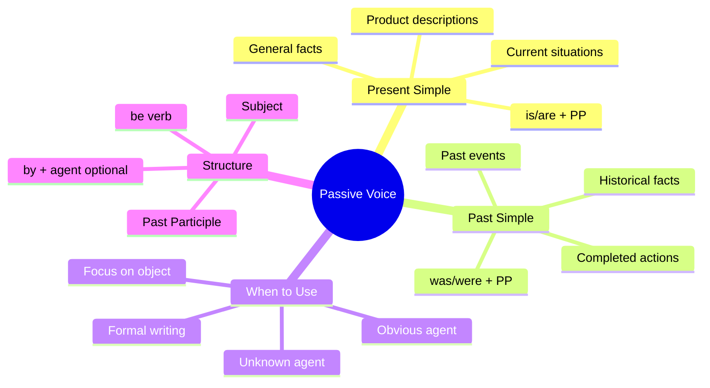

# 🟨 Grammar & Examples: Passive Voice (Present + Past)

## 🎯 Introducción

> [!info]- 💡 ¿Qué es la Voz Pasiva y por qué es importante?
> 
> La **voz pasiva (Passive Voice)** es una estructura gramatical que cambia el enfoque de la oración: en lugar de destacar **quién hace** la acción, enfatiza **qué recibe** la acción o **qué se produce**.
> 
> **Analogía práctica:** Imagina que estás viendo una película. En la voz activa, la cámara sigue al actor (quien hace la acción). En la voz pasiva, la cámara sigue al objeto (lo que recibe la acción).
> 
> **¿Por qué usar la pasiva?**
> 
> |Razón|Ejemplo|Cuándo usarla|
> |---|---|---|
> |**El "quién" no importa**|Coffee is grown in Colombia|Información general|
> |**El "quién" es obvio**|The thief was arrested|Se entiende que fue la policía|
> |**Enfoque en el producto**|iPhones are made in China|Descripciones de productos|
> |**Tono formal/científico**|The experiment was conducted|Reportes, instrucciones|
> |**El "quién" es desconocido**|My bike was stolen|No sabemos quién lo hizo|
> 
> **Comparación visual:**
> 
> ```mermaid
> graph LR
>     A[Active Voice] --> B[Subject<br/>WHO does it]
>     B --> C[Verb]
>     C --> D[Object<br/>WHAT receives]
>     
>     E[Passive Voice] --> F[Subject<br/>WHAT receives]
>     F --> G[be + past participle]
>     G --> H[by + agent<br/>optional]
>     
>     style A fill:#ffe1e1
>     style E fill:#e1ffe1
> ```

---

## ✅ A. Passive Voice - Simple Present

> [!example]- 📘 Estructura y Formación
> 
> **Fórmula básica:**
> 
> ```
> Subject + am/is/are + past participle (+ by + agent)
> ```
> 
> **Tabla de conjugación:**
> 
> |Subject|be|Past Participle|Example|
> |---|---|---|---|
> |I|am|made/produced/grown|I am invited to the party|
> |You|are|made/produced/grown|You are asked to help|
> |He/She/It|is|made/produced/grown|It is made in Italy|
> |We|are|made/produced/grown|We are told the truth|
> |They|are|made/produced/grown|They are exported worldwide|
> 
> **Proceso de transformación:**
> 
> ```mermaid
> flowchart LR
>     A[Active:<br/>They make shoes] --> B[Identify object:<br/>shoes]
>     B --> C[Move to front:<br/>Shoes...]
>     C --> D[Add be:<br/>Shoes are...]
>     D --> E[Past participle:<br/>Shoes are made]
>     E --> F[Optional by:<br/>Shoes are made<br/>by them]
>     
>     style A fill:#ffe1e1
>     style E fill:#e1ffe1
>     style F fill:#fff4e1
> ```
> 
> **Ejemplos con vocabulario de Unit 10:**
> 
> |Active Voice|Passive Voice|
> |---|---|
> |They **grow** coffee in Colombia|Coffee **is grown** in Colombia|
> |They **produce** electronics in China|Electronics **are produced** in China|
> |Workers **pick** the apples|The apples **are picked**|
> |The company **exports** bananas|Bananas **are exported**|
> |They **manufacture** cars in Germany|Cars **are manufactured** in Germany|
> |People **make** this bag of leather|This bag **is made** of leather|
> 
> **Patrones comunes con productos:**
> 
> ```
> ✅ This phone is made in Korea.
> ✅ These shoes are made of leather.
> ✅ Coffee is grown in many countries.
> ✅ Electronics are manufactured in Asia.
> ✅ The products are shipped worldwide.
> ✅ Bananas are exported to Europe.
> ```

> [!note]- 🔍 Cuándo OMITIR "by + agent"
> 
> **Casos donde NO usamos "by":**
> 
> |Situación|Ejemplo|Razón|
> |---|---|---|
> |**Es obvio**|The thief was arrested|(por la policía - obvio)|
> |**No importa**|Coffee is grown in Colombia|(por agricultores - no relevante)|
> |**Es genérico**|English is spoken here|(por la gente - general)|
> |**Desconocido**|My wallet was stolen|(no sabemos quién)|
> 
> **Casos donde SÍ usamos "by":**
> 
> |Situación|Ejemplo|Razón|
> |---|---|---|
> |**Información importante**|This song was written **by Beatles**|El autor es relevante|
> |**Persona famosa**|The iPhone was designed **by Steve Jobs**|Enfatizar el creador|
> |**Contraste**|This is made **by hand**, not by machine|Distinguir métodos|
> 
> ```mermaid
> graph TD
>     A{¿Usar BY?} --> B{¿Es importante<br/>QUIÉN lo hizo?}
>     B -->|Sí| C[✅ USE by + agent]
>     B -->|No| D[❌ OMIT by + agent]
>     
>     C --> E[This book was written<br/>by García Márquez]
>     D --> F[Coffee is grown<br/>in Colombia]
>     
>     style C fill:#e1ffe1
>     style D fill:#ffe1e1
> ```

> [!success]- 🎨 Negative & Questions
> 
> **Forma negativa:**
> 
> ```
> Subject + am/is/are + NOT + past participle
> ```
> 
> |Affirmative|Negative|
> |---|---|
> |Coffee is grown here|Coffee **is not (isn't) grown** here|
> |These products are made in China|These products **are not (aren't) made** in China|
> |The goods are exported|The goods **are not (aren't) exported**|
> 
> **Preguntas:**
> 
> ```
> Am/Is/Are + subject + past participle?
> ```
> 
> |Question|Short Answer|
> |---|---|
> |**Is** coffee **grown** in Ecuador?|Yes, it is. / No, it isn't.|
> |**Are** these shoes **made** of leather?|Yes, they are. / No, they aren't.|
> |**Is** this product **manufactured** locally?|Yes, it is. / No, it isn't.|
> 
> **Wh- Questions:**
> 
> ```
> Wh- word + am/is/are + subject + past participle?
> ```
> 
> ```
> ✅ Where is coffee grown?
>    → Coffee is grown in Colombia, Brazil, and Ethiopia.
> 
> ✅ What are these bags made of?
>    → They are made of leather.
> 
> ✅ How are the products transported?
>    → They are transported by ship.
> 
> ✅ When are the goods delivered?
>    → They are delivered within 5 days.
> ```

---

## 🕐 B. Passive Voice - Simple Past

> [!example]- 📕 Estructura y Formación
> 
> **Fórmula básica:**
> 
> ```
> Subject + was/were + past participle (+ by + agent)
> ```
> 
> **Tabla de conjugación:**
> 
> |Subject|be|Past Participle|Example|
> |---|---|---|---|
> |I|was|made/produced/shipped|I was invited yesterday|
> |You|were|made/produced/shipped|You were asked to help|
> |He/She/It|was|made/produced/shipped|It was made in 2020|
> |We|were|made/produced/shipped|We were told the news|
> |They|were|made/produced/shipped|They were exported last year|
> 
> **Diferencia temporal:**
> 
> ```mermaid
> graph LR
>     A[Present Passive] --> B[is/are + PP]
>     B --> C[General facts<br/>Current situations]
>     
>     D[Past Passive] --> E[was/were + PP]
>     E --> F[Completed actions<br/>Historical facts]
>     
>     style B fill:#e1ffe1
>     style E fill:#fff4e1
> ```
> 
> **Ejemplos comparativos:**
> 
> |Active Voice (Past)|Passive Voice (Past)|
> |---|---|
> |They **exported** the coffee yesterday|The coffee **was exported** yesterday|
> |Workers **picked** the apples last week|The apples **were picked** last week|
> |The company **manufactured** 1000 units|1000 units **were manufactured**|
> |They **shipped** the products on Monday|The products **were shipped** on Monday|
> |Someone **designed** this phone in 2020|This phone **was designed** in 2020|
> 
> **Marcadores temporales comunes:**
> 
> |Time Expression|Example|
> |---|---|
> |**yesterday**|The package was delivered yesterday|
> |**last week/month/year**|The goods were exported last month|
> |**in 2020**|This model was produced in 2020|
> |**two days ago**|The order was shipped two days ago|
> |**on Monday**|The products were transported on Monday|

> [!tip]- 🔄 Active to Passive Transformation
> 
> **Paso a paso:**
> 
> ```mermaid
> flowchart TD
>     A[Active: They exported<br/>the bananas yesterday] --> B[Step 1: Find object<br/>the bananas]
>     B --> C[Step 2: Move to front<br/>The bananas...]
>     C --> D[Step 3: Change verb<br/>exported → was/were]
>     D --> E[Step 4: Add past participle<br/>The bananas were exported]
>     E --> F[Step 5: Add time<br/>The bananas were<br/>exported yesterday]
>     
>     style A fill:#ffe1e1
>     style E fill:#e1ffe1
>     style F fill:#e1f5ff
> ```
> 
> **Ejemplos detallados:**
> 
> **Example 1:**
> 
> ```
> Active:   They grew the coffee in Colombia.
>           ↓
> Object:   the coffee
>           ↓
> Move:     The coffee...
>           ↓
> Add was:  The coffee was...
>           ↓
> PP:       The coffee was grown...
>           ↓
> Complete: The coffee was grown in Colombia.
> ```
> 
> **Example 2:**
> 
> ```
> Active:   The company manufactured these shoes in Italy.
>           ↓
> Passive:  These shoes were manufactured in Italy.
> ```
> 
> **Example 3:**
> 
> ```
> Active:   Someone stole my bike last night.
>           ↓
> Passive:  My bike was stolen last night.
>           (no "by someone" - desconocido/no relevante)
> ```

> [!success]- 🎨 Negative & Questions (Past)
> 
> **Forma negativa:**
> 
> ```
> Subject + was/were + NOT + past participle
> ```
> 
> |Affirmative|Negative|
> |---|---|
> |The coffee was exported|The coffee **was not (wasn't) exported**|
> |The products were shipped|The products **were not (weren't) shipped**|
> |It was made in China|It **was not (wasn't) made** in China|
> 
> **Preguntas:**
> 
> ```
> Was/Were + subject + past participle?
> ```
> 
> |Question|Short Answer|
> |---|---|
> |**Was** the product **delivered** yesterday?|Yes, it was. / No, it wasn't.|
> |**Were** the goods **exported** last month?|Yes, they were. / No, they weren't.|
> |**Was** this phone **made** in Korea?|Yes, it was. / No, it wasn't.|
> 
> **Wh- Questions:**
> 
> ```
> ✅ Where was this jacket made?
>    → It was made in Vietnam.
> 
> ✅ When were the products shipped?
>    → They were shipped last Tuesday.
> 
> ✅ How was the package delivered?
>    → It was delivered by courier.
> 
> ✅ Why was the order delayed?
>    → It was delayed because of bad weather.
> ```

---

## 🎯 C. Cuándo Usar el Pasivo

> [!note]- 🤔 Razones para Usar Passive Voice
> 
> **1. El agente (quien hace la acción) no es importante**
> 
> ```
> ❌ Active: People speak English in many countries.
> ✅ Passive: English is spoken in many countries.
> 
> ❌ Active: Someone stole my wallet.
> ✅ Passive: My wallet was stolen.
> ```
> 
> **2. El agente es obvio o desconocido**
> 
> ```
> ✅ The thief was arrested. (obviamente por la policía)
> ✅ My car was damaged. (no sabemos por quién)
> ✅ The letter was delivered. (obviamente por el cartero)
> ```
> 
> **3. Queremos enfatizar el objeto/producto**
> 
> ```
> ✅ This phone was designed by Apple. (énfasis en el teléfono)
> ✅ Coffee is grown in over 50 countries. (énfasis en el café)
> ✅ The package was delivered on time. (énfasis en el paquete)
> ```
> 
> **4. Lenguaje formal, científico o técnico**
> 
> ```
> ✅ The experiment was conducted in 2020.
> ✅ The results were analyzed carefully.
> ✅ The products are tested before shipping.
> ```
> 
> **5. Descripciones de productos y procesos**
> 
> ```
> ✅ This jacket is made of waterproof material.
> ✅ Our shoes are manufactured in Italy.
> ✅ The goods are transported by sea.
> ✅ Coffee beans are picked by hand.
> ```
> 
> **Decisión visual:**
> 
> ```mermaid
> graph TD
>     A{¿Qué es más importante?} --> B[WHO does it]
>     A --> C[WHAT receives it]
>     
>     B --> D[Use ACTIVE]
>     C --> E[Use PASSIVE]
>     
>     D --> F[Example:<br/>Steve Jobs designed<br/>the iPhone]
>     E --> G[Example:<br/>The iPhone was<br/>designed in 2007]
>     
>     style D fill:#ffe1e1
>     style E fill:#e1ffe1
> ```

---

## 📋 D. Tabla Active → Passive

> [!quote]- 🔄 Transformaciones Completas
> 
> **Present Simple:**
> 
> |Active|Passive|Notes|
> |---|---|---|
> |They make shoes in Italy|Shoes **are made** in Italy|Omit "they"|
> |People grow coffee here|Coffee **is grown** here|Omit "people"|
> |The company exports bananas|Bananas **are exported**|Omit agent|
> |Workers pick apples in autumn|Apples **are picked** in autumn|Omit "workers"|
> |They manufacture cars in Japan|Cars **are manufactured** in Japan|Omit "they"|
> |Someone delivers packages daily|Packages **are delivered** daily|Omit "someone"|
> 
> **Past Simple:**
> 
> |Active|Passive|Notes|
> |---|---|---|
> |They exported coffee yesterday|Coffee **was exported** yesterday|Omit "they"|
> |Workers picked the apples|The apples **were picked**|Omit "workers"|
> |The company shipped 1000 units|1000 units **were shipped**|Omit agent|
> |Someone designed this in 2020|This **was designed** in 2020|Omit "someone"|
> |They manufactured it in Vietnam|It **was manufactured** in Vietnam|Omit "they"|
> |The courier delivered the package|The package **was delivered**|Omit agent|
> 
> **Con "by" (agente importante):**
> 
> |Active|Passive|Why include "by"|
> |---|---|---|
> |Apple designed this phone|This phone **was designed by Apple**|Famous company|
> |García Márquez wrote this book|This book **was written by García Márquez**|Famous author|
> |My grandmother made this sweater|This sweater **was made by my grandmother**|Personal/emotional|
> |Hand workers pick the coffee|The coffee **is picked by hand**|Important detail|

---

## 💪 E. Mini Ejercicios

> [!tip]- ✏️ Practice Exercises
> 
> **Exercise 1: Transform to Passive (Present)**
> 
> ```
> 1. They grow bananas in Ecuador.
>    → _________________________________________________
> 
> 2. The company manufactures phones in China.
>    → _________________________________________________
> 
> 3. Workers pick coffee beans by hand.
>    → _________________________________________________
> 
> 4. They export wine to many countries.
>    → _________________________________________________
> 
> 5. People make this cheese in France.
>    → _________________________________________________
> ```
> 
> > [!success]- ✅ Answers - Exercise 1
> > 
> > 1. Bananas **are grown** in Ecuador.
> > 2. Phones **are manufactured** in China (by the company).
> > 3. Coffee beans **are picked** by hand.
> > 4. Wine **is exported** to many countries.
> > 5. This cheese **is made** in France.
> 
> ---
> 
> **Exercise 2: Transform to Passive (Past)**
> 
> ```
> 6. They shipped the products yesterday.
>    → _________________________________________________
> 
> 7. Someone stole my bike last night.
>    → _________________________________________________
> 
> 8. The company produced 5000 units last year.
>    → _________________________________________________
> 
> 9. Workers delivered the package on Monday.
>    → _________________________________________________
> 
> 10. Apple designed this phone in 2020.
>    → _________________________________________________
> ```
> 
> > [!success]- ✅ Answers - Exercise 2
> > 
> > 1. The products **were shipped** yesterday.
> > 2. My bike **was stolen** last night.
> > 3. 5000 units **were produced** last year.
> > 4. The package **was delivered** on Monday.
> > 5. This phone **was designed** by Apple in 2020.
> 
> ---
> 
> **Exercise 3: Choose Active or Passive**
> 
> ```
> 11. Coffee ________ (grow) in Colombia.
>    a) grows    b) is grown    c) was grown
> 
> 12. They ________ (export) bananas to Europe last year.
>    a) export    b) exported    c) were exported
> 
> 13. This bag ________ (make) of leather.
>    a) makes    b) is made    c) was made
> 
> 14. The package ________ (deliver) yesterday.
>    a) delivered    b) was delivered    c) is delivered
> 
> 15. People ________ (speak) English here.
>    a) speak    b) are spoken    c) is spoken
> ```
> 
> > [!success]- ✅ Answers - Exercise 3
> > 
> > 1. **b) is grown** (presente, hecho general)
> > 2. **b) exported** (activa, pasado, "they" es el sujeto)
> > 3. **b) is made** (presente, descripción de producto)
> > 4. **b) was delivered** (pasado, ayer)
> > 5. **a) speak** (activa, "people" es el sujeto)
> 
> ---
> 
> **Exercise 4: Complete with the correct passive form**
> 
> ```
> 16. This phone ________ (manufacture) in Korea.
> 17. The products ________ (ship) last week.
> 18. Coffee ________ (grow) in many countries.
> 19. My car ________ (steal) yesterday.
> 20. These shoes ________ (make) of leather.
> 21. The letter ________ (deliver) this morning.
> ```
> 
> > [!success]- ✅ Answers - Exercise 4
> > 
> > 1. **is manufactured** (present - fact)
> > 2. **were shipped** (past - last week)
> > 3. **is grown** (present - general fact)
> > 4. **was stolen** (past - yesterday)
> > 5. **are made** (present - description)
> > 6. **was delivered** (past - this morning)
> 
> ---
> 
> **Exercise 5: Make questions**
> 
> ```
> 22. (where / coffee / grow)
>    → _________________________________________________?
> 
> 23. (this product / make / in China)
>    → _________________________________________________?
> 
> 24. (when / the package / deliver)
>    → _________________________________________________?
> 
> 25. (these shoes / make / of leather)
>    → _________________________________________________?
> ```
> 
> > [!success]- ✅ Answers - Exercise 5
> > 
> > 1. Where **is coffee grown**?
> > 2. **Is this product made** in China?
> > 3. When **was the package delivered**?
> > 4. **Are these shoes made** of leather?

---

## 📊 Visual Summary



---

## 🎓 Key Patterns Summary

> [!quote]- 📝 Essential Patterns to Remember
> 
> **Product Descriptions (Present):**
> 
> ```
> ✅ This [product] is made of [material].
> ✅ [Products] are manufactured in [country].
> ✅ [Product] is produced locally.
> ✅ [Products] are exported to [place].
> ```
> 
> **Past Events:**
> 
> ```
> ✅ The [product] was shipped yesterday.
> ✅ [Products] were delivered last week.
> ✅ This was designed in [year].
> ✅ The order was placed on Monday.
> ```
> 
> **Questions:**
> 
> ```
> ✅ Where is [product] made?
> ✅ What is it made of?
> ✅ When was it delivered?
> ✅ Is it manufactured locally?
> ```

---

## 🔗 Connection to Next Topics

> [!note]- 🌟 Preparing for Functional Language
> 
> **You've mastered the grammar. Now you're ready for:**
> 
> |Current Level|Next Step|Why It Matters|
> |---|---|---|
> |**Grammar structures**|Functional Language|Use it in real conversations|
> |**Passive forms**|Product descriptions|Sound natural and professional|
> |**Transformations**|Speaking practice|Apply grammar fluently|
> 
> ```mermaid
> graph LR
>     A[Vocabulary:<br/>Materials] --> B[Grammar:<br/>Passive Voice]
>     B --> C[Functional Language:<br/>Real Descriptions]
>     C --> D[Speaking:<br/>Natural Use]
>     
>     style A fill:#e1ffe1
>     style B fill:#fff4e1
>     style C fill:#e1f5ff
>     style D fill:#ffe1e1
> ```

---

**Tags:** #english #grammar #passivevoice #present #past #unit10 #transformations #exercises