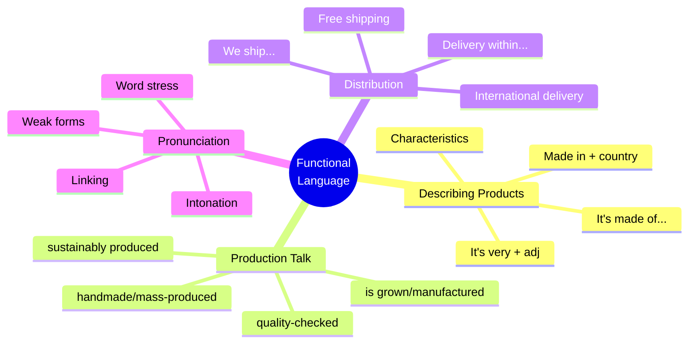

# 🟩 Functional Language & Pronunciation

## 🎯 Introducción

> [!info]- 💡 ¿Qué es el Functional Language?
> 
> El **Functional Language** (lenguaje funcional) son las frases y expresiones que usamos para cumplir funciones comunicativas específicas en la vida real. No se trata solo de gramática correcta, sino de **sonar natural y apropiado** en diferentes situaciones.
> 
> **Analogía práctica:** Si la gramática es como conocer las piezas de un rompecabezas, el functional language es saber cómo armar el rompecabezas completo para crear una imagen clara y natural.
> 
> **¿Por qué es importante?**
> 
> |Aspecto|Con Functional Language|Sin Functional Language|
> |---|---|---|
> |**Naturalidad**|"It's made of leather"|"Leather is the material"|
> |**Fluidez**|"It's very durable"|"The durability is high"|
> |**Profesionalismo**|"We ship worldwide"|"Our shipping is to all world"|
> |**Confianza**|Sonar como nativo|Sonar traducido del español|
> 
> **Funciones comunicativas en Unit 10:**
> 
> ```mermaid
> mindmap
>   root((Functional<br/>Language))
>     Describing Products
>       Materials
>       Characteristics
>       Origin
>     Talking about Production
>       Where it's made
>       How it's produced
>       Quality details
>     Discussing Distribution
>       Shipping methods
>       Delivery times
>       International trade
>     Making Recommendations
>       Why buy it
>       What makes it special
>       Value for money
> ```

---

## 🛍️ A. Describing Products

> [!example]- 📦 Frases para Describir Materiales
> 
> **Patrón básico: "It's made of..."**
> 
> |Pattern|Example|Usage Note|
> |---|---|---|
> |**It's made of** + material|It's made of cotton|Más común|
> |**It's made from** + material|It's made from recycled plastic|Transformación química|
> |**It's 100%** + material|It's 100% pure wool|Énfasis en pureza|
> |**Made with** + material|Made with natural materials|Ingredientes/componentes|
> 
> **Diferencia importante: OF vs FROM**
> 
> ```mermaid
> graph TD
>     A{Material Change?} --> B[No visible change]
>     A --> C[Transformed/processed]
>     
>     B --> D[Use MADE OF]
>     C --> E[Use MADE FROM]
>     
>     D --> F[Example:<br/>This table is made<br/>of wood]
>     E --> G[Example:<br/>Paper is made<br/>from wood]
>     
>     style D fill:#e1ffe1
>     style E fill:#fff4e1
> ```
> 
> **Ejemplos prácticos:**
> 
> ```
> Made OF (material visible):
> ✅ This jacket is made of leather.
> ✅ The bottle is made of glass.
> ✅ My bag is made of cotton.
> ✅ The chair is made of wood.
> 
> Made FROM (material transformed):
> ✅ Wine is made from grapes.
> ✅ Paper is made from wood pulp.
> ✅ This plastic is made from recycled bottles.
> ✅ Cheese is made from milk.
> ```
> 
> **Frases extendidas para descripciones completas:**
> 
> |Pattern|Example|
> |---|---|
> |It's made of + material + and + characteristic|It's made of cotton and it's very soft|
> |This [product] is made of + material. It's + adj + and + adj|This backpack is made of polyester. It's light and waterproof|
> |It's + % + material, so it's + characteristic|It's 100% wool, so it's very warm|
> |Made of + material + with + detail|Made of leather with metal details|

> [!success]- 🎨 Describing Characteristics
> 
> **Frases para características físicas:**
> 
> |Function|Phrases|Examples|
> |---|---|---|
> |**Peso**|It's very light / heavy|It's very light, easy to carry|
> |**Textura**|It's soft / hard / smooth|It's soft and comfortable|
> |**Resistencia**|It's strong / durable / fragile|It's very durable and long-lasting|
> |**Temperatura**|It's warm / cool / breathable|It's warm but breathable|
> |**Agua**|It's waterproof / water-resistant|It's completely waterproof|
> 
> **Patrones de intensificación:**
> 
> ```
> Very + adjective:
> ✅ It's very strong
> ✅ It's very light
> ✅ It's very durable
> 
> Really + adjective:
> ✅ It's really comfortable
> ✅ It's really soft
> ✅ It's really well-made
> 
> Extremely + adjective:
> ✅ It's extremely durable
> ✅ It's extremely lightweight
> ✅ It's extremely waterproof
> 
> Quite + adjective (British = very / American = somewhat):
> ✅ It's quite heavy (UK = very heavy)
> ✅ It's quite expensive
> ```
> 
> **Combinaciones naturales (collocations):**
> 
> |Collocation|Example|
> |---|---|
> |**very + positive adj**|very comfortable, very durable, very strong|
> |**extremely + positive adj**|extremely lightweight, extremely waterproof|
> |**quite + neutral/negative adj**|quite heavy, quite expensive, quite fragile|
> |**a bit + negative adj**|a bit heavy, a bit rough, a bit stiff|
> 
> **Estructura de descripción completa:**
> 
> ```mermaid
> flowchart LR
>     A[Material] --> B[Main<br/>Characteristic]
>     B --> C[Additional<br/>Characteristic]
>     C --> D[Benefit]
>     
>     A -.-> E["It's made of cotton"]
>     B -.-> F["It's very soft"]
>     C -.-> G["and breathable"]
>     D -.-> H["so it's perfect<br/>for summer"]
>     
>     style E fill:#e1ffe1
>     style F fill:#fff4e1
>     style G fill:#e1f5ff
>     style H fill:#ffe1e1
> ```
> 
> **Ejemplos de descripciones completas:**
> 
> ```
> ✅ This jacket is made of waterproof polyester. 
>    It's very light and durable, so it's perfect for hiking.
> 
> ✅ The bag is made of genuine leather. 
>    It's strong and stylish, and it gets better with age.
> 
> ✅ This sweater is made of 100% merino wool. 
>    It's extremely soft and warm, but also breathable.
> 
> ✅ The bottle is made of stainless steel. 
>    It's very durable and keeps drinks cold for 24 hours.
> ```

> [!tip]- 🌍 Describing Origin & Production
> 
> **Frases para el origen:**
> 
> |Pattern|Example|When to Use|
> |---|---|---|
> |**It's made in** + country|It's made in Italy|Manufacturing location|
> |**It's produced in** + country|It's produced in Vietnam|General production|
> |**It's from** + country|It's from France|Origin/source|
> |**It comes from** + country|It comes from Japan|Source/origin|
> 
> **Frases para el proceso:**
> 
> ```
> Production method:
> ✅ It's handmade
> ✅ It's hand-crafted
> ✅ It's mass-produced
> ✅ It's manufactured locally
> ✅ It's produced using traditional methods
> ✅ It's made by skilled craftsmen
> 
> Quality assurance:
> ✅ It's carefully tested
> ✅ It's quality-checked before shipping
> ✅ Each item is inspected individually
> ✅ It meets international standards
> ```
> 
> **Combinando origen y calidad:**
> 
> |Pattern|Example|
> |---|---|
> |Made in + country, known for + quality|Made in Switzerland, known for precision|
> |Produced in + country + using + method|Produced in Italy using traditional methods|
> |Handmade in + country + by + artisan|Handmade in Peru by local artisans|
> 
> **Ejemplos contextualizados:**
> 
> ```
> ✅ This watch is made in Switzerland. 
>    Swiss watches are known for their precision and quality.
> 
> ✅ Our coffee is grown in Colombia and roasted locally. 
>    It's produced using sustainable farming methods.
> 
> ✅ These shoes are handmade in Italy by skilled craftsmen. 
>    Each pair takes over 200 steps to complete.
> 
> ✅ The chocolate is made in Belgium using traditional recipes. 
>    It's been produced the same way for over 100 years.
> ```

---

## 🏭 B. Talking about Production

> [!note]- 🔨 Production Process Language
> 
> **Passive voice en contexto (lo más común):**
> 
> |Function|Phrase|Example|
> |---|---|---|
> |**General process**|is/are + past participle|Coffee is grown in Colombia|
> |**Location**|is/are + PP + in + place|It's manufactured in China|
> |**Method**|is/are + PP + by + method|It's picked by hand|
> |**Quality**|is/are + carefully + PP|It's carefully selected|
> 
> **Secuencia de producción:**
> 
> ```mermaid
> flowchart LR
>     A[Raw Material] --> B[is grown/<br/>harvested]
>     B --> C[is processed/<br/>manufactured]
>     C --> D[is tested/<br/>inspected]
>     D --> E[is packaged]
>     E --> F[is shipped]
>     
>     style A fill:#fff4e1
>     style C fill:#e1ffe1
>     style F fill:#e1f5ff
> ```
> 
> **Frases para cada etapa:**
> 
> ```
> Growing/Harvesting:
> ✅ The coffee is grown at high altitudes
> ✅ The grapes are harvested in autumn
> ✅ The cotton is picked by hand
> ✅ The tea is grown organically
> 
> Processing/Manufacturing:
> ✅ The beans are roasted to perfection
> ✅ The leather is treated and dyed
> ✅ The products are manufactured locally
> ✅ Each item is crafted with care
> 
> Quality Control:
> ✅ It's tested for quality
> ✅ Each unit is inspected
> ✅ It's checked before shipping
> ✅ Only the best are selected
> 
> Packaging/Shipping:
> ✅ It's packaged in eco-friendly materials
> ✅ It's shipped within 24 hours
> ✅ Products are delivered worldwide
> ✅ It's transported by sea
> ```

> [!success]- 🌱 Sustainability & Quality Language
> 
> **Frases sobre sostenibilidad:**
> 
> |Category|Phrases|
> |---|---|
> |**Eco-friendly**|environmentally friendly, eco-friendly, sustainable|
> |**Materials**|recycled, organic, natural, biodegradable|
> |**Production**|ethically made, fair trade, locally sourced|
> |**Impact**|carbon-neutral, zero-waste, renewable|
> 
> **Patrones comunes:**
> 
> ```
> ✅ It's made from recycled materials
> ✅ It's produced using renewable energy
> ✅ It's ethically sourced and fair trade certified
> ✅ We use only sustainable materials
> ✅ It's biodegradable and eco-friendly
> ✅ Our production is carbon-neutral
> ✅ We support local communities
> ✅ It's organic and pesticide-free
> ```
> 
> **Frases sobre calidad:**
> 
> ```
> High quality:
> ✅ It's high-quality
> ✅ It's premium quality
> ✅ It's top-quality
> ✅ It's made to last
> 
> Durability:
> ✅ It's built to last
> ✅ It's extremely durable
> ✅ It won't wear out easily
> ✅ It's long-lasting
> 
> Craftsmanship:
> ✅ It's expertly crafted
> ✅ It's carefully made
> ✅ It shows great attention to detail
> ✅ It's precision-engineered
> ```

---

## 🚚 C. Discussing Distribution

> [!example]- 📦 Shipping & Delivery Language
> 
> **Frases sobre envío:**
> 
> |Function|Phrases|Examples|
> |---|---|---|
> |**Availability**|We ship...|We ship worldwide / to over 100 countries|
> |**Speed**|Delivery within...|Delivery within 3-5 business days|
> |**Cost**|Free shipping...|Free shipping on orders over $50|
> |**Method**|Shipped by...|Shipped by air / sea / express courier|
> 
> **Patrones de tiempo de entrega:**
> 
> ```
> ✅ We deliver within 24 hours
> ✅ Delivery takes 3-5 business days
> ✅ It arrives in 1-2 weeks
> ✅ Same-day delivery available
> ✅ Express shipping: 2-3 days
> ✅ Standard shipping: 5-7 days
> ✅ International delivery: 7-14 days
> ```
> 
> **Frases sobre costo y políticas:**
> 
> ```
> Free shipping:
> ✅ Free shipping on all orders
> ✅ Free delivery over $50
> ✅ Shipping is always free
> ✅ No shipping charges
> 
> Paid shipping:
> ✅ Shipping costs $5
> ✅ Delivery fee: $10
> ✅ Express shipping available for $15
> 
> Returns:
> ✅ Free returns within 30 days
> ✅ Easy returns policy
> ✅ No-questions-asked returns
> ✅ Full refund if not satisfied
> ```
> 
> **Diálogos típicos:**
> 
> ```
> Customer: How long does delivery take?
> Shop: We deliver within 3-5 business days. 
>       Express shipping is also available.
> 
> Customer: Do you ship internationally?
> Shop: Yes, we ship worldwide. 
>       International delivery takes 7-14 days.
> 
> Customer: Is shipping free?
> Shop: Yes, shipping is free on orders over $50. 
>       Otherwise, it's $5.
> ```

> [!tip]- 🌍 Import/Export Language
> 
> **Frases sobre comercio internacional:**
> 
> |Function|Pattern|Example|
> |---|---|---|
> |**Exportar**|We export + product + to + place|We export coffee to Europe|
> |**Importar**|We import + product + from + place|We import electronics from Asia|
> |**Origen**|+ product + comes from + place|Our leather comes from Argentina|
> |**Destino**|shipped to + place|Shipped to over 50 countries|
> 
> **Vocabulario de negocios:**
> 
> ```
> Trade terminology:
> ✅ We're a leading exporter of...
> ✅ We import high-quality...
> ✅ Our main export market is...
> ✅ We source materials from...
> ✅ Products are shipped globally
> ✅ We have international distribution
> 
> Volume & Scale:
> ✅ We export thousands of units monthly
> ✅ We ship to over 100 countries
> ✅ Our products are sold worldwide
> ✅ We have distributors in 50+ countries
> ```
> 
> **Ejemplos en contexto empresarial:**
> 
> ```
> ✅ We're one of the largest exporters of bananas in Latin America. 
>    We ship to Europe, North America, and Asia.
> 
> ✅ Our company imports premium coffee beans from Colombia 
>    and Ethiopia, then roasts them locally.
> 
> ✅ The leather is sourced from Argentina, 
>    manufactured in Italy, and sold worldwide.
> 
> ✅ We export organic cocoa to chocolate makers in Belgium, 
>    Switzerland, and France.
> ```

---

## 🗣️ D. Pronunciation Tips

> [!note]- 🔊 Key Pronunciation Patterns
> 
> **1. Word Stress - Palabras clave de Unit 10**
> 
> |Word|Syllables|Stress|Pronunciation|
> |---|---|---|---|
> |**manufacture**|man-u-fac-ture|3rd|/ˌmæn.jəˈfæk.tʃər/|
> |**material**|ma-te-ri-al|2nd|/məˈtɪə.ri.əl/|
> |**polyester**|pol-y-es-ter|3rd|/ˌpɒl.iˈes.tər/|
> |**waterproof**|wa-ter-proof|1st|/ˈwɔː.tə.pruːf/|
> |**distribute**|dis-trib-ute|2nd|/dɪˈstrɪb.juːt/|
> |**delivery**|de-liv-er-y|2nd|/dɪˈlɪv.ər.i/|
> 
> **Regla general: palabras de 3+ sílabas**
> 
> ```mermaid
> graph TD
>     A[Long words] --> B[Find stressed syllable]
>     B --> C[Say it LOUDER]
>     B --> D[Say it LONGER]
>     B --> E[Say it HIGHER pitch]
>     
>     C --> F[man-u-FAC-ture]
>     D --> F
>     E --> F
>     
>     style B fill:#e1ffe1
>     style F fill:#fff4e1
> ```
> 
> **Práctica con tapping (golpear la mesa):**
> 
> ```
> Tap on stressed syllable:
> 
> ma-TE-ri-al        (tap on TE)
> man-u-FAC-ture     (tap on FAC)
> pol-y-ES-ter       (tap on ES)
> dis-TRIB-ute       (tap on TRIB)
> de-LIV-er-y        (tap on LIV)
> ```

> [!success]- 🔗 Linking & Connected Speech
> 
> **Linking en frases comunes:**
> 
> |Written|How we say it|Linking Type|
> |---|---|---|
> |made **of**|/meɪ**dəv**/|Consonant + vowel|
> |it **is**|/ɪ**tɪz**/|Consonant + vowel|
> |shipped **to**|/ʃɪp**tə**/|Consonant + vowel|
> |pick **up**|/pɪ**kʌp**/|Consonant + vowel|
> |made **in**|/meɪ**dɪn**/|Consonant + vowel|
> 
> **Patrón: Consonant to Vowel Linking**
> 
> ```
> When a word ends in a consonant and the next starts with a vowel,
> LINK them together:
> 
> ✅ made_of → /meɪdəv/
> ✅ it_is → /ɪtɪz/
> ✅ made_in → /meɪdɪn/
> ✅ shipped_to → /ʃɪptə/
> ✅ pick_apples → /pɪkæplz/
> ```
> 
> **Weak forms (palabras débiles):**
> 
> |Strong Form|Weak Form|In Sentence|
> |---|---|---|
> |**of** /ɒv/|**/əv/**|made **/əv/** cotton|
> |**to** /tuː/|**/tə/**|shipped **/tə/** Europe|
> |**is** /ɪz/|**/z/**|it**/z/** made|
> |**are** /ɑː/|**/ə/**|they**/ə/** shipped|
> |**and** /ænd/|**/ənd/** or **/ən/**|soft **/ən/** warm|
> 
> **Ejemplos de frases naturales:**
> 
> ```
> Written:    It is made of cotton
> Natural:    /ɪtɪz meɪdəv kɒtn/
> 
> Written:    They are shipped to Europe
> Natural:    /ðeɪə ʃɪptə jʊərəp/
> 
> Written:    It is very durable and strong
> Natural:    /ɪtsˈveri djʊərəblənd strɒŋ/
> ```

> [!tip]- 🎯 Intonation Patterns
> 
> **Describing products (falling intonation):**
> 
> ```
> It's made of cotton. ↘
> It's very durable. ↘
> It's shipped worldwide. ↘
> It's produced in Italy. ↘
> ```
> 
> **Yes/No questions (rising intonation):**
> 
> ```
> Is it made of leather? ↗
> Is it waterproof? ↗
> Do you ship internationally? ↗
> Is shipping free? ↗
> ```
> 
> **Wh- questions (falling intonation):**
> 
> ```
> Where is it made? ↘
> What is it made of? ↘
> How long does delivery take? ↘
> When will it arrive? ↘
> ```
> 
> **Lists (rise until last item):**
> 
> ```
> It's soft, ↗ warm, ↗ and durable. ↘
> We ship to Europe, ↗ Asia, ↗ and America. ↘
> It's made of cotton, ↗ polyester, ↗ and wool. ↘
> ```
> 
> **Visualización:**
> 
> ```mermaid
> graph LR
>     A[Statements] --> B[↘ Falling]
>     C[Yes/No Questions] --> D[↗ Rising]
>     E[Wh- Questions] --> F[↘ Falling]
>     G[Lists] --> H[↗ ↗ ↘]
>     
>     style B fill:#e1ffe1
>     style D fill:#fff4e1
>     style F fill:#e1ffe1
>     style H fill:#e1f5ff
> ```

---

## 💬 E. Mini Speaking Drills

> [!example]- 🎤 Práctica Oral Guiada
> 
> **Drill 1: Describe un objeto cerca de ti**
> 
> ```
> Choose an object and complete:
> 
> 1. This [object] is made of _________.
> 2. It's very _________ and _________.
> 3. It's made in _________.
> 4. I use it for _________.
> 
> Example:
> 1. This phone is made of metal and glass.
> 2. It's very light and durable.
> 3. It's made in China.
> 4. I use it for communication and work.
> ```
> 
> > [!success]- ✅ Suggested Objects to Practice
> > 
> > **Easy objects:**
> > 
> > - Your phone
> > - Your shoes
> > - Your bag/backpack
> > - A water bottle
> > - A piece of clothing
> > 
> > **Practice sentences:**
> > 
> > ```
> > Phone: This phone is made of aluminum and glass. 
> >        It's very sleek and powerful. 
> >        It's manufactured in China.
> > 
> > Shoes: These shoes are made of leather. 
> >        They're very comfortable and durable. 
> >        They're made in Italy.
> > 
> > Bottle: This bottle is made of stainless steel. 
> >         It's very light and keeps drinks cold. 
> >         It's produced locally.
> > ```
> 
> ---
> 
> **Drill 2: Role-play - Customer & Salesperson**
> 
> ```
> Customer asks about:
> - Material
> - Origin
> - Shipping
> - Price
> 
> Salesperson responds naturally.
> ```
> 
> > [!success]- ✅ Sample Dialogue
> > 
> > ```
> > C: What is this jacket made of?
> > S: It's made of waterproof polyester with a fleece lining.
> > 
> > C: Where is it made?
> > S: It's manufactured in Vietnam using sustainable methods.
> > 
> > C: How long does delivery take?
> > S: We deliver within 3-5 business days. 
> >    Express shipping is also available.
> > 
> > C: Is shipping free?
> > S: Yes, shipping is free on all orders over $75.
> > 
> > C: What makes this jacket special?
> > S: It's extremely durable and lightweight, 
> >    perfect for outdoor activities. 
> >    Plus, it's made from recycled materials.
> > ```
> 
> ---
> 
> **Drill 3: Product Comparison**
> 
> ```
> Compare two similar products using:
> - made of
> - characteristics
> - price/value
> - recommendation
> ```
> 
> > [!success]- ✅ Comparison Model
> > 
> > ```
> > Product A vs Product B:
> > 
> > This bag (A) is made of genuine leather. 
> > It's very durable but quite expensive. 
> > It's handmade in Italy.
> > 
> > This bag (B) is made of synthetic leather. 
> > It's lighter and more affordable. 
> > It's mass-produced in China.
> > 
> > Recommendation:
> > If you want quality and don't mind the price, 
> > choose Product A. 
> > 
> > If you want good value for money, 
> > Product B is a great choice.
> > ```

---

## 📊 Visual Summary - Functional Language



---

## 🔗 Connection to Next Topics

> [!quote]- 🌟 Preparing for Real Communication
> 
> **You've mastered functional language. Now you're ready for:**
> 
> |Current Level|Next Step|Why It Matters|
> |---|---|---|
> |**Functional phrases**|Reading & Writing|Understand authentic texts|
> |**Natural expressions**|Speaking practice|Real conversations|
> |**Pronunciation**|Fluency|Sound confident|
> 
> ```mermaid
> graph LR
>     A[Vocabulary] --> B[Grammar]
>     B --> C[Functional<br/>Language]
>     C --> D[Real Use:<br/>Reading/Writing/<br/>Speaking]
>     
>     style A fill:#e1ffe1
>     style B fill:#fff4e1
>     style C fill:#e1f5ff
>     style D fill:#ffe1e1
> ```
> 
> **Next: Apply everything in authentic contexts!**

---

**Tags:** #english #functional-language #pronunciation #speaking #unit10 #natural-english #intonation #linking