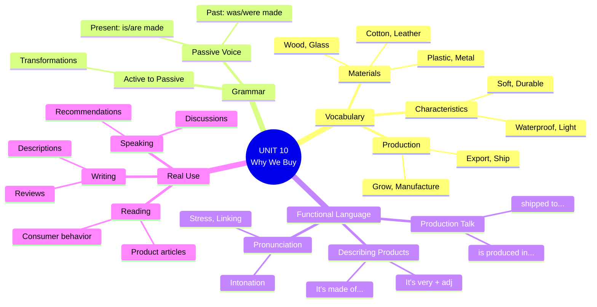

# 🟥 Reading / Writing / Speaking: Why We Buy

## 🎯 Introducción

> [!info]- 💡 Integrating All Skills
> 
> Esta sección integra todo lo aprendido en la unidad para desarrollar habilidades comunicativas completas en contextos reales sobre **consumo, productos y decisiones de compra**.
> 
> **¿Por qué estudiamos "Why We Buy"?**
> 
> |Aspecto|Relevancia|Aplicación Real|
> |---|---|---|
> |**Critical thinking**|Analizar decisiones de compra|Ser consumidor consciente|
> |**Real-world English**|Vocabulario de marketing y consumo|Entender publicidad y reseñas|
> |**Cultural awareness**|Diferentes hábitos de consumo|Comunicación internacional|
> |**Practical skills**|Describir y recomendar productos|Shopping, negocios, reviews|
> 
> **Conexión con habilidades previas:**
> 
> ```mermaid
> graph TD
>     A[Vocabulary:<br/>Materials &<br/>Production] --> D[Reading:<br/>Articles about<br/>consumer behavior]
>     
>     B[Grammar:<br/>Passive Voice] --> E[Writing:<br/>Product<br/>descriptions]
>     
>     C[Functional<br/>Language] --> F[Speaking:<br/>Discussions &<br/>recommendations]
>     
>     D --> G[Complete<br/>Communication]
>     E --> G
>     F --> G
>     
>     style A fill:#e1ffe1
>     style B fill:#fff4e1
>     style C fill:#e1f5ff
>     style G fill:#ffe1e1
> ```

---

## 📖 A. Reading: Understanding Consumer Behavior

> [!example]- 📰 Reading Text: "Why We Buy What We Buy"
> 
> **Sample Reading Text:**
> 
> ---
> 
> ### Why We Buy What We Buy
> 
> Every day, millions of products are bought and sold around the world. But what makes us choose one product over another? Understanding consumer behavior is key to answering this question.
> 
> **Quality vs. Price**
> 
> Many people believe that price is the most important factor when shopping. However, recent studies show that quality often matters more than cost. Products that are made of high-quality materials and are manufactured with care tend to last longer, which means better value for money in the long run.
> 
> For example, a leather jacket that is handmade in Italy might cost $500, while a similar jacket made of synthetic materials and mass-produced in a factory might cost only $50. The expensive jacket is made to last for decades, while the cheap one might need replacing after just one year.
> 
> **Brand Loyalty**
> 
> Brand names also play a huge role in our purchasing decisions. Many consumers are willing to pay more for products that are manufactured by well-known companies. This is because brands create trust. When a product is made by a trusted brand, customers feel confident about the quality.
> 
> Apple is a perfect example. iPhones are more expensive than many other smartphones, yet they are bought by millions of people worldwide. Why? The products are designed with attention to detail, they're user-friendly, and the brand has built a reputation for innovation and quality.
> 
> **Sustainability Matters**
> 
> Modern consumers, especially younger generations, care deeply about where and how products are made. They want to know: Is it produced sustainably? Are workers treated fairly? Is the company environmentally responsible?
> 
> Products that are made from recycled materials or that are certified as fair trade are increasingly popular. Coffee that is grown organically and exported directly from small farmers is often chosen over mass-produced brands, even if it costs more.
> 
> **The Power of Marketing**
> 
> Finally, we can't ignore the influence of advertising. Products are marketed in ways that appeal to our emotions. Beautiful packaging, celebrity endorsements, and clever slogans all affect our choices. Sometimes we buy things not because we need them, but because we're convinced we want them.
> 
> **Conclusion**
> 
> So why do we buy what we buy? It's a combination of quality, brand trust, personal values, and marketing influence. Understanding these factors can help us become smarter, more conscious consumers.
> 
> ---

> [!note]- 🔍 Reading Comprehension Questions
> 
> **Level 1: Basic Understanding**
> 
> ```
> 1. What do recent studies show about price and quality?
>    _________________________________________________
> 
> 2. How much does the handmade Italian leather jacket cost?
>    _________________________________________________
> 
> 3. Give one example of a well-known brand mentioned in the text.
>    _________________________________________________
> 
> 4. What do modern consumers care about?
>    _________________________________________________
> ```
> 
> > [!success]- ✅ Answers - Level 1
> > 
> > 1. Recent studies show that **quality often matters more than price/cost**.
> >     
> > 2. The handmade Italian leather jacket costs **$500**.
> >     
> > 3. **Apple** (iPhones are mentioned as an example).
> >     
> > 4. Modern consumers care about **where and how products are made / sustainability / fair treatment of workers / environmental responsibility**.
> >     
> 
> ---
> 
> **Level 2: Inference & Analysis**
> 
> ```
> 1. Why might the expensive leather jacket be "better value 
>    for money in the long run"?
>    _________________________________________________
> 
> 2. According to the text, why do people trust brand names?
>    _________________________________________________
> 
> 3. What does "fair trade certified" probably mean?
>    _________________________________________________
> 
> 4. How does marketing influence our buying decisions?
>    _________________________________________________
> ```
> 
> > [!success]- ✅ Answers - Level 2
> > 
> > 1. Because **it lasts for decades while the cheap one needs replacing after one year** / **it's more durable so you don't need to buy another one**.
> >     
> > 2. Because **brands create trust** / **when a product is made by a trusted brand, customers feel confident about the quality**.
> >     
> > 3. It probably means **workers are treated fairly** / **the product is ethically produced** / **farmers get fair prices**.
> >     
> > 4. Marketing **appeals to our emotions** / uses **beautiful packaging, celebrity endorsements, and clever slogans** / **convinces us we want things we don't necessarily need**.
> >     
> 
> ---
> 
> **Level 3: Critical Thinking**
> 
> ```
> 1. Do you agree that "quality often matters more than cost"? 
>    Why or why not?
>    _________________________________________________
> 
> 2. The text mentions that we sometimes buy things because 
>    "we're convinced we want them." Can you think of an 
>    example from your own experience?
>    _________________________________________________
> 
> 3. What factors are most important to YOU when buying products?
>    Rank them: quality, price, brand, sustainability, design
>    _________________________________________________
> ```
> 
> > [!success]- ✅ Sample Answers - Level 3
> > 
> > 1. **Personal response examples:**
> >     - "I agree because cheap products break easily and you waste money replacing them."
> >     - "I partially agree. Quality matters for important items like shoes or electronics, but for everyday items, price is more important to me."
> > 2. **Personal response examples:**
> >     - "I bought expensive headphones because of a celebrity endorsement, but I rarely use them."
> >     - "I bought a designer bag because of the beautiful advertising, even though I didn't really need it."
> > 3. **Personal response - sample ranking:**
> >     - 1. Quality, 2. Price, 3. Design, 4. Sustainability, 5. Brand
> >     - (Accept any order with justification)

> [!tip]- 📚 Vocabulary from Reading
> 
> **Key terms to extract:**
> 
> |Word/Phrase|Meaning|Example from Text|
> |---|---|---|
> |**consumer behavior**|how people make buying decisions|Understanding consumer behavior is key|
> |**value for money**|good quality for the price|better value for money in the long run|
> |**brand loyalty**|preference for specific brands|Brand names play a huge role|
> |**mass-produced**|made in large quantities|mass-produced in a factory|
> |**handmade**|made by hand|handmade in Italy|
> |**sustainability**|environmentally responsible|produced sustainably|
> |**fair trade**|ethically traded products|certified as fair trade|
> |**celebrity endorsement**|famous person promoting product|celebrity endorsements|
> 
> **Useful expressions:**
> 
> ```
> ✅ in the long run = over a long period of time
> ✅ play a role = have an influence/effect
> ✅ care deeply about = consider very important
> ✅ appeal to = attract, be attractive to
> ✅ we can't ignore = we must consider
> ✅ a combination of = a mix of several factors
> ```

---

## ✍️ B. Writing: Product Descriptions & Reviews

> [!example]- 📝 Writing Task 1: Product Description
> 
> **Assignment:**
> 
> ```
> Write a product description for an item you own and like.
> Include:
> • What it is
> • What it's made of
> • Where it's made/produced
> • Its characteristics (2-3 adjectives)
> • Why you like it / Why people should buy it
> 
> Length: 80-100 words
> ```
> 
> **Writing Framework:**
> 
> ```mermaid
> flowchart TD
>     A[Introduction:<br/>What is it?] --> B[Material:<br/>What's it made of?]
>     B --> C[Origin:<br/>Where's it made?]
>     C --> D[Characteristics:<br/>Describe it]
>     D --> E[Recommendation:<br/>Why buy it?]
>     
>     style A fill:#e1ffe1
>     style C fill:#fff4e1
>     style E fill:#e1f5ff
> ```
> 
> **Useful phrases for product descriptions:**
> 
> |Function|Phrases|
> |---|---|
> |**Introducing**|This is..., I'd like to describe..., Let me tell you about...|
> |**Material**|It's made of..., It's constructed from..., The material is...|
> |**Origin**|It's made in..., It's produced in..., It comes from...|
> |**Characteristics**|It's very..., It's extremely..., One of the best features is...|
> |**Recommendation**|I highly recommend..., It's perfect for..., It's worth buying because...|
> 
> > [!success]- ✅ Sample Product Description
> > 
> > **Example 1: Backpack**
> > 
> > ```
> > I'd like to describe my favorite backpack. It's made of 
> > waterproof polyester and reinforced with nylon. It's 
> > manufactured in Vietnam using sustainable materials. 
> > This backpack is very durable, lightweight, and has 
> > excellent organization with multiple compartments. 
> > I've used it for three years and it still looks brand new. 
> > It's perfect for students or travelers who need something 
> > reliable and comfortable. I highly recommend it because 
> > it offers great value for money and lasts for years.
> > 
> > (87 words)
> > ```
> > 
> > **Example 2: Coffee Mug**
> > 
> > ```
> > This is my ceramic travel mug. It's made of high-quality 
> > ceramic with a silicone lid and sleeve. It's handmade by 
> > local artisans in my city. The mug is beautiful, durable, 
> > and keeps drinks hot for hours. What I love most is that 
> > each one is unique because it's hand-painted. It's 
> > environmentally friendly because it's reusable and 
> > reduces plastic waste. I recommend it to anyone who 
> > wants a stylish, eco-friendly alternative to disposable cups. 
> > It's definitely worth the investment.
> > 
> > (82 words)
> > ```
> 
> ---
> 
> **Writing Checklist:**
> 
> ```
> ☐ Named the product clearly
> ☐ Described materials (made of...)
> ☐ Mentioned origin/production (made in...)
> ☐ Used 2-3 descriptive adjectives
> ☐ Used passive voice appropriately
> ☐ Explained why it's good/worth buying
> ☐ 80-100 words
> ☐ Checked spelling and grammar
> ```

> [!note]- 📝 Writing Task 2: Product Review
> 
> **Assignment:**
> 
> ```
> Write a product review (like on Amazon or similar sites).
> Include:
> • Star rating (⭐⭐⭐⭐⭐)
> • Product name
> • What you liked
> • What could be improved (if anything)
> • Would you recommend it?
> 
> Length: 100-120 words
> ```
> 
> **Review Structure:**
> 
> ```mermaid
> graph TD
>     A[Star Rating +<br/>Title] --> B[Opening:<br/>Overall impression]
>     B --> C[Positives:<br/>What's good]
>     C --> D[Negatives:<br/>What could improve]
>     D --> E[Conclusion:<br/>Recommendation]
>     
>     style A fill:#e1ffe1
>     style C fill:#ccffcc
>     style D fill:#ffcccc
>     style E fill:#e1f5ff
> ```
> 
> **Useful review language:**
> 
> |Function|Phrases|
> |---|---|
> |**Opening**|I bought this..., I've been using this for..., This product is...|
> |**Positives**|What I love is..., The best feature is..., I'm impressed by...|
> |**Negatives**|The only downside is..., One small issue is..., It could be improved by...|
> |**Recommendation**|I highly recommend..., I'd definitely buy again, Worth every penny|
> 
> > [!success]- ✅ Sample Product Reviews
> > 
> > **Example 1: Positive Review**
> > 
> > ```
> > ⭐⭐⭐⭐⭐ Amazing Quality and Comfort!
> > 
> > I bought these running shoes three months ago and I'm 
> > extremely impressed. They're made of breathable mesh 
> > material and the soles are very durable. They're 
> > manufactured in Vietnam and the quality is excellent. 
> > What I love most is how lightweight and comfortable 
> > they are – perfect for long runs. The only small issue 
> > is that they run slightly small, so I recommend ordering 
> > half a size up. Despite this, they're worth every penny. 
> > I've already recommended them to several friends. 
> > If you're looking for quality running shoes, these are 
> > a great choice!
> > 
> > (104 words)
> > ```
> > 
> > **Example 2: Mixed Review**
> > 
> > ```
> > ⭐⭐⭐⭐ Good Value, But Not Perfect
> > 
> > This laptop is made of aluminum and plastic, and it's 
> > manufactured in China. I've been using it for work for 
> > two months. On the positive side, it's very fast, 
> > lightweight, and has excellent battery life. The screen 
> > quality is also impressive. However, the keyboard could 
> > be better – the keys feel a bit cheap compared to the 
> > rest of the build quality. Also, it gets quite warm when 
> > running multiple programs. Overall, it's good value for 
> > money and I'd recommend it for students or light 
> > professional use, but serious gamers or video editors 
> > might want something more powerful.
> > 
> > (107 words)
> > ```
> 
> ---
> 
> **Review Writing Checklist:**
> 
> ```
> ☐ Included star rating
> ☐ Clear product identification
> ☐ Mentioned materials/production
> ☐ Listed positive features
> ☐ Mentioned any negatives (honest review)
> ☐ Clear recommendation
> ☐ 100-120 words
> ☐ Balanced and fair tone
> ```

---

## 🗣️ C. Speaking: Discussions & Recommendations

> [!example]- 💬 Discussion Topic 1: Shopping Habits
> 
> **Discussion Questions:**
> 
> ```
> 1. Do you usually buy products based on price or quality?
> 
> 2. How important are brand names to you? Why?
> 
> 3. Do you research products online before buying them?
> 
> 4. Have you ever bought something you didn't need 
>    because of advertising? What was it?
> 
> 5. Do you prefer shopping online or in physical stores? Why?
> ```
> 
> **Useful speaking phrases:**
> 
> |Function|Phrases|
> |---|---|
> |**Expressing preference**|I prefer..., I'd rather..., I tend to...|
> |**Giving reasons**|The reason is..., That's because..., The main factor is...|
> |**Agreeing**|I completely agree, That's exactly how I feel, I think so too|
> |**Disagreeing politely**|I see your point, but..., Actually, I think..., I'm not sure I agree|
> |**Adding information**|Also..., Another thing is..., On top of that...|
> 
> > [!success]- ✅ Sample Responses
> > 
> > **Question 1: Price vs Quality**
> > 
> > ```
> > Sample A (Quality-focused):
> > "I usually prioritize quality over price. I'd rather spend 
> > more on something that lasts than buy cheap products 
> > that break quickly. For example, I bought expensive 
> > leather boots three years ago and they still look new. 
> > In the long run, it's better value for money."
> > 
> > Sample B (Price-conscious):
> > "It depends on the product. For clothes or accessories, 
> > I look for good deals and lower prices because fashion 
> > changes quickly. But for electronics or shoes, I invest 
> > in quality because they're used daily and need to last."
> > ```
> > 
> > **Question 2: Brand Importance**
> > 
> > ```
> > Sample A (Brand matters):
> > "Brand names are quite important to me, especially for 
> > technology. I trust brands like Apple or Samsung because 
> > their products are reliable and they offer good customer 
> > service. I'm willing to pay more for that peace of mind."
> > 
> > Sample B (Brand doesn't matter):
> > "Honestly, I don't care much about brands. I focus on 
> > the actual product features and reviews. Many generic 
> > brands offer the same quality as expensive brands but 
> > at half the price. You're often just paying for the name."
> > ```
> > 
> > **Question 4: Impulse Buying**
> > 
> > ```
> > "Yes, definitely! Last month I bought a smartwatch 
> > because I saw it in a really clever advertisement. 
> > The commercial showed how it could improve your 
> > fitness and productivity. I was convinced I needed it, 
> > but honestly, I barely use half the features now. 
> > It was a classic case of good marketing winning over 
> > actual need!"
> > ```

> [!tip]- 🎯 Speaking Task: Product Recommendation
> 
> **Task:**
> 
> ```
> Recommend a product to a classmate/partner.
> Prepare a 1-2 minute presentation including:
> 
> • What the product is
> • What it's made of and where it's made
> • Key features and benefits
> • Why you recommend it
> • Who it's perfect for
> • Price range (optional)
> ```
> 
> **Presentation Structure:**
> 
> ```mermaid
> flowchart LR
>     A[Hook:<br/>Get attention] --> B[Description:<br/>What is it?]
>     B --> C[Features:<br/>What makes it special?]
>     C --> D[Benefits:<br/>Why it's useful]
>     D --> E[Recommendation:<br/>Who should buy it?]
>     
>     style A fill:#ffe1e1
>     style C fill:#e1ffe1
>     style E fill:#e1f5ff
> ```
> 
> **Opening hooks:**
> 
> ```
> ✅ "If you're looking for..., I have the perfect recommendation."
> ✅ "I want to tell you about a product that changed my life."
> ✅ "Have you ever needed... ? Let me recommend something."
> ✅ "Today I'd like to recommend a product I absolutely love."
> ```
> 
> > [!success]- ✅ Sample Recommendation Speech
> > 
> > **Example: Wireless Earbuds**
> > 
> > ```
> > "If you're looking for high-quality wireless earbuds that 
> > won't break the bank, I have the perfect recommendation.
> > 
> > I want to tell you about the SoundPro X3 wireless earbuds. 
> > They're made of lightweight plastic with silicone ear tips, 
> > and they're manufactured in China by a reliable company.
> > 
> > What makes them special is the battery life – they last 
> > up to 8 hours on a single charge. They're also waterproof, 
> > so you can use them at the gym or in the rain. The sound 
> > quality is excellent, with deep bass and clear highs.
> > 
> > The benefits are obvious: they're wireless, so no tangled 
> > cables. They're comfortable for long periods. And they 
> > come with a compact charging case that's easy to carry.
> > 
> > I highly recommend these for students, commuters, or 
> > anyone who listens to music or podcasts regularly. 
> > They're affordable – around $60 – which is amazing 
> > value compared to premium brands that cost $200+.
> > 
> > Trust me, you won't regret this purchase!"
> > ```
> > 
> > **Presentation Checklist:**
> > 
> > ```
> > ☐ Clear opening hook
> > ☐ Product name and description
> > ☐ Materials mentioned
> > ☐ 2-3 key features
> > ☐ Benefits explained
> > ☐ Target audience identified
> > ☐ Strong closing recommendation
> > ☐ 1-2 minutes long
> > ☐ Eye contact and clear pronunciation
> > ```

> [!note]- 🤝 Pair/Group Discussion Activities
> 
> **Activity 1: Debate - Quality vs Price**
> 
> ```
> Divide into two teams:
> 
> Team A: "Quality is more important than price"
> Team B: "Price is more important than quality"
> 
> Prepare arguments and examples.
> Debate for 10-15 minutes.
> ```
> 
> **Useful debate language:**
> 
> |Function|Phrases|
> |---|---|
> |**Making your point**|I believe that..., In my opinion..., The fact is...|
> |**Giving examples**|For instance..., A good example is..., Take... for example|
> |**Countering**|However..., On the other hand..., But consider this...|
> |**Concluding**|Therefore..., This proves that..., In conclusion...|
> 
> ---
> 
> **Activity 2: Product Comparison**
> 
> ```
> In pairs, compare two similar products:
> - Two phones
> - Two brands of shoes
> - Two laptops
> - Two restaurants
> 
> Discuss:
> • Materials/ingredients
> • Where they're made/located
> • Quality and features
> • Price
> • Which one you'd choose and why
> ```
> 
> **Comparison language:**
> 
> ```
> ✅ Product A is more expensive than Product B
> ✅ Product B is lighter, but Product A is more durable
> ✅ While Product A is handmade, Product B is mass-produced
> ✅ Product A costs twice as much as Product B
> ✅ Both products are made of leather, but...
> ✅ Unlike Product A, Product B is...
> ```
> 
> ---
> 
> **Activity 3: Role-Play - Shopping Scenario**
> 
> ```
> Student A: Salesperson in a store
> Student B: Customer looking for a product
> 
> Customer should ask about:
> - Materials
> - Origin/production
> - Features/benefits
> - Price
> - Delivery/availability
> 
> Salesperson should:
> - Describe the product
> - Highlight benefits
> - Answer questions
> - Make a recommendation
> 
> Switch roles after 5 minutes.
> ```

---

## 📊 Self-Assessment & Reflection

> [!quote]- 🎯 Can You Do This?
> 
> **Reading Skills:**
> 
> ```
> ☐ I can understand articles about products and consumer behavior
> ☐ I can identify main ideas and supporting details
> ☐ I can understand vocabulary related to materials and production
> ☐ I can make inferences from context
> ```
> 
> **Writing Skills:**
> 
> ```
> ☐ I can write clear product descriptions
> ☐ I can write balanced product reviews
> ☐ I can use passive voice appropriately in writing
> ☐ I can organize my writing with clear paragraphs
> ```
> 
> **Speaking Skills:**
> 
> ```
> ☐ I can describe products clearly and naturally
> ☐ I can give reasons for my shopping preferences
> ☐ I can make recommendations with supporting details
> ☐ I can participate in discussions about consumer topics
> ☐ I can compare products effectively
> ```
> 
> **Overall Unit 10 Mastery:**
> 
> ```
> ☐ I know vocabulary for materials and production
> ☐ I can use passive voice (present and past)
> ☐ I can use functional language naturally
> ☐ I can read, write, and speak about products confidently
> ```

---

## 💪 Final Challenge: Mini Project

> [!example]- 🎓 Unit 10 Capstone Project
> 
> **Choose ONE of these projects:**
> 
> **Option A: Product Blog Post**
> 
> ```
> Write a 200-word blog post reviewing a product you love.
> Include:
> • Catchy title
> • Introduction (why this product?)
> • Description (materials, origin, features)
> • Personal experience
> • Pros and cons
> • Final recommendation
> • Star rating
> ```
> 
> **Option B: Sales Presentation**
> 
> ```
> Prepare a 3-minute presentation selling a product.
> Include:
> • Visual aid (picture or the actual product)
> • Product description using passive voice
> • Key selling points
> • Target audience
> • Price and value proposition
> • Call to action
> 
> Present to the class or record yourself.
> ```
> 
> **Option C: Consumer Awareness Article**
> 
> ```
> Write a 250-word article: "How to Be a Smart Consumer"
> Include:
> • Introduction (why it matters)
> • 3-4 tips (quality vs price, research, sustainability, etc.)
> • Examples from real life
> • Conclusion
> 
> Use passive voice and Unit 10 vocabulary.
> ```
> 
> **Project Evaluation Rubric:**
> 
> |Criteria|Points|Description|
> |---|---|---|
> |**Content**|/10|Complete, relevant information|
> |**Vocabulary**|/10|Unit 10 vocab used correctly|
> |**Grammar**|/10|Passive voice used appropriately|
> |**Organization**|/5|Clear structure|
> |**Creativity**|/5|Engaging and original|
> |**TOTAL**|/40||

---

## 📊 Visual Summary - Complete Unit



---

## 🔗 Beyond Unit 10

> [!quote]- 🌟 What's Next?
> 
> **You've completed Unit 10! You can now:**
> 
> ✅ Describe products professionally  
> ✅ Understand passive voice and use it naturally  
> ✅ Read and write product reviews  
> ✅ Discuss consumer behavior intelligently  
> ✅ Make recommendations confidently
> 
> **Real-world applications:**
> 
> |Skill|Real-Life Use|
> |---|---|
> |**Product descriptions**|Write for e-commerce, social media|
> |**Reviews**|Help others make buying decisions|
> |**Passive voice**|Professional writing, business English|
> |**Discussions**|Participate in consumer forums, debates|
> |**Recommendations**|Influence and inform friends, colleagues|
> 
> **Continue practicing:**
> 
> ```
> 📱 Read product reviews on Amazon (in English)
> ✍️ Write reviews for products you buy
> 🗣️ Describe products to English-speaking friends
> 📺 Watch shopping/review videos on YouTube
> 📰 Read articles about consumer trends
> ```
> 
> **Keep building on this foundation!** 🚀

---

**Tags:** #english #reading #writing #speaking #unit10 #whywebuy #consumer-behavior #product-reviews #integrated-skills #capstone