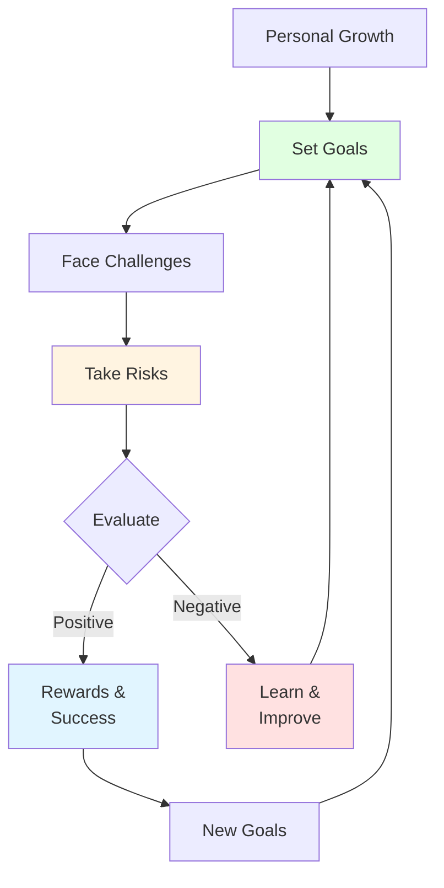
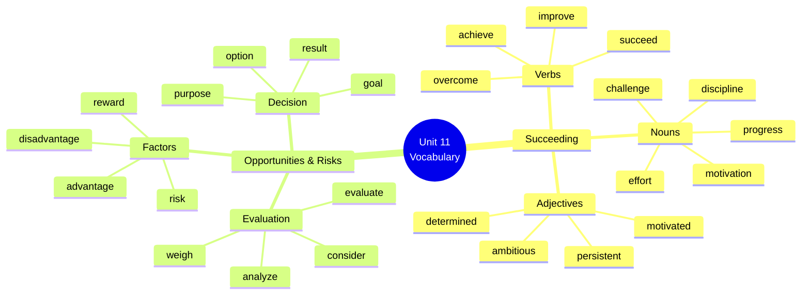

# 🟦Vocabulary & Use: Succeeding + Opportunities & Risks

## 🎯 Introducción

> [!info]- 💡 ¿Por qué es importante este vocabulario?
> 
> El vocabulario de **éxito, oportunidades y riesgos** es fundamental para:
> 
> - **Hablar sobre metas personales** y desarrollo profesional
> - **Tomar decisiones informadas** evaluando pros y contras
> - **Expresar ambiciones** y planes de vida
> - **Discutir desafíos** y cómo superarlos
> - **Motivar a otros** y a ti mismo
> 
> **Analogía práctica:** Imagina que estás escalando una montaña. Necesitas vocabulario para describir:
> 
> - El objetivo (la cumbre = **goal**)
> - Los desafíos en el camino (**challenges**)
> - Los riesgos (**risks**)
> - El esfuerzo necesario (**effort**)
> - La recompensa al final (**reward**)
> 
> **¿Dónde lo usarás?**
> 
> |Situación|Ejemplo de Uso|
> |---|---|
> |**Job interviews**|"I'm motivated to achieve my career goals"|
> |**Personal development**|"I'm working on improving my skills"|
> |**Decision-making**|"I need to consider the risks and rewards"|
> |**Motivation**|"Don't give up, keep pushing yourself"|
> |**Goal-setting**|"My goal is to succeed in this challenge"|



---

## 🏆 A. Vocabulary: Succeeding

> [!example]- 📈 Palabras Clave sobre Éxito
> 
> **Verbos de éxito y progreso:**
> 
> |Word|Spanish|Pronunciation|Example|
> |---|---|---|---|
> |**Succeed**|Tener éxito/Lograr|/səkˈsiːd/|She succeeded in passing the exam|
> |**Fail**|Fallar/Fracasar|/feɪl/|Don't be afraid to fail|
> |**Achieve**|Lograr/Alcanzar|/əˈtʃiːv/|I want to achieve my goals|
> |**Improve**|Mejorar|/ɪmˈpruːv/|I'm improving every day|
> |**Overcome**|Superar|/ˌəʊ.vəˈkʌm/|We can overcome any obstacle|
> |**Accomplish**|Lograr/Completar|/əˈkʌm.plɪʃ/|She accomplished great things|
> |**Progress**|Progresar|/prəˈɡres/|I'm progressing slowly but surely|
> |**Develop**|Desarrollar|/dɪˈvel.əp/|I need to develop new skills|
> 
> **Sustantivos relacionados:**
> 
> |Word|Spanish|Pronunciation|Example|
> |---|---|---|---|
> |**Effort**|Esfuerzo|/ˈef.ət/|Success requires effort|
> |**Challenge**|Desafío|/ˈtʃæl.ɪndʒ/|This is a big challenge|
> |**Progress**|Progreso|/ˈprəʊ.ɡres/|I'm making good progress|
> |**Motivation**|Motivación|/ˌməʊ.tɪˈveɪ.ʃən/|I need more motivation|
> |**Discipline**|Disciplina|/ˈdɪs.ɪ.plɪn/|Discipline is key to success|
> |**Determination**|Determinación|/dɪˌtɜː.mɪˈneɪ.ʃən/|She has strong determination|
> |**Success**|Éxito|/səkˈses/|Hard work leads to success|
> |**Failure**|Fracaso|/ˈfeɪl.jər/|Failure is part of learning|
> 
> **Adjetivos importantes:**
> 
> |Word|Spanish|Example|
> |---|---|---|
> |**Successful**|Exitoso|He's a successful entrepreneur|
> |**Motivated**|Motivado|I feel very motivated today|
> |**Determined**|Determinado|She's determined to succeed|
> |**Ambitious**|Ambicioso|They're very ambitious people|
> |**Persistent**|Persistente|You need to be persistent|
> 
> **Visualización del proceso de éxito:**
> 
> ```mermaid
> flowchart LR
>     A[Motivation] --> B[Set Goal]
>     B --> C[Make Effort]
>     C --> D[Face Challenge]
>     D --> E{Overcome?}
>     E -->|Yes| F[Progress]
>     E -->|No| G[Learn from Failure]
>     G --> C
>     F --> H[Achieve Success]
>     H --> I[Improve Further]
>     
>     style A fill:#e1ffe1
>     style D fill:#fff4e1
>     style G fill:#ffe1e1
>     style H fill:#e1f5ff
> ```

> [!success]- 🎯 Frases Comunes con Vocabulario de Éxito
> 
> **Succeed/Success:**
> 
> ```
> ✅ I want to succeed in life
> ✅ She succeeded in getting the job
> ✅ Success doesn't come easily
> ✅ The key to success is hard work
> ✅ They're working towards success
> ```
> 
> **Achieve/Achievement:**
> 
> ```
> ✅ I want to achieve my goals
> ✅ She achieved great results
> ✅ That's a huge achievement
> ✅ I'm proud of my achievements
> ✅ We can achieve anything together
> ```
> 
> **Improve/Improvement:**
> 
> ```
> ✅ I'm trying to improve my English
> ✅ There's room for improvement
> ✅ I've improved a lot this year
> ✅ Keep improving every day
> ✅ Improvement takes time
> ```
> 
> **Overcome/Challenge:**
> 
> ```
> ✅ We need to overcome this challenge
> ✅ She overcame many obstacles
> ✅ This is a big challenge for me
> ✅ I love a good challenge
> ✅ Challenges make us stronger
> ```
> 
> **Effort/Discipline:**
> 
> ```
> ✅ It requires a lot of effort
> ✅ I'm putting in the effort
> ✅ You need discipline to succeed
> ✅ Discipline yourself every day
> ✅ Success = effort + discipline
> ```
> 
> **Collocations importantes:**
> 
> |Collocation|Example|
> |---|---|
> |**make progress**|I'm making progress with my studies|
> |**put in effort**|You need to put in more effort|
> |**face a challenge**|We're facing a big challenge|
> |**overcome obstacles**|She overcame many obstacles|
> |**achieve success**|He achieved success through hard work|
> |**reach a goal**|I finally reached my goal|
> |**gain experience**|You'll gain valuable experience|

---

## ⚖️ B. Opportunities & Risks

> [!note]- 🎲 Vocabulario de Decisiones y Evaluación
> 
> **Palabras clave:**
> 
> |Word|Spanish|Pronunciation|Part of Speech|Example|
> |---|---|---|---|---|
> |**Advantage**|Ventaja|/ədˈvɑːn.tɪdʒ/|Noun|What are the advantages?|
> |**Disadvantage**|Desventaja|/ˌdɪs.ədˈvɑːn.tɪdʒ/|Noun|Every choice has disadvantages|
> |**Consider**|Considerar|/kənˈsɪd.ər/|Verb|You should consider all options|
> |**Effect**|Efecto|/ɪˈfekt/|Noun|What's the effect of this decision?|
> |**Goal**|Meta/Objetivo|/ɡəʊl/|Noun|What's your main goal?|
> |**Option**|Opción|/ˈɒp.ʃən/|Noun|We have several options|
> |**Purpose**|Propósito|/ˈpɜː.pəs/|Noun|What's the purpose of this?|
> |**Research**|Investigación/Investigar|/rɪˈsɜːtʃ/|Noun/Verb|Do your research first|
> |**Result**|Resultado|/rɪˈzʌlt/|Noun|What are the possible results?|
> |**Reward**|Recompensa|/rɪˈwɔːd/|Noun|The reward is worth the effort|
> |**Risk**|Riesgo|/rɪsk/|Noun|Every opportunity has risks|
> |**Situation**|Situación|/ˌsɪt.juˈeɪ.ʃən/|Noun|Analyze the situation carefully|
> 
> **Verbos de evaluación:**
> 
> |Verb|Spanish|Example|
> |---|---|---|
> |**Evaluate**|Evaluar|Evaluate all your options|
> |**Analyze**|Analizar|Analyze the risks first|
> |**Weigh**|Sopesar|Weigh the pros and cons|
> |**Compare**|Comparar|Compare different options|
> |**Decide**|Decidir|You need to decide soon|
> 
> **Matriz de decisión:**
> 
> ```mermaid
> graph TD
>     A[Opportunity] --> B{Evaluate}
>     B --> C[Consider Advantages]
>     B --> D[Consider Disadvantages]
>     B --> E[Assess Risks]
>     B --> F[Identify Rewards]
>     
>     C --> G[Make Decision]
>     D --> G
>     E --> G
>     F --> G
>     
>     G --> H{Result}
>     H -->|Positive| I[Success!]
>     H -->|Negative| J[Learn & Adjust]
>     
>     style A fill:#e1ffe1
>     style B fill:#fff4e1
>     style G fill:#e1f5ff
>     style I fill:#ccffcc
>     style J fill:#ffcccc
> ```

> [!tip]- 🎯 Frases para Analizar Decisiones
> 
> **Talking about advantages:**
> 
> ```
> ✅ The main advantage is...
> ✅ One advantage of this is...
> ✅ The advantages outweigh the disadvantages
> ✅ A big advantage is that...
> ✅ This has several advantages
> ```
> 
> **Talking about disadvantages:**
> 
> ```
> ✅ The main disadvantage is...
> ✅ One disadvantage is that...
> ✅ There are some disadvantages to consider
> ✅ A major disadvantage is...
> ✅ We need to consider the disadvantages
> ```
> 
> **Talking about risks:**
> 
> ```
> ✅ There's a risk that...
> ✅ It's worth the risk
> ✅ I'm willing to take the risk
> ✅ The risks are too high
> ✅ We need to minimize the risks
> ✅ Taking risks is part of success
> ```
> 
> **Talking about rewards:**
> 
> ```
> ✅ The reward is worth it
> ✅ The potential rewards are huge
> ✅ Risk and reward go together
> ✅ What's the reward for doing this?
> ✅ The rewards outweigh the risks
> ```
> 
> **Talking about goals:**
> 
> ```
> ✅ My goal is to...
> ✅ I'm working towards my goal
> ✅ I've set a goal to...
> ✅ This will help me reach my goal
> ✅ I'm determined to achieve my goal
> ```
> 
> **Talking about options:**
> 
> ```
> ✅ What are my options?
> ✅ We have several options
> ✅ I'm considering my options
> ✅ That's not the only option
> ✅ I need to explore all options
> ```
> 
> **Estructura de evaluación completa:**
> 
> |Step|Phrase|Example|
> |---|---|---|
> |1. **Identify situation**|I'm in a situation where...|I'm in a situation where I need to decide|
> |2. **State options**|My options are...|My options are to continue or quit|
> |3. **Consider advantages**|The advantages are...|The advantages are better pay and experience|
> |4. **Consider disadvantages**|The disadvantages are...|The disadvantages are long hours and stress|
> |5. **Assess risks**|The risks include...|The risks include failure and lost time|
> |6. **Identify rewards**|The potential rewards are...|The potential rewards are career growth|
> |7. **Make decision**|I've decided to...|I've decided to take the risk|

---

## 📚 C. Mini-Glosario EN → ES

> [!quote]- 📖 Referencia Rápida Completa
> 
> ### Succeeding Vocabulary
> 
> |English|Spanish|Category|Notes|
> |---|---|---|---|
> |**Achieve**|Lograr/Alcanzar|Verb|Achieve goals/success|
> |**Accomplish**|Lograr/Completar|Verb|Accomplish tasks|
> |**Ambitious**|Ambicioso|Adjective|Ambitious person|
> |**Challenge**|Desafío|Noun|Face a challenge|
> |**Determination**|Determinación|Noun|Show determination|
> |**Determined**|Determinado|Adjective|Be determined|
> |**Develop**|Desarrollar|Verb|Develop skills|
> |**Discipline**|Disciplina|Noun|Need discipline|
> |**Effort**|Esfuerzo|Noun|Make an effort|
> |**Fail**|Fallar/Fracasar|Verb|Don't be afraid to fail|
> |**Failure**|Fracaso|Noun|Learn from failure|
> |**Improve**|Mejorar|Verb|Improve yourself|
> |**Motivated**|Motivado|Adjective|Feel motivated|
> |**Motivation**|Motivación|Noun|Find motivation|
> |**Overcome**|Superar|Verb|Overcome obstacles|
> |**Persistent**|Persistente|Adjective|Be persistent|
> |**Progress**|Progreso/Progresar|Noun/Verb|Make progress|
> |**Succeed**|Tener éxito|Verb|Succeed in life|
> |**Success**|Éxito|Noun|Achieve success|
> |**Successful**|Exitoso|Adjective|Successful person|
> 
> ### Opportunities & Risks Vocabulary
> 
> |English|Spanish|Category|Notes|
> |---|---|---|---|
> |**Advantage**|Ventaja|Noun|Main advantage|
> |**Analyze**|Analizar|Verb|Analyze options|
> |**Compare**|Comparar|Verb|Compare alternatives|
> |**Consider**|Considerar|Verb|Consider carefully|
> |**Decide**|Decidir|Verb|Make a decision|
> |**Disadvantage**|Desventaja|Noun|Consider disadvantages|
> |**Effect**|Efecto|Noun|Cause and effect|
> |**Evaluate**|Evaluar|Verb|Evaluate risks|
> |**Goal**|Meta/Objetivo|Noun|Set a goal|
> |**Option**|Opción|Noun|Explore options|
> |**Purpose**|Propósito|Noun|Clear purpose|
> |**Research**|Investigación/Investigar|Noun/Verb|Do research|
> |**Result**|Resultado|Noun|Positive result|
> |**Reward**|Recompensa|Noun|Worth the reward|
> |**Risk**|Riesgo|Noun|Take a risk|
> |**Situation**|Situación|Noun|Difficult situation|
> |**Weigh**|Sopesar|Verb|Weigh pros and cons|

---

## 💬 D. Collocations & Uso Real

> [!success]- 🎯 Combinaciones Frecuentes
> 
> **1. Goal Collocations**
> 
> |Collocation|Example|Frequency|
> |---|---|---|
> |**set a goal**|I set a goal to learn English|⭐⭐⭐⭐⭐|
> |**reach/achieve a goal**|She achieved her goal|⭐⭐⭐⭐⭐|
> |**work towards a goal**|I'm working towards my goal|⭐⭐⭐⭐|
> |**long-term goal**|What's your long-term goal?|⭐⭐⭐⭐|
> |**short-term goal**|My short-term goal is...|⭐⭐⭐⭐|
> |**main goal**|My main goal is to succeed|⭐⭐⭐⭐|
> 
> **2. Success Collocations**
> 
> ```
> ✅ achieve success → lograr el éxito
> ✅ road to success → camino al éxito
> ✅ key to success → clave del éxito
> ✅ guarantee success → garantizar el éxito
> ✅ taste success → probar el éxito
> ✅ measure success → medir el éxito
> ```
> 
> **3. Risk Collocations**
> 
> ```
> ✅ take a risk → tomar un riesgo
> ✅ run a risk → correr un riesgo
> ✅ minimize risks → minimizar riesgos
> ✅ assess the risk → evaluar el riesgo
> ✅ high risk → alto riesgo
> ✅ calculated risk → riesgo calculado
> ```
> 
> **4. Effort Collocations**
> 
> ```
> ✅ make an effort → hacer un esfuerzo
> ✅ put in effort → poner esfuerzo
> ✅ require effort → requerir esfuerzo
> ✅ worth the effort → vale la pena el esfuerzo
> ✅ extra effort → esfuerzo adicional
> ✅ great effort → gran esfuerzo
> ```
> 
> **5. Challenge Collocations**
> 
> ```
> ✅ face a challenge → enfrentar un desafío
> ✅ meet a challenge → cumplir un desafío
> ✅ rise to the challenge → estar a la altura del desafío
> ✅ accept a challenge → aceptar un desafío
> ✅ big challenge → gran desafío
> ✅ overcome a challenge → superar un desafío
> ```
> 
> **Patrones de uso completos:**
> 
> |Pattern|Example|
> |---|---|
> |**set + goal**|I set a goal to improve my English|
> |**achieve/reach + goal/success**|She achieved her goal of running a marathon|
> |**make + progress/effort**|I'm making progress every day|
> |**take + risk/opportunity**|Sometimes you need to take risks|
> |**overcome + challenge/obstacle**|We can overcome any challenge together|
> |**put in + effort/work**|You need to put in more effort|
> |**face + challenge/difficulty**|I'm facing a big challenge right now|
> |**consider + option/possibility**|Consider all your options carefully|

---

## 🌍 E. Aplicaciones en Frases

> [!example]- 💼 Contextos Reales de Uso
> 
> **Scenario 1: Job Interview**
> 
> ```
> Interviewer: What are your career goals?
> 
> Candidate: My main goal is to develop my skills in project 
> management. I'm very motivated and determined to succeed 
> in this field. I know it will require effort and discipline, 
> but I'm willing to put in the work. I've already achieved 
> some success in my previous role, where I overcame several 
> challenges and improved team efficiency by 30%.
> ```
> 
> **Scenario 2: Personal Development Discussion**
> 
> ```
> A: I'm thinking about starting my own business.
> 
> B: That's ambitious! Have you considered all the risks?
> 
> A: Yes, I've done my research. There are advantages and 
> disadvantages. The main advantage is independence and 
> potential for high rewards. The disadvantage is financial 
> risk and long hours.
> 
> B: What's your goal?
> 
> A: My goal is to be my own boss within two years. I know 
> I need discipline and determination, but I'm ready for 
> the challenge.
> ```
> 
> **Scenario 3: Motivational Speech**
> 
> ```
> "Success doesn't come without effort. You need to set clear 
> goals and work towards them every day. Don't be afraid to 
> fail – failure is part of learning. Every challenge you 
> overcome makes you stronger. Be persistent, stay motivated, 
> and never give up on your dreams. Take calculated risks, 
> evaluate your options carefully, and always keep improving. 
> Remember: the reward is worth the effort!"
> ```
> 
> **Scenario 4: Decision-Making Process**
> 
> ```
> Situation: Should I study abroad?
> 
> Advantages:
> - Gain international experience
> - Improve language skills
> - Make valuable connections
> 
> Disadvantages:
> - High cost
> - Far from family
> - Cultural adjustment challenges
> 
> Risks:
> - Financial burden
> - Academic difficulties
> - Homesickness
> 
> Rewards:
> - Better career opportunities
> - Personal growth
> - Life-changing experience
> 
> Decision: I've decided to take the risk because the potential 
> rewards outweigh the disadvantages. It's a big challenge, but 
> I'm determined to succeed.
> ```
> 
> **Frases motivacionales comunes:**
> 
> ```
> ✅ "No pain, no gain" (effort → success)
> ✅ "Where there's a will, there's a way" (determination)
> ✅ "Failure is the stepping stone to success" (learning)
> ✅ "Success is a journey, not a destination" (progress)
> ✅ "The only way to do great work is to love what you do" (motivation)
> ✅ "Don't watch the clock; do what it does. Keep going" (persistence)
> ```

---

## 🎓 Mini Practice Section

> [!tip]- 💪 Quick Exercises
> 
> **Exercise 1: Complete with the correct word**
> 
> ```
> achieve • overcome • effort • motivated • goal
> 
> 1. My _________ is to speak English fluently.
> 2. I'm very _________ to learn new things.
> 3. It takes a lot of _________ to succeed.
> 4. She wants to _________ her dreams.
> 5. We can _________ any obstacle together.
> ```
> 
> > [!success]- ✅ Answers - Exercise 1
> > 
> > 1. **goal**
> > 2. **motivated**
> > 3. **effort**
> > 4. **achieve**
> > 5. **overcome**
> 
> ---
> 
> **Exercise 2: Match the collocation**
> 
> |Column A|Column B|
> |---|---|
> |1. set a|a) an obstacle|
> |2. take a|b) progress|
> |3. make|c) goal|
> |4. overcome|d) a challenge|
> |5. face|e) risk|
> 
> > [!success]- ✅ Answers - Exercise 2
> > 
> > |Match|Correct Answer|
> > |---|---|
> > |1. set a|**c)** goal|
> > |2. take a|**e)** risk|
> > |3. make|**b)** progress|
> > |4. overcome|**a)** an obstacle|
> > |5. face|**d)** a challenge|
> > 
> > **Full collocations:** 1-c, 2-e, 3-b, 4-a, 5-d
> 
> ---
> 
> **Exercise 3: Advantages vs Disadvantages**
> 
> ```
> Topic: Living in a big city
> 
> Write 2 advantages and 2 disadvantages:
> 
> Advantages:
> 6. _________________________________________________
> 7. _________________________________________________
> 
> Disadvantages:
> 8. _________________________________________________
> 9. _________________________________________________
> ```
> 
> > [!success]- ✅ Sample Answers - Exercise 3
> > 
> > **Advantages:**
> > 
> > 1. There are more job opportunities and career options
> > 2. Better access to entertainment, culture, and services
> > 
> > **Disadvantages:**
> > 
> > 1. The cost of living is very high
> > 2. There's more pollution and traffic congestion
> > 
> > **Alternative valid answers:**
> > 
> > - Advantages: Public transportation, diversity, education
> > - Disadvantages: Crowded, expensive housing, stressful
> 
> ---
> 
> **Exercise 4: Complete the motivational quote**
> 
> ```
> succeed • effort • challenge • goal • overcome
> 
> "If you want to _________ in life, you need to set a clear 
> _________ and put in the _________. Every _________ is an 
> opportunity to grow. Don't give up when things get difficult – 
> you can _________ anything if you stay determined!"
> ```
> 
> > [!success]- ✅ Answers - Exercise 4
> > 
> > "If you want to **succeed** in life, you need to set a clear **goal** and put in the **effort**. Every **challenge** is an opportunity to grow. Don't give up when things get difficult – you can **overcome** anything if you stay determined!"
> 
> ---
> 
> **Exercise 5: Personal Response**
> 
> ```
> Answer these questions about yourself:
> 
> 10. What's your main goal right now?
>    _________________________________________________
> 
> 11. What's the biggest challenge you're facing?
>    _________________________________________________
> 
> 12. What motivates you to keep going?
>    _________________________________________________
> 
> 13. Have you taken any risks recently? What were they?
>    _________________________________________________
> ```
> 
> > [!success]- ✅ Sample Personal Answers
> > 
> > 1. **Goal example:** "My main goal right now is to improve my English to a B2 level by the end of this year."
> >     
> > 2. **Challenge example:** "The biggest challenge I'm facing is finding time to study while working full-time."
> >     
> > 3. **Motivation example:** "What motivates me is thinking about better job opportunities and being able to travel confidently."
> >     
> > 4. **Risk example:** "Yes, I took the risk of changing careers last year. It was scary but it's been worth it."
> >     
> > 
> > _(These are personal questions - accept any genuine, grammatically correct answers)_

---

## 📊 Visual Summary



---

## 🔗 Connection to Next Topics

> [!quote]- 🌟 Preparing for Grammar
> 
> **You've mastered the vocabulary. Now you're ready for:**
> 
> |Current Level|Next Step|Why It Matters|
> |---|---|---|
> |**Vocabulary**|Phrasal Verbs|Learn expressions like "give up", "keep going"|
> |**Success terms**|Unreal Conditionals|Express hypothetical situations about goals|
> |**Decision words**|Conditional structures|Talk about "what if" scenarios|
> 
> **Preview - Phrasal Verbs:**
> 
> ```
> ✅ give up → Don't give up on your dreams
> ✅ keep going → Keep going, you're doing great
> ✅ set up → I want to set up my own business
> ✅ work on → I'm working on improving my skills
> ```
> 
> **Preview - Unreal Conditionals:**
> 
> ```
> ✅ If I had more time, I would study harder
> ✅ If I were you, I would take the risk
> ✅ I wish I were more confident
> ✅ I wish I had started earlier
> ```
> 
> **Connection map:**
> 
> ```mermaid
> graph LR
>     A[Vocabulary:<br/>Goals & Success] --> B[Grammar:<br/>Phrasal Verbs]
>     A --> C[Grammar:<br/>Conditionals]
>     B --> D[Real Use:<br/>Motivational<br/>Language]
>     C --> D
>     
>     style A fill:#e1ffe1
>     style B fill:#fff4e1
>     style C fill:#e1f5ff
>     style D fill:#ffe1e1
> ```

---

**Tags:** #english #vocabulary #success #goals #risks #opportunities #motivation #determination #unit11 #pushing-yourself