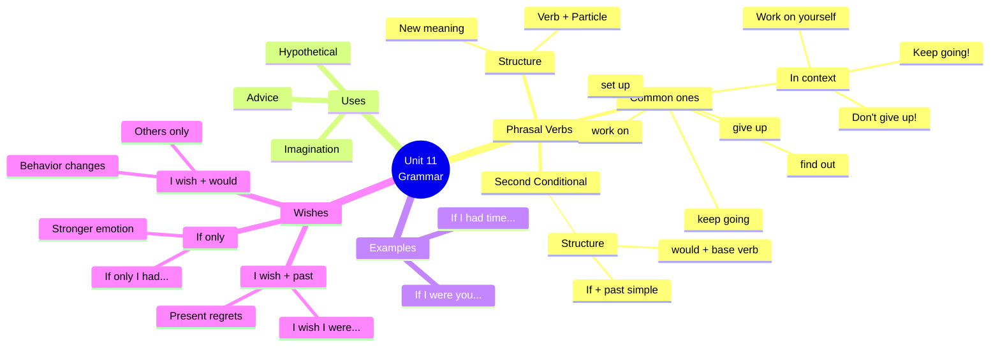

# 🟨Grammar & Examples: Phrasal Verbs + Unreal Conditionals

## 🎯 Introducción

> [!info]- 💡 ¿Qué aprenderás en esta sección?
> 
> En esta nota dominarás dos estructuras gramaticales esenciales para hablar sobre **metas, desafíos y situaciones hipotéticas**:
> 
> 1. **Phrasal Verbs** - Verbos compuestos que son fundamentales en inglés cotidiano
> 2. **Unreal Conditionals** - Para hablar de situaciones imaginarias o contrarias a la realidad
> 
> **¿Por qué son importantes juntos?**
> 
> |Estructura|Función|Ejemplo con Unit 11|
> |---|---|---|
> |**Phrasal Verbs**|Expresar acciones relacionadas con metas|"Don't give up on your dreams"|
> |**Unreal Conditionals**|Expresar deseos e hipótesis|"If I had more time, I would work on my goals"|
> 
> **Conexión práctica:**
> 
> ```mermaid
> graph TD
>     A[Talking about Goals] --> B[Phrasal Verbs]
>     A --> C[Unreal Conditionals]
>     
>     B --> D["I'm working on<br/>improving my skills"]
>     C --> E["If I were braver,<br/>I would take more risks"]
>     
>     D --> F[Real Actions]
>     E --> F
>     F --> G[Express yourself<br/>naturally about<br/>pushing yourself]
>     
>     style B fill:#e1ffe1
>     style C fill:#fff4e1
>     style G fill:#e1f5ff
> ```

---

## 🔄 A. Phrasal Verbs - Introducción

> [!example]- 📘 ¿Qué son los Phrasal Verbs?
> 
> **Definición:** Un **phrasal verb** es la combinación de un verbo + una partícula (preposición o adverbio) que crea un nuevo significado diferente al verbo original.
> 
> **Estructura básica:**
> 
> ```
> VERB + PARTICLE = NEW MEANING
> 
> give + up = give up (rendirse)
> look + for = look for (buscar)
> set + up = set up (establecer)
> ```
> 
> **¿Por qué son importantes?**
> 
> |Razón|Explicación|Ejemplo|
> |---|---|---|
> |**Muy comunes**|Usados constantemente en inglés hablado|"Keep going!" vs "Continue!"|
> |**Más naturales**|Suenan más native que verbos formales|"Give up" vs "Surrender"|
> |**Cambian significado**|El verbo solo significa algo diferente|"look" ≠ "look for"|
> |**Múltiples significados**|Un phrasal verb puede tener varios sentidos|"get up" = levantarse / organizar|
> 
> **Comparación visual:**
> 
> ```mermaid
> graph LR
>     A[VERB:<br/>give] --> B[Meaning:<br/>dar]
>     
>     C[PHRASAL VERB:<br/>give + up] --> D[NEW Meaning:<br/>rendirse]
>     
>     style A fill:#ffe1e1
>     style C fill:#e1ffe1
>     style D fill:#fff4e1
> ```
> 
> **Tipos de phrasal verbs:**
> 
> |Tipo|Ejemplo|Característica|
> |---|---|---|
> |**Intransitivo**|give up, wake up|No necesita objeto|
> |**Transitivo separable**|turn off the TV / turn the TV off|Objeto puede ir en medio o al final|
> |**Transitivo inseparable**|look after the kids|Objeto siempre va al final|
> 
> **Ejemplos de cambio de significado:**
> 
> ```
> LOOK (mirar) →
> ✅ look for = buscar
> ✅ look after = cuidar
> ✅ look up = buscar información
> ✅ look forward to = esperar con ansias
> 
> GIVE (dar) →
> ✅ give up = rendirse
> ✅ give in = ceder
> ✅ give away = regalar
> ✅ give back = devolver
> 
> GET (obtener) →
> ✅ get up = levantarse
> ✅ get over = superar
> ✅ get on = llevarse bien
> ✅ get through = completar/superar
> ```

---

## 💪 B. Phrasal Verbs Útiles para Unit 11

> [!success]- 🎯 Phrasal Verbs sobre Metas y Esfuerzo
> 
> **1. GIVE UP - Rendirse**
> 
> |Form|Example|Spanish|
> |---|---|---|
> |**Base**|Don't give up!|¡No te rindas!|
> |**-ing**|I'm not giving up on my dreams|No me rindo con mis sueños|
> |**Past**|She gave up smoking|Ella dejó de fumar|
> 
> ```
> Common patterns:
> ✅ give up (completely) → rendirse totalmente
> ✅ give up on someone/something → rendirse con alguien/algo
> ✅ give up doing something → dejar de hacer algo
> 
> Examples:
> - Don't give up, you're almost there!
> - I'll never give up on my goals
> - He gave up trying to learn guitar
> - She refuses to give up
> ```
> 
> ---
> 
> **2. KEEP GOING - Seguir adelante/Continuar**
> 
> |Form|Example|Spanish|
> |---|---|---|
> |**Base**|Keep going!|¡Sigue adelante!|
> |**-ing**|I'm keeping going despite difficulties|Sigo adelante a pesar de las dificultades|
> |**Past**|She kept going until she succeeded|Ella siguió hasta que lo logró|
> 
> ```
> Common patterns:
> ✅ keep going = continuar, no parar
> ✅ keep going with something = continuar con algo
> 
> Examples:
> - Keep going, don't stop now!
> - I just keep going every day
> - When things get hard, I keep going
> - They kept going despite the obstacles
> ```
> 
> ---
> 
> **3. SET UP - Establecer/Montar/Crear**
> 
> |Form|Example|Spanish|
> |---|---|---|
> |**Base**|I want to set up my own business|Quiero establecer mi propio negocio|
> |**-ing**|I'm setting up a new routine|Estoy estableciendo una nueva rutina|
> |**Past**|She set up a successful company|Ella estableció una empresa exitosa|
> 
> ```
> Common patterns:
> ✅ set up a business/company → establecer un negocio
> ✅ set up a meeting → organizar una reunión
> ✅ set up a routine → establecer una rutina
> 
> Examples:
> - I want to set up my own business
> - They're setting up a new office
> - He set up a study routine
> - We need to set up a plan
> ```
> 
> ---
> 
> **4. WORK ON - Trabajar en/Esforzarse en**
> 
> |Form|Example|Spanish|
> |---|---|---|
> |**Base**|I need to work on my English|Necesito trabajar en mi inglés|
> |**-ing**|I'm working on improving myself|Estoy trabajando en mejorarme|
> |**Past**|She worked on her presentation all week|Ella trabajó en su presentación toda la semana|
> 
> ```
> Common patterns:
> ✅ work on something → trabajar en algo
> ✅ work on doing something → esforzarse en hacer algo
> ✅ work on yourself → trabajar en ti mismo
> 
> Examples:
> - I'm working on improving my skills
> - She's working on her confidence
> - He needs to work on his discipline
> - We're working on the project together
> ```
> 
> ---
> 
> **5. FIND OUT - Descubrir/Averiguar**
> 
> |Form|Example|Spanish|
> |---|---|---|
> |**Base**|I want to find out more|Quiero averiguar más|
> |**-ing**|I'm finding out about opportunities|Estoy averiguando sobre oportunidades|
> |**Past**|She found out the truth|Ella descubrió la verdad|
> 
> ```
> Common patterns:
> ✅ find out (that...) → descubrir que...
> ✅ find out about something → averiguar sobre algo
> ✅ find out how to... → descubrir cómo...
> 
> Examples:
> - I want to find out what my options are
> - She found out about a great opportunity
> - Let me find out more information
> - They found out how to succeed
> ```

> [!tip]- 🔥 Más Phrasal Verbs para Pushing Yourself
> 
> **6. GET OVER - Superar (algo difícil)**
> 
> ```
> ✅ I need to get over my fear of failure
> ✅ She got over the disappointment quickly
> ✅ It took time to get over the setback
> ✅ You'll get over this challenge
> ```
> 
> **7. CARRY ON - Continuar (más formal que keep going)**
> 
> ```
> ✅ Carry on with your work
> ✅ She carried on despite the difficulties
> ✅ We'll carry on until we succeed
> ✅ Don't stop, carry on!
> ```
> 
> **8. TAKE ON - Aceptar/Asumir (un desafío)**
> 
> ```
> ✅ I'm ready to take on new challenges
> ✅ She took on more responsibility
> ✅ Don't take on too much at once
> ✅ He's taking on a difficult project
> ```
> 
> **9. FIGURE OUT - Resolver/Entender**
> 
> ```
> ✅ I need to figure out my next step
> ✅ She figured out the solution
> ✅ I'm trying to figure out what to do
> ✅ He finally figured out how to succeed
> ```
> 
> **10. GO THROUGH - Pasar por/Experimentar**
> 
> ```
> ✅ Everyone goes through challenges
> ✅ I went through a difficult time
> ✅ She's going through a lot right now
> ✅ We all go through failures
> ```
> 
> **11. LOOK FORWARD TO - Esperar con ansias**
> 
> ```
> ✅ I'm looking forward to achieving my goals
> ✅ She looks forward to new opportunities
> ✅ I look forward to the challenge
> ✅ We're looking forward to success
> 
> ⚠️ Note: "to" is a preposition here, so use -ing:
> - I'm looking forward to seeing you (✅)
> - I'm looking forward to see you (❌)
> ```
> 
> **Quick Reference Table:**
> 
> |Phrasal Verb|Spanish|Context|
> |---|---|---|
> |**give up**|rendirse|When facing difficulty|
> |**keep going**|seguir adelante|Encouragement, persistence|
> |**set up**|establecer|Creating, organizing|
> |**work on**|trabajar en|Self-improvement|
> |**find out**|averiguar|Research, discovery|
> |**get over**|superar|Overcoming obstacles|
> |**carry on**|continuar|Persistence|
> |**take on**|asumir|Accepting challenges|
> |**figure out**|resolver|Problem-solving|
> |**go through**|pasar por|Experiencing difficulties|
> |**look forward to**|esperar con ansias|Future goals|

---

## 🎭 C. Unreal Conditional - Present (2nd Conditional)

> [!note]- 📕 Estructura del Second Conditional
> 
> **¿Qué es el Second Conditional?**
> 
> Usamos el **Second Conditional** para hablar de situaciones **hipotéticas, imaginarias o improbables** en el presente o futuro.
> 
> **Fórmula:**
> 
> ```
> IF + PAST SIMPLE, WOULD + BASE VERB
> 
> If I had more time, I would study harder.
> (Pero NO tengo más tiempo - es hipotético)
> ```
> 
> **Estructura visual:**
> 
> ```mermaid
> graph LR
>     A[IF clause<br/>Past Simple] --> B[Main clause<br/>would + base verb]
>     
>     C["If I were rich"] --> D["I would travel the world"]
>     
>     E[Hypothetical<br/>condition] --> F[Hypothetical<br/>result]
>     
>     style A fill:#ffe1e1
>     style B fill:#e1ffe1
>     style C fill:#fff4e1
>     style D fill:#e1f5ff
> ```
> 
> **Cuándo usar Second Conditional:**
> 
> |Situación|Ejemplo|Por qué usar 2nd Conditional|
> |---|---|---|
> |**Imaginar**|If I were CEO, I would change things|No soy CEO (imaginación)|
> |**Dar consejos**|If I were you, I would take the risk|No soy tú (consejo hipotético)|
> |**Situación improbable**|If I won the lottery, I would quit my job|Improbable que gane|
> |**Contrario a realidad**|If I had more confidence, I would apply|NO tengo confianza ahora|
> 
> **Conjugación completa:**
> 
> |Subject|IF clause (Past Simple)|Main clause (would)|
> |---|---|---|
> |I|If I **had** money|I **would** buy a house|
> |You|If you **were** brave|you **would** take risks|
> |He/She|If she **knew** English|she **would** get the job|
> |We|If we **had** time|we **would** travel more|
> |They|If they **tried** harder|they **would** succeed|
> 
> **⚠️ IMPORTANTE: IF I WERE (no "was")**
> 
> ```
> Con el verbo "be" en second conditional, usamos "were" para TODAS las personas:
> 
> ✅ If I were you...
> ✅ If he were here...
> ✅ If she were rich...
> 
> ❌ If I was you... (incorrecto en formal English)
> ❌ If she was rich... (incorrecto en formal English)
> 
> En conversación informal, algunos nativos usan "was", 
> pero "were" es siempre correcto y más formal.
> ```

> [!example]- 💡 Ejemplos con Unit 11 Vocabulary
> 
> **Talking about goals:**
> 
> ```
> ✅ If I had more discipline, I would achieve my goals faster
>    (Pero no tengo suficiente disciplina ahora)
> 
> ✅ If I were more motivated, I would work on my skills every day
>    (Pero no estoy tan motivado como quisiera)
> 
> ✅ If I set clear goals, I would make more progress
>    (Pero no he establecido metas claras)
> ```
> 
> **Talking about risks and opportunities:**
> 
> ```
> ✅ If I took more risks, I would have more opportunities
>    (Pero tengo miedo de arriesgarme)
> 
> ✅ If the reward were bigger, I would consider it
>    (Pero la recompensa no es suficientemente grande)
> 
> ✅ If I had less to lose, I would try starting a business
>    (Pero tengo mucho que perder)
> ```
> 
> **Giving advice with "If I were you":**
> 
> ```
> ✅ If I were you, I would take that opportunity
> ✅ If I were you, I wouldn't give up so easily
> ✅ If I were you, I would work on improving my English
> ✅ If I were you, I would set up a clear plan
> ✅ If I were you, I would keep going despite the difficulties
> ```
> 
> **Imagining different circumstances:**
> 
> ```
> ✅ If I had more time, I would learn a new skill
> ✅ If I lived in a big city, I would have more job options
> ✅ If I spoke English fluently, I would apply for that job
> ✅ If I were braver, I would face more challenges
> ✅ If I didn't have so many responsibilities, I would take more risks
> ```
> 
> **Patterns para memorizar:**
> 
> |Pattern|Example|
> |---|---|
> |If I had + noun, I would + verb|If I had money, I would invest|
> |If I were + adjective, I would + verb|If I were confident, I would apply|
> |If I + past verb, I would + verb|If I tried harder, I would succeed|
> |If I were you, I would + verb|If I were you, I would take the risk|

> [!success]- 🔄 Negative & Questions
> 
> **Forma negativa:**
> 
> ```
> IF clause negative:
> ✅ If I didn't have to work, I would travel more
> ✅ If she weren't so busy, she would help us
> ✅ If they didn't give up, they would succeed
> 
> Main clause negative:
> ✅ If I had money, I wouldn't work here
> ✅ If I were you, I wouldn't take that risk
> ✅ If he tried harder, he wouldn't fail
> 
> Both negative:
> ✅ If I didn't have fears, I wouldn't hold back
> ✅ If we weren't so tired, we wouldn't give up
> ```
> 
> **Preguntas:**
> 
> ```
> What would you do if...?
> ✅ What would you do if you had a million dollars?
> ✅ What would you do if you lost your job?
> ✅ What would you say if I told you I was leaving?
> 
> Would you... if...?
> ✅ Would you take the job if they offered it?
> ✅ Would you keep going if things got harder?
> ✅ Would you give up if you failed once?
> 
> Where/When/How would...?
> ✅ Where would you live if you could choose?
> ✅ When would you start if you had the chance?
> ✅ How would you feel if you achieved your goal?
> ```
> 
> **Short answers:**
> 
> ```
> Q: Would you take the risk if you had the chance?
> A: Yes, I would. / No, I wouldn't.
> 
> Q: If you were rich, would you quit your job?
> A: Yes, I would. / No, I wouldn't. I love my job.
> ```

---

## 🌟 D. Unreal Conditional - Future (wish / if only / would)

> [!note]- 💭 Expressing Wishes - I wish / If only
> 
> **I WISH + Past Simple** (para situaciones presentes que queremos cambiar)
> 
> ```
> Formula: I wish + past simple
> Meaning: Lamento que algo NO sea así ahora
> 
> ✅ I wish I were more confident
>    (Pero NO soy confiado ahora - lo lamento)
> 
> ✅ I wish I had more time
>    (Pero NO tengo más tiempo - lo lamento)
> 
> ✅ I wish I spoke English fluently
>    (Pero NO hablo inglés con fluidez - lo lamento)
> ```
> 
> **⚠️ IMPORTANTE: I wish I WERE (no "was")**
> 
> ```
> Con el verbo "be":
> ✅ I wish I were taller
> ✅ I wish I were braver
> ✅ I wish she were here
> 
> ❌ I wish I was taller (informal, evitar)
> ```
> 
> **Comparación: Second Conditional vs I wish**
> 
> |Second Conditional|I wish|Diferencia|
> |---|---|---|
> |If I were rich, I would travel|I wish I were rich|Conditional = resultado hipotético / Wish = deseo/lamento|
> |If I had time, I would study|I wish I had time|Conditional = qué harías / Wish = qué quieres cambiar|
> 
> **Ejemplos con Unit 11:**
> 
> ```
> About abilities/characteristics:
> ✅ I wish I were more disciplined
> ✅ I wish I were braver about taking risks
> ✅ I wish I had more motivation
> ✅ I wish I were more persistent
> 
> About circumstances:
> ✅ I wish I had more opportunities
> ✅ I wish I had started earlier
> ✅ I wish I knew what to do
> ✅ I wish things were easier
> 
> About other people:
> ✅ I wish he didn't give up so easily
> ✅ I wish she were more supportive
> ✅ I wish they would help me
> ```

> [!tip]- 🎯 IF ONLY (más enfático que "I wish")
> 
> **IF ONLY = I wish (pero más dramático/enfático)**
> 
> ```
> Same structure as "I wish":
> 
> ✅ If only I were more confident!
> ✅ If only I had more time!
> ✅ If only I could speak English perfectly!
> ✅ If only I weren't so afraid of failure!
> 
> Difference:
> - "I wish" = normal desire/regret
> - "If only" = stronger emotion, more dramatic
> 
> Examples:
> I wish I had money (neutral)
> If only I had money! (more desperate/emotional)
> ```
> 
> **Cuándo usar "if only":**
> 
> |Situación|Ejemplo|
> |---|---|
> |**Frustración**|If only I had started sooner!|
> |**Arrepentimiento**|If only I hadn't given up!|
> |**Deseo fuerte**|If only I were braver!|
> |**Situación dramática**|If only things were different!|

> [!example]- 🗣️ I wish + WOULD (para comportamientos que queremos cambiar)
> 
> **I wish + would** (para acciones/comportamientos de OTROS o situaciones)
> 
> ```
> Formula: I wish + subject + would + base verb
> Use: Cuando queremos que algo/alguien cambie su comportamiento
> 
> ⚠️ NO se usa con "I":
> ❌ I wish I would be more confident (WRONG)
> ✅ I wish I were more confident (CORRECT)
> 
> Solo con otros sujetos o situaciones:
> ✅ I wish he would help me
> ✅ I wish she would stop complaining
> ✅ I wish it would stop raining
> ✅ I wish they would support me more
> ```
> 
> **Ejemplos con Unit 11:**
> 
> ```
> About other people:
> ✅ I wish he would work harder on his goals
> ✅ I wish she would stop giving up so easily
> ✅ I wish they would take more risks
> ✅ I wish my boss would give me more opportunities
> 
> About situations:
> ✅ I wish things would get easier
> ✅ I wish the situation would improve
> ✅ I wish this challenge would end soon
> ```
> 
> **Summary Table:**
> 
> |Structure|Use|Example|Can use with "I"?|
> |---|---|---|---|
> |**I wish + past simple**|Present regret/desire|I wish I were brave|✅ Yes|
> |**I wish + would**|Want behavior change|I wish he would help|❌ No (only others)|
> |**If only + past simple**|Strong regret/desire|If only I had time!|✅ Yes|
> |**If only + would**|Strong desire for change|If only it would work!|❌ No (only others)|

---

## 💪 E. Mini Ejercicios

> [!tip]- ✏️ Practice Exercises
> 
> **Exercise 1: Complete with the correct phrasal verb**
> 
> ```
> give up • keep going • work on • set up • find out
> 
> 1. Don't _________ now! You're almost there!
> 2. I need to _________ my confidence.
> 3. She wants to _________ her own business.
> 4. I'm trying to _________ what my options are.
> 5. When things get hard, I just _________.
> ```
> 
> > [!success]- ✅ Answers - Exercise 1
> > 
> > 1. **give up**
> > 2. **work on**
> > 3. **set up**
> > 4. **find out**
> > 5. **keep going**
> 
> ---
> 
> **Exercise 2: Second Conditional - Complete the sentences**
> 
> ```
> 6. If I _________ (have) more time, I _________ (study) harder.
> 7. If she _________ (be) braver, she _________ (take) more risks.
> 8. If they _________ (not/give up), they _________ (succeed).
> 9. If I _________ (be) you, I _________ (keep) going.
> 10. What _________ you _________ (do) if you _________ (win) the lottery?
> ```
> 
> > [!success]- ✅ Answers - Exercise 2
> > 
> > 1. If I **had** more time, I **would study** harder.
> > 2. If she **were** braver, she **would take** more risks.
> > 3. If they **didn't give up**, they **would succeed**.
> > 4. If I **were** you, I **would keep** going.
> > 5. What **would** you **do** if you **won** the lottery?
> 
> ---
> 
> **Exercise 3: I wish - Transform the sentences**
> 
> ```
> 11. I'm not confident. → I wish _________________________
> 12. I don't have more time. → I wish _________________________
> 13. I can't speak English fluently. → I wish _________________________
> 14. I'm not braver. → I wish _________________________
> 15. He doesn't help me. → I wish _________________________
> ```
> 
> > [!success]- ✅ Answers - Exercise 3
> > 
> > 1. I wish **I were (more) confident**
> > 2. I wish **I had more time**
> > 3. I wish **I could speak English fluently** / **I spoke English fluently**
> > 4. I wish **I were braver**
> > 5. I wish **he would help me**
> 
> ---
> 
> **Exercise 4: Choose the correct option**
> 
> ```
> 16. If I (was/were) you, I would take that job.
> 17. I wish I (have/had) more opportunities.
> 18. Don't (give up/give up on) your dreams!
> 19. If she (tried/would try) harder, she would succeed.
> 20. I'm (working on/working at) improving my skills.
> ```
> 
> > [!success]- ✅ Answers - Exercise 4
> > 
> > 1. **were** (If I were you - siempre "were" en 2nd conditional)
> > 2. **had** (I wish + past simple)
> > 3. **give up on** (give up on + object)
> > 4. **tried** (if clause = past simple)
> > 5. **working on** (work on = trabajar en/esforzarse)
> 
> ---
> 
> **Exercise 5: Complete with phrasal verbs + conditionals**
> 
> ```
> 21. If you _________ (not/give up), you _________ (achieve) your goals.
> 22. I _________ (work on) my English if I _________ (have) more time.
> 23. I wish I _________ (not/be) afraid to _________ (take on) new challenges.
> 24. If I _________ (be) you, I _________ (keep going) despite the difficulties.
> 25. She would _________ (find out) more about the opportunity if she _________ (do) research.
> ```
> 
> > [!success]- ✅ Answers - Exercise 5
> > 
> > 1. If you **didn't give up**, you **would achieve** your goals.
> > 2. I **would work on** my English if I **had** more time.
> > 3. I wish I **weren't** afraid to **take on** new challenges.
> > 4. If I **were** you, I **would keep going** despite the difficulties.
> > 5. She would **find out** more about the opportunity if she **did** research.
> 
> ---
> 
> **Exercise 6: Real-life application**
> 
> ```
> Complete these sentences about yourself:
> 
> 26. If I had more time, I would _________________________
> 27. I wish I were more _________________________
> 28. If I were braver, I would _________________________
> 29. I'm working on _________________________
> 30. I would never give up on _________________________
> ```
> 
> > [!success]- ✅ Sample Personal Answers
> > 
> > 1. If I had more time, I would **travel more / learn a new skill / exercise every day**
> > 2. I wish I were more **confident / disciplined / fluent in English**
> > 3. If I were braver, I would **start my own business / speak in public more / take more risks**
> > 4. I'm working on **improving my English / being more disciplined / achieving my goals**
> > 5. I would never give up on **my dreams / learning English / my family**
> > 
> > _(Accept any grammatically correct, genuine personal answers)_

---

## 📊 Visual Summary - Grammar Structures



---

## 🎯 Key Patterns Summary

> [!quote]- 📝 Essential Patterns to Remember
> 
> **Phrasal Verbs:**
> ```
> ✅ Don't give up on [noun/gerund]
> ✅ Keep going [despite/when/until...]
> ✅ Work on [noun/gerund]
> ✅ Set up [a business/plan/routine]
> ✅ Find out [about/how to/what...]
> ```
> 
> **Second Conditional:**
> ```
> ✅ If I had [noun], I would [verb]
> ✅ If I were [adjective], I would [verb]
> ✅ If I [past verb], I would [verb]
> ✅ If I were you, I would [verb]
> ✅ I would [verb] if I [past verb]
> ```
> 
> **Wishes:**
> ```
> ✅ I wish I were [adjective]
> ✅ I wish I had [noun]
> ✅ I wish I could [verb]
> ✅ I wish [someone] would [verb]
> ✅ If only I [past verb]!
> ```

---

## 🔗 Connection to Next Topics

> [!note]- 🌟 Preparing for Functional Language
> 
> **You've mastered the grammar. Now you're ready for:**
> 
> | Current Level | Next Step | Why It Matters |
> |---------------|-----------|----------------|
> | **Phrasal verbs** | Natural expressions | Sound like a native speaker |
> | **Conditionals** | Real conversations | Express desires and advice naturally |
> | **Grammar structures** | Functional language | Use it fluently in speech |
> 
> ```mermaid
> graph LR
>     A[Vocabulary:<br/>Goals & Success] --> B[Grammar:<br/>Phrasal Verbs &<br/>Conditionals]
>     B --> C[Functional Language:<br/>Motivation &<br/>Advice]
>     C --> D[Real Use:<br/>Conversations<br/>about goals]
>     
>     style A fill:#e1ffe1
>     style B fill:#fff4e1
>     style C fill:#e1f5ff
>     style D fill:#ffe1e1
> ```

---

**Tags:** #english #grammar #phrasal-verbs #second-conditional #wishes #if-only #unit11 #conditionals #unreal-conditionals
