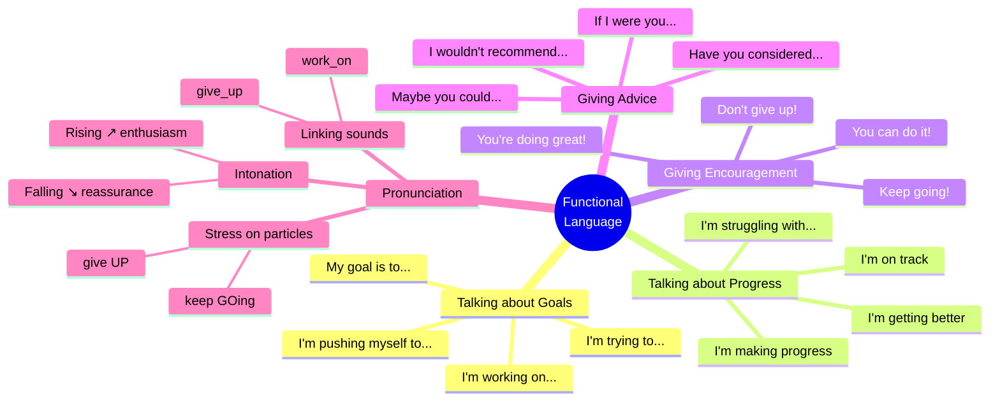

# 🟩 Functional Language & Pronunciation - Motivation & Advice

## 🎯 Introducción

> [!info]- 💡 ¿Qué aprenderás en esta sección?
> 
> En esta nota dominarás el **lenguaje funcional real** que los nativos usan para:
> 
> 1. **Hablar sobre metas y motivación** - Expresar tus objetivos y esfuerzos
> 2. **Dar consejos y ánimo** - Motivar a otros (y a ti mismo)
> 3. **Pronunciar correctamente** - Sonar natural y fluido
> 
> **¿Por qué es importante?**
> 
> |Aspecto|Importancia|Ejemplo|
> |---|---|---|
> |**Functional Language**|Te hace sonar natural y fluido|"I'm pushing myself" vs "I am making effort"|
> |**Real expressions**|Usadas en conversaciones reales|"Keep at it!" vs "Continue doing it"|
> |**Pronunciation**|Te ayuda a ser entendido|GIVE up (no give UP)|
> 
> **Conexión práctica:**
> 
> ```mermaid
> graph TD
>     A[Vocabulary] --> B[Grammar]
>     B --> C[Functional Language]
>     C --> D[Real Conversations]
>     
>     C --> E[Talking about<br/>your goals]
>     C --> F[Motivating<br/>others]
>     C --> G[Sounding<br/>natural]
>     
>     style C fill:#e1ffe1
>     style D fill:#fff4e1
>     style E fill:#e1f5ff
>     style F fill:#ffe1e1
>     style G fill:#fff4e1
> ```

---

## 💪 A. Talking About Goals & Motivation

> [!success]- 🎯 Expressing Your Goals
> 
> **Starting a goal:**
> 
> |Expression|Usage|Example|
> |---|---|---|
> |**I'm working on...**|Proceso continuo|I'm working on improving my English|
> |**I'm trying to...**|Esfuerzo actual|I'm trying to be more disciplined|
> |**I'm pushing myself to...**|Esfuerzo intenso|I'm pushing myself to take more risks|
> |**I want to...**|Deseo/meta|I want to achieve my goals this year|
> |**My goal is to...**|Meta específica|My goal is to start my own business|
> |**I'm aiming to...**|Objetivo claro|I'm aiming to finish this project by June|
> |**I've set myself a goal to...**|Meta establecida|I've set myself a goal to exercise daily|
> 
> **Ejemplos en contexto:**
> 
> ```
> About personal development:
> ✅ I'm working on being more confident in meetings
> ✅ I'm pushing myself to speak up more often
> ✅ I'm trying to improve my communication skills
> ✅ My goal is to become a better leader
> 
> About learning:
> ✅ I'm working on my English pronunciation
> ✅ I'm pushing myself to study every day
> ✅ I'm trying to read more books this year
> ✅ I've set myself a goal to learn Spanish
> 
> About career:
> ✅ I'm working on getting a promotion
> ✅ I'm pushing myself to take on more responsibility
> ✅ My goal is to start my own company
> ✅ I'm aiming to change careers next year
> ```

> [!tip]- 🔥 Talking About Your Progress
> 
> **Positive progress:**
> 
> |Expression|Meaning|Example|
> |---|---|---|
> |**I'm making progress**|Avanzando|I'm making progress with my fitness goals|
> |**I'm getting better at...**|Mejorando|I'm getting better at managing my time|
> |**I'm on track**|Voy bien encaminado|I'm on track to finish on time|
> |**It's going well**|Va bien|My project is going well so far|
> |**I'm almost there**|Casi lo logro|I'm almost there! Just a bit more to go|
> |**I can see improvement**|Veo mejora|I can see improvement in my skills|
> 
> **Challenges and difficulties:**
> 
> |Expression|Meaning|Example|
> |---|---|---|
> |**It's challenging, but...**|Es difícil pero...|It's challenging, but I'm not giving up|
> |**I'm struggling with...**|Tengo dificultades|I'm struggling with staying motivated|
> |**It's harder than I thought**|Más difícil de lo esperado|It's harder than I thought, but I'll keep going|
> |**I'm finding it difficult to...**|Me cuesta...|I'm finding it difficult to stay focused|
> |**I haven't made much progress**|No he avanzado mucho|I haven't made much progress lately|
> |**I'm stuck**|Estoy estancado|I'm stuck and need some advice|
> 
> **Ejemplos completos:**
> 
> ```
> Positive:
> ✅ I'm making real progress with my business plan
> ✅ I'm getting better at public speaking every week
> ✅ I'm on track to achieve my goal by the end of the year
> ✅ I can see improvement in my confidence levels
> 
> Challenges:
> ✅ It's challenging, but I'm learning a lot
> ✅ I'm struggling with time management, but I'm working on it
> ✅ It's harder than I thought, but I won't give up
> ✅ I'm finding it difficult to balance work and study
> ```

> [!example]- 💭 Expressing Determination & Persistence
> 
> **Strong commitment expressions:**
> 
> |Expression|Intensity|Example|
> |---|---|---|
> |**I'm determined to...**|⭐⭐⭐⭐⭐|I'm determined to finish this project|
> |**I'm committed to...**|⭐⭐⭐⭐|I'm committed to improving every day|
> |**I won't give up**|⭐⭐⭐⭐⭐|I won't give up, no matter what|
> |**I'm going to keep trying**|⭐⭐⭐|I'm going to keep trying until I succeed|
> |**I refuse to quit**|⭐⭐⭐⭐⭐|I refuse to quit when I'm so close|
> |**Nothing will stop me**|⭐⭐⭐⭐⭐|Nothing will stop me from achieving this|
> |**I'm in it for the long haul**|⭐⭐⭐⭐|I'm in it for the long haul|
> 
> **Talking about persistence:**
> 
> ```
> ✅ I keep pushing myself even when it's hard
> ✅ I'm not going to let setbacks stop me
> ✅ Every time I fail, I try again
> ✅ I believe in working hard and staying focused
> ✅ I know it will take time, but I'm patient
> ✅ I'm willing to do whatever it takes
> ✅ I'm prepared to put in the effort
> ✅ I won't let obstacles get in my way
> ```
> 
> **Responding to doubts (yours or others'):**
> 
> |Doubt|Strong Response|
> |---|---|
> |"It's too hard"|**I know it's hard, but I'm not giving up**|
> |"You might fail"|**I might fail, but I'll never know unless I try**|
> |"It's taking too long"|**Good things take time. I'm willing to wait**|
> |"Are you sure?"|**I'm absolutely sure. This is what I want**|
> |"Maybe you should quit"|**Quitting is not an option for me**|
> 
> **Natural combinations:**
> 
> ```
> ✅ I'm determined to succeed, no matter how long it takes
> ✅ I'm committed to this goal, and I won't give up
> ✅ I'm going to keep trying until I get it right
> ✅ I refuse to quit when I've come this far
> ✅ I'm in it for the long haul, so I'm being patient
> ```

---

## 🗣️ B. Giving Advice & Encouragement

> [!note]- 💡 Encouraging Someone
> 
> **Basic encouragement:**
> 
> |Expression|When to Use|Example Context|
> |---|---|---|
> |**Keep going!**|General encouragement|When someone is working hard|
> |**Don't give up!**|When facing difficulty|When someone feels like quitting|
> |**You can do it!**|Showing confidence|Before a challenge|
> |**Keep at it!**|For continuous effort|When learning something new|
> |**Hang in there!**|During tough times|When struggling|
> |**You're doing great!**|Positive reinforcement|After seeing progress|
> |**Almost there!**|Near the goal|Close to finishing|
> 
> **More elaborate encouragement:**
> 
> ```
> ✅ You're making real progress, keep it up!
> ✅ I can see how hard you're working
> ✅ You're so close, don't stop now!
> ✅ I believe in you, you've got this
> ✅ You're stronger than you think
> ✅ Every step counts, keep moving forward
> ✅ I know it's tough, but you're tougher
> ✅ You've come so far already
> ✅ I'm proud of how much effort you're putting in
> ✅ Don't let this setback discourage you
> ```
> 
> **Responding to someone who wants to quit:**
> 
> |Their Statement|Your Encouragement|
> |---|---|
> |"I want to give up"|**Please don't give up now. You're so close!**|
> |"It's too hard"|**I know it's hard, but you can handle it**|
> |"I can't do this"|**Yes, you can! I've seen what you're capable of**|
> |"I'm tired"|**Take a break, but don't quit. You've got this**|
> |"I keep failing"|**Failure is part of learning. Keep trying!**|

> [!success]- 🎯 Giving Advice with Conditionals
> 
> **Using "If I were you" (Second Conditional):**
> 
> |Pattern|Example|Tone|
> |---|---|---|
> |**If I were you, I would...**|If I were you, I would keep trying|Direct advice|
> |**If I were you, I'd...**|If I were you, I'd take that risk|Casual advice|
> |**If I were in your position, I would...**|If I were in your position, I would start now|More formal|
> |**If I were you, I wouldn't...**|If I were you, I wouldn't give up|Negative advice|
> 
> **Ejemplos completos:**
> 
> ```
> About goals:
> ✅ If I were you, I would set smaller, achievable goals
> ✅ If I were you, I'd write down your goals
> ✅ If I were you, I wouldn't try to do everything at once
> ✅ If I were in your position, I would focus on one thing at a time
> 
> About challenges:
> ✅ If I were you, I would ask for help
> ✅ If I were you, I'd take a break and come back refreshed
> ✅ If I were you, I wouldn't be so hard on myself
> ✅ If I were in your shoes, I would keep pushing
> 
> About opportunities:
> ✅ If I were you, I would take that chance
> ✅ If I were you, I'd apply for that job
> ✅ If I were you, I wouldn't let fear stop you
> ✅ If I were in your position, I would go for it
> ```
> 
> **Softening advice (more polite):**
> 
> |Direct|Softer Version|
> |---|---|
> |You should...|**Maybe you could...**|
> |You need to...|**It might help if you...**|
> |Do this...|**Have you considered...?**|
> |Don't do that...|**I wouldn't recommend...**|
> 
> ```
> ✅ Maybe you could try a different approach
> ✅ It might help if you broke it into smaller steps
> ✅ Have you considered getting a mentor?
> ✅ I wouldn't recommend giving up just yet
> ✅ You might want to think about taking a course
> ✅ It could be useful to set a deadline
> ```

> [!tip]- 🌟 Motivational Phrases (Like a Coach!)
> 
> **Power phrases for motivation:**
> 
> |Category|Phrases|
> |---|---|
> |**Start/Action**|• "The hardest part is starting. Just begin!"<br>• "Take the first step, the rest will follow"<br>• "Action beats perfection every time"|
> |**Persistence**|• "Success is just around the corner"<br>• "Every expert was once a beginner"<br>• "Progress, not perfection"|
> |**Overcoming Fear**|• "Feel the fear and do it anyway"<br>• "What would you do if you weren't afraid?"<br>• "Your comfort zone is your danger zone"|
> |**Learning from Failure**|• "Failure is feedback, not the end"<br>• "You haven't failed until you stop trying"<br>• "Every mistake is a lesson learned"|
> |**Believing in Yourself**|• "You're capable of more than you think"<br>• "Trust the process, trust yourself"<br>• "You've overcome challenges before, you'll overcome this too"|
> 
> **Complete motivational responses:**
> 
> ```
> When someone is starting:
> ✅ "This is exciting! The hardest part is starting, and you're doing it!"
> ✅ "Every journey begins with a single step. You're on your way!"
> ✅ "Don't wait for the perfect moment—create it. Start now!"
> 
> When someone is struggling:
> ✅ "Remember why you started. That reason is still valid!"
> ✅ "This tough period is temporary, but giving up is permanent"
> ✅ "You're building mental muscle right now. Keep pushing!"
> 
> When someone fails:
> ✅ "This isn't failure, it's data. Now you know what doesn't work!"
> ✅ "Every successful person has failed multiple times. Join the club!"
> ✅ "Failure means you tried. That's already more than most people do"
> 
> When someone doubts themselves:
> ✅ "Look how far you've already come. That's proof you can do this!"
> ✅ "Your past successes show you're capable. This is no different!"
> ✅ "Doubt is normal, but don't let it stop you. Feel it and move forward anyway"
> ```

---

## 🔊 C. Pronunciation Focus

> [!note]- 🎵 Stress in Phrasal Verbs
> 
> **Regla general: Stress en la PARTÍCULA**
> 
> |Phrasal Verb|Stress Pattern|Pronunciation|
> |---|---|---|
> |give UP|give **UP**|/ɡɪv ˈʌp/|
> |keep GOing|keep **GO**ing|/kiːp ˈɡəʊɪŋ/|
> |work ON|work **ON**|/wɜːk ˈɒn/|
> |set UP|set **UP**|/set ˈʌp/|
> |find OUT|find **OUT**|/faɪnd ˈaʊt/|
> |give IN|give **IN**|/ɡɪv ˈɪn/|
> |take ON|take **ON**|/teɪk ˈɒn/|
> |get OVer|get **O**ver|/ɡet ˈəʊvə/|
> 
> **❌ Error común:**
> 
> ```
> ❌ GIVE up (stress en el verbo)
> ✅ give UP (stress en la partícula)
> 
> ❌ WORK on
> ✅ work ON
> 
> ❌ KEEP going
> ✅ keep GOing
> ```
> 
> **Practice drill:**
> 
> ```
> Repeat with correct stress:
> 
> 1. Don't give UP!
> 2. Keep GOing!
> 3. Work ON it!
> 4. Set it UP!
> 5. Find OUT more!
> 6. Get Over it!
> 7. Take it ON!
> 8. Figure it OUT!
> ```
> 
> **En oraciones completas:**
> 
> ```
> ✅ I'm not going to give UP on my dreams
>                         ↑ UP
> 
> ✅ You need to keep GOing even when it's hard
>                    ↑ GO
> 
> ✅ I'm working ON improving my skills
>              ↑ ON
> 
> ✅ She wants to set UP her own business
>                   ↑ UP
> ```

> [!example]- 🔗 Linking & Connected Speech
> 
> **Linking consonant to vowel:**
> 
> |Written|How it Sounds|Example|
> |---|---|---|
> |give up|give_up|/ɡɪˈvʌp/ (como una palabra)|
> |work on|work_on|/wɜːˈkɒn/|
> |set up|set_up|/seˈtʌp/|
> |keep at it|keep_at_it|/kiːˈpætɪt/|
> |look after|look_after|/lʊˈkɑːftə/|
> 
> **Connected speech in full sentences:**
> 
> ```
> Written: Don't give up on your dreams
> Sounds: Don't_give_up_on_your dreams
> IPA: /dəʊnt ɡɪˈvʌ pɒn jɔː driːmz/
> 
> Written: I'm working on improving
> Sounds: I'm_working_on_improving
> IPA: /aɪm ˈwɜːkɪŋ ɒn ɪmˈpruːvɪŋ/
> 
> Written: Keep at it
> Sounds: Keep_at_it
> IPA: /kiːˈpætɪt/
> 
> Written: I want to set up a business
> Sounds: I_want_to set_up_a business
> IPA: /aɪ wɒn tə seˈtʌp ə ˈbɪznəs/
> ```
> 
> **Reduction in casual speech:**
> 
> |Formal|Casual/Reduced|Example|
> |---|---|---|
> |going to|gonna|I'm gonna keep going|
> |want to|wanna|I wanna give up|
> |have to|hafta|I hafta work on this|
> |got to|gotta|You gotta keep trying|
> 
> **⚠️ Use in speaking, not formal writing!**

> [!tip]- 🎯 Intonation for Encouragement
> 
> **Rising intonation = Encouraging / Enthusiastic:**
> 
> ```
> ✅ Keep going! ↗️
>    (High pitch on "going" = enthusiasm)
> 
> ✅ You can do it! ↗️
>    (Rising = positive energy)
> 
> ✅ Don't give up! ↗️
>    (Encouraging tone)
> 
> ✅ Almost there! ↗️
>    (Excitement)
> ```
> 
> **Falling intonation = Serious advice / Reassurance:**
> 
> ```
> ✅ Don't give up. ↘️
>    (Calm, serious)
> 
> ✅ You're doing great. ↘️
>    (Reassuring)
> 
> ✅ I believe in you. ↘️
>    (Confident, supportive)
> 
> ✅ Keep at it. ↘️
>    (Firm advice)
> ```
> 
> **Stress on key words for emphasis:**
> 
> ```
> ✅ You CAN do this!
>    (Emphasis on ability)
> 
> ✅ DON'T give up!
>    (Strong prohibition)
> 
> ✅ KEEP going!
>    (Emphasis on continuation)
> 
> ✅ You're SO close!
>    (Emphasis on proximity to goal)
> ```
> 
> **Tone chart:**
> 
> |Purpose|Intonation|Example|
> |---|---|---|
> |**Enthusiasm**|↗️ High rising|"That's GREAT! ↗️"|
> |**Encouragement**|↗️ Rising|"Keep going! ↗️"|
> |**Reassurance**|↘️ Falling|"You're doing fine. ↘️"|
> |**Firm advice**|↘️ Low falling|"Don't quit. ↘️"|
> |**Empathy**|↗️↘️ Rise-fall|"I know it's hard ↗️↘️"|

---

## 💬 D. Mini Speaking Drills

> [!success]- 🎤 Drill 1: Talking About Your Goals
> 
> **Practice these patterns:**
> 
> ```
> 1. I'm working on...
>    → I'm working on improving my English
>    → I'm working on getting healthier
>    → I'm working on being more confident
> 
> 2. I'm trying to...
>    → I'm trying to be more disciplined
>    → I'm trying to save money
>    → I'm trying to learn programming
> 
> 3. My goal is to...
>    → My goal is to start my own business
>    → My goal is to run a marathon
>    → My goal is to speak English fluently
> 
> 4. I'm pushing myself to...
>    → I'm pushing myself to take more risks
>    → I'm pushing myself to speak in public
>    → I'm pushing myself to learn something new every day
> ```
> 
> **Your turn! Complete these sentences about yourself:**
> 
> ```
> 1. Right now, I'm working on _________________________
> 2. I'm trying to _________________________ every day
> 3. My biggest goal this year is to _________________________
> 4. I'm pushing myself to _________________________
> 5. The most challenging thing I'm working on is _________________________
> ```

> [!tip]- 🎤 Drill 2: Encouraging a Friend
> 
> **Scenario: Your friend wants to give up on learning guitar**
> 
> **Practice these responses:**
> 
> ```
> 6. Basic encouragement:
>    ✅ "Don't give up! You're making progress!"
>    ✅ "Keep going! It takes time to learn an instrument"
>    ✅ "You can do this! I believe in you"
> 
> 7. Giving advice:
>    ✅ "If I were you, I would practice a little bit every day"
>    ✅ "Maybe you could get a teacher to help you"
>    ✅ "Have you considered watching online tutorials?"
> 
> 8. Motivational:
>    ✅ "Remember why you started! You love music!"
>    ✅ "Every expert was once a beginner, just like you"
>    ✅ "Think how great you'll feel when you can play a full song"
> 
> 9. Complete response:
>    ✅ "I know it's frustrating, but don't give up now! 
>        You've already learned the basics. 
>        If I were you, I would just practice 10 minutes a day.
>        Keep at it, and I promise you'll get better!"
> ```
> 
> **Now practice with these scenarios:**
> 
> |Scenario|Your encouraging response|
> |---|---|
> |Friend wants to quit their job search|___________________________|
> |Someone struggling with a diet|___________________________|
> |Classmate failing a difficult subject|___________________________|
> |Colleague thinking of abandoning a project|___________________________|

> [!example]- 🎤 Drill 3: Responding to Challenges
> 
> **Practice responding naturally to these statements:**
> 
> |Challenge Statement|Your Response (Use functional language!)|
> |---|---|
> |"I'm thinking of giving up"|"_____________, you've come so far!"|
> |"It's too difficult for me"|"I know it's hard, but _______________"|
> |"I keep failing"|"Failure is _______________. Keep _______________!"|
> |"I don't think I can do it"|"If I were you, _______________"|
> |"I'm so tired of trying"|"_____________, but don't _______________"|
> 
> **Sample answers:**
> 
> ```
> ✅ "Please don't give up, you've come so far!"
> ✅ "I know it's hard, but you're stronger than you think"
> ✅ "Failure is just feedback. Keep trying and learning!"
> ✅ "If I were you, I would take a short break and then try again"
> ✅ "Take a rest, but don't give up now. You're almost there!"
> ```
> 
> **Challenge yourself:**
> 
> Record yourself saying these encouragements with:
> 
> - ✅ Correct stress on phrasal verbs
> - ✅ Natural linking
> - ✅ Enthusiastic intonation ↗️

---

## 📊 Functional Language Summary



---

## 🎯 Quick Reference - Essential Phrases

> [!quote]- 📝 Your Functional Language Cheat Sheet
> 
> **About YOUR goals:**
> 
> ```
> ✅ I'm working on improving...
> ✅ I'm trying to be more...
> ✅ My goal is to...
> ✅ I'm pushing myself to...
> ✅ I'm determined to...
> ```
> 
> **About YOUR progress:**
> 
> ```
> ✅ I'm making progress
> ✅ I'm getting better at...
> ✅ It's challenging, but...
> ✅ I'm struggling with... but I won't give up
> ```
> 
> **Encouraging OTHERS:**
> 
> ```
> ✅ Don't give up!
> ✅ Keep going!
> ✅ You can do it!
> ✅ You're doing great!
> ✅ I believe in you!
> ```
> 
> **Giving ADVICE:**
> 
> ```
> ✅ If I were you, I would...
> ✅ Maybe you could...
> ✅ Have you considered...
> ✅ It might help if...
> ```
> 
> **PRONUNCIATION reminders:**
> 
> ```
> ✅ give UP (not GIVE up)
> ✅ keep GOing (not KEEP going)
> ✅ work ON (not WORK on)
> ✅ Link sounds: give_up, work_on
> ✅ Rising intonation ↗️ for encouragement
> ```

---

## 🔗 Connection to Next Section

> [!note]- 🌟 From Functional Language to Real Use
> 
> **You've learned how to speak naturally. Now it's time to USE it!**
> 
> |What You've Mastered|What's Next|Why It Matters|
> |---|---|---|
> |**Functional expressions**|Reading real stories|See language in context|
> |**Pronunciation patterns**|Writing your story|Apply everything you know|
> |**Natural conversations**|Speaking practice|Put it all together|
> 
> ```mermaid
> graph LR
>     A[Vocabulary] --> B[Grammar]
>     B --> C[Functional Language]
>     C --> D[Reading/Writing/<br/>Speaking]
>     
>     D --> E[REAL English<br/>Mastery]
>     
>     style C fill:#e1ffe1
>     style D fill:#fff4e1
>     style E fill:#e1f5ff
> ```
> 
> **In the next note, you'll:**
> 
> - 📖 Read inspiring stories about pushing yourself
> - ✍️ Write about your own goals and challenges
> - 🗣️ Have real conversations about success and motivation

---

**Tags:** #english #functional-language #pronunciation #speaking #encouragement #advice #unit11 #pushing-yourself #motivation #intonation #phrasal-verbs-pronunciation