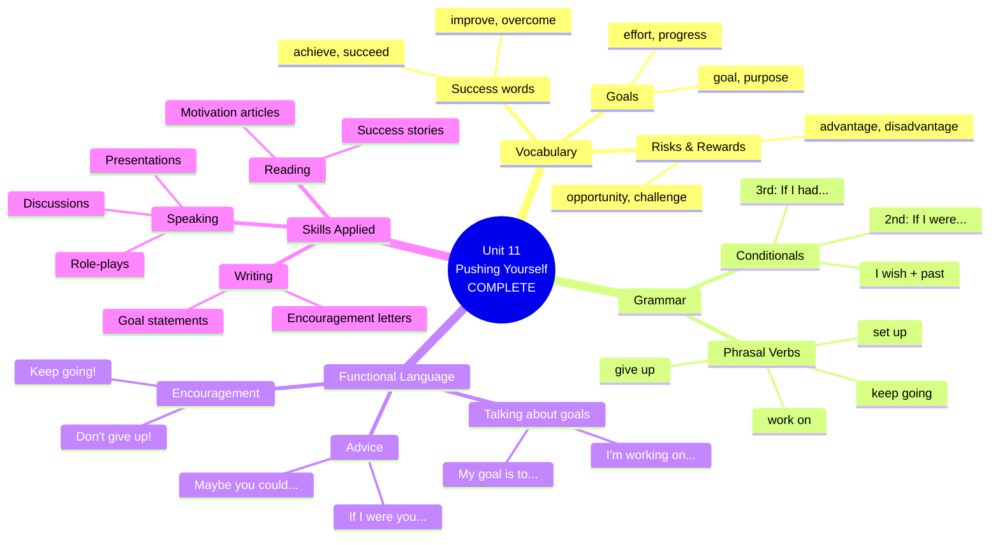

# 🟥 Reading / Writing / Speaking - Pushing Yourself

## 🎯 Introducción

> [!info]- 💡 ¿Qué aprenderás en esta sección?
> 
> En esta nota final aplicarás **TODO** lo aprendido en Unit 11 a través de:
> 
> 1. **Reading** - Leer textos inspiradores sobre metas y superación
> 2. **Writing** - Escribir sobre tus propias experiencias y objetivos
> 3. **Speaking** - Conversar fluidamente sobre pushing yourself
> 
> **¿Por qué es la sección más importante?**
> 
> |Razón|Explicación|Resultado|
> |---|---|---|
> |**Integración total**|Usas vocabulario + gramática + functional language|Dominio completo|
> |**Práctica real**|Situaciones auténticas de comunicación|Confianza al hablar|
> |**Personalización**|Hablas de TU vida, TUS metas|Aprendizaje significativo|
> 
> **El ciclo completo del aprendizaje:**
> 
> ```mermaid
> graph TD
>     A[Unit 11 Journey] --> B[Vocabulary:<br/>Success & Risk]
>     B --> C[Grammar:<br/>Phrasal Verbs &<br/>Conditionals]
>     C --> D[Functional Language:<br/>Natural expressions]
>     D --> E[REAL USE:<br/>Read, Write, Speak]
>     
>     E --> F[Mastery!<br/>You can now discuss<br/>goals & motivation<br/>fluently]
>     
>     style E fill:#ffe1e1
>     style F fill:#e1ffe1
> ```

---

## 📖 A. Reading - Inspiring Stories

> [!note]- 📚 Reading 1: "Never Too Late to Start"
> 
> **Pre-reading: Vocabulary check**
> 
> |Word/Phrase|Meaning|Your example|
> |---|---|---|
> |give up on|abandonar, rendirse con|I won't give up on my dreams|
> |set up|establecer|She set up her own company|
> |take on|asumir, aceptar|He took on a big challenge|
> |work on|trabajar en|I'm working on my skills|
> |breakthrough|avance importante|Her breakthrough came at 45|
> 
> ---
> 
> ### **Never Too Late to Start**
> 
> Maria Santos had always dreamed of **setting up** her own bakery, but life got in the way. She spent twenty years **working on** building someone else's business, afraid to **take on** the risk herself. "What if I fail?" she would ask herself every time the idea came up.
> 
> At 45, after losing her job, Maria faced a choice: **give up on** her dream forever or finally **push herself** to try. "**If I were younger**, I **would** have more time to recover from failure," she thought. But then she realized: "**If I don't try now**, I'll always regret it."
> 
> Starting was terrifying. She had to learn accounting, marketing, and business management while **working on** perfecting her recipes. Many times she wanted to **give up**. "**I wish I had** more experience," she often said. But her family kept encouraging her: "**Don't give up now!** You're **making progress** every day!"
> 
> The first year was incredibly challenging. Sales were slow, and she **struggled with** managing everything alone. "**If I had known** it would be this hard, **would I** still have started?" she asked herself during the toughest moments. But she **kept going**.
> 
> Today, five years later, Maria's bakery is a local success. She employs six people and has expanded to a second location. "**If I had given up** when things got hard, I **would have** missed all of this," she says with a smile. "My advice? **If I were you**, I **would take** that risk. You're never too old to **push yourself** toward your dreams."
> 
> ---
> 
> **Comprehension Questions:**
> 
> 1. **Why didn't Maria start her bakery earlier?**
>     
>     - [ ] She didn't have the skills
>     - [ ] She was afraid of failing
>     - [ ] She didn't want to own a business
>     - [ ] She was too busy traveling
> 2. **What phrasal verb describes what Maria did with her bakery?**
>     
>     - [ ] gave up
>     - [ ] set up
>     - [ ] worked out
>     - [ ] found out
> 3. **Complete: "If I had given up, I _________ missed all of this."**
>     
>     - [ ] will have
>     - [ ] would have
>     - [ ] would
>     - [ ] had
> 4. **What was Maria's biggest challenge?**
>     
>     - [ ] Finding customers
>     - [ ] Learning new skills while starting
>     - [ ] Getting a loan
>     - [ ] Hiring employees
> 5. **What advice does Maria give at the end?**
>     
> 
> > [!success]- ✅ Answers
> > 
> > 1. **She was afraid of failing** ✅
> > 2. **set up** ✅
> > 3. **would have** ✅ (Third conditional - past unreal)
> > 4. **Learning new skills while starting** ✅
> > 5. **"If I were you, I would take that risk"** / Take risks and push yourself toward your dreams ✅

> [!example]- 📚 Reading 2: "The Power of Not Giving Up"
> 
> **Pre-reading: Think about these questions**
> 
> - Have you ever wanted to quit something but didn't?
> - What keeps you going when things are difficult?
> 
> ---
> 
> ### **The Power of Not Giving Up**
> 
> _By Dr. James Chen, Psychologist_
> 
> I've spent fifteen years **researching** what makes some people **succeed** while others **give up**. The answer isn't talent or luck—it's **persistence**.
> 
> **The science is clear:** People who **achieve** their **goals** don't have fewer **obstacles**. They simply refuse to **give up** when **challenges** appear. They **keep going** even when **progress** seems impossible.
> 
> **Consider** this: **If everyone gave up** the first time they failed, we **wouldn't have** electricity, airplanes, or smartphones. Thomas Edison failed thousands of times before succeeding. **If he had quit**, our world **would be** very different today.
> 
> So what separates those who **keep going** from those who **give up**?
> 
> **1. They reframe failure** Successful people don't see failure as the end. **If they fail**, they ask: "What can I learn?" Instead of thinking "I can't do this," they think "I can't do this _yet_."
> 
> **2. They work on small goals** **If you set** unrealistic **goals**, you **will feel** overwhelmed. **If you break** your goal into smaller steps, you **will make** steady **progress**. I always tell my clients: "**If I were you**, I **would focus** on one small **improvement** each week."
> 
> **3. They get support** Nobody succeeds alone. **If you're struggling**, **find out** who can help you. A mentor, a friend, or a support group can make the **difference** between **giving up** and **pushing through**.
> 
> **4. They remember their 'why'** When things get tough, successful people ask: "Why did I start this?" **If your reason** is strong enough, you **will find** a way to **keep going**.
> 
> My message is simple: **Don't give up** on yourself. **If you keep trying**, **if you work on** improving every day, **if you take on** challenges instead of avoiding them—you **will** eventually **succeed**.
> 
> **I wish more** people understood this: The only real failure is **giving up**. Everything else is just **feedback** that helps you **improve**.
> 
> ---
> 
> **Reading Analysis:**
> 
> **1. Find examples in the text:**
> 
> |Structure|Example from text|Line/Paragraph|
> |---|---|---|
> |**Phrasal verb**|give up, keep going, work on...|Throughout|
> |**Second conditional**|If everyone gave up... we wouldn't have...|Paragraph 3|
> |**Third conditional**|If he had quit, our world would be...|Paragraph 3|
> |**I wish**|I wish more people understood...|Final paragraph|
> 
> **2. Discussion questions:**
> 
> - Do you agree that persistence is more important than talent?
> - Which of the 4 points (reframe failure, small goals, support, remember why) is most difficult for you?
> - Can you think of a time when you didn't give up and eventually succeeded?
> 
> **3. Vocabulary in context:**
> 
> Find these words in the text and write what they mean:
> 
> - **obstacles** = _____________
> - **reframe** = _____________
> - **feedback** = _____________
> - **overwhelmed** = _____________

> [!tip]- 📚 Reading 3: Short Motivational Quotes - Analysis
> 
> **Analyze these quotes using Unit 11 grammar:**
> 
> ---
> 
> **Quote 1:**
> 
> > _"If you never try, you'll never know what you're capable of."_
> 
> **Grammar analysis:**
> 
> - Structure: First conditional (If + present, will + verb)
> - Message: About taking action vs. staying in comfort zone
> - Rewrite in 2nd conditional: **"If you didn't try, you would never know..."**
> 
> ---
> 
> **Quote 2:**
> 
> > _"I wish I had started sooner."_ — Common regret
> 
> **Grammar analysis:**
> 
> - Structure: I wish + past perfect (regret about the past)
> - Message: Regret about not starting earlier
> - Future lesson: **"Don't wait. If I were you, I would start now."**
> 
> ---
> 
> **Quote 3:**
> 
> > _"Don't give up on your dreams. Keep going when things get hard."_
> 
> **Grammar analysis:**
> 
> - Phrasal verbs: give up on, keep going
> - Structure: Imperatives (commands/advice)
> - Expanded: **"If you give up on your dreams, you'll always regret it. If you keep going, you will eventually succeed."**
> 
> ---
> 
> **Quote 4:**
> 
> > _"If I had known it would be this hard, I still would have done it."_
> 
> **Grammar analysis:**
> 
> - Structure: Third conditional (past unreal)
> - Message: Worth it despite difficulty
> - Key insight: Knowing difficulty doesn't change the decision
> 
> ---
> 
> **Your turn: Create your own motivational quote**
> 
> Use one of these structures:
> 
> - [ ] Second conditional: "If you were..., you would..."
> - [ ] I wish: "I wish people would..."
> - [ ] Phrasal verbs: "Never give up on... Always keep..."
> - [ ] Third conditional: "If I had..., I would have..."
> 
> **My quote:**
> 
> ---
> 
> ---

---

## ✍️ B. Writing Tasks

> [!note]- ✏️ Writing Task 1: A Time You Pushed Yourself
> 
> **Instructions:**
> 
> Write about a time when you **pushed yourself** to achieve something difficult. Use:
> 
> - ✅ At least 5 phrasal verbs (give up, keep going, work on, set up, find out, etc.)
> - ✅ At least 2 conditional sentences (2nd or 3rd conditional)
> - ✅ Functional language for talking about goals/challenges
> - ✅ 200-250 words
> 
> ---
> 
> **Writing Plan (use this structure):**
> 
> **Paragraph 1: Introduction (30-50 words)**
> 
> - What was the challenge/goal?
> - When did this happen?
> - Why was it important to you?
> 
> ```
> Example opening:
> "Two years ago, I decided to push myself to learn English. 
> If someone had told me how challenging it would be, I might 
> have been scared, but I'm glad I didn't know..."
> ```
> 
> **Paragraph 2: The Challenge (80-100 words)**
> 
> - What difficulties did you face?
> - Did you want to give up? When?
> - What kept you going?
> - Use phrasal verbs here!
> 
> ```
> Key phrases to include:
> - "I was working on..."
> - "I struggled with..."
> - "Many times I wanted to give up, but..."
> - "I kept going because..."
> - "If I had given up..."
> ```
> 
> **Paragraph 3: The Result & Reflection (80-100 words)**
> 
> - What happened in the end?
> - What did you learn?
> - What advice would you give?
> 
> ```
> Key phrases:
> - "Looking back, if I had..."
> - "I wish I had known..."
> - "If I were you, I would..."
> - "Now I understand that..."
> ```
> 
> ---
> 
> **Checklist before submitting:**
> 
> - [ ] Used at least 5 different phrasal verbs
> - [ ] Included 2+ conditional sentences
> - [ ] Wrote 200-250 words
> - [ ] Checked spelling and grammar
> - [ ] Used functional language naturally
> - [ ] Made it personal and authentic

> [!success]- ✏️ Writing Task 2: Your Current Goals
> 
> **Instructions:**
> 
> Write about your current goals and what you're doing to achieve them.
> 
> - ✅ Use present continuous for current actions ("I'm working on...")
> - ✅ Use second conditional for hypothetical situations
> - ✅ Use "I wish" to express desires
> - ✅ 150-200 words
> 
> ---
> 
> **Guided template:**
> 
> **1. State your main goal:**
> 
> ```
> My main goal right now is to _______________________________
> This is important to me because _____________________________
> ```
> 
> **2. What you're currently doing:**
> 
> ```
> I'm working on _________________________________________
> I'm trying to __________________________________________
> I'm pushing myself to ___________________________________
> Every day, I ___________________________________________
> ```
> 
> **3. Challenges and wishes:**
> 
> ```
> The biggest challenge is _________________________________
> Sometimes I wish I _____________________________________
> If I had more __________, I would _______________________
> ```
> 
> **4. What keeps you going:**
> 
> ```
> I keep going because ____________________________________
> If I gave up now, I would ________________________________
> I'm determined to ______________________________________
> ```
> 
> **5. Advice to yourself:**
> 
> ```
> If I were giving advice to myself, I would say: "______________
> _______________________________________________________"
> ```
> 
> ---
> 
> **Example (partial):**
> 
> _My main goal right now is to become fluent in English. This is important to me because it will open up career opportunities internationally._
> 
> _I'm working on improving my speaking skills every day. I'm trying to watch English content without subtitles, and I'm pushing myself to think in English instead of translating. Every day, I study for at least 30 minutes._
> 
> _The biggest challenge is finding time to practice. Sometimes I wish I had more hours in the day. If I had a native English speaker to practice with regularly, I would improve much faster..._

> [!tip]- ✏️ Writing Task 3: Letter of Encouragement
> 
> **Scenario:**
> 
> Your friend is thinking about giving up on their dream of starting a small business because they've faced several setbacks. Write them an encouraging letter.
> 
> **Requirements:**
> 
> - ✅ Use functional language for encouragement
> - ✅ Give advice using "If I were you..."
> - ✅ Use phrasal verbs naturally
> - ✅ 150-200 words
> - ✅ Warm, supportive tone
> 
> ---
> 
> **Letter structure:**
> 
> ```
> Dear [Friend's name],
> 
> [Opening: Acknowledge their feelings]
> I heard that you're thinking about giving up on your business idea. 
> I know you've been going through a difficult time, and...
> 
> [Encouragement: 2-3 sentences]
> Please don't give up now! You've worked so hard and...
> Remember why you started this...
> 
> [Advice: Use conditionals]
> If I were you, I would...
> Have you considered...?
> 
> [Motivation: Strong closing]
> I believe in you and I know you can...
> Keep going, and...
> 
> [Sign off]
> You've got this!
> [Your name]
> ```
> 
> ---
> 
> **Useful phrases for this letter:**
> 
> |Purpose|Phrases|
> |---|---|
> |**Acknowledge**|I know it's been tough... / I understand you're feeling...|
> |**Encourage**|Don't give up now / Keep going / You're so close|
> |**Advise**|If I were you, I would... / Maybe you could...|
> |**Motivate**|You're capable of... / I believe in... / Remember that...|
> |**Support**|I'm here for you / If you need help... / You're not alone|
> 
> ---
> 
> **Challenge:** Write TWO versions:
> 
> 1. **Formal tone** (like to a colleague)
> 2. **Casual tone** (like to a close friend)

---

## 🗣️ C. Speaking Practice

> [!note]- 🎤 Speaking Task 1: Personal Goals Presentation
> 
> **Prepare a 2-3 minute presentation about your goals.**
> 
> **Structure:**
> 
> **Part 1: Introduction (30 seconds)**
> 
> ```
> "Hello, today I want to talk about my personal goals.
> Right now, I'm working on ___________...
> This is important to me because ___________..."
> ```
> 
> **Part 2: The Goal & Progress (1 minute)**
> 
> ```
> "My main goal is to ___________...
> I'm trying to ___________ every day.
> So far, I'm making progress / I'm struggling with ___________...
> 
> If I had more ___________, I would ___________...
> I wish I were more ___________, but I'm working on it."
> ```
> 
> **Part 3: Challenges & Determination (1 minute)**
> 
> ```
> "The biggest challenge is ___________...
> Sometimes I want to give up, especially when ___________...
> But I keep going because ___________...
> 
> If I gave up now, I would ___________...
> I'm determined to succeed, and nothing will stop me."
> ```
> 
> **Part 4: Advice & Conclusion (30 seconds)**
> 
> ```
> "If I were giving advice to someone with similar goals, 
> I would say: ___________...
> 
> In conclusion, I believe that if you don't give up and 
> you keep working on your goals, you will eventually succeed."
> ```
> 
> ---
> 
> **Preparation checklist:**
> 
> - [ ] Written outline (don't memorize word-for-word!)
> - [ ] Include at least 4 phrasal verbs
> - [ ] Use at least 2 conditional sentences
> - [ ] Practice pronunciation (stress on particles!)
> - [ ] Use natural intonation (enthusiasm!)
> - [ ] Time yourself (2-3 minutes)
> - [ ] Practice in front of a mirror or record yourself
> 
> **Delivery tips:**
> 
> ✅ Speak clearly and not too fast ✅ Make eye contact (if presenting to someone) ✅ Use hand gestures for emphasis ✅ Show emotion (passion about your goals!) ✅ Pause after important points

> [!example]- 🎤 Speaking Task 2: Role-Play Conversations
> 
> **Role-play 1: Encouraging a Friend**
> 
> **Situation:** Your friend wants to quit learning a new skill
> 
> **Your role:** Encourage them and give advice
> 
> **Student A (Friend - the one who wants to quit):**
> 
> ```
> "I'm thinking about giving up on learning to code. 
> It's too difficult, and I keep making mistakes. 
> I don't think I'm good enough..."
> ```
> 
> **Student B (You - the encourager):**
> 
> ```
> [Use functional language from Unit 11]
> - Don't give up!
> - If I were you, I would...
> - Keep going because...
> - You're making progress...
> - I believe in you...
> ```
> 
> ---
> 
> **Role-play 2: Job Interview - Discussing Challenges**
> 
> **Situation:** Interview question about overcoming obstacles
> 
> **Interviewer asks:** _"Tell me about a time when you faced a significant challenge. How did you handle it?"_
> 
> **Your answer should include:**
> 
> ```
> ✅ "I was working on ___________ when I faced ___________...
> ✅ At first, I struggled with ___________, but I didn't give up.
> ✅ I kept going by ___________...
> ✅ If I had given up, I would have ___________...
> ✅ In the end, I successfully ___________...
> ✅ This experience taught me that ___________..."
> ```
> 
> ---
> 
> **Role-play 3: Giving Advice - Career Decisions**
> 
> **Situation:** Friend asks for advice about a risky career move
> 
> **Friend says:** _"I have a job offer at a startup, but it's risky. The pay is lower, but it's my dream field. What should I do?"_
> 
> **Your response using Unit 11 language:**
> 
> ```
> ✅ "If I were you, I would consider..."
> ✅ "What are the risks and rewards?"
> ✅ "If you took this opportunity, you would/wouldn't..."
> ✅ "Have you thought about...?"
> ✅ "If you don't take this chance, you might regret..."
> ```
> 
> ---
> 
> **Practice tips:**
> 
> - Record the role-play
> - Switch roles and do it again
> - Try to speak for at least 2 minutes each
> - Use natural pronunciation and intonation

> [!success]- 🎤 Speaking Task 3: Discussion Questions
> 
> **Discuss these questions with a partner or record yourself answering:**
> 
> **Set 1: Personal Experience**
> 
> 1. **Have you ever wanted to give up on something but didn't? What happened?**
>     
>     ```
>     Answer template:
>     "Yes, when I was ___________, I wanted to give up because ___________...
>     But I kept going because ___________...
>     If I had given up, I would have ___________...
>     Now I'm glad I didn't quit because ___________..."
>     ```
>     
> 2. **What goal are you currently working on? What challenges are you facing?**
>     
>     ```
>     "Right now, I'm working on ___________...
>     The main challenge is ___________...
>     I'm trying to ___________ every day...
>     Sometimes I wish I ___________, but I keep pushing myself..."
>     ```
>     
> 3. **Who has encouraged you when you wanted to give up? What did they say?**
>     
>     ```
>     "___________ encouraged me when I ___________...
>     They said, '___________...'
>     If they hadn't encouraged me, I would have ___________...
>     Their support helped me to ___________..."
>     ```
>     
> 
> ---
> 
> **Set 2: Hypothetical Situations**
> 
> 4. **If you had no fear of failure, what would you try?**
>     
>     ```
>     "If I had no fear of failure, I would ___________...
>     I would set up ___________...
>     I would take on the challenge of ___________...
>     If I succeeded, I would ___________..."
>     ```
>     
> 5. **If you could give advice to your younger self, what would you say?**
>     
>     ```
>     "If I could talk to my younger self, I would say:
>     'Don't give up on ___________...
>     Keep working on ___________...
>     If I were you, I would ___________...
>     Don't be afraid to ___________...'"
>     ```
>     
> 6. **What would you do differently if you could start your current goal over?**
>     
>     ```
>     "If I could start over, I would ___________...
>     I wouldn't ___________ like I did...
>     I wish I had ___________ from the beginning...
>     But I've learned that ___________..."
>     ```
>     
> 
> ---
> 
> **Set 3: Advice & Opinions**
> 
> 7. **What advice would you give someone who wants to start their own business?**
>     
>     ```
>     "If I were you, I would ___________...
>     Make sure you ___________ before you ___________...
>     Don't give up when ___________...
>     Keep working on ___________ even when ___________...
>     If you're determined and you don't give up, you will ___________..."
>     ```
>     
> 8. **Do you think it's better to take risks or play it safe? Why?**
>     
>     ```
>     "I think it's better to ___________ because ___________...
>     If you always play it safe, you will ___________...
>     If you take risks, you might ___________, but ___________...
>     In my opinion, ___________..."
>     ```
>     
> 9. **What's the most important quality for achieving goals?**
>     
>     ```
>     "I believe the most important quality is ___________...
>     If you don't have ___________, you will ___________...
>     For example, ___________...
>     Even if you ___________, you need to keep ___________..."
>     ```
>     
> 
> ---
> 
> **Speaking evaluation criteria:**
> 
> Rate yourself (1-5) on:
> 
> - [ ] Used phrasal verbs correctly
> - [ ] Used conditional structures
> - [ ] Pronunciation (stress & linking)
> - [ ] Fluency (spoke without too many pauses)
> - [ ] Used functional language naturally
> - [ ] Expressed ideas clearly

---

## 🎯 D. Integrated Skills Challenge

> [!tip]- 🏆 Final Challenge: "My Goal Journey" Project
> 
> **This is your capstone project for Unit 11!**
> 
> **The Challenge:**
> 
> Create a complete "Goal Journey" presentation that includes:
> 
> 1. ✅ **Reading** - Research an inspiring success story
> 2. ✅ **Writing** - Write your own goal statement and plan
> 3. ✅ **Speaking** - Present your journey (5 minutes)
> 
> ---
> 
> ### **Part 1: READING (Research)**
> 
> **Find and read about someone who pushed themselves to succeed:**
> 
> - Could be a famous person (entrepreneur, athlete, artist)
> - Could be someone you know personally
> - Could be a historical figure
> 
> **Take notes on:**
> 
> ```
> 1. What was their goal? ___________
> 2. What challenges did they face? ___________
> 3. Did they want to give up? When? ___________
> 4. What kept them going? ___________
> 5. What was the result? ___________
> 6. What can you learn from their story? ___________
> ```
> 
> ---
> 
> ### **Part 2: WRITING (Your Goal Plan)**
> 
> **Write a detailed plan (300-400 words) including:**
> 
> **Section 1: Your Goal**
> 
> ```
> - What is your goal?
> - Why is it important?
> - When do you want to achieve it?
> - What inspired you (maybe the story you read)?
> ```
> 
> **Section 2: Your Action Plan**
> 
> ```
> - What are you currently working on?
> - What specific steps will you take?
> - What resources do you need?
> - How will you measure progress?
> 
> Use these patterns:
> ✅ I'm going to set up...
> ✅ I will work on... every day/week
> ✅ I need to find out about...
> ✅ If I face challenges, I will...
> ```
> 
> **Section 3: Anticipating Challenges**
> 
> ```
> - What challenges do you expect?
> - What might make you want to give up?
> - How will you stay motivated?
> 
> Use conditionals:
> ✅ If I struggle with..., I will...
> ✅ If I feel like giving up, I will remember...
> ✅ If I had unlimited resources, I would...
> ```
> 
> **Section 4: Commitment Statement**
> 
> ```
> Write a powerful statement about your determination:
> 
> ✅ I'm determined to...
> ✅ I will never give up on... because...
> ✅ Even if..., I will keep going
> ✅ If I succeed, I will...
> ```
> 
> ---
> 
> ### **Part 3: SPEAKING (Present Your Journey)**
> 
> **Create a 5-minute presentation with these elements:**
> 
> **Slide 1: Introduction (30 seconds)**
> 
> - Your name
> - Your goal in one sentence
> - Hook: "Today I'll share my journey to..."
> 
> **Slide 2: Inspiration (1 minute)**
> 
> - Briefly tell the story you researched
> - Connection: "This inspired me because..."
> - Key lesson you learned
> 
> **Slide 3: My Goal (1 minute)**
> 
> - What exactly you want to achieve
> - Why it matters to you personally
> - Timeline
> 
> **Slide 4: My Plan (1.5 minutes)**
> 
> - Concrete steps you'll take
> - What you're already working on
> - Resources and support you need
> 
> **Slide 5: Challenges & Commitment (1 minute)**
> 
> - Expected challenges
> - How you'll overcome them
> - Your commitment statement
> - Call to action for audience
> 
> ---
> 
> **Presentation requirements:**
> 
> Must include:
> 
> - [ ] At least 8 phrasal verbs used naturally
> - [ ] At least 4 conditional sentences (2nd or 3rd)
> - [ ] Functional language for motivation/advice
> - [ ] Personal and authentic
> - [ ] Visual aids (slides, images, or props)
> - [ ] Practiced delivery (confident, clear, enthusiastic)
> 
> **Bonus points for:**
> 
> - Including a quote that inspires you
> - Sharing a personal story of when you almost gave up
> - Asking the audience a thought-provoking question
> - Using creative visual aids

---

## 📊 Self-Assessment & Review

> [!note]- ✅ Unit 11 Mastery Checklist
> 
> **Check off what you can do confidently:**
> 
> ### **Vocabulary**
> 
> - [ ] I can use words about success (achieve, succeed, improve, overcome)
> - [ ] I can talk about risks and rewards
> - [ ] I can use words about goals and challenges naturally
> 
> ### **Grammar**
> 
> - [ ] I can use phrasal verbs correctly (give up, keep going, work on, etc.)
> - [ ] I can form second conditional sentences (If I were..., I would...)
> - [ ] I can use "I wish" - past simple for present regrets
> - [ ] I can use "If only" for emphasis
> - [ ] I can give advice with "If I were you..."
> 
> ### **Functional Language**
> 
> - [ ] I can talk about my goals naturally ("I'm working on...")
> - [ ] I can encourage others effectively ("Don't give up!")
> - [ ] I can express determination ("I'm determined to...")
> - [ ] I can give advice supportively ("If I were you...")
> 
> ### **Pronunciation**
> 
> - [ ] I stress phrasal verbs correctly (give UP, not GIVE up)
> - [ ] I link words naturally (give_up, work_on)
> - [ ] I use appropriate intonation for encouragement
> 
> ### **Skills**
> 
> - [ ] I can read texts about goals and challenges
> - [ ] I can write about my personal goals
> - [ ] I can write encouraging messages
> - [ ] I can speak for 2-3 minutes about my goals
> - [ ] I can have conversations about pushing yourself
> 
> ---
> 
> **If you checked 20+ items:** 🎉 **Excellent! You've mastered Unit 11!**
> 
> **If you checked 15-19 items:** 👍 **Good progress! Review weak areas.**
> 
> **If you checked less than 15:** 📚 **Go back and practice more.**

> [!quote]- 💭 Reflection Questions
> 
> **Take a moment to reflect on your learning:**
> 
> 1. **What was the most useful thing you learned in Unit 11?**
>     
>     ---
>     
>     ---
>     
> 2. **Which phrasal verb will you use most in real life?**
>     
>     ---
>     
> 3. **What goal are you going to push yourself to achieve after studying this unit?**
>     
>     ---
>     
>     ---
>     
> 4. **If you could give one piece of advice about learning English to yourself, what would it be? (Use: "If I were you, I would...")**
>     
>     ---
>     
>     ---
>     
> 5. **Complete this sentence: "If I had started learning English seriously earlier, I would..."**
>     
>     ---
>     
>     ---
>     
> 6. **What's one thing you wish you were better at in English?**
>     
>     I wish I ___________________________________
>     
> 7. **What will you keep working on?**
>     
>     I'm going to keep working on ____________________
>     
>     ---
>     

---

## 🎯 Key Takeaways - Unit 11 Summary



---

## 🚀 Moving Forward

> [!success]- 🌟 What's Next?
> 
> **You've completed Unit 11! Here's what to do now:**
> 
> |Action|Purpose|How|
> |---|---|---|
> |**Practice daily**|Maintain your skills|Use 1 phrasal verb/day in real life|
> |**Set a real goal**|Apply what you learned|Use Unit 11 language to plan it|
> |**Help others**|Reinforce learning|Encourage a friend using this language|
> |**Review regularly**|Long-term retention|Review notes once a week|
> |**Use it naturally**|Make it automatic|Think in English about your goals|
> 
> **Your Unit 11 action plan:**
> 
> ```
> This week, I will:
> 1. _________________________________________ (specific goal)
> 2. Use these phrasal verbs: _________________ (choose 3)
> 3. Practice speaking about: _________________ (topic)
> 4. Write in my journal using: _______________ (grammar structure)
> 5. Encourage someone by: ___________________ (specific action)
> ```
> 
> **Remember:**
> 
> > _"If you keep working on your English and you don't give up, you WILL become fluent. Every day of practice is progress. Keep going!"_ ⭐

---

## 📚 Additional Resources

> [!tip]- 🔗 Where to Practice More
> 
> **For Reading:**
> 
> - Success stories on Medium.com
> - Biographies of inspiring people
> - TED Talk transcripts about perseverance
> - Business success blogs
> 
> **For Listening:**
> 
> - TED Talks about goals and success
> - Podcasts: "The Tim Ferriss Show", "How I Built This"
> - YouTube: Motivational speeches
> - Interviews with successful entrepreneurs
> 
> **For Writing:**
> 
> - Keep a goal journal in English
> - Write weekly progress reports
> - Join online forums about self-improvement
> - Comment on motivational posts
> 
> **For Speaking:**
> 
> - Join English conversation groups
> - Find a language exchange partner
> - Record yourself talking about your goals
> - Practice with language learning apps
> 
> **Phrasal Verbs Practice:**
> 
> - English phrasal verbs apps
> - Online quizzes
> - Real-life usage tracking
> - Create your own example sentences daily

---

**Final Message:**

> [!quote] 💪 Your Journey Continues
> 
> You've learned the vocabulary, mastered the grammar, practiced the functional language, and applied everything through reading, writing, and speaking.
> 
> **Now it's time to push yourself in real life.**
> 
> Don't give up on your English learning journey. Keep going even when it's challenging. Work on improving every single day. If you keep at it, you WILL succeed.
> 
> **If I were you, I would celebrate how far you've come—and then keep pushing forward.** 🚀
> 
> _You've got this!_ ⭐

---

**Tags:** #english #reading #writing #speaking #unit11 #pushing-yourself #integrated-skills #practice #real-use #mastery #goals #success #motivation