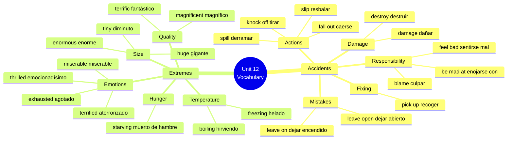

# 🟦 Vocabulary & Use - Accidents + Extremes

## 🎯 Introducción

> [!info]- 💡 ¿Qué aprenderás en esta sección?
> 
> En esta nota dominarás el vocabulario esencial para hablar sobre:
> 
> 1. **Accidents & Mistakes** - Describir accidentes, errores y sus consecuencias
> 2. **Extreme Adjectives** - Expresar emociones y situaciones de forma intensa
> 
> **¿Por qué este vocabulario es importante?**
> 
> |Categoría|Uso Real|Ejemplo de Vida Real|
> |---|---|---|
> |**Accidents**|Explicar qué pasó|"I spilled coffee on my laptop!"|
> |**Blame & Responsibility**|Discutir responsabilidad|"It wasn't my fault"|
> |**Extreme Emotions**|Expresar intensidad|"I was exhausted" (más fuerte que "tired")|
> |**Extreme Descriptions**|Hacer el lenguaje más vívido|"It was freezing!" (más fuerte que "cold")|
> 
> **Conexión práctica:**
> 
> ```mermaid
> graph TD
>     A[Life's Little Lessons] --> B[Accidents Happen]
>     A --> C[Strong Reactions]
>     
>     B --> D[Accident Verbs:<br/>spill, slip, knock off]
>     B --> E[Responsibility:<br/>blame, feel bad]
>     
>     C --> F[Extreme Adjectives:<br/>exhausted, terrified]
>     C --> G[Reactions:<br/>be mad at, feel awful]
>     
>     style B fill:#ffe1e1
>     style C fill:#e1f5ff
>     style D fill:#fff4e1
>     style F fill:#e1ffe1
> ```

---

## 🚨 A. Describing Accidents - Verbs & Expressions

> [!example]- 💥 Accident Verbs (What Happened)
> 
> **Core accident verbs:**
> 
> |Verb|Spanish|Definition|Example|
> |---|---|---|---|
> |**spill**|derramar|to accidentally make liquid fall|I spilled coffee on my shirt|
> |**slip**|resbalar(se)|to lose balance and fall/slide|I slipped on the wet floor|
> |**knock off**|tirar/botar|to hit something so it falls|I knocked off the vase from the table|
> |**fall out**|caerse (de)|to drop out of something|My phone fell out of my pocket|
> |**pull out**|sacar bruscamente|to remove suddenly|He pulled out of the parking spot too fast|
> |**shake**|sacudir/temblar|to move quickly back and forth|The building shook during the earthquake|
> |**damage**|dañar|to harm/break partially|The accident damaged my car|
> |**destroy**|destruir|to ruin completely|The fire destroyed the building|
> 
> **Detailed examples:**
> 
> ```
> SPILL (derramar):
> ✅ I spilled milk all over the kitchen floor
> ✅ She spilled her drink on the carpet
> ✅ Don't spill the paint!
> ✅ I accidentally spilled water on my notes
> 
> Common collocations:
> • spill coffee/water/milk/wine
> • spill something on something
> • spill something all over
> 
> SLIP (resbalar):
> ✅ I slipped on a banana peel (¡como en las caricaturas!)
> ✅ She slipped on the ice and fell
> ✅ Be careful not to slip on the wet floor
> ✅ He slipped and twisted his ankle
> 
> Common patterns:
> • slip on + surface (ice, floor, stairs)
> • slip and fall
> • slip and hurt yourself
> 
> KNOCK OFF (tirar):
> ✅ I knocked off my coffee cup with my elbow
> ✅ The cat knocked off all the things from the shelf
> ✅ Be careful not to knock off the glasses
> ✅ He knocked off the vase while cleaning
> 
> Pattern:
> • knock off + object + from + place
> • knock something off accidentally
> 
> FALL OUT (caerse de):
> ✅ My keys fell out of my bag
> ✅ The money fell out of my wallet
> ✅ His phone fell out of his pocket
> ✅ Papers fell out of the folder
> 
> Pattern:
> • fall out of + container/place
> 
> DAMAGE vs DESTROY:
> 
> DAMAGE (parcial):
> ✅ The screen is damaged but still works
> ✅ The storm damaged the roof
> ✅ I damaged my phone when I dropped it
> 
> DESTROY (total):
> ✅ The fire completely destroyed the house
> ✅ The earthquake destroyed the city
> ✅ My laptop was destroyed in the accident
> 
> Key difference:
> damaged = broken but maybe repairable
> destroyed = completely ruined, can't be fixed
> ```

> [!success]- 😬 Responsibility & Feelings (What You Do After)
> 
> **Expressing responsibility and reactions:**
> 
> |Expression|Spanish|When to Use|Example|
> |---|---|---|---|
> |**blame (someone)**|culpar|to say it's someone's fault|Don't blame me! It wasn't my fault|
> |**be mad at (someone)**|estar enojado con|to be angry at someone|She's mad at me for breaking her cup|
> |**feel bad (about)**|sentirse mal (por)|to feel guilty/sorry|I feel bad about spilling your coffee|
> |**pick up**|recoger|to lift from the ground|I picked up the broken glass|
> |**leave on**|dejar prendido/encendido|to not turn off|I left the lights on all night|
> |**leave open**|dejar abierto|to not close|Someone left the window open|
> 
> **Detailed usage:**
> 
> ```
> BLAME:
> ✅ He blamed me for the accident
> ✅ Don't blame yourself, it wasn't your fault
> ✅ She always blames others for her mistakes
> ✅ Who are you going to blame?
> 
> Patterns:
> • blame someone for something
> • blame yourself
> • don't blame me!
> 
> BE MAD AT:
> ✅ My mom is mad at me for coming home late
> ✅ Are you mad at me?
> ✅ I was mad at him for lying
> ✅ Don't be mad at yourself
> 
> Pattern:
> • be mad at + person
> • be mad about + situation
> 
> Example:
> "I'm mad at John" (enojado con John)
> "I'm mad about what happened" (enojado por lo que pasó)
> 
> FEEL BAD (ABOUT):
> ✅ I feel bad about breaking your vase
> ✅ She feels bad about what she said
> ✅ I feel really bad about the accident
> ✅ Don't feel bad, it was an accident
> 
> Patterns:
> • feel bad about + noun/gerund
> • feel bad for someone
> • feel really/so/very bad
> 
> PICK UP:
> ✅ Can you pick up that paper from the floor?
> ✅ I picked up all the broken pieces
> ✅ She picked up the baby
> ✅ Pick up your toys!
> 
> Multiple meanings:
> • pick up = lift from ground (recoger)
> • pick up = collect (recoger a alguien)
> • pick up = learn (aprender)
> 
> LEAVE ON / LEAVE OPEN:
> ✅ I left the TV on all night (prendida)
> ✅ Who left the door open? (abierta)
> ✅ I always leave a light on when I'm away
> ✅ Don't leave the fridge open!
> 
> Pattern:
> • leave + object + on/open
> • forget to turn off = leave on
> • forget to close = leave open
> ```

> [!tip]- 🔄 Complete Accident Scenarios
> 
> **Scenario 1: Kitchen Accident**
> 
> ```
> What happened:
> "I was making coffee when I accidentally knocked off the sugar jar 
> from the counter. It fell and the lid fell out. Sugar spilled 
> everywhere! I slipped on some sugar on the floor and almost fell. 
> The jar was damaged but not destroyed. I had to pick up all the 
> broken pieces and clean the mess."
> 
> Vocabulary used:
> ✅ knocked off
> ✅ fell out
> ✅ spilled
> ✅ slipped
> ✅ damaged vs destroyed
> ✅ pick up
> ```
> 
> **Scenario 2: Taking Responsibility**
> 
> ```
> Situation: You broke your roommate's laptop
> 
> What you say:
> "I feel really bad about what happened. I accidentally knocked off 
> your laptop from the table and it was damaged. I know you're mad 
> at me, and you have every right to be. I want to blame myself 
> for being careless. I left my bag on the table and when I picked 
> it up, I hit the laptop. I'll pay to fix it."
> 
> Vocabulary used:
> ✅ feel bad about
> ✅ knocked off
> ✅ damaged
> ✅ mad at
> ✅ blame
> ✅ picked up
> ```
> 
> **Scenario 3: Leaving Things On/Open**
> 
> ```
> Problem:
> "I left the window open last night and it rained. Water came in 
> and damaged the floor. I also left the AC on all day while I was 
> at work. My roommate is mad at me because the electricity bill 
> will be huge. I feel bad about being so careless."
> 
> Vocabulary used:
> ✅ left open
> ✅ damaged
> ✅ left on
> ✅ mad at
> ✅ feel bad about
> ```

---

## 🌡️ B. Describing Extremes - Extreme Adjectives

> [!note]- ❄️🔥 Temperature & Size Extremes
> 
> **Why use extreme adjectives?**
> 
> Regular adjectives express normal intensity:
> 
> - cold, hot, big, small
> 
> Extreme adjectives express MAXIMUM intensity:
> 
> - freezing, boiling, enormous, tiny
> 
> **Temperature extremes:**
> 
> |Regular|Extreme|Spanish|Example|
> |---|---|---|---|
> |cold ❄️|**freezing**|congelado/helado|It's freezing outside!|
> |hot 🔥|**boiling**|hirviendo|It's boiling in here!|
> 
> **Detailed usage:**
> 
> ```
> FREEZING (congelado/helado):
> ✅ It's freezing in this room! Turn on the heater!
> ✅ I'm freezing! Can I borrow your jacket?
> ✅ The water is freezing, I can't swim
> ✅ It was a freezing cold day
> 
> Common patterns:
> • It's freezing (sobre el clima/temperatura)
> • I'm freezing (sobre cómo te sientes)
> • freezing cold (énfasis doble)
> • a freezing day/night
> 
> ⚠️ Note: "freezing" es mucho más fuerte que "cold"
> cold = hace frío (normal)
> freezing = ¡está helado! (extremo)
> 
> BOILING (hirviendo):
> ✅ It's boiling outside! It must be 40 degrees!
> ✅ I'm boiling! Can you turn on the AC?
> ✅ This soup is boiling hot, be careful!
> ✅ It was a boiling summer day
> 
> Common patterns:
> • It's boiling (clima)
> • I'm boiling (cómo te sientes)
> • boiling hot (énfasis)
> • a boiling day
> 
> ⚠️ Comparison:
> hot = hace calor (normal)
> boiling = ¡está hirviendo! (extremo)
> ```
> 
> **Size extremes:**
> 
> |Regular|Extreme|Spanish|Example|
> |---|---|---|---|
> |big 📦|**enormous**|enorme|That's an enormous house!|
> |big 📦|**huge**|gigante|She made a huge mistake|
> |small 🔍|**tiny**|diminuto/minúsculo|This apartment is tiny!|
> 
> ```
> ENORMOUS (enorme):
> ✅ They live in an enormous mansion
> ✅ That's an enormous problem
> ✅ We ordered an enormous pizza
> ✅ The difference is enormous
> 
> Usage:
> • Use for physical size OR abstract concepts
> • enormous house/car/building (physical)
> • enormous problem/difference/mistake (abstract)
> 
> HUGE (gigante/enorme):
> ✅ This is a huge opportunity
> ✅ We have a huge problem
> ✅ That was a huge mistake
> ✅ There's a huge difference
> 
> Note: "huge" and "enormous" are similar
> • enormous = slightly more formal
> • huge = more common in conversation
> 
> TINY (diminuto/minúsculo):
> ✅ This hotel room is tiny!
> ✅ I found a tiny spider
> ✅ She has a tiny apartment
> ✅ The portions were tiny
> 
> Pattern:
> • tiny room/apartment/house
> • tiny portion/piece
> • a tiny bit (un poquito)
> 
> Comparison:
> small = pequeño (normal)
> tiny = diminuto (extremo)
> ```

> [!example]- 😱😄 Emotional Extremes
> 
> **Extreme emotion adjectives:**
> 
> |Regular|Extreme|Spanish|When to Use|
> |---|---|---|---|
> |tired 😴|**exhausted**|agotado|After very hard work/exercise|
> |scared 😨|**terrified**|aterrorizado|Extreme fear|
> |happy 😊|**thrilled**|emocionadísimo|Extreme happiness/excitement|
> |sad 😢|**miserable**|miserable/muy triste|Extreme sadness|
> |good 👍|**terrific**|fantástico/genial|Extremely good|
> |good 👍|**magnificent**|magnífico/espléndido|Extremely impressive|
> 
> **Detailed usage:**
> 
> ```
> EXHAUSTED (agotado):
> ✅ I'm absolutely exhausted after that workout
> ✅ She was exhausted from working 12 hours
> ✅ I'm too exhausted to go out tonight
> ✅ By the end of the day, I was exhausted
> 
> Pattern:
> • absolutely/completely/totally exhausted
> • exhausted from/after + activity
> • too exhausted to + verb
> 
> Comparison:
> tired = cansado (normal)
> exhausted = agotado completamente (extremo)
> 
> TERRIFIED (aterrorizado):
> ✅ I'm terrified of spiders!
> ✅ She was terrified during the horror movie
> ✅ I was absolutely terrified when I saw the accident
> ✅ He's terrified of flying
> 
> Pattern:
> • terrified of + noun/gerund
> • absolutely terrified
> • terrified when/during...
> 
> Comparison:
> scared = asustado (normal)
> terrified = aterrorizado (extremo)
> 
> THRILLED (emocionadísimo):
> ✅ I'm thrilled about the new job!
> ✅ She was thrilled to hear the news
> ✅ We're absolutely thrilled with the results
> ✅ I'm thrilled that you could come
> 
> Pattern:
> • thrilled about/with + noun
> • thrilled to + verb
> • thrilled that + clause
> • absolutely thrilled
> 
> Comparison:
> happy = feliz (normal)
> thrilled = emocionadísimo (extremo)
> 
> MISERABLE (miserable):
> ✅ I felt miserable after failing the exam
> ✅ This weather makes me miserable
> ✅ He looked absolutely miserable
> ✅ I was miserable without my friends
> 
> Usage:
> • Describes extreme unhappiness
> • Can be about emotions or conditions
> • "miserable weather" = terrible weather
> 
> TERRIFIC (fantástico/genial):
> ✅ That's a terrific idea!
> ✅ You did a terrific job!
> ✅ We had a terrific time
> ✅ The food was terrific
> 
> Note: Despite looking like "terrified," this is POSITIVE!
> • terrific = fantastic, excellent
> • More common in American English
> 
> MAGNIFICENT (magnífico):
> ✅ The view from here is magnificent
> ✅ That was a magnificent performance
> ✅ What a magnificent building!
> ✅ The sunset was absolutely magnificent
> 
> Usage:
> • More formal than "terrific"
> • Often for impressive sights/performances
> • magnificent view/building/performance
> ```

> [!success]- ⚖️ Regular vs Extreme - Comparison Chart
> 
> **Understanding the scale:**
> 
> |Situation|Regular Adjective|Extreme Adjective|Impact|
> |---|---|---|---|
> |**Temperature**|It's cold (5°C)|It's freezing! (-10°C)|❄️❄️❄️|
> |**Temperature**|It's hot (30°C)|It's boiling! (40°C)|🔥🔥🔥|
> |**Size**|It's a big house|It's an enormous house!|🏰|
> |**Size**|It's a small room|It's a tiny room!|📦|
> |**Tiredness**|I'm tired (normal day)|I'm exhausted! (worked 14 hours)|😴😴😴|
> |**Fear**|I'm scared (nervous)|I'm terrified! (panic)|😱😱😱|
> |**Happiness**|I'm happy (good news)|I'm thrilled! (amazing news)|😄😄😄|
> |**Sadness**|I'm sad (bad day)|I'm miserable (awful week)|😢😢😢|
> 
> **Grammar rule with extreme adjectives:**
> 
> ```
> ❌ WRONG: very enormous, very exhausted, very tiny
> ✅ CORRECT: absolutely enormous, completely exhausted, incredibly tiny
> 
> With extreme adjectives, use:
> • absolutely
> • completely
> • totally
> • incredibly
> • utterly
> 
> NOT "very"!
> 
> Examples:
> ✅ It's absolutely freezing!
> ✅ I'm completely exhausted
> ✅ That's incredibly tiny
> ✅ She was utterly terrified
> 
> With regular adjectives, use "very":
> ✅ It's very cold
> ✅ I'm very tired
> ✅ It's very small
> ```

---

## 📚 C. Mini-Glosario EN → ES

> [!note]- 📖 Complete Vocabulary Reference
> 
> **Accidents & Actions:**
> 
> |English|Spanish|Example|
> |---|---|---|
> |**spill**|derramar|I spilled my coffee|
> |**slip**|resbalar(se)|I slipped on ice|
> |**knock off**|tirar/botar/tumbar|I knocked off the cup|
> |**fall out**|caerse (de)|Keys fell out of my bag|
> |**pull out**|sacar bruscamente|He pulled out suddenly|
> |**shake**|sacudir/temblar|The ground shook|
> |**damage**|dañar|The car was damaged|
> |**destroy**|destruir|Fire destroyed it|
> |**blame**|culpar|Don't blame me!|
> |**pick up**|recoger/levantar|Pick up the papers|
> |**leave on**|dejar encendido/prendido|I left the lights on|
> |**leave open**|dejar abierto|Who left the door open?|
> 
> **Feelings & Reactions:**
> 
> |English|Spanish|Example|
> |---|---|---|
> |**be mad at**|estar enojado con|She's mad at me|
> |**feel bad (about)**|sentirse mal (por)|I feel bad about it|
> 
> **Extreme Adjectives - Temperature & Size:**
> 
> |English|Spanish|Opposite|Example|
> |---|---|---|---|
> |**freezing**|congelado/helado|boiling|It's freezing today!|
> |**boiling**|hirviendo|freezing|It's boiling hot!|
> |**enormous**|enorme|tiny|An enormous house|
> |**huge**|gigante/enorme|tiny|A huge problem|
> |**tiny**|diminuto/minúsculo|enormous/huge|A tiny apartment|
> 
> **Extreme Adjectives - Emotions:**
> 
> |English|Spanish|Regular Form|Example|
> |---|---|---|---|
> |**exhausted**|agotado|tired|I'm exhausted!|
> |**terrified**|aterrorizado|scared|I'm terrified of heights|
> |**thrilled**|emocionadísimo|happy|I'm thrilled about it!|
> |**miserable**|miserable/muy triste|sad|I feel miserable|
> |**terrific**|fantástico/genial|good|That's terrific!|
> |**magnificent**|magnífico/espléndido|good/beautiful|A magnificent view|
> 
> **Hungry (informal extreme):**
> 
> |English|Spanish|Regular Form|Example|
> |---|---|---|---|
> |**starving**|muerto de hambre|hungry|I'm starving! Let's eat!|

---

## 🔗 D. Collocations & Real Usage

> [!tip]- 🎯 Common Collocations - Accidents
> 
> **With SPILL:**
> 
> ```
> Common combinations:
> ✅ spill coffee/water/milk/wine/juice
> ✅ spill a drink
> ✅ spill something on something
> ✅ spill something all over
> 
> Natural sentences:
> • I always spill coffee on my shirt in the morning
> • Be careful not to spill your drink!
> • She spilled red wine all over the white carpet
> • I spilled water on my keyboard
> ```
> 
> **With SLIP:**
> 
> ```
> Common combinations:
> ✅ slip on ice/floor/stairs/banana peel
> ✅ slip and fall
> ✅ slip and hurt yourself
> ✅ slip and slide
> 
> Natural sentences:
> • I slipped on the wet floor and hurt my back
> • Be careful not to slip on the ice
> • She slipped on the stairs
> • He slipped and fell in the bathroom
> ```
> 
> **With KNOCK OFF:**
> 
> ```
> Common combinations:
> ✅ knock off + object + from + place
> ✅ knock something off the table/shelf/desk
> ✅ accidentally knock off
> 
> Natural sentences:
> • The cat knocked off my coffee cup from the table
> • I accidentally knocked off all the books from the shelf
> • Don't knock off the vase!
> • He knocked off my phone with his elbow
> ```
> 
> **With DAMAGE / DESTROY:**
> 
> ```
> DAMAGE (partial):
> ✅ damage + car/phone/laptop/property/reputation
> ✅ badly/seriously/severely damaged
> ✅ slightly damaged
> 
> • The phone screen was badly damaged
> • The storm damaged hundreds of homes
> 
> DESTROY (complete):
> ✅ completely/totally destroy
> ✅ destroy + building/house/city/evidence
> 
> • The fire completely destroyed the warehouse
> • The earthquake destroyed the entire city
> ```

> [!example]- 🎯 Common Collocations - Extremes
> 
> **Temperature extremes:**
> 
> ```
> FREEZING:
> ✅ freezing cold
> ✅ freezing weather/temperature
> ✅ freezing water
> ✅ it's absolutely freezing
> 
> • It's freezing cold outside!
> • The water is absolutely freezing
> • We had freezing temperatures last night
> 
> BOILING:
> ✅ boiling hot
> ✅ boiling weather/heat/temperature
> ✅ it's absolutely boiling
> 
> • It's boiling hot in this room!
> • We're having boiling temperatures this week
> • I'm absolutely boiling!
> ```
> 
> **Size extremes:**
> 
> ```
> ENORMOUS/HUGE:
> ✅ enormous/huge house/building/car
> ✅ enormous/huge problem/mistake/difference
> ✅ enormous/huge opportunity/challenge
> 
> • This is an enormous opportunity for us
> • We have a huge problem to solve
> • That was a huge mistake
> 
> TINY:
> ✅ tiny apartment/room/house
> ✅ tiny portion/piece/bit
> ✅ a tiny little + noun
> 
> • This is a tiny apartment for two people
> • The portions at that restaurant are tiny
> • I need a tiny bit of help
> ```
> 
> **Emotional extremes:**
> 
> ```
> EXHAUSTED:
> ✅ absolutely/completely/totally exhausted
> ✅ exhausted from/after + activity
> ✅ too exhausted to + verb
> 
> • I'm absolutely exhausted after that hike
> • She was too exhausted to cook dinner
> 
> TERRIFIED:
> ✅ absolutely/utterly terrified
> ✅ terrified of + noun/gerund
> ✅ look/feel terrified
> 
> • I'm absolutely terrified of flying
> • She looked terrified during the storm
> 
> THRILLED:
> ✅ absolutely thrilled
> ✅ thrilled about/with + noun
> ✅ thrilled to + verb
> 
> • I'm absolutely thrilled with the results!
> • We're thrilled to announce the winner
> ```

---

## 💬 E. Frases Modelo - Situaciones Reales

> [!success]- 🗣️ Model Sentences - Accidents
> 
> **Describing what happened:**
> 
> ```
> Basic descriptions:
> ✅ I slipped and fell on the ice
> ✅ I spilled coffee all over my notes
> ✅ I knocked off the glass from the table
> ✅ My phone fell out of my pocket
> ✅ I left the door open by mistake
> ✅ I forgot and left the AC on all night
> 
> More detailed stories:
> ✅ I was walking to class when I slipped on the wet floor. 
>    I fell and damaged my phone. I feel terrible about it.
> 
> ✅ I accidentally knocked off my roommate's laptop from the desk. 
>    The screen was damaged but not destroyed. She's mad at me,
>    and I don't blame her.
> 
> ✅ I spilled an entire cup of coffee on my keyboard. It was 
>    completely destroyed. I was so careless!
> ```
> 
> **Taking responsibility:**
> 
> ```
> Apologizing:
> ✅ I'm so sorry, it was an accident
> ✅ I feel really bad about what happened
> ✅ I didn't mean to damage it
> ✅ It's my fault, I should have been more careful
> ✅ I take full blame for the accident
> 
> Explaining:
> ✅ I left the window open and it rained inside
> ✅ I knocked off your cup when I was cleaning
> ✅ My keys fell out of my bag somewhere
> ✅ I slipped on the stairs and dropped everything
> 
> Making amends:
> ✅ I'll pay to fix it
> ✅ Let me pick up the broken pieces
> ✅ I'll replace it
> ✅ I'll be more careful next time
> ```

> [!tip]- 🗣️ Model Sentences - Extreme Reactions
> 
> **Expressing strong feelings:**
> 
> ```
> Temperature:
> ✅ It's absolutely freezing in here! Can we turn on the heater?
> ✅ I'm boiling! This room is way too hot!
> ✅ The weather is freezing today, wear a warm coat
> ✅ It was a boiling hot summer day
> 
> Physical state:
> ✅ I'm absolutely exhausted after working 12 hours
> ✅ I'm starving! I haven't eaten all day!
> ✅ I'm completely exhausted, I need to rest
> 
> Emotions:
> ✅ I'm absolutely thrilled about the news!
> ✅ I was terrified during the scary movie
> ✅ I felt miserable after failing the test
> ✅ That's a terrific idea!
> ✅ The view from up here is absolutely magnificent!
> 
> Size reactions:
> ✅ This apartment is tiny! How do you live here?
> ✅ That's an enormous house! It must have 10 bedrooms!
> ✅ We have a huge problem that needs solving
> ✅ This is a tiny portion for the price
> ```
> 
> **Complete reaction stories:**
> 
> ```
> Story 1:
> "Yesterday was terrible! I was absolutely exhausted from work, 
> and when I got home, I realized I'd left the window open. It 
> had rained and there was water everywhere! The floor was 
> damaged. I felt miserable and had to spend hours cleaning."
> 
> Vocabulary used:
> • absolutely exhausted
> • left open
> • damaged
> • miserable
> 
> Story 2:
> "I'm absolutely thrilled! I got the job! When they called me, 
> I was terrified to answer the phone, but the news was terrific! 
> This is an enormous opportunity for me. I'm so excited I can't 
> sleep!"
> 
> Vocabulary used:
> • absolutely thrilled
> • terrified
> • terrific
> • enormous
> 
> Story 3:
> "What a disaster! I spilled an entire pot of boiling hot coffee 
> on the floor. Then I slipped on it and knocked off a huge vase. 
> It was completely destroyed. My roommate is mad at me, and I 
> feel terrible about the whole thing."
> 
> Vocabulary used:
> • spilled
> • boiling hot 
> • slipped 
> • knocked off 
> • huge 
> • destroyed 
> • mad at 
> • feel terrible
> ```

---

## 🎯 F. Practice Exercises

> [!note]- ✏️ Exercise 1: Accident Verbs
> 
> **Choose the correct verb:**
> 
> ```
> spill • slip • knock off • fall out • damage • destroy • pick up • leave on
> 
> 1. I __________ my coffee all over my laptop.
> 2. Be careful not to __________ on the wet floor!
> 3. I accidentally __________ the vase from the shelf.
> 4. My wallet __________ of my bag somewhere.
> 5. The fire completely __________ the building.
> 6. Can you __________ that paper from the floor?
> 7. I __________ the lights __________ all night by mistake.
> 8. The screen is __________, but the phone still works.
> ```
> 
> > [!success]- ✅ Answers
> > 
> > 1. **spilled**
> > 2. **slip**
> > 3. **knocked off**
> > 4. **fell out**
> > 5. **destroyed**
> > 6. **pick up**
> > 7. **left** ... **on**
> > 8. **damaged**

> [!example]- ✏️ Exercise 2: Extreme Adjectives
> 
> **Replace the underlined word with an extreme adjective:**
> 
> ```
> freezing • boiling • enormous • tiny • exhausted • terrified • thrilled • miserable
> 
> 1. I'm very tired after the marathon. → I'm __________
> 2. It's very hot in this room! → It's __________!
> 3. This apartment is very small. → This apartment is __________
> 4. I was very scared during the storm. → I was __________
> 5. We're very happy about the results! → We're __________!
> 6. It's very cold outside! → It's __________!
> 7. That's a very big problem. → That's an __________ problem
> 8. I felt very sad after the news. → I felt __________
> ```
> 
> > [!success]- ✅ Answers
> > 
> > 1. **exhausted**
> > 2. **boiling**
> > 3. **tiny**
> > 4. **terrified**
> > 5. **thrilled**
> > 6. **freezing**
> > 7. **enormous**
> > 8. **miserable**

> [!tip]- ✏️ Exercise 3: Complete the Dialogue
> 
> **Fill in the gaps with appropriate vocabulary:**
> 
> ```
> A: Oh no! What happened here?
> 
> B: I'm so sorry! I (1)__________ my coffee all over your desk. 
>    Then I tried to clean it and I (2)__________ your pen holder. 
>    Everything (3)__________ onto the floor.
> 
> A: Is my laptop (4)__________?
> 
> B: I don't think so. It looks okay. I'm really sorry. I 
>    (5)__________ so bad about this!
> 
> A: It's okay, accidents happen. Are you (6)__________ me?
> 
> B: No! Why would I be mad at you? You didn't do anything!
> 
> A: I meant, are you mad that I (7)__________ my stuff all over 
>    your workspace?
> 
> B: Oh! No, I'm not (8)__________ at you. I'm mad at myself for 
>    being so clumsy. Let me (9)__________ all of this and 
>    clean it properly.
> ```
> 
> > [!success]- ✅ Sample Answers
> > 
> > 1. **spilled**
> > 2. **knocked off**
> > 3. **fell out**
> > 4. **damaged**
> > 5. **feel**
> > 6. **mad at**
> > 7. **left**
> > 8. **mad**
> > 9. **pick up**

---

## 📊 Visual Summary



---

## 🔗 Connection to Next Topics

> [!note]- 🌟 Ready for Grammar
> 
> **You've mastered the vocabulary. Now you'll learn to:**
> 
> |Current Skill|Next Step|Example|
> |---|---|---|
> |**Accident vocabulary**|Indefinite pronouns|"Someone spilled coffee"|
> |**Extreme adjectives**|Reported speech|"She said she was exhausted"|
> |**Real situations**|Report what happened|"He told me he'd damaged the car"|
> 
> ```mermaid
> graph LR
>     A[Vocabulary:<br/>Accidents & Extremes] --> B[Grammar:<br/>Indefinite Pronouns &<br/>Reported Speech]
>     B --> C[Functional Language:<br/>Reacting & Reporting]
>     C --> D[Real Use:<br/>Tell stories about<br/>life's little lessons]
>     
>     style A fill:#e1ffe1
>     style B fill:#fff4e1
>     style C fill:#e1f5ff
>     style D fill:#ffe1e1
> ```

---

**Tags:** #english #vocabulary #unit12 #accidents #extreme-adjectives #collocations #life-lessons #mistakes
