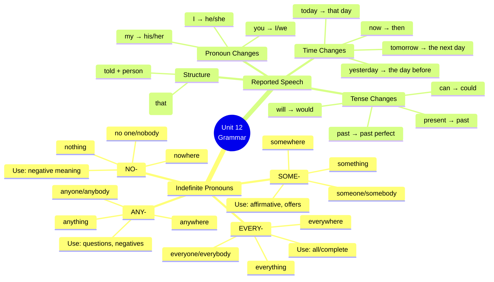

# 🟨 Grammar & Examples - Indefinite Pronouns + Reported Speech

## 🎯 Introducción

> [!info]- 💡 ¿Qué aprenderás en esta sección?
> 
> En esta nota dominarás dos estructuras gramaticales esenciales para contar lo que pasó:
> 
> 1. **Indefinite Pronouns** - Para hablar de personas y cosas de forma general
> 2. **Reported Speech** - Para reportar lo que alguien dijo
> 
> **¿Por qué son importantes juntos?**
> 
> |Estructura|Función|Ejemplo con Unit 12|
> |---|---|---|
> |**Indefinite Pronouns**|Hablar sin especificar exactamente quién/qué|"Someone left the door open"|
> |**Reported Speech**|Contar lo que otros dijeron|"He said he was sorry"|
> 
> **Conexión práctica:**
> 
> ```mermaid
> graph TD
>     A[Telling Stories About<br/>Life's Little Lessons] --> B[Indefinite Pronouns]
>     A --> C[Reported Speech]
>     
>     B --> D["Someone spilled coffee"<br/>"I didn't see anyone"<br/>"Nothing was damaged"]
>     C --> E["She said she was sorry"<br/>"He told me he felt bad"<br/>"They said it was an accident"]
>     
>     D --> F[Tell complete stories<br/>about what happened]
>     E --> F
>     
>     style B fill:#e1ffe1
>     style C fill:#fff4e1
>     style F fill:#e1f5ff
> ```

---

## 👥 A. Indefinite Pronouns - Introduction

> [!note]- 📘 ¿Qué son los Indefinite Pronouns?
> 
> **Definición:** Los **indefinite pronouns** se usan para referirse a personas o cosas de forma **no específica** (sin decir exactamente quién o qué).
> 
> **Estructura básica:**
> 
> ```
> SOME-  +  -ONE / -BODY / -THING / -WHERE
> ANY-
> NO-
> EVERY-
> 
> Examples:
> someone = alguien (no específico)
> anything = cualquier cosa
> nowhere = ningún lugar
> everybody = todos
> ```
> 
> **Las 4 familias:**
> 
> |Prefix|-ONE/-BODY (personas)|-THING (cosas)|-WHERE (lugares)|
> |---|---|---|---|
> |**SOME-**|someone / somebody|something|somewhere|
> |**ANY-**|anyone / anybody|anything|anywhere|
> |**NO-**|no one / nobody|nothing|nowhere|
> |**EVERY-**|everyone / everybody|everything|everywhere|
> 
> **Tabla de significados:**
> 
> |English|Spanish|Example|
> |---|---|---|
> |**someone/somebody**|alguien|Someone left the door open|
> |**anyone/anybody**|alguien (preguntas/negativos)|Did anyone see what happened?|
> |**no one/nobody**|nadie|Nobody knows who did it|
> |**everyone/everybody**|todos|Everyone makes mistakes|
> |**something**|algo|I need to tell you something|
> |**anything**|algo/cualquier cosa|I didn't do anything wrong|
> |**nothing**|nada|Nothing was damaged|
> |**everything**|todo|Everything is fine now|
> |**somewhere**|en algún lugar|I left my keys somewhere|
> |**anywhere**|en cualquier lugar|I can't find it anywhere|
> |**nowhere**|en ningún lugar|There's nowhere to sit|
> |**everywhere**|en todas partes|I've looked everywhere|
> 
> **⚠️ Nota importante:**
> 
> ```
> -ONE vs -BODY:
> • someone = somebody (mismo significado)
> • anyone = anybody (mismo significado)
> • no one = nobody (mismo significado)
> • everyone = everybody (mismo significado)
> 
> En general, -ONE es un poco más común en inglés escrito,
> -BODY es más común en inglés hablado.
> 
> Ambas formas son correctas y intercambiables.
> ```

---

## ✅ B. SOME- Pronouns (Afirmativo)

> [!success]- 👤 SOMEONE / SOMEBODY (alguien)
> 
> **Cuándo usar:**
> 
> - Oraciones afirmativas
> - Ofrecimientos y peticiones (aunque sea pregunta)
> - Cuando esperamos una respuesta "sí"
> 
> **Uso básico:**
> 
> |Context|Example|Spanish|
> |---|---|---|
> |**Afirmativo**|Someone left the window open|Alguien dejó la ventana abierta|
> |**Ofrecimiento**|Would you like someone to help you?|¿Quieres que alguien te ayude?|
> |**Petición**|Can someone close the door?|¿Puede alguien cerrar la puerta?|
> 
> **Ejemplos detallados:**
> 
> ```
> Afirmativo (sabemos que hay alguien, pero no sabemos quién):
> ✅ Someone spilled coffee in the kitchen
> ✅ I think someone knocked off the vase
> ✅ Someone called you while you were out
> ✅ There's someone at the door
> ✅ I need to talk to someone about this problem
> 
> Preguntas (cuando esperamos "sí"):
> ✅ Is someone coming to fix it? (Espero que sí)
> ✅ Can someone help me? (Espero que sí)
> ✅ Would someone like some coffee? (Ofrecimiento)
> 
> Con Unit 12 vocabulary:
> ✅ Someone must have left the lights on
> ✅ I think someone damaged the car
> ✅ Someone is going to be mad about this
> ✅ Someone needs to pick up this mess
> ```
> 
> **SOMEBODY** (exactamente igual):
> 
> ```
> ✅ Somebody left their bag here
> ✅ Can somebody help me with this?
> ✅ I heard somebody outside
> ✅ Somebody told me you were looking for me
> ```

> [!example]- 📦 SOMETHING (algo)
> 
> **Uso:**
> 
> - Oraciones afirmativas
> - Ofrecimientos
> - Peticiones
> 
> **Ejemplos:**
> 
> ```
> Afirmativo:
> ✅ Something fell off the shelf
> ✅ I need to tell you something important
> ✅ Something is wrong with my phone
> ✅ There's something on the floor
> ✅ I heard something strange last night
> 
> Ofrecimientos:
> ✅ Would you like something to drink?
> ✅ Can I get you something to eat?
> ✅ Do you need something?
> 
> Con Unit 12:
> ✅ Something was damaged in the accident
> ✅ I spilled something on the carpet
> ✅ Something terrible happened yesterday
> ✅ I think something is broken
> ✅ There's something I feel bad about
> ```

> [!tip]- 📍 SOMEWHERE (en algún lugar)
> 
> **Uso:**
> 
> - Lugar no específico
> - Afirmativo principalmente
> 
> **Ejemplos:**
> 
> ```
> Afirmativo:
> ✅ I left my phone somewhere
> ✅ Let's go somewhere quiet to talk
> ✅ I've seen this somewhere before
> ✅ My keys must be somewhere in the house
> 
> Sugerencias:
> ✅ Let's go somewhere for dinner
> ✅ We should meet somewhere
> 
> Con Unit 12:
> ✅ I left the window open somewhere
> ✅ The water spilled somewhere near the computer
> ✅ I knocked something off somewhere in the kitchen
> ```

---

## ❓ C. ANY- Pronouns (Preguntas y Negativos)

> [!note]- 👤 ANYONE / ANYBODY (alguien - en preguntas/negativos)
> 
> **Cuándo usar:**
> 
> - Preguntas (sin esperar respuesta específica)
> - Oraciones negativas
> - Después de "if"
> - Significado "cualquiera"
> 
> **Uso en preguntas:**
> 
> ```
> ✅ Did anyone see what happened?
>    (¿Alguien vio qué pasó?)
> 
> ✅ Is anyone here?
>    (¿Hay alguien aquí?)
> 
> ✅ Has anyone called?
>    (¿Ha llamado alguien?)
> 
> ✅ Does anyone know who did this?
>    (¿Alguien sabe quién hizo esto?)
> 
> Con Unit 12:
> ✅ Did anyone spill coffee here?
> ✅ Did anyone leave the door open?
> ✅ Is anyone mad at me about the accident?
> ✅ Can anyone help me pick this up?
> ```
> 
> **Uso en negativo:**
> 
> ```
> ✅ I didn't see anyone
>    (No vi a nadie)
> 
> ✅ There isn't anyone in the office
>    (No hay nadie en la oficina)
> 
> ✅ I don't know anyone here
>    (No conozco a nadie aquí)
> 
> ✅ We don't have anyone to blame
>    (No tenemos a nadie a quien culpar)
> 
> Con Unit 12:
> ✅ I didn't tell anyone about the accident
> ✅ There wasn't anyone around when it happened
> ✅ I don't want anyone to be mad at me
> ✅ Nobody blamed anyone for the mistake
> ```
> 
> **Uso con "if" y significado "cualquiera":**
> 
> ```
> Con "if":
> ✅ If anyone asks, tell them I'm in a meeting
> ✅ If anyone needs help, let me know
> ✅ Call me if anyone complains
> 
> Significado "cualquiera":
> ✅ Anyone can make a mistake
>    (Cualquiera puede cometer un error)
> 
> ✅ You can ask anyone for help
>    (Puedes pedirle ayuda a cualquiera)
> 
> ✅ Anyone would feel bad about this
>    (Cualquiera se sentiría mal por esto)
> ```

> [!example]- 📦 ANYTHING (algo/nada - en preguntas/negativos)
> 
> **En preguntas:**
> 
> ```
> ✅ Did you see anything?
>    (¿Viste algo?)
> 
> ✅ Is anything wrong?
>    (¿Pasa algo malo?)
> 
> ✅ Do you need anything?
>    (¿Necesitas algo?)
> 
> ✅ Can I do anything to help?
>    (¿Puedo hacer algo para ayudar?)
> 
> Con Unit 12:
> ✅ Did anything get damaged?
> ✅ Is anything broken?
> ✅ Did you spill anything?
> ✅ Was anything destroyed in the accident?
> ```
> 
> **En negativo:**
> 
> ```
> ✅ I didn't do anything wrong
>    (No hice nada malo)
> 
> ✅ There isn't anything to worry about
>    (No hay nada de qué preocuparse)
> 
> ✅ I don't know anything about it
>    (No sé nada al respecto)
> 
> ✅ Nothing happened = I didn't see anything happen
>    (No pasó nada = No vi que pasara nada)
> 
> Con Unit 12:
> ✅ I didn't damage anything
> ✅ Nothing was destroyed, but something was damaged
> ✅ I don't feel bad about anything
> ✅ There isn't anything to pick up
> ```
> 
> **Significado "cualquier cosa":**
> 
> ```
> ✅ You can eat anything you want
>    (Puedes comer cualquier cosa que quieras)
> 
> ✅ I'll do anything to make it right
>    (Haré cualquier cosa para arreglarlo)
> 
> ✅ Anything is possible
>    (Cualquier cosa es posible)
> ```

> [!tip]- 📍 ANYWHERE (en algún/ningún lugar)
> 
> **En preguntas:**
> 
> ```
> ✅ Did you go anywhere yesterday?
>    (¿Fuiste a algún lugar ayer?)
> 
> ✅ Can you see it anywhere?
>    (¿Lo ves en algún lugar?)
> 
> ✅ Is there anywhere we can talk?
>    (¿Hay algún lugar donde podamos hablar?)
> 
> Con Unit 12:
> ✅ Did you leave your keys anywhere?
> ✅ Can you see any damage anywhere?
> ```
> 
> **En negativo:**
> 
> ```
> ✅ I can't find it anywhere
>    (No lo encuentro en ningún lugar)
> 
> ✅ There isn't anywhere to sit
>    (No hay ningún lugar donde sentarse)
> 
> ✅ I didn't go anywhere
>    (No fui a ningún lugar)
> 
> Con Unit 12:
> ✅ I can't find my phone anywhere
> ✅ There isn't anywhere safe to put this
> ```
> 
> **Significado "cualquier lugar":**
> 
> ```
> ✅ You can sit anywhere
>    (Puedes sentarte en cualquier lugar)
> 
> ✅ Put it anywhere
>    (Ponlo en cualquier lugar)
> ```

---

## 🚫 D. NO- Pronouns (Nadie/Nada)

> [!note]- 👤 NO ONE / NOBODY (nadie)
> 
> **Características importantes:**
> 
> ```
> ⚠️ NO ONE / NOBODY ya es negativo
> Por lo tanto, NO usar con otro negativo
> 
> ✅ Nobody knows (CORRECTO)
> ❌ Nobody doesn't know (INCORRECTO - doble negativo)
> 
> ✅ No one saw me (CORRECTO)
> ❌ No one didn't see me (INCORRECTO)
> ```
> 
> **Uso básico:**
> 
> |Situation|Example|Spanish|
> |---|---|---|
> |**Afirmativo con significado negativo**|Nobody answered|Nadie contestó|
> |**Equivalente a not...anyone**|No one called = Nobody called|Nadie llamó|
> |**Más enfático que "not anyone"**|Nobody cares!|¡A nadie le importa!|
> 
> **Ejemplos detallados:**
> 
> ```
> Básico:
> ✅ Nobody knows who did it
>    (Nadie sabe quién lo hizo)
> 
> ✅ No one was home when it happened
>    (Nadie estaba en casa cuando pasó)
> 
> ✅ Nobody saw the accident
>    (Nadie vio el accidente)
> 
> ✅ No one is to blame
>    (Nadie tiene la culpa)
> 
> Con Unit 12:
> ✅ Nobody left the door open - it was the wind
> ✅ No one damaged the car on purpose
> ✅ Nobody is mad at you
> ✅ No one saw me spill the coffee
> ✅ Nobody wants to pick up the mess
> 
> Comparación:
> I didn't see anyone = Nobody saw me (mismo significado)
> There wasn't anyone = There was no one (mismo significado)
> ```
> 
> **⚠️ Gramática especial con NO ONE/NOBODY:**
> 
> ```
> Con verbos auxiliares:
> ✅ Nobody can help me (NOT: Nobody can't help me)
> ✅ No one has called (NOT: No one hasn't called)
> 
> Con tag questions (preguntas de confirmación):
> ✅ Nobody knows, do they? (NOT: don't they?)
> ✅ No one saw you, did they? (NOT: didn't they?)
> 
> El tag question es POSITIVO porque nobody ya es negativo
> ```

> [!example]- 📦 NOTHING (nada)
> 
> **Uso básico:**
> 
> ```
> ✅ Nothing happened
>    (No pasó nada / Nada pasó)
> 
> ✅ Nothing is wrong
>    (No pasa nada malo / Nada está mal)
> 
> ✅ There's nothing to worry about
>    (No hay nada de qué preocuparse)
> 
> ✅ Nothing was damaged
>    (Nada fue dañado)
> 
> Con Unit 12:
> ✅ Nothing was destroyed, just damaged
> ✅ Nothing fell off the shelf
> ✅ There's nothing to pick up
> ✅ Nothing serious happened
> ✅ I did nothing wrong
> 
> ⚠️ Remember:
> ✅ Nothing is broken (CORRECTO)
> ❌ Nothing isn't broken (INCORRECTO - doble negativo)
> ```
> 
> **Patterns comunes:**
> 
> ```
> nothing + to + verb:
> ✅ There's nothing to do
> ✅ There's nothing to eat
> ✅ There's nothing to worry about
> ✅ There's nothing to see here
> 
> nothing + adjective:
> ✅ Nothing serious
> ✅ Nothing important
> ✅ Nothing special
> ✅ Nothing new
> 
> Comparación:
> I didn't see anything = I saw nothing (mismo significado)
> There wasn't anything = There was nothing (mismo significado)
> ```

> [!tip]- 📍 NOWHERE (en ningún lugar)
> 
> **Uso:**
> 
> ```
> ✅ There's nowhere to sit
>    (No hay ningún lugar donde sentarse)
> 
> ✅ I have nowhere to go
>    (No tengo a dónde ir)
> 
> ✅ It's nowhere to be found
>    (No se encuentra en ningún lugar)
> 
> ✅ The keys are nowhere in sight
>    (Las llaves no están a la vista en ningún lugar)
> 
> Con Unit 12:
> ✅ There's nowhere safe to put this
> ✅ My phone is nowhere to be found - I think it fell out somewhere
> 
> ⚠️ Remember:
> ✅ It's nowhere (CORRECTO)
> ❌ It isn't nowhere (INCORRECTO - doble negativo)
> ```

---

## 🌍 E. EVERY- Pronouns (Todos/Todo)

> [!success]- 👥 EVERYONE / EVERYBODY (todos)
> 
> **Uso básico:**
> 
> ```
> ✅ Everyone makes mistakes
>    (Todos cometen errores)
> 
> ✅ Everybody was there
>    (Todos estaban ahí)
> 
> ✅ Everyone knows about it
>    (Todos lo saben)
> 
> ✅ Everybody is welcome
>    (Todos son bienvenidos)
> 
> Con Unit 12:
> ✅ Everyone feels bad when they make a mistake
> ✅ Everybody spills things sometimes
> ✅ Everyone has damaged something before
> ✅ Everybody was terrified during the earthquake
> 
> ⚠️ Gramática importante:
> EVERYONE/EVERYBODY = singular verb
> 
> ✅ Everyone is here (NOT: Everyone are here)
> ✅ Everybody knows (NOT: Everybody know)
> ✅ Everyone has finished (NOT: Everyone have finished)
> 
> Pero con pronombres de retorno, se usa "they":
> ✅ Everyone brought their lunch
> ✅ Everybody did their best
> ```

> [!example]- 📦 EVERYTHING (todo)
> 
> **Uso:**
> 
> ```
> ✅ Everything is fine
>    (Todo está bien)
> 
> ✅ Everything will be okay
>    (Todo estará bien)
> 
> ✅ I've tried everything
>    (He intentado todo)
> 
> ✅ Everything happens for a reason
>    (Todo pasa por una razón)
> 
> Con Unit 12:
> ✅ Everything was destroyed in the fire
> ✅ I checked everything - nothing is damaged
> ✅ Everything fell off the shelf
> ✅ I feel bad about everything that happened
> 
> ⚠️ Gramática:
> EVERYTHING = singular verb
> 
> ✅ Everything is ready (NOT: Everything are ready)
> ✅ Everything looks good (NOT: Everything look good)
> ```

> [!tip]- 📍 EVERYWHERE (en todas partes)
> 
> **Uso:**
> 
> ```
> ✅ I've looked everywhere
>    (He buscado en todas partes)
> 
> ✅ There's water everywhere
>    (Hay agua en todas partes)
> 
> ✅ I've been everywhere in this city
>    (He estado en todas partes en esta ciudad)
> 
> ✅ People go everywhere with their phones
>    (La gente va a todas partes con sus teléfonos)
> 
> Con Unit 12:
> ✅ I spilled coffee everywhere
> ✅ There's broken glass everywhere
> ✅ I've looked everywhere for my keys
> ✅ Water was dripping everywhere after I left the tap on
> ```

---

## 📊 F. Tabla Comparativa Completa

> [!quote]- 📋 Quick Reference Chart
> 
> **Cuándo usar cada tipo:**
> 
> |Type|Affirmative|Question|Negative|Examples|
> |---|---|---|---|---|
> |**SOME-**|✅ Yes|Only offers/requests|❌ No|Someone called|
> |**ANY-**|Only "cualquier..."|✅ Yes|✅ Yes|Did anyone call? / I didn't see anyone|
> |**NO-**|✅ Yes (but negative meaning)|❌ Rare|❌ No (already negative)|Nobody called|
> |**EVERY-**|✅ Yes|❌ Rare|❌ No|Everyone called|
> 
> **Tabla de significados:**
> 
> |People|Things|Places|
> |---|---|---|
> |**someone/somebody** = alguien|**something** = algo|**somewhere** = en algún lugar|
> |**anyone/anybody** = alguien (pregunta/negativo)|**anything** = algo/nada|**anywhere** = en algún/ningún lugar|
> |**no one/nobody** = nadie|**nothing** = nada|**nowhere** = en ningún lugar|
> |**everyone/everybody** = todos|**everything** = todo|**everywhere** = en todas partes|
> 
> **Equivalencias (mismo significado):**
> 
> ```
> not...anyone = no one = nobody
> ✅ I didn't see anyone = I saw no one = I saw nobody
> 
> not...anything = nothing
> ✅ I didn't do anything = I did nothing
> 
> not...anywhere = nowhere
> ✅ I can't find it anywhere = I can find it nowhere (formal)
> 
> ⚠️ Pero la forma con "not...any" es más común en conversación
> ```

---

## 🗣️ G. Reported Speech - Introduction

> [!note]- 📢 ¿Qué es Reported Speech?
> 
> **Definición:** **Reported Speech** (o Indirect Speech) es cuando reportas o cuentas lo que alguien dijo, pero **sin usar sus palabras exactas**.
> 
> **Diferencia fundamental:**
> 
> |Type|Structure|Example|
> |---|---|---|
> |**Direct Speech**|Palabras exactas con comillas|He said, "I'm tired"|
> |**Reported Speech**|Sin comillas, con cambios|He said (that) he was tired|
> 
> **Visual comparison:**
> 
> ```
> DIRECT SPEECH:
> "I'm exhausted"
> [Las palabras exactas de la persona]
> 
>   ↓ ↓ ↓ Transformation ↓ ↓ ↓
> 
> REPORTED SPEECH:
> She said (that) she was exhausted
> [Reportando lo que dijo, no las palabras exactas]
> ```
> 
> **Estructura básica:**
> 
> ```
> REPORTING VERB + (that) + REPORTED CLAUSE
> 
> ✅ He said (that) he was sorry
>     ↑         ↑        ↑
>  reporting  optional  reported clause
>    verb      "that"   (with changes)
> 
> Common reporting verbs:
> • said
> • told (+ person)
> • explained
> • mentioned
> • replied
> • answered
> ```
> 
> **¿Por qué usar Reported Speech?**
> 
> |Situación|Ejemplo|
> |---|---|
> |**Contar chismes/noticias**|"Maria told me she spilled coffee on her laptop"|
> |**Reportar conversaciones**|"He said he was sorry about the accident"|
> |**Dar información de segunda mano**|"The teacher said the exam was difficult"|
> |**En historias**|"She told me she had damaged the car"|

---

## 🔄 H. Reported Speech - Cambios Básicos

> [!example]- ⏰ Cambio de Tiempos Verbales (Backshifting)
> 
> **Regla general:** Cuando el reporting verb está en pasado (said, told), los tiempos verbales cambian **un paso atrás** en el tiempo.
> 
> **Tabla de cambios:**
> 
> |Direct Speech|Reported Speech|Example|
> |---|---|---|
> |**Present Simple** →|**Past Simple**|"I feel bad" → He said he felt bad|
> |**Present Continuous** →|**Past Continuous**|"I'm working" → She said she was working|
> |**Past Simple** →|**Past Perfect**|"I damaged it" → He said he had damaged it|
> |**Present Perfect** →|**Past Perfect**|"I've spilled coffee" → She said she had spilled coffee|
> |**will** →|**would**|"I'll fix it" → He said he would fix it|
> |**can** →|**could**|"I can help" → She said she could help|
> |**may** →|**might**|"I may be late" → He said he might be late|
> |**must** →|**had to**|"I must go" → She said she had to go|
> 
> **Ejemplos detallados con Unit 12 vocabulary:**
> 
> ```
> PRESENT SIMPLE → PAST SIMPLE:
> Direct: "I feel bad about the accident"
> Reported: She said she felt bad about the accident
> 
> Direct: "Someone leaves the lights on every night"
> Reported: He said someone left the lights on every night
> 
> PRESENT CONTINUOUS → PAST CONTINUOUS:
> Direct: "I'm picking up the broken glass"
> Reported: She said she was picking up the broken glass
> 
> Direct: "Nobody is helping me"
> Reported: He said nobody was helping him
> 
> PAST SIMPLE → PAST PERFECT:
> Direct: "I spilled coffee on the keyboard"
> Reported: She said she had spilled coffee on the keyboard
> 
> Direct: "Someone knocked off the vase"
> Reported: He said someone had knocked off the vase
> 
> Direct: "The laptop was damaged"
> Reported: She said the laptop had been damaged
> 
> PRESENT PERFECT → PAST PERFECT:
> Direct: "I've left the door open"
> Reported: He said he had left the door open
> 
> Direct: "Nothing has been destroyed"
> Reported: She said nothing had been destroyed
> 
> WILL → WOULD:
> Direct: "I'll pay for the damage"
> Reported: He said he would pay for the damage
> 
> Direct: "Everything will be fine"
> Reported: She said everything would be fine
> 
> CAN → COULD:
> Direct: "I can fix it"
> Reported: He said he could fix it
> 
> Direct: "Anyone can make mistakes"
> Reported: She said anyone could make mistakes
> ```
> 
> **⚠️ Excepciones - Cuándo NO cambiar el tiempo:**
> 
> ```
> 1. Si lo que se dijo sigue siendo verdad ahora:
> Direct: "The Earth is round"
> Reported: He said the Earth is round
> (No cambies - sigue siendo verdad)
> 
> 2. Con situaciones permanentes:
> Direct: "I live in Guayaquil"
> Reported: She said she lives in Guayaquil
> (Si aún vive ahí, no es necesario cambiar)
> 
> 3. Si el reporting verb está en presente:
> Direct: "I'm tired"
> Reported: He says he's tired
> (No cambies porque "says" es presente)
> ```

> [!success]- 👤 Cambios de Pronombres y Posesivos
> 
> **Regla:** Los pronombres cambian según la perspectiva.
> 
> **Tabla de cambios:**
> 
> |Direct Speech|Reported Speech|Example|
> |---|---|---|
> |**I** →|**he/she**|"I'm sorry" → He said he was sorry|
> |**me** →|**him/her**|"Help me" → She asked me to help her|
> |**my** →|**his/her**|"My phone" → He said his phone|
> |**we** →|**they**|"We're leaving" → They said they were leaving|
> |**our** →|**their**|"Our car" → They said their car|
> |**you** →|**I/we** (depende)|"You should go" → He told me I should go|
> 
> **Ejemplos con Unit 12:**
> 
> ```
> Direct: "I damaged my laptop"
> Reported: She said she had damaged her laptop
>           ↑          ↑            ↑
>        she not I   had not has   her not my
> 
> Direct: "I'm mad at you for spilling coffee"
> Reported: He told me he was mad at me for spilling coffee
> ```
>       ↑        ↑       ↑            ↑
>   He not I  told me  he not I    me not you
> ```
> 
> Direct: "We left the window open" Reported: They said they had left the window open ↑ ↑ They not We they not we
> 
> Direct: "You should pick up the broken glass" Reported: She told me I should pick up the broken glass ↑ ↑ She I not you
> ```

> [!tip]- 📅 Cambios de Expresiones de Tiempo y Lugar
> 
> **Cuando reportas algo que se dijo en el pasado, las expresiones de tiempo y lugar también cambian:**
> 
> |Direct Speech|Reported Speech|Example|
> |---|---|---|
> |**today** →|**that day**|"I'm busy today" → He said he was busy that day|
> |**yesterday** →|**the day before / the previous day**|"I saw it yesterday" → She said she had seen it the day before|
> |**tomorrow** →|**the next day / the following day**|"I'll call tomorrow" → He said he would call the next day|
> |**now** →|**then**|"I'm leaving now" → She said she was leaving then|
> |**this** →|**that**|"This is broken" → He said that was broken|
> |**these** →|**those**|"These are mine" → She said those were hers|
> |**here** →|**there**|"Come here" → He told me to go there|
> |**ago** →|**before**|"Two days ago" → He said two days before|
> |**last week/month/year** →|**the previous week/month/year**|"Last week" → She said the previous week|
> |**next week/month/year** →|**the following week/month/year**|"Next week" → He said the following week|
> 
> **Ejemplos completos con Unit 12:**
> 
> ```
> Direct: "I spilled coffee this morning"
> Reported: She said she had spilled coffee that morning
> 
> Direct: "Someone left the door open yesterday"
> Reported: He said someone had left the door open the day before
> 
> Direct: "I'll fix the damage tomorrow"
> Reported: She said she would fix the damage the next day
> 
> Direct: "The accident happened here two days ago"
> Reported: He said the accident had happened there two days before
> 
> Direct: "I'm exhausted now"
> Reported: She said she was exhausted then
> 
> Direct: "This vase is broken"
> Reported: He said that vase was broken
> 
> Direct: "Everyone was terrified last night"
> Reported: They said everyone had been terrified the previous night
> ```

---

## 💬 I. Reported Speech - SAID vs TOLD

> [!note]- 🗨️ Diferencia entre SAID y TOLD
> 
> **Estructura:**
> 
> ```
> SAID:
> ✅ said (that) + clause
> ✅ said + to + person + (that) + clause
> 
> TOLD:
> ✅ told + person + (that) + clause
> ❌ told (that) + clause [WRONG - needs person]
> ```
> 
> **Comparación:**
> 
> |SAID|TOLD|
> |---|---|
> |No requiere objeto (persona)|SIEMPRE requiere objeto (persona)|
> |Puedes decir "said to me"|Dices "told me" (no "to")|
> |Más común en general|Más personal/directo|
> 
> **Ejemplos correctos:**
> 
> ```
> SAID:
> ✅ She said she was sorry
> ✅ He said that he had damaged the car
> ✅ They said nothing was broken
> ✅ She said to me that she felt bad
> 
> TOLD:
> ✅ She told me she was sorry
> ✅ He told his boss that he had damaged the car
> ✅ They told us nothing was broken
> ✅ I told her I would fix it
> 
> ❌ ERRORES COMUNES:
> ❌ She told she was sorry (WRONG - needs person)
> ❌ He told that he was tired (WRONG - needs person)
> ❌ She told to me she was late (WRONG - no "to" with told)
> 
> ✅ CORRECCIONES:
> ✅ She told me she was sorry
> ✅ He told me (that) he was tired
> ✅ She told me she was late
> ```
> 
> **Con Unit 12 vocabulary:**
> 
> ```
> SAID:
> ✅ He said someone had spilled coffee
> ✅ She said she had knocked off the vase
> ✅ They said nothing was damaged
> ✅ He said to me that he was exhausted
> 
> TOLD:
> ✅ He told me someone had spilled coffee
> ✅ She told her roommate she had knocked off the vase
> ✅ They told us nothing was damaged
> ✅ He told me he was exhausted
> ```

---

## 📝 J. Complete Examples - Putting It All Together

> [!example]- 🎭 Scenarios Using Both Structures
> 
> **Scenario 1: Reporting an accident**
> 
> ```
> What actually happened (Direct Speech):
> Maria: "I spilled coffee on the laptop this morning. 
>         Someone left it on the table and I didn't see it. 
>         Everything is ruined! I'm absolutely terrified about 
>         telling my boss. I'll pay for a new one."
> 
> How you report it (Reported Speech):
> ↓↓↓
> 
> Maria told me she had spilled coffee on the laptop that morning. 
> She said someone had left it on the table and she hadn't seen it. 
> She said everything was ruined. She told me she was absolutely 
> terrified about telling her boss. She said she would pay for a 
> new one.
> 
> Grammar used:
> • Indefinite pronouns: someone, everything
> • Extreme adjectives: absolutely terrified
> • Tense changes: spilled → had spilled, is → was, will → would
> • Time changes: this morning → that morning
> • Pronoun changes: I → she, my → her
> ```
> 
> **Scenario 2: Explaining what happened**
> 
> ```
> Direct (what witnesses said):
> Witness 1: "I didn't see anyone near the car"
> Witness 2: "Nothing unusual happened"
> Witness 3: "Someone must have damaged it during the night"
> Owner: "I'm miserable about this. My car is destroyed!"
> 
> Reported:
> ↓↓↓
> 
> The first witness said he hadn't seen anyone near the car.
> The second witness said nothing unusual had happened.
> The third witness said someone must have damaged it during 
> the night.
> The owner told us he was miserable about it and said his 
> car was destroyed.
> 
> Grammar used:
> • Indefinite pronouns: anyone, nothing, someone
> • Extreme adjectives: miserable, destroyed
> • Tense changes throughout
> ```
> 
> **Scenario 3: Taking responsibility**
> 
> ```
> Direct:
> John: "I left the window open last night. I feel terrible 
>        about it. The rain damaged everything on the desk. 
>        Nobody is blaming me, but I blame myself. I can 
>        replace anything that was destroyed."
> 
> Reported:
> ↓↓↓
> 
> John said he had left the window open the previous night. 
> He said he felt terrible about it. He told me the rain had 
> damaged everything on the desk. He said nobody was blaming 
> him, but he blamed himself. He said he could replace anything 
> that had been destroyed.
> 
> Grammar used:
> • Indefinite pronouns: everything, nobody, anything
> • Accident verbs: left open, damaged, destroyed
> • Feelings: feel terrible, blame
> • Multiple tense changes
> • Time change: last night → the previous night
> ```

---

## 🎯 K. Practice Exercises

> [!tip]- ✏️ Exercise 1: Indefinite Pronouns
> 
> **Choose the correct pronoun:**
> 
> ```
> someone/anyone/no one • something/anything/nothing • somewhere/anywhere/nowhere
> 
> 1. Did __________ see what happened?
> 2. __________ spilled coffee on my desk!
> 3. I didn't damage __________, I promise!
> 4. __________ is broken, everything is fine.
> 5. Is there __________ we can talk privately?
> 6. __________ knows who left the door open.
> 7. I've looked __________ for my keys.
> 8. There's __________ to sit in this tiny room.
> 9. __________ feels bad when they make a mistake.
> 10. I can't find my phone __________!
> ```
> 
> > [!success]- ✅ Answers
> > 
> > 1. **anyone** (question)
> > 2. **Someone** (affirmative, don't know who)
> > 3. **anything** (negative)
> > 4. **Nothing** (negative meaning)
> > 5. **somewhere** (affirmative)
> > 6. **No one / Nobody** (negative meaning)
> > 7. **everywhere** (all places)
> > 8. **nowhere** (no place)
> > 9. **Everyone / Everybody** (all people)
> > 10. **anywhere** (negative)

> [!example]- ✏️ Exercise 2: Reported Speech - Transform
> 
> **Change from Direct to Reported Speech:**
> 
> ```
> 1. "I'm exhausted," she said.
>    → She said __________
> 
> 2. "Someone knocked off the vase," he told me.
>    → He told me __________
> 
> 3. "I will fix the damage tomorrow," she said.
>    → She said __________
> 
> 4. "I damaged my phone yesterday," he said.
>    → He said __________
> 
> 5. "Nothing was destroyed," they told us.
>    → They told us __________
> 
> 6. "I can't find my keys anywhere," she said.
>    → She said __________
> 
> 7. "Everyone makes mistakes," he said to me.
>    → He told me __________
> 
> 8. "I left the lights on last night," she said.
>    → She said __________
> ```
> 
> > [!success]- ✅ Answers
> > 
> > 1. She said **(that) she was exhausted**
> > 2. He told me **(that) someone had knocked off the vase**
> > 3. She said **(that) she would fix the damage the next day / the following day**
> > 4. He said **(that) he had damaged his phone the day before / the previous day**
> > 5. They told us **(that) nothing had been destroyed**
> > 6. She said **(that) she couldn't find her keys anywhere**
> > 7. He told me **(that) everyone made / makes mistakes**
> > 8. She said **(that) she had left the lights on the previous night / the night before**

> [!note]- ✏️ Exercise 3: SAID vs TOLD
> 
> **Choose SAID or TOLD and complete the sentence:**
> 
> ```
> 1. She __________ that she was sorry.
> 2. He __________ me he had spilled coffee.
> 3. They __________ nothing was broken.
> 4. I __________ her I felt bad about it.
> 5. Maria __________ to me that she was terrified.
> 6. Nobody __________ anything about the accident.
> 7. He __________ his boss he would pay for the damage.
> 8. Everyone __________ it was an accident.
> ```
> 
> > [!success]- ✅ Answers
> > 
> > 1. **said**
> > 2. **told**
> > 3. **said**
> > 4. **told**
> > 5. **said** (note: "said to me" needs "to")
> > 6. **said**
> > 7. **told** (told + person)
> > 8. **said**

---

## 📊 Visual Summary



---

## 🔗 Connection to Next Topics

> [!note]- 🌟 Ready for Functional Language
> 
> **You've mastered the grammar. Now you're ready for:**
> 
> |Current Level|Next Step|Why It Matters|
> |---|---|---|
> |**Indefinite pronouns**|Natural conversation|"Someone told me..."|
> |**Reported speech**|Telling stories|Report accidents naturally|
> |**Grammar structures**|Real expressions|Sound fluent in English|
> 
> ```mermaid
> graph LR
>     A[Vocabulary:<br/>Accidents & Extremes] --> B[Grammar:<br/>Indefinite Pronouns &<br/>Reported Speech]
>     B --> C[Functional Language:<br/>Reacting & Telling Stories]
>     C --> D[Real Use:<br/>Share experiences<br/>and lessons]
>     
>     style A fill:#e1ffe1
>     style B fill:#fff4e1
>     style C fill:#e1f5ff
>     style D fill:#ffe1e1
> ```

---

**Tags:** #english #grammar #indefinite-pronouns #reported-speech #unit12 #life-lessons #someone #anyone #said-told #tense-changes
