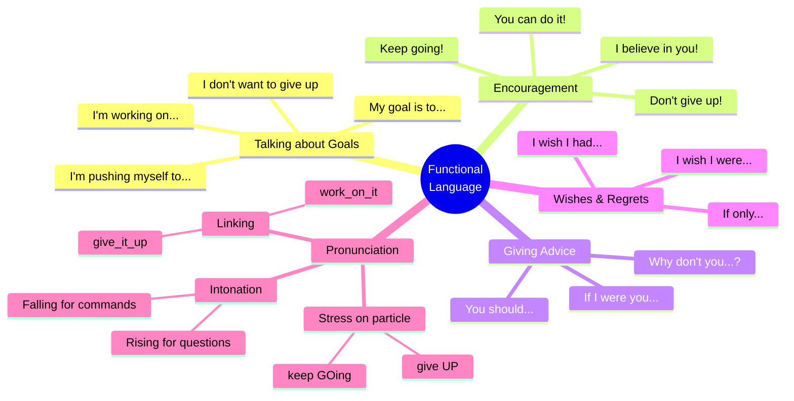

# 🟩 Functional Language & Pronunciation

## 🎯 Introducción

> [!info]- 💡 ¿Qué aprenderás en esta sección?
> 
> En esta nota dominarás el **lenguaje funcional** y la **pronunciación** para hablar naturalmente sobre metas, motivación y desafíos.
> 
> **¿Qué es el lenguaje funcional?**
> 
> |Concepto|Explicación|Ejemplo|
> |---|---|---|
> |**Functional Language**|Frases reales que usamos en situaciones específicas|"I'm pushing myself to..." vs "I am making effort to..."|
> |**Natural English**|Cómo hablan los nativos realmente|"Keep going!" vs "Continue!"|
> |**Communication patterns**|Estructuras que usas una y otra vez|"You should..." / "If I were you..."|
> 
> **Conexión con Grammar:**
> 
> ```mermaid
> graph TD
>     A[Grammar you learned] --> B[Functional Language]
>     
>     C[Phrasal verbs:<br/>give up, keep going] --> D[Natural expressions:<br/>"Don't give up!"]
>     
>     E[Second Conditional:<br/>If I were...] --> F[Giving advice:<br/>"If I were you, I'd..."]
>     
>     G[I wish / If only] --> H[Expressing desires:<br/>"I wish I were more..."]
>     
>     B --> I[Real conversations<br/>about goals]
>     
>     style A fill:#e1ffe1
>     style B fill:#fff4e1
>     style I fill:#e1f5ff
> ```
> 
> **En esta nota aprenderás a:**
> 
> - ✅ Hablar sobre tus metas y motivación naturalmente
> - ✅ Dar consejos y ánimo a otros
> - ✅ Expresar deseos y arrepentimientos
> - ✅ Pronunciar correctamente phrasal verbs
> - ✅ Usar linking y stress para sonar más fluido

---

## 💪 A. Talking About Goals & Motivation

> [!success]- 🎯 Expressing Your Goals
> 
> **Pattern 1: I'm pushing myself to...**
> 
> ```
> Formula: I'm pushing myself to + base verb
> Use: Cuando te estás esforzando mucho por lograr algo
> 
> ✅ I'm pushing myself to finish this project
> ✅ I'm pushing myself to exercise every day
> ✅ I'm pushing myself to learn English fluently
> ✅ I'm pushing myself to be more confident
> 
> Variations:
> • I'm really pushing myself to...
> • I've been pushing myself to...
> • I need to push myself to...
> ```
> 
> **Pattern 2: I'm working on...**
> 
> ```
> Formula: I'm working on + noun/gerund
> Use: Para hablar de áreas de mejora personal
> 
> ✅ I'm working on my confidence
> ✅ I'm working on improving my skills
> ✅ I'm working on being more disciplined
> ✅ I'm working on achieving my goals
> 
> Variations:
> • I've been working on...
> • I'm really working on...
> • I need to work on...
> ```
> 
> **Pattern 3: I don't want to give up**
> 
> ```
> Formula: I don't want to give up (on + noun/gerund)
> Use: Expresar determinación
> 
> ✅ I don't want to give up now
> ✅ I don't want to give up on my dreams
> ✅ I don't want to give up on learning English
> ✅ I refuse to give up
> 
> Related expressions:
> • I'm not giving up
> • I'll never give up
> • I won't give up easily
> • Giving up is not an option
> ```
> 
> **Pattern 4: My goal is to...**
> 
> ```
> Formula: My goal is to + base verb
> Use: Declarar objetivos claramente
> 
> ✅ My goal is to speak English fluently
> ✅ My goal is to start my own business
> ✅ My goal is to improve every day
> ✅ My main goal is to succeed
> 
> Variations:
> • My main goal is...
> • One of my goals is...
> • My biggest goal is...
> • I've set a goal to...
> ```

> [!tip]- 🔥 Talking About Progress & Effort
> 
> **Describing your effort:**
> 
> ```
> ✅ I'm doing my best
> ✅ I'm trying my hardest
> ✅ I'm giving it my all
> ✅ I'm putting in a lot of effort
> ✅ I'm working really hard on this
> ✅ I'm committed to achieving this
> ```
> 
> **Talking about progress:**
> 
> ```
> ✅ I'm making progress
> ✅ I'm getting better every day
> ✅ I'm slowly improving
> ✅ I've come a long way
> ✅ I'm on the right track
> ✅ I'm moving in the right direction
> ```
> 
> **When facing difficulties:**
> 
> ```
> ✅ It's challenging, but I'm not giving up
> ✅ It's tough, but I'm pushing through
> ✅ I'm struggling a bit, but I'll keep going
> ✅ It's hard, but it's worth it
> ✅ I'm facing some obstacles, but I'm determined
> ✅ It's not easy, but I'm learning a lot
> ```
> 
> **Expressing determination:**
> 
> ```
> ✅ I'm determined to succeed
> ✅ I'm committed to this goal
> ✅ I won't let anything stop me
> ✅ I'm going to make this happen
> ✅ Nothing will stand in my way
> ✅ I'm 100% focused on this
> ```

> [!example]- 💬 Natural Conversation Examples
> 
> **Conversation 1: Talking about a personal goal**
> 
> ```
> A: What are you working on these days?
> B: I'm pushing myself to improve my English. 
>    It's challenging, but I'm making progress.
> A: That's great! How's it going?
> B: I'm getting better every day. My goal is to 
>    speak fluently by the end of the year.
> ```
> 
> **Conversation 2: When someone asks about your progress**
> 
> ```
> A: How's your business plan coming along?
> B: I'm working really hard on it. It's not easy, 
>    but I don't want to give up now.
> A: That's the spirit! Keep pushing!
> B: Thanks! I'm determined to make it happen.
> ```
> 
> **Conversation 3: Discussing motivation**
> 
> ```
> A: Do you ever feel like giving up?
> B: Sometimes, yeah. But then I remember my goals 
>    and I keep going.
> A: What keeps you motivated?
> B: I'm pushing myself because I know it'll be 
>    worth it in the end.
> ```

---

## 🗣️ B. Giving Advice & Encouragement

> [!success]- 💡 Encouraging Someone
> 
> **Pattern 1: Keep going!**
> 
> ```
> Direct encouragement (very common):
> 
> ✅ Keep going!
> ✅ Don't give up!
> ✅ You can do it!
> ✅ Hang in there!
> ✅ Stay strong!
> ✅ Keep pushing!
> 
> With reasons:
> ✅ Keep going, you're almost there!
> ✅ Don't give up now, you've come so far!
> ✅ Keep pushing, it'll be worth it!
> ✅ Hang in there, things will get better!
> ```
> 
> **Pattern 2: You should...**
> 
> ```
> Formula: You should + base verb
> Use: Dar consejos suaves
> 
> ✅ You should keep going
> ✅ You should work on your confidence
> ✅ You should set clear goals
> ✅ You should take more risks
> ✅ You shouldn't give up so easily
> 
> Stronger advice:
> • You really should...
> • You definitely should...
> • I think you should...
> ```
> 
> **Pattern 3: If I were you...**
> 
> ```
> Formula: If I were you, I would/wouldn't + base verb
> Use: Consejos más directos usando 2nd conditional
> 
> ✅ If I were you, I'd keep trying
> ✅ If I were you, I wouldn't give up
> ✅ If I were you, I'd take that opportunity
> ✅ If I were you, I'd work on improving my skills
> ✅ If I were you, I wouldn't let fear hold me back
> 
> Note: "I'd" = "I would" (contraction común en conversación)
> ```
> 
> **Pattern 4: Why don't you...?**
> 
> ```
> Formula: Why don't you + base verb?
> Use: Sugerencias amables
> 
> ✅ Why don't you try again?
> ✅ Why don't you set smaller goals?
> ✅ Why don't you take a break and come back to it?
> ✅ Why don't you ask for help?
> ✅ Why don't you give it one more shot?
> ```

> [!tip]- 🌟 More Ways to Encourage
> 
> **Recognizing effort:**
> 
> ```
> ✅ You're doing great!
> ✅ I'm proud of you!
> ✅ You're making real progress!
> ✅ Look how far you've come!
> ✅ You should be proud of yourself!
> ✅ You're on the right track!
> ```
> 
> **Building confidence:**
> 
> ```
> ✅ I believe in you
> ✅ You've got this
> ✅ I know you can do it
> ✅ You're stronger than you think
> ✅ You're capable of more than you realize
> ✅ Trust yourself
> ```
> 
> **Motivating during hard times:**
> 
> ```
> ✅ This is just temporary
> ✅ You'll get through this
> ✅ It gets easier with time
> ✅ Everyone struggles at first
> ✅ Failure is part of success
> ✅ You learn more from challenges
> ```
> 
> **Congratulating success:**
> 
> ```
> ✅ Well done!
> ✅ Great job!
> ✅ I knew you could do it!
> ✅ You did it!
> ✅ That's amazing!
> ✅ You deserve this!
> ```

> [!example]- 💬 Advice & Encouragement Dialogues
> 
> **Dialogue 1: Friend feeling discouraged**
> 
> ```
> A: I feel like giving up. This is too hard.
> B: Don't give up now! You've come so far already.
> A: But I keep failing...
> B: Failure is part of success. If I were you, 
>    I'd keep trying. You're learning from each attempt.
> A: You really think so?
> B: Absolutely! I believe in you. Just keep going!
> ```
> 
> **Dialogue 2: Giving advice about goals**
> 
> ```
> A: I don't know if I should take this risk...
> B: What's holding you back?
> A: I'm afraid of failing.
> B: If I were you, I wouldn't let fear stop me. 
>    You should at least try.
> A: Maybe you're right...
> B: Why don't you give it a shot? You'll regret 
>    it more if you don't try.
> ```
> 
> **Dialogue 3: Encouraging someone's progress**
> 
> ```
> A: I'm trying to improve my English, but it's slow.
> B: Hey, you're doing great! Look how much you've 
>    improved since last year!
> A: You think so?
> B: Definitely! You should be proud of yourself. 
>    Just keep going, you're on the right track.
> ```

---

## 🎤 C. Pronunciation Guide

> [!note]- 🔊 Stress in Phrasal Verbs
> 
> **Key Rule: Stress the PARTICLE (second word)**
> 
> ```
> Pattern: verb PARTICLE
> 
> ✅ give UP (not GIVE up)
> ✅ keep GOing (not KEEP going)
> ✅ work ON (not WORK on)
> ✅ set UP (not SET up)
> ✅ find OUT (not FIND out)
> ```
> 
> **Practice Pairs:**
> 
> |Phrasal Verb|Stress Pattern|Say it like this|
> |---|---|---|
> |**give up**|give UP|"giv-UP"|
> |**keep going**|keep GOing|"keep-GO-ing"|
> |**work on**|work ON|"work-ON"|
> |**set up**|set UP|"set-UP"|
> |**take on**|take ON|"take-ON"|
> |**get over**|get Over|"get-O-ver"|
> |**carry on**|carry ON|"carry-ON"|
> |**figure out**|figure OUT|"figure-OUT"|
> 
> **In sentences - stress stays on particle:**
> 
> ```
> ✅ Don't give UP!
> ✅ Keep GOing!
> ✅ I'm working ON it
> ✅ She set UP a business
> ✅ I need to figure OUT what to do
> ```
> 
> **⚠️ Exception: When particle is a pronoun**
> 
> ```
> When the object is a pronoun, stress the VERB:
> 
> ✅ GIVE it up (not give it UP)
> ✅ SET it up (not set it UP)
> ✅ WORK it out (not work it OUT)
> ```

> [!tip]- 🔗 Linking in Functional Phrases
> 
> **What is linking?**
> 
> Linking = conectar palabras para sonar más fluido
> 
> **Common linking patterns:**
> 
> ```
> Pattern 1: Consonant + Vowel
> Connect the sounds smoothly
> 
> ✅ give_up → "gi-vup"
> ✅ set_up → "se-tup"
> ✅ work_on → "wor-kon"
> ✅ keep_on → "kee-pon"
> ✅ I'm_on_it → "I-mo-nit"
> ```
> 
> **Pattern 2: Same consonant**
> 
> ```
> Say the consonant once, but hold it longer:
> 
> ✅ keep pushing → "kee-pushing" (one 'p')
> ✅ don't take → "don-take" (one 't')
> ✅ get through → "ge-through" (one 't')
> ```
> 
> **Pattern 3: Common functional phrases**
> 
> ```
> ✅ I'm working on it → "I'm-wor-king-o-nit"
> ✅ I want to achieve → "I-wan-to-wa-chieve"
> ✅ Don't give up → "Don-tgi-vup"
> ✅ You can do it → "You-can-do-wit"
> ✅ I've got this → "I've-go-this"
> ✅ If I were you → "I-fI-were-you"
> ```
> 
> **Practice sentences with linking:**
> 
> ```
> 1. Keep_it_up! → "Kee-pi-tup"
> 2. Work_on_it → "Wor-ko-nit"
> 3. I'm_almost_there → "I-mal-mos-there"
> 4. Set_up_a goal → "Se-tu-pa-goal"
> 5. Find_out_about_it → "Fin-dou-ta-bou-tit"
> ```

> [!success]- 🎯 Intonation Patterns
> 
> **Rising intonation (questions & uncertainty):**
> 
> ```
> Use rising tone ↗ at the end:
> 
> ✅ Should I keep going? ↗
> ✅ Do you think I can do it? ↗
> ✅ Are you working on your goals? ↗
> ✅ Why don't you try again? ↗
> ```
> 
> **Falling intonation (statements & commands):**
> 
> ```
> Use falling tone ↘ at the end:
> 
> ✅ Don't give up ↘
> ✅ Keep going ↘
> ✅ I'm working on it ↘
> ✅ You can do it ↘
> ```
> 
> **Emphasis for encouragement:**
> 
> ```
> Stress the key word for stronger emotion:
> 
> ✅ You CAN do it!
> ✅ DON'T give up!
> ✅ KEEP going!
> ✅ I REALLY believe in you!
> ✅ You're doing GREAT!
> ```
> 
> **Intonation in conditional advice:**
> 
> ```
> If I were you ↗, I would keep trying ↘
> (rising in condition, falling in result)
> 
> ✅ If I were you ↗, I wouldn't give up ↘
> ✅ If you worked harder ↗, you'd succeed ↘
> ✅ Why don't you try ↗? It might work ↘
> ```

---

## 🎭 D. Expressing Wishes & Regrets

> [!note]- 💭 Talking About What You Wish
> 
> **Pattern 1: I wish I were/had...**
> 
> ```
> Use: Express desires about present situations
> 
> ✅ I wish I were more confident
> ✅ I wish I had more time
> ✅ I wish I were braver
> ✅ I wish I had more opportunities
> ✅ I wish I could speak English fluently
> 
> In conversation:
> "What do you wish you could change?"
> "I wish I were more disciplined."
> ```
> 
> **Pattern 2: If only...**
> 
> ```
> Use: More dramatic/emotional than "I wish"
> 
> ✅ If only I were more motivated!
> ✅ If only I had started sooner!
> ✅ If only I weren't so afraid!
> ✅ If only I could try again!
> 
> Note: Often used with exclamation (!) for emphasis
> ```
> 
> **Pattern 3: I wish [someone] would...**
> 
> ```
> Use: Want someone else to change behavior
> 
> ✅ I wish he would help me more
> ✅ I wish she would stop giving up so easily
> ✅ I wish they would support my goals
> ✅ I wish things would get easier
> 
> ⚠️ NOT with "I": 
> ❌ I wish I would be confident
> ✅ I wish I were confident
> ```

> [!example]- 💬 Natural Ways to Express Regret
> 
> **Soft regrets:**
> 
> ```
> ✅ I should have tried harder
> ✅ I could have done better
> ✅ I wish I had worked on this sooner
> ✅ If only I hadn't given up
> ✅ I regret not taking that opportunity
> ```
> 
> **Learning from mistakes:**
> 
> ```
> ✅ I learned my lesson
> ✅ I won't make that mistake again
> ✅ Next time, I'll do things differently
> ✅ Looking back, I should have...
> ✅ If I could do it over, I would...
> ```
> 
> **Conversation examples:**
> 
> ```
> A: Do you have any regrets?
> B: I wish I had started learning English earlier. 
>    But I'm working on it now, so better late than never!
> 
> A: What would you change if you could?
> B: If only I were more confident back then. 
>    I would have taken more risks.
> 
> A: Any advice for your younger self?
> B: I'd tell myself: "Don't give up so easily. 
>    Keep pushing yourself!"
> ```

---

## 🗨️ E. Mini Speaking Drills

> [!tip]- 🎤 Drill 1: Your Goals
> 
> **Answer these questions out loud:**
> 
> ```
> 1. What are you working on right now?
>    → "I'm working on..."
> 
> 2. What's your main goal?
>    → "My main goal is to..."
> 
> 3. What are you pushing yourself to do?
>    → "I'm pushing myself to..."
> 
> 4. What do you refuse to give up on?
>    → "I refuse to give up on..."
> 
> 5. What progress have you made?
>    → "I've made progress in..."
> ```
> 
> **Sample responses:**
> 
> ```
> 6. I'm working on improving my English speaking skills
> 7. My main goal is to speak English fluently by next year
> 8. I'm pushing myself to practice speaking every day
> 9. I refuse to give up on my dream of studying abroad
> 10. I've made progress in my pronunciation and confidence
> ```

> [!success]- 🎤 Drill 2: Giving Encouragement
> 
> **Scenario: Your friend says these things. Respond!**
> 
> ```
> Friend: "I feel like giving up..."
> You: → "Don't give up now! You're doing great!"
> 
> Friend: "I don't think I can do this..."
> You: → "Yes you can! I believe in you!"
> 
> Friend: "I keep failing..."
> You: → "Failure is part of success. Keep trying!"
> 
> Friend: "Should I quit?"
> You: → "If I were you, I wouldn't quit. You've come so far!"
> 
> Friend: "I'm not good enough..."
> You: → "That's not true! You're making real progress!"
> ```
> 
> **Practice with different tones:**
> 
> - Enthusiastic: "Keep going! You've got this!"
> - Calm/supportive: "I know it's hard, but don't give up"
> - Motivating: "Think how proud you'll be when you succeed!"

> [!example]- 🎤 Drill 3: Wishes & Hypotheticals
> 
> **Complete these sentences about yourself:**
> 
> ```
> 1. I wish I were more...
>    → "I wish I were more disciplined"
> 
> 2. If I had more time, I would...
>    → "If I had more time, I would practice English daily"
> 
> 3. If I were braver, I would...
>    → "If I were braver, I would speak English in public"
> 
> 4. I wish I could...
>    → "I wish I could speak without translating in my head"
> 
> 5. If only I...
>    → "If only I had started learning English earlier!"
> ```
> 
> **Now practice saying them with emotion!**

---

## 🎯 F. Common Expressions Summary

> [!quote]- 📝 Essential Phrases Cheat Sheet
> 
> **Talking about goals:**
> 
> ```
> ✅ I'm pushing myself to...
> ✅ I'm working on...
> ✅ My goal is to...
> ✅ I'm committed to...
> ✅ I don't want to give up on...
> ```
> 
> **Encouragement:**
> 
> ```
> ✅ Keep going!
> ✅ Don't give up!
> ✅ You can do it!
> ✅ You're doing great!
> ✅ I believe in you!
> ```
> 
> **Giving advice:**
> 
> ```
> ✅ You should...
> ✅ If I were you, I'd...
> ✅ Why don't you...?
> ✅ You might want to...
> ✅ Have you considered...?
> ```
> 
> **Wishes:**
> 
> ```
> ✅ I wish I were...
> ✅ I wish I had...
> ✅ I wish I could...
> ✅ If only I...
> ```
> 
> **Determination:**
> 
> ```
> ✅ I'm determined to...
> ✅ I won't give up
> ✅ I'm not quitting
> ✅ Nothing will stop me
> ✅ I'm going to make this happen
> ```

---

## 💪 G. Real-Life Application Practice

> [!tip]- 🌟 Situation 1: Job Interview
> 
> **Question: "Tell me about a time you pushed yourself."**
> 
> **Good response structure:**
> 
> ```
> 1. Situation: What was the challenge?
> 2. Action: What did you do?
> 3. Result: What happened?
> 4. Learning: What did you learn?
> ```
> 
> **Sample answer:**
> 
> ```
> "Last year, I was working on improving my English. 
> It was really challenging because I didn't have much 
> time, but I pushed myself to practice every single day. 
> 
> I set up a study routine and worked on my speaking 
> skills consistently. Even when I felt like giving up, 
> I kept going because my goal was to communicate 
> more confidently at work.
> 
> After six months, I was able to participate in 
> English meetings and even give a presentation. 
> I learned that if you don't give up and keep 
> pushing yourself, you can achieve more than 
> you think."
> ```

> [!success]- 🌟 Situation 2: Encouraging a Colleague
> 
> **Your colleague is struggling with a project:**
> 
> ```
> Colleague: "This project is impossible. I think 
>            I should just tell the boss I can't do it."
> 
> You: "Hey, don't give up now! You've already done 
>       so much work on this. I know it's challenging, 
>       but you're making real progress.
>       
>       If I were you, I'd take a short break and 
>       come back to it with fresh eyes. You're 
>       closer than you think!
>       
>       Remember, everyone struggles at first. You've 
>       got this! Just keep going!"
> ```
> 
> **Key phrases used:**
> 
> - Don't give up now
> - I know it's challenging, but...
> - If I were you, I'd...
> - You've got this
> - Keep going

> [!example]- 🌟 Situation 3: Talking About Personal Goals
> 
> **Casual conversation at a coffee break:**
> 
> ```
> Friend: "What are you up to these days?"
> 
> You: "I'm really pushing myself to get healthier. 
>       I'm working on exercising regularly and 
>       eating better.
>       
>       It's not easy because I have a busy schedule, 
>       but I don't want to give up on this goal. 
>       I'm determined to make it happen.
>       
>       My main goal is to feel more energetic and 
>       confident. I wish I had started this sooner, 
>       but better late than never, right?"
> 
> Friend: "That's great! Keep it up!"
> 
> You: "Thanks! I'm not giving up this time. 
>       I've come too far already!"
> ```

---

## 📊 Visual Summary



---

## 🔑 Key Takeaways

> [!quote]- 💡 Remember These Core Patterns
> 
> **Most important phrases:**
> 
> |Function|Key Phrase|Example|
> |---|---|---|
> |**Your goals**|I'm pushing myself to...|I'm pushing myself to improve|
> |**Encouragement**|Keep going!|Keep going, don't give up!|
> |**Advice**|If I were you...|If I were you, I'd try harder|
> |**Wishes**|I wish I...|I wish I were more confident|
> |**Determination**|I won't give up|I won't give up on my dreams|
> 
> **Pronunciation priorities:**
> 
> ```
> 1. Stress the PARTICLE in phrasal verbs: give UP, work ON
> 2. Link words together: work_on_it, keep_going
> 3. Use falling tone for encouragement: Keep GOing ↘
> ```
> 
> **Practice daily:**
> 
> - Talk about YOUR goals using these phrases
> - Practice encouraging yourself and others
> - Say phrasal verbs with correct stress
> - Link words when speaking

---

## 🔗 Connection to Next Section

> [!note]- 🚀 What's Next?
> 
> **You've mastered functional language. Now you're ready to:**
> 
> |Current Level|Next Step|
> |---|---|
> |**Functional phrases**|Real reading & writing|
> |**Speaking drills**|Extended conversations|
> |**Pronunciation**|Fluent communication|
> 
> ```mermaid
> graph LR
>     A[Vocabulary] --> B[Grammar]
>     B --> C[Functional Language]
>     C --> D[Reading/Writing/Speaking]
>     
>     E[Words] --> F[Structures]
>     F --> G[Natural phrases]
>     G --> H[Real communication]
>     
>     style C fill:#e1ffe1
>     style D fill:#fff4e1
> ```
> 
> **In the next note, you'll:**
> 
> - 📖 Read real texts about pushing yourself
> - ✍️ Write about your own goals and challenges
> - 🗣️ Have extended conversations using everything you've learned

---

**Tags:** #english #functional-language #pronunciation #unit11 #speaking #encouragement #advice #motivation #goals #communication