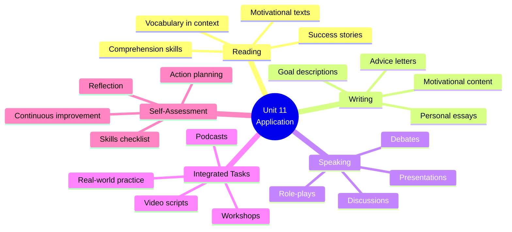

# 🟥 Reading / Writing / Speaking — Pushing Yourself

## 🎯 Introducción

> [!info]- 💡 ¿Qué aprenderás en esta sección?
> 
> En esta nota **aplicarás todo lo aprendido** en las secciones anteriores a través de actividades reales de lectura, escritura y conversación.
> 
> **¿Por qué esta sección es crucial?**
> 
> |Habilidad|Por qué importa|Qué practicarás|
> |---|---|---|
> |**Reading**|Comprender textos reales sobre éxito|Artículos motivacionales, biografías|
> |**Writing**|Expresar tus ideas claramente|Essays, párrafos personales|
> |**Speaking**|Comunicarte con confianza|Conversaciones, presentaciones|
> 
> **Conexión con las secciones anteriores:**
> 
> ```mermaid
> graph TD
>     A[Section 1:<br/>Vocabulary] --> E[Section 4:<br/>Real Application]
>     B[Section 2:<br/>Grammar] --> E
>     C[Section 3:<br/>Functional Language] --> E
>     
>     E --> F[Reading:<br/>Understand texts<br/>about success]
>     E --> G[Writing:<br/>Express your<br/>experiences]
>     E --> H[Speaking:<br/>Discuss goals<br/>& motivation]
>     
>     F --> I[Real-world<br/>English mastery]
>     G --> I
>     H --> I
>     
>     style A fill:#e1ffe1
>     style B fill:#fff4e1
>     style C fill:#e1f5ff
>     style E fill:#ffe1e1
>     style I fill:#f0e1ff
> ```
> 
> **En esta nota desarrollarás:**
> 
> - ✅ Comprensión lectora de textos motivacionales
> - ✅ Habilidades de escritura sobre experiencias personales
> - ✅ Fluidez al hablar sobre metas y desafíos
> - ✅ Pensamiento crítico sobre éxito y fracaso
> - ✅ Comunicación natural en situaciones reales

---

## 📖 A. Reading: Success Stories & Motivation

> [!example]- 📚 Reading Text 1: "The Power of Not Giving Up"
> 
> **Pre-reading questions:**
> 
> - Have you ever wanted to give up on something important?
> - What keeps you motivated when things get difficult?
> 
> ---
> 
> ### The Power of Not Giving Up
> 
> _by Sarah Chen_
> 
> Three years ago, I was working on my biggest goal: starting my own business. The situation seemed impossible. I had no experience, limited resources, and plenty of people telling me I should give up and get a "real job." Every day presented new challenges and obstacles that made me question my decision.
> 
> But I refused to give up. Instead, I kept pushing myself to learn more, work harder, and improve every day. I set up a clear plan with small, achievable goals. When I faced setbacks, I would remind myself: "Don't give up now. You've come too far."
> 
> The turning point came when I stopped viewing failures as reasons to quit and started seeing them as opportunities to learn. If I were to give advice to my younger self, I would say: "Every successful person has failed many times. The difference is they didn't give up."
> 
> I wish I had known earlier that pushing yourself isn't about being perfect—it's about being persistent. It's about working on your goals consistently, even when progress feels slow. It's about taking risks and learning from the results, whether they're good or bad.
> 
> Today, my business is thriving. Looking back, I realize that the obstacles I faced weren't barriers—they were tests. Each challenge made me stronger, more resilient, and more determined. The reward wasn't just success; it was becoming the kind of person who doesn't give up when things get tough.
> 
> If you're working on something important right now and considering giving up, remember this: The effort you put in today will pay off tomorrow. Keep going. Your future self will thank you.
> 
> ---
> 
> **Comprehension Questions:**
> 
> ```
> 1. What was Sarah's main goal three years ago?
> 2. What challenges did she face?
> 3. What was her turning point?
> 4. What advice would she give to her younger self?
> 5. How does she view obstacles now?
> ```
> 
> > [!success]- ✅ Answer Key
> > 
> > 1. Starting her own business
> > 2. No experience, limited resources, people telling her to give up, daily challenges
> > 3. When she started seeing failures as opportunities to learn instead of reasons to quit
> > 4. "Every successful person has failed many times. The difference is they didn't give up."
> > 5. As tests that made her stronger, not as barriers
> 
> **Vocabulary in Context:**
> 
> Find these phrases in the text and understand their meaning:
> 
> ```
> ✅ refused to give up = decided firmly not to quit
> ✅ pushing myself = making strong effort
> ✅ set up a plan = created/established a plan
> ✅ turning point = moment when everything changed
> ✅ pay off = produce good results
> ```

> [!tip]- 📚 Reading Text 2: "The Risk That Changed My Life"
> 
> **Pre-reading task:**
> 
> - Think of a risk you took. Was it worth it?
> - What's the biggest risk you've never taken but wish you had?
> 
> ---
> 
> ### The Risk That Changed My Life
> 
> _by Marcus Rodriguez_
> 
> "If I were you, I wouldn't take that risk." That's what everyone told me when I decided to quit my stable job to pursue my passion for photography. The disadvantages seemed clear: no steady income, no security, no guarantee of success. But I couldn't ignore the voice inside saying, "What if you never try?"
> 
> I spent months doing research, considering my options, and weighing the risks against the potential rewards. The situation was scary, but I knew that if I didn't take this chance, I would always wonder "what if?" I wish I could say the decision was easy, but it wasn't. I was terrified.
> 
> The first year was incredibly challenging. I had to work on building a portfolio, finding clients, and learning the business side of photography—something art school never taught me. There were days when I thought about giving up and going back to my old career. But every time I felt like quitting, I would look at my goals and remind myself why I started.
> 
> If I had more experience back then, things might have been easier. If I had saved more money, I would have had less stress. But here's what I learned: you'll never feel completely ready. You'll never have all the answers. Sometimes, you just need to take the risk and figure things out as you go.
> 
> Five years later, I'm living proof that taking calculated risks can lead to amazing results. My photography business is successful, I work with clients around the world, and most importantly, I wake up every day excited about my work. The effect of that one decision has shaped my entire life.
> 
> My advice? Don't let fear of failure hold you back. Consider the risks, yes, but also consider the cost of never trying. Sometimes the biggest risk is not taking any risk at all.
> 
> ---
> 
> **Discussion Questions:**
> 
> ```
> 1. Why did Marcus decide to quit his job?
> 2. What made the decision difficult?
> 3. What challenges did he face in the first year?
> 4. What important lesson did he learn?
> 5. Do you agree with his final advice? Why or why not?
> ```
> 
> **Grammar Focus - Find examples:**
> 
> ```
> Find in the text:
> ✅ 2 examples of Second Conditional
> ✅ 2 examples of "I wish" sentences
> ✅ 3 phrasal verbs
> ✅ Vocabulary about risks and opportunities
> ```
> 
> > [!success]- ✅ Grammar Examples Found
> > 
> > **Second Conditional:**
> > 
> > - "If I were you, I wouldn't take that risk"
> > - "If I had more experience back then, things might have been easier"
> > - "If I had saved more money, I would have had less stress"
> > 
> > **I wish:**
> > 
> > - "I wish I could say the decision was easy"
> > 
> > **Phrasal verbs:**
> > 
> > - quit/going back (give up implied)
> > - work on building
> > - figure things out
> > - hold you back
> > 
> > **Risk/Opportunity vocabulary:**
> > 
> > - take that risk, pursue, disadvantages, guarantee,Options, rewards, chance

> [!example]- 📰 Reading Text 3: "Small Steps, Big Results"
> 
> ### Small Steps, Big Results
> 
> Many people think that pushing yourself means making huge changes overnight. They believe success requires dramatic actions and constant sacrifice. But research shows that sustainable progress comes from consistent small efforts, not occasional big pushes.
> 
> Consider the story of James Clear, author of "Atomic Habits." He argues that if you improve by just 1% every day, you'll be 37 times better by the end of the year. This approach works because:
> 
> **1. Small goals are achievable** Instead of saying "I will exercise for 2 hours daily," start with "I will exercise for 10 minutes daily." You're more likely to keep going when the goal feels manageable.
> 
> **2. Small wins build confidence** Every time you achieve a small goal, your brain registers success. This motivation helps you work on bigger challenges later.
> 
> **3. Small steps prevent burnout** When you push yourself too hard too fast, you risk giving up entirely. Steady progress is more sustainable than intense bursts of effort.
> 
> **4. Small changes compound over time** The effect of daily improvements might seem invisible at first, but they add up significantly. Think of it like interest in a bank account—small deposits grow into substantial amounts.
> 
> The purpose isn't to stay small forever. It's to build momentum and develop discipline. Once you've set up a solid foundation with small habits, you can gradually increase the difficulty.
> 
> If you're trying to achieve a big goal right now, ask yourself: "What's the smallest step I can take today?" Then take that step. And tomorrow, take another one. Before you know it, you'll look back and realize how far you've come.
> 
> ---
> 
> **Reading Comprehension:**
> 
> ```
> 6. What's the main idea of this text?
>    a) Big goals are impossible
>    b) Small consistent efforts lead to big results
>    c) You should never push yourself hard
>    d) Success requires sacrifice
> 
> 7. According to the text, what happens if you improve 1% daily?
> 
> 8. List the 4 reasons why small goals work better.
> 
> 9. What question should you ask yourself when working on big goals?
> 
> 10. Do you agree with this approach? Why or why not?
> ```
> 
> > [!success]- ✅ Answer Key
> > 
> > 1. **b)** Small consistent efforts lead to big results
> > 2. You'll be 37 times better by the end of the year
> > 3. - Small goals are achievable
> >     - Small wins build confidence
> >     - Small steps prevent burnout
> >     - Small changes compound over time
> > 4. "What's the smallest step I can take today?"
> > 5. (Personal answer - should reference ideas from text)

---

## ✍️ B. Writing Tasks

> [!note]- 📝 Writing Task 1: Personal Experience Essay
> 
> **Topic:** Write about a time you pushed yourself to succeed
> 
> **Instructions:**
> 
> - Length: 200-250 words
> - Include: beginning, middle, end
> - Use: phrasal verbs, second conditional, vocabulary from Unit 11
> 
> **Essay Structure:**
> 
> ```
> PARAGRAPH 1 - Introduction (40-50 words)
> • What was the situation/goal?
> • Why was it challenging?
> • How did you feel at the beginning?
> 
> PARAGRAPH 2 - The Challenge (80-100 words)
> • What obstacles did you face?
> • What did you do to overcome them?
> • Did you ever feel like giving up?
> • What kept you going?
> 
> PARAGRAPH 3 - The Result & Reflection (80-100 words)
> • What was the outcome?
> • What did you learn?
> • How did this experience change you?
> • What advice would you give someone in a similar situation?
> ```
> 
> **Useful phrases for your essay:**
> 
> ```
> BEGINNING:
> ✅ Last year, I was working on...
> ✅ I decided to push myself to...
> ✅ I set up a goal to...
> ✅ The situation was challenging because...
> 
> MIDDLE:
> ✅ I faced many obstacles, such as...
> ✅ There were times when I wanted to give up...
> ✅ I kept going because...
> ✅ I worked on improving...
> ✅ Despite the difficulties, I...
> 
> END:
> ✅ Looking back, I realize...
> ✅ This experience taught me that...
> ✅ If I were to give advice, I would say...
> ✅ I'm proud that I didn't give up...
> ✅ The effort was worth it because...
> ```
> 
> **Checklist before submitting:**
> 
> ```
> ✅ Did I use at least 3 phrasal verbs?
> ✅ Did I include at least 1 second conditional?
> ✅ Did I use Unit 11 vocabulary (goal, challenge, achieve, etc.)?
> ✅ Is my essay well-organized with clear paragraphs?
> ✅ Did I check for grammar and spelling errors?
> ```

> [!success]- ✅ Sample Essay (Model Answer)
> 
> ### Learning to Speak in Public
> 
> Two years ago, I set up a personal goal: to overcome my fear of public speaking. The situation was challenging because I had always been extremely shy, and the thought of speaking in front of people terrified me. I knew I needed to push myself if I wanted to advance in my career.
> 
> The obstacles I faced were mainly psychological. Every time I had to present something, my hands would shake and my mind would go blank. I wanted to give up many times, especially after a particularly embarrassing presentation where I forgot everything I wanted to say. However, I kept going because I knew that if I gave up, I would never improve. I worked on my confidence by practicing in front of a mirror, then with friends, and gradually with larger groups. I also found out about a public speaking club where I could practice in a supportive environment.
> 
> Looking back, I'm incredibly proud of my progress. I still get nervous, but now I can manage it. This experience taught me that pushing yourself outside your comfort zone is how you grow. If I were to give advice to someone facing a similar challenge, I would say: "Don't give up after one bad experience. Keep practicing, and you'll be amazed at what you can achieve." The effort was definitely worth it—I recently gave a successful presentation to over 50 people!
> 
> **Word count:** 237 words
> 
> ---
> 
> **Why this essay works:**
> 
> ✅ Clear structure (intro, challenge, result) ✅ Phrasal verbs: set up, give up, kept going, worked on, found out ✅ Second conditional: "if I gave up, I would never improve" ✅ Unit 11 vocabulary: goal, challenging, overcome, obstacles, confidence, achieve ✅ Personal and authentic ✅ Good conclusion with advice

> [!tip]- 📝 Writing Task 2: Goal-Setting Paragraph
> 
> **Topic:** Describe a goal you're currently working on
> 
> **Instructions:**
> 
> - Length: 100-120 words
> - Focus: Present situation and plans
> - Include: specific details, timeline, reasons
> 
> **Paragraph Structure:**
> 
> ```
> 1. State your goal clearly (1-2 sentences)
> 2. Explain why this goal is important (2-3 sentences)
> 3. Describe what you're doing to achieve it (3-4 sentences)
> 4. Mention challenges and how you're dealing with them (2-3 sentences)
> 5. End with your commitment/determination (1-2 sentences)
> ```
> 
> **Sentence starters:**
> 
> ```
> ✅ I'm currently pushing myself to...
> ✅ My main goal is to...
> ✅ This is important to me because...
> ✅ I'm working on this by...
> ✅ To achieve this, I'm...
> ✅ The biggest challenge is...
> ✅ When I feel like giving up, I...
> ✅ I'm determined to...
> ✅ I won't give up because...
> ```
> 
> **Example paragraph:**
> 
> ```
> I'm currently pushing myself to become fluent in English by 
> the end of this year. This goal is important to me because 
> I want to study abroad and need to pass the TOEFL exam. 
> I'm working on this by studying for at least one hour every 
> day and practicing speaking with online partners three times 
> a week. I've also set up a vocabulary learning system where 
> I review 20 new words daily. The biggest challenge is staying 
> motivated when progress feels slow, but when I feel like 
> giving up, I remind myself of my dream to study in the US. 
> I'm determined to achieve this goal, and I won't let 
> temporary difficulties stop me.
> ```
> 
> **Your turn! Write your own paragraph here:**
> 
> ```
> [Space for student writing]
> 
> 
> 
> 
> 
> 
> 
> ```

> [!example]- 📝 Writing Task 3: Advice Letter
> 
> **Situation:** Your friend sent you this message:
> 
> _"I'm thinking about giving up on my goal of starting a small business. It's too hard, and I don't think I can do it. Everyone says it's too risky and I should just keep my regular job. What do you think I should do?"_
> 
> **Task:** Write a reply (150-180 words) giving advice and encouragement
> 
> **Your letter should include:**
> 
> ```
> ✅ Acknowledge their feelings
> ✅ Give specific advice (use "if I were you" and "you should")
> ✅ Share a relevant example or story
> ✅ Encourage them not to give up
> ✅ End positively
> ```
> 
> **Useful language:**
> 
> ```
> ACKNOWLEDGING FEELINGS:
> ✅ I understand how you feel...
> ✅ I know this is difficult...
> ✅ It's normal to feel this way...
> 
> GIVING ADVICE:
> ✅ If I were you, I would...
> ✅ You should consider...
> ✅ Why don't you...?
> ✅ Have you thought about...?
> 
> ENCOURAGING:
> ✅ Don't give up now!
> ✅ You've come too far to quit
> ✅ I believe in you
> ✅ You can do this
> ✅ Keep pushing yourself
> ```
> 
> **Sample letter:**
> 
> ```
> Hey!
> 
> I understand how you feel—starting a business is scary! But 
> please don't give up on your dream just because it's hard. 
> 
> If I were you, I would take some time to research and plan 
> carefully before making any final decision. You should 
> consider starting small—maybe work on your business part-time 
> while keeping your job. That way, you can test your idea 
> without taking such a big risk.
> 
> Remember when I wanted to give up on learning English? You 
> told me to keep going, and I'm so glad I listened! Yes, 
> there are risks, but there are also huge potential rewards. 
> You'll never know if you don't try.
> 
> Why don't you talk to people who have started businesses? 
> Find out what challenges they faced and how they overcame 
> them. I think you'll discover that everyone has doubts at 
> the beginning.
> 
> You're capable of more than you think. Keep pushing yourself, 
> work on your plan, and don't let fear hold you back. I 
> believe in you!
> 
> Your friend
> ```

---

## 🗣️ C. Speaking Activities

> [!note]- 🎤 Speaking Activity 1: Personal Goals Presentation
> 
> **Task:** Prepare a 2-3 minute presentation about your personal goals
> 
> **Structure:**
> 
> ```
> INTRODUCTION (30 seconds)
> • Greet your audience
> • State your main goal
> • Say why you chose this topic
> 
> MAIN CONTENT (1.5-2 minutes)
> • Describe your goal in detail
> • Explain why it's important to you
> • Talk about what you're doing to achieve it
> • Mention challenges you're facing
> • Share how you stay motivated
> 
> CONCLUSION (30 seconds)
> • Summarize your commitment
> • End with an inspiring thought
> • Thank your audience
> ```
> 
> **Preparation outline:**
> 
> ```
> 1. My goal is: _________________________________
> 
> 2. This is important because: _________________________________
> 
> 3. I'm working on it by: _________________________________
> 
> 4. The biggest challenge is: _________________________________
> 
> 5. I stay motivated by: _________________________________
> 
> 6. I will never give up because: _________________________________
> ```
> 
> **Useful phrases for your presentation:**
> 
> ```
> OPENING:
> ✅ Hello everyone, today I'd like to talk about...
> ✅ I'm going to share my experience with...
> ✅ I want to tell you about a goal I'm pushing myself to achieve
> 
> MAIN PART:
> ✅ I'm currently working on...
> ✅ The reason this matters to me is...
> ✅ To achieve this, I'm...
> ✅ One of the biggest challenges I face is...
> ✅ When things get difficult, I...
> 
> CLOSING:
> ✅ In conclusion, I'm determined to...
> ✅ I believe that if you don't give up, you can...
> ✅ Thank you for listening
> ```
> 
> **Self-assessment after presenting:**
> 
> ```
> ✅ Did I speak for 2-3 minutes?
> ✅ Did I use phrasal verbs naturally?
> ✅ Did I use vocabulary from Unit 11?
> ✅ Was my pronunciation clear?
> ✅ Did I make eye contact?
> ✅ Did I speak confidently?
> ```

> [!success]- 🎤 Speaking Activity 2: Paired Discussion
> 
> **Task:** Discuss these questions with a partner (15-20 minutes total)
> 
> **Discussion Questions:**
> 
> ```
> PART 1 - Goals & Motivation (5 minutes)
> 
> 1. What's a goal you're currently working on?
> 2. What motivates you to keep pushing yourself?
> 3. Have you ever achieved a difficult goal? How did it feel?
> 4. What's the hardest part about pushing yourself?
> 
> PART 2 - Challenges & Obstacles (5 minutes)
> 
> 5. Tell me about a time you wanted to give up. What happened?
> 6. What do you do when you face obstacles?
> 7. Who or what helps you when things get difficult?
> 8. What's the biggest risk you've ever taken?
> 
> PART 3 - Advice & Hypotheticals (5 minutes)
> 
> 9. If you could give advice to someone who wants to give up, 
>    what would you say?
> 10. If you had no fear of failure, what would you do?
> 11. If you could achieve any goal tomorrow, what would it be?
> 12. What do you wish you had started working on earlier?
> 
> PART 4 - Reflection (5 minutes)
> 
> 13. What have you learned about yourself while pushing yourself?
> 14. How has pushing yourself changed you as a person?
> 15. What advice would you give to your younger self?
> ```
> 
> **Discussion tips:**
> 
> ```
> DO:
> ✅ Ask follow-up questions
> ✅ Share personal examples
> ✅ Use Unit 11 vocabulary
> ✅ Encourage your partner
> ✅ Listen actively
> 
> DON'T:
> ❌ Give one-word answers
> ❌ Interrupt your partner
> ❌ Speak only in your native language
> ❌ Stay silent
> ```
> 
> **Useful follow-up questions:**
> 
> ```
> ✅ Can you tell me more about that?
> ✅ How did that make you feel?
> ✅ What did you learn from that experience?
> ✅ What would you do differently now?
> ✅ That's interesting! Why do you think that?
> ```

> [!tip]- 🎤 Speaking Activity 3: Role-Play Scenarios
> 
> **Scenario 1: The Motivational Coach**
> 
> ```
> STUDENT A: You're a life coach
> STUDENT B: You're feeling discouraged about your goals
> 
> SITUATION:
> Student B has been trying to learn a new skill for 6 months 
> but isn't seeing much progress. They're thinking about giving up. 
> Student A needs to encourage them and give practical advice.
> 
> TIME: 3-4 minutes
> 
> STUDENT A should use:
> • Encouragement phrases
> • "If I were you..." advice
> • Questions to understand the problem
> • Positive reinforcement
> 
> STUDENT B should use:
> • Express frustration
> • Explain challenges
> • Ask for advice
> • Respond to suggestions
> ```
> 
> **Scenario 2: The Big Decision**
> 
> ```
> STUDENT A: Considering taking a big risk (career change, 
>            moving abroad, starting business)
> STUDENT B: A supportive friend helping them think it through
> 
> SITUATION:
> Student A is torn between playing it safe and taking a risk 
> that could change their life. Student B helps them explore 
> the options using conditionals and asking good questions.
> 
> TIME: 3-4 minutes
> 
> STUDENT A should:
> • Explain the situation
> • Express fears and hopes
> • Use "I wish..." and "If I..."
> • Ask for input
> 
> STUDENT B should:
> • Ask clarifying questions
> • Help weigh risks vs rewards
> • Use conditionals to explore options
> • Support their friend's decision
> ```
> 
> **Scenario 3: The Success Interview**
> 
> ```
> STUDENT A: A journalist
> STUDENT B: Someone who achieved a difficult goal
> 
> SITUATION:
> Student A is interviewing Student B for an article about 
> success and perseverance. Student B shares their journey.
> 
> TIME: 4-5 minutes
> 
> STUDENT A asks questions like:
> • What was your biggest challenge?
> • Did you ever want to give up?
> • What kept you motivated?
> • What advice do you have for others?
> 
> STUDENT B should:
> • Tell their story
> • Use past tense and present perfect
> • Share lessons learned
> • Give practical advice
> ```

> [!example]- 🎤 Speaking Activity 4: Debate
> 
> **Motion:** "Taking big risks is necessary for success"
> 
> **Teams:**
> 
> - Team A: FOR (agrees with the motion)
> - Team B: AGAINST (disagrees with the motion)
> 
> **Structure:**
> 
> ```
> ROUND 1 - Opening Statements (2 min each team)
> • Present your main argument
> • Give 2-3 supporting points
> 
> ROUND 2 - Arguments & Examples (3 min each team)
> • Provide detailed examples
> • Use conditionals to make your point
> • Counter the other team's points
> 
> ROUND 3 - Closing Statements (1 min each team)
> • Summarize your position
> • Make final persuasive points
> ```
> 
> **Arguments FOR taking big risks:**
> 
> ```
> ✅ Great achievements require bold actions
> ✅ Playing it safe limits opportunities
> ✅ You learn more from taking risks
> ✅ The biggest regrets come from not trying
> ✅ Examples: entrepreneurs, inventors, athletes
> 
> "If everyone played it safe, we wouldn't have innovation"
> "If you never take risks, you'll never know your potential"
> ```
> 
> **Arguments AGAINST taking big risks:**
> 
> ```
> ✅ Small, consistent steps lead to sustainable success
> ✅ Big risks can lead to big failures
> ✅ Not everyone needs to take huge risks to succeed
> ✅ Calculated, smaller risks are smarter
> ✅ Security and stability have value too
> 
> "If you take too many big risks, you might lose everything"
> "Success comes from discipline, not just risk-taking"
> ```
> 
> **Useful debate language:**
> 
> ```
> AGREEING:
> ✅ I completely agree that...
> ✅ That's a valid point...
> ✅ You're right about...
> 
> DISAGREEING POLITELY:
> ✅ I see your point, but...
> ✅ I respectfully disagree because...
> ✅ That may be true, however...
> 
> MAKING POINTS:
> ✅ In my opinion...
> ✅ Research shows that...
> ✅ For example...
> ✅ Consider the fact that...
> ```

---

## 🎯 D. Integrated Skills Practice

> [!note]- 🌟 Real-World Task 1: Create a Motivational Video Script
> 
> **Task:** Write a script for a 1-minute motivational video about not giving up
> 
> **Your script should include:**
> 
> ```
> 1. HOOK (5-10 seconds)
>    Start with a powerful question or statement
>    
> 2. PROBLEM (15-20 seconds)
>    Describe a common challenge people face
>    
> 3. SOLUTION (20-30 seconds)
>    Give advice and encouragement
>    
> 4. CALL TO ACTION (10-15 seconds)
>    End with inspiring words
> ```
> 
> **Sample Script:**
> 
> ```
> [HOOK]
> "Are you thinking about giving up on your dreams?"
> 
> [PROBLEM]
> "I know how it feels. You've been working hard, pushing 
> yourself every day, but the results aren't coming fast enough. 
> You're tired. You're frustrated. And you're wondering: is it 
> even worth it?"
> 
> [SOLUTION]
> "Here's what I want you to remember: every successful person 
> you admire has felt exactly how you feel right now. The 
> difference? They didn't give up. They kept going, even when 
> it was hard. Even when progress was slow. If you're working 
> on something important, if you're pushing yourself to grow, 
> then you're already on the path to success."
> 
> [CALL TO ACTION]
> "So don't give up now. Keep pushing. Keep going. Your future 
> self will thank you. You've got this!"
> ```
> 
> **Now write YOUR script:**
> > ```
> [Write your script here]
> 
> 
> 
> 
> 
> ```
> 
> **Extra challenge:** Record yourself reading the script and share with classmates!

> [!success]- 🌟 Real-World Task 2: Goal-Setting Workshop
> 
> **Task:** Design a mini workshop to help someone set and achieve a goal
> 
> **Workshop outline (present this to a partner or small group):**
> 
> ```
> PART 1: IDENTIFY YOUR GOAL (5 minutes)
> 
> Ask your participant:
> • What do you want to achieve in the next 3-6 months?
> • Why is this goal important to you?
> • What would success look like?
> 
> Help them make it SMART:
> ✅ Specific: What exactly do you want?
> ✅ Measurable: How will you know you've achieved it?
> ✅ Achievable: Is it realistic?
> ✅ Relevant: Does it matter to you?
> ✅ Time-bound: When will you achieve it?
> 
> ---
> 
> PART 2: IDENTIFY OBSTACLES (5 minutes)
> 
> Ask:
> • What challenges might you face?
> • What has stopped you before?
> • What resources do you need?
> 
> Help them prepare:
> ✅ If [obstacle happens], I will [solution]
> ✅ When I feel like giving up, I will [motivation strategy]
> 
> ---
> 
> PART 3: CREATE AN ACTION PLAN (5 minutes)
> 
> Break the goal into steps:
> • What's the first small step you can take TODAY?
> • What will you do THIS WEEK?
> • What will you do THIS MONTH?
> 
> Set up accountability:
> ✅ Who will support you?
> ✅ How will you track progress?
> ✅ When will you review and adjust?
> 
> ---
> 
> PART 4: COMMIT (2 minutes)
> 
> Have them say out loud:
> "I'm committed to [goal]. I won't give up because [reason]. 
> Even when it's hard, I will keep going because [motivation]."
> ```
> 
> **Your role as workshop leader:**
> 
> ```
> DO:
> ✅ Ask good questions
> ✅ Listen actively
> ✅ Encourage and motivate
> ✅ Help them think clearly
> ✅ Be positive but realistic
> 
> USE LANGUAGE LIKE:
> ✅ "That's a great goal!"
> ✅ "How do you plan to overcome that?"
> ✅ "What would you do if...?"
> ✅ "I believe you can do this"
> ✅ "Let's work on making this specific"
> ```

> [!tip]- 🌟 Real-World Task 3: Success Story Podcast
> 
> **Task:** Create a podcast-style interview about pushing yourself
> 
> **Format:** Interview between host and guest (work with a partner)
> 
> **Episode structure (10-15 minutes):**
> 
> ```
> INTRODUCTION (1-2 minutes)
> Host introduces guest and topic
> "Welcome to 'Push Yourself' podcast. Today we're talking with 
> [name] about [their achievement]..."
> 
> SEGMENT 1: THE BEGINNING (3-4 minutes)
> Host: "Tell us how it all started..."
> Guest shares:
> • What was your goal?
> • What made you decide to pursue it?
> • What were your initial fears?
> 
> SEGMENT 2: THE CHALLENGES (3-4 minutes)
> Host: "I'm sure it wasn't easy. What obstacles did you face?"
> Guest discusses:
> • Biggest challenges
> • Times they wanted to give up
> • How they overcame difficulties
> 
> SEGMENT 3: THE BREAKTHROUGH (2-3 minutes)
> Host: "Was there a turning point?"
> Guest explains:
> • What changed?
> • What kept them going?
> • Key lessons learned
> 
> SEGMENT 4: ADVICE (2-3 minutes)
> Host: "What advice would you give to our listeners?"
> Guest shares:
> • Practical tips
> • Encouragement
> • Final thoughts
> 
> CLOSING (1 minute)
> Host summarizes and thanks guest
> ```
> 
> **Host's question bank:**
> 
> ```
> OPENING QUESTIONS:
> ✅ What inspired you to...?
> ✅ When did you first realize...?
> ✅ How did you feel when...?
> 
> PROBING QUESTIONS:
> ✅ Can you tell us more about...?
> ✅ What was going through your mind when...?
> ✅ How did you deal with...?
> 
> REFLECTION QUESTIONS:
> ✅ Looking back, what would you do differently?
> ✅ What surprised you most about...?
> ✅ How has this changed you?
> 
> ADVICE QUESTIONS:
> ✅ If someone is facing a similar challenge, what would you say?
> ✅ What's the most important lesson you learned?
> ✅ If you could give one piece of advice...?
> ```
> 
> **Guest's preparation:**
> 
> ```
> Prepare to talk about:
> 1. A real goal you achieved (or are working on)
> 2. Specific challenges you faced
> 3. Moments of doubt or difficulty
> 4. What kept you motivated
> 5. Lessons you learned
> 6. Advice for others
> 
> Use authentic language from Unit 11!
> ```

---

## 📊 E. Self-Assessment & Reflection

> [!note]- 🎯 Skills Checklist
> 
> **Rate yourself (1-5) on these skills:**
> 
> |Skill|Rating|Evidence|
> |---|---|---|
> |**Reading:** I can understand texts about goals and success|__ / 5||
> |**Writing:** I can write about personal experiences with pushing myself|__ / 5||
> |**Speaking:** I can discuss goals and motivation confidently|__ / 5||
> |**Vocabulary:** I use Unit 11 words naturally|__ / 5||
> |**Grammar:** I use phrasal verbs correctly|__ / 5||
> |**Grammar:** I use second conditional appropriately|__ / 5||
> |**Functional Language:** I can encourage and advise others|__ / 5||
> |**Pronunciation:** I stress phrasal verbs correctly|__ / 5||
> |**Fluency:** I can speak without excessive pausing|__ / 5||
> |**Confidence:** I feel comfortable discussing this topic|__ / 5||
> 
> **Areas to improve:**
> 
> ```
> 1. _________________________________
> 2. _________________________________
> 3. _________________________________
> ```
> 
> **Action plan:**
> 
> ```
> This week I will:
> ✅ _________________________________
> ✅ _________________________________
> ✅ _________________________________
> ```

> [!success]- 💭 Reflection Questions
> 
> **Answer these questions to reflect on your learning:**
> 
> ```
> 4. What was the most useful thing you learned in Unit 11?
> 
> 
> 5. Which activity was most challenging? Why?
> 
> 
> 6. How will you use this language in real life?
> 
> 
> 7. What personal goal are you working on right now?
> 
> 
> 8. Complete this sentence:
>    "After studying Unit 11, I feel more confident about..."
> 
> 
> 9. If you could give advice to someone starting this unit, 
>    what would you say?
> 
> 
> 10. What's one thing you won't give up on?
> 
> 
> 11. How has learning this unit helped you think about 
>    pushing yourself?
> 
> ```

---

## 🎯 F. Additional Practice Resources

> [!tip]- 📚 Further Reading Suggestions
> 
> **Books to explore:**
> 
> ```
> ✅ "Atomic Habits" by James Clear
>    → About building good habits through small steps
> 
> ✅ "Mindset" by Carol Dweck
>    → About growth mindset and pushing yourself
> 
> ✅ "Grit" by Angela Duckworth
>    → About perseverance and passion for long-term goals
> 
> ✅ "The Obstacle Is the Way" by Ryan Holiday
>    → About turning challenges into opportunities
> ```
> 
> **Online resources:**
> 
> ```
> ✅ TED Talks on motivation and success
>    Search: "Angela Duckworth Grit", "Carol Dweck Growth Mindset"
> 
> ✅ Motivational podcasts
>    "The Tim Ferriss Show", "How I Built This"
> 
> ✅ Articles on goal-setting
>    Harvard Business Review, Psychology Today
> ```
> 
> **Practice activities:**
> 
> ```
> ✅ Keep a "progress journal" in English
> ✅ Watch motivational videos and summarize them
> ✅ Interview someone about their success story
> ✅ Write weekly reflections on your goals
> ```

> [!example]- 🎬 Video & Media Recommendations
> 
> **TED Talks to watch:**
> 
> ```
> 1. "The Power of Believing You Can Improve" - Carol Dweck
>    Focus: Growth mindset, learning from failure
> 
> 2. "Grit: The Power of Passion and Perseverance" - Angela Duckworth
>    Focus: Long-term commitment to goals
> 
> 3. "Why We Do What We Do" - Tony Robbins
>    Focus: Motivation and achieving goals
> ```
> 
> **YouTube channels:**
> 
> ```
> ✅ Matt D'Avella - Minimalism and self-improvement
> ✅ Thomas Frank - Productivity and goal-achievement
> ✅ Ali Abdaal - Study tips and life optimization
> ```
> 
> **After watching, practice by:**
> 
> ```
> ✅ Summarizing the main points
> ✅ Discussing with a partner
> ✅ Writing your reaction
> ✅ Applying ideas to your own goals
> ```

---

## 📈 Visual Summary



---

## 🏆 Final Challenge

> [!quote]- 🎯 Your Unit 11 Portfolio
> 
> **Create a personal portfolio showcasing everything you've learned:**
> 
> ```
> COMPONENT 1: Written Reflection (300 words)
> Write about how Unit 11 has influenced your thinking about 
> goals and pushing yourself
> 
> COMPONENT 2: Goal Action Plan
> Create a detailed plan for a real goal you want to achieve
> 
> COMPONENT 3: Recorded Presentation (3 minutes)
> Record yourself talking about your goals and aspirations
> 
> COMPONENT 4: Creative Project
> Choose one:
> • Motivational poster with original quotes
> • Success story interview (written or recorded)
> • Video montage with motivational narration
> • Blog post series about your journey
> 
> COMPONENT 5: Language Evidence
> Include examples of:
> • 10 phrasal verbs you can use naturally
> • 5 second conditional sentences about your life
> • 3 wishes or regrets you've expressed
> • Vocabulary list with personal example sentences
> ```
> 
> **Portfolio checklist:**
> 
> ```
> ✅ All components completed
> ✅ Grammar and spelling checked
> ✅ Clear organization
> ✅ Personal and authentic
> ✅ Shows understanding of Unit 11 themes
> ✅ Demonstrates language skills progress
> ```

---

## 🎊 Conclusion

> [!success]- 🌟 You Did It!
> 
> **Congratulations on completing Unit 11!**
> 
> You've now mastered:
> 
> ✅ **Vocabulary** about success, goals, risks, and opportunities ✅ **Grammar** including phrasal verbs and unreal conditionals ✅ **Functional language** for motivation and encouragement ✅ **Real communication** through reading, writing, and speaking
> 
> ```mermaid
> graph LR
>     A[Unit 11<br/>Started] --> B[Vocabulary<br/>Learned]
>     B --> C[Grammar<br/>Mastered]
>     C --> D[Functions<br/>Practiced]
>     D --> E[Skills<br/>Applied]
>     E --> F[Confidence<br/>Achieved!]
>     
>     style A fill:#e1ffe1
>     style F fill:#ffd700
> ```
> 
> **Remember:**
> 
> - Don't give up on your English learning journey
> - Keep pushing yourself to improve
> - Work on your goals every day
> - If you were to give up now, you'd never know your potential
> 
> **Your journey doesn't end here:**
> 
> ```
> ✅ Review these materials regularly
> ✅ Practice the language in real situations
> ✅ Set new English learning goals
> ✅ Keep a journal of your progress
> ✅ Celebrate small wins along the way
> ```
> 
> **Final thought:**
> 
> _"Success is not final, failure is not fatal: it is the courage to continue that counts."_
> 
> Keep going! You've got this! 💪

---

**Tags:** #english #unit11 #reading #writing #speaking #application #skills-practice #real-world-english #portfolio #success #goals #motivation