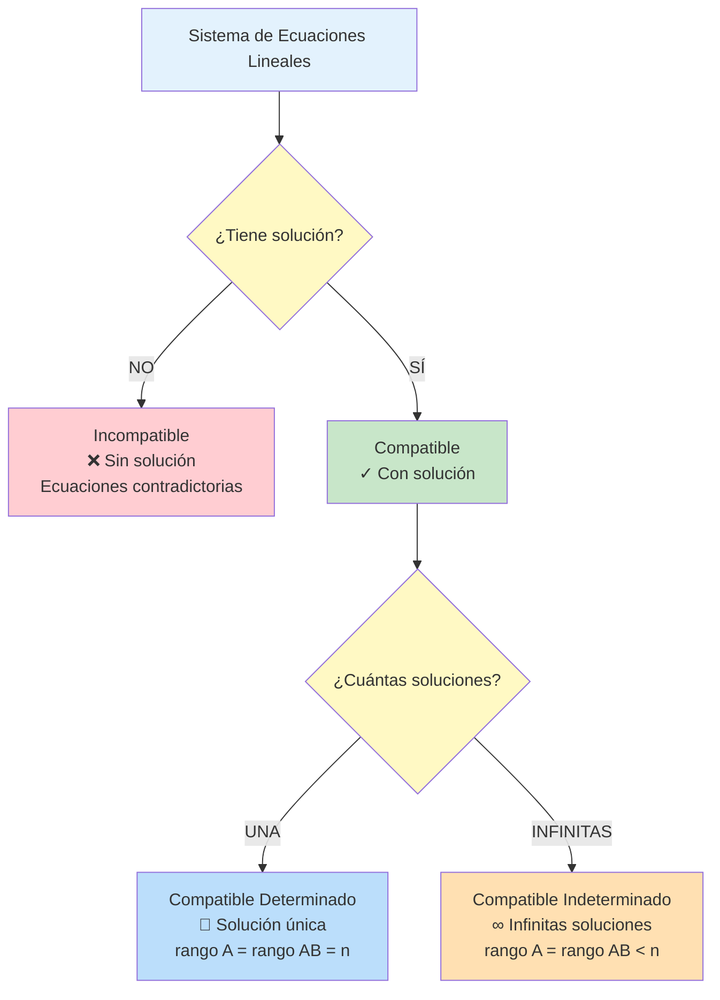
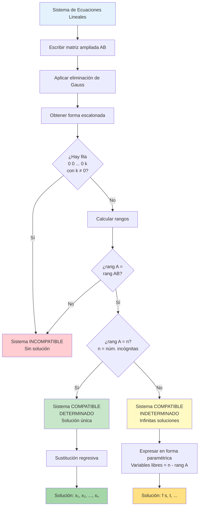
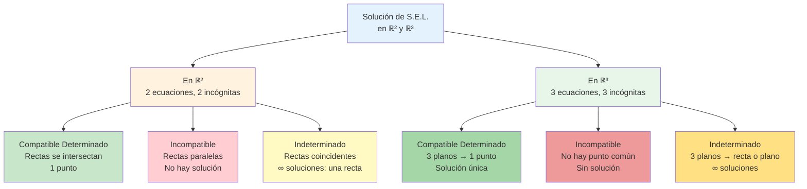

# 📐 Sistemas de Ecuaciones Lineales (S.E.L.)

## 🎯 Fundamentos de los Sistemas

> [!info]- 💡 Introducción a los Sistemas de Ecuaciones Lineales Un **Sistema de Ecuaciones Lineales (S.E.L.)** es un conjunto de dos o más ecuaciones lineales con las mismas incógnitas que deben satisfacerse simultáneamente. Encontrar la solución de un sistema significa hallar los valores de las incógnitas que hacen verdaderas todas las ecuaciones al mismo tiempo.
> 
> **Analogías útiles:**
> 
> - **Intersección de caminos:** Cada ecuación representa un "camino" y la solución es donde todos se encuentran
> - **Sistema de restricciones:** Como requisitos que deben cumplirse todos a la vez
> - **Balance simultáneo:** Como balanzas múltiples que deben equilibrarse juntas
> 
> **Importancia histórica:**
> 
> - **China antigua (200 a.C.):** "Los nueve capítulos" contiene métodos sistemáticos
> - **Gauss (1809):** Formalización del método de eliminación
> - **Cramer (1750):** Regla de Cramer para sistemas pequeños
> - **Aplicaciones modernas:** Base de algoritmos en ingeniería, economía, física, computación

## 📝 Definición y Notación

### 🔢 Forma General de un Sistema

> [!note]- 📋 Estructura Matemática Un sistema de **m ecuaciones** con **n incógnitas** se escribe:
> 
> ```
> a₁₁x₁ + a₁₂x₂ + ... + a₁ₙxₙ = b₁
> a₂₁x₁ + a₂₂x₂ + ... + a₂ₙxₙ = b₂
>   ⋮         ⋮            ⋮      ⋮
> aₘ₁x₁ + aₘ₂x₂ + ... + aₘₙxₙ = bₘ
> ```
> 
> **Componentes:**
> 
> - **x₁, x₂, ..., xₙ:** Incógnitas o variables del sistema
> - **aᵢⱼ:** Coeficientes (números que multiplican a las variables)
> - **bᵢ:** Términos independientes (lado derecho de las ecuaciones)
> - **m:** Número de ecuaciones
> - **n:** Número de incógnitas
> 
> **Notación de índices:**
> 
> - Primer subíndice (i): número de ecuación
> - Segundo subíndice (j): número de variable
> - Ejemplo: a₂₃ es el coeficiente de x₃ en la segunda ecuación

### ✅ Ejemplos de Sistemas

> [!example]- 🎯 Casos Representativos
> 
> **Sistema 2×2 (2 ecuaciones, 2 incógnitas):**
> 
> ```
> 2x + 3y = 7
>  x -  y = 1
> ```
> 
> **Sistema 3×3:**
> 
> ```
> 2x + 3y - z = 5
>  x - 2y + 4z = 1
> 3x +  y + 2z = 7
> ```
> 
> **Sistema rectangular (3×2):**
> 
> ```
> x + 2y = 3
> 2x - y = 1
> 3x + y = 5
> ```
> 
> Más ecuaciones que incógnitas (sobredeterminado)
> 
> **Sistema rectangular (2×3):**
> 
> ```
> x + y + z = 6
> 2x - y + 3z = 14
> ```
> 
> Más incógnitas que ecuaciones (subdeterminado)

### 🔗 Conexión con Matrices (Recordatorio)

> [!tip]- 📊 Notación Matricial Un sistema se puede expresar en forma matricial compacta:
> 
> **AX = B**
> 
> Donde:
> 
> ```
> A = [a₁₁  a₁₂  ...  a₁ₙ]    X = [x₁]    B = [b₁]
>     [a₂₁  a₂₂  ...  a₂ₙ]        [x₂]        [b₂]
>     [ ⋮    ⋮    ⋱    ⋮ ]        [⋮ ]        [⋮ ]
>     [aₘ₁  aₘ₂  ...  aₘₙ]        [xₙ]        [bₘ]
> ```
> 
> - **A:** Matriz de coeficientes (m×n)
> - **X:** Vector de incógnitas (n×1)
> - **B:** Vector de términos independientes (m×1)
> 
> **Matriz ampliada [A|B]:**
> 
> ```
> [a₁₁  a₁₂  ...  a₁ₙ | b₁]
> [a₂₁  a₂₂  ...  a₂ₙ | b₂]
> [ ⋮    ⋮    ⋱    ⋮  | ⋮ ]
> [aₘ₁  aₘ₂  ...  aₘₙ | bₘ]
> ```
> 
> Esta notación será fundamental para el método de Gauss.

## 🎨 Interpretación Geométrica

### 📍 Visualización de Sistemas

> [!success]- 🌍 Significado Geométrico
> 
> **En ℝ² (dos variables):**
> 
> - Cada ecuación lineal representa una **recta** en el plano
> - La solución es el **punto de intersección** de las rectas
> 
> **Casos posibles:**
> 
> ```
> Caso 1: Una solución          Caso 2: Sin solución
>    y                              y
>    |  \    /                      |  ║    ║
>    |   \  /                       |  ║    ║
>    |    \/  ← Punto único         |  ║    ║  ← Paralelas
>    |    /\                        |  ║    ║
>    +-------x                      +-------x
> 
> Caso 3: Infinitas soluciones
>    y
>    |  ═══════  ← Misma recta
>    |
>    +-------x
> ```
> 
> **En ℝ³ (tres variables):**
> 
> - Cada ecuación representa un **plano** en el espacio
> - La solución es la **intersección** de los planos
> 
> **Casos en ℝ³:**
> 
> - **Un punto:** Los tres planos se intersectan en un único punto
> - **Una recta:** Los planos se intersectan en una línea común
> - **Un plano:** Los tres planos coinciden
> - **Sin solución:** Los planos no tienen punto común (paralelos o sin intersección común)
> 
> **Para n > 3:**
> 
> - Trabajamos con **hiperplanos** en espacios de n dimensiones
> - La intuición geométrica se extiende conceptualmente

## 📊 Clasificación de Sistemas

### 🎯 Tipos Según Existencia de Soluciones

> [!warning]- 🔴 Sistema Incompatible (Sin Solución)
> 
> **Definición:** Un sistema es **incompatible** o **inconsistente** si no tiene ninguna solución. No existe ningún conjunto de valores que satisfaga simultáneamente todas las ecuaciones.
> 
> **Características:**
> 
> - Las ecuaciones se contradicen entre sí
> - Geométricamente: rectas paralelas, planos paralelos o sin intersección común
> 
> **Ejemplo en ℝ²:**
> 
> ```
> x + y = 3
> x + y = 7
> ```
> 
> Las rectas son paralelas (misma pendiente, diferentes ordenadas al origen)
> 
> **Ejemplo en ℝ³:**
> 
> ```
> x + y + z = 1
> x + y + z = 2
> 2x - y + 3z = 5
> ```
> 
> Las dos primeras ecuaciones son contradictorias
> 
> **Identificación algebraica:** Al resolver, se llega a una contradicción como 0 = 5

> [!success]- 🟢 Sistema Compatible (Con Solución)
> 
> **Definición:** Un sistema es **compatible** o **consistente** si tiene al menos una solución.
> 
> Se subdivide en dos categorías importantes:

#### 🎯 Compatible Determinado

> [!note]- 🔵 Sistema Compatible Determinado (Solución Única)
> 
> **Definición:** El sistema tiene **exactamente una solución única**. Existe un único conjunto de valores que satisface todas las ecuaciones.
> 
> **Características:**
> 
> - La forma más común en aplicaciones prácticas
> - Número de ecuaciones independientes = número de incógnitas
> - Geométricamente: intersección en un único punto
> 
> **Ejemplo en ℝ²:**
> 
> ```
> 2x + y = 5
> x - y = 1
> ```
> 
> Solución única: x = 2, y = 1
> 
> **Ejemplo en ℝ³:**
> 
> ```
> x + y + z = 6
> 2x - y + z = 3
> x + 2y - z = 0
> ```
> 
> Los tres planos se intersectan en un único punto
> 
> **Condición algebraica:**
> 
> - Rango(A) = Rango([A|B]) = n (número de incógnitas)

#### 🎯 Compatible Indeterminado

> [!note]- 🟡 Sistema Compatible Indeterminado (Infinitas Soluciones)
> 
> **Definición:** El sistema tiene **infinitas soluciones**. Existe un conjunto infinito de valores que satisfacen todas las ecuaciones simultáneamente.
> 
> **Características:**
> 
> - Hay ecuaciones redundantes (no aportan información nueva)
> - Una o más incógnitas quedan como parámetros libres
> - Geométricamente: rectas coincidentes, intersección en una recta, etc.
> 
> **Ejemplo en ℝ² (rectas coincidentes):**
> 
> ```
> 2x + y = 3
> 4x + 2y = 6  ← Múltiplo de la primera
> ```
> 
> Infinitas soluciones: y = 3 - 2x (para cualquier x ∈ ℝ)
> 
> **Ejemplo en ℝ³ (intersección en una recta):**
> 
> ```
> x + y + z = 1
> 2x + 2y + 2z = 2  ← Múltiplo de la primera
> ```
> 
> Infinitas soluciones parametrizadas
> 
> **Expresión de soluciones:** Se expresan en función de parámetros libres (variables independientes)
> 
> - Ejemplo: x = t, y = 1 - t, z = 0 donde t ∈ ℝ
> 
> **Condición algebraica:**
> 
> - Rango(A) = Rango([A|B]) < n (menor que el número de incógnitas)

### 📊 Diagrama de Clasificación



### 📋 Tabla Resumen Comparativa

> [!example]- 📊 Comparación de Tipos
> 
> |Tipo|Soluciones|Interpretación Geométrica (ℝ²)|Interpretación Geométrica (ℝ³)|Condición (Rango)|
> |---|---|---|---|---|
> |**Incompatible**|0|Rectas paralelas distintas|Planos sin intersección común|rango(A) ≠ rango([A\|B])|
> |**Compatible Determinado**|1|Rectas que se cortan en un punto|Planos que se cortan en un punto|rango(A) = rango([A\|B]) = n|
> |**Compatible Indeterminado**|∞|Rectas coincidentes|Planos coincidentes o intersección en recta/plano|rango(A) = rango([A\|B]) < n|

## 🔧 Métodos de Solución para Sistemas Pequeños

### ✏️ Método de Sustitución

> [!tip]- 🔄 Sustitución Paso a Paso
> 
> **Procedimiento:**
> 
> 1. **Despejar** una variable en una de las ecuaciones
> 2. **Sustituir** esa expresión en las demás ecuaciones
> 3. **Resolver** el sistema reducido
> 4. **Retroceder** para encontrar todas las variables
> 
> **Ejemplo detallado:**
> 
> ```
> Sistema:
> (1)  2x + y = 5
> (2)  x - y = 1
> 
> Paso 1: Despejar y de la ecuación (2)
>         y = x - 1
> 
> Paso 2: Sustituir en (1)
>         2x + (x - 1) = 5
>         3x - 1 = 5
> 
> Paso 3: Resolver para x
>         3x = 6
>         x = 2
> 
> Paso 4: Sustituir x = 2 en y = x - 1
>         y = 2 - 1 = 1
> 
> Solución: x = 2, y = 1
> ```
> 
> **Ventajas:**
> 
> - Intuitivo y directo
> - Útil para sistemas pequeños (2×2, 3×3)
> - No requiere notación matricial
> 
> **Desventajas:**
> 
> - Tedioso para sistemas grandes
> - Puede generar fracciones complicadas
> - Difícil de sistematizar

### ⚖️ Método de Igualación

> [!tip]- ⚖️ Igualación Paso a Paso
> 
> **Procedimiento:**
> 
> 1. **Despejar** la misma variable en dos ecuaciones
> 2. **Igualar** las expresiones obtenidas
> 3. **Resolver** para la otra variable
> 4. **Sustituir** para encontrar la variable despejada
> 
> **Ejemplo detallado:**
> 
> ```
> Sistema:
> (1)  2x + y = 5
> (2)  x - y = 1
> 
> Paso 1: Despejar y en ambas ecuaciones
>         De (1): y = 5 - 2x
>         De (2): y = x - 1
> 
> Paso 2: Igualar las expresiones
>         5 - 2x = x - 1
> 
> Paso 3: Resolver para x
>         5 + 1 = x + 2x
>         6 = 3x
>         x = 2
> 
> Paso 4: Sustituir en cualquiera
>         y = 2 - 1 = 1
> 
> Solución: x = 2, y = 1
> ```
> 
> **Ventajas:**
> 
> - Simétrico y ordenado
> - Reduce errores de sustitución
> - Bueno cuando los coeficientes facilitan el despeje
> 
> **Desventajas:**
> 
> - Similar al de sustitución para sistemas grandes
> - Puede generar expresiones complejas

### ➕ Método de Eliminación (Reducción)

> [!tip]- ➕➖ Eliminación por Combinación Lineal
> 
> **Procedimiento:**
> 
> 1. **Multiplicar** ecuaciones por constantes adecuadas
> 2. **Sumar o restar** ecuaciones para eliminar una variable
> 3. **Resolver** el sistema reducido
> 4. **Sustituir regresivamente** para las demás variables
> 
> **Ejemplo detallado:**
> 
> ```
> Sistema:
> (1)  2x + y = 5
> (2)  x - y = 1
> 
> Paso 1: Observar que los coeficientes de y son opuestos
> 
> Paso 2: Sumar (1) + (2) para eliminar y
>         2x + y = 5
>       + x - y = 1
>         ─────────
>         3x = 6
> 
> Paso 3: Resolver para x
>         x = 2
> 
> Paso 4: Sustituir en (2)
>         2 - y = 1
>         y = 1
> 
> Solución: x = 2, y = 1
> ```
> 
> **Ejemplo con multiplicación:**
> 
> ```
> Sistema:
> (1)  3x + 2y = 12
> (2)  2x + 5y = 19
> 
> Paso 1: Multiplicar para igualar coeficientes de x
>         (1) × 2:  6x + 4y = 24
>         (2) × 3:  6x + 15y = 57
> 
> Paso 2: Restar para eliminar x
>         6x + 15y = 57
>       - (6x + 4y = 24)
>         ──────────────
>         11y = 33
> 
> Paso 3: Resolver
>         y = 3
> 
> Paso 4: Sustituir en (1)
>         3x + 2(3) = 12
>         3x = 6
>         x = 2
> 
> Solución: x = 2, y = 3
> ```
> 
> **Ventajas:**
> 
> - Base del método de Gauss
> - Sistemático y algorítmico
> - Evita fracciones hasta el final (si se eligen bien los multiplicadores)
> 
> **Desventajas:**
> 
> - Requiere elegir multiplicadores adecuados
> - Para sistemas grandes, necesita organización matricial

## 🔢 Operaciones Elementales sobre Ecuaciones

> [!note]- ⚙️ Transformaciones Permitidas
> 
> Las siguientes operaciones **no cambian el conjunto de soluciones** del sistema:
> 
> **1. Intercambiar dos ecuaciones (Eᵢ ↔ Eⱼ)**
> 
> ```
> Original:        Después del intercambio:
> E₁: x + y = 3    E₂: 2x - y = 1
> E₂: 2x - y = 1   E₁: x + y = 3
> ```
> 
> **2. Multiplicar una ecuación por una constante no nula (Eᵢ → k·Eᵢ, k ≠ 0)**
> 
> ```
> Original:        Multiplicar E₁ por 2:
> E₁: x + y = 3    E₁: 2x + 2y = 6
> E₂: 2x - y = 1   E₂: 2x - y = 1
> ```
> 
> **3. Sumar a una ecuación un múltiplo de otra (Eᵢ → Eᵢ + k·Eⱼ)**
> 
> ```
> Original:        E₂ → E₂ - 2·E₁:
> E₁: x + y = 3    E₁: x + y = 3
> E₂: 2x - y = 1   E₂: -3y = -5
> ```
> 
> **Notación matricial (para el método de Gauss):**
> 
> - **Rᵢ ↔ Rⱼ:** Intercambiar filas i y j
> - **Rᵢ → k·Rᵢ:** Multiplicar fila i por k
> - **Rᵢ → Rᵢ + k·Rⱼ:** Sumar a la fila i un múltiplo k de la fila j
> 
> Estas operaciones serán fundamentales en el algoritmo de Gauss.

## 🎓 Ejemplos Completos de Clasificación

> [!example]- 💪 Casos de Estudio Detallados
> 
> **Caso 1: Sistema Compatible Determinado**
> 
> ```
> x + y = 4
> x - y = 2
> 
> Por sustitución: y = 4 - x
> x - (4 - x) = 2
> 2x = 6 → x = 3
> y = 1
> 
> ✓ Solución única: (3, 1)
> Tipo: Compatible Determinado
> ```
> 
> **Caso 2: Sistema Incompatible**
> 
> ```
> 2x + y = 3
> 2x + y = 7
> 
> Si restamos las ecuaciones:
> 0 = -4  ← Contradicción
> 
> ✗ No hay solución
> Tipo: Incompatible
> ```
> 
> **Caso 3: Sistema Compatible Indeterminado**
> 
> ```
> x + 2y = 3
> 2x + 4y = 6  ← Es 2 × (primera ecuación)
> 
> La segunda no aporta información nueva
> Solución: x = 3 - 2t, y = t, para t ∈ ℝ
> 
> ∞ Infinitas soluciones
> Tipo: Compatible Indeterminado
> ```
> 
> **Caso 4: Sistema 3×3 Compatible Determinado**
> 
> ```
> x + y + z = 6
> 2x - y + z = 3
> x + 2y - z = 0
> 
> Resolviendo sistemáticamente:
> Solución: x = 1, y = 2, z = 3
> 
> ✓ Solución única
> Tipo: Compatible Determinado
> ```

## 🎯 Estrategia para Analizar Sistemas

> [!success]- 🗺️ Guía de Análisis
> 
> **Pasos para identificar el tipo de sistema:**
> 
> 1. **Observación inicial:**
>     - ¿Hay ecuaciones idénticas o múltiplos entre sí?
>     - ¿Hay ecuaciones contradictorias evidentes?
> 2. **Conteo:**
>     - m = número de ecuaciones
>     - n = número de incógnitas
>     - Si m < n: probablemente indeterminado
>     - Si m = n: puede ser determinado o incompatible
>     - Si m > n: puede ser incompatible o determinado
> 3. **Resolución inicial:**
>     - Aplicar método de eliminación
>     - Observar si aparecen contradicciones (0 = k, k ≠ 0)
>     - Observar si quedan variables libres
> 4. **Cálculo del rango (método avanzado):**
>     - rango(A) vs rango([A|B])
>     - Esto se verá en detalle con el método de Gauss

## 🔗 Conexión con Temas Siguientes

> [!quote]- 🌐 Puentes Conceptuales
> 
> **Esta nota establece las bases para:**
> 
> - **[[Matriz Ampliada y Gauss]]** - Método sistemático de solución
> - **[[Rango de una Matriz]]** - Criterio algebraico de clasificación
> - **[[Espacios Vectoriales]]** - Interpretación en términos de dependencia lineal
> - **[[Determinantes]]** - Criterio para sistemas cuadrados
> 
> **Aplicaciones directas:**
> 
> - **Física:** Análisis de circuitos, equilibrio de fuerzas
> - **Economía:** Modelos de oferta-demanda, optimización
> - **Ingeniería:** Análisis estructural, procesamiento de señales
> - **Computación:** Gráficos 3D, machine learning, sistemas de recomendación

---

**Tags:** #sistemas-ecuaciones-lineales #SEL #algebra-lineal #compatible #incompatible #determinado #indeterminado #metodos-solucion #sustitucion #igualacion #eliminacion #interpretacion-geometrica #clasificacion-sistemas #university #mathematics #linear-algebra

# 📐 Ecuaciones de Grado 1 en ℝ² y ℝ³

## 🎯 Fundamentos de las Ecuaciones Lineales

> [!info]- 💡 Introducción a las Ecuaciones de Primer Grado Las **ecuaciones de grado 1** (o ecuaciones lineales) son expresiones algebraicas donde las variables aparecen elevadas únicamente a la primera potencia. En espacios bidimensionales y tridimensionales, estas ecuaciones tienen interpretaciones geométricas fundamentales: representan **rectas en ℝ²** y **planos en ℝ³**.
> 
> **Analogías útiles:**
> 
> - **Geografía:** Una línea recta en un mapa (ℝ²) o una superficie plana como el nivel del mar (ℝ³)
> - **Física:** Trayectorias rectilíneas uniformes
> - **Economía:** Relaciones lineales entre variables (oferta-demanda)
> - **Arquitectura:** Superficies planas de paredes y pisos
> 
> **Importancia histórica:**
> 
> - **Euclides (300 a.C.):** Geometría de rectas y planos
> - **Descartes (1637):** Conexión álgebra-geometría
> - **Gauss (1809):** Método de eliminación
> - **Cayley (1858):** Teoría de matrices

### 📊 Formas Generales

> [!note]- 🌟 Ecuaciones Lineales por Dimensión
> 
> |Espacio|Ecuación General|Representa|Variables|
> |---|---|---|---|
> |**ℝ²**|$ax + by + c = 0$|Recta|2|
> |**ℝ³**|$ax + by + cz + d = 0$|Plano|3|
> |**ℝⁿ**|$a_1x_1 + a_2x_2 + \cdots + a_nx_n + b = 0$|Hiperplano|n|
> 
> **Características generales:**
> 
> - **Linealidad:** No hay productos de variables ni potencias
> - **Coeficientes constantes:** a, b, c, d son números reales
> - **Grado 1:** Cada variable tiene exponente 1
> - **Infinitas soluciones:** En general (salvo casos degenerados)

## 📏 Ecuaciones en ℝ²: Rectas

### 🔍 Definición y Formas

> [!example]- 🔵 La Ecuación de la Recta
> 
> **Definición geométrica:** Una recta en ℝ² es el conjunto de todos los puntos (x, y) que satisfacen una ecuación lineal.
> 
> **Forma general:** $$ax + by + c = 0$$
> 
> donde a, b no son ambos cero.
> 
> **Condición de no degeneración:**
> 
> - Si a = b = 0: La ecuación no representa una recta (es contradictoria o vacía)
> - Al menos uno de {a, b} debe ser ≠ 0

### 📐 Formas Explícitas de la Recta

> [!success]- 🟢 Múltiples Representaciones
> 
> **1. Forma pendiente-ordenada (explícita):** $$y = mx + b$$
> 
> - **m:** pendiente (inclinación)
> - **b:** ordenada al origen (intersección con eje y)
> - **Ventaja:** Fácil visualización
> - **Limitación:** No representa rectas verticales
> 
> **2. Forma punto-pendiente:** $$y - y_0 = m(x - x_0)$$
> 
> - Pasa por el punto $(x_0, y_0)$
> - Tiene pendiente m
> - **Útil para:** Construir ecuación con datos conocidos
> 
> **3. Forma simétrica (segmentaria):** $$\frac{x}{a} + \frac{y}{b} = 1$$
> 
> - **a:** intersección con eje x
> - **b:** intersección con eje y
> - **Limitación:** No representa rectas por el origen
> 
> **4. Forma vectorial:** $$(x, y) = (x_0, y_0) + t(v_1, v_2)$$
> 
> - $(x_0, y_0)$: punto de paso
> - $(v_1, v_2)$: vector director
> - **t:** parámetro real
> 
> **5. Forma normal:** $$n_1(x - x_0) + n_2(y - y_0) = 0$$
> 
> - $(n_1, n_2)$: vector normal (perpendicular a la recta)

### 🎯 Casos Especiales en ℝ²

> [!tip]- ⚡ Rectas Particulares
> 
> **1. Rectas horizontales:** $$y = k$$
> 
> - Pendiente m = 0
> - Paralelas al eje x
> - Ejemplo: y = 3
> 
> **2. Rectas verticales:** $$x = k$$
> 
> - Pendiente indefinida
> - Paralelas al eje y
> - No tienen forma explícita y = mx + b
> - Ejemplo: x = -2
> 
> **3. Rectas por el origen:** $$ax + by = 0$$
> 
> - Forma explícita: $y = -\frac{a}{b}x$
> - Pasan por (0, 0)
> - Ejemplo: 2x - 3y = 0
> 
> **4. Ejes coordenados:**
> 
> - **Eje x:** y = 0
> - **Eje y:** x = 0
> 
> **5. Bisectrices:**
> 
> - **Primera y tercera:** y = x
> - **Segunda y cuarta:** y = -x

### ✅ Ejemplos de Rectas en ℝ²

> [!example]- 💪 Casos Ilustrativos
> 
> **Ejemplo 1 - Conversión de formas:**
> 
> - General: 2x - 3y + 6 = 0
> - Explícita: 3y = 2x + 6 → y = (2/3)x + 2
> - Pendiente: m = 2/3
> - Ordenada: b = 2
> 
> **Ejemplo 2 - Recta por dos puntos:**
> 
> - Dados A(1, 2) y B(4, 8)
> - Pendiente: $m = \frac{8-2}{4-1} = \frac{6}{3} = 2$
> - Forma punto-pendiente: y - 2 = 2(x - 1)
> - Simplificando: y = 2x
> 
> **Ejemplo 3 - Recta perpendicular:**
> 
> - Dada: y = 3x + 1 (pendiente m₁ = 3)
> - Perpendicular: m₂ = -1/m₁ = -1/3
> - Por punto (0, 5): y - 5 = (-1/3)(x - 0)
> - Ecuación: y = (-1/3)x + 5
> 
> **Ejemplo 4 - Recta paralela:**
> 
> - Dada: 2x + y - 3 = 0 (pendiente m = -2)
> - Paralela por (1, 1): y - 1 = -2(x - 1)
> - Ecuación: 2x + y - 3 = 0 → 2x + y - 3 = 0
> - Simplificando: 2x + y - 3 = 0

## 🛫 Ecuaciones en ℝ³: Planos

### 🔍 Definición y Forma General

> [!warning]- 🟡 La Ecuación del Plano
> 
> **Definición geométrica:** Un plano en ℝ³ es el conjunto de todos los puntos (x, y, z) que satisfacen una ecuación lineal.
> 
> **Forma general:** $$ax + by + cz + d = 0$$
> 
> donde a, b, c no son todos cero.
> 
> **Interpretación vectorial:**
> 
> - $(a, b, c) = \vec{n}$: **vector normal** al plano
> - El plano es perpendicular a $\vec{n}$
> - Todos los vectores contenidos en el plano son ortogonales a $\vec{n}$
> 
> **Condición de no degeneración:**
> 
> - Al menos uno de {a, b, c} debe ser ≠ 0
> - Si a = b = c = 0: No hay plano definido

### 📐 Formas del Plano

> [!note]- 🔷 Representaciones del Plano
> 
> **1. Forma general (implícita):** $$ax + by + cz + d = 0$$
> 
> **2. Forma explícita (función de z):** $$z = \alpha x + \beta y + \gamma$$
> 
> - Válida cuando c ≠ 0
> - **Limitación:** No representa planos verticales
> 
> **3. Forma vectorial:** $$(x, y, z) = (x_0, y_0, z_0) + s(v_1, v_2, v_3) + t(w_1, w_2, w_3)$$
> 
> - $(x_0, y_0, z_0)$: punto del plano
> - $\vec{v}, \vec{w}$: vectores directores (contenidos en el plano)
> - s, t: parámetros reales
> 
> **4. Forma normal (punto-normal):** $$\vec{n} \cdot [(x, y, z) - (x_0, y_0, z_0)] = 0$$
> 
> Expandiendo: $$a(x - x_0) + b(y - y_0) + c(z - z_0) = 0$$
> 
> **5. Forma segmentaria:** $$\frac{x}{a} + \frac{y}{b} + \frac{z}{c} = 1$$
> 
> - Intercepta ejes en (a, 0, 0), (0, b, 0), (0, 0, c)
> - **Limitación:** No representa planos por el origen

### 🎯 Casos Especiales de Planos

> [!tip]- ⚡ Planos Particulares en ℝ³
> 
> **1. Planos coordenados:**
> 
> - **Plano XY:** z = 0 (normal: (0, 0, 1))
> - **Plano XZ:** y = 0 (normal: (0, 1, 0))
> - **Plano YZ:** x = 0 (normal: (1, 0, 0))
> 
> **2. Planos paralelos a ejes:**
> 
> - **Paralelo a eje X:** by + cz + d = 0 (x no aparece)
> - **Paralelo a eje Y:** ax + cz + d = 0 (y no aparece)
> - **Paralelo a eje Z:** ax + by + d = 0 (z no aparece)
> 
> **3. Planos paralelos a planos coordenados:**
> 
> - **Paralelo a XY:** z = k (ejemplo: z = 5)
> - **Paralelo a XZ:** y = k (ejemplo: y = -3)
> - **Paralelo a YZ:** x = k (ejemplo: x = 2)
> 
> **4. Plano por el origen:** $$ax + by + cz = 0$$
> 
> - d = 0 en la forma general
> - Pasa por (0, 0, 0)
> 
> **5. Planos determinados por tres puntos:**
> 
> - Dados A, B, C no colineales
> - Vectores directores: $\vec{AB}$ y $\vec{AC}$
> - Normal: $\vec{n} = \vec{AB} \times \vec{AC}$
> - Ecuación: $\vec{n} \cdot (P - A) = 0$

### ✅ Ejemplos de Planos en ℝ³

> [!example]- 🌐 Casos Resueltos
> 
> **Ejemplo 1 - De forma general a explícita:**
> 
> - General: 2x + 3y - z + 6 = 0
> - Despejando z: z = 2x + 3y + 6
> - Vector normal: $\vec{n} = (2, 3, -1)$
> 
> **Ejemplo 2 - Plano por punto y normal:**
> 
> - Punto: P(1, 2, -1)
> - Normal: $\vec{n} = (3, -1, 2)$
> - Ecuación: 3(x - 1) - 1(y - 2) + 2(z + 1) = 0
> - Simplificando: 3x - y + 2z + 1 = 0
> 
> **Ejemplo 3 - Plano por tres puntos:**
> 
> - A(1, 0, 0), B(0, 1, 0), C(0, 0, 1)
> - $\vec{AB} = (-1, 1, 0)$
> - $\vec{AC} = (-1, 0, 1)$
> - $\vec{n} = \vec{AB} \times \vec{AC} = (1, 1, 1)$
> - Ecuación: 1(x - 1) + 1(y - 0) + 1(z - 0) = 0
> - Simplificando: x + y + z = 1
> 
> **Ejemplo 4 - Plano paralelo:**
> 
> - Dado: 2x - y + 3z = 5
> - Paralelo por (1, 1, 1): 2x - y + 3z = d
> - Sustituir: 2(1) - 1 + 3(1) = 4
> - Ecuación: 2x - y + 3z = 4
> 
> **Ejemplo 5 - Plano perpendicular a un vector:**
> 
> - Perpendicular a $\vec{v} = (1, 2, -1)$ por el origen
> - $\vec{v}$ es el vector normal
> - Ecuación: x + 2y - z = 0

## 📊 Sistemas de Ecuaciones Lineales (S.E.L.)

### 🔍 Definición y Conceptos Básicos

> [!info]- 🔵 ¿Qué es un Sistema de Ecuaciones Lineales?
> 
> **Definición:** Un sistema de ecuaciones lineales es un conjunto de dos o más ecuaciones lineales con las mismas variables que se buscan resolver simultáneamente.
> 
> **Forma general:**
> 
> $$\begin{cases} a_{11}x_1 + a_{12}x_2 + \cdots + a_{1n}x_n = b_1 \ a_{21}x_1 + a_{22}x_2 + \cdots + a_{2n}x_n = b_2 \ \vdots \ a_{m1}x_1 + a_{m2}x_2 + \cdots + a_{mn}x_n = b_m \end{cases}$$
> 
> **Componentes:**
> 
> - **m:** número de ecuaciones
> - **n:** número de incógnitas
> - **$a_{ij}$:** coeficientes (constantes)
> - **$b_i$:** términos independientes
> - **$x_j$:** incógnitas (variables)
> 
> **Solución:** Un conjunto de valores $(x_1, x_2, \ldots, x_n)$ que satisface todas las ecuaciones simultáneamente.

### 📋 Tipos de Sistemas

> [!note]- 🎯 Clasificación de S.E.L.
> 
> **Por compatibilidad:**
> 
> **1. Sistema Compatible:**
> 
> - **Tiene al menos una solución**
> - Ejemplo: $$\begin{cases} x + y = 3 \ 2x - y = 0 \end{cases}$$ Solución: x = 1, y = 2
> 
> **2. Sistema Incompatible:**
> 
> - **No tiene solución** (contradictorio)
> - Ejemplo: $$\begin{cases} x + y = 2 \ x + y = 5 \end{cases}$$ Imposible: mismo lado izquierdo, diferentes derechos
> 
> **Por determinación:**
> 
> **1. Sistema Determinado (Compatible Determinado):**
> 
> - **Tiene exactamente una solución única**
> - Generalmente: m = n (igual número de ecuaciones que incógnitas)
> - Ejemplo: $$\begin{cases} 2x + y = 5 \ x - y = 1 \end{cases}$$ Solución única: x = 2, y = 1
> 
> **2. Sistema Indeterminado (Compatible Indeterminado):**
> 
> - **Tiene infinitas soluciones**
> - Ecuaciones linealmente dependientes
> - Ejemplo: $$\begin{cases} x + y = 3 \ 2x + 2y = 6 \end{cases}$$ Infinitas soluciones: y = 3 - x (familia paramétrica)
> 
> **Diagrama de clasificación:**
> 
> ```
> S.E.L.
> ├── Compatible (tiene solución)
> │   ├── Determinado (1 solución)
> │   └── Indeterminado (∞ soluciones)
> └── Incompatible (sin solución)
> ```

### 🎨 Interpretación Geométrica

> [!example]- 🌈 Visualización de Sistemas
> 
> **En ℝ² (2 ecuaciones, 2 incógnitas):**
> 
> Cada ecuación representa una **recta**:
> 
> **1. Compatible Determinado:**
> 
> - Las rectas se **intersectan en un punto**
> - Solución única: el punto de intersección
> 
> ```
>   L₁ \  
>       \/  ← Punto de intersección (solución única)
>       /\
>   L₂ /
> ```
> 
> **2. Incompatible:**
> 
> - Las rectas son **paralelas** (no se intersectan)
> - Sin solución
> 
> ```
>   L₁ ________
>   
>   L₂ ________
> ```
> 
> **3. Compatible Indeterminado:**
> 
> - Las rectas son **coincidentes** (la misma recta)
> - Infinitas soluciones (todos los puntos de la recta)
> 
> ```
>   L₁ = L₂ ________
> ```
> 
> **En ℝ³ (3 ecuaciones, 3 incógnitas):**
> 
> Cada ecuación representa un **plano**:
> 
> **1. Compatible Determinado:**
> 
> - Los tres planos se intersectan en **un punto**
> - Solución única
> 
> **2. Incompatible:**
> 
> - No hay punto común a los tres planos
> - Ejemplos:
>     - Tres planos paralelos
>     - Dos planos paralelos y uno que los corta
>     - Tres planos formando un "prisma" (sin punto común)
> 
> **3. Compatible Indeterminado:**
> 
> - Infinitas soluciones
> - Ejemplos:
>     - Los tres planos se intersectan en una **recta**
>     - Los tres planos son **coincidentes** (mismo plano)

## 🧮 Notación Matricial

### 📐 Representación con Matrices

> [!success]- 🟢 Forma Matricial del Sistema
> 
> Un sistema de ecuaciones lineales se puede escribir en **forma matricial**:
> 
> $$AX = B$$
> 
> donde:
> 
> **Matriz de coeficientes (A):** $$A = \begin{pmatrix} a_{11} & a_{12} & \cdots & a_{1n} \ a_{21} & a_{22} & \cdots & a_{2n} \ \vdots & \vdots & \ddots & \vdots \ a_{m1} & a_{m2} & \cdots & a_{mn} \end{pmatrix}$$
> 
> **Vector de incógnitas (X):** $$X = \begin{pmatrix} x_1 \ x_2 \ \vdots \ x_n \end{pmatrix}$$
> 
> **Vector de términos independientes (B):** $$B = \begin{pmatrix} b_1 \ b_2 \ \vdots \ b_m \end{pmatrix}$$
> 
> **Matriz ampliada (A|B):**
> 
> Para resolver el sistema, se usa la **matriz ampliada**:
> 
> $$(A|B) = \begin{pmatrix} a_{11} & a_{12} & \cdots & a_{1n} & | & b_1 \ a_{21} & a_{22} & \cdots & a_{2n} & | & b_2 \ \vdots & \vdots & \ddots & \vdots & | & \vdots \ a_{m1} & a_{m2} & \cdots & a_{mn} & | & b_m \end{pmatrix}$$
> 
> La línea vertical separa los coeficientes de los términos independientes.

### 🔧 Operaciones Elementales

> [!tip]- ⚡ Transformaciones Permitidas
> 
> Las **operaciones elementales por filas** transforman el sistema sin cambiar su conjunto solución:
> 
> **1. Intercambio de filas:** $$F_i \leftrightarrow F_j$$
> 
> - Cambiar el orden de dos ecuaciones
> - Ejemplo: Intercambiar ecuación 1 y ecuación 2
> 
> **2. Multiplicación de una fila por un escalar no nulo:** $$F_i \rightarrow k \cdot F_i \quad (k \neq 0)$$
> 
> - Multiplicar toda una ecuación por una constante
> - Ejemplo: $F_1 \rightarrow 2F_1$
> 
> **3. Sumar a una fila un múltiplo de otra:** $$F_i \rightarrow F_i + k \cdot F_j$$
> 
> - Reemplazar una ecuación por ella misma más un múltiplo de otra
> - Ejemplo: $F_2 \rightarrow F_2 - 3F_1$
> 
> **Notación:**
> 
> - $F_i$: Fila i
> - k: Escalar (número real)
> 
> **Objetivo:** Simplificar el sistema manteniendo equivalencia

## 🔍 Solución de Sistemas Pequeños

### 📝 Métodos Básicos

> [!example]- 💼 Técnicas para Sistemas 2×2 y 3×3
> 
> **1. Método de Sustitución:**
> 
> **Procedimiento:**
> 
> 1. Despejar una variable de una ecuación
> 2. Sustituir en las demás ecuaciones
> 3. Resolver para las variables restantes
> 4. Retroceder para encontrar todas las variables
> 
> **Ejemplo:** $$\begin{cases} x + 2y = 7 \ 3x - y = 5 \end{cases}$$
> 
> - De la primera: $x = 7 - 2y$
> - Sustituir en la segunda: $3(7 - 2y) - y = 5$
> - Simplificar: $21 - 6y - y = 5$
> - Resolver: $-7y = -16$ → $y = \frac{16}{7}$
> - Retroceder: $x = 7 - 2(\frac{16}{7}) = \frac{17}{7}$
> 
> **2. Método de Igualación:**
> 
> **Procedimiento:**
> 
> 1. Despejar la misma variable de dos ecuaciones
> 2. Igualar las expresiones
> 3. Resolver para la otra variable
> 4. Sustituir para encontrar la primera
> 
> **Ejemplo:** $$\begin{cases} 2x + y = 8 \ x - y = 1 \end{cases}$$
> 
> - De la primera: $y = 8 - 2x$
> - De la segunda: $y = x - 1$
> - Igualar: $8 - 2x = x - 1$
> - Resolver: $9 = 3x$ → $x = 3$
> - Sustituir: $y = 3 - 1 = 2$
> 
> **3. Método de Reducción (Eliminación):**
> 
> **Procedimiento:**
> 
> 1. Multiplicar ecuaciones para igualar coeficientes
> 2. Sumar o restar para eliminar una variable
> 3. Resolver el sistema resultante
> 4. Retroceder
> 
> **Ejemplo:** $$\begin{cases} 2x + 3y = 12 \ 4x - y = 5 \end{cases}$$
> 
> - Multiplicar la segunda por 3: $12x - 3y = 15$
> - Sumar ambas: $(2x + 3y) + (12x - 3y) = 12 + 15$
> - Simplificar: $14x = 27$ → $x = \frac{27}{14}$
> - Sustituir en cualquiera para encontrar y

### ✅ Ejemplos Completos

> [!example]- 🎯 Sistemas Resueltos Paso a Paso
> 
> **Ejemplo 1 - Sistema 2×2 (determinado):**
> 
> $$\begin{cases} x + y = 5 \ 2x - y = 4 \end{cases}$$
> 
> **Solución por reducción:**
> 
> - Sumar ambas ecuaciones: $(x + y) + (2x - y) = 5 + 4$
> - Simplificar: $3x = 9$ → $x = 3$
> - Sustituir en la primera: $3 + y = 5$ → $y = 2$
> - **Solución:** (3, 2)
> 
> **Verificación:**
> 
> - Primera: 3 + 2 = 5 ✓
> - Segunda: 2(3) - 2 = 4 ✓
> 
> **Ejemplo 2 - Sistema 2×2 (incompatible):**
> 
> $$\begin{cases} x + y = 3 \ x + y = 7 \end{cases}$$
> 
> - Restar: $(x + y) - (x + y) = 3 - 7$
> - Resultado: $0 = -4$ (¡FALSO!)
> - **Conclusión:** Sistema incompatible (sin solución)
> 
> **Ejemplo 3 - Sistema 2×2 (indeterminado):**
> 
> $$\begin{cases} 2x + 4y = 6 \ x + 2y = 3 \end{cases}$$
> 
> - La primera es el doble de la segunda
> - Son ecuaciones equivalentes
> - **Solución:** $y = \frac{3 - x}{2}$ (infinitas soluciones)
> - Forma paramétrica: $(x, \frac{3-x}{2})$ para todo x ∈ ℝ
> 
> **Ejemplo 4 - Sistema 3×3:**
> 
> $$\begin{cases} x + y + z = 6 \ 2x - y + z = 3 \ x + 2y - z = 2 \end{cases}$$
> 
> **Solución por sustitución:**
> 
> - De la primera: $z = 6 - x - y$
> - Sustituir en la segunda: $2x - y + (6 - x - y) = 3$
>     - Simplificar: $x - 2y = -3$ ... (*)
> - Sustituir en la tercera: $x + 2y - (6 - x - y) = 2$
>     - Simplificar: $2x + 3y = 8$ ... (**)
> - Resolver (*) y (**):
>     - De (*): $x = 2y - 3$
>     - En (**): $2(2y - 3) + 3y = 8$
>     - $4y - 6 + 3y = 8$ → $7y = 14$ → $y = 2$
>     - $x = 2(2) - 3 = 1$
>     - $z = 6 - 1 - 2 = 3$
> - **Solución:** (1, 2, 3)

## ⚙️ Algoritmo de Gauss (Eliminación Gaussiana)

### 🔍 Fundamento del Método

> [!info]- 🔵 Eliminación Gaussiana
> 
> **Objetivo:** Transformar la matriz ampliada a **forma escalonada** mediante operaciones elementales.
> 
> **Forma escalonada (escalón por filas):**
> 
> Una matriz está en forma escalonada si cumple:
> 
> 1. Todas las filas nulas (solo ceros) están al final
> 2. El primer elemento no nulo de cada fila (pivote) está a la derecha del pivote de la fila superior
> 3. Todos los elementos debajo de cada pivote son ceros
> 
> **Ejemplo de forma escalonada:**
> $$\begin{pmatrix} \boxed{2} & 3 & -1 & | & 5 \ 0 & \boxed{1} & 2 & | & 3 \ 0 & 0 & \boxed{-3} & | & 6 \end{pmatrix}$$
> 
> Los elementos en cajas (□) son los **pivotes**.
> 
> **Forma escalonada reducida (Gauss-Jordan):**
> 
> - Cada pivote es 1
> - Los elementos arriba y abajo de cada pivote son 0
> 
> $$\begin{pmatrix} 1 & 0 & 0 & | & x_1 \ 0 & 1 & 0 & | & x_2 \ 0 & 0 & 1 & | & x_3 \end{pmatrix}$$

### 🔧 Procedimiento de Gauss

> [!success]- 🟢 Algoritmo Paso a Paso
> 
> **Fase 1: Eliminación hacia adelante (Forward Elimination)**
> 
> **Objetivo:** Crear ceros debajo de cada pivote
> 
> **Pasos:**
> 
> 1. **Identificar el pivote de la primera columna**
>     - Generalmente es $a_{11}$
>     - Si $a_{11} = 0$, intercambiar filas
> 2. **Eliminar elementos debajo del pivote**
>     - Para cada fila i > 1:
>     - $F_i \rightarrow F_i - \frac{a_{i1}}{a_{11}} \cdot F_1$
> 3. **Repetir para las columnas siguientes**
>     - Trabajar con la submatriz que queda
>     - Continuar hasta forma escalonada
> 
> **Fase 2: Sustitución regresiva (Back Substitution)**
> 
> **Objetivo:** Resolver para las incógnitas empezando desde abajo
> 
> **Pasos:**
> 
> 4. **Resolver la última ecuación no trivial**
>     - Despejar la última variable
> 5. **Sustituir hacia arriba**
>     - Usar el valor encontrado en las ecuaciones superiores
>     - Resolver para cada variable en orden inverso
> 6. **Obtener la solución completa**

### 📊 Ejemplo Detallado de Gauss

> [!example]- 💪 Resolución Completa
> 
> **Sistema:** $$\begin{cases} 2x + 3y - z = 5 \ 4x + 4y - 3z = 3 \ -2x + 3y - z = 1 \end{cases}$$
> 
> **Matriz ampliada inicial:** $$\begin{pmatrix} 2 & 3 & -1 & | & 5 \ 4 & 4 & -3 & | & 3 \ -2 & 3 & -1 & | & 1 \end{pmatrix}$$
> 
> **PASO 1: Eliminar debajo del primer pivote (2)**
> 
> - $F_2 \rightarrow F_2 - 2F_1$:
>     - $(4, 4, -3, 3) - 2(2, 3, -1, 5)$
>     - $(4, 4, -3, 3) - (4, 6, -2, 10)$
>     - Resultado: $(0, -2, -1, -7)$
> - $F_3 \rightarrow F_3 + F_1$:
>     - $(-2, 3, -1, 1) + (2, 3, -1, 5)$
>     - Resultado: $(0, 6, -2, 6)$
> 
> **Matriz después del Paso 1:** $$\begin{pmatrix} 2 & 3 & -1 & | & 5 \ 0 & -2 & -1 & | & -7 \ 0 & 6 & -2 & | & 6 \end{pmatrix}$$
> 
> **PASO 2: Eliminar debajo del segundo pivote (-2)**
> 
> - $F_3 \rightarrow F_3 + 3F_2$:
>     - $(0, 6, -2, 6) + 3(0, -2, -1, -7)$
>     - $(0, 6, -2, 6) + (0, -6, -3, -21)$
>     - Resultado: $(0, 0, -5, -15)$
> 
> **Matriz en forma escalonada:** $$\begin{pmatrix} 2 & 3 & -1 & | & 5 \ 0 & -2 & -1 & | & -7 \ 0 & 0 & -5 & | & -15 \end{pmatrix}$$
> 
> **PASO 3: Sustitución regresiva**
> 
> **De la tercera fila:** $$-5z = -15 \implies z = 3$$
> 
> **De la segunda fila:** $$-2y - z = -7$$ $$-2y - 3 = -7$$ $$-2y = -4 \implies y = 2$$
> 
> **De la primera fila:** $$2x + 3y - z = 5$$ $$2x + 3(2) - 3 = 5$$ $$2x + 3 = 5$$ $$2x = 2 \implies x = 1$$
> 
> **Solución:** $(x, y, z) = (1, 2, 3)$
> 
> **Verificación:**
> 
> - Primera: $2(1) + 3(2) - 3 = 2 + 6 - 3 = 5$ ✓
> - Segunda: $4(1) + 4(2) - 3(3) = 4 + 8 - 9 = 3$ ✓
> - Tercera: $-2(1) + 3(2) - 3 = -2 + 6 - 3 = 1$ ✓

### 🎯 Casos Especiales en Gauss

> [!warning]- ⚠️ Situaciones Particulares
> 
> **1. Pivote cero:**
> 
> **Problema:** $$\begin{pmatrix} 0 & 2 & 3 & | & 4 \ 1 & 3 & 1 & | & 2 \ 2 & 1 & 4 & | & 5 \end{pmatrix}$$
> 
> **Solución:** Intercambiar filas $$F_1 \leftrightarrow F_2$$
> 
> **2. Sistema incompatible detectado:**
> 
> Si durante el proceso aparece una fila del tipo: $$\begin{pmatrix} 0 & 0 & 0 & | & k \end{pmatrix} \quad (k \neq 0)$$
> 
> Esto representa: $0 = k$ (¡FALSO!)
> 
> **Conclusión:** Sistema incompatible (sin solución)
> 
> **3. Infinitas soluciones detectadas:**
> 
> Si hay una fila completamente nula: $$\begin{pmatrix} 0 & 0 & 0 & | & 0 \end{pmatrix}$$
> 
> Y hay menos pivotes que variables:
> 
> **Conclusión:** Sistema indeterminado (infinitas soluciones)
> 
> **Ejemplo:** $$\begin{pmatrix} 1 & 2 & 3 & | & 4 \ 0 & 1 & 2 & | & 5 \ 0 & 0 & 0 & | & 0 \end{pmatrix}$$
> 
> - Solo 2 pivotes para 3 variables
> - z es **variable libre** (parámetro)
> - Solución: $(x, y, z) = (f(z), g(z), z)$ con z ∈ ℝ

### ✅ Más Ejemplos de Gauss

> [!example]- 🔬 Casos Adicionales
> 
> **Ejemplo 1 - Sistema 4×4:**
> 
> $$\begin{cases} x + 2y + z - w = 1 \ 2x + 5y + 3z - 2w = 4 \ x + 3y + 2z - w = 5 \ 3x + 8y + 5z - 3w = 10 \end{cases}$$
> 
> **Matriz ampliada:** $$\begin{pmatrix} 1 & 2 & 1 & -1 & | & 1 \ 2 & 5 & 3 & -2 & | & 4 \ 1 & 3 & 2 & -1 & | & 5 \ 3 & 8 & 5 & -3 & | & 10 \end{pmatrix}$$
> 
> **Aplicar Gauss:** (proceso similar al ejemplo anterior)
> 
> **Ejemplo 2 - Sistema incompatible:**
> 
> $$\begin{cases} x + y + z = 6 \ 2x + 2y + 2z = 10 \ x - y + z = 4 \end{cases}$$
> 
> **Matriz ampliada:** $$\begin{pmatrix} 1 & 1 & 1 & | & 6 \ 2 & 2 & 2 & | & 10 \ 1 & -1 & 1 & | & 4 \end{pmatrix}$$
> 
> **Después de $F_2 \rightarrow F_2 - 2F_1$:** $$\begin{pmatrix} 1 & 1 & 1 & | & 6 \ 0 & 0 & 0 & | & -2 \ 1 & -1 & 1 & | & 4 \end{pmatrix}$$
> 
> **Fila 2:** $0 = -2$ (¡FALSO!)
> 
> **Conclusión:** Sistema incompatible
> 
> **Ejemplo 3 - Sistema indeterminado:**
> 
> $$\begin{cases} x + 2y - z = 3 \ 2x + 4y - 2z = 6 \ x + 2y - z = 3 \end{cases}$$
> 
> **Después de Gauss:** $$\begin{pmatrix} 1 & 2 & -1 & | & 3 \ 0 & 0 & 0 & | & 0 \ 0 & 0 & 0 & | & 0 \end{pmatrix}$$
> 
> **Solo 1 ecuación independiente:** $$x + 2y - z = 3$$
> 
> **Solución paramétrica:**
> 
> - Sean y = s, z = t (parámetros libres)
> - Entonces: $x = 3 - 2s + t$
> - **Solución:** $(3 - 2s + t, s, t)$ para todo s, t ∈ ℝ

## 📏 Rango de una Matriz

### 🔍 Definición y Concepto

> [!info]- 🔵 ¿Qué es el Rango?
> 
> **Definición:** El **rango** de una matriz A (denotado rang(A) o rk(A)) es el número máximo de filas (o columnas) linealmente independientes.
> 
> **Interpretaciones equivalentes:**
> 
> 1. **Número de pivotes** en la forma escalonada
> 2. **Dimensión del espacio generado** por las filas
> 3. **Dimensión del espacio generado** por las columnas
> 4. **Número de ecuaciones independientes** en el sistema
> 
> **Propiedades básicas:**
> 
> - $0 \leq \text{rang}(A) \leq \min(m, n)$ para matriz m×n
> - rang(A) = rang(Aᵀ) (rango por filas = rango por columnas)
> - rang(A) ≤ min(número de filas, número de columnas)

### 🔧 Cálculo del Rango

> [!success]- 🟢 Método de Gauss para el Rango
> 
> **Procedimiento:**
> 
> 1. **Aplicar eliminación gaussiana** a la matriz
> 2. **Transformar a forma escalonada**
> 3. **Contar el número de filas no nulas**
> 
> El número de filas no nulas en la forma escalonada es el rango.
> 
> **Ejemplo 1:**
> 
> $$A = \begin{pmatrix} 1 & 2 & 3 \ 2 & 4 & 6 \ 1 & 1 & 2 \end{pmatrix}$$
> 
> **Aplicar Gauss:**
> 
> - $F_2 \rightarrow F_2 - 2F_1$
> - $F_3 \rightarrow F_3 - F_1$
> 
> $$\begin{pmatrix} 1 & 2 & 3 \ 0 & 0 & 0 \ 0 & -1 & -1 \end{pmatrix}$$
> 
> - $F_2 \leftrightarrow F_3$
> 
> $$\begin{pmatrix} 1 & 2 & 3 \ 0 & -1 & -1 \ 0 & 0 & 0 \end{pmatrix}$$
> 
> **Filas no nulas:** 2
> 
> **rang(A) = 2**
> 
> **Ejemplo 2:**
> 
> $$B = \begin{pmatrix} 1 & 0 & 2 \ 0 & 1 & 3 \ 0 & 0 & 1 \end{pmatrix}$$
> 
> Ya está en forma escalonada.
> 
> **Filas no nulas:** 3
> 
> **rang(B) = 3** (rango completo)

### 📊 Rango y Soluciones del Sistema

> [!note]- 🎯 Teorema de Rouché-Frobenius
> 
> Dado el sistema $AX = B$:
> 
> - **A:** matriz de coeficientes (m×n)
> - **(A|B):** matriz ampliada
> 
> **Teorema:** El sistema tiene solución si y solo si: $$\text{rang}(A) = \text{rang}(A|B)$$
> 
> **Clasificación completa:**
> 
> Sean:
> 
> - r = rang(A)
> - r' = rang(A|B)
> - n = número de incógnitas
> 
> |Condición|Tipo de Sistema|Soluciones|
> |---|---|---|
> |r < r'|**Incompatible**|Ninguna|
> |r = r' = n|**Compatible determinado**|Única|
> |r = r' < n|**Compatible indeterminado**|Infinitas (∞^(n-r))|
> 
> **Interpretación:**
> 
> **1. Sistema incompatible (r < r'):**
> 
> - La columna B añade información contradictoria
> - Hay ecuaciones contradictorias
> - No hay solución
> 
> **2. Compatible determinado (r = r' = n):**
> 
> - Todas las ecuaciones son independientes
> - Igual número de ecuaciones que incógnitas
> - Solución única
> 
> **3. Compatible indeterminado (r = r' < n):**
> 
> - Hay (n - r) **variables libres** (parámetros)
> - Familia de soluciones de dimensión (n - r)
> - Infinitas soluciones

### ✅ Ejemplos con Rango

> [!example]- 🔍 Análisis de Sistemas mediante Rango
> 
> **Ejemplo 1 - Compatible determinado:**
> 
> $$\begin{cases} x + y = 3 \ 2x - y = 0 \end{cases}$$
> 
> **Matrices:** $$A = \begin{pmatrix} 1 & 1 \ 2 & -1 \end{pmatrix}, \quad (A|B) = \begin{pmatrix} 1 & 1 & | & 3 \ 2 & -1 & | & 0 \end{pmatrix}$$
> 
> **Cálculo:**
> 
> - rang(A) = 2 (ambas filas son independientes)
> - rang(A|B) = 2
> - n = 2
> 
> **Conclusión:** r = r' = n = 2
> 
> - Sistema compatible determinado
> - Solución única
> 
> **Ejemplo 2 - Incompatible:**
> 
> $$\begin{cases} x + y = 2 \ 2x + 2y = 5 \end{cases}$$
> 
> **Matrices:** $$A = \begin{pmatrix} 1 & 1 \ 2 & 2 \end{pmatrix}, \quad (A|B) = \begin{pmatrix} 1 & 1 & | & 2 \ 2 & 2 & | & 5 \end{pmatrix}$$
> 
> **Forma escalonada:** $$\begin{pmatrix} 1 & 1 & | & 2 \ 0 & 0 & | & 1 \end{pmatrix}$$
> 
> **Cálculo:**
> 
> - rang(A) = 1 (segunda fila proporcional a la primera)
> - rang(A|B) = 2 (fila [0 0 | 1] no es nula)
> 
> **Conclusión:** r < r' (1 < 2)
> 
> - Sistema incompatible
> - Sin solución
> 
> **Ejemplo 3 - Indeterminado:**
> 
> $$\begin{cases} x + 2y + z = 3 \ 2x + 4y + 2z = 6 \end{cases}$$
> 
> **Matrices:** $$A = \begin{pmatrix} 1 & 2 & 1 \ 2 & 4 & 2 \end{pmatrix}, \quad (A|B) = \begin{pmatrix} 1 & 2 & 1 & | & 3 \ 2 & 4 & 2 & | & 6 \end{pmatrix}$$
> 
> **Forma escalonada:** $$\begin{pmatrix} 1 & 2 & 1 & | & 3 \ 0 & 0 & 0 & | & 0 \end{pmatrix}$$
> 
> **Cálculo:**
> 
> - rang(A) = 1
> - rang(A|B) = 1
> - n = 3
> 
> **Conclusión:** r = r' < n (1 = 1 < 3)
> 
> - Sistema compatible indeterminado
> - Grados de libertad: n - r = 3 - 1 = 2
> - Dos parámetros libres
> - **Solución:** $(3 - 2s - t, s, t)$ para todo s, t ∈ ℝ

## 🎨 Diagrama de Flujo para Resolver S.E.L.



## 🧪 Ejercicios Progresivos

> [!example]- 💪 Práctica Graduada
> 
> **Nivel 1 - Sistemas 2×2:** 🟢
> 
> 1. **Resolver por sustitución:** $$\begin{cases} x + y = 5 \ x - y = 1 \end{cases}$$ Respuesta: x = 3, y = 2
>     
> 2. **Resolver por igualación:** $$\begin{cases} 2x + y = 7 \ x - y = 2 \end{cases}$$ Respuesta: x = 3, y = 1
>     
> 3. **Identificar tipo:** $$\begin{cases} x + 2y = 4 \ 2x + 4y = 8 \end{cases}$$ Respuesta: Compatible indeterminado
>     
> 4. **Identificar tipo:** $$\begin{cases} x + y = 3 \ x + y = 5 \end{cases}$$ Respuesta: Incompatible
>     
> 
> **Nivel 2 - Sistemas 3×3 y Gauss:** 🟡
> 
> 5. **Resolver por Gauss:** $$\begin{cases} x + y + z = 6 \ 2x + y - z = 1 \ x - y + z = 2 \end{cases}$$ Aplicar eliminación gaussiana
>     
> 6. **Calcular rango:** $$A = \begin{pmatrix} 1 & 2 & 3 \ 2 & 4 & 6 \ 3 & 6 & 9 \end{pmatrix}$$ Respuesta: rang(A) = 1
>     
> 7. **Sistema con parámetro:** $$\begin{cases} x + y = 3 \ 2x + 2y = k \end{cases}$$ ¿Para qué valor de k el sistema es compatible? Respuesta: k = 6
>     
> 8. **Interpretación geométrica:** Describir geométricamente el sistema: $$\begin{cases} x + y + z = 1 \ 2x + 2y + 2z = 2 \end{cases}$$ Respuesta: Dos planos coincidentes
>     
> 
> **Nivel 3 - Problemas Avanzados:** 🔴
> 
> 9. **Sistema 4×4:** $$\begin{cases} w + x + y + z = 10 \ w - x + y - z = 0 \ 2w + x - y + z = 5 \ w + 2x + 3y + 2z = 15 \end{cases}$$ Resolver completamente
>     
> 10. **Análisis con rangos:** Determinar para qué valores de a y b el sistema tiene solución: $$\begin{cases} x + y + z = 3 \ 2x + ay + 2z = 6 \ x + y + z = b \end{cases}$$ Analizar todos los casos
>     
> 11. **Problema aplicado:** Una empresa produce tres tipos de productos A, B, C.
>     
>     - Requieren materias primas M₁, M₂, M₃
>     - A: 2M₁ + 3M₂ + M₃
>     - B: M₁ + 2M₂ + 2M₃
>     - C: 3M₁ + M₂ + M₃
>     - Disponibles: 100 kg M₁, 90 kg M₂, 80 kg M₃ Plantear y resolver el sistema
> 12. **Demostración:** Probar que si rang(A) = rang(A|B) < n, entonces el sistema tiene infinitas soluciones expresables con (n - rang(A)) parámetros.
>     

## 🌐 Aplicaciones Prácticas

### 🏭 Ingeniería y Optimización

> [!note]- 🔧 Casos de Uso Industriales
> 
> **1. Análisis de circuitos eléctricos:**
> 
> **Leyes de Kirchhoff:**
> 
> - Ley de corrientes (nodos)
> - Ley de voltajes (mallas)
> 
> **Ejemplo:** Circuito con 3 mallas: $$\begin{cases} 10I_1 - 5I_2 = 12 \ -5I_1 + 15I_2 - 8I_3 = 0 \ -8I_2 + 20I_3 = -6 \end{cases}$$
> 
> Resolver para encontrar corrientes I₁, I₂, I₃
> 
> **2. Balance de materiales en química:**
> 
> **Ecuación química:** $$aH_2SO_4 + bNaOH \rightarrow cNa_2SO_4 + dH_2O$$
> 
> **Sistema de balance:**
> 
> - H: 2a + b = 2d
> - S: a = c
> - O: 4a + b = 4c + d
> - Na: b = 2c
> 
> Resolver para encontrar coeficientes estequiométricos
> 
> **3. Análisis estructural:**
> 
> **Equilibrio de fuerzas en una estructura:**
> 
> - Fuerzas en x: ΣFₓ = 0
> - Fuerzas en y: ΣFᵧ = 0
> - Momentos: ΣM = 0
> 
> Sistema de ecuaciones para encontrar reacciones en apoyos

### 📈 Economía y Finanzas

> [!example]- 💰 Aplicaciones Económicas
> 
> **1. Modelo de equilibrio de mercado:**
> 
> **Múltiples productos relacionados:** $$\begin{cases} Q_{d1} = Q_{s1} \ Q_{d2} = Q_{s2} \ Q_{d3} = Q_{s3} \end{cases}$$
> 
> donde las demandas y ofertas dependen de todos los precios
> 
> **2. Modelo input-output de Leontief:**
> 
> **Relaciones intersectoriales:** $$X = AX + D$$
> 
> donde:
> 
> - X: vector de producción
> - A: matriz de coeficientes técnicos
> - D: demanda final
> 
> Resolver: $$(I - A)X = D$$
> 
> **3. Análisis de portafolios:**
> 
> **Optimización con restricciones:**
> 
> - Suma de pesos = 1
> - Rendimiento esperado ≥ objetivo
> - Restricciones de diversificación

### 🔬 Ciencias Naturales

> [!success]- 🧬 Aplicaciones Científicas
> 
> **1. Ajuste de curvas (mínimos cuadrados):**
> 
> Dado un conjunto de puntos, encontrar la mejor recta: $$y = mx + b$$
> 
> **Sistema normal:** $$\begin{cases} m\sum x_i^2 + b\sum x_i = \sum x_iy_i \ m\sum x_i + bn = \sum y_i \end{cases}$$
> 
> **2. Redes de reacciones químicas:**
> 
> Múltiples reacciones simultáneas: $$\begin{cases} r_1: A + B \rightarrow C \ r_2: C + D \rightarrow E \ r_3: E \rightarrow A + F \end{cases}$$
> 
> Balance de especies en estado estacionario
> 
> **3. Modelos poblacionales:**
> 
> **Dinámica de múltiples especies:** $$\frac{dN_i}{dt} = f_i(N_1, N_2, \ldots, N_n)$$
> 
> En equilibrio: sistema de ecuaciones algebraicas

## 🎓 Teoría Complementaria

### 📐 Espacios Vectoriales y Dimensión

> [!info]- 🔵 Conceptos Avanzados
> 
> **Relación con álgebra lineal:**
> 
> **1. Espacio columna (Im A):**
> 
> - Conjunto de todas las combinaciones lineales de las columnas de A
> - dim(Im A) = rang(A)
> 
> **2. Espacio nulo (Ker A):**
> 
> - Soluciones del sistema homogéneo Ax = 0
> - dim(Ker A) = n - rang(A)
> - Número de parámetros libres
> 
> **3. Teorema del rango-nulidad:** $$\text{dim(Im A)} + \text{dim(Ker A)} = n$$
> 
> **Interpretación geométrica:**
> 
> - **rang(A) = 1 en ℝ³:** Las filas generan una recta
> - **rang(A) = 2 en ℝ³:** Las filas generan un plano
> - **rang(A) = 3 en ℝ³:** Las filas generan todo ℝ³

### 🔍 Independencia Lineal

> [!tip]- 🎯 Concepto Fundamental
> 
> **Definición:** Un conjunto de vectores {v₁, v₂, ..., vₖ} es **linealmente independiente** si: $$c_1v_1 + c_2v_2 + \cdots + c_kv_k = 0$$
> 
> implica que c₁ = c₂ = ... = cₖ = 0
> 
> **En contexto de ecuaciones:**
> 
> - **Filas independientes:** Ecuaciones no redundantes
> - **Filas dependientes:** Alguna ecuación es combinación de otras
> 
> **Criterio práctico:**
> 
> - Realizar Gauss sobre las filas
> - El número de filas no nulas = número de filas independientes
> 
> **Ejemplo:** $$\begin{pmatrix} 1 & 2 & 3 \ 2 & 4 & 6 \ 1 & 0 & 1 \end{pmatrix}$$
> 
> - Fila 2 = 2 × Fila 1 (dependiente)
> - Filas 1 y 3 son independientes
> - rang = 2

### 📊 Determinantes y Sistemas

> [!note]- 🔷 Relación con Determinantes
> 
> **Para sistemas cuadrados (m = n):**
> 
> **Teorema:** El sistema Ax = b tiene solución única si y solo si det(A) ≠ 0
> 
> **Interpretación:**
> 
> - det(A) ≠ 0 ⟹ rang(A) = n ⟹ A invertible
> - det(A) = 0 ⟹ rang(A) < n ⟹ A singular
> 
> **Regla de Cramer (solo para sistemas determinados):**
> 
> Si det(A) ≠ 0: $$x_i = \frac{\det(A_i)}{\det(A)}$$
> 
> donde Aᵢ es A con la columna i reemplazada por b
> 
> **Nota:** Cramer es ineficiente para sistemas grandes (Gauss es más rápido)

## 📊 Tabla Resumen de Métodos

> [!example]- 📋 Comparación de Técnicas
> 
> |Método|Mejor para|Complejidad|Ventajas|Desventajas|
> |---|---|---|---|---|
> |**Sustitución**|Sistemas 2×2, 3×3 pequeños|Baja-Media|Intuitivo|Tedioso para sistemas grandes|
> |**Igualación**|Sistemas 2×2|Baja|Simple conceptualmente|Solo práctico para 2×2|
> |**Reducción**|Sistemas 2×2, 3×3|Media|Elimina variables directamente|Requiere manipulación cuidadosa|
> |**Gauss**|Sistemas grandes (n≥3)|O(n³)|Sistemático, general|Errores de redondeo|
> |**Gauss-Jordan**|Obtener forma reducida|O(n³)|Solución directa|Más operaciones|
> |**Regla de Cramer**|Sistemas 3×3 teóricos|O(n!)|Fórmula explícita|Muy ineficiente|
> |**Matrices (A⁻¹)**|Sistemas cuadrados|O(n³)|Solución directa|Requiere invertibilidad|
> |**LU descomp.**|Múltiples sistemas con misma A|O(n³) + O(n²)|Reutilizable|Implementación compleja|
> 
> **Recomendación general:**
> 
> - **n ≤ 3:** Cualquier método manual
> - **n ≥ 4:** Gauss o métodos computacionales
> - **Análisis teórico:** Rangos y Rouché-Frobenius

## 🎨 Visualización de Soluciones



## 🌐 Conexiones Conceptuales

> [!quote]- 🔗 Enlaces con Otros Temas
> 
> **Prerrequisitos:**
> 
> - [[Vectores en ℝⁿ]] - Representación de soluciones
> - [[Operaciones con Matrices]] - Notación matricial
> - [[Determinantes]] - Criterio de invertibilidad
> - [[Geometría Analítica]] - Interpretación geométrica
> 
> **Aplicaciones directas:**
> 
> - [[Espacios Vectoriales]] - Imagen y núcleo
> - [[Transformaciones Lineales]] - Sistemas como transformaciones
> - [[Diagonalización]] - Sistemas de ecuaciones diferenciales
> - [[Mínimos Cuadrados]] - Sistemas sobredeterminados
> 
> **Temas avanzados:**
> 
> - [[Valores y Vectores Propios]] - Sistemas de ecuaciones especiales
> - [[Descomposición LU]] - Factorización para resolver sistemas
> - [[Métodos Iterativos]] - Jacobi, Gauss-Seidel
> - [[Sistemas No Lineales]] - Generalización
> 
> **Aplicaciones interdisciplinarias:**
> 
> - [[Análisis de Circuitos]] - Leyes de Kirchhoff
> - [[Optimización Lineal]] - Programación lineal
> - [[Mecánica]] - Equilibrio de fuerzas
> - [[Economía Matemática]] - Modelos de equilibrio
> - [[Procesamiento de Señales]] - Sistemas LTI
> - [[Aprendizaje Automático]] - Regresión lineal

## 💡 Consejos de Estudio

> [!tip]- 🧠 Estrategias de Aprendizaje
> 
> **Para dominar sistemas de ecuaciones:**
> 
> **1. Entender geometría primero:**
> 
> - Visualizar qué representa cada ecuación
> - ℝ²: rectas; ℝ³: planos
> - Interpretar soluciones geométricamente
> 
> **2. Practicar Gauss sistemáticamente:**
> 
> - Seguir siempre el mismo procedimiento
> - Escribir cada paso claramente
> - Verificar después de cada operación elemental
> 
> **3. Memorizar el teorema de Rouché-Frobenius:**
> 
> - **r < r':** Incompatible
> - **r = r' = n:** Compatible determinado
> - **r = r' < n:** Compatible indeterminado
> 
> **4. Verificar siempre la solución:**
> 
> - Sustituir en las ecuaciones originales
> - Verificar que todas se satisfagan
> - Detectar errores tempranamente
> 
> **Errores comunes a evitar:**
> 
> - ❌ Olvidar aplicar operación a TODA la fila
> - ❌ Errores de signo al eliminar
> - ❌ No simplificar fracciones durante el proceso
> - ❌ Confundir rang(A) con rang(A|B)
> - ❌ No identificar variables libres en sistemas indeterminados
> 
> **Atajos útiles:**
> 
> - Si dos ecuaciones son proporcionales → indeterminado o incompatible
> - Si aparece 0 = k (k≠0) → incompatible inmediatamente
> - Si matriz A es triangular → sustitución directa
> - Sistemas homogéneos (b=0) → siempre compatibles

## 🏆 Problemas Desafiantes

> [!example]- 🎯 Ejercicios Avanzados
> 
> **Desafío 1 - Sistema con parámetros:**
> 
> Determinar todos los valores de λ para los cuales el sistema tiene: a) Solución única b) Infinitas soluciones c) Sin solución
> 
> $$\begin{cases} x + y + z = 1 \ x + 2y + \lambda z = 2 \ x + y + (\lambda^2 - 2)z = \lambda \end{cases}$$
> 
> **Desafío 2 - Interpretación geométrica:**
> 
> Describir geométricamente todas las posibles configuraciones de tres planos en ℝ³ que resulten en un sistema:
> 
> - Compatible determinado
> - Compatible indeterminado
> - Incompatible
> 
> **Desafío 3 - Problema aplicado:**
> 
> Una fábrica produce tres tipos de motores (A, B, C) usando tres recursos (R₁, R₂, R₃):
> 
> - Motor A: 2R₁ + 3R₂ + R₃
> - Motor B: R₁ + 2R₂ + 2R₃
> - Motor C: 3R₁ + R₂ + 3R₃
> 
> Disponibles: 100 unidades R₁, 90 unidades R₂, 110 unidades R₃
> 
> a) Plantear el sistema b) Determinar si es posible usar exactamente todos los recursos c) Si no, ¿qué combinación usa más recursos?
> 
> **Desafío 4 - Demostración:**
> 
> Probar que si A es una matriz n×n con rang(A) = n-1, entonces el sistema homogéneo Ax = 0 tiene soluciones no triviales que forman un espacio unidimensional (una recta por el origen).
> 
> **Desafío 5 - Generalización:**
> 
> Dado un sistema compatible indeterminado con rang(A) = r y n incógnitas, demostrar que el conjunto solución forma un espacio afín de dimensión (n-r).

---

**Tags:** #álgebra-lineal #sistemas-ecuaciones-lineales #gauss #eliminación-gaussiana #rango-matrices #rouché-frobenius #ecuaciones-lineales #rectas #planos #matriz-ampliada #sustitución-regresiva #geometría-analítica #university #mathematics #linear-systems