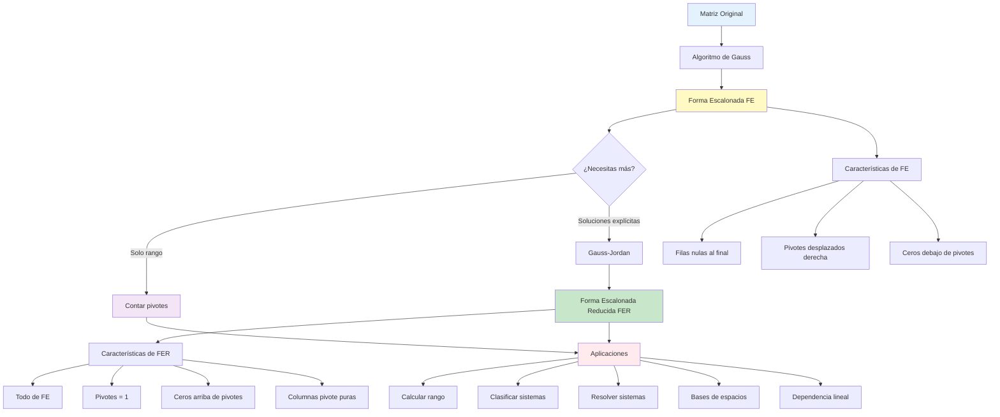

# Formas Escalonadas y Matriz Escalonada

## 🎯 Fundamentos de las Formas Escalonadas

> [!info]- 💡 Introducción al Concepto de Forma Escalonada La **forma escalonada** de una matriz es una configuración especial que resulta de aplicar el algoritmo de Gauss. Es fundamental porque revela inmediatamente la estructura y propiedades de la matriz original, especialmente su rango y la naturaleza del sistema de ecuaciones asociado.
> 
> **Analogías útiles:**
> 
> - **Escalera descendente:** Como una escalera donde cada peldaño está más a la derecha que el anterior
> - **Pirámide de información:** Información concentrada arriba, vacío ordenado abajo
> - **Organización jerárquica:** Como un organigrama empresarial con niveles claros
> - **Filtrado sistemático:** Como tamices de diferentes tamaños ordenados
> 
> **Importancia histórica:**
> 
> - **Carl Friedrich Gauss (1777-1855):** Sistematizó el método de eliminación
> - **Wilhelm Jordan (1842-1899):** Perfeccionó el método hasta la forma reducida
> - **Desarrollo computacional:** Base de algoritmos numéricos modernos
> 
> **¿Por qué es importante?**
> 
> - Simplifica enormemente el análisis de sistemas
> - Permite identificar el rango de forma inmediata
> - Facilita la resolución de sistemas lineales
> - Es la base de algoritmos computacionales eficientes
> - Revela la estructura de dependencias lineales

## 📚 Definiciones Fundamentales

### 🔢 Definición de Forma Escalonada (FE)

> [!note]- 📖 Definición Formal
> 
> **Definición:** Una matriz está en **forma escalonada** (o **forma de escalón por filas**) si cumple las siguientes condiciones:
> 
> **Condición 1: Filas nulas al final**
> 
> ```
> Todas las filas que contienen únicamente ceros están 
> ubicadas debajo de todas las filas con al menos un elemento no nulo.
> ```
> 
> **Condición 2: Pivotes desplazados a la derecha**
> 
> ```
> El primer elemento no nulo de cada fila (llamado pivote o elemento líder)
> está estrictamente a la derecha del pivote de la fila anterior.
> ```
> 
> **Notación del pivote:**
> 
> - También llamado: **elemento líder**, **entrada líder**, o **coeficiente principal**
> - Típicamente denotado con un círculo o resaltado
> - Es el primer elemento no nulo (de izquierda a derecha) de una fila
> 
> **Visualización del patrón escalonado:**
> 
> ```
> ⬤ representa un pivote
> * representa un elemento cualquiera (puede ser 0 o no)
> 0 representa cero obligatorio
> 
> Forma escalonada genérica:
> ⬤ * * * * *
> 0 ⬤ * * * *
> 0 0 0 ⬤ * *
> 0 0 0 0 ⬤ *
> 0 0 0 0 0 0
> 
> Patrón de "escalera descendente"
> ```

### 🎨 Definición de Forma Escalonada Reducida (FER)

> [!note]- 📖 Forma de Gauss-Jordan
> 
> **Definición:** Una matriz está en **forma escalonada reducida** (o **forma canónica por filas** o **forma de Gauss-Jordan**) si:
> 
> **Condición 1:** Está en forma escalonada (cumple las dos condiciones anteriores)
> 
> **Condición 2: Pivotes = 1**
> 
> ```
> Cada pivote (elemento líder) es igual a 1
> ```
> 
> **Condición 3: Columnas pivote puras**
> 
> ```
> Cada columna que contiene un pivote tiene ceros en todas
> sus demás posiciones (tanto arriba como abajo del pivote)
> ```
> 
> **Visualización del patrón reducido:**
> 
> ```
> 1 representa el pivote (siempre 1)
> * representa un elemento cualquiera
> 0 representa cero obligatorio
> 
> Forma escalonada reducida genérica:
> 1 * 0 0 * 0
> 0 0 1 0 * 0
> 0 0 0 1 * 0
> 0 0 0 0 0 1
> 0 0 0 0 0 0
> 
> Columnas pivote: 1, 3, 4, 6
> Columnas libres: 2, 5
> ```
> 
> **Características distintivas:**
> 
> - Los pivotes son exactamente 1
> - Las columnas pivote son vectores de la base canónica
> - Es la forma MÁS simplificada posible
> - Es ÚNICA para cada matriz (no depende del proceso)

## 🔍 Ejemplos Detallados

### ✅ Ejemplos de Formas Escalonadas

> [!example]- 🎯 Ejemplo 1: Forma Escalonada Básica 3×4
> 
> **Matriz en forma escalonada:**
> 
> ```
> A = [ 2  1  -1   3]  ← Pivote en columna 1
>     [ 0  3   2  -1]  ← Pivote en columna 2
>     [ 0  0   0   5]  ← Pivote en columna 4
> ```
> 
> **Verificación de condiciones:**
> 
> **Condición 1 (filas nulas):** ✅
> 
> ```
> No hay filas nulas, así que esta condición se cumple trivialmente.
> ```
> 
> **Condición 2 (pivotes desplazados):**
> 
> ```
> Fila 1: Pivote en posición (1,1) → columna 1
> Fila 2: Pivote en posición (2,2) → columna 2 (más a la derecha) ✅
> Fila 3: Pivote en posición (3,4) → columna 4 (más a la derecha) ✅
> ```
> 
> **Identificación de elementos:**
> 
> ```
> Pivotes: 2, 3, 5
> Columnas pivote: 1, 2, 4
> Columnas libres: 3
> Rango: 3 (tres pivotes)
> ```
> 
> **Patrón visual:**
> 
> ```
> ⬤ * * *
> 0 ⬤ * *
> 0 0 0 ⬤
> 
> Cada ⬤ está más a la derecha que el anterior
> ```

> [!example]- 🎯 Ejemplo 2: Forma Escalonada con Fila Nula
> 
> **Matriz:**
> 
> ```
> B = [ 1   2   0   4]  ← Pivote en columna 1
>     [ 0   0   3  -1]  ← Pivote en columna 3
>     [ 0   0   0   0]  ← Fila nula
> ```
> 
> **Análisis:**
> 
> **Condición 1:** ✅
> 
> ```
> La fila nula está al final (debajo de las filas no nulas)
> ```
> 
> **Condición 2:** ✅
> 
> ```
> Fila 1: Pivote en columna 1
> Fila 2: Pivote en columna 3 (3 > 1) ✅
> ```
> 
> **Características:**
> 
> ```
> Pivotes: 1, 3
> Rango: 2
> Columnas libres: 2, 4
> Variables libres en un sistema: x₂, x₄
> ```
> 
> **Implicación para sistemas:**
> 
> ```
> Si esto fuera la forma escalonada de una matriz ampliada:
> - 2 ecuaciones independientes
> - 4 variables
> - Sistema compatible indeterminado con 2 parámetros
> ```

> [!example]- 🎯 Ejemplo 3: Forma Escalonada "Irregular"
> 
> **Matriz:**
> 
> ```
> C = [ 5   0   2   1   0]  ← Pivote en columna 1
>     [ 0   0   0   4   2]  ← Pivote en columna 4
>     [ 0   0   0   0   0]  ← Fila nula
>     [ 0   0   0   0   0]  ← Fila nula
> ```
> 
> **Observaciones importantes:**
> 
> ```
> 1. El pivote de la fila 2 está en la columna 4
>    (saltando las columnas 2 y 3)
> 
> 2. Columnas sin pivotes: 2, 3, 5
> 
> 3. Hay múltiples filas nulas (todas al final) ✅
> ```
> 
> **Estructura de "saltos":**
> 
> ```
> ⬤ 0 * * 0
> 0 0 0 ⬤ *
> 0 0 0 0 0
> 0 0 0 0 0
> 
> El segundo pivote "salta" dos columnas
> ```
> 
> **Información del sistema asociado:**
> 
> ```
> Rango: 2
> Columnas libres: 2, 3, 5
> Si es un sistema 4×5:
> - 2 ecuaciones realmente independientes
> - 5 variables
> - 3 variables libres (parámetros)
> ```

### ✅ Ejemplos de Formas Escalonadas Reducidas

> [!example]- 🎯 Ejemplo 1: Forma Reducida Completa
> 
> **Matriz en FER:**
> 
> ```
> D = [ 1   0   2   0]  ← Pivote 1 en columna 1
>     [ 0   1  -1   0]  ← Pivote 1 en columna 2
>     [ 0   0   0   1]  ← Pivote 1 en columna 4
> ```
> 
> **Verificación de todas las condiciones:**
> 
> **1. Es forma escalonada:** ✅
> 
> ```
> Pivotes en columnas 1 < 2 < 4
> ```
> 
> **2. Pivotes = 1:** ✅
> 
> ```
> Todos los pivotes son exactamente 1
> ```
> 
> **3. Columnas pivote puras:** ✅
> 
> ```
> Columna 1: [1, 0, 0]ᵀ ✅
> Columna 2: [0, 1, 0]ᵀ ✅
> Columna 4: [0, 0, 1]ᵀ ✅
> 
> Cada columna pivote tiene solo un 1 y el resto ceros
> ```
> 
> **Identificación de variables:**
> 
> ```
> Variables pivote (básicas): x₁, x₂, x₄
> Variables libres: x₃
> 
> Si el sistema asociado es DX = B:
> Solución en términos de x₃:
> x₁ = -2x₃ + [término independiente]
> x₂ = x₃ + [término independiente]
> x₃ = libre (parámetro t)
> x₄ = [término independiente]
> ```
> 
> **Ventaja de la FER:**
> 
> ```
> Las soluciones se leen DIRECTAMENTE de la matriz,
> sin necesidad de sustitución hacia atrás.
> ```

> [!example]- 🎯 Ejemplo 2: FER con Patrón Complejo
> 
> **Matriz:**
> 
> ```
> E = [ 1   3   0   0   2]  ← Pivote en columna 1
>     [ 0   0   1   0  -1]  ← Pivote en columna 3
>     [ 0   0   0   1   4]  ← Pivote en columna 4
>     [ 0   0   0   0   0]  ← Fila nula
> ```
> 
> **Análisis detallado:**
> 
> **Columnas pivote:**
> 
> ```
> Columna 1: [1, 0, 0, 0]ᵀ ✅ (pura)
> Columna 3: [0, 1, 0, 0]ᵀ ✅ (pura)
> Columna 4: [0, 0, 1, 0]ᵀ ✅ (pura)
> ```
> 
> **Columnas libres:**
> 
> ```
> Columna 2: [3, 0, 0, 0]ᵀ (contiene información de dependencia)
> Columna 5: [2, -1, 4, 0]ᵀ (contiene información de dependencia)
> ```
> 
> **Interpretación como sistema:**
> 
> ```
> Si E es la matriz ampliada [A|B] de un sistema 4×4:
> 
> Sistema explícito:
> x₁ + 3x₂ + 2x₅ = b₁
>      x₃ - x₅ = b₂
>           x₄ + 4x₅ = b₃
>                0 = b₄
> 
> Para compatibilidad: b₄ debe ser 0
> 
> Variables libres: x₂, x₅
> Solución paramétrica (si compatible):
> x₁ = b₁ - 3x₂ - 2x₅
> x₂ = s (parámetro libre)
> x₃ = b₂ + x₅
> x₄ = b₃ - 4x₅
> x₅ = t (parámetro libre)
> ```

> [!example]- 🎯 Ejemplo 3: Comparación FE vs FER
> 
> **Matriz original:**
> 
> ```
> F = [ 2   4   2   6]
>     [ 1   2   0   1]
>     [ 3   6   1   4]
> ```
> 
> **Forma Escalonada (FE):**
> 
> ```
> FE(F) = [ 2   4   2   6]  ← Pivote: 2
>         [ 0   0  -1  -2]  ← Pivote: -1
>         [ 0   0   0   0]  ← Fila nula
> 
> Cumple condiciones de FE pero:
> - Pivotes no son 1
> - Columnas pivote no son puras
> ```
> 
> **Forma Escalonada Reducida (FER):**
> 
> ```
> FER(F) = [ 1   2   0   1]  ← Pivote: 1
>          [ 0   0   1   2]  ← Pivote: 1
>          [ 0   0   0   0]  ← Fila nula
> 
> Cumple todas las condiciones:
> - Pivotes son 1 ✅
> - Columna 1: [1, 0, 0]ᵀ ✅
> - Columna 3: [0, 1, 0]ᵀ ✅
> ```
> 
> **Ventajas comparativas:**
> 
> ```
> FE → Más rápida de obtener
>      Suficiente para calcular rango
>      Usada en algoritmo de Gauss estándar
> 
> FER → Única para cada matriz
>       Soluciones directamente legibles
>       Usada en algoritmo de Gauss-Jordan
>       Más costosa computacionalmente
> ```

## ❌ Ejemplos de NO Formas Escalonadas

> [!warning]- 🚫 Matrices que NO están en Forma Escalonada
> 
> **Ejemplo 1: Fila nula NO al final**
> 
> ```
> NO FE: [ 1   2   3]
>        [ 0   0   0]  ← Fila nula en medio
>        [ 0   0   5]  ← Fila no nula después
> 
> ❌ Viola condición 1
> ```
> 
> **Ejemplo 2: Pivote NO desplazado a la derecha**
> 
> ```
> NO FE: [ 0   2   1]  ← Pivote en columna 2
>        [ 0   3   4]  ← Pivote en columna 2 (misma posición)
>        [ 0   0   5]
> 
> ❌ Viola condición 2
> El segundo pivote debería estar más a la derecha
> ```
> 
> **Ejemplo 3: Pivote a la IZQUIERDA del anterior**
> 
> ```
> NO FE: [ 0   0   3   1]  ← Pivote en columna 3
>        [ 0   2   5   2]  ← Pivote en columna 2 (¡a la izquierda!)
>        [ 0   0   0   0]
> 
> ❌ Viola condición 2 gravemente
> ```
> 
> **Ejemplo 4: Matriz sin reducir (NO es FER)**
> 
> ```
> NO FER: [ 2   4   0]  ← Pivote no es 1
>         [ 0   0   3]  ← Pivote no es 1
> 
> ✅ Es FE (forma escalonada)
> ❌ NO es FER (forma reducida)
> ```
> 
> **Ejemplo 5: Columna pivote NO pura**
> 
> ```
> NO FER: [ 1   2   0]
>         [ 0   1   3]
>         [ 0   0   1]
> 
> Problema: Primera columna es [1, 0, 0]ᵀ ✅
>           Segunda columna es [2, 1, 0]ᵀ ❌ (tiene un 2 arriba)
>           Tercera columna es [0, 3, 1]ᵀ ❌ (tiene un 3 arriba)
> 
> ✅ Es FE
> ❌ NO es FER
> ```

## 🔄 Proceso de Obtención

### 📊 Algoritmo para Forma Escalonada (Gauss)

> [!success]- ✅ Procedimiento Paso a Paso
> 
> **Algoritmo de Gauss (para obtener FE):**
> 
> **Entrada:** Matriz A de tamaño m×n
> 
> **Salida:** Matriz equivalente en forma escalonada
> 
> **Procedimiento:**
> 
> **Paso 1: Inicialización**
> 
> ```
> k ← 1 (índice de fila actual)
> j ← 1 (índice de columna actual)
> ```
> 
> **Paso 2: Búsqueda de pivote**
> 
> ```
> Mientras k ≤ m y j ≤ n:
>   
>   2a. Buscar el primer elemento no nulo en la columna j,
>       desde la fila k hacia abajo
>   
>   2b. Si no hay elemento no nulo en la columna j:
>       j ← j + 1 (pasar a la siguiente columna)
>       Continuar con paso 2
>   
>   2c. Si hay elemento no nulo en la fila i ≥ k:
>       Intercambiar filas k e i (si i ≠ k)
>       [Ahora el pivote está en posición (k,j)]
> ```
> 
> **Paso 3: Eliminación**
> 
> ```
>   Para cada fila i desde k+1 hasta m:
>     Si A[i,j] ≠ 0:
>       multiplicador ← A[i,j] / A[k,j]
>       Fila i ← Fila i - multiplicador × Fila k
>       [Esto crea un 0 en la posición (i,j)]
> ```
> 
> **Paso 4: Avanzar**
> 
> ```
>   k ← k + 1 (siguiente fila pivote)
>   j ← j + 1 (siguiente columna)
> ```
> 
> **Paso 5: Terminar**
> 
> ```
> La matriz está ahora en forma escalonada
> ```
> 
> **Características del resultado:**
> 
> - Los pivotes pueden ser cualquier número no nulo
> - Puede haber elementos no nulos arriba de los pivotes
> - Es suficiente para calcular el rango
> - Es más rápido que obtener la FER

### 📊 Algoritmo para Forma Reducida (Gauss-Jordan)

> [!success]- ✅ Extensión del Método de Gauss
> 
> **Algoritmo de Gauss-Jordan (para obtener FER):**
> 
> **Opción 1: Desde FE existente**
> 
> ```
> Entrada: Matriz en forma escalonada
> 
> Para cada pivote (de abajo hacia arriba):
>   
>   Paso A: Normalizar el pivote
>   Dividir la fila completa por el valor del pivote
>   → El pivote se convierte en 1
>   
>   Paso B: Limpiar columna hacia arriba
>   Para cada fila ARRIBA de la fila pivote:
>     Si hay un elemento no nulo en la columna pivote:
>       Restar (elemento × fila pivote) de esa fila
>   → La columna queda con solo el pivote = 1
> 
> Resultado: Forma escalonada reducida
> ```
> 
> **Opción 2: Proceso completo desde matriz original**
> 
> ```
> Paso 1: Aplicar Gauss completo (obtener FE)
> 
> Paso 2: Para cada pivote, desde el último hacia el primero:
>   2a. Dividir la fila por el pivote (normalizar a 1)
>   2b. Usar esa fila para eliminar todos los elementos
>       ARRIBA del pivote en su columna
> 
> Paso 3: Resultado es FER
> ```
> 
> **Ejemplo del proceso:**
> 
> ```
> Matriz → [Gauss] → FE → [Jordan] → FER
> 
> [ 2  4  2]         [ 2  4  2]         [ 1  2  1]
> [ 1  2  3]  Gauss  [ 0  0  2]  Jordan [ 0  0  1]
> [ 3  6  1]    →    [ 0  0  0]    →    [ 0  0  0]
> 
> FE: pivotes {2, 2}
> FER: pivotes {1, 1} y columnas puras
> ```
> 
> **Costo computacional:**
> 
> ```
> FE (Gauss):          O(n³) operaciones
> FER (Gauss-Jordan):  O(n³) operaciones (aproximadamente 1.5× más trabajo)
> 
> Para matrices grandes:
> FE es preferible si solo necesitamos rango
> FER es necesaria si queremos soluciones explícitas
> ```

## 🎨 Ejemplos Completos de Transformación

### ✅ Ejemplo Integrador 1: De Matriz a FER

> [!example]- 🎯 Transformación Completa Paso a Paso
> 
> **Matriz original:**
> 
> ```
> A = [ 1   2   1   3]
>     [ 2   4   3   8]
>     [ 3   6   4  13]
> ```
> 
> **FASE 1: Obtener Forma Escalonada (Gauss)**
> 
> **Paso 1: Primera columna**
> 
> ```
> Pivote en (1,1): 1 ✅
> 
> R₂ → R₂ - 2·R₁:
> [ 1   2   1   3]
> [ 0   0   1   2]  ← Nuevo
> [ 3   6   4  13]
> 
> R₃ → R₃ - 3·R₁:
> [ 1   2   1   3]
> [ 0   0   1   2]
> [ 0   0   1   4]  ← Nuevo
> ```
> 
> **Paso 2: Segunda columna**
> 
> ```
> No hay pivote en columna 2 (toda la columna es 0 debajo del pivote anterior)
> Pasar a columna 3
> ```
> 
> **Paso 3: Tercera columna**
> 
> ```
> Pivote en (2,3): 1 ✅
> 
> R₃ → R₃ - R₂:
> [ 1   2   1   3]
> [ 0   0   1   2]
> [ 0   0   0   2]  ← Nuevo
> ```
> 
> **Forma Escalonada obtenida:**
> 
> ```
> FE(A) = [ 1   2   1   3]
>         [ 0   0   1   2]
>         [ 0   0   0   2]
> 
> Pivotes: {1, 1, 2} en posiciones (1,1), (2,3), (3,4)
> Rango: 3
> ```
> 
> **FASE 2: Obtener Forma Reducida (Jordan)**
> 
> **Paso 4: Normalizar pivotes (de abajo hacia arriba)**
> 
> ```
> R₃ → (1/2)·R₃:
> [ 1   2   1   3]
> [ 0   0   1   2]
> [ 0   0   0   1]  ← Pivote normalizado a 1
> ```
> 
> **Paso 5: Limpiar columna 4 (arriba del último pivote)**
> 
> ```
> R₂ → R₂ - 2·R₃:
> [ 1   2   1   3]
> [ 0   0   1   0]  ← Eliminado el 2
> [ 0   0   0   1]
> 
> R₁ → R₁ - 3·R₃:
> [ 1   2   1   0]  ← Eliminado el 3
> [ 0   0   1   0]
> [ 0   0   0   1]
> ```
> 
> **Paso 6: Limpiar columna 3 (arriba del segundo pivote)**
> 
> ```
> R₁ → R₁ - 1·R₂:
> [ 1   2   0   0]  ← Eliminado el 1
> [ 0   0   1   0]
> [ 0   0   0   1]
> ```
> 
> **Forma Escalonada Reducida final:**
> 
> ```
> FER(A) = [ 1   2   0   0]
>          [ 0   0   1   0]
>          [ 0   0   0   1]
> 
> Pivotes: todos son 1, en columnas 1, 3, 4
> Columna libre: 2
> 
> Columnas pivote puras:
> Col 1: [1, 0, 0]ᵀ ✅
> Col 3: [0, 1, 0]ᵀ ✅
> Col 4: [0, 0, 1]ᵀ ✅
> ```
> 
> **Interpretación como sistema:**
> 
> ```
> Si A es la matriz de coeficientes de un sistema:
> 
> FER nos dice directamente:
> x₁ + 2x₂ = b₁'
>      x₃ = b₂'
>           x₄ = b₃'
> 
> Donde b₁', b₂', b₃' son los términos transformados.
> 
> Variables pivote: x₁, x₃, x₄
> Variable libre: x₂ (parámetro)
> 
> Solución general:
> x₁ = b₁' - 2t
> x₂ = t (libre)
> x₃ = b₂'
> x₄ = b₃'
> ```

## 🔄 Proceso de Obtención

### ✅ Ejemplo Integrador 2: Sistema con Parámetro (Continuación)

> [!example]- 🎯 Análisis con Matriz Ampliada (Continuación)
> 
> **Caso 1: b ≠ a**
> 
> ```
> La tercera fila es [0 0 0 | b-a] con b-a ≠ 0
> Esto representa: 0·x + 0·y + 0·z = b-a ≠ 0
> 
> rango(A) = 2 (dos pivotes en columnas 1 y 3)
> rango([A|B]) = 3 (tres filas no nulas)
> 
> Como rango(A) ≠ rango([A|B]):
> → Sistema INCOMPATIBLE
> ```
> 
> **Caso 2: b = a**
> 
> ```
> La tercera fila es [0 0 0 | 0]
> 
> FE = [ 1   2   1  | 1]
>      [ 0   0   1  | 1]
>      [ 0   0   0  | 0]
> 
> rango(A) = 2
> rango([A|B]) = 2
> n = 3 (tres variables)
> 
> Como rango(A) = rango([A|B]) < n:
> → Sistema COMPATIBLE INDETERMINADO
> ```
> 
> **FASE 3: Obtener FER para el caso b = a**
> 
> ```
> Partiendo de la FE:
> [ 1   2   1  | 1]
>      [ 0   0   1  | 1]
> [ 0   0   0  | 0]
> 
> Los pivotes ya son 1 ✅
> 
> Limpiar columna 3 hacia arriba:
> R₁ → R₁ - 1·R₂:
> [ 1   2   0  | 0]
> [ 0   0   1  | 1]
> [ 0   0   0  | 0]
> ```
> 
> **Forma Escalonada Reducida (cuando b = a):**
> 
> ```
> FER = [ 1   2   0  | 0]
>       [ 0   0   1  | 1]
>       [ 0   0   0  | 0]
> 
> Pivotes en columnas: 1, 3
> Columna libre: 2
> ```
> 
> **Solución explícita del sistema (b = a):**
> 
> ```
> De la FER leemos directamente:
> 
> x + 2y = 0    →  x = -2y
> z = 1         →  z = 1
> 
> Variable libre: y = t (parámetro)
> 
> Solución general:
> x = -2t
> y = t
> z = 1
> 
> Forma vectorial:
> [x]   [-2t]   [-2]       [0]
> [y] = [ t ] = [ 1]t  +   [0]
> [z]   [ 1 ]   [ 0]       [1]
>       ↑       ↑          ↑
>    solución  dirección   punto
>    general   libre       particular
> ```
> 
> **Resumen del análisis paramétrico:**
> 
> ```
> Valores de a, b:        Tipo de sistema:
> ───────────────────────────────────────────
> b ≠ a                   Incompatible
> b = a                   Compatible Indeterminado
>                         (1 parámetro: n - rango = 3 - 2 = 1)
> ```

## 🔍 Propiedades de las Formas Escalonadas

### 📊 Propiedades Fundamentales

> [!note]- 📐 Teoremas Importantes
> 
> **Propiedad 1: Unicidad de la FER**
> 
> ```
> Teorema: Cada matriz tiene una ÚNICA forma escalonada reducida.
> 
> Demostración (idea):
> - La FER está completamente determinada por:
>   1. Posiciones de las columnas pivote
>   2. Valores en las columnas libres
> - No importa qué secuencia de operaciones usemos,
>   siempre llegamos a la misma FER
> 
> Consecuencia:
> - La FER es una "forma canónica" de la matriz
> - Dos matrices tienen la misma FER ⟺ son equivalentes por filas
> ```
> 
> **Propiedad 2: No unicidad de la FE**
> 
> ```
> Teorema: Una matriz puede tener MÚLTIPLES formas escalonadas.
> 
> Ejemplo:
> Matriz A puede reducirse a:
> 
> FE₁ = [ 2   4   6]     FE₂ = [ 1   2   3]
>       [ 0   3   9]           [ 0   1   3]
>       [ 0   0   0]           [ 0   0   0]
> 
> Ambas son formas escalonadas válidas de A
> (se diferencian por normalización de pivotes)
> 
> Pero tienen la MISMA FER:
> FER = [ 1   2   3]
>       [ 0   1   3]
>       [ 0   0   0]
> ```
> 
> **Propiedad 3: Preservación del rango**
> 
> ```
> Teorema: Las operaciones elementales NO cambian el rango.
> 
> rango(A) = rango(FE(A)) = rango(FER(A))
> 
> Además:
> rango(A) = número de pivotes en cualquier forma escalonada
> ```
> 
> **Propiedad 4: Identificación de espacios**
> 
> ```
> Para matriz A y su FER:
> 
> 1. Las columnas pivote de la FER indican cuáles columnas
>    de A forman una base del espacio columna
> 
> 2. Las filas no nulas de la FER forman una base
>    del espacio fila de A
> 
> 3. Las columnas libres en la FER dan las relaciones
>    de dependencia lineal entre columnas de A
> ```
> 
> **Propiedad 5: Sistemas de ecuaciones**
> 
> ```
> Si [A|B] es la matriz ampliada de un sistema:
> 
> 4. FE([A|B]) es suficiente para:
>    - Determinar compatibilidad (Rouché-Frobenius)
>    - Calcular el rango
>    - Resolver por sustitución regresiva
> 
> 5. FER([A|B]) permite:
>    - Leer las soluciones DIRECTAMENTE
>    - Identificar variables libres inmediatamente
>    - Expresar soluciones en forma paramétrica
> ```
> 
> **Propiedad 6: Equivalencia por filas**
> 
> ```
> Dos matrices A y B son equivalentes por filas si:
> - Una se obtiene de la otra mediante operaciones elementales
> 
> Teorema:
> A y B son equivalentes por filas ⟺ FER(A) = FER(B)
> 
> Consecuencia:
> La FER es el "representante canónico" de la clase
> de equivalencia por filas.
> ```

### 🎯 Propiedades Computacionales

> [!tip]- 💻 Aspectos Prácticos
> 
> **Complejidad temporal:**
> 
> ```
> Para matriz m×n:
> 
> Obtener FE (Gauss):
> - Mejor caso: O(mn²)
> - Caso promedio: O(mn·min(m,n))
> - Peor caso: O(mn²) si m ≈ n
> 
> Obtener FER (Gauss-Jordan):
> - Aproximadamente 1.5× el costo de FE
> - O(mn·min(m,n))
> ```
> 
> **Estabilidad numérica:**
> 
> ```
> Problema: Errores de redondeo en computadoras
> 
> Técnicas de mejora:
> 1. Pivoteo parcial: Elegir el mayor pivote disponible
> 2. Pivoteo completo: Buscar el mayor elemento en submatriz
> 3. Escalamiento: Normalizar filas antes de operar
> 
> FE es más estable que FER numéricamente
> (menos operaciones = menos propagación de error)
> ```
> 
> **Optimizaciones:**
> 
> ```
> 4. Matrices dispersas (muchos ceros):
>    - Usar estructuras de datos especiales
>    - Evitar operaciones con ceros
>    - Reordenar para maximizar ceros
> 
> 5. Matrices estructuradas:
>    - Aprovechar simetría
>    - Algoritmos especializados (banda, tridiagonal)
> 
> 6. Paralelización:
>    - Operaciones de fila son independientes
>    - Posible paralelizar eliminación en cada paso
> ```
> 
> **Cuándo usar cada forma:**
> 
> ```
> Usar FE cuando:
> ✓ Solo necesitas calcular el rango
> ✓ Solo determinar compatibilidad
> ✓ Resolver un sistema específico (sustitución regresiva)
> ✓ Eficiencia es prioritaria
> 
> Usar FER cuando:
> ✓ Necesitas soluciones explícitas
> ✓ Quieres forma paramétrica directa
> ✓ Análisis de dependencias lineales
> ✓ Encontrar bases de espacios vectoriales
> ✓ Comparar matrices por equivalencia
> ```

## 🎨 Visualización de Estructuras

> [!success]- 🌈 Patrones Visuales
> 
> **Patrón de Forma Escalonada:**
> 
> ```
> Visualización "de escalera":
> 
> ⬤ * * * * *     ⬤ = pivote (cualquier valor ≠ 0)
> 0 ⬤ * * * *     * = puede ser cualquier valor
> 0 0 0 ⬤ * *     0 = debe ser cero
> 0 0 0 0 ⬤ *     
> 0 0 0 0 0 0     "Escalera descendente hacia la derecha"
> 
> Característica: Cada pivote está estrictamente
>                 más a la derecha que el anterior
> ```
> 
> **Patrón de Forma Escalonada Reducida:**
> 
> ```
> Visualización "columnas canónicas":
> 
> 1 * 0 * 0 *     1 = pivote (siempre 1)
> 0 0 1 * 0 *     * = cualquier valor
> 0 0 0 0 1 *     0 = debe ser cero
> 0 0 0 0 0 0     
>                 
> Columnas pivote: 1, 3, 5 (vectores canónicos)
> Columnas libres: 2, 4, 6 (pueden variar)
> ```
> 
> **Comparación visual:**
> 
> ```
> Matriz Original → FE (Gauss) → FER (Gauss-Jordan)
> 
> [ 2  4  2  6]    [ 2  4  2  6]    [ 1  2  0  1]
> [ 1  2  3  5]    [ 0  0  2  2]    [ 0  0  1  1]
> [ 3  6  1  7]    [ 0  0  0  0]    [ 0  0  0  0]
>       ↓                ↓                 ↓
>    Original      "Escalera"        "Canónica"
>                  pivotes: 2,2      pivotes: 1,1
>                                    puras: col 1,3
> ```
> 
> **Interpretación geométrica (R³):**
> 
> ```
> Para sistema 3×3:
> 
> Matriz → FE/FER → Interpretación geométrica
> 
> Rango 3:        3 planos intersectados en un punto
> [ 1  *  *]      (sistema compatible determinado)
> [ 0  1  *]      
> [ 0  0  1]      
> 
> Rango 2:        3 planos intersectados en una recta
> [ 1  *  *]      (sistema compatible indeterminado)
> [ 0  1  *]      1 parámetro
> [ 0  0  0]      
> 
> Rango 1:        3 planos paralelos o coincidentes
> [ 1  *  *]      (puede ser compatible o no)
> [ 0  0  0]      2 parámetros si compatible
> [ 0  0  0]      
> ```

## 📋 Identificación Rápida

### ✅ Checklist de Verificación

> [!tip]- ✓ Cómo Verificar Formas Escalonadas
> 
> **Para verificar si es FORMA ESCALONADA (FE):**
> 
> ```
> Paso 1: Verificar filas nulas
> □ ¿Todas las filas [0 0 ... 0] están al final?
>   
>   Método rápido: Buscar de abajo hacia arriba
>   La primera fila no nula que encuentres no debe
>   tener filas nulas arriba de ella.
> 
> Paso 2: Verificar posición de pivotes
> □ Marca el primer elemento no nulo de cada fila
> □ ¿Cada pivote está MÁS A LA DERECHA que el anterior?
>   
>   Método: Anota la columna de cada pivote
>   Ejemplo: columnas {1, 3, 4, 7}
>   Verifica: 1 < 3 < 4 < 7 ✓
> 
> Si ambas condiciones se cumplen → Es FE ✓
> ```
> 
> **Para verificar si es FORMA ESCALONADA REDUCIDA (FER):**
> 
> ```
> Paso 1: Verificar que es FE
> □ Cumple las condiciones de forma escalonada
> 
> Paso 2: Verificar pivotes = 1
> □ ¿Cada pivote es exactamente 1?
>   
>   Método: Revisa cada primer elemento no nulo
>   Todos deben ser 1
> 
> Paso 3: Verificar columnas pivote puras
> □ Para cada columna con pivote:
>   - ¿Tiene exactamente un 1 (el pivote)?
>   - ¿Todos los demás elementos son 0?
>   
>   Método: Para cada columna pivote, suma todos
>   los valores absolutos. Debe dar exactamente 1.
> 
> Si las tres verificaciones pasan → Es FER ✓
> ```
> 
> **Tabla de verificación rápida:**
> 
> |Condición|FE|FER|
> |---|---|---|
> |Filas nulas al final|✓|✓|
> |Pivotes desplazados a derecha|✓|✓|
> |Pivotes = 1|✗|✓|
> |Ceros debajo de pivotes|✓|✓|
> |Ceros ARRIBA de pivotes|✗|✓|
> |Columnas pivote = vectores canónicos|✗|✓|

## 🎯 Ejercicios Progresivos

> [!example]- 💪 Práctica de Identificación y Transformación
> 
> **Nivel 1: Identificación visual** 🟢
> 
> ```
> Determinar si cada matriz está en FE, FER, o ninguna:
> 
> 1. A = [ 1   2   3]
>        [ 0   1   4]
>        [ 0   0   1]
> 
> Respuesta: FER ✓
> (pivotes = 1, columnas puras)
> 
> 2. B = [ 2   0   1]
>        [ 0   3   2]
>        [ 0   0   0]
> 
> Respuesta: FE (no FER porque pivotes ≠ 1)
> 
> 3. C = [ 1   0   2]
>        [ 0   0   0]
>        [ 0   0   5]
> 
> Respuesta: Ninguna (fila nula en medio)
> 
> 4. D = [ 1   2   0   3]
>        [ 0   0   1   4]
>        [ 0   1   0   2]
> 
> Respuesta: Ninguna (segundo pivote a la izquierda del tercero)
> ```
> 
> **Nivel 2: Transformación a FE** 🟡
> 
> ```
> Llevar a forma escalonada:
> 
> 5. E = [ 1   2   3]
>        [ 2   4   7]
>        [ 1   2   4]
> 
> Pista: R₂ → R₂ - 2·R₁, luego R₃ → R₃ - R₁
> 
> Respuesta:
> FE(E) = [ 1   2   3]
>         [ 0   0   1]
>         [ 0   0   1]
> 
> Luego R₃ → R₃ - R₂:
> FE(E) = [ 1   2   3]
>         [ 0   0   1]
>         [ 0   0   0]
> 
> 6. F = [ 2   4   2   8]
>        [ 1   2   3   7]
>        [ 3   6   1   9]
> 
> Pista: Intercambiar R₁ y R₂ primero (opcional)
> Respuesta: rango = 2
> ```
> 
> **Nivel 3: Transformación a FER** 🟠
> 
> ```
> Llevar a forma escalonada reducida:
> 
> 7. G = [ 1   2   1   3]
>        [ 2   4   3   8]
>        [ 3   6   2  11]
> 
> Pasos:
> a) Obtener FE primero
> b) Normalizar pivotes a 1
> c) Limpiar columnas hacia arriba
> 
> Respuesta:
> FER(G) = [ 1   2   0   1]
>          [ 0   0   1   2]
>          [ 0   0   0   0]
> ```
> 
> **Nivel 4: Análisis de sistemas** 🔴
> 
> ```
> 8. Resolver usando FER:
>    x + 2y + z = 5
>    2x + 4y + 3z = 13
>    3x + 6y + 2z = 14
> 
> a) Formar [A|B]
> b) Obtener FER
> c) Escribir solución paramétrica
> 
> 9. Para qué valor de k el sistema tiene:
>    x + y + z = 1
>    2x + 2y + 3z = 3
>    x + y + kz = 2
> 
> a) Solución única
> b) Infinitas soluciones
> c) Sin solución
> ```
> 
> **Nivel 5: Análisis avanzado** 🔴
> 
> ```
> 10. Dada la FER de una matriz 4×6:
>     [ 1   0   2   0  -1   0]
>     [ 0   1  -1   0   3   0]
>     [ 0   0   0   1   2   0]
>     [ 0   0   0   0   0   1]
> 
> Determinar:
> a) Rango de la matriz
> b) Variables pivote y libres
> c) Dimensión del espacio nulo
> d) Base del espacio nulo
> e) ¿Es la matriz de un sistema compatible?
> ```

## 🔄 Relación con Otros Conceptos

> [!note]- 🌐 Conexiones Conceptuales
> 
> **1. Relación con el Algoritmo de Gauss:**
> 
> ```
> Algoritmo de Gauss → Produce FE
> Algoritmo de Gauss-Jordan → Produce FER
> 
> FE es el "punto de llegada" del método de Gauss
> FER es la extensión completa del proceso
> ```
> 
> **2. Relación con el Rango:**
> 
> ```
> rango(A) = número de pivotes en FE(A) o FER(A)
>          = número de filas no nulas en FE(A) o FER(A)
> 
> La FE hace visible el rango de forma inmediata
> ```
> 
> **3. Relación con Espacios Vectoriales:**
> 
> ```
> En FER(A):
> - Filas no nulas → base del espacio fila
> - Posiciones de pivotes → columnas independientes en A original
> - Columnas libres → relaciones de dependencia lineal
> ```
> 
> **4. Relación con Sistemas de Ecuaciones:**
> 
> ```
> FE([A|B]) → Suficiente para:
>   - Determinar compatibilidad
>   - Resolver por sustitución regresiva
> 
> FER([A|B]) → Permite:
>   - Leer soluciones directamente
>   - Identificar parámetros libres
>   - Expresar solución en forma vectorial
> ```
> 
> **5. Relación con Teorema de Rouché-Frobenius:**
> 
> ```
> En FE([A|B]):
> - Contar pivotes en parte A → rango(A)
> - Contar filas no nulas totales → rango([A|B])
> - Comparar según teorema → tipo de sistema
> 
> La forma escalonada VISUALIZA el teorema
> ```
> 
> **6. Relación con Matrices Equivalentes:**
> 
> ```
> A y B son equivalentes por filas ⟺ FER(A) = FER(B)
> 
> La FER es el "representante único" de cada
> clase de equivalencia
> ```

## 💻 Implementación Computacional

> [!success]- 🖥️ Algoritmos en Código
> 
> **Python (NumPy) - Obtener formas escalonadas:**
> 
> ```python
> import numpy as np
> from scipy.linalg import lu
> 
> def forma_escalonada(A):
>     """
>     Obtiene la forma escalonada de una matriz.
>     Usa eliminación gaussiana con pivoteo parcial.
>     """
>     A = np.array(A, dtype=float)
>     m, n = A.shape
>     
>     # Copiar matriz para no modificar original
>     U = A.copy()
>     
>     fila_actual = 0
>     
>     for col in range(n):
>         # Buscar pivote (elemento máximo en columna actual)
>         pivote_fila = np.argmax(np.abs(U[fila_actual:m, col])) + fila_actual
>         
>         # Si el pivote es cero, pasar a siguiente columna
>         if np.abs(U[pivote_fila, col]) < 1e-10:
>             continue
>         
>         # Intercambiar filas si es necesario
>         if pivote_fila != fila_actual:
>             U[[fila_actual, pivote_fila]] = U[[pivote_fila, fila_actual]]
>         
>         # Eliminación hacia abajo
>         for fila in range(fila_actual + 1, m):
>             multiplicador = U[fila, col] / U[fila_actual, col]
>             U[fila, col:] -= multiplicador * U[fila_actual, col:]
>         
>         fila_actual += 1
>         if fila_actual >= m:
>             break
>     
>     return U
> 
> def forma_escalonada_reducida(A):
>     """
>     Obtiene la forma escalonada reducida (Gauss-Jordan).
>     """
>     from sympy import Matrix
>     
>     # Usar SymPy para precisión exacta
>     M = Matrix(A)
>     rref_matrix, pivot_cols = M.rref()
>     
>     return np.array(rref_matrix).astype(float), list(pivot_cols)
> 
> # Ejemplo de uso
> A = np.array([[1, 2, 1, 3],
>               [2, 4, 3, 8],
>               [3, 6, 4, 13]])
> 
> print("Matriz original:")
> print(A)
> 
> print("\nForma escalonada:")
> fe = forma_escalonada(A)
> print(fe)
> 
> print("\nForma escalonada reducida:")
> fer, pivotes = forma_escalonada_reducida(A)
> print(fer)
> print(f"Columnas pivote: {pivotes}")
> print(f"Rango: {len(pivotes)}")
> ```
> 
> **MATLAB - Forma escalonada reducida:**
> 
> ```matlab
> % Definir matriz
> A = [1 2 1 3;
>      2 4 3 8;
>      3 6 4 13];
> 
> % Obtener forma escalonada reducida
> R = rref(A);
> 
> fprintf('Forma escalonada reducida:\n');
> disp(R);
> 
> % Identificar pivotes
> [m, n] = size(R);
> pivotes = [];
> for i = 1:m
>     for j = 1:n
>         if abs(R(i,j) - 1) < 1e-10
>             % Verificar que es pivote (resto de columna es cero)
>             if all(abs(R([1:i-1, i+1:end], j)) < 1e-10)
>                 pivotes = [pivotes, j];
>                 break;
>             end
>         end
>     end
> end
> 
> fprintf('Columnas pivote: ');
> disp(pivotes);
> fprintf('Rango: %d\n', length(pivotes));
> ```
> 
> **Pseudocódigo - Algoritmo completo:**
> 
> ```
> FUNCIÓN GaussJordan(Matriz A):
>     m ← número de filas de A
>     n ← número de columnas de A
>     fila_pivote ← 0
>     
>     // FASE 1: Forma escalonada (Gauss)
>     PARA col DESDE 0 HASTA n-1:
>         
>         // Buscar pivote
>         pivote ← ENCONTRAR_MAX_ABS(A[fila_pivote:m, col])
>         
>         SI pivote ≈ 0:
>             CONTINUAR  // No hay pivote en esta columna
>         
>         // Intercambiar filas si es necesario
>         SI fila_pivote ≠ fila_con_pivote:
>             INTERCAMBIAR(A[fila_pivote], A[fila_con_pivote])
>         
>         // Eliminación hacia abajo
>         PARA fila DESDE fila_pivote+1 HASTA m-1:
>             mult ← A[fila, col] / A[fila_pivote, col]
>             A[fila] ← A[fila] - mult * A[fila_pivote]
>         
>         fila_pivote ← fila_pivote + 1
>     
>     // FASE 2: Reducción (Jordan)
>     PARA fila DESDE m-1 HASTA 0 (en reversa):
>         
>         // Encontrar columna pivote de esta fila
>         col_pivote ← PRIMERA_NO_NULA(A[fila])
>         
>         SI col_pivote existe:
>             // Normalizar pivote a 1
>             A[fila] ← A[fila] / A[fila, col_pivote]
>             
>             // Eliminar hacia arriba
>             PARA f DESDE 0 HASTA fila-1:
>                 mult ← A[f, col_pivote]
>                 A[f] ← A[f] - mult * A[fila]
>     
>     RETORNAR A  // Ahora está en FER
> FIN FUNCIÓN
> ```

## ⚠️ Errores Comunes

> [!warning]- 🚫 Problemas Frecuentes y Soluciones
> 
> **Error 1: Confundir FE con FER**
> 
> ```
> ❌ Incorrecto:
> Pensar que [ 2  4  6] está en forma reducida
>            [ 0  3  9]
> 
> ✅ Correcto:
> Esta matriz está en FE pero NO en FER
> (pivotes no son 1, columnas no son puras)
> ```
> 
> **Error 2: Olvidar normalizar pivotes en FER**
> 
> ```
> ❌ Incorrecto al obtener FER:
> Dejar pivotes con valor ≠ 1
> 
> ✅ Correcto:
> SIEMPRE dividir cada fila pivote por su pivote
> antes de eliminar hacia arriba
> ```
> 
> **Error 3: No limpiar ARRIBA de pivotes en FER**
> 
> ```
> ❌ Incorrecto:
> [ 1   2   3]
> [ 0   1   2]  ← El 2 en (1,2) debería ser 0
> [ 0   0   1]
> 
> ✅ Correcto en FER:
> [ 1   0  -1]
> [ 0   1   2]
> [ 0   0   1]
> ```
> 
> **Error 4: Identificar mal las columnas pivote**
> 
> ```
> ❌ Incorrecto:
> En [ 1  2  0]
>    [ 0  0  1], pensar que columna 2 es pivote
> 
> ✅ Correcto:
> Columnas pivote: 1 y 3
> Columna libre: 2
> El pivote es el PRIMER elemento no nulo de cada fila
> ```
> 
> **Error 5: Intercambiar filas en FER**
> 
> ```
> ❌ Incorrecto:
> Reordenar filas DESPUÉS de obtener la FER
> (esto destruye la estructura)
> 
> ✅ Correcto:
> Los intercambios de filas solo se hacen DURANTE
> el proceso de Gauss, no después
> ```
> 
> **Error 6: Pensar que FE es única**
> 
> ```
> ❌ Incorrecto:
> "Esta es LA forma escalonada de la matriz"
> 
> ✅ Correcto:
> "Esta es UNA forma escalonada de la matriz"
> (puede haber múltiples FE, pero solo una FER)
> ```
> 
> **Error 7: Contar mal el rango en presencia de filas nulas**
> 
> ```
> ❌ Incorrecto:
> [ 1  2  3]
> [ 0  0  0]  ← Contar esta fila
> [ 0  1  2]
> Rango = 3 (FALSO)
> 
> ✅ Correcto:
> Primero llevar a FE correcta:
> [ 1  2  3]
> [ 0  1  2]
> [ 0  0  0]
> Rango = 2 (dos filas no nulas)
> ```
> 
> **Error 8: Errores aritméticos en normalización**
> 
> ```
> ❌ Común:
> Al normalizar [ 2  4  6], dividir solo el pivote:
> [ 1  4  6] (INCORRECTO)
> 
> ✅ Correcto:
> Dividir TODA la fila:
> [ 1  2  3]
> ```
> 
> **Error 9: Perder de vista la matriz ampliada**
> 
> ```
> ❌ Incorrecto en sistemas:
> Al aplicar operaciones a [A|B], olvidar operar en B
> 
> ✅ Correcto:
> SIEMPRE aplicar la operación elemental a
> TODA la fila, incluyendo los términos independientes
> ```
> 
> **Error 10: Detener Gauss-Jordan prematuramente**
> 
> ```
> ❌ Incorrecto:
> Detenerse después de obtener FE y pensar que es FER
> 
> ✅ Correcto:
> Verificar TODAS las condiciones de FER:
> - Pivotes = 1
> - Ceros arriba Y abajo de pivotes
> - Columnas pivote puras
> ```

## 📊 Tabla Comparativa Completa

> [!note]- 📋 FE vs FER - Comparación Detallada
> 
> |Característica|Forma Escalonada (FE)|Forma Escalonada Reducida (FER)|
> |---|---|---|
> |**Filas nulas al final**|✅ Sí|✅ Sí|
> |**Pivotes desplazados**|✅ Sí (a la derecha)|✅ Sí (a la derecha)|
> |**Valor de pivotes**|Cualquier valor ≠ 0|Siempre 1|
> |**Ceros debajo de pivotes**|✅ Sí|✅ Sí|
> |**Ceros ARRIBA de pivotes**|❌ No necesariamente|✅ Sí, siempre|
> |**Columnas pivote**|Pueden tener valores arriba|Vectores canónicos|
> |**Unicidad**|❌ No única|✅ Única|
> |**Algoritmo**|Gauss|Gauss-Jordan|
> |**Costo computacional**|O(n³)|≈ 1.5 × O(n³)|
> |**Uso principal**|Calcular rango|Obtener soluciones|
> |**Lectura de soluciones**|Requiere sustitución regresiva|Directa|
> |**Identificación de variables libres**|Requiere análisis|Inmediata|
> |**Estabilidad numérica**|Mejor|Ligeramente peor|
> 
> **Ejemplo comparativo:**
> 
> ```
> Matriz Original:
> [ 2   4   2   6]
> [ 1   2   3   5]
> [ 3   6   1   7]
> 
> Forma Escalonada (FE):
> [ 2   4   2   6]  ← pivote: 2
> [ 0   0   2   2]  ← pivote: 2
> [ 0   0   0   0]
> - Rápida de obtener
> - Pivotes no normalizados
> - Hay un 2 en (1,3) arriba del pivote
> 
> Forma Escalonada Reducida (FER):
> [ 1   2   0   1]  ← pivote: 1
> [ 0   0   1   1]  ← pivote: 1
> [ 0   0   0   0]
> - Más trabajo para obtener
> - Pivotes = 1
> - Columnas 1 y 3 son canónicas
> - Columna 2 es libre con coeficiente 2
> ```

## 🎯 Estrategias de Resolución

> [!tip]- 🧠 Técnicas Efectivas
> 
> **Estrategia 1: Elegir el mejor método**
> 
> ```
> Para sistemas pequeños (≤ 3×3):
> → Gauss-Jordan (FER) directamente
>   Ventaja: Soluciones inmediatas
> 
> Para calcular solo rango:
> → Gauss (FE) es suficiente
>   Ventaja: Más rápido
> 
> Para sistemas grandes en computadora:
> → Gauss (FE) + sustitución regresiva
>   Ventaja: Más estable numéricamente
> ```
> 
> **Estrategia 2: Optimizar operaciones**
> 
> ```
> 1. Buscar filas con muchos ceros
>    → Usar esas filas como pivotes cuando sea posible
> 
> 2. Simplificar antes de empezar
>    → Si una fila tiene factor común, dividir primero
>    Ejemplo: [2 4 6] → [1 2 3]
> 
> 3. Elegir pivotes grandes
>    → Reduce errores de redondeo
>    → Pivoteo parcial: máximo en columna actual
> 
> 4. Evitar fracciones cuando sea posible
>    → Multiplicar por denominador común antes
>    → Trabajar con enteros hasta el final
> ```
> 
> **Estrategia 3: Verificación sistemática**
> 
> ```
> Después de cada paso importante:
> 
> ✓ ¿Se crearon los ceros esperados?
> ✓ ¿El pivote está en la posición correcta?
> ✓ ¿Los cálculos son consistentes?
> ✓ ¿La fila resultante tiene sentido?
> 
> Verificación final:
> ✓ Contar pivotes = rango esperado
> ✓ Filas nulas al final
> ✓ Patrón de escalera correcto
> ```
> 
> **Estrategia 4: Para sistemas con parámetros**
> 
> ```
> 1. Llevar a FE manteniendo el parámetro
> 2. Analizar casos según valor del parámetro
> 3. Para cada caso, determinar tipo de sistema
> 4. Si hay infinitas soluciones, obtener FER
> 
> Ejemplo:
> Última fila: [0 0 0 | a-3]
> 
> Caso a ≠ 3: rango(A) < rango([A|B]) → Incompatible
> Caso a = 3: rango(A) = rango([A|B]) → Analizar más
> ```
> 
> **Estrategia 5: Lectura de soluciones en FER**
> 
> ```
> Dada FER de [A|B]:
> 
> [ 1  *  0  *  0 | b₁]
> [ 0  0  1  *  0 | b₂]
> [ 0  0  0  0  1 | b₃]
> 
> Paso 1: Identificar columnas pivote y libres
> Pivote: 1, 3, 5
> Libres: 2, 4
> 
> Paso 2: Asignar parámetros a variables libres
> x₂ = s
> x₄ = t
> 
> Paso 3: Leer ecuaciones directamente
> x₁ + (*)s + (*)t = b₁  →  x₁ = b₁ - (*)s - (*)t
> x₃ + (*)t = b₂         →  x₃ = b₂ - (*)t
> x₅ = b₃                →  x₅ = b₃
> 
> Los * son los valores en las columnas libres
> ```

## 🔬 Ejemplos Avanzados

### ✅ Ejemplo Avanzado 1: Sistema 4×5 Completo

> [!example]- 🎯 Análisis Exhaustivo
> 
> **Sistema de ecuaciones:**
> 
> ```
> x₁ + 2x₂ + x₃ + x₄ + x₅ = 1
> 2x₁ + 4x₂ + x₃ + 2x₄ + 3x₅ = 3
> x₁ + 2x₂ + 2x₃ + x₄ + x₅ = 2
> 3x₁ + 6x₂ + x₃ + 3x₄ + 5x₅ = 4
> ```
> 
> **Matriz ampliada:**
> 
> ```
> [A|B] = [ 1  2  1  1  1 | 1]
>         [ 2  4  1  2  3 | 3]
>         [ 1  2  2  1  1 | 2]
>         [ 3  6  1  3  5 | 4]
> ```
> 
> **FASE 1: Obtener FE**
> 
> ```
> R₂ → R₂ - 2·R₁:
> [ 1  2  1  1  1 | 1]
> [ 0  0 -1  0  1 | 1]
> [ 1  2  2  1  1 | 2]
> [ 3  6  1  3  5 | 4]
> 
> R₃ → R₃ - R₁:
> [ 1  2  1  1  1 | 1]
> [ 0  0 -1  0  1 | 1]
> [ 0  0  1  0  0 | 1]
> [ 3  6  1  3  5 | 4]
> 
> R₄ → R₄ - 3·R₁:
> [ 1  2  1  1  1 | 1]
> [ 0  0 -1  0  1 | 1]
> [ 0  0  1  0  0 | 1]
> [ 0  0 -2  0  2 | 1]
> 
> R₃ → R₃ + R₂:
> [ 1  2  1  1  1 | 1]
> [ 0  0 -1  0  1 | 1]
> [ 0  0  0  0  1 | 2]
> [ 0  0 -2  0  2 | 1]
> 
> R₄ → R₄ - 2·R₂:
> [ 1  2  1  1  1 | 1]
> [ 0  0 -1  0  1 | 1]
> [ 0  0  0  0  1 | 2]
> [ 0  0  0  0  0 |-1]  ← Fila crítica
> ```
> 
> **FE obtenida:**
> 
> ```
> [ 1  2  1  1  1 | 1]
> [ 0  0 -1  0  1 | 1]
> [ 0  0  0  0  1 | 2]
> [ 0  0  0  0  0 |-1]
> ```
> 
> **Análisis de compatibilidad:**
> 
> ```
> Última fila: [0 0 0 0 0 | -1]
> Representa: 0 = -1 (FALSO)
> 
> rango(A) = 3 (tres pivotes en columnas 1, 3, 5)
> rango([A|B]) = 4 (cuatro filas no nulas)
> 
> Como rango(A) ≠ rango([A|B]):
> → Sistema INCOMPATIBLE
> 
> No tiene solución, por lo que no tiene sentido
> continuar a FER.
> ```
> 
> **Interpretación geométrica:**
> 
> ```
> En ℝ⁵:
> - Tenemos 4 hiperplanos (4 ecuaciones)
> - Solo 3 son linealmente independientes
> - Las restricciones son contradictorias
> - No existe punto que satisfaga todas las ecuaciones
> ```

### ✅ Ejemplo Avanzado 2: Sistema Compatible Indeterminado

> [!example]- 🎯 Con Dos Parámetros
> 
> **Sistema modificado (quitando la última ecuación del anterior):**
> 
> ```
> x₁ + 2x₂ + x₃ + x₄ + x₅ = 1
> 2x₁ + 4x₂ + x₃ + 2x₄ + 3x₅ = 3
> x₁ + 2x₂ + 2x₃ + x₄ + x₅ = 2
> ```
> 
> **Matriz ampliada:**
> 
> ```
> [A|B] = [ 1  2  1  1  1 | 1]
>         [ 2  4  1  2  3 | 3]
>         [ 1  2  2  1  1 | 2]
> ```
> 
> **FE (reutilizando cálculos anteriores):**
> 
> ```
> [ 1  2  1  1  1 | 1]
> [ 0  0 -1  0  1 | 1]
> [ 0  0  0  0  1 | 2]
> ```
> 
> **Análisis:**
> 
> ```
> rango(A) = 3 (pivotes en columnas 1, 3, 5)
> rango([A|B]) = 3 (tres filas no nulas)
> n = 5 (cinco variables)
> 
> Como rango(A) = rango([A|B]) < n:
> → Sistema COMPATIBLE INDETERMINADO
> Número de parámetros: 5 - 3 = 2
> ```
> 
> **FASE 2: Obtener FER para solución explícita**
> 
> ```
> Partir de FE:
> [ 1  2  1  1  1 | 1]
> [ 0  0 -1  0  1 | 1]
> [ 0  0  0  0  1 | 2]
> 
> Normalizar pivotes:
> R₂ → -R₂:
> [ 1  2  1  1  1 | 1]
> [ 0  0  1  0 -1 |-1]
> [ 0  0  0  0  1 | 2]
> 
> Limpiar columna 5:
> R₁ → R₁ - 1·R₃:
> [ 1  2  1  1  0 |-1]
> [ 0  0  1  0 -1 |-1]
> [ 0  0  0  0  1 | 2]
> 
> R₂ → R₂ + 1·R₃:
> [ 1  2  1  1  0 |-1]
> [ 0  0  1  0  0 | 1]
> [ 0  0  0  0  1 | 2]
> 
> Limpiar columna 3:
> R₁ → R₁ - 1·R₂:
> [ 1  2  0  1  0 |-2]
> [ 0  0  1  0  0 | 1]
> [ 0  0  0  0  1 | 2]
> ```
> 
> **FER final:**
> 
> ```
> [ 1  2  0  1  0 |-2]
> [ 0  0  1  0  0 | 1]
> [ 0  0  0  0  1 | 2]
> 
> Columnas pivote: 1, 3, 5
> Columnas libres: 2, 4
> ```
> 
> **Solución paramétrica:**
> 
> ```
> Variables libres:
> x₂ = s (parámetro)
> x₄ = t (parámetro)
> 
> Leer de la FER:
> x₁ + 2s + t = -2  →  x₁ = -2 - 2s - t
> x₃ = 1
> x₅ = 2
> 
> Solución general:
> ┌x₁┐   ┌-2 - 2s - t┐   ┌-2┐   ┌-2┐   ┌-1┐
> │x₂│   │     s     │   │ 0│   │ 1│   │ 0│
> │x₃│ = │     1     │ = │ 1│ + │ 0│s +│ 0│t
> │x₄│   │     t     │   │ 0│   │ 0│   │ 1│
> └x₅┘   └     2     ┘   └ 2┘   └ 0┘   └ 0┘
>         ↑                ↑      ↑       ↑
>     sol. general    sol. part. dir₁   dir₂
> 
> Forma vectorial:
> x = (-2, 0, 1, 0, 2) + s(-2, 1, 0, 0, 0) + t(-1, 0, 0, 1, 0)
> ```
> 
> **Verificación (con s=0, t=0):**
> 
> ```
> Solución particular: (-2, 0, 1, 0, 2)
> 
> Ecuación 1: -2 + 2(0) + 1 + 0 + 2 = 1 ✓
> Ecuación 2: 2(-2) + 4(0) + 1 + 2(0) + 3(2) = -4 + 1 + 6 = 3 ✓
> Ecuación 3: -2 + 2(0) + 2(1) + 0 + 2 = -2 + 2 + 2 = 2 ✓
> ```
> 
> **Interpretación geométrica:**
> 
> ```
> En ℝ⁵:
> - El conjunto solución es un plano (2 dimensiones)
> - Pasa por el punto (-2, 0, 1, 0, 2)
> - Tiene vectores directores (-2, 1, 0, 0, 0) y (-1, 0, 0, 1, 0)
> - Es la intersección de 3 hiperplanos independientes
> ```

## 📖 Casos Especiales Importantes

> [!info]- 🌟 Situaciones Particulares
> 
> **Caso 1: Matriz identidad**
> 
> ```
> I₃ = [ 1  0  0]
>      [ 0  1  0]
>      [ 0  0  1]
> 
> Ya está en FER (también FE)
> - Todos los pivotes = 1
> - Todas las columnas son pivote
> - No hay columnas libres
> - Rango = n (completo)
> ```
> 
> **Caso 2: Matriz triangular superior**
> 
> ```
> U = [ 2  3  1]
>     [ 0  4  2]
>     [ 0  0  5]
> 
> Ya está en FE
> Para FER necesita:
> - Normalizar pivotes
> - Eliminar hacia arriba
> 
> FER(U) = [ 1  0  0]
>          [ 0  1  0]
>          [ 0  0  1]
> ```
> 
> **Caso 3: Matriz con fila de ceros inicial**
> 
> ```
> A = [ 0  0  0  0]
>     [ 1  2  3  4]
>     [ 2  4  6  8]
> 
> Primero intercambiar filas:
> [ 1  2  3  4]
> [ 2  4  6  8]
> [ 0  0  0  0]
> 
> Luego continuar con Gauss normal
> ```
> 
> **Caso 4: Matriz con columnas iniciales nulas**
> 
> ```
> B = [ 0  0  1  2]
>     [ 0  0  2  4]
>     [ 0  0  3  6]
> 
> Las dos primeras columnas quedan sin pivotes
> 
> FER(B) = [ 0  0  1  2]
>          [ 0  0  0  0]
>          [ 0  0  0  0]
> 
> Rango = 1 (un solo pivote en columna 3)
> Variables libres: x₁, x₂, x₄
> ```
> 
> **Caso 5: Matriz cuadrada singular**
> 
> ```
> C = [ 1  2  3]
>     [ 2  4  6]
>     [ 1  1  2]
> 
> FER(C) = [ 1  0 -1]
>          [ 0  1  2]
>          [ 0  0  0]
> 
> rango(C) = 2 < 3
> → C no es invertible
> → det(C) = 0
> → Sistema Cx = b puede ser incompatible o indeterminado
> ```
> 
> **Caso 6: Sistema homogéneo**
> 
> ```
> Para AX = 0 (términos independientes todos cero):
> 
> [A|0] → FER → [ 1  *  0  * | 0]
>                [ 0  0  1  * | 0]
>                [ 0  0  0  0 | 0]
> 
> Siempre compatible (x = 0 es solución)
> 
> Si rango(A) < n:
> → Infinitas soluciones (espacio nulo no trivial)
> → dim(Nul(A)) = n - rango(A)
> ```

## 🔗 Conexión con Teoremas Fundamentales

> [!note]- 📚 Vínculos Teóricos Profundos
> 
> **1. Teorema de la Base (Espacios Vectoriales):**
> 
> ```
> Las filas no nulas de la FER forman una base
> del espacio fila de la matriz original.
> 
> Ejemplo:
> Si FER(A) = [ 1  0  2]
>             [ 0  1 -1]
>             [ 0  0  0]
> 
> Base del espacio fila: {(1,0,2), (0,1,-1)}
> dim(Row(A)) = 2 = rango(A)
> ```
> 
> **2. Teorema Rango-Nulidad:**
> 
> ```
> Para matriz m×n:
> rango(A) + nulidad(A) = n
> 
> En FER, esto se visualiza:
> - rango(A) = número de columnas pivote
> - nulidad(A) = número de columnas libres
> - Suma = n (total de columnas)
> ```
> 
> **3. Teorema de Equivalencia por Filas:**
> 
> ```
> A y B son equivalentes por filas ⟺ FER(A) = FER(B)
> 
> Consecuencia:
> - La FER es el "representante canónico único"
> - Permite clasificar matrices en clases de equivalencia
> - Dos matrices con igual FER tienen:
>   * Mismo rango
>   * Mismo espacio fila
>   * Misma solución para sistemas homogéneos
> ```
> 
> **4. Teorema de Existencia de Soluciones:**
> 
> ```
> Para sistema AX = B:
> 
> El sistema tiene solución ⟺ 
> En FER([A|B]), ninguna fila es [0 0 ... 0 | b] con b ≠ 0
> 
> Equivalentemente:
> rango(A) = rango([A|B])
> ```
> 
> **5. Teorema de Unicidad de Soluciones:**
> 
> ```
> Si el sistema AX = B tiene solución:
> 
> La solución es única ⟺ 
> rango(A) = n (número de columnas)
> ⟺ 
> En FER, todas las columnas son pivote
> ⟺
> No hay columnas libres
> ```

## 🎓 Aplicaciones Avanzadas

> [!success]- 🚀 Usos en Problemas Complejos
> 
> **1. Encontrar bases de espacios vectoriales:**
> 
> ```
> Problema: Dada S = {v₁, v₂, v₃, v₄} ⊂ ℝ³,
> encontrar una base de Span(S).
> 
> Solución:
> 1. Formar matriz A con vectores como FILAS
> 2. Obtener FER(A)
> 3. Las filas no nulas de FER(A) forman una base
> 
> Ejemplo:
> S = {(1,2,1), (2,4,3), (1,2,2), (3,6,4)}
> 
> A = [ 1  2  1]
>     [ 2  4  3]
>     [ 1  2  2]
>     [ 3  6  4]
> 
> FER(A) = [ 1  2  0]
>          [ 0  0  1]
>          [ 0  0  0]
>          [ 0  0  0]
> 
> Base de Span(S): {(1,2,0), (0,0,1)}
> dim(Span(S)) = 2
> ```
> 
> **2. Encontrar ecuaciones del espacio nulo:**
> 
> ```
> Problema: Encontrar Nul(A) = {x : Ax = 0}
> 
> Solución:
> 4. Obtener FER(A)
> 5. Identificar variables libres
> 6. Expresar variables pivote en términos de libres
> 7. Los vectores directores forman base de Nul(A)
> 
> Ejemplo:
> A = [ 1  2  1  3]
>     [ 2  4  3  8]
> 
> FER(A) = [ 1  2  0  1]
>          [ 0  0  1  2]
> 
> Variables libres: x₂, x₄
> x₁ = -2x₂ - x₄
> x₃ = -2x₄
> 
> Solución: x = x₂(-2,1,0,0) + x₄(-1,0,-2,1)
> 
> Base Nul(A): {(-2,1,0,0), (-1,0,-2,1)}
> dim(Nul(A)) = 2
> 
> Verificación Rango-Nulidad:
> rango(A) + dim(Nul(A)) = 2 + 2 = 4 ✓
> ```
> 
> **3. Determinar si un vector pertenece a un espacio:**
> 
> ```
> Problema: ¿v ∈ Span{v₁, v₂, v₃}?
> 
> Solución:
> 8. Formar [v₁ v₂ v₃ | v] (vectores como columnas)
> 9. Transponer: [v₁ᵀ; v₂ᵀ; v₃ᵀ; vᵀ]
> 10. Calcular rango de [v₁ᵀ; v₂ᵀ; v₃ᵀ]
> 11. Calcular rango de [v₁ᵀ; v₂ᵀ; v₃ᵀ; vᵀ]
> 12. Si los rangos son iguales → v ∈ Span{v₁, v₂, v₃}
> ```
> 
> **4. Encontrar matriz inversa:**
> 
> ```
> Para matriz cuadrada A invertible:
> 
> [A | I] → FER → [I | A⁻¹]
> 
> Ejemplo:
> A = [ 1  2]
>     [ 3  4]
> 
> [A|I] = [ 1  2 | 1  0]
>         [ 3  4 | 0  1]
> 
> → FER →
>  
> [I|A⁻¹] = [ 1  0 | -2   1]
>           [ 0  1 | 1.5 -0.5]
> 
> Por lo tanto:
> A⁻¹ = [-2    1  ]
>       [ 1.5 -0.5]
> 
> Verificación: AA⁻¹ = I
> ```
> 
> **5. Resolver múltiples sistemas con la misma matriz:**
> 
> ```
> Problema: Resolver AX = B₁, AX = B₂, AX = B₃
> 
> Método eficiente:
> [A | B₁ B₂ B₃] → FER → [FER(A) | soluciones]
> 
> Ejemplo:
> Resolver Ax = b₁ y Ax = b₂ donde:
> A = [ 1  2]    b₁ = [5]    b₂ = [7]
>     [ 3  4]          [11]         [15]
> 
> [A|B₁|B₂] = [ 1  2 | 5  7]
>             [ 3  4 | 11 15]
> 
> → FER →
> 
> [ 1  0 | 1  1]
> [ 0  1 | 2  3]
> 
> Soluciones:
> Para b₁: x₁ = 1, x₂ = 2
> Para b₂: x₁ = 1, x₂ = 3
> ```
> 
> **6. Análisis de dependencia lineal:**
> 
> ```
> Problema: ¿Los vectores v₁, v₂, v₃ son linealmente independientes?
> 
> Método:
> 1. Formar matriz con vectores como columnas (o filas)
> 2. Calcular rango
> 3. Si rango = número de vectores → independientes
> 
> Además, la FER revela las relaciones de dependencia:
> 
> Ejemplo:
> v₁ = (1,2,3), v₂ = (2,4,6), v₃ = (1,1,2)
> 
> A = [ 1  2  1]
>     [ 2  4  1]
>     [ 3  6  2]
> 
> FER(A) = [ 1  2  0]
>          [ 0  0  1]
>          [ 0  0  0]
> 
> Rango = 2 < 3 → Dependientes
> 
> Relación de dependencia:
> Columna 2 = 2 × Columna 1
> Por lo tanto: v₂ = 2v₁
> ```
> 
> **7. Intersección de subespacios:**
> 
> ```
> Problema: Encontrar U ∩ V donde U y V son subespacios
> 
> Si U = Span{u₁, u₂} y V = Span{v₁, v₂}:
> 
> Método:
> 4. x ∈ U ∩ V ⟺ x = a₁u₁ + a₂u₂ = b₁v₁ + b₂v₂
> 5. Reformular: a₁u₁ + a₂u₂ - b₁v₁ - b₂v₂ = 0
> 6. Formar matriz [u₁ u₂ -v₁ -v₂] y resolver sistema homogéneo
> 7. Usar FER para encontrar el espacio nulo
> ```
> 
> **8. Cambio de base:**
> 
> ```
> Problema: Dadas bases B y B', encontrar matriz de cambio de base
> 
> Si B = {b₁, b₂, b₃} y B' = {b₁', b₂', b₃'}:
> 
> Método:
> 8. Formar [b₁' b₂' b₃' | b₁ b₂ b₃]
> 9. Aplicar FER (con vectores como columnas, transponer primero)
> 10. La parte derecha da las coordenadas de B en términos de B'
> ```

## 🧮 Ejercicios Integrados Completos

> [!example]- 🎯 Problemas de Síntesis
> 
> **Ejercicio 1: Análisis completo de un sistema** 🟠
> 
> ```
> Sistema:
> x + y + z + w = 6
> 2x + 3y + z + 2w = 11
> x + 2y + 2w = 7
> 3x + 4y + z + 3w = 16
> 
> Tareas:
> a) Formar matriz ampliada [A|B]
> b) Obtener FE y determinar compatibilidad
> c) Si es compatible, obtener FER
> d) Escribir solución en forma paramétrica
> e) Verificar la solución
> f) Interpretar geométricamente
> 
> Solución:
> [A|B] = [ 1  1  1  1 | 6]
>         [ 2  3  1  2 | 11]
>         [ 1  2  0  2 | 7]
>         [ 3  4  1  3 | 16]
> 
> Aplicando Gauss...
> (Ejercicio para el estudiante)
> ```
> 
> **Ejercicio 2: Sistema paramétrico** 🔴
> 
> ```
> Sistema dependiente de parámetro a:
> x + y + z = 1
> 2x + (a+1)y + 2z = 3
> x + ay + z = a
> 
> Tareas:
> a) Para qué valores de a el sistema es:
>    - Incompatible
>    - Compatible determinado
>    - Compatible indeterminado
> b) Para cada caso, resolver si es posible
> 
> Pista: La forma escalonada tendrá términos en a
> ```
> 
> **Ejercicio 3: Aplicación a espacios vectoriales** 🔴
> 
> ```
> Dados los vectores en ℝ⁴:
> v₁ = (1, 2, 1, 0)
> v₂ = (2, 4, 3, 1)
> v₃ = (1, 2, 2, 1)
> v₄ = (3, 6, 4, 1)
> 
> Usar FER para:
> a) Determinar si son linealmente independientes
> b) Encontrar una base de Span{v₁, v₂, v₃, v₄}
> c) Expresar los vectores dependientes como combinación
>    de los independientes
> d) Encontrar dim(Span{v₁, v₂, v₃, v₄})
> ```
> 
> **Ejercicio 4: Espacio nulo y rango** 🔴
> 
> ```
> Dada la matriz:
> A = [ 1   2   0   3   1]
>     [ 2   4   1   5   3]
>     [ 1   2   1   2   2]
>     [ 3   6   1   8   4]
> 
> a) Obtener FER(A)
> b) Determinar rango(A)
> c) Encontrar base de Col(A)
> d) Encontrar base de Nul(A)
> e) Verificar teorema rango-nulidad
> f) Resolver Ax = 0 en forma paramétrica
> ```
> 
> **Ejercicio 5: Inversión de matriz** 🟡
> 
> ```
> Usando el método [A|I] → [I|A⁻¹], encontrar
> la inversa de:
> 
> A = [ 1   2   1]
>     [ 2   5   2]
>     [ 1   1   3]
> 
> Verificar: AA⁻¹ = I
> ```

## 📊 Diagrama Conceptual de Formas Escalonadas



## 🔍 Diferencias Clave: Resumen Visual

> [!tip]- 📊 Comparación Lado a Lado
> 
> ```
> Matriz Original          Forma Escalonada (FE)     Forma Reducida (FER)
> ───────────────          ─────────────────────     ────────────────────
> 
> [ 2  4  2  6]            [ 2  4  2  6]            [ 1  2  0  1]
> [ 1  2  3  5]    Gauss   [ 0  0  2  2]   Jordan   [ 0  0  1  1]
> [ 3  6  1  7]    ───→    [ 0  0  0  0]   ────→    [ 0  0  0  0]
> 
> Sin estructura           "Escalera"                "Canónica"
> particular               pivotes: 2, 2             pivotes: 1, 1
>                         ✓ Rápida                   ✓ Soluciones directas
>                         ✓ Para rango               ✓ Única
>                         ✗ No única                 ✓ Columnas puras
> 
> ═══════════════════════════════════════════════════════════════════════
> 
> Patrón de Ceros:
> 
> FE:                      FER:
> ⬤ * * *                  1 * 0 *
> 0 ⬤ * *                  0 0 1 *
> 0 0 ⬤ *                  0 0 0 0
> 0 0 0 0                  
>                          Columnas pivote son
> Escalera descendente     vectores canónicos
> 
> ═══════════════════════════════════════════════════════════════════════
> 
> Uso Principal:
> 
> FE:                      FER:
> • Calcular rango         • Leer soluciones
> • Test compatibilidad    • Variables libres claras
> • Más eficiente          • Forma paramétrica
> • Suficiente para        • Análisis de dependencia
>   mayoría de casos       • Comparar matrices
> ```

## 🎯 Guía de Decisión Rápida

> [!tip]- 🧭 ¿Qué Forma Usar?
> 
> ```
> ┌─────────────────────────────────────────────────┐
> │          ¿Qué necesitas hacer?                  │
> └─────────────────────────────────────────────────┘
>                       │
>           ┌───────────┴───────────┐
>           ▼                       ▼
>    ┌─────────────┐         ┌─────────────┐
>    │ Solo rango  │         │ Soluciones  │
>    │ o tipo de   │         │ explícitas  │
>    │ sistema     │         │ del sistema │
>    └──────┬──────┘         └──────┬──────┘
>           │                       │
>           ▼                       ▼
>    ┌─────────────┐         ┌─────────────┐
>    │   USA FE    │         │  USA FER    │
>    │  (Gauss)    │         │(Gauss-Jordan)│
>    └─────────────┘         └─────────────┘
>    
>    Ventajas:                Ventajas:
>    • Más rápido            • Soluciones directas
>    • Menos cálculos        • Parámetros claros
>    • Suficiente            • Forma única
>    
>    Desventajas:            Desventajas:
>    • Necesita              • Más cálculos
>      sustitución           • Más tiempo
>    • No única              
> 
> ═══════════════════════════════════════════════════
> 
> Casos especiales:
> 
> ┌──────────────────────┬─────────────────────────┐
> │ Situación            │ Recomendación           │
> ├──────────────────────┼─────────────────────────┤
> │ Matriz grande        │ FE (más eficiente)      │
> │ (> 10×10)            │                         │
> ├──────────────────────┼─────────────────────────┤
> │ Sistema pequeño      │ FER (solución directa)  │
> │ (≤ 4×4)              │                         │
> ├──────────────────────┼─────────────────────────┤
> │ Múltiples sistemas   │ FER una vez, reutilizar │
> │ con misma A          │                         │
> ├──────────────────────┼─────────────────────────┤
> │ Solo compatibilidad  │ FE es suficiente        │
> ├──────────────────────┼─────────────────────────┤
> │ Encontrar bases      │ FER (filas no nulas)    │
> ├──────────────────────┼─────────────────────────┤
> │ Espacio nulo         │ FER (variables libres)  │
> ├──────────────────────┼─────────────────────────┤
> │ Computadora          │ FE + sustitución        │
> │ (estabilidad)        │ (más estable)           │
> └──────────────────────┴─────────────────────────┘
> ```

## 📝 Plantilla para Resolución

> [!tip]- 📋 Formato Estándar de Solución
> 
> **Para obtener Forma Escalonada:**
> 
> ```
> Matriz original: [escribir matriz]
> 
> Paso 1: [Operación elemental]
> [Matriz resultante]
> 
> Paso 2: [Operación elemental]
> [Matriz resultante]
> 
> ...
> 
> Forma Escalonada:
> [Matriz en FE]
> 
> Identificación:
> • Pivotes: [valores y posiciones]
> • Columnas pivote: [números de columnas]
> • Columnas libres: [números de columnas]
> • Rango: [número]
> ```
> 
> **Para sistemas de ecuaciones:**
> 
> ```
> Sistema dado:
> [Escribir ecuaciones]
> 
> Matriz ampliada [A|B]:
> [Escribir matriz]
> 
> Aplicando Gauss:
> [Mostrar transformaciones]
> 
> Forma Escalonada:
> [Matriz FE]
> 
> Análisis de compatibilidad:
> • rango(A) = [valor]
> • rango([A|B]) = [valor]
> • Comparación: [relación]
> • Conclusión: [tipo de sistema]
> 
> [Si es compatible:]
> 
> Obteniendo FER:
> [Mostrar transformaciones adicionales]
> 
> Forma Escalonada Reducida:
> [Matriz FER]
> 
> Solución:
> Variables pivote: [lista]
> Variables libres: [lista con parámetros]
> 
> Solución paramétrica:
> x₁ = [expresión]
> x₂ = [expresión]
> ...
> 
> Forma vectorial:
> x = [vector particular] + t₁[dirección₁] + t₂[dirección₂] + ...
> 
> Verificación: [sustituir en ecuaciones originales]
> ```

## 🔗 Enlaces con Notas del Sistema

> [!quote]- 🌐 Relaciones Conceptuales
> 
> **Depende directamente de:**
> 
> - [[01 - Algoritmo de Gauss]] - Proceso para obtener FE
> - [[02 - Sistemas de ecuaciones lineales]] - Contexto de aplicación
> - [[Matrices]] - Objeto base de estudio
> 
> **Se usa en:**
> 
> - [[01 - Rango de una Matriz]] - FE facilita cálculo del rango
> - [[02 - Teorema de Rouché-Frobenius]] - FE visualiza el teorema
> - [[03 - Clasificación de soluciones de un S.E.L.]] - FE determina tipo
> - [[01 - Dimensión y descripción del conjunto solución]] - FER da soluciones
> 
> **Conceptos relacionados:**
> 
> - [[Espacios Vectoriales]] - FER identifica bases
> - [[Dependencia e Independencia Lineal]] - FER revela dependencias
> - [[Transformaciones Lineales]] - FER caracteriza transformación
> - [[Matriz Inversa]] - Método [A|I] → [I|A⁻¹]
> 
> **Aplicaciones avanzadas:**
> 
> - [[Espacios Fundamentales]] - Nul(A), Col(A), Row(A)
> - [[Descomposición LU]] - Relacionada con factorización
> - [[Mínimos Cuadrados]] - Resolución de sistemas inconsistentes
> - [[Pseudoinversa de Moore-Penrose]] - Generalización

## 🎓 Consejos Finales para Exámenes

> [!tip]- ✍️ Estrategia de Examen
> 
> **Gestión del tiempo:**
> 
> ```
> 1. Lee el problema completo primero
>    ↓
> 2. Identifica qué te piden:
>    - ¿Solo rango? → FE suficiente (más rápido)
>    - ¿Soluciones? → Necesitas FER
>    - ¿Compatibilidad? → FE suficiente
>    ↓
> 3. Trabaja ordenadamente
>    - Documenta cada operación
>    - Verifica cálculos intermedios
>    ↓
> 4. Revisa la respuesta final
>    - ¿Es FE/FER válida?
>    - ¿Tiene sentido el resultado?
> ```
> 
> **Checklist de entrega:**
> 
> ```
> Antes de entregar, verifica:
> 
> □ Todas las operaciones elementales están documentadas
> □ No hay errores aritméticos evidentes
> □ La forma final cumple la definición (FE o FER)
> □ El rango está correctamente calculado
> □ Las conclusiones son coherentes con los cálculos
> □ Si hay solución paramétrica, está completa
> □ La verificación (si se pide) es correcta
> ```
> 
> **Errores que restan más puntos:**
> 
> ```
> 1. Operaciones elementales incorrectas (grave)
> 2. No documentar el proceso (metodología)
> 3. Identificar mal pivotes o rango (conceptual)
> 4. Confundir FE con FER (definición)
> 5. No responder lo que se pregunta (lectura)
> ```
> 
> **Cómo ganar puntos extra:**
> 
> ```
> • Presentación clara y organizada
> • Verificación de resultados
> • Interpretación geométrica (si aplica)
> • Identificación explícita de elementos clave
>   (pivotes, columnas libres, etc.)
> • Conclusiones bien justificadas
> ```

## 📚 Resumen Ejecutivo

> [!summary]- 🎯 Lo Esencial en una Página
> 
> **Definiciones clave:**
> 
> ```
> Forma Escalonada (FE):
> ✓ Filas nulas al final
> ✓ Pivotes desplazados a la derecha
> ✓ Ceros debajo de pivotes
> 
> Forma Escalonada Reducida (FER):
> ✓ Todo lo de FE
> ✓ Pivotes = 1
> ✓ Ceros arriba Y debajo de pivotes
> ✓ Columnas pivote son vectores canónicos
> ```
> 
> **Algoritmos:**
> 
> ```
> FE: Gauss (eliminación hacia abajo)
> FER: Gauss-Jordan (eliminación hacia abajo Y arriba)
> ```
> 
> **Propiedades fundamentales:**
> 
> ```
> • FER es única, FE no
> • rango(A) = número de pivotes
> • Operaciones elementales no cambian rango
> • FER permite leer soluciones directamente
> ```
> 
> **Usos principales:**
> 
> ```
> FE:
> - Calcular rango
> - Determinar compatibilidad
> - Más eficiente
> 
> FER:
> - Soluciones explícitas
> - Variables libres claras
> - Análisis de espacios vectoriales
> ```
> 
> **Relación con sistemas:**
> 
> ```
> En FE([A|B]):
> • rango(A) = pivotes en parte A
> • rango([A|B]) = filas no nulas totales
> • Aplicar Rouché-Frobenius
> 
> En FER([A|B]):
> • Leer soluciones directamente
> • Variables libres = columnas sin pivote
> • Forma paramétrica inmediata
> ```
> 
> **Errores comunes a evitar:**
> 
> ```
> ❌ Confundir FE con FER
> ❌ No normalizar pivotes en FER
> ❌ Olvidar eliminar arriba de pivotes en FER
> ❌ Contar mal las columnas pivote
> ❌ Errores aritméticos en operaciones
> ```

---

**Tags:** #forma-escalonada #forma-escalonada-reducida #algoritmo-gauss #gauss-jordan #matrices #pivotes #rango-matriz #sistemas-lineales #espacios-vectoriales #algebra-lineal #university #mathematics #linear-algebra #computational-methods