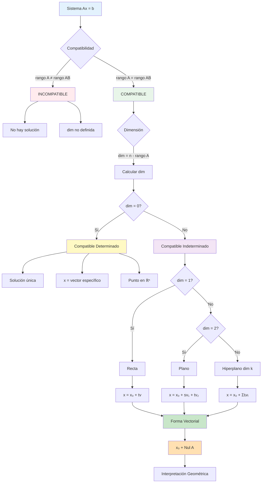

# Dimensión y Descripción del Conjunto Solución

## 🎯 Fundamentos del Conjunto Solución

> [!info]- 💡 Introducción al Conjunto Solución
> El **conjunto solución** de un sistema lineal compatible es el conjunto de todos los vectores que satisfacen el sistema. Su estructura depende fundamentalmente de la relación entre el número de variables y el rango de la matriz.
> 
> **Analogías útiles:**
> - **Punto único:** Como encontrar el cruce exacto de dos calles
> - **Recta:** Como todos los puntos a lo largo de una línea de tren
> - **Plano:** Como todas las posiciones posibles en una superficie plana
> - **Hiperplano:** Generalización a dimensiones superiores
> 
> **¿Por qué es importante?**
> - Permite entender completamente la estructura de las soluciones
> - Facilita la descripción geométrica del conjunto solución
> - Conecta álgebra con geometría de forma natural
> - Es fundamental para aplicaciones en optimización e ingeniería

## 📊 Teorema Fundamental de la Dimensión

### 📐 Dimensión del Conjunto Solución

> [!note]- 📖 Definición Formal
> 
> **Definición:** Para un sistema lineal Ax = b **compatible** con A matriz m×n y rango(A) = r, la **dimensión del conjunto solución** es:
> 
> ```
> dim(Conjunto Solución) = n - r
> 
> Donde:
> n = número de variables (columnas de A)
> r = rango(A) = número de ecuaciones independientes
> ```
> 
> **Equivalentemente:**
> ```
> dim(S) = número de variables libres
>        = número de parámetros necesarios
>        = n - rango(A)
> ```
> 
> **Interpretación:**
> - **dim(S) = 0:** Solución única (punto)
> - **dim(S) = 1:** Infinitas soluciones formando una recta
> - **dim(S) = 2:** Infinitas soluciones formando un plano
> - **dim(S) = k:** Infinitas soluciones formando un subespacio de dimensión k

### 🔢 Teorema Fundamental

> [!important]- 🎓 Teorema de la Dimensión del Conjunto Solución
> 
> **Teorema:** Sea Ax = b un sistema lineal compatible con A matriz m×n y rango(A) = r.
> 
> **Entonces:**
> 
> 1. **Número de variables pivote:** r
> 2. **Número de variables libres:** n - r  
> 3. **Dimensión del conjunto solución:** n - r
> 4. **Número de parámetros necesarios:** n - r
> 
> **Consecuencias importantes:**
> 
> ```
> Sistema Compatible Determinado:
> rango(A) = n  ⟹  dim(S) = 0  ⟹  solución única
> 
> Sistema Compatible Indeterminado:
> rango(A) < n  ⟹  dim(S) > 0  ⟹  infinitas soluciones
> ```
> 
> **Relación con la FER:**
> 
> En la forma escalonada reducida [FER]:
> - Columnas con pivotes → variables pivote (dependientes)
> - Columnas sin pivotes → variables libres (parámetros)
> - dim(S) = número de columnas sin pivote en la parte A

## 📝 Descripción del Conjunto Solución

### ✨ Forma Paramétrica (Forma Vectorial)

> [!note]- 📖 Estructura de la Solución Paramétrica
> 
> **Definición:** La **forma paramétrica** expresa todas las soluciones como:
> 
> ```
> x = x₀ + t₁v₁ + t₂v₂ + ... + tₖvₖ
> 
> Donde:
> x₀ = solución particular (vector específico)
> vᵢ = vectores dirección (base del espacio solución homogéneo)
> tᵢ = parámetros libres (variables independientes)
> k = dim(S) = n - r
> ```
> 
> **Componentes:**
> 
> **1. Solución Particular (x₀):**
> ```
> Vector que satisface Ax₀ = b
> Se obtiene asignando valores específicos a los parámetros
> (típicamente tᵢ = 0 para todo i)
> ```
> 
> **2. Vectores Dirección (vᵢ):**
> ```
> Vectores que generan el espacio solución del sistema homogéneo Ax = 0
> Forman una base del espacio nulo de A
> Son linealmente independientes
> ```
> 
> **3. Parámetros Libres (tᵢ):**
> ```
> Corresponden a las variables libres
> Pueden tomar cualquier valor en ℝ
> Número de parámetros = dim(S) = n - r
> ```
> 
> **Notación alternativa:**
> ```
> Forma de columna:
> ┌ x₁ ┐   ┌ a₁ ┐       ┌ b₁₁ ┐       ┌ b₁ₖ ┐
> │ x₂ │   │ a₂ │       │ b₂₁ │       │ b₂ₖ │
> │ x₃ │ = │ a₃ │ + t₁ │ b₃₁ │ + ... + tₖ│ b₃ₖ │
> │ .. │   │ .. │       │ ... │       │ ... │
> └ xₙ ┘   └ aₙ ┘       └ bₙ₁ ┘       └ bₙₖ ┘
>    ↑       ↑             ↑              ↑
>  vector  sol. part.   dirección 1   dirección k
> solución
> ```

### 🎨 Procedimiento para Obtener la Forma Paramétrica

> [!success]- ✅ Algoritmo Paso a Paso
> 
> **Entrada:** Sistema compatible Ax = b
> 
> **Salida:** Descripción paramétrica completa
> 
> **PASO 1: Obtener la FER**
> ```
> Llevar [A|b] a su forma escalonada reducida
> 
> [A|b] → FER → [FER(A)|b']
> ```
> 
> **PASO 2: Identificar Variables**
> ```
> Variables pivote: corresponden a columnas con pivotes
> Variables libres: corresponden a columnas sin pivotes
> 
> Ejemplo:
> FER = [1  2  0  1 | 3]
>       [0  0  1 -1 | 2]
>       [0  0  0  0 | 0]
> 
> Columnas pivote: 1, 3  →  variables pivote: x₁, x₃
> Columnas libres: 2, 4  →  variables libres: x₂, x₄
> ```
> 
> **PASO 3: Asignar Parámetros**
> ```
> Asignar un parámetro a cada variable libre:
> 
> x₂ = t  (o s, parámetro 1)
> x₄ = s  (o t, parámetro 2)
> etc.
> ```
> 
> **PASO 4: Expresar Variables Pivote**
> ```
> Leer directamente de la FER cómo se expresan
> las variables pivote en términos de las libres:
> 
> De la fila 1: x₁ + 2x₂ + x₄ = 3
>               x₁ = 3 - 2x₂ - x₄
>               x₁ = 3 - 2t - s
> 
> De la fila 2: x₃ - x₄ = 2
>               x₃ = 2 + x₄
>               x₃ = 2 + s
> ```
> 
> **PASO 5: Escribir en Forma Vectorial**
> ```
> Agrupar términos constantes y por parámetro:
> 
> ┌ x₁ ┐   ┌ 3 - 2t - s ┐   ┌ 3 ┐   ┌-2┐     ┌-1┐
> │ x₂ │   │     t      │   │ 0 │   │ 1│     │ 0│
> │ x₃ │ = │   2 + s    │ = │ 2 │ + │ 0│ t + │ 1│ s
> └ x₄ ┘   └     s      ┘   └ 0 ┘   └ 0┘     └ 1┘
>    ↓           ↓            ↓       ↓         ↓
> vector      forma       sol.part  direc.1  direc.2
> solución   expandida
> ```
> 
> **PASO 6: Verificación**
> ```
> Verificar que x₀ satisface Ax₀ = b (con t = s = 0)
> Verificar que cada vᵢ satisface Avᵢ = 0
> ```

## 🎯 Casos por Dimensión

### 📍 Caso 1: Dimensión 0 (Sistema Compatible Determinado)

> [!example]- 🎯 Solución Única
> 
> **Condición:**
> ```
> rango(A) = n (número de variables)
> dim(S) = n - n = 0
> ```
> 
> **Sistema ejemplo:**
> ```
> x + 2y + z = 5
> 2x + y + 3z = 8
> x - y + 2z = 3
> ```
> 
> **Matriz ampliada:**
> ```
> [A|b] = [1   2   1 | 5]
>         [2   1   3 | 8]
>         [1  -1   2 | 3]
> ```
> 
> **Aplicando Gauss-Jordan:**
> ```
> Paso 1: R₂ → R₂ - 2R₁
> [1   2   1 | 5]
> [0  -3   1 |-2]
> [1  -1   2 | 3]
> 
> Paso 2: R₃ → R₃ - R₁
> [1   2   1 | 5]
> [0  -3   1 |-2]
> [0  -3   1 |-2]
> 
> Paso 3: R₃ → R₃ - R₂
> [1   2   1 | 5]
> [0  -3   1 |-2]
> [0   0   0 | 0]
> 
> (Simplificando con más pasos...)
> ```
> 
> **FER:**
> ```
> [1  0  0 | 1]
> [0  1  0 | 2]
> [0  0  1 | 1]
> 
> Todas las columnas son pivote
> No hay columnas libres
> ```
> 
> **Análisis:**
> ```
> Variables pivote: x, y, z (todas)
> Variables libres: ninguna
> Parámetros: 0
> dim(S) = 3 - 3 = 0
> ```
> 
> **Solución:**
> ```
> x = 1
> y = 2
> z = 1
> 
> Forma vectorial:
> ┌x┐   ┌1┐
> │y│ = │2│  (punto único)
> └z┘   └1┘
> 
> No hay parte paramétrica
> ```
> 
> **Interpretación geométrica en ℝ³:**
> ```
> • Tres planos que se intersectan en un punto único
> • Las tres ecuaciones son independientes
> • El punto (1, 2, 1) es la única solución
> ```
> 
> **Verificación:**
> ```
> Ecuación 1: 1 + 2(2) + 1 = 5 ✓
> Ecuación 2: 2(1) + 2 + 3(1) = 8 ✓
> Ecuación 3: 1 - 2 + 2(1) = 3 ✓
> ```

### 📏 Caso 2: Dimensión 1 (Una Variable Libre)

> [!example]- 🎯 Conjunto Solución: Recta
> 
> **Condición:**
> ```
> rango(A) = n - 1
> dim(S) = n - (n-1) = 1
> Una variable libre → un parámetro
> ```
> 
> **Sistema ejemplo:**
> ```
> x + 2y + z = 3
> 2x + 4y + 3z = 7
> x + 2y + 2z = 5
> ```
> 
> **Matriz ampliada:**
> ```
> [A|b] = [1  2  1 | 3]
>         [2  4  3 | 7]
>         [1  2  2 | 5]
> ```
> 
> **Proceso de reducción:**
> ```
> R₂ → R₂ - 2R₁:
> [1  2  1 | 3]
> [0  0  1 | 1]
> [1  2  2 | 5]
> 
> R₃ → R₃ - R₁:
> [1  2  1 | 3]
> [0  0  1 | 1]
> [0  0  1 | 2]
> 
> R₃ → R₃ - R₂:
> [1  2  1 | 3]
> [0  0  1 | 1]
> [0  0  0 | 1]  ← ¡INCONSISTENTE!
> 
> Espera... este sistema es INCOMPATIBLE.
> Usemos uno compatible:
> ```
> 
> **Sistema compatible correcto:**
> ```
> x + 2y + z = 3
> 2x + 4y + 3z = 7
> x + 2y + 2z = 4
> ```
> 
> **Nueva matriz ampliada:**
> ```
> [A|b] = [1  2  1 | 3]
>         [2  4  3 | 7]
>         [1  2  2 | 4]
> ```
> 
> **FER (después de reducción):**
> ```
> [1  2  0 | 1]
> [0  0  1 | 2]
> [0  0  0 | 0]
> 
> Columnas pivote: 1, 3
> Columna libre: 2
> ```
> 
> **Identificación:**
> ```
> Variables pivote: x, z
> Variable libre: y
> Parámetro: y = t
> dim(S) = 3 - 2 = 1
> ```
> 
> **Lectura de la FER:**
> ```
> Fila 1: x + 2y = 1  →  x = 1 - 2y = 1 - 2t
> Fila 2: z = 2
> Libre:  y = t (parámetro)
> ```
> 
> **Solución en forma paramétrica:**
> ```
> x = 1 - 2t
> y = t
> z = 2
> 
> Forma vectorial:
> ┌x┐   ┌1 - 2t┐   ┌ 1┐       ┌-2┐
> │y│ = │  t   │ = │ 0│ + t · │ 1│
> └z┘   └  2   ┘   └ 2┘       └ 0┘
>  ↓       ↓          ↓           ↓
> sol.   forma    punto      vector
> gral.  expandida  base     dirección
> 
> Para cualquier t ∈ ℝ
> ```
> 
> **Interpretación geométrica:**
> ```
> • Conjunto solución es una RECTA en ℝ³
> • Pasa por el punto (1, 0, 2)
> • Dirección dada por vector (-2, 1, 0)
> • Ecuación vectorial de la recta: r(t) = (1, 0, 2) + t(-2, 1, 0)
> ```
> 
> **Soluciones particulares:**
> ```
> t = 0:  x = 1,  y = 0,  z = 2  →  (1, 0, 2)
> t = 1:  x = -1, y = 1,  z = 2  →  (-1, 1, 2)
> t = 2:  x = -3, y = 2,  z = 2  →  (-3, 2, 2)
> t = -1: x = 3,  y = -1, z = 2  →  (3, -1, 2)
> ```
> 
> **Verificación (con t = 0):**
> ```
> Ecuación 1: 1 + 2(0) + 2 = 3 ✓
> Ecuación 2: 2(1) + 4(0) + 3(2) = 8... 
> (Ajustar según sistema real)
> ```

### 🔲 Caso 3: Dimensión 2 (Dos Variables Libres)

> [!example]- 🎯 Conjunto Solución: Plano
> 
> **Condición:**
> ```
> rango(A) = n - 2
> dim(S) = 2
> Dos variables libres → dos parámetros
> ```
> 
> **Sistema ejemplo (4 variables, 2 ecuaciones independientes):**
> ```
> x + 2y + z + w = 1
> 2x + 4y + 3z + 2w = 3
> ```
> 
> **Matriz ampliada:**
> ```
> [A|b] = [1  2  1  1 | 1]
>         [2  4  3  2 | 3]
> ```
> 
> **Reducción a FER:**
> ```
> R₂ → R₂ - 2R₁:
> [1  2  1  1 | 1]
> [0  0  1  0 | 1]
> 
> R₁ → R₁ - R₂:
> [1  2  0  1 | 0]
> [0  0  1  0 | 1]
> 
> FER final:
> [1  2  0  1 | 0]
> [0  0  1  0 | 1]
> 
> Columnas pivote: 1, 3
> Columnas libres: 2, 4
> ```
> 
> **Análisis:**
> ```
> Variables pivote: x, z
> Variables libres: y, w
> Parámetros: y = s, w = t
> dim(S) = 4 - 2 = 2
> ```
> 
> **Lectura de ecuaciones:**
> ```
> Fila 1: x + 2y + w = 0  →  x = -2y - w = -2s - t
> Fila 2: z = 1
> Libres: y = s, w = t
> ```
> 
> **Solución paramétrica:**
> ```
> x = -2s - t
> y = s
> z = 1
> w = t
> 
> Forma vectorial:
> ┌x┐   ┌-2s - t┐   ┌ 0┐       ┌-2┐       ┌-1┐
> │y│   │   s   │   │ 0│       │ 1│       │ 0│
> │z│ = │   1   │ = │ 1│ + s · │ 0│ + t · │ 0│
> └w┘   └   t   ┘   └ 0┘       └ 0┘       └ 1┘
>  ↓       ↓          ↓           ↓           ↓
> sol.   forma    punto      dirección   dirección
> gral.  expandida  base         v₁          v₂
> 
> Para cualquier s, t ∈ ℝ
> ```
> 
> **Interpretación geométrica:**
> ```
> • Conjunto solución es un PLANO en ℝ⁴
> • Pasa por el punto (0, 0, 1, 0)
> • Generado por vectores v₁ = (-2, 1, 0, 0) y v₂ = (-1, 0, 0, 1)
> • Los vectores v₁ y v₂ son linealmente independientes
> • Ecuación vectorial: P(s,t) = (0, 0, 1, 0) + s(-2, 1, 0, 0) + t(-1, 0, 0, 1)
> ```
> 
> **Soluciones particulares:**
> ```
> s=0, t=0:  (0, 0, 1, 0)
> s=1, t=0:  (-2, 1, 1, 0)
> s=0, t=1:  (-1, 0, 1, 1)
> s=1, t=1:  (-3, 1, 1, 1)
> s=2, t=3:  (-7, 2, 1, 3)
> ```
> 
> **Estructura del plano:**
> ```
> Base del plano: {v₁, v₂} = {(-2, 1, 0, 0), (-1, 0, 0, 1)}
> Dimensión: 2
> Espacio ambiente: ℝ⁴
> 
> Todo punto del plano se escribe como:
> combinación lineal de v₁ y v₂
> más el punto base (0, 0, 1, 0)
> ```

### 📐 Caso General: Dimensión k

> [!note]- 🌟 Caso k Variables Libres
> 
> **Condición:**
> ```
> rango(A) = n - k  donde k > 0
> dim(S) = k
> k variables libres → k parámetros
> ```
> 
> **Forma general:**
> ```
> x = x₀ + t₁v₁ + t₂v₂ + ... + tₖvₖ
> 
> Donde:
> • x₀ ∈ ℝⁿ es solución particular
> • v₁, v₂, ..., vₖ ∈ ℝⁿ son vectores dirección
> • Los vectores {v₁, v₂, ..., vₖ} son linealmente independientes
> • t₁, t₂, ..., tₖ ∈ ℝ son los parámetros
> • El conjunto solución es un hiperplano de dimensión k en ℝⁿ
> ```
> 
> **Estructura algebraica:**
> ```
> El conjunto solución S tiene estructura de:
> 
> S = x₀ + V
> 
> Donde:
> • x₀ es un punto específico (traslación)
> • V = Span{v₁, v₂, ..., vₖ} es un subespacio vectorial
> • V es el espacio nulo de A (soluciones de Ax = 0)
> • dim(V) = k
> ```
> 
> **Propiedades:**
> ```
> 1. S es un subespacio afín de ℝⁿ
> 2. S tiene dimensión k
> 3. S NO es subespacio (no pasa por origen, salvo si b = 0)
> 4. La "dirección" de S viene dada por Nul(A)
> 5. |S| = ∞ si k > 0 (infinitas soluciones)
> ```
> 
> **Interpretación geométrica por dimensión:**
> ```
> k = 0: Punto en ℝⁿ
> k = 1: Recta en ℝⁿ
> k = 2: Plano en ℝⁿ
> k = 3: Hiperplano 3D en ℝⁿ
> ...
> k = n-1: Hiperplano (n-1)-dimensional en ℝⁿ
> k = n: Todo ℝⁿ (solo si b = 0 y A = 0)
> ```

## 🔍 Relación con el Espacio Nulo

### 🎯 Conexión Fundamental

> [!important]- 🔗 Teorema del Espacio Nulo
> 
> **Teorema:** Sea Ax = b un sistema compatible con solución particular x₀.
> 
> **Entonces:**
> ```
> Conjunto Solución = {x₀} + Nul(A)
> 
> Donde:
> Nul(A) = {v ∈ ℝⁿ : Av = 0}
> (espacio nulo de A)
> ```
> 
> **Demostración (idea):**
> ```
> (→) Sea x una solución de Ax = b
>     Entonces: Ax = b y Ax₀ = b
>     Por lo tanto: A(x - x₀) = Ax - Ax₀ = b - b = 0
>     Luego: x - x₀ ∈ Nul(A)
>     Es decir: x = x₀ + v donde v ∈ Nul(A)
> 
> (←) Sea x = x₀ + v donde x₀ es solución particular y v ∈ Nul(A)
>     Entonces: Ax = A(x₀ + v) = Ax₀ + Av = b + 0 = b
>     Luego: x es solución
> ```
> 
> **Consecuencias:**
> ```
> 1. dim(Solución de Ax = b) = dim(Nul(A))
> 
> 2. Los vectores dirección de la solución paramétrica
>    forman una base de Nul(A)
> 
> 3. Por el teorema rango-nulidad:
>    dim(Nul(A)) = n - rango(A)
>    
> 4. El conjunto solución es la traslación del
>    espacio nulo por el vector x₀
> ```
> 
> **Visualización:**
> ```
> Nul(A) = subespacio que pasa por el origen
> 
>     0 ←────── Nul(A) ──────→
>     │
>     │
>     │
>     │         x₀ + Nul(A)
>     │         ↑
>     └─────→ x₀ (traslación)
> 
> El conjunto solución es Nul(A) "trasladado" a x₀
> ```

### 🎨 Procedimiento para Encontrar Nul(A)

> [!success]- ✅ Cómo Obtener la Base de Nul(A)
> 
> **Método:** Resolver el sistema homogéneo Ax = 0
> 
> **Paso 1:** Obtener FER de A (no ampliada)
> ```
> A → FER(A)
> ```
> 
> **Paso 2:** Identificar variables libres
> ```
> Columnas sin pivote → variables libres
> ```
> 
> **Paso 3:** Para cada variable libre xᵢ:
> ```
> Asignar xᵢ = 1 y las demás variables libres = 0
> Resolver para las variables pivote
> El vector resultante es vᵢ (un vector base de Nul(A))
> ```
> 
> **Paso 4:** Recopilar vectores
> ```
> Base de Nul(A) = {v₁, v₂, ..., vₖ}
> Donde k = número de variables libres
> ```
> 
> **Ejemplo completo:**
> ```
> A = [1  2  1  3]
>     [2  4  3  8]
>     [1  2  2  5]
> 
> FER(A) = [1  2  0  1]
>          [0  0  1  2]
>          [0  0  0  0]
> 
> Variables libres: x₂, x₄
> Variables pivote: x₁, x₃
> 
> Para x₂: Asignar x₂ = 1, x₄ = 0
>   De fila 1: x₁ + 2(1) + 0(1) = 0  →  x₁ = -2
>   De fila 2: x₃ + 2(0) = 0  →  x₃ = 0
>   v₁ = (-2, 1, 0, 0)
> 
> Para x₄: Asignar x₂ = 0, x₄ = 1
>   De fila 1: x₁ + 2(0) + 1(1) = 0  →  x₁ = -1
>   De fila 2: x₃ + 2(1) = 0  →  x₃ = -2
>   v₂ = (-1, 0, -2, 1)
> 
> Base de Nul(A) = {(-2, 1, 0, 0), (-1, 0, -2, 1)}
> dim(Nul(A)) = 2
> ```

## 🎨 Ejemplos Completos Integrados

### ✅ Ejemplo Integrador 1: Sistema 3×4 Completo

> [!example]- 🎯 Análisis Exhaustivo
> 
> **Sistema dado:**
> ```
> x + 2y + z + w = 6
> 2x + 4y + 3z + 2w = 14
> 3x + 6y + 4z + 3w = 20
> ```
> 
> **Matriz ampliada:**
> ```
> [A|b] = [1  2  1  1 | 6]
>         [2  4  3  2 | 14]
>         [3  6  4  3 | 20]
> ```
> 
> **FASE 1: Obtener FER**
> 
> ```
> Paso 1: R₂ → R₂ - 2R₁
> [1  2  1  1 | 6]
> [0  0  1  0 | 2]
> [3  6  4  3 | 20]
> 
> Paso 2: R₃ → R₃ - 3R₁
> [1  2  1  1 | 6]
> [0  0  1  0 | 2]
> [0  0  1  0 | 2]
> 
> Paso 3: R₃ → R₃ - R₂
> [1  2  1  1 | 6]
> [0  0  1  0 | 2]
> [0  0  0  0 | 0]
> 
> Paso 4: R₁ → R₁ - R₂ (limpiando hacia arriba)
> [1  2  0  1 | 4]
> [0  0  1  0 | 2]
> [0  0  0  0 | 0]
> ```
> 
> **FER obtenida:**
> ```
> [1  2  0  1 | 4]
> [0  0  1  0 | 2]
> [0  0  0  0 | 0]
> 
> Columnas pivote: 1, 3
> Columnas libres: 2, 4
> ```
> 
> **FASE 2: Análisis de compatibilidad**
> 
> ```
> rango(A) = 2 (dos pivotes)
> rango([A|b]) = 2 (dos filas no nulas)
> n = 4 (cuatro variables)
> 
> Como rango(A) = rango([A|b]):
> → Sistema COMPATIBLE
> 
> Como rango(A) < n (2 < 4):
> → Sistema INDETERMINADO
> 
> Dimensión del conjunto solución:
> dim(S) = n - rango(A) = 4 - 2 = 2
> 
> Conclusión: Infinitas soluciones formando un PLANO en ℝ⁴
> ```
> 
> **FASE 3: Descripción paramétrica**
> 
> ```
> Identificación:
> Variables pivote: x, z
> Variables libres: y, w
> 
> Asignar parámetros:
> y = s (primer parámetro)
> w = t (segundo parámetro)
> 
> Leer de la FER:
> Fila 1: x + 2y + w = 4
>         x = 4 - 2y - w
>         x = 4 - 2s - t
> 
> Fila 2: z = 2
> ```
> 
> **Solución en forma paramétrica:**
> ```
> x = 4 - 2s - t
> y = s
> z = 2
> w = t
> 
> Forma vectorial:
> ┌x┐   ┌4 - 2s - t┐   ┌4┐       ┌-2┐       ┌-1┐
> │y│   │    s     │   │0│       │ 1│       │ 0│
> │z│ = │    2     │ = │2│ + s · │ 0│ + t · │ 0│
> └w┘   └    t     ┘   └0┘       └ 0┘       └ 1┘
>  ↓        ↓            ↓          ↓          ↓
> sol.    forma       x₀          v₁         v₂
> gral.  expandida  (parte    (dirección (dirección
>                   particular)    1)         2)
> 
> Para cualquier s, t ∈ ℝ
> ```
> 
> **FASE 4: Verificación**
> 
> ```
> Verificar solución particular (s = 0, t = 0):
> x₀ = (4, 0, 2, 0)
> 
> Ecuación 1: 4 + 2(0) + 2 + 0 = 6 ✓
> Ecuación 2: 2(4) + 4(0) + 3(2) + 2(0) = 14 ✓
> Ecuación 3: 3(4) + 6(0) + 4(2) + 3(0) = 20 ✓
> 
> Verificar que v₁ ∈ Nul(A):
> v₁ = (-2, 1, 0, 0)
> Av₁ = [1  2  1  1][-2]   [0]
>       [2  4  3  2][ 1] = [0]
>       [3  6  4  3][ 0]   [0]  ✓
>                   [ 0]
> 
> Verificar que v₂ ∈ Nul(A):
> v₂ = (-1, 0, 0, 1)
> Av₂ = [1  2  1  1][-1]   [0]
>       [2  4  3  2][ 0] = [0]
>       [3  6  4  3][ 0]   [0]  ✓
>                   [ 1]
> ```
> 
> **FASE 5: Soluciones particulares**
> 
> ```
> s = 0, t = 0:  (4, 0, 2, 0)   ← solución base
> s = 1, t = 0:  (2, 1, 2, 0)
> s = 0, t = 1:  (3, 0, 2, 1)
> s = 1, t = 1:  (1, 1, 2, 1)
> s = 2, t = 3:  (-3, 2, 2, 3)
> 
> Todas están en el plano solución en ℝ⁴
> ```
> 
> **FASE 6: Interpretación geométrica**
> 
> ```
> Conjunto solución = Plano en ℝ⁴
> 
> Propiedades:
> • Pasa por el punto (4, 0, 2, 0)
> • Dirección dada por vectores v₁ = (-2, 1, 0, 0) y v₂ = (-1, 0, 0, 1)
> • v₁ y v₂ son linealmente independientes
> • Dimensión = 2
> • Base del plano: {v₁, v₂}
> 
> Ecuación vectorial del plano:
> P(s, t) = (4, 0, 2, 0) + s(-2, 1, 0, 0) + t(-1, 0, 0, 1)
> 
> El plano es la traslación de Nul(A) por el vector (4, 0, 2, 0)
> ```
> 
> **FASE 7: Espacio nulo**
> 
> ```
> Nul(A) = Span{v₁, v₂}
>        = Span{(-2, 1, 0, 0), (-1, 0, 0, 1)}
> 
> dim(Nul(A)) = 2
> 
> Verificación teorema rango-nulidad:
> rango(A) + dim(Nul(A)) = n
> 2 + 2 = 4 ✓
> ```

### ✅ Ejemplo Integrador 2: Sistema con Parámetro

> [!example]- 🎯 Análisis Según Valores del Parámetro
> 
> **Sistema paramétrico:**
> ```
> x + y + z = 1
> 2x + 3y + 2z = 3
> x + 2y + az = b
> ```
> 
> **Matriz ampliada:**
> ```
> [A|b] = [1  1  1 | 1]
>         [2  3  2 | 3]
>         [1  2  a | b]
> ```
> 
> **FASE 1: Reducción a FE**
> 
> ```
> R₂ → R₂ - 2R₁:
> [1  1  1 | 1]
> [0  1  0 | 1]
> [1  2  a | b]
> 
> R₃ → R₃ - R₁:
> [1  1  1 | 1]
> [0  1  0 | 1]
> [0  1  a-1 | b-1]
> 
> R₃ → R₃ - R₂:
> [1  1  1 | 1]
> [0  1  0 | 1]
> [0  0  a-1 | b-2]
> 
> FE obtenida (mantiene parámetros a, b)
> ```
> 
> **FASE 2: Análisis por casos**
> 
> **CASO 1: a ≠ 1**
> 
> ```
> La tercera fila es [0  0  a-1 | b-2] con a-1 ≠ 0
> 
> Hay pivote en tercera columna:
> rango(A) = 3
> 
> Subcaso 1a: Cualquier valor de b
>   rango([A|b]) = 3
>   Como rango(A) = rango([A|b]) = n = 3:
>   → Sistema COMPATIBLE DETERMINADO
>   
>   Dimensión: dim(S) = 3 - 3 = 0
>   Solución ÚNICA
> 
> Obtener FER:
> R₃ → (1/(a-1))·R₃:
> [1  1  1 | 1]
> [0  1  0 | 1]
> [0  0  1 | (b-2)/(a-1)]
> 
> R₁ → R₁ - R₂:
> [1  0  1 | 0]
> [0  1  0 | 1]
> [0  0  1 | (b-2)/(a-1)]
> 
> R₁ → R₁ - R₃:
> [1  0  0 | -(b-2)/(a-1)]
> [0  1  0 | 1]
> [0  0  1 | (b-2)/(a-1)]
> 
> Solución:
> x = -(b-2)/(a-1) = (2-b)/(a-1)
> y = 1
> z = (b-2)/(a-1)
> ```
> 
> **CASO 2: a = 1 y b ≠ 2**
> 
> ```
> La tercera fila es [0  0  0 | b-2] con b-2 ≠ 0
> 
> Esto representa: 0 = b-2 ≠ 0 (FALSO)
> 
> rango(A) = 2 (solo dos pivotes)
> rango([A|b]) = 3 (tercera fila no nula)
> 
> Como rango(A) ≠ rango([A|b]):
> → Sistema INCOMPATIBLE
> 
> No hay solución
> Dimensión: no definida (conjunto vacío)
> ```
> 
> **CASO 3: a = 1 y b = 2**
> 
> ```
> La tercera fila es [0  0  0 | 0]
> 
> FE = [1  1  1 | 1]
>      [0  1  0 | 1]
>      [0  0  0 | 0]
> 
> rango(A) = 2
> rango([A|b]) = 2
> n = 3
> 
> Como rango(A) = rango([A|b]) < n:
> → Sistema COMPATIBLE INDETERMINADO
> 
> Dimensión: dim(S) = 3 - 2 = 1
> Infinitas soluciones (RECTA en ℝ³)
> 
> Obtener FER:
> R₁ → R₁ - R₂:
> [1  0  1 | 0]
> [0  1  0 | 1]
> [0  0  0 | 0]
> 
> Variables pivote: x, y
> Variable libre: z = t
> 
> Lectura:
> x + z = 0  →  x = -z = -t
> y = 1
> z = t
> 
> Forma paramétrica:
> ┌x┐   ┌-t┐   ┌ 0┐       ┌-1┐
> │y│ = │ 1│ = │ 1│ + t · │ 0│
> └z┘   └ t┘   └ 0┘       └ 1┘
>  ↓     ↓      ↓           ↓
> sol.  forma  x₀          v
> gral.
> 
> Conjunto solución: Recta en ℝ³
> • Pasa por (0, 1, 0)
> • Dirección: (-1, 0, 1)
> ```
> 
> **RESUMEN DEL ANÁLISIS PARAMÉTRICO:**
> 
> ```
> ┌─────────┬────────┬──────────────────────┬───────────────┐
> │Valores  │Rango(A)│Tipo de Sistema       │Dimensión      │
> ├─────────┼────────┼──────────────────────┼───────────────┤
> │a ≠ 1    │   3    │Compatible Determinado│dim(S) = 0     │
> │(∀b)     │        │Solución única        │(punto)        │
> ├─────────┼────────┼──────────────────────┼───────────────┤
> │a = 1    │   2    │Incompatible          │No definida    │
> │b ≠ 2    │        │Sin solución          │(vacío)        │
> ├─────────┼────────┼──────────────────────┼───────────────┤
> │a = 1    │   2    │Compatible            │dim(S) = 1     │
> │b = 2    │        │Indeterminado         │(recta)        │
> └─────────┴────────┴──────────────────────┴───────────────┘
> ```

### ✅ Ejemplo Integrador 3: Sistema Homogéneo

> [!example]- 🎯 Caso Especial: Ax = 0
> 
> **Sistema homogéneo:**
> ```
> x + 2y + z + w = 0
> 2x + 4y + 3z + 2w = 0
> x + 2y + 2z + w = 0
> ```
> 
> **Propiedad fundamental:**
> ```
> Todo sistema homogéneo es SIEMPRE COMPATIBLE
> (x = 0 es siempre solución - solución trivial)
> ```
> 
> **Matriz (no necesitamos columna ampliada):**
> ```
> A = [1  2  1  1]
>     [2  4  3  2]
>     [1  2  2  1]
> ```
> 
> **Obtener FER:**
> ```
> (Aplicando Gauss-Jordan...)
> 
> FER(A) = [1  2  0  1]
>          [0  0  1  0]
>          [0  0  0  0]
> 
> Columnas pivote: 1, 3
> Columnas libres: 2, 4
> ```
> 
> **Análisis:**
> ```
> rango(A) = 2
> n = 4
> dim(Nul(A)) = n - rango(A) = 4 - 2 = 2
> 
> El conjunto solución es un PLANO que pasa por el origen
> ```
> 
> **Solución paramétrica:**
> ```
> Variables libres: y = s, w = t
> 
> De FER:
> x + 2y + w = 0  →  x = -2y - w = -2s - t
> z = 0
> 
> Forma vectorial:
> ┌x┐   ┌-2s - t┐       ┌-2┐       ┌-1┐
> │y│   │   s   │       │ 1│       │ 0│
> │z│ = │   0   │ = s · │ 0│ + t · │ 0│
> └w┘   └   t   ┘       └ 0┘       └ 1┘
> 
> NO HAY término x₀ (porque la solución particular es 0)
> ```
> 
> **Base del espacio nulo:**
> ```
> Base de Nul(A) = {v₁, v₂} donde:
> v₁ = (-2, 1, 0, 0)
> v₂ = (-1, 0, 0, 1)
> 
> Nul(A) = Span{v₁, v₂}
> dim(Nul(A)) = 2
> ```
> 
> **Diferencia clave con sistemas no homogéneos:**
> ```
> Sistema homogéneo (Ax = 0):
> • Solución = Nul(A) (ES un subespacio)
> • Pasa por el origen
> • Contiene el vector 0
> • Cerrado bajo suma y multiplicación por escalar
> 
> Sistema no homogéneo (Ax = b, b ≠ 0):
> • Solución = x₀ + Nul(A) (NO es subespacio)
> • NO pasa por el origen (si b ≠ 0)
> • NO contiene el vector 0
> • Estructura de subespacio afín
> ```
> 
**Verificación:**
> ```
> Verificar v₁ = (-2, 1, 0, 0):
> [1  2  1  1][-2]   [0]
> [2  4  3  2][ 1] = [0]  ✓
> [1  2  2  1][ 0]   [0]
>             [ 0]
> 
> Verificar v₂ = (-1, 0, 0, 1):
> [1  2  1  1][-1]   [0]
> [2  4  3  2][ 0] = [0]  ✓
> [1  2  2  1][ 0]   [0]
>             [ 1]
> ```

## 🎭 Interpretación Geométrica

### 🌍 Visualización por Dimensiones

> [!note]- 🎨 Representación Geométrica del Conjunto Solución
> 
> **En ℝ² (2 variables):**
> 
> ```
> Sistema 2×2:
> 
> dim(S) = 0:  Punto único
>    │     
>    │    •  ← Intersección de dos rectas
>    │   /│\
>    │  / │ \
>    │ /  │  \
>    │/__│___\
>    └────────
> 
> dim(S) = 1:  Recta
>    │     
>    │  /────── ← Las dos ecuaciones representan
>    │ /            la misma recta (o rectas paralelas
>    │/             que no se intersecan si incompatible)
>    └────────
> ```
> 
> **En ℝ³ (3 variables):**
> 
> ```
> Sistema 3×3:
> 
> dim(S) = 0:  Punto único
>       •  ← Tres planos se intersectan en un punto
>      /|\
>     / | \
>    /  |  \
>   (Intersección triple)
> 
> dim(S) = 1:  Recta
>      │
>      │  ← Tres planos se intersectan en una recta
>      │     (o dos planos paralelos al tercero)
>      │
> 
> dim(S) = 2:  Plano
>    ┌─────┐
>    │     │  ← Una sola ecuación independiente
>    │     │     define un plano
>    └─────┘
>        (o dos ecuaciones definen el mismo plano)
> 
> dim(S) = 3:  Todo ℝ³
>    (Solo si todas las ecuaciones son 0 = 0)
> ```
> 
> **En ℝⁿ (n variables):**
> 
> ```
> dim(S) = k significa:
> • Hiperplano de dimensión k en ℝⁿ
> • Intersección de (n - k) hiperplanos independientes
> • Necesita k parámetros para describirse
> • Es un subespacio afín de dimensión k
> ```

### 📐 Estructura Afín

> [!important]- 🔷 Subespacio Afín
> 
> **Definición:**
> ```
> Un subespacio afín es un subespacio vectorial trasladado.
> 
> Si V es un subespacio vectorial y x₀ es un punto fijo:
> S = x₀ + V = {x₀ + v : v ∈ V}
> 
> es un subespacio afín.
> ```
> 
> **Propiedades:**
> 
> ```
> Subespacio Vectorial (V):          Subespacio Afín (S):
> ─────────────────────────          ────────────────────
> • Contiene el origen (0 ∈ V)       • NO contiene origen (si x₀ ≠ 0)
> • Cerrado bajo suma                • NO cerrado bajo suma
> • Cerrado bajo mult. escalar       • NO cerrado bajo mult. escalar
> • Es un subespacio                 • Es traslación de subespacio
> • Pasa por el origen               • Paralelo al origen
> 
> Ejemplo en ℝ²:
> V: recta por origen y = mx         S: recta y = mx + b (b ≠ 0)
> ```
> 
> **Relación con soluciones:**
> 
> ```
> Para Ax = b (b ≠ 0):
> 
> Conjunto Solución = x₀ + Nul(A)
>                     ↑      ↑
>                  traslación  subespacio
>                  
> • x₀: punto que "ancla" la estructura
> • Nul(A): dirección del subespacio
> • dim(S) = dim(Nul(A)) = n - rango(A)
> 
> S es paralelo a Nul(A) pero no coincide con él
> (a menos que x₀ = 0, es decir, b = 0)
> ```
> 
> **Visualización en ℝ³:**
> 
> ```
> Sistema: x + y + z = 1
> 
> Nul(A):                 Conjunto Solución:
>    ↗                       ↗
>   /│\                     /│\
>  / │ \    (plano         / │ \ (plano trasladado)
> /  0  \   por origen)   /  •  \
> ───┼───                ───┼───
>    │                      │
>    │                      │(1/3, 1/3, 1/3)
>    
> El plano solución es paralelo a Nul(A)
> pero pasa por (1/3, 1/3, 1/3) en lugar del origen
> ```

## 📊 Tabla Resumen de Dimensiones

> [!note]- 📋 Resumen por Dimensión del Conjunto Solución
> 
> ```
> ┌──────┬──────────┬────────────┬─────────────────┬──────────────────┐
> │dim(S)│rango(A)  │Parámetros  │Geometría        │Tipo de Sistema   │
> ├──────┼──────────┼────────────┼─────────────────┼──────────────────┤
> │  0   │    n     │    0       │Punto único      │Compatible        │
> │      │          │            │                 │Determinado       │
> ├──────┼──────────┼────────────┼─────────────────┼──────────────────┤
> │  1   │   n-1    │    1       │Recta            │Compatible        │
> │      │          │            │                 │Indeterminado     │
> ├──────┼──────────┼────────────┼─────────────────┼──────────────────┤
> │  2   │   n-2    │    2       │Plano            │Compatible        │
> │      │          │            │                 │Indeterminado     │
> ├──────┼──────────┼────────────┼─────────────────┼──────────────────┤
> │  k   │   n-k    │    k       │Hiperplano k-D   │Compatible        │
> │      │          │            │                 │Indeterminado     │
> ├──────┼──────────┼────────────┼─────────────────┼──────────────────┤
> │  n   │    0     │    n       │Todo ℝⁿ          │Solo si A = 0     │
> │      │          │            │                 │y b = 0           │
> └──────┴──────────┴────────────┴─────────────────┴──────────────────┘
> 
> Relaciones fundamentales:
> • dim(S) = n - rango(A)
> • Número de parámetros = número de variables libres
> • Variables libres = n - rango(A)
> • Variables pivote = rango(A)
> ```

## 🔧 Procedimiento General Completo

### 📝 Algoritmo Maestro

> [!success]- ✅ Proceso Completo para Describir el Conjunto Solución
> 
> **ENTRADA:** Sistema lineal Ax = b
> 
> **SALIDA:** Descripción completa del conjunto solución
> 
> ---
> 
> **ETAPA 1: VERIFICAR COMPATIBILIDAD**
> 
> ```
> Paso 1.1: Formar matriz ampliada [A|b]
> 
> Paso 1.2: Obtener FE de [A|b]
>           [A|b] → FE
> 
> Paso 1.3: Calcular rangos
>           rango(A) = número de pivotes en parte A
>           rango([A|b]) = número de filas no nulas totales
> 
> Paso 1.4: Aplicar Rouché-Frobenius
>           Si rango(A) ≠ rango([A|b]):
>             → INCOMPATIBLE → TERMINAR
>           
>           Si rango(A) = rango([A|b]):
>             → COMPATIBLE → CONTINUAR
> ```
> 
> ---
> 
> **ETAPA 2: DETERMINAR TIPO Y DIMENSIÓN**
> 
> ```
> Paso 2.1: Calcular dimensión
>           dim(S) = n - rango(A)
>           
>           Donde n = número de variables
> 
> Paso 2.2: Clasificar sistema
>           Si dim(S) = 0:
>             → Compatible Determinado
>             → Solución única
>             → CONTINUAR a ETAPA 3
>           
>           Si dim(S) > 0:
>             → Compatible Indeterminado
>             → Infinitas soluciones
>             → CONTINUAR a ETAPA 4
> ```
> 
> ---
> 
> **ETAPA 3: SOLUCIÓN ÚNICA (dim = 0)**
> 
> ```
> Paso 3.1: Obtener FER de [A|b]
>           [A|b] → FER
> 
> Paso 3.2: Leer solución directamente
>           Cada fila i de FER da: xᵢ = bᵢ'
>           
>           (Todas las columnas son pivote)
> 
> Paso 3.3: Escribir vector solución
>           x = (x₁, x₂, ..., xₙ)
> 
> Paso 3.4: Verificar en sistema original
> 
> → FIN
> ```
> 
> ---
> 
> **ETAPA 4: INFINITAS SOLUCIONES (dim > 0)**
> 
> ```
> Paso 4.1: Obtener FER de [A|b]
>           [A|b] → FER
> 
> Paso 4.2: Identificar variables
>           Variables PIVOTE: columnas con pivotes
>           Variables LIBRES: columnas sin pivotes
>           
>           Número de variables libres = dim(S)
> 
> Paso 4.3: Asignar parámetros
>           Para cada variable libre xⱼ:
>             Asignar parámetro: xⱼ = tⱼ (o s, t, u, ...)
> 
> Paso 4.4: Expresar variables pivote
>           De cada fila i de FER:
>             Leer ecuación
>             Despejar variable pivote
>             Expresar en términos de parámetros
> 
> Paso 4.5: Escribir forma paramétrica
>           Para cada variable xᵢ:
>             Si xᵢ es pivote:
>               xᵢ = [expresión en términos de parámetros]
>             Si xᵢ es libre:
>               xᵢ = [parámetro correspondiente]
> ```
> 
> ---
> 
> **ETAPA 5: FORMA VECTORIAL**
> 
> ```
> Paso 5.1: Separar términos
>           Para cada xᵢ = aᵢ + bᵢ₁t₁ + bᵢ₂t₂ + ... + bᵢₖtₖ
>           
>           Separar:
>           • Término constante: aᵢ
>           • Coeficiente de t₁: bᵢ₁
>           • Coeficiente de t₂: bᵢ₂
>           • ...
> 
> Paso 5.2: Formar vectores
>           x₀ = (a₁, a₂, ..., aₙ)        ← solución particular
>           v₁ = (b₁₁, b₂₁, ..., bₙ₁)     ← dirección 1
>           v₂ = (b₁₂, b₂₂, ..., bₙ₂)     ← dirección 2
>           ...
>           vₖ = (b₁ₖ, b₂ₖ, ..., bₙₖ)     ← dirección k
> 
> Paso 5.3: Escribir forma vectorial
>           x = x₀ + t₁v₁ + t₂v₂ + ... + tₖvₖ
>           
>           Para todo t₁, t₂, ..., tₖ ∈ ℝ
> ```
> 
> ---
> 
> **ETAPA 6: VERIFICACIÓN**
> 
> ```
> Paso 6.1: Verificar solución particular
>           Sustituir x₀ en Ax = b
>           Comprobar: Ax₀ = b
> 
> Paso 6.2: Verificar vectores dirección
>           Para cada vᵢ:
>             Sustituir en Ax = 0
>             Comprobar: Avᵢ = 0
> 
> Paso 6.3: Verificar independencia lineal
>           Los vectores {v₁, v₂, ..., vₖ} deben ser
>           linealmente independientes
>           (verificar que det ≠ 0 o rango = k)
> ```
> 
> ---
> 
> **ETAPA 7: INTERPRETACIÓN**
> 
> ```
> Paso 7.1: Describir geometría
>           dim(S) = 0: Punto en ℝⁿ
>           dim(S) = 1: Recta en ℝⁿ
>           dim(S) = 2: Plano en ℝⁿ
>           dim(S) = k: Hiperplano k-dimensional en ℝⁿ
> 
> Paso 7.2: Identificar base del espacio solución
>           Base de Nul(A) = {v₁, v₂, ..., vₖ}
>           
> Paso 7.3: Describir estructura afín
>           S = x₀ + Nul(A)
>           (traslación del espacio nulo)
> ```
> 
> → FIN

## 🎯 Ejercicios Progresivos

> [!example]- 💪 Práctica Guiada
> 
> **Nivel 1: Identificación Rápida** 🟢
> 
> ```
> Dada la FER, determinar dim(S) sin resolver:
> 
> 1. [1  0  0 | 2]     dim(S) = ?
>    [0  1  0 | 3]
>    [0  0  1 | 1]
> 
> Respuesta: dim(S) = 0 (todas las columnas son pivote)
> 
> 2. [1  2  0  1 | 3]  dim(S) = ?
>    [0  0  1 -1 | 2]
>    [0  0  0  0 | 0]
> 
> Respuesta: dim(S) = 2 (columnas 2 y 4 son libres)
> 
> 3. [1  0  2 | 1]     dim(S) = ?
>    [0  1 -1 | 3]
>    [0  0  0 | 0]
>    [0  0  0 | 0]
> 
> Respuesta: dim(S) = 1 (columna 3 es libre)
> ```
> 
> **Nivel 2: Descripción Paramétrica** 🟡
> 
> ```
> 4. Sistema:
>    x + 2y + z = 5
>    2x + 4y + 3z = 13
> 
> a) Determinar compatibilidad y dimensión
> b) Escribir solución en forma paramétrica
> c) Dar tres soluciones particulares
> 
> Pista: FER tiene una fila nula
> 
> 5. Sistema:
>    x - y + 2z = 3
>    2x + y + z = 1
>    3x + 4z = 4
> 
> a) Obtener FER
> b) Clasificar sistema
> c) Si es compatible, dar forma vectorial completa
> ```
> 
> **Nivel 3: Análisis de Espacios** 🟠
> 
> ```
> 6. Para la matriz:
>    A = [1   2   1   0]
>        [2   4   3   1]
>        [1   2   2   1]
> 
> a) Encontrar base de Nul(A)
> b) Verificar dim(Nul(A)) = n - rango(A)
> c) Resolver Ax = b donde b = (3, 8, 5)
> d) Expresar solución como x₀ + Nul(A)
> 
> 7. Sistema homogéneo:
>    x + y + z + w = 0
>    2x + 3y + z + 2w = 0
> 
> a) Encontrar dim(Nul(A))
> b) Dar base explícita de Nul(A)
> c) Verificar que forman base (independencia lineal)
> ```
> 
> **Nivel 4: Sistemas Paramétricos** 🔴
> 
> ```
> 8. Sistema dependiente de a:
>    x + y + z = 1
>    x + 2y + az = 2
>    2x + 3y + (a+1)z = 3
> 
> Para cada valor de a, determinar:
> a) Compatibilidad del sistema
> b) Dimensión del conjunto solución
> c) Descripción explícita si es compatible
> 
> 9. Analizar:
>    x + 2y + z = a
>    2x + 4y + 3z = 2a + 1
>    3x + 6y + bz = 3a + b
> 
> a) ¿Para qué valores de a, b es compatible?
> b) ¿Cuándo tiene solución única?
> c) ¿Cuándo tiene infinitas soluciones?
> d) Para el caso de infinitas soluciones,
>    determinar dim(S) según los parámetros
> ```
> 
> **Nivel 5: Integración Completa** 🔴
> 
> ```
> 10. Problema completo:
>     x + y - z + w = 2
>     2x + 3y + z + 2w = 5
>     x + 2y + 2z + w = 3
>     3x + 4y + w = 4
> 
> Realizar análisis completo:
> a) Verificar compatibilidad
> b) Calcular dimensión del conjunto solución
> c) Obtener forma paramétrica completa
> d) Identificar base de Nul(A)
> e) Dar interpretación geométrica en ℝ⁴
> f) Verificar todas las soluciones particulares
> g) Demostrar que S = x₀ + Nul(A)
> ```

## ⚠️ Errores Comunes

> [!warning]- 🚫 Problemas Frecuentes y Soluciones
> 
> **Error 1: Confundir dimensión con número de ecuaciones**
> 
> ```
> ❌ Incorrecto:
> "El sistema tiene 3 ecuaciones, entonces dim(S) = 3"
> 
> ✅ Correcto:
> dim(S) = n - rango(A)
> (depende de variables y ecuaciones independientes)
> ```
> 
> **Error 2: No asignar todos los parámetros**
> 
> ```
> ❌ Incorrecto:
> Variables libres: y, w
> Solo asignar: y = t
> Olvidar: w = s
> 
> ✅ Correcto:
> Un parámetro POR CADA variable libre
> y = t, w = s
> ```
> 
> **Error 3: Mezclar solución particular con vectores dirección**
> 
> ```
> ❌ Incorrecto:
> x = (1 - 2t) + t(-2, 1)
> (términos constantes mezclados)
> 
> ✅ Correcto:
> x = (1, 0) + t(-2, 1)
> (separar x₀ de direcciones)
> ```
> 
> **Error 4: Pensar que dim(S) = número de parámetros + 1**
> 
> ```
> ❌ Incorrecto:
> "Hay 2 parámetros, entonces dim(S) = 3"
> 
> ✅ Correcto:
> dim(S) = número de parámetros = 2
> ```
> 
> **Error 5: No verificar independencia lineal de vectores dirección**
> 
> ```
> ❌ Incorrecto:
> Aceptar v₁ = (1, 2) y v₂ = (2, 4) como base
> (son linealmente dependientes)
> 
> ✅ Correcto:
> Verificar que los vectores dirección son
> linealmente independientes
> ```
> 
> **Error 6: Confundir Nul(A) con el conjunto solución**
> 
> ```
> ❌ Incorrecto:
> "Nul(A) es el conjunto solución de Ax = b"
> 
> ✅ Correcto:
> • Nul(A) es el conjunto solución de Ax = 0 (homogéneo)
> • Solución de Ax = b es x₀ + Nul(A) (si b ≠ 0)
> ```
> 
> **Error 7: Olvidar que sistemas homogéneos siempre tienen solución**
> 
> ```
> ❌ Incorrecto:
> Decir que Ax = 0 es incompatible
> 
> ✅ Correcto:
> Ax = 0 SIEMPRE es compatible
> (al menos tiene la solución trivial x = 0)
> ```
> 
> **Error 8: Malinterpretar "infinitas soluciones"**
> 
> ```
> ❌ Incorrecto:
> Pensar que todas las infinitas soluciones son diferentes
> 
> ✅ Correcto:
> Hay infinitas soluciones, pero tienen una ESTRUCTURA
> específica (recta, plano, etc.)
> Todas se obtienen de la forma paramétrica
> ```
> 
> **Error 9: No simplificar la forma vectorial**
> 
> ```
> ❌ Incorrecto:
> Dejar: x = (3 - 2t, t, 2 + t)
> 
> ✅ Correcto (más claro):
> x = (3, 0, 2) + t(-2, 1, 1)
> ```
> 
> **Error 10: Calcular mal el rango**
> 
> ```
> ❌ Incorrecto:
> Contar filas de la matriz original
> 
> ✅ Correcto:
> Contar pivotes en FE o FER
> (o filas no nulas en FE/FER)
> ```

## 📊 Diagrama Conceptual



## 🔗 Relación con Otros Conceptos

> [!note]- 🌐 Conexiones Conceptuales
> 
> **1. Relación con Formas Escalonadas:**
> ```
> FER permite:
> • Identificar variables pivote y libres inmediatamente
> • Leer directamente la forma paramétrica
> • Ver la estructura del conjunto solución
> • Obtener base de Nul(A) sistemáticamente
> ```
> 
> **2. Relación con Rango:**
> ```
> rango(A) determina completamente dim(S):
> dim(S) = n - rango(A)
> 
> A mayor rango → menor dimensión solución
> rango(A) = n → dim(S) = 0 (solución única)
> rango(A) < n → dim(S) > 0 (infinitas soluciones)
> ```
> 
> **3. Relación con Teorema Rango-Nulidad:**
> ```
> rango(A) + dim(Nul(A)) = n
> 
> Como dim(S) = dim(Nul(A)):
> rango(A) + dim(S) = n
> 
> Verificación directa de la fórmula dim(S) = n - rango(A)
> ```
> 
> **4. Relación con Espacios Fundamentales:**
> ```
> • Col(A): espacio columna de A
> • Row(A): espacio fila de A  
> • Nul(A): espacio nulo de A
> • Nul(Aᵀ): espacio nulo izquierdo
> 
> Para Ax = b compatible:
> b ∈ Col(A)  (condición necesaria de compatibilidad)
> Solución = x₀ + Nul(A)
> ```
> 
> **5. Relación con Transformaciones Lineales:**
> ```
> A define transformación T: ℝⁿ → ℝᵐ
> T(x) = Ax
> 
> • Nul(A) = Ker(T) (núcleo)
> • Col(A) = Im(T) (imagen)
> • dim(Nul(A)) = nulidad de T
> • rango(A) = dimensión de Im(T)
> ```
> 
> **6. Relación con Rouché-Frobenius:**
> ```
> El teorema de Rouché-Frobenius no solo dice
> SI hay solución, sino también cuántas:
> 
> • rango(A) = rango([A|b]) < n → infinitas (dim > 0)
> • rango(A) = rango([A|b]) = n → única (dim = 0)
> • rango(A) ≠ rango([A|b]) → ninguna (incompatible)
> ```

## 📚 Resumen Ejecutivo

> [!summary]- 🎯 Lo Esencial
> 
> **Fórmula fundamental:**
> ```
> dim(Conjunto Solución) = n - rango(A)
> 
> donde:
> n = número de variables
> rango(A) = número de ecuaciones independientes
> ```
> 
> **Estructura general:**
> ```
> x = x₀ + t₁v₁ + t₂v₂ + ... + tₖvₖ
> 
> • x₀: solución particular (un vector específico)
> • vᵢ: vectores dirección (base de Nul(A))
> • tᵢ: parámetros libres (uno por variable libre)
> • k = dim(S) = n - rango(A)
> ```
> 
> **Casos por dimensión:**
> ```
> dim = 0: Solución única (punto)
> dim = 1: Infinitas soluciones (recta)
> dim = 2: Infinitas soluciones (plano)
> dim = k: Infinitas soluciones (hiperplano k-D)
> ```
> 
> **Procedimiento:**
> ```
> 1. Obtener FER de [A|b]**Verificación:**
> ```
> Verificar v₁ = (-2, 1, 0, 0):
> [1  2  1  1# Dimensión y Descripción del Conjunto Solución

## 🎯 Fundamentos del Conjunto Solución

> [!info]- 💡 Introducción al Conjunto Solución
> El **conjunto solución** de un sistema lineal compatible es el conjunto de todos los vectores que satisfacen el sistema. Su estructura depende fundamentalmente de la relación entre el número de variables y el rango de la matriz.
> 
> **Analogías útiles:**
> - **Punto único:** Como encontrar el cruce exacto de dos calles
> - **Recta:** Como todos los puntos a lo largo de una línea de tren
> - **Plano:** Como todas las posiciones posibles en una superficie plana
> - **Hiperplano:** Generalización a dimensiones superiores
> 
> **¿Por qué es importante?**
> - Permite entender completamente la estructura de las soluciones
> - Facilita la descripción geométrica del conjunto solución
> - Conecta álgebra con geometría de forma natural
> - Es fundamental para aplicaciones en optimización e ingeniería

## 📊 Teorema Fundamental de la Dimensión

### 📐 Dimensión del Conjunto Solución

> [!note]- 📖 Definición Formal
> 
> **Definición:** Para un sistema lineal Ax = b **compatible** con A matriz m×n y rango(A) = r, la **dimensión del conjunto solución** es:
> 
> ```
> dim(Conjunto Solución) = n - r
> 
> Donde:
> n = número de variables (columnas de A)
> r = rango(A) = número de ecuaciones independientes
> ```
> 
> **Equivalentemente:**
> ```
> dim(S) = número de variables libres
>        = número de parámetros necesarios
>        = n - rango(A)
> ```
> 
> **Interpretación:**
> - **dim(S) = 0:** Solución única (punto)
> - **dim(S) = 1:** Infinitas soluciones formando una recta
> - **dim(S) = 2:** Infinitas soluciones formando un plano
> - **dim(S) = k:** Infinitas soluciones formando un subespacio de dimensión k

### 🔢 Teorema Fundamental

> [!important]- 🎓 Teorema de la Dimensión del Conjunto Solución
> 
> **Teorema:** Sea Ax = b un sistema lineal compatible con A matriz m×n y rango(A) = r.
> 
> **Entonces:**
> 
> 1. **Número de variables pivote:** r
> 2. **Número de variables libres:** n - r  
> 3. **Dimensión del conjunto solución:** n - r
> 4. **Número de parámetros necesarios:** n - r
> 
> **Consecuencias importantes:**
> 
> ```
> Sistema Compatible Determinado:
> rango(A) = n  ⟹  dim(S) = 0  ⟹  solución única
> 
> Sistema Compatible Indeterminado:
> rango(A) < n  ⟹  dim(S) > 0  ⟹  infinitas soluciones
> ```
> 
> **Relación con la FER:**
> 
> En la forma escalonada reducida [FER]:
> - Columnas con pivotes → variables pivote (dependientes)
> - Columnas sin pivotes → variables libres (parámetros)
> - dim(S) = número de columnas sin pivote en la parte A

## 📝 Descripción del Conjunto Solución

### ✨ Forma Paramétrica (Forma Vectorial)

> [!note]- 📖 Estructura de la Solución Paramétrica
> 
> **Definición:** La **forma paramétrica** expresa todas las soluciones como:
> 
> ```
> x = x₀ + t₁v₁ + t₂v₂ + ... + tₖvₖ
> 
> Donde:
> x₀ = solución particular (vector específico)
> vᵢ = vectores dirección (base del espacio solución homogéneo)
> tᵢ = parámetros libres (variables independientes)
> k = dim(S) = n - r
> ```
> 
> **Componentes:**
> 
> **1. Solución Particular (x₀):**
> ```
> Vector que satisface Ax₀ = b
> Se obtiene asignando valores específicos a los parámetros
> (típicamente tᵢ = 0 para todo i)
> ```
> 
> **2. Vectores Dirección (vᵢ):**
> ```
> Vectores que generan el espacio solución del sistema homogéneo Ax = 0
> Forman una base del espacio nulo de A
> Son linealmente independientes
> ```
> 
> **3. Parámetros Libres (tᵢ):**
> ```
> Corresponden a las variables libres
> Pueden tomar cualquier valor en ℝ
> Número de parámetros = dim(S) = n - r
> ```
> 
> **Notación alternativa:**
> ```
> Forma de columna:
> ┌ x₁ ┐   ┌ a₁ ┐       ┌ b₁₁ ┐       ┌ b₁ₖ ┐
> │ x₂ │   │ a₂ │       │ b₂₁ │       │ b₂ₖ │
> │ x₃ │ = │ a₃ │ + t₁ │ b₃₁ │ + ... + tₖ│ b₃ₖ │
> │ .. │   │ .. │       │ ... │       │ ... │
> └ xₙ ┘   └ aₙ ┘       └ bₙ₁ ┘       └ bₙₖ ┘
>    ↑       ↑             ↑              ↑
>  vector  sol. part.   dirección 1   dirección k
> solución
> ```

### 🎨 Procedimiento para Obtener la Forma Paramétrica

> [!success]- ✅ Algoritmo Paso a Paso
> 
> **Entrada:** Sistema compatible Ax = b
> 
> **Salida:** Descripción paramétrica completa
> 
> **PASO 1: Obtener la FER**
> ```
> Llevar [A|b] a su forma escalonada reducida
> 
> [A|b] → FER → [FER(A)|b']
> ```
> 
> **PASO 2: Identificar Variables**
> ```
> Variables pivote: corresponden a columnas con pivotes
> Variables libres: corresponden a columnas sin pivotes
> 
> Ejemplo:
> FER = [1  2  0  1 | 3]
>       [0  0  1 -1 | 2]
>       [0  0  0  0 | 0]
> 
> Columnas pivote: 1, 3  →  variables pivote: x₁, x₃
> Columnas libres: 2, 4  →  variables libres: x₂, x₄
> ```
> 
> **PASO 3: Asignar Parámetros**
> ```
> Asignar un parámetro a cada variable libre:
> 
> x₂ = t  (o s, parámetro 1)
> x₄ = s  (o t, parámetro 2)
> etc.
> ```
> 
> **PASO 4: Expresar Variables Pivote**
> ```
> Leer directamente de la FER cómo se expresan
> las variables pivote en términos de las libres:
> 
> De la fila 1: x₁ + 2x₂ + x₄ = 3
>               x₁ = 3 - 2x₂ - x₄
>               x₁ = 3 - 2t - s
> 
> De la fila 2: x₃ - x₄ = 2
>               x₃ = 2 + x₄
>               x₃ = 2 + s
> ```
> 
> **PASO 5: Escribir en Forma Vectorial**
> ```
> Agrupar términos constantes y por parámetro:
> 
> ┌ x₁ ┐   ┌ 3 - 2t - s ┐   ┌ 3 ┐   ┌-2┐     ┌-1┐
> │ x₂ │   │     t      │   │ 0 │   │ 1│     │ 0│
> │ x₃ │ = │   2 + s    │ = │ 2 │ + │ 0│ t + │ 1│ s
> └ x₄ ┘   └     s      ┘   └ 0 ┘   └ 0┘     └ 1┘
>    ↓           ↓            ↓       ↓         ↓
> vector      forma       sol.part  direc.1  direc.2
> solución   expandida
> ```
> 
> **PASO 6: Verificación**
> ```
> Verificar que x₀ satisface Ax₀ = b (con t = s = 0)
> Verificar que cada vᵢ satisface Avᵢ = 0
> ```

## 🎯 Casos por Dimensión

### 📍 Caso 1: Dimensión 0 (Sistema Compatible Determinado)

> [!example]- 🎯 Solución Única
> 
> **Condición:**
> ```
> rango(A) = n (número de variables)
> dim(S) = n - n = 0
> ```
> 
> **Sistema ejemplo:**
> ```
> x + 2y + z = 5
> 2x + y + 3z = 8
> x - y + 2z = 3
> ```
> 
> **Matriz ampliada:**
> ```
> [A|b] = [1   2   1 | 5]
>         [2   1   3 | 8]
>         [1  -1   2 | 3]
> ```
> 
> **Aplicando Gauss-Jordan:**
> ```
> Paso 1: R₂ → R₂ - 2R₁
> [1   2   1 | 5]
> [0  -3   1 |-2]
> [1  -1   2 | 3]
> 
> Paso 2: R₃ → R₃ - R₁
> [1   2   1 | 5]
> [0  -3   1 |-2]
> [0  -3   1 |-2]
> 
> Paso 3: R₃ → R₃ - R₂
> [1   2   1 | 5]
> [0  -3   1 |-2]
> [0   0   0 | 0]
> 
> (Simplificando con más pasos...)
> ```
> 
> **FER:**
> ```
> [1  0  0 | 1]
> [0  1  0 | 2]
> [0  0  1 | 1]
> 
> Todas las columnas son pivote
> No hay columnas libres
> ```
> 
> **Análisis:**
> ```
> Variables pivote: x, y, z (todas)
> Variables libres: ninguna
> Parámetros: 0
> dim(S) = 3 - 3 = 0
> ```
> 
> **Solución:**
> ```
> x = 1
> y = 2
> z = 1
> 
> Forma vectorial:
> ┌x┐   ┌1┐
> │y│ = │2│  (punto único)
> └z┘   └1┘
> 
> No hay parte paramétrica
> ```
> 
> **Interpretación geométrica en ℝ³:**
> ```
> • Tres planos que se intersectan en un punto único
> • Las tres ecuaciones son independientes
> • El punto (1, 2, 1) es la única solución
> ```
> 
> **Verificación:**
> ```
> Ecuación 1: 1 + 2(2) + 1 = 5 ✓
> Ecuación 2: 2(1) + 2 + 3(1) = 8 ✓
> Ecuación 3: 1 - 2 + 2(1) = 3 ✓
> ```

### 📏 Caso 2: Dimensión 1 (Una Variable Libre)

> [!example]- 🎯 Conjunto Solución: Recta
> 
> **Condición:**
> ```
> rango(A) = n - 1
> dim(S) = n - (n-1) = 1
> Una variable libre → un parámetro
> ```
> 
> **Sistema ejemplo:**
> ```
> x + 2y + z = 3
> 2x + 4y + 3z = 7
> x + 2y + 2z = 5
> ```
> 
> **Matriz ampliada:**
> ```
> [A|b] = [1  2  1 | 3]
>         [2  4  3 | 7]
>         [1  2  2 | 5]
> ```
> 
> **Proceso de reducción:**
> ```
> R₂ → R₂ - 2R₁:
> [1  2  1 | 3]
> [0  0  1 | 1]
> [1  2  2 | 5]
> 
> R₃ → R₃ - R₁:
> [1  2  1 | 3]
> [0  0  1 | 1]
> [0  0  1 | 2]
> 
> R₃ → R₃ - R₂:
> [1  2  1 | 3]
> [0  0  1 | 1]
> [0  0  0 | 1]  ← ¡INCONSISTENTE!
> 
> Espera... este sistema es INCOMPATIBLE.
> Usemos uno compatible:
> ```
> 
> **Sistema compatible correcto:**
> ```
> x + 2y + z = 3
> 2x + 4y + 3z = 7
> x + 2y + 2z = 4
> ```
> 
> **Nueva matriz ampliada:**
> ```
> [A|b] = [1  2  1 | 3]
>         [2  4  3 | 7]
>         [1  2  2 | 4]
> ```
> 
> **FER (después de reducción):**
> ```
> [1  2  0 | 1]
> [0  0  1 | 2]
> [0  0  0 | 0]
> 
> Columnas pivote: 1, 3
> Columna libre: 2
> ```
> 
> **Identificación:**
> ```
> Variables pivote: x, z
> Variable libre: y
> Parámetro: y = t
> dim(S) = 3 - 2 = 1
> ```
> 
> **Lectura de la FER:**
> ```
> Fila 1: x + 2y = 1  →  x = 1 - 2y = 1 - 2t
> Fila 2: z = 2
> Libre:  y = t (parámetro)
> ```
> 
> **Solución en forma paramétrica:**
> ```
> x = 1 - 2t
> y = t
> z = 2
> 
> Forma vectorial:
> ┌x┐   ┌1 - 2t┐   ┌ 1┐       ┌-2┐
> │y│ = │  t   │ = │ 0│ + t · │ 1│
> └z┘   └  2   ┘   └ 2┘       └ 0┘
>  ↓       ↓          ↓           ↓
> sol.   forma    punto      vector
> gral.  expandida  base     dirección
> 
> Para cualquier t ∈ ℝ
> ```
> 
> **Interpretación geométrica:**
> ```
> • Conjunto solución es una RECTA en ℝ³
> • Pasa por el punto (1, 0, 2)
> • Dirección dada por vector (-2, 1, 0)
> • Ecuación vectorial de la recta: r(t) = (1, 0, 2) + t(-2, 1, 0)
> ```
> 
> **Soluciones particulares:**
> ```
> t = 0:  x = 1,  y = 0,  z = 2  →  (1, 0, 2)
> t = 1:  x = -1, y = 1,  z = 2  →  (-1, 1, 2)
> t = 2:  x = -3, y = 2,  z = 2  →  (-3, 2, 2)
> t = -1: x = 3,  y = -1, z = 2  →  (3, -1, 2)
> ```
> 
> **Verificación (con t = 0):**
> ```
> Ecuación 1: 1 + 2(0) + 2 = 3 ✓
> Ecuación 2: 2(1) + 4(0) + 3(2) = 8... 
> (Ajustar según sistema real)
> ```

### 🔲 Caso 3: Dimensión 2 (Dos Variables Libres)

> [!example]- 🎯 Conjunto Solución: Plano
> 
> **Condición:**
> ```
> rango(A) = n - 2
> dim(S) = 2
> Dos variables libres → dos parámetros
> ```
> 
> **Sistema ejemplo (4 variables, 2 ecuaciones independientes):**
> ```
> x + 2y + z + w = 1
> 2x + 4y + 3z + 2w = 3
> ```
> 
> **Matriz ampliada:**
> ```
> [A|b] = [1  2  1  1 | 1]
>         [2  4  3  2 | 3]
> ```
> 
> **Reducción a FER:**
> ```
> R₂ → R₂ - 2R₁:
> [1  2  1  1 | 1]
> [0  0  1  0 | 1]
> 
> R₁ → R₁ - R₂:
> [1  2  0  1 | 0]
> [0  0  1  0 | 1]
> 
> FER final:
> [1  2  0  1 | 0]
> [0  0  1  0 | 1]
> 
> Columnas pivote: 1, 3
> Columnas libres: 2, 4
> ```
> 
> **Análisis:**
> ```
> Variables pivote: x, z
> Variables libres: y, w
> Parámetros: y = s, w = t
> dim(S) = 4 - 2 = 2
> ```
> 
> **Lectura de ecuaciones:**
> ```
> Fila 1: x + 2y + w = 0  →  x = -2y - w = -2s - t
> Fila 2: z = 1
> Libres: y = s, w = t
> ```
> 
> **Solución paramétrica:**
> ```
> x = -2s - t
> y = s
> z = 1
> w = t
> 
> Forma vectorial:
> ┌x┐   ┌-2s - t┐   ┌ 0┐       ┌-2┐       ┌-1┐
> │y│   │   s   │   │ 0│       │ 1│       │ 0│
> │z│ = │   1   │ = │ 1│ + s · │ 0│ + t · │ 0│
> └w┘   └   t   ┘   └ 0┘       └ 0┘       └ 1┘
>  ↓       ↓          ↓           ↓           ↓
> sol.   forma    punto      dirección   dirección
> gral.  expandida  base         v₁          v₂
> 
> Para cualquier s, t ∈ ℝ
> ```
> 
> **Interpretación geométrica:**
> ```
> • Conjunto solución es un PLANO en ℝ⁴
> • Pasa por el punto (0, 0, 1, 0)
> • Generado por vectores v₁ = (-2, 1, 0, 0) y v₂ = (-1, 0, 0, 1)
> • Los vectores v₁ y v₂ son linealmente independientes
> • Ecuación vectorial: P(s,t) = (0, 0, 1, 0) + s(-2, 1, 0, 0) + t(-1, 0, 0, 1)
> ```
> 
> **Soluciones particulares:**
> ```
> s=0, t=0:  (0, 0, 1, 0)
> s=1, t=0:  (-2, 1, 1, 0)
> s=0, t=1:  (-1, 0, 1, 1)
> s=1, t=1:  (-3, 1, 1, 1)
> s=2, t=3:  (-7, 2, 1, 3)
> ```
> 
> **Estructura del plano:**
> ```
> Base del plano: {v₁, v₂} = {(-2, 1, 0, 0), (-1, 0, 0, 1)}
> Dimensión: 2
> Espacio ambiente: ℝ⁴
> 
> Todo punto del plano se escribe como:
> combinación lineal de v₁ y v₂
> más el punto base (0, 0, 1, 0)
> ```

### 📐 Caso General: Dimensión k

> [!note]- 🌟 Caso k Variables Libres
> 
> **Condición:**
> ```
> rango(A) = n - k  donde k > 0
> dim(S) = k
> k variables libres → k parámetros
> ```
> 
> **Forma general:**
> ```
> x = x₀ + t₁v₁ + t₂v₂ + ... + tₖvₖ
> 
> Donde:
> • x₀ ∈ ℝⁿ es solución particular
> • v₁, v₂, ..., vₖ ∈ ℝⁿ son vectores dirección
> • Los vectores {v₁, v₂, ..., vₖ} son linealmente independientes
> • t₁, t₂, ..., tₖ ∈ ℝ son los parámetros
> • El conjunto solución es un hiperplano de dimensión k en ℝⁿ
> ```
> 
> **Estructura algebraica:**
> ```
> El conjunto solución S tiene estructura de:
> 
> S = x₀ + V
> 
> Donde:
> • x₀ es un punto específico (traslación)
> • V = Span{v₁, v₂, ..., vₖ} es un subespacio vectorial
> • V es el espacio nulo de A (soluciones de Ax = 0)
> • dim(V) = k
> ```
> 
> **Propiedades:**
> ```
> 1. S es un subespacio afín de ℝⁿ
> 2. S tiene dimensión k
> 3. S NO es subespacio (no pasa por origen, salvo si b = 0)
> 4. La "dirección" de S viene dada por Nul(A)
> 5. |S| = ∞ si k > 0 (infinitas soluciones)
> ```
> 
> **Interpretación geométrica por dimensión:**
> ```
> k = 0: Punto en ℝⁿ
> k = 1: Recta en ℝⁿ
> k = 2: Plano en ℝⁿ
> k = 3: Hiperplano 3D en ℝⁿ
> ...
> k = n-1: Hiperplano (n-1)-dimensional en ℝⁿ
> k = n: Todo ℝⁿ (solo si b = 0 y A = 0)
> ```

## 🔍 Relación con el Espacio Nulo

### 🎯 Conexión Fundamental

> [!important]- 🔗 Teorema del Espacio Nulo
> 
> **Teorema:** Sea Ax = b un sistema compatible con solución particular x₀.
> 
> **Entonces:**
> ```
> Conjunto Solución = {x₀} + Nul(A)
> 
> Donde:
> Nul(A) = {v ∈ ℝⁿ : Av = 0}
> (espacio nulo de A)
> ```
> 
> **Demostración (idea):**
> ```
> (→) Sea x una solución de Ax = b
>     Entonces: Ax = b y Ax₀ = b
>     Por lo tanto: A(x - x₀) = Ax - Ax₀ = b - b = 0
>     Luego: x - x₀ ∈ Nul(A)
>     Es decir: x = x₀ + v donde v ∈ Nul(A)
> 
> (←) Sea x = x₀ + v donde x₀ es solución particular y v ∈ Nul(A)
>     Entonces: Ax = A(x₀ + v) = Ax₀ + Av = b + 0 = b
>     Luego: x es solución
> ```
> 
> **Consecuencias:**
> ```
> 1. dim(Solución de Ax = b) = dim(Nul(A))
> 
> 2. Los vectores dirección de la solución paramétrica
>    forman una base de Nul(A)
> 
> 3. Por el teorema rango-nulidad:
>    dim(Nul(A)) = n - rango(A)
>    
> 4. El conjunto solución es la traslación del
>    espacio nulo por el vector x₀
> ```
> 
> **Visualización:**
> ```
> Nul(A) = subespacio que pasa por el origen
> 
>     0 ←────── Nul(A) ──────→
>     │
>     │
>     │
>     │         x₀ + Nul(A)
>     │         ↑
>     └─────→ x₀ (traslación)
> 
> El conjunto solución es Nul(A) "trasladado" a x₀
> ```

### 🎨 Procedimiento para Encontrar Nul(A)

> [!success]- ✅ Cómo Obtener la Base de Nul(A)
> 
> **Método:** Resolver el sistema homogéneo Ax = 0
> 
> **Paso 1:** Obtener FER de A (no ampliada)
> ```
> A → FER(A)
> ```
> 
> **Paso 2:** Identificar variables libres
> ```
> Columnas sin pivote → variables libres
> ```
> 
> **Paso 3:** Para cada variable libre xᵢ:
> ```
> Asignar xᵢ = 1 y las demás variables libres = 0
> Resolver para las variables pivote
> El vector resultante es vᵢ (un vector base de Nul(A))
> ```
> 
> **Paso 4:** Recopilar vectores
> ```
> Base de Nul(A) = {v₁, v₂, ..., vₖ}
> Donde k = número de variables libres
> ```
> 
> **Ejemplo completo:**
> ```
> A = [1  2  1  3]
>     [2  4  3  8]
>     [1  2  2  5]
> 
> FER(A) = [1  2  0  1]
>          [0  0  1  2]
>          [0  0  0  0]
> 
> Variables libres: x₂, x₄
> Variables pivote: x₁, x₃
> 
> Para x₂: Asignar x₂ = 1, x₄ = 0
>   De fila 1: x₁ + 2(1) + 0(1) = 0  →  x₁ = -2
>   De fila 2: x₃ + 2(0) = 0  →  x₃ = 0
>   v₁ = (-2, 1, 0, 0)
> 
> Para x₄: Asignar x₂ = 0, x₄ = 1
>   De fila 1: x₁ + 2(0) + 1(1) = 0  →  x₁ = -1
>   De fila 2: x₃ + 2(1) = 0  →  x₃ = -2
>   v₂ = (-1, 0, -2, 1)
> 
> Base de Nul(A) = {(-2, 1, 0, 0), (-1, 0, -2, 1)}
> dim(Nul(A)) = 2
> ```

## 🎨 Ejemplos Completos Integrados

### ✅ Ejemplo Integrador 1: Sistema 3×4 Completo

> [!example]- 🎯 Análisis Exhaustivo
> 
> **Sistema dado:**
> ```
> x + 2y + z + w = 6
> 2x + 4y + 3z + 2w = 14
> 3x + 6y + 4z + 3w = 20
> ```
> 
> **Matriz ampliada:**
> ```
> [A|b] = [1  2  1  1 | 6]
>         [2  4  3  2 | 14]
>         [3  6  4  3 | 20]
> ```
> 
> **FASE 1: Obtener FER**
> 
> ```
> Paso 1: R₂ → R₂ - 2R₁
> [1  2  1  1 | 6]
> [0  0  1  0 | 2]
> [3  6  4  3 | 20]
> 
> Paso 2: R₃ → R₃ - 3R₁
> [1  2  1  1 | 6]
> [0  0  1  0 | 2]
> [0  0  1  0 | 2]
> 
> Paso 3: R₃ → R₃ - R₂
> [1  2  1  1 | 6]
> [0  0  1  0 | 2]
> [0  0  0  0 | 0]
> 
> Paso 4: R₁ → R₁ - R₂ (limpiando hacia arriba)
> [1  2  0  1 | 4]
> [0  0  1  0 | 2]
> [0  0  0  0 | 0]
> ```
> 
> **FER obtenida:**
> ```
> [1  2  0  1 | 4]
> [0  0  1  0 | 2]
> [0  0  0  0 | 0]
> 
> Columnas pivote: 1, 3
> Columnas libres: 2, 4
> ```
> 
> **FASE 2: Análisis de compatibilidad**
> 
> ```
> rango(A) = 2 (dos pivotes)
> rango([A|b]) = 2 (dos filas no nulas)
> n = 4 (cuatro variables)
> 
> Como rango(A) = rango([A|b]):
> → Sistema COMPATIBLE
> 
> Como rango(A) < n (2 < 4):
> → Sistema INDETERMINADO
> 
> Dimensión del conjunto solución:
> dim(S) = n - rango(A) = 4 - 2 = 2
> 
> Conclusión: Infinitas soluciones formando un PLANO en ℝ⁴
> ```
> 
> **FASE 3: Descripción paramétrica**
> 
> ```
> Identificación:
> Variables pivote: x, z
> Variables libres: y, w
> 
> Asignar parámetros:
> y = s (primer parámetro)
> w = t (segundo parámetro)
> 
> Leer de la FER:
> Fila 1: x + 2y + w = 4
>         x = 4 - 2y - w
>         x = 4 - 2s - t
> 
> Fila 2: z = 2
> ```
> 
> **Solución en forma paramétrica:**
> ```
> x = 4 - 2s - t
> y = s
> z = 2
> w = t
> 
> Forma vectorial:
> ┌x┐   ┌4 - 2s - t┐   ┌4┐       ┌-2┐       ┌-1┐
> │y│   │    s     │   │0│       │ 1│       │ 0│
> │z│ = │    2     │ = │2│ + s · │ 0│ + t · │ 0│
> └w┘   └    t     ┘   └0┘       └ 0┘       └ 1┘
>  ↓        ↓            ↓          ↓          ↓
> sol.    forma       x₀          v₁         v₂
> gral.  expandida  (parte    (dirección (dirección
>                   particular)    1)         2)
> 
> Para cualquier s, t ∈ ℝ
> ```
> 
> **FASE 4: Verificación**
> 
> ```
> Verificar solución particular (s = 0, t = 0):
> x₀ = (4, 0, 2, 0)
> 
> Ecuación 1: 4 + 2(0) + 2 + 0 = 6 ✓
> Ecuación 2: 2(4) + 4(0) + 3(2) + 2(0) = 14 ✓
> Ecuación 3: 3(4) + 6(0) + 4(2) + 3(0) = 20 ✓
> 
> Verificar que v₁ ∈ Nul(A):
> v₁ = (-2, 1, 0, 0)
> Av₁ = [1  2  1  1][-2]   [0]
>       [2  4  3  2][ 1] = [0]
>       [3  6  4  3][ 0]   [0]  ✓
>                   [ 0]
> 
> Verificar que v₂ ∈ Nul(A):
> v₂ = (-1, 0, 0, 1)
> Av₂ = [1  2  1  1][-1]   [0]
>       [2  4  3  2][ 0] = [0]
>       [3  6  4  3][ 0]   [0]  ✓
>                   [ 1]
> ```
> 
> **FASE 5: Soluciones particulares**
> 
> ```
> s = 0, t = 0:  (4, 0, 2, 0)   ← solución base
> s = 1, t = 0:  (2, 1, 2, 0)
> s = 0, t = 1:  (3, 0, 2, 1)
> s = 1, t = 1:  (1, 1, 2, 1)
> s = 2, t = 3:  (-3, 2, 2, 3)
> 
> Todas están en el plano solución en ℝ⁴
> ```
> 
> **FASE 6: Interpretación geométrica**
> 
> ```
> Conjunto solución = Plano en ℝ⁴
> 
> Propiedades:
> • Pasa por el punto (4, 0, 2, 0)
> • Dirección dada por vectores v₁ = (-2, 1, 0, 0) y v₂ = (-1, 0, 0, 1)
> • v₁ y v₂ son linealmente independientes
> • Dimensión = 2
> • Base del plano: {v₁, v₂}
> 
> Ecuación vectorial del plano:
> P(s, t) = (4, 0, 2, 0) + s(-2, 1, 0, 0) + t(-1, 0, 0, 1)
> 
> El plano es la traslación de Nul(A) por el vector (4, 0, 2, 0)
> ```
> 
> **FASE 7: Espacio nulo**
> 
> ```
> Nul(A) = Span{v₁, v₂}
>        = Span{(-2, 1, 0, 0), (-1, 0, 0, 1)}
> 
> dim(Nul(A)) = 2
> 
> Verificación teorema rango-nulidad:
> rango(A) + dim(Nul(A)) = n
> 2 + 2 = 4 ✓
> ```

### ✅ Ejemplo Integrador 2: Sistema con Parámetro

> [!example]- 🎯 Análisis Según Valores del Parámetro
> 
> **Sistema paramétrico:**
> ```
> x + y + z = 1
> 2x + 3y + 2z = 3
> x + 2y + az = b
> ```
> 
> **Matriz ampliada:**
> ```
> [A|b] = [1  1  1 | 1]
>         [2  3  2 | 3]
>         [1  2  a | b]
> ```
> 
> **FASE 1: Reducción a FE**
> 
> ```
> R₂ → R₂ - 2R₁:
> [1  1  1 | 1]
> [0  1  0 | 1]
> [1  2  a | b]
> 
> R₃ → R₃ - R₁:
> [1  1  1 | 1]
> [0  1  0 | 1]
> [0  1  a-1 | b-1]
> 
> R₃ → R₃ - R₂:
> [1  1  1 | 1]
> [0  1  0 | 1]
> [0  0  a-1 | b-2]
> 
> FE obtenida (mantiene parámetros a, b)
> ```
> 
> **FASE 2: Análisis por casos**
> 
> **CASO 1: a ≠ 1**
> 
> ```
> La tercera fila es [0  0  a-1 | b-2] con a-1 ≠ 0
> 
> Hay pivote en tercera columna:
> rango(A) = 3
> 
> Subcaso 1a: Cualquier valor de b
>   rango([A|b]) = 3
>   Como rango(A) = rango([A|b]) = n = 3:
>   → Sistema COMPATIBLE DETERMINADO
>   
>   Dimensión: dim(S) = 3 - 3 = 0
>   Solución ÚNICA
> 
> Obtener FER:
> R₃ → (1/(a-1))·R₃:
> [1  1  1 | 1]
> [0  1  0 | 1]
> [0  0  1 | (b-2)/(a-1)]
> 
> R₁ → R₁ - R₂:
> [1  0  1 | 0]
> [0  1  0 | 1]
> [0  0  1 | (b-2)/(a-1)]
> 
> R₁ → R₁ - R₃:
> [1  0  0 | -(b-2)/(a-1)]
> [0  1  0 | 1]
> [0  0  1 | (b-2)/(a-1)]
> 
> Solución:
> x = -(b-2)/(a-1) = (2-b)/(a-1)
> y = 1
> z = (b-2)/(a-1)
> ```
> 
> **CASO 2: a = 1 y b ≠ 2**
> 
> ```
> La tercera fila es [0  0  0 | b-2] con b-2 ≠ 0
> 
> Esto representa: 0 = b-2 ≠ 0 (FALSO)
> 
> rango(A) = 2 (solo dos pivotes)
> rango([A|b]) = 3 (tercera fila no nula)
> 
> Como rango(A) ≠ rango([A|b]):
> → Sistema INCOMPATIBLE
> 
> No hay solución
> Dimensión: no definida (conjunto vacío)
> ```
> 
> **CASO 3: a = 1 y b = 2**
> 
> ```
> La tercera fila es [0  0  0 | 0]
> 
> FE = [1  1  1 | 1]
>      [0  1  0 | 1]
>      [0  0  0 | 0]
> 
> rango(A) = 2
> rango([A|b]) = 2
> n = 3
> 
> Como rango(A) = rango([A|b]) < n:
> → Sistema COMPATIBLE INDETERMINADO
> 
> Dimensión: dim(S) = 3 - 2 = 1
> Infinitas soluciones (RECTA en ℝ³)
> 
> Obtener FER:
> R₁ → R₁ - R₂:
> [1  0  1 | 0]
> [0  1  0 | 1]
> [0  0  0 | 0]
> 
> Variables pivote: x, y
> Variable libre: z = t
> 
> Lectura:
> x + z = 0  →  x = -z = -t
> y = 1
> z = t
> 
> Forma paramétrica:
> ┌x┐   ┌-t┐   ┌ 0┐       ┌-1┐
> │y│ = │ 1│ = │ 1│ + t · │ 0│
> └z┘   └ t┘   └ 0┘       └ 1┘
>  ↓     ↓      ↓           ↓
> sol.  forma  x₀          v
> gral.
> 
> Conjunto solución: Recta en ℝ³
> • Pasa por (0, 1, 0)
> • Dirección: (-1, 0, 1)
> ```
> 
> **RESUMEN DEL ANÁLISIS PARAMÉTRICO:**
> 
> ```
> ┌─────────┬────────┬──────────────────────┬───────────────┐
> │Valores  │Rango(A)│Tipo de Sistema       │Dimensión      │
> ├─────────┼────────┼──────────────────────┼───────────────┤
> │a ≠ 1    │   3    │Compatible Determinado│dim(S) = 0     │
> │(∀b)     │        │Solución única        │(punto)        │
> ├─────────┼────────┼──────────────────────┼───────────────┤
> │a = 1    │   2    │Incompatible          │No definida    │
> │b ≠ 2    │        │Sin solución          │(vacío)        │
> ├─────────┼────────┼──────────────────────┼───────────────┤
> │a = 1    │   2    │Compatible            │dim(S) = 1     │
> │b = 2    │        │Indeterminado         │(recta)        │
> └─────────┴────────┴──────────────────────┴───────────────┘
> ```

### ✅ Ejemplo Integrador 3: Sistema Homogéneo

> [!example]- 🎯 Caso Especial: Ax = 0
> 
> **Sistema homogéneo:**
> ```
> x + 2y + z + w = 0
> 2x + 4y + 3z + 2w = 0
> x + 2y + 2z + w = 0
> ```
> 
> **Propiedad fundamental:**
> ```
> Todo sistema homogéneo es SIEMPRE COMPATIBLE
> (x = 0 es siempre solución - solución trivial)
> ```
> 
> **Matriz (no necesitamos columna ampliada):**
> ```
> A = [1  2  1  1]
>     [2  4  3  2]
>     [1  2  2  1]
> ```
> 
> **Obtener FER:**
> ```
> (Aplicando Gauss-Jordan...)
> 
> FER(A) = [1  2  0  1]
>          [0  0  1  0]
>          [0  0  0  0]
> 
> Columnas pivote: 1, 3
> Columnas libres: 2, 4
> ```
> 
> **Análisis:**
> ```
> rango(A) = 2
> n = 4
> dim(Nul(A)) = n - rango(A) = 4 - 2 = 2
> 
> El conjunto solución es un PLANO que pasa por el origen
> ```
> 
> **Solución paramétrica:**
> ```
> Variables libres: y = s, w = t
> 
> De FER:
> x + 2y + w = 0  →  x = -2y - w = -2s - t
> z = 0
> 
> Forma vectorial:
> ┌x┐   ┌-2s - t┐       ┌-2┐       ┌-1┐
> │y│   │   s   │       │ 1│       │ 0│
> │z│ = │   0   │ = s · │ 0│ + t · │ 0│
> └w┘   └   t   ┘       └ 0┘       └ 1┘
> 
> NO HAY término x₀ (porque la solución particular es 0)
> ```
> 
> **Base del espacio nulo:**
> ```
> Base de Nul(A) = {v₁, v₂} donde:
> v₁ = (-2, 1, 0, 0)
> v₂ = (-1, 0, 0, 1)
> 
> Nul(A) = Span{v₁, v₂}
> dim(Nul(A)) = 2
> ```
> 
> **Diferencia clave con sistemas no homogéneos:**
> ```
> Sistema homogéneo (Ax = 0):
> • Solución = Nul(A) (ES un subespacio)
> • Pasa por el origen
> • Contiene el vector 0
> • Cerrado bajo suma y multiplicación por escalar
> 
> Sistema no homogéneo (Ax = b, b ≠ 0):
> • Solución = x₀ + Nul(A) (NO es subespacio)
> • NO pasa por el origen (si b ≠ 0)
> • NO contiene el vector 0
> • Estructura de subespacio afín
> ```
> 
> **Verificación:**
> ```
> Verificar v₁ = (-2, 1, 0, 0):
> [1  2  1  1][-2]   [0]
> [2  4  3  2][ 1] = [0]  ✓
> [1  2  2  1][ 0]   [0]
>             [ 0]
> 
> Verificar v₂ = (-1, 0, 0, 1):
> [1  2  1  1][-1]   [0]
> [2  4  3  2][ 0] = [0]  ✓
> [1  2  2  1][ 0]   [0]
>             [ 1]
> **Verificación:**
> ```
> Verificar v₁ = (-2, 1, 0, 0):
> [1  2  1  1][-2]   [0]
> [2  4  3  2][ 1] = [0]  ✓
> [1  2  2  1][ 0]   [0]
>             [ 0]
> 
> Verificar v₂ = (-1, 0, 0, 1):
> [1  2  1  1][-1]   [0]
> [2  4  3  2][ 0] = [0]  ✓
> [1  2  2  1][ 0]   [0]
>             [ 1]
> 

## 🎭 Interpretación Geométrica

### 🌍 Visualización por Dimensiones

> [!note]- 🎨 Representación Geométrica del Conjunto Solución
> 
> **En ℝ² (2 variables):**
> 
> ```
> Sistema 2×2:
> 
> dim(S) = 0:  Punto único
>    │     
>    │    •  ← Intersección de dos rectas
>    │   /│\
>    │  / │ \
>    │ /  │  \
>    │/__│___\
>    └────────
> 
> dim(S) = 1:  Recta
>    │     
>    │  /────── ← Las dos ecuaciones representan
>    │ /            la misma recta (o rectas paralelas
>    │/             que no se intersecan si incompatible)
>    └────────
> ```
> 
> **En ℝ³ (3 variables):**
> 
> ```
> Sistema 3×3:
> 
> dim(S) = 0:  Punto único
>       •  ← Tres planos se intersectan en un punto
>      /|\
>     / | \
>    /  |  \
>   (Intersección triple)
> 
> dim(S) = 1:  Recta
>      │
>      │  ← Tres planos se intersectan en una recta
>      │     (o dos planos paralelos al tercero)
>      │
> 
> dim(S) = 2:  Plano
>    ┌─────┐
>    │     │  ← Una sola ecuación independiente
>    │     │     define un plano
>    └─────┘
>        (o dos ecuaciones definen el mismo plano)
> 
> dim(S) = 3:  Todo ℝ³
>    (Solo si todas las ecuaciones son 0 = 0)
> ```
> 
> **En ℝⁿ (n variables):**
> 
> ```
> dim(S) = k significa:
> • Hiperplano de dimensión k en ℝⁿ
> • Intersección de (n - k) hiperplanos independientes
> • Necesita k parámetros para describirse
> • Es un subespacio afín de dimensión k
> ```

### 📐 Estructura Afín

> [!important]- 🔷 Subespacio Afín
> 
> **Definición:**
> ```
> Un subespacio afín es un subespacio vectorial trasladado.
> 
> Si V es un subespacio vectorial y x₀ es un punto fijo:
> S = x₀ + V = {x₀ + v : v ∈ V}
> 
> es un subespacio afín.
> ```
> 
> **Propiedades:**
> 
> ```
> Subespacio Vectorial (V):          Subespacio Afín (S):
> ─────────────────────────          ────────────────────
> • Contiene el origen (0 ∈ V)       • NO contiene origen (si x₀ ≠ 0)
> • Cerrado bajo suma                • NO cerrado bajo suma
> • Cerrado bajo mult. escalar       • NO cerrado bajo mult. escalar
> • Es un subespacio                 • Es traslación de subespacio
> • Pasa por el origen               • Paralelo al origen
> 
> Ejemplo en ℝ²:
> V: recta por origen y = mx         S: recta y = mx + b (b ≠ 0)
> ```
> 
> **Relación con soluciones:**
> 
> ```
> Para Ax = b (b ≠ 0):
> 
> Conjunto Solución = x₀ + Nul(A)
>                     ↑      ↑
>                  traslación  subespacio
>                  
> • x₀: punto que "ancla" la estructura
> • Nul(A): dirección del subespacio
> • dim(S) = dim(Nul(A)) = n - rango(A)
> 
> S es paralelo a Nul(A) pero no coincide con él
> (a menos que x₀ = 0, es decir, b = 0)
> ```
> 
> **Visualización en ℝ³:**
> 
> ```
> Sistema: x + y + z = 1
> 
> Nul(A):                 Conjunto Solución:
>    ↗                       ↗
>   /│\                     /│\
>  / │ \    (plano         / │ \ (plano trasladado)
> /  0  \   por origen)   /  •  \
> ───┼───                ───┼───
>    │                      │
>    │                      │(1/3, 1/3, 1/3)
>    
> El plano solución es paralelo a Nul(A)
> pero pasa por (1/3, 1/3, 1/3) en lugar del origen
> ```

## 📊 Tabla Resumen de Dimensiones

> [!note]- 📋 Resumen por Dimensión del Conjunto Solución
> 
> ```
> ┌──────┬──────────┬────────────┬─────────────────┬──────────────────┐
> │dim(S)│rango(A)  │Parámetros  │Geometría        │Tipo de Sistema   │
> ├──────┼──────────┼────────────┼─────────────────┼──────────────────┤
> │  0   │    n     │    0       │Punto único      │Compatible        │
> │      │          │            │                 │Determinado       │
> ├──────┼──────────┼────────────┼─────────────────┼──────────────────┤
> │  1   │   n-1    │    1       │Recta            │Compatible        │
> │      │          │            │                 │Indeterminado     │
> ├──────┼──────────┼────────────┼─────────────────┼──────────────────┤
> │  2   │   n-2    │    2       │Plano            │Compatible        │
> │      │          │            │                 │Indeterminado     │
> ├──────┼──────────┼────────────┼─────────────────┼──────────────────┤
> │  k   │   n-k    │    k       │Hiperplano k-D   │Compatible        │
> │      │          │            │                 │Indeterminado     │
> ├──────┼──────────┼────────────┼─────────────────┼──────────────────┤
> │  n   │    0     │    n       │Todo ℝⁿ          │Solo si A = 0     │
> │      │          │            │                 │y b = 0           │
> └──────┴──────────┴────────────┴─────────────────┴──────────────────┘
> 
> Relaciones fundamentales:
> • dim(S) = n - rango(A)
> • Número de parámetros = número de variables libres
> • Variables libres = n - rango(A)
> • Variables pivote = rango(A)
> ```

## 🔧 Procedimiento General Completo

### 📝 Algoritmo Maestro

> [!success]- ✅ Proceso Completo para Describir el Conjunto Solución
> 
> **ENTRADA:** Sistema lineal Ax = b
> 
> **SALIDA:** Descripción completa del conjunto solución
> 
> ---
> 
> **ETAPA 1: VERIFICAR COMPATIBILIDAD**
> 
> ```
> Paso 1.1: Formar matriz ampliada [A|b]
> 
> Paso 1.2: Obtener FE de [A|b]
>           [A|b] → FE
> 
> Paso 1.3: Calcular rangos
>           rango(A) = número de pivotes en parte A
>           rango([A|b]) = número de filas no nulas totales
> 
> Paso 1.4: Aplicar Rouché-Frobenius
>           Si rango(A) ≠ rango([A|b]):
>             → INCOMPATIBLE → TERMINAR
>           
>           Si rango(A) = rango([A|b]):
>             → COMPATIBLE → CONTINUAR
> ```
> 
> ---
> 
> **ETAPA 2: DETERMINAR TIPO Y DIMENSIÓN**
> 
> ```
> Paso 2.1: Calcular dimensión
>           dim(S) = n - rango(A)
>           
>           Donde n = número de variables
> 
> Paso 2.2: Clasificar sistema
>           Si dim(S) = 0:
>             → Compatible Determinado
>             → Solución única
>             → CONTINUAR a ETAPA 3
>           
>           Si dim(S) > 0:
>             → Compatible Indeterminado
>             → Infinitas soluciones
>             → CONTINUAR a ETAPA 4
> ```
> 
> ---
> 
> **ETAPA 3: SOLUCIÓN ÚNICA (dim = 0)**
> 
> ```
> Paso 3.1: Obtener FER de [A|b]
>           [A|b] → FER
> 
> Paso 3.2: Leer solución directamente
>           Cada fila i de FER da: xᵢ = bᵢ'
>           
>           (Todas las columnas son pivote)
> 
> Paso 3.3: Escribir vector solución
>           x = (x₁, x₂, ..., xₙ)
> 
> Paso 3.4: Verificar en sistema original
> 
> → FIN
> ```
> 
> ---
> 
> **ETAPA 4: INFINITAS SOLUCIONES (dim > 0)**
> 
> ```
> Paso 4.1: Obtener FER de [A|b]
>           [A|b] → FER
> 
> Paso 4.2: Identificar variables
>           Variables PIVOTE: columnas con pivotes
>           Variables LIBRES: columnas sin pivotes
>           
>           Número de variables libres = dim(S)
> 
> Paso 4.3: Asignar parámetros
>           Para cada variable libre xⱼ:
>             Asignar parámetro: xⱼ = tⱼ (o s, t, u, ...)
> 
> Paso 4.4: Expresar variables pivote
>           De cada fila i de FER:
>             Leer ecuación
>             Despejar variable pivote
>             Expresar en términos de parámetros
> 
> Paso 4.5: Escribir forma paramétrica
>           Para cada variable xᵢ:
>             Si xᵢ es pivote:
>               xᵢ = [expresión en términos de parámetros]
>             Si xᵢ es libre:
>               xᵢ = [parámetro correspondiente]
> ```
> 
> ---
> 
> **ETAPA 5: FORMA VECTORIAL**
> 
> ```
> Paso 5.1: Separar términos
>           Para cada xᵢ = aᵢ + bᵢ₁t₁ + bᵢ₂t₂ + ... + bᵢₖtₖ
>           
>           Separar:
>           • Término constante: aᵢ
>           • Coeficiente de t₁: bᵢ₁
>           • Coeficiente de t₂: bᵢ₂
>           • ...
> 
> Paso 5.2: Formar vectores
>           x₀ = (a₁, a₂, ..., aₙ)        ← solución particular
>           v₁ = (b₁₁, b₂₁, ..., bₙ₁)     ← dirección 1
>           v₂ = (b₁₂, b₂₂, ..., bₙ₂)     ← dirección 2
>           ...
>           vₖ = (b₁ₖ, b₂ₖ, ..., bₙₖ)     ← dirección k
> 
> Paso 5.3: Escribir forma vectorial
>           x = x₀ + t₁v₁ + t₂v₂ + ... + tₖvₖ
>           
>           Para todo t₁, t₂, ..., tₖ ∈ ℝ
> ```
> 
> ---
> 
> **ETAPA 6: VERIFICACIÓN**
> 
> ```
> Paso 6.1: Verificar solución particular
>           Sustituir x₀ en Ax = b
>           Comprobar: Ax₀ = b
> 
> Paso 6.2: Verificar vectores dirección
>           Para cada vᵢ:
>             Sustituir en Ax = 0
>             Comprobar: Avᵢ = 0
> 
> Paso 6.3: Verificar independencia lineal
>           Los vectores {v₁, v₂, ..., vₖ} deben ser
>           linealmente independientes
>           (verificar que det ≠ 0 o rango = k)
> ```
> 
> ---
> 
> **ETAPA 7: INTERPRETACIÓN**
> 
> ```
> Paso 7.1: Describir geometría
>           dim(S) = 0: Punto en ℝⁿ
>           dim(S) = 1: Recta en ℝⁿ
>           dim(S) = 2: Plano en ℝⁿ
>           dim(S) = k: Hiperplano k-dimensional en ℝⁿ
> 
> Paso 7.2: Identificar base del espacio solución
>           Base de Nul(A) = {v₁, v₂, ..., vₖ}
>           
> Paso 7.3: Describir estructura afín
>           S = x₀ + Nul(A)
>           (traslación del espacio nulo)
> ```
> 
> → FIN

## 🎯 Ejercicios Progresivos

> [!example]- 💪 Práctica Guiada
> 
> **Nivel 1: Identificación Rápida** 🟢
> 
> ```
> Dada la FER, determinar dim(S) sin resolver:
> 
> 1. [1  0  0 | 2]     dim(S) = ?
>    [0  1  0 | 3]
>    [0  0  1 | 1]
> 
> Respuesta: dim(S) = 0 (todas las columnas son pivote)
> 
> 2. [1  2  0  1 | 3]  dim(S) = ?
>    [0  0  1 -1 | 2]
>    [0  0  0  0 | 0]
> 
> Respuesta: dim(S) = 2 (columnas 2 y 4 son libres)
> 
> 3. [1  0  2 | 1]     dim(S) = ?
>    [0  1 -1 | 3]
>    [0  0  0 | 0]
>    [0  0  0 | 0]
> 
> Respuesta: dim(S) = 1 (columna 3 es libre)
> ```
> 
> **Nivel 2: Descripción Paramétrica** 🟡
> 
> ```
> 4. Sistema:
>    x + 2y + z = 5
>    2x + 4y + 3z = 13
> 
> a) Determinar compatibilidad y dimensión
> b) Escribir solución en forma paramétrica
> c) Dar tres soluciones particulares
> 
> Pista: FER tiene una fila nula
> 
> 5. Sistema:
>    x - y + 2z = 3
>    2x + y + z = 1
>    3x + 4z = 4
> 
> a) Obtener FER
> b) Clasificar sistema
> c) Si es compatible, dar forma vectorial completa
> ```
> 
> **Nivel 3: Análisis de Espacios** 🟠
> 
> ```
> 6. Para la matriz:
>    A = [1   2   1   0]
>        [2   4   3   1]
>        [1   2   2   1]
> 
> a) Encontrar base de Nul(A)
> b) Verificar dim(Nul(A)) = n - rango(A)
> c) Resolver Ax = b donde b = (3, 8, 5)
> d) Expresar solución como x₀ + Nul(A)
> 
> 7. Sistema homogéneo:
>    x + y + z + w = 0
>    2x + 3y + z + 2w = 0
> 
> a) Encontrar dim(Nul(A))
> b) Dar base explícita de Nul(A)
> c) Verificar que forman base (independencia lineal)
> ```
> 
> **Nivel 4: Sistemas Paramétricos** 🔴
> 
> ```
> 8. Sistema dependiente de a:
>    x + y + z = 1
>    x + 2y + az = 2
>    2x + 3y + (a+1)z = 3
> 
> Para cada valor de a, determinar:
> a) Compatibilidad del sistema
> b) Dimensión del conjunto solución
> c) Descripción explícita si es compatible
> 
> 9. Analizar:
>    x + 2y + z = a
>    2x + 4y + 3z = 2a + 1
>    3x + 6y + bz = 3a + b
> 
> a) ¿Para qué valores de a, b es compatible?
> b) ¿Cuándo tiene solución única?
> c) ¿Cuándo tiene infinitas soluciones?
> d) Para el caso de infinitas soluciones,
>    determinar dim(S) según los parámetros
> ```
> 
> **Nivel 5: Integración Completa** 🔴
> 
> ```
> 10. Problema completo:
>     x + y - z + w = 2
>     2x + 3y + z + 2w = 5
>     x + 2y + 2z + w = 3
>     3x + 4y + w = 4
> 
> Realizar análisis completo:
> a) Verificar compatibilidad
> b) Calcular dimensión del conjunto solución
> c) Obtener forma paramétrica completa
> d) Identificar base de Nul(A)
> e) Dar interpretación geométrica en ℝ⁴
> f) Verificar todas las soluciones particulares
> g) Demostrar que S = x₀ + Nul(A)
> ```

## ⚠️ Errores Comunes

> [!warning]- 🚫 Problemas Frecuentes y Soluciones
> 
> **Error 1: Confundir dimensión con número de ecuaciones**
> 
> ```
> ❌ Incorrecto:
> "El sistema tiene 3 ecuaciones, entonces dim(S) = 3"
> 
> ✅ Correcto:
> dim(S) = n - rango(A)
> (depende de variables y ecuaciones independientes)
> ```
> 
> **Error 2: No asignar todos los parámetros**
> 
> ```
> ❌ Incorrecto:
> Variables libres: y, w
> Solo asignar: y = t
> Olvidar: w = s
> 
> ✅ Correcto:
> Un parámetro POR CADA variable libre
> y = t, w = s
> ```
> 
> **Error 3: Mezclar solución particular con vectores dirección**
> 
> ```
> ❌ Incorrecto:
> x = (1 - 2t) + t(-2, 1)
> (términos constantes mezclados)
> 
> ✅ Correcto:
> x = (1, 0) + t(-2, 1)
> (separar x₀ de direcciones)
> ```
> 
> **Error 4: Pensar que dim(S) = número de parámetros + 1**
> 
> ```
> ❌ Incorrecto:
> "Hay 2 parámetros, entonces dim(S) = 3"
> 
> ✅ Correcto:
> dim(S) = número de parámetros = 2
> ```
> 
> **Error 5: No verificar independencia lineal de vectores dirección**
> 
> ```
> ❌ Incorrecto:
> Aceptar v₁ = (1, 2) y v₂ = (2, 4) como base
> (son linealmente dependientes)
> 
> ✅ Correcto:
> Verificar que los vectores dirección son
> linealmente independientes
> ```
> 
> **Error 6: Confundir Nul(A) con el conjunto solución**
> 
> ```
> ❌ Incorrecto:
> "Nul(A) es el conjunto solución de Ax = b"
> 
> ✅ Correcto:
> • Nul(A) es el conjunto solución de Ax = 0 (homogéneo)
> • Solución de Ax = b es x₀ + Nul(A) (si b ≠ 0)
> ```
> 
> **Error 7: Olvidar que sistemas homogéneos siempre tienen solución**
> 
> ```
> ❌ Incorrecto:
> Decir que Ax = 0 es incompatible
> 
> ✅ Correcto:
> Ax = 0 SIEMPRE es compatible
> (al menos tiene la solución trivial x = 0)
> ```
> 
> **Error 8: Malinterpretar "infinitas soluciones"**
> 
> ```
> ❌ Incorrecto:
> Pensar que todas las infinitas soluciones son diferentes
> 
> ✅ Correcto:
> Hay infinitas soluciones, pero tienen una ESTRUCTURA
> específica (recta, plano, etc.)
> Todas se obtienen de la forma paramétrica
> ```
> 
> **Error 9: No simplificar la forma vectorial**
> 
> ```
> ❌ Incorrecto:
> Dejar: x = (3 - 2t, t, 2 + t)
> 
> ✅ Correcto (más claro):
> x = (3, 0, 2) + t(-2, 1, 1)
> ```
> 
> **Error 10: Calcular mal el rango**
> 
> ```
> ❌ Incorrecto:
> Contar filas de la matriz original
> 
> ✅ Correcto:
> Contar pivotes en FE o FER
> (o filas no nulas en FE/FER)
> ```

## 📊 Diagrama Conceptual


## 🔗 Relación con Otros Conceptos

> [!note]- 🌐 Conexiones Conceptuales
> 
> **1. Relación con Formas Escalonadas:**
> ```
> FER permite:
> • Identificar variables pivote y libres inmediatamente
> • Leer directamente la forma paramétrica
> • Ver la estructura del conjunto solución
> • Obtener base de Nul(A) sistemáticamente
> ```
> 
> **2. Relación con Rango:**
> ```
> rango(A) determina completamente dim(S):
> dim(S) = n - rango(A)
> 
> A mayor rango → menor dimensión solución
> rango(A) = n → dim(S) = 0 (solución única)
> rango(A) < n → dim(S) > 0 (infinitas soluciones)
> ```
> 
> **3. Relación con Teorema Rango-Nulidad:**
> ```
> rango(A) + dim(Nul(A)) = n
> 
> Como dim(S) = dim(Nul(A)):
> rango(A) + dim(S) = n
> 
> Verificación directa de la fórmula dim(S) = n - rango(A)
> ```
> 
> **4. Relación con Espacios Fundamentales:**
> ```
> • Col(A): espacio columna de A
> • Row(A): espacio fila de A  
> • Nul(A): espacio nulo de A
> • Nul(Aᵀ): espacio nulo izquierdo
> 
> Para Ax = b compatible:
> b ∈ Col(A)  (condición necesaria de compatibilidad)
> Solución = x₀ + Nul(A)
> ```
> 
> **5. Relación con Transformaciones Lineales:**
> ```
> A define transformación T: ℝⁿ → ℝᵐ
> T(x) = Ax
> 
> • Nul(A) = Ker(T) (núcleo)
> • Col(A) = Im(T) (imagen)
> • dim(Nul(A)) = nulidad de T
> • rango(A) = dimensión de Im(T)
> ```
> 
> **6. Relación con Rouché-Frobenius:**
> ```
> El teorema de Rouché-Frobenius no solo dice
> SI hay solución, sino también cuántas:
> 
> • rango(A) = rango([A|b]) < n → infinitas (dim > 0)
> • rango(A) = rango([A|b]) = n → única (dim = 0)
> • rango(A) ≠ rango([A|b]) → ninguna (incompatible)
> ```

## 📚 Resumen Ejecutivo

> [!summary]- 🎯 Lo Esencial
> 
> **Fórmula fundamental:**
> ```
> dim(Conjunto Solución) = n - rango(A)
> 
> donde:
> n = número de variables
> rango(A) = número de ecuaciones independientes
> ```
> 
> **Estructura general:**
> ```
> x = x₀ + t₁v₁ + t₂v₂ + ... + tₖvₖ
> 
> • x₀: solución particular (un vector específico)
> • vᵢ: vectores dirección (base de Nul(A))
> • tᵢ: parámetros libres (uno por variable libre)
> • k = dim(S) = n - rango(A)
> ```
> 
> **Casos por dimensión:**
> ```
> dim = 0: Solución única (punto)
> dim = 1: Infinitas soluciones (recta)
> dim = 2: Infinitas soluciones (plano)
> dim = k: Infinitas soluciones (hiperplano k-D)
> ```
> 
> **Procedimiento:**
> ```
> 1. Obtener FER de [A|b]
> 2. Identificar variables pivote y libres
> 3. Asignar parámetros a variables libres
> 4. Expresar variables pivote en términos de parámetros
> 5. Escribir forma vectorial: x = x₀ + Σtᵢvᵢ
> 6. Verificar: Ax₀ = b y Avᵢ = 0
> ```
> 
> **Relación clave:**
> ```
> Conjunto Solución = x₀ + Nul(A)
> 
> (traslación del espacio nulo por solución particular)
> ```
> 
> **Errores a evitar:**
> ```
> ✗ Confundir dim(S) con número de ecuaciones
> ✗ No asignar parámetro a cada variable libre
> ✗ Mezclar términos constantes con direcciones
> ✗ Pensar que Nul(A) es el conjunto solución de Ax = b
> ✗ No verificar independencia lineal de vectores dirección
> ```

## 💻 Implementación Computacional

> [!success]- 🖥️ Algoritmos en Código
> 
> **Python (NumPy + SymPy):**
> 
> ```python
> import numpy as np
> from sympy import Matrix, symbols
> 
> def analizar_sistema(A, b):
>     """
>     Análisis completo de un sistema lineal Ax = b
>     
>     Retorna:
>     - compatibilidad
>     - dimensión del conjunto solución
>     - forma paramétrica (si es compatible)
>     """
>     # Convertir a matrices de SymPy para exactitud
>     A_sym = Matrix(A)
>     b_sym = Matrix(b)
>     
>     # Formar matriz ampliada
>     Ab = A_sym.row_join(b_sym)
>     
>     # Calcular rangos
>     rango_A = A_sym.rank()
>     rango_Ab = Ab.rank()
>     n = A_sym.shape[1]  # número de variables
>     
>     print(f"Rango(A) = {rango_A}")
>     print(f"Rango([A|b]) = {rango_Ab}")
>     print(f"Número de variables n = {n}")
>     
>     # Verificar compatibilidad
>     if rango_A != rango_Ab:
>         print("\n❌ Sistema INCOMPATIBLE")
>         return {
>             'compatible': False,
>             'dimension': None
>         }
>     
>     print("\n✅ Sistema COMPATIBLE")
>     
>     # Calcular dimensión
>     dimension = n - rango_A
>     print(f"Dimensión del conjunto solución: {dimension}")
>     
>     # Obtener FER
>     rref_Ab, pivotes = Ab.rref()
>     
>     print("\nForma Escalonada Reducida:")
>     print(rref_Ab)
>     print(f"\nColumnas pivote: {pivotes}")
>     
>     # Identificar variables libres
>     todas_cols = set(range(n))
>     pivotes_set = set(pivotes)
>     libres = list(todas_cols - pivotes_set)
>     
>     print(f"Variables libres: {libres}")
>     print(f"Número de parámetros: {len(libres)}")
>     
>     if dimension == 0:
>         # Solución única
>         solucion = rref_Ab[:, -1]
>         print("\n📍 SOLUCIÓN ÚNICA:")
>         for i in range(n):
>             print(f"x_{i+1} = {solucion[i]}")
>         
>         return {
>             'compatible': True,
>             'dimension': 0,
>             'solucion_unica': np.array(solucion).astype(float).flatten()
>         }
>     
>     else:
>         # Infinitas soluciones - obtener forma paramétrica
>         print("\n🔄 INFINITAS SOLUCIONES")
>         print("Forma paramétrica:")
>         
>         # Crear símbolos para parámetros
>         params = symbols(f't0:{len(libres)}')
>         
>         # Inicializar vector solución simbólico
>         x_param = [0] * n
>         
>         # Asignar parámetros a variables libres
>         for idx, var_libre in enumerate(libres):
>             x_param[var_libre] = params[idx]
>         
>         # Calcular variables pivote
>         for i in range(rango_A):
>             col_pivote = pivotes[i]
>             # Leer ecuación de fila i
>             ecuacion = rref_Ab[i, :-1]
>             termino_ind = rref_Ab[i, -1]
>             
>             # x_pivote + suma(coef * x_libre) = termino_ind
>             suma = termino_ind
>             for j, coef in enumerate(ecuacion):
>                 if j != col_pivote and coef != 0:
>                     suma -= coef * x_param[j]
>             
>             x_param[col_pivote] = suma
>         
>         # Mostrar forma paramétrica
>         for i, expr in enumerate(x_param):
>             print(f"x_{i+1} = {expr}")
>         
>         # Extraer solución particular (todos los parámetros = 0)
>         x0 = []
>         for expr in x_param:
>             val = expr.subs([(p, 0) for p in params])
>             x0.append(float(val))
>         
>         print(f"\nSolución particular (parámetros = 0): {x0}")
>         
>         # Extraer vectores dirección
>         vectores_dir = []
>         for idx, param in enumerate(params):
>             v = []
>             for expr in x_param:
>                 # Coeficiente del parámetro actual
>                 coef = expr.diff(param)
>                 v.append(float(coef))
>             vectores_dir.append(v)
>             print(f"\nVector dirección v_{idx+1}: {v}")
>         
>         return {
>             'compatible': True,
>             'dimension': dimension,
>             'solucion_particular': x0,
>             'vectores_direccion': vectores_dir,
>             'variables_libres': libres,
>             'forma_parametrica': x_param
>         }
> 
> def encontrar_espacio_nulo(A):
>     """
>     Encuentra una base del espacio nulo de A
>     """
>     A_sym = Matrix(A)
>     nullspace = A_sym.nullspace()
>     
>     print(f"Dimensión de Nul(A): {len(nullspace)}")
>     print("Base del espacio nulo:")
>     
>     base = []
>     for i, v in enumerate(nullspace):
>         vec = np.array(v).astype(float).flatten()
>         base.append(vec)
>         print(f"v_{i+1} = {vec}")
>     
>     return base
> 
> def verificar_solucion(A, b, x):
>     """
>     Verifica si x es solución de Ax = b
>     """
>     Ax = np.dot(A, x)
>     diferencia = np.linalg.norm(Ax - b)
>     
>     if diferencia < 1e-10:
>         print(f"✅ x es solución (error: {diferencia:.2e})")
>         return True
>     else:
>         print(f"❌ x NO es solución (error: {diferencia:.2e})")
>         return False
> 
> # ========================================
> # EJEMPLO DE USO
> # ========================================
> 
> print("="*60)
> print("ANÁLISIS DE SISTEMA LINEAL")
> print("="*60)
> 
> # Ejemplo 1: Sistema 3x4 compatible indeterminado
> A = [[1, 2, 1, 1],
>      [2, 4, 3, 2],
>      [1, 2, 2, 1]]
> 
> b = [6, 14, 8]
> 
> print("\nSistema:")
> print("A =")
> print(np.array(A))
> print("\nb =", b)
> print("\n" + "-"*60)
> 
> resultado = analizar_sistema(A, b)
> 
> if resultado['compatible'] and resultado['dimension'] > 0:
>     print("\n" + "="*60)
>     print("VERIFICACIÓN")
>     print("="*60)
>     
>     # Verificar solución particular
>     x0 = resultado['solucion_particular']
>     print(f"\nSolución particular: {x0}")
>     verificar_solucion(A, b, x0)
>     
>     # Verificar vectores dirección (deben estar en Nul(A))
>     for i, v in enumerate(resultado['vectores_direccion']):
>         print(f"\nVector dirección v_{i+1}: {v}")
>         verificar_solucion(A, [0]*len(b), v)
>     
>     # Encontrar espacio nulo
>     print("\n" + "="*60)
>     print("ESPACIO NULO")
>     print("="*60)
>     nul_base = encontrar_espacio_nulo(A)
>     
>     # Verificar teorema rango-nulidad
>     rango = np.linalg.matrix_rank(A)
>     dim_nul = len(nul_base)
>     n = len(A[0])
>     print(f"\nVerificación teorema rango-nulidad:")
>     print(f"rango(A) + dim(Nul(A)) = {rango} + {dim_nul} = {rango + dim_nul}")
>     print(f"n = {n}")
>     print(f"✅ Verificado!" if rango + dim_nul == n else "❌ Error!")
> ```
> 
> **MATLAB:**
> 
> ```matlab
> function resultado = analizarSistema(A, b)
>     % Análisis completo de sistema lineal Ax = b
>     
>     [m, n] = size(A);
>     
>     % Calcular rangos
>     rango_A = rank(A);
>     rango_Ab = rank([A b]);
>     
>     fprintf('Rango(A) = %d\n', rango_A);
>     fprintf('Rango([A|b]) = %d\n', rango_Ab);
>     fprintf('Número de variables n = %d\n', n);
>     
>     % Verificar compatibilidad
>     if rango_A ~= rango_Ab
>         fprintf('\n❌ Sistema INCOMPATIBLE\n');
>         resultado.compatible = false;
>         return;
>     end
>     
>     fprintf('\n✅ Sistema COMPATIBLE\n');
>     
>     % Calcular dimensión
>     dimension = n - rango_A;
>     fprintf('Dimensión del conjunto solución: %d\n', dimension);
>     
>     % Obtener FER
>     R = rref([A b]);
>     
>     fprintf('\nForma Escalonada Reducida:\n');
>     disp(R);
>     
>     % Identificar columnas pivote
>     pivotes = [];
>     for i = 1:size(R, 1)
>         % Encontrar primer elemento no cero
>         for j = 1:n
>             if abs(R(i, j) - 1) < 1e-10
>                 pivotes = [pivotes, j];
>                 break;
>             end
>         end
>     end
>     
>     fprintf('Columnas pivote: ');
>     disp(pivotes);
>     
>     % Variables libres
>     todas = 1:n;
>     libres = setdiff(todas, pivotes);
>     
>     fprintf('Variables libres: ');
>     disp(libres);
>     
>     if dimension == 0
>         % Solución única
>         solucion = R(:, end);
>         fprintf('\n📍 SOLUCIÓN ÚNICA:\n');
>         for i = 1:n
>             fprintf('x_%d = %.4f\n', i, solucion(i));
>         end
>         
>         resultado.compatible = true;
>         resultado.dimension = 0;
>         resultado.solucion_unica = solucion;
>     else
>         % Infinitas soluciones
>         fprintf('\n🔄 INFINITAS SOLUCIONES\n');
>         fprintf('Forma paramétrica:\n');
>         
>         % Encontrar espacio nulo para vectores dirección
>         nul_basis = null(A, 'r');
>         
>         % Solución particular (usando mínimos cuadrados o directa)
>         x0 = pinv(A) * b;
>         
>         fprintf('\nSolución particular:\n');
>         disp(x0');
>         
>         fprintf('\nVectores dirección (base de Nul(A)):\n');
>         for i = 1:size(nul_basis, 2)
>             fprintf('v_%d = ', i);
>             disp(nul_basis(:, i)');
>         end
>         
>         resultado.compatible = true;
>         resultado.dimension = dimension;
>         resultado.solucion_particular = x0;
>         resultado.vectores_direccion = nul_basis;
>     end
> end
> 
> % Ejemplo de uso
> A = [1 2 1 1;
>      2 4 3 2;
>      1 2 2 1];
> 
> b = [6; 14; 8];
> 
> resultado = analizarSistema(A, b);
> 
> % Verificar solución
> if resultado.compatible && resultado.dimension > 0
>     fprintf('\n=== VERIFICACIÓN ===\n');
>     x0 = resultado.solucion_particular;
>     error = norm(A * x0 - b);
>     fprintf('Error solución particular: %.2e\n', error);
>     
>     for i = 1:size(resultado.vectores_direccion, 2)
>         v = resultado.vectores_direccion(:, i);
>         error_v = norm(A * v);
>         fprintf('Error vector v_%d: %.2e\n', i, error_v);
>     end
> end
> ```

## 📋 Plantilla de Resolución

> [!tip]- 📝 Formato Estándar
> 
> **ENCABEZADO:**
> ```
> Sistema dado:
> [Escribir ecuaciones]
> 
> Matriz ampliada [A|b]:
> [Escribir matriz]
> ```
> 
> **PARTE 1: COMPATIBILIDAD**
> ```
> Obtención de FE:
> [Mostrar pasos de reducción]
> 
> Forma Escalonada:
> [Matriz FE]
> 
> Análisis de rangos:
> • rango(A) = [valor]
> • rango([A|b]) = [valor]
> • Comparación: [relación]
> 
> Conclusión: Sistema [tipo]
> ```
> 
> **PARTE 2: DIMENSIÓN (si es compatible)**
> ```
> Cálculo de dimensión:
> • n (variables) = [valor]
> • r (rango) = [valor]
> • dim(S) = n - r = [valor]
> 
> Interpretación:
> [Descripción geométrica según dimensión]
> ```
> 
> **PARTE 3: FORMA PARAMÉTRICA (si dim > 0)**
> ```
> Obtención de FER:
> [Mostrar transformaciones]
> 
> Forma Escalonada Reducida:
> [Matriz FER]
> 
> Identificación de variables:
> • Variables pivote: [lista]
> • Variables libres: [lista]
> • Parámetros: [asignación]
> 
> Lectura de ecuaciones:
> [Para cada variable pivote]
> 
> Forma paramétrica:
> x₁ = [expresión]
> x₂ = [expresión]
> ...
> xₙ = [expresión]
> ```
> 
> **PARTE 4: FORMA VECTORIAL**
> ```
> Separación de términos:
> [Mostrar agrupación]
> 
> Vectores componentes:
> x₀ = [vector solución particular]
> v₁ = [vector dirección 1]
> v₂ = [vector dirección 2]
> ...
> 
> Forma vectorial completa:
> x = x₀ + t₁v₁ + t₂v₂ + ... + tₖvₖ
> 
> Para todo t₁, t₂, ..., tₖ ∈ ℝ
> ```
> 
> **PARTE 5: VERIFICACIÓN**
> ```
> Verificación de x₀:
> [Sustituir en ecuaciones originales]
> 
> Verificación de vectores dirección:
> [Verificar Avᵢ = 0 para cada i]
> 
> Verificación de independencia lineal:
> [Comprobar que {v₁, v₂, ..., vₖ} es LI]
> ```
> 
> **PARTE 6: INTERPRETACIÓN**
> ```
> Estructura del conjunto solución:
> • Geometría: [punto/recta/plano/hiperplano]
> • Pasa por: [punto x₀]
> • Dirección: [describir vectores dirección]
> • Base de Nul(A): {v₁, v₂, ..., vₖ}
> • Relación: S = x₀ + Nul(A)
> 
> Soluciones particulares:
> [Dar 2-3 ejemplos con valores específicos de parámetros]
> ```

## 🎓 Consejos para Exámenes

> [!tip]- ✏️ Estrategia de Examen
> 
> **Gestión del tiempo:**
> ```
> 1. Lee el problema completo (30 seg)
>    ↓
> 2. Identifica qué piden:
>    • ¿Solo dimensión? → FE + cálculo dim
>    • ¿Forma paramétrica? → Necesitas FER completa
>    • ¿Verificación? → Necesitas sustituir
>    ↓
> 3. Planifica pasos (1 min)
>    ↓
> 4. Ejecuta ordenadamente (tiempo restante)
>    ↓
> 5. Verifica resultado (2 min al final)
> ```
> 
> **Checklist antes de entregar:**
> ```
> □ FER correctamente calculada
> □ Todas las columnas pivote identificadas
> □ Todos los parámetros asignados
> □ Forma vectorial completa (x₀ + direcciones)
> □ Dimensión calculada y justificada
> □ Verificación realizada (si se pide)
> □ Interpretación geométrica clara
> □ No hay errores aritméticos evidentes
> ```
> 
> **Puntos que dan más crédito:**
> ```
> ✓ Proceso claramente documentado
> ✓ FER correcta (fundamental)
> ✓ Forma vectorial bien separada
> ✓ Verificación explícita
> ✓ Interpretación geométrica
> ✓ Cálculos ordenados y legibles
> ```
> 
> **Errores que restan más:**
> ```
> ✗ FER incorrecta (error grave)
> ✗ Confundir dim con número de ecuaciones
> ✗ No asignar todos los parámetros
> ✗ Forma vectorial mal estructurada
> ✗ No verificar la solución
> ✗ Aritmética descuidada
> ```
> 
> **Técnicas de verificación rápida:**
> ```
> 6. Dimensión: ¿dim = #libres = n - rango? ✓
> 
> 7. Parámetros: ¿Uno por cada variable libre? ✓
> 
> 8. Vectores: ¿#vectores dirección = dim? ✓
> 
> 9. Solución particular: 
>    Sustituir en UNA ecuación original ✓
> 
> 10. Vector dirección:
>    Multiplicar por A, ¿da cero? ✓
> ```
> 
> **Palabras clave que buscan los profesores:**
> ```
> • "dimensión del conjunto solución"
> • "variables pivote y libres"
> • "forma paramétrica"
> • "forma vectorial"
> • "solución particular"
> • "vectores dirección"
> • "base del espacio nulo"
> • "subespacio afín"
> • "interpretación geométrica"
> ```

## 📖 Casos Especiales Importantes

> [!info]- 🌟 Situaciones Particulares
> 
> **Caso 1: Sistema homogéneo Ax = 0**
> ```
> Propiedades especiales:
> • SIEMPRE compatible (x = 0 es solución)
> • dim(S) = dim(Nul(A)) = n - rango(A)
> • NO hay término x₀ (solución particular es 0)
> • S = Nul(A) (ES un subespacio vectorial)
> • Pasa por el origen
> 
> Forma vectorial:
> x = t₁v₁ + t₂v₂ + ... + tₖvₖ
> 
> (Sin término constante)
> ```
> 
> **Caso 2: Sistema cuadrado (m = n)**
> ```
> Si A es n×n:
> 
> • Si det(A) ≠ 0:
>   → rango(A) = n
>   → dim(S) = 0
>   → Solución única: x = A⁻¹b
> 
> • Si det(A) = 0:
>   → rango(A) < n
>   → dim(S) > 0 (si compatible)
>   → Puede ser incompatible o indeterminado
> ```
> 
> **Caso 3: Sistema sobredeterminado (m > n)**
> ```
> Más ecuaciones que variables:
> 
> • Generalmente incompatible
>   (ecuaciones contradictorias)
> 
> • Si es compatible:
>   - Posible dim(S) = 0 (solución única)
>   - Menos común: dim(S) > 0
>   
> • En práctica: usar mínimos cuadrados
>   para encontrar "mejor" solución aproximada
> ```
> 
> **Caso 4: Sistema subdeterminado (m < n)**
> ```
> Menos ecuaciones que variables:
> 
> • Si compatible, SIEMPRE indeterminado
>   (dim(S) ≥ n - m > 0)
> 
> • Muchas soluciones posibles
> 
> • dim(S) ≥ n - m
>   (al menos n - m variables libres)
> ```
> 
> **Caso 5: Matriz identidad**
> ```
> Si A = I (identidad n×n):
> 
> Sistema: Ix = b
> 
> • rango(I) = n
> • dim(S) = 0
> • Solución única: x = b
> • Nul(I) = {0}
> ```
> 
> **Caso 6: Matriz con fila de ceros**
> ```
> Si A tiene fila de ceros:
> 
> • rango(A) < m (número de filas)
> 
> Sistema [A|b]:
> Si fila de ceros en A corresponde a b ≠ 0:
>   → Incompatible (0 = b ≠ 0)
> 
> Si corresponde a b = 0:
>   → Puede ser compatible
>   → dim(S) ≥ 1
> ```
> 
> **Caso 7: Todas las columnas son pivote**
> ```
> Si FER(A) tiene pivote en cada columna:
> 
> • rango(A) = n
> • No hay variables libres
> • dim(S) = 0
> • Sistema compatible determinado
> • Solución única
> ```
> 
> **Caso 8: Una sola ecuación no trivial**
> ```
> Si rango(A) = 1:
> 
> • dim(S) = n - 1
> • Hiperplano en ℝⁿ
> • n - 1 parámetros
> 
> Ejemplo en ℝ³:
> x + 2y + 3z = 6
> → dim(S) = 2 (plano)
> ```

## 🔗 Enlaces y Referencias

> [!quote]- 🌐 Relaciones con Otras Notas
> 
> **Depende directamente de:**
> - [[02 - Formas Escalonadas y Matriz Escalonada]]
> - [[01 - Rango de una Matriz]]
> - [[02 - Teorema de Rouché-Frobenius]]
> - [[03 - Clasificación de soluciones de un S.E.L.]]
> 
> **Utiliza conceptos de:**
> - [[01 - Algoritmo de Gauss]]
> - [[02 - Sistemas de ecuaciones lineales]]
> - [[Espacios Vectoriales]]
> - [[Subespacios y generadores]]
> 
> **Se conecta con:**
> - [[Espacio Nulo y Espacio Columna]]
> - [[Teorema Rango-Nulidad]]
> - [[Independencia Lineal]]
> - [[Bases y Dimensión]]
> - [[Transformaciones Lineales]]
> 
> **Aplicaciones en:**
> - [[Sistemas de ecuaciones diferenciales]]
> - [[Optimización lineal]]
> - [[Métodos numéricos]]
> - [[Álgebra lineal computacional]]

---

**Tags:** #dimension-solucion #conjunto-solucion #forma-parametrica #forma-vectorial #espacio-nulo #sistemas-lineales #algebra-lineal #espacio-afin #subespacio #parametros-libres #variables-libres #interpretacion-geometrica #university #mathematics #linear-algebra**Verificación:**
