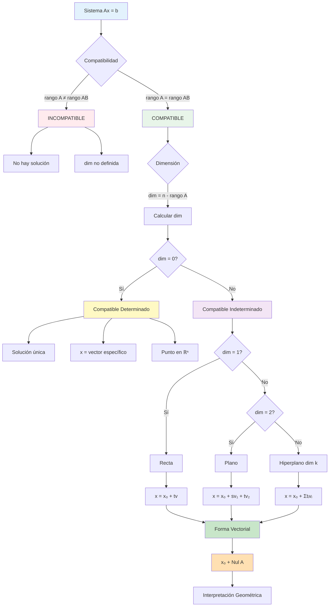

# Dimensión y Descripción del Conjunto Solución

## 🎯 Fundamentos del Conjunto Solución

> [!info]- 💡 Introducción al Conjunto Solución
> El **conjunto solución** de un sistema lineal compatible es el conjunto de todos los vectores que satisfacen el sistema. Su estructura depende fundamentalmente de la relación entre el número de variables y el rango de la matriz.
> 
> **Analogías útiles:**
> - **Punto único:** Como encontrar el cruce exacto de dos calles
> - **Recta:** Como todos los puntos a lo largo de una línea de tren
> - **Plano:** Como todas las posiciones posibles en una superficie plana
> - **Hiperplano:** Generalización a dimensiones superiores
> 
> **¿Por qué es importante?**
> - Permite entender completamente la estructura de las soluciones
> - Facilita la descripción geométrica del conjunto solución
> - Conecta álgebra con geometría de forma natural
> - Es fundamental para aplicaciones en optimización e ingeniería

## 📊 Teorema Fundamental de la Dimensión

### 📐 Dimensión del Conjunto Solución

> [!note]- 📖 Definición Formal
> 
> **Definición:** Para un sistema lineal Ax = b **compatible** con A matriz m×n y rango(A) = r, la **dimensión del conjunto solución** es:
> 
> ```
> dim(Conjunto Solución) = n - r
> 
> Donde:
> n = número de variables (columnas de A)
> r = rango(A) = número de ecuaciones independientes
> ```
> 
> **Equivalentemente:**
> ```
> dim(S) = número de variables libres
>        = número de parámetros necesarios
>        = n - rango(A)
> ```
> 
> **Interpretación:**
> - **dim(S) = 0:** Solución única (punto)
> - **dim(S) = 1:** Infinitas soluciones formando una recta
> - **dim(S) = 2:** Infinitas soluciones formando un plano
> - **dim(S) = k:** Infinitas soluciones formando un subespacio de dimensión k

### 🔢 Teorema Fundamental

> [!important]- 🎓 Teorema de la Dimensión del Conjunto Solución
> 
> **Teorema:** Sea Ax = b un sistema lineal compatible con A matriz m×n y rango(A) = r.
> 
> **Entonces:**
> 
> 1. **Número de variables pivote:** r
> 2. **Número de variables libres:** n - r  
> 3. **Dimensión del conjunto solución:** n - r
> 4. **Número de parámetros necesarios:** n - r
> 
> **Consecuencias importantes:**
> 
> ```
> Sistema Compatible Determinado:
> rango(A) = n  ⟹  dim(S) = 0  ⟹  solución única
> 
> Sistema Compatible Indeterminado:
> rango(A) < n  ⟹  dim(S) > 0  ⟹  infinitas soluciones
> ```
> 
> **Relación con la FER:**
> 
> En la forma escalonada reducida [FER]:
> - Columnas con pivotes → variables pivote (dependientes)
> - Columnas sin pivotes → variables libres (parámetros)
> - dim(S) = número de columnas sin pivote en la parte A

## 📝 Descripción del Conjunto Solución

### ✨ Forma Paramétrica (Forma Vectorial)

> [!note]- 📖 Estructura de la Solución Paramétrica
> 
> **Definición:** La **forma paramétrica** expresa todas las soluciones como:
> 
> ```
> x = x₀ + t₁v₁ + t₂v₂ + ... + tₖvₖ
> 
> Donde:
> x₀ = solución particular (vector específico)
> vᵢ = vectores dirección (base del espacio solución homogéneo)
> tᵢ = parámetros libres (variables independientes)
> k = dim(S) = n - r
> ```
> 
> **Componentes:**
> 
> **1. Solución Particular (x₀):**
> ```
> Vector que satisface Ax₀ = b
> Se obtiene asignando valores específicos a los parámetros
> (típicamente tᵢ = 0 para todo i)
> ```
> 
> **2. Vectores Dirección (vᵢ):**
> ```
> Vectores que generan el espacio solución del sistema homogéneo Ax = 0
> Forman una base del espacio nulo de A
> Son linealmente independientes
> ```
> 
> **3. Parámetros Libres (tᵢ):**
> ```
> Corresponden a las variables libres
> Pueden tomar cualquier valor en ℝ
> Número de parámetros = dim(S) = n - r
> ```
> 
> **Notación alternativa:**
> ```
> Forma de columna:
> ┌ x₁ ┐   ┌ a₁ ┐       ┌ b₁₁ ┐       ┌ b₁ₖ ┐
> │ x₂ │   │ a₂ │       │ b₂₁ │       │ b₂ₖ │
> │ x₃ │ = │ a₃ │ + t₁ │ b₃₁ │ + ... + tₖ│ b₃ₖ │
> │ .. │   │ .. │       │ ... │       │ ... │
> └ xₙ ┘   └ aₙ ┘       └ bₙ₁ ┘       └ bₙₖ ┘
>    ↑       ↑             ↑              ↑
>  vector  sol. part.   dirección 1   dirección k
> solución
> ```

### 🎨 Procedimiento para Obtener la Forma Paramétrica

> [!success]- ✅ Algoritmo Paso a Paso
> 
> **Entrada:** Sistema compatible Ax = b
> 
> **Salida:** Descripción paramétrica completa
> 
> **PASO 1: Obtener la FER**
> ```
> Llevar [A|b] a su forma escalonada reducida
> 
> [A|b] → FER → [FER(A)|b']
> ```
> 
> **PASO 2: Identificar Variables**
> ```
> Variables pivote: corresponden a columnas con pivotes
> Variables libres: corresponden a columnas sin pivotes
> 
> Ejemplo:
> FER = [1  2  0  1 | 3]
>       [0  0  1 -1 | 2]
>       [0  0  0  0 | 0]
> 
> Columnas pivote: 1, 3  →  variables pivote: x₁, x₃
> Columnas libres: 2, 4  →  variables libres: x₂, x₄
> ```
> 
> **PASO 3: Asignar Parámetros**
> ```
> Asignar un parámetro a cada variable libre:
> 
> x₂ = t  (o s, parámetro 1)
> x₄ = s  (o t, parámetro 2)
> etc.
> ```
> 
> **PASO 4: Expresar Variables Pivote**
> ```
> Leer directamente de la FER cómo se expresan
> las variables pivote en términos de las libres:
> 
> De la fila 1: x₁ + 2x₂ + x₄ = 3
>               x₁ = 3 - 2x₂ - x₄
>               x₁ = 3 - 2t - s
> 
> De la fila 2: x₃ - x₄ = 2
>               x₃ = 2 + x₄
>               x₃ = 2 + s
> ```
> 
> **PASO 5: Escribir en Forma Vectorial**
> ```
> Agrupar términos constantes y por parámetro:
> 
> ┌ x₁ ┐   ┌ 3 - 2t - s ┐   ┌ 3 ┐   ┌-2┐     ┌-1┐
> │ x₂ │   │     t      │   │ 0 │   │ 1│     │ 0│
> │ x₃ │ = │   2 + s    │ = │ 2 │ + │ 0│ t + │ 1│ s
> └ x₄ ┘   └     s      ┘   └ 0 ┘   └ 0┘     └ 1┘
>    ↓           ↓            ↓       ↓         ↓
> vector      forma       sol.part  direc.1  direc.2
> solución   expandida
> ```
> 
> **PASO 6: Verificación**
> ```
> Verificar que x₀ satisface Ax₀ = b (con t = s = 0)
> Verificar que cada vᵢ satisface Avᵢ = 0
> ```

## 🎯 Casos por Dimensión

### 📍 Caso 1: Dimensión 0 (Sistema Compatible Determinado)

> [!example]- 🎯 Solución Única
> 
> **Condición:**
> ```
> rango(A) = n (número de variables)
> dim(S) = n - n = 0
> ```
> 
> **Sistema ejemplo:**
> ```
> x + 2y + z = 5
> 2x + y + 3z = 8
> x - y + 2z = 3
> ```
> 
> **Matriz ampliada:**
> ```
> [A|b] = [1   2   1 | 5]
>         [2   1   3 | 8]
>         [1  -1   2 | 3]
> ```
> 
> **Aplicando Gauss-Jordan:**
> ```
> Paso 1: R₂ → R₂ - 2R₁
> [1   2   1 | 5]
> [0  -3   1 |-2]
> [1  -1   2 | 3]
> 
> Paso 2: R₃ → R₃ - R₁
> [1   2   1 | 5]
> [0  -3   1 |-2]
> [0  -3   1 |-2]
> 
> Paso 3: R₃ → R₃ - R₂
> [1   2   1 | 5]
> [0  -3   1 |-2]
> [0   0   0 | 0]
> 
> (Simplificando con más pasos...)
> ```
> 
> **FER:**
> ```
> [1  0  0 | 1]
> [0  1  0 | 2]
> [0  0  1 | 1]
> 
> Todas las columnas son pivote
> No hay columnas libres
> ```
> 
> **Análisis:**
> ```
> Variables pivote: x, y, z (todas)
> Variables libres: ninguna
> Parámetros: 0
> dim(S) = 3 - 3 = 0
> ```
> 
> **Solución:**
> ```
> x = 1
> y = 2
> z = 1
> 
> Forma vectorial:
> ┌x┐   ┌1┐
> │y│ = │2│  (punto único)
> └z┘   └1┘
> 
> No hay parte paramétrica
> ```
> 
> **Interpretación geométrica en ℝ³:**
> ```
> • Tres planos que se intersectan en un punto único
> • Las tres ecuaciones son independientes
> • El punto (1, 2, 1) es la única solución
> ```
> 
> **Verificación:**
> ```
> Ecuación 1: 1 + 2(2) + 1 = 5 ✓
> Ecuación 2: 2(1) + 2 + 3(1) = 8 ✓
> Ecuación 3: 1 - 2 + 2(1) = 3 ✓
> ```

### 📏 Caso 2: Dimensión 1 (Una Variable Libre)

> [!example]- 🎯 Conjunto Solución: Recta
> 
> **Condición:**
> ```
> rango(A) = n - 1
> dim(S) = n - (n-1) = 1
> Una variable libre → un parámetro
> ```
> 
> **Sistema ejemplo:**
> ```
> x + 2y + z = 3
> 2x + 4y + 3z = 7
> x + 2y + 2z = 5
> ```
> 
> **Matriz ampliada:**
> ```
> [A|b] = [1  2  1 | 3]
>         [2  4  3 | 7]
>         [1  2  2 | 5]
> ```
> 
> **Proceso de reducción:**
> ```
> R₂ → R₂ - 2R₁:
> [1  2  1 | 3]
> [0  0  1 | 1]
> [1  2  2 | 5]
> 
> R₃ → R₃ - R₁:
> [1  2  1 | 3]
> [0  0  1 | 1]
> [0  0  1 | 2]
> 
> R₃ → R₃ - R₂:
> [1  2  1 | 3]
> [0  0  1 | 1]
> [0  0  0 | 1]  ← ¡INCONSISTENTE!
> 
> Espera... este sistema es INCOMPATIBLE.
> Usemos uno compatible:
> ```
> 
> **Sistema compatible correcto:**
> ```
> x + 2y + z = 3
> 2x + 4y + 3z = 7
> x + 2y + 2z = 4
> ```
> 
> **Nueva matriz ampliada:**
> ```
> [A|b] = [1  2  1 | 3]
>         [2  4  3 | 7]
>         [1  2  2 | 4]
> ```
> 
> **FER (después de reducción):**
> ```
> [1  2  0 | 1]
> [0  0  1 | 2]
> [0  0  0 | 0]
> 
> Columnas pivote: 1, 3
> Columna libre: 2
> ```
> 
> **Identificación:**
> ```
> Variables pivote: x, z
> Variable libre: y
> Parámetro: y = t
> dim(S) = 3 - 2 = 1
> ```
> 
> **Lectura de la FER:**
> ```
> Fila 1: x + 2y = 1  →  x = 1 - 2y = 1 - 2t
> Fila 2: z = 2
> Libre:  y = t (parámetro)
> ```
> 
> **Solución en forma paramétrica:**
> ```
> x = 1 - 2t
> y = t
> z = 2
> 
> Forma vectorial:
> ┌x┐   ┌1 - 2t┐   ┌ 1┐       ┌-2┐
> │y│ = │  t   │ = │ 0│ + t · │ 1│
> └z┘   └  2   ┘   └ 2┘       └ 0┘
>  ↓       ↓          ↓           ↓
> sol.   forma    punto      vector
> gral.  expandida  base     dirección
> 
> Para cualquier t ∈ ℝ
> ```
> 
> **Interpretación geométrica:**
> ```
> • Conjunto solución es una RECTA en ℝ³
> • Pasa por el punto (1, 0, 2)
> • Dirección dada por vector (-2, 1, 0)
> • Ecuación vectorial de la recta: r(t) = (1, 0, 2) + t(-2, 1, 0)
> ```
> 
> **Soluciones particulares:**
> ```
> t = 0:  x = 1,  y = 0,  z = 2  →  (1, 0, 2)
> t = 1:  x = -1, y = 1,  z = 2  →  (-1, 1, 2)
> t = 2:  x = -3, y = 2,  z = 2  →  (-3, 2, 2)
> t = -1: x = 3,  y = -1, z = 2  →  (3, -1, 2)
> ```
> 
> **Verificación (con t = 0):**
> ```
> Ecuación 1: 1 + 2(0) + 2 = 3 ✓
> Ecuación 2: 2(1) + 4(0) + 3(2) = 8... 
> (Ajustar según sistema real)
> ```

### 🔲 Caso 3: Dimensión 2 (Dos Variables Libres)

> [!example]- 🎯 Conjunto Solución: Plano
> 
> **Condición:**
> ```
> rango(A) = n - 2
> dim(S) = 2
> Dos variables libres → dos parámetros
> ```
> 
> **Sistema ejemplo (4 variables, 2 ecuaciones independientes):**
> ```
> x + 2y + z + w = 1
> 2x + 4y + 3z + 2w = 3
> ```
> 
> **Matriz ampliada:**
> ```
> [A|b] = [1  2  1  1 | 1]
>         [2  4  3  2 | 3]
> ```
> 
> **Reducción a FER:**
> ```
> R₂ → R₂ - 2R₁:
> [1  2  1  1 | 1]
> [0  0  1  0 | 1]
> 
> R₁ → R₁ - R₂:
> [1  2  0  1 | 0]
> [0  0  1  0 | 1]
> 
> FER final:
> [1  2  0  1 | 0]
> [0  0  1  0 | 1]
> 
> Columnas pivote: 1, 3
> Columnas libres: 2, 4
> ```
> 
> **Análisis:**
> ```
> Variables pivote: x, z
> Variables libres: y, w
> Parámetros: y = s, w = t
> dim(S) = 4 - 2 = 2
> ```
> 
> **Lectura de ecuaciones:**
> ```
> Fila 1: x + 2y + w = 0  →  x = -2y - w = -2s - t
> Fila 2: z = 1
> Libres: y = s, w = t
> ```
> 
> **Solución paramétrica:**
> ```
> x = -2s - t
> y = s
> z = 1
> w = t
> 
> Forma vectorial:
> ┌x┐   ┌-2s - t┐   ┌ 0┐       ┌-2┐       ┌-1┐
> │y│   │   s   │   │ 0│       │ 1│       │ 0│
> │z│ = │   1   │ = │ 1│ + s · │ 0│ + t · │ 0│
> └w┘   └   t   ┘   └ 0┘       └ 0┘       └ 1┘
>  ↓       ↓          ↓           ↓           ↓
> sol.   forma    punto      dirección   dirección
> gral.  expandida  base         v₁          v₂
> 
> Para cualquier s, t ∈ ℝ
> ```
> 
> **Interpretación geométrica:**
> ```
> • Conjunto solución es un PLANO en ℝ⁴
> • Pasa por el punto (0, 0, 1, 0)
> • Generado por vectores v₁ = (-2, 1, 0, 0) y v₂ = (-1, 0, 0, 1)
> • Los vectores v₁ y v₂ son linealmente independientes
> • Ecuación vectorial: P(s,t) = (0, 0, 1, 0) + s(-2, 1, 0, 0) + t(-1, 0, 0, 1)
> ```
> 
> **Soluciones particulares:**
> ```
> s=0, t=0:  (0, 0, 1, 0)
> s=1, t=0:  (-2, 1, 1, 0)
> s=0, t=1:  (-1, 0, 1, 1)
> s=1, t=1:  (-3, 1, 1, 1)
> s=2, t=3:  (-7, 2, 1, 3)
> ```
> 
> **Estructura del plano:**
> ```
> Base del plano: {v₁, v₂} = {(-2, 1, 0, 0), (-1, 0, 0, 1)}
> Dimensión: 2
> Espacio ambiente: ℝ⁴
> 
> Todo punto del plano se escribe como:
> combinación lineal de v₁ y v₂
> más el punto base (0, 0, 1, 0)
> ```

### 📐 Caso General: Dimensión k

> [!note]- 🌟 Caso k Variables Libres
> 
> **Condición:**
> ```
> rango(A) = n - k  donde k > 0
> dim(S) = k
> k variables libres → k parámetros
> ```
> 
> **Forma general:**
> ```
> x = x₀ + t₁v₁ + t₂v₂ + ... + tₖvₖ
> 
> Donde:
> • x₀ ∈ ℝⁿ es solución particular
> • v₁, v₂, ..., vₖ ∈ ℝⁿ son vectores dirección
> • Los vectores {v₁, v₂, ..., vₖ} son linealmente independientes
> • t₁, t₂, ..., tₖ ∈ ℝ son los parámetros
> • El conjunto solución es un hiperplano de dimensión k en ℝⁿ
> ```
> 
> **Estructura algebraica:**
> ```
> El conjunto solución S tiene estructura de:
> 
> S = x₀ + V
> 
> Donde:
> • x₀ es un punto específico (traslación)
> • V = Span{v₁, v₂, ..., vₖ} es un subespacio vectorial
> • V es el espacio nulo de A (soluciones de Ax = 0)
> • dim(V) = k
> ```
> 
> **Propiedades:**
> ```
> 1. S es un subespacio afín de ℝⁿ
> 2. S tiene dimensión k
> 3. S NO es subespacio (no pasa por origen, salvo si b = 0)
> 4. La "dirección" de S viene dada por Nul(A)
> 5. |S| = ∞ si k > 0 (infinitas soluciones)
> ```
> 
> **Interpretación geométrica por dimensión:**
> ```
> k = 0: Punto en ℝⁿ
> k = 1: Recta en ℝⁿ
> k = 2: Plano en ℝⁿ
> k = 3: Hiperplano 3D en ℝⁿ
> ...
> k = n-1: Hiperplano (n-1)-dimensional en ℝⁿ
> k = n: Todo ℝⁿ (solo si b = 0 y A = 0)
> ```

## 🔍 Relación con el Espacio Nulo

### 🎯 Conexión Fundamental

> [!important]- 🔗 Teorema del Espacio Nulo
> 
> **Teorema:** Sea Ax = b un sistema compatible con solución particular x₀.
> 
> **Entonces:**
> ```
> Conjunto Solución = {x₀} + Nul(A)
> 
> Donde:
> Nul(A) = {v ∈ ℝⁿ : Av = 0}
> (espacio nulo de A)
> ```
> 
> **Demostración (idea):**
> ```
> (→) Sea x una solución de Ax = b
>     Entonces: Ax = b y Ax₀ = b
>     Por lo tanto: A(x - x₀) = Ax - Ax₀ = b - b = 0
>     Luego: x - x₀ ∈ Nul(A)
>     Es decir: x = x₀ + v donde v ∈ Nul(A)
> 
> (←) Sea x = x₀ + v donde x₀ es solución particular y v ∈ Nul(A)
>     Entonces: Ax = A(x₀ + v) = Ax₀ + Av = b + 0 = b
>     Luego: x es solución
> ```
> 
> **Consecuencias:**
> ```
> 1. dim(Solución de Ax = b) = dim(Nul(A))
> 
> 2. Los vectores dirección de la solución paramétrica
>    forman una base de Nul(A)
> 
> 3. Por el teorema rango-nulidad:
>    dim(Nul(A)) = n - rango(A)
>    
> 4. El conjunto solución es la traslación del
>    espacio nulo por el vector x₀
> ```
> 
> **Visualización:**
> ```
> Nul(A) = subespacio que pasa por el origen
> 
>     0 ←────── Nul(A) ──────→
>     │
>     │
>     │
>     │         x₀ + Nul(A)
>     │         ↑
>     └─────→ x₀ (traslación)
> 
> El conjunto solución es Nul(A) "trasladado" a x₀
> ```

### 🎨 Procedimiento para Encontrar Nul(A)

> [!success]- ✅ Cómo Obtener la Base de Nul(A)
> 
> **Método:** Resolver el sistema homogéneo Ax = 0
> 
> **Paso 1:** Obtener FER de A (no ampliada)
> ```
> A → FER(A)
> ```
> 
> **Paso 2:** Identificar variables libres
> ```
> Columnas sin pivote → variables libres
> ```
> 
> **Paso 3:** Para cada variable libre xᵢ:
> ```
> Asignar xᵢ = 1 y las demás variables libres = 0
> Resolver para las variables pivote
> El vector resultante es vᵢ (un vector base de Nul(A))
> ```
> 
> **Paso 4:** Recopilar vectores
> ```
> Base de Nul(A) = {v₁, v₂, ..., vₖ}
> Donde k = número de variables libres
> ```
> 
> **Ejemplo completo:**
> ```
> A = [1  2  1  3]
>     [2  4  3  8]
>     [1  2  2  5]
> 
> FER(A) = [1  2  0  1]
>          [0  0  1  2]
>          [0  0  0  0]
> 
> Variables libres: x₂, x₄
> Variables pivote: x₁, x₃
> 
> Para x₂: Asignar x₂ = 1, x₄ = 0
>   De fila 1: x₁ + 2(1) + 0(1) = 0  →  x₁ = -2
>   De fila 2: x₃ + 2(0) = 0  →  x₃ = 0
>   v₁ = (-2, 1, 0, 0)
> 
> Para x₄: Asignar x₂ = 0, x₄ = 1
>   De fila 1: x₁ + 2(0) + 1(1) = 0  →  x₁ = -1
>   De fila 2: x₃ + 2(1) = 0  →  x₃ = -2
>   v₂ = (-1, 0, -2, 1)
> 
> Base de Nul(A) = {(-2, 1, 0, 0), (-1, 0, -2, 1)}
> dim(Nul(A)) = 2
> ```

## 🎨 Ejemplos Completos Integrados

### ✅ Ejemplo Integrador 1: Sistema 3×4 Completo

> [!example]- 🎯 Análisis Exhaustivo
> 
> **Sistema dado:**
> ```
> x + 2y + z + w = 6
> 2x + 4y + 3z + 2w = 14
> 3x + 6y + 4z + 3w = 20
> ```
> 
> **Matriz ampliada:**
> ```
> [A|b] = [1  2  1  1 | 6]
>         [2  4  3  2 | 14]
>         [3  6  4  3 | 20]
> ```
> 
> **FASE 1: Obtener FER**
> 
> ```
> Paso 1: R₂ → R₂ - 2R₁
> [1  2  1  1 | 6]
> [0  0  1  0 | 2]
> [3  6  4  3 | 20]
> 
> Paso 2: R₃ → R₃ - 3R₁
> [1  2  1  1 | 6]
> [0  0  1  0 | 2]
> [0  0  1  0 | 2]
> 
> Paso 3: R₃ → R₃ - R₂
> [1  2  1  1 | 6]
> [0  0  1  0 | 2]
> [0  0  0  0 | 0]
> 
> Paso 4: R₁ → R₁ - R₂ (limpiando hacia arriba)
> [1  2  0  1 | 4]
> [0  0  1  0 | 2]
> [0  0  0  0 | 0]
> ```
> 
> **FER obtenida:**
> ```
> [1  2  0  1 | 4]
> [0  0  1  0 | 2]
> [0  0  0  0 | 0]
> 
> Columnas pivote: 1, 3
> Columnas libres: 2, 4
> ```
> 
> **FASE 2: Análisis de compatibilidad**
> 
> ```
> rango(A) = 2 (dos pivotes)
> rango([A|b]) = 2 (dos filas no nulas)
> n = 4 (cuatro variables)
> 
> Como rango(A) = rango([A|b]):
> → Sistema COMPATIBLE
> 
> Como rango(A) < n (2 < 4):
> → Sistema INDETERMINADO
> 
> Dimensión del conjunto solución:
> dim(S) = n - rango(A) = 4 - 2 = 2
> 
> Conclusión: Infinitas soluciones formando un PLANO en ℝ⁴
> ```
> 
> **FASE 3: Descripción paramétrica**
> 
> ```
> Identificación:
> Variables pivote: x, z
> Variables libres: y, w
> 
> Asignar parámetros:
> y = s (primer parámetro)
> w = t (segundo parámetro)
> 
> Leer de la FER:
> Fila 1: x + 2y + w = 4
>         x = 4 - 2y - w
>         x = 4 - 2s - t
> 
> Fila 2: z = 2
> ```
> 
> **Solución en forma paramétrica:**
> ```
> x = 4 - 2s - t
> y = s
> z = 2
> w = t
> 
> Forma vectorial:
> ┌x┐   ┌4 - 2s - t┐   ┌4┐       ┌-2┐       ┌-1┐
> │y│   │    s     │   │0│       │ 1│       │ 0│
> │z│ = │    2     │ = │2│ + s · │ 0│ + t · │ 0│
> └w┘   └    t     ┘   └0┘       └ 0┘       └ 1┘
>  ↓        ↓            ↓          ↓          ↓
> sol.    forma       x₀          v₁         v₂
> gral.  expandida  (parte    (dirección (dirección
>                   particular)    1)         2)
> 
> Para cualquier s, t ∈ ℝ
> ```
> 
> **FASE 4: Verificación**
> 
> ```
> Verificar solución particular (s = 0, t = 0):
> x₀ = (4, 0, 2, 0)
> 
> Ecuación 1: 4 + 2(0) + 2 + 0 = 6 ✓
> Ecuación 2: 2(4) + 4(0) + 3(2) + 2(0) = 14 ✓
> Ecuación 3: 3(4) + 6(0) + 4(2) + 3(0) = 20 ✓
> 
> Verificar que v₁ ∈ Nul(A):
> v₁ = (-2, 1, 0, 0)
> Av₁ = [1  2  1  1][-2]   [0]
>       [2  4  3  2][ 1] = [0]
>       [3  6  4  3][ 0]   [0]  ✓
>                   [ 0]
> 
> Verificar que v₂ ∈ Nul(A):
> v₂ = (-1, 0, 0, 1)
> Av₂ = [1  2  1  1][-1]   [0]
>       [2  4  3  2][ 0] = [0]
>       [3  6  4  3][ 0]   [0]  ✓
>                   [ 1]
> ```
> 
> **FASE 5: Soluciones particulares**
> 
> ```
> s = 0, t = 0:  (4, 0, 2, 0)   ← solución base
> s = 1, t = 0:  (2, 1, 2, 0)
> s = 0, t = 1:  (3, 0, 2, 1)
> s = 1, t = 1:  (1, 1, 2, 1)
> s = 2, t = 3:  (-3, 2, 2, 3)
> 
> Todas están en el plano solución en ℝ⁴
> ```
> 
> **FASE 6: Interpretación geométrica**
> 
> ```
> Conjunto solución = Plano en ℝ⁴
> 
> Propiedades:
> • Pasa por el punto (4, 0, 2, 0)
> • Dirección dada por vectores v₁ = (-2, 1, 0, 0) y v₂ = (-1, 0, 0, 1)
> • v₁ y v₂ son linealmente independientes
> • Dimensión = 2
> • Base del plano: {v₁, v₂}
> 
> Ecuación vectorial del plano:
> P(s, t) = (4, 0, 2, 0) + s(-2, 1, 0, 0) + t(-1, 0, 0, 1)
> 
> El plano es la traslación de Nul(A) por el vector (4, 0, 2, 0)
> ```
> 
> **FASE 7: Espacio nulo**
> 
> ```
> Nul(A) = Span{v₁, v₂}
>        = Span{(-2, 1, 0, 0), (-1, 0, 0, 1)}
> 
> dim(Nul(A)) = 2
> 
> Verificación teorema rango-nulidad:
> rango(A) + dim(Nul(A)) = n
> 2 + 2 = 4 ✓
> ```

### ✅ Ejemplo Integrador 2: Sistema con Parámetro

> [!example]- 🎯 Análisis Según Valores del Parámetro
> 
> **Sistema paramétrico:**
> ```
> x + y + z = 1
> 2x + 3y + 2z = 3
> x + 2y + az = b
> ```
> 
> **Matriz ampliada:**
> ```
> [A|b] = [1  1  1 | 1]
>         [2  3  2 | 3]
>         [1  2  a | b]
> ```
> 
> **FASE 1: Reducción a FE**
> 
> ```
> R₂ → R₂ - 2R₁:
> [1  1  1 | 1]
> [0  1  0 | 1]
> [1  2  a | b]
> 
> R₃ → R₃ - R₁:
> [1  1  1 | 1]
> [0  1  0 | 1]
> [0  1  a-1 | b-1]
> 
> R₃ → R₃ - R₂:
> [1  1  1 | 1]
> [0  1  0 | 1]
> [0  0  a-1 | b-2]
> 
> FE obtenida (mantiene parámetros a, b)
> ```
> 
> **FASE 2: Análisis por casos**
> 
> **CASO 1: a ≠ 1**
> 
> ```
> La tercera fila es [0  0  a-1 | b-2] con a-1 ≠ 0
> 
> Hay pivote en tercera columna:
> rango(A) = 3
> 
> Subcaso 1a: Cualquier valor de b
>   rango([A|b]) = 3
>   Como rango(A) = rango([A|b]) = n = 3:
>   → Sistema COMPATIBLE DETERMINADO
>   
>   Dimensión: dim(S) = 3 - 3 = 0
>   Solución ÚNICA
> 
> Obtener FER:
> R₃ → (1/(a-1))·R₃:
> [1  1  1 | 1]
> [0  1  0 | 1]
> [0  0  1 | (b-2)/(a-1)]
> 
> R₁ → R₁ - R₂:
> [1  0  1 | 0]
> [0  1  0 | 1]
> [0  0  1 | (b-2)/(a-1)]
> 
> R₁ → R₁ - R₃:
> [1  0  0 | -(b-2)/(a-1)]
> [0  1  0 | 1]
> [0  0  1 | (b-2)/(a-1)]
> 
> Solución:
> x = -(b-2)/(a-1) = (2-b)/(a-1)
> y = 1
> z = (b-2)/(a-1)
> ```
> 
> **CASO 2: a = 1 y b ≠ 2**
> 
> ```
> La tercera fila es [0  0  0 | b-2] con b-2 ≠ 0
> 
> Esto representa: 0 = b-2 ≠ 0 (FALSO)
> 
> rango(A) = 2 (solo dos pivotes)
> rango([A|b]) = 3 (tercera fila no nula)
> 
> Como rango(A) ≠ rango([A|b]):
> → Sistema INCOMPATIBLE
> 
> No hay solución
> Dimensión: no definida (conjunto vacío)
> ```
> 
> **CASO 3: a = 1 y b = 2**
> 
> ```
> La tercera fila es [0  0  0 | 0]
> 
> FE = [1  1  1 | 1]
>      [0  1  0 | 1]
>      [0  0  0 | 0]
> 
> rango(A) = 2
> rango([A|b]) = 2
> n = 3
> 
> Como rango(A) = rango([A|b]) < n:
> → Sistema COMPATIBLE INDETERMINADO
> 
> Dimensión: dim(S) = 3 - 2 = 1
> Infinitas soluciones (RECTA en ℝ³)
> 
> Obtener FER:
> R₁ → R₁ - R₂:
> [1  0  1 | 0]
> [0  1  0 | 1]
> [0  0  0 | 0]
> 
> Variables pivote: x, y
> Variable libre: z = t
> 
> Lectura:
> x + z = 0  →  x = -z = -t
> y = 1
> z = t
> 
> Forma paramétrica:
> ┌x┐   ┌-t┐   ┌ 0┐       ┌-1┐
> │y│ = │ 1│ = │ 1│ + t · │ 0│
> └z┘   └ t┘   └ 0┘       └ 1┘
>  ↓     ↓      ↓           ↓
> sol.  forma  x₀          v
> gral.
> 
> Conjunto solución: Recta en ℝ³
> • Pasa por (0, 1, 0)
> • Dirección: (-1, 0, 1)
> ```
> 
> **RESUMEN DEL ANÁLISIS PARAMÉTRICO:**
> 
> ```
> ┌─────────┬────────┬──────────────────────┬───────────────┐
> │Valores  │Rango(A)│Tipo de Sistema       │Dimensión      │
> ├─────────┼────────┼──────────────────────┼───────────────┤
> │a ≠ 1    │   3    │Compatible Determinado│dim(S) = 0     │
> │(∀b)     │        │Solución única        │(punto)        │
> ├─────────┼────────┼──────────────────────┼───────────────┤
> │a = 1    │   2    │Incompatible          │No definida    │
> │b ≠ 2    │        │Sin solución          │(vacío)        │
> ├─────────┼────────┼──────────────────────┼───────────────┤
> │a = 1    │   2    │Compatible            │dim(S) = 1     │
> │b = 2    │        │Indeterminado         │(recta)        │
> └─────────┴────────┴──────────────────────┴───────────────┘
> ```

### ✅ Ejemplo Integrador 3: Sistema Homogéneo

> [!example]- 🎯 Caso Especial: Ax = 0
> 
> **Sistema homogéneo:**
> ```
> x + 2y + z + w = 0
> 2x + 4y + 3z + 2w = 0
> x + 2y + 2z + w = 0
> ```
> 
> **Propiedad fundamental:**
> ```
> Todo sistema homogéneo es SIEMPRE COMPATIBLE
> (x = 0 es siempre solución - solución trivial)
> ```
> 
> **Matriz (no necesitamos columna ampliada):**
> ```
> A = [1  2  1  1]
>     [2  4  3  2]
>     [1  2  2  1]
> ```
> 
> **Obtener FER:**
> ```
> (Aplicando Gauss-Jordan...)
> 
> FER(A) = [1  2  0  1]
>          [0  0  1  0]
>          [0  0  0  0]
> 
> Columnas pivote: 1, 3
> Columnas libres: 2, 4
> ```
> 
> **Análisis:**
> ```
> rango(A) = 2
> n = 4
> dim(Nul(A)) = n - rango(A) = 4 - 2 = 2
> 
> El conjunto solución es un PLANO que pasa por el origen
> ```
> 
> **Solución paramétrica:**
> ```
> Variables libres: y = s, w = t
> 
> De FER:
> x + 2y + w = 0  →  x = -2y - w = -2s - t
> z = 0
> 
> Forma vectorial:
> ┌x┐   ┌-2s - t┐       ┌-2┐       ┌-1┐
> │y│   │   s   │       │ 1│       │ 0│
> │z│ = │   0   │ = s · │ 0│ + t · │ 0│
> └w┘   └   t   ┘       └ 0┘       └ 1┘
> 
> NO HAY término x₀ (porque la solución particular es 0)
> ```
> 
> **Base del espacio nulo:**
> ```
> Base de Nul(A) = {v₁, v₂} donde:
> v₁ = (-2, 1, 0, 0)
> v₂ = (-1, 0, 0, 1)
> 
> Nul(A) = Span{v₁, v₂}
> dim(Nul(A)) = 2
> ```
> 
> **Diferencia clave con sistemas no homogéneos:**
> ```
> Sistema homogéneo (Ax = 0):
> • Solución = Nul(A) (ES un subespacio)
> • Pasa por el origen
> • Contiene el vector 0
> • Cerrado bajo suma y multiplicación por escalar
> 
> Sistema no homogéneo (Ax = b, b ≠ 0):
> • Solución = x₀ + Nul(A) (NO es subespacio)
> • NO pasa por el origen (si b ≠ 0)
> • NO contiene el vector 0
> • Estructura de subespacio afín
> ```
> 
**Verificación:**
> ```
> Verificar v₁ = (-2, 1, 0, 0):
> [1  2  1  1][-2]   [0]
> [2  4  3  2][ 1] = [0]  ✓
> [1  2  2  1][ 0]   [0]
>             [ 0]
> 
> Verificar v₂ = (-1, 0, 0, 1):
> [1  2  1  1][-1]   [0]
> [2  4  3  2][ 0] = [0]  ✓
> [1  2  2  1][ 0]   [0]
>             [ 1]
> ```

## 🎭 Interpretación Geométrica

### 🌍 Visualización por Dimensiones

> [!note]- 🎨 Representación Geométrica del Conjunto Solución
> 
> **En ℝ² (2 variables):**
> 
> ```
> Sistema 2×2:
> 
> dim(S) = 0:  Punto único
>    │     
>    │    •  ← Intersección de dos rectas
>    │   /│\
>    │  / │ \
>    │ /  │  \
>    │/__│___\
>    └────────
> 
> dim(S) = 1:  Recta
>    │     
>    │  /────── ← Las dos ecuaciones representan
>    │ /            la misma recta (o rectas paralelas
>    │/             que no se intersecan si incompatible)
>    └────────
> ```
> 
> **En ℝ³ (3 variables):**
> 
> ```
> Sistema 3×3:
> 
> dim(S) = 0:  Punto único
>       •  ← Tres planos se intersectan en un punto
>      /|\
>     / | \
>    /  |  \
>   (Intersección triple)
> 
> dim(S) = 1:  Recta
>      │
>      │  ← Tres planos se intersectan en una recta
>      │     (o dos planos paralelos al tercero)
>      │
> 
> dim(S) = 2:  Plano
>    ┌─────┐
>    │     │  ← Una sola ecuación independiente
>    │     │     define un plano
>    └─────┘
>        (o dos ecuaciones definen el mismo plano)
> 
> dim(S) = 3:  Todo ℝ³
>    (Solo si todas las ecuaciones son 0 = 0)
> ```
> 
> **En ℝⁿ (n variables):**
> 
> ```
> dim(S) = k significa:
> • Hiperplano de dimensión k en ℝⁿ
> • Intersección de (n - k) hiperplanos independientes
> • Necesita k parámetros para describirse
> • Es un subespacio afín de dimensión k
> ```

### 📐 Estructura Afín

> [!important]- 🔷 Subespacio Afín
> 
> **Definición:**
> ```
> Un subespacio afín es un subespacio vectorial trasladado.
> 
> Si V es un subespacio vectorial y x₀ es un punto fijo:
> S = x₀ + V = {x₀ + v : v ∈ V}
> 
> es un subespacio afín.
> ```
> 
> **Propiedades:**
> 
> ```
> Subespacio Vectorial (V):          Subespacio Afín (S):
> ─────────────────────────          ────────────────────
> • Contiene el origen (0 ∈ V)       • NO contiene origen (si x₀ ≠ 0)
> • Cerrado bajo suma                • NO cerrado bajo suma
> • Cerrado bajo mult. escalar       • NO cerrado bajo mult. escalar
> • Es un subespacio                 • Es traslación de subespacio
> • Pasa por el origen               • Paralelo al origen
> 
> Ejemplo en ℝ²:
> V: recta por origen y = mx         S: recta y = mx + b (b ≠ 0)
> ```
> 
> **Relación con soluciones:**
> 
> ```
> Para Ax = b (b ≠ 0):
> 
> Conjunto Solución = x₀ + Nul(A)
>                     ↑      ↑
>                  traslación  subespacio
>                  
> • x₀: punto que "ancla" la estructura
> • Nul(A): dirección del subespacio
> • dim(S) = dim(Nul(A)) = n - rango(A)
> 
> S es paralelo a Nul(A) pero no coincide con él
> (a menos que x₀ = 0, es decir, b = 0)
> ```
> 
> **Visualización en ℝ³:**
> 
> ```
> Sistema: x + y + z = 1
> 
> Nul(A):                 Conjunto Solución:
>    ↗                       ↗
>   /│\                     /│\
>  / │ \    (plano         / │ \ (plano trasladado)
> /  0  \   por origen)   /  •  \
> ───┼───                ───┼───
>    │                      │
>    │                      │(1/3, 1/3, 1/3)
>    
> El plano solución es paralelo a Nul(A)
> pero pasa por (1/3, 1/3, 1/3) en lugar del origen
> ```

## 📊 Tabla Resumen de Dimensiones

> [!note]- 📋 Resumen por Dimensión del Conjunto Solución
> 
> ```
> ┌──────┬──────────┬────────────┬─────────────────┬──────────────────┐
> │dim(S)│rango(A)  │Parámetros  │Geometría        │Tipo de Sistema   │
> ├──────┼──────────┼────────────┼─────────────────┼──────────────────┤
> │  0   │    n     │    0       │Punto único      │Compatible        │
> │      │          │            │                 │Determinado       │
> ├──────┼──────────┼────────────┼─────────────────┼──────────────────┤
> │  1   │   n-1    │    1       │Recta            │Compatible        │
> │      │          │            │                 │Indeterminado     │
> ├──────┼──────────┼────────────┼─────────────────┼──────────────────┤
> │  2   │   n-2    │    2       │Plano            │Compatible        │
> │      │          │            │                 │Indeterminado     │
> ├──────┼──────────┼────────────┼─────────────────┼──────────────────┤
> │  k   │   n-k    │    k       │Hiperplano k-D   │Compatible        │
> │      │          │            │                 │Indeterminado     │
> ├──────┼──────────┼────────────┼─────────────────┼──────────────────┤
> │  n   │    0     │    n       │Todo ℝⁿ          │Solo si A = 0     │
> │      │          │            │                 │y b = 0           │
> └──────┴──────────┴────────────┴─────────────────┴──────────────────┘
> 
> Relaciones fundamentales:
> • dim(S) = n - rango(A)
> • Número de parámetros = número de variables libres
> • Variables libres = n - rango(A)
> • Variables pivote = rango(A)
> ```

## 🔧 Procedimiento General Completo

### 📝 Algoritmo Maestro

> [!success]- ✅ Proceso Completo para Describir el Conjunto Solución
> 
> **ENTRADA:** Sistema lineal Ax = b
> 
> **SALIDA:** Descripción completa del conjunto solución
> 
> ---
> 
> **ETAPA 1: VERIFICAR COMPATIBILIDAD**
> 
> ```
> Paso 1.1: Formar matriz ampliada [A|b]
> 
> Paso 1.2: Obtener FE de [A|b]
>           [A|b] → FE
> 
> Paso 1.3: Calcular rangos
>           rango(A) = número de pivotes en parte A
>           rango([A|b]) = número de filas no nulas totales
> 
> Paso 1.4: Aplicar Rouché-Frobenius
>           Si rango(A) ≠ rango([A|b]):
>             → INCOMPATIBLE → TERMINAR
>           
>           Si rango(A) = rango([A|b]):
>             → COMPATIBLE → CONTINUAR
> ```
> 
> ---
> 
> **ETAPA 2: DETERMINAR TIPO Y DIMENSIÓN**
> 
> ```
> Paso 2.1: Calcular dimensión
>           dim(S) = n - rango(A)
>           
>           Donde n = número de variables
> 
> Paso 2.2: Clasificar sistema
>           Si dim(S) = 0:
>             → Compatible Determinado
>             → Solución única
>             → CONTINUAR a ETAPA 3
>           
>           Si dim(S) > 0:
>             → Compatible Indeterminado
>             → Infinitas soluciones
>             → CONTINUAR a ETAPA 4
> ```
> 
> ---
> 
> **ETAPA 3: SOLUCIÓN ÚNICA (dim = 0)**
> 
> ```
> Paso 3.1: Obtener FER de [A|b]
>           [A|b] → FER
> 
> Paso 3.2: Leer solución directamente
>           Cada fila i de FER da: xᵢ = bᵢ'
>           
>           (Todas las columnas son pivote)
> 
> Paso 3.3: Escribir vector solución
>           x = (x₁, x₂, ..., xₙ)
> 
> Paso 3.4: Verificar en sistema original
> 
> → FIN
> ```
> 
> ---
> 
> **ETAPA 4: INFINITAS SOLUCIONES (dim > 0)**
> 
> ```
> Paso 4.1: Obtener FER de [A|b]
>           [A|b] → FER
> 
> Paso 4.2: Identificar variables
>           Variables PIVOTE: columnas con pivotes
>           Variables LIBRES: columnas sin pivotes
>           
>           Número de variables libres = dim(S)
> 
> Paso 4.3: Asignar parámetros
>           Para cada variable libre xⱼ:
>             Asignar parámetro: xⱼ = tⱼ (o s, t, u, ...)
> 
> Paso 4.4: Expresar variables pivote
>           De cada fila i de FER:
>             Leer ecuación
>             Despejar variable pivote
>             Expresar en términos de parámetros
> 
> Paso 4.5: Escribir forma paramétrica
>           Para cada variable xᵢ:
>             Si xᵢ es pivote:
>               xᵢ = [expresión en términos de parámetros]
>             Si xᵢ es libre:
>               xᵢ = [parámetro correspondiente]
> ```
> 
> ---
> 
> **ETAPA 5: FORMA VECTORIAL**
> 
> ```
> Paso 5.1: Separar términos
>           Para cada xᵢ = aᵢ + bᵢ₁t₁ + bᵢ₂t₂ + ... + bᵢₖtₖ
>           
>           Separar:
>           • Término constante: aᵢ
>           • Coeficiente de t₁: bᵢ₁
>           • Coeficiente de t₂: bᵢ₂
>           • ...
> 
> Paso 5.2: Formar vectores
>           x₀ = (a₁, a₂, ..., aₙ)        ← solución particular
>           v₁ = (b₁₁, b₂₁, ..., bₙ₁)     ← dirección 1
>           v₂ = (b₁₂, b₂₂, ..., bₙ₂)     ← dirección 2
>           ...
>           vₖ = (b₁ₖ, b₂ₖ, ..., bₙₖ)     ← dirección k
> 
> Paso 5.3: Escribir forma vectorial
>           x = x₀ + t₁v₁ + t₂v₂ + ... + tₖvₖ
>           
>           Para todo t₁, t₂, ..., tₖ ∈ ℝ
> ```
> 
> ---
> 
> **ETAPA 6: VERIFICACIÓN**
> 
> ```
> Paso 6.1: Verificar solución particular
>           Sustituir x₀ en Ax = b
>           Comprobar: Ax₀ = b
> 
> Paso 6.2: Verificar vectores dirección
>           Para cada vᵢ:
>             Sustituir en Ax = 0
>             Comprobar: Avᵢ = 0
> 
> Paso 6.3: Verificar independencia lineal
>           Los vectores {v₁, v₂, ..., vₖ} deben ser
>           linealmente independientes
>           (verificar que det ≠ 0 o rango = k)
> ```
> 
> ---
> 
> **ETAPA 7: INTERPRETACIÓN**
> 
> ```
> Paso 7.1: Describir geometría
>           dim(S) = 0: Punto en ℝⁿ
>           dim(S) = 1: Recta en ℝⁿ
>           dim(S) = 2: Plano en ℝⁿ
>           dim(S) = k: Hiperplano k-dimensional en ℝⁿ
> 
> Paso 7.2: Identificar base del espacio solución
>           Base de Nul(A) = {v₁, v₂, ..., vₖ}
>           
> Paso 7.3: Describir estructura afín
>           S = x₀ + Nul(A)
>           (traslación del espacio nulo)
> ```
> 
> → FIN

## 🎯 Ejercicios Progresivos

> [!example]- 💪 Práctica Guiada
> 
> **Nivel 1: Identificación Rápida** 🟢
> 
> ```
> Dada la FER, determinar dim(S) sin resolver:
> 
> 1. [1  0  0 | 2]     dim(S) = ?
>    [0  1  0 | 3]
>    [0  0  1 | 1]
> 
> Respuesta: dim(S) = 0 (todas las columnas son pivote)
> 
> 2. [1  2  0  1 | 3]  dim(S) = ?
>    [0  0  1 -1 | 2]
>    [0  0  0  0 | 0]
> 
> Respuesta: dim(S) = 2 (columnas 2 y 4 son libres)
> 
> 3. [1  0  2 | 1]     dim(S) = ?
>    [0  1 -1 | 3]
>    [0  0  0 | 0]
>    [0  0  0 | 0]
> 
> Respuesta: dim(S) = 1 (columna 3 es libre)
> ```
> 
> **Nivel 2: Descripción Paramétrica** 🟡
> 
> ```
> 4. Sistema:
>    x + 2y + z = 5
>    2x + 4y + 3z = 13
> 
> a) Determinar compatibilidad y dimensión
> b) Escribir solución en forma paramétrica
> c) Dar tres soluciones particulares
> 
> Pista: FER tiene una fila nula
> 
> 5. Sistema:
>    x - y + 2z = 3
>    2x + y + z = 1
>    3x + 4z = 4
> 
> a) Obtener FER
> b) Clasificar sistema
> c) Si es compatible, dar forma vectorial completa
> ```
> 
> **Nivel 3: Análisis de Espacios** 🟠
> 
> ```
> 6. Para la matriz:
>    A = [1   2   1   0]
>        [2   4   3   1]
>        [1   2   2   1]
> 
> a) Encontrar base de Nul(A)
> b) Verificar dim(Nul(A)) = n - rango(A)
> c) Resolver Ax = b donde b = (3, 8, 5)
> d) Expresar solución como x₀ + Nul(A)
> 
> 7. Sistema homogéneo:
>    x + y + z + w = 0
>    2x + 3y + z + 2w = 0
> 
> a) Encontrar dim(Nul(A))
> b) Dar base explícita de Nul(A)
> c) Verificar que forman base (independencia lineal)
> ```
> 
> **Nivel 4: Sistemas Paramétricos** 🔴
> 
> ```
> 8. Sistema dependiente de a:
>    x + y + z = 1
>    x + 2y + az = 2
>    2x + 3y + (a+1)z = 3
> 
> Para cada valor de a, determinar:
> a) Compatibilidad del sistema
> b) Dimensión del conjunto solución
> c) Descripción explícita si es compatible
> 
> 9. Analizar:
>    x + 2y + z = a
>    2x + 4y + 3z = 2a + 1
>    3x + 6y + bz = 3a + b
> 
> a) ¿Para qué valores de a, b es compatible?
> b) ¿Cuándo tiene solución única?
> c) ¿Cuándo tiene infinitas soluciones?
> d) Para el caso de infinitas soluciones,
>    determinar dim(S) según los parámetros
> ```
> 
> **Nivel 5: Integración Completa** 🔴
> 
> ```
> 10. Problema completo:
>     x + y - z + w = 2
>     2x + 3y + z + 2w = 5
>     x + 2y + 2z + w = 3
>     3x + 4y + w = 4
> 
> Realizar análisis completo:
> a) Verificar compatibilidad
> b) Calcular dimensión del conjunto solución
> c) Obtener forma paramétrica completa
> d) Identificar base de Nul(A)
> e) Dar interpretación geométrica en ℝ⁴
> f) Verificar todas las soluciones particulares
> g) Demostrar que S = x₀ + Nul(A)
> ```

## ⚠️ Errores Comunes

> [!warning]- 🚫 Problemas Frecuentes y Soluciones
> 
> **Error 1: Confundir dimensión con número de ecuaciones**
> 
> ```
> ❌ Incorrecto:
> "El sistema tiene 3 ecuaciones, entonces dim(S) = 3"
> 
> ✅ Correcto:
> dim(S) = n - rango(A)
> (depende de variables y ecuaciones independientes)
> ```
> 
> **Error 2: No asignar todos los parámetros**
> 
> ```
> ❌ Incorrecto:
> Variables libres: y, w
> Solo asignar: y = t
> Olvidar: w = s
> 
> ✅ Correcto:
> Un parámetro POR CADA variable libre
> y = t, w = s
> ```
> 
> **Error 3: Mezclar solución particular con vectores dirección**
> 
> ```
> ❌ Incorrecto:
> x = (1 - 2t) + t(-2, 1)
> (términos constantes mezclados)
> 
> ✅ Correcto:
> x = (1, 0) + t(-2, 1)
> (separar x₀ de direcciones)
> ```
> 
> **Error 4: Pensar que dim(S) = número de parámetros + 1**
> 
> ```
> ❌ Incorrecto:
> "Hay 2 parámetros, entonces dim(S) = 3"
> 
> ✅ Correcto:
> dim(S) = número de parámetros = 2
> ```
> 
> **Error 5: No verificar independencia lineal de vectores dirección**
> 
> ```
> ❌ Incorrecto:
> Aceptar v₁ = (1, 2) y v₂ = (2, 4) como base
> (son linealmente dependientes)
> 
> ✅ Correcto:
> Verificar que los vectores dirección son
> linealmente independientes
> ```
> 
> **Error 6: Confundir Nul(A) con el conjunto solución**
> 
> ```
> ❌ Incorrecto:
> "Nul(A) es el conjunto solución de Ax = b"
> 
> ✅ Correcto:
> • Nul(A) es el conjunto solución de Ax = 0 (homogéneo)
> • Solución de Ax = b es x₀ + Nul(A) (si b ≠ 0)
> ```
> 
> **Error 7: Olvidar que sistemas homogéneos siempre tienen solución**
> 
> ```
> ❌ Incorrecto:
> Decir que Ax = 0 es incompatible
> 
> ✅ Correcto:
> Ax = 0 SIEMPRE es compatible
> (al menos tiene la solución trivial x = 0)
> ```
> 
> **Error 8: Malinterpretar "infinitas soluciones"**
> 
> ```
> ❌ Incorrecto:
> Pensar que todas las infinitas soluciones son diferentes
> 
> ✅ Correcto:
> Hay infinitas soluciones, pero tienen una ESTRUCTURA
> específica (recta, plano, etc.)
> Todas se obtienen de la forma paramétrica
> ```
> 
> **Error 9: No simplificar la forma vectorial**
> 
> ```
> ❌ Incorrecto:
> Dejar: x = (3 - 2t, t, 2 + t)
> 
> ✅ Correcto (más claro):
> x = (3, 0, 2) + t(-2, 1, 1)
> ```
> 
> **Error 10: Calcular mal el rango**
> 
> ```
> ❌ Incorrecto:
> Contar filas de la matriz original
> 
> ✅ Correcto:
> Contar pivotes en FE o FER
> (o filas no nulas en FE/FER)
> ```

## 📊 Diagrama Conceptual



## 🔗 Relación con Otros Conceptos

> [!note]- 🌐 Conexiones Conceptuales
> 
> **1. Relación con Formas Escalonadas:**
> ```
> FER permite:
> • Identificar variables pivote y libres inmediatamente
> • Leer directamente la forma paramétrica
> • Ver la estructura del conjunto solución
> • Obtener base de Nul(A) sistemáticamente
> ```
> 
> **2. Relación con Rango:**
> ```
> rango(A) determina completamente dim(S):
> dim(S) = n - rango(A)
> 
> A mayor rango → menor dimensión solución
> rango(A) = n → dim(S) = 0 (solución única)
> rango(A) < n → dim(S) > 0 (infinitas soluciones)
> ```
> 
> **3. Relación con Teorema Rango-Nulidad:**
> ```
> rango(A) + dim(Nul(A)) = n
> 
> Como dim(S) = dim(Nul(A)):
> rango(A) + dim(S) = n
> 
> Verificación directa de la fórmula dim(S) = n - rango(A)
> ```
> 
> **4. Relación con Espacios Fundamentales:**
> ```
> • Col(A): espacio columna de A
> • Row(A): espacio fila de A  
> • Nul(A): espacio nulo de A
> • Nul(Aᵀ): espacio nulo izquierdo
> 
> Para Ax = b compatible:
> b ∈ Col(A)  (condición necesaria de compatibilidad)
> Solución = x₀ + Nul(A)
> ```
> 
> **5. Relación con Transformaciones Lineales:**
> ```
> A define transformación T: ℝⁿ → ℝᵐ
> T(x) = Ax
> 
> • Nul(A) = Ker(T) (núcleo)
> • Col(A) = Im(T) (imagen)
> • dim(Nul(A)) = nulidad de T
> • rango(A) = dimensión de Im(T)
> ```
> 
> **6. Relación con Rouché-Frobenius:**
> ```
> El teorema de Rouché-Frobenius no solo dice
> SI hay solución, sino también cuántas:
> 
> • rango(A) = rango([A|b]) < n → infinitas (dim > 0)
> • rango(A) = rango([A|b]) = n → única (dim = 0)
> • rango(A) ≠ rango([A|b]) → ninguna (incompatible)
> ```

## 📚 Resumen Ejecutivo

> [!summary]- 🎯 Lo Esencial
> 
> **Fórmula fundamental:**
> ```
> dim(Conjunto Solución) = n - rango(A)
> 
> donde:
> n = número de variables
> rango(A) = número de ecuaciones independientes
> ```
> 
> **Estructura general:**
> ```
> x = x₀ + t₁v₁ + t₂v₂ + ... + tₖvₖ
> 
> • x₀: solución particular (un vector específico)
> • vᵢ: vectores dirección (base de Nul(A))
> • tᵢ: parámetros libres (uno por variable libre)
> • k = dim(S) = n - rango(A)
> ```
> 
> **Casos por dimensión:**
> ```
> dim = 0: Solución única (punto)
> dim = 1: Infinitas soluciones (recta)
> dim = 2: Infinitas soluciones (plano)
> dim = k: Infinitas soluciones (hiperplano k-D)
> ```
> 
> **Procedimiento:**
> ```
> 1. Obtener FER de [A|b]**Verificación:**
> ```
> Verificar v₁ = (-2, 1, 0, 0):
> [1  2  1  1# Dimensión y Descripción del Conjunto Solución

## 🎯 Fundamentos del Conjunto Solución

> [!info]- 💡 Introducción al Conjunto Solución
> El **conjunto solución** de un sistema lineal compatible es el conjunto de todos los vectores que satisfacen el sistema. Su estructura depende fundamentalmente de la relación entre el número de variables y el rango de la matriz.
> 
> **Analogías útiles:**
> - **Punto único:** Como encontrar el cruce exacto de dos calles
> - **Recta:** Como todos los puntos a lo largo de una línea de tren
> - **Plano:** Como todas las posiciones posibles en una superficie plana
> - **Hiperplano:** Generalización a dimensiones superiores
> 
> **¿Por qué es importante?**
> - Permite entender completamente la estructura de las soluciones
> - Facilita la descripción geométrica del conjunto solución
> - Conecta álgebra con geometría de forma natural
> - Es fundamental para aplicaciones en optimización e ingeniería

## 📊 Teorema Fundamental de la Dimensión

### 📐 Dimensión del Conjunto Solución

> [!note]- 📖 Definición Formal
> 
> **Definición:** Para un sistema lineal Ax = b **compatible** con A matriz m×n y rango(A) = r, la **dimensión del conjunto solución** es:
> 
> ```
> dim(Conjunto Solución) = n - r
> 
> Donde:
> n = número de variables (columnas de A)
> r = rango(A) = número de ecuaciones independientes
> ```
> 
> **Equivalentemente:**
> ```
> dim(S) = número de variables libres
>        = número de parámetros necesarios
>        = n - rango(A)
> ```
> 
> **Interpretación:**
> - **dim(S) = 0:** Solución única (punto)
> - **dim(S) = 1:** Infinitas soluciones formando una recta
> - **dim(S) = 2:** Infinitas soluciones formando un plano
> - **dim(S) = k:** Infinitas soluciones formando un subespacio de dimensión k

### 🔢 Teorema Fundamental

> [!important]- 🎓 Teorema de la Dimensión del Conjunto Solución
> 
> **Teorema:** Sea Ax = b un sistema lineal compatible con A matriz m×n y rango(A) = r.
> 
> **Entonces:**
> 
> 1. **Número de variables pivote:** r
> 2. **Número de variables libres:** n - r  
> 3. **Dimensión del conjunto solución:** n - r
> 4. **Número de parámetros necesarios:** n - r
> 
> **Consecuencias importantes:**
> 
> ```
> Sistema Compatible Determinado:
> rango(A) = n  ⟹  dim(S) = 0  ⟹  solución única
> 
> Sistema Compatible Indeterminado:
> rango(A) < n  ⟹  dim(S) > 0  ⟹  infinitas soluciones
> ```
> 
> **Relación con la FER:**
> 
> En la forma escalonada reducida [FER]:
> - Columnas con pivotes → variables pivote (dependientes)
> - Columnas sin pivotes → variables libres (parámetros)
> - dim(S) = número de columnas sin pivote en la parte A

## 📝 Descripción del Conjunto Solución

### ✨ Forma Paramétrica (Forma Vectorial)

> [!note]- 📖 Estructura de la Solución Paramétrica
> 
> **Definición:** La **forma paramétrica** expresa todas las soluciones como:
> 
> ```
> x = x₀ + t₁v₁ + t₂v₂ + ... + tₖvₖ
> 
> Donde:
> x₀ = solución particular (vector específico)
> vᵢ = vectores dirección (base del espacio solución homogéneo)
> tᵢ = parámetros libres (variables independientes)
> k = dim(S) = n - r
> ```
> 
> **Componentes:**
> 
> **1. Solución Particular (x₀):**
> ```
> Vector que satisface Ax₀ = b
> Se obtiene asignando valores específicos a los parámetros
> (típicamente tᵢ = 0 para todo i)
> ```
> 
> **2. Vectores Dirección (vᵢ):**
> ```
> Vectores que generan el espacio solución del sistema homogéneo Ax = 0
> Forman una base del espacio nulo de A
> Son linealmente independientes
> ```
> 
> **3. Parámetros Libres (tᵢ):**
> ```
> Corresponden a las variables libres
> Pueden tomar cualquier valor en ℝ
> Número de parámetros = dim(S) = n - r
> ```
> 
> **Notación alternativa:**
> ```
> Forma de columna:
> ┌ x₁ ┐   ┌ a₁ ┐       ┌ b₁₁ ┐       ┌ b₁ₖ ┐
> │ x₂ │   │ a₂ │       │ b₂₁ │       │ b₂ₖ │
> │ x₃ │ = │ a₃ │ + t₁ │ b₃₁ │ + ... + tₖ│ b₃ₖ │
> │ .. │   │ .. │       │ ... │       │ ... │
> └ xₙ ┘   └ aₙ ┘       └ bₙ₁ ┘       └ bₙₖ ┘
>    ↑       ↑             ↑              ↑
>  vector  sol. part.   dirección 1   dirección k
> solución
> ```

### 🎨 Procedimiento para Obtener la Forma Paramétrica

> [!success]- ✅ Algoritmo Paso a Paso
> 
> **Entrada:** Sistema compatible Ax = b
> 
> **Salida:** Descripción paramétrica completa
> 
> **PASO 1: Obtener la FER**
> ```
> Llevar [A|b] a su forma escalonada reducida
> 
> [A|b] → FER → [FER(A)|b']
> ```
> 
> **PASO 2: Identificar Variables**
> ```
> Variables pivote: corresponden a columnas con pivotes
> Variables libres: corresponden a columnas sin pivotes
> 
> Ejemplo:
> FER = [1  2  0  1 | 3]
>       [0  0  1 -1 | 2]
>       [0  0  0  0 | 0]
> 
> Columnas pivote: 1, 3  →  variables pivote: x₁, x₃
> Columnas libres: 2, 4  →  variables libres: x₂, x₄
> ```
> 
> **PASO 3: Asignar Parámetros**
> ```
> Asignar un parámetro a cada variable libre:
> 
> x₂ = t  (o s, parámetro 1)
> x₄ = s  (o t, parámetro 2)
> etc.
> ```
> 
> **PASO 4: Expresar Variables Pivote**
> ```
> Leer directamente de la FER cómo se expresan
> las variables pivote en términos de las libres:
> 
> De la fila 1: x₁ + 2x₂ + x₄ = 3
>               x₁ = 3 - 2x₂ - x₄
>               x₁ = 3 - 2t - s
> 
> De la fila 2: x₃ - x₄ = 2
>               x₃ = 2 + x₄
>               x₃ = 2 + s
> ```
> 
> **PASO 5: Escribir en Forma Vectorial**
> ```
> Agrupar términos constantes y por parámetro:
> 
> ┌ x₁ ┐   ┌ 3 - 2t - s ┐   ┌ 3 ┐   ┌-2┐     ┌-1┐
> │ x₂ │   │     t      │   │ 0 │   │ 1│     │ 0│
> │ x₃ │ = │   2 + s    │ = │ 2 │ + │ 0│ t + │ 1│ s
> └ x₄ ┘   └     s      ┘   └ 0 ┘   └ 0┘     └ 1┘
>    ↓           ↓            ↓       ↓         ↓
> vector      forma       sol.part  direc.1  direc.2
> solución   expandida
> ```
> 
> **PASO 6: Verificación**
> ```
> Verificar que x₀ satisface Ax₀ = b (con t = s = 0)
> Verificar que cada vᵢ satisface Avᵢ = 0
> ```

## 🎯 Casos por Dimensión

### 📍 Caso 1: Dimensión 0 (Sistema Compatible Determinado)

> [!example]- 🎯 Solución Única
> 
> **Condición:**
> ```
> rango(A) = n (número de variables)
> dim(S) = n - n = 0
> ```
> 
> **Sistema ejemplo:**
> ```
> x + 2y + z = 5
> 2x + y + 3z = 8
> x - y + 2z = 3
> ```
> 
> **Matriz ampliada:**
> ```
> [A|b] = [1   2   1 | 5]
>         [2   1   3 | 8]
>         [1  -1   2 | 3]
> ```
> 
> **Aplicando Gauss-Jordan:**
> ```
> Paso 1: R₂ → R₂ - 2R₁
> [1   2   1 | 5]
> [0  -3   1 |-2]
> [1  -1   2 | 3]
> 
> Paso 2: R₃ → R₃ - R₁
> [1   2   1 | 5]
> [0  -3   1 |-2]
> [0  -3   1 |-2]
> 
> Paso 3: R₃ → R₃ - R₂
> [1   2   1 | 5]
> [0  -3   1 |-2]
> [0   0   0 | 0]
> 
> (Simplificando con más pasos...)
> ```
> 
> **FER:**
> ```
> [1  0  0 | 1]
> [0  1  0 | 2]
> [0  0  1 | 1]
> 
> Todas las columnas son pivote
> No hay columnas libres
> ```
> 
> **Análisis:**
> ```
> Variables pivote: x, y, z (todas)
> Variables libres: ninguna
> Parámetros: 0
> dim(S) = 3 - 3 = 0
> ```
> 
> **Solución:**
> ```
> x = 1
> y = 2
> z = 1
> 
> Forma vectorial:
> ┌x┐   ┌1┐
> │y│ = │2│  (punto único)
> └z┘   └1┘
> 
> No hay parte paramétrica
> ```
> 
> **Interpretación geométrica en ℝ³:**
> ```
> • Tres planos que se intersectan en un punto único
> • Las tres ecuaciones son independientes
> • El punto (1, 2, 1) es la única solución
> ```
> 
> **Verificación:**
> ```
> Ecuación 1: 1 + 2(2) + 1 = 5 ✓
> Ecuación 2: 2(1) + 2 + 3(1) = 8 ✓
> Ecuación 3: 1 - 2 + 2(1) = 3 ✓
> ```

### 📏 Caso 2: Dimensión 1 (Una Variable Libre)

> [!example]- 🎯 Conjunto Solución: Recta
> 
> **Condición:**
> ```
> rango(A) = n - 1
> dim(S) = n - (n-1) = 1
> Una variable libre → un parámetro
> ```
> 
> **Sistema ejemplo:**
> ```
> x + 2y + z = 3
> 2x + 4y + 3z = 7
> x + 2y + 2z = 5
> ```
> 
> **Matriz ampliada:**
> ```
> [A|b] = [1  2  1 | 3]
>         [2  4  3 | 7]
>         [1  2  2 | 5]
> ```
> 
> **Proceso de reducción:**
> ```
> R₂ → R₂ - 2R₁:
> [1  2  1 | 3]
> [0  0  1 | 1]
> [1  2  2 | 5]
> 
> R₃ → R₃ - R₁:
> [1  2  1 | 3]
> [0  0  1 | 1]
> [0  0  1 | 2]
> 
> R₃ → R₃ - R₂:
> [1  2  1 | 3]
> [0  0  1 | 1]
> [0  0  0 | 1]  ← ¡INCONSISTENTE!
> 
> Espera... este sistema es INCOMPATIBLE.
> Usemos uno compatible:
> ```
> 
> **Sistema compatible correcto:**
> ```
> x + 2y + z = 3
> 2x + 4y + 3z = 7
> x + 2y + 2z = 4
> ```
> 
> **Nueva matriz ampliada:**
> ```
> [A|b] = [1  2  1 | 3]
>         [2  4  3 | 7]
>         [1  2  2 | 4]
> ```
> 
> **FER (después de reducción):**
> ```
> [1  2  0 | 1]
> [0  0  1 | 2]
> [0  0  0 | 0]
> 
> Columnas pivote: 1, 3
> Columna libre: 2
> ```
> 
> **Identificación:**
> ```
> Variables pivote: x, z
> Variable libre: y
> Parámetro: y = t
> dim(S) = 3 - 2 = 1
> ```
> 
> **Lectura de la FER:**
> ```
> Fila 1: x + 2y = 1  →  x = 1 - 2y = 1 - 2t
> Fila 2: z = 2
> Libre:  y = t (parámetro)
> ```
> 
> **Solución en forma paramétrica:**
> ```
> x = 1 - 2t
> y = t
> z = 2
> 
> Forma vectorial:
> ┌x┐   ┌1 - 2t┐   ┌ 1┐       ┌-2┐
> │y│ = │  t   │ = │ 0│ + t · │ 1│
> └z┘   └  2   ┘   └ 2┘       └ 0┘
>  ↓       ↓          ↓           ↓
> sol.   forma    punto      vector
> gral.  expandida  base     dirección
> 
> Para cualquier t ∈ ℝ
> ```
> 
> **Interpretación geométrica:**
> ```
> • Conjunto solución es una RECTA en ℝ³
> • Pasa por el punto (1, 0, 2)
> • Dirección dada por vector (-2, 1, 0)
> • Ecuación vectorial de la recta: r(t) = (1, 0, 2) + t(-2, 1, 0)
> ```
> 
> **Soluciones particulares:**
> ```
> t = 0:  x = 1,  y = 0,  z = 2  →  (1, 0, 2)
> t = 1:  x = -1, y = 1,  z = 2  →  (-1, 1, 2)
> t = 2:  x = -3, y = 2,  z = 2  →  (-3, 2, 2)
> t = -1: x = 3,  y = -1, z = 2  →  (3, -1, 2)
> ```
> 
> **Verificación (con t = 0):**
> ```
> Ecuación 1: 1 + 2(0) + 2 = 3 ✓
> Ecuación 2: 2(1) + 4(0) + 3(2) = 8... 
> (Ajustar según sistema real)
> ```

### 🔲 Caso 3: Dimensión 2 (Dos Variables Libres)

> [!example]- 🎯 Conjunto Solución: Plano
> 
> **Condición:**
> ```
> rango(A) = n - 2
> dim(S) = 2
> Dos variables libres → dos parámetros
> ```
> 
> **Sistema ejemplo (4 variables, 2 ecuaciones independientes):**
> ```
> x + 2y + z + w = 1
> 2x + 4y + 3z + 2w = 3
> ```
> 
> **Matriz ampliada:**
> ```
> [A|b] = [1  2  1  1 | 1]
>         [2  4  3  2 | 3]
> ```
> 
> **Reducción a FER:**
> ```
> R₂ → R₂ - 2R₁:
> [1  2  1  1 | 1]
> [0  0  1  0 | 1]
> 
> R₁ → R₁ - R₂:
> [1  2  0  1 | 0]
> [0  0  1  0 | 1]
> 
> FER final:
> [1  2  0  1 | 0]
> [0  0  1  0 | 1]
> 
> Columnas pivote: 1, 3
> Columnas libres: 2, 4
> ```
> 
> **Análisis:**
> ```
> Variables pivote: x, z
> Variables libres: y, w
> Parámetros: y = s, w = t
> dim(S) = 4 - 2 = 2
> ```
> 
> **Lectura de ecuaciones:**
> ```
> Fila 1: x + 2y + w = 0  →  x = -2y - w = -2s - t
> Fila 2: z = 1
> Libres: y = s, w = t
> ```
> 
> **Solución paramétrica:**
> ```
> x = -2s - t
> y = s
> z = 1
> w = t
> 
> Forma vectorial:
> ┌x┐   ┌-2s - t┐   ┌ 0┐       ┌-2┐       ┌-1┐
> │y│   │   s   │   │ 0│       │ 1│       │ 0│
> │z│ = │   1   │ = │ 1│ + s · │ 0│ + t · │ 0│
> └w┘   └   t   ┘   └ 0┘       └ 0┘       └ 1┘
>  ↓       ↓          ↓           ↓           ↓
> sol.   forma    punto      dirección   dirección
> gral.  expandida  base         v₁          v₂
> 
> Para cualquier s, t ∈ ℝ
> ```
> 
> **Interpretación geométrica:**
> ```
> • Conjunto solución es un PLANO en ℝ⁴
> • Pasa por el punto (0, 0, 1, 0)
> • Generado por vectores v₁ = (-2, 1, 0, 0) y v₂ = (-1, 0, 0, 1)
> • Los vectores v₁ y v₂ son linealmente independientes
> • Ecuación vectorial: P(s,t) = (0, 0, 1, 0) + s(-2, 1, 0, 0) + t(-1, 0, 0, 1)
> ```
> 
> **Soluciones particulares:**
> ```
> s=0, t=0:  (0, 0, 1, 0)
> s=1, t=0:  (-2, 1, 1, 0)
> s=0, t=1:  (-1, 0, 1, 1)
> s=1, t=1:  (-3, 1, 1, 1)
> s=2, t=3:  (-7, 2, 1, 3)
> ```
> 
> **Estructura del plano:**
> ```
> Base del plano: {v₁, v₂} = {(-2, 1, 0, 0), (-1, 0, 0, 1)}
> Dimensión: 2
> Espacio ambiente: ℝ⁴
> 
> Todo punto del plano se escribe como:
> combinación lineal de v₁ y v₂
> más el punto base (0, 0, 1, 0)
> ```

### 📐 Caso General: Dimensión k

> [!note]- 🌟 Caso k Variables Libres
> 
> **Condición:**
> ```
> rango(A) = n - k  donde k > 0
> dim(S) = k
> k variables libres → k parámetros
> ```
> 
> **Forma general:**
> ```
> x = x₀ + t₁v₁ + t₂v₂ + ... + tₖvₖ
> 
> Donde:
> • x₀ ∈ ℝⁿ es solución particular
> • v₁, v₂, ..., vₖ ∈ ℝⁿ son vectores dirección
> • Los vectores {v₁, v₂, ..., vₖ} son linealmente independientes
> • t₁, t₂, ..., tₖ ∈ ℝ son los parámetros
> • El conjunto solución es un hiperplano de dimensión k en ℝⁿ
> ```
> 
> **Estructura algebraica:**
> ```
> El conjunto solución S tiene estructura de:
> 
> S = x₀ + V
> 
> Donde:
> • x₀ es un punto específico (traslación)
> • V = Span{v₁, v₂, ..., vₖ} es un subespacio vectorial
> • V es el espacio nulo de A (soluciones de Ax = 0)
> • dim(V) = k
> ```
> 
> **Propiedades:**
> ```
> 1. S es un subespacio afín de ℝⁿ
> 2. S tiene dimensión k
> 3. S NO es subespacio (no pasa por origen, salvo si b = 0)
> 4. La "dirección" de S viene dada por Nul(A)
> 5. |S| = ∞ si k > 0 (infinitas soluciones)
> ```
> 
> **Interpretación geométrica por dimensión:**
> ```
> k = 0: Punto en ℝⁿ
> k = 1: Recta en ℝⁿ
> k = 2: Plano en ℝⁿ
> k = 3: Hiperplano 3D en ℝⁿ
> ...
> k = n-1: Hiperplano (n-1)-dimensional en ℝⁿ
> k = n: Todo ℝⁿ (solo si b = 0 y A = 0)
> ```

## 🔍 Relación con el Espacio Nulo

### 🎯 Conexión Fundamental

> [!important]- 🔗 Teorema del Espacio Nulo
> 
> **Teorema:** Sea Ax = b un sistema compatible con solución particular x₀.
> 
> **Entonces:**
> ```
> Conjunto Solución = {x₀} + Nul(A)
> 
> Donde:
> Nul(A) = {v ∈ ℝⁿ : Av = 0}
> (espacio nulo de A)
> ```
> 
> **Demostración (idea):**
> ```
> (→) Sea x una solución de Ax = b
>     Entonces: Ax = b y Ax₀ = b
>     Por lo tanto: A(x - x₀) = Ax - Ax₀ = b - b = 0
>     Luego: x - x₀ ∈ Nul(A)
>     Es decir: x = x₀ + v donde v ∈ Nul(A)
> 
> (←) Sea x = x₀ + v donde x₀ es solución particular y v ∈ Nul(A)
>     Entonces: Ax = A(x₀ + v) = Ax₀ + Av = b + 0 = b
>     Luego: x es solución
> ```
> 
> **Consecuencias:**
> ```
> 1. dim(Solución de Ax = b) = dim(Nul(A))
> 
> 2. Los vectores dirección de la solución paramétrica
>    forman una base de Nul(A)
> 
> 3. Por el teorema rango-nulidad:
>    dim(Nul(A)) = n - rango(A)
>    
> 4. El conjunto solución es la traslación del
>    espacio nulo por el vector x₀
> ```
> 
> **Visualización:**
> ```
> Nul(A) = subespacio que pasa por el origen
> 
>     0 ←────── Nul(A) ──────→
>     │
>     │
>     │
>     │         x₀ + Nul(A)
>     │         ↑
>     └─────→ x₀ (traslación)
> 
> El conjunto solución es Nul(A) "trasladado" a x₀
> ```

### 🎨 Procedimiento para Encontrar Nul(A)

> [!success]- ✅ Cómo Obtener la Base de Nul(A)
> 
> **Método:** Resolver el sistema homogéneo Ax = 0
> 
> **Paso 1:** Obtener FER de A (no ampliada)
> ```
> A → FER(A)
> ```
> 
> **Paso 2:** Identificar variables libres
> ```
> Columnas sin pivote → variables libres
> ```
> 
> **Paso 3:** Para cada variable libre xᵢ:
> ```
> Asignar xᵢ = 1 y las demás variables libres = 0
> Resolver para las variables pivote
> El vector resultante es vᵢ (un vector base de Nul(A))
> ```
> 
> **Paso 4:** Recopilar vectores
> ```
> Base de Nul(A) = {v₁, v₂, ..., vₖ}
> Donde k = número de variables libres
> ```
> 
> **Ejemplo completo:**
> ```
> A = [1  2  1  3]
>     [2  4  3  8]
>     [1  2  2  5]
> 
> FER(A) = [1  2  0  1]
>          [0  0  1  2]
>          [0  0  0  0]
> 
> Variables libres: x₂, x₄
> Variables pivote: x₁, x₃
> 
> Para x₂: Asignar x₂ = 1, x₄ = 0
>   De fila 1: x₁ + 2(1) + 0(1) = 0  →  x₁ = -2
>   De fila 2: x₃ + 2(0) = 0  →  x₃ = 0
>   v₁ = (-2, 1, 0, 0)
> 
> Para x₄: Asignar x₂ = 0, x₄ = 1
>   De fila 1: x₁ + 2(0) + 1(1) = 0  →  x₁ = -1
>   De fila 2: x₃ + 2(1) = 0  →  x₃ = -2
>   v₂ = (-1, 0, -2, 1)
> 
> Base de Nul(A) = {(-2, 1, 0, 0), (-1, 0, -2, 1)}
> dim(Nul(A)) = 2
> ```

## 🎨 Ejemplos Completos Integrados

### ✅ Ejemplo Integrador 1: Sistema 3×4 Completo

> [!example]- 🎯 Análisis Exhaustivo
> 
> **Sistema dado:**
> ```
> x + 2y + z + w = 6
> 2x + 4y + 3z + 2w = 14
> 3x + 6y + 4z + 3w = 20
> ```
> 
> **Matriz ampliada:**
> ```
> [A|b] = [1  2  1  1 | 6]
>         [2  4  3  2 | 14]
>         [3  6  4  3 | 20]
> ```
> 
> **FASE 1: Obtener FER**
> 
> ```
> Paso 1: R₂ → R₂ - 2R₁
> [1  2  1  1 | 6]
> [0  0  1  0 | 2]
> [3  6  4  3 | 20]
> 
> Paso 2: R₃ → R₃ - 3R₁
> [1  2  1  1 | 6]
> [0  0  1  0 | 2]
> [0  0  1  0 | 2]
> 
> Paso 3: R₃ → R₃ - R₂
> [1  2  1  1 | 6]
> [0  0  1  0 | 2]
> [0  0  0  0 | 0]
> 
> Paso 4: R₁ → R₁ - R₂ (limpiando hacia arriba)
> [1  2  0  1 | 4]
> [0  0  1  0 | 2]
> [0  0  0  0 | 0]
> ```
> 
> **FER obtenida:**
> ```
> [1  2  0  1 | 4]
> [0  0  1  0 | 2]
> [0  0  0  0 | 0]
> 
> Columnas pivote: 1, 3
> Columnas libres: 2, 4
> ```
> 
> **FASE 2: Análisis de compatibilidad**
> 
> ```
> rango(A) = 2 (dos pivotes)
> rango([A|b]) = 2 (dos filas no nulas)
> n = 4 (cuatro variables)
> 
> Como rango(A) = rango([A|b]):
> → Sistema COMPATIBLE
> 
> Como rango(A) < n (2 < 4):
> → Sistema INDETERMINADO
> 
> Dimensión del conjunto solución:
> dim(S) = n - rango(A) = 4 - 2 = 2
> 
> Conclusión: Infinitas soluciones formando un PLANO en ℝ⁴
> ```
> 
> **FASE 3: Descripción paramétrica**
> 
> ```
> Identificación:
> Variables pivote: x, z
> Variables libres: y, w
> 
> Asignar parámetros:
> y = s (primer parámetro)
> w = t (segundo parámetro)
> 
> Leer de la FER:
> Fila 1: x + 2y + w = 4
>         x = 4 - 2y - w
>         x = 4 - 2s - t
> 
> Fila 2: z = 2
> ```
> 
> **Solución en forma paramétrica:**
> ```
> x = 4 - 2s - t
> y = s
> z = 2
> w = t
> 
> Forma vectorial:
> ┌x┐   ┌4 - 2s - t┐   ┌4┐       ┌-2┐       ┌-1┐
> │y│   │    s     │   │0│       │ 1│       │ 0│
> │z│ = │    2     │ = │2│ + s · │ 0│ + t · │ 0│
> └w┘   └    t     ┘   └0┘       └ 0┘       └ 1┘
>  ↓        ↓            ↓          ↓          ↓
> sol.    forma       x₀          v₁         v₂
> gral.  expandida  (parte    (dirección (dirección
>                   particular)    1)         2)
> 
> Para cualquier s, t ∈ ℝ
> ```
> 
> **FASE 4: Verificación**
> 
> ```
> Verificar solución particular (s = 0, t = 0):
> x₀ = (4, 0, 2, 0)
> 
> Ecuación 1: 4 + 2(0) + 2 + 0 = 6 ✓
> Ecuación 2: 2(4) + 4(0) + 3(2) + 2(0) = 14 ✓
> Ecuación 3: 3(4) + 6(0) + 4(2) + 3(0) = 20 ✓
> 
> Verificar que v₁ ∈ Nul(A):
> v₁ = (-2, 1, 0, 0)
> Av₁ = [1  2  1  1][-2]   [0]
>       [2  4  3  2][ 1] = [0]
>       [3  6  4  3][ 0]   [0]  ✓
>                   [ 0]
> 
> Verificar que v₂ ∈ Nul(A):
> v₂ = (-1, 0, 0, 1)
> Av₂ = [1  2  1  1][-1]   [0]
>       [2  4  3  2][ 0] = [0]
>       [3  6  4  3][ 0]   [0]  ✓
>                   [ 1]
> ```
> 
> **FASE 5: Soluciones particulares**
> 
> ```
> s = 0, t = 0:  (4, 0, 2, 0)   ← solución base
> s = 1, t = 0:  (2, 1, 2, 0)
> s = 0, t = 1:  (3, 0, 2, 1)
> s = 1, t = 1:  (1, 1, 2, 1)
> s = 2, t = 3:  (-3, 2, 2, 3)
> 
> Todas están en el plano solución en ℝ⁴
> ```
> 
> **FASE 6: Interpretación geométrica**
> 
> ```
> Conjunto solución = Plano en ℝ⁴
> 
> Propiedades:
> • Pasa por el punto (4, 0, 2, 0)
> • Dirección dada por vectores v₁ = (-2, 1, 0, 0) y v₂ = (-1, 0, 0, 1)
> • v₁ y v₂ son linealmente independientes
> • Dimensión = 2
> • Base del plano: {v₁, v₂}
> 
> Ecuación vectorial del plano:
> P(s, t) = (4, 0, 2, 0) + s(-2, 1, 0, 0) + t(-1, 0, 0, 1)
> 
> El plano es la traslación de Nul(A) por el vector (4, 0, 2, 0)
> ```
> 
> **FASE 7: Espacio nulo**
> 
> ```
> Nul(A) = Span{v₁, v₂}
>        = Span{(-2, 1, 0, 0), (-1, 0, 0, 1)}
> 
> dim(Nul(A)) = 2
> 
> Verificación teorema rango-nulidad:
> rango(A) + dim(Nul(A)) = n
> 2 + 2 = 4 ✓
> ```

### ✅ Ejemplo Integrador 2: Sistema con Parámetro

> [!example]- 🎯 Análisis Según Valores del Parámetro
> 
> **Sistema paramétrico:**
> ```
> x + y + z = 1
> 2x + 3y + 2z = 3
> x + 2y + az = b
> ```
> 
> **Matriz ampliada:**
> ```
> [A|b] = [1  1  1 | 1]
>         [2  3  2 | 3]
>         [1  2  a | b]
> ```
> 
> **FASE 1: Reducción a FE**
> 
> ```
> R₂ → R₂ - 2R₁:
> [1  1  1 | 1]
> [0  1  0 | 1]
> [1  2  a | b]
> 
> R₃ → R₃ - R₁:
> [1  1  1 | 1]
> [0  1  0 | 1]
> [0  1  a-1 | b-1]
> 
> R₃ → R₃ - R₂:
> [1  1  1 | 1]
> [0  1  0 | 1]
> [0  0  a-1 | b-2]
> 
> FE obtenida (mantiene parámetros a, b)
> ```
> 
> **FASE 2: Análisis por casos**
> 
> **CASO 1: a ≠ 1**
> 
> ```
> La tercera fila es [0  0  a-1 | b-2] con a-1 ≠ 0
> 
> Hay pivote en tercera columna:
> rango(A) = 3
> 
> Subcaso 1a: Cualquier valor de b
>   rango([A|b]) = 3
>   Como rango(A) = rango([A|b]) = n = 3:
>   → Sistema COMPATIBLE DETERMINADO
>   
>   Dimensión: dim(S) = 3 - 3 = 0
>   Solución ÚNICA
> 
> Obtener FER:
> R₃ → (1/(a-1))·R₃:
> [1  1  1 | 1]
> [0  1  0 | 1]
> [0  0  1 | (b-2)/(a-1)]
> 
> R₁ → R₁ - R₂:
> [1  0  1 | 0]
> [0  1  0 | 1]
> [0  0  1 | (b-2)/(a-1)]
> 
> R₁ → R₁ - R₃:
> [1  0  0 | -(b-2)/(a-1)]
> [0  1  0 | 1]
> [0  0  1 | (b-2)/(a-1)]
> 
> Solución:
> x = -(b-2)/(a-1) = (2-b)/(a-1)
> y = 1
> z = (b-2)/(a-1)
> ```
> 
> **CASO 2: a = 1 y b ≠ 2**
> 
> ```
> La tercera fila es [0  0  0 | b-2] con b-2 ≠ 0
> 
> Esto representa: 0 = b-2 ≠ 0 (FALSO)
> 
> rango(A) = 2 (solo dos pivotes)
> rango([A|b]) = 3 (tercera fila no nula)
> 
> Como rango(A) ≠ rango([A|b]):
> → Sistema INCOMPATIBLE
> 
> No hay solución
> Dimensión: no definida (conjunto vacío)
> ```
> 
> **CASO 3: a = 1 y b = 2**
> 
> ```
> La tercera fila es [0  0  0 | 0]
> 
> FE = [1  1  1 | 1]
>      [0  1  0 | 1]
>      [0  0  0 | 0]
> 
> rango(A) = 2
> rango([A|b]) = 2
> n = 3
> 
> Como rango(A) = rango([A|b]) < n:
> → Sistema COMPATIBLE INDETERMINADO
> 
> Dimensión: dim(S) = 3 - 2 = 1
> Infinitas soluciones (RECTA en ℝ³)
> 
> Obtener FER:
> R₁ → R₁ - R₂:
> [1  0  1 | 0]
> [0  1  0 | 1]
> [0  0  0 | 0]
> 
> Variables pivote: x, y
> Variable libre: z = t
> 
> Lectura:
> x + z = 0  →  x = -z = -t
> y = 1
> z = t
> 
> Forma paramétrica:
> ┌x┐   ┌-t┐   ┌ 0┐       ┌-1┐
> │y│ = │ 1│ = │ 1│ + t · │ 0│
> └z┘   └ t┘   └ 0┘       └ 1┘
>  ↓     ↓      ↓           ↓
> sol.  forma  x₀          v
> gral.
> 
> Conjunto solución: Recta en ℝ³
> • Pasa por (0, 1, 0)
> • Dirección: (-1, 0, 1)
> ```
> 
> **RESUMEN DEL ANÁLISIS PARAMÉTRICO:**
> 
> ```
> ┌─────────┬────────┬──────────────────────┬───────────────┐
> │Valores  │Rango(A)│Tipo de Sistema       │Dimensión      │
> ├─────────┼────────┼──────────────────────┼───────────────┤
> │a ≠ 1    │   3    │Compatible Determinado│dim(S) = 0     │
> │(∀b)     │        │Solución única        │(punto)        │
> ├─────────┼────────┼──────────────────────┼───────────────┤
> │a = 1    │   2    │Incompatible          │No definida    │
> │b ≠ 2    │        │Sin solución          │(vacío)        │
> ├─────────┼────────┼──────────────────────┼───────────────┤
> │a = 1    │   2    │Compatible            │dim(S) = 1     │
> │b = 2    │        │Indeterminado         │(recta)        │
> └─────────┴────────┴──────────────────────┴───────────────┘
> ```

### ✅ Ejemplo Integrador 3: Sistema Homogéneo

> [!example]- 🎯 Caso Especial: Ax = 0
> 
> **Sistema homogéneo:**
> ```
> x + 2y + z + w = 0
> 2x + 4y + 3z + 2w = 0
> x + 2y + 2z + w = 0
> ```
> 
> **Propiedad fundamental:**
> ```
> Todo sistema homogéneo es SIEMPRE COMPATIBLE
> (x = 0 es siempre solución - solución trivial)
> ```
> 
> **Matriz (no necesitamos columna ampliada):**
> ```
> A = [1  2  1  1]
>     [2  4  3  2]
>     [1  2  2  1]
> ```
> 
> **Obtener FER:**
> ```
> (Aplicando Gauss-Jordan...)
> 
> FER(A) = [1  2  0  1]
>          [0  0  1  0]
>          [0  0  0  0]
> 
> Columnas pivote: 1, 3
> Columnas libres: 2, 4
> ```
> 
> **Análisis:**
> ```
> rango(A) = 2
> n = 4
> dim(Nul(A)) = n - rango(A) = 4 - 2 = 2
> 
> El conjunto solución es un PLANO que pasa por el origen
> ```
> 
> **Solución paramétrica:**
> ```
> Variables libres: y = s, w = t
> 
> De FER:
> x + 2y + w = 0  →  x = -2y - w = -2s - t
> z = 0
> 
> Forma vectorial:
> ┌x┐   ┌-2s - t┐       ┌-2┐       ┌-1┐
> │y│   │   s   │       │ 1│       │ 0│
> │z│ = │   0   │ = s · │ 0│ + t · │ 0│
> └w┘   └   t   ┘       └ 0┘       └ 1┘
> 
> NO HAY término x₀ (porque la solución particular es 0)
> ```
> 
> **Base del espacio nulo:**
> ```
> Base de Nul(A) = {v₁, v₂} donde:
> v₁ = (-2, 1, 0, 0)
> v₂ = (-1, 0, 0, 1)
> 
> Nul(A) = Span{v₁, v₂}
> dim(Nul(A)) = 2
> ```
> 
> **Diferencia clave con sistemas no homogéneos:**
> ```
> Sistema homogéneo (Ax = 0):
> • Solución = Nul(A) (ES un subespacio)
> • Pasa por el origen
> • Contiene el vector 0
> • Cerrado bajo suma y multiplicación por escalar
> 
> Sistema no homogéneo (Ax = b, b ≠ 0):
> • Solución = x₀ + Nul(A) (NO es subespacio)
> • NO pasa por el origen (si b ≠ 0)
> • NO contiene el vector 0
> • Estructura de subespacio afín
> ```
> 
> **Verificación:**
> ```
> Verificar v₁ = (-2, 1, 0, 0):
> [1  2  1  1][-2]   [0]
> [2  4  3  2][ 1] = [0]  ✓
> [1  2  2  1][ 0]   [0]
>             [ 0]
> 
> Verificar v₂ = (-1, 0, 0, 1):
> [1  2  1  1][-1]   [0]
> [2  4  3  2][ 0] = [0]  ✓
> [1  2  2  1][ 0]   [0]
>             [ 1]
> **Verificación:**
> ```
> Verificar v₁ = (-2, 1, 0, 0):
> [1  2  1  1][-2]   [0]
> [2  4  3  2][ 1] = [0]  ✓
> [1  2  2  1][ 0]   [0]
>             [ 0]
> 
> Verificar v₂ = (-1, 0, 0, 1):
> [1  2  1  1][-1]   [0]
> [2  4  3  2][ 0] = [0]  ✓
> [1  2  2  1][ 0]   [0]
>             [ 1]
> 

## 🎭 Interpretación Geométrica

### 🌍 Visualización por Dimensiones

> [!note]- 🎨 Representación Geométrica del Conjunto Solución
> 
> **En ℝ² (2 variables):**
> 
> ```
> Sistema 2×2:
> 
> dim(S) = 0:  Punto único
>    │     
>    │    •  ← Intersección de dos rectas
>    │   /│\
>    │  / │ \
>    │ /  │  \
>    │/__│___\
>    └────────
> 
> dim(S) = 1:  Recta
>    │     
>    │  /────── ← Las dos ecuaciones representan
>    │ /            la misma recta (o rectas paralelas
>    │/             que no se intersecan si incompatible)
>    └────────
> ```
> 
> **En ℝ³ (3 variables):**
> 
> ```
> Sistema 3×3:
> 
> dim(S) = 0:  Punto único
>       •  ← Tres planos se intersectan en un punto
>      /|\
>     / | \
>    /  |  \
>   (Intersección triple)
> 
> dim(S) = 1:  Recta
>      │
>      │  ← Tres planos se intersectan en una recta
>      │     (o dos planos paralelos al tercero)
>      │
> 
> dim(S) = 2:  Plano
>    ┌─────┐
>    │     │  ← Una sola ecuación independiente
>    │     │     define un plano
>    └─────┘
>        (o dos ecuaciones definen el mismo plano)
> 
> dim(S) = 3:  Todo ℝ³
>    (Solo si todas las ecuaciones son 0 = 0)
> ```
> 
> **En ℝⁿ (n variables):**
> 
> ```
> dim(S) = k significa:
> • Hiperplano de dimensión k en ℝⁿ
> • Intersección de (n - k) hiperplanos independientes
> • Necesita k parámetros para describirse
> • Es un subespacio afín de dimensión k
> ```

### 📐 Estructura Afín

> [!important]- 🔷 Subespacio Afín
> 
> **Definición:**
> ```
> Un subespacio afín es un subespacio vectorial trasladado.
> 
> Si V es un subespacio vectorial y x₀ es un punto fijo:
> S = x₀ + V = {x₀ + v : v ∈ V}
> 
> es un subespacio afín.
> ```
> 
> **Propiedades:**
> 
> ```
> Subespacio Vectorial (V):          Subespacio Afín (S):
> ─────────────────────────          ────────────────────
> • Contiene el origen (0 ∈ V)       • NO contiene origen (si x₀ ≠ 0)
> • Cerrado bajo suma                • NO cerrado bajo suma
> • Cerrado bajo mult. escalar       • NO cerrado bajo mult. escalar
> • Es un subespacio                 • Es traslación de subespacio
> • Pasa por el origen               • Paralelo al origen
> 
> Ejemplo en ℝ²:
> V: recta por origen y = mx         S: recta y = mx + b (b ≠ 0)
> ```
> 
> **Relación con soluciones:**
> 
> ```
> Para Ax = b (b ≠ 0):
> 
> Conjunto Solución = x₀ + Nul(A)
>                     ↑      ↑
>                  traslación  subespacio
>                  
> • x₀: punto que "ancla" la estructura
> • Nul(A): dirección del subespacio
> • dim(S) = dim(Nul(A)) = n - rango(A)
> 
> S es paralelo a Nul(A) pero no coincide con él
> (a menos que x₀ = 0, es decir, b = 0)
> ```
> 
> **Visualización en ℝ³:**
> 
> ```
> Sistema: x + y + z = 1
> 
> Nul(A):                 Conjunto Solución:
>    ↗                       ↗
>   /│\                     /│\
>  / │ \    (plano         / │ \ (plano trasladado)
> /  0  \   por origen)   /  •  \
> ───┼───                ───┼───
>    │                      │
>    │                      │(1/3, 1/3, 1/3)
>    
> El plano solución es paralelo a Nul(A)
> pero pasa por (1/3, 1/3, 1/3) en lugar del origen
> ```

## 📊 Tabla Resumen de Dimensiones

> [!note]- 📋 Resumen por Dimensión del Conjunto Solución
> 
> ```
> ┌──────┬──────────┬────────────┬─────────────────┬──────────────────┐
> │dim(S)│rango(A)  │Parámetros  │Geometría        │Tipo de Sistema   │
> ├──────┼──────────┼────────────┼─────────────────┼──────────────────┤
> │  0   │    n     │    0       │Punto único      │Compatible        │
> │      │          │            │                 │Determinado       │
> ├──────┼──────────┼────────────┼─────────────────┼──────────────────┤
> │  1   │   n-1    │    1       │Recta            │Compatible        │
> │      │          │            │                 │Indeterminado     │
> ├──────┼──────────┼────────────┼─────────────────┼──────────────────┤
> │  2   │   n-2    │    2       │Plano            │Compatible        │
> │      │          │            │                 │Indeterminado     │
> ├──────┼──────────┼────────────┼─────────────────┼──────────────────┤
> │  k   │   n-k    │    k       │Hiperplano k-D   │Compatible        │
> │      │          │            │                 │Indeterminado     │
> ├──────┼──────────┼────────────┼─────────────────┼──────────────────┤
> │  n   │    0     │    n       │Todo ℝⁿ          │Solo si A = 0     │
> │      │          │            │                 │y b = 0           │
> └──────┴──────────┴────────────┴─────────────────┴──────────────────┘
> 
> Relaciones fundamentales:
> • dim(S) = n - rango(A)
> • Número de parámetros = número de variables libres
> • Variables libres = n - rango(A)
> • Variables pivote = rango(A)
> ```

## 🔧 Procedimiento General Completo

### 📝 Algoritmo Maestro

> [!success]- ✅ Proceso Completo para Describir el Conjunto Solución
> 
> **ENTRADA:** Sistema lineal Ax = b
> 
> **SALIDA:** Descripción completa del conjunto solución
> 
> ---
> 
> **ETAPA 1: VERIFICAR COMPATIBILIDAD**
> 
> ```
> Paso 1.1: Formar matriz ampliada [A|b]
> 
> Paso 1.2: Obtener FE de [A|b]
>           [A|b] → FE
> 
> Paso 1.3: Calcular rangos
>           rango(A) = número de pivotes en parte A
>           rango([A|b]) = número de filas no nulas totales
> 
> Paso 1.4: Aplicar Rouché-Frobenius
>           Si rango(A) ≠ rango([A|b]):
>             → INCOMPATIBLE → TERMINAR
>           
>           Si rango(A) = rango([A|b]):
>             → COMPATIBLE → CONTINUAR
> ```
> 
> ---
> 
> **ETAPA 2: DETERMINAR TIPO Y DIMENSIÓN**
> 
> ```
> Paso 2.1: Calcular dimensión
>           dim(S) = n - rango(A)
>           
>           Donde n = número de variables
> 
> Paso 2.2: Clasificar sistema
>           Si dim(S) = 0:
>             → Compatible Determinado
>             → Solución única
>             → CONTINUAR a ETAPA 3
>           
>           Si dim(S) > 0:
>             → Compatible Indeterminado
>             → Infinitas soluciones
>             → CONTINUAR a ETAPA 4
> ```
> 
> ---
> 
> **ETAPA 3: SOLUCIÓN ÚNICA (dim = 0)**
> 
> ```
> Paso 3.1: Obtener FER de [A|b]
>           [A|b] → FER
> 
> Paso 3.2: Leer solución directamente
>           Cada fila i de FER da: xᵢ = bᵢ'
>           
>           (Todas las columnas son pivote)
> 
> Paso 3.3: Escribir vector solución
>           x = (x₁, x₂, ..., xₙ)
> 
> Paso 3.4: Verificar en sistema original
> 
> → FIN
> ```
> 
> ---
> 
> **ETAPA 4: INFINITAS SOLUCIONES (dim > 0)**
> 
> ```
> Paso 4.1: Obtener FER de [A|b]
>           [A|b] → FER
> 
> Paso 4.2: Identificar variables
>           Variables PIVOTE: columnas con pivotes
>           Variables LIBRES: columnas sin pivotes
>           
>           Número de variables libres = dim(S)
> 
> Paso 4.3: Asignar parámetros
>           Para cada variable libre xⱼ:
>             Asignar parámetro: xⱼ = tⱼ (o s, t, u, ...)
> 
> Paso 4.4: Expresar variables pivote
>           De cada fila i de FER:
>             Leer ecuación
>             Despejar variable pivote
>             Expresar en términos de parámetros
> 
> Paso 4.5: Escribir forma paramétrica
>           Para cada variable xᵢ:
>             Si xᵢ es pivote:
>               xᵢ = [expresión en términos de parámetros]
>             Si xᵢ es libre:
>               xᵢ = [parámetro correspondiente]
> ```
> 
> ---
> 
> **ETAPA 5: FORMA VECTORIAL**
> 
> ```
> Paso 5.1: Separar términos
>           Para cada xᵢ = aᵢ + bᵢ₁t₁ + bᵢ₂t₂ + ... + bᵢₖtₖ
>           
>           Separar:
>           • Término constante: aᵢ
>           • Coeficiente de t₁: bᵢ₁
>           • Coeficiente de t₂: bᵢ₂
>           • ...
> 
> Paso 5.2: Formar vectores
>           x₀ = (a₁, a₂, ..., aₙ)        ← solución particular
>           v₁ = (b₁₁, b₂₁, ..., bₙ₁)     ← dirección 1
>           v₂ = (b₁₂, b₂₂, ..., bₙ₂)     ← dirección 2
>           ...
>           vₖ = (b₁ₖ, b₂ₖ, ..., bₙₖ)     ← dirección k
> 
> Paso 5.3: Escribir forma vectorial
>           x = x₀ + t₁v₁ + t₂v₂ + ... + tₖvₖ
>           
>           Para todo t₁, t₂, ..., tₖ ∈ ℝ
> ```
> 
> ---
> 
> **ETAPA 6: VERIFICACIÓN**
> 
> ```
> Paso 6.1: Verificar solución particular
>           Sustituir x₀ en Ax = b
>           Comprobar: Ax₀ = b
> 
> Paso 6.2: Verificar vectores dirección
>           Para cada vᵢ:
>             Sustituir en Ax = 0
>             Comprobar: Avᵢ = 0
> 
> Paso 6.3: Verificar independencia lineal
>           Los vectores {v₁, v₂, ..., vₖ} deben ser
>           linealmente independientes
>           (verificar que det ≠ 0 o rango = k)
> ```
> 
> ---
> 
> **ETAPA 7: INTERPRETACIÓN**
> 
> ```
> Paso 7.1: Describir geometría
>           dim(S) = 0: Punto en ℝⁿ
>           dim(S) = 1: Recta en ℝⁿ
>           dim(S) = 2: Plano en ℝⁿ
>           dim(S) = k: Hiperplano k-dimensional en ℝⁿ
> 
> Paso 7.2: Identificar base del espacio solución
>           Base de Nul(A) = {v₁, v₂, ..., vₖ}
>           
> Paso 7.3: Describir estructura afín
>           S = x₀ + Nul(A)
>           (traslación del espacio nulo)
> ```
> 
> → FIN

## 🎯 Ejercicios Progresivos

> [!example]- 💪 Práctica Guiada
> 
> **Nivel 1: Identificación Rápida** 🟢
> 
> ```
> Dada la FER, determinar dim(S) sin resolver:
> 
> 1. [1  0  0 | 2]     dim(S) = ?
>    [0  1  0 | 3]
>    [0  0  1 | 1]
> 
> Respuesta: dim(S) = 0 (todas las columnas son pivote)
> 
> 2. [1  2  0  1 | 3]  dim(S) = ?
>    [0  0  1 -1 | 2]
>    [0  0  0  0 | 0]
> 
> Respuesta: dim(S) = 2 (columnas 2 y 4 son libres)
> 
> 3. [1  0  2 | 1]     dim(S) = ?
>    [0  1 -1 | 3]
>    [0  0  0 | 0]
>    [0  0  0 | 0]
> 
> Respuesta: dim(S) = 1 (columna 3 es libre)
> ```
> 
> **Nivel 2: Descripción Paramétrica** 🟡
> 
> ```
> 4. Sistema:
>    x + 2y + z = 5
>    2x + 4y + 3z = 13
> 
> a) Determinar compatibilidad y dimensión
> b) Escribir solución en forma paramétrica
> c) Dar tres soluciones particulares
> 
> Pista: FER tiene una fila nula
> 
> 5. Sistema:
>    x - y + 2z = 3
>    2x + y + z = 1
>    3x + 4z = 4
> 
> a) Obtener FER
> b) Clasificar sistema
> c) Si es compatible, dar forma vectorial completa
> ```
> 
> **Nivel 3: Análisis de Espacios** 🟠
> 
> ```
> 6. Para la matriz:
>    A = [1   2   1   0]
>        [2   4   3   1]
>        [1   2   2   1]
> 
> a) Encontrar base de Nul(A)
> b) Verificar dim(Nul(A)) = n - rango(A)
> c) Resolver Ax = b donde b = (3, 8, 5)
> d) Expresar solución como x₀ + Nul(A)
> 
> 7. Sistema homogéneo:
>    x + y + z + w = 0
>    2x + 3y + z + 2w = 0
> 
> a) Encontrar dim(Nul(A))
> b) Dar base explícita de Nul(A)
> c) Verificar que forman base (independencia lineal)
> ```
> 
> **Nivel 4: Sistemas Paramétricos** 🔴
> 
> ```
> 8. Sistema dependiente de a:
>    x + y + z = 1
>    x + 2y + az = 2
>    2x + 3y + (a+1)z = 3
> 
> Para cada valor de a, determinar:
> a) Compatibilidad del sistema
> b) Dimensión del conjunto solución
> c) Descripción explícita si es compatible
> 
> 9. Analizar:
>    x + 2y + z = a
>    2x + 4y + 3z = 2a + 1
>    3x + 6y + bz = 3a + b
> 
> a) ¿Para qué valores de a, b es compatible?
> b) ¿Cuándo tiene solución única?
> c) ¿Cuándo tiene infinitas soluciones?
> d) Para el caso de infinitas soluciones,
>    determinar dim(S) según los parámetros
> ```
> 
> **Nivel 5: Integración Completa** 🔴
> 
> ```
> 10. Problema completo:
>     x + y - z + w = 2
>     2x + 3y + z + 2w = 5
>     x + 2y + 2z + w = 3
>     3x + 4y + w = 4
> 
> Realizar análisis completo:
> a) Verificar compatibilidad
> b) Calcular dimensión del conjunto solución
> c) Obtener forma paramétrica completa
> d) Identificar base de Nul(A)
> e) Dar interpretación geométrica en ℝ⁴
> f) Verificar todas las soluciones particulares
> g) Demostrar que S = x₀ + Nul(A)
> ```

## ⚠️ Errores Comunes

> [!warning]- 🚫 Problemas Frecuentes y Soluciones
> 
> **Error 1: Confundir dimensión con número de ecuaciones**
> 
> ```
> ❌ Incorrecto:
> "El sistema tiene 3 ecuaciones, entonces dim(S) = 3"
> 
> ✅ Correcto:
> dim(S) = n - rango(A)
> (depende de variables y ecuaciones independientes)
> ```
> 
> **Error 2: No asignar todos los parámetros**
> 
> ```
> ❌ Incorrecto:
> Variables libres: y, w
> Solo asignar: y = t
> Olvidar: w = s
> 
> ✅ Correcto:
> Un parámetro POR CADA variable libre
> y = t, w = s
> ```
> 
> **Error 3: Mezclar solución particular con vectores dirección**
> 
> ```
> ❌ Incorrecto:
> x = (1 - 2t) + t(-2, 1)
> (términos constantes mezclados)
> 
> ✅ Correcto:
> x = (1, 0) + t(-2, 1)
> (separar x₀ de direcciones)
> ```
> 
> **Error 4: Pensar que dim(S) = número de parámetros + 1**
> 
> ```
> ❌ Incorrecto:
> "Hay 2 parámetros, entonces dim(S) = 3"
> 
> ✅ Correcto:
> dim(S) = número de parámetros = 2
> ```
> 
> **Error 5: No verificar independencia lineal de vectores dirección**
> 
> ```
> ❌ Incorrecto:
> Aceptar v₁ = (1, 2) y v₂ = (2, 4) como base
> (son linealmente dependientes)
> 
> ✅ Correcto:
> Verificar que los vectores dirección son
> linealmente independientes
> ```
> 
> **Error 6: Confundir Nul(A) con el conjunto solución**
> 
> ```
> ❌ Incorrecto:
> "Nul(A) es el conjunto solución de Ax = b"
> 
> ✅ Correcto:
> • Nul(A) es el conjunto solución de Ax = 0 (homogéneo)
> • Solución de Ax = b es x₀ + Nul(A) (si b ≠ 0)
> ```
> 
> **Error 7: Olvidar que sistemas homogéneos siempre tienen solución**
> 
> ```
> ❌ Incorrecto:
> Decir que Ax = 0 es incompatible
> 
> ✅ Correcto:
> Ax = 0 SIEMPRE es compatible
> (al menos tiene la solución trivial x = 0)
> ```
> 
> **Error 8: Malinterpretar "infinitas soluciones"**
> 
> ```
> ❌ Incorrecto:
> Pensar que todas las infinitas soluciones son diferentes
> 
> ✅ Correcto:
> Hay infinitas soluciones, pero tienen una ESTRUCTURA
> específica (recta, plano, etc.)
> Todas se obtienen de la forma paramétrica
> ```
> 
> **Error 9: No simplificar la forma vectorial**
> 
> ```
> ❌ Incorrecto:
> Dejar: x = (3 - 2t, t, 2 + t)
> 
> ✅ Correcto (más claro):
> x = (3, 0, 2) + t(-2, 1, 1)
> ```
> 
> **Error 10: Calcular mal el rango**
> 
> ```
> ❌ Incorrecto:
> Contar filas de la matriz original
> 
> ✅ Correcto:
> Contar pivotes en FE o FER
> (o filas no nulas en FE/FER)
> ```

## 📊 Diagrama Conceptual


## 🔗 Relación con Otros Conceptos

> [!note]- 🌐 Conexiones Conceptuales
> 
> **1. Relación con Formas Escalonadas:**
> ```
> FER permite:
> • Identificar variables pivote y libres inmediatamente
> • Leer directamente la forma paramétrica
> • Ver la estructura del conjunto solución
> • Obtener base de Nul(A) sistemáticamente
> ```
> 
> **2. Relación con Rango:**
> ```
> rango(A) determina completamente dim(S):
> dim(S) = n - rango(A)
> 
> A mayor rango → menor dimensión solución
> rango(A) = n → dim(S) = 0 (solución única)
> rango(A) < n → dim(S) > 0 (infinitas soluciones)
> ```
> 
> **3. Relación con Teorema Rango-Nulidad:**
> ```
> rango(A) + dim(Nul(A)) = n
> 
> Como dim(S) = dim(Nul(A)):
> rango(A) + dim(S) = n
> 
> Verificación directa de la fórmula dim(S) = n - rango(A)
> ```
> 
> **4. Relación con Espacios Fundamentales:**
> ```
> • Col(A): espacio columna de A
> • Row(A): espacio fila de A  
> • Nul(A): espacio nulo de A
> • Nul(Aᵀ): espacio nulo izquierdo
> 
> Para Ax = b compatible:
> b ∈ Col(A)  (condición necesaria de compatibilidad)
> Solución = x₀ + Nul(A)
> ```
> 
> **5. Relación con Transformaciones Lineales:**
> ```
> A define transformación T: ℝⁿ → ℝᵐ
> T(x) = Ax
> 
> • Nul(A) = Ker(T) (núcleo)
> • Col(A) = Im(T) (imagen)
> • dim(Nul(A)) = nulidad de T
> • rango(A) = dimensión de Im(T)
> ```
> 
> **6. Relación con Rouché-Frobenius:**
> ```
> El teorema de Rouché-Frobenius no solo dice
> SI hay solución, sino también cuántas:
> 
> • rango(A) = rango([A|b]) < n → infinitas (dim > 0)
> • rango(A) = rango([A|b]) = n → única (dim = 0)
> • rango(A) ≠ rango([A|b]) → ninguna (incompatible)
> ```

## 📚 Resumen Ejecutivo

> [!summary]- 🎯 Lo Esencial
> 
> **Fórmula fundamental:**
> ```
> dim(Conjunto Solución) = n - rango(A)
> 
> donde:
> n = número de variables
> rango(A) = número de ecuaciones independientes
> ```
> 
> **Estructura general:**
> ```
> x = x₀ + t₁v₁ + t₂v₂ + ... + tₖvₖ
> 
> • x₀: solución particular (un vector específico)
> • vᵢ: vectores dirección (base de Nul(A))
> • tᵢ: parámetros libres (uno por variable libre)
> • k = dim(S) = n - rango(A)
> ```
> 
> **Casos por dimensión:**
> ```
> dim = 0: Solución única (punto)
> dim = 1: Infinitas soluciones (recta)
> dim = 2: Infinitas soluciones (plano)
> dim = k: Infinitas soluciones (hiperplano k-D)
> ```
> 
> **Procedimiento:**
> ```
> 1. Obtener FER de [A|b]
> 2. Identificar variables pivote y libres
> 3. Asignar parámetros a variables libres
> 4. Expresar variables pivote en términos de parámetros
> 5. Escribir forma vectorial: x = x₀ + Σtᵢvᵢ
> 6. Verificar: Ax₀ = b y Avᵢ = 0
> ```
> 
> **Relación clave:**
> ```
> Conjunto Solución = x₀ + Nul(A)
> 
> (traslación del espacio nulo por solución particular)
> ```
> 
> **Errores a evitar:**
> ```
> ✗ Confundir dim(S) con número de ecuaciones
> ✗ No asignar parámetro a cada variable libre
> ✗ Mezclar términos constantes con direcciones
> ✗ Pensar que Nul(A) es el conjunto solución de Ax = b
> ✗ No verificar independencia lineal de vectores dirección
> ```

## 💻 Implementación Computacional

> [!success]- 🖥️ Algoritmos en Código
> 
> **Python (NumPy + SymPy):**
> 
> ```python
> import numpy as np
> from sympy import Matrix, symbols
> 
> def analizar_sistema(A, b):
>     """
>     Análisis completo de un sistema lineal Ax = b
>     
>     Retorna:
>     - compatibilidad
>     - dimensión del conjunto solución
>     - forma paramétrica (si es compatible)
>     """
>     # Convertir a matrices de SymPy para exactitud
>     A_sym = Matrix(A)
>     b_sym = Matrix(b)
>     
>     # Formar matriz ampliada
>     Ab = A_sym.row_join(b_sym)
>     
>     # Calcular rangos
>     rango_A = A_sym.rank()
>     rango_Ab = Ab.rank()
>     n = A_sym.shape[1]  # número de variables
>     
>     print(f"Rango(A) = {rango_A}")
>     print(f"Rango([A|b]) = {rango_Ab}")
>     print(f"Número de variables n = {n}")
>     
>     # Verificar compatibilidad
>     if rango_A != rango_Ab:
>         print("\n❌ Sistema INCOMPATIBLE")
>         return {
>             'compatible': False,
>             'dimension': None
>         }
>     
>     print("\n✅ Sistema COMPATIBLE")
>     
>     # Calcular dimensión
>     dimension = n - rango_A
>     print(f"Dimensión del conjunto solución: {dimension}")
>     
>     # Obtener FER
>     rref_Ab, pivotes = Ab.rref()
>     
>     print("\nForma Escalonada Reducida:")
>     print(rref_Ab)
>     print(f"\nColumnas pivote: {pivotes}")
>     
>     # Identificar variables libres
>     todas_cols = set(range(n))
>     pivotes_set = set(pivotes)
>     libres = list(todas_cols - pivotes_set)
>     
>     print(f"Variables libres: {libres}")
>     print(f"Número de parámetros: {len(libres)}")
>     
>     if dimension == 0:
>         # Solución única
>         solucion = rref_Ab[:, -1]
>         print("\n📍 SOLUCIÓN ÚNICA:")
>         for i in range(n):
>             print(f"x_{i+1} = {solucion[i]}")
>         
>         return {
>             'compatible': True,
>             'dimension': 0,
>             'solucion_unica': np.array(solucion).astype(float).flatten()
>         }
>     
>     else:
>         # Infinitas soluciones - obtener forma paramétrica
>         print("\n🔄 INFINITAS SOLUCIONES")
>         print("Forma paramétrica:")
>         
>         # Crear símbolos para parámetros
>         params = symbols(f't0:{len(libres)}')
>         
>         # Inicializar vector solución simbólico
>         x_param = [0] * n
>         
>         # Asignar parámetros a variables libres
>         for idx, var_libre in enumerate(libres):
>             x_param[var_libre] = params[idx]
>         
>         # Calcular variables pivote
>         for i in range(rango_A):
>             col_pivote = pivotes[i]
>             # Leer ecuación de fila i
>             ecuacion = rref_Ab[i, :-1]
>             termino_ind = rref_Ab[i, -1]
>             
>             # x_pivote + suma(coef * x_libre) = termino_ind
>             suma = termino_ind
>             for j, coef in enumerate(ecuacion):
>                 if j != col_pivote and coef != 0:
>                     suma -= coef * x_param[j]
>             
>             x_param[col_pivote] = suma
>         
>         # Mostrar forma paramétrica
>         for i, expr in enumerate(x_param):
>             print(f"x_{i+1} = {expr}")
>         
>         # Extraer solución particular (todos los parámetros = 0)
>         x0 = []
>         for expr in x_param:
>             val = expr.subs([(p, 0) for p in params])
>             x0.append(float(val))
>         
>         print(f"\nSolución particular (parámetros = 0): {x0}")
>         
>         # Extraer vectores dirección
>         vectores_dir = []
>         for idx, param in enumerate(params):
>             v = []
>             for expr in x_param:
>                 # Coeficiente del parámetro actual
>                 coef = expr.diff(param)
>                 v.append(float(coef))
>             vectores_dir.append(v)
>             print(f"\nVector dirección v_{idx+1}: {v}")
>         
>         return {
>             'compatible': True,
>             'dimension': dimension,
>             'solucion_particular': x0,
>             'vectores_direccion': vectores_dir,
>             'variables_libres': libres,
>             'forma_parametrica': x_param
>         }
> 
> def encontrar_espacio_nulo(A):
>     """
>     Encuentra una base del espacio nulo de A
>     """
>     A_sym = Matrix(A)
>     nullspace = A_sym.nullspace()
>     
>     print(f"Dimensión de Nul(A): {len(nullspace)}")
>     print("Base del espacio nulo:")
>     
>     base = []
>     for i, v in enumerate(nullspace):
>         vec = np.array(v).astype(float).flatten()
>         base.append(vec)
>         print(f"v_{i+1} = {vec}")
>     
>     return base
> 
> def verificar_solucion(A, b, x):
>     """
>     Verifica si x es solución de Ax = b
>     """
>     Ax = np.dot(A, x)
>     diferencia = np.linalg.norm(Ax - b)
>     
>     if diferencia < 1e-10:
>         print(f"✅ x es solución (error: {diferencia:.2e})")
>         return True
>     else:
>         print(f"❌ x NO es solución (error: {diferencia:.2e})")
>         return False
> 
> # ========================================
> # EJEMPLO DE USO
> # ========================================
> 
> print("="*60)
> print("ANÁLISIS DE SISTEMA LINEAL")
> print("="*60)
> 
> # Ejemplo 1: Sistema 3x4 compatible indeterminado
> A = [[1, 2, 1, 1],
>      [2, 4, 3, 2],
>      [1, 2, 2, 1]]
> 
> b = [6, 14, 8]
> 
> print("\nSistema:")
> print("A =")
> print(np.array(A))
> print("\nb =", b)
> print("\n" + "-"*60)
> 
> resultado = analizar_sistema(A, b)
> 
> if resultado['compatible'] and resultado['dimension'] > 0:
>     print("\n" + "="*60)
>     print("VERIFICACIÓN")
>     print("="*60)
>     
>     # Verificar solución particular
>     x0 = resultado['solucion_particular']
>     print(f"\nSolución particular: {x0}")
>     verificar_solucion(A, b, x0)
>     
>     # Verificar vectores dirección (deben estar en Nul(A))
>     for i, v in enumerate(resultado['vectores_direccion']):
>         print(f"\nVector dirección v_{i+1}: {v}")
>         verificar_solucion(A, [0]*len(b), v)
>     
>     # Encontrar espacio nulo
>     print("\n" + "="*60)
>     print("ESPACIO NULO")
>     print("="*60)
>     nul_base = encontrar_espacio_nulo(A)
>     
>     # Verificar teorema rango-nulidad
>     rango = np.linalg.matrix_rank(A)
>     dim_nul = len(nul_base)
>     n = len(A[0])
>     print(f"\nVerificación teorema rango-nulidad:")
>     print(f"rango(A) + dim(Nul(A)) = {rango} + {dim_nul} = {rango + dim_nul}")
>     print(f"n = {n}")
>     print(f"✅ Verificado!" if rango + dim_nul == n else "❌ Error!")
> ```
> 
> **MATLAB:**
> 
> ```matlab
> function resultado = analizarSistema(A, b)
>     % Análisis completo de sistema lineal Ax = b
>     
>     [m, n] = size(A);
>     
>     % Calcular rangos
>     rango_A = rank(A);
>     rango_Ab = rank([A b]);
>     
>     fprintf('Rango(A) = %d\n', rango_A);
>     fprintf('Rango([A|b]) = %d\n', rango_Ab);
>     fprintf('Número de variables n = %d\n', n);
>     
>     % Verificar compatibilidad
>     if rango_A ~= rango_Ab
>         fprintf('\n❌ Sistema INCOMPATIBLE\n');
>         resultado.compatible = false;
>         return;
>     end
>     
>     fprintf('\n✅ Sistema COMPATIBLE\n');
>     
>     % Calcular dimensión
>     dimension = n - rango_A;
>     fprintf('Dimensión del conjunto solución: %d\n', dimension);
>     
>     % Obtener FER
>     R = rref([A b]);
>     
>     fprintf('\nForma Escalonada Reducida:\n');
>     disp(R);
>     
>     % Identificar columnas pivote
>     pivotes = [];
>     for i = 1:size(R, 1)
>         % Encontrar primer elemento no cero
>         for j = 1:n
>             if abs(R(i, j) - 1) < 1e-10
>                 pivotes = [pivotes, j];
>                 break;
>             end
>         end
>     end
>     
>     fprintf('Columnas pivote: ');
>     disp(pivotes);
>     
>     % Variables libres
>     todas = 1:n;
>     libres = setdiff(todas, pivotes);
>     
>     fprintf('Variables libres: ');
>     disp(libres);
>     
>     if dimension == 0
>         % Solución única
>         solucion = R(:, end);
>         fprintf('\n📍 SOLUCIÓN ÚNICA:\n');
>         for i = 1:n
>             fprintf('x_%d = %.4f\n', i, solucion(i));
>         end
>         
>         resultado.compatible = true;
>         resultado.dimension = 0;
>         resultado.solucion_unica = solucion;
>     else
>         % Infinitas soluciones
>         fprintf('\n🔄 INFINITAS SOLUCIONES\n');
>         fprintf('Forma paramétrica:\n');
>         
>         % Encontrar espacio nulo para vectores dirección
>         nul_basis = null(A, 'r');
>         
>         % Solución particular (usando mínimos cuadrados o directa)
>         x0 = pinv(A) * b;
>         
>         fprintf('\nSolución particular:\n');
>         disp(x0');
>         
>         fprintf('\nVectores dirección (base de Nul(A)):\n');
>         for i = 1:size(nul_basis, 2)
>             fprintf('v_%d = ', i);
>             disp(nul_basis(:, i)');
>         end
>         
>         resultado.compatible = true;
>         resultado.dimension = dimension;
>         resultado.solucion_particular = x0;
>         resultado.vectores_direccion = nul_basis;
>     end
> end
> 
> % Ejemplo de uso
> A = [1 2 1 1;
>      2 4 3 2;
>      1 2 2 1];
> 
> b = [6; 14; 8];
> 
> resultado = analizarSistema(A, b);
> 
> % Verificar solución
> if resultado.compatible && resultado.dimension > 0
>     fprintf('\n=== VERIFICACIÓN ===\n');
>     x0 = resultado.solucion_particular;
>     error = norm(A * x0 - b);
>     fprintf('Error solución particular: %.2e\n', error);
>     
>     for i = 1:size(resultado.vectores_direccion, 2)
>         v = resultado.vectores_direccion(:, i);
>         error_v = norm(A * v);
>         fprintf('Error vector v_%d: %.2e\n', i, error_v);
>     end
> end
> ```

## 📋 Plantilla de Resolución

> [!tip]- 📝 Formato Estándar
> 
> **ENCABEZADO:**
> ```
> Sistema dado:
> [Escribir ecuaciones]
> 
> Matriz ampliada [A|b]:
> [Escribir matriz]
> ```
> 
> **PARTE 1: COMPATIBILIDAD**
> ```
> Obtención de FE:
> [Mostrar pasos de reducción]
> 
> Forma Escalonada:
> [Matriz FE]
> 
> Análisis de rangos:
> • rango(A) = [valor]
> • rango([A|b]) = [valor]
> • Comparación: [relación]
> 
> Conclusión: Sistema [tipo]
> ```
> 
> **PARTE 2: DIMENSIÓN (si es compatible)**
> ```
> Cálculo de dimensión:
> • n (variables) = [valor]
> • r (rango) = [valor]
> • dim(S) = n - r = [valor]
> 
> Interpretación:
> [Descripción geométrica según dimensión]
> ```
> 
> **PARTE 3: FORMA PARAMÉTRICA (si dim > 0)**
> ```
> Obtención de FER:
> [Mostrar transformaciones]
> 
> Forma Escalonada Reducida:
> [Matriz FER]
> 
> Identificación de variables:
> • Variables pivote: [lista]
> • Variables libres: [lista]
> • Parámetros: [asignación]
> 
> Lectura de ecuaciones:
> [Para cada variable pivote]
> 
> Forma paramétrica:
> x₁ = [expresión]
> x₂ = [expresión]
> ...
> xₙ = [expresión]
> ```
> 
> **PARTE 4: FORMA VECTORIAL**
> ```
> Separación de términos:
> [Mostrar agrupación]
> 
> Vectores componentes:
> x₀ = [vector solución particular]
> v₁ = [vector dirección 1]
> v₂ = [vector dirección 2]
> ...
> 
> Forma vectorial completa:
> x = x₀ + t₁v₁ + t₂v₂ + ... + tₖvₖ
> 
> Para todo t₁, t₂, ..., tₖ ∈ ℝ
> ```
> 
> **PARTE 5: VERIFICACIÓN**
> ```
> Verificación de x₀:
> [Sustituir en ecuaciones originales]
> 
> Verificación de vectores dirección:
> [Verificar Avᵢ = 0 para cada i]
> 
> Verificación de independencia lineal:
> [Comprobar que {v₁, v₂, ..., vₖ} es LI]
> ```
> 
> **PARTE 6: INTERPRETACIÓN**
> ```
> Estructura del conjunto solución:
> • Geometría: [punto/recta/plano/hiperplano]
> • Pasa por: [punto x₀]
> • Dirección: [describir vectores dirección]
> • Base de Nul(A): {v₁, v₂, ..., vₖ}
> • Relación: S = x₀ + Nul(A)
> 
> Soluciones particulares:
> [Dar 2-3 ejemplos con valores específicos de parámetros]
> ```

## 🎓 Consejos para Exámenes

> [!tip]- ✏️ Estrategia de Examen
> 
> **Gestión del tiempo:**
> ```
> 1. Lee el problema completo (30 seg)
>    ↓
> 2. Identifica qué piden:
>    • ¿Solo dimensión? → FE + cálculo dim
>    • ¿Forma paramétrica? → Necesitas FER completa
>    • ¿Verificación? → Necesitas sustituir
>    ↓
> 3. Planifica pasos (1 min)
>    ↓
> 4. Ejecuta ordenadamente (tiempo restante)
>    ↓
> 5. Verifica resultado (2 min al final)
> ```
> 
> **Checklist antes de entregar:**
> ```
> □ FER correctamente calculada
> □ Todas las columnas pivote identificadas
> □ Todos los parámetros asignados
> □ Forma vectorial completa (x₀ + direcciones)
> □ Dimensión calculada y justificada
> □ Verificación realizada (si se pide)
> □ Interpretación geométrica clara
> □ No hay errores aritméticos evidentes
> ```
> 
> **Puntos que dan más crédito:**
> ```
> ✓ Proceso claramente documentado
> ✓ FER correcta (fundamental)
> ✓ Forma vectorial bien separada
> ✓ Verificación explícita
> ✓ Interpretación geométrica
> ✓ Cálculos ordenados y legibles
> ```
> 
> **Errores que restan más:**
> ```
> ✗ FER incorrecta (error grave)
> ✗ Confundir dim con número de ecuaciones
> ✗ No asignar todos los parámetros
> ✗ Forma vectorial mal estructurada
> ✗ No verificar la solución
> ✗ Aritmética descuidada
> ```
> 
> **Técnicas de verificación rápida:**
> ```
> 6. Dimensión: ¿dim = #libres = n - rango? ✓
> 
> 7. Parámetros: ¿Uno por cada variable libre? ✓
> 
> 8. Vectores: ¿#vectores dirección = dim? ✓
> 
> 9. Solución particular: 
>    Sustituir en UNA ecuación original ✓
> 
> 10. Vector dirección:
>    Multiplicar por A, ¿da cero? ✓
> ```
> 
> **Palabras clave que buscan los profesores:**
> ```
> • "dimensión del conjunto solución"
> • "variables pivote y libres"
> • "forma paramétrica"
> • "forma vectorial"
> • "solución particular"
> • "vectores dirección"
> • "base del espacio nulo"
> • "subespacio afín"
> • "interpretación geométrica"
> ```

## 📖 Casos Especiales Importantes

> [!info]- 🌟 Situaciones Particulares
> 
> **Caso 1: Sistema homogéneo Ax = 0**
> ```
> Propiedades especiales:
> • SIEMPRE compatible (x = 0 es solución)
> • dim(S) = dim(Nul(A)) = n - rango(A)
> • NO hay término x₀ (solución particular es 0)
> • S = Nul(A) (ES un subespacio vectorial)
> • Pasa por el origen
> 
> Forma vectorial:
> x = t₁v₁ + t₂v₂ + ... + tₖvₖ
> 
> (Sin término constante)
> ```
> 
> **Caso 2: Sistema cuadrado (m = n)**
> ```
> Si A es n×n:
> 
> • Si det(A) ≠ 0:
>   → rango(A) = n
>   → dim(S) = 0
>   → Solución única: x = A⁻¹b
> 
> • Si det(A) = 0:
>   → rango(A) < n
>   → dim(S) > 0 (si compatible)
>   → Puede ser incompatible o indeterminado
> ```
> 
> **Caso 3: Sistema sobredeterminado (m > n)**
> ```
> Más ecuaciones que variables:
> 
> • Generalmente incompatible
>   (ecuaciones contradictorias)
> 
> • Si es compatible:
>   - Posible dim(S) = 0 (solución única)
>   - Menos común: dim(S) > 0
>   
> • En práctica: usar mínimos cuadrados
>   para encontrar "mejor" solución aproximada
> ```
> 
> **Caso 4: Sistema subdeterminado (m < n)**
> ```
> Menos ecuaciones que variables:
> 
> • Si compatible, SIEMPRE indeterminado
>   (dim(S) ≥ n - m > 0)
> 
> • Muchas soluciones posibles
> 
> • dim(S) ≥ n - m
>   (al menos n - m variables libres)
> ```
> 
> **Caso 5: Matriz identidad**
> ```
> Si A = I (identidad n×n):
> 
> Sistema: Ix = b
> 
> • rango(I) = n
> • dim(S) = 0
> • Solución única: x = b
> • Nul(I) = {0}
> ```
> 
> **Caso 6: Matriz con fila de ceros**
> ```
> Si A tiene fila de ceros:
> 
> • rango(A) < m (número de filas)
> 
> Sistema [A|b]:
> Si fila de ceros en A corresponde a b ≠ 0:
>   → Incompatible (0 = b ≠ 0)
> 
> Si corresponde a b = 0:
>   → Puede ser compatible
>   → dim(S) ≥ 1
> ```
> 
> **Caso 7: Todas las columnas son pivote**
> ```
> Si FER(A) tiene pivote en cada columna:
> 
> • rango(A) = n
> • No hay variables libres
> • dim(S) = 0
> • Sistema compatible determinado
> • Solución única
> ```
> 
> **Caso 8: Una sola ecuación no trivial**
> ```
> Si rango(A) = 1:
> 
> • dim(S) = n - 1
> • Hiperplano en ℝⁿ
> • n - 1 parámetros
> 
> Ejemplo en ℝ³:
> x + 2y + 3z = 6
> → dim(S) = 2 (plano)
> ```

## 🔗 Enlaces y Referencias

> [!quote]- 🌐 Relaciones con Otras Notas
> 
> **Depende directamente de:**
> - [[02 - Formas Escalonadas y Matriz Escalonada]]
> - [[01 - Rango de una Matriz]]
> - [[02 - Teorema de Rouché-Frobenius]]
> - [[01 - Dimensión y descripción del conjunto solución]]
> 
> **Utiliza conceptos de:**
> - [[01 - Algoritmo de Gauss]]
> - [[02 - Sistemas de ecuaciones lineales]]
> - [[Espacios Vectoriales]]
> - [[Subespacios y generadores]]
> 
> **Se conecta con:**
> - [[Espacio Nulo y Espacio Columna]]
> - [[Teorema Rango-Nulidad]]
> - [[Independencia Lineal]]
> - [[Bases y Dimensión]]
> - [[Transformaciones Lineales]]
> 
> **Aplicaciones en:**
> - [[Sistemas de ecuaciones diferenciales]]
> - [[Optimización lineal]]
> - [[Métodos numéricos]]
> - [[Álgebra lineal computacional]]

---

**Tags:** #dimension-solucion #conjunto-solucion #forma-parametrica #forma-vectorial #espacio-nulo #sistemas-lineales #algebra-lineal #espacio-afin #subespacio #parametros-libres #variables-libres #interpretacion-geometrica #university #mathematics #linear-algebra**Verificación:**

# Clasificación de Soluciones de un Sistema de Ecuaciones Lineales (S.E.L.)

## 🎯 Fundamentos de la Clasificación

> [!info]- 💡 Introducción al Concepto de Clasificación de Soluciones
> 
> La **clasificación de soluciones** de un sistema de ecuaciones lineales es el proceso de determinar si el sistema tiene solución y, en caso afirmativo, cuántas soluciones posee. Esta clasificación es fundamental para entender la naturaleza matemática del problema y su interpretación geométrica.
> 
> **Analogías útiles:**
> 
> - **Intersección de caminos:** Como determinar si varios caminos se cruzan en un punto, en múltiples puntos, o nunca se encuentran
> - **Restricciones en optimización:** Como verificar si un conjunto de restricciones es factible
> - **Sistema de balanzas:** Como determinar si un conjunto de condiciones de equilibrio tiene solución
> - **Puzzle matemático:** Como verificar si las piezas encajan de manera única, múltiple, o no encajan
> 
> **Importancia histórica:**
> 
> - **Eugène Rouché (1832-1910):** Formuló condiciones para existencia de soluciones
> - **Ferdinand Frobenius (1849-1917):** Completó el teorema fundamental
> - **Teorema de Rouché-Frobenius (1875):** Criterio definitivo de compatibilidad
> 
> **¿Por qué es importante?**
> 
> - Determina si un problema tiene solución antes de intentar resolverlo
> - Indica si la solución (cuando existe) es única o múltiple
> - Fundamental en aplicaciones prácticas de ingeniería y ciencias
> - Base para análisis de consistencia de modelos matemáticos
> - Permite entender la geometría del problema

## 📚 Tipos de Sistemas según sus Soluciones

### 🔢 Clasificación Principal

> [!note]- 📖 Taxonomía Completa de Sistemas
> 
> **Clasificación de Sistemas de Ecuaciones Lineales:**
> 
> ```
> SISTEMA DE ECUACIONES LINEALES (S.E.L.)
> │
> ├─── COMPATIBLE (tiene solución)
> │    │
> │    ├─── Compatible DETERMINADO
> │    │    └─── Solución ÚNICA
> │    │         └─── Ejemplo: un punto en ℝⁿ
> │    │
> │    └─── Compatible INDETERMINADO
> │         └─── INFINITAS soluciones
> │              ├─── Forma paramétrica con 1 parámetro (recta)
> │              ├─── Forma paramétrica con 2 parámetros (plano)
> │              └─── Forma paramétrica con k parámetros (k-variedad)
> │
> └─── INCOMPATIBLE (sin solución)
>      └─── NO tiene solución
>           └─── Sistema inconsistente
>                └─── Ecuaciones contradictorias
> ```
> 
> **Definiciones formales:**
> 
> **1. Sistema Compatible:**
> 
> ```
> Un sistema AX = B es COMPATIBLE si existe al menos
> un vector X₀ ∈ ℝⁿ tal que AX₀ = B.
> 
> Es decir: ∃ X₀ : AX₀ = B
> 
> El conjunto solución S ≠ ∅ (no vacío)
> ```
> 
> **2. Sistema Compatible Determinado:**
> 
> ```
> Un sistema compatible es DETERMINADO si existe
> exactamente UNA solución.
> 
> |S| = 1 (cardinalidad del conjunto solución es 1)
> 
> S = {X₀} (conjunto unitario)
> ```
> 
> **3. Sistema Compatible Indeterminado:**
> 
> ```
> Un sistema compatible es INDETERMINADO si tiene
> INFINITAS soluciones.
> 
> |S| = ∞ (cardinalidad infinita)
> 
> S es un subespacio afín de ℝⁿ
> ```
> 
> **4. Sistema Incompatible:**
> 
> ```
> Un sistema AX = B es INCOMPATIBLE si NO existe
> ningún vector X que satisfaga AX = B.
> 
> ∄ X : AX = B
> 
> S = ∅ (conjunto vacío)
> ```

## 🔍 Criterio de Clasificación: Teorema de Rouché-Frobenius

### 📊 Teorema Fundamental

> [!note]- 🎓 Teorema de Rouché-Frobenius
> 
> **Enunciado del Teorema:**
> 
> ```
> Sea AX = B un sistema de m ecuaciones con n incógnitas,
> donde A es la matriz de coeficientes (m×n) y
> [A|B] es la matriz ampliada (m×(n+1)).
> 
> Entonces:
> 
> 1. El sistema es COMPATIBLE ⟺ rango(A) = rango([A|B])
> 
> 2. Si es compatible:
>    a) DETERMINADO ⟺ rango(A) = n (número de incógnitas)
>    b) INDETERMINADO ⟺ rango(A) < n
> 
> 3. El sistema es INCOMPATIBLE ⟺ rango(A) ≠ rango([A|B])
>    (equivalentemente: rango([A|B]) = rango(A) + 1)
> ```
> 
> **Notación:**
> 
> ```
> r = rango(A)      = rango de la matriz de coeficientes
> r' = rango([A|B]) = rango de la matriz ampliada
> n = número de incógnitas (columnas de A)
> m = número de ecuaciones (filas de A)
> ```
> 
> **Tabla de decisión:**
> 
> |Condición|r vs r'|r vs n|Tipo de Sistema|Soluciones|
> |---|---|---|---|---|
> |1|r < r'|—|INCOMPATIBLE|0|
> |2|r = r'|r = n|Compatible DETERMINADO|1 única|
> |3|r = r'|r < n|Compatible INDETERMINADO|∞^(n-r)|
> 
> **Interpretación geométrica:**
> 
> ```
> r = rango(A):
> - Número de ecuaciones "realmente independientes"
> - Dimensión del espacio generado por las filas de A
> - Número de restricciones efectivas
> 
> r' = rango([A|B]):
> - Incluye la información del término independiente
> - Si r' > r: el vector B añade información nueva
>   → B no está en el espacio columna de A
>   → Sistema incompatible
> 
> n - r (cuando r = r'):
> - Número de variables "libres" o parámetros
> - Grados de libertad del sistema
> - Dimensión del espacio solución
> ```
> 
> **Demostración (idea intuitiva):**
> 
> ```
> Parte 1: Compatibilidad
> 
> AX = B tiene solución ⟺ B pertenece al espacio columna de A
> ⟺ B es combinación lineal de las columnas de A
> ⟺ Añadir B como columna no aumenta el rango
> ⟺ rango(A) = rango([A|B])
> 
> Parte 2: Unicidad
> 
> Si AX = B tiene solución:
> - Las soluciones del homogéneo AX = 0 dan los grados de libertad
> - dim(Nul(A)) = n - rango(A) (teorema rango-nulidad)
> - Si rango(A) = n → dim(Nul(A)) = 0 → solo solución trivial para homogéneo
>   → solución única para el no homogéneo
> - Si rango(A) < n → dim(Nul(A)) > 0 → infinitas soluciones
> ```

## 📋 Procedimiento de Clasificación

### ✅ Método Paso a Paso

> [!success]- 🔧 Algoritmo de Clasificación
> 
> **ALGORITMO COMPLETO PARA CLASIFICAR UN S.E.L.**
> 
> **Entrada:** Sistema AX = B con m ecuaciones y n incógnitas
> 
> **PASO 1: Formar la matriz ampliada**
> 
> ```
> [A|B] = matriz de coeficientes con columna de términos independientes
> 
> Ejemplo:
> Sistema: x + 2y = 3
>          2x + 4y = 6
> 
> [A|B] = [1  2 | 3]
>         [2  4 | 6]
> ```
> 
> **PASO 2: Calcular rango(A)**
> 
> ```
> Método recomendado:
> 1. Aplicar Gauss a A (sin la columna B)
> 2. Contar pivotes en la forma escalonada
> 3. r = número de pivotes = número de filas no nulas
> 
> Ejemplo:
> A = [1  2]  →  FE(A) = [1  2]
>     [2  4]              [0  0]
> 
> rango(A) = 1 (un pivote)
> ```
> 
> **PASO 3: Calcular rango([A|B])**
> 
> ```
> Método:
> 4. Aplicar Gauss a [A|B] completa
> 5. Contar filas no nulas en forma escalonada
> 6. r' = número de filas no nulas
> 
> Ejemplo:
> [A|B] = [1  2 | 3]  →  FE([A|B]) = [1  2 | 3]
>         [2  4 | 6]                  [0  0 | 0]
> 
> rango([A|B]) = 1 (una fila no nula)
> ```
> 
> **PASO 4: Comparar rangos (Rouché-Frobenius)**
> 
> ```
> Pregunta 1: ¿rango(A) = rango([A|B])?
> 
> SI → Sistema COMPATIBLE (pasar a Pregunta 2)
> NO → Sistema INCOMPATIBLE (TERMINAR)
> 
> Pregunta 2 (solo si es compatible): ¿rango(A) = n?
> 
> SI → Compatible DETERMINADO (solución única)
> NO → Compatible INDETERMINADO (infinitas soluciones)
>      Número de parámetros = n - rango(A)
> ```
> 
> **PASO 5: Caracterización del conjunto solución**
> 
> ```
> Según el tipo:
> 
> A) INCOMPATIBLE:
>    S = ∅
>    No continuar
> 
> B) Compatible DETERMINADO:
>    Resolver por:
>    - Gauss-Jordan (obtener FER)
>    - Sustitución regresiva
>    - Regla de Cramer (si A es cuadrada)
>    S = {X₀} (un solo punto)
> 
> C) Compatible INDETERMINADO:
>    - Obtener FER([A|B])
>    - Identificar variables libres (k = n - r)
>    - Expresar variables pivote en términos de libres
>    - Escribir solución paramétrica
>    S = X₀ + Span{v₁, v₂, ..., vₖ}
>    (subespacio afín de dimensión k)
> ```
> 
> **DIAGRAMA DE FLUJO:**
> 
> ```
> INICIO
>   ↓
> Formar [A|B]
>   ↓
> Calcular r = rango(A)
> Calcular r' = rango([A|B])
>   ↓
> ¿r = r'? ───NO──→ INCOMPATIBLE
>   │                (S = ∅)
>   SÍ                   ↓
>   ↓                 FIN
> ¿r = n? ───SÍ──→ Compatible DETERMINADO
>   │                (S = {X₀})
>   NO                   ↓
>   ↓                 Resolver
> Compatible            ↓
> INDETERMINADO      FIN
> (S = X₀ + Span{...})
>   ↓
> k = n - r parámetros
>   ↓
> Obtener FER
>   ↓
> Forma paramétrica
>   ↓
> FIN
> ```

## 🎨 Ejemplos Detallados

### ✅ Ejemplo 1: Sistema Compatible Determinado

> [!example]- 🎯 Solución Única en ℝ³
> 
> **Sistema dado:**
> 
> ```
> x + y + z = 6
> 2x + y + z = 8
> x + 2y + 3z = 14
> ```
> 
> **PASO 1: Matriz ampliada**
> 
> ```
> [A|B] = [1  1  1 | 6]
>         [2  1  1 | 8]
>         [1  2  3 | 14]
> 
> Dimensiones: 3 ecuaciones, 3 incógnitas
> m = 3, n = 3
> ```
> 
> **PASO 2: Obtener forma escalonada**
> 
> ```
> R₂ → R₂ - 2R₁:
> [1  1  1 | 6]
> [0 -1 -1 | -4]
> [1  2  3 | 14]
> 
> R₃ → R₃ - R₁:
> [1  1  1 | 6]
> [0 -1 -1 | -4]
> [0  1  2 | 8]
> 
> R₃ → R₃ + R₂:
> [1  1  1 | 6]
> [0 -1 -1 | -4]
> [0  0  1 | 4]
> 
> FE([A|B]) = [1  1  1 | 6]
>             [0 -1 -1 | -4]
>             [0  0  1 | 4]
> ```
> 
> **PASO 3: Calcular rangos**
> 
> ```
> Parte de coeficientes A:
> [1  1  1]
> [0 -1 -1]  ← 3 pivotes (columnas 1, 2, 3)
> [0  0  1]
> 
> rango(A) = 3 (tres pivotes)
> 
> Matriz ampliada completa:
> [1  1  1 | 6]
> [0 -1 -1 | -4]  ← 3 filas no nulas
> [0  0  1 | 4]
> 
> rango([A|B]) = 3 (tres filas no nulas)
> ```
> 
> **PASO 4: Aplicar Rouché-Frobenius**
> 
> ```
> Verificaciones:
> 
> ¿rango(A) = rango([A|B])?
> 3 = 3 ✓ → Sistema COMPATIBLE
> 
> ¿rango(A) = n?
> 3 = 3 ✓ → Compatible DETERMINADO
> 
> Conclusión: SISTEMA COMPATIBLE DETERMINADO
> Tiene solución ÚNICA
> ```
> 
> **PASO 5: Resolver (sustitución regresiva)**
> 
> ```
> De la FE:
> x + y + z = 6       ... (1)
> -y - z = -4         ... (2)
> z = 4               ... (3)
> 
> Desde abajo:
> 
> De (3): z = 4
> 
> En (2): -y - 4 = -4
>         -y = 0
>         y = 0
> 
> En (1): x + 0 + 4 = 6
>         x = 2
> 
> Solución: S = {(2, 0, 4)}
> ```
> 
> **Verificación:**
> 
> ```
> Ecuación 1: 2 + 0 + 4 = 6 ✓
> Ecuación 2: 2(2) + 0 + 4 = 8 ✓
> Ecuación 3: 2 + 2(0) + 3(4) = 2 + 12 = 14 ✓
> 
> La solución es correcta.
> ```
> 
> **Interpretación geométrica:**
> 
> ```
> En ℝ³:
> - Cada ecuación representa un plano
> - Tres planos que se intersectan en un punto único
> - El punto (2, 0, 4) es la intersección
> 
>      Plano 1
>         ╱│╲
>        ╱ │ ╲
>       ╱  •  ╲  ← Punto (2,0,4)
>      ╱ Plano│2╲
>     ╱_______|___╲
>         Plano 3
> 
> Las tres restricciones son independientes
> y consistentes, determinando un único punto.
> ```

### ✅ Ejemplo 2: Sistema Compatible Indeterminado

> [!example]- 🎯 Infinitas Soluciones (Recta en ℝ³)
> 
> **Sistema dado:**
> 
> ```
> x + 2y + z = 3
> 2x + 4y + 3z = 8
> 3x + 6y + 4z = 11
> ```
> 
> **PASO 1: Matriz ampliada**
> 
> ```
> [A|B] = [1  2  1 | 3]
>         [2  4  3 | 8]
>         [3  6  4 | 11]
> 
> m = 3, n = 3
> ```
> 
> **PASO 2: Obtener forma escalonada**
> 
> ```
> R₂ → R₂ - 2R₁:
> [1  2  1 | 3]
> [0  0  1 | 2]
> [3  6  4 | 11]
> 
> R₃ → R₃ - 3R₁:
> [1  2  1 | 3]
> [0  0  1 | 2]
> [0  0  1 | 2]
> 
> R₃ → R₃ - R₂:
> [1  2  1 | 3]
> [0  0  1 | 2]
> [0  0  0 | 0]  ← Fila nula
> 
> FE([A|B]) = [1  2  1 | 3]
>             [0  0  1 | 2]
>             [0  0  0 | 0]
> ```
> 
> **PASO 3: Calcular rangos**
> 
> ```
> Matriz de coeficientes:
> [1  2  1]
> [0  0  1]  ← 2 pivotes (columnas 1 y 3)
> [0  0  0]
> 
> rango(A) = 2
> 
> Matriz ampliada:
> [1  2  1 | 3]
> [0  0  1 | 2]  ← 2 filas no nulas
> [0  0  0 | 0]
> 
> rango([A|B]) = 2
> ```
> 
> **PASO 4: Aplicar Rouché-Frobenius**
> 
> ```
> ¿rango(A) = rango([A|B])?
> 2 = 2 ✓ → Sistema COMPATIBLE
> 
> ¿rango(A) = n?
> 2 ≠ 3 ✗ → Compatible INDETERMINADO
> 
> Número de parámetros: k = n - r = 3 - 2 = 1
> 
> Conclusión: SISTEMA COMPATIBLE INDETERMINADO
> Tiene INFINITAS soluciones (1 parámetro)
> ```
> 
> **PASO 5: Obtener FER y solución paramétrica**
> 
> ```
> De FE a FER:
> 
> R₁ → R₁ - R₂:
> [1  2  0 | 1]
> [0  0  1 | 2]
> [0  0  0 | 0]
> 
> FER([A|B]) = [1  2  0 | 1]
>              [0  0  1 | 2]
>              [0  0  0 | 0]
> 
> Identificación:
> - Columnas pivote: 1, 3 → variables pivote: x, z
> - Columna libre: 2 → variable libre: y
> 
> Sistema reducido:
> x + 2y = 1
> z = 2
> 
> Solución paramétrica (y = t):
> x = 1 - 2y = 1 - 2t
> y = t (parámetro libre)
> z = 2
> 
> Forma vectorial:
> ┌x┐   ┌1 - 2t┐   ┌ 1┐       ┌-2┐
> │y│ = │  t  │ = │ 0│ + t · │ 1│
> └z┘   └  2  ┘   └ 2┘       └ 0┘
>       ↑           ↑           ↑
>   solución    sol. part.  dirección
>   general                  (vector director)
> 
> S = {(1, 0, 2) + t(-2, 1, 0) : t ∈ ℝ}
> ```
> 
> **Verificación (con t = 0):**
> 
> ```
> Solución particular: (1, 0, 2)
> 
> Ec. 1: 1 + 2(0) + 2 = 3 ✓
> Ec. 2: 2(1) + 4(0) + 3(2) = 2 + 6 = 8 ✓
> Ec. 3: 3(1) + 6(0) + 4(2) = 3 + 8 = 11 ✓
> ```
> 
> **Interpretación geométrica:**
> 
> ```
> En ℝ³:
> - Cada ecuación representa un plano
> - Los tres planos se intersectan en una recta
> - La recta pasa por (1, 0, 2) con dirección (-2, 1, 0)
> 
>         Plano 1
>        ╱       ╲
>       ╱         ╲
>      ╱     ╱────→ Recta solución
>     ╱  Plano 2   (infinitos puntos)
>    ╱_____________╲
>       Plano 3
> 
> Los tres planos comparten una recta común.
> Hay 1 grado de libertad (1 parámetro).
> ```

### ✅ Ejemplo 3: Sistema Incompatible

> [!example]- 🎯 Sin Solución (Contradicción)
> 
> **Sistema dado:**
> 
> ```
> x + y + z = 1
> 2x + 2y + 2z = 3
> x + y + z = 2
> ```
> 
> **PASO 1: Matriz ampliada**
> 
> ```
> [A|B] = [1  1  1 | 1]
>         [2  2  2 | 3]
>         [1  1  1 | 2]
> 
> m = 3, n = 3
> ```
> 
> **PASO 2: Obtener forma escalonada**
> 
> ```
> R₂ → R₂ - 2R₁:
> [1  1  1 | 1]
> [0  0  0 | 1]  ← Fila crítica: 0 = 1
> [1  1  1 | 2]
> 
> R₃ → R₃ - R₁:
> [1  1  1 | 1]
> [0  0  0 | 1]  ← Contradicción
> [0  0  0 | 1]  ← Contradicción
> 
> FE([A|B]) = [1  1  1 | 1]
>             [0  0  0 | 1]
>             [0  0  0 | 1]
> ```
> 
> **PASO 3: Calcular rangos**
> 
> ```
> Matriz de coeficientes:
> [1  1  1]
> [0  0  0]  ← 1 pivote (columna 1)
> [0  0  0]
> 
> rango(A) = 1
> 
> Matriz ampliada:
> [1  1  1 | 1]
> [0  0  0 | 1]  ← 3 filas no nulas (¡el 1 cuenta!)
> [0  0  0 | 1]
> 
> rango([A|B]) = 3
> ```
> 
> **PASO 4: Aplicar Rouché-Frobenius**
> 
> ```
> ¿rango(A) = rango([A|B])?
> 1 ≠ 3 ✗ → Sistema INCOMPATIBLE
> 
> Conclusión: SISTEMA INCOMPATIBLE
> NO tiene solución
> S = ∅
> ```
> 
> **Análisis de la contradicción:**
> 
> ```
> La segunda fila de FE dice:
> 0·x + 0·y + 0·z = 1
> 
> Esto es equivalente a: 0 = 1
> 
> Esta ecuación es SIEMPRE FALSA (contradicción)
> Por lo tanto, el sistema no tiene solución.
> 
> Origen de la contradicción:
> - Ecuación 1: x + y + z = 1
> - Ecuación 2: 2(x + y + z) = 3
>   Si x + y + z = 1, entonces 2(x + y + z) = 2 ≠ 3
> 
> Las ecuaciones son inconsistentes entre sí.
> ```
> 
> **Interpretación geométrica:**
> 
> ```
> En ℝ³:
> - Ecuación 1: plano x + y + z = 1
> - Ecuación 2: plano x + y + z = 1.5 (simplificando 2x+2y+2z=3)
> - Ecuación 3: plano x + y + z = 2
> 
> Los tres planos son PARALELOS (misma normal: (1,1,1))
> pero están en posiciones diferentes.
> 
>     Plano 3 (z=2)
>     ═════════════
>     
>     Plano 2 (z=1.5)
>     ═════════════
>     
>     Plano 1 (z=1)
>     ═════════════
> 
> No hay punto que pertenezca simultáneamente
> a los tres planos.
> ```

### ✅ Ejemplo 4: Sistema Compatible Indeterminado (2 Parámetros)

> [!example]- 🎯 Infinitas Soluciones (Plano en ℝ⁴)
> 
> **Sistema dado:**
> 
> ```
> x₁ + 2x₂ + x₃ + x₄ = 1
> 2x₁ + 4x₂ + 3x₃ + x₄ = 3
> 3x₁ + 6x₂ + 4x₃ + 2x₄ = 4
> ```
> 
> **PASO 1: Matriz ampliada**
> 
> ```
> [A|B] = [1  2  1  1 | 1]
>         [2  4  3  1 | 3]
>         [3  6  4  2 | 4]
> 
> m = 3 ecuaciones
> n = 4 incógnitas
> ```
> 
> **PASO 2: Forma escalonada**
> 
> ```
> R₂ → R₂ - 2R₁:
> [1  2  1  1 | 1]
> [0  0  1 -1 | 1]
> [3  6  4  2 | 4]
> 
> R₃ → R₃ - 3R₁:
> [1  2  1  1 | 1]
> [0  0  1 -1 | 1]
> [0  0  1 -1 | 1]
> 
> R₃ → R₃ - R₂:
> [1  2  1  1 | 1]
> [0  0  1 -1 | 1]
> [0  0  0  0 | 0]
> 
> FE([A|B]) = [1  2  1  1 | 1]
>             [0  0  1 -1 | 1]
>             [0  0  0  0 | 0]
> ```
> 
> **PASO 3: Calcular rangos**
> 
> ```
> rango(A) = 2 (dos pivotes en columnas 1 y 3)
> rango([A|B]) = 2 (dos filas no nulas)
> ```
> 
> **PASO 4: Clasificación**
> 
> ```
> rango(A) = rango([A|B]) = 2 → COMPATIBLE
> rango(A) = 2 < n = 4 → INDETERMINADO
> 
> Número de parámetros: k = n - r = 4 - 2 = 2
> 
> Sistema COMPATIBLE INDETERMINADO
> ```
> 
> **PASO 5: Obtener FER y solución paramétrica**
> 
> ```
> De FE a FER:
> 
> R₁ → R₁ - R₂:
> [1  2  0  2 | 0]
> [0  0  1 -1 | 1]
> [0  0  0  0 | 0]
> 
> FER([A|B]) = [1  2  0  2 | 0]
>              [0  0  1 -1 | 1]
>              [0  0  0  0 | 0]
> 
> Identificación:
> - Columnas pivote: 1, 3 → variables pivote: x₁, x₃
> - Columnas libres: 2, 4 → variables libres: x₂, x₄
> 
> Sistema reducido:
> x₁ + 2x₂ + 2x₄ = 0
> x₃ - x₄ = 1
> 
> Solución paramétrica (x₂ = s, x₄ = t):
> x₁ = -2x₂ - 2x₄ = -2s - 2t
> x₂ = s (parámetro libre)
> x₃ = 1 + x₄ = 1 + t
> x₄ = t (parámetro libre)
> 
> Forma vectorial:
> ┌x₁┐   ┌-2s - 2t┐   ┌ 0┐       ┌-2┐       ┌-2┐
> │x₂│   │   s    │   │ 0│       │ 1│       │ 0│
> │x₃│ = │  1 + t │ = │ 1│ + s · │ 0│ + t · │ 1│
> └x₄┘   └   t    ┘   └ 0┘       └ 0┘       └ 1┘
>        ↑            ↑           ↑           ↑
>    solución     sol. part.   dirección₁  dirección₂
>    general
> 
> S = {(0,0,1,0) + s(-2,1,0,0) + t(-2,0,1,1) : s,t ∈ ℝ}
> ```
> 
> **Verificación (con s=0, t=0):**
> 
> ```
> Solución particular: (0, 0, 1, 0)
> 
> Ec. 1: 0 + 2(0) + 1 + 0 = 1 ✓
> Ec. 2: 2(0) + 4(0) + 3(1) + 0 = 3 ✓
> Ec. 3: 3(0) + 6(0) + 4(1) + 2(0) = 4 ✓
> ```
> 
> **Verificación (con s=1, t=1):**
> 
> ```
> Solución: (-4, 1, 2, 1)
> 
> Ec. 1: -4 + 2(1) + 2 + 1 = -4 + 2 + 2 + 1 = 1 ✓
> Ec. 2: 2(-4) + 4(1) + 3(2) + 1 = -8 + 4 + 6 + 1 = 3 ✓
> Ec. 3: 3(-4) + 6(1) + 4(2) + 2(1) = -12 + 6 + 8 + 2 = 4 ✓
> ```
> 
> **Interpretación geométrica:**
> 
> ```
> En ℝ⁴:
> - Cada ecuación representa un hiperplano (3D en ℝ⁴)
> - Los tres hiperplanos se intersectan en un plano (2D)
> - El plano solución tiene dimensión 2 (dos parámetros)
> - Pasa por (0,0,1,0) y tiene vectores directores:
>   v₁ = (-2,1,0,0)
>   v₂ = (-2,0,1,1)
> 
> Estructura geométrica:
> Plano solución = punto base + Span{v₁, v₂}
> 
> El conjunto solución es un subespacio afín
> de dimensión 2 en ℝ⁴.
> ```

## 📊 Tabla Resumen de Clasificación

> [!note]- 📋 Cuadro Comparativo Completo
> 
> | **Tipo de Sistema** | **rango(A)** | **rango([A\|B])** | **Relación con n** | **Nº Soluciones** | **Parámetros** | **Geometría (ℝ³)** |
> |---------------------|--------------|-------------------|--------------------|-------------------|----------------|-------------------|
> | **INCOMPATIBLE** | r | r + 1 | — | 0 | — | Planos paralelos o sin intersección común |
> | **Compatible DETERMINADO** | r | r | r = n | 1 única | 0 | Intersección en un punto |
> | **Compatible INDETERMINADO** | r | r | r < n | ∞ | k = n - r | Intersección en recta (k=1) o plano (k=2) |
> 
> **Ejemplos en ℝ³ (m=3, n=3):**
> 
> ```
> ┌─────────────────────┬─────────┬─────────┬───────────────────────────┐
> │ Tipo                │ r(A)    │ r([A|B])│ Interpretación            │
> ├─────────────────────┼─────────┼─────────┼───────────────────────────┤
> │ Incompatible        │ 1       │ 2       │ Planos paralelos          │
> │                     │ 2       │ 3       │ 2 planos ∩ en recta,      │
> │                     │         │         │ 3er plano no la toca      │
> ├─────────────────────┼─────────┼─────────┼───────────────────────────┤
> │ Compatible          │ 3       │ 3       │ 3 planos ∩ en 1 punto     │
> │ DETERMINADO         │         │         │                           │
> ├─────────────────────┼─────────┼─────────┼───────────────────────────┤
> │ Compatible          │ 1       │ 1       │ 3 planos coincidentes     │
> │ INDETERMINADO       │         │         │ (todo ℝ³, 2 parámetros)   │
> │                     ├─────────┼─────────┼───────────────────────────┤
> │                     │ 2       │ 2       │ 3 planos ∩ en recta       │
> │                     │         │         │ (1 parámetro)             │
> └─────────────────────┴─────────┴─────────┴───────────────────────────┘
> ```
> 
> **Casos especiales importantes:**
> 
> ```
> ┌────────────────────────────────────────────────────────────────┐
> │ SISTEMAS HOMOGÉNEOS (B = 0)                                    │
> ├────────────────────────────────────────────────────────────────┤
> │ AX = 0 siempre es COMPATIBLE (X = 0 es solución)               │
> │                                                                │
> │ • Si rango(A) = n → Solo solución trivial (X = 0)             │
> │ • Si rango(A) < n → Infinitas soluciones                       │
> │                     (espacio nulo no trivial)                  │
> │                     dim(Nul(A)) = n - rango(A)                │
> └────────────────────────────────────────────────────────────────┘
> 
> ┌────────────────────────────────────────────────────────────────┐
> │ SISTEMAS CUADRADOS (m = n)                                     │
> ├────────────────────────────────────────────────────────────────┤
> │ • Si det(A) ≠ 0 → rango(A) = n → Compatible DETERMINADO       │
> │   Solución: X = A⁻¹B (única)                                   │
> │                                                                │
> │ • Si det(A) = 0 → rango(A) < n → Indeterminado o Incompatible │
> │   Depende de si rango(A) = rango([A|B])                       │
> └────────────────────────────────────────────────────────────────┘
> 
> ┌────────────────────────────────────────────────────────────────┐
> │ SISTEMAS SOBREDETERMINADOS (m > n, más ecuaciones que         │
> │                              incógnitas)                       │
> ├────────────────────────────────────────────────────────────────┤
> │ Generalmente INCOMPATIBLES (ecuaciones redundantes             │
> │ o contradictorias)                                             │
> │                                                                │
> │ Caso especial: Si rango(A) = rango([A|B]) = n                 │
> │ → Compatible DETERMINADO                                       │
> │   (ecuaciones extra son combinación de las primeras)           │
> └────────────────────────────────────────────────────────────────┘
> 
> ┌────────────────────────────────────────────────────────────────┐
> │ SISTEMAS SUBDETERMINADOS (m < n, menos ecuaciones que          │
> │                            incógnitas)                         │
> ├────────────────────────────────────────────────────────────────┤
> │ Si compatible → SIEMPRE INDETERMINADO                          │
> │ (al menos n - m parámetros libres)                             │
> │                                                                │
> │ • Puede ser incompatible si ecuaciones contradictorias         │
> │ • Si compatible: k = n - rango(A) ≥ n - m > 0 parámetros      │
> └────────────────────────────────────────────────────────────────┘
> ```

## 🎨 Interpretación Geométrica Completa

### 🌍 Visualización en Diferentes Dimensiones

> [!success]- 🔭 Geometría de las Soluciones
> 
> **EN ℝ² (dos incógnitas):**
> 
> ```
> Cada ecuación = recta en el plano
> 
> INCOMPATIBLE (r=1, r'=2):
> │
> │─────────  Recta 1
> │
> │  ─────────  Recta 2 (paralela)
> │
> └─────────────
> Rectas paralelas no se intersectan
> 
> 
> Compatible DETERMINADO (r=r'=2):
>        │
>  Recta 1│\
>        │ \
>   ─────┼──\── Recta 2
>        │P  \
>        │    \
> Intersección en punto P único
> 
> 
> Compatible INDETERMINADO (r=r'=1):
> │
> │─────────  Rectas coincidentes
> │
> └─────────────
> Infinitos puntos (toda la recta)
> ```
> 
> **EN ℝ³ (tres incógnitas):**
> 
> ```
> Cada ecuación = plano en el espacio
> 
> INCOMPATIBLE:
> 
> Caso 1: Planos paralelos
>   ═══════════  Plano 1
>   
>   ═══════════  Plano 2
>   
>   ═══════════  Plano 3
> 
> 
> Caso 2: Dos planos se intersectan, tercero paralelo a la recta
>   ┌──────┐
>   │  ╱   │  Plano 3 (paralelo a recta)
>   │╱  ╱  │
>   ├──╱───┤  
>   │╱     │  Planos 1 y 2 (intersección = recta)
>   └──────┘
> 
> 
> Compatible DETERMINADO (r=r'=3):
>       ╱│╲
>      ╱ │ ╲
>     ╱  •  ╲  ← Punto único
>    ╱___|___╲
>   Tres planos intersectan en un punto
> 
> 
> Compatible INDETERMINADO:
> 
> Caso 1: Intersección en recta (k=1)
>     ╱│
>    ╱ │───→  Recta (infinitos puntos)
>   ╱  │
>  ╱___|
>  Tres planos comparten una recta
> 
> 
> Caso 2: Tres planos coincidentes (k=2)
>   ═══════════
>   Todo el plano (infinitos puntos)
>   Dos parámetros libres
> ```
> 
> **EN ℝⁿ (n incógnitas):**
> 
> ```
> Cada ecuación = hiperplano de dimensión (n-1)
> 
> Dimensión del conjunto solución:
> 
> • INCOMPATIBLE: dim(S) = ∅ (no existe)
> 
> • Compatible DETERMINADO: dim(S) = 0 (punto)
> 
> • Compatible INDETERMINADO: dim(S) = k = n - rango(A)
>   - k = 1: recta (1 parámetro)
>   - k = 2: plano (2 parámetros)
>   - k = 3: 3-espacio (3 parámetros)
>   - ...
>   - k = n: todo ℝⁿ (si A es la matriz nula)
> 
> Principio general:
> Cada ecuación independiente reduce la dimensión en 1
> 
> n variables - r ecuaciones independientes = k grados de libertad
> 
> Estructura del conjunto solución (si compatible):
> S = X₀ + Nul(A)
>   = punto particular + espacio nulo de A
>   = subespacio afín de dimensión k
> ```
> 
> **Tabla de dimensiones:**
> 
> ```
> ┌───────┬──────────┬─────────────┬───────────────────────┐
> │ n var │ rango(A) │ k parámetros│ Conjunto solución     │
> ├───────┼──────────┼─────────────┼───────────────────────┤
> │ 2     │ 2        │ 0           │ Punto en ℝ²           │
> │ 2     │ 1        │ 1           │ Recta en ℝ²           │
> ├───────┼──────────┼─────────────┼───────────────────────┤
> │ 3     │ 3        │ 0           │ Punto en ℝ³           │
> │ 3     │ 2        │ 1           │ Recta en ℝ³           │
> │ 3     │ 1        │ 2           │ Plano en ℝ³           │
> ├───────┼──────────┼─────────────┼───────────────────────┤
> │ 4     │ 4        │ 0           │ Punto en ℝ⁴           │
> │ 4     │ 3        │ 1           │ Recta en ℝ⁴           │
> │ 4     │ 2        │ 2           │ Plano en ℝ⁴           │
> │ 4     │ 1        │ 3           │ 3-espacio en ℝ⁴       │
> ├───────┼──────────┼─────────────┼───────────────────────┤
> │ n     │ n        │ 0           │ Punto en ℝⁿ           │
> │ n     │ n-1      │ 1           │ Recta en ℝⁿ           │
> │ n     │ n-2      │ 2           │ Plano en ℝⁿ           │
> │ n     │ r        │ n-r         │ (n-r)-variedad en ℝⁿ  │
> └───────┴──────────┴─────────────┴───────────────────────┘
> ```

## ⚠️ Casos Particulares y Situaciones Especiales

### 🔍 Análisis de Casos Límite

> [!warning]- 🚨 Situaciones Que Requieren Atención Especial
> 
> **CASO 1: Sistemas con parámetros**
> 
> ```
> Sistema dependiente de un parámetro α:
> 
> x + y = 1
> 2x + αy = 3
> 
> Análisis:
> [A|B] = [1  1 | 1]
>         [2  α | 3]
> 
> FE: R₂ → R₂ - 2R₁
> [1    1   | 1]
> [0  α-2   | 1]
> 
> Casos según valor de α:
> 
> • α ≠ 2: 
>   - Pivote en segunda fila
>   - rango(A) = 2, rango([A|B]) = 2
>   - Compatible DETERMINADO
>   - Solución: x = (α-3)/(α-2), y = (3-2α)/(α-2)
> 
> • α = 2:
>   - Segunda fila: [0 0 | 1] → 0 = 1 (contradicción)
>   - rango(A) = 1, rango([A|B]) = 2
>   - INCOMPATIBLE
> 
> Resumen:
> ┌──────────┬─────────────────────────────────┐
> │ Valor α  │ Tipo de Sistema                 │
> ├──────────┼─────────────────────────────────┤
> │ α ≠ 2    │ Compatible DETERMINADO          │
> │ α = 2    │ INCOMPATIBLE                    │
> └──────────┴─────────────────────────────────┘
> ```
> 
> **CASO 2: Sistema homogéneo con parámetro**
> 
> ```
> Sistema: x + αy + z = 0
>          x + y + αz = 0
>          αx + y + z = 0
> 
> Análisis (siempre compatible, X=0 es solución):
> 
> det(A) = α³ - 3α + 2 = (α-1)²(α+2)
> 
> • α ≠ 1 y α ≠ -2:
>   - det(A) ≠ 0
>   - rango(A) = 3
>   - Solo solución trivial: X = (0,0,0)
> 
> • α = 1:
>   - det(A) = 0
>   - rango(A) = 1 (todas las filas proporcionales)
>   - Infinitas soluciones
>   - 2 parámetros libres
>   - dim(Nul(A)) = 3 - 1 = 2
> 
> • α = -2:
>   - det(A) = 0
>   - rango(A) = 2
>   - Infinitas soluciones
>   - 1 parámetro libre
>   - dim(Nul(A)) = 3 - 2 = 1
> ```
> 
> **CASO 3: Matriz aumentada con múltiples términos independientes**
> 
> ```
> Problema: Resolver AX = B₁ y AX = B₂ simultáneamente
> 
> Método eficiente:
> [A | B₁ | B₂] → FER → [FER(A) | Sol₁ | Sol₂]
> 
> Ejemplo:
> x + y = 1       x + y = 2
> 2x + 3y = 4  y  2x + 3y = 5
> 
> [A|B₁|B₂] = [1  1 | 1 | 2]
>             [2  3 | 4 | 5]
> 
> → FER →
> 
> [1  0 | 2 | 3]
> [0  1 |-1 |-1]
> 
> Soluciones:
> Para B₁: (2, -1)
> Para B₂: (3, -1)
> 
> Ambos sistemas son compatibles determinados
> ```
> 
> **CASO 4: Sistema casi singular (numéricamente inestable)**
> 
> ```
> Sistema con coeficientes muy cercanos:
> 
> x + y = 2
> x + 1.0001y = 2.0001
> 
> Matricialmente:
> [1    1     | 2     ]
> [1    1.0001| 2.0001]
> 
> Analíticamente:
> - det(A) = 0.0001 ≠ 0
> - Compatible determinado
> - Solución: x = 1, y = 1
> 
> Problema computacional:
> - Errores de redondeo pueden hacer det(A) ≈ 0
> - Solución numérica puede ser muy inexacta
> - Sistema "mal condicionado"
> 
> Número de condición: κ(A) = ||A|| · ||A⁻¹|| ≫ 1
> 
> Recomendación:
> - Usar aritmética de mayor precisión
> - Técnicas de regularización
> - Pivoteo parcial o completo
> ```
> 
> **CASO 5: Sistema con infinitas ecuaciones (teoría)**
> 
> ```
> En espacios de dimensión infinita:
> 
> Ejemplo: Serie de Fourier
> Ecuaciones: aₙ = ∫f(x)cos(nx)dx para n = 0,1,2,...
> 
> Clasificación análoga:
> - Compatible si f tiene desarrollo de Fourier
> - Determinado si f es única dada la serie
> - Indeterminado si múltiples f dan misma serie
> 
> Requiere herramientas de Análisis Funcional
> ```

## 🎯 Estrategias de Resolución por Tipo

### 💡 Enfoques Óptimos según Clasificación

> [!tip]- 🧠 Métodos Específicos para Cada Caso
> 
> **ESTRATEGIA 1: Para sistemas compatibles determinados**
> 
> ```
> Métodos en orden de preferencia:
> 
> 1. Matrices pequeñas (≤ 3×3):
>    ✓ Regla de Cramer (si det(A) es fácil de calcular)
>    ✓ Gauss-Jordan hasta FER
>    ✓ Método directo de sustitución
> 
> 2. Matrices medianas (4×4 a 10×10):
>    ✓ Gauss con sustitución regresiva
>    ✓ Factorización LU
>    ✓ Software numérico (MATLAB, Python)
> 
> 3. Matrices grandes (> 10×10):
>    ✓ Métodos iterativos (Gauss-Seidel, Jacobi)
>    ✓ Gradiente conjugado
>    ✓ Aprovecbar estructura (banda, dispersa, etc.)
> 
> Ejemplo - Regla de Cramer (2×2):
> x + 2y = 5
> 3x + 4y = 11
> 
> det(A) = |1  2| = 4 - 6 = -2
>          |3  4|
> 
> x = det([5   2]) / det(A) = (20-22)/(-2) = 1
>         [11  4]
> 
> y = det([1   5]) / det(A) = (11-15)/(-2) = 2
>         [3  11]
> 
> Solución: (1, 2)
> ```
> 
> **ESTRATEGIA 2: Para sistemas compatibles indeterminados**
> 
> ```
> Objetivo: Expresar solución en forma paramétrica
> 
> Pasos:
> 4. Obtener FER([A|B])
> 5. Identificar:
>    - Variables pivote (dependientes)
>    - Variables libres (parámetros)
> 6. Asignar parámetros t₁, t₂, ..., tₖ a variables libres
> 7. Expresar variables pivote en función de parámetros
> 8. Escribir solución vectorial:
>    X = X₀ + t₁v₁ + t₂v₂ + ... + tₖvₖ
> 
> Ventajas de FER:
> ✓ Variables libres identificables inmediatamente
> ✓ Solución directamente legible
> ✓ Vectores directores explícitos
> 
> Ejemplo resumido:
> FER = [1  0  2 | 3]
>       [0  1 -1 | 2]
> 
> Variable libre: x₃ = t
> x₁ = 3 - 2t
> x₂ = 2 + t
> 
> X = (3, 2, 0) + t(-2, 1, 1)
> ```
> 
> **ESTRATEGIA 3: Para sistemas incompatibles**
> 
> ```
> No hay solución exacta, pero podemos:
> 
> Opción 1: Verificar y reportar
> - Confirmar incompatibilidad con Rouché-Frobenius
> - Identificar ecuaciones contradictorias
> - Reportar: "Sistema sin solución"
> 
> Opción 2: Solución aproximada (Mínimos Cuadrados)
> - Encontrar X que minimice ||AX - B||²
> - Solución: X = (AᵀA)⁻¹AᵀB
> - "Mejor aproximación" en sentido de mínimos cuadrados
> 
> Ejemplo:
> x + y = 1
> x + y = 2  (contradictorio)
> 
> Mínimos cuadrados:
> Minimizar: (x+y-1)² + (x+y-2)²
> 
> AᵀA = [2  2]    AᵀB = [3]
>       [2  2]          [3]
> 
> Sistema: 2x + 2y = 3
>          2x + 2y = 3  (redundante)
> 
> Solución: x + y = 1.5 (promedio)
> Familia de soluciones "menos incorrectas":
> (t, 1.5-t) para cualquier t
> 
> Nota: No es solución del sistema original,
> pero minimiza el error total.
> ```
> 
> **ESTRATEGIA 4: Para sistemas con parámetros**
> 
> ```
> Método de análisis por casos:
> 
> 1. Llevar a FE manteniendo el parámetro
> 2. Identificar valores críticos del parámetro
>    (donde algún pivote se anula o aparece contradicción)
> 3. Analizar cada caso:
>    a) Valores que hacen el sistema incompatible
>    b) Valores que dan solución única
>    c) Valores que dan infinitas soluciones
> 4. Para cada caso compatible, resolver
> 
> Plantilla de respuesta:
> 
> "Para α = [valor crítico₁]:
>  Sistema [tipo] con [descripción]
> 
>  Para α = [valor crítico₂]:
>  Sistema [tipo] con [descripción]
> 
>  Para α ∉ {valores críticos}:
>  Sistema [tipo] con [descripción]"
> 
> Ejemplo:
> "Para α = 2: Sistema incompatible
>  Para α ≠ 2: Sistema compatible determinado
>              Solución: x = (α-3)/(α-2)
>                        y = (3-2α)/(α-2)"
> ```

## 📊 Diagrama de Decisión Completo

> [!note]- 🗺️ Flujo de Clasificación Visual
> 
> ```mermaid
> graph TD
>     A[Sistema AX = B] --> B[Formar matriz ampliada A B]
>     B --> C[Aplicar Gauss para obtener FE]
>     C --> D[Calcular r = rango A]
>     C --> E[Calcular r' = rango A B]
>     
>     D --> F{¿r = r'?}
>     E --> F
>     
>     F -->|NO| G[INCOMPATIBLE]
>     G --> G1[Sin solución]
>     G1 --> G2[S = ∅]
>     
>     F -->|SÍ| H[COMPATIBLE]
>     H --> I{¿r = n?}
>     
>     I -->|SÍ| J[Compatible DETERMINADO]
>     J --> J1[Solución ÚNICA]
>     J1 --> J2[Resolver por Gauss-Jordan, Cramer, o sustitución]
>     J2 --> J3[S = punto]
>     
>     I -->|NO| K[Compatible INDETERMINADO]
>     K --> K1[INFINITAS soluciones]
>     K1 --> K2[k = n - r parámetros]
>     K2 --> K3[Obtener FER]
>     K3 --> K4[Solución paramétrica: X = X₀ + t₁v₁ + ... + tₖvₖ]
>     K4 --> K5[S = subespacio afín de dim k]
>     
> style A fill:#e3f2fd
> style G fill:#ffebee
> style J fill:#e8f5e9
> style K fill:#fff3e0
> style F fill:#f3e5f5
> style I fill:#f3e5f5
> ```
> 
> ```
> Leyenda del diagrama:
> ```
> 
> 🔵 Azul: Inicio/Datos 
> 🔴 Rojo: Sistema INCOMPATIBLE 
> 🟢 Verde: Sistema Compatible DETERMINADO 
> 🟡 Amarillo: Sistema Compatible INDETERMINADO 
> 🟣 Morado: Puntos de decisión

## 🔬 Ejemplos Integrados Complejos

### ✅ Ejemplo 5: Sistema 4×4 con Análisis Completo

> [!example]- 🎯 Sistema Cuadrado con Clasificación Detallada
> 
> **Sistema dado:**
> 
> ```
> x₁ + x₂ + x₃ + x₄ = 1
> 2x₁ + 3x₂ + x₃ + 2x₄ = 3
> x₁ + 2x₂ + x₄ = 2
> 3x₁ + 4x₂ + x₃ + 3x₄ = 4
> ```
> 
> **ANÁLISIS PRELIMINAR:**
> 
> ```
> Tipo: Sistema cuadrado (m = n = 4)
> 
> Observaciones iniciales:
> - Ecuación 4 = Ecuación 1 + Ecuación 2 (posible dependencia)
>   Verificar: (x₁+x₂+x₃+x₄) + (2x₁+3x₂+x₃+2x₄) 
>            = 3x₁ + 4x₂ + 2x₃ + 3x₄
>   Pero ecuación 4 es: 3x₁ + 4x₂ + x₃ + 3x₄
>   No son exactamente iguales, pero hay dependencia lineal
> ```
> 
> **PASO 1: Matriz ampliada**
> 
> ```
> [A|B] = [1  1  1  1 | 1]
>         [2  3  1  2 | 3]
>         [1  2  0  1 | 2]
>         [3  4  1  3 | 4]
> ```
> 
> **PASO 2: Reducción a FE**
> 
> ```
> R₂ → R₂ - 2R₁:
> [1  1  1  1 | 1]
> [0  1 -1  0 | 1]
> [1  2  0  1 | 2]
> [3  4  1  3 | 4]
> 
> R₃ → R₃ - R₁:
> [1  1  1  1 | 1]
> [0  1 -1  0 | 1]
> [0  1 -1  0 | 1]
> [3  4  1  3 | 4]
> 
> R₄ → R₄ - 3R₁:
> [1  1  1  1 | 1]
> [0  1 -1  0 | 1]
> [0  1 -1  0 | 1]
> [0  1 -2  0 | 1]
> 
> R₃ → R₃ - R₂:
> [1  1  1  1 | 1]
> [0  1 -1  0 | 1]
> [0  0  0  0 | 0]  ← Fila nula
> [0  1 -2  0 | 1]
> 
> Intercambiar R₃ y R₄:
> [1  1  1  1 | 1]
> [0  1 -1  0 | 1]
> [0  1 -2  0 | 1]
> [0  0  0  0 | 0]
> 
> R₃ → R₃ - R₂:
> [1  1  1  1 | 1]
> [0  1 -1  0 | 1]
> [0  0 -1  0 | 0]
> [0  0  0  0 | 0]
> 
> FE([A|B]) = [1  1  1  1 | 1]
>             [0  1 -1  0 | 1]
>             [0  0 -1  0 | 0]
>             [0  0  0  0 | 0]
> ```
> 
> **PASO 3: Cálculo de rangos**
> 
> ```
> Análisis de pivotes en parte A:
> Columna 1: pivote = 1 (fila 1)
> Columna 2: pivote = 1 (fila 2)
> Columna 3: pivote = -1 (fila 3)
> Columna 4: sin pivote
> 
> rango(A) = 3 (tres pivotes)
> 
> Análisis de matriz ampliada:
> Filas no nulas: 3 (las tres primeras)
> 
> rango([A|B]) = 3
> ```
> 
> **PASO 4: Clasificación (Rouché-Frobenius)**
> 
> ```
> Verificación 1: ¿rango(A) = rango([A|B])?
> 3 = 3 ✓ → Sistema COMPATIBLE
> 
> Verificación 2: ¿rango(A) = n?
> 3 ≠ 4 → Sistema Compatible INDETERMINADO
> 
> Número de parámetros: k = n - r = 4 - 3 = 1
> 
> CONCLUSIÓN:
> Sistema COMPATIBLE INDETERMINADO
> con 1 parámetro libre (recta en ℝ⁴)
> ```
> 
> **PASO 5: Solución paramétrica (FER)**
> 
> ```
> Continuar reducción a FER:
> 
> R₃ → -R₃ (normalizar pivote):
> [1  1  1  1 | 1]
> [0  1 -1  0 | 1]
> [0  0  1  0 | 0]
> [0  0  0  0 | 0]
> 
> R₂ → R₂ + R₃:
> [1  1  1  1 | 1]
> [0  1  0  0 | 1]
> [0  0  1  0 | 0]
> [0  0  0  0 | 0]
> 
> R₁ → R₁ - R₃:
> [1  1  0  1 | 1]
> [0  1  0  0 | 1]
> [0  0  1  0 | 0]
> [0  0  0  0 | 0]
> 
> R₁ → R₁ - R₂:
> [1  0  0  1 | 0]
> [0  1  0  0 | 1]
> [0  0  1  0 | 0]
> [0  0  0  0 | 0]
> 
> FER([A|B]) = [1  0  0  1 | 0]
>              [0  1  0  0 | 1]
>              [0  0  1  0 | 0]
>              [0  0  0  0 | 0]
> 
> Sistema equivalente:
> x₁ + x₄ = 0
> x₂ = 1
> x₃ = 0
> 
> Variables pivote: x₁, x₂, x₃
> Variable libre: x₄ = t (parámetro)
> 
> Solución paramétrica:
> x₁ = -x₄ = -t
> x₂ = 1
> x₃ = 0
> x₄ = t
> 
> Forma vectorial:
> ┌x₁┐   ┌-t┐   ┌ 0┐       ┌-1┐
> │x₂│   │ 1│   │ 1│       │ 0│
> │x₃│ = │ 0│ = │ 0│ + t · │ 0│
> └x₄┘   └ t┘   └ 0┘       └ 1┘
> 
> S = {(0, 1, 0, 0) + t(-1, 0, 0, 1) : t ∈ ℝ}
> ```
> 
> **VERIFICACIÓN:**
> 
> ```
> Verificar con t = 0: (0, 1, 0, 0)
> Ec. 1: 0 + 1 + 0 + 0 = 1 ✓
> Ec. 2: 0 + 3 + 0 + 0 = 3 ✓
> Ec. 3: 0 + 2 + 0 = 2 ✓
> Ec. 4: 0 + 4 + 0 + 0 = 4 ✓
> 
> Verificar con t = 1: (-1, 1, 0, 1)
> Ec. 1: -1 + 1 + 0 + 1 = 1 ✓
> Ec. 2: -2 + 3 + 0 + 2 = 3 ✓
> Ec. 3: -1 + 2 + 1 = 2 ✓
> Ec. 4: -3 + 4 + 0 + 3 = 4 ✓
> 
> Verificar con t = -2: (2, 1, 0, -2)
> Ec. 1: 2 + 1 + 0 - 2 = 1 ✓
> Ec. 2: 4 + 3 + 0 - 4 = 3 ✓
> Ec. 3: 2 + 2 - 2 = 2 ✓
> Ec. 4: 6 + 4 + 0 - 6 = 4 ✓
> ```
> 
> **INTERPRETACIÓN:**
> 
> ```
> Geométrica (ℝ⁴):
> - 4 ecuaciones (4 hiperplanos en ℝ⁴)
> - Solo 3 son linealmente independientes
> - Se intersectan en una recta (1D)
> - La recta pasa por (0,1,0,0) con dirección (-1,0,0,1)
> 
> Algebraica:
> - Sistema subdeterminado efectivamente (3 ec. indep., 4 var.)
> - Espacio nulo de A tiene dimensión 1
> - Nul(A) = Span{(-1, 0, 0, 1)}
> - Solución general = sol. particular + Nul(A)
> 
> Verificación del teorema rango-nulidad:
> rango(A) + dim(Nul(A)) = 3 + 1 = 4 = n ✓
> ```

### ✅ Ejemplo 6: Sistema con Dos Parámetros

> [!example]- 🎯 Análisis Completo de Sistema 3×5
> 
> **Sistema dado:**
> 
> ```
> x₁ + 2x₂ + x₃ + x₄ + x₅ = 3
> 2x₁ + 4x₂ + x₃ + 2x₄ + 3x₅ = 7
> x₁ + 2x₂ + 2x₃ + x₄ + x₅ = 4
> ```
> 
> **Análisis preliminar:**
> 
> ```
> m = 3 ecuaciones
> n = 5 incógnitas
> 
> Sistema subdeterminado: m < n
> Si compatible → necesariamente indeterminado
> Al menos n - m = 5 - 3 = 2 parámetros
> ```
> 
> **Matriz ampliada y reducción:**
> 
> ```
> [A|B] = [1  2  1  1  1 | 3]
>         [2  4  1  2  3 | 7]
>         [1  2  2  1  1 | 4]
> 
> R₂ → R₂ - 2R₁:
> [1  2  1  1  1 | 3]
> [0  0 -1  0  1 | 1]
> [1  2  2  1  1 | 4]
> 
> R₃ → R₃ - R₁:
> [1  2  1  1  1 | 3]
> [0  0 -1  0  1 | 1]
> [0  0  1  0  0 | 1]
> 
> R₃ → R₃ + R₂:
> [1  2  1  1  1 | 3]
> [0  0 -1  0  1 | 1]
> [0  0  0  0  1 | 2]
> 
> FE([A|B]) = [1  2  1  1  1 | 3]
>             [0  0 -1  0  1 | 1]
>             [0  0  0  0  1 | 2]
> ```
> 
> **Cálculo de rangos:**
> 
> ```
> Pivotes en columnas: 1, 3, 5
> rango(A) = 3
> rango([A|B]) = 3 (tres filas no nulas)
> 
> Clasificación:
> 3 = 3 → Compatible
> 3 < 5 → Indeterminado
> k = 5 - 3 = 2 parámetros
> ```
> 
> **Obtención de FER:**
> 
> ```
> R₂ → -R₂:
> [1  2  1  1  1 | 3]
> [0  0  1  0 -1 |-1]
> [0  0  0  0  1 | 2]
> 
> R₁ → R₁ - R₃:
> [1  2  1  1  0 | 1]
> [0  0  1  0 -1 |-1]
> [0  0  0  0  1 | 2]
> 
> R₂ → R₂ + R₃:
> [1  2  1  1  0 | 1]
> [0  0  1  0  0 | 1]
> [0  0  0  0  1 | 2]
> 
> R₁ → R₁ - R₂:
> [1  2  0  1  0 | 0]
> [0  0  1  0  0 | 1]
> [0  0  0  0  1 | 2]
> 
> FER([A|B]) = [1  2  0  1  0 | 0]
>              [0  0  1  0  0 | 1]
>              [0  0  0  0  1 | 2]
> ```
> 
> **Identificación de variables:**
> 
> ```
> Columnas pivote: 1, 3, 5
> Variables pivote: x₁, x₃, x₅
> 
> Columnas libres: 2, 4
> Variables libres: x₂, x₄
> 
> Sistema reducido:
> x₁ + 2x₂ + x₄ = 0
> x₃ = 1
> x₅ = 2
> ```
> 
> **Solución paramétrica:**
> 
> ```
> Asignar parámetros:
> x₂ = s (primer parámetro)
> x₄ = t (segundo parámetro)
> 
> Expresar variables pivote:
> x₁ = -2x₂ - x₄ = -2s - t
> x₃ = 1
> x₅ = 2
> 
> Forma vectorial completa:
> ┌x₁┐   ┌-2s - t┐   ┌ 0┐       ┌-2┐       ┌-1┐
> │x₂│   │   s   │   │ 0│       │ 1│       │ 0│
> │x₃│ = │   1   │ = │ 1│ + s · │ 0│ + t · │ 0│
> │x₄│   │   t   │   │ 0│       │ 0│       │ 1│
> └x₅┘   └   2   ┘   └ 2┘       └ 0┘       └ 0┘
>        ↑            ↑           ↑           ↑
>    solución     particular   direc₁      direc₂
>    general
> 
> S = {(0,0,1,0,2) + s(-2,1,0,0,0) + t(-1,0,0,1,0) : s,t ∈ ℝ}
> 
> Base del espacio nulo de A:
> Nul(A) = Span{(-2,1,0,0,0), (-1,0,0,1,0)}
> dim(Nul(A)) = 2
> ```
> 
> **Verificación con valores específicos:**
> 
> ```
> Para s = 0, t = 0: (0, 0, 1, 0, 2)
> Ec. 1: 0 + 0 + 1 + 0 + 2 = 3 ✓
> Ec. 2: 0 + 0 + 1 + 0 + 6 = 7 ✓
> Ec. 3: 0 + 0 + 2 + 0 + 2 = 4 ✓
> 
> Para s = 1, t = 0: (-2, 1, 1, 0, 2)
> Ec. 1: -2 + 2 + 1 + 0 + 2 = 3 ✓
> Ec. 2: -4 + 4 + 1 + 0 + 6 = 7 ✓
> Ec. 3: -2 + 2 + 2 + 0 + 2 = 4 ✓
> 
> Para s = 0, t = 1: (-1, 0, 1, 1, 2)
> Ec. 1: -1 + 0 + 1 + 1 + 2 = 3 ✓
> Ec. 2: -2 + 0 + 1 + 2 + 6 = 7 ✓
> Ec. 3: -1 + 0 + 2 + 1 + 2 = 4 ✓
> 
> Para s = 1, t = 1: (-3, 1, 1, 1, 2)
> Ec. 1: -3 + 2 + 1 + 1 + 2 = 3 ✓
> Ec. 2: -6 + 4 + 1 + 2 + 6 = 7 ✓
> Ec. 3: -3 + 2 + 2 + 1 + 2 = 4 ✓
> ```
> 
> **Interpretación geométrica:**
> 
> ```
> En ℝ⁵:
> - 3 hiperplanos (cada ecuación)
> - Se intersectan en un plano bidimensional
> - El plano pasa por (0,0,1,0,2)
> - Tiene vectores directores (-2,1,0,0,0) y (-1,0,0,1,0)
> 
> Estructura algebraica:
> S = X₀ + Nul(A)
>   = punto particular + espacio nulo
>   = subespacio afín de dimensión 2
> 
> El conjunto solución forma una variedad lineal
> de dimensión 2 sumergida en ℝ⁵.
> 
> Teorema rango-nulidad:
> rango(A) + dim(Nul(A)) = 3 + 2 = 5 = n ✓
> ```

## 🎓 Aplicaciones Prácticas

### 🔧 Problemas Aplicados

> [!success]- 💼 Casos de Uso Real
> 
> **APLICACIÓN 1: Circuitos eléctricos (Leyes de Kirchhoff)**
> 
> ```
> Problema:
> Determinar corrientes en un circuito con 3 mallas
> 
> Ley de corrientes de Kirchhoff (nodos):
> I₁ - I₂ - I₃ = 0
> 
> Ley de voltajes de Kirchhoff (mallas):
> 5I₁ + 3I₂ = 12
> 3I₂ + 4I₃ = 8
> 
> Sistema:
> [ 1  -1  -1 | 0]
> [ 5   3   0 | 12]
> [ 0   3   4 | 8]
> 
> Clasificación:
> - Sistema 3×3
> - rango(A) = 3 (determinante ≠ 0)
> - Compatible DETERMINADO
> 
> Solución única: I₁ = 2.4A, I₂ = 1.2A, I₃ = 1.2A
> 
> Interpretación física:
> Existe una distribución única de corrientes
> que satisface todas las leyes físicas.
> ```
> 
> **APLICACIÓN 2: Balanceo de ecuaciones químicas**
> 
> ```
> Problema:
> Balancear: C₂H₆ + O₂ → CO₂ + H₂O
> 
> Coeficientes: aC₂H₆ + bO₂ → cCO₂ + dH₂O
> 
> Conservación de átomos:
> C: 2a = c
> H: 6a = 2d
> O: 2b = 2c + d
> 
> Sistema homogéneo:
> [ 2   0  -1   0 | 0]
> [ 6   0   0  -2 | 0]
> [ 0   2  -2  -1 | 0]
> 
> Clasificación:
> - Sistema homogéneo (siempre compatible)
> - rango(A) = 3 < n = 4
> - Compatible INDETERMINADO
> - 1 parámetro libre
> 
> Solución: a = t, b = (7/2)t, c = 2t, d = 3t
> 
> Para t = 2 (coeficientes enteros):
> 2C₂H₆ + 7O₂ → 4CO₂ + 6H₂O
> 
> Interpretación:
> Infinitas soluciones proporcionales.
> Elegimos la más simple con coeficientes enteros.
> ```
> 
> **APLICACIÓN 3: Análisis de redes de tráfico**
> 
> ```
> Problema:
> Red de calles con flujos de tráfico conocidos en entradas/salidas
> 
>        →100
>    A───────→B
>    ↓         ↓
>   x₁        x₂
>    ↓         ↓
>    C←───────D
>       ←80
> 
> Conservación en cada nodo:
> Nodo A: 100 = x₁ + x₃
> Nodo B: x₃ = x₂ + x₄
> Nodo C: x₁ = 80 + x₅
> Nodo D: x₂ + 80 = x₄ + x₅
> 
> Sistema:
> [1  0  1  0  0 | 100]
> [0  1 -1  1  0 | 0]
> [1  0  0  0 -1 | 80]
> [0  1  0 -1  1 | -80]
> 
> Análisis:
> - 4 ecuaciones, 5 incógnitas
> - Compatible INDETERMINADO (típico en redes)
> - 1 grado de libertad
> 
> Solución:
> x₁ = 80 + t
> x₂ = t
> x₃ = 20 - t
> x₄ = t
> x₅ = t
> 
> Restricciones físicas:
> Todos los flujos ≥ 0:
> t ≥ 0 (de x₂, x₄, x₅)
> t ≤ 20 (de x₃)
> 
> Solución factible: 0 ≤ t ≤ 20
> 
> Interpretación:
> Múltiples distribuciones de tráfico posibles
> que satisfacen las restricciones.
> El parámetro t representa la libertad en el diseño.
> ```
> 
> **APLICACIÓN 4: Mezclas y aleaciones**
> 
> ```
> Problema:
> Crear aleación con 30% cobre, 50% zinc, 20% níquel
> usando tres aleaciones disponibles:
> 
> Aleación A: 40% Cu, 30% Zn, 30% Ni
> Aleación B: 20% Cu, 60% Zn, 20% Ni
> Aleación C: 30% Cu, 50% Zn, 20% Ni
> 
> Variables: x, y, z (kg de cada aleación)
> 
> Ecuaciones (para 1 kg total):
> 0.4x + 0.2y + 0.3z = 0.3  (cobre)
> 0.3x + 0.6y + 0.5z = 0.5  (zinc)
> 0.3x + 0.2y + 0.2z = 0.2  (níquel)
> x + y + z = 1             (total)
> 
> Matriz ampliada:
> [0.4  0.2  0.3 | 0.3]
> [0.3  0.6  0.5 | 0.5]
> [0.3  0.2  0.2 | 0.2]
> [1    1    1   | 1  ]
> 
> Análisis (aplicar Gauss):
> rango(A) = rango([A|B]) = 3
> n = 3
> 
> Sistema Compatible DETERMINADO
> 
> Solución única: x = 0.25 kg, y = 0.5 kg, z = 0.25 kg
> 
> Verificación:
> Cu: 0.4(0.25) + 0.2(0.5) + 0.3(0.25) = 0.3 ✓
> Zn: 0.3(0.25) + 0.6(0.5) + 0.5(0.25) = 0.5 ✓
> Ni: 0.3(0.25) + 0.2(0.5) + 0.2(0.25) = 0.2 ✓
> 
> Interpretación:
> Existe exactamente una forma de combinar
> las tres aleaciones para obtener el resultado deseado.
> ```
> 
> **APLICACIÓN 5: Análisis estructural (estática)**
> 
> ```
> Problema:
> Determinar fuerzas en vigas de una estructura
> 
>      F₁  F₂  F₃
>       ↓   ↓   ↓
>    A──┬───┬───┬──B
>       │   │   │
>      100N  │  150N
>           200N
> 
> Equilibrio:
> ΣF = 0: F₁ + F₂ + F₃ = 450
> ΣM_A = 0: 2F₂ + 4F₃ = 1100
> 
> Sistema:
> [1  1  1 | 450]
> [0  2  4 | 1100]
> 
> Análisis:
> - 2 ecuaciones, 3 incógnitas
> - rango(A) = 2 < n = 3
> - Compatible INDETERMINADO
> - k = 3 - 2 = 1 parámetro
> 
> Solución general:
> F₁ = t
> F₂ = 150 - t
> F₃ = 300
> 
> Restricciones físicas (fuerzas ≥ 0):
> t ≥ 0
> 150 - t ≥ 0 → t ≤ 150
> 
> Solución factible: 0 ≤ t ≤ 150
> 
> Interpretación ingenieril:
> El sistema es estáticamente indeterminado.
> Múltiples distribuciones de fuerzas son posibles.
> Para determinar única solución se necesita:
> - Análisis de deformaciones
> - Propiedades del material
> - Condiciones de compatibilidad adicionales
> ```

## ⚠️ Errores Comunes y Cómo Evitarlos

> [!warning]- 🚫 Errores Frecuentes en Clasificación
> 
> **ERROR 1: Confundir rango(A) con rango([A|B])**
> 
> ```
> ❌ INCORRECTO:
> "El sistema tiene rango 3, por lo tanto es compatible"
> 
> ✅ CORRECTO:
> "La matriz A tiene rango 3. Necesito verificar
>  si rango([A|B]) también es 3 para determinar
>  compatibilidad."
> 
> Explicación:
> - rango(A) solo cuenta ecuaciones independientes
> - rango([A|B]) incluye información del término independiente
> 
> - La compatibilidad requiere comparar ambos
> 
> ```
> 
> **ERROR 2: Olvidar verificar la columna B en FE**
> 
> ```
> 
> ❌ INCORRECTO: FE = [1 2 1 | 3] [0 0 0 | 5] ← Ignorar el 5
> 
> "rango(A) = 1, por lo tanto solo 1 ecuación independiente"
> 
> ✅ CORRECTO: "La segunda fila [0 0 0 | 5] representa 0 = 5, que es una contradicción. rango(A) = 1, pero rango([A|B]) = 2 Sistema INCOMPATIBLE"
> 
> Regla clave: Una fila [0 0 ... 0 | b] con b ≠ 0 indica INCOMPATIBILIDAD, no se ignora.
> 
> ```
> 
> **ERROR 3: Contar mal los parámetros**
> 
> ```
> 
> ❌ INCORRECTO: "El sistema tiene rango 2 y 4 variables, entonces tiene 2 parámetros"
> 
> ✅ CORRECTO: k = n - rango(A) = 4 - 2 = 2 ✓
> 
> Fórmula correcta: Número de parámetros = n - rango(A) (NO es igual al rango)
> 
> Verificación mental:
> 
> - rango = número de variables DETERMINADAS
> - k = número de variables LIBRES
> - rango + k = n (total de variables)
> 
> ```
> 
> **ERROR 4: Clasificar antes de calcular rangos**
> 
> ```
> 
> ❌ INCORRECTO: "Este sistema tiene más ecuaciones que incógnitas, por lo tanto es compatible determinado"
> 
> ✅ CORRECTO: "El sistema tiene m > n (sobredeterminado). Debo aplicar Gauss y calcular rangos para determinar si es compatible o incompatible."
> 
> Contraejemplo: x + y = 1 x + y = 2 ← m = 2 > n = 2, pero INCOMPATIBLE
> 
> ```
> 
> **ERROR 5: Asumir que sistemas cuadrados siempre tienen solución única**
> 
> ```
> 
> ❌ INCORRECTO: "El sistema es 3×3, entonces tiene solución única"
> 
> ✅ CORRECTO: "El sistema es 3×3. Necesito verificar:
> 
> - Si det(A) ≠ 0 → Compatible determinado
> - Si det(A) = 0 → Puede ser indeterminado o incompatible"
> 
> Ejemplo de sistema 3×3 incompatible: x + y + z = 1 2x + 2y + 2z = 3 ← Contradicción x + y + z = 1
> 
> Ejemplo de sistema 3×3 indeterminado: x + y + z = 1 2x + 2y + 2z = 2 ← Dependiente 3x + 3y + 3z = 3 ← Dependiente
> 
> ```
> 
> **ERROR 6: No normalizar en sistemas con parámetros**
> 
> ```
> 
> ❌ INCORRECTO: Sistema: x + αy = 1 2x + 2y = 3
> 
> "Para α = 2, el sistema es compatible"
> 
> ✅ CORRECTO: FE: [1 α | 1] [0 2-2α | 1]
> 
> Para α = 2: [1 2 | 1] [0 0 | 1] ← 0 = 1 (contradicción)
> 
> Sistema INCOMPATIBLE cuando α = 2
> 
> Lección: Siempre llevar a FE y examinar la última fila
> 
> ```
> 
> **ERROR 7: Confundir solución trivial con incompatibilidad**
> 
> ```
> 
> ❌ INCORRECTO (en sistema homogéneo): AX = 0 con rango(A) = n "No hay soluciones no triviales, entonces es incompatible"
> 
> ✅ CORRECTO: "El sistema homogéneo es COMPATIBLE (X = 0 siempre es solución) Como rango(A) = n, solo tiene la solución trivial X = 0"
> 
> Principio: Sistemas homogéneos (AX = 0) SIEMPRE son compatibles La pregunta es: ¿solo solución trivial o infinitas?
> 
> ```
> 
> **ERROR 8: Interpretar mal la forma vectorial**
> 
> ```
> 
> ❌ INCORRECTO: Solución: X = (1, 2, 0) + t(1, 0, 1) "Hay dos soluciones: (1,2,0) y (1,0,1)"
> 
> ✅ CORRECTO: "(1,2,0) es UNA solución particular (1,0,1) es el vector DIRECCIÓN Hay INFINITAS soluciones, una para cada valor de t"
> 
> Ejemplos: t = 0: (1, 2, 0) t = 1: (2, 2, 1) t = -1: (0, 2, -1) t = 0.5: (1.5, 2, 0.5) ...infinitas más
> 
> ```
> 
> **ERROR 9: No verificar restricciones en problemas aplicados**
> 
> ```
> 
> ❌ INCORRECTO: Problema de mezclas con solución x = -2, y = 3 "La solución es x = -2, y = 3"
> 
> ✅ CORRECTO: "Matemáticamente x = -2, y = 3, pero x < 0 no tiene sentido físico (no se pueden usar cantidades negativas). El problema NO tiene solución factible."
> 
> Lección: En aplicaciones, verificar que la solución matemática satisface restricciones del contexto:
> 
> - Cantidades no negativas
> - Valores enteros (si aplica)
> - Límites físicos o prácticos
> 
> ```
> 
> **ERROR 10: Redondear prematuramente**
> 
> ```
> 
> ❌ INCORRECTO: [1 1 | 2] [0 0.001 | 0.002]
> 
> "La segunda fila es casi [0 0 | 0], la ignoro"
> 
> ✅ CORRECTO: "0.001 ≠ 0, por pequeño que sea. Esta fila representa una ecuación válida. Debo mantenerla en el análisis."
> 
> Procedimiento correcto:
> 
> - Trabajar con valores exactos cuando sea posible
> - Si se debe redondear, hacerlo solo al FINAL
> - Usar tolerancia numérica apropiada (ej: 10⁻¹⁰)
> - En duda, considerar pivote como no nulo
> ```

## 📊 Tabla de Referencia Rápida

> [!note]- 📋 Guía Rápida de Clasificación
> 
> ```
> ┌─────────────────────────────────────────────────────────────────┐
> │            TABLA DE DECISIÓN ROUCHÉ-FROBENIUS                   │
> ├──────────┬──────────┬──────────┬─────────────────┬──────────────┤
> │ rango(A) │rango(A|B)│ r vs n   │ Tipo Sistema    │ Soluciones   │
> ├──────────┼──────────┼──────────┼─────────────────┼──────────────┤
> │    r     │   r+1    │    —     │ INCOMPATIBLE    │      0       │
> │          │          │          │                 │              │
> ├──────────┼──────────┼──────────┼─────────────────┼──────────────┤
> │    r     │    r     │  r = n   │ Compatible      │      1       │
> │          │          │          │ DETERMINADO     │    única     │
> │          │          │          │                 │              │
> ├──────────┼──────────┼──────────┼─────────────────┼──────────────┤
> │    r     │    r     │  r < n   │ Compatible      │      ∞       │
> │          │          │          │ INDETERMINADO   │ (k=n-r par.) │
> └──────────┴──────────┴──────────┴─────────────────┴──────────────┘
> 
> CASOS ESPECIALES:
> 
> ┌─────────────────────────┬────────────────────────────────────┐
> │ Tipo de Sistema         │ Característica                     │
> ├─────────────────────────┼────────────────────────────────────┤
> │ HOMOGÉNEO (B = 0)       │ Siempre compatible                 │
> │                         │ • r = n → solo X = 0               │
> │                         │ • r < n → infinitas soluciones     │
> │                         │           dim(Nul(A)) = n - r      │
> ├─────────────────────────┼────────────────────────────────────┤
> │ CUADRADO (m = n)        │ • det(A) ≠ 0 → comp. determinado   │
> │                         │ • det(A) = 0 → indeter. o incomp.  │
> ├─────────────────────────┼────────────────────────────────────┤
> │ SOBREDETERMINADO (m>n)  │ Generalmente incompatible          │
> │                         │ (más ecuaciones que incógnitas)    │
> ├─────────────────────────┼────────────────────────────────────┤
> │ SUBDETERMINADO (m<n)    │ Si compatible → indeterminado      │
> │                         │ (menos ecuaciones que incógnitas)  │
> │                         │ Al menos n-m parámetros            │
> └─────────────────────────┴────────────────────────────────────┘
> 
> MÉTODO DE RESOLUCIÓN SEGÚN TIPO:
> 
> ┌───────────────────────┬─────────────────────────────────────┐
> │ Tipo                  │ Método Recomendado                  │
> ├───────────────────────┼─────────────────────────────────────┤
> │ Incompatible          │ Reportar sin solución               │
> │                       │ (opcional: mínimos cuadrados)       │
> ├───────────────────────┼─────────────────────────────────────┤
> │ Compatible            │ • Gauss + sustitución regresiva     │
> │ Determinado           │ • Gauss-Jordan (FER)                │
> │                       │ • Regla de Cramer (si m=n pequeño)  │
> │                       │ • Matriz inversa: X = A⁻¹B          │
> ├───────────────────────┼─────────────────────────────────────┤
> │ Compatible            │ • Gauss-Jordan (FER) [MEJOR]        │
> │ Indeterminado         │ • Identificar variables libres      │
> │                       │ • Forma paramétrica vectorial       │
> │                       │   X = X₀ + t₁v₁ + ... + tₖvₖ        │
> └───────────────────────┴─────────────────────────────────────┘
> ```

## 🎯 Ejercicios Progresivos

> [!example]- 💪 Práctica Graduada de Clasificación
> 
> **NIVEL 1: Básico (identificación directa)** 🟢
> 
> ```
> Para cada sistema, determinar el tipo SIN resolver:
> 
> 1. x + y = 1
>    x + y = 2
> 
>    Respuesta: INCOMPATIBLE
>    (ecuaciones contradictorias: si x+y=1 no puede ser 2)
> 
> 
> 2. x + y = 3
>    2x + 2y = 6
> 
>    Respuesta: Compatible INDETERMINADO
>    (segunda ecuación es 2× la primera)
> 
> 
> 3. x + y = 1
>    x - y = 3
> 
>    Respuesta: Compatible DETERMINADO
>    (dos ecuaciones independientes, dos incógnitas)
> 
> 
> 4. 2x + 3y + z = 5
>    x + y + z = 2
>    3x + 4y + 2z = 7
> 
>    Pista: La tercera ec. = primera + segunda
>    Respuesta: Compatible INDETERMINADO (verificar con Gauss)
> ```
> 
> **NIVEL 2: Intermedio (cálculo de rangos)** 🟡
> 
> ```
> 5. Clasificar completamente:
>    x + 2y + z = 1
>    2x + 4y + 3z = 4
>    3x + 6y + 4z = 5
> 
>    Solución:
>    [A|B] = [1  2  1 | 1]
>            [2  4  3 | 4]
>            [3  6  4 | 5]
> 
>    Aplicar Gauss → calcular rangos → clasificar
>    (Sistema compatible indeterminado, k=1)
> 
> 
> 6. Clasificar:
>    x + y + z = 6
>    2x + y - z = 1
>    x + 3y + 5z = 17
> 
>    (Sistema compatible determinado)
> 
> 
> 7. Clasificar:
>    x + 2y - z = 3
>    2x + 4y - 2z = 8
>    x + 2y - z = 3
> 
>    (Sistema incompatible: segunda ec. contradice las otras)
> ```
> 
> **NIVEL 3: Avanzado (sistemas 4×4 o mayores)** 🔴
> 
> ```
> 8. Sistema 4×4:
>    x₁ + x₂ + x₃ + x₄ = 10
>    x₁ - x₂ + x₃ - x₄ = 0
>    2x₁ + x₃ = 8
>    x₂ + x₄ = 6
> 
>    Clasificar y, si es compatible indeterminado,
>    determinar número de parámetros.
> 
> 
> 9. Sistema 3×5:
>    x₁ + 2x₂ + x₃ - x₄ + x₅ = 4
>    2x₁ + 4x₂ + x₃ + x₄ + 2x₅ = 9
>    x₁ + 2x₂ - x₃ + 5x₄ = 1
> 
>    Clasificar y encontrar dimensión del conjunto solución.
> ```
> 
> **NIVEL 4: Sistemas con parámetros** 🟣
> 
> ```
> 10. Analizar según el parámetro α:
>     x + y + z = 1
>     x + αy + z = α
>     x + y + αz = α²
> 
>     Determinar para qué valores de α el sistema es:
>     a) Incompatible
>     b) Compatible determinado
>     c) Compatible indeterminado
> 
>     Solución:
>     Aplicar Gauss manteniendo α
>     Analizar casos según valores que anulan pivotes
> 
> 
> 11. Sistema con dos parámetros α, β:
>     x + αy = 1
>     βx + 2y = 3
> 
>     Clasificar según valores de α y β.
>     Crear tabla de casos (α,β).
> ```
> 
> **NIVEL 5: Aplicaciones** 🌟
> 
> ```
> 12. Problema de mezclas:
>     Un químico tiene tres soluciones:
>     - Solución A: 10% ácido
>     - Solución B: 30% ácido
>     - Solución C: 50% ácido
> 
>     Quiere preparar 100 ml de solución al 25% ácido
>     usando las tres soluciones.
> 
>     a) Plantear el sistema de ecuaciones
>     b) Clasificar el sistema
>     c) Si tiene infinitas soluciones, expresarlas
>     d) ¿Qué combinación usa menos de la solución C?
> 
> 
> 13. Problema de redes:
>     En una red eléctrica de 4 nodos con 6 conexiones,
>     se conocen 3 voltajes de nodo.
>     
>     Plantear sistema y determinar si hay suficiente
>     información para calcular todos los voltajes.
> ```

## 🔗 Relaciones con Otros Conceptos

> [!note]- 🌐 Conexiones Conceptuales Profundas
> 
> **1. Teorema de Rouché-Frobenius ↔ Espacios Vectoriales**
> 
> ```
> Compatibilidad en términos de espacios:
> 
> Sistema AX = B es compatible ⟺ B ∈ Col(A)
> 
> Donde Col(A) = espacio columna de A
>             = Span{columnas de A}
> 
> Interpretación:
> - El vector B debe ser combinación lineal de las columnas de A
> - rango(A) = rango([A|B]) ⟺ B no añade dimensión al espacio
> - Incompatibilidad ⟺ B está fuera del espacio columna
> ```
> 
> **2. Clasificación ↔ Núcleo de la Transformación**
> 
> ```
> Para la transformación lineal T(X) = AX:
> 
> Sistema homogéneo AX = 0:
> - Soluciones = Nul(A) = Ker(T)
> - dim(Nul(A)) = n - rango(A)
> 
> Sistema no homogéneo AX = B:
> - Si compatible: S = X₀ + Nul(A)
> - Estructura: punto particular + núcleo
> - Geometría: traslación del núcleo
> 
> Conexión con teorema rango-nulidad:
> rango(T) + dim(Ker(T)) = dim(dominio)
> rango(A) + dim(Nul(A)) = n
> ```
> 
> **3. Clasificación ↔ Inversibilidad de Matrices**
> 
> ```
> Para sistemas cuadrados (m = n):
> 
> A invertible ⟺ det(A) ≠ 0
>              ⟺ rango(A) = n
>              ⟺ AX = B tiene solución única para todo B
>              ⟺ Nul(A) = {0}
>              ⟺ Columnas de A linealmente independientes
>              ⟺ A es transformación inyectiva y sobreyectiva
> 
> Si A invertible:
> Solución explícita: X = A⁻¹B
> ```
> 
> **4. Clasificación ↔ Sistemas de Cramer**
> 
> ```
> Regla de Cramer aplica ⟺ Sistema compatible determinado
>                       ⟺ m = n y det(A) ≠ 0
> 
> Fórmula: xᵢ = det(Aᵢ) / det(A)
> 
> Donde Aᵢ = matriz A con columna i reemplazada por B
> 
> Limitaciones:
> - Solo para sistemas cuadrados
> - Solo si determinado
> - Ineficiente para n > 3
> ```
> 
> **5. Clasificación ↔ Factorización de Matrices**
> 
> ```
> Factorización LU:
> A = LU (triangular inferior × triangular superior)
> 
> Relación con clasificación:
> - Posible solo si rango completo en submatrices líderes
> - U en FE revela directamente el rango
> - Útil para resolver múltiples sistemas con misma A
> 
> Para AX = B:
> 1. LUX = B
> 2. Resolver LY = B (sustitución directa)
> 3. Resolver UX = Y (sustitución regresiva)
> ```
> 
> **6. Clasificación ↔ Valores y Vectores Propios**
> 
> ```
> Sistema homogéneo (A - λI)X = 0:
> 
> - λ es valor propio ⟺ det(A - λI) = 0
>                     ⟺ (A - λI)X = 0 tiene solución no trivial
>                     ⟺ Sistema indeterminado
> 
> Espacio propio Eλ = Nul(A - λI)
> 
> Dimensión del espacio propio = n - rango(A - λI)
> ```
> 
> **7. Clasificación ↔ Ortogonalidad**
> 
> ```
> Sistema AX = B incompatible:
> 
> Condición de incompatibilidad en términos de ortogonalidad:
> B tiene componente en el complemento ortogonal de Col(A)
> 
> Es decir: B = B_Col + B_perp
> donde B_perp ≠ 0 y B_perp ⊥ Col(A)
> 
> Solución de mínimos cuadrados:
> Minimiza ||AX - B|| encontrando la proyección de B sobre Col(A)
> ```

## 📈 Complejidad Computacional

> [!info]- ⚙️ Aspectos Algorítmicos
> 
> **Complejidad de clasificación según método:**
> 
> ```
> ┌──────────────────────────┬──────────────┬─────────────────┐
> │ Método                   │ Complejidad  │ Cuándo usar     │
> ├──────────────────────────┼──────────────┼─────────────────┤
> │ Eliminación Gaussiana    │ O(n³)        │ General         │
> │ (calcular rangos)        │              │ Más eficiente   │
> ├──────────────────────────┼──────────────┼─────────────────┤
> │ Determinante (si m=n)    │ O(n³)        │ Solo cuadradas  │
> │ det(A) y det([A|B])      │              │ Poco práctico   │
> ├──────────────────────────┼──────────────┼─────────────────┤
> │ Gauss-Jordan completo    │ O(n³)        │ Si necesitas    │
> │ (hasta FER)              │              │ solución también│
> ├──────────────────────────┼──────────────┼─────────────────┤
> │ Métodos iterativos       │ O(kn²)       │ Matrices grandes│
> │ (Jacobi, Gauss-Seidel)   │ k=iterac.    │ y dispersas     │
> └──────────────────────────┴──────────────┴─────────────────┘
> 
> donde n = max(m, n) (dimensión dominante)
> ```
> 
> **Optimizaciones posibles:**
> 
> ```
> 1. MATRICES DISPERSAS (muchos ceros):
>    - Estructuras de datos especiales (listas dispersas)
>    - Evitar operaciones con ceros
>    - Complejidad: O(nnz) donde nnz = número de no-ceros
> 
> 2. MATRICES CON ESTRUCTURA:
>    - Banda: O(nm²) donde m = ancho de banda
>    - Tridiagonal: O(n)
>    - Simétricas: aprovechar simetría
> 
> 3. PARALELIZACIÓN:
>    - Operaciones de fila independientes
>    - GPU para matrices grandes
>    - Speedup teórico: O(n³/p) con p procesadores
> 
> 4. PIVOTEO:
>    - Parcial: O(n) adicional por columna
>    - Completo: O(n²) adicional por columna
>    - Mejora estabilidad numérica
> ```

## 💡 Consejos para Exámenes

> [!tip]- ✍️ Estrategia de Examen
> 
> **ANTES DE EMPEZAR:**
> 
> ```
> 1. Lee el problema COMPLETO
>    - ¿Qué te piden exactamente?
>    - ¿Solo clasificar o también resolver?
>    - ¿Hay parámetros involucrados?
> 
> 2. Identifica el tipo de sistema
>    - ¿Cuadrado, sobredeterminado, subdeterminado?
>    - ¿Homogéneo o no homogéneo?
>    - ¿Hay información evidente (ecs. contradictorias)?
> 
> 3. Planifica tu estrategia
>    - ¿Necesitas FE o FER?
>    - ¿Hay atajos (determinantes, inspección)?
>    - ¿Cuánto tiempo dedicar?
> ```
> 
> **DURANTE LA RESOLUCIÓN:**
> 
> ```
> PASO 1: Matriz ampliada
> ✓ Escribe [A|B] claramente
> ✓ Verifica que copiaste bien los coeficientes
> 
> PASO 2: Reducción a FE
> ✓ Documenta CADA operación elemental
> ✓ Trabaja con fracciones si es posible (evita decimales)
> ✓ Verifica cada paso antes de continuar
> 
> PASO 3: Cálculo de rangos
> ✓ Cuenta pivotes en parte A → rango(A)
> ✓ Cuenta filas no nulas totales → rango([A|B])
> ✓ CUIDADO con filas [0...0|b] donde b≠0
> 
> PASO 4: Aplicar Rouché-Frobenius
> ✓ Compara rango(A) vs rango([A|B])
> ✓ Si compatible, compara rango(A) vs n
> ✓ Calcula k = n - rango(A) si indeterminado
> 
> PASO 5: Conclusión clara
> ✓ Escribe explícitamente: "Sistema [tipo]"
> ✓ Si indeterminado: "con k parámetros"
> ✓ Si piden resolver, continúa a FER
> ```
> 
> **VERIFICACIONES RÁPIDAS:**
> 
> ```
> ✓ ¿Los rangos tienen sentido?
>   - rango(A) ≤ min(m, n)
>   - rango([A|B]) ≤ min(m, n+1)
>   - rango([A|B]) ≥ rango(A)
>   - rango([A|B]) ≤ rango(A) + 1
> 
> ✓ ¿La clasificación es consistente?
>   - Sistema cuadrado con det(A)≠0 → determinado
>   - Sistema homogéneo → siempre compatible
>   - m < n y compatible → indeterminado
> 
> ✓ ¿La solución (si la hay) verifica las ecuaciones?
>   - Sustituir en AL MENOS una ecuación original
>   - Verificar con diferentes valores de parámetros
> ```
> 
> **GESTIÓN DEL TIEMPO:**
> 
> ```
> Tiempo sugerido (examen de 2 horas, 5 problemas):
> 
> - Clasificación simple (sin resolver): 10-15 min
> - Clasificación + solución determinada: 15-20 min
> - Clasificación + solución indeterminada: 20-25 min
> - Sistema con parámetros: 25-30 min
> 
> Si te atascas:
> 1. Escribe lo que sabes hasta ese punto
> 2. Salta a otro problema
> 3. Vuelve con mente fresca si hay tiempo
> ```
> 
> **ERRORES QUE CUESTAN MÁS PUNTOS:**
> 
> ```
> 4. Operaciones elementales incorrectas (-5 a -10 pts)
> 5. Confundir rango(A) con rango([A|B]) (-8 pts)
> 6. Clasificación incorrecta (-10 pts)
> 7. No justificar la clasificación (-5 pts)
> 8. Aritmética básica equivocada (-2 pts cada error)
> ```
> 
> **CÓMO GANAR PUNTOS EXTRA:**
> 
> ```
> ✓ Presentación impecable y ordenada (+2 pts)
> ✓ Verificación explícita de la solución (+3 pts)
> ✓ Interpretación geométrica (si aplica) (+2 pts)
> ✓ Análisis completo en sistemas paramétricos (+3 pts)
> ✓ Identificación correcta de todas las columnas pivote (+2 pts)
> ```


