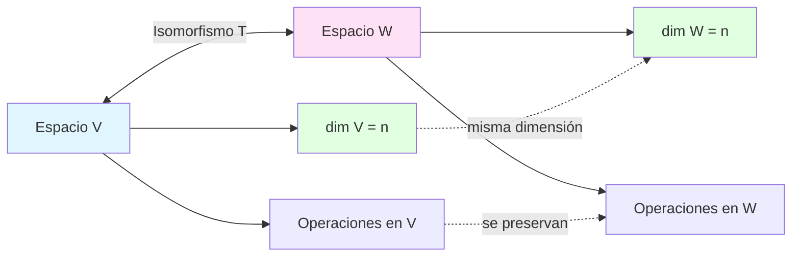
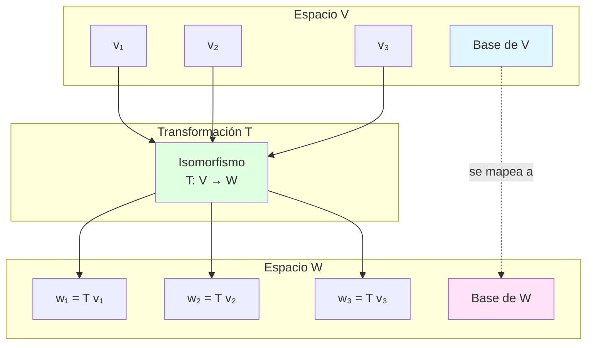
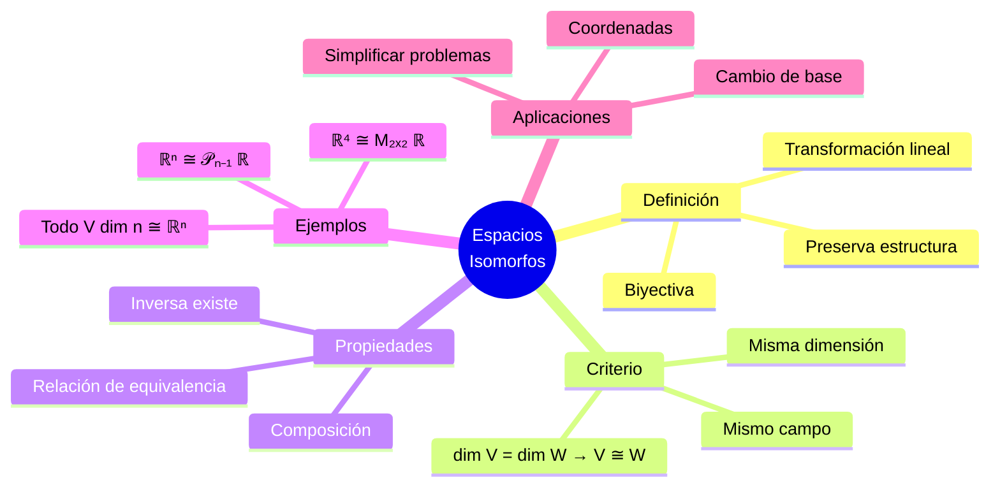
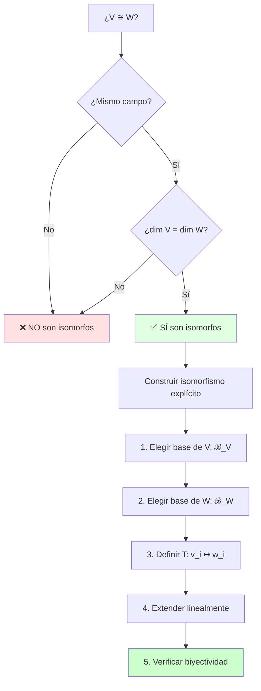

# 🔄 Espacios Isomorfos

## 🎯 Introducción

> [!info]- 💡 ¿Qué es un Isomorfismo?
> 
> Un **isomorfismo** es una transformación lineal especial que establece una correspondencia perfecta entre dos espacios vectoriales, preservando todas sus propiedades algebraicas. Es como tener dos "versiones" del mismo espacio vectorial, escritas en diferentes "idiomas" matemáticos.
> 
> **Analogía práctica:** Imagina dos sistemas de coordenadas diferentes para describir el mismo espacio físico:
> 
> - 📍 **Coordenadas cartesianas** (x, y, z)
> - 📍 **Coordenadas polares** (r, θ, φ)
> 
> Aunque se ven diferentes, describen exactamente el mismo espacio tridimensional. Un isomorfismo es la función que traduce perfectamente entre estos sistemas.
> 
> **Importancia del concepto:**
> 
> |Aspecto|Significado|Implicación Práctica|
> |---|---|---|
> |**Estructura preservada**|Suma y multiplicación escalar se mantienen|Operaciones equivalentes en ambos espacios|
> |**Dimensión igual**|Mismo número de "grados de libertad"|Complejidad idéntica|
> |**Biyección**|Correspondencia uno a uno|No se pierde ni duplica información|
> |**Invertibilidad**|Transformación reversible|Puedo ir y volver sin pérdida|



> [!notes] *Definición formal:*
> 
> 
> Sean $V$ y $W$ espacios vectoriales sobre el mismo campo $\mathbb{F}$. Una transformación lineal $T: V \to W$ es un **isomorfismo** si:
> 
> 1. **T es inyectiva** (uno a uno): $T(\mathbf{v}_1) = T(\mathbf{v}_2) \Rightarrow \mathbf{v}_1 = \mathbf{v}_2$
> 2. **T es sobreyectiva** (sobre): Para todo $\mathbf{w} \in W$, existe $\mathbf{v} \in V$ tal que $T(\mathbf{v}) = \mathbf{w}$
> 
> **Equivalentemente:** $T$ es un isomorfismo si es **biyectiva** y **lineal**.

---

## 📐 Definición Rigurosa y Propiedades

### 🎓 Definición Matemática

> [!example]- 📝 Definición Formal de Isomorfismo
> 
> **Definición:** Sean $V$ y $W$ espacios vectoriales sobre $\mathbb{F}$. Una transformación lineal $T: V \to W$ es un **isomorfismo** si cumple:
> 
> 1. **Linealidad:** $$T(\alpha \mathbf{u} + \beta \mathbf{v}) = \alpha T(\mathbf{u}) + \beta T(\mathbf{v})$$ para todos $\mathbf{u}, \mathbf{v} \in V$ y $\alpha, \beta \in \mathbb{F}$
>     
> 2. **Biyectividad:**
>     
>     - **Inyectiva:** $\text{Ker}(T) = {\mathbf{0}}$
>     - **Sobreyectiva:** $\text{Im}(T) = W$
> 
> **Notación:** Si existe un isomorfismo entre $V$ y $W$, escribimos: $$V \cong W$$ y decimos que "$V$ es isomorfo a $W$" o "$V$ y $W$ son isomorfos".
> 
> **Propiedades equivalentes de un isomorfismo:**
> 
> |Propiedad|Descripción|Verificación|
> |---|---|---|
> |**Núcleo trivial**|$\text{Ker}(T) = {\mathbf{0}}$|Garantiza inyectividad|
> |**Dimensión igual**|$\dim(V) = \dim(W)$|Condición necesaria|
> |**Imagen completa**|$\text{Im}(T) = W$|Garantiza sobreyectividad|
> |**Invertibilidad**|Existe $T^{-1}: W \to V$ lineal|$T^{-1} \circ T = I_V$, $T \circ T^{-1} = I_W$|
> |**Bases en correspondencia**|$T$ mapea bases a bases|Preserva independencia lineal|

**Ejemplo visual:**



### ✅ Criterios para Verificar Isomorfismo

> [!success]- 🔍 ¿Cómo Saber si Dos Espacios son Isomorfos?
> 
> **Teorema fundamental:** Dos espacios vectoriales de dimensión finita sobre el mismo campo son isomorfos **si y solo si** tienen la misma dimensión.
> 
> $$V \cong W \iff \dim(V) = \dim(W)$$
> 
> **Proceso de verificación:**
> 
> ```mermaid
> flowchart TD
>     A[¿V ≅ W?] --> B{¿dim V = dim W?}
>     
>     B -->|No| C[❌ NO son isomorfos<br/>GARANTIZADO]
>     
>     B -->|Sí| D{¿Mismo campo?}
>     D -->|No| C
>     D -->|Sí| E[✅ SÍ son isomorfos<br/>existe isomorfismo]
>     
>     E --> F[Construir T explícitamente]
>     F --> G[Elegir bases]
>     G --> H[Definir T en base]
>     H --> I[Extender linealmente]
>     
>     style C fill:#ffe1e1
>     style E fill:#e1ffe1
>     style B fill:#fff4e1
> ```
> 
> **Checklist para verificar isomorfismo:**
> 
> |#|Criterio|¿Cómo verificar?|Resultado|
> |---|---|---|---|
> |1️⃣|**Mismo campo**|¿Ambos sobre $\mathbb{R}$, $\mathbb{C}$, etc.?|Necesario|
> |2️⃣|**Dimensión finita**|Calcular $\dim(V)$ y $\dim(W)$|Si iguales → continuar|
> |3️⃣|**Dimensiones iguales**|$\dim(V) = \dim(W)$|Si sí → SON isomorfos|
> |4️⃣|**Construir isomorfismo**|Mapear base de $V$ a base de $W$|Verificar linealidad|
> 
> **Ejemplo de verificación:**
> 
> **Pregunta:** ¿Son isomorfos $\mathbb{R}^3$ y $\mathcal{P}_2(\mathbb{R})$ (polinomios de grado ≤ 2)?
> 
> ```
> Paso 1: Verificar mismo campo
>   - Ambos sobre ℝ ✓
> 
> Paso 2: Calcular dimensiones
>   - dim(ℝ³) = 3
>   - dim(𝒫₂(ℝ)) = 3  (base: {1, x, x²})
> 
> Paso 3: Comparar dimensiones
>   - 3 = 3 ✓
> 
> Conclusión: ℝ³ ≅ 𝒫₂(ℝ) ✅
> ```
> 
> **Construcción explícita del isomorfismo:**
> 
> $$T: \mathbb{R}^3 \to \mathcal{P}_2(\mathbb{R})$$ $$T(a, b, c) = a + bx + cx^2$$
> 
> **Verificación de linealidad:**
> 
> $$\begin{align} T(\alpha(a_1, b_1, c_1) + \beta(a_2, b_2, c_2)) &= T((\alpha a_1 + \beta a_2, \alpha b_1 + \beta b_2, \alpha c_1 + \beta c_2)) \ &= (\alpha a_1 + \beta a_2) + (\alpha b_1 + \beta b_2)x + (\alpha c_1 + \beta c_2)x^2 \ &= \alpha(a_1 + b_1x + c_1x^2) + \beta(a_2 + b_2x + c_2x^2) \ &= \alpha T(a_1, b_1, c_1) + \beta T(a_2, b_2, c_2) \quad ✓ \end{align}$$
> 
> **Verificación de inyectividad:**
> 
> $$\begin{align} T(a, b, c) = 0 &\implies a + bx + cx^2 = 0 \ &\implies a = b = c = 0 \ &\implies (a,b,c) = (0,0,0) \end{align}$$
> 
> Por lo tanto, $\text{Ker}(T) = {\mathbf{0}}$ ✓
> 
> **Verificación de sobreyectividad:**
> 
> Para cualquier $p(x) = a + bx + cx^2 \in \mathcal{P}_2(\mathbb{R})$, existe $(a,b,c) \in \mathbb{R}^3$ tal que $T(a,b,c) = p(x)$ ✓

---

## 🔑 Propiedades Fundamentales de los Isomorfismos

### 🎯 Teoremas Principales

> [!tip]- 📐 Propiedades que se Preservan
> 
> Un isomorfismo $T: V \to W$ preserva **todas** las propiedades algebraicas:
> 
> **1. Preservación de la suma:** $$T(\mathbf{u} + \mathbf{v}) = T(\mathbf{u}) + T(\mathbf{v})$$
> 
> **2. Preservación de la multiplicación escalar:** $$T(\alpha \mathbf{v}) = \alpha T(\mathbf{v})$$
> 
> **3. Preservación del vector cero:** $$T(\mathbf{0}_V) = \mathbf{0}_W$$
> 
> **4. Preservación de combinaciones lineales:** $$T\left(\sum_{i=1}^{n} \alpha_i \mathbf{v}_i\right) = \sum_{i=1}^{n} \alpha_i T(\mathbf{v}_i)$$
> 
> **5. Preservación de independencia lineal:**
> 
> Si ${\mathbf{v}_1, \ldots, \mathbf{v}_n}$ es linealmente independiente en $V$, entonces ${T(\mathbf{v}_1), \ldots, T(\mathbf{v}_n)}$ es linealmente independiente en $W$.
> 
> **Demostración:**
> 
> Supongamos: $$\alpha_1 T(\mathbf{v}_1) + \cdots + \alpha_n T(\mathbf{v}_n) = \mathbf{0}_W$$
> 
> Por linealidad: $$T(\alpha_1 \mathbf{v}_1 + \cdots + \alpha_n \mathbf{v}_n) = \mathbf{0}_W$$
> 
> Como $T$ es inyectiva, $\text{Ker}(T) = {\mathbf{0}_V}$: $$\alpha_1 \mathbf{v}_1 + \cdots + \alpha_n \mathbf{v}_n = \mathbf{0}_V$$
> 
> Como ${\mathbf{v}_1, \ldots, \mathbf{v}_n}$ es L.I.: $$\alpha_1 = \alpha_2 = \cdots = \alpha_n = 0 \quad ✓$$
> 
> **6. Preservación de bases:**
> 
> Si $\mathcal{B} = {\mathbf{v}_1, \ldots, \mathbf{v}_n}$ es base de $V$, entonces $T(\mathcal{B}) = {T(\mathbf{v}_1), \ldots, T(\mathbf{v}_n)}$ es base de $W$.
> 
> **7. Preservación de subespacios:**
> 
> Si $U \subseteq V$ es subespacio, entonces $T(U) = {T(\mathbf{u}) : \mathbf{u} \in U}$ es subespacio de $W$.
> 
> **8. Preservación de dimensión:** $$\dim(V) = \dim(W)$$
> 
> **Tabla resumen:**
> 
> |Propiedad en V|Se preserva|Propiedad en W|
> |---|---|---|
> |Vector cero|✅|Vector cero|
> |Suma de vectores|✅|Suma de vectores|
> |Multiplicación escalar|✅|Multiplicación escalar|
> |Independencia lineal|✅|Independencia lineal|
> |Dependencia lineal|✅|Dependencia lineal|
> |Base|✅|Base|
> |Subespacio|✅|Subespacio|
> |Dimensión|✅|Dimensión|

### 🔄 Composición e Inversión

> [!note]- 🔗 Operaciones con Isomorfismos
> 
> **Teorema 1: Inversa de un isomorfismo**
> 
> Si $T: V \to W$ es un isomorfismo, entonces existe $T^{-1}: W \to V$ que también es un isomorfismo.
> 
> **Propiedades de la inversa:**
> 
> 1. $T^{-1}$ es lineal
> 2. $T^{-1} \circ T = I_V$ (identidad en $V$)
> 3. $T \circ T^{-1} = I_W$ (identidad en $W$)
> 4. $(T^{-1})^{-1} = T$
> 
> ```mermaid
> graph LR
>     A[V] -->|T| B[W]
>     B -->|T⁻¹| A
>     
>     A -.->|T⁻¹ ∘ T = I_V| A
>     B -.->|T ∘ T⁻¹ = I_W| B
>     
>     style A fill:#e1f5ff
>     style B fill:#ffe1f5
> ```
> 
> **Teorema 2: Composición de isomorfismos**
> 
> Si $T: U \to V$ y $S: V \to W$ son isomorfismos, entonces $S \circ T: U \to W$ es un isomorfismo.
> 
> ```mermaid
> graph LR
>     A[U] -->|T| B[V]
>     B -->|S| C[W]
>     A -.->|S ∘ T| C
>     
>     style A fill:#e1ffe1
>     style B fill:#e1f5ff
>     style C fill:#ffe1f5
> ```
> 
> **Demostración:**
> 
> 1. **Linealidad:** Si $T$ y $S$ son lineales, entonces $S \circ T$ es lineal.
>     
> 2. **Inyectividad:** $$\begin{align} (S \circ T)(\mathbf{u}_1) = (S \circ T)(\mathbf{u}_2) &\implies S(T(\mathbf{u}_1)) = S(T(\mathbf{u}_2)) \ &\implies T(\mathbf{u}_1) = T(\mathbf{u}_2) \quad \text{(S inyectiva)} \ &\implies \mathbf{u}_1 = \mathbf{u}_2 \quad \text{(T inyectiva)} \end{align}$$
>     
> 3. **Sobreyectividad:** Para todo $\mathbf{w} \in W$:
>     
>     - Existe $\mathbf{v} \in V$ tal que $S(\mathbf{v}) = \mathbf{w}$ (S sobreyectiva)
>     - Existe $\mathbf{u} \in U$ tal que $T(\mathbf{u}) = \mathbf{v}$ (T sobreyectiva)
>     - Por lo tanto, $(S \circ T)(\mathbf{u}) = S(T(\mathbf{u})) = S(\mathbf{v}) = \mathbf{w}$ ✓
> 
> **Teorema 3: Relación de equivalencia**
> 
> La relación "ser isomorfo a" ($\cong$) es una relación de equivalencia:
> 
> |Propiedad|Significado|Demostración|
> |---|---|---|
> |**Reflexiva**|$V \cong V$|$I_V: V \to V$ es isomorfismo|
> |**Simétrica**|$V \cong W \implies W \cong V$|Si $T: V \to W$ es iso, entonces $T^{-1}: W \to V$ es iso|
> |**Transitiva**|$U \cong V$ y $V \cong W \implies U \cong W$|Composición de isomorfismos|

---

## 📚 Ejemplos Clásicos de Espacios Isomorfos

### 🎨 Isomorfismo entre $\mathbb{R}^n$ y otros espacios

> [!example]- 🔢 Ejemplo 1: $\mathbb{R}^3 \cong \mathcal{P}_2(\mathbb{R})$
> 
> **Espacios:**
> 
> - $V = \mathbb{R}^3$ con base canónica ${(1,0,0), (0,1,0), (0,0,1)}$
> - $W = \mathcal{P}_2(\mathbb{R}) = {a + bx + cx^2 : a,b,c \in \mathbb{R}}$ con base ${1, x, x^2}$
> 
> **Verificación de dimensiones:** $$\dim(\mathbb{R}^3) = 3 = \dim(\mathcal{P}_2(\mathbb{R}))$$
> 
> **Construcción del isomorfismo:**
> 
> $$T: \mathbb{R}^3 \to \mathcal{P}_2(\mathbb{R})$$ $$T(a, b, c) = a + bx + cx^2$$
> 
> **Verificación paso a paso:**
> 
> **1. Linealidad:**
> 
> Sean $\mathbf{v}_1 = (a_1, b_1, c_1)$ y $\mathbf{v}_2 = (a_2, b_2, c_2)$, y $\alpha, \beta \in \mathbb{R}$:
> 
> $$\begin{align} T(\alpha \mathbf{v}_1 + \beta \mathbf{v}_2) &= T((\alpha a_1 + \beta a_2, \alpha b_1 + \beta b_2, \alpha c_1 + \beta c_2)) \ &= (\alpha a_1 + \beta a_2) + (\alpha b_1 + \beta b_2)x + (\alpha c_1 + \beta c_2)x^2 \ &= \alpha(a_1 + b_1x + c_1x^2) + \beta(a_2 + b_2x + c_2x^2) \ &= \alpha T(\mathbf{v}_1) + \beta T(\mathbf{v}_2) \quad ✓ \end{align}$$
> 
> **2. Inyectividad (Ker(T) = {0}):**
> 
> $$\begin{align} T(a,b,c) = 0 &\implies a + bx + cx^2 = 0 \cdot 1 + 0 \cdot x + 0 \cdot x^2 \ &\implies a = 0, , b = 0, , c = 0 \quad \text{(por unicidad de coeficientes)} \ &\implies (a,b,c) = (0,0,0) \end{align}$$
> 
> **3. Sobreyectividad:**
> 
> Para cualquier $p(x) = a + bx + cx^2 \in \mathcal{P}_2(\mathbb{R})$: $$\exists (a,b,c) \in \mathbb{R}^3 : T(a,b,c) = p(x) \quad ✓$$
> 
> **Isomorfismo inverso:**
> 
> $$T^{-1}: \mathcal{P}_2(\mathbb{R}) \to \mathbb{R}^3$$ $$T^{-1}(a + bx + cx^2) = (a, b, c)$$
> 
> **Ejemplo numérico:**
> 
> $$T(2, -3, 5) = 2 - 3x + 5x^2$$ $$T^{-1}(1 + 4x - 2x^2) = (1, 4, -2)$$
> 
> ```mermaid
> graph LR
>     A["(2, -3, 5)<br/>∈ ℝ³"] -->|T| B["2 - 3x + 5x²<br/>∈ 𝒫₂ ℝ"]
>     B -->|T⁻¹| A
>     
>     C["(a, b, c)"] -->|T| D["a + bx + cx²"]
>     D -->|T⁻¹| C
>     
>     style A fill:#e1f5ff
>     style B fill:#ffe1f5
> ```

> [!example]- 🔢 Ejemplo 2: $\mathbb{R}^4 \cong M_{2 \times 2}(\mathbb{R})$
> 
> **Espacios:**
> 
> - $V = \mathbb{R}^4$
> - $W = M_{2 \times 2}(\mathbb{R})$ (matrices 2×2 con entradas reales)
> 
> **Bases:**
> 
> - Base de $\mathbb{R}^4$: ${(1,0,0,0), (0,1,0,0), (0,0,1,0), (0,0,0,1)}$
> - Base de $M_{2 \times 2}(\mathbb{R})$: $$\left{\begin{pmatrix} 1 & 0 \ 0 & 0 \end{pmatrix}, \begin{pmatrix} 0 & 1 \ 0 & 0 \end{pmatrix}, \begin{pmatrix} 0 & 0 \ 1 & 0 \end{pmatrix}, \begin{pmatrix} 0 & 0 \ 0 & 1 \end{pmatrix}\right}$$
> 
> **Dimensiones:** $$\dim(\mathbb{R}^4) = 4 = \dim(M_{2 \times 2}(\mathbb{R}))$$
> 
> **Isomorfismo natural:**
> 
> $$T: \mathbb{R}^4 \to M_{2 \times 2}(\mathbb{R})$$ $$T(a, b, c, d) = \begin{pmatrix} a & b \ c & d \end{pmatrix}$$
> 
> **Ejemplo:**
> 
> $$T(1, 2, 3, 4) = \begin{pmatrix} 1 & 2 \ 3 & 4 \end{pmatrix}$$
> 
> $$T^{-1}\begin{pmatrix} 5 & -1 \ 0 & 3 \end{pmatrix} = (5, -1, 0, 3)$$
> 
> **Verificación de linealidad:**
> 
> $$\begin{align} T(\alpha(a_1, b_1, c_1, d_1) + \beta(a_2, b_2, c_2, d_2)) &= T((\alpha a_1 + \beta a_2, \ldots)) \ &= \begin{pmatrix} \alpha a_1 + \beta a_2 & \alpha b_1 + \beta b_2 \ \alpha c_1 + \beta c_2 & \alpha d_1 + \beta d_2 \end{pmatrix} \ &= \alpha \begin{pmatrix} a_1 & b_1 \ c_1 & d_1 \end{pmatrix} + \beta \begin{pmatrix} a_2 & b_2 \ c_2 & d_2 \end{pmatrix} \ &= \alpha T(a_1, b_1, c_1, d_1) + \beta T(a_2, b_2, c_2, d_2) \quad ✓ \end{align}$$

> [!example]- 🔢 Ejemplo 3: $\mathcal{P}_n(\mathbb{R}) \cong \mathbb{R}^{n+1}$
> 
> **Espacios:**
> 
> - $V = \mathcal{P}_n(\mathbb{R})$ (polinomios de grado ≤ n)
> - $W = \mathbb{R}^{n+1}$
> 
> **Dimensiones:** $$\dim(\mathcal{P}_n(\mathbb{R})) = n + 1 = \dim(\mathbb{R}^{n+1})$$
> 
> **Isomorfismo de coordenadas:**
> 
> $$T: \mathcal{P}_n(\mathbb{R}) \to \mathbb{R}^{n+1}$$ $$T(a_0 + a_1x + a_2x^2 + \cdots + a_nx^n) = (a_0, a_1, a_2, \ldots, a_n)$$
> 
> **Ejemplos específicos:**
> 
> Para $n = 3$: $$T(2 - 3x + 5x^2 + x^3) = (2, -3, 5, 1)$$ $$T^{-1}(1, 0, -2, 4) = 1 - 2x^2 + 4x^3$$
> 
> **Interpretación:**
> 
> Este isomorfismo muestra que trabajar con polinomios de grado ≤ n es equivalente a trabajar con vectores en $\mathbb{R}^{n+1}$.
> 
> ```mermaid
> graph TD
>     A[Polinomio<br/>p x = a₀ + a₁x + ... + aₙxⁿ] -->|T| B[Vector<br/> a₀, a₁, ..., aₙ ]
>     
>     C[Operaciones<br/>en polinomios] -.->|equivalen| D[Operaciones<br/>en ℝⁿ⁺¹]
>     
>     A --> C
>     B --> D
>     
>     style A fill:#ffe1f5
>     style B fill:#e1f5ff
>     style C fill:#fff4e1
>     style D fill:#e1ffe1
> ```

---

## 🎭 Isomorfismo Canónico: Coordenadas

### 📊 Representación mediante Coordenadas

> [!tip]- 🗺️ El Isomorfismo de Coordenadas
> 
> **Teorema fundamental:** Todo espacio vectorial $V$ de dimensión $n$ es isomorfo a $\mathbb{R}^n$.
> 
> **Construcción:**
> 
> Sea $\mathcal{B} = {\mathbf{v}_1, \mathbf{v}_2, \ldots, \mathbf{v}_n}$ una base de $V$.
> 
> El **isomorfismo de coordenadas** es:
> 
> $$[\cdot]_{\mathcal{B}}: V \to \mathbb{R}^n$$
> Dado $\mathbf{v} \in V$ con representación única: $$\mathbf{v} = c_1\mathbf{v}_1 + c_2\mathbf{v}_2 + \cdots + c_n\mathbf{v}_n$$
> 
> Se define: $$[\mathbf{v}]_{\mathcal{B}} = \begin{pmatrix} c_1 \ c_2 \ \vdots \ c_n \end{pmatrix}$$
> 
> **Este vector se llama el vector de coordenadas de $\mathbf{v}$ respecto a la base $\mathcal{B}$.**
> 
> **Propiedades:**
> 
> 1. Es lineal: $[\alpha \mathbf{u} + \beta \mathbf{v}]_{\mathcal{B}} = \alpha[\mathbf{u}]_{\mathcal{B}} + \beta[\mathbf{v}]_{\mathcal{B}}$
>     
> 2. Es inyectiva: $[\mathbf{v}]_{\mathcal{B}} = \mathbf{0} \iff \mathbf{v} = \mathbf{0}$
>     
> 3. Es sobreyectiva: Para todo $(c_1, \ldots, c_n) \in \mathbb{R}^n$, existe $\mathbf{v} = \sum c_i\mathbf{v}_i$
>     
> 4. La inversa es: $[\cdot]_{\mathcal{B}}^{-1}(c_1, \ldots, c_n) = c_1\mathbf{v}_1 + \cdots + c_n\mathbf{v}_n$
>     
> 
> **Diagrama conceptual:**
> 
> ```mermaid
> graph TB
>     A[Espacio Abstracto V<br/>dim V = n] -->|isomorfismo de coordenadas| B[ℝⁿ<br/>espacio concreto]
>     
>     C[Vector v ∈ V] -->|v _ℬ| D[Vector de coordenadas<br/> c₁, c₂, ..., cₙ ]
>     
>     E[Operaciones en V<br/>abstractas] -.->|se traducen a| F[Operaciones en ℝⁿ<br/>concretas]
>     
>     A --> C
>     B --> D
>     A --> E
>     B --> F
>     
>     style A fill:#ffe1f5
>     style B fill:#e1f5ff
>     style E fill:#fff4e1
>     style F fill:#e1ffe1
> ```

> [!example]- 📐 Ejemplo: Coordenadas en $\mathcal{P}_2(\mathbb{R})$
> 
> **Espacio:** $V = \mathcal{P}_2(\mathbb{R})$
> 
> **Base estándar:** $\mathcal{B} = {1, x, x^2}$
> 
> **Isomorfismo de coordenadas:**
> 
> $$[\cdot]_{\mathcal{B}}: \mathcal{P}_2(\mathbb{R}) \to \mathbb{R}^3$$
> 
> **Ejemplos:**
> 
> 1. $p(x) = 3 + 2x - 5x^2 = 3 \cdot 1 + 2 \cdot x + (-5) \cdot x^2$ $$[p]_{\mathcal{B}} = \begin{pmatrix} 3 \ 2 \ -5 \end{pmatrix}$$
>     
> 2. $q(x) = 7 - 4x = 7 \cdot 1 + (-4) \cdot x + 0 \cdot x^2$ $$[q]_{\mathcal{B}} = \begin{pmatrix} 7 \ -4 \ 0 \end{pmatrix}$$
>     
> 
> **Operaciones preservadas:**
> 
> Si $p(x) = 3 + 2x - 5x^2$ y $q(x) = 1 + x + x^2$:
> 
> $$\begin{align} p(x) + q(x) &= 4 + 3x - 4x^2 \ [p + q]_{\mathcal{B}} &= \begin{pmatrix} 4 \ 3 \ -4 \end{pmatrix} = \begin{pmatrix} 3 \ 2 \ -5 \end{pmatrix} + \begin{pmatrix} 1 \ 1 \ 1 \end{pmatrix} = [p]_{\mathcal{B}} + [q]_{\mathcal{B}} \quad ✓ \end{align}$$
> 
> **Base diferente:** $\mathcal{C} = {1, 1+x, 1+x+x^2}$
> 
> Para el mismo $p(x) = 3 + 2x - 5x^2$:
> 
> Necesitamos expresar: $p(x) = a \cdot 1 + b \cdot (1+x) + c \cdot (1+x+x^2)$
> 
> $$\begin{align} p(x) &= a + b(1+x) + c(1+x+x^2) \ &= (a + b + c) + (b + c)x + cx^2 \ 3 + 2x - 5x^2 &= (a + b + c) + (b + c)x + cx^2 \end{align}$$
> 
> Sistema: $$\begin{cases} a + b + c = 3 \ b + c = 2 \ c = -5 \end{cases}$$
> 
> Solución: $c = -5$, $b = 7$, $a = 1$
> 
> $$[p]_{\mathcal{C}} = \begin{pmatrix} 1 \ 7 \ -5 \end{pmatrix}$$
> 
> **Observación:** El mismo polinomio tiene diferentes coordenadas en diferentes bases.

---

## 🔄 Cambio de Base e Isomorfismo

### 🎯 Matriz de Cambio de Base

> [!note]- 🔀 Relación entre Bases y Coordenadas
> 
> Sean $\mathcal{B}$ y $\mathcal{C}$ dos bases del espacio $V$.
> 
> **Pregunta:** Si conocemos $[\mathbf{v}]_{\mathcal{B}}$, ¿cómo encontrar $[\mathbf{v}]_{\mathcal{C}}$?
> 
> **Respuesta:** Mediante la **matriz de cambio de base** $P_{\mathcal{C} \leftarrow \mathcal{B}}$
> 
> $$[\mathbf{v}]_{\mathcal{C}} = P_{\mathcal{C} \leftarrow \mathcal{B}} , [\mathbf{v}]_{\mathcal{B}}$$
> 
> **Construcción de la matriz:**
> 
> Si $\mathcal{B} = {\mathbf{b}_1, \ldots, \mathbf{b}_n}$ y $\mathcal{C} = {\mathbf{c}_1, \ldots, \mathbf{c}_n}$:
> 
> $$P_{\mathcal{C} \leftarrow \mathcal{B}} = \begin{pmatrix} [\mathbf{b}_1]_{\mathcal{C}} & [\mathbf{b}_2]_{\mathcal{C}} & \cdots & [\mathbf{b}_n]_{\mathcal{C}} \end{pmatrix}$$
> 
> Es decir, la columna $i$ de $P$ son las coordenadas de $\mathbf{b}_i$ en la base $\mathcal{C}$.
> 
> **Diagrama:**
> 
> ```mermaid
> graph LR
>     A["[v]_ℬ<br/>coordenadas en base ℬ"] -->|P_𝒞←ℬ| B["[v]_𝒞<br/>coordenadas en base 𝒞"]
>     B -->|P_ℬ←𝒞| A
>     
>     C["P_ℬ←𝒞 = P_𝒞←ℬ⁻¹"]
>     
>     style A fill:#e1f5ff
>     style B fill:#ffe1f5
>     style C fill:#fff4e1
> ```
> 
> **Propiedades:**
> 
> 1. $P_{\mathcal{C} \leftarrow \mathcal{B}}$ es invertible
> 2. $(P_{\mathcal{C} \leftarrow \mathcal{B}})^{-1} = P_{\mathcal{B} \leftarrow \mathcal{C}}$
> 3. $P_{\mathcal{B} \leftarrow \mathcal{B}} = I_n$ (identidad)
> 4. $P_{\mathcal{A} \leftarrow \mathcal{C}} = P_{\mathcal{A} \leftarrow \mathcal{B}} \cdot P_{\mathcal{B} \leftarrow \mathcal{C}}$ (transitividad)

> [!example]- 🎯 Ejemplo Completo: Cambio de Base en $\mathbb{R}^2$
> 
> **Bases:**
> 
> - $\mathcal{B} = \left{\mathbf{b}_1 = \begin{pmatrix} 1 \ 0 \end{pmatrix}, \mathbf{b}_2 = \begin{pmatrix} 0 \ 1 \end{pmatrix}\right}$ (base canónica)
>     
> - $\mathcal{C} = \left{\mathbf{c}_1 = \begin{pmatrix} 1 \ 1 \end{pmatrix}, \mathbf{c}_2 = \begin{pmatrix} 1 \ -1 \end{pmatrix}\right}$
>     
> 
> **Paso 1: Construir $P_{\mathcal{C} \leftarrow \mathcal{B}}$**
> 
> Necesitamos expresar $\mathbf{b}_1$ y $\mathbf{b}_2$ en la base $\mathcal{C}$:
> 
> Para $\mathbf{b}_1 = \begin{pmatrix} 1 \ 0 \end{pmatrix}$: $$\begin{pmatrix} 1 \ 0 \end{pmatrix} = \alpha \begin{pmatrix} 1 \ 1 \end{pmatrix} + \beta \begin{pmatrix} 1 \ -1 \end{pmatrix}$$
> 
> Sistema: $\alpha + \beta = 1$, $\alpha - \beta = 0$ → $\alpha = \frac{1}{2}$, $\beta = \frac{1}{2}$
> 
> $$[\mathbf{b}_1]_{\mathcal{C}} = \begin{pmatrix} 1/2 \ 1/2 \end{pmatrix}$$
> 
> Para $\mathbf{b}_2 = \begin{pmatrix} 0 \ 1 \end{pmatrix}$: $$\begin{pmatrix} 0 \ 1 \end{pmatrix} = \alpha \begin{pmatrix} 1 \ 1 \end{pmatrix} + \beta \begin{pmatrix} 1 \ -1 \end{pmatrix}$$
> 
> Sistema: $\alpha + \beta = 0$, $\alpha - \beta = 1$ → $\alpha = \frac{1}{2}$, $\beta = -\frac{1}{2}$
> 
> $$[\mathbf{b}_2]_{\mathcal{C}} = \begin{pmatrix} 1/2 \ -1/2 \end{pmatrix}$$
> 
> **Matriz de cambio de base:** $$P_{\mathcal{C} \leftarrow \mathcal{B}} = \begin{pmatrix} 1/2 & 1/2 \ 1/2 & -1/2 \end{pmatrix}$$
> 
> **Paso 2: Usar la matriz**
> 
> Sea $\mathbf{v} = \begin{pmatrix} 3 \ 2 \end{pmatrix}$ en la base canónica: $[\mathbf{v}]_{\mathcal{B}} = \begin{pmatrix} 3 \ 2 \end{pmatrix}$
> 
> Coordenadas en $\mathcal{C}$: $$[\mathbf{v}]_{\mathcal{C}} = P_{\mathcal{C} \leftarrow \mathcal{B}} , [\mathbf{v}]_{\mathcal{B}} = \begin{pmatrix} 1/2 & 1/2 \ 1/2 & -1/2 \end{pmatrix} \begin{pmatrix} 3 \ 2 \end{pmatrix} = \begin{pmatrix} 5/2 \ 1/2 \end{pmatrix}$$
> 
> **Verificación:** $$\frac{5}{2} \begin{pmatrix} 1 \ 1 \end{pmatrix} + \frac{1}{2} \begin{pmatrix} 1 \ -1 \end{pmatrix} = \begin{pmatrix} 5/2 + 1/2 \ 5/2 - 1/2 \end{pmatrix} = \begin{pmatrix} 3 \ 2 \end{pmatrix} \quad ✓$$

---

## 🎓 Aplicaciones Prácticas

### 💻 Simplificación de Problemas

> [!success]- 🛠️ Uso de Isomorfismos para Resolver Problemas
> 
> **Estrategia general:**
> 
> 1. Identificar espacio abstracto difícil de trabajar
> 2. Encontrar isomorfismo con espacio concreto ($\mathbb{R}^n$)
> 3. Resolver problema en espacio concreto
> 4. Traducir solución al espacio original
> 
> ```mermaid
> flowchart LR
>     A[Problema en<br/>espacio abstracto V] -->|isomorfismo T| B[Problema en ℝⁿ]
>     B -->|resolver| C[Solución en ℝⁿ]
>     C -->|T⁻¹| D[Solución en V]
>     
>     style A fill:#ffe1e1
>     style B fill:#e1f5ff
>     style C fill:#e1ffe1
>     style D fill:#ccffcc
> ```
> 
> **Ejemplo: Encontrar base ortogonal en $\mathcal{P}_2(\mathbb{R})$**
> 
> **Problema:** Aplicar Gram-Schmidt a ${1, x, x^2}$ con producto interno: $$\langle p, q \rangle = \int_{-1}^{1} p(x)q(x) , dx$$
> 
> **Solución mediante isomorfismo:**
> 
> 1. **Mapear a $\mathbb{R}^3$:** $$T: \mathcal{P}_2(\mathbb{R}) \to \mathbb{R}^3$$ $$T(a + bx + cx^2) = (a, b, c)$$
>     
> 2. **Trabajar en $\mathbb{R}^3$** con producto interno estándar
>     
> 3. **Aplicar Gram-Schmidt** en $\mathbb{R}^3$
>     
> 4. **Mapear de vuelta** con $T^{-1}$
>     
> 
> Este enfoque es conceptualmente más claro que trabajar directamente con integrales.

### 🎨 Cambio de Perspectiva

> [!tip]- 👓 Diferentes Visiones del Mismo Espacio
> 
> Los isomorfismos permiten ver el mismo espacio vectorial desde múltiples perspectivas:
> 
> **Ejemplo: El espacio de transformaciones lineales**
> 
> $$\mathcal{L}(\mathbb{R}^2, \mathbb{R}^2) \cong M_{2 \times 2}(\mathbb{R})$$
> 
> **Perspectiva 1:** Transformaciones lineales (funciones)
> 
> **Perspectiva 2:** Matrices 2×2 (arreglos numéricos)
> 
> ```mermaid
> graph TD
>     A[Mismo Objeto Matemático]
>     
>     B[Transformación Lineal<br/>T: ℝ² → ℝ²]
>     C[Matriz<br/>A ∈ M₂ₓ₂ ℝ ]
>     
>     A --> B
>     A --> C
>     
>     B <-.->|isomorfismo| C
>     
>     style A fill:#e1ffe1
>     style B fill:#e1f5ff
>     style C fill:#ffe1f5
> ```
> 
> **Ventajas:**
> 
> - **Funcional:** Pensar en transformaciones es intuitivo para geometría
> - **Matricial:** Cálculos concretos son más fáciles con matrices
> - **Flexibilidad:** Elegir la perspectiva más conveniente para cada problema

---

## 📊 Resumen Visual Completo

### Mapa Conceptual



### Tabla Resumen

> [!success]- 📋 Referencia Rápida
> 
> **Definición y criterios:**
> 
> |Concepto|Descripción|Condición|
> |---|---|---|
> |**Isomorfismo**|T lineal, inyectiva y sobreyectiva|Ker(T) = {0}, Im(T) = W|
> |**Espacios isomorfos**|Existe isomorfismo entre ellos|V ≅ W|
> |**Criterio dimensional**|Mismo campo, misma dimensión|dim(V) = dim(W)|
> 
> **Propiedades preservadas:**
> 
> |En V|Isomorfismo|En W|
> |---|---|---|
> |Vector cero|T(0_V) =|0_W|
> |Suma|T(u + v) =|T(u) + T(v)|
> |Producto escalar|T(αv) =|αT(v)|
> |Independencia lineal|{v₁, ..., vₙ} L.I. →|{T(v₁), ..., T(vₙ)} L.I.|
> |Base|{v₁, ..., vₙ} base →|{T(v₁), ..., T(vₙ)} base|
> 
> **Isomorfismos clásicos:**
> 
> |Espacio 1|Espacio 2|Isomorfismo|
> |---|---|---|
> |ℝⁿ|𝒫ₙ₋₁(ℝ)|T(a₀, ..., aₙ₋₁) = Σ aᵢxⁱ|
> |ℝ⁴|M₂ₓ₂(ℝ)|T(a,b,c,d) = [a b; c d]|
> |V (dim n)|ℝⁿ|[·]_ℬ (coordenadas)|

### Diagrama de Flujo: ¿Son Isomorfos?



---

## 🎯 Ejercicios Propuestos

> [!example]- 💪 Problemas para Practicar
> 
> **Nivel Básico:**
> 
> **1.** Verificar que $\mathbb{R}^2 \cong \mathcal{P}_1(\mathbb{R})$ construyendo un isomorfismo explícito.
> 
> **2.** Determinar si $\mathbb{R}^3$ y $M_{2 \times 2}(\mathbb{R})$ son isomorfos. Justificar.
> 
> **3.** Sea $T: \mathbb{R}^2 \to \mathcal{P}_1(\mathbb{R})$ definida por $T(a,b) = (a-b) + (a+b)x$.
> 
> - Verificar que $T$ es lineal
> - Encontrar $\text{Ker}(T)$ e $\text{Im}(T)$
> - ¿Es $T$ un isomorfismo?
> 
> **Nivel Intermedio:**
> 
> **4.** Considere las bases de $\mathbb{R}^2$: $$\mathcal{B} = \left{\begin{pmatrix} 1 \ 0 \end{pmatrix}, \begin{pmatrix} 0 \ 1 \end{pmatrix}\right}, \quad \mathcal{C} = \left{\begin{pmatrix} 2 \ 1 \end{pmatrix}, \begin{pmatrix} 1 \ 1 \end{pmatrix}\right}$$
> 
> a) Encontrar la matriz de cambio de base $P_{\mathcal{C} \leftarrow \mathcal{B}}$
> 
> b) Si $[\mathbf{v}]_{\mathcal{B}} = \begin{pmatrix} 3 \ -2 \end{pmatrix}$, hallar $[\mathbf{v}]_{\mathcal{C}}$
> 
> **5.** Sea $V = {p \in \mathcal{P}_3(\mathbb{R}) : p(0) = 0}$.
> 
> - Demostrar que $V$ es subespacio de $\mathcal{P}_3(\mathbb{R})$
> - Encontrar $\dim(V)$
> - ¿A qué $\mathbb{R}^n$ es isomorfo $V$?
> 
> **Nivel Avanzado:**
> 
> **6.** Sean $V = {A \in M_{2 \times 2}(\mathbb{R}) : A^T = A}$ (matrices simétricas)
> 
> a) Probar que $V$ es subespacio vectorial
> 
> b) Encontrar una base de $V$ y $\dim(V)$
> 
> c) Construir un isomorfismo explícito $T: V \to \mathbb{R}^3$
> 
> **7.** Demostrar que si $T: V \to W$ y $S: W \to U$ son isomorfismos, entonces $S \circ T: V \to U$ es un isomorfismo.
> 
> **8.** Sea $V$ un espacio vectorial de dimensión $n$ y sean $\mathcal{B}$ y $\mathcal{C}$ dos bases de $V$.
> 
> a) Probar que la matriz de cambio de base $P_{\mathcal{C} \leftarrow \mathcal{B}}$ es invertible
> 
> b) Demostrar que $(P_{\mathcal{C} \leftarrow \mathcal{B}})^{-1} = P_{\mathcal{B} \leftarrow \mathcal{C}}$

---

## 🔗 Conexión con Próximos Temas

> [!quote]- 🌟 Continuando el Aprendizaje
> 
> **Has dominado:**
> 
> - Concepto de isomorfismo
> - Criterio dimensional
> - Isomorfismo de coordenadas
> - Cambio de base
> - Preservación de propiedades
> 
> **Progresión natural:**
> 
> |Tema Actual|Próximo Tema|Conexión|
> |---|---|---|
> |**Espacios Isomorfos**|Transformaciones Lineales Generales|Isomorfismos son casos especiales|
> |**Cambio de Base**|Diagonalización|Encontrar base donde matriz es diagonal|
> |**Coordenadas**|Representación Matricial|Usar coordenadas para representar T.L.|
> |**Dimensión**|Teorema de Rango-Nulidad|Relaciona dimensiones de núcleo e imagen|
> 
> **Roadmap:**
> 
> ```mermaid
> graph LR
>     A[Espacios Isomorfos] --> B[Transformaciones<br/>Lineales]
>     B --> C[Valores y Vectores<br/>Propios]
>     C --> D[Diagonalización]
>     D --> E[Formas Canónicas]
>     
>     A --> F[Cambio de Base]
>     F --> C
>     
>     style A fill:#e1ffe1
>     style B fill:#fff4e1
>     style C fill:#e1f5ff
>     style D fill:#ffe1f5
> ```

---

**Tags:** #álgebra-lineal #espacios-vectoriales #isomorfismo #transformaciones-lineales #cambio-de-base #coordenadas #dimensión #biyección