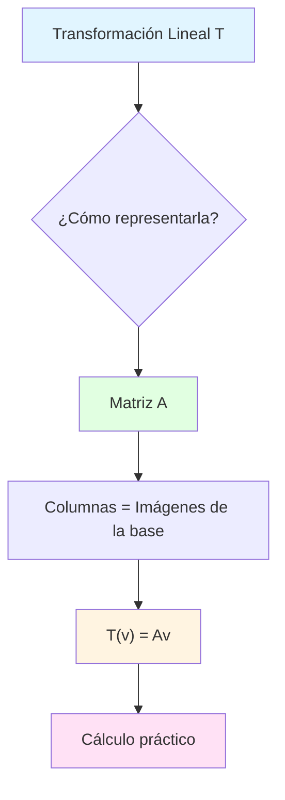
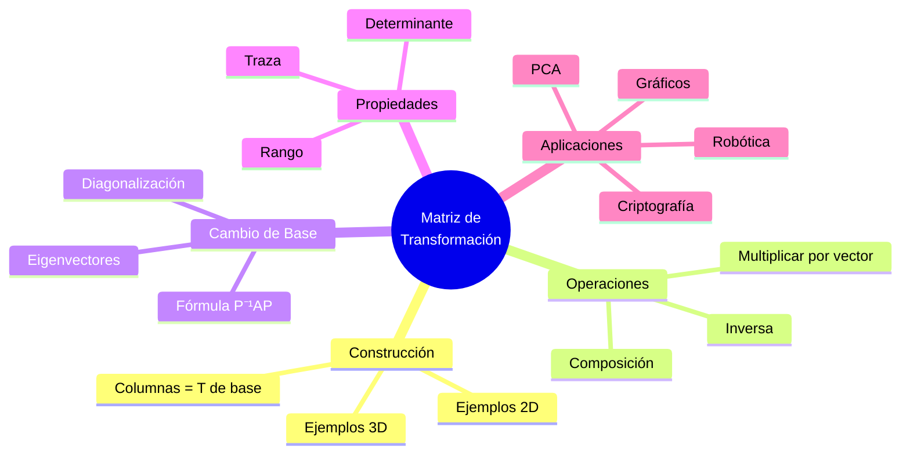
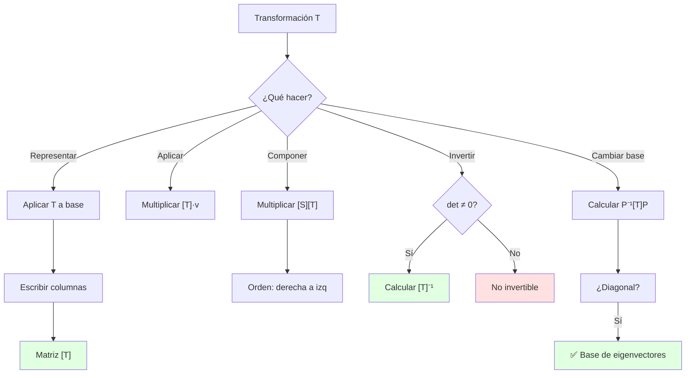

# 🔄 Matriz de una Transformación Lineal

## 🎯 Introducción

> [!info]- 💡 ¿Qué es una Matriz de Transformación? Una **matriz de transformación lineal** es una representación numérica compacta de cómo una transformación lineal afecta a los vectores en el espacio. Es el "código genético" que describe completamente el comportamiento de la transformación.
> 
> **Analogía práctica:** Imagina un filtro fotográfico que modifica imágenes. La matriz de transformación es como la "receta" del filtro:
> 
> - **Define las reglas:** Cómo se transforman los colores (vectores)
> - **Es reproducible:** Aplica el mismo efecto consistentemente
> - **Es componible:** Puedes combinar varios filtros (multiplicar matrices)
> - **Es reversible:** Algunos filtros pueden deshacerse (matrices invertibles)
> 
> **¿Por qué son fundamentales?**
> 
> |Aspecto|Descripción|Ejemplo de Uso|
> |---|---|---|
> |**Representación compacta**|Toda la transformación en una tabla de números|Rotaciones, escalamientos|
> |**Cálculo eficiente**|Multiplicación matriz-vector|Gráficos por computadora|
> |**Composición**|Combinar transformaciones|Animaciones 3D|
> |**Análisis**|Estudiar propiedades (eigenvalores, determinante)|Estabilidad de sistemas|
> |**Inversión**|Deshacer transformaciones|Criptografía, compresión|



---

## 📐 Construcción de la Matriz

### 🏗️ Proceso de Construcción

> [!example]- 🔨 ¿Cómo se construye una matriz de transformación?
> 
> El proceso se basa en un principio fundamental: **las columnas de la matriz son las imágenes de los vectores de la base**.
> 
> **Proceso paso a paso:**
> 
> ```mermaid
> flowchart LR
>     A[Base estándar<br/>e₁, e₂, ..., eₙ] --> B[Aplicar T]
>     B --> C["T(e₁), T(e₂), ..., T(eₙ)"]
>     C --> D[Escribir como columnas]
>     D --> E["Matriz [T]"]
>     
>     style A fill:#e1ffe1
>     style C fill:#fff4e1
>     style E fill:#ffe1f5
> ```
> 
> **Ejemplo en ℝ²:**
> 
> Supongamos una transformación T: ℝ² → ℝ² donde:
> 
> - T(e₁) = T([1,0]) = [3,2]
> - T(e₂) = T([0,1]) = [1,4]
> 
> La matriz es:
> 
> ```
> [T] = [3  1]
>       [2  4]
>       ↑  ↑
>     T(e₁) T(e₂)
> ```
> 
> **Verificación:**
> 
> ```
> T([1]) = [3  1][1] = [3]  ✓
>   [0]    [2  4][0]   [2]
> 
> T([0]) = [3  1][0] = [1]  ✓
>   [1]    [2  4][1]   [4]
> ```
> 
> **Tabla de construcción:**
> 
> |Paso|Acción|Ejemplo|
> |---|---|---|
> |**1**|Identificar base|e₁ = [1,0], e₂ = [0,1]|
> |**2**|Aplicar T a cada vector de base|T(e₁), T(e₂)|
> |**3**|Escribir resultados como columnas|Formar matriz|
> |**4**|Verificar con vectores de prueba|Comprobar T(v) = [T]v|

### 🎨 Ejemplos Fundamentales

> [!success]- 📊 Transformaciones Básicas en ℝ²
> 
> **1. Rotación por ángulo θ (sentido antihorario)**
> 
> ```mermaid
> graph TB
>     subgraph "Vector Original"
>     A1[e₁ = 1,0] 
>     A2[e₂ = 0,1]
>     end
>     
>     subgraph "Rotación θ"
>     B[Aplicar Rotación]
>     end
>     
>     subgraph "Vectores Rotados"
>     C1["T(e₁) = cos(θ), sin(θ)"]
>     C2["T(e₂) = -sin(θ), cos(θ)"]
>     end
>     
>     A1 --> B
>     A2 --> B
>     B --> C1
>     B --> C2
>     
>     style B fill:#fff4e1
> ```
> 
> **Matriz de rotación:**
> 
> ```
> Rθ = [cos(θ)  -sin(θ)]
>      [sin(θ)   cos(θ)]
> ```
> 
> **Ejemplos específicos:**
> 
> |Ángulo|Matriz|Efecto|
> |---|---|---|
> |**θ = 90°**|[0 -1]<br>[1 0]|Rotación ¼ vuelta|
> |**θ = 180°**|[-1 0]<br>[ 0 -1]|Media vuelta|
> |**θ = 45°**|[√2/2 -√2/2]<br>[√2/2 √2/2]|Rotación diagonal|
> 
> **Verificación visual:**
> 
> ```
> Vector [1,0] rotado 90°:
> [0 -1][1] = [ 0]  → Apunta hacia arriba
> [1  0][0]   [ 1]
> 
> Vector [0,1] rotado 90°:
> [0 -1][0] = [-1]  → Apunta hacia izquierda
> [1  0][1]   [ 0]
> ```
> 
> **2. Reflexión sobre el eje x**
> 
> ```mermaid
> graph LR
>     A["[x, y]"] --> B[Reflexión eje x]
>     B --> C["[x, -y]"]
>     
>     style B fill:#e1ffe1
> ```
> 
> ```
> Ref_x = [1   0]
>         [0  -1]
> 
> Ejemplo:
> [1   0][3]  = [ 3]
> [0  -1][2]    [-2]  (refleja sobre eje x)
> ```
> 
> **3. Escalamiento**
> 
> ```
> Escala por factores a y b:
> S = [a  0]
>     [0  b]
> 
> Casos especiales:
> • a = b = k → Escalamiento uniforme
> • a = 2, b = 1 → Estira en x
> • a = 1, b = 0.5 → Comprime en y
> ```
> 
> **4. Proyección sobre el eje x**
> 
> ```
> Proy_x = [1  0]
>          [0  0]
> 
> [1  0][x]  = [x]  (elimina componente y)
> [0  0][y]    [0]
> ```
> 
> **5. Cizalladura (shear) horizontal**
> 
> ```
> Shear_k = [1  k]
>           [0  1]
> 
> Efecto: x' = x + ky
>         y' = y
> 
> Ejemplo con k = 1:
> [1  1][2]  = [2+3]  = [5]
> [0  1][3]    [ 3 ]    [3]
> ```

### 🔄 Transformaciones en ℝ³

> [!note]- 🌐 Extensión a Tres Dimensiones
> 
> **Construcción en ℝ³:**
> 
> Base estándar: e₁ = [1,0,0], e₂ = [0,1,0], e₃ = [0,0,1]
> 
> ```
> [T] = [T(e₁) | T(e₂) | T(e₃)]
>     = [a  d  g]
>       [b  e  h]
>       [c  f  i]
> ```
> 
> **Ejemplos en ℝ³:**
> 
> **1. Rotación alrededor del eje z**
> 
> ```mermaid
> graph TB
>     A[Plano xy rota] --> B[Eje z fijo]
>     B --> C["Rz(θ)"]
>     
>     style C fill:#e1ffe1
> ```
> 
> ```
> Rz(θ) = [cos(θ)  -sin(θ)  0]
>         [sin(θ)   cos(θ)  0]
>         [  0        0     1]
>                           ↑
>                    eje z no cambia
> ```
> 
> **2. Rotaciones alrededor de ejes principales:**
> 
> |Eje|Matriz|Coordenadas fijas|
> |---|---|---|
> |**x**|[1 0 0 ]<br>[0 cos(θ) -sin(θ)]<br>[0 sin(θ) cos(θ)]|x fija|
> |**y**|[ cos(θ) 0 sin(θ)]<br>[ 0 1 0 ]<br>[-sin(θ) 0 cos(θ)]|y fija|
> |**z**|[cos(θ) -sin(θ) 0]<br>[sin(θ) cos(θ) 0]<br>[ 0 0 1]|z fija|
> 
> **3. Reflexión sobre plano xy**
> 
> ```
> Ref_xy = [1   0   0]
>          [0   1   0]
>          [0   0  -1]
>          
> Efecto: (x, y, z) → (x, y, -z)
> ```
> 
> **4. Proyección sobre plano xy**
> 
> ```
> Proy_xy = [1  0  0]
>           [0  1  0]
>           [0  0  0]
>           
> Efecto: (x, y, z) → (x, y, 0)
> ```

---

## 🔢 Cálculo con Matrices de Transformación

### ⚙️ Aplicar la Transformación

> [!tip]- 🎯 Multiplicación Matriz-Vector
> 
> **Fórmula general:**
> 
> Si T: ℝⁿ → ℝᵐ tiene matriz [T] de tamaño m×n, entonces:
> 
> ```
> T(v) = [T] · v
> ```
> 
> **Proceso detallado en ℝ²:**
> 
> ```
> [a  b][x]   [ax + by]
> [c  d][y] = [cx + dy]
>      ↓         ↓
>   entrada   salida
> ```
> 
> **Algoritmo paso a paso:**
> 
> ```mermaid
> flowchart TD
>     A[Vector v] --> B[Multiplicar fila 1 por v]
>     B --> C[Resultado = componente 1]
>     A --> D[Multiplicar fila 2 por v]
>     D --> E[Resultado = componente 2]
>     C --> F[Vector transformado]
>     E --> F
>     
>     style A fill:#e1ffe1
>     style F fill:#ffe1f5
> ```
> 
> **Ejemplo completo:**
> 
> ```
> Dada T con matriz [2  -1]
>                    [3   4]
> 
> Calcular T([5])
>            [2]
> 
> Paso 1: Primera componente
> (2)(5) + (-1)(2) = 10 - 2 = 8
> 
> Paso 2: Segunda componente
> (3)(5) + (4)(2) = 15 + 8 = 23
> 
> Resultado: T([5]) = [ 8]
>             [2]    [23]
> ```
> 
> **Verificación de linealidad:**
> 
> ```
> T(cu + dv) = [T](cu + dv)
>            = c[T]u + d[T]v    (distributividad)
>            = cT(u) + dT(v)    ✓
> ```
> 
> **Tabla de complejidad:**
> 
> |Dimensión|Operaciones|Ejemplo|
> |---|---|---|
> |**ℝ² → ℝ²**|4 multiplicaciones, 2 sumas|2×2 matriz|
> |**ℝ³ → ℝ³**|9 multiplicaciones, 6 sumas|3×3 matriz|
> |**ℝⁿ → ℝᵐ**|mn multiplicaciones, m(n-1) sumas|m×n matriz|

### 🔗 Composición de Transformaciones

> [!success]- 🎭 Multiplicación de Matrices
> 
> **Concepto fundamental:**
> 
> Si tenemos dos transformaciones:
> 
> - T: ℝⁿ → ℝᵐ con matriz [T]
> - S: ℝᵐ → ℝᵖ con matriz [S]
> 
> La composición S∘T tiene matriz [S][T]
> 
> ```mermaid
> flowchart LR
>     A[ℝⁿ] -->|T| B[ℝᵐ]
>     B -->|S| C[ℝᵖ]
>     A -.->|S∘T = S·T| C
>     
>     style A fill:#e1ffe1
>     style B fill:#fff4e1
>     style C fill:#ffe1f5
> ```
> 
> **⚠️ IMPORTANTE: El orden importa**
> 
> ```
> S∘T significa: primero T, luego S
> Matriz: [S][T]  (orden de derecha a izquierda)
> 
> (S∘T)(v) = S(T(v)) = [S]([T]v) = ([S][T])v
> ```
> 
> **Ejemplo práctico:**
> 
> ```
> T = Rotación 90°     S = Reflexión sobre eje x
> 
> [T] = [0 -1]         [S] = [1   0]
>       [1  0]               [0  -1]
> 
> Composición S∘T:
> [S][T] = [1   0][0 -1]  = [ 0  -1]
>          [0  -1][1  0]    [-1   0]
> 
> Verificación con v = [1,0]:
> T([1,0]) = [0,1]
> S([0,1]) = [0,-1]
> 
> Directamente:
> [S][T][1,0] = [0,-1] ✓
> ```
> 
> **Tabla de propiedades:**
> 
> |Propiedad|Fórmula|Significado|
> |---|---|---|
> |**Asociativa**|(RS)T = R(ST)|Agrupar como queramos|
> |**NO conmutativa**|AB ≠ BA (generalmente)|El orden importa|
> |**Distributiva**|A(B+C) = AB + AC|Distribuye sobre suma|
> |**Identidad**|AI = IA = A|Matriz identidad|
> 
> **Ejemplo de no conmutatividad:**
> 
> ```
> Rotación 90° luego escala 2:
> [2  0][0 -1]  = [ 0 -2]
> [0  2][1  0]    [ 2  0]
> 
> Escala 2 luego rotación 90°:
> [0 -1][2  0]  = [ 0 -2]
> [1  0][0  2]    [ 2  0]
> 
> En este caso coinciden, pero generalmente NO
> ```
> 
> **Casos especiales:**
> 
> ```mermaid
> graph TD
>     A[Composición] --> B{¿Conmutan?}
>     B -->|Sí| C[Rotaciones alrededor<br/>del mismo eje]
>     B -->|Sí| D[Escalamientos<br/>uniformes]
>     B -->|No| E[Rotación + Reflexión]
>     B -->|No| F[Rotación + Cizalladura]
>     
>     style C fill:#e1ffe1
>     style D fill:#e1ffe1
>     style E fill:#ffe1e1
>     style F fill:#ffe1e1
> ```

### 🔄 Transformación Inversa

> [!warning]- ↩️ Invertibilidad de Transformaciones
> 
> **Concepto:**
> 
> Una transformación T es **invertible** si existe T⁻¹ tal que:
> 
> ```
> T⁻¹(T(v)) = v  para todo v
> T(T⁻¹(w)) = w  para todo w
> ```
> 
> **Criterio algebraico:**
> 
> T es invertible ⟺ det([T]) ≠ 0
> 
> ```mermaid
> flowchart TD
>     A[Transformación T] --> B{"det[T] ≠ 0?"}
>     B -->|Sí| C[✅ Invertible]
>     B -->|No| D[❌ No invertible]
>     C --> E["Existe [T]⁻¹"]
>     D --> F[Información perdida]
>     
>     style C fill:#e1ffe1
>     style D fill:#ffe1e1
> ```
> 
> **Cálculo de la inversa en ℝ²:**
> 
> ```
> Si [T] = [a  b], entonces:
>          [c  d]
> 
> [T]⁻¹ = 1/(ad-bc) · [ d  -b]
>                     [-c   a]
>         ↑            ↑
>     1/det([T])   adjunta
> ```
> 
> **Ejemplo:**
> 
> ```
> [T] = [2  1]
>       [3  4]
> 
> det([T]) = (2)(4) - (1)(3) = 8 - 3 = 5 ≠ 0  ✓ Invertible
> 
> [T]⁻¹ = 1/5 · [ 4  -1]  = [ 0.8  -0.2]
>               [-3   2]    [-0.6   0.4]
> 
> Verificación:
> [T][T]⁻¹ = [2  1][ 0.8  -0.2]  = [1  0]  ✓
>            [3  4][-0.6   0.4]    [0  1]
> ```
> 
> **Transformaciones no invertibles:**
> 
> ```
> Proyección sobre eje x:
> [1  0]
> [0  0]
> 
> det = 0 → No invertible
> 
> ¿Por qué? Todos los vectores (x,y) → (x,0)
> Información de y se pierde permanentemente
> ```
> 
> **Tabla de invertibilidad:**
> 
> |Transformación|Invertible|Razón|
> |---|---|---|
> |**Rotación**|✅ Sí|Preserva distancias|
> |**Reflexión**|✅ Sí|Aplicar dos veces = identidad|
> |**Escalamiento (k≠0)**|✅ Sí|Dividir por k|
> |**Proyección**|❌ No|Pierde información|
> |**Escalamiento (k=0)**|❌ No|Colapsa dimensión|
> 
> **Propiedades de inversas:**
> 
> ```
> 1. (T⁻¹)⁻¹ = T
> 2. (ST)⁻¹ = T⁻¹S⁻¹  (orden inverso)
> 3. (kT)⁻¹ = (1/k)T⁻¹  (k ≠ 0)
> ```

---

## 🎨 Cambio de Base

### 🔄 Concepto de Cambio de Base

> [!info]- 🗺️ Representación en Diferentes Bases
> 
> **Idea fundamental:**
> 
> La misma transformación lineal tiene diferentes matrices según la base elegida.
> 
> **Analogía:** Es como describir una dirección:
> 
> - Base estándar: "3 cuadras norte, 2 este"
> - Base rotada: "4 cuadras en diagonal noreste"
> - **Misma ubicación, diferente descripción**
> 
> ```mermaid
> graph TB
>     A[Transformación T<br/>única e invariante] --> B[Base estándar E]
>     A --> C[Base B]
>     A --> D[Base C]
>     B --> E["Matriz [T]_E"]
>     C --> F["Matriz [T]_B"]
>     D --> G["Matriz [T]_C"]
>     
>     style A fill:#e1f5ff
>     style E fill:#e1ffe1
>     style F fill:#fff4e1
>     style G fill:#ffe1f5
> ```
> 
> **Notación:**
> 
> |Símbolo|Significado|
> |---|---|
> |**[T]_E**|Matriz de T respecto a base estándar|
> |**[T]_B**|Matriz de T respecto a base B|
> |**P**|Matriz de cambio de base de B a E|
> |**P⁻¹**|Matriz de cambio de base de E a B|
> 
> **Fórmula de cambio de base:**
> 
> ```
> [T]_B = P⁻¹ [T]_E P
> 
> donde P = matriz cuyas columnas son los vectores de B
> ```
> 
> **Diagrama del proceso:**
> 
> ```mermaid
> flowchart LR
>     A[Vector en base B] -->|P| B[Vector en base E]
>     B -->|"[T]_E"| C[Transformado en E]
>     C -->|P⁻¹| D[Resultado en base B]
>     A -.->|"[T]_B"| D
>     
>     style A fill:#e1ffe1
>     style B fill:#fff4e1
>     style C fill:#fff4e1
>     style D fill:#e1ffe1
> ```

### 🛠️ Ejemplo Completo de Cambio de Base

> [!example]- 📐 Caso Práctico en ℝ²
> 
> **Problema:**
> 
> Dada la transformación T: ℝ² → ℝ² con matriz en base estándar:
> 
> ```
> [T]_E = [3  1]
>         [1  3]
> ```
> 
> Encontrar [T]_B donde B = {[1,1], [1,-1]}
> 
> **Paso 1: Construir matriz de cambio de base P**
> 
> ```
> P = [1   1]  ← Columnas son vectores de B
>     [1  -1]
> ```
> 
> **Paso 2: Calcular P⁻¹**
> 
> ```
> det(P) = (1)(-1) - (1)(1) = -2
> 
> P⁻¹ = -1/2 · [-1  -1]  = [ 1/2   1/2]
>              [-1   1]    [ 1/2  -1/2]
> ```
> 
> **Paso 3: Aplicar fórmula [T]_B = P⁻¹[T]_E P**
> 
> ```
> Primero: [T]_E P
> [3  1][1   1]  = [4  2]
> [1  3][1  -1]    [4 -2]
> 
> Luego: P⁻¹ · resultado
> [ 1/2   1/2][4  2]  = [4  0]
> [ 1/2  -1/2][4 -2]    [0  2]
> 
> ∴ [T]_B = [4  0]  ← Diagonal! (base de eigenvectores)
>           [0  2]
> ```
> 
> **Interpretación:**
> 
> ```mermaid
> graph LR
>     A[Base E] -->|Complicada| B["[3 1]<br>[1 3]"]
>     C[Base B] -->|Simple| D["[4 0]<br>[0 2]"]
>     
>     style B fill:#ffe1e1
>     style D fill:#e1ffe1
> ```
> 
> En la base B:
> 
> - T escala el primer vector por 4
> - T escala el segundo vector por 2
> - **No hay mezcla entre componentes** (matriz diagonal)
> 
> **Verificación:**
> 
> ```
> En base E:
> T([1,1]) = [3,1][1] = [4]  = 4[1] + 0[1]
>            [1,3][1]   [4]      [1]    [-1]
> 
> En base B: coordenadas [1,0]
> T([1,0]_B) = [4,0] = 4[1,0]_B ✓
> ```

### 🌟 Diagonalización

> [!success]- 💎 La Base Perfecta
> 
> **Definición:**
> 
> Una matriz A es **diagonalizable** si existe una base B tal que [T]_B es diagonal.
> 
> **Condición:**
> 
> A es diagonalizable ⟺ Tiene n eigenvectores linealmente independientes
> 
> ```mermaid
> graph TB
>     A[Matriz A] --> B{¿Diagonalizable?}
>     B -->|Sí| C[Encontrar eigenvectores]
>     C --> D[Formar base con ellos]
>     D --> E[Matriz diagonal D]
>     B -->|No| F[Mantener forma general]
>     
>     style E fill:#e1ffe1
>     style F fill:#ffe1e1
> ```
> 
> **Fórmula de diagonalización:**
> 
> ```
> A = PDP⁻¹
> 
> donde:
> • D = matriz diagonal de eigenvalores
> • P = matriz de eigenvectores (columnas)
> ```
> 
> **Ventajas de diagonalizar:**
> 
> |Operación|Con A|Con D = P⁻¹AP|
> |---|---|---|
> |**Potencias**|A¹⁰⁰ = complicado|D¹⁰⁰ = diagonal fácil|
> |**Exponencial**|e^A = difícil|e^D = e^(λᵢ) en diagonal|
> |**Visualización**|Mezclada|Escalamientos puros|
> 
> **Ejemplo:**
> 
> ```
> A = [3  1]  tiene eigenvalores λ₁=4, λ₂=2
>     [1  3]  y eigenvectores v₁=[1,1], v₂=[1,-1]
> 
> P = [1   1]       D = [4  0]
>     [1  -1]           [0  2]
> 
> A = PDP⁻¹
> 
> Calcular A¹⁰:
> A¹⁰ = PD¹⁰P⁻¹ = P[4¹⁰   0  ]P⁻¹
>                  [ 0   2¹⁰]
>               = P[1048576    0   ]P⁻¹
>                  [   0     1024]
> 
> Mucho más fácil que multiplicar A consigo misma 10 veces
> ```
> 
> **Criterios de diagonalización:**
> 
> ```mermaid
> graph TD
>     A[Matriz n×n] --> B{¿Simétrica?}
>     B -->|Sí| C[✅ Siempre diagonalizable]
>     B -->|No| D{¿n eigenvalores<br/>distintos?}
>     D -->|Sí| E[✅ Diagonalizable]
>     D -->|No| F[Verificar multiplicidad]
>     F --> G{¿Suficientes<br/>eigenvectores?}
>     G -->|Sí| H[✅ Diagonalizable]
>     G -->|No| I[❌ No diagonalizable]
>     
>     style C fill:#e1ffe1
>     style E fill:#e1ffe1
>     style H fill:#e1ffe1
>     style I fill:#ffe1e1
> ```

---

## 🔍 Propiedades y Teoremas

### 📊 Determinante y Transformaciones

> [!note]- 📏 Interpretación Geométrica del Determinante
> 
> **Definición geométrica:**
> 
> El determinante de una matriz de transformación mide el **factor de cambio de volumen/área**.
> 
> ```
> det([T]) = factor de escala del volumen
> 
> • |det| > 1 → Expande
> • |det| = 1 → Preserva
> • |det| < 1 → Contrae
> • det = 0 → Colapsa dimensión
> ```
> 
> **Visualización en ℝ²:**
> 
> ```mermaid
> graph LR
>     A[Cuadrado<br/>Área = 1] -->|T| B{det T}
>     B -->|"det = 2"| C[Paralelogramo<br/>Área = 2]
>     B -->|"det = 0.5"| D[Paralelogramo<br/>Área = 0.5]
>     B -->|"det = 0"| E[Línea<br/>Área = 0]
>     
>     style A fill:#e1ffe1
>     style C fill:#fff4e1
>     style D fill:#ffe1f5
>     style E fill:#ffe1e1
> ```
> 
> **Ejemplos:**
> 
> |Transformación|Matriz|det|Interpretación|
> |---|---|---|---|
> |**Rotación 90°**|[0 -1]<br>[1 0]|1|Preserva área|
> |**Escala 2×3**|[2 0]<br>[0 3]|6|Área × 6|
> |**Reflexión**|[1 0]<br>[0 -1]|-1|Preserva área, invierte orientación|
> |**Proyección**|[1 0]<br>[0 0]|0|Colapsa a línea|
> 
> **Propiedades del determinante:**
> 
> ```
> 1. det(AB) = det(A)·det(B)
>    (componer transf. multiplica factores de escala)
> 
> 2. det(A⁻¹) = 1/det(A)
>    (inversa deshace el escalamiento)
> 
> 3. det(Aᵀ) = det(A)
>    (trasponer no cambia volumen)
> 
> 4. det(kA) = kⁿ·det(A)  para matriz n×n
>    (escalar uniformemente por k)
> ```
> 
> **Signo del determinante:**
> 
> ```mermaid
> graph TD
>     A[det T] --> B{Signo?}
>     B -->|"+"|C[Preserva orientación]
>     B -->|"-"|D[Invierte orientación]
>     B -->|"0"|E[Reduce dimensión]
>     
>     style C fill:#e1ffe1
>     style D fill:#fff4e1
>     style E fill:#ffe1e1
> ```
> 
> **Ejemplo de orientación:**
> 
> ```
> Reflexión sobre eje x:
> [1   0]
> [0  -1]
> 
> det = -1 → Invierte orientación
> 
> Base estándar: e₁, e₂ (sentido antihorario)
> Transformada: e₁, -e₂ (sentido horario)
> ```

### 🎯 Traza de una Matriz

> [!tip]- ➕ Suma de Elementos Diagonales
> 
> **Definición:**
> 
> ```
> tr(A) = a₁₁ + a₂₂ + ... + aₙₙ
> 
> (suma de elementos en la diagonal principal)
> ```
> 
> **Ejemplo:**
> 
> ```
> A = [2  -1   3]
>     [4   5   7]
>     [1  -2   8]
> 
> tr(A) = 2 + 5 + 8 = 15
> ```
> 
> **Propiedades:**
> 
> |Propiedad|Fórmula|Significado|
> |---|---|---|
> |**Lineal**|tr(A+B) = tr(A) + tr(B)|Distributiva|
> |**Escalar**|tr(kA) = k·tr(A)|Factor común|
> |**Cíclica**|tr(AB) = tr(BA)|Producto cíclico|
> |**Traspuesta**|tr(Aᵀ) = tr(A)|Invariante|
> |**Eigenvalores**|tr(A) = λ₁ + λ₂ + ... + λₙ|Suma de eigenvalores|
> 
> **Conexión con eigenvalores:**
> 
> ```
> Si A tiene eigenvalores λ₁, λ₂, ..., λₙ:
> 
> tr(A) = λ₁ + λ₂ + ... + λₙ
> det(A) = λ₁ · λ₂ · ... · λₙ
> ```
> 
> **Ejemplo:**
> 
> ```
> A = [3  1]  eigenvalores: λ₁ = 4, λ₂ = 2
>     [1  3]
> 
> tr(A) = 3 + 3 = 6 = 4 + 2 ✓
> det(A) = 9 - 1 = 8 = 4 · 2 ✓
> ```
> 
> **Invariancia bajo cambio de base:**
> 
> ```
> tr([T]_B) = tr([T]_E) para cualquier base B
> 
> La traza es una propiedad intrínseca de T
> ```

### 🔬 Rango de una Matriz

> [!warning]- 📐 Dimensión de la Imagen
> 
> **Definición:**
> 
> ```
> rango(A) = dim(Im(T))
>          = número de columnas linealmente independientes
>          = número de filas linealmente independientes
> ```
> 
> **Interpretación geométrica:**
> 
> ```mermaid
> graph LR
>     A[ℝⁿ] -->|T| B[Im T ⊂ ℝᵐ]
>     B --> C{dim Im T}
>     C --> D[rango A]
>     
>     style B fill:#e1ffe1
>     style D fill:#ffe1f5
> ```
> 
> **Casos en ℝ³ → ℝ³:**
> 
> |rango|Geometría|Ejemplo|
> |---|---|---|
> |**3**|Todo ℝ³|Rotación, reflexión|
> |**2**|Plano|Proyección sobre plano|
> |**1**|Línea|Proyección sobre línea|
> |**0**|Origen|Transformación cero|
> 
> **Teorema del rango:**
> 
> ```
> dim(Dom T) = dim(Ker T) + dim(Im T)
> 
> o equivalentemente:
> 
> n = nulidad(A) + rango(A)
> ```
> 
> **Ejemplo:**
> 
> ```
> A = [1  2  3]
>     [2  4  6]
>     [1  2  3]
> 
> Filas son múltiplos → rango = 1
> Im(T) es una línea en ℝ³
> 
> Ker(T): espacio de dimensión 3 - 1 = 2 (un plano)
> ```
> 
> **Métodos para calcular rango:**
> 
> ```mermaid
> graph TD
>     A[Calcular rango] --> B[Reducción por filas]
>     A --> C[Determinantes de submatrices]
>     A --> D[Contar pivotes]
>     
>     B --> E[Forma escalonada]
>     E --> F[Contar filas no nulas]
>     
>     style E fill:#e1ffe1
> ```
> 
> **Propiedades:**
> 
> ```
> 1. rango(A) ≤ min(m, n)  para matriz m×n
> 2. rango(A) = rango(Aᵀ)
> 3. rango(AB) ≤ min(rango(A), rango(B))
> 4. Si A invertible: rango(AB) = rango(B)
> ```

---

## 📊 Resumen Visual Completo

### Mapa Conceptual General



>[!success] ### Tabla Resumen de Transformaciones Clásicas
> 
> |Transformación|Matriz ℝ²|Matriz ℝ³|det|Invertible|
> |---|---|---|---|---|
> |**Rotación θ**|[cos -sin]<br>[sin cos]|Varía según eje|1|✅ Sí|
> |**Reflexión eje x**|[1 0]<br>[0 -1]|[1 0 0]<br>[0 -1 0]<br>[0 0 1]|-1|✅ Sí|
> |**Escalamiento (a,b)**|[a 0]<br>[0 b]|[a 0 0]<br>[0 b 0]<br>[0 0 c]|ab(c)|✅ Si a,b,c≠0|
> |**Proyección eje x**|[1 0]<br>[0 0]|[1 0 0]<br>[0 0 0]<br>[0 0 0]|0|❌ No|
> |**Cizalladura k**|[1 k]<br>[0 1]|[1 k 0]<br>[0 1 0]<br>[0 0 1]|1|✅ Sí|
> 
### Diagrama de Flujo: Trabajar con Matrices



---

## 🎓 Ejercicios Guiados

> [!example]- 💪 Práctica Progresiva
> 
> **Nivel Básico:**
> 
> **1. Construir matriz de transformación**
> 
> ```
> T: ℝ² → ℝ² donde T([1,0]) = [2,3] y T([0,1]) = [-1,4]
> 
> Solución:
> [T] = [2  -1]  ← Columnas son T(e₁) y T(e₂)
>       [3   4]
> 
> Verificación:
> [2  -1][1]  = [2]  ✓
> [3   4][0]    [3]
> ```
> 
> **2. Aplicar transformación**
> 
> ```
> Si [T] = [2  1] y v = [3], calcular T(v)
>          [0  3]       [2]
> 
> T(v) = [2  1][3]  = [(2)(3) + (1)(2)]  = [8]
>        [0  3][2]    [(0)(3) + (3)(2)]    [6]
> ```
> 
> **Nivel Intermedio:**
> 
> **3. Composición**
> 
> ```
> T = Rotación 90°, S = Reflexión sobre eje x
> Encontrar S∘T
> 
> [T] = [0 -1]    [S] = [1   0]
>       [1  0]          [0  -1]
> 
> [S][T] = [1   0][0 -1]  = [ 0  -1]
>          [0  -1][1  0]    [-1   0]
> 
> Efecto: rota 90° luego refleja sobre eje x
> ```
> 
> **4. Calcular inversa**
> 
> ```
> [T] = [2  1]
>       [1  1]
> 
> det = (2)(1) - (1)(1) = 1  ✓ Invertible
> 
> [T]⁻¹ = 1/1 · [ 1  -1]  = [ 1  -1]
>               [-1   2]    [-1   2]
> 
> Verificación:
> [2  1][ 1  -1]  = [1  0]  ✓
> [1  1][-1   2]    [0  1]
> ```
> 
> **Nivel Avanzado:**
> 
> **5. Cambio de base y diagonalización**
> 
> ```
> A = [5  2], Base B = {[2,1], [1,-1]}
>     [2  2]
> 
> Paso 1: Formar P
> P = [2   1]
>     [1  -1]
> 
> Paso 2: Calcular P⁻¹
> P⁻¹ = 1/(-3) · [-1  -1]  = [1/3   1/3]
>                [-1   2]    [1/3  -2/3]
> 
> Paso 3: [A]_B = P⁻¹AP
> (Realizar multiplicaciones...)
> 
> Resultado: [A]_B = [6  0]  ← Diagonal
>                    [0  1]
> ```
> 
> **6. Problema aplicado**
> 
> ```
> Un brazo robótico 2D tiene dos eslabones de 
> longitud L₁=2 y L₂=1, con ángulos θ₁=30° y θ₂=45°
> 
> Encontrar posición del extremo:
> 
> R₁ = [cos(30°)  -sin(30°)]  = [√3/2  -1/2]
>      [sin(30°)   cos(30°)]    [1/2    √3/2]
> 
> R₂ = [cos(45°)  -sin(45°)]  = [√2/2  -√2/2]
>      [sin(45°)   cos(45°)]    [√2/2   √2/2]
> 
> Posición = R₁[2,0]ᵀ + R₁R₂[1,0]ᵀ
>          = ... (calcular)
> ```

---

## 🔗 Conexión con Próximos Temas

> [!quote]- 🌟 Continuando el Aprendizaje
> 
> **Has dominado:**
> 
> ```mermaid
> mindmap
>   root((Matrices de<br/>Transformación))
>     Construcción
>       Columnas de base
>       Ejemplos clásicos
>     Operaciones
>       Aplicar
>       Componer
>       Invertir
>     Cambio de Base
>       Fórmula
>       Diagonalización
>     Propiedades
>       Determinante
>       Traza
>       Rango
> ```
> 
> **Progresión natural del aprendizaje:**
> 
> |Nivel|Tema|Por qué es el siguiente paso|
> |---|---|---|
> |**Actual**|Matrices de Transformación|Representación numérica|
> |**Siguiente**|Eigenvalores y Eigenvectores|Direcciones especiales|
> |**Avanzado**|Forma de Jordan|Generalización de diagonalización|
> |**Teórico**|Espacios con Producto Interno|Geometría enriquecida|
> |**Aplicado**|Descomposición SVD|Herramienta poderosa de análisis|
> |**Profesional**|Análisis Funcional|Espacios infinito-dimensionales|
> 
> **Roadmap de evolución:**
> 
> ```mermaid
> graph LR
>     A[Matrices de Transformación] --> B[Eigenvalores]
>     B --> C[Diagonalización]
>     C --> D[Forma de Jordan]
>     D --> E[Descomposición SVD]
>     
>     A -.-> F[Aplicaciones]
>     F -.-> G[PCA]
>     F -.-> H[Gráficos 3D]
>     F -.-> I[Machine Learning]
>     
>     style A fill:#e1ffe1
>     style B fill:#fff4e1
>     style C fill:#e1f5ff
>     style E fill:#ffe1f5
> ```
> 
> **Conceptos clave que siguen:**
> 
> 1. **Eigenvalores/Eigenvectores:** Vectores que solo se escalan
> 2. **Diagonalización:** Simplificar transformaciones
> 3. **SVD:** Descomponer cualquier matriz
> 4. **Normas de matrices:** Medir "tamaño" de transformaciones
> 5. **Sistemas dinámicos:** Evolución temporal con matrices

---

**Tags:** #algebra-lineal #matrices #transformaciones #eigenvalores #diagonalización #cambio-de-base #determinante #aplicaciones #gráficos #robótica #mermaid #diagramas