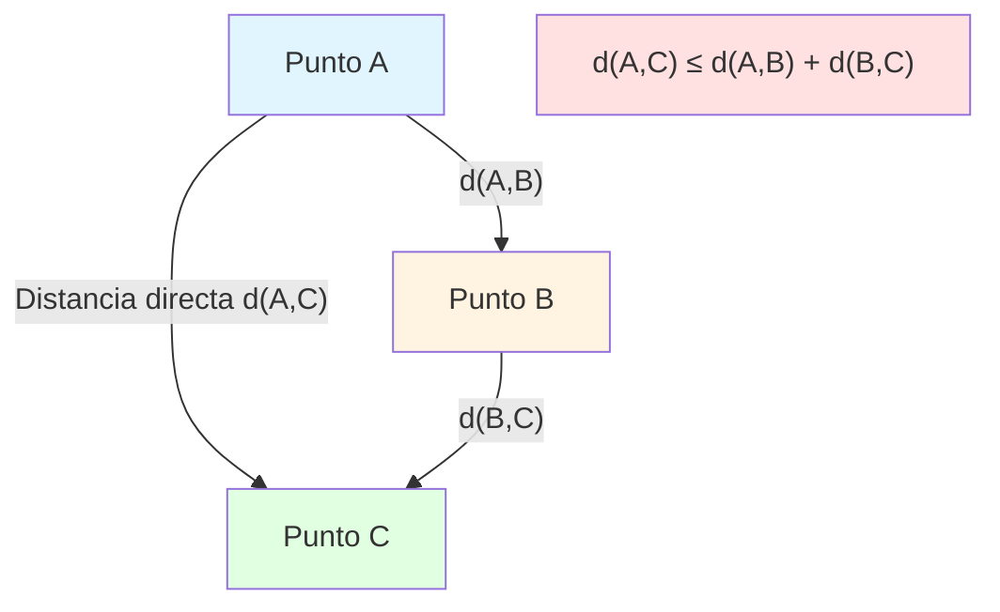
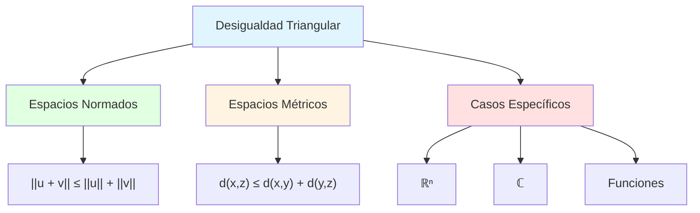
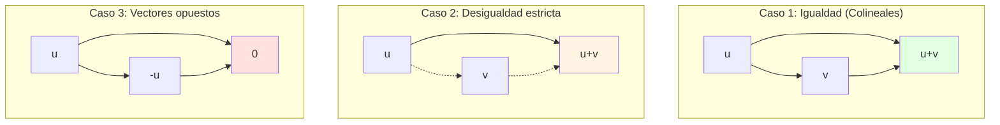
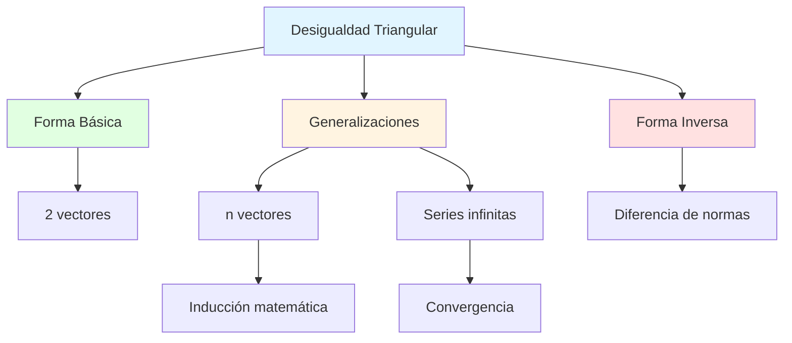
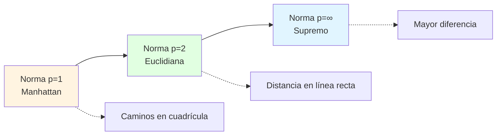
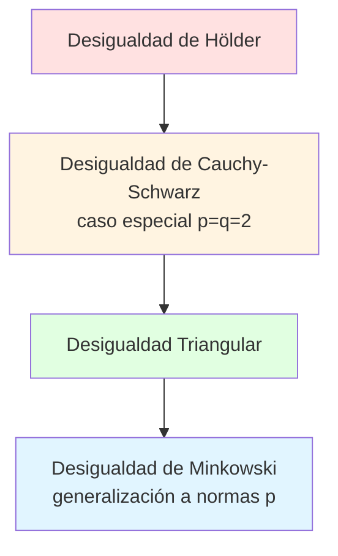

# 📏 Norma Inducida y Distancia

## 🎯 Introducción

> [!info]- 💡 De Producto Interno a Geometría
> 
> Una vez que tenemos un producto interno en un espacio vectorial, automáticamente obtenemos dos conceptos geométricos fundamentales:
> 
> 1. **Norma** (longitud de vectores)
> 2. **Distancia** (separación entre vectores)
> 
> **Analogía intuitiva:**
> 
> - El **producto interno** es como tener una "regla flexible" que nos permite medir
> - La **norma** es usar esa regla para medir la longitud de una flecha
> - La **distancia** es usar esa regla para medir cuán separados están dos puntos
> 
> ```mermaid
> graph LR
>     A[Producto Interno<br/>⟨·,·⟩] --> B[Norma<br/>‖·‖]
>     B --> C[Distancia<br/>d·,·]
>     A -.->|También define| D[Ángulo<br/>θ]
>     
>     style A fill:#e1ffe1
>     style B fill:#fff4e1
>     style C fill:#e1f5ff
>     style D fill:#f0e1ff
> ```
> 
> **Jerarquía de estructuras:**
> 
> |Estructura|Requiere|Proporciona|Ejemplo|
> |---|---|---|---|
> |**Espacio Vectorial**|Suma, producto por escalar|Estructura algebraica|$\mathbb{R}^n$|
> |**+ Producto Interno**|$\langle \cdot, \cdot \rangle$|Geometría (ángulos)|$(\mathbb{R}^n, \cdot)$|
> |**+ Norma**|$\|\cdot\|$|Longitudes|Espacio normado|
> |**+ Distancia**|$d(\cdot, \cdot)$|Topología (cercanía)|Espacio métrico|

---

## 📐 Norma Inducida por el Producto Interno

### 🔍 Definición

> [!note]- 📏 ¿Qué es la Norma?
> 
> Sea $V$ un espacio vectorial con producto interno $\langle \cdot, \cdot \rangle$. La **norma inducida** de un vector $\mathbf{v} \in V$ es:
> 
> $$|\mathbf{v}| = \sqrt{\langle \mathbf{v}, \mathbf{v} \rangle}$$
> 
> **Interpretación geométrica:**
> 
> La norma $|\mathbf{v}|$ representa la **longitud** o **magnitud** del vector $\mathbf{v}$.
> 
> ```mermaid
> graph TD
>     A[Vector v] --> B[Producto interno<br/>consigo mismo]
>     B --> C[⟨v, v⟩]
>     C --> D[Raíz cuadrada]
>     D --> E[‖v‖ = √⟨v,v⟩<br/>Longitud]
>     
>     style A fill:#e1f5ff
>     style C fill:#fff4e1
>     style E fill:#e1ffe1
> ```
> 
> **Notación:**
> 
> - $|\mathbf{v}|$ se lee "norma de ve" o "longitud de ve"
> - También se denota $|\mathbf{v}|_2$ en algunos contextos (norma euclidiana)

### ⚖️ Axiomas de la Norma

> [!success]- ✅ Propiedades que debe Satisfacer
> 
> Toda norma inducida por un producto interno satisface las siguientes propiedades para todo $\mathbf{u}, \mathbf{v} \in V$ y todo escalar $\alpha$:
> 
> |#|Nombre|Expresión|Significado|
> |---|---|---|---|
> |**N1**|**No negatividad**|$\|\mathbf{v}\| \geq 0$|Las longitudes son positivas|
> |**N2**|**Definición positiva**|$\|\mathbf{v}\| = 0 \iff \mathbf{v} = \mathbf{0}$|Solo el cero tiene longitud cero|
> |**N3**|**Homogeneidad**|$\|\alpha\mathbf{v}\| = \|\alpha\| \cdot \|\mathbf{v}\|$|Escalar multiplica la longitud|
> |**N4**|**Desigualdad triangular**|$\|\mathbf{u} + \mathbf{v}\| \leq \|\mathbf{u}\| + \|\mathbf{v}\|$|Camino directo más corto|
> 
> **Verificación de axiomas:**
> 
> ```mermaid
> graph TD
>     A[Norma ‖·‖ inducida] --> B[N1: ‖v‖ ≥ 0]
>     A --> C[N2: ‖v‖ = 0 ⟺ v = 0]
>     A --> D[N3: ‖αv‖ = |α|‖v‖]
>     A --> E[N4: ‖u+v‖ ≤ ‖u‖ + ‖v‖]
>     
>     B --> F[✅ De PI3]
>     C --> G[✅ De PI4]
>     D --> H[✅ De PI1]
>     E --> I[✅ De Cauchy-Schwarz]
>     
>     style A fill:#e1ffe1
>     style F fill:#e1ffe1
>     style G fill:#e1ffe1
>     style H fill:#e1ffe1
>     style I fill:#e1ffe1
> ```

### 📊 Demostración de Propiedades

> [!example]- 🔍 Pruebas de los Axiomas
> 
> **Demostración N1 (No negatividad):**
> 
> $$|\mathbf{v}| = \sqrt{\langle \mathbf{v}, \mathbf{v} \rangle} \geq 0$$
> 
> porque:
> 
> - $\langle \mathbf{v}, \mathbf{v} \rangle \geq 0$ por el axioma PI3 del producto interno
> - La raíz cuadrada de un número no negativo es no negativa
> 
> ∎
> 
> **Demostración N2 (Definición positiva):**
> 
> $$|\mathbf{v}| = 0 \iff \sqrt{\langle \mathbf{v}, \mathbf{v} \rangle} = 0 \iff \langle \mathbf{v}, \mathbf{v} \rangle = 0 \iff \mathbf{v} = \mathbf{0}$$
> 
> La última equivalencia es el axioma PI4 del producto interno.
> 
> ∎
> 
> **Demostración N3 (Homogeneidad):**
> 
> $$\begin{align} |\alpha\mathbf{v}| &= \sqrt{\langle \alpha\mathbf{v}, \alpha\mathbf{v} \rangle} \ &= \sqrt{\alpha\langle \mathbf{v}, \alpha\mathbf{v} \rangle} \quad \text{(linealidad, PI1)} \ &= \sqrt{\alpha \cdot \alpha \langle \mathbf{v}, \mathbf{v} \rangle} \ &= \sqrt{\alpha^2 \langle \mathbf{v}, \mathbf{v} \rangle} \ &= |\alpha| \sqrt{\langle \mathbf{v}, \mathbf{v} \rangle} \ &= |\alpha| \cdot |\mathbf{v}| \end{align}$$
> 
> ∎
> 
> **Demostración N4 (Desigualdad triangular):**
> 
> Esta es más compleja y la demostraremos en el capítulo 07. Requiere la desigualdad de Cauchy-Schwarz.

---

## 🌟 Ejemplos de Normas Inducidas

### 📊 Ejemplo 1: Norma Euclidiana en $\mathbb{R}^n$

> [!example]- 📐 La Norma Más Común
> 
> **Producto interno:** $\langle \mathbf{u}, \mathbf{v} \rangle = \sum_{i=1}^n u_i v_i$
> 
> **Norma inducida:**
> 
> $$|\mathbf{v}| = \sqrt{\langle \mathbf{v}, \mathbf{v} \rangle} = \sqrt{v_1^2 + v_2^2 + \cdots + v_n^2} = \sqrt{\sum_{i=1}^n v_i^2}$$
> 
> **Ejemplos numéricos:**
> 
> ```
> En ℝ²:
> v = (3, 4)
> ‖v‖ = √(3² + 4²) = √(9 + 16) = √25 = 5
> 
> En ℝ³:
> v = (1, 2, 2)
> ‖v‖ = √(1² + 2² + 2²) = √(1 + 4 + 4) = √9 = 3
> 
> En ℝ⁴:
> v = (1, 1, 1, 1)
> ‖v‖ = √(1 + 1 + 1 + 1) = √4 = 2
> ```
> 
> **Interpretación geométrica en $\mathbb{R}^2$ y $\mathbb{R}^3$:**
> 
> - En $\mathbb{R}^2$: Es la longitud de la hipotenusa (Teorema de Pitágoras)
> - En $\mathbb{R}^3$: Es la diagonal del paralelepípedo
> 
> ```mermaid
> graph TD
>     A[Vector v = ·3, 4] --> B[Componente x: 3]
>     A --> C[Componente y: 4]
>     B --> D[Triángulo rectángulo]
>     C --> D
>     D --> E[Hipotenusa = ‖v‖ = 5]
>     
>     style A fill:#e1f5ff
>     style E fill:#e1ffe1
> ```
> 
> **Casos especiales:**
> 
> |Vector|Norma|Observación|
> |---|---|---|
> |$(1, 0, 0, \ldots, 0)$|$1$|Vector canónico unitario|
> |$(a, a, \ldots, a)$ ($n$ componentes)|$|a|
> |$\mathbf{0}$|$0$|Único vector con norma cero|

### 📊 Ejemplo 2: Norma Ponderada en $\mathbb{R}^n$

> [!example]- ⚖️ Con Pesos Diferentes
> 
> **Producto interno ponderado:** $\langle \mathbf{u}, \mathbf{v} \rangle_w = \sum_{i=1}^n w_i u_i v_i$ con $w_i > 0$
> 
> **Norma inducida:**
> 
> $$|\mathbf{v}|_w = \sqrt{\sum_{i=1}^n w_i v_i^2}$$
> 
> **Ejemplo numérico:**
> 
> ```
> En ℝ³ con pesos w = (2, 3, 1):
> v = (1, 2, 3)
> 
> ‖v‖_w = √(2·1² + 3·2² + 1·3²)
>       = √(2·1 + 3·4 + 1·9)
>       = √(2 + 12 + 9)
>       = √23
>       ≈ 4.80
> 
> Comparar con norma estándar:
> ‖v‖ = √(1 + 4 + 9) = √14 ≈ 3.74
> 
> La norma ponderada da más importancia a la
> segunda componente (peso = 3).
> ```
> 
> **Interpretación:**
> 
> |Peso $w_i$|Efecto en la norma|
> |---|---|
> |$w_i > 1$|Aumenta la contribución de la componente $i$|
> |$w_i = 1$|Norma estándar|
> |$0 < w_i < 1$|Disminuye la contribución de la componente $i$|
> 
> **Aplicación práctica:**
> 
> En procesamiento de datos, los pesos pueden representar la importancia relativa de diferentes características.

### 📊 Ejemplo 3: Norma $L^2$ en $C[a,b]$

> [!example]- 📈 Norma de Funciones
> 
> **Producto interno:** $\langle f, g \rangle = \int_a^b f(x)g(x) , dx$
> 
> **Norma inducida ($L^2$-norma):**
> 
> $$|f| = \sqrt{\langle f, f \rangle} = \sqrt{\int_a^b f(x)^2 , dx}$$
> 
> **Ejemplos numéricos:**
> 
> ```
> Ejemplo 1: f(x) = x en [0,1]
> 
> ‖f‖ = √∫₀¹ x² dx
>     = √[x³/3]₀¹
>     = √(1/3)
>     = 1/√3
>     ≈ 0.577
> 
> Ejemplo 2: f(x) = sin(x) en [0,π]
> 
> ‖f‖ = √∫₀^π sin²(x) dx
>     = √∫₀^π (1-cos(2x))/2 dx
>     = √[x/2 - sin(2x)/4]₀^π
>     = √(π/2)
>     ≈ 1.253
> 
> Ejemplo 3: f(x) = 1 (función constante) en [a,b]
> 
> ‖f‖ = √∫_a^b 1² dx
>     = √(b - a)
> ```
> 
> **Interpretación:**
> 
> La norma $L^2$ mide la "energía" o "tamaño" de una función en el intervalo.
> 
> **Propiedades:**
> 
> |Función|Norma en $[a,b]$|Observación|
> |---|---|---|
> |$f(x) = c$ (constante)|$|c|
> |$f(x) = 0$|$0$|Única función con norma cero|
> |$\|f\|$ grande|-|Función "oscila mucho" o tiene valores grandes|

### 📊 Ejemplo 4: Norma de Frobenius

> [!example]- 🔲 Norma de Matrices
> 
> **Producto interno de Frobenius:** $\langle A, B \rangle = \text{tr}(A^T B) = \sum_{i,j} a_{ij}b_{ij}$
> 
> **Norma inducida (norma de Frobenius):**
> 
> $$|A|_F = \sqrt{\langle A, A \rangle} = \sqrt{\sum_{i=1}^m \sum_{j=1}^n a_{ij}^2}$$
> 
> **Ejemplo numérico:**
> 
> ```
> A = [1  2]
>     [3  4]
> 
> ‖A‖_F = √(1² + 2² + 3² + 4²)
>       = √(1 + 4 + 9 + 16)
>       = √30
>       ≈ 5.48
> 
> B = [2  0]
>     [0  3]
> 
> ‖B‖_F = √(4 + 0 + 0 + 9)
>       = √13
>       ≈ 3.61
> ```
> 
> **Propiedades especiales:**
> 
> |Propiedad|Expresión|Uso|
> |---|---|---|
> |**Invariancia ortogonal**|$\|UAV\|_F = \|A\|_F$ si $U, V$ ortogonales|Cambios de base|
> |**Relación con traza**|$\|A\|_F^2 = \text{tr}(A^T A)$|Cálculo eficiente|
> |**Suma de valores singulares**|$\|A\|_F^2 = \sum \sigma_i^2$|Análisis espectral|

---

## 📐 Distancia Inducida

### 🔍 Definición

> [!note]- 🗺️ Midiendo Separación entre Vectores
> 
> Sea $V$ un espacio con producto interno y norma inducida $|\cdot|$. La **distancia** entre dos vectores $\mathbf{u}, \mathbf{v} \in V$ es:
> 
> $$d(\mathbf{u}, \mathbf{v}) = |\mathbf{u} - \mathbf{v}|$$
> 
> **Interpretación geométrica:**
> 
> La distancia $d(\mathbf{u}, \mathbf{v})$ es la longitud del vector diferencia $\mathbf{u} - \mathbf{v}$.
> 
> ```mermaid
> graph TD
>     A[Vectores u y v] --> B[Diferencia u - v]
>     B --> C[Norma de la diferencia]
>     C --> D[d·u,v = ‖u - v‖]
>     
>     style A fill:#e1f5ff
>     style D fill:#e1ffe1
> ```
> 
> **Expandiendo la definición:**
> 
> $$d(\mathbf{u}, \mathbf{v}) = |\mathbf{u} - \mathbf{v}| = \sqrt{\langle \mathbf{u} - \mathbf{v}, \mathbf{u} - \mathbf{v} \rangle}$$

### ⚖️ Axiomas de la Métrica

> [!success]- ✅ Propiedades de la Distancia
> 
> La distancia inducida satisface los axiomas de una **métrica**:
> 
> |#|Nombre|Expresión|Significado|
> |---|---|---|---|
> |**M1**|**No negatividad**|$d(\mathbf{u}, \mathbf{v}) \geq 0$|Distancias son positivas|
> |**M2**|**Identidad de indiscernibles**|$d(\mathbf{u}, \mathbf{v}) = 0 \iff \mathbf{u} = \mathbf{v}$|Solo puntos idénticos tienen distancia cero|
> |**M3**|**Simetría**|$d(\mathbf{u}, \mathbf{v}) = d(\mathbf{v}, \mathbf{u})$|No importa el orden|
> |**M4**|**Desigualdad triangular**|$d(\mathbf{u}, \mathbf{w}) \leq d(\mathbf{u}, \mathbf{v}) + d(\mathbf{v}, \mathbf{w})$|El rodeo no es más corto|
> 
> **Verificación de axiomas:**
> 
> ```mermaid
> graph TD
>     A[Distancia d·,·] --> B[M1: d·u,v ≥ 0]
>     A --> C[M2: d·u,v = 0 ⟺ u = v]
>     A --> D[M3: d·u,v = d·v,u]
>     A --> E[M4: Desigualdad triangular]
>     
>     B --> F[✅ De N1]
>     C --> G[✅ De N2]
>     D --> H[✅ De simetría de ‖·‖]
>     E --> I[✅ De N4]
>     
>     style A fill:#e1ffe1
> ```

### 📊 Demostración de Propiedades

> [!example]- 🔍 Pruebas de los Axiomas
> 
> **Demostración M1 (No negatividad):**
> 
> $$d(\mathbf{u}, \mathbf{v}) = |\mathbf{u} - \mathbf{v}| \geq 0$$
> 
> porque toda norma es no negativa (axioma N1).
> 
> ∎
> 
> **Demostración M2 (Identidad de indiscernibles):**
> 
> $$\begin{align} d(\mathbf{u}, \mathbf{v}) = 0 &\iff |\mathbf{u} - \mathbf{v}| = 0 \ &\iff \mathbf{u} - \mathbf{v} = \mathbf{0} \quad \text{(por N2)} \ &\iff \mathbf{u} = \mathbf{v} \end{align}$$
> 
> ∎
> 
> **Demostración M3 (Simetría):**
> 
> $$\begin{align} d(\mathbf{u}, \mathbf{v}) &= |\mathbf{u} - \mathbf{v}| \ &= |(-1)(\mathbf{v} - \mathbf{u})| \ &= |-1| \cdot |\mathbf{v} - \mathbf{u}| \quad \text{(por N3)} \ &= |\mathbf{v} - \mathbf{u}| \ &= d(\mathbf{v}, \mathbf{u}) \end{align}$$
> 
> ∎
> 
> **Demostración M4 (Desigualdad triangular):**
> 
> $$\begin{align} d(\mathbf{u}, \mathbf{w}) &= |\mathbf{u} - \mathbf{w}| \ &= |(\mathbf{u} - \mathbf{v}) + (\mathbf{v} - \mathbf{w})| \ &\leq |\mathbf{u} - \mathbf{v}| + |\mathbf{v} - \mathbf{w}| \quad \text{(por N4)} \ &= d(\mathbf{u}, \mathbf{v}) + d(\mathbf{v}, \mathbf{w}) \end{align}$$
> 
> ∎

---

## 🌟 Ejemplos de Distancias

### 📊 Ejemplo 1: Distancia Euclidiana en $\mathbb{R}^n$

> [!example]- 📐 La Distancia Estándar
> 
> **Fórmula:**
> 
> $$d(\mathbf{u}, \mathbf{v}) = |\mathbf{u} - \mathbf{v}| = \sqrt{\sum_{i=1}^n (u_i - v_i)^2}$$
> 
> **Ejemplos numéricos:**
> 
> ```
> En ℝ²:
> u = (1, 2),  v = (4, 6)
> 
> d(u, v) = √((1-4)² + (2-6)²)
>         = √((-3)² + (-4)²)
>         = √(9 + 16)
>         = √25
>         = 5
> 
> En ℝ³:
> u = (0, 0, 0),  v = (1, 2, 2)
> 
> d(u, v) = √(1² + 2² + 2²)
>         = √9
>         = 3
> 
> En ℝ⁴:
> u = (1, 2, 3, 4),  v = (2, 3, 4, 5)
> 
> d(u, v) = √(1² + 1² + 1² + 1²)
>         = √4
>         = 2
> ```
> 
> **Interpretación geométrica:**
> 
> - En $\mathbb{R}^2$: Distancia en línea recta entre dos puntos
> - En $\mathbb{R}^3$: Distancia "como vuela el pájaro"
> 
> **Casos especiales:**
> 
> |Vectores|Distancia|Observación|
> |---|---|---|
> |$\mathbf{u}, \mathbf{u}$|$0$|Distancia a sí mismo|
> |$\mathbf{u}, -\mathbf{u}$|$2\|\mathbf{u}\|$|Vectores opuestos|
> |Ortogonales con $\|\mathbf{u}\|=\|\mathbf{v}\|=1$|$\sqrt{2}$|Diagonal de cuadrado unitario|

### 📊 Ejemplo 2: Distancia entre Funciones

> [!example]- 📈 Distancia $L^2$
> 
> **Fórmula:**
> 
> $$d(f, g) = |f - g| = \sqrt{\int_a^b (f(x) - g(x))^2 , dx}$$
> 
> **Ejemplos numéricos:**
> 
> ```
> Ejemplo 1: f(x) = x, g(x) = x² en [0,1]
> 
> d(f, g) = √∫₀¹ (x - x²)² dx
>         = √∫₀¹ (x² - 2x³ + x⁴) dx
>         = √[x³/3 - x⁴/2 + x⁵/5]₀¹
>         = √(1/3 - 1/2 + 1/5)
>         = √(10/30 - 15/30 + 6/30)
>         = √(1/30)
>         ≈ 0.183
> 
> Ejemplo 2: f(x) = 1, g(x) = x en [0,1]
> 
> d(f, g) = √∫₀¹ (1 - x)² dx
>         = √∫₀¹ (1 - 2x + x²) dx
>         = √[x - x² + x³/3]₀¹
>         = √(1 - 1 + 1/3)
>         = √(1/3)
>         ≈ 0.577
> ```
> 
> **Interpretación:**
> 
> La distancia $L^2$ mide qué tan "diferentes" son dos funciones en promedio sobre el intervalo.

### 📊 Ejemplo 3: Distancia de Frobenius entre Matrices

> [!example]- 🔲 Distancia entre Matrices
> 
> **Fórmula:**
> 
> $$d(A, B) = |A - B|_F = \sqrt{\sum_{i,j} (a_{ij} - b_{ij})^2}$$
> 
> **Ejemplo numérico:**
> 
> ```
> A = [1  2]    B = [2  3]
>     [3  4]        [4  5]
> 
> A - B = [-1  -1]
>         [-1  -1]
> 
> d(A, B) = √(1 + 1 + 1 + 1)
>         = √4
>         = 2
> ```
> 
> **Aplicación:**
> 
> Útil para medir el "error" entre matrices en aproximaciones numéricas.

---

## 🔗 Relaciones entre Norma y Distancia

> [!tip]- 🎨 Conexiones Importantes
> 
> ### Relación Fundamental
> 
> $$d(\mathbf{u}, \mathbf{v}) = |\mathbf{u} - \mathbf{v}|$$
> 
> **Consecuencias:**
> 
> |Propiedad de Norma|Propiedad de Distancia Correspondiente|
> |---|---|
> |$\|\mathbf{v}\| \geq 0$|$d(\mathbf{u}, \mathbf{v}) \geq 0$|
> |$\|\mathbf{v}\| = 0 \iff \mathbf{v} = \mathbf{0}$|$d(\mathbf{u}, \mathbf{v}) = 0 \iff \mathbf{u} = \mathbf{v}$|
> |$\|\mathbf{u} + \mathbf{v}\| \leq \|\mathbf{u}\| + \|\mathbf{v}\|$|$d(\mathbf{u}, \mathbf{w}) \leq d(\mathbf{u}, \mathbf{v}) + d(\mathbf{v}, \mathbf{w})$|
> 
> ### Desigualdad Triangular Inversa
> 
> $$\big| |\mathbf{u}| - |\mathbf{v}| \big| \leq d(\mathbf{u}, \mathbf{v})$$
> > **Demostración:**
> 
> ```
> Por desigualdad triangular:
> ‖u‖ = ‖u - v + v‖ ≤ ‖u - v‖ + ‖v‖
> 
> Por lo tanto:
> ‖u‖ - ‖v‖ ≤ ‖u - v‖
> 
> Similarmente:
> ‖v‖ - ‖u‖ ≤ ‖v - u‖ = ‖u - v‖
> 
> Combinando:
> |‖u‖ - ‖v‖| ≤ ‖u - v‖ = d(u, v)
> ```
> 
> **Interpretación:**
> 
> La diferencia de longitudes nunca excede la distancia entre los vectores.

---

## 📊 Propiedades Adicionales

> [!note]- 🔍 Más Relaciones Útiles
> 
> ### Norma de la Suma y Diferencia
> 
> **Identidad del paralelogramo:**
> 
> $$|\mathbf{u} + \mathbf{v}|^2 + |\mathbf{u} - \mathbf{v}|^2 = 2(|\mathbf{u}|^2 + |\mathbf{v}|^2)$$
> 
> **En términos de distancia:**
> 
> $$d(\mathbf{u}, \mathbf{v})^2 + |\mathbf{u} + \mathbf{v}|^2 = 2(|\mathbf{u}|^2 + |\mathbf{v}|^2)$$
> 
> **Ejemplo numérico:**
> 
> ```
> u = (3, 0),  v = (0, 4)
> 
> u + v = (3, 4)  →  ‖u+v‖² = 25
> u - v = (3,-4)  →  ‖u-v‖² = 25
> 
> ‖u‖² = 9,  ‖v‖² = 16
> 
> Verificar:
> 25 + 25 = 2(9 + 16)
> 50 = 50 ✅
> ```
> 
> ### Identidad de Polarización (recordatorio)
> 
> $$\langle \mathbf{u}, \mathbf{v} \rangle = \frac{1}{4}(|\mathbf{u}+\mathbf{v}|^2 - |\mathbf{u}-\mathbf{v}|^2)$$
> 
> **En términos de distancia:**
> 
> $$\langle \mathbf{u}, \mathbf{v} \rangle = \frac{1}{4}(|\mathbf{u}+\mathbf{v}|^2 - d(\mathbf{u}, \mathbf{v})^2)$$
> 
> **Interpretación:**
> 
> Podemos recuperar el producto interno conociendo solo las normas (o distancias).

---

## 🎯 Visualización Geométrica

> [!quote]- 🗺️ Interpretación Gráfica
> 
> ### En $\mathbb{R}^2$
> 
> ```mermaid
> graph TD
>     A[Punto u = ·3,2] --> B[Norma ‖u‖]
>     B --> C[Radio desde origen<br/>‖u‖ = √13]
>     
>     D[Punto v = ·1,4] --> E[Norma ‖v‖]
>     E --> F[Radio desde origen<br/>‖v‖ = √17]
>     
>     A --> G[Distancia d·u,v]
>     D --> G
>     G --> H[Línea recta u→v<br/>d·u,v = √8]
>     
>     style C fill:#e1ffe1
>     style F fill:#fff4e1
>     style H fill:#e1f5ff
> ```
> 
> ### Bolas y Esferas
> 
> **Bola abierta:**
> 
> $$B(\mathbf{c}, r) = {\mathbf{v} \in V : d(\mathbf{v}, \mathbf{c}) < r}$$
> 
> Todos los vectores a distancia menor que $r$ del centro $\mathbf{c}$.
> 
> **Esfera:**
> 
> $$S(\mathbf{c}, r) = {\mathbf{v} \in V : d(\mathbf{v}, \mathbf{c}) = r}$$
> 
> Todos los vectores a distancia exactamente $r$ del centro $\mathbf{c}$.
> 
> **Ejemplos:**
> 
> |Espacio|Centro|Radio|Forma|
> |---|---|---|---|
> |$\mathbb{R}^2$|$(0,0)$|$1$|Círculo unitario|
> |$\mathbb{R}^3$|$(0,0,0)$|$1$|Esfera unitaria|
> |$\mathbb{R}^n$|$\mathbf{0}$|$1$|Hiperesfera unitaria|

---

## 🧩 Ejercicios Propuestos

> [!example]- 💪 Práctica Guiada
> 
> ### Nivel Básico
> 
> **1.** Calcula la norma de los siguientes vectores con el producto punto estándar:
> 
> - $\mathbf{v} = (3, 4)$ en $\mathbb{R}^2$
> - $\mathbf{w} = (1, 2, 2)$ en $\mathbb{R}^3$
> - $\mathbf{u} = (1, -1, 1, -1)$ en $\mathbb{R}^4$
> 
> **2.** Calcula la distancia entre:
> 
> - $\mathbf{u} = (1, 2)$ y $\mathbf{v} = (4, 6)$
> - $\mathbf{p} = (0, 0, 0)$ y $\mathbf{q} = (1, 1, 1)$
> 
> **3.** Verifica la homogeneidad de la norma: $|\alpha\mathbf{v}| = |\alpha| \cdot |\mathbf{v}|$ para:
> 
> - $\alpha = 3$, $\mathbf{v} = (1, 2)$
> - $\alpha = -2$, $\mathbf{v} = (3, 4, 5)$
> 
> ### Nivel Intermedio
> 
> **4.** Calcula $|f|$ para las siguientes funciones en $[0,1]$:
> 
> - $f(x) = 2x$
> - $f(x) = x^2$
> - $f(x) = \cos(\pi x)$
> 
> **5.** Verifica la identidad del paralelogramo para:
> 
> - $\mathbf{u} = (1, 0)$, $\mathbf{v} = (0, 1)$
> - $\mathbf{u} = (1, 2, 3)$, $\mathbf{v} = (2, 1, 0)$
> 
> **6.** Encuentra todos los vectores en $\mathbb{R}^2$ que tienen norma $1$ y están a distancia $\sqrt{2}$ de $\mathbf{v} = (1, 0)$.
> 
> ### Nivel Avanzado
> 
> **7.** Demuestra la desigualdad triangular inversa: $$\big| |\mathbf{u}| - |\mathbf{v}| \big| \leq |\mathbf{u} - \mathbf{v}|$$
> 
> **8.** Sea $|\cdot|_w$ la norma inducida por el producto ponderado con pesos $w_1, w_2, \ldots, w_n > 0$. Demuestra que satisface los cuatro axiomas de norma.
> 
> **9.** Calcula la norma de Frobenius de la matriz: $$A = \begin{pmatrix} 1 & 2 & 3 \ 4 & 5 & 6 \ 7 & 8 & 9 \end{pmatrix}$$

---

## 📖 Resumen del Capítulo

> [!abstract]- 📝 Puntos Clave
> 
> ### Conceptos Fundamentales
> 
> |Concepto|Definición|Notación|
> |---|---|---|
> |**Norma inducida**|$\|\mathbf{v}\| = \sqrt{\langle \mathbf{v}, \mathbf{v} \rangle}$|$\|\cdot\|$|
> |**Distancia**|$d(\mathbf{u}, \mathbf{v}) = \|\mathbf{u} - \mathbf{v}\|$|$d(\cdot, \cdot)$|
> |**Axiomas de norma**|N1-N4|-|
> |**Axiomas de métrica**|M1-M4|-|
> 
> ### Fórmulas Esenciales
> 
> $$\begin{align} \text{Norma euclidiana:} & \quad |\mathbf{v}| = \sqrt{\sum_{i=1}^n v_i^2} \\[8pt] \text{Norma }L^2: & \quad |f| = \sqrt{\int_a^b f(x)^2 , dx} \\[8pt] \text{Distancia euclidiana:} & \quad d(\mathbf{u}, \mathbf{v}) = \sqrt{\sum_{i=1}^n (u_i - v_i)^2} \end{align}$$
> 
> ### Propiedades Importantes
> 
> - Toda norma inducida satisface los cuatro axiomas
> - La distancia hereda propiedades de la norma
> - Identidad del paralelogramo caracteriza normas de producto interno
> - Desigualdad triangular y su versión inversa
> 
> ### Jerarquía de Estructuras
> 
> ```mermaid
> graph TD
>     A[Producto Interno] --> B[Norma]
>     B --> C[Distancia]
>     C --> D[Topología]
>     
>     A -.->|Define| E[Ángulos]
>     B -.->|Define| F[Longitudes]
>     C -.->|Define| G[Cercanía]
>     
>     style A fill:#e1ffe1
>     style B fill:#fff4e1
>     style C fill:#e1f5ff
> ```
> 
> ### Próximo Tema
> 
> En el siguiente capítulo estudiaremos la **ortogonalidad y ortonormalidad**, conceptos fundamentales que dependen crucialmente del producto interno.

---

**Tags:** #algebra-lineal #norma #distancia #metrica #espacio-normado #espacio-metrico #geometria

# 📐 Desigualdad Triangular

## 🎯 Introducción

> [!info]- 💡 ¿Qué es la Desigualdad Triangular?
> 
> La **desigualdad triangular** es un principio fundamental en matemáticas que establece una relación entre las longitudes de los lados de un triángulo y las normas de vectores. Este concepto tiene aplicaciones profundas en álgebra lineal, análisis funcional, geometría y ciencias de la computación.
> 
> **Analogía práctica:** Imagina que quieres ir del punto A al punto C. Tienes dos opciones:
> 
> - **Ruta directa:** Caminar en línea recta de A a C
> - **Ruta indirecta:** Ir primero de A a B, luego de B a C
> 
> La desigualdad triangular nos dice que **la ruta directa siempre será más corta o igual** que cualquier ruta indirecta que pase por puntos intermedios.
> 
> **¿Por qué es importante?**
> 
> |Aspecto|Descripción|Ejemplo de Uso|
> |---|---|---|
> |**Optimización**|Encontrar caminos más cortos|GPS, rutas de entrega|
> |**Análisis de errores**|Acotar propagación de errores|Algoritmos numéricos|
> |**Teoría de espacios métricos**|Definir distancias válidas|Machine Learning, clustering|
> |**Compresión de datos**|Estimar tamaños de representaciones|Algoritmos de compresión|
> |**Geometría computacional**|Validar construcciones geométricas|Gráficos por computadora|



---

## 📊 Enunciado Formal

### 📐 Definición Matemática

> [!example]- 📝 Formulación en Diferentes Contextos
> 
> **1. En espacios vectoriales con norma:**
> 
> Para cualesquiera vectores **u**, **v** ∈ V (donde V es un espacio vectorial con norma ||·||):
> 
> ```
> ||u + v|| ≤ ||u|| + ||v||
> ```
> 
> **Interpretación:** La norma de la suma de dos vectores nunca excede la suma de sus normas individuales.
> 
> **2. En espacios métricos:**
> 
> Para cualesquiera puntos x, y, z en un espacio métrico (X, d):
> 
> ```
> d(x, z) ≤ d(x, y) + d(y, z)
> ```
> 
> **Interpretación:** La distancia directa entre dos puntos nunca excede la distancia que resulta de pasar por un punto intermedio.
> 
> **3. En ℝⁿ con producto interno:**
> 
> Para vectores **u**, **v** ∈ ℝⁿ:
> 
> ```
> ||u + v|| = √(⟨u + v, u + v⟩) ≤ ||u|| + ||v||
> ```
> 
> **Comparación de formulaciones:**
> 
> |Contexto|Notación|Objetos|Aplicación Principal|
> |---|---|---|---|
> |**Espacios normados**|\|\|u + v\|\| ≤ \|
> |**Espacios métricos**|d(x,z) ≤ d(x,y) + d(y,z)|Puntos|Topología, análisis|
> |**ℝⁿ estándar**|\|\|u + v\|\|₂ ≤ \|
> |**Números complejos**|\|z₁ + z₂\| ≤ \|z₁\| + \|z₂\||Complejos|Análisis complejo|



### 🔍 Interpretación Geométrica

> [!note]- 🎨 Visualización en el Plano
> 
> **Representación en ℝ²:**
> 
> Consideremos tres puntos que forman un triángulo:
> 
> - A = (0, 0)
> - B = (3, 4)
> - C = (6, 0)
> 
> ```mermaid
> graph LR
>     A["A(0,0)"] -->|"d(A,B) = 5"| B["B(3,4)"]
>     B -->|"d(B,C) = 5"| C["C(6,0)"]
>     A -.->|"d(A,C) = 6"| C
>     
>     Note["6 ≤ 5 + 5<br/>6 ≤ 10 ✓"]
>     
>     style A fill:#e1f5ff
>     style B fill:#fff4e1
>     style C fill:#e1ffe1
>     style Note fill:#e1ffe1
> ```
> 
> **Cálculo de distancias:**
> 
> ```
> d(A,B) = √[(3-0)² + (4-0)²] = √(9+16) = 5
> d(B,C) = √[(6-3)² + (0-4)²] = √(9+16) = 5
> d(A,C) = √[(6-0)² + (0-0)²] = 6
> 
> Verificación: 6 ≤ 5 + 5 → 6 ≤ 10 ✓
> ```
> 
> **Casos extremos:**
> 
> |Caso|Condición|Relación|Interpretación Geométrica|
> |---|---|---|---|
> |**Igualdad**|\|\|u + v\|\| = \|
> |**Desigualdad estricta**|\|\|u + v\|\| < \|
> |**Vectores opuestos**|v = -u|\|\|u + v\|
> 
> **Visualización de casos:**



---

## 🧮 Demostración

### 📚 Demostración usando Desigualdad de Cauchy-Schwarz

> [!success]- 🎓 Prueba Rigurosa
> 
> **Teorema previo necesario:** Desigualdad de Cauchy-Schwarz
> 
> Para vectores **u**, **v** en un espacio con producto interno:
> 
> ```
> |⟨u, v⟩| ≤ ||u|| · ||v||
> ```
> 
> **Demostración de la Desigualdad Triangular:**
> 
> **Paso 1:** Elevar al cuadrado ambos lados
> 
> Queremos demostrar: ||u + v|| ≤ ||u|| + ||v||
> 
> Elevamos al cuadrado (ambos lados son no negativos):
> 
> ```
> ||u + v||² ≤ (||u|| + ||v||)²
> ```
> 
> **Paso 2:** Expandir el lado izquierdo usando el producto interno
> 
> ```
> ||u + v||² = ⟨u + v, u + v⟩
>            = ⟨u, u⟩ + ⟨u, v⟩ + ⟨v, u⟩ + ⟨v, v⟩
>            = ||u||² + 2⟨u, v⟩ + ||v||²
> ```
> 
> **Paso 3:** Expandir el lado derecho
> 
> ```
> (||u|| + ||v||)² = ||u||² + 2||u|| · ||v|| + ||v||²
> ```
> 
> **Paso 4:** Comparar ambas expresiones
> 
> Necesitamos demostrar que:
> 
> ```
> ||u||² + 2⟨u, v⟩ + ||v||² ≤ ||u||² + 2||u|| · ||v|| + ||v||²
> ```
> 
> Simplificando (restando ||u||² + ||v||² de ambos lados):
> 
> ```
> 2⟨u, v⟩ ≤ 2||u|| · ||v||
> ```
> 
> Dividiendo por 2:
> 
> ```
> ⟨u, v⟩ ≤ ||u|| · ||v||
> ```
> 
> **Paso 5:** Aplicar Cauchy-Schwarz
> 
> Por la desigualdad de Cauchy-Schwarz, sabemos que:
> 
> ```
> |⟨u, v⟩| ≤ ||u|| · ||v||
> ```
> 
> Lo que implica:
> 
> ```
> ⟨u, v⟩ ≤ |⟨u, v⟩| ≤ ||u|| · ||v||
> ```
> 
> Por lo tanto, la desigualdad se cumple. ∎
> 
> **Flujo lógico de la demostración:**
> ```mermaid
> flowchart TD
>     A["Objetivo: ||u + v|| ≤ ||u|| + ||v||"] --> B[Elevar al cuadrado]
>     B --> C["||u + v||² ≤ ||u|| + ||v||²"]
>     C --> D[Expandir usando<br/>producto interno]
>     D --> E["||u||² + 2⟨u,v⟩ + ||v||²"]
>     D --> F["||u||² + 2||u||||v|| + ||v||²"]
>     E --> G[Simplificar]
>     F --> G
>     G --> H["⟨u,v⟩ ≤ ||u||||v||"]
>     H --> I[Aplicar<br/>Cauchy-Schwarz]
>     I --> J[Demostración<br/>completa ✓]
>     
>     style A fill:#e1f5ff
>     style I fill:#fff4e1
>     style J fill:#e1ffe1
> ```
> **Caso de igualdad:**
> 
> La igualdad ||u + v|| = ||u|| + ||v|| se alcanza cuando:
> 
> - **u** y **v** son linealmente dependientes
> - **v** = λ**u** donde λ ≥ 0
> - Los vectores apuntan en la misma dirección

### 🔢 Demostración en ℝⁿ con Norma Euclidiana

> [!example]- 📐 Caso Específico para Vectores Numéricos
> 
> **Datos:** u = (u₁, u₂, ..., uₙ), v = (v₁, v₂, ..., vₙ) ∈ ℝⁿ
> 
> **Queremos probar:**
> 
> ```
> √[(u₁+v₁)² + (u₂+v₂)² + ... + (uₙ+vₙ)²] ≤ 
> √[u₁² + u₂² + ... + uₙ²] + √[v₁² + v₂² + ... + vₙ²]
> ```
> 
> **Ejemplo numérico en ℝ³:**
> 
> Sean:
> 
> - u = (1, 2, 2)
> - v = (2, 1, 2)
> 
> **Paso 1:** Calcular ||u|| y ||v||
> 
> ```
> ||u|| = √(1² + 2² + 2²) = √(1 + 4 + 4) = √9 = 3
> ||v|| = √(2² + 1² + 2²) = √(4 + 1 + 4) = √9 = 3
> ```
> 
> **Paso 2:** Calcular u + v
> 
> ```
> u + v = (1+2, 2+1, 2+2) = (3, 3, 4)
> ```
> 
> **Paso 3:** Calcular ||u + v||
> 
> ```
> ||u + v|| = √(3² + 3² + 4²) = √(9 + 9 + 16) = √34 ≈ 5.831
> ```
> 
> **Paso 4:** Verificar la desigualdad
> 
> ```
> ||u + v|| ≤ ||u|| + ||v||
> 5.831 ≤ 3 + 3
> 5.831 ≤ 6 ✓
> ```
> 
> **Tabla de verificación:**
> 
> |Componente|Valor u|Valor v|Suma (u+v)|Cuadrado|
> |---|---|---|---|---|
> |Primera|1|2|3|9|
> |Segunda|2|1|3|9|
> |Tercera|2|2|4|16|
> |**Suma de cuadrados**|-|-|-|**34**|
> |**Norma**|3|3|√34 ≈ 5.831|-|
> 
> **Verificación:** 5.831 < 6 ✓

---

## 🎯 Propiedades y Variantes

### 📋 Propiedades Fundamentales

> [!note]- 🔑 Características Esenciales
> 
> **1. Propiedad de simetría**
> 
> La desigualdad es simétrica respecto a los vectores:
> 
> ```
> ||u + v|| ≤ ||u|| + ||v||
> ||v + u|| ≤ ||v|| + ||u||  (es lo mismo)
> ```
> 
> **2. Generalización a múltiples vectores**
> 
> Para n vectores u₁, u₂, ..., uₙ:
> 
> ```
> ||u₁ + u₂ + ... + uₙ|| ≤ ||u₁|| + ||u₂|| + ... + ||uₙ||
> ```
> 
> **Demostración por inducción:**
> 
> - **Caso base (n=2):** Ya demostrado
> - **Paso inductivo:** Suponer cierto para n-1, demostrar para n
> 
> ```
> ||u₁ + ... + uₙ|| = ||(u₁ + ... + uₙ₋₁) + uₙ||
>                   ≤ ||u₁ + ... + uₙ₋₁|| + ||uₙ||     (caso base)
>                   ≤ (||u₁|| + ... + ||uₙ₋₁||) + ||uₙ||  (hipótesis inductiva)
>                   = ||u₁|| + ... + ||uₙ||
> ```
> 
> **3. Desigualdad triangular inversa**
> 
> También se cumple:
> 
> ```
> | ||u|| - ||v|| | ≤ ||u - v||
> ```
> 
> **Interpretación:** La diferencia de normas nunca excede la norma de la diferencia.
> 
> **4. Monotonía con respecto a subespacios**
> 
> Si W ⊆ V es un subespacio y u + v ∈ W:
> 
> ```
> ||u + v||_W ≤ ||u||_V + ||v||_V
> ```
> 
> **Tabla resumen de propiedades:**
> 
> |Propiedad|Enunciado|Uso Principal|
> |---|---|---|
> |**Básica**|\|\|u + v\|
> |**Generalizada**|\|\|Σuᵢ\|
> |**Inversa**|\| \|\|u\|
> |**n-dimensional**|d(x,z) ≤ Σd(xᵢ,xᵢ₊₁)|Caminos en grafos|



### 🔄 Variantes Importantes

> [!tip]- 🌟 Formas Alternativas
> 
> **1. Desigualdad triangular para distancias**
> 
> En un espacio métrico (X, d):
> 
> ```
> d(x, z) ≤ d(x, y) + d(y, z)
> ```
> 
> **Aplicación:** Encontrar cotas superiores para distancias.
> 
> **2. Desigualdad de Minkowski (generalización)**
> 
> Para p ≥ 1 y vectores en ℝⁿ:
> 
> ```
> (Σ|uᵢ + vᵢ|ᵖ)^(1/p) ≤ (Σ|uᵢ|ᵖ)^(1/p) + (Σ|vᵢ|ᵖ)^(1/p)
> ```
> 
> **Casos especiales:**
> 
> - p = 1: Norma taxicab (Manhattan)
> - p = 2: Norma euclidiana (caso clásico)
> - p = ∞: Norma del supremo
> 
> **3. Para integrales (espacios Lᵖ)**
> 
> ```
> ||f + g||_p ≤ ||f||_p + ||g||_p
> ```
> 
> donde ||f||_p = (∫|f(x)|ᵖ dx)^(1/p)
> 
> **4. En espacios de matrices**
> 
> Para normas matriciales subordinadas:
> 
> ```
> ||A + B|| ≤ ||A|| + ||B||
> ```
> 
> **Comparación de variantes:**
> 
> |Variante|Espacio|Forma|Aplicación|
> |---|---|---|---|
> |**Clásica**|ℝⁿ (norma 2)|\|\|u+v\|
> |**Minkowski p=1**|ℝⁿ (norma 1)|\|\|u+v\|
> |**Supremo**|C[a,b]|\|\|f+g\|
> |**Matricial**|Mₙₓₙ(ℝ)|\|\|A+B\|



---

## 💼 Aplicaciones Prácticas

### 📊 Análisis de Errores Numéricos

> [!warning]- ⚠️ Propagación de Errores
> 
> **Contexto:** En cálculos numéricos, los errores se acumulan. La desigualdad triangular proporciona cotas superiores.
> 
> **Fórmula de propagación:**
> 
> Si calculamos x + y con errores εₓ y εᵧ:
> 
> ```
> |error(x + y)| ≤ |error(x)| + |error(y)|
> ```
> 
> **Ejemplo: Suma de 3 números con error**
> 
> ```
> Valores reales:    x = 1.0,  y = 2.0,  z = 3.0
> Valores medidos:   x̃ = 1.1,  ỹ = 1.9,  z̃ = 3.2
> Errores:          εₓ = 0.1, εᵧ = 0.1, εᵧ = 0.2
> 
> Error en suma:
> |(x̃ + ỹ + z̃) - (x + y + z)| ≤ |εₓ| + |εᵧ| + |εᵧ|
> |6.2 - 6.0| ≤ 0.1 + 0.1 + 0.2
> 0.2 ≤ 0.4 ✓
> ```
> 
> **Aplicación en algoritmos iterativos:**
> 
> Para n iteraciones con error máximo ε por paso:
> 
> ```
> Error total ≤ n · ε
> ```
> 
> **Ejemplo: Serie de cálculos**
> 
> ```java
> // Acumulación de error en suma de vectores
> double errorTotal = 0;
> for (Vector v : vectores) {
>     resultado = resultado.sumar(v);
>     errorTotal += v.getError();
> }
> // errorTotal es cota superior del error final
> ```
> 
> **Tabla de propagación:**
> 
> |Operación|Error Individual|Error Acumulado (cota)|
> |---|---|---|
> |x₁ + x₂|ε₁, ε₂|ε₁ + ε₂|
> |Σⁿᵢ₌₁ xᵢ|εᵢ|Σⁿᵢ₌₁ εᵢ|
> |Integral numérica|ε por subintervalo|n · ε (n subintervalos)|

## 📊 Análisis Comparativo

### 📈 Tabla de Casos Especiales

> [!note]- 🔍 Comportamiento en Diferentes Escenarios
> 
> |Caso|Condición|Relación|Factor|Interpretación Geométrica|
> |---|---|---|---|---|
> |**Paralelos mismo sentido**|v = λu, λ > 0|\|\|u+v\|\| = \|
> |**Ortogonales**|⟨u,v⟩ = 0|\|\|u+v\|\|² = \|
> |**Paralelos sentido opuesto**|v = λu, λ < 0|\|\|\|u\|\| - \|
> |**Opuestos iguales**|v = -u|\|\|u+v\|\| = 0|
> |**Ángulo agudo**|⟨u,v⟩ > 0|\|\|u+v\|\| > √(\|
> |**Ángulo obtuso**|⟨u,v⟩ < 0|\|\|u+v\|\| < √(\|

### 🎓 Comparación con Otras Desigualdades

> [!tip]- 🌟 Relación con Desigualdades Famosas
> 
> **1. Conexión con Cauchy-Schwarz:**
> 
> La desigualdad triangular se deriva de Cauchy-Schwarz:
> 
> ```
> Cauchy-Schwarz:  |⟨u,v⟩| ≤ ||u|| · ||v||
>            ⇓
> Desigualdad Triangular: ||u + v|| ≤ ||u|| + ||v||
> ```
> 
> **2. Comparación con Minkowski:**
> 
> |Desigualdad|Forma|Generalización|
> |---|---|---|
> |**Triangular**|\|\|u+v\|
> |**Minkowski**|\|\|u+v\|
> |**Hölder**|\|\|u·v\|
> 
> **3. Jerarquía de fuerza:**



---

## 🔬 Teoremas Relacionados

### 📚 Consecuencias Importantes

> [!success]- 🎓 Teoremas que Dependen de la Desigualdad Triangular
> 
> **1. Continuidad de la norma:**
> 
> La desigualdad triangular implica que la función norma es continua:
> 
> ```
> | ||u|| - ||v|| | ≤ ||u - v||
> ```
> 
> **Demostración:** Por desigualdad triangular:
> 
> ```
> ||u|| = ||u - v + v|| ≤ ||u - v|| + ||v||
> ⇒ ||u|| - ||v|| ≤ ||u - v||
> 
> Similarmente:
> ||v|| - ||u|| ≤ ||u - v||
> 
> Por lo tanto:
> | ||u|| - ||v|| | ≤ ||u - v||
> ```
> 
> **2. Convergencia en espacios normados:**
> 
> Si {uₙ} converge a u, entonces {||uₙ||} converge a ||u||.
> 
> **Prueba:** Por continuidad de la norma:
> 
> ```
> | ||uₙ|| - ||u|| | ≤ ||uₙ - u|| → 0
> ```
> 
> **3. Desigualdad del paralelogramo (relacionada):**
> 
> En espacios con producto interno:
> 
> ```
> ||u + v||² + ||u - v||² = 2(||u||² + ||v||²)
> ```
> 
> **4. Acotación de series:**
> 
> Para serie convergente Σvₙ:
> 
> ```
> || Σvₙ || ≤ Σ||vₙ||
> ```

### 🎯 Aplicaciones Teóricas

> [!example]- 🔭 Uso en Demostraciones
> 
> **1. Espacios completos (Banach):**
> 
> La desigualdad triangular es esencial para definir sucesiones de Cauchy:
> 
> ```
> {uₙ} es de Cauchy si:
> ∀ε > 0, ∃N: ∀m,n > N, ||uₘ - uₙ|| < ε
> ```
> 
> **2. Compacidad:**
> 
> Para demostrar que conjuntos son acotados:
> 
> ```
> Si ||uₙ - u₀|| < R para todo n,
> entonces ||uₙ|| ≤ ||u₀|| + R
> ```
> 
> **3. Teorema del punto fijo:**
> 
> Las contracciones usan la desigualdad:
> 
> ```
> ||T(u) - T(v)|| ≤ k||u - v||, 0 < k < 1
> ```
> 
> **4. Análisis funcional:**
> 
> Definición de funcionales acotados:
> 
> ```
> ||T(u + v)|| ≤ ||T(u)|| + ||T(v)||
> ```

---

## 🎯 Ejercicios Resueltos

### 📝 Nivel Básico

> [!example]- ✏️ Ejercicio 1: Verificación Directa
> 
> **Enunciado:** Verificar la desigualdad triangular para:
> 
> - u = (1, 2, 2)
> - v = (3, 0, 4)
> 
> **Solución:**
> 
> **Paso 1:** Calcular ||u||
> 
> ```
> ||u|| = √(1² + 2² + 2²)
>       = √(1 + 4 + 4)
>       = √9
>       = 3
> ```
> 
> **Paso 2:** Calcular ||v||
> 
> ```
> ||v|| = √(3² + 0² + 4²)
>       = √(9 + 0 + 16)
>       = √25
>       = 5
> ```
> 
> **Paso 3:** Calcular u + v
> 
> ```
> u + v = (1+3, 2+0, 2+4) = (4, 2, 6)
> ```
> 
> **Paso 4:** Calcular ||u + v||
> 
> ```
> ||u + v|| = √(4² + 2² + 6²)
>           = √(16 + 4 + 36)
>           = √56
>           ≈ 7.483
> ```
> 
> **Paso 5:** Verificar
> 
> ```
> ||u + v|| ≤ ||u|| + ||v||
> 7.483 ≤ 3 + 5
> 7.483 ≤ 8 ✓
> ```
> 
> **Respuesta:** La desigualdad se cumple. ✓

> [!example]- ✏️ Ejercicio 2: Caso de Igualdad
> 
> **Enunciado:** Encontrar λ tal que para u = (2, 1) y v = (λ·2, λ·1), se alcance la igualdad en la desigualdad triangular.
> 
> **Solución:**
> 
> La igualdad se alcanza cuando los vectores son paralelos y apuntan en la misma dirección, es decir, v = λu con λ > 0.
> 
> **Para cualquier λ > 0:**
> 
> ```
> u = (2, 1)
> v = (2λ, λ)
> u + v = (2 + 2λ, 1 + λ) = (2(1+λ), 1+λ)
> 
> ||u|| = √(4 + 1) = √5
> ||v|| = √((2λ)² + λ²) = √(4λ² + λ²) = λ√5
> ||u + v|| = √[4(1+λ)² + (1+λ)²] = (1+λ)√5
> 
> Verificar igualdad:
> ||u + v|| = ||u|| + ||v||
> (1+λ)√5 = √5 + λ√5
> (1+λ)√5 = (1+λ)√5 ✓
> ```
> 
> **Respuesta:** Para cualquier λ > 0, se alcanza la igualdad. Por ejemplo, λ = 1, 2, 3, etc.

### 🎓 Nivel Intermedio

> [!example]- ✏️ Ejercicio 3: Desigualdad con Tres Vectores
> 
> **Enunciado:** Demostrar que para u, v, w en ℝⁿ:
> 
> ```
> ||u + v + w|| ≤ ||u|| + ||v|| + ||w||
> ```
> 
> **Solución:**
> 
> **Método 1: Aplicación iterada**
> 
> ```
> ||u + v + w|| = ||(u + v) + w||
>               ≤ ||u + v|| + ||w||        (desigualdad triangular)
>               ≤ (||u|| + ||v||) + ||w||  (desigualdad triangular nuevamente)
>               = ||u|| + ||v|| + ||w||
> ```
> 
> **Método 2: Inducción**
> 
> Ya sabemos que para n=2 (caso base):
> 
> ```
> ||u + v|| ≤ ||u|| + ||v||
> ```
> 
> Supongamos cierto para n vectores. Para n+1:
> 
> ```
> ||u₁ + ... + uₙ + uₙ₊₁|| = ||(u₁ + ... + uₙ) + uₙ₊₁||
>                           ≤ ||u₁ + ... + uₙ|| + ||uₙ₊₁||
>                           ≤ (||u₁|| + ... + ||uₙ||) + ||uₙ₊₁||
>                           = ||u₁|| + ... + ||uₙ|| + ||uₙ₊₁||
> ```
> 
> **Respuesta:** Queda demostrado por inducción matemática. ∎

> [!example]- ✏️ Ejercicio 4: Aplicación Práctica
> 
> **Enunciado:** Una persona camina 3 km al este, luego 4 km al norte. ¿Cuál es la distancia mínima al punto de partida? ¿Se cumple la desigualdad triangular?
> 
> **Solución:**
> 
> **Modelado:**
> 
> - Punto inicial: O = (0, 0)
> - Después del primer desplazamiento: A = (3, 0)
> - Punto final: B = (3, 4)
> 
> **Vectores:**
> 
> ```
> u = (3, 0)  (este)
> v = (0, 4)  (norte)
> u + v = (3, 4)
> ```
> 
> **Cálculo de distancias:**
> 
> ```
> ||u|| = 3 km
> ||v|| = 4 km
> ||u + v|| = √(3² + 4²) = √25 = 5 km
> ```
> 
> **Verificación:**
> 
> ```
> ||u + v|| ≤ ||u|| + ||v||
> 5 ≤ 3 + 4
> 5 ≤ 7 ✓
> ```
> 
> **Interpretación:**
> 
> - Distancia caminada: 3 + 4 = 7 km
> - Distancia directa: 5 km
> - Ahorro si hubiera ido en línea recta: 2 km
> 
> **Respuesta:** La distancia mínima es 5 km. La desigualdad se cumple (5 ≤ 7). ✓

### 🏆 Nivel Avanzado

> [!example]- ✏️ Ejercicio 5: Desigualdad Triangular Inversa
> 
> **Enunciado:** Demostrar la desigualdad triangular inversa:
> 
> ```
> | ||u|| - ||v|| | ≤ ||u - v||
> ```
> 
> **Solución:**
> 
> **Parte 1:** Demostrar ||u|| - ||v|| ≤ ||u - v||
> 
> Partimos de la desigualdad triangular básica:
> 
> ```
> ||u|| = ||(u - v) + v||
>       ≤ ||u - v|| + ||v||
> 
> Por lo tanto:
> ||u|| - ||v|| ≤ ||u - v||    ...(1)
> ```
> 
> **Parte 2:** Demostrar ||v|| - ||u|| ≤ ||u - v||
> 
> Análogamente:
> 
> ```
> ||v|| = ||(v - u) + u||
>       ≤ ||v - u|| + ||u||
>       = ||u - v|| + ||u||     (||v - u|| = ||u - v||)
> 
> Por lo tanto:
> ||v|| - ||u|| ≤ ||u - v||    ...(2)
> ```
> 
> **Parte 3:** Combinar ambos resultados
> 
> De (1) y (2):
> 
> ```
> ||u|| - ||v|| ≤ ||u - v||
> ||v|| - ||u|| ≤ ||u - v||
> 
> ⇒ -||u - v|| ≤ ||u|| - ||v|| ≤ ||u - v||
> ⇒ | ||u|| - ||v|| | ≤ ||u - v||
> ```
> 
> **Respuesta:** Queda demostrado. ∎

> [!example]- ✏️ Ejercicio 6: Optimización con Restricciones
> 
> **Enunciado:** Dados u, v ∈ ℝ² con ||u|| = 3, ||v|| = 4, encontrar el valor máximo y mínimo posibles para ||u + v||.
> 
> **Solución:**
> 
> **Análisis:**
> 
> Por la desigualdad triangular y su inversa:
> 
> ```
> | ||u|| - ||v|| | ≤ ||u + v|| ≤ ||u|| + ||v||
> ```
> 
> **Cota inferior:**
> 
> ```
> ||u + v|| ≥ | ||u|| - ||v|| |
>          = | 3 - 4 |
>          = 1
> ```
> 
> Esta cota se alcanza cuando u y v son paralelos pero en sentidos opuestos.
> 
> **Cota superior:**
> 
> ```
> ||u + v|| ≤ ||u|| + ||v||
>          = 3 + 4
>          = 7
> ```
> 
> Esta cota se alcanza cuando u y v son paralelos y en el mismo sentido.
> 
> **Verificación con ejemplos:**
> 
> _Mínimo (vectores opuestos):_
> 
> ```
> u = (3, 0)
> v = (-4, 0)
> u + v = (-1, 0)
> ||u + v|| = 1 ✓
> ```
> 
> _Máximo (vectores paralelos):_
> 
> ```
> u = (3, 0)
> v = (4, 0)
> u + v = (7, 0)
> ||u + v|| = 7 ✓
> ```
> 
> **Respuesta:**
> 
> - Valor mínimo: 1 (vectores opuestos)
> - Valor máximo: 7 (vectores paralelos mismo sentido)

---

## 📖 Resumen y Conclusiones

> [!success]- 🎯 Puntos Clave
> 
> **Conceptos Fundamentales:**
> 
> 1. **Enunciado:** ||u + v|| ≤ ||u|| + ||v||
> 2. **Interpretación:** La ruta directa nunca es más larga que una ruta indirecta
> 3. **Demostración:** Se basa en la desigualdad de Cauchy-Schwarz
> 4. **Igualdad:** Se alcanza cuando los vectores son paralelos (mismo sentido)
> 
> **Casos Especiales:**
> 
> |Situación|Resultado|Factor|
> |---|---|---|
> |Paralelos (mismo sentido)|Igualdad exacta|1.0|
> |Ortogonales|Teorema de Pitágoras|~0.707|
> |Opuestos|Cancelación parcial/total|0.0-0.5|
> 
> **Aplicaciones Importantes:**
> 
> - Navegación y rutas óptimas
> - Algoritmos de clustering (K-means)
> - Análisis de errores numéricos
> - Gráficos por computadora
> - Teoría de espacios métricos
> 
> **Conexión con otras desigualdades:**
> 
> ```mermaid
> graph TD
>     A[Cauchy-Schwarz] --> B[Desigualdad Triangular]
>     B --> C[Minkowski]
>     B --> D[Espacios Métricos]
>     C --> E[Normas Lp]
>     D --> F[Topología]
>     
>     style B fill:#e1ffe1
>     style A fill:#e1f5ff
>     style C fill:#fff4e1
> ```
> 
---

## 🔗 Conexión con Próximos Temas

> [!quote]- 🌟 Continuando el Aprendizaje
> 
> **Has dominado:**
> 
> ```mermaid
> mindmap
>   root((Desigualdad<br/>Triangular))
>     Definición
>       Espacios normados
>       Espacios métricos
>       Casos especiales
>     Demostración
>       Cauchy-Schwarz
>       Producto interno
>       Casos de igualdad
>     Aplicaciones
>       Navegación
>       Machine Learning
>       Análisis numérico
>     Variantes
>       Inversa
>       Minkowski
>       Múltiples vectores
> ```
> 
> **Progresión natural del aprendizaje:**
> 
> |Nivel|Tema|Por qué es el siguiente paso|
> |---|---|---|
> |**Previo**|Desigualdad de Cauchy-Schwarz|Base para la demostración|
> |**Actual**|Desigualdad Triangular|Fundamental para geometría|
> |**Siguiente**|Espacios métricos|Generalización del concepto|
> |**Avanzado**|Teoría de la medida|Integración y espacios Lp|
> |**Aplicado**|Optimización|Algoritmos de camino mínimo|
> 
> **Roadmap de evolución:**
> 
> ```mermaid
> graph LR
>     A[Producto Interno] --> B[Cauchy-Schwarz]
>     B --> C[Desigualdad Triangular]
>     C --> D[Espacios Métricos]
>     D --> E[Topología]
>     
>     C --> F[Minkowski]
>     F --> G[Espacios Lp]
>     
>     C --> H[Optimización]
>     H --> I[Algoritmos de grafos]
>     
>     style C fill:#e1ffe1
>     style B fill:#fff4e1
>     style D fill:#e1f5ff
> ```

---

**Tags:** #matematicas #algebra-lineal #desigualdad-triangular #normas #espacios-vectoriales #geometria #cauchy-schwarz #producto-interno #aplicaciones #java #mermaid #visualizacion