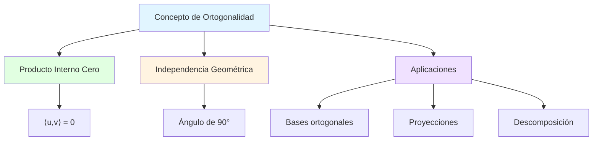
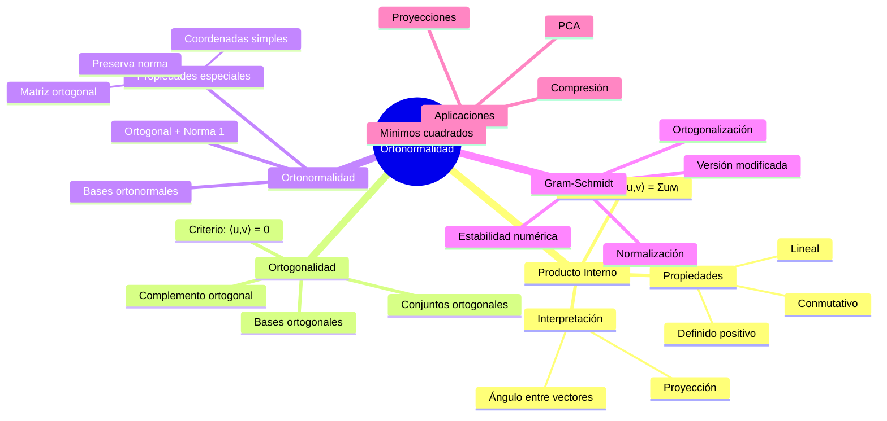
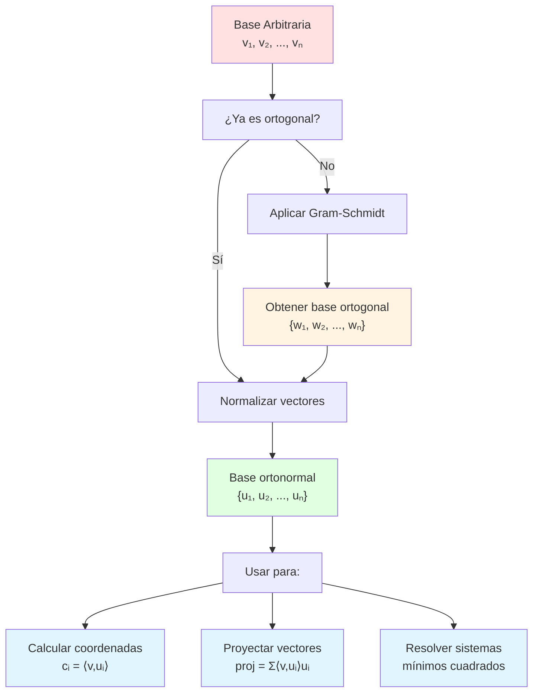

# 📐 Ortogonalidad y Ortonormalidad

## 🎯 Introducción

> [!info]- 💡 ¿Qué es la Ortogonalidad?
> 
> La **ortogonalidad** es uno de los conceptos más importantes y elegantes del álgebra lineal. Dos vectores son ortogonales cuando forman un ángulo de 90° entre sí, lo que significa que son completamente "independientes" o "perpendiculares" en su dirección.
> 
> **Analogía práctica:** Imagina las esquinas de una habitación rectangular. Las paredes que se encuentran en una esquina son ortogonales entre sí:
> 
> - La **pared norte** es ortogonal a la **pared este**
> - El **piso** es ortogonal a ambas paredes
> - Cada dimensión es completamente independiente de las otras
> 
> **¿Por qué es importante?**
> 
> |Aspecto|Descripción|Aplicación Práctica|
> |---|---|---|
> |**Independencia**|Vectores sin influencia mutua|Sistemas de coordenadas|
> |**Simplicidad**|Cálculos más fáciles|Proyecciones y descomposiciones|
> |**Estabilidad numérica**|Menor propagación de errores|Algoritmos computacionales|
> |**Interpretabilidad**|Componentes claramente separadas|Análisis de datos, PCA|
> |**Eficiencia**|Optimización de cálculos|Gráficos por computadora, compresión|



---

## 📏 Producto Interno y Ortogonalidad

### 🔍 Definición del Producto Interno

> [!example]- 📊 El Producto Interno como Herramienta Fundamental
> 
> El **producto interno** (o producto escalar) es una operación que toma dos vectores y devuelve un número escalar. Es la herramienta matemática que nos permite definir ortogonalidad.
> 
> **Definición formal en ℝⁿ:**
> 
> Para vectores **u** = (u₁, u₂, ..., uₙ) y **v** = (v₁, v₂, ..., vₙ):
> 
> $$\langle u, v \rangle = u_1v_1 + u_2v_2 + \cdots + u_nv_n = \sum_{i=1}^{n} u_iv_i$$
> 
> **Notaciones equivalentes:**
> 
> |Notación|Nombre|Uso Común|
> |---|---|---|
> |⟨u, v⟩|Notación de Dirac|Física cuántica, espacios abstractos|
> |u · v|Producto punto|Geometría, física clásica|
> |uᵀv|Notación matricial|Álgebra lineal computacional|
> 
> **Ejemplos numéricos:**
> 
> ```
> Ejemplo 1: Vectores en ℝ²
> u = (3, 4)
> v = (1, 2)
> 
> ⟨u, v⟩ = 3(1) + 4(2) = 3 + 8 = 11
> ```
> 
> ```
> Ejemplo 2: Vectores en ℝ³
> u = (1, 0, -2)
> v = (2, 3, 1)
> 
> ⟨u, v⟩ = 1(2) + 0(3) + (-2)(1) = 2 + 0 - 2 = 0
> → ¡Los vectores son ortogonales!
> ```
> 
> **Propiedades fundamentales:**
> 
> ```mermaid
> mindmap
>   root((Producto Interno))
>     Propiedades Algebraicas
>       Conmutatividad
>         ⟨u,v⟩ = ⟨v,u⟩
>       Linealidad
>         ⟨au+bv,w⟩ = a⟨u,w⟩ + b⟨v,w⟩
>       Definido positivo
>         ⟨u,u⟩ ≥ 0
>         ⟨u,u⟩ = 0 ⟺ u = 0
>     Interpretación Geométrica
>       Proyección
>         Componente en dirección
>       Ángulo
>         cos θ = ⟨u,v⟩/(||u|| ||v||)
>       Norma
>         ||u|| = √⟨u,u⟩
> ```

### ⊥ Definición de Ortogonalidad

> [!note]- 🎯 Criterio de Perpendicularidad
> 
> **Definición:** Dos vectores **u** y **v** son **ortogonales** (se denota **u** ⊥ **v**) si y solo si:
> 
> $$\langle u, v \rangle = 0$$
> 
> **Interpretación geométrica:**
> 
> ```mermaid
> graph LR
>     A[Producto Interno] --> B{⟨u,v⟩ = ?}
>     B -->|= 0| C[✅ Ortogonales<br/>Ángulo = 90°]
>     B -->|> 0| D[❌ Ángulo agudo<br/>0° < θ < 90°]
>     B -->|< 0| E[❌ Ángulo obtuso<br/>90° < θ < 180°]
>     
>     style C fill:#e1ffe1
>     style D fill:#fff4e1
>     style E fill:#ffe1e1
> ```
> 
> **Casos especiales importantes:**
> 
> |Caso|Descripción|Producto Interno|Ejemplo|
> |---|---|---|---|
> |**Vector cero**|0 es ortogonal a todo|⟨0, v⟩ = 0 para todo v|0 ⊥ cualquier vector|
> |**Bases estándar**|eᵢ ⊥ eⱼ si i ≠ j|⟨eᵢ, eⱼ⟩ = δᵢⱼ|e₁ = (1,0,0) ⊥ e₂ = (0,1,0)|
> |**Complemento ortogonal**|v ⊥ a todo W|⟨v, w⟩ = 0 ∀w ∈ W|Recta perpendicular a plano|
> 
> **Ejemplos visuales en ℝ²:**
> 
> ```
> Caso 1: Ortogonales
> u = (3, 0)  →  horizontal
> v = (0, 4)  →  vertical
> ⟨u, v⟩ = 3(0) + 0(4) = 0  ✅
> 
> Caso 2: NO ortogonales
> u = (1, 1)  →  diagonal 45°
> v = (2, 1)  →  otra dirección
> ⟨u, v⟩ = 1(2) + 1(1) = 3 ≠ 0  ❌
> 
> Caso 3: Ortogonales no obvios
> u = (2, 3)
> v = (3, -2)
> ⟨u, v⟩ = 2(3) + 3(-2) = 6 - 6 = 0  ✅
> ```
> 
> **Teorema de Pitágoras generalizado:**
> 
> Si **u** ⊥ **v**, entonces:
> 
> $$||u + v||^2 = ||u||^2 + ||v||^2$$
> 
> ```mermaid
> graph TD
>     A[u ⊥ v] --> B[Aplicar Teorema de Pitágoras]
>     B --> C[||u + v||² = ||u||² + ||v||²]
>     C --> D[Ejemplo numérico]
>     D --> E[u = 3,0, v = 0,4]
>     E --> F[||u+v||² = |3,4|² = 25]
>     E --> G[||u||² + ||v||² = 9 + 16 = 25 ✓]
>     
>     style A fill:#e1f5ff
>     style C fill:#e1ffe1
>     style G fill:#e1ffe1
> ```

### 📐 Relación con Ángulos

> [!success]- 🔺 Fórmula del Ángulo entre Vectores
> 
> **Teorema fundamental:** El ángulo θ entre dos vectores no nulos **u** y **v** satisface:
> 
> $$\cos \theta = \frac{\langle u, v \rangle}{||u|| \cdot ||v||}$$
> 
> **Casos según el valor del producto interno:**
> 
> |⟨u, v⟩|cos θ|θ|Interpretación|Gráfico|
> |---|---|---|---|---|
> |> 0|> 0|0° < θ < 90°|Mismo sentido general|↗️ ↗️|
> |= 0|= 0|θ = 90°|**Ortogonales**|↗️ ↑|
> |< 0|< 0|90° < θ < 180°|Sentidos opuestos|↗️ ↙️|
> 
> **Ejemplo completo de cálculo:**
> 
> ```
> Dados u = (1, 2, 2) y v = (2, -1, 0)
> 
> Paso 1: Calcular producto interno
> ⟨u, v⟩ = 1(2) + 2(-1) + 2(0) = 2 - 2 + 0 = 0
> 
> Paso 2: Calcular normas
> ||u|| = √(1² + 2² + 2²) = √9 = 3
> ||v|| = √(2² + (-1)² + 0²) = √5
> 
> Paso 3: Calcular ángulo
> cos θ = 0/(3√5) = 0
> θ = 90°
> 
> Conclusión: u y v son ortogonales
> ```
> 
> **Diagrama de decisión:**
> 
> ```mermaid
> flowchart TD
>     A[Calcular ⟨u,v⟩] --> B{Valor?}
>     B -->|= 0| C[θ = 90°<br/>✅ ORTOGONALES]
>     B -->|≠ 0| D[Calcular ||u|| y ||v||]
>     D --> E[cos θ = ⟨u,v⟩ / ||u|| ||v||]
>     E --> F[θ = arccos valor]
>     
>     C --> G[Relación<br/>perpendicular]
>     F --> H{θ < 90°?}
>     H -->|Sí| I[Ángulo agudo]
>     H -->|No| J[Ángulo obtuso]
>     
>     style C fill:#e1ffe1
>     style I fill:#fff4e1
>     style J fill:#ffe1e1
> ```

---

## 🏗️ Conjuntos y Bases Ortogonales

### 📦 Conjunto Ortogonal

> [!info]- 🎲 Definición y Propiedades
> 
> **Definición:** Un conjunto de vectores {v₁, v₂, ..., vₖ} es **ortogonal** si cada par de vectores distintos es ortogonal:
> 
> $$\langle v_i, v_j \rangle = 0 \text{ para todo } i \neq j$$
> 
> **Características clave:**
> 
> |Propiedad|Descripción|Implicación|
> |---|---|---|
> |**Independencia lineal**|Si todos vᵢ ≠ 0|Base potencial del espacio|
> |**Descomposición única**|Cada v se expresa únicamente|Coordenadas bien definidas|
> |**Cálculo simplificado**|Proyecciones directas|No hay términos cruzados|
> |**Ortogonalidad por pares**|Solo importan pares|Verificación sistemática|
> 
> **Ejemplo en ℝ³:**
> 
> ```
> Conjunto ortogonal:
> v₁ = (1, 0, 0)
> v₂ = (0, 1, 0)
> v₃ = (0, 0, 1)
> 
> Verificación:
> ⟨v₁, v₂⟩ = 1(0) + 0(1) + 0(0) = 0 ✓
> ⟨v₁, v₃⟩ = 1(0) + 0(0) + 0(1) = 0 ✓
> ⟨v₂, v₃⟩ = 0(0) + 1(0) + 0(1) = 0 ✓
> 
> ¡Es el conjunto ortogonal más famoso: la base estándar!
> ```
> 
> **Ejemplo NO trivial en ℝ³:**
> 
> ```
> Conjunto ortogonal:
> u₁ = (1, 1, 1)
> u₂ = (1, -2, 1)
> u₃ = (1, 0, -1)
> 
> Verificación:
> ⟨u₁, u₂⟩ = 1(1) + 1(-2) + 1(1) = 1 - 2 + 1 = 0 ✓
> ⟨u₁, u₃⟩ = 1(1) + 1(0) + 1(-1) = 1 + 0 - 1 = 0 ✓
> ⟨u₂, u₃⟩ = 1(1) + (-2)(0) + 1(-1) = 1 + 0 - 1 = 0 ✓
> ```
> 
> **Matriz de productos internos:**
> 
> Para un conjunto {v₁, v₂, v₃}, la matriz de Gram G tiene entradas:
> 
> $$G_{ij} = \langle v_i, v_j \rangle$$
> 
> Un conjunto es ortogonal si G es diagonal:
> 
> $$G = \begin{bmatrix} ||v_1||^2 & 0 & 0 \ 0 & ||v_2||^2 & 0 \ 0 & 0 & ||v_3||^2 \end{bmatrix}$$

### 🎯 Base Ortogonal

> [!example]- 🏛️ Bases Especiales
> 
> **Definición:** Una **base ortogonal** de un espacio vectorial V es un conjunto ortogonal que genera V.
> 
> **Condiciones:**
> 
> 1. Es una base (genera V y es linealmente independiente)
> 2. Es ortogonal (⟨vᵢ, vⱼ⟩ = 0 para i ≠ j)
> 
> **Ventajas sobre bases arbitrarias:**
> 
> ```mermaid
> graph LR
>     A[Base Ortogonal] --> B[Coordenadas Simples]
>     A --> C[Proyecciones Directas]
>     A --> D[Cálculos Rápidos]
>     A --> E[Estabilidad Numérica]
>     
>     B --> F[cᵢ = ⟨v,uᵢ⟩/||uᵢ||²]
>     C --> G[No hay interferencia]
>     D --> H[Sin resolver sistemas]
>     E --> I[Menor error de redondeo]
>     
>     style A fill:#e1f5ff
>     style B fill:#e1ffe1
>     style C fill:#e1ffe1
>     style D fill:#e1ffe1
>     style E fill:#e1ffe1
> ```
> 
> **Fórmula de coordenadas:**
> 
> Si {u₁, u₂, ..., uₙ} es base ortogonal de V, entonces para cualquier v ∈ V:
> 
> $$v = c_1u_1 + c_2u_2 + \cdots + c_nu_n$$
> 
> donde:
> 
> $$c_i = \frac{\langle v, u_i \rangle}{||u_i||^2}$$
> 
> **Ejemplo de uso:**
> 
> ```
> Base ortogonal de ℝ³:
> u₁ = (1, 1, 0)
> u₂ = (1, -1, 0)
> u₃ = (0, 0, 1)
> 
> Expresar v = (3, 1, 2) en esta base:
> 
> Paso 1: Calcular normas al cuadrado
> ||u₁||² = 1² + 1² + 0² = 2
> ||u₂||² = 1² + (-1)² + 0² = 2
> ||u₃||² = 0² + 0² + 1² = 1
> 
> Paso 2: Calcular coordenadas
> c₁ = ⟨v, u₁⟩/||u₁||² = (3·1 + 1·1 + 2·0)/2 = 4/2 = 2
> c₂ = ⟨v, u₂⟩/||u₂||² = (3·1 + 1·(-1) + 2·0)/2 = 2/2 = 1
> c₃ = ⟨v, u₃⟩/||u₃||² = (3·0 + 1·0 + 2·1)/1 = 2
> 
> Resultado:
> v = 2u₁ + 1u₂ + 2u₃
> 
> Verificación:
> 2(1,1,0) + 1(1,-1,0) + 2(0,0,1) = (2,2,0) + (1,-1,0) + (0,0,2) = (3,1,2) ✓
> ```
> 
> **Comparación con base no ortogonal:**
> 
> |Aspecto|Base No Ortogonal|Base Ortogonal|
> |---|---|---|
> |**Encontrar coordenadas**|Resolver sistema lineal|Fórmula directa|
> |**Complejidad**|O(n³)|O(n²)|
> |**Estabilidad**|Sensible a errores|Robusta|
> |**Intuición geométrica**|Difícil|Clara|

---

## ⭐ Ortonormalidad

### 🎖️ Definición de Conjunto Ortonormal

> [!tip]- 🌟 La Perfección de la Ortogonalidad
> 
> **Definición:** Un conjunto de vectores {u₁, u₂, ..., uₖ} es **ortonormal** si:
> 
> 1. Es **ortogonal**: ⟨uᵢ, uⱼ⟩ = 0 para i ≠ j
> 2. Cada vector tiene **norma 1**: ||uᵢ|| = 1 para todo i
> 
> **Expresión compacta usando delta de Kronecker:**
> 
> $$\langle u_i, u_j \rangle = \delta_{ij} = \begin{cases} 1 & \text{si } i = j \ 0 & \text{si } i \neq j \end{cases}$$
> 
> **Relación entre conceptos:**
> 
> ```mermaid
> graph TD
>     A[Conjunto de Vectores] --> B{¿Independientes?}
>     B -->|Sí| C[Puede ser base]
>     B -->|No| D[No es base]
>     
>     C --> E{¿Ortogonales?}
>     E -->|Sí| F[Base Ortogonal]
>     E -->|No| G[Base cualquiera]
>     
>     F --> H{¿Norma 1?}
>     H -->|Sí| I[⭐ BASE ORTONORMAL]
>     H -->|No| J[Solo ortogonal]
>     
>     style I fill:#e1ffe1
>     style F fill:#fff4e1
>     style C fill:#e1f5ff
> ```
> 
> **Ejemplo clásico - Base estándar de ℝⁿ:**
> 
> ```
> En ℝ³:
> e₁ = (1, 0, 0)
> e₂ = (0, 1, 0)
> e₃ = (0, 0, 1)
> 
> Verificación de ortonormalidad:
> 
> Ortogonalidad:
> ⟨e₁, e₂⟩ = 0  ✓
> ⟨e₁, e₃⟩ = 0  ✓
> ⟨e₂, e₃⟩ = 0  ✓
> 
> Normalidad:
> ||e₁|| = √(1²) = 1  ✓
> ||e₂|| = √(1²) = 1  ✓
> ||e₃|| = √(1²) = 1  ✓
> ```
> 
> **Ejemplo NO trivial:**
> 
> ```
> En ℝ²:
> u₁ = (√2/2, √2/2)      ≈ (0.707, 0.707)    [45°]
> u₂ = (-√2/2, √2/2)     ≈ (-0.707, 0.707)   [135°]
> 
> Verificación:
> ⟨u₁, u₂⟩ = (√2/2)(-√2/2) + (√2/2)(√2/2) = -1/2 + 1/2 = 0  ✓
> ||u₁|| = √((√2/2)² + (√2/2)²) = √(1/2 + 1/2) = 1  ✓
> ||u₂|| = 1  ✓
> ```

### 🔧 Normalización de Vectores

> [!success]- 📏 Proceso de Normalización
> 
> **Definición:** Normalizar un vector **v** ≠ **0** es crear un vector unitario **û** en la misma dirección:
> 
> $$\hat{u} = \frac{v}{||v||} = \frac{1}{||v||} v$$
> 
> **Propiedades del vector normalizado:**
> 
> - Misma dirección que v
> - Norma exactamente 1
> - Se denota con "sombrero": û
> 
> **Algoritmo paso a paso:**
> 
> ```mermaid
> flowchart TD
>     A[Vector v] --> B[Calcular norma<br/>||v|| = √⟨v,v⟩]
>     B --> C{||v|| = 0?}
>     C -->|Sí| D[❌ Error<br/>No se puede normalizar]
>     C -->|No| E[Dividir cada componente<br/>û = v/||v||]
>     E --> F[Verificar: ||û|| = 1]
>     F --> G[✅ Vector normalizado]
>     
>     style D fill:#ffe1e1
>     style G fill:#e1ffe1
> ```
> 
> **Ejemplos numéricos:**
> 
> ```
> Ejemplo 1: Vector simple
> v = (3, 4)
> ||v|| = √(3² + 4²) = √25 = 5
> 
> û = (3/5, 4/5) = (0.6, 0.8)
> 
> Verificación:
> ||û|| = √(0.6² + 0.8²) = √(0.36 + 0.64) = √1 = 1  ✓
> ```
> 
> ```
> Ejemplo 2: Vector en ℝ³
> v = (1, 2, 2)
> ||v|| = √(1² + 2² + 2²) = √9 = 3
> 
> û = (1/3, 2/3, 2/3) ≈ (0.333, 0.667, 0.667)
> 
> Verificación:
> ||û|| = √((1/3)² + (2/3)² + (2/3)²) = √(1/9 + 4/9 + 4/9) = √(9/9) = 1  ✓
> ```
> 
> **Convertir base ortogonal a ortonormal:**
> 
> ```
> Base ortogonal:
> v₁ = (1, 1, 0)       ||v₁|| = √2
> v₂ = (1, -1, 0)      ||v₂|| = √2
> v₃ = (0, 0, 2)       ||v₃|| = 2
> 
> Base ortonormal:
> u₁ = v₁/||v₁|| = (1/√2, 1/√2, 0) = (√2/2, √2/2, 0)
> u₂ = v₂/||v₂|| = (1/√2, -1/√2, 0) = (√2/2, -√2/2, 0)
> u₃ = v₃/||v₃|| = (0, 0, 1)
> ```

### 💎 Propiedades de Bases Ortonormales

> [!note]- ✨ Ventajas Computacionales y Teóricas
> 
> **1. Coordenadas ultra-simplificadas:**
> 
> Si {u₁, u₂, ..., uₙ} es base ortonormal, entonces para v ∈ V:
> 
> $$v = c_1u_1 + c_2u_2 + \cdots + c_nu_n$$
> 
> donde simplemente:
> 
> $$c_i = \langle v, u_i \rangle$$
> 
> (¡No hay división por ||uᵢ||² porque ya es 1!)
> 
> **2. Preservación de la norma (Teorema de Parseval):**
> 
> $$||v||^2 = c_1^2 + c_2^2 + \cdots + c_n^2$$
> 
> **3. Representación matricial elegante:**
> 
> Si U = [u₁ | u₂ | ... | uₙ] tiene columnas ortonormales:
> 
> $$U^T U = I$$
> 
> (La matriz U es **ortogonal**)
> 
> **Tabla comparativa de fórmulas:**
> 
> |Operación|Base Cualquiera|Base Ortogonal|Base Ortonormal|
> |---|---|---|---|
> |**Coordenadas**|Resolver Ac = v|cᵢ = ⟨v,uᵢ⟩/\|uᵢ\|²|cᵢ = ⟨v,uᵢ⟩|
> |**Reconstruir v**|v = Σ cᵢbᵢ|v = Σ cᵢuᵢ|v = Σ cᵢuᵢ|
> |**Norma de v**|Complejo|\|v\|² = Σ cᵢ²\|uᵢ\|²|\|v\|² = Σ cᵢ²|
> |**Producto interno**|⟨v,w⟩ = vᵀGw|Simplificado|⟨v,w⟩ = Σ vᵢwᵢ|
> 
> **Ejemplo completo:**
> 
> ```
> Base ortonormal en ℝ³:
> u₁ = (1, 0, 0)
> u₂ = (0, 1, 0)
> u₃ = (0, 0, 1)
> 
> Vector v = (2, -3, 5)
> 
> Paso 1: Calcular coordenadas (¡súper fácil!)
> c₁ = ⟨v, u₁⟩ = 2(1) + (-3)(0) + 5(0) = 2
> c₂ = ⟨v, u₂⟩ = 2(0) + (-3)(1) + 5(0) = -3
> c₃ = ⟨v, u₃⟩ = 2(0) + (-3)(0) + 5(1) = 5
> 
> Paso 2: Expresar v
> v = 2u₁ - 3u₂ + 5u₃
> 
> Paso 3: Verificar norma
> ||v||² = 2² + (-3)² + 5² = 4 + 9 + 25 = 38
<
> ||v|| = √38 ✓
> 
> ````
> 
> **Ventajas en aplicaciones:**
> 
> ```mermaid
> mindmap
>   root((Bases Ortonormales))
>     Computación
>       Algoritmos estables
>       Menor error numérico
>       Cálculos rápidos
>     Geometría
>       Interpretación clara
>       Coordenadas = proyecciones
>       Distancias preservadas
>     Aplicaciones
>       Procesamiento de señales
>       Compresión de datos
>       Gráficos por computadora
>       Análisis de componentes principales
> ````

---

## 🔄 Proceso de Gram-Schmidt

### 🏗️ Algoritmo de Ortonormalización

> [!example]- 🛠️ Construcción de Bases Ortonormales
> 
> El **proceso de Gram-Schmidt** transforma cualquier base en una base ortonormal, preservando el espacio generado.
> 
> **Idea intuitiva:**
> 
> ```mermaid
> graph LR
>     A["Base Cualquiera<br/>v₁, v₂, v₃" ] --> B["Ortogonalizar<br/>Gram-Schmidt" ]
>     B --> C["Base Ortogonal<br/>w₁, w₂, w₃" ]
>     C --> D[Normalizar<br/>Dividir por normas]
>     D --> E[Base Ortonormal<br/>u₁, u₂, u₃]
>     
>     style A fill:#ffe1e1
>     style C fill:#fff4e1
>     style E fill:#e1ffe1
> ```
> 
> **Algoritmo paso a paso:**
> 
> **Entrada:** Base {v₁, v₂, ..., vₙ}
> 
> **Fase 1: Ortogonalización**
> 
> $$w_1 = v_1$$
> 
> $$w_2 = v_2 - \frac{\langle v_2, w_1 \rangle}{||w_1||^2} w_1$$
> 
> $$w_3 = v_3 - \frac{\langle v_3, w_1 \rangle}{||w_1||^2} w_1 - \frac{\langle v_3, w_2 \rangle}{||w_2||^2} w_2$$
> 
> Fórmula general:
> 
> $$w_k = v_k - \sum_{j=1}^{k-1} \frac{\langle v_k, w_j \rangle}{||w_j||^2} w_j$$
> 
> **Fase 2: Normalización**
> 
> $$u_k = \frac{w_k}{||w_k||}$$
> 
> **Interpretación geométrica:**
> 
> En cada paso, removemos la proyección de vₖ sobre todos los vectores ortogonales anteriores:
> 
> ```
> w₁ = v₁                          [Primer vector sin cambios]
> w₂ = v₂ - proj_{w₁}(v₂)          [v₂ menos su componente en w₁]
> w₃ = v₃ - proj_{w₁}(v₃) - proj_{w₂}(v₃)  [v₃ ortogonal a w₁ y w₂]
> ```

### 📝 Ejemplo Detallado

> [!success]- 🎓 Aplicación Completa en ℝ³
> 
> **Problema:** Ortonormalizar la base {v₁, v₂, v₃} donde:
> 
> ```
> v₁ = (1, 1, 1)
> v₂ = (1, 1, 0)
> v₃ = (1, 0, 0)
> ```
> 
> **PASO 1: Primer vector ortogonal**
> 
> ```
> w₁ = v₁ = (1, 1, 1)
> 
> ||w₁|| = √(1² + 1² + 1²) = √3
> ```
> 
> **PASO 2: Segundo vector ortogonal**
> 
> ```
> Calcular proyección de v₂ sobre w₁:
> ⟨v₂, w₁⟩ = 1(1) + 1(1) + 0(1) = 2
> ||w₁||² = 3
> 
> Proyección: (⟨v₂,w₁⟩/||w₁||²)w₁ = (2/3)(1, 1, 1) = (2/3, 2/3, 2/3)
> 
> Restar proyección:
> w₂ = v₂ - (2/3, 2/3, 2/3)
>    = (1, 1, 0) - (2/3, 2/3, 2/3)
>    = (1/3, 1/3, -2/3)
> 
> ||w₂|| = √((1/3)² + (1/3)² + (-2/3)²) = √(1/9 + 1/9 + 4/9) = √(6/9) = √(2/3)
> ```
> 
> **PASO 3: Tercer vector ortogonal**
> 
> ```
> Proyección sobre w₁:
> ⟨v₃, w₁⟩ = 1(1) + 0(1) + 0(1) = 1
> proj_{w₁}(v₃) = (1/3)(1, 1, 1) = (1/3, 1/3, 1/3)
> 
> Proyección sobre w₂:
> ⟨v₃, w₂⟩ = 1(1/3) + 0(1/3) + 0(-2/3) = 1/3
> proj_{w₂}(v₃) = (1/3 ÷ 2/3)(1/3, 1/3, -2/3) = (1/2)(1/3, 1/3, -2/3)
>                = (1/6, 1/6, -1/3)
> 
> Restar ambas proyecciones:
> w₃ = (1, 0, 0) - (1/3, 1/3, 1/3) - (1/6, 1/6, -1/3)
>    = (1 - 1/3 - 1/6, 0 - 1/3 - 1/6, 0 - 1/3 + 1/3)
>    = (1/2, -1/2, 0)
> 
> ||w₃|| = √((1/2)² + (-1/2)²) = √(1/4 + 1/4) = √(1/2) = 1/√2
> ```
> 
> **PASO 4: Normalización**
> 
> ```
> u₁ = w₁/||w₁|| = (1/√3, 1/√3, 1/√3)
> 
> u₂ = w₂/||w₂|| = (1/3, 1/3, -2/3) / √(2/3)
>                 = (1/√6, 1/√6, -2/√6)
> 
> u₃ = w₃/||w₃|| = (1/2, -1/2, 0) / (1/√2)
>                 = (1/√2, -1/√2, 0)
> ```
> 
> **VERIFICACIÓN FINAL:**
> 
> ```
> Ortonormalidad:
> ⟨u₁, u₂⟩ = (1/√3)(1/√6) + (1/√3)(1/√6) + (1/√3)(-2/√6)
>          = 1/√18 + 1/√18 - 2/√18 = 0  ✓
> 
> ⟨u₁, u₃⟩ = (1/√3)(1/√2) + (1/√3)(-1/√2) + (1/√3)(0)
>          = 1/√6 - 1/√6 + 0 = 0  ✓
> 
> ⟨u₂, u₃⟩ = (1/√6)(1/√2) + (1/√6)(-1/√2) + (-2/√6)(0)
>          = 1/√12 - 1/√12 + 0 = 0  ✓
> 
> Normas unitarias:
> ||u₁|| = √(3 · (1/√3)²) = √(3/3) = 1  ✓
> ||u₂|| = √(2 · (1/√6)² + (2/√6)²) = √(6/6) = 1  ✓
> ||u₃|| = √(2 · (1/√2)²) = √(2/2) = 1  ✓
> ```

### ⚠️ Consideraciones Prácticas

> [!warning]- 🔍 Limitaciones y Alternativas
> 
> **Problemas del Gram-Schmidt clásico:**
> 
> |Problema|Causa|Efecto|Solución|
> |---|---|---|---|
> |**Inestabilidad numérica**|Errores de redondeo acumulados|Vectores no perfectamente ortogonales|Gram-Schmidt modificado|
> |**Dependencia lineal**|Vectores casi paralelos|División por cero o número muy pequeño|Verificar independencia previa|
> |**Pérdida de ortogonalidad**|Propagación de errores|Base final no ortogonal|Re-ortogonalización|
> |**Complejidad**|O(n³) operaciones|Lento para n grande|Métodos basados en QR|
> 
> **Gram-Schmidt Modificado (MGS):**
> 
> En lugar de restar todas las proyecciones al final, se hace de forma iterativa:
> 
> ```
> Clásico (CGS):
> w₃ = v₃ - proj_{w₁}(v₃) - proj_{w₂}(v₃)
> 
> Modificado (MGS):
> w₃ = v₃
> w₃ = w₃ - proj_{w₁}(w₃)  [actualizar w₃]
> w₃ = w₃ - proj_{w₂}(w₃)  [actualizar w₃ nuevamente]
> ```
> 
> **Ventajas de MGS:**
> 
> - Más estable numéricamente
> - Mejor ortogonalidad en práctica
> - Misma complejidad O(n³)
> 
> **Cuándo usar alternativas:**
> 
> ```mermaid
> flowchart TD
>     A[¿Necesitas base ortonormal?] --> B{Tamaño del problema}
>     B -->|Pequeño n<20| C[Gram-Schmidt clásico<br/>Simple y suficiente]
>     B -->|Mediano 20-100| D[Gram-Schmidt modificado<br/>Más estable]
>     B -->|Grande n>100| E[Factorización QR<br/>Householder/Givens]
>     
>     C --> F{¿Precisión crítica?}
>     F -->|Sí| G[Usar MGS o QR]
>     F -->|No| H[CGS es OK]
>     
>     style C fill:#e1ffe1
>     style D fill:#fff4e1
>     style E fill:#e1f5ff
> ```

---

## 🎨 Aplicaciones Prácticas

### 📊 Proyecciones Ortogonales

> [!info]- 🎯 Descomposición de Vectores
> 
> **Concepto:** La proyección ortogonal de **v** sobre **u** es el vector en la dirección de **u** que está "más cerca" de **v**.
> 
> **Fórmula:**
> 
> $$\text{proj}_u(v) = \frac{\langle v, u \rangle}{||u||^2} u$$
> 
> Si **u** es unitario (||u|| = 1):
> 
> $$\text{proj}_u(v) = \langle v, u \rangle , u$$
> 
> **Descomposición ortogonal:**
> 
> Todo vector **v** se puede descomponer respecto a **u**:
> 
> $$v = \text{proj}_u(v) + \text{perp}_u(v)$$
> 
> donde perp_u(v) es la componente perpendicular:
> 
> $$\text{perp}_u(v) = v - \text{proj}_u(v)$$
> 
> **Visualización:**
> 
> ```mermaid
> graph TD
>     A[Vector v] --> B[Proyectar sobre u]
>     B --> C[proj_u v<br/>Componente paralela]
>     B --> D[perp_u v<br/>Componente perpendicular]
>     
>     C --> E[En dirección de u]
>     D --> F[Ortogonal a u]
>     
>     E --> G[v = proj_u v + perp_u v]
>     F --> G
>     
>     style C fill:#e1ffe1
>     style D fill:#fff4e1
>     style G fill:#e1f5ff
> ```
> 
> **Ejemplo numérico:**
> 
> ```
> Proyectar v = (2, 3) sobre u = (1, 0)
> 
> Paso 1: Calcular producto interno
> ⟨v, u⟩ = 2(1) + 3(0) = 2
> 
> Paso 2: Calcular norma al cuadrado
> ||u||² = 1² + 0² = 1
> 
> Paso 3: Proyección
> proj_u(v) = (2/1)(1, 0) = (2, 0)
> 
> Paso 4: Componente perpendicular
> perp_u(v) = (2, 3) - (2, 0) = (0, 3)
> 
> Verificación:
> v = (2, 0) + (0, 3) = (2, 3)  ✓
> ⟨(2, 0), (0, 3)⟩ = 0  ✓  [Son ortogonales]
> ```
> 
> **Aplicación: Proyección sobre subespacio**
> 
> Si W tiene base ortonormal {u₁, u₂, ..., uₖ}, la proyección de v sobre W es:
> 
> $$\text{proj}_W(v) = \langle v, u_1 \rangle u_1 + \langle v, u_2 \rangle u_2 + \cdots + \langle v, u_k \rangle u_k$$

### 🔬 Mínimos Cuadrados

> [!example]- 📈 Aproximación Óptima
> 
> **Problema:** Dado un sistema inconsistente **Ax = b** (más ecuaciones que incógnitas), encontrar la "mejor" solución.
> 
> **Interpretación geométrica:**
> 
> - **b** no está en Col(A)
> - Buscar **x̂** tal que **Ax̂** sea la proyección de **b** sobre Col(A)
> - Minimizar ||**b** - **Ax**||
> 
> **Ecuación normal:**
> 
> $$A^T A \hat{x} = A^T b$$
> 
> **Con base ortonormal:**
> 
> Si las columnas de A son ortonormales, la solución se simplifica:
> 
> $$\hat{x}_i = \langle b, a_i \rangle$$
> 
> donde a_i son las columnas de A.
> 
> **Ejemplo: Ajuste de línea recta**
> 
> ```
> Datos: (1, 1), (2, 3), (3, 2)
> 
> Queremos: y = mx + c
> 
> Sistema (sobredeterminado):
> 1m + c = 1
> 2m + c = 3
> 3m + c = 2
> 
> Forma matricial:
> [1 1]     [m]   [1]
> [2 1]  ·  [c] = [3]
> [3 1]           [2]
> 
> A no es ortogonal, usar ecuación normal:
> AᵀA x̂ = Aᵀb
> 
> [1 2 3] [1 1]   [m]   [1 2 3] [1]
> [1 1 1] [2 1] · [c] = [1 1 1] [3]
>         [3 1]                 [2]
> 
> [14 6]   [m]   [11]
> [ 6 3] · [c] = [ 6]
> 
> Solución: m ≈ 0.5, c ≈ 1
> Línea: y = 0.5x + 1
> ```

### 🖼️ Compresión de Imágenes

> [!tip]- 🎨 Representación Eficiente
> 
> **Idea clave:** Usar base ortonormal donde la información se concentra en pocos coeficientes.
> 
> **Proceso:**
> 
> ```mermaid
> flowchart LR
>     A[Imagen Original<br/>n × n píxeles] --> B[Transformar a<br/>base ortonormal]
>     B --> C[Obtener<br/>coeficientes]
>     C --> D[Descartar<br/>coeficientes pequeños]
>     D --> E[Reconstruir<br/>imagen comprimida]
>     
>     style A fill:#e1f5ff
>     style C fill:#e1ffe1
>     style E fill:#fff4e1
> ```
> 
> **Ejemplo con DCT (Discrete Cosine Transform):**
> 
> 1. **Dividir imagen** en bloques 8×8
> 2. **Aplicar DCT** (usa base ortonormal de cosenos)
> 3. **Cuantizar** (mantener solo coeficientes grandes)
> 4. **Codificar** coeficientes restantes
> 
> **Ventaja de ortogonalidad:**
> 
> - Coeficientes independientes
> - Energía concentrada en pocos términos
> - Fácil reconstrucción parcial
> 
> **Comparación de bases:**
> 
> |Base|Ventaja|Aplicación|
> |---|---|---|
> |**DCT**|Buena compresión|JPEG, MP3|
> |**Wavelets**|Multi-resolución|JPEG 2000|
> |**Fourier**|Frecuencias puras|Análisis espectral|
> |**Hadamard**|Solo ±1, rápida|Video codecs|

---

## 📊 Resumen Visual y Comparativo

### 🗺️ Mapa Conceptual Completo



### 📋 Tabla Comparativa de Conceptos

|Concepto|Definición|Condición Matemática|Ejemplo Simple|
|---|---|---|---|
|**Vectores ortogonales**|Perpendiculares|⟨u,v⟩ = 0|(1,0) ⊥ (0,1)|
|**Conjunto ortogonal**|Ortogonales por pares|⟨vᵢ,vⱼ⟩ = 0, i≠j|{(1,0), (0,1)}|
|**Base ortogonal**|Conjunto ortogonal que genera|Ortogonal + genera V|Base estándar|
|**Vector normalizado**|Norma 1|\|u\| = 1|(1,0), (0,1)|
|**Conjunto ortonormal**|Ortogonal + normalizado|⟨uᵢ,uⱼ⟩ = δᵢⱼ|{(1,0), (0,1)}|
|**Base ortonormal**|Base + ortonormal|Base + ⟨uᵢ,uⱼ⟩ = δᵢⱼ|Base estándar de ℝⁿ|

### 🎯 Flujo de Trabajo Típico



---

## 💪 Ejercicios Progresivos

### 🎯 Nivel Básico

> [!example]- 📝 Ejercicios Fundamentales
> 
> **Ejercicio 1: Verificar ortogonalidad**
> 
> Determina si los siguientes pares de vectores son ortogonales:
> 
> a) u = (1, -1, 2), v = (2, 2, 0) b) u = (3, 4), v = (4, -3) c) u = (1, 1, 1, 1), v = (1, -1, 1, -1)
> 
> **Solución:**
> 
> ```
> a) ⟨u,v⟩ = 1(2) + (-1)(2) + 2(0) = 2 - 2 + 0 = 0  ✅ Ortogonales
> 
> b) ⟨u,v⟩ = 3(4) + 4(-3) = 12 - 12 = 0  ✅ Ortogonales
> 
> c) ⟨u,v⟩ = 1(1) + 1(-1) + 1(1) + 1(-1) = 1 - 1 + 1 - 1 = 0  ✅ Ortogonales
> ```
> 
> **Ejercicio 2: Normalizar vectores**
> 
> Normaliza los siguientes vectores:
> 
> a) v = (3, 4) b) v = (1, 2, 2) c) v = (1, 1, 1, 1)
> 
> **Solución:**
> 
> ```
> a) ||v|| = √(9 + 16) = 5
>    û = (3/5, 4/5) = (0.6, 0.8)
> 
> b) ||v|| = √(1 + 4 + 4) = 3
>    û = (1/3, 2/3, 2/3)
> 
> c) ||v|| = √4 = 2
>    û = (1/2, 1/2, 1/2, 1/2)
> ```

### 🎓 Nivel Intermedio

> [!example]- 🔧 Aplicaciones y Cálculos
> 
> **Ejercicio 3: Proyección ortogonal**
> 
> Proyecta v = (2, 3, 1) sobre u = (1, 0, 0)
> 
> **Solución:**
> 
> ```
> proj_u(v) = (⟨v,u⟩/||u||²)u
>           = (2/1)(1, 0, 0)
>           = (2, 0, 0)
> 
> Componente perpendicular:
> perp_u(v) = v - proj_u(v) = (2,3,1) - (2,0,0) = (0, 3, 1)
> 
> Verificación:
> ⟨(2,0,0), (0,3,1)⟩ = 0  ✓
> ```
> 
> **Ejercicio 4: Ortonormalizar un conjunto**
> 
> Aplica Gram-Schmidt a {(1,1), (1,-1)}
> 
> **Solución:**
> 
> ```
> Paso 1: w₁ = (1, 1), ||w₁|| = √2
> 
> Paso 2: w₂ = (1,-1) - proj_{w₁}((1,-1))
>       ⟨(1,-1), (1,1)⟩ = 0  [¡Ya son ortogonales!]
>       w₂ = (1, -1), ||w₂|| = √2
> 
> Paso 3: Normalizar
>       u₁ = (1/√2, 1/√2)
>       u₂ = (1/√2, -1/√2)
> ```

### 🏆 Nivel Avanzado

> [!example]- 🚀 Desafíos Complejos
> 
> **Ejercicio 5: Gram-Schmidt completo**
> 
> Ortonormaliza {(1,0,1), (1,1,0), (0,1,1)}
> 
> **Solución:**
> 
> ```
> Paso 1: w₁ = (1,0,1), ||w₁|| = √2
> 
> Paso 2: w₂ = (1,1,0) - [(1·1 + 1·0 + 0·1)/2](1,0,1)
>            = (1,1,0) - (1/2)(1,0,1)
>            = (1/2, 1, -1/2)
>       ||w₂|| = √(1/4 + 1 + 1/4) = √(3/2)
> 
> Paso 3: w₃ = (0,1,1) - proj_{w₁}(0,1,1) - proj_{w₂}(0,1,1)
>       [Cálculos similares...]
>       w₃ = (-2/3, 1/3, 1/3)
> 
> Paso 4: Normalizar cada wᵢ para obtener {u₁, u₂, u₃}
> ```
> 
> **Ejercicio 6: Mínimos cuadrados**
> 
> Encuentra la recta y = mx + c que mejor ajusta los puntos: (0,1), (1,2), (2,4), (3,4)
> 
> [Pista: Plantear Ax = b y usar AᵀAx̂ = Aᵀb]

---

## 🔗 Conexiones y Próximos Pasos

> [!quote]- 🌟 Progresión del Aprendizaje
> 
> **Has dominado:**
> 
> ```mermaid
> graph LR
>     A[Producto Interno] --> B[Ortogonalidad]
>     B --> C[Ortonormalidad]
>     C --> D[Gram-Schmidt]
>     D --> E[Aplicaciones]
>     
>     style A fill:#e1ffe1
>     style B fill:#e1ffe1
>     style C fill:#e1ffe1
>     style D fill:#e1ffe1
>     style E fill:#e1ffe1
> ```
> 
> **Próximos temas naturales:**
> 
> |Nivel|Tema|Por qué es el siguiente paso|
> |---|---|---|
> |**Actual**|Ortogonalidad|Base para descomposiciones|
> |**Siguiente**|Descomposición QR|Gram-Schmidt en forma matricial|
> |**Avanzado**|Valores y vectores propios|Bases especiales del operador|
> |**Aplicado**|SVD (Descomposición en valores singulares)|Generalización de propios|
> |**Especializado**|PCA (Análisis de componentes principales)|Aplicación directa de SVD|
> 
> **Roadmap de evolución:**
> 
> ```mermaid
> graph TB
>     A[Ortogonalidad] --> B[QR Factorization]
>     A --> C[Proyecciones]
>     B --> D[Eigen-descomposición]
>
> C --> E[Mínimos Cuadrados]
> D --> F[SVD]
> E --> F
> F --> G[PCA]
> F --> H[Compresión]
> G --> I[Machine Learning]
> H --> I
> 
> style A fill:#e1ffe1
> style F fill:#fff4e1
> style I fill:#e1f5ff
> ```
> 
> ```
> 
> **Aplicaciones en el mundo real:**
> 
> - **Gráficos por computadora:** Transformaciones ortogonales preservan ángulos
> - **Procesamiento de señales:** Fourier y wavelets usan bases ortonormales
> - **Aprendizaje automático:** PCA reduce dimensionalidad manteniendo información
> - **Estadística:** Regresión lineal se basa en proyecciones ortogonales
> - **Física cuántica:** Estados cuánticos forman espacios de Hilbert ortonormales
> ```

---

**Tags:** #algebra-lineal #ortogonalidad #ortonormalidad #producto-interno #gram-schmidt #proyecciones #bases #normalizacion #matematicas #mermaid #diagramas
