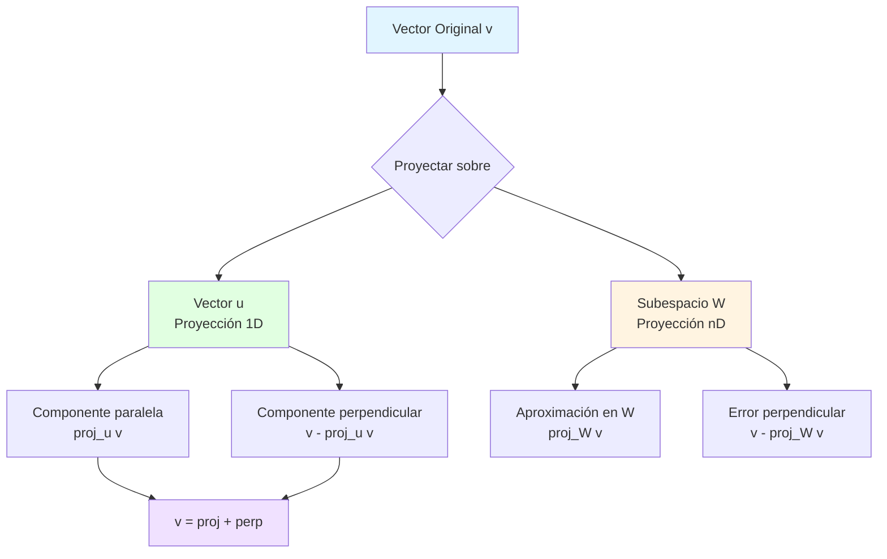
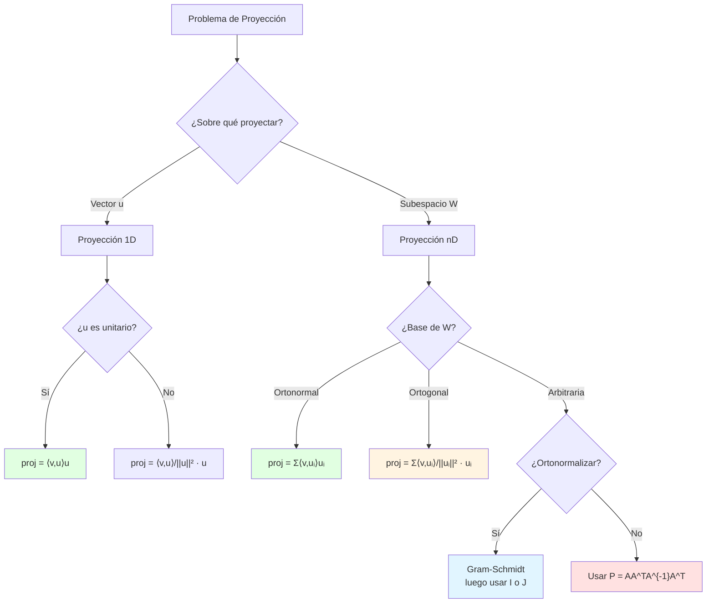

# 🎯 Proyección Ortogonal

## 🎯 Introducción

> [!info]- 💡 ¿Qué es la Proyección Ortogonal?
> 
> La **proyección ortogonal** es una de las operaciones más fundamentales e intuitivas del álgebra lineal. Consiste en "proyectar" un vector sobre otro vector o subespacio, similar a como una sombra se proyecta sobre el suelo cuando la luz viene desde arriba.
> 
> **Analogía práctica:** Imagina que estás parado bajo el sol al mediodía:
> 
> - **Tú** eres el vector original en el espacio 3D
> - **Tu sombra** en el suelo es la proyección ortogonal
> - La **dirección de la luz** (vertical) determina cómo se proyecta
> - La sombra está en el plano del suelo (subespacio 2D)
> - La distancia vertical entre tú y tu sombra es la componente perpendicular
> 
> **¿Por qué es importante?**
> 
> |Aspecto|Descripción|Aplicación Práctica|
> |---|---|---|
> |**Aproximación óptima**|Punto más cercano en un subespacio|Regresión lineal, ajuste de datos|
> |**Descomposición**|Separar componentes paralela y perpendicular|Análisis de fuerzas, señales|
> |**Visualización**|Reducir dimensionalidad|Gráficos 3D → 2D, compresión|
> |**Filtrado**|Extraer componentes deseadas|Procesamiento de señales, imágenes|
> |**Geometría**|Distancias y ángulos|Colisiones, renderizado 3D|



---

## 📐 Proyección sobre un Vector

### 🎯 Definición y Fórmula

> [!example]- 📊 Proyección Vectorial Básica
> 
> **Definición:** La proyección ortogonal de un vector **v** sobre un vector no nulo **u** es el vector en la dirección de **u** que está más cerca de **v**.
> 
> **Fórmula fundamental:**
> 
> $$\text{proj}_u(v) = \frac{\langle v, u \rangle}{||u||^2} u = \frac{\langle v, u \rangle}{\langle u, u \rangle} u$$
> 
> **Caso especial (u unitario):**
> 
> Si ||**u**|| = 1, la fórmula se simplifica:
> 
> $$\text{proj}_u(v) = \langle v, u \rangle , u$$
> 
> **Componentes de la fórmula:**
> 
> |Componente|Significado|Unidades|
> |---|---|---|
> |**⟨v, u⟩**|"Cuánto de v va en dirección u"|Escalar|
> |**\|u\|²**|Normalización por longitud de u|Escalar positivo|
> |**u**|Dirección de la proyección|Vector|
> |**⟨v,u⟩/\|u\|²**|Coeficiente escalar|Número real|
> 
> **Interpretación geométrica:**
> 
> ```mermaid
> graph TD
>     A[Vector v] --> B[Descomponer respecto a u]
>     B --> C[Componente paralela<br/>proj_u v]
>     B --> D[Componente perpendicular<br/>perp_u v]
>     
>     C --> E["Fórmula: (⟨v,u⟩/||u||²)u"]
>     D --> F["Fórmula: v - proj_u v"]
>     
>     E --> G[En la dirección de u]
>     F --> H[Ortogonal a u]
>     
>     G --> I["||proj_u v|| = |⟨v,u⟩|/||u||"]
>     H --> J["⟨perp_u v, u⟩ = 0"]
>     
>     style C fill:#e1ffe1
>     style D fill:#fff4e1
>     style I fill:#e1f5ff
>     style J fill:#f0e1ff
> ```
> 
> **Propiedades fundamentales:**
> 
> 1. **proj_u(v)** es paralelo a **u**
> 2. **v - proj_u(v)** es ortogonal a **u**
> 3. **v = proj_u(v) + perp_u(v)** (descomposición ortogonal)
> 4. proj_u(v) minimiza ||**v** - c**u**|| para cualquier escalar c

### 📝 Ejemplos Numéricos Detallados

> [!success]- 🔢 Cálculos Paso a Paso
> 
> **Ejemplo 1: Proyección en ℝ²**
> 
> Proyectar **v** = (3, 4) sobre **u** = (1, 0)
> 
> ```
> PASO 1: Calcular producto interno
> ⟨v, u⟩ = 3(1) + 4(0) = 3
> 
> PASO 2: Calcular ||u||²
> ||u||² = 1² + 0² = 1
> 
> PASO 3: Aplicar fórmula
> proj_u(v) = (3/1)(1, 0) = (3, 0)
> 
> PASO 4: Componente perpendicular
> perp_u(v) = (3, 4) - (3, 0) = (0, 4)
> 
> VERIFICACIÓN:
> ✓ (3, 4) = (3, 0) + (0, 4)
> ✓ ⟨(3, 0), (0, 4)⟩ = 0  [Son ortogonales]
> ✓ (3, 0) es paralelo a (1, 0)
> 
> INTERPRETACIÓN:
> La proyección sobre el eje x da la componente horizontal.
> ```
> 
> **Ejemplo 2: Proyección oblicua en ℝ²**
> 
> Proyectar **v** = (5, 2) sobre **u** = (3, 4)
> 
> ```
> PASO 1: Calcular producto interno
> ⟨v, u⟩ = 5(3) + 2(4) = 15 + 8 = 23
> 
> PASO 2: Calcular ||u||²
> ||u||² = 3² + 4² = 9 + 16 = 25
> 
> PASO 3: Aplicar fórmula
> proj_u(v) = (23/25)(3, 4) = (69/25, 92/25) = (2.76, 3.68)
> 
> PASO 4: Componente perpendicular
> perp_u(v) = (5, 2) - (2.76, 3.68) = (2.24, -1.68)
> 
> VERIFICACIÓN:
> ⟨(2.76, 3.68), (2.24, -1.68)⟩ 
> = 2.76(2.24) + 3.68(-1.68) 
> = 6.1824 - 6.1824 = 0 ✓
> ```
> 
> **Ejemplo 3: Proyección en ℝ³**
> 
> Proyectar **v** = (1, 2, 3) sobre **u** = (1, 1, 0)
> 
> ```
> PASO 1: Calcular producto interno
> ⟨v, u⟩ = 1(1) + 2(1) + 3(0) = 3
> 
> PASO 2: Calcular ||u||²
> ||u||² = 1² + 1² + 0² = 2
> 
> PASO 3: Aplicar fórmula
> proj_u(v) = (3/2)(1, 1, 0) = (3/2, 3/2, 0) = (1.5, 1.5, 0)
> 
> PASO 4: Componente perpendicular
> perp_u(v) = (1, 2, 3) - (1.5, 1.5, 0) = (-0.5, 0.5, 3)
> 
> INTERPRETACIÓN:
> - proj_u(v) está en el plano xy
> - perp_u(v) tiene toda la componente z
> - La proyección "aplana" v hacia el plano xy en dirección (1,1,0)
> ```
> 
> **Ejemplo 4: Caso con vector unitario**
> 
> Proyectar **v** = (2, 3, 6) sobre **û** = (0, 0, 1) [vector unitario]
> 
> ```
> Como ||û|| = 1, usamos fórmula simplificada:
> 
> proj_û(v) = ⟨v, û⟩ û
>           = [2(0) + 3(0) + 6(1)] (0, 0, 1)
>           = 6(0, 0, 1)
>           = (0, 0, 6)
> 
> INTERPRETACIÓN:
> Extrae solo la componente z del vector.
> ```

### 🔍 Propiedades Matemáticas

> [!note]- 📐 Características de la Proyección
> 
> **Propiedad 1: Linealidad**
> 
> $$\text{proj}_u(av + bw) = a \cdot \text{proj}_u(v) + b \cdot \text{proj}_u(w)$$
> 
> ```
> Ejemplo:
> proj_u(2v + 3w) = 2·proj_u(v) + 3·proj_u(w)
> ```
> 
> **Propiedad 2: Idempotencia**
> 
> $$\text{proj}_u(\text{proj}_u(v)) = \text{proj}_u(v)$$
> 
> ```
> Proyectar dos veces da el mismo resultado:
> proj_u(proj_u(v)) = proj_u(v)
> 
> Analogía: Una sombra proyectada no cambia si la "proyectas de nuevo"
> ```
> 
> **Propiedad 3: Ortogonalidad del residuo**
> 
> $$\langle v - \text{proj}_u(v), u \rangle = 0$$
> 
> ```
> La diferencia v - proj_u(v) es siempre perpendicular a u
> ```
> 
> **Propiedad 4: Teorema de Pitágoras**
> 
> $$||v||^2 = ||\text{proj}_u(v)||^2 + ||\text{perp}_u(v)||^2$$
> 
> ```
> Ejemplo:
> v = (3, 4), u = (1, 0)
> proj_u(v) = (3, 0), perp_u(v) = (0, 4)
> 
> ||v||² = 3² + 4² = 25
> ||proj_u(v)||² + ||perp_u(v)||² = 9 + 16 = 25 ✓
> ```
> 
> **Propiedad 5: Norma de la proyección**
> 
> $$||\text{proj}_u(v)|| = \frac{|\langle v, u \rangle|}{||u||}$$
> 
> ```
> La longitud de la proyección depende del ángulo:
> - Si v ⊥ u: ||proj_u(v)|| = 0
> - Si v ∥ u: ||proj_u(v)|| = ||v||
> - En general: ||proj_u(v)|| = ||v|| |cos θ|
> ```
> 
> **Tabla resumen de propiedades:**
> 
> |Propiedad|Fórmula|Significado|
> |---|---|---|
> |**Linealidad**|proj_u(av+bw) = a·proj_u(v) + b·proj_u(w)|Se distribuye sobre sumas|
> |**Idempotencia**|proj_u(proj_u(v)) = proj_u(v)|Aplicar 2 veces = 1 vez|
> |**Simetría**|proj_u(v) = proj_{cu}(v) para c≠0|Escalar u no cambia dirección|
> |**Ortogonalidad**|⟨v - proj_u(v), u⟩ = 0|Residuo perpendicular|
> |**Acotamiento**|\|proj_u(v)\| ≤ \|v\||Proyección no aumenta norma|

---

## 🏗️ Proyección sobre Subespacios

### 📦 Conceptos Fundamentales

> [!info]- 🎲 De Vectores a Subespacios
> 
> **Definición:** La proyección ortogonal de un vector **v** sobre un subespacio W es el vector en W que está más cerca de **v**.
> 
> $$\text{proj}_W(v) = \text{el único vector } w \in W \text{ tal que } v - w \perp W$$
> 
> **Diferencia con proyección sobre vector:**
> 
> ```mermaid
> graph TB
>     A[Proyección] --> B[Sobre Vector u<br/>Línea 1D]
>     A --> C[Sobre Subespacio W<br/>Plano nD]
>     
>     B --> D[Fórmula: ⟨v,u⟩/||u||² · u]
>     B --> E[Resultado: en span u]
>     
>     C --> F[Fórmula: Σ ⟨v,uᵢ⟩uᵢ]
>     C --> G[Resultado: en W]
>     
>     D --> H[Caso especial n=1]
>     F --> I[Caso general n≥1]
>     
>     style B fill:#e1ffe1
>     style C fill:#fff4e1
>     style H fill:#e1f5ff
>     style I fill:#e1f5ff
> ```
> 
> **Caracterización del subespacio:**
> 
> |Subespacio W|Base|Dimensión|Ejemplo|
> |---|---|---|---|
> |**Línea**|{u}|1|span{(1,0,0)}|
> |**Plano**|{u₁, u₂}|2|Plano xy: span{(1,0,0), (0,1,0)}|
> |**Hiperplano**|{u₁,...,uₙ₋₁}|n-1|En ℝ³: plano general|
> |**Todo el espacio**|{u₁,...,uₙ}|n|ℝⁿ|
> 
> **Propiedades únicas:**
> 
> 1. **Existencia y unicidad:** Para todo v y W, existe único proj_W(v)
> 2. **Mejor aproximación:** proj_W(v) minimiza ||v - w|| para todo w ∈ W
> 3. **Ortogonalidad:** v - proj_W(v) es ortogonal a todo vector en W
> 4. **Descomposición:** v = proj_W(v) + proj_W⊥(v)

### 🎯 Fórmula con Base Ortogonal

> [!success]- 📐 Cálculo Simplificado
> 
> **Teorema:** Si W tiene base ortogonal {u₁, u₂, ..., uₖ}, entonces:
> 
> $$\text{proj}_W(v) = \frac{\langle v, u_1 \rangle}{||u_1||^2} u_1 + \frac{\langle v, u_2 \rangle}{||u_2||^2} u_2 + \cdots + \frac{\langle v, u_k \rangle}{||u_k||^2} u_k$$
> 
> **Forma compacta:**
> 
> $$\text{proj}_W(v) = \sum_{i=1}^{k} \frac{\langle v, u_i \rangle}{||u_i||^2} u_i$$
> 
> **Caso especial con base ortonormal:**
> 
> Si ||uᵢ|| = 1 para todo i:
> 
> $$\text{proj}_W(v) = \langle v, u_1 \rangle u_1 + \langle v, u_2 \rangle u_2 + \cdots + \langle v, u_k \rangle u_k$$
> 
> **Algoritmo de cálculo:**
> 
> ```mermaid
> flowchart TD
>     A[Vector v a proyectar] --> B{¿Base de W es ortogonal?}
>     B -->|Sí| C[Usar fórmula directa]
>     B -->|No| D[Ortonormalizar base<br/>Gram-Schmidt]
>     
>     D --> C
>     C --> E[Para cada uᵢ en base:]
>     E --> F[Calcular cᵢ = ⟨v,uᵢ⟩/||uᵢ||²]
>     F --> G[Sumar: proj_W v = Σ cᵢuᵢ]
>     G --> H[Resultado en W]
>     
>     style C fill:#e1ffe1
>     style G fill:#e1f5ff
>     style H fill:#fff4e1
> ```
> 
> **Ejemplo completo: Proyección sobre plano**
> 
> ```
> Proyectar v = (1, 2, 3) sobre el plano W = span{u₁, u₂} donde:
> u₁ = (1, 0, 0)
> u₂ = (0, 1, 0)
> 
> VERIFICAR: ¿Base ortogonal?
> ⟨u₁, u₂⟩ = 1(0) + 0(1) + 0(0) = 0 ✓
> 
> PASO 1: Proyección sobre u₁
> ⟨v, u₁⟩ = 1(1) + 2(0) + 3(0) = 1
> ||u₁||² = 1
> proj_u₁(v) = (1/1)(1, 0, 0) = (1, 0, 0)
> 
> PASO 2: Proyección sobre u₂
> ⟨v, u₂⟩ = 1(0) + 2(1) + 3(0) = 2
> ||u₂||² = 1
> proj_u₂(v) = (2/1)(0, 1, 0) = (0, 2, 0)
> 
> PASO 3: Sumar proyecciones
> proj_W(v) = (1, 0, 0) + (0, 2, 0) = (1, 2, 0)
> 
> PASO 4: Componente perpendicular
> perp_W(v) = (1, 2, 3) - (1, 2, 0) = (0, 0, 3)
> 
> INTERPRETACIÓN:
> - W es el plano xy
> - proj_W(v) "aplana" v sobre el plano xy
> - perp_W(v) es la altura sobre el plano (componente z)
> 
> VERIFICACIÓN:
> ✓ (1, 2, 0) está en W [combinación de u₁ y u₂]
> ✓ (0, 0, 3) ⊥ u₁: ⟨(0,0,3), (1,0,0)⟩ = 0
> ✓ (0, 0, 3) ⊥ u₂: ⟨(0,0,3), (0,1,0)⟩ = 0
> ✓ v = proj_W(v) + perp_W(v)
> ```
> 
> **Ventajas de base ortogonal:**
> 
> |Aspecto|Base Ortogonal|Base No Ortogonal|
> |---|---|---|
> |**Fórmula**|Suma de proyecciones|Resolver sistema lineal|
> |**Complejidad**|O(nk)|O(k³ + nk)|
> |**Estabilidad**|Excelente|Puede ser mala|
> |**Interpretación**|Clara|Difícil|
> |**Implementación**|Directa|Requiere solver|

### 🔧 Caso General: Base Arbitraria

> [!warning]- ⚙️ Cuando la Base NO es Ortogonal
> 
> **Problema:** Si W = span{v₁, v₂, ..., vₖ} y la base NO es ortogonal, no podemos usar la fórmula simple.
> 
> **Solución 1: Ortonormalizar primero**
> 
> ```
> PASO 1: Aplicar Gram-Schmidt a {v₁, v₂, ..., vₖ}
>         → Obtener base ortogonal {u₁, u₂, ..., uₖ}
> 
> PASO 2: Usar fórmula con base ortogonal
>         proj_W(v) = Σ (⟨v,uᵢ⟩/||uᵢ||²)uᵢ
> ```
> 
> **Solución 2: Ecuaciones normales (sin ortonormalizar)**
> 
> Resolver el sistema:
> 
> $$A^T A \mathbf{x} = A^T \mathbf{v}$$
> 
> donde A = [v₁ | v₂ | ... | vₖ] (matriz con base como columnas)
> 
> Entonces:
> 
> $$\text{proj}_W(v) = A\mathbf{x} = v_1 x_1 + v_2 x_2 + \cdots + v_k x_k$$
> 
> **Ejemplo: Base no ortogonal**
> 
> ```
> Proyectar v = (5, 5) sobre W = span{(2,1), (1,2)}
> 
> MÉTODO 1: Gram-Schmidt
> u₁ = (2, 1), ||u₁||² = 5
> 
> u₂ = (1,2) - [(1·2 + 2·1)/5](2,1)
>    = (1,2) - (4/5)(2,1)
>    = (1,2) - (8/5, 4/5)
>    = (-3/5, 6/5)
> ||u₂||² = 9/25 + 36/25 = 45/25 = 9/5
> 
> proj_W(v) = [(5·2 + 5·1)/5](2,1) + [(5·(-3/5) + 5·(6/5))/(9/5)](-3/5, 6/5)
>           = (15/5)(2,1) + [(−15/5 + 30/5)/(9/5)](-3/5, 6/5)
>           = 3(2,1) + [(15/5)·(5/9)](-3/5, 6/5)
>           = (6,3) + (5/3)(-3/5, 6/5)
>           = (6,3) + (-1, 2)
>           = (5, 5)
> 
> INTERPRETACIÓN: v ya está en W, por lo que proj_W(v) = v
> 
> MÉTODO 2: Ecuaciones normales
> A = [2 1]
>     [1 2]
> 
> AᵀA = [2 1] [2 1] = [5 4]
>       [1 2] [1 2]   [4 5]
> 
> Aᵀv = [2 1] [5] = [15]
>       [1 2] [5]   [15]
> 
> Resolver: [5 4] [x₁] = [15]
>           [4 5] [x₂]   [15]
> 
> → x₁ = x₂ = 15/9 = 5/3... (cálculo completo omitido)
> ```
> 
> **Comparación de métodos:**
> 
> ```mermaid
> graph LR
>     A[Base Arbitraria] --> B{Método?}
>     B -->|Gram-Schmidt| C[Ortonormalizar<br/>luego proyectar]
>     B -->|Ecuaciones normales| D[Resolver AᵀAx=Aᵀv]
>     
>     C --> E[+ Interpretación geométrica<br/>+ Estable numéricamente<br/>- Más pasos]
>     D --> F[+ Directo<br/>+ Matricial<br/>- Puede ser inestable]
>     
>     style C fill:#e1ffe1
>     style D fill:#fff4e1
> ```

---

## 🎨 Aplicaciones Geométricas

### 📏 Distancia Punto-Subespacio

> [!example]- 📐 Cálculo de Distancias Mínimas
> 
> **Teorema fundamental:** La distancia de un punto (vector) **v** a un subespacio W es:
> 
> $$d(v, W) = ||v - \text{proj}_W(v)|| = ||\text{perp}_W(v)||$$
> 
> **Interpretación:**
> 
> - La distancia más corta es perpendicular al subespacio
> - proj_W(v) es el punto en W más cercano a v
> - Esta es la "distancia ortogonal"
> 
> **Algoritmo:**
> 
> ```mermaid
> flowchart TD
>     A[Vector v y subespacio W] --> B[Calcular proj_W v]
>     B --> C[Calcular residuo:<br/>r = v - proj_W v]
>     C --> D[Distancia: d = ||r||]
>     
>     B --> E[Punto más cercano<br/>en W]
>     D --> F[Distancia mínima<br/>a W]
>     
>     style E fill:#e1ffe1
>     style F fill:#fff4e1
> ```
> 
> **Ejemplo 1: Distancia punto-línea en ℝ²**
> 
> ```
> Calcular distancia de P = (3, 4) a la línea L = span{(1, 1)}
> 
> PASO 1: Proyectar sobre L
> u = (1, 1), ||u||² = 2
> ⟨v, u⟩ = 3(1) + 4(1) = 7
> proj_u(v) = (7/2)(1, 1) = (3.5, 3.5)
> 
> PASO 2: Calcular residuo
> perp_u(v) = (3, 4) - (3.5, 3.5) = (-0.5, 0.5)
> 
> PASO 3: Distancia
> d = ||(-0.5, 0.5)|| = √(0.25 + 0.25) = √0.5 = √2/2 ≈ 0.707
> 
> INTERPRETACIÓN:
> - El punto más cercano en L es (3.5, 3.5)
> - La distancia mínima es √2/2
> - El segmento de P a (3.5, 3.5) es perpendicular a L
> ```
> 
> **Ejemplo 2: Distancia punto-plano en ℝ³**
> 
> ```
> Calcular distancia de P = (1, 2, 5) al plano xy
> 
> El plano xy = span{(1,0,0), (0,1,0)} = span{e₁, e₂}
> 
> PASO 1: Proyectar sobre plano xy
> proj_xy(v) = ⟨v,e₁⟩e₁ + ⟨v,e₂⟩e₂
>            = 1(1,0,0) + 2(0,1,0)
>            = (1, 2, 0)
> 
> PASO 2: Componente perpendicular
> perp_xy(v) = (1, 2, 5) - (1, 2, 0) = (0, 0, 5)
> 
> PASO 3: Distancia
> d = ||(0, 0, 5)|| = 5
> 
> INTERPRETACIÓN:
> - La altura sobre el plano xy es 5
> - El punto más cercano en el plano es (1, 2, 0)
> - Esta es simplemente la coordenada z
> ```
> 
> **Fórmula para plano definido por ecuación:**
> 
> Si el plano está dado por **ax + by + cz = d**, la distancia de (x₀, y₀, z₀) es:
> 
> $$\text{distancia} = \frac{|ax_0 + by_0 + cz_0 - d|}{\sqrt{a^2 + b^2 + c^2}}$$

> ```
> Ejemplo: Distancia de (1, 2, 3) al plano x + y + z = 0
> 
> d = |1(1) + 1(2) + 1(3) - 0| / √(1² + 1² + 1²)
>   = |6| / √3
>   = 6/√3
>   = 2√3 ≈ 3.464
> ```

### 🔍 Mejor Aproximación

> [!tip]- 🎯 Problema de Optimización
> 
> **Teorema de la mejor aproximación:** Entre todos los vectores de W, proj_W(v) es el que minimiza ||v - w||.
> 
> **Formulación matemática:**
> 
> $$\text{proj}_W(v) = \arg\min_{w \in W} ||v - w||$$
> 
> **Demostración intuitiva:**
> 
> Para cualquier w ∈ W:
> 
> ```
> ||v - w||² = ||v - proj_W(v) + proj_W(v) - w||²
>            = ||perp_W(v)||² + ||proj_W(v) - w||²  [Pitágoras]
>            ≥ ||perp_W(v)||²  [porque el segundo término ≥ 0]
>            = ||v - proj_W(v)||²
> 
> La igualdad se da solo cuando w = proj_W(v)
> ```
> 
> **Visualización:**
> 
> ```mermaid
> graph TD
>     A[Vector v fuera de W] --> B[Buscar w ∈ W<br/>más cercano]
>     B --> C{¿Cuál w minimiza ||v-w||?}
>     C --> D[Cualquier otro w<br/>Mayor distancia]
>     C --> E[proj_W v<br/>Mínima distancia]
>     
>     E --> F[Distancia:<br/>||perp_W v||]
>     D --> G[Distancia:<br/>> ||perp_W v||]
>     
>     style E fill:#e1ffe1
>     style F fill:#e1ffe1
>     style D fill:#ffe1e1
>     style G fill:#ffe1e1
> ```
> 
> **Aplicación: Ajuste de curvas**
> 
> ```
> Problema: Ajustar puntos (x₁,y₁), (x₂,y₂), ..., (xₙ,yₙ) con y = mx + c
> 
> FORMULACIÓN:
> - Espacio de funciones lineales: W = {mx + c : m, c ∈ ℝ}
> - Vector de datos: v = (y₁, y₂, ..., yₙ)
> - Buscar: proj_W(v) = mejor aproximación lineal
> 
> RESULTADO:
> proj_W(v) da los coeficientes m, c que minimizan:
> Σ(yᵢ - (mxᵢ + c))²  [Error cuadrático total]
> 
> Esto es REGRESIÓN LINEAL
> ```

### 📊 Descomposición Ortogonal

> [!success]- 🔀 Separación de Componentes
> 
> **Teorema de descomposición:** Todo vector v se puede descomponer únicamente como:
> 
> $$v = \text{proj}_W(v) + \text{proj}_{W^\perp}(v)$$
> 
> donde:
> 
> - proj_W(v) ∈ W (componente en el subespacio)
> - proj_W⊥(v) ∈ W⊥ (componente perpendicular)
> - Los dos componentes son ortogonales
> 
> **Propiedades:**
> 
> |Propiedad|Descripción|Verificación|
> |---|---|---|
> |**Suma directa**|v = w + w⊥|Única descomposición|
> |**Ortogonalidad**|⟨w, w⊥⟩ = 0|Perpendiculares|
> |**Pitágoras**|\|v\|² = \|w\|² + \|w⊥\|²|Conservación|
> |**Complementariedad**|ℝⁿ = W ⊕ W⊥|Todo vector se descompone|
> 
> **Ejemplo: Descomposición respecto al plano**
> 
> ```
> v = (2, 3, 4)
> W = plano xy = span{(1,0,0), (0,1,0)}
> 
> Componente en W:
> proj_W(v) = (2, 3, 0)
> 
> Componente perpendicular a W:
> proj_W⊥(v) = v - proj_W(v) = (0, 0, 4)
> 
> VERIFICACIÓN:
> ✓ proj_W(v) ∈ W [está en plano xy]
> ✓ proj_W⊥(v) ⊥ W [(0,0,4) perpendicular al plano xy]
> ✓ v = (2,3,0) + (0,0,4) = (2,3,4)
> ✓ ||v||² = ||(2,3,0)||² + ||(0,0,4)||² 
>         = 13 + 16 = 29 = 4+9+16 ✓
> ```
> 
> **Aplicación: Filtrado de señales**
> 
> ```
> Señal = Componente útil + Ruido
> 
> Si W = espacio de señales válidas:
> proj_W(señal) = señal filtrada
> proj_W⊥(señal) = ruido estimado
> 
> Ejemplo en procesamiento de audio:
> - W = frecuencias audibles (20Hz - 20kHz)
> - proj_W = sonido limpio
> - proj_W⊥ = ruido ultrasónico/infrasónico
> ```

---

## 🧮 Matrices de Proyección

### 🎯 Definición y Construcción

> [!info]- 🔢 Representación Matricial
> 
> **Concepto:** Una matriz de proyección P transforma cualquier vector en su proyección sobre W:
> 
> $$\text{proj}_W(v) = Pv$$
> 
> **Construcción con base ortonormal:**
> 
> Si {u₁, u₂, ..., uₖ} es base ortonormal de W:
> 
> $$P = u_1 u_1^T + u_2 u_2^T + \cdots + u_k u_k^T$$
> 
> O en forma matricial:
> 
> $$P = UU^T$$
> 
> donde U = [u₁ | u₂ | ... | uₖ] (matriz con base ortonormal como columnas)
> 
> **Construcción con base arbitraria:**
> 
> Si A = [v₁ | v₂ | ... | vₖ] (columnas forman base de W):
> 
> $$P = A(A^TA)^{-1}A^T$$
> 
> **Ejemplos en dimensiones bajas:**
> 
> ```
> EJEMPLO 1: Proyección sobre eje x en ℝ²
> 
> W = span{(1, 0)}
> u = (1, 0) [ya es unitario]
> 
> P = uu^T = [1] [1 0] = [1 0]
>             [0]         [0 0]
> 
> Verificación:
> P[x] = [1 0] [x] = [x]  ✓
>  [y]   [0 0] [y]   [0]
> 
> Proyecta cualquier (x,y) → (x,0)
> ```
> 
> ```
> EJEMPLO 2: Proyección sobre línea y=x en ℝ²
> 
> W = span{(1, 1)}
> u = (1/√2, 1/√2) [normalizado]
> 
> P = uu^T = [1/√2] [1/√2  1/√2]
>             [1/√2]
> 
>   = [1/2  1/2]
>     [1/2  1/2]
> 
> Verificación:
> P[2] = [1/2  1/2] [2] = [2]  ✓
>  [0]   [1/2  1/2] [0]   [1]
> 
> (2,0) → (1,1) [punto en la línea y=x]
> ```
> 
> ```
> EJEMPLO 3: Proyección sobre plano xy en ℝ³
> 
> W = span{(1,0,0), (0,1,0)}
> 
> U = [1 0]
>     [0 1]
>     [0 0]
> 
> P = UU^T = [1 0] [1 0 0] = [1 0 0]
>             [0 1] [0 1 0]   [0 1 0]
>             [0 0]            [0 0 0]
> 
> Verificación:
> P[x]   [1 0 0] [x]   [x]
>  [y] = [0 1 0] [y] = [y]  ✓
>  [z]   [0 0 0] [z]   [0]
> 
> Elimina la componente z
> ```

### 🔍 Propiedades de Matrices de Proyección

> [!note]- ⭐ Características Especiales
> 
> **Propiedades fundamentales:**
> 
> **1. Idempotencia:** P² = P
> 
> ```
> Aplicar proyección dos veces = aplicar una vez
> 
> Demostración:
> P²v = P(Pv) = P(proj_W v) = proj_W(proj_W v) = proj_W v = Pv
> 
> Ejemplo:
> P = [1 0]  →  P² = [1 0] [1 0] = [1 0] = P  ✓
>     [0 0]          [0 0] [0 0]   [0 0]
> ```
> 
> **2. Simetría:** P^T = P
> 
> ```
> Proyecciones ortogonales son simétricas
> 
> Demostración (base ortonormal):
> P = UU^T  →  P^T = (UU^T)^T = (U^T)^T U^T = UU^T = P
> 
> Ejemplo:
> P = [1/2  1/2]  →  P^T = [1/2  1/2] = P  ✓
>     [1/2  1/2]           [1/2  1/2]
> ```
> 
> **3. Valores propios:** Solo 0 y 1
> 
> ```
> Si v ∈ W:   Pv = v  →  λ = 1
> Si v ∈ W⊥:  Pv = 0  →  λ = 0
> 
> Ejemplo:
> P = [1 0]  →  eigenvalues: {1, 0}
>     [0 0]
> ```
> 
> **4. Rango y nulidad:**
> 
> ```
> rank(P) = dim(W)
> null(P) = dim(W⊥)
> 
> Ejemplo (proyección sobre recta en ℝ²):
> P = [1/2  1/2]  →  rank(P) = 1, null(P) = 1
>     [1/2  1/2]
> ```
> 
> **Tabla resumen:**
> 
> |Propiedad|Fórmula|Significado|Verificación|
> |---|---|---|---|
> |**Idempotencia**|P² = P|Proyectar 2 veces = 1 vez|Calcular P²|
> |**Simetría**|P^T = P|Ortogonalidad|Transponer|
> |**Acotamiento**|\|Pv\| ≤ \|v\||No aumenta norma|Pitágoras|
> |**Complemento**|I - P proyecta sobre W⊥|Descomposición|(I-P)P = 0|
> |**Autovalores**|λ ∈ {0, 1}|Binarios|Calcular det(P-λI)|
> 
> **Matriz complementaria:**
> 
> Si P proyecta sobre W, entonces (I - P) proyecta sobre W⊥:
> 
> ```
> Ejemplo:
> P = [1 0]  →  I - P = [0 0]  [proyecta sobre eje y]
>     [0 0]             [0 1]
> 
> Verificación:
> (I-P)[x] = [0] = componente perpendicular a eje x  ✓
>       [y]   [y]
> ```

### 🎨 Construcción Práctica

> [!example]- 🛠️ Cómo Construir Matrices de Proyección
> 
> **Método 1: Con base ortonormal (MÁS FÁCIL)**
> 
> ```
> PASO 1: Ortonormalizar base de W
>         {v₁, v₂, ..., vₖ} → {u₁, u₂, ..., uₖ} [Gram-Schmidt]
> 
> PASO 2: Formar matriz U = [u₁ | u₂ | ... | uₖ]
> 
> PASO 3: Calcular P = UU^T
> ```
> 
> **Ejemplo completo:**
> 
> ```
> Construir proyección sobre W = span{(2,0), (1,1)} en ℝ²
> 
> PASO 1: Ortonormalizar
> v₁ = (2, 0)  →  u₁ = (1, 0)  [ya unitario]
> 
> v₂ = (1, 1) - proj_u₁(1,1)
>    = (1, 1) - [(1·1 + 1·0)/1](1, 0)
>    = (1, 1) - (1, 0)
>    = (0, 1)  →  u₂ = (0, 1)  [ya unitario]
> 
> PASO 2: Formar U
> U = [1 0]
>     [0 1]
> 
> PASO 3: Calcular P
> P = UU^T = [1 0] [1 0] = [1 0]
>             [0 1] [0 1]   [0 1] = I
> 
> INTERPRETACIÓN: W = ℝ², por lo que proyectar sobre W es la identidad
> ```
> 
> **Método 2: Con base arbitraria**
> 
> ```
> FÓRMULA: P = A(A^TA)^{-1}A^T
> 
> donde A tiene la base de W como columnas
> ```
> 
> **Ejemplo:**
> 
> ```
> Proyección sobre línea span{(3,4)} en ℝ²
> 
> A = [3]
>     [4]
> 
> A^TA = [3 4] [3] = [25]
>              [4]
> 
> (A^TA)^{-1} = [1/25]
> 
> P = [3] [1/25] [3 4] = (1/25) [3] [3 4]
>     [4]                         [4]
> 
>   = (1/25) [9  12]  = [9/25  12/25]
>            [12 16]    [12/25 16/25]
> 
> VERIFICACIÓN:
> P² = P  [verificar idempotencia]
> P^T = P [verificar simetría]
> ```
> 
> **Comparación de métodos:**
> 
> ```mermaid
> graph LR
>     A[Base de W] --> B{¿Es ortonormal?}
>     B -->|Sí| C[P = UU^T<br/>Directo]
>     B -->|No| D{¿Ortonormalizar?}
>     
>     D -->|Sí| E[Gram-Schmidt<br/>luego P = UU^T]
>     D -->|No| F[P = AA^TA^{-1}A^T<br/>Requiere inversa]
>     
>     C --> G[✅ Más simple<br/>✅ Más estable]
>     E --> H[✅ Interpretación clara<br/>⚠️ Más pasos]
>     F --> I[✅ Directo<br/>❌ Puede ser inestable]
>     
>     style C fill:#e1ffe1
>     style E fill:#fff4e1
>     style F fill:#ffe1e1
> ```

---

## 📊 Aplicaciones en Mínimos Cuadrados

### 🎯 Problema de Mínimos Cuadrados

> [!info]- 📈 Sistemas Sobredeterminados
> 
> **Planteamiento:** Resolver Ax = b cuando el sistema tiene más ecuaciones que incógnitas (inconsistente).
> 
> **Interpretación geométrica:**
> 
> - **b** no está en Col(A)
> - Buscar **x̂** tal que **Ax̂** sea la proyección de **b** sobre Col(A)
> - Minimizar ||**b** - **Ax**||² (error cuadrático)
> 
> ```mermaid
> graph TD
>     A[Sistema Ax = b] --> B{¿Tiene solución exacta?}
>     B -->|Sí| C[Resolver normalmente]
>     B -->|No| D[b no está en ColA]
>     
>     D --> E[Buscar x̂ que minimize<br/>||b - Ax||]
>     E --> F[Proyectar b sobre ColA]
>     F --> G[Ax̂ = proj_ColA b]
>     G --> H[Solución de<br/>mínimos cuadrados]
>     
>     style D fill:#ffe1e1
>     style G fill:#e1ffe1
>     style H fill:#fff4e1
> ```
> 
> **Ecuación normal:**
> 
> La solución de mínimos cuadrados **x̂** satisface:
> 
> $$A^T A \hat{x} = A^T b$$
> 
> **Justificación:**
> 
> ```
> Queremos: Ax̂ = proj_ColA(b)
> 
> Esto significa: b - Ax̂ ⊥ Col(A)
> 
> Es decir: A^T(b - Ax̂) = 0
> 
> Desarrollando: A^Tb - A^TAx̂ = 0
> 
> Por tanto: A^TAx̂ = A^Tb  ✓
> ```
> 
> **Propiedades:**
> 
> |Propiedad|Descripción|Condición|
> |---|---|---|
> |**Existencia**|Siempre existe solución|Para cualquier A, b|
> |**Unicidad**|Única si Col(A) tiene dim completa|rank(A) = n|
> |**Optimalidad**|Minimiza \|b - Ax\|²|Por construcción|
> |**Proyección**|Ax̂ = P_ColA b|P = A(A^TA)^{-1}A^T|

### 📝 Ejemplo Completo: Regresión Lineal

> [!example]- 📊 Ajuste de Recta
> 
> **Problema:** Ajustar recta y = mx + c a puntos: (0,1), (1,2), (2,4), (3,5)
> 
> **PASO 1: Plantear sistema**
> 
> ```
> Para cada punto (xᵢ, yᵢ): yᵢ = mxᵢ + c
> 
> 0m + c = 1
> 1m + c = 2
> 2m + c = 4
> 3m + c = 5
> 
> Forma matricial Ax = b:
> [0 1]     [m]   [1]
> [1 1]  ·  [c] = [2]
> [2 1]           [4]
> [3 1]           [5]
> 
> 4 ecuaciones, 2 incógnitas → sobredeterminado
> ```
> 
> **PASO 2: Formar A^TA y A^Tb**
> 
> ```
> A^TA = [0 1 2 3] [0 1] = [14 6]
>        [1 1 1 1] [1 1]   [ 6 4]
>                  [2 1]
>                  [3 1]
> 
> A^Tb = [0 1 2 3] [1]   [29]
>        [1 1 1 1] [2] = [12]
>                  [4]
>                  [5]
> ```
> 
> **PASO 3: Resolver ecuación normal**
> 
> ```
> [14 6] [m]   [29]
> [ 6 4] [c] = [12]
> 
> Método de eliminación:
> 14m + 6c = 29
>  6m + 4c = 12
> 
> De la segunda: c = 3 - 1.5m
> Sustituyendo: 14m + 6(3 - 1.5m) = 29
>              14m + 18 - 9m = 29
>              5m = 11
>              m = 11/5 = 2.2
> 
> c = 3 - 1.5(2.2) = 3 - 3.3 = -0.3
> 
> Solución: m = 1.3, c = 0.8
> ```
> 
> **PASO 4: Recta de ajuste**
> 
> ```
> y = 1.3x + 0.8
> ```
> 
> **PASO 5: Calcular error**
> 
> ```
> Valores predichos:
> x=0: ŷ = 0.8   (real: 1)   error²: 0.04
> x=1: ŷ = 2.1   (real: 2)   error²: 0.01
> x=2: ŷ = 3.4   (real: 4)   error²: 0.36
> x=3: ŷ = 4.7   (real: 5)   error²: 0.09
> 
> Error cuadrático total: 0.04 + 0.01 + 0.36 + 0.09 = 0.5
> ```
> 
> **Visualización:**
> 
> ```
>   y
>   5 |           ×
>   4 |       ×   
>   3 |     /
>   2 |   ×/
>   1 | ×/
>   0 |___________ x
>     0 1 2 3
> 
> × = puntos reales
> / = recta ajustada y = 1.3x + 0.8
> ```

### 🔬 Aplicaciones Prácticas

> [!tip]- 🌍 Casos de Uso Reales
> 
> **1. Ajuste de modelos físicos**
> 
> ```
> Ley de Hooke: F = kx
> 
> Datos experimentales:
> x (cm): 1   2   3   4   5
> F (N):  2.1 3.9 6.2 7.8 10.1
> 
> Encontrar k que mejor ajusta los datos:
> [1]     [2.1]
> [2]     [3.9]
> [3] k = [6.2]
> [4]     [7.8]
> [5]     [10.1]
> 
> A^TA = [55]
> A^Tb = [108.5]
> k = 108.5/55 ≈ 1.97 N/cm
> ```
> 
> **2. Procesamiento de señales**
> 
> ```
> Filtrar señal ruidosa:
> - Señal = componente en espacio de frecuencias bajas
> - Ruido = componente perpendicular
> 
> proj_W(señal) = señal limpia
> donde W = span de funciones base (ej: Fourier)
> ```
> 
> **3. Compresión de imágenes**
> 
> ```
> Imagen = matriz de píxeles
> 
> Proyectar sobre subespacio de dimensión menor:
> - W = primeros k vectores singulares (SVD)
> - proj_W(imagen) = imagen comprimida
> - Mantiene información principal
> 
> Ejemplo: JPEG usa proyección sobre base DCT
> ```
> 
> **4. Aprendizaje automático**
> 
> ```
> Regresión lineal múltiple:
> y = β₀ + β₁x₁ + β₂x₂ + ... + βₙxₙ
> 
> Con m datos (m > n):
> Xβ = y  →  X^TXβ = X^Ty
> 
> β̂ = (X^TX)^{-1}X^Ty
> 
> Es la proyección de y sobre Col(X)
> ```
> 
> **Tabla comparativa de aplicaciones:**
> 
> |Aplicación|Subespacio W|Vector a proyectar|Resultado|
> |---|---|---|---|
> |**Regresión**|Funciones lineales|Datos observados|Modelo ajustado|
> |**Filtrado**|Frecuencias deseadas|Señal ruidosa|Señal limpia|
> |**Compresión**|Componentes principales|Imagen/audio|Versión comprimida|
> |**Análisis de datos**|Primeras k componentes|Datos multivariados|Visualización 2D/3D|

---

## 🎨 Complemento Ortogonal

### ⊥ Definición y Propiedades

> [!info]- 🔄 Espacio Perpendicular
> 
> **Definición:** El complemento ortogonal de un subespacio W, denotado W⊥, es el conjunto de todos los vectores ortogonales a W:
> 
> $$W^\perp = {v \in V : \langle v, w \rangle = 0 \text{ para todo } w \in W}$$
> 
> **Propiedades fundamentales:**
> 
> |Propiedad|Fórmula|Significado|
> |---|---|---|
> |**Es un subespacio**|W⊥ es subespacio de V|Cerrado bajo combinaciones lineales|
> |**Intersección trivial**|W ∩ W⊥ = {0}|Solo el vector cero está en ambos|
> |**Suma directa**|V = W ⊕ W⊥|Todo vector se descompone únicamente|
> |**Dimensión**|dim(W) + dim(W⊥) = dim(V)|Complementarias|
> |**Doble complemento**|(W⊥)⊥ = W|Complemento del complemento|
> 
> **Interpretación geométrica:**
> 
> ```mermaid
> graph TD
>     A[Espacio V] --> B[Subespacio W]
>     A --> C[Complemento W⊥]
>     
>     B --> D[Todos los vectores en W]
>     C --> E[Todos los vectores ⊥ a W]
>     
>     D --> F[Dimensión: k]
>     E --> G[Dimensión: n - k]
>     
>     F --> H[V = W ⊕ W⊥]
>     G --> H
>     
>     style B fill:#e1ffe1
>     style C fill:#fff4e1
>     style H fill:#e1f5ff
> ```
> 
> **Ejemplos en ℝ³:**
> 
> ```
> EJEMPLO 1: Línea y su complemento
> W = span{(1, 0, 0)}  [eje x]
> W⊥ = span{(0, 1, 0), (0, 0, 1)}  [plano yz]
> 
> dim(W) = 1
> dim(W⊥) = 2
> dim(W) + dim(W⊥) = 3 = dim(ℝ³)  ✓
> 
> EJEMPLO 2: Plano y su complemento
> W = span{(1, 0, 0), (0, 1, 0)}  [plano xy]
> W⊥ = span{(0, 0, 1)}  [eje z]
> 
> dim(W) = 2
> dim(W⊥) = 1
> dim(W) + dim(W⊥) = 3 = dim(ℝ³)  ✓
> 
> EJEMPLO 3: Hiperplano
> W = {(x, y, z) : x + y + z = 0}  [plano por el origen]
> W⊥ = span{(1, 1, 1)}  [vector normal al plano]
> 
> Verificar: (1,1,1) ⊥ cualquier (x,y,z) con x+y+z=0
> ⟨(1,1,1), (x,y,z)⟩ = x + y + z = 0  ✓
> ```

### 🔍 Cálculo del Complemento Ortogonal

> [!example]- 🛠️ Métodos de Construcción
> **Método 1: A partir de base**
> 
> Si W = span{v₁, v₂, ..., vₖ}, entonces w ∈ W⊥ si y solo si:
> 
> $$\langle w, v_i \rangle = 0 \text{ para todo } i = 1, 2, ..., k$$
> 
> ```
> Ejemplo: Encontrar W⊥ si W = span{(1, 2, 3)}
> 
> w = (x, y, z) ∈ W⊥ si:
> ⟨(x,y,z), (1,2,3)⟩ = 0
> x + 2y + 3z = 0
> 
> Soluciones: 
> x = -2y - 3z
> w = (-2y - 3z, y, z) = y(-2, 1, 0) + z(-3, 0, 1)
> 
> Por tanto:
> W⊥ = span{(-2, 1, 0), (-3, 0, 1)}
> 
> Verificación:
> dim(W) + dim(W⊥) = 1 + 2 = 3  ✓
> ```
> 
> **Método 2: Usando matriz**
> 
> Si A tiene las filas de W como filas, entonces:
> 
> $$W^\perp = \text{Nul}(A)$$
> 
> ```
> Ejemplo: W = span{(1,0,1), (0,1,1)} en ℝ³
> 
> Formar matriz:
> A = [1 0 1]
>     [0 1 1]
> 
> Resolver Ax = 0:
> [1 0 1] [x]   [0]
> [0 1 1] [y] = [0]
>         [z]
> 
> x + z = 0  →  x = -z
> y + z = 0  →  y = -z
> 
> Soluciones: (-z, -z, z) = z(-1, -1, 1)
> 
> W⊥ = span{(-1, -1, 1)}
> 
> Verificación:
> ⟨(-1,-1,1), (1,0,1)⟩ = -1 + 1 = 0  ✓
> ⟨(-1,-1,1), (0,1,1)⟩ = -1 + 1 = 0  ✓
> ```

### 🔀 Descomposición Ortogonal Completa

> [!success]- 📊 Teorema de Descomposición
> 
> **Teorema:** Todo vector v ∈ V se puede escribir únicamente como:
> 
> $$v = w + w^\perp$$
> 
> donde w ∈ W y w⊥ ∈ W⊥
> 
> **Fórmulas explícitas:**
> 
> ```
> w = proj_W(v)
> w⊥ = proj_W⊥(v) = v - proj_W(v)
> ```
> 
> **Propiedades de la descomposición:**
> 
> ```
> 1. Unicidad: Solo hay una forma de descomponer v
> 2. Ortogonalidad: ⟨w, w⊥⟩ = 0
> 3. Pitágoras: ||v||² = ||w||² + ||w⊥||²
> 4. Minimización: w minimiza ||v - u|| para u ∈ W
> ```
> 
> **Ejemplo completo:**
> 
> ```
> Descomponer v = (1, 2, 3) respecto a W = span{(1, 0, 0), (0, 1, 0)}
> 
> PASO 1: Proyectar sobre W
> proj_W(v) = ⟨v,e₁⟩e₁ + ⟨v,e₂⟩e₂
>           = 1(1,0,0) + 2(0,1,0)
>           = (1, 2, 0)
> 
> PASO 2: Componente perpendicular
> proj_W⊥(v) = v - proj_W(v)
>            = (1,2,3) - (1,2,0)
>            = (0, 0, 3)
> 
> RESULTADO:
> v = (1, 2, 0) + (0, 0, 3)
>     └─ en W ┘   └─ en W⊥ ┘
> 
> VERIFICACIÓN:
> ✓ (1,2,0) ∈ W [combinación de base]
> ✓ (0,0,3) ∈ W⊥ [perpendicular al plano xy]
> ✓ ⟨(1,2,0), (0,0,3)⟩ = 0
> ✓ ||(1,2,3)||² = ||(1,2,0)||² + ||(0,0,3)||²
>    14 = 5 + 9 ✓
> ```

---

## 📊 Resumen Visual Completo

### 🗺️ Mapa Conceptual

```mermaid
flowchart TD
    A["Proyección Ortogonal"]

    A --> B["Proyección sobre Vector"]
    B --> B1["Fórmula: <v,u> / ||u||^2 · u"]
    B --> B2["Propiedades"]
    B2 --> B21["Linealidad"]
    B2 --> B22["Idempotencia"]
    B --> B3["Descomposición"]
    B3 --> B31["Paralela"]
    B3 --> B32["Perpendicular"]

    A --> C["Proyección sobre Subespacio"]
    C --> C1["Base ortogonal"]
    C1 --> C11["Σ <v,u_i> / ||u_i||^2 · u_i"]
    C --> C2["Base ortonormal"]
    C2 --> C21["Σ <v,u_i> · u_i"]
    C --> C3["Base arbitraria"]
    C3 --> C31["A (A^T A)^-1 A^T"]

    A --> D["Matrices de Proyección"]
    D --> D1["Construcción"]
    D1 --> D11["P = U U^T"]
    D --> D2["Propiedades"]
    D2 --> D21["P^2 = P"]
    D2 --> D22["P^T = P"]
    D2 --> D23["Autovalores {0,1}"]

    A --> E["Aplicaciones"]
    E --> E1["Mínimos cuadrados"]
    E1 --> E11["A^T A x̂ = A^T b"]
    E --> E2["Distancias"]
    E2 --> E21["||v - proj_W(v)||"]
    E --> E3["Regresión lineal"]
    E --> E4["Filtrado de señales"]

    A --> F["Complemento Ortogonal"]
    F --> F1["Definición"]
    F1 --> F11["<v,w> = 0"]
    F --> F2["Propiedades"]
    F2 --> F21["V = W ⊕ W_perp"]
    F2 --> F22["dim(W) + dim(W_perp) = dim(V)"]

```



### 📋 Tabla Resumen de Fórmulas

|Concepto|Fórmula|Condiciones|Uso|
|---|---|---|---|
|**Proyección sobre u**|(⟨v,u⟩/\|u\|²)u|u ≠ 0|Caso 1D|
|**Proyección sobre u unitario**|⟨v,u⟩u|\|u\| = 1|Simplificado|
|**Proyección sobre W (ortogonal)**|Σ(⟨v,uᵢ⟩/\|uᵢ\|²)uᵢ|{uᵢ} ortogonal|Más común|
|**Proyección sobre W (ortonormal)**|Σ⟨v,uᵢ⟩uᵢ|{uᵢ} ortonormal|Más simple|
|**Matriz de proyección**|UU^T|U ortonormal|Representación matricial|
|**Matriz (base arbitraria)**|A(A^TA)^{-1}A^T|A invertible|General|
|**Componente perpendicular**|v - proj_W(v)|Siempre|Residuo|
|**Distancia a subespacio**|\|v - proj_W(v)\||Siempre|Métrica|
|**Mínimos cuadrados**|A^TAx̂ = A^Tb|Sistema sobredeterminado|Regresión|

### 🎯 Diagrama de Flujo de Decisión



---

## 💪 Ejercicios Progresivos

### 🎯 Nivel Básico

> [!example]- 📝 Fundamentos
> 
> **Ejercicio 1:** Proyectar v = (4, 3) sobre u = (1, 0)
> 
> **Solución:**
> 
> ```
> ⟨v, u⟩ = 4(1) + 3(0) = 4
> ||u||² = 1
> proj_u(v) = 4(1, 0) = (4, 0)
> perp_u(v) = (4, 3) - (4, 0) = (0, 3)
> ```
> 
> **Ejercicio 2:** Proyectar v = (1, 2, 3) sobre u = (0, 0, 1)
> 
> **Solución:**
> 
> ```
> ⟨v, u⟩ = 3
> ||u||² = 1
> proj_u(v) = 3(0, 0, 1) = (0, 0, 3)
> [Extrae solo componente z]
> ```
> 
> **Ejercicio 3:** Calcular distancia de (2, 5) a la línea y = x
> 
> **Solución:**
> 
> ```
> Línea: W = span{(1, 1)}
> ||u||² = 2
> ⟨v, u⟩ = 2(1) + 5(1) = 7
> proj_u(v) = (7/2)(1, 1) = (3.5, 3.5)
> 
> Distancia = ||(2, 5) - (3.5, 3.5)||
>           = ||(-1.5, 1.5)||
>           = √(2.25 + 2.25)
>           = √4.5 ≈ 2.12
> ```

### 🎓 Nivel Intermedio

> [!example]- 🔧 Aplicaciones
> 
> **Ejercicio 4:** Proyectar v = (1, 2, 3) sobre W = span{(1,0,0), (0,1,0)}
> 
> **Solución:**
> 
> ```
> Base ortonormal: e₁ = (1,0,0), e₂ = (0,1,0)
> proj_W(v) = ⟨v,e₁⟩e₁ + ⟨v,e₂⟩e₂
>           = 1(1,0,0) + 2(0,1,0)
>           = (1, 2, 0)
> ```
> 
> **Ejercicio 5:** Encontrar matriz de proyección sobre span{(1,1)}
> 
> **Solución:**
> 
> ```
> u = (1/√2, 1/√2) [normalizar]
> P = uu^T = [1/2  1/2]
>             [1/2  1/2]
> 
> Verificar: P² = P  ✓
> ```

### 🏆 Nivel Avanzado

> [!example]- 🚀 Desafíos
> 
> **Ejercicio 6:** Resolver por mínimos cuadrados:
> 
> ```
> x + y = 1
> x - y = 2
> 2x + y = 3
> ```
> 
> **Ejercicio 7:** Encontrar W⊥ si W = span{(1,1,0), (0,1,1)}
> 
> **Ejercicio 8:** Demostrar que si P es matriz de proyección, entonces I - P también lo es.

---

## 🔗 Conexiones y Próximos Pasos

> [!quote]- 🌟 Progresión del Aprendizaje
> 
> **Has dominado:**
> 
> - Proyección sobre vectores y subespacios
> - Matrices de proyección
> - Mínimos cuadrados
> - Complemento ortogonal
> 
> **Próximos temas:**
> 
> |Tema|Conexión|Aplicación|
> |---|---|---|
> |**Descomposición QR**|Proyecciones iteradas|Gram-Schmidt matricial|
> |**Autovalores**|Proyección sobre autoespacios|Diagonalización|
> |**SVD**|Proyección óptima|Compresión, PCA|
> |**Espacios de Hilbert**|Proyecciones infinito-dimensionales|Análisis funcional|

---

**Tags:** #algebra-lineal #proyeccion-ortogonal #minimos-cuadrados #complemento-ortogonal #matrices-proyeccion #regresion-lineal #gram-schmidt #espacios-vectoriales #geometria #aplicaciones #mermaid