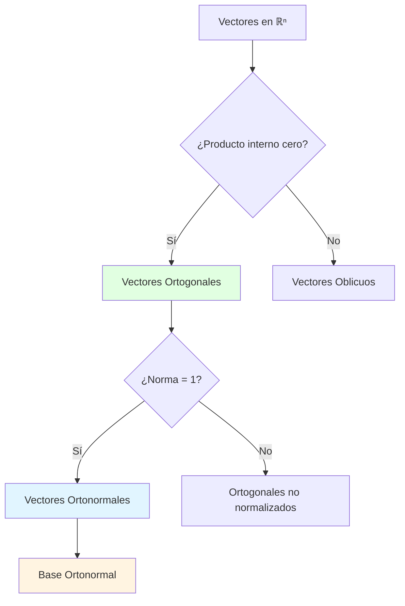
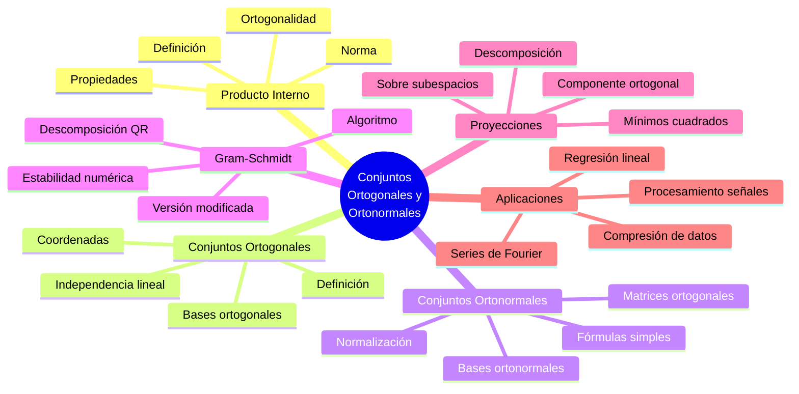
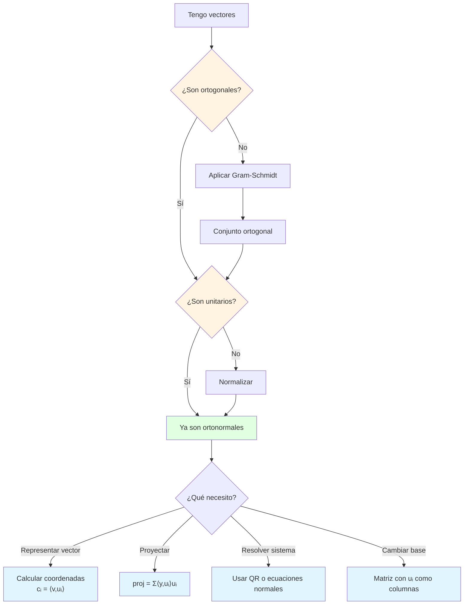

# 🎯 Conjuntos Ortogonales y Ortonormales

## 📐 Introducción

> [!info]- 💡 ¿Qué son los Conjuntos Ortogonales?
> 
> Los **conjuntos ortogonales** son colecciones de vectores que son perpendiculares entre sí. Esta propiedad geométrica fundamental tiene aplicaciones profundas en álgebra lineal, desde simplificar sistemas de ecuaciones hasta comprimir datos en ingeniería.
> 
> **Analogía práctica:** Imagina los ejes coordenados en un espacio tridimensional. Los vectores que apuntan en las direcciones x, y, z son ortogonales entre sí: cada uno es perpendicular a los otros dos. Esta independencia direccional es la esencia de la ortogonalidad.
> 
> **¿Por qué son importantes?**
> 
> |Aspecto|Descripción|Ejemplo de Uso|
> |---|---|---|
> |**Independencia**|Vectores sin redundancia direccional|Bases de espacios vectoriales|
> |**Simplificación**|Cálculos más eficientes|Proyecciones, descomposiciones|
> |**Estabilidad numérica**|Minimiza errores de cálculo|Algoritmos computacionales|
> |**Descomposición**|Representar vectores como combinaciones|Análisis de Fourier, compresión|
> |**Geometría**|Ángulos y distancias simples|Gráficos por computadora, física|



---

## 🔍 Fundamentos de Ortogonalidad

### 📏 Producto Interno y Ortogonalidad

> [!example]- 🎓 Definición Matemática
> 
> **Producto interno estándar en ℝⁿ:**
> 
> Para vectores **u** = (u₁, u₂, ..., uₙ) y **v** = (v₁, v₂, ..., vₙ):
> 
> $$\langle \mathbf{u}, \mathbf{v} \rangle = \mathbf{u} \cdot \mathbf{v} = u_1v_1 + u_2v_2 + \cdots + u_nv_n = \sum_{i=1}^{n} u_iv_i$$
> 
> **Definición de ortogonalidad:**
> 
> Dos vectores **u** y **v** son **ortogonales** (denotado **u** ⊥ **v**) si y solo si:
> 
> $$\langle \mathbf{u}, \mathbf{v} \rangle = 0$$
> 
> **Ejemplos básicos:**
> 
> ```
> Ejemplo 1 - Vectores ortogonales en ℝ²:
> u = (3, 4)
> v = (4, -3)
> 
> ⟨u, v⟩ = 3(4) + 4(-3) = 12 - 12 = 0 ✅ Son ortogonales
> 
> Ejemplo 2 - Vectores NO ortogonales:
> u = (1, 2)
> v = (3, 4)
> 
> ⟨u, v⟩ = 1(3) + 2(4) = 3 + 8 = 11 ≠ 0 ❌ No son ortogonales
> 
> Ejemplo 3 - Vectores ortogonales en ℝ³:
> u = (1, 0, 0)
> v = (0, 1, 0)
> 
> ⟨u, v⟩ = 1(0) + 0(1) + 0(0) = 0 ✅ Son ortogonales
> ```
> 
> **Interpretación geométrica:**
> 
> |Producto Interno|Ángulo θ|Interpretación|
> |---|---|---|
> |⟨u, v⟩ > 0|0° < θ < 90°|Vectores en dirección similar|
> |⟨u, v⟩ = 0|θ = 90°|Vectores perpendiculares (ortogonales)|
> |⟨u, v⟩ < 0|90° < θ < 180°|Vectores en dirección opuesta|
> 
> **Visualización en ℝ²:**
> 
> ```mermaid
> graph LR
>     A[Origen O] --> B[Vector u]
>     A --> C[Vector v]
>     
>     B -.->|"⟨u,v⟩ = 0"| D[Ángulo 90°]
>     C -.-> D
>     
>     style B fill:#e1ffe1
>     style C fill:#e1ffe1
>     style D fill:#fff4e1
> ```

### 🧮 Propiedades del Producto Interno

> [!note]- 📊 Propiedades Fundamentales
> 
> El producto interno satisface las siguientes propiedades para vectores **u**, **v**, **w** y escalar c:
> 
> |Propiedad|Fórmula|Significado|
> |---|---|---|
> |**Conmutatividad**|⟨u, v⟩ = ⟨v, u⟩|El orden no importa|
> |**Linealidad**|⟨cu, v⟩ = c⟨u, v⟩|Factor escalar sale fuera|
> |**Distributividad**|⟨u + v, w⟩ = ⟨u, w⟩ + ⟨v, w⟩|Suma se distribuye|
> |**Positividad**|⟨u, u⟩ ≥ 0|Siempre no negativo|
> |**Definición positiva**|⟨u, u⟩ = 0 ⟺ u = 0|Cero solo para vector cero|
> 
> **Ejemplos de aplicación:**
> 
> ```
> Sean u = (1, 2), v = (3, 4), w = (-1, 5), c = 2
> 
> 1. Conmutatividad:
>    ⟨u, v⟩ = 1(3) + 2(4) = 11
>    ⟨v, u⟩ = 3(1) + 4(2) = 11 ✅
> 
> 2. Linealidad:
>    ⟨2u, v⟩ = ⟨(2,4), (3,4)⟩ = 2(3) + 4(4) = 22
>    2⟨u, v⟩ = 2(11) = 22 ✅
> 
> 3. Distributividad:
>    ⟨u + v, w⟩ = ⟨(4,6), (-1,5)⟩ = 4(-1) + 6(5) = 26
>    ⟨u, w⟩ + ⟨v, w⟩ = [1(-1) + 2(5)] + [3(-1) + 4(5)]
>                      = 9 + 17 = 26 ✅
> 
> 4. Positividad:
>    ⟨u, u⟩ = 1² + 2² = 5 > 0 ✅
> ```
> 
> **Consecuencias importantes:**
> 
> ```mermaid
> flowchart TD
>     A[Propiedades del<br/>Producto Interno] --> B[Permite definir norma]
>     A --> C[Permite definir ángulo]
>     A --> D[Permite proyecciones]
>     
>     B --> E["||u|| = √⟨u,u⟩"]
>     C --> F["cos θ = ⟨u,v⟩/(||u|| ||v||)"]
>     D --> G["proyᵥ(u) = (⟨u,v⟩/⟨v,v⟩)v"]
>     
>     style A fill:#e1f5ff
>     style B fill:#e1ffe1
>     style C fill:#e1ffe1
>     style D fill:#e1ffe1
> ```

### 📐 Norma y Normalización

> [!success]- 📏 Longitud de Vectores
> 
> **Norma (longitud) de un vector:**
> 
> La **norma** o **longitud** de un vector **u** se define como:
> 
> $$|\mathbf{u}| = \sqrt{\langle \mathbf{u}, \mathbf{u} \rangle} = \sqrt{u_1^2 + u_2^2 + \cdots + u_n^2}$$
> 
> **Vector unitario:**
> 
> Un vector **u** es **unitario** o **normalizado** si ||u|| = 1
> 
> **Proceso de normalización:**
> 
> Para cualquier vector no cero **u**, podemos crear un vector unitario **û** en la misma dirección:
> 
> $$\hat{\mathbf{u}} = \frac{\mathbf{u}}{|\mathbf{u}|}$$
> 
> **Ejemplos:**
> 
> ```
> Ejemplo 1 - Normalizar en ℝ²:
> u = (3, 4)
> 
> Paso 1: Calcular norma
> ||u|| = √(3² + 4²) = √(9 + 16) = √25 = 5
> 
> Paso 2: Dividir por la norma
> û = (3/5, 4/5) = (0.6, 0.8)
> 
> Verificación:
> ||û|| = √(0.6² + 0.8²) = √(0.36 + 0.64) = √1 = 1 ✅
> 
> Ejemplo 2 - Normalizar en ℝ³:
> v = (1, 2, 2)
> 
> ||v|| = √(1² + 2² + 2²) = √9 = 3
> v̂ = (1/3, 2/3, 2/3)
> 
> Verificación:
> ||v̂|| = √(1/9 + 4/9 + 4/9) = √(9/9) = 1 ✅
> ```
> 
> **Propiedades de la norma:**
> 
> |Propiedad|Fórmula|Interpretación|
> |---|---|---|
> |**No negatividad**|‖u‖ ≥ 0|Longitud siempre positiva o cero|
> |**Definición positiva**|‖u‖ = 0 ⟺ u = 0|Solo el vector cero tiene longitud cero|
> |**Homogeneidad**|‖cu‖ = \|c\|‖u‖|Escalar afecta la longitud proporcionalmente|
> |**Desigualdad triangular**|‖u + v‖ ≤ ‖u‖ + ‖v‖|Lado de triángulo menor que suma de otros|
> 
> **Visualización de normalización:**
> 
> ```mermaid
> graph LR
>     A[Vector u<br/>||u|| = 5] -->|Dividir por 5| B[Vector û<br/>||û|| = 1]
>     
>     A -.->|Mantiene<br/>dirección| B
>     
>     C[u = 3, 4] --> D[û = 0.6, 0.8]
>     
>     style A fill:#ffe1e1
>     style B fill:#e1ffe1
>     style C fill:#ffe1e1
>     style D fill:#e1ffe1
> ```

---

## 🎯 Conjuntos Ortogonales

### 📚 Definición y Propiedades

> [!tip]- 🔢 Conjuntos Ortogonales
> 
> **Definición:**
> 
> Un conjunto de vectores {**v₁**, **v₂**, ..., **vₖ**} es **ortogonal** si cada par de vectores distintos es ortogonal:
> 
> $$\langle \mathbf{v}_i, \mathbf{v}_j \rangle = 0 \quad \text{para todo } i \neq j$$
> 
> **Nota importante:** Los vectores cero se excluyen de conjuntos ortogonales (aunque técnicamente son ortogonales a todo).
> 
> **Ejemplos:**
> 
> ```
> Ejemplo 1 - Conjunto ortogonal en ℝ³:
> v₁ = (1, 0, 0)
> v₂ = (0, 1, 0)
> v₃ = (0, 0, 1)
> 
> Verificación de ortogonalidad:
> ⟨v₁, v₂⟩ = 1(0) + 0(1) + 0(0) = 0 ✅
> ⟨v₁, v₃⟩ = 1(0) + 0(0) + 0(1) = 0 ✅
> ⟨v₂, v₃⟩ = 0(0) + 1(0) + 0(1) = 0 ✅
> 
> Este es el conjunto de vectores canónicos (base estándar)
> 
> Ejemplo 2 - Conjunto ortogonal en ℝ²:
> u₁ = (3, 4)
> u₂ = (4, -3)
> 
> ⟨u₁, u₂⟩ = 3(4) + 4(-3) = 12 - 12 = 0 ✅
> 
> Ejemplo 3 - Conjunto NO ortogonal:
> w₁ = (1, 1)
> w₂ = (1, 2)
> 
> ⟨w₁, w₂⟩ = 1(1) + 1(2) = 3 ≠ 0 ❌
> ```
> 
> **Propiedades fundamentales:**
> 
> |Propiedad|Enunciado|Implicación|
> |---|---|---|
> |**Independencia lineal**|Todo conjunto ortogonal de vectores no ceros es L.I.|No hay redundancia|
> |**Base ortogonal**|Si span{v₁,...,vₖ} = V y son ortogonales, forman base|Generan todo el espacio|
> |**Simplificación**|Coordenadas se calculan con productos internos|Fórmulas explícitas simples|
> |**Teorema de Pitágoras**|‖v₁ + v₂‖² = ‖v₁‖² + ‖v₂‖² si v₁ ⊥ v₂|Extiende geometría euclidiana|
> 
> **Demostración de independencia lineal:**
> 
> ```
> Teorema: Si {v₁, v₂, ..., vₖ} es ortogonal (vectores no ceros),
>          entonces es linealmente independiente.
> 
> Demostración:
> Supongamos: c₁v₁ + c₂v₂ + ⋯ + cₖvₖ = 0
> 
> Tomamos producto interno con vᵢ:
> ⟨c₁v₁ + c₂v₂ + ⋯ + cₖvₖ, vᵢ⟩ = ⟨0, vᵢ⟩ = 0
> 
> Por linealidad:
> c₁⟨v₁,vᵢ⟩ + c₂⟨v₂,vᵢ⟩ + ⋯ + cᵢ⟨vᵢ,vᵢ⟩ + ⋯ + cₖ⟨vₖ,vᵢ⟩ = 0
> 
> Como vⱼ ⊥ vᵢ para j ≠ i (ortogonalidad):
> cᵢ⟨vᵢ, vᵢ⟩ = 0
> 
> Como vᵢ ≠ 0, entonces ⟨vᵢ, vᵢ⟩ > 0, por lo tanto:
> cᵢ = 0
> 
> Esto aplica para todo i, entonces todos los coeficientes son cero.
> Por lo tanto, el conjunto es L.I. ∎
> ```
> 
> **Visualización:**
> 
> ```mermaid
> graph TD
>     A[Conjunto Ortogonal] --> B[Vectores perpendiculares<br/>dos a dos]
>     A --> C[Vectores no ceros]
>     
>     B --> D[Independencia Lineal<br/>Garantizada]
>     C --> D
>     
>     D --> E[Puede formar base]
>     D --> F[Cálculos simplificados]
>     
>     style A fill:#e1f5ff
>     style D fill:#e1ffe1
>     style E fill:#fff4e1
>     style F fill:#fff4e1
> ```

### 🎨 Representación de Vectores

> [!example]- 📝 Coordenadas en Bases Ortogonales
> 
> **Teorema de coordenadas ortogonales:**
> 
> Si {**v₁**, **v₂**, ..., **vₖ**} es una base ortogonal de un espacio V y **u** ∈ V, entonces:
> 
> $$\mathbf{u} = c_1\mathbf{v}_1 + c_2\mathbf{v}_2 + \cdots + c_k\mathbf{v}_k$$
> 
> donde los coeficientes se calculan directamente como:
> 
> $$c_i = \frac{\langle \mathbf{u}, \mathbf{v}_i \rangle}{\langle \mathbf{v}_i, \mathbf{v}_i \rangle} = \frac{\langle \mathbf{u}, \mathbf{v}_i \rangle}{|\mathbf{v}_i|^2}$$
> 
> **Ventaja clave:** No necesitamos resolver sistemas de ecuaciones, solo calcular productos internos.
> 
> **Ejemplo completo:**
> 
> ```
> Dado el conjunto ortogonal en ℝ³:
> v₁ = (1, 1, 0)
> v₂ = (1, -1, 0)
> v₃ = (0, 0, 2)
> 
> Expresar u = (3, 1, 4) como combinación lineal de {v₁, v₂, v₃}
> 
> Paso 1: Verificar ortogonalidad
> ⟨v₁, v₂⟩ = 1(1) + 1(-1) + 0(0) = 0 ✅
> ⟨v₁, v₃⟩ = 1(0) + 1(0) + 0(2) = 0 ✅
> ⟨v₂, v₃⟩ = 1(0) + (-1)(0) + 0(2) = 0 ✅
> 
> Paso 2: Calcular coeficientes
> 
> c₁ = ⟨u, v₁⟩/⟨v₁, v₁⟩
>    = [3(1) + 1(1) + 4(0)] / [1² + 1² + 0²]
>    = 4/2 = 2
> 
> c₂ = ⟨u, v₂⟩/⟨v₂, v₂⟩
>    = [3(1) + 1(-1) + 4(0)] / [1² + (-1)² + 0²]
>    = 2/2 = 1
> 
> c₃ = ⟨u, v₃⟩/⟨v₃, v₃⟩
>    = [3(0) + 1(0) + 4(2)] / [0² + 0² + 2²]
>    = 8/4 = 2
> 
> Paso 3: Expresar u
> u = 2v₁ + 1v₂ + 2v₃
> 
> Verificación:
> 2(1,1,0) + 1(1,-1,0) + 2(0,0,2)
> = (2,2,0) + (1,-1,0) + (0,0,4)
> = (3,1,4) ✅
> ```
> 
> **Comparación con bases NO ortogonales:**
> 
> |Aspecto|Base Ortogonal|Base NO Ortogonal|
> |---|---|---|
> |**Cálculo de coeficientes**|Fórmula directa con productos internos|Sistema de ecuaciones (eliminación)|
> |**Complejidad**|O(n) por coeficiente|O(n³) para el sistema|
> |**Estabilidad numérica**|Excelente|Puede tener problemas|
> |**Interpretación**|Componente en cada dirección|Menos intuitiva|
> 
> **Flujo de cálculo:**
> 
> ```mermaid
> flowchart TD
>     A[Vector u a representar] --> B[Base ortogonal<br/> v₁, v₂, ..., vₖ]
>     
>     B --> C1[Calcular ⟨u, v₁⟩/||v₁||²]
>     B --> C2[Calcular ⟨u, v₂⟩/||v₂||²]
>     B --> C3[Calcular ⟨u, vₖ⟩/||vₖ||²]
>     
>     C1 --> D[c₁]
>     C2 --> E[c₂]
>     C3 --> F[cₖ]
>     
>     D --> G[u = c₁v₁ + c₂v₂ + ... + cₖvₖ]
>     E --> G
>     F --> G
>     
>     style A fill:#e1f5ff
>     style B fill:#fff4e1
>     style G fill:#e1ffe1
> ```

---

## ⭐ Conjuntos Ortonormales

### 🎯 Definición y Construcción

> [!success]- 🌟 Bases Ortonormales
> 
> **Definición:**
> 
> Un conjunto {**u₁**, **u₂**, ..., **uₖ**} es **ortonormal** si cumple dos condiciones:
> 
> 1. **Ortogonalidad:** ⟨uᵢ, uⱼ⟩ = 0 para todo i ≠ j
> 2. **Normalización:** ‖uᵢ‖ = 1 para todo i
> 
> **Notación compacta usando delta de Kronecker:**
> 
> $$\langle \mathbf{u}_i, \mathbf{u}_j \rangle = \delta_{ij} = \begin{cases} 1 & \text{si } i = j \ 0 & \text{si } i \neq j \end{cases}$$
> 
> **Construcción de conjuntos ortonormales:**
> 
> A partir de un conjunto ortogonal {**v₁**, **v₂**, ..., **vₖ**}, creamos uno ortonormal normalizando cada vector:
> 
> $$\mathbf{u}_i = \frac{\mathbf{v}_i}{|\mathbf{v}_i|}$$
> 
> **Ejemplo:**
> 
> ```
> Conjunto ortogonal:
> v₁ = (3, 4)
> v₂ = (4, -3)
> 
> Paso 1: Calcular normas
> ||v₁|| = √(9 + 16) = 5
> ||v₂|| = √(16 + 9) = 5
> 
> Paso 2: Normalizar
> u₁ = v₁/||v₁|| = (3/5, 4/5) = (0.6, 0.8)
> u₂ = v₂/||v₂|| = (4/5, -3/5) = (0.8, -0.6)
> 
> Verificación de ortonormalidad:
> ⟨u₁, u₂⟩ = 0.6(0.8) + 0.8(-0.6)
>          = 0.48 - 0.48 = 0 ✅ Ortogonales
> 
> ||u₁|| = √(0.36 + 0.64) = 1 ✅ Unitario
> ||u₂|| = √(0.64 + 0.36) = 1 ✅ Unitario
> ```
> 
> **Bases ortonormales estándar:**
> 
> ```
> ℝ²: e₁ = (1, 0), e₂ = (0, 1)
> 
> ℝ³: e₁ = (1, 0, 0), e₂ = (0, 1, 0), e₃ = (0, 0, 1)
> 
> ℝⁿ: e₁ = (1,0,...,0), e₂ = (0,1,0,...,0), ..., eₙ = (0,...,0,1)
> ```
> 
> **Ventajas de las bases ortonormales:**
> 
> |Ventaja|Base Ortogonal|Base Ortonormal|Mejora|
> |---|---|---|---|
> |**Fórmula de coordenadas**|cᵢ = ⟨u,vᵢ⟩/‖vᵢ‖²|cᵢ = ⟨u,uᵢ⟩|Más simple|
> |**Cálculo de normas**|Complejo|‖u‖² = c₁² + c₂² + ... + cₙ²|Teorema de Pitágoras|
> |**Cambio de base**|Requiere inversas|Matriz ortogonal (A⁻¹ = Aᵀ)|Muy eficiente|
> |**Estabilidad numérica**|Buena|Excelente|Minimiza errores|
> 
> **Proceso de ortonormalización:**
> 
> ```mermaid
> flowchart LR
>     A[Conjunto Ortogonal<br/>v₁, v₂, ..., vₖ] --> B[Calcular normas<br/>||v₁||, ||v₂||, ..., ||vₖ||]
>     
>     B --> C[Normalizar cada vector<br/>uᵢ = vᵢ/||vᵢ||]
>     
>     C --> D[Conjunto Ortonormal<br/>u₁, u₂, ..., uₖ]
>     
>     D --> E[Verificar:<br/>⟨uᵢ,uⱼ⟩ = δᵢⱼ]
>     
>     style A fill:#fff4e1
>     style D fill:#e1ffe1
>     style E fill:#e1f5ff
> ```

### 🧮 Representación en Bases Ortonormales

> [!tip]- 📐 Fórmulas Simplificadas
> 
> **Teorema (Coordenadas en base ortonormal):**
> 
> Si {**u₁**, **u₂**, ..., **uₙ**} es una base ortonormal de V y **v** ∈ V, entonces:
> 
> $$\mathbf{v} = \langle \mathbf{v}, \mathbf{u}_1 \rangle \mathbf{u}_1 + \langle \mathbf{v}, \mathbf{u}_2 \rangle \mathbf{u}_2 + \cdots + \langle \mathbf{v}, \mathbf{u}_n \rangle \mathbf{u}_n$$
> 
> **Nota:** Los coeficientes son simplemente los productos internos (no hay que dividir por normas).
> 
> **Propiedades adicionales:**
> 
> 1. **Norma del vector:** $$|\mathbf{v}|^2 = \langle \mathbf{v}, \mathbf{u}_1 \rangle^2 + \langle \mathbf{v}, \mathbf{u}_2 \rangle^2 + \cdots + \langle \mathbf{v}, \mathbf{u}_n \rangle^2$$ (Teorema de Pitágoras generalizado o identidad de Parseval)
>     
> 2. **Producto interno de vectores:** Si **v** = Σcᵢ**uᵢ** y **w** = Σdᵢ**uᵢ**, entonces: $$\langle \mathbf{v}, \mathbf{w} \rangle = c_1d_1 + c_2d_2 + \cdots + c_nd_n$$
>     
> 
> **Ejemplo completo:**
> 
> ```
> Baseortonormal en ℝ³:
> u₁ = (1, 0, 0) u₂ = (0, 1, 0) u₃ = (0, 0, 1)
> 
> Representar v = (2, 3, 5)
> 
> Paso 1: Calcular coordenadas (productos internos) c₁ = ⟨v, u₁⟩ = 2(1) + 3(0) + 5(0) = 2 c₂ = ⟨v, u₂⟩ = 2(0) + 3(1) + 5(0) = 3 c₃ = ⟨v, u₃⟩ = 2(0) + 3(0) + 5(1) = 5
> 
> Paso 2: Expresar v v = 2u₁ + 3u₂ + 5u₃
> 
> Paso 3: Verificar norma (Parseval) ||v||² = c₁² + c₂² + c₃² = 4 + 9 + 25 = 38
> 
> Comprobación directa: ||v||² = 2² + 3² + 5² = 38 ✅
> 
> ```
> 
> **Ejemplo con base no estándar:**
> 
> ```
> 
> Base ortonormal: u₁ = (3/5, 4/5) u₂ = (4/5, -3/5)
> 
> Representar v = (1, 7)
> 
> c₁ = ⟨v, u₁⟩ = 1(3/5) + 7(4/5) = 3/5 + 28/5 = 31/5 c₂ = ⟨v, u₂⟩ = 1(4/5) + 7(-3/5) = 4/5 - 21/5 = -17/5
> 
> v = (31/5)u₁ + (-17/5)u₂
> 
> Verificación de norma: ||v||² = (31/5)² + (-17/5)² = 961/25 + 289/25 = 1250/25 = 50
> 
> Comprobación directa: ||v||² = 1² + 7² = 50 ✅
> 
> ````
> 
> **Tabla comparativa de cálculos:**
> 
> |Operación|Base Arbitraria|Base Ortogonal|Base Ortonormal|
> |---|---|---|---|
> |**Coordenadas**|Sistema de ecuaciones|cᵢ = ⟨v,vᵢ⟩/‖vᵢ‖²|cᵢ = ⟨v,uᵢ⟩|
> |**Norma de v**|‖v‖ = √⟨v,v⟩|Fórmula compleja|‖v‖² = Σcᵢ²|
> |**Producto ⟨v,w⟩**|Fórmula general|Complicado|Σcᵢdᵢ|
> |**Complejidad**|O(n³)|O(n²)|O(n)|
> 
> **Visualización del proceso:**
> 
> ```mermaid
> graph TD
>     A[Vector v] --> B[Base ortonormal<br/>u₁, u₂, ..., uₙ]
>     
>     B --> C1["c₁ = ⟨v, u₁⟩"]
>     B --> C2["c₂ = ⟨v, u₂⟩"]
>     B --> C3["cₙ = ⟨v, uₙ⟩"]
>     
>     C1 --> D["v = Σcᵢuᵢ"]
>     C2 --> D
>     C3 --> D
>     
>     D --> E["||v||² = Σcᵢ²<br/>(Parseval)"]
>     
>     style A fill:#e1f5ff
>     style B fill:#fff4e1
>     style D fill:#e1ffe1
>     style E fill:#e1ffe1
> ````

---

## 🔄 Proceso de Gram-Schmidt

### 🎨 Algoritmo de Ortonormalización

> [!example]- 🛠️ Método de Gram-Schmidt
> 
> **Objetivo:** Transformar una base arbitraria {**v₁**, **v₂**, ..., **vₙ**} en una base ortonormal {**u₁**, **u₂**, ..., **uₙ**} que genere el mismo espacio.
> 
> **Algoritmo paso a paso:**
> 
> ```
> Entrada: Base {v₁, v₂, ..., vₙ} (linealmente independiente)
> Salida: Base ortonormal {u₁, u₂, ..., uₙ}
> 
> Paso 1: Primer vector (solo normalizar)
> w₁ = v₁
> u₁ = w₁/||w₁||
> 
> Paso 2: Segundo vector (ortogonalizar y normalizar)
> w₂ = v₂ - ⟨v₂, u₁⟩u₁
> u₂ = w₂/||w₂||
> 
> Paso 3: Tercer vector
> w₃ = v₃ - ⟨v₃, u₁⟩u₁ - ⟨v₃, u₂⟩u₂
> u₃ = w₃/||w₃||
> 
> Paso k: k-ésimo vector (fórmula general)
> wₖ = vₖ - Σⱼ₌₁ᵏ⁻¹ ⟨vₖ, uⱼ⟩uⱼ
> uₖ = wₖ/||wₖ||
> ```
> 
> **Interpretación geométrica:**
> 
> - **wₖ** es la componente de **vₖ** ortogonal al espacio generado por {**u₁**, ..., **uₖ₋₁**}
> - Restamos todas las "sombras" o proyecciones de **vₖ** sobre los vectores anteriores
> - Lo que queda es perpendicular a todos los anteriores
> - Finalmente normalizamos para que tenga longitud 1
> 
> **Ejemplo completo en ℝ³:**
> 
> ```
> Base original:
> v₁ = (1, 1, 1)
> v₂ = (0, 1, 1)
> v₃ = (0, 0, 1)
> 
> ━━━ PASO 1: Primer vector ━━━
> w₁ = v₁ = (1, 1, 1)
> ||w₁|| = √(1² + 1² + 1²) = √3
> 
> u₁ = w₁/||w₁|| = (1/√3, 1/√3, 1/√3)
> 
> ━━━ PASO 2: Segundo vector ━━━
> Proyección de v₂ sobre u₁:
> ⟨v₂, u₁⟩ = 0(1/√3) + 1(1/√3) + 1(1/√3) = 2/√3
> 
> Componente ortogonal:
> w₂ = v₂ - ⟨v₂, u₁⟩u₁
>    = (0, 1, 1) - (2/√3)(1/√3, 1/√3, 1/√3)
>    = (0, 1, 1) - (2/3, 2/3, 2/3)
>    = (-2/3, 1/3, 1/3)
> 
> Normalizar:
> ||w₂|| = √(4/9 + 1/9 + 1/9) = √(6/9) = √(2/3)
> 
> u₂ = w₂/||w₂|| = (-2/3, 1/3, 1/3) / √(2/3)
>    = (-√2/√3, 1/(√2·√3), 1/(√2·√3))
>    = (-√6/3, √6/6, √6/6)
> 
> ━━━ PASO 3: Tercer vector ━━━
> Proyecciones:
> ⟨v₃, u₁⟩ = 0(1/√3) + 0(1/√3) + 1(1/√3) = 1/√3
> ⟨v₃, u₂⟩ = 0(-√6/3) + 0(√6/6) + 1(√6/6) = √6/6
> 
> Componente ortogonal:
> w₃ = v₃ - ⟨v₃,u₁⟩u₁ - ⟨v₃,u₂⟩u₂
>    = (0, 0, 1) - (1/√3)(1/√3, 1/√3, 1/√3) 
>                 - (√6/6)(-√6/3, √6/6, √6/6)
>    = (0, 0, 1) - (1/3, 1/3, 1/3) - (-1/3, 1/6, 1/6)
>    = (0, 0, 1) + (0, -1/2, -1/2)
>    = (0, -1/2, 1/2)
> 
> Normalizar:
> ||w₃|| = √(0 + 1/4 + 1/4) = √(1/2) = 1/√2
> 
> u₃ = (0, -1/2, 1/2) / (1/√2)
>    = (0, -1/√2, 1/√2)
>    = (0, -√2/2, √2/2)
> 
> ━━━ RESULTADO ━━━
> Base ortonormal:
> u₁ = (1/√3, 1/√3, 1/√3)       ≈ (0.577, 0.577, 0.577)
> u₂ = (-√6/3, √6/6, √6/6)      ≈ (-0.816, 0.408, 0.408)
> u₃ = (0, -√2/2, √2/2)         ≈ (0, -0.707, 0.707)
> ```
> 
> **Verificación de ortonormalidad:**
> 
> ```
> ⟨u₁, u₂⟩ = (1/√3)(-√6/3) + (1/√3)(√6/6) + (1/√3)(√6/6)
>          = -√6/(3√3) + √6/(6√3) + √6/(6√3)
>          = -√2/3 + √2/6 + √2/6 = 0 ✅
> 
> ⟨u₁, u₃⟩ = 0 + (1/√3)(-√2/2) + (1/√3)(√2/2) = 0 ✅
> 
> ⟨u₂, u₃⟩ = 0 + (√6/6)(-√2/2) + (√6/6)(√2/2) = 0 ✅
> 
> ||u₁|| = √(1/3 + 1/3 + 1/3) = 1 ✅
> ||u₂|| = √(6/9 + 6/36 + 6/36) = 1 ✅
> ||u₃|| = √(0 + 1/2 + 1/2) = 1 ✅
> ```
> 
> **Diagrama del proceso:**
> 
> ```mermaid
> flowchart TD
>     A["Base original<br/>v₁, v₂, ..., vₙ"] --> B["Normalizar v₁<br/>u₁ = v₁/||v₁||" ]
>     
>     B --> C[Para k = 2 hasta n]
>     
>     C --> D["Restar proyecciones<br/>wₖ = vₖ - Σ⟨vₖ,uⱼ⟩uⱼ"]
>     
>     D --> E["Normalizar<br/>uₖ = wₖ/||wₖ||"]
>     
>     E --> F{¿Terminado?}
>     F -->|No| C
>     F -->|Sí| G["Base ortonormal<br/>u₁, u₂, ..., uₙ"]
>     
>     style A fill:#ffe1e1
>     style G fill:#e1ffe1
>     style D fill:#fff4e1
>     style E fill:#e1f5ff
> ```

### ⚠️ Consideraciones Numéricas

> [!warning]- 🔢 Estabilidad del Algoritmo
> 
> **Problemas potenciales:**
> 
> |Problema|Causa|Consecuencia|Solución|
> |---|---|---|---|
> |**Pérdida de ortogonalidad**|Errores de redondeo acumulados|Vectores no perpendiculares|Gram-Schmidt modificado|
> |**División por cero**|Vector dependiente (wₖ = 0)|Algoritmo falla|Verificar L.I. antes|
> |**Inestabilidad numérica**|Vectores casi paralelos|Amplificación de errores|Reordenar vectores|
> |**Cancelación catastrófica**|Restas de números similares|Pérdida de precisión|Aritmética de mayor precisión|
> 
> **Gram-Schmidt modificado (más estable):**
> 
> ```
> Diferencia clave: Ortogonalizar contra los uⱼ ya calculados,
> no contra los vⱼ originales
> 
> Algoritmo modificado:
> 
> u₁ = v₁/||v₁||
> 
> Para k = 2 hasta n:
>     wₖ = vₖ
>     Para j = 1 hasta k-1:
>         wₖ = wₖ - ⟨wₖ, uⱼ⟩uⱼ  ← Actualización incremental
>     uₖ = wₖ/||wₖ||
> ```
> 
> **Comparación de versiones:**
> 
> ```
> Clásico: wₖ = vₖ - Σⱼ₌₁ᵏ⁻¹ ⟨vₖ, uⱼ⟩uⱼ
>          ↑ Usa vₖ original siempre
> 
> Modificado: wₖ = vₖ
>             wₖ = wₖ - ⟨wₖ, u₁⟩u₁
>             wₖ = wₖ - ⟨wₖ, u₂⟩u₂  ← Usa wₖ actualizado
>             ...
> ```
> 
> **Recomendaciones prácticas:**
> 
> 1. **Verificar independencia lineal** antes de aplicar Gram-Schmidt
> 2. **Usar Gram-Schmidt modificado** en implementaciones computacionales
> 3. **Reortogonalizar** si es necesario (aplicar el proceso dos veces)
> 4. **Escalar vectores** para evitar números muy grandes o pequeños
> 5. **Usar bibliotecas optimizadas** (LAPACK, NumPy) en aplicaciones reales
> 
> **Ejemplo de pérdida de ortogonalidad:**
> 
> ```
> Con aritmética de 4 dígitos decimales:
> 
> v₁ = (1.000, 0.001)
> v₂ = (1.000, 0.002)
> 
> u₁ = v₁/||v₁|| ≈ (1.000, 0.001)
> 
> ⟨v₂, u₁⟩ ≈ 1.000·1.000 + 0.002·0.001 = 1.000
> 
> w₂ = v₂ - 1.000·u₁
>    = (1.000, 0.002) - (1.000, 0.001)
>    = (0, 0.001)  ← Pérdida de precisión en primera componente
> 
> Verificación (debería ser 0):
> ⟨u₁, u₂⟩ ≠ 0 exactamente debido a redondeos
> ```

---

## 🎯 Aplicaciones y Ejemplos

### 📊 Proyecciones Ortogonales

> [!tip]- 📐 Proyección sobre Subespacios
> 
> **Definición:**
> 
> La **proyección ortogonal** de un vector **y** sobre un subespacio W es el vector **ŷ** ∈ W más cercano a **y**.
> 
> **Fórmula con base ortonormal:**
> 
> Si {**u₁**, **u₂**, ..., **uₚ**} es una base ortonormal de W, entonces:
> 
> $$\hat{\mathbf{y}} = \text{proy}_W(\mathbf{y}) = \langle \mathbf{y}, \mathbf{u}_1 \rangle \mathbf{u}_1 + \langle \mathbf{y}, \mathbf{u}_2 \rangle \mathbf{u}_2 + \cdots + \langle \mathbf{y}, \mathbf{u}_p \rangle \mathbf{u}_p$$
> 
> **Componente ortogonal:**
> 
> $$\mathbf{z} = \mathbf{y} - \hat{\mathbf{y}}$$
> 
> **Propiedad clave:** **z** ⊥ W (es decir, **z** es ortogonal a todo vector en W)
> 
> **Ejemplo:**
> 
> ```
> Proyectar y = (6, 3, 2) sobre el subespacio W generado por:
> u₁ = (2/3, 2/3, 1/3)
> u₂ = (-2/3, 1/3, 2/3)
> 
> (Verificar que {u₁, u₂} es ortonormal)
> 
> Paso 1: Calcular coordenadas
> c₁ = ⟨y, u₁⟩ = 6(2/3) + 3(2/3) + 2(1/3)
>    = 4 + 2 + 2/3 = 20/3
> 
> c₂ = ⟨y, u₂⟩ = 6(-2/3) + 3(1/3) + 2(2/3)
>    = -4 + 1 + 4/3 = -5/3
> 
> Paso 2: Proyección
> ŷ = (20/3)u₁ + (-5/3)u₂
>   = (20/3)(2/3, 2/3, 1/3) + (-5/3)(-2/3, 1/3, 2/3)
>   = (40/9, 40/9, 20/9) + (10/9, -5/9, -10/9)
>   = (50/9, 35/9, 10/9)
>   ≈ (5.56, 3.89, 1.11)
> 
> Paso 3: Componente ortogonal
> z = y - ŷ
>   = (6, 3, 2) - (50/9, 35/9, 10/9)
>   = (4/9, -8/9, 8/9)
>   ≈ (0.44, -0.89, 0.89)
> 
> Verificación: z ⊥ u₁ y z ⊥ u₂
> ⟨z, u₁⟩ = (4/9)(2/3) + (-8/9)(2/3) + (8/9)(1/3)
>         = 8/27 - 16/27 + 8/27 = 0 ✅
> ```
> 
> **Teorema de descomposición ortogonal:**
> 
> Todo vector **y** se puede descomponer únicamente como:
> 
> $$\mathbf{y} = \hat{\mathbf{y}} + \mathbf{z}$$
> 
> donde **ŷ** ∈ W y **z** ∈ W^⊥ (complemento ortogonal de W)
> 
> ```mermaid
> graph TD
>     A[Vector y] --> B[Proyección ŷ ∈ W]
>     A --> C[Componente z ∈ W^⊥]
>     
>     B --> D["ŷ = Σ⟨y,uᵢ⟩uᵢ"]
>     C --> E["z = y - ŷ"]
>     
>     D -.->|⊥| E
>     
>     style A fill:#e1f5ff
>     style B fill:#e1ffe1
>     style C fill:#fff4e1
> ```

### 📈 Regresión Lineal y Mínimos Cuadrados

> [!example]- 📊 Aplicación en Ajuste de Datos
> 
> **Problema:** Encontrar la recta que mejor ajusta un conjunto de puntos.
> 
> **Formulación:**
> 
> Dados puntos (x₁, y₁), (x₂, y₂), ..., (xₘ, yₘ), queremos encontrar y = β₀ + β₁x que minimice:
> 
> $$\sum_{i=1}^{m} (y_i - \beta_0 - \beta_1 x_i)^2$$
> 
> **Conexión con proyecciones:**
> 
> - El vector de observaciones **y** = (y₁, y₂, ..., yₘ)
> - Queremos proyectar **y** sobre el subespacio generado por columnas de X
> - La solución es la proyección ortogonal
> 
> **Ejemplo numérico:**
> 
> ```
> Datos: (1, 1), (2, 2), (3, 2)
> 
> Queremos ajustar y = β₀ + β₁x
> 
> Matriz de diseño:
>     ⎡1  1⎤
> X = ⎢1  2⎥
>     ⎣1  3⎦
> 
> Vector de respuestas:
>     ⎡1⎤
> y = ⎢2⎥
>     ⎣2⎦
> 
> Sistema normal: X^T X β = X^T y
> 
> ⎡3   6⎤⎡β₀⎤   ⎡5⎤
> ⎣6  14⎦⎣β₁⎦ = ⎣10⎦
> 
> Solución:
> β₀ = 2/3
> β₁ = 1/2
> 
> Recta ajustada: y = 2/3 + (1/2)x
> ```
> 
> **Interpretación geométrica:**
> 
> La solución de mínimos cuadrados es la proyección de **y** sobre el espacio columna de X

### 🎵 Series de Fourier

> [!success]- 🌊 Expansión en Funciones Ortogonales
> 
> **Concepto:** Las funciones trigonométricas forman un conjunto ortogonal en L²[−π, π] con el producto interno:
> 
> $$\langle f, g \rangle = \int_{-\pi}^{\pi} f(x)g(x) , dx$$
> 
> **Base ortogonal:**
> 
> $${1, \cos(x), \sin(x), \cos(2x), \sin(2x), \cos(3x), \sin(3x), ...}$$
> 
> **Verificación de ortogonalidad:**
> 
> ```
> ∫₋ᵨᵨ cos(nx)sin(mx) dx = 0  para todo n, m
> 
> ∫₋ᵨᵨ cos(nx)cos(mx) dx = 0  si n ≠ m
>                           = π  si n = m ≠ 0
>                           = 2π si n = m = 0
> 
> ∫₋ᵨᵨ sin(nx)sin(mx) dx = 0  si n ≠ m
>                           = π  si n = m ≠ 0
> ```
> 
> **Fórmulas de Fourier:**
> 
> Una función f(x) se expande como:
> 
> $$f(x) = \frac{a_0}{2} + \sum_{n=1}^{\infty} \left( a_n \cos(nx) + b_n \sin(nx) \right)$$
> 
> donde los coeficientes se calculan por proyección:
> 
> $$a_n = \frac{1}{\pi} \int_{-\pi}^{\pi} f(x) \cos(nx) , dx$$
> 
> $$b_n = \frac{1}{\pi} \int_{-\pi}^{\pi} f(x) \sin(nx) , dx$$
> 
> **Analogía con vectores:**
> 
> |Vectores Finitos|Series de Fourier|
> |---|---|
> |**v** = Σcᵢ**uᵢ**|f(x) = Σ(aₙcos(nx) + bₙsin(nx))|
> |cᵢ = ⟨**v**, **uᵢ**⟩|aₙ = (1/π)∫f(x)cos(nx)dx|
> |Base ortonormal discreta|Base ortogonal continua|
> |Suma finita|Serie infinita|
> 
> **Aplicaciones:**
> 
> - Procesamiento de señales
> - Compresión de audio (MP3)
> - Resolución de ecuaciones diferenciales
> - Análisis de vibraciones

---

## 📊 Matrices Ortogonales

### 🔲 Definición y Propiedades

> [!note]- 🧩 Matrices con Columnas Ortonormales
> 
> **Definición:**
> 
> Una matriz Q es **ortogonal** si sus columnas forman un conjunto ortonormal:
> 
> $$Q^T Q = I$$
> 
> **Equivalencias:**
> 
> Las siguientes son equivalentes para una matriz cuadrada Q:
> 
> 1. Q es ortogonal
> 2. Q^T Q = I
> 3. Q^T = Q^{-1}
> 4. QQ^T = I
> 5. Las filas de Q forman un conjunto ortonormal
> 6. Las columnas de Q forman un conjunto ortonormal
> 
> **Ejemplos:**
> 
> ```
> Matrices ortogonales 2×2:
> 
> Q₁ = ⎡1  0⎤  (Identidad)
>      ⎣0  1⎦
> 
> Q₂ = ⎡0  -1⎤  (Rotación 90°)
>      ⎣1   0⎦
> 
> Q₃ = ⎡cos θ  -sin θ⎤  (Rotación θ)
>      ⎣sin θ   cos θ⎦
> 
> Q₄ = ⎡3/5   4/5⎤
>      ⎣4/5  -3/5⎦
> 
> Verificación de Q₄:
> 
> Q₄^T Q₄ = ⎡3/5   4/5⎤⎡3/5   4/5⎤
>           ⎣4/5  -3/5⎦⎣4/5  -3/5⎦
> 
>         = ⎡9/25 + 16/25    12/25 - 12/25⎤
>           ⎣12/25 - 12/25   16/25 + 9/25⎦
> 
>         = ⎡1  0⎤ = I ✅
>           ⎣0  1⎦
> ```
> 
> **Propiedades importantes:**
> 
> |Propiedad|Enunciado|Implicación|
> |---|---|---|
> |**Preserva longitud**|‖Q**x**‖ = ‖**x**‖|No deforma|
> |**Preserva ángulos**|⟨Q**x**, Q**y**⟩ = ⟨**x**, **y**⟩|Mantiene geometría|
> |**Determinante**|det(Q) = ±1|Preserva volumen|
> |**Inversa fácil**|Q^{-1} = Q^T|Computacionalmente eficiente|
> |**Estabilidad**|Bajo número de condición|Buena para cálculos|
> 
> **Teorema:**
> 
> Si Q es ortogonal, entonces:
> 
> - ‖Q**x**‖ = ‖**x**‖ para todo **x**
> - ⟨Q**x**, Q**y**⟩ = ⟨**x**, **y**⟩ para todos **x**, **y**
> 
> ```mermaid
> graph LR
>     A[Vector x] -->|Multiplic. Q| B[Vector Qx]
> A -.->|"||x||"| C[Norma preservada]
> B -.->|"||Qx|| = ||x||"| C
> 
> D[Ángulo θ] -.->|Sin cambio| E[Ángulo θ]
> 
> style A fill:#e1f5ff
> style B fill:#e1f5ff
> style C fill:#e1ffe1
> ```

### 🔄 Descomposición QR

> [!tip]- 📐 Factorización Fundamental
> 
> **Teorema (Descomposición QR):**
> 
> Toda matriz A de tamaño m×n con columnas linealmente independientes puede factorizarse como:
> 
> $$A = QR$$
> 
> donde:
> 
> - Q es m×n con columnas ortonormales
> - R es n×n triangular superior con entradas positivas en la diagonal
> 
> **Construcción mediante Gram-Schmidt:**
> 
> 1. Aplicar Gram-Schmidt a las columnas de A para obtener Q
> 2. R contiene los coeficientes de la transformación
> 
> **Ejemplo:**
> 
> ```
>     ⎡1  1⎤
> A = ⎢1  0⎥
>     ⎣1  1⎦
> 
> Paso 1: Primera columna de Q
> a₁ = (1, 1, 1)
> ||a₁|| = √3
> q₁ = a₁/||a₁|| = (1/√3, 1/√3, 1/√3)
> 
> Paso 2: Segunda columna de Q
> a₂ = (1, 0, 1)
> ⟨a₂, q₁⟩ = 1/√3 + 0 + 1/√3 = 2/√3
> 
> Componente ortogonal:
> v₂ = a₂ - (2/√3)q₁
>    = (1, 0, 1) - (2/3, 2/3, 2/3)
>    = (1/3, -2/3, 1/3)
> 
> ||v₂|| = √(1/9 + 4/9 + 1/9) = √(2/3)
> 
> q₂ = v₂/||v₂|| = (1/√6, -2/√6, 1/√6)
> 
> Resultado:
>     ⎡1/√3   1/√6 ⎤
> Q = ⎢1/√3  -2/√6 ⎥
>     ⎣1/√3   1/√6 ⎦
> 
>     ⎡√3   2/√3⎤
> R = ⎣0    √(2/3)⎦
> 
> Verificación: QR = A ✅
> ```
> 
> **Aplicaciones:**
> 
> |Aplicación|Ventaja|
> |---|---|
> |**Resolver sistemas**|Más estable que eliminación gaussiana|
> |**Mínimos cuadrados**|Solución directa y estable|
> |**Eigenvalores**|Algoritmo QR iterativo|
> |**Ortogonalización**|Alternativa numérica a Gram-Schmidt|
> 
> **Pseudocódigo para QR:**
> 
> ```
> function QR_Decomposition(A):
>     m, n = size(A)
>     Q = zeros(m, n)
>     R = zeros(n, n)
>     
>     for j = 1 to n:
>         v = A[:, j]  // Columna j de A
>         
>         for i = 1 to j-1:
>             R[i, j] = dot(Q[:, i], v)
>             v = v - R[i, j] * Q[:, i]
>         
>         R[j, j] = norm(v)
>         Q[:, j] = v / R[j, j]
>     
>     return Q, R
> ```

---

## 🎓 Complemento Ortogonal

### ⊥ Definición y Propiedades

> [!info]- 🔍 Subespacio Perpendicular
> 
> **Definición:**
> 
> El **complemento ortogonal** de un subespacio W de ℝⁿ, denotado W^⊥, es el conjunto de todos los vectores ortogonales a cada vector en W:
> 
> $$W^\perp = { \mathbf{x} \in \mathbb{R}^n : \langle \mathbf{x}, \mathbf{w} \rangle = 0 \text{ para todo } \mathbf{w} \in W }$$
> 
> **Propiedades fundamentales:**
> 
> 1. W^⊥ es un subespacio de ℝⁿ
> 2. dim(W) + dim(W^⊥) = n
> 3. (W^⊥)^⊥ = W
> 4. W ∩ W^⊥ = {**0**}
> 5. ℝⁿ = W ⊕ W^⊥ (suma directa)
> 
> **Ejemplo:**
> 
> ```
> En ℝ³, sea W = span{(1, 0, 0), (0, 1, 0)} (plano xy)
> 
> Para encontrar W^⊥:
> Un vector x = (a, b, c) está en W^⊥ si:
> ⟨x, (1,0,0)⟩ = 0  →  a = 0
> ⟨x, (0,1,0)⟩ = 0  →  b = 0
> 
> Por lo tanto: W^⊥ = span{(0, 0, 1)} (eje z)
> 
> Verificación:
> dim(W) = 2
> dim(W^⊥) = 1
> dim(W) + dim(W^⊥) = 3 = dim(ℝ³) ✅
> ```
> 
> **Cálculo de W^⊥:**
> 
> Si W = span{**v₁**, **v₂**, ..., **vₖ**}, entonces **x** ∈ W^⊥ si y solo si:
> 
> $$\begin{cases} \langle \mathbf{x}, \mathbf{v}_1 \rangle = 0 \ \langle \mathbf{x}, \mathbf{v}_2 \rangle = 0 \ \vdots \ \langle \mathbf{x}, \mathbf{v}_k \rangle = 0 \end{cases}$$
> 
> Esto es un sistema homogéneo: A^T**x** = **0** donde A tiene columnas **v₁**, ..., **vₖ**
> 
> **Visualización:**
> 
> ```mermaid
> graph TD
>     A[ℝⁿ] --> B[Subespacio W]
>     A --> C[Complemento W^⊥]
>     
>     B -.->|⊥| C
>     B -.->|dim = k| D[Dimensión]
>     C -.->|dim = n-k| D
>     
>     B --> E[Base: v₁, ..., vₖ]
>     C --> F[Base: u₁, ..., uₙ₋ₖ]
>     
>     style A fill:#e1f5ff
>     style B fill:#e1ffe1
>     style C fill:#fff4e1
> ```

### 🔄 Teorema de Descomposición

> [!success]- 📐 Descomposición Única
> 
> **Teorema (Descomposición ortogonal):**
> 
> Sea W un subespacio de ℝⁿ. Entonces cada **y** ∈ ℝⁿ se puede escribir de forma única como:
> 
> $$\mathbf{y} = \hat{\mathbf{y}} + \mathbf{z}$$
> 
> donde **ŷ** ∈ W y **z** ∈ W^⊥
> 
> **Propiedades:**
> 
> - **ŷ** = proj_W(**y**) es la proyección ortogonal de **y** sobre W
> - **z** = **y** − **ŷ** es la componente ortogonal
> - **ŷ** es el vector en W más cercano a **y**
> - ‖**y**‖² = ‖**ŷ**‖² + ‖**z**‖² (Pitágoras)
> 
> **Ejemplo completo:**
> 
> ```
> En ℝ³, sea W = span{u₁, u₂} donde:
> u₁ = (1, 0, 0)
> u₂ = (0, 1, 0)
> 
> Descomponer y = (3, 4, 5)
> 
> Paso 1: Proyección sobre W
> ŷ = ⟨y, u₁⟩u₁ + ⟨y, u₂⟩u₂
>   = 3(1,0,0) + 4(0,1,0)
>   = (3, 4, 0)
> 
> Paso 2: Componente ortogonal
> z = y - ŷ
>   = (3,4,5) - (3,4,0)
>   = (0, 0, 5)
> 
> Verificación:
> z ∈ W^⊥ porque:
> ⟨z, u₁⟩ = 0·1 + 0·0 + 5·0 = 0 ✅
> ⟨z, u₂⟩ = 0·0 + 0·1 + 5·0 = 0 ✅
> 
> Pitágoras:
> ||y||² = 3² + 4² + 5² = 50
> ||ŷ||² + ||z||² = 25 + 25 = 50 ✅
> ```
> 
> **Aplicación en mínimos cuadrados:**
> 
> El problema de mínimos cuadrados A**x** = **b** (inconsistente) se resuelve minimizando:
> 
> $$|\mathbf{b} - A\mathbf{x}|$$
> 
> La solución **x̂** satisface: A**x̂** = **b̂** donde **b̂** = proj_Col(A)(**b**)
> 
> El error **e** = **b** − **b̂** está en (Col(A))^⊥ = Nul(A^T)
> 
> Ecuaciones normales: A^T A**x̂** = A^T**b**

---

## 📊 Resumen Visual Completo

### Mapa Conceptual Global



### Tabla Comparativa Final

> [!note]- 📋 Resumen de Conceptos Clave
> 
> |Concepto|Definición|Condición|Ventaja Principal|
> |---|---|---|---|
> |**Ortogonales**|Vectores perpendiculares|⟨u,v⟩ = 0|Independencia garantizada|
> |**Ortogonal (conjunto)**|Todos perpendiculares dos a dos|⟨vᵢ,vⱼ⟩ = 0, i≠j|Cálculos simplificados|
> |**Ortonormal**|Ortogonales + unitarios|⟨uᵢ,uⱼ⟩ = δᵢⱼ|Fórmulas más simples|
> |**Base ortogonal**|Base con vectores ortogonales|Genera espacio + ortogonales|Coordenadas por proyección|
> |**Base ortonormal**|Base ortogonal normalizada|Genera espacio + ortonormales|Coordenadas = productos internos|
> |**Matriz ortogonal**|Columnas ortonormales|Q^TQ = I|Inversa = transpuesta|
> |**Complemento ortogonal**|Vectores ⊥ a subespacio|⟨x,w⟩ = 0 ∀w∈W|Descomposición única|
> 
> ### Fórmulas Esenciales
> 
> |Operación|Fórmula|Cuándo usar|
> |---|---|---|
> |**Normalización**|û = v/‖v‖|Convertir a unitario|
> |**Proyección (ortogonal)**|proj_v(u) = (⟨u,v⟩/‖v‖²)v|Un vector sobre otro|
> |**Proyección (ortonormal)**|proj_W(y) = Σ⟨y,uᵢ⟩uᵢ|Sobre subespacio con base ortonormal|
> |**Coordenadas (ortogonal)**|cᵢ = ⟨v,vᵢ⟩/‖vᵢ‖²|Base ortogonal|
> |**Coordenadas (ortonormal)**|cᵢ = ⟨v,uᵢ⟩|Base ortonormal|
> |**Gram-Schmidt**|wₖ = vₖ − Σⱼ₌₁ᵏ⁻¹⟨vₖ,uⱼ⟩uⱼ|Ortonormalizar base|
> |**Norma (ortonormal)**|‖v‖² = Σcᵢ²|Parseval|
> |**Producto (ortonormal)**|⟨v,w⟩ = Σcᵢdᵢ|Vectores en base ortonormal|

### Diagrama de Flujo de Decisiones



---

## 🎓 Ejercicios Guiados

### Nivel Básico

> [!example]- 💪 Ejercicio 1: Verificar Ortogonalidad
> 
> **Problema:** Determinar si los siguientes conjuntos de vectores son ortogonales:
> 
> a) **u** = (1, 2, 1), **v** = (2, −1, 0)
> 
> b) **w₁** = (1, 0, −1), **w₂** = (1, 2, 1), **w₃** = (1, −1, 1)
> 
> **Solución:**
> 
> ```
> a) Calcular producto interno:
> ⟨u, v⟩ = 1(2) + 2(−1) + 1(0)
>        = 2 − 2 + 0 = 0 ✅
> 
> Son ortogonales.
> 
> b) Verificar todos los pares:
> ⟨w₁, w₂⟩ = 1(1) + 0(2) + (−1)(1) = 0 ✅
> ⟨w₁, w₃⟩ = 1(1) + 0(−1) + (−1)(1) = 0 ✅
> ⟨w₂, w₃⟩ = 1(1) + 2(−1) + 1(1) = 0 ✅
> 
> El conjunto {w₁, w₂, w₃} es ortogonal.
> ```

> [!example]- 💪 Ejercicio 2: Normalización
> 
> **Problema:** Normalizar los siguientes vectores:
> 
> a) **v** = (3, 4) b) **w** = (1, 2, 2)
> 
> **Solución:**
> 
> ```
> a) Calcular norma:
> ||v|| = √(3² + 4²) = √25 = 5
> 
> Normalizar:
> v̂ = (3/5, 4/5) = (0.6, 0.8)
> 
> b) Calcular norma:
> ||w|| = √(1² + 2² + 2²) = √9 = 3
> 
> Normalizar:
> ŵ = (1/3, 2/3, 2/3)
> ```

### Nivel Intermedio

> [!example]- 💪 Ejercicio 3: Crear Base Ortonormal
> 
> **Problema:** Usar Gram-Schmidt para convertir {**v₁**, **v₂**} en una base ortonormal, donde:
> 
> **v₁** = (1, 1, 0), **v₂** = (1, 0, 1)
> 
> **Solución:**
> 
> ```
> Paso 1: Primer vector
> w₁ = v₁ = (1, 1, 0)
> ||w₁|| = √(1 + 1 + 0) = √2
> u₁ = (1/√2, 1/√2, 0)
> 
> Paso 2: Segundo vector
> Proyección de v₂ sobre u₁:
> ⟨v₂, u₁⟩ = 1(1/√2) + 0(1/√2) + 1(0) = 1/√2
> 
> Componente ortogonal:
> w₂ = v₂ − (1/√2)u₁
>    = (1, 0, 1) − (1/√2)(1/√2, 1/√2, 0)
>    = (1, 0, 1) − (1/2, 1/2, 0)
>    = (1/2, −1/2, 1)
> 
> Normalizar:
> ||w₂|| = √(1/4 + 1/4 + 1) = √(3/2)
> u₂ = (1/2, −1/2, 1) / √(3/2)
>    = (1/√6, −1/√6, 2/√6)
> 
> Base ortonormal:
> {u₁, u₂} = {(1/√2, 1/√2, 0), (1/√6, −1/√6, 2/√6)}
> ```

> [!example]- 💪 Ejercicio 4: Proyección Ortogonal
> 
> **Problema:** Proyectar **y** = (1, 2, 3) sobre el subespacio W generado por:
> 
> **u₁** = (1, 0, 0), **u₂** = (0, 1, 0)
> 
> **Solución:**
> 
> ```
> W es el plano xy.
> 
> Proyección:
> ŷ = ⟨y, u₁⟩u₁ + ⟨y, u₂⟩u₂
>   = 1(1,0,0) + 2(0,1,0)
>   = (1, 2, 0)
> 
> Componente ortogonal:
> z = y − ŷ = (1,2,3) − (1,2,0) = (0, 0, 3)
> 
> Verificación:
> z es paralelo al eje z, que es ortogonal al plano xy ✅
> ```

### Nivel Avanzado

> [!example]- 💪 Ejercicio 5: Mínimos Cuadrados
> 
> **Problema:** Encontrar la recta de mejor ajuste para los puntos: (0, 1), (1, 2), (2, 4)
> 
> **Solución:**
> 
> ```
> Modelo: y = β₀ + β₁x
> 
> Matriz de diseño:
>     ⎡1  0⎤         ⎡1⎤
> X = ⎢1  1⎥,    y = ⎢2⎥
>     ⎣1  2⎦         ⎣4⎦
> 
> Ecuaciones normales: X^T X β = X^T y
> 
> X^T X = ⎡3  3⎤
>         ⎣3  5⎦
> 
> X^T y = ⎡7 ⎤
>         ⎣10⎦
> 
> Sistema:
> 3β₀ + 3β₁ = 7
> 3β₀ + 5β₁ = 10
> 
> Restando: 2β₁ = 3  →  β₁ = 3/2
> Sustituyendo: β₀ = (7 − 9/2)/3 = 5/6
> 
> Recta: y = 5/6 + (3/2)x
> ```

---

## 🔗 Conexión con Próximos Temas

> [!quote]- 🌟 Continuando el Aprendizaje
> 
> **Has dominado:**
> 
> - Ortogonalidad y producto interno
> - Conjuntos ortogonales y ortonormales
> - Proceso de Gram-Schmidt
> - Proyecciones ortogonales
> - Matrices ortogonales y descomposición QR
> - Aplicaciones en regresión y análisis
> 
> **Progresión natural:**
> 
> |Nivel|Tema|Conexión|
> |---|---|---|
> |**Actual**|Conjuntos ortonormales|Bases especiales|
> |**Siguiente**|Diagonalización|Bases de eigenvectores|
> |**Avanzado**|Valores singulares (SVD)|Generalización de eigenvalores|
> |**Aplicado**|Análisis de componentes principales|Reducción de dimensionalidad|
> |**Profundo**|Espacios de Hilbert|Dimensión infinita|
> 
> **Roadmap:**
> 
> ```mermaid
> graph LR
>     A[Conjuntos<br/>Ortonormales] --> B[Eigenvalores y<br/>Eigenvectores]
>     B --> C[Diagonalización]
>     C --> D[Formas Cuadráticas]
>     D --> E[SVD]
>     
>     A -.-> F[Espacios con<br/>Producto Interno]
>     F -.-> G[Análisis Funcional]
>     
>     style A fill:#e1ffe1
>     style B fill:#fff4e1
>     style E fill:#e1f5ff
> ```
> 
> **Aplicaciones futuras:**
> 
> - Mecánica cuántica (estados ortogonales)
> - Procesamiento de imágenes (transformadas ortogonales)
> - Machine learning (PCA, análisis discriminante)
> - Sistemas de control (desacoplamiento)
> - Criptografía (matrices ortogonales)

---

**Tags:** #álgebra-lineal #ortogonalidad #producto-interno #gram-schmidt #proyecciones #matrices-ortogonales #QR #bases-ortonormales #mínimos-cuadrados #fourier
