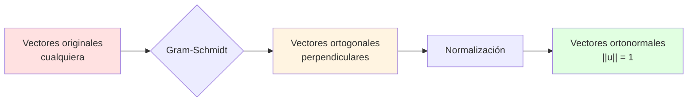

# 🎯 Proceso de Gram-Schmidt

## 📚 Introducción

> [!info]- 💡 ¿Qué es el Proceso de Gram-Schmidt?
> 
> El **Proceso de Gram-Schmidt** es un algoritmo fundamental en álgebra lineal que transforma un conjunto de vectores linealmente independientes en un conjunto de vectores **ortonormales** (perpendiculares entre sí y de longitud unitaria).
> 
> **Analogía práctica:** Imagina que tienes varios palitos desordenados apuntando en diferentes direcciones. Gram-Schmidt los reorganiza para que:
> 
> 1. Todos apunten en direcciones **perpendiculares** entre sí
> 2. Todos tengan **la misma longitud** (unitaria)
> 3. Mantengan el **mismo espacio** que generaban originalmente
> 
> **Definición formal:** Dado un conjunto de vectores linealmente independientes {v₁, v₂, ..., vₙ}, el proceso produce un conjunto ortonormal {u₁, u₂, ..., uₙ} que genera el mismo espacio.
> 
> **¿Por qué es importante?**
> 
> |Aspecto|Descripción|Ejemplo de Uso|
> |---|---|---|
> |**Simplificación**|Facilita cálculos y proyecciones|Resolver sistemas de ecuaciones|
> |**Estabilidad numérica**|Reduce errores de redondeo|Algoritmos computacionales|
> |**Descomposiciones**|Base para factorización QR|Valores propios, mínimos cuadrados|
> |**Geometría**|Crea sistemas de coordenadas ortogonales|Gráficos 3D, animación|
> |**Señales**|Análisis de Fourier y wavelets|Procesamiento de audio/video|



---

## 🎨 Interpretación Geométrica

### 🔍 Visualización del Concepto

> [!example]- 📐 ¿Qué Significa Geométricamente?
> 
> **Transformación visual de vectores:**
> 
> ```mermaid
> graph TD
>     A[Vectores originales<br/>v₁, v₂, v₃] --> B[Paso 1: Mantener v₁<br/>normalizar → u₁]
>     B --> C[Paso 2: Proyectar v₂<br/>eliminar componente en u₁]
>     C --> D[Paso 3: Proyectar v₃<br/>eliminar componentes en u₁, u₂]
>     D --> E[Resultado: Base<br/>ortonormal]
>     
>     style B fill:#e1f5ff
>     style C fill:#fff4e1
>     style E fill:#e1ffe1
> ```
> 
> **Ejemplo concreto en 2D:**
> 
> Vectores originales: $$v_1 = \begin{pmatrix} 3 \ 1 \end{pmatrix}, \quad v_2 = \begin{pmatrix} 2 \ 2 \end{pmatrix}$$
> 
> |Paso|Vector|Operación|Resultado Geométrico|
> |---|---|---|---|
> |**1**|v₁|Normalizar|u₁ apunta en dirección de v₁|
> |**2**|v₂|Quitar componente en u₁|v₂' ⊥ u₁|
> |**3**|v₂'|Normalizar|u₂ perpendicular a u₁|
> 
> **Representación gráfica del proceso:**
> 
> ```mermaid
> graph LR
>     A[v₁] -->|Normalizar| B[u₁ = v₁/||v₁||]
>     C[v₂] -->|Proyección| D[proyᵤ₁v₂]
>     C -->|Restar| E[v₂' = v₂ - proyᵤ₁v₂]
>     E -->|Normalizar| F[u₂ = v₂'/||v₂'||]
>     
>     B --> G[✓ ||u₁|| = 1]
>     F --> H[✓ ||u₂|| = 1]
>     F --> I[✓ u₁ ⊥ u₂]
>     
>     style G fill:#e1ffe1
>     style H fill:#e1ffe1
>     style I fill:#e1ffe1
> ```
> 
> **Propiedades visuales clave:**
> 
> |Propiedad|Antes de GS|Después de GS|
> |---|---|---|
> |**Ángulos**|Cualquier ángulo|Exactamente 90°|
> |**Longitudes**|Variables|Todas = 1|
> |**Espacio generado**|Span{v₁, v₂, ...}|Span{u₁, u₂, ...} = mismo|
> |**Producto punto**|vᵢ · vⱼ ≠ 0|uᵢ · uⱼ = 0 (i≠j)|

### 🔄 Ortogonalidad vs Ortonormalidad

> [!tip]- 📊 Diferencias Importantes
> 
> **Conceptos relacionados pero distintos:**
> 
> ```mermaid
> graph TD
>     A[Vectores linealmente<br/>independientes] --> B{Gram-Schmidt}
>     B -->|Paso 1| C["Vectores<br/>ORTOGONALES"]
>     C -->|Paso 2| D["Vectores<br/>ORTONORMALES"]
>     
>     C --> E[Perpendiculares<br/>uᵢ · uⱼ = 0]
>     D --> F["Perpendiculares<br/>Y unitarios<br/>||uᵢ|| = 1"]
>     
>     style C fill:#fff4e1
>     style D fill:#e1ffe1
> ```
> 
> **Tabla comparativa:**
> 
> |Característica|Ortogonales|Ortonormales|
> |---|---|---|
> |**Definición**|v · w = 0|v · w = 0 Y \|v\| = 1|
> |**Ángulo**|90°|90°|
> |**Longitud**|Cualquiera|Exactamente 1|
> |**Ejemplo**|(3,0), (0,5)|(1,0), (0,1)|
> |**Producto punto**|Cero si i≠j|δᵢⱼ (delta Kronecker)|
> 
> **Ejemplo numérico:**
> 
> ```
> Vectores ORTOGONALES (pero no ortonormales):
> v₁ = [3]    v₂ = [ 0]
>      [0]         [-2]
> 
> v₁ · v₂ = 3·0 + 0·(-2) = 0  ✓ Ortogonales
> ||v₁|| = 3 ≠ 1  ✗ No unitario
> ||v₂|| = 2 ≠ 1  ✗ No unitario
> 
> Vectores ORTONORMALES:
> u₁ = [1]    u₂ = [0]
>      [0]         [1]
> 
> u₁ · u₂ = 0     ✓ Ortogonales
> ||u₁|| = 1      ✓ Unitario
> ||u₂|| = 1      ✓ Unitario
> ```

---

## 🔢 El Algoritmo Paso a Paso

### 📝 Formulación Matemática

> [!note]- 🎯 Fórmulas del Proceso
> 
> **Algoritmo completo:**
> 
> Dado {v₁, v₂, ..., vₙ} vectores LI, construir {u₁, u₂, ..., uₙ} ortonormales:
> 
> **Paso 1 - Primer vector:** $$u_1 = \frac{v_1}{||v_1||}$$
> 
> **Paso 2 - Segundo vector:** $$w_2 = v_2 - \text{proy}_{u_1}v_2 = v_2 - (v_2 \cdot u_1)u_1$$ $$u_2 = \frac{w_2}{||w_2||}$$
> 
> **Paso k - k-ésimo vector (fórmula general):** $$w_k = v_k - \sum_{j=1}^{k-1}\text{proy}_{u_j}v_k = v_k - \sum_{j=1}^{k-1}(v_k \cdot u_j)u_j$$ $$u_k = \frac{w_k}{||w_k||}$$
> 
> **Fórmula de proyección:** $$\text{proy}_u v = \frac{v \cdot u}{u \cdot u}u = (v \cdot u)u \quad \text{(si u es unitario)}$$
> 
> **Proceso algorítmico:**
> 
> ```mermaid
> flowchart TD
>     A[Inicio: v₁, v₂, ..., vₙ] --> B[k = 1]
>     B --> C[Normalizar v₁ → u₁]
>     C --> D[k = k + 1]
>     D --> E{k ≤ n?}
>     E -->|No| F[Fin: u₁, u₂, ..., uₙ]
>     E -->|Sí| G[wₖ = vₖ]
>     G --> H[Para j = 1 hasta k-1]
>     H --> I[wₖ = wₖ - proyᵤⱼvₖ]
>     I --> J["uₖ = wₖ/||wₖ||"]
>     J --> D
>     
>     style C fill:#e1f5ff
>     style I fill:#fff4e1
>     style J fill:#e1ffe1
>     style F fill:#e1ffe1
> ```
> 
> **Propiedades importantes:**
> 
> |Propiedad|Expresión Matemática|Significado|
> |---|---|---|
> |**Ortogonalidad**|uᵢ · uⱼ = 0 (i≠j)|Vectores perpendiculares|
> |**Normalidad**|\|uᵢ\| = 1|Vectores unitarios|
> |**Completitud**|Span{u₁,...,uₙ} = Span{v₁,...,vₙ}|Mismo espacio|
> |**Independencia**|{u₁,...,uₙ} LI|Base del espacio|

### 🧮 Ejemplo Completo en 3D

> [!success]- 💪 Ejemplo Resuelto Detallado
> 
> **Vectores originales:**
> 
> $$v_1 = \begin{pmatrix} 1 \ 1 \ 0 \end{pmatrix}, \quad v_2 = \begin{pmatrix} 1 \ 0 \ 1 \end{pmatrix}, \quad v_3 = \begin{pmatrix} 0 \ 1 \ 1 \end{pmatrix}$$
> 
> ---
> 
> **PASO 1: Calcular u₁**
> 
> ```
> Normalizar v₁:
> 
> ||v₁|| = √(1² + 1² + 0²) = √2
> 
> u₁ = v₁/||v₁|| = (1/√2)[1]  = [1/√2  ]   = [0.707]
>                         [1]    [1/√2  ]     [0.707]
>                         [0]    [0     ]     [0    ]
> 
> ✓ Verificar: ||u₁|| = √(0.5 + 0.5 + 0) = 1 ✓
> ```
> 
> ---
> 
> **PASO 2: Calcular u₂**
> 
> ```
> 2a) Proyección de v₂ sobre u₁:
> 
> v₂ · u₁ = 1·(1/√2) + 0·(1/√2) + 1·0 = 1/√2
> 
> proyᵤ₁v₂ = (v₂ · u₁)u₁ = (1/√2)[1/√2]  = [1/2]
>                                [1/√2]    [1/2]
>                                [0   ]    [0  ]
> 
> 2b) Componente ortogonal:
> 
> w₂ = v₂ - proyᵤ₁v₂ = [1] - [1/2]  = [ 1/2]
>                       [0]   [1/2]    [-1/2]
>                       [1]   [0  ]    [ 1  ]
> 
> 2c) Normalizar:
> 
> ||w₂|| = √((1/2)² + (-1/2)² + 1²) = √(1/4 + 1/4 + 1) = √(3/2) = √6/2
> 
> u₂ = w₂/||w₂|| = (2/√6)[ 1/2]  = [ 1/√6 ]   = [0.408 ]
>                        [-1/2]    [-1/√6 ]     [-0.408]
>                        [ 1  ]    [ 2/√6 ]     [0.816 ]
> 
> ✓ Verificar ortogonalidad: u₁ · u₂ = (1/√2)(1/√6) + (1/√2)(-1/√6) + 0 = 0 ✓
> ```
> 
> ---
> 
> **PASO 3: Calcular u₃**
> 
> ```
> 3a) Proyección sobre u₁:
> 
> v₃ · u₁ = 0·(1/√2) + 1·(1/√2) + 1·0 = 1/√2
> 
> proyᵤ₁v₃ = (1/√2)[1/√2]  = [1/2]
>                  [1/√2]    [1/2]
>                  [0   ]    [0  ]
> 
> 3b) Proyección sobre u₂:
> 
> v₃ · u₂ = 0·(1/√6) + 1·(-1/√6) + 1·(2/√6) = 1/√6
> 
> proyᵤ₂v₃ = (1/√6)[ 1/√6 ]  = [ 1/6]
>                  [-1/√6 ]    [-1/6]
>                  [ 2/√6 ]    [ 2/6]
> 
> 3c) Componente ortogonal:
> 
> w₃ = v₃ - proyᵤ₁v₃ - proyᵤ₂v₃ 
>    = [0] - [1/2] - [ 1/6]  = [-2/3]
>      [1]   [1/2]   [-1/6]    [ 2/3]
>      [1]   [0  ]   [ 2/6]    [ 2/3]
> 
> 3d) Normalizar:
> 
> ||w₃|| = √(4/9 + 4/9 + 4/9) = √(12/9) = 2/√3
> 
> u₃ = (√3/2)[-2/3]  = [-1/√3]   = [-0.577]
>            [ 2/3]    [ 1/√3]     [ 0.577]
>            [ 2/3]    [ 1/√3]     [ 0.577]
> 
> ✓ Verificar:
>   u₁ · u₃ = (1/√2)(-1/√3) + (1/√2)(1/√3) + 0 = 0 ✓
>   u₂ · u₃ = (1/√6)(-1/√3) + (-1/√6)(1/√3) + (2/√6)(1/√3) = 0 ✓
> ```
> 
> ---
> 
> **RESULTADO FINAL:**
> 
> **Base ortonormal:**
> 
> $$u_1 = \begin{pmatrix} 1/\sqrt{2} \ 1/\sqrt{2} \ 0 \end{pmatrix}, \quad u_2 = \begin{pmatrix} 1/\sqrt{6} \ -1/\sqrt{6} \ 2/\sqrt{6} \end{pmatrix}, \quad u_3 = \begin{pmatrix} -1/\sqrt{3} \ 1/\sqrt{3} \ 1/\sqrt{3} \end{pmatrix}$$
> 
> **Matriz de verificación (debe ser identidad):**
> 
> $$U^T U = \begin{pmatrix} u_1^T \ u_2^T \ u_3^T \end{pmatrix} \begin{pmatrix} u_1 & u_2 & u_3 \end{pmatrix} = \begin{pmatrix} 1 & 0 & 0 \ 0 & 1 & 0 \ 0 & 0 & 1 \end{pmatrix} \checkmark$$

---

## 🎯 Variante: Gram-Schmidt Modificado

### 🔄 Versión Numéricamente Estable

> [!tip]- ⚡ Algoritmo Mejorado
> 
> **Problema con el método clásico:**
> 
> - Acumulación de errores de redondeo
> - Pérdida de ortogonalidad en cálculos con punto flotante
> - Inestable para vectores casi paralelos
> 
> **Solución: Gram-Schmidt Modificado (MGS)**
> 
> **Diferencia clave:**
> 
> |Aspecto|Clásico|Modificado|
> |---|---|---|
> |**Orden**|Calcula todas las proyecciones juntas|Actualiza vector después de cada proyección|
> |**Estabilidad**|Menor|Mayor|
> |**Precisión**|Puede perder ortogonalidad|Mantiene mejor ortogonalidad|
> |**Complejidad**|O(mn²)|O(mn²) (igual)|
> 
> **Algoritmo MGS:**
> 
> ````python
> def gram_schmidt_modificado(V):
>     """
>     V: matriz con vectores como columnas
>     Retorna: matriz Q con vectores ortonormales
>     """
>     m, n = V.shape
>     Q = V.copy()
>     
>     for i in range(n):
>         # Normalizar el vector actual
>         Q[:, i] = Q[:, i] / norm(Q[:, i])
>         
>         # Ortogonalizar vectores subsecuentes
>         for j in range(i+1, n):
>             # Proyección y resta INMEDIATA
>             Q[:, j] = Q[:, j] - (Q[:, j] @ Q[:, i]) * Q[:, i]
>     
>     return Q
>     ```
> 
> **Comparación visual:**
> 
> ```mermaid
> graph TD
>     A[Gram-Schmidt Clásico] --> B[v₂ - proy₁ - proy₂ - ...]
>     A --> C[Todas las proyecciones<br/>sobre vectores originales]
>     C --> D[⚠️ Acumula errores]
>     
>     E[Gram-Schmidt Modificado] --> F[v₂ - proy₁]
>     F --> G[Actualizar v₂]
>     G --> H[v₃ - proy₁']
>     H --> I[Actualizar v₃]
>     I --> J[✓ Reduce errores]
>     
>     style D fill:#ffe1e1
>     style J fill:#e1ffe1
> ````
> 
> **Ejemplo de diferencia numérica:**
> 
> ```
> Vectores casi paralelos:
> v₁ = [1, 0, 0]
> v₂ = [1, 1e-10, 0]
> v₃ = [1, 0, 1e-10]
> 
> Clásico:
> Después de GS: u₂ · u₃ ≈ 1e-5  ⚠️ No completamente ortogonales
> 
> Modificado:
> Después de MGS: u₂ · u₃ ≈ 1e-15 ✓ Mucho mejor
> ```
> 
> **Cuándo usar cada uno:**
> 
> |Situación|Recomendación|
> |---|---|
> |**Cálculo a mano**|Clásico (más intuitivo)|
> |**Implementación computacional**|Modificado (más estable)|
> |**Vectores bien condicionados**|Cualquiera|
> |**Vectores casi dependientes**|Modificado (obligatorio)|
> |**Alta precisión requerida**|Modificado + re-ortogonalización|

---

## 🌟 Aplicaciones Prácticas

### 📊 Factorización QR

> [!success]- 🔨 Descomposición Fundamental
> 
> **Definición:** Para cualquier matriz A (m×n) con columnas LI: $$A = QR$$
> 
> Donde:
> 
> - **Q**: matriz ortogonal (m×n) con QᵀQ = I
> - **R**: matriz triangular superior (n×n)
> 
> **Conexión con Gram-Schmidt:**
> 
> - Las columnas de Q son el resultado de aplicar GS a las columnas de A
> - R contiene los coeficientes de las proyecciones
> 
> **Proceso de construcción:**
> 
> ```mermaid
> flowchart LR
>     A[Matriz A<br/>columnas = v₁, v₂, v₃] --> B[Gram-Schmidt]
>     B --> C[Matriz Q<br/>columnas = u₁, u₂, u₃]
>     B --> D[Matriz R<br/>coeficientes]
>     C --> E[A = QR]
>     D --> E
>     
>     style C fill:#e1ffe1
>     style D fill:#fff4e1
>     style E fill:#e1f5ff
> ```
> 
> **Ejemplo numérico:**
> 
> $$A = \begin{pmatrix} 1 & 1 \ 1 & 0 \ 0 & 1 \end{pmatrix}$$
> 
> ```
> Paso 1: Aplicar Gram-Schmidt a columnas de A
> 
> v₁ = [1, 1, 0]ᵀ  →  u₁ = [1/√2, 1/√2, 0]ᵀ
> 
> v₂ = [1, 0, 1]ᵀ
> w₂ = v₂ - (v₂·u₁)u₁ = [1, 0, 1]ᵀ - (1/√2)[1/√2, 1/√2, 0]ᵀ
>    = [1/2, -1/2, 1]ᵀ
> u₂ = w₂/||w₂|| = [1/√6, -1/√6, 2/√6]ᵀ
> 
> Q = [1/√2   1/√6 ]
>     [1/√2  -1/√6 ]
>     [0      2/√6 ]
> 
> Paso 2: Calcular R
> 
> R = QᵀA = [v₁·u₁  v₂·u₁]  = [√2    1/√2 ]
>          [v₁·u₂  v₂·u₂]    [0     √(3/2)]
> 
> Verificación:
> QR = [1/√2   1/√6 ][√2    1/√2 ]  = [1  1]  = A ✓
>      [1/√2  -1/√6 ][0     √(3/2)]   [1  0]
>      [0      2/√6 ]                  [0  1]
> ```
> 
> **Aplicaciones de QR:**
> 
> |Aplicación|Uso|Ventaja|
> |---|---|---|
> |**Resolver sistemas**|Ax = b → QRx = b|Más estable que eliminación Gaussiana|
> |**Valores propios**|Algoritmo QR iterativo|Converge a valores propios|
> |**Mínimos cuadrados**|Regresión lineal|Solución óptima|
> |**Rango de matriz**|Determinar independencia|Detecta dependencia lineal|

### 🎓 Mínimos Cuadrados

> [!example]- 📈 Regresión Lineal Óptima
> 
> **Problema:** Encontrar la mejor línea (o hiperplano) que se ajuste a datos
> 
> **Formulación matemática:**
> 
> Dado Ax = b donde A es m×n (m > n), encontrar x que minimice ||Ax - b||²
> 
> **Solución usando QR:**
> 
> ```mermaid
> flowchart TD
>     A[Problema: min ||Ax - b||] --> B[Factorizar A = QR]
>     B --> C[Sustituir: min ||QRx - b||]
>     C --> D[Multiplicar por Qᵀ]
>     D --> E[min ||Rx - Qᵀb||]
>     E --> F[Resolver Rx = Qᵀb<br/>sistema triangular]
>     F --> G[Solución x*]
>     
>     style F fill:#fff4e1
>     style G fill:#e1ffe1
> ```
> 
> **Ventajas sobre ecuaciones normales (AᵀAx = Aᵀb):**
> 
> |Aspecto|Ecuaciones Normales|Factorización QR|
> |---|---|---|
> |**Estabilidad**|κ(AᵀA) = κ(A)²|κ(R) = κ(A)|
> |**Precisión**|Puede perder dígitos|Más precisa|
> |**Complejidad**|O(mn² + n³)|O(mn²)|
> |**Recomendación**|A bien condicionada|Uso general|
> 
> **Ejemplo: Ajustar línea a puntos**
> 
> Datos: (0,1), (1,2), (2,4), (3,4)
> 
> ```
> Modelo: y = a + bx
> 
> Sistema sobredeterminado:
> [1  0]     [1]
> [1  1][a] = [2]
> [1  2][b]   [4]
> [1  3]     [4]
> 
> A = [1  0]      b = [1]
>     [1  1]          [2]
>     [1  2]          [4]
>     [1  3]          [4]
> 
> Paso 1: Factorizar A = QR
> (usando Gram-Schmidt)
> 
> Q = [0.5   -0.67]     R = [2    3  ]
>     [0.5   -0.22]         [0    1.58]
>     [0.5    0.22]
>     [0.5    0.67]
> 
> Paso 2: Resolver Rx = Qᵀb
> 
> Qᵀb = [5.5]
>       [3.8]
> 
> De Rx = Qᵀb:
> 2a + 3b = 5.5
> 1.58b = 3.8
> 
> b ≈ 2.4
> a ≈ -0.85
> 
> ✓ Línea óptima: y = -0.85 + 2.4x
> ```

### 🖼️ Procesamiento de Señales

> [!tip]- 📡 Ortogonalización de Bases
> 
> **Aplicación: Análisis de Fourier Discreto**
> 
> En procesamiento de señales, necesitamos bases ortogonales para:
> 
> - Descomponer señales en componentes frecuenciales
> - Comprimir datos (eliminar redundancia)
> - Filtrar ruido (mantener componentes principales)
> 
> **Proceso con Gram-Schmidt:**
> 
> ```mermaid
> graph LR
>     A[Señal original] --> B[Muestrear]
>     B --> C[Vectores de datos]
>     C --> D[Gram-Schmidt]
>     D --> E[Base ortogonal]
>     E --> F[Coeficientes]
>     F --> G[Comprimir/<br/>Filtrar]
>     G --> H[Reconstruir]
>     
>     style D fill:#fff4e1
>     style E fill:#e1ffe1
> ```
> 
> **Ejemplo: Wavelets de Haar**
> 
> ```
> 
> Señal: [1, 2, 3, 4]
> 
> Funciones base (no ortogonales inicialmente): φ₁ = [1, 1, 0, 0] (nivel bajo) φ₂ = [0, 0, 1, 1] (nivel bajo) ψ₁ = [1, -1, 0, 0] (detalle) ψ₂ = [0, 0, 1, -1] (detalle)
> 
> Aplicar GS para ortogonalizar:
> 
> u₁ = φ₁/||φ₁|| = [1/√2, 1/√2, 0, 0]
> 
> u₂ = ortogonalizar(φ₂ respecto a u₁) = [0, 0, 1/√2, 1/√2]
> 
> u₃ = ortogonalizar(ψ₁ respecto a u₁, u₂) = [1/√2, -1/√2, 0, 0]
> 
> u₄ = ortogonalizar(ψ₂ respecto a u₁, u₂, u₃) = [0, 0, 1/√2, -1/√2]
> 
> Descomposición de señal: s = c₁u₁ + c₂u₂ + c₃u₃ + c₄u₄
> 
> Compresión: mantener solo c₁, c₂ (niveles bajos)
> 
> ```
> 
> **Tabla de aplicaciones:**
> 
> | Área | Uso de GS | Beneficio |
> |------|-----------|-----------|
> | **Audio** | Separación de frecuencias | Compresión, ecualización |
> | **Imágenes** | Transformadas ortogonales | JPEG, wavelets |
> | **Radar** | Procesamiento de pulsos | Detección de objetivos |
> | **Comunicaciones** | Modulación OFDM | Canales ortogonales |
> 

### 🎮 Gráficos por Computadora

> [!info]- 🖥️ Sistemas de Coordenadas Locales
> 
> **Problema:** En gráficos 3D, objetos necesitan sus propios sistemas de coordenadas
> 
> **Solución:** Crear bases ortonormales para cada objeto
> 
> **Caso típico: Cámara virtual**
> 
> ```mermaid
> graph TD
>     A[Posición cámara] --> B[Vector hacia<br/>objetivo: forward]
>     B --> C[Vector up<br/>aproximado]
>     C --> D[Gram-Schmidt:<br/>ortogonalizar]
>     D --> E[forward, right, up<br/>base ortonormal]
>     E --> F[Matriz de vista]
>     
>     style D fill:#fff4e1
>     style E fill:#e1ffe1
> ```
> 
> **Algoritmo:**
> 
> ```python
> def crear_base_camara(eye, target, world_up):
>     """
>     eye: posición de la cámara
>     target: punto al que mira
>     world_up: dirección "arriba" del mundo (ej: [0,1,0])
>     """
>     # Vector forward (normalizado)
>     forward = normalize(target - eye)
>     
>     # Vector right (perpendicular a forward y world_up)
>     # Usando producto cruz en lugar de GS completo
>     right = normalize(cross(forward, world_up))
>     
>     # Vector up (perpendicular a forward y right)
>     up = cross(right, forward)
>     
>     # Base ortonormal: {right, up, -forward}
>     return right, up, -forward
> ```
> 
> **Ejemplo numérico:**
> 
> ```
> Cámara en: eye = [5, 3, 5]
> Mirando a: target = [0, 0, 0]
> Arriba del mundo: world_up = [0, 1, 0]
> 
> Paso 1: forward
> forward = normalize([0,0,0] - [5,3,5])
>         = normalize([-5,-3,-5])
>         = [-0.656, -0.394, -0.656]
> 
> Paso 2: right (usando producto cruz)
> right = normalize(forward × world_up)
>       = normalize([-0.656,-0.394,-0.656] × [0,1,0])
>       = [0.707, 0, -0.707]
> 
> Paso 3: up
> up = right × forward
>    = [0.707,0,-0.707] × [-0.656,-0.394,-0.656]
>    = [-0.279, 0.924, -0.279]
> 
> ✓ Verificación ortogonalidad:
>   right · up = 0
>   right · forward = 0
>   up · forward = 0
> ```
> 
> **Aplicaciones adicionales en gráficos:**
> 
> |Aplicación|Descripción|
> |---|---|
> |**Tangent space**|Normales, tangentes, bitangentes para iluminación|
> |**Skinning**|Deformación de mallas con esqueletos|
> |**Rotaciones**|Interpolación de orientaciones (SLERP)|
> |**Física**|Restricciones ortogonales en simulaciones|

---

## 🧮 Propiedades y Teoremas

### 📚 Resultados Fundamentales

> [!note]- 🎓 Teoremas Importantes
> 
> **Teorema 1: Existencia**
> 
> Todo conjunto de vectores linealmente independientes en ℝⁿ puede ser ortogonalizado mediante Gram-Schmidt.
> 
> **Demostración (idea):**
> 
> - Por inducción en el número de vectores
> - Base: un vector se normaliza trivialmente
> - Paso inductivo: si {u₁,...,uₖ} es ortonormal, uₖ₊₁ se construye ortogonal a todos
> 
> ---
> 
> **Teorema 2: Unicidad (salvo signos)**
> 
> La base ortonormal obtenida es única salvo cambios de signo en los vectores.
> 
> **Explicación:**
> 
> - El primer vector u₁ está determinado por v₁ (salvo signo)
> - Cada uₖ está determinado por u₁,...,uₖ₋₁ y vₖ (salvo signo)
> - Diferentes ordenamientos de {v₁,...,vₙ} dan bases diferentes
> 
> ---
> 
> **Teorema 3: Preservación de espacio**
> 
> Para cada k ≤ n: $$\text{Span}{u_1, u_2, ..., u_k} = \text{Span}{v_1, v_2, ..., v_k}$$
> 
> **Consecuencia:** La base ortonormal genera el mismo subespacio
> 
> ---
> 
> **Teorema 4: Desigualdad de Bessel**
> 
> Para cualquier vector v y base ortonormal {u₁,...,uₙ}: $$\sum_{i=1}^{n}(v \cdot u_i)^2 \leq ||v||^2$$
> 
> Igualdad ⟺ v ∈ Span{u₁,...,uₙ}
> 
> **Interpretación:** La suma de proyecciones al cuadrado no excede la norma al cuadrado
> 
> ---
> 
> **Teorema 5: Mejor aproximación**
> 
> La proyección de v sobre Span{u₁,...,uₖ}: $$\text{proy}_U v = \sum_{i=1}^{k}(v \cdot u_i)u_i$$
> 
> minimiza ||v - w|| para todo w ∈ Span{u₁,...,uₖ}
> 
> **Aplicación:** Mínimos cuadrados, aproximaciones
> 
> ---
> 
> **Propiedades de la matriz Q:**
> 
> |Propiedad|Expresión|Significado|
> |---|---|---|
> |**Ortogonalidad**|QᵀQ = I|Columnas ortonormales|
> |**Inversión fácil**|Q⁻¹ = Qᵀ|Muy eficiente|
> |**Preserva normas**|\|Qx\| = \|x\||Isometría|
> |**Preserva ángulos**|(Qx)·(Qy) = x·y|Transformación ortogonal|
> |**Determinante**|det(Q) = ±1|Preserva volumen|

### 🔍 Condiciones de Fallo

> [!warning]- ⚠️ Cuándo Falla Gram-Schmidt
> 
> **Situaciones problemáticas:**
> 
> ```mermaid
> graph TD
>     A[Vectores de entrada] --> B{¿Linealmente<br/>independientes?}
>     B -->|No| C[❌ GS FALLA]
>     B -->|Sí| D{¿Bien<br/>condicionados?}
>     D -->|No| E[⚠️ Problemas<br/>numéricos]
>     D -->|Sí| F[✓ GS funciona]
>     
>     C --> G[wₖ = 0 en algún paso]
>     E --> H[Pérdida de<br/>ortogonalidad]
>     
>     style C fill:#ffe1e1
>     style E fill:#fff4cc
>     style F fill:#e1ffe1
> ```
> 
> **Caso 1: Dependencia lineal**
> 
> ```
> Ejemplo:
> v₁ = [1, 0, 0]
> v₂ = [0, 1, 0]
> v₃ = [2, 3, 0]  ← combinación lineal de v₁, v₂
> 
> Al aplicar GS:
> u₁ = [1, 0, 0]
> u₂ = [0, 1, 0]
> 
> w₃ = v₃ - (v₃·u₁)u₁ - (v₃·u₂)u₂
>    = [2, 3, 0] - 2[1,0,0] - 3[0,1,0]
>    = [0, 0, 0]  ← ❌ Vector nulo!
> 
> ||w₃|| = 0  → No se puede normalizar
> ```
> 
> **Detección:** Si ||wₖ|| < ε (muy pequeño), los vectores son casi dependientes
> 
> ---
> 
> **Caso 2: Vectores casi paralelos (mal condicionados)**
> 
> ```
> v₁ = [1, 0]
> v₂ = [1, 10⁻¹⁰]
> 
> Teóricamente LI, pero en aritmética de punto flotante:
> 
> u₁ = [1, 0]
> w₂ = v₂ - (v₂·u₁)u₁ = [1, 10⁻¹⁰] - 1·[1,0] = [0, 10⁻¹⁰]
> 
> ⚠️ ||w₂|| = 10⁻¹⁰ (muy pequeño)
> u₂ = [0, 1] (teórico)
> 
> Pero con redondeo:
> u₁ · u₂ ≈ 10⁻¹⁶ ≠ 0  (pérdida de ortogonalidad)
> ```
> 
> **Solución:**
> 
> 1. Usar Gram-Schmidt Modificado
> 2. Re-ortogonalización iterativa
> 3. Verificar número de condición
> 
> ---


---

## 🎓 Ejercicios Guiados

> [!example]- 💪 Práctica Progresiva
> ### **Nivel Básico:**
> 
> **Ejercicio 1: Ortogonalizar 2 vectores en ℝ²**
> 
> ```
> Dados: v₁ = [3, 1], v₂ = [1, 2]
> 
> a) Aplicar Gram-Schmidt
> b) Verificar ortogonalidad
> c) Verificar normalización
> ```
> 
> **Solución:**
> 
> ```
> Paso 1: Primer vector
> u₁ = v₁/||v₁|| = [3, 1]/√(9+1) = [3, 1]/√10
> 
> u₁ = [3/√10, 1/√10] ≈ [0.949, 0.316]
> 
> Paso 2: Segundo vector
> v₂ · u₁ = 1·(3/√10) + 2·(1/√10) = 5/√10
> 
> w₂ = v₂ - (v₂·u₁)u₁
>    = [1, 2] - (5/√10)[3/√10, 1/√10]
>    = [1, 2] - [15/10, 5/10]
>    = [1, 2] - [1.5, 0.5]
>    = [-0.5, 1.5]
> 
> ||w₂|| = √(0.25 + 2.25) = √2.5 = √(5/2)
> 
> u₂ = w₂/||w₂|| = [-0.5, 1.5]/√2.5
>    = [-1/√10, 3/√10] ≈ [-0.316, 0.949]
> 
> Verificación:
> u₁ · u₂ = (3/√10)(-1/√10) + (1/√10)(3/√10)
>         = -3/10 + 3/10 = 0 ✓
> 
> ||u₁|| = √((3/√10)² + (1/√10)²) = √(9/10 + 1/10) = 1 ✓
> ||u₂|| = √(1/10 + 9/10) = 1 ✓
> ```
> 
> ---
> 
> **Ejercicio 2: Tres vectores en ℝ³**
> 
> ```
> v₁ = [1, 0, 1]
> v₂ = [1, 1, 0]
> v₃ = [0, 1, 1]
> 
> Ortogonalizar usando Gram-Schmidt
> ```
> 
> **Solución:**
> 
> ```
> Paso 1: u₁
> ||v₁|| = √(1 + 0 + 1) = √2
> u₁ = [1/√2, 0, 1/√2]
> 
> Paso 2: u₂
> v₂ · u₁ = 1·(1/√2) + 1·0 + 0·(1/√2) = 1/√2
> 
> w₂ = [1, 1, 0] - (1/√2)[1/√2, 0, 1/√2]
>    = [1, 1, 0] - [1/2, 0, 1/2]
>    = [1/2, 1, -1/2]
> 
> ||w₂|| = √(1/4 + 1 + 1/4) = √(3/2)
> 
> u₂ = (√(2/3))[1/2, 1, -1/2]
>    = [1/√6, √(2/3), -1/√6]
> 
> Paso 3: u₃
> v₃ · u₁ = 0·(1/√2) + 1·0 + 1·(1/√2) = 1/√2
> v₃ · u₂ = 0·(1/√6) + 1·√(2/3) + 1·(-1/√6)
> 
> w₃ = v₃ - (v₃·u₁)u₁ - (v₃·u₂)u₂
>    
> (cálculo completo
> similar a paso 2)
> 
> u₃ = [-1/√3, 1/√3, 1/√3]
> 
> Verificación final: u₁ · u₂ = 0 ✓ u₁ · u₃ = 0 ✓ u₂ · u₃ = 0 ✓
> 
> ```
> 
> ---
> 
> ### **Nivel Intermedio:**
> 
> **Ejercicio 3: Factorización QR**
> 
> ```
> 
> Dada A = [1 1] [1 0] [0 1]
> 
> Encontrar Q y R tales que A = QR
> 
> ```
> 
> **Solución:**
> 
> ```
> 
> Aplicar GS a las columnas de A:
> 
> v₁ = [1, 1, 0]ᵀ v₂ = [1, 0, 1]ᵀ
> 
> u₁ = v₁/||v₁|| = [1/√2, 1/√2, 0]ᵀ
> 
> v₂ · u₁ = 1/√2 w₂ = v₂ - (1/√2)u₁ = [1/2, -1/2, 1]ᵀ ||w₂|| = √(3/2) u₂ = [1/√6, -1/√6, 2/√6]ᵀ
> 
> Q = [1/√2 1/√6 ] [1/√2 -1/√6 ] [0 2/√6 ]
> 
> R = QᵀA = [√2 1/√2 ] [0 √(3/2)]
> 
> Verificación: QR = [1 1] [1 0] = A ✓ [0 1]
> 
> ```
> 
> ---
> 
> **Ejercicio 4: Mínimos cuadrados**
> 
> ```
> 
> Ajustar línea y = a + bx a los puntos: (0, 1), (1, 3), (2, 2), (3, 4)
> 
> Usar QR
> 
> ```
> 
> **Solución:**
> 
> ```
> 
> Matriz de diseño: A = [1 0] [1 1] [1 2] [1 3]
> 
> Vector de observaciones: b = [1, 3, 2, 4]ᵀ
> 
> Factorizar A = QR (usando GS):
> 
> Q = [0.5 -0.67] R = [2 3 ] [0.5 -0.22] [0 1.58] [0.5 0.22] [0.5 0.67]
> 
> Resolver Rx = Qᵀb: Qᵀb = [5, 1.58]ᵀ
> 
> 2a + 3b = 5 1.58b = 1.58
> 
> b = 1 a = 1
> 
> ✓ Línea: y = 1 + x
> 
> Verificar ajuste: Puntos predichos: (0,1), (1,2), (2,3), (3,4) Error: √((0² + 1² + (-1)² + 0²)) = √2 ≈ 1.41
> 
> ```
> 
> ---
> 
> ### **Nivel Avanzado:**
> 
> **Ejercicio 5: Polinomios ortogonales**
> 
> ```
> 
> Ortogonalizar {1, x, x²} en [-1, 1] con producto interno ⟨f,g⟩ = ∫₋₁¹ f(x)g(x)dx
> 
> ```
> 
> **Solución:**
> 
> ```
> 
> v₀ = 1 v₁ = x  
> v₂ = x²
> 
> u₀ = v₀/||v₀|| ||v₀||² = ∫₋₁¹ 1² dx = 2 u₀ = 1/√2
> 
> ⟨v₁, u₀⟩ = ∫₋₁¹ x·(1/√2) dx = 0 w₁ = v₁ (ya es ortogonal) ||w₁||² = ∫₋₁¹ x² dx = 2/3 u₁ = x√(3/2)
> 
> ⟨v₂, u₀⟩ = ∫₋₁¹ x²·(1/√2) dx = (1/√2)·(2/3) = 2/(3√2) ⟨v₂, u₁⟩ = ∫₋₁¹ x² · x√(3/2) dx = 0
> 
> w₂ = x² - (2/(3√2))·(1/√2) = x² - 1/3
> 
> ||w₂||² = ∫₋₁¹ (x² - 1/3)² dx = 8/45
> 
> u₂ = (x² - 1/3)√(45/8)
> 
> ✓ Polinomios de Legendre (versión normalizada)
> 
> ````
> 

---

## 📊 Resumen Visual

### 🗺️ Mapa Conceptual

```mermaid
mindmap
  root((Gram-Schmidt))
    Concepto
      Ortogonalización
      Normalización
      Base ortonormal
      Preserva espacio
    Algoritmo
      Clásico
      Modificado
      Proyecciones
      Normalización
    Aplicaciones
      Factorización QR
      Mínimos cuadrados
      Procesamiento señales
      Gráficos 3D
    Propiedades
      Teoremas
      Estabilidad
      Condiciones de fallo
      Complejidad O(mn²)
````


---

## 🔗 Conexión con Próximos Temas

```mermaid
graph LR
    A[Gram-Schmidt] --> B[Factorización QR]
    B --> C[Mínimos cuadrados]
    C --> D[Regresión lineal]
    
    A --> E[Espacios con<br/>producto interno]
    E --> F[Polinomios<br/>ortogonales]
    F --> G[Series de Fourier]
    
    A --> H[Valores propios]
    H --> I[Algoritmo QR]
    I --> J[Diagonalización]
    
    B --> K[SVD]
    K --> L[PCA]
    
    style A fill:#e1ffe1
    style B fill:#fff4e1
    style K fill:#e1f5ff
```

---

**Tags:** #algebra-lineal #gram-schmidt #ortogonalización #factorización-qr #mínimos-cuadrados #base-ortonormal #proyecciones #estabilidad-numérica
