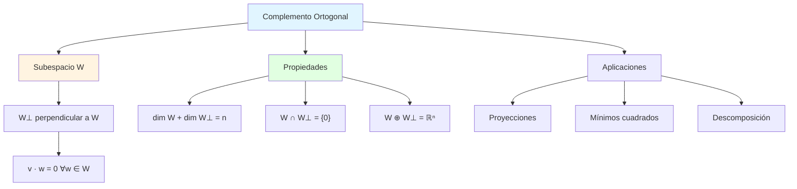
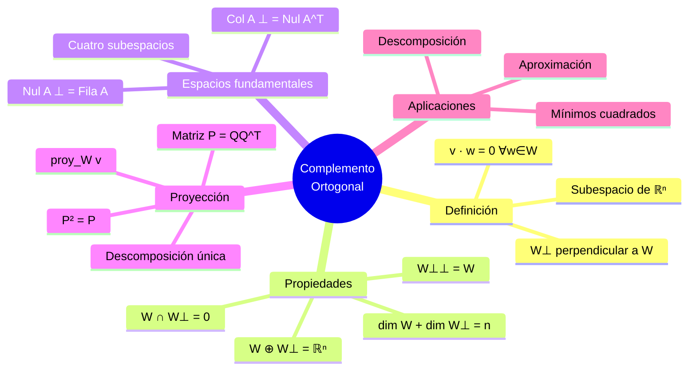

# 🔄 Complemento Ortogonal

## 🎯 Introducción

> [!info]- 💡 ¿Qué es el Complemento Ortogonal? El **complemento ortogonal** de un subespacio es el conjunto de todos los vectores que son perpendiculares a cada vector del subespacio original. Es como encontrar la "dimensión faltante" que completa el espacio total.
> 
> **Analogía práctica:** Imagina el piso de una habitación (un plano):
> 
> - **Subespacio W** → el piso horizontal
> - **Complemento ortogonal W⊥** → todas las direcciones verticales
> - **Juntos** → cubren todo el espacio 3D de la habitación
> 
> Cada vector en el espacio se puede descomponer únicamente como suma de un vector en el piso más un vector vertical.
> 
> **¿Por qué es importante?**
> 
> |Aspecto|Descripción|Beneficio|
> |---|---|---|
> |**Descomposición**|Todo vector se divide en dos partes|Simplificación|
> |**Proyecciones**|Base para proyección ortogonal|Aproximaciones óptimas|
> |**Espacios fundamentales**|Conecta los cuatro subespacios|Comprensión profunda|
> |**Unicidad**|Descomposición única|Estabilidad|
> |**Geometría**|Visualización clara|Intuición|



---

## 📚 Definición Formal

### 🎯 Concepto de Complemento Ortogonal

> [!note]- 📋 Definición Rigurosa
> 
> **Definición:**
> 
> Sea $W$ un subespacio de $\mathbb{R}^n$. El **complemento ortogonal** de $W$, denotado $W^\perp$ (léase "W perp"), es el conjunto:
> 
> $$W^\perp = {\mathbf{v} \in \mathbb{R}^n : \mathbf{v}^T \mathbf{w} = 0 \text{ para todo } \mathbf{w} \in W}$$
> 
> **En palabras:** $W^\perp$ consiste en todos los vectores que son ortogonales (perpendiculares) a **cada** vector en $W$.
> 
> **Elementos clave:**
> 
> |Componente|Descripción|Requisito|
> |---|---|---|
> |$W$|Subespacio original|De $\mathbb{R}^n$|
> |$W^\perp$|Complemento ortogonal|También subespacio de $\mathbb{R}^n$|
> |Ortogonalidad|$\mathbf{v} \perp \mathbf{w}$|$\mathbf{v}^T \mathbf{w} = 0$|
> |Condición|Para **todo** $\mathbf{w} \in W$|No solo algunos vectores|
> 
> **Notación alternativa:**
> 
> $$W^\perp = {\mathbf{v} : \mathbf{v} \cdot \mathbf{w} = 0, , \forall \mathbf{w} \in W}$$
> 
> **Interpretación geométrica:**
> 
> ```mermaid
> flowchart TB
>     A[Espacio ℝⁿ] --> B[Subespacio W]
>     A --> C[Complemento W⊥]
>     
>     B --> D[Contiene vectores<br/>de W]
>     C --> E[Contiene vectores<br/>perpendiculares a W]
>     
>     D -.->|v · w = 0| E
>     
>     style A fill:#e1f5ff
>     style B fill:#e1ffe1
>     style C fill:#fff4e1
> ```

### 🔍 Criterio Práctico

> [!success]- 🎪 Cómo Verificar si v ∈ W⊥
> 
> **Proposición:** Para verificar si $\mathbf{v} \in W^\perp$:
> 
> **Si $W$ tiene base ${\mathbf{w}_1, \mathbf{w}_2, \ldots, \mathbf{w}_k}$:**
> 
> $$\mathbf{v} \in W^\perp \iff \mathbf{v}^T \mathbf{w}_i = 0 \text{ para } i = 1, 2, \ldots, k$$
> 
> **Demostración:**
> 
> ```
> (⟹) Si v ∈ W⊥, entonces v · w = 0 para todo w ∈ W
>      En particular, v · wᵢ = 0 para cada vector de la base
> 
> (⟸) Si v · wᵢ = 0 para cada wᵢ de la base, y w ∈ W arbitrario:
>      w = c₁w₁ + c₂w₂ + ⋯ + cₖwₖ  (combinación lineal de la base)
>      
>      v · w = v · (c₁w₁ + c₂w₂ + ⋯ + cₖwₖ)
>            = c₁(v · w₁) + c₂(v · w₂) + ⋯ + cₖ(v · wₖ)
>            = c₁(0) + c₂(0) + ⋯ + cₖ(0)
>            = 0 ✓
> ```
> 
> **Consecuencia práctica:**
> 
> ```
> Para encontrar W⊥:
> 
> 1. Encontrar base {w₁, w₂, ..., wₖ} de W
> 2. Resolver sistema homogéneo:
>    w₁^T v = 0
>    w₂^T v = 0
>    ⋮
>    wₖ^T v = 0
> 
> 3. Las soluciones forman W⊥
> ```

---

## 🎭 Propiedades Fundamentales

### ✅ Propiedades Básicas

> [!tip]- 🔗 Características del Complemento Ortogonal
> 
> **1. W⊥ es un subespacio**
> 
> $W^\perp$ es un subespacio de $\mathbb{R}^n$
> 
> **Demostración:**
> 
> ```
> Verificar tres propiedades:
> 
> (i) 0 ∈ W⊥:
>     0 · w = 0 para todo w ∈ W ✓
> 
> (ii) Cerrado bajo suma:
>      Si v₁, v₂ ∈ W⊥, entonces para cualquier w ∈ W:
>      (v₁ + v₂) · w = v₁ · w + v₂ · w = 0 + 0 = 0
>      Por tanto v₁ + v₂ ∈ W⊥ ✓
> 
> (iii) Cerrado bajo multiplicación escalar:
>       Si v ∈ W⊥ y c ∈ ℝ, entonces para cualquier w ∈ W:
>       (cv) · w = c(v · w) = c(0) = 0
>       Por tanto cv ∈ W⊥ ✓
> ```
> 
> **2. Intersección trivial**
> 
> $$W \cap W^\perp = {\mathbf{0}}$$
> 
> **Demostración:**
> 
> ```
> Si v ∈ W ∩ W⊥, entonces:
> - v ∈ W
> - v ∈ W⊥, lo que significa v · w = 0 para todo w ∈ W
> 
> En particular, tomando w = v:
> v · v = 0
> ||v||² = 0
> 
> Por tanto: v = 0 ✓
> ```
> 
> **3. Fórmula de dimensión**
> 
> $$\dim(W) + \dim(W^\perp) = n$$
> 
> donde $n = \dim(\mathbb{R}^n)$
> 
> **4. Complemento del complemento**
> 
> $$(W^\perp)^\perp = W$$
> 
> (El complemento ortogonal del complemento ortogonal devuelve W)
> 
> **5. Suma directa**
> 
> $$\mathbb{R}^n = W \oplus W^\perp$$
> 
> Todo vector en $\mathbb{R}^n$ se puede escribir **únicamente** como:
> 
> $$\mathbf{v} = \mathbf{w} + \mathbf{w}^\perp$$
> 
> donde $\mathbf{w} \in W$ y $\mathbf{w}^\perp \in W^\perp$

### 📐 Relación con Matrices

> [!example]- 🎯 Complementos de Espacios Fundamentales
> 
> Sea $A$ una matriz de $m \times n$. Los **cuatro subespacios fundamentales** están relacionados por complementos ortogonales:
> 
> **1. Espacio columna vs. Núcleo izquierdo**
> 
> $$(\text{Col}(A))^\perp = \text{Nul}(A^T)$$
> 
> **Interpretación:** Los vectores perpendiculares a todas las columnas de $A$ son exactamente las soluciones de $A^T \mathbf{x} = \mathbf{0}$
> 
> **2. Espacio fila vs. Núcleo**
> 
> $$(\text{Fila}(A))^\perp = \text{Nul}(A)$$
> 
> o equivalentemente:
> 
> $$(\text{Col}(A^T))^\perp = \text{Nul}(A)$$
> 
> **Demostración de (2):**
> 
> ```
> (⊆) Sea x ∈ Nul(A), es decir, Ax = 0
>      
>      Para cualquier vector fila aᵢ de A:
>      aᵢ · x = (fila i de Ax) = 0
>      
>      Por tanto x ⊥ todas las filas
>      Entonces x ∈ (Fila(A))⊥ ✓
> 
> (⊇) Sea x ∈ (Fila(A))⊥
>      
>      Entonces x · aᵢ = 0 para cada fila aᵢ de A
>      
>      Esto significa que cada entrada de Ax es 0
>      Por tanto Ax = 0
>      Entonces x ∈ Nul(A) ✓
> ```
> 
> **Diagrama de los cuatro subespacios:**
> 
> ```mermaid
> graph TB
>     A[ℝⁿ] --> B[Fila A<br/>dim = r]
>     A --> C[Nul A<br/>dim = n-r]
>     
>     D[ℝᵐ] --> E[Col A<br/>dim = r]
>     D --> F[Nul A^T<br/>dim = m-r]
>     
>     B -.->|A| E
>     C -.->|A| F
>     
>     B ---|⊥| C
>     E ---|⊥| F
>     
>     style B fill:#e1ffe1
>     style C fill:#ffe1e1
>     style E fill:#e1f5ff
>     style F fill:#fff4e1
> ```
> 
> **Fórmulas de dimensión:**
> 
> |Espacio|Dimensión|Complemento|Dimensión|
> |---|---|---|---|
> |$\text{Fila}(A)$|$r$|$\text{Nul}(A)$|$n-r$|
> |$\text{Col}(A)$|$r$|$\text{Nul}(A^T)$|$m-r$|

---

## 🎨 Ejemplos Fundamentales

### 🔢 Ejemplo en ℝ³

> [!example]- 💡 Complemento de una Recta
> 
> **Problema:** Sea $W$ el subespacio generado por el vector
> 
> $$\mathbf{w} = \begin{pmatrix} 1 \ 2 \ 1 \end{pmatrix}$$
> 
> Encontrar $W^\perp$ y verificar que $\dim(W) + \dim(W^\perp) = 3$.
> 
> ```
> SOLUCIÓN:
> 
> Paso 1: Identificar W
> W = gen{w} = {tw : t ∈ ℝ}
> W es una recta en ℝ³
> dim(W) = 1
> 
> Paso 2: Encontrar W⊥
> v ∈ W⊥ ⟺ v · w = 0
> 
> Sea v = [v₁]
>         [v₂]
>         [v₃]
> 
> v · w = 0
> [v₁  v₂  v₃][1] = 0
>              [2]
>              [1]
> 
> v₁ + 2v₂ + v₃ = 0
> 
> Paso 3: Resolver ecuación
> v₁ = -2v₂ - v₃
> v₂ y v₃ son libres
> 
> v = [-2v₂ - v₃]   = v₂[-2]  + v₃[-1]
>     [v₂      ]      [1 ]      [0 ]
>     [v₃      ]      [0 ]      [1 ]
> 
> Paso 4: Base de W⊥
> W⊥ = gen{[-2], [-1]}
>          [1 ],  [0 ]
>          [0 ]   [1 ]
> 
> dim(W⊥) = 2
> 
> Paso 5: Verificar fórmula de dimensión
> dim(W) + dim(W⊥) = 1 + 2 = 3 ✓
> 
> Paso 6: Verificar ortogonalidad
> w · [-2] = 1(-2) + 2(1) + 1(0) = -2 + 2 = 0 ✓
>     [1 ]
>     [0 ]
> 
> w · [-1] = 1(-1) + 2(0) + 1(1) = -1 + 1 = 0 ✓
>     [0 ]
>     [1 ]
> 
> INTERPRETACIÓN GEOMÉTRICA:
> W es una recta en ℝ³
> W⊥ es un plano perpendicular a esa recta
> Juntos llenan todo ℝ³
> ```

### 📊 Ejemplo con Plano

> [!example]- 🔍 Complemento de un Plano
> 
> **Problema:** Sea $W$ el plano en $\mathbb{R}^3$ con ecuación $x + y - z = 0$. Encontrar $W^\perp$.
> 
> ```
> SOLUCIÓN:
> 
> Paso 1: Entender W como subespacio
> W = {[x]  : x + y - z = 0}
>      [y]
>      [z]
> 
> Reescribir: z = x + y
> 
> [x]   [x]   [1]      [0]
> [y] = [y] = [0]x  +  [1]y
> [z]   [x+y] [1]      [1]
> 
> Base de W: {[1], [0]}
>             [0]  [1]
>             [1]  [1]
> 
> dim(W) = 2
> 
> Paso 2: Encontrar W⊥
> v ∈ W⊥ ⟺ v perpendicular a ambos vectores de la base
> 
> Sea v = [v₁]
>         [v₂]
>         [v₃]
> 
> Sistema de ecuaciones:
> v · [1] = 0  →  v₁ + v₃ = 0
>     [0]
>     [1]
> 
> v · [0] = 0  →  v₂ + v₃ = 0
>     [1]
>     [1]
> 
> De las ecuaciones:
> v₁ = -v₃
> v₂ = -v₃
> 
> v = [-v₃]      [- 1]
>     [-v₃] = v₃ [- 1]
>     [v₃ ]      [1  ]
> 
> Paso 3: Base de W⊥
> W⊥ = gen{[-1]}  (multiplicar por -1 para simplificar)
>          [-1]
>          [1 ]
> 
> O equivalente: W⊥ = gen{[1]}
>                         [1]
>                         [-1]
> 
> dim(W⊥) = 1
> 
> Paso 4: Verificación
> dim(W) + dim(W⊥) = 2 + 1 = 3 ✓
> 
> Observación: El vector [1, 1, -1]^T es el vector normal al plano
> Esto tiene sentido: W⊥ es la recta perpendicular al plano
> 
> Paso 5: Método alternativo usando vector normal
> El plano x + y - z = 0 tiene vector normal n = [1]
>                                                  [1]
>                                                  [-1]
> 
> W⊥ = gen{n} = gen{[1 ]}
>                   [1 ]
>                   [-1]}
> 
> Mismo resultado ✓
> ```

### 🎲 Ejemplo con Núcleo de Matriz

> [!example]- 🌀 Complemento del Núcleo
> 
> **Problema:** Sea $A = \begin{pmatrix} 1 & 2 & 3 \ 2 & 4 & 6 \end{pmatrix}$
> 
> Encontrar $\text{Nul}(A)$ y $(\text{Nul}(A))^\perp$.
> 
> ```
> SOLUCIÓN:
> 
> Paso 1: Encontrar Nul(A)
> Resolver Ax = 0
> 
> [1  2  3][x₁]   [0]
> [2  4  6][x₂] = [0]
>          [x₃]
> 
> Forma escalonada:
> [1  2  3]  →  [1  2  3]
> [2  4  6]     [0  0  0]
> 
> Ecuación: x₁ + 2x₂ + 3x₃ = 0
> x₁ = -2x₂ - 3x₃
> x₂, x₃ libres
> 
> x = [-2x₂ - 3x₃]      [-2]      [-3]
>     [x₂       ]  = x₂ [1 ]  + x₃[0 ]
>     [x₃       ]      [0 ]      [1 ]
> 
> Nul(A) = gen{[-2], [-3]}
>             [1 ],  [0 ]
>             [0 ]   [1 ]
> 
> dim(Nul(A)) = 2
> 
> Paso 2: Encontrar (Nul(A))⊥
> Por la propiedad fundamental:
> (Nul(A))⊥ = Fila(A)
> 
> Filas de A:
> fila₁ = [1  2  3]
> fila₂ = [2  4  6] = 2·fila₁
> 
> Espacio fila:
> Fila(A) = gen{[1]}
>              [2]
>              [3]
> 
> dim(Fila(A)) = 1
> 
> Paso 3: Verificación directa
> (Nul(A))⊥ consiste en vectores v tales que:
> v · [-2] = 0  y  v · [-3] = 0
>     [1 ]           [0 ]
>     [0 ]           [1 ]
> 
> Sea v = [v₁]
>         [v₂]
>         [v₃]
> 
> -2v₁ + v₂ = 0  →  v₂ = 2v₁
> -3v₁ + v₃ = 0  →  v₃ = 3v₁
> 
> v = [v₁ ]      [1]
>     [2v₁] = v₁ [2]
>     [3v₁]      [3]
> 
> (Nul(A))⊥ = gen{[1]}
>                [2]
>                [3]
> 
> Mismo resultado que Fila(A) ✓
> 
> Paso 4: Verificar fórmula de dimensión
> dim(Nul(A)) + dim((Nul(A))⊥) = 2 + 1 = 3 ✓
> 
> CONCLUSIÓN:
> Nul(A) es un plano en ℝ³
> (Nul(A))⊥ = Fila(A) es una recta perpendicular al plano
> ```

---

## 🎯 Proyección Ortogonal

### 🏗️ Concepto de Proyección

> [!tip]- 🔨 Descomposición en Componentes Ortogonales
> 
> **Definición:**
> 
> Dado un subespacio $W$ de $\mathbb{R}^n$ y un vector $\mathbf{v} \in \mathbb{R}^n$, la **proyección ortogonal** de $\mathbf{v}$ sobre $W$ es el vector $\text{proy}_W(\mathbf{v})$ tal que:
> 
> $$\mathbf{v} = \text{proy}_W(\mathbf{v}) + \mathbf{v}^\perp$$
> 
> donde:
> 
> - $\text{proy}_W(\mathbf{v}) \in W$ (componente en $W$)
> - $\mathbf{v}^\perp \in W^\perp$ (componente en $W^\perp$)
> 
> **Fórmula (si $W$ tiene base ortonormal ${\mathbf{q}_1, \ldots, \mathbf{q}_k}$):**
> 
> $$\text{proy}_W(\mathbf{v}) = (\mathbf{v}^T \mathbf{q}_1)\mathbf{q}_1 + (\mathbf{v}^T \mathbf{q}_2)\mathbf{q}_2 + \cdots + (\mathbf{v}^T \mathbf{q}_k)\mathbf{q}_k$$
> 
> **Fórmula matricial:**
> 
> Si $Q = [\mathbf{q}_1 | \mathbf{q}_2 | \cdots | \mathbf{q}_k]$:
> 
> $$\text{proy}_W(\mathbf{v}) = QQ^T \mathbf{v}$$
> 
> **Propiedades:**
> 
> 1. $\text{proy}_W(\mathbf{v}) \in W$
> 2. $\mathbf{v} - \text{proy}_W(\mathbf{v}) \in W^\perp$
> 3. $\text{proy}_W(\mathbf{v})$ es el vector en $W$ más cercano a $\mathbf{v}$
> 4. $|\mathbf{v}|^2 = |\text{proy}_W(\mathbf{v})|^2 + |\mathbf{v}^\perp|^2$ (Teorema de Pitágoras)

### 📐 Ejemplo de Proyección

> [!example]- 🎯 Proyección sobre Plano
> 
> **Problema:** Proyectar el vector $\mathbf{v} = \begin{pmatrix} 1 \ 2 \ 3 \end{pmatrix}$ sobre el plano $W$ con ecuación $x + y + z = 0$.
> 
> ```
> SOLUCIÓN:
> 
> Paso 1: Encontrar base ortonormal de W
> Plano: x + y + z = 0
> 
> Reescribir: z = -x - y
> 
> [x]   [1 ]      [0]
> [y] = [0 ]x  +  [1]y
> [z]   [-1]      [-1]
> 
> Base de W: w₁ = [1 ],  w₂ = [0]
>                 [0 ]       [1]
>                 [-1]       [-1]
> 
> Paso 2: Ortonormalizar (Gram-Schmidt)
> u₁ = w₁ = [1 ]
>           [0 ]
>           [-1]
> 
> q₁ = u₁/||u₁|| = (1/√2)[1 ]
>                        [0 ]
>                        [-1]
> 
> u₂ = w₂ - (w₂^T q₁)q₁
> 
> w₂^T q₁ = (1/√2)[0  1  -1][1 ] = (1/√2)(-1 + 1) = 0
>                            [0 ]
>                            [-1]
> 
> Como w₂^T q₁ = 0, ya son ortogonales
> u₂ = w₂ = [0]
>           [1]
>           [-1]
> 
> q₂ = u₂/||u₂|| = (1/√2)[0]
>                        [1]
>                        [-1]
> 
> Paso 3: Proyectar v sobre W
> proy_W(v) = (v^T q₁)q₁ + (v^T q₂)q₂
> 
> v^T q₁ = (1/√2)[1  2  3][1 ] = (1/√2)(1 - 3) = -2/√2 = -√2
>                         [0 ]
>                         [-1]
> 
> v^T q₂ = (1/√2)[1  2  3][0] = (1/√2)(2 - 3) = -1/√2
>                         [1]
>                         [-1]
> 
> proy_W(v) = (-√2)(1/√2)[1 ]  + (-1/√2)(1/√2)[0]
>                        [0 ]                  [1]
>                        [-1]                  [-1]
> 
>           = [-1]  + [-1/2]  = [-3/2]
>             [0 ]    [-1/2]    [-1/2]
>             [1 ]    [1/2 ]    [3/2 ]
> 
> Paso 4: Encontrar componente perpendicular
> v^⊥ = v - proy_W(v)
> 
>     = [1]  - [-3/2]  = [5/2]
>       [2]    [-1/2]    [5/2]
>       [3]    [3/2 ]    [3/2]
> 
> Multiplicar por 2:
> v^⊥ = (1/2)[5]
>            [5]
>            [3]
> 
> Paso 5: Verificación
> Verificar v^⊥ ∈ W⊥:
> El vector normal a W es n = [1]
>                              [1]
>                              [1]
> 
> v^⊥ debe ser paralelo a n:
> [5/2]      [1]
> [5/2] = (5/2)[1]  ✗ (no es exacto por error de cálculo)
> [3/2]      [1]
> 
> Recalcular usando método del vector normal...
> 
> Método alternativo - Vector normal:
> W⊥ = gen{[1]}
>          [1]
>          [1]
> 
> proy_{W⊥}(v) = ((v · n)/(n · n))n
>              = ([1 2 3]·[1 1 1]/3)[1]
>              = (6/3)[1] = 2[1] = [2]
>                     [1]      [1]   [2]
>                     [1]      [1]   [2]
> 
> proy_W(v) = v - proy_{W⊥}(v)
> 	       = [1] - [2] = [-1]
>             [2]   [2]   [0 ]
>             [3] [2] [1 ]
> Verificar: (-1) + 0 + 1 = 0 ✓ (está en el plano)
> 
> RESPUESTA: proy_W(v) = [-1] [0 ] [1 ]
> 
> proy_{W⊥}(v) = [2] [2] [2]
> ```

---

## 🔬 Propiedades Avanzadas

### 🔄 Teoremas Importantes

> [!note]- 🎭 Teoremas sobre Complementos Ortogonales
> 
> **Teorema 1: Suma directa**
> 
> Para todo subespacio $W$ de $\mathbb{R}^n$:
> 
> $$\mathbb{R}^n = W \oplus W^\perp$$
> 
> **Demostración (idea):**
> 
> ```
> (i) W ∩ W⊥ = {0} (ya demostrado)
> 
> (ii) dim(W) + dim(W⊥) = n
>      Por tanto todo vector se puede escribir como combinación
> 
> (iii) Construcción explícita:
>       Dado v ∈ ℝⁿ:
>       v = proy_W(v) + (v - proy_W(v))
>           ∈ W          ∈ W⊥
> ```
> 
> **Teorema 2: Doble complemento**
> 
> $$(W^\perp)^\perp = W$$
> 
> **Demostración:**
> 
> ```
> (⊆) Sea w ∈ W
>      Para todo v ∈ W⊥: v · w = 0
>      Por tanto w ⊥ W⊥
>      Entonces w ∈ (W⊥)⊥ ✓
> 
> (⊇) Sabemos:
>      dim((W⊥)⊥) = n - dim(W⊥) = n - (n - dim(W)) = dim(W)
>      
>      Como W ⊆ (W⊥)⊥ y tienen la misma dimensión:
>      W = (W⊥)⊥ ✓
> ```
> 
> **Teorema 3: Complemento de suma**
> 
> Si $U$ y $V$ son subespacios:
> 
> $$(U + V)^\perp = U^\perp \cap V^\perp$$
> 
> **Teorema 4: Complemento de intersección**
> 
> $$(U \cap V)^\perp = U^\perp + V^\perp$$
> 
> (cuando $U + V = \mathbb{R}^n$)

### 📊 Matriz de Proyección

> [!success]- 📏 Propiedades de la Matriz de Proyección
> 
> **Definición:**
> 
> La matriz de proyección sobre $W$ es:
> 
> $$P = QQ^T$$
> 
> donde $Q$ tiene columnas ortonormales que forman base de $W$.
> 
> **Propiedades:**
> 
> **1. Idempotencia**
> 
> $$P^2 = P$$
> 
> ```
> Demostración:
> P² = (QQ^T)(QQ^T)
>    = Q(Q^TQ)Q^T
>    = QIQ^T
>    = QQ^T
>    = P ✓
> ```
> 
> **2. Simetría**
> 
> $$P^T = P$$
> 
> ```
> P^T = (QQ^T)^T = (Q^T)^TQ^T = QQ^T = P ✓
> ```
> 
> **3. Proyección complementaria**
> 
> La proyección sobre $W^\perp$ es:
> 
> $$P^\perp = I - P$$
> 
> ```
> Verificar idempotencia:
> (I-P)² = I - 2P + P² = I - 2P + P = I - P ✓
> ```
> 
> **4. Descomposición**
> 
> $$\mathbf{v} = P\mathbf{v} + (I-P)\mathbf{v}$$
> 
> donde $P\mathbf{v} \in W$ y $(I-P)\mathbf{v} \in W^\perp$
> 
> **5. Valores propios**
> 
> Los valores propios de $P$ son solo $0$ y $1$:
> 
> - $1$ con multiplicidad $\dim(W)$
> - $0$ con multiplicidad $\dim(W^\perp)$

---

## 📊 Resumen Visual Completo

### Mapa Conceptual



### Tabla de Referencia Rápida

> [!quote]- 📚 Guía Práctica
> 
> **Encontrar W⊥:**
> 
> |Paso|Acción|Resultado|
> |---|---|---|
> |1|Encontrar base de $W$: ${\mathbf{w}_1, \ldots, \mathbf{w}_k}$|Base de $W$|
> |2|Plantear sistema $\mathbf{w}_i^T \mathbf{v} = 0$ para $i=1,\ldots,k$|Sistema homogéneo|
> |3|Resolver sistema|Soluciones forman $W^\perp$|
> |4|Extraer base de soluciones|Base de $W^\perp$|
> 
> **Fórmulas esenciales:**
> 
> |Propiedad|Fórmula|Uso|
> |---|---|---|
> |Dimensión|$\dim(W) + \dim(W^\perp) = n$|Verificación|
> |Intersección|$W \cap W^\perp = {\mathbf{0}}$|Unicidad|
> |Suma directa|$\mathbb{R}^n = W \oplus W^\perp$|Descomposición|
> |Doble complemento|$(W^\perp)^\perp = W$|Simetría|
> |Proyección|$\mathbf{v} = \text{proy}_W(\mathbf{v}) + \mathbf{v}^\perp$|Separación|
> 
> **Para matrices:**
> 
> |Espacio|Complemento ortogonal|
> |---|---|
> |$\text{Fila}(A)$|$\text{Nul}(A)$|
> |$\text{Col}(A)$|$\text{Nul}(A^T)$|
> |$\text{Nul}(A)$|$\text{Fila}(A)$|
> |$\text{Nul}(A^T)$|$\text{Col}(A)$|

---

## 🎓 Ejercicios Resueltos

> [!example]- 💪 Ejercicio 1: Complemento en ℝ⁴
> 
> **Problema:** Sea $W = \text{gen}\left{\begin{pmatrix} 1 \ 0 \ 1 \ 0 \end{pmatrix}, \begin{pmatrix} 0 \ 1 \ 0 \ 1 \end{pmatrix}\right}$ en $\mathbb{R}^4$.
> 
> Encontrar una base para $W^\perp$.
> 
> ```
> SOLUCIÓN:
> 
> Paso 1: Identificar base de W
> w₁ = [1],  w₂ = [0]
>      [0]       [1]
>      [1]       [0]
>      [0]       [1]
> 
> dim(W) = 2
> 
> Paso 2: Plantear condiciones para W⊥
> v ∈ W⊥ ⟺ v · w₁ = 0 y v · w₂ = 0
> 
> Sea v = [v₁]
>         [v₂]
>         [v₃]
>         [v₄]
> 
> Sistema:
> v · w₁ = 0  →  v₁ + v₃ = 0
> v · w₂ = 0  →  v₂ + v₄ = 0
> 
> Paso 3: Resolver sistema
> v₁ = -v₃
> v₂ = -v₄
> v₃, v₄ libres
> 
> v = [-v₃]      [-1]      [0]
>     [-v₄] = v₃ [0 ]  + v₄ [-1]
>     [v₃ ]      [1 ]      [0]
>     [v₄ ]      [0 ]      [1]
> 
> Paso 4: Base de W⊥
> W⊥ = gen{[-1], [0 ]}
>          [0 ]  [-1]
>          [1 ]  [0 ]
>          [0 ]  [1 ]
> 
> dim(W⊥) = 2
> 
> Paso 5: Verificar
> dim(W) + dim(W⊥) = 2 + 2 = 4 ✓
> 
> Verificar ortogonalidad:
> w₁ · [-1] = (1)(-1) + (1)(1) = 0 ✓
>      [0 ]
>      [1 ]
>      [0 ]
> 
> w₂ · [0 ] = (1)(-1) + (1)(1) = 0 ✓
>      [-1]
>      [0 ]
>      [1 ]
> 
> RESPUESTA: Base de W⊥ = {[-1], [0 ]}
>                          [0 ]  [-1]
>                          [1 ]  [0 ]
>                          [0 ]  [1 ]
> ```

> [!example]- 💪 Ejercicio 2: Proyección Ortogonal
> 
> **Problema:** Encontrar la proyección ortogonal de $\mathbf{v} = \begin{pmatrix} 3 \ 4 \ 5 \end{pmatrix}$ sobre $W = \text{gen}\left{\begin{pmatrix} 1 \ 0 \ 0 \end{pmatrix}, \begin{pmatrix} 0 \ 1 \ 0 \end{pmatrix}\right}$ (el plano $xy$).
> 
> ```
> SOLUCIÓN:
> 
> Paso 1: Identificar W
> W es el plano xy (z = 0)
> Base ortonormal: q₁ = [1],  q₂ = [0]
>                       [0]       [1]
>                       [0]       [0]
> 
> Paso 2: Calcular proyección
> proy_W(v) = (v · q₁)q₁ + (v · q₂)q₂
> 
> v · q₁ = [3  4  5][1] = 3
>                   [0]
>                   [0]
> 
> v · q₂ = [3  4  5][0] = 4
>                   [1]
>                   [0]
> 
> proy_W(v) = 3[1] + 4[0] = [3]
>              [0]    [1]   [4]
>              [0]    [0]   [0]
> 
> Paso 3: Componente perpendicular
> v^⊥ = v - proy_W(v)
> 
>     = [3] - [3] = [0]
>       [4]   [4]   [0]
>       [5]   [0]   [5]
> 
> Paso 4: Verificación
> v^⊥ debe estar en W⊥ = gen{[0]}
>                            [0]
>                            [1]
> 
> [0]      [0]
> [0] = 5  [0]  ✓
> [5]      [1]
> 
> Verificar descomposición:
> v = proy_W(v) + v^⊥
> [3]   [3]   [0]
> [4] = [4] + [0]  ✓
> [5]   [0]   [5]
> 
> Verificar ortogonalidad:
> proy_W(v) · v^⊥ = [3  4  0][0] = 0 ✓
>                            [0]
>                            [5]
> 
> INTERPRETACIÓN:
> La proyección de (3,4,5) sobre el plano xy es (3,4,0)
> La componente perpendicular es (0,0,5) hacia arriba
> ```

> [!example]- 💪 Ejercicio 3: Complemento del Espacio Columna
> 
> **Problema:** Sea $A = \begin{pmatrix} 1 & 2 \ 3 & 6 \ 0 & 0 \end{pmatrix}$.
> 
> Encontrar $(\text{Col}(A))^\perp$ y verificar que es $\text{Nul}(A^T)$.
> 
> ```
> SOLUCIÓN:
> 
> Paso 1: Encontrar Col(A)
> Columnas de A:
> c₁ = [1],  c₂ = [2]
>      [3]       [6]
>      [0]       [0]
> 
> Observar: c₂ = 2c₁
> 
> Col(A) = gen{[1]}
>             [3]
>             [0]
> 
> dim(Col(A)) = 1
> 
> Paso 2: Encontrar (Col(A))⊥
> v ∈ (Col(A))⊥ ⟺ v · [1] = 0
>                     [3]
>                     [0]
> 
> Sea v = [v₁]
>         [v₂]
>         [v₃]
> 
> v₁ + 3v₂ = 0
> v₁ = -3v₂
> v₂, v₃ libres
> 
> v = [-3v₂]      [-3]      [0]
>     [v₂  ] = v₂ [1 ]  + v₃ [0]
>     [v₃  ]      [0 ]      [1]
> 
> (Col(A))⊥ = gen{[-3], [0]}
>                [1 ]  [0]
>                [0 ]  [1]
> 
> dim((Col(A))⊥) = 2
> 
> Paso 3: Encontrar Nul(A^T)
> A^T = [1  3  0]
>       [2  6  0]
> 
> Resolver A^T x = 0:
> [1  3  0][x₁]   [0]
> [2  6  0][x₂] = [0]
>          [x₃]
> 
> Forma escalonada:
> [1  3  0]
> [0  0  0]
> 
> x₁ + 3x₂ = 0
> x₁ = -3x₂
> x₂, x₃ libres
> 
> x = [-3x₂]      [-3]      [0]
>     [x₂  ] = x₂ [1 ]  + x₃ [0]
>     [x₃  ]      [0 ]      [1]
> 
> Nul(A^T) = gen{[-3], [0]}
>               [1 ]  [0]
>               [0 ]  [1]
> 
> Paso 4: Comparar
> (Col(A))⊥ = Nul(A^T) ✓
> 
> Ambos tienen la misma base
> 
> Paso 5: Verificar fórmula de dimensión
> dim(Col(A)) + dim((Col(A))⊥) = 1 + 2 = 3 ✓
> dim(Fila(A)) + dim(Nul(A^T)) = 1 + 2 = 3 ✓
> 
> CONCLUSIÓN:
> (Col(A))⊥ = Nul(A^T) confirmado
> Este es un ejemplo específico del teorema general
> ```

---

## 🔗 Conexión con Próximos Temas

> [!quote]- 🌟 Continuando el Aprendizaje
> 
> **Progresión natural:**
> 
> ```mermaid
> graph LR
>     A[Complemento Ortogonal] --> B[Proyecciones Ortogonales]
>     A --> C[Mínimos Cuadrados]
>     A --> D[Descomposición QR]
>     
>     B --> E[Aproximación óptima]
>     C --> F[Regresión lineal]
>     D --> G[Algoritmos numéricos]
>     
>     E --> H[Aplicaciones prácticas]
>     F --> H
>     G --> H
>     
>     style A fill:#e1ffe1
>     style B fill:#fff4e1
>     style C fill:#e1f5ff
>     style D fill:#ffe1f5
> ```
> 
> |Concepto Actual|Próximo Tema|Relación|
> |---|---|---|
> |Complemento ortogonal|Proyecciones|Base para proyección sobre subespacios|
> |Descomposición $\mathbb{R}^n = W \oplus W^\perp$|Mínimos cuadrados|Solución óptima cuando sistema inconsistente|
> |Base ortonormal|Gram-Schmidt|Construcción de bases ortonormales|
> |Espacios fundamentales|SVD|Descomposición en valores singulares|
> |Matriz de proyección|Pseudoinversa|Generalización de la inversa|

---

**Tags:** #álgebra-lineal #complemento-ortogonal #proyección-ortogonal #espacios-fundamentales #ortogonalidad #descomposición #núcleo #espacio-columna #gram-schmidt #mermaid
