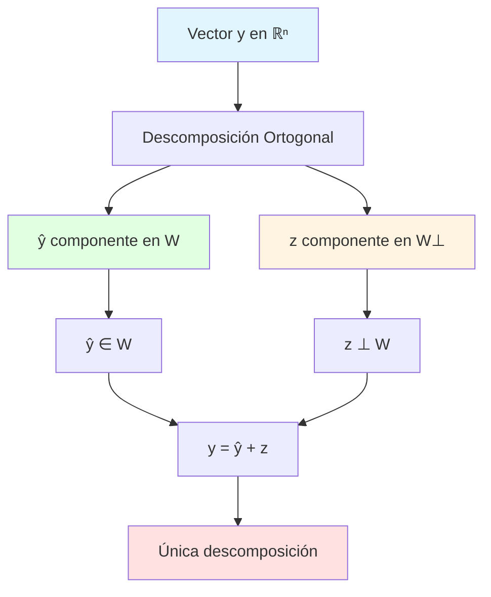

# 📐 Teorema de la Descomposición Ortogonal

## 🎯 Introducción

> [!info]- 💡 ¿Qué es el Teorema de la Descomposición Ortogonal?
> 
> El **Teorema de la Descomposición Ortogonal** es uno de los resultados fundamentales del álgebra lineal. Establece que cualquier vector en un espacio vectorial puede descomponerse de manera única en dos componentes perpendiculares: una que pertenece a un subespacio dado y otra que es ortogonal a ese subespacio.
> 
> **Enunciado formal:**
> 
> Sea **W** un subespacio de ℝⁿ y sea **y** un vector cualquiera en ℝⁿ. Entonces **y** puede escribirse de forma única como:
> 
> **y = ŷ + z**
> 
> Donde:
> 
> - **ŷ ∈ W** (componente en W)
> - **z ∈ W⊥** (componente ortogonal a W)
> - **ŷ · z = 0** (perpendiculares)
> 
> **Analogía práctica:** Imagina una lámpara sobre una mesa. La luz proyecta una sombra del objeto sobre la mesa. El vector original es como el objeto, la proyección sobre la mesa es ŷ (componente en W), y la línea vertical desde la sombra al objeto es z (componente ortogonal).
> 
> **¿Por qué es importante?**
> 
> |Aspecto|Descripción|Aplicación|
> |---|---|---|
> |**Proyecciones**|Encontrar la "mejor aproximación" en un subespacio|Mínimos cuadrados|
> |**Descomposición única**|Separar componentes perpendiculares|Análisis de señales|
> |**Complementos ortogonales**|Dividir espacios en partes independientes|Procesamiento de datos|
> |**Geometría**|Entender distancias y ángulos|Gráficos computacionales|
> |**Optimización**|Resolver problemas de aproximación|Regresión lineal|



---

## 🏗️ Fundamentos Conceptuales

### 📐 Espacios y Subespacios

> [!example]- 🔢 Conceptos Preliminares
> 
> **Definición de subespacio:**
> 
> Un subconjunto **W** de ℝⁿ es un **subespacio vectorial** si:
> 
> 1. **Contiene el vector cero**: 0 ∈ W
> 2. **Cerrado bajo suma**: Si u, v ∈ W, entonces u + v ∈ W
> 3. **Cerrado bajo multiplicación escalar**: Si u ∈ W y c ∈ ℝ, entonces cu ∈ W
> 
> **Ejemplos en ℝ³:**
> 
> ```
> 4. Línea a través del origen:
>    W = {t(1, 2, 3) : t ∈ ℝ}
>    Subespacio de dimensión 1
> 
> 5. Plano a través del origen:
>    W = {s(1, 0, 0) + t(0, 1, 0) : s, t ∈ ℝ}
>    Subespacio de dimensión 2
> 
> 6. Todo el espacio:
>    W = ℝ³
>    Subespacio de dimensión 3
> 
> 7. Solo el origen:
>    W = {(0, 0, 0)}
>    Subespacio de dimensión 0
> ```
> 
> **Visualización de subespacios:**
> 
> ```mermaid
> graph TB
>     A[Subespacios de ℝ³] --> B[Dimensión 0<br/>Origen]
>     A --> C[Dimensión 1<br/>Líneas]
>     A --> D[Dimensión 2<br/>Planos]
>     A --> E[Dimensión 3<br/>Todo ℝ³]
>     
>     C --> F[Ejemplo: span 1,0,0 ]
>     D --> G[Ejemplo: plano xy]
>     
>     style A fill:#e1f5ff
>     style C fill:#e1ffe1
>     style D fill:#fff4e1
> ```
> 
> **Base de un subespacio:**
> 
> ```
> Un conjunto {u₁, u₂, ..., uₖ} es una BASE de W si:
> 
> 8. Son linealmente independientes
> 9. Generan W: W = span{u₁, u₂, ..., uₖ}
> 
> Ejemplo en ℝ³:
> W = plano xy = span{(1,0,0), (0,1,0)}
> 
> Base: {(1,0,0), (0,1,0)}
> Dimensión: dim(W) = 2
> ```
> 
> **Tabla de ejemplos:**
> 
> |Subespacio W|Base|Dimensión|Descripción|
> |---|---|---|---|
> |Eje x|{(1,0,0)}|1|Línea horizontal|
> |Plano xy|{(1,0,0), (0,1,0)}|2|Plano horizontal|
> |ℝ³|{(1,0,0), (0,1,0), (0,0,1)}|3|Todo el espacio|
> |{0}|∅|0|Solo origen|

### ⊥ Complemento Ortogonal

> [!note]- 📝 Definición y Propiedades
> 
> **Definición:**
> 
> El **complemento ortogonal** de un subespacio W, denotado **W⊥**, es el conjunto de todos los vectores que son ortogonales a cada vector en W:
> 
> **W⊥ = {v ∈ ℝⁿ : v · w = 0 para todo w ∈ W}**
> 
> **Notación:** Se lee "W perp" o "W perpendicular"
> 
> **Ejemplo en ℝ³:**
> 
> ```
> W = plano xy = span{(1,0,0), (0,1,0)}
> 
> Para v = (x, y, z) estar en W⊥:
> v · (1,0,0) = 0  →  x = 0
> v · (0,1,0) = 0  →  y = 0
> 
> Por lo tanto: W⊥ = {(0, 0, z) : z ∈ ℝ} = eje z
> 
> Visualización:
>         z ↑ (W⊥)
>           |
>           |
>     y ←---+--→ (W: plano xy)
>          /
>         x
> ```
> 
> **Propiedades fundamentales:**
> 
> ```mermaid
> graph TB
>     A[Complemento Ortogonal W⊥] --> B[Es un subespacio]
>     A --> C[dim W + dim W⊥ = n]
>     A --> D[W ∩ W⊥ = 0]
>     A --> E[ W⊥ ⊥ = W]
>     
>     B --> F[Cerrado bajo suma<br/>y mult. escalar]
>     C --> G[Dimensiones<br/>complementarias]
>     D --> H[Solo intersección<br/>en origen]
>     E --> I[Doble ortogonal<br/>regresa a W]
>     
>     style A fill:#e1f5ff
>     style B fill:#e1ffe1
>     style C fill:#fff4e1
> ```
> 
> **Teorema de la dimensión:**
> 
> ```
> Si W es subespacio de ℝⁿ, entonces:
> 
> dim(W) + dim(W⊥) = n
> 
> Ejemplo:
> ℝ³: dim(plano xy) + dim(eje z) = 2 + 1 = 3 ✅
> ℝ⁴: dim(W) = 2 → dim(W⊥) = 2
> ```
> 
> **Cálculo de W⊥:**
> 
> ```
> Método: Si W = span{u₁, u₂, ..., uₖ}, entonces
> v ∈ W⊥ si y solo si:
> 
> v · u₁ = 0
> v · u₂ = 0
>   ⋮
> v · uₖ = 0
> 
> Ejemplo:
> W = span{(1, 2, 3)} en ℝ³
> 
> Para v = (x, y, z) en W⊥:
> (x, y, z) · (1, 2, 3) = 0
> x + 2y + 3z = 0
> 
> W⊥ = {(x, y, z) : x + 2y + 3z = 0}
>     = plano perpendicular a (1, 2, 3)
> ```
> 
> **Ejemplos en ℝ²:**
> 
> |W|Descripción|W⊥|Descripción|
> |---|---|---|---|
> |span{(1,0)}|Eje x|span{(0,1)}|Eje y|
> |span{(1,1)}|Diagonal principal|span{(1,-1)}|Diagonal secundaria|
> |span{(3,4)}|Línea con pendiente 4/3|span{(-4,3)}|Línea perpendicular|

### 🎯 Proyecciones Ortogonales

> [!success]- 📊 Proyección sobre Subespacios
> 
> **Definición:**
> 
> La **proyección ortogonal** de un vector **y** sobre un subespacio **W**, denotada **proj_W(y)** o **ŷ**, es el vector en W más cercano a y.
> 
> **Fórmula para proyección sobre vector unitario:**
> 
> Si **u** es unitario (‖u‖ = 1):
> 
> **proj_u(y) = (y · u)u**
> 
> **Fórmula para proyección sobre vector no unitario:**
> 
> Si **u** es no unitario:
> 
> **proj_u(y) = [(y · u)/(u · u)]u = [(y · u)/‖u‖²]u**
> 
> **Ejemplo en ℝ²:**
> 
> ```
> y = (3, 4)
> u = (1, 0)  (eje x)
> 
> proj_u(y) = (y · u)u
>           = ((3, 4) · (1, 0))(1, 0)
>           = 3(1, 0)
>           = (3, 0)
> 
> Componente ortogonal:
> z = y - ŷ = (3, 4) - (3, 0) = (0, 4)
> 
> Verificar perpendicularidad:
> ŷ · z = (3, 0) · (0, 4) = 0 ✅
> ```
> 
> **Visualización geométrica:**
> 
> ```
>         y (3,4)
>         /|
>        / |
>       /  | z (0,4)
>      /   | componente
>     /    | ortogonal
>    /     |
>   /______| ŷ (3,0)
>  O       proyección
>  
>  ŷ = proyección de y sobre eje x
>  z = componente perpendicular
>  y = ŷ + z
> ```
> 
> **Proyección sobre subespacio generado por base ortogonal:**
> 
> ```
> Si W = span{u₁, u₂, ..., uₖ} donde u₁, ..., uₖ son ortogonales:
> 
> proj_W(y) = (y · u₁/‖u₁‖²)u₁ + (y · u₂/‖u₂‖²)u₂ + ... + (y · uₖ/‖uₖ‖²)uₖ
> 
> Si además son ortonormales (‖uᵢ‖ = 1):
> 
> proj_W(y) = (y · u₁)u₁ + (y · u₂)u₂ + ... + (y · uₖ)uₖ
> ```
> 
> **Flujo de cálculo:**
> 
> ```mermaid
> flowchart TD
>     A[Vector y] --> B{¿Base de W?}
>     B -->|Ortogonal| C[Usar fórmula directa]
>     B -->|No ortogonal| D[Ortonormalizar<br/>Gram-Schmidt]
>     
>     C --> E[ŷ = Σ y·uᵢ/uᵢ·uᵢ uᵢ]
>     D --> F[Obtener base ortonormal]
>     F --> E
>     
>     E --> G[Calcular z = y - ŷ]
>     G --> H[Verificar: ŷ · z = 0]
>     
>     style A fill:#e1f5ff
>     style E fill:#e1ffe1
>     style H fill:#fff4e1
> ```
> 
> **Propiedades de la proyección:**
> 
> |Propiedad|Fórmula|Significado|
> |---|---|---|
> |**Idempotencia**|proj_W(ŷ) = ŷ|Proyectar dos veces = proyectar una vez|
> |**Linealidad**|proj_W(αy₁ + βy₂) = α proj_W(y₁) + β proj_W(y₂)|Es transformación lineal|
> |**Minimiza distancia**|‖y - ŷ‖ ≤ ‖y - w‖ para todo w ∈ W|ŷ es el vector más cercano|
> |**Ortogonalidad**|(y - ŷ) ⊥ W|El error es perpendicular|

---

## 📜 Teorema Principal

### 🎓 Enunciado Formal

> [!example]- 📐 Teorema de la Descomposición Ortogonal
> 
> **Teorema:**
> 
> Sea **W** un subespacio de ℝⁿ. Entonces cada vector **y** en ℝⁿ puede escribirse de manera única como:
> 
> **y = ŷ + z**
> 
> donde **ŷ ∈ W** y **z ∈ W⊥**.
> 
> Además, si {u₁, u₂, ..., uₖ} es cualquier base ortogonal de W, entonces:
> 
> **ŷ = (y · u₁/‖u₁‖²)u₁ + (y · u₂/‖u₂‖²)u₂ + ... + (y · uₖ/‖uₖ‖²)uₖ**
> 
> **z = y - ŷ**
> 
> **Componentes del teorema:**
> 
> ```mermaid
> graph TB
>     A[Teorema de Descomposición] --> B[Existencia]
>     A --> C[Unicidad]
>     A --> D[Fórmula explícita]
>     
>     B --> E[Siempre existe<br/>ŷ y z]
>     C --> F[Solo hay una<br/>descomposición]
>     D --> G[Podemos calcular<br/>ŷ usando base]
>     
>     E --> H[y = ŷ + z]
>     F --> H
>     G --> H
>     
>     style A fill:#e1f5ff
>     style H fill:#e1ffe1
> ```
> 
> **Notación y terminología:**
> 
> |Símbolo|Nombre|Descripción|
> |---|---|---|
> |**y**|Vector original|Vector a descomponer|
> |**ŷ**|Proyección|Componente en W (se lee "y-hat")|
> |**z**|Componente ortogonal|Componente en W⊥|
> |**W**|Subespacio|Subespacio sobre el que proyectamos|
> |**W⊥**|Complemento ortogonal|Subespacio perpendicular a W|
> 
> **Interpretaciones:**
> 
> 1. **Geométrica**: Todo vector es suma de su "sombra" en W y su "altura" sobre W
> 2. **Algebraica**: Descomposición única en componentes perpendiculares
> 3. **Aproximación**: ŷ es la mejor aproximación de y dentro de W
> 4. **Optimización**: ŷ minimiza ‖y - w‖ para todo w ∈ W

### 🔍 Demostración

> [!note]- 📝 Prueba del Teorema
> 
> **Demostración completa:**
> 
> **Parte 1: Existencia**
> 
> ```
> Queremos demostrar que existen ŷ ∈ W y z ∈ W⊥ tales que y = ŷ + z.
> 
> Sea {u₁, u₂, ..., uₖ} una base ortogonal de W.
> 
> Definimos:
> ŷ = (y · u₁/‖u₁‖²)u₁ + (y · u₂/‖u₂‖²)u₂ + ... + (y · uₖ/‖uₖ‖²)uₖ
> z = y - ŷ
> 
> Paso 1: Demostrar que ŷ ∈ W
> ŷ es combinación lineal de u₁, ..., uₖ
> → ŷ ∈ span{u₁, ..., uₖ} = W ✅
> 
> Paso 2: Demostrar que z ∈ W⊥
> Debemos probar que z · uᵢ = 0 para todo i = 1, ..., k
> 
> z · uᵢ = (y - ŷ) · uᵢ
>        = y · uᵢ - ŷ · uᵢ
>        = y · uᵢ - [(y·u₁/‖u₁‖²)u₁ + ... + (y·uₖ/‖uₖ‖²)uₖ] · uᵢ
>        = y · uᵢ - (y·uᵢ/‖uᵢ‖²)(uᵢ · uᵢ)    (por ortogonalidad de la base)
>        = y · uᵢ - (y·uᵢ/‖uᵢ‖²)‖uᵢ‖²
>        = y · uᵢ - y · uᵢ
>        = 0 ✅
> 
> Por lo tanto z ⊥ uᵢ para todo i, entonces z ∈ W⊥ ✅
> 
> Paso 3: y = ŷ + z por construcción ✅
> ```
> 
> **Parte 2: Unicidad**
> 
> ```
> Supongamos que existen dos descomposiciones:
> y = ŷ₁ + z₁  con ŷ₁ ∈ W, z₁ ∈ W⊥
> y = ŷ₂ + z₂  con ŷ₂ ∈ W, z₂ ∈ W⊥
> 
> Restando:
> 0 = (ŷ₁ - ŷ₂) + (z₁ - z₂)
> 
> Reordenando:
> ŷ₁ - ŷ₂ = -(z₁ - z₂) = z₂ - z₁
> 
> Ahora:
> - ŷ₁ - ŷ₂ ∈ W (porque W es subespacio)
> - z₂ - z₁ ∈ W⊥ (porque W⊥ es subespacio)
> 
> Pero ŷ₁ - ŷ₂ = z₂ - z₁, entonces este vector está en W ∩ W⊥
> 
> Como W ∩ W⊥ = {0}:
> ŷ₁ - ŷ₂ = 0  →  ŷ₁ = ŷ₂
> z₁ - z₂ = 0  →  z₁ = z₂
> 
> Por lo tanto la descomposición es única ✅ ∎
> ```
> 
> **Diagrama de la demostración:**
> 
> ```mermaid
> flowchart TD
>     A[Inicio Demostración] --> B[Existencia]
>     A --> C[Unicidad]
>     
>     B --> D[Definir ŷ usando<br/>base ortogonal]
>     D --> E[Definir z = y - ŷ]
>     E --> F[Probar ŷ ∈ W]
>     E --> G[Probar z ∈ W⊥]
>     F --> H[Existencia probada ✅]
>     G --> H
>     
>     C --> I[Suponer dos<br/>descomposiciones]
>     I --> J[Restar ecuaciones]
>     J --> K[Mostrar diferencia<br/>en W ∩ W⊥]
>     K --> L[W ∩ W⊥ = 0]
>     L --> M[Unicidad probada ✅]
>     
>     style H fill:#e1ffe1
>     style M fill:#e1ffe1
> ```

### 🎯 Consecuencias Importantes

> [!tip]- 💡 Corolarios y Aplicaciones Directas
> 
> **Corolario 1: Mejor aproximación**
> 
> ```
> El vector ŷ = proj_W(y) es el vector en W más cercano a y.
> 
> Es decir: ‖y - ŷ‖ ≤ ‖y - w‖ para todo w ∈ W
> 
> Demostración:
> Para cualquier w ∈ W:
> ‖y - w‖² = ‖(ŷ + z) - w‖²
>          = ‖(ŷ - w) + z‖²
>          = ‖ŷ - w‖² + ‖z‖² + 2(ŷ - w) · z
>          = ‖ŷ - w‖² + ‖z‖²    (porque z ⊥ W y ŷ-w ∈ W)
>          ≥ ‖z‖²
>          = ‖y - ŷ‖²
> 
> La igualdad se da cuando w = ŷ ✅
> ```
> 
> **Corolario 2: Desigualdad de Bessel**
> 
> ```
> Si {u₁, u₂, ..., uₖ} es conjunto ortonormal y W = span{u₁, ..., uₖ}:
> 
> ‖ŷ‖² = (y · u₁)² + (y · u₂)² + ... + (y · uₖ)² ≤ ‖y‖²
> 
> Demostración:
> y = ŷ + z con ŷ ⊥ z
> ‖y‖² = ‖ŷ + z‖² = ‖ŷ‖² + ‖z‖² ≥ ‖ŷ‖² ✅
> ```
> 
> **Corolario 3: Identidad de Parseval**
> 
> ```
> Si {u₁, u₂, ..., uₙ} es base ortonormal de ℝⁿ:
> 
> ‖y‖² = (y · u₁)² + (y · u₂)² + ... + (y · uₙ)²
> 
> (Caso especial cuando W = ℝⁿ, entonces z = 0)
> ```
> 
> **Corolario 4: Teorema de Pitágoras**
> 
> ```
> Como ŷ ⊥ z:
> ‖y‖² = ‖ŷ + z‖² = ‖ŷ‖² + ‖z‖²
> 
> Generalización del teorema de Pitágoras a n dimensiones
> ```
> 
> **Tabla de consecuencias:**
> 
> |Resultado|Fórmula|Aplicación|
> |---|---|---|
> |**Mejor aproximación**|‖y - ŷ‖ ≤ ‖y - w‖|Mínimos cuadrados|
> |**Teorema de Pitágoras**|‖y‖² = ‖ŷ‖² + ‖z‖²|Cálculo de distancias|
> |**Bessel**|‖ŷ‖² ≤ ‖y‖²|Análisis de Fourier|
> |**Parseval**|‖y‖² = Σ(y·uᵢ)²|Conservación energía|

---

## 🛠️ Métodos de Cálculo

### 📊 Usando Base Ortogonal

> [!example]- 🔢 Procedimiento Paso a Paso
> 
> **Método cuando W tiene base ortogonal:**
> 
> ```
> Dado: W = span{u₁, u₂, ..., uₖ} donde uᵢ · uⱼ = 0 para i ≠ j
>        Vector y a descomponer
> 
> Paso 1: Calcular proyección sobre cada vector de la base
> c₁ = y · u₁ / ‖u₁‖²
> c₂ = y · u₂ / ‖u₂‖²
>  ⋮
> cₖ = y · uₖ / ‖uₖ‖²
> 
> Paso 2: Formar la proyección
> ŷ = c₁u₁ + c₂u₂ + ... + cₖuₖ
> 
> Paso 3: Calcular componente ortogonal
> z = y - ŷ
> 
> Paso 4: Verificar (opcional pero recomendado)
> - Verificar que ŷ · z = 0
> - Verificar que y = ŷ + z
> ```
> 
> **Ejemplo completo en ℝ³:**
> 
> ```
> W = span{u₁, u₂} donde:
> u₁ = (1, 1, 0)
> u₂ = (0, 0, 1)
> 
> y = (2, 3, 4)
> 
> Verificar que la base es ortogonal:
> u₁ · u₂ = (1)(0) + (1)(0) + (0)(1) = 0 ✅
> 
> Paso 1: Calcular coeficientes
> ‖u₁‖² = 1² + 1² + 0² = 2
> ‖u₂‖² = 0² + 0² + 1² = 1
> 
> c₁ = y · u₁ / ‖u₁‖² = ((2)(1) + (3)(1) + (4)(0)) / 2 = 5/2
> c₂ = y · u₂ / ‖u₂‖² = ((2)(0) + (3)(0) + (4)(1)) / 1 = 4
> 
> Paso 2: Proyección
> ŷ = (5/2)(1,1,0) + 4(0,0,1)
>    = (5/2, 5/2, 0) + (0, 0, 4)
>    = (5/2, 5/2, 4)
> 
> Paso 3: Componente ortogonal
> z = y - ŷ = (2, 3, 4) - (5/2, 5/2, 4)
>    = (2 - 5/2, 3 - 5/2, 4 - 4)
>    = (-1/2, 1/2, 0)
> 
> Paso 4: Verificación
> ŷ · z = (5/2)(-1/2) + (5/2)(1/2) + (4)(0)
>       = -5/4 + 5/4 + 0 = 0 ✅
> 
> y = ŷ + z = (5/2, 5/2, 4) + (-1/2, 1/2, 0) = (2, 3, 4) ✅
> ```
> 
> **Flujo del proceso:**
> 
> ```mermaid
> flowchart TD
>     A[Vector y y subespacio W] --> B{¿Base ortogonal?}
>     B -->|Sí| C[Calcular coeficientes<br/>cᵢ = y·uᵢ/‖uᵢ‖²]
>     B -->|No| D[Ortonormalizar base<br/>Gram-Schmidt]
>     
>     D --> C
>     C --> E[ŷ = Σ cᵢuᵢ]
>     E --> F[z = y - ŷ]
>     F --> G[Verificar ŷ · z = 0]
>     
>     style C fill:#e1ffe1
>     style E fill:#fff4e1
>     style G fill:#e1f5ff
> ````

### 🔄 Usando Base Ortonormal

> [!success]- ⚡ Simplificación con Vectores Unitarios
> 
> **Ventaja:** Si la base es ortonormal, los cálculos se simplifican considerablemente.
> 
> ```
> Si {q₁, q₂, ..., qₖ} es base ortonormal de W:
> - qᵢ · qⱼ = 0 para i ≠ j (ortogonales)
> - ‖qᵢ‖ = 1 para todo i (unitarios)
> 
> Entonces:
> ŷ = (y · q₁)q₁ + (y · q₂)q₂ + ... + (y · qₖ)qₖ
> 
> (No hay división por ‖uᵢ‖² porque ‖qᵢ‖² = 1)
> ```
> 
> **Ejemplo en ℝ³:**
> 
> ```
> W = span{q₁, q₂} donde:
> q₁ = (1/√2, 1/√2, 0)
> q₂ = (0, 0, 1)
> 
> y = (3, 4, 5)
> 
> Verificar ortonormalidad:
> q₁ · q₂ = 0 ✅
> ‖q₁‖ = √((1/√2)² + (1/√2)² + 0²) = 1 ✅
> ‖q₂‖ = 1 ✅
> 
> Calcular proyección:
> y · q₁ = 3(1/√2) + 4(1/√2) + 5(0) = 7/√2
> y · q₂ = 3(0) + 4(0) + 5(1) = 5
> 
> ŷ = (7/√2)q₁ + 5q₂
>    = (7/√2)(1/√2, 1/√2, 0) + 5(0, 0, 1)
>    = (7/2, 7/2, 0) + (0, 0, 5)
>    = (7/2, 7/2, 5)
> 
> z = y - ŷ = (3, 4, 5) - (7/2, 7/2, 5)
>    = (-1/2, 1/2, 0)
> ```
> 
> **Forma matricial:**
> 
> ```
> Si Q = [q₁ q₂ ... qₖ] es matriz con columnas ortonormales:
> 
> ŷ = Q(Q^T y)
> z = y - Q(Q^T y) = (I - QQ^T)y
> 
> La matriz P = QQ^T es la matriz de proyección sobre W
> 
> Propiedades de P:
> - P² = P (idempotente)
> - P^T = P (simétrica)
> - Pv ∈ W para todo v
> ```
> 
> **Comparación de métodos:**
> 
> |Aspecto|Base Ortogonal|Base Ortonormal|
> |---|---|---|
> |**Cálculo**|cᵢ = y·uᵢ/‖uᵢ‖²|cᵢ = y·qᵢ|
> |**Complejidad**|Más divisiones|Más simple|
> |**Errores numéricos**|Mayores|Menores|
> |**Recomendación**|Convertir a ortonormal|Usar directamente|

### 📐 Gram-Schmidt

> [!tip]- 🔄 Ortonormalización Previa
> 
> **Proceso de Gram-Schmidt:**
> 
> Convierte una base arbitraria en una base ortonormal.
> 
> ```
> Entrada: Base {v₁, v₂, ..., vₖ} de W
> Salida: Base ortonormal {q₁, q₂, ..., qₖ} de W
> 
> Paso 1: Primer vector
> u₁ = v₁
> q₁ = u₁ / ‖u₁‖
> 
> Paso 2: Segundo vector
> u₂ = v₂ - (v₂ · q₁)q₁
> q₂ = u₂ / ‖u₂‖
> 
> Paso 3: Tercer vector
> u₃ = v₃ - (v₃ · q₁)q₁ - (v₃ · q₂)q₂
> q₃ = u₃ / ‖u₃‖
> 
> Paso i: i-ésimo vector
> uᵢ = vᵢ - Σ(j=1 hasta i-1) (vᵢ · qⱼ)qⱼ
> qᵢ = uᵢ / ‖uᵢ‖
> ```
> 
> **Ejemplo completo:**
> 
> ```
> Base original de W en ℝ³:
> v₁ = (1, 1, 1)
> v₂ = (0, 1, 1)
> 
> Paso 1: Primer vector
> u₁ = v₁ = (1, 1, 1)
> ‖u₁‖ = √3
> q₁ = (1/√3, 1/√3, 1/√3)
> 
> Paso 2: Segundo vector
> v₂ · q₁ = 0(1/√3) + 1(1/√3) + 1(1/√3) = 2/√3
> 
> u₂ = v₂ - (v₂ · q₁)q₁
>     = (0, 1, 1) - (2/√3)(1/√3, 1/√3, 1/√3)
>     = (0, 1, 1) - (2/3, 2/3, 2/3)
>     = (-2/3, 1/3, 1/3)
> 
> ‖u₂‖ = √(4/9 + 1/9 + 1/9) = √(6/9) = √(2/3)
> 
> q₂ = u₂ / ‖u₂‖ = (-2/3, 1/3, 1/3) / √(2/3)
>     = (-2/√6, 1/√6, 1/√6)
> 
> Verificar ortonormalidad:
> q₁ · q₂ = (1/√3)(-2/√6) + (1/√3)(1/√6) + (1/√3)(1/√6)
>         = -2/√18 + 1/√18 + 1/√18 = 0 ✅
> ‖q₁‖ = 1 ✅
> ‖q₂‖ = 1 ✅
> ```
> 
> **Diagrama del proceso:**
> 
> ```mermaid
> flowchart TD
>     A[Base arbitraria<br/> v₁, v₂, ..., vₖ ] --> B[Tomar v₁]
>     B --> C[Normalizar: q₁ = v₁/‖v₁‖]
>     
>     C --> D[Tomar v₂]
>     D --> E[Restar proyección<br/>sobre q₁]
>     E --> F[Normalizar: q₂]
>     
>     F --> G[Tomar v₃]
>     G --> H[Restar proyecciones<br/>sobre q₁, q₂]
>     H --> I[Normalizar: q₃]
>     
>     I --> J[Continuar...]
>     J --> K[Base ortonormal<br/> q₁, q₂, ..., qₖ ]
>     
>     style A fill:#ffe1e1
>     style K fill:#e1ffe1
> ```

---

## 🎯 Aplicaciones Fundamentales

### 📉 Problema de Mínimos Cuadrados

> [!example]- 📊 Mejor Ajuste Lineal
> 
> **Problema:**
> 
> Encontrar x que minimice ‖Ax - b‖ cuando el sistema Ax = b no tiene solución exacta (incompatible).
> 
> **Solución mediante descomposición ortogonal:**
> 
> ```
> Sea W = Col(A) (espacio columna de A)
> 
> Descomponemos b:
> b = b̂ + z
> 
> donde:
> - b̂ ∈ W (proyección de b sobre Col(A))
> - z ∈ W⊥ (componente perpendicular)
> 
> El vector x̂ que minimiza ‖Ax - b‖ satisface:
> Ax̂ = b̂
> 
> Y se obtiene resolviendo:
> A^T A x̂ = A^T b  (ecuaciones normales)
> ```
> 
> **Interpretación geométrica:**
> 
> ```mermaid
> graph TB
>     A[Vector b<br/>fuera de Col A ] --> B[Proyectar sobre Col A ]
>     B --> C[b̂ = proj_Col A  b]
>     C --> D[Resolver Ax̂ = b̂]
>     D --> E[x̂ solución de<br/>mínimos cuadrados]
>     
>     F[‖Ax - b‖] --> G[Minimizado cuando<br/>Ax = b̂]
>     
>     style C fill:#e1ffe1
>     style E fill:#fff4e1
> ```
> 
> **Ejemplo numérico:**
> 
> ```
> Ajustar línea y = c₀ + c₁t a datos:
> (0, 1), (1, 1), (2, 3)
> 
> Sistema sobredeterminado:
> c₀ + 0c₁ = 1
> c₀ + 1c₁ = 1
> c₀ + 2c₁ = 3
> 
> Forma matricial Ax = b:
> [ 1  0 ] [ c₀ ]   [ 1 ]
> [ 1  1 ] [ c₁ ] = [ 1 ]
> [ 1  2 ]          [ 3 ]
> 
> Ecuaciones normales A^T A x = A^T b:
> [ 1  1  1 ] [ 1  0 ]   [ 1  1  1 ] [ 1 ]
> [ 0  1  2 ] [ 1  1 ] = [ 0  1  2 ] [ 1 ]
>              [ 1  2 ]                [ 3 ]
> 
> [ 3  3 ] [ c₀ ]   [ 5 ]
> [ 3  5 ] [ c₁ ] = [ 7 ]
> 
> Solución:
> c₀ = 2/3
> c₁ = 1
> 
> Línea de mejor ajuste: y = 2/3 + t
> ```
> 
> **Aplicaciones:**
> 
> |Campo|Problema|Método|
> |---|---|---|
> |**Estadística**|Regresión lineal|Mínimos cuadrados|
> |**Física**|Ajuste de modelos experimentales|A^T A x = A^T b|
> |**Economía**|Tendencias y pronósticos|Proyección ortogonal|
> |**Ingeniería**|Filtrado de señales|Aproximación en subespacios|

### 📡 Procesamiento de Señales

> [!success]- 🎵 Series de Fourier y Descomposición
> 
> **Concepto:**
> 
> Descomponer una señal en componentes de frecuencias (senos y cosenos).
> 
> ```
> Base ortonormal en L²[0, 2π]:
> {1/√(2π), cos(t)/√π, sin(t)/√π, cos(2t)/√π, sin(2t)/√π, ...}
> 
> Cualquier señal f(t) se descompone:
> f(t) = a₀ + Σ(n=1 hasta ∞) [aₙcos(nt) + bₙsin(nt)]
> 
> donde:
> a₀ = (1/2π) ∫₀²π f(t) dt
> aₙ = (1/π) ∫₀²π f(t)cos(nt) dt
> bₙ = (1/π) ∫₀²π f(t)sin(nt) dt
> ```
> 
> **Interpretación mediante descomposición ortogonal:**
> 
> ```
> W = span{1, cos(t), sin(t), cos(2t), sin(2t), ..., cos(Nt), sin(Nt)}
> 
> f̂ = proyección de f sobre W
>   = aproximación de f usando primeras N frecuencias
> 
> z = f - f̂
>   = error de aproximación (componente ortogonal)
> ```
> 
> **Ejemplo discreto (DFT):**
> 
> ```
> Señal discreta: y = [y₀, y₁, ..., y_{N-1}]
> 
> Base de Fourier discreta (ortonormal):
> wₖ = [e^(2πik·0/N), e^(2πik·1/N), ..., e^(2πik·(N-1)/N)]
> 
> Coeficientes de Fourier:
> ŷₖ = (y · wₖ) / N
> 
> Reconstrucción:
> y = Σ(k=0 hasta N-1) ŷₖ wₖ
> ```
> 
> **Aplicaciones:**
> 
> - **Compresión**: Descartar componentes de alta frecuencia (pequeños coeficientes)
> - **Filtrado**: Eliminar frecuencias no deseadas
> - **Análisis**: Identificar frecuencias dominantes

### 🖼️ Compresión de Imágenes

> [!tip]- 📸 JPEG y DCT
> 
> **Transformada Discreta del Coseno (DCT):**
> 
> Base de descomposición usada en JPEG.
> 
> ```
> Imagen dividida en bloques 8×8
> 
> Cada bloque se proyecta sobre base DCT (64 vectores ortonormales)
> 
> Descomposición:
> Bloque = Σ(i,j) cᵢⱼ · (vector base DCT)ᵢⱼ
> 
> donde cᵢⱼ son coeficientes DCT
> ```
> 
> **Proceso de compresión:**
> 
> ```mermaid
> flowchart LR
>     A[Imagen original<br/>8×8 píxeles] --> B[Aplicar DCT<br/>64 coeficientes]
>     B --> C[Cuantizar<br/>reducir precisión]
>     C --> D[Codificar<br/>Huffman]
>     
>     D --> E[Imagen comprimida]
>     
>     F[Descomposición<br/>ortogonal] -.-> B
>     G[Retener solo<br/>componentes grandes] -.-> C
>     
>     style B fill:#e1ffe1
>     style C fill:#fff4e1
> ```
> 
> **Ventaja de la ortogonalidad:**
> 
> ```
> Coeficientes independientes → podemos:
> - Cuantizar cada uno independientemente
> - Descartar coeficientes pequeños sin afectar otros
> - Reconstruir sin pérdida en la transformación
> ```
> 
> **Aproximación de rango bajo:**
> 
> ```
> Imagen ≈ Σ(k=1 hasta K) σₖ uₖ vₖ^T
> 
> donde K << rango total
> 
> Usando solo K componentes principales (SVD/DCT)
> Almacenamiento: K(m+n) en lugar de mn
> ```

---

## 💡 Ejercicios y Problemas

### 📝 Ejercicios Básicos

> [!example]- 🎯 Cálculos Fundamentales
> 
> **Ejercicio 1: Proyección sobre el eje x**
> 
> ```
> W = span{(1, 0)} (eje x en ℝ²)
> y = (3, 4)
> 
> Encontrar ŷ y z.
> 
> Solución:
> u = (1, 0)
> ‖u‖² = 1
> 
> ŷ = (y · u / ‖u‖²)u
>    = ((3, 4) · (1, 0) / 1)(1, 0)
>    = 3(1, 0)
>    = (3, 0)
> 
> z = y - ŷ = (3, 4) - (3, 0) = (0, 4)
> 
> Verificación:
> ŷ · z = (3, 0) · (0, 4) = 0 ✅
> y = ŷ + z = (3, 0) + (0, 4) = (3, 4) ✅
> ```
> 
> **Ejercicio 2: Proyección sobre un plano**
> 
> ```
> W = plano xy en ℝ³
> Base ortonormal: {(1, 0, 0), (0, 1, 0)}
> y = (2, 3, 5)
> 
> Encontrar ŷ y z.
> 
> Solución:
> q₁ = (1, 0, 0)
> q₂ = (0, 1, 0)
> 
> ŷ = (y · q₁)q₁ + (y · q₂)q₂
>    = ((2, 3, 5) · (1, 0, 0))(1, 0, 0) + ((2, 3, 5) · (0, 1, 0))(0, 1, 0)
>    = 2(1, 0, 0) + 3(0, 1, 0)
>    = (2, 3, 0)
> 
> z = y - ŷ = (2, 3, 5) - (2, 3, 0) = (0, 0, 5)
> 
> Interpretación:
> ŷ = proyección sobre plano xy
> z = componente perpendicular (paralela al eje z)
> ```
> 
> **Ejercicio 3: Distancia a un subespacio**
> 
> ```
> Calcular la distancia de y = (1, 2, 2) al plano W: x + y + z = 0
> 
> Solución:
> Vector normal al plano: n = (1, 1, 1)
> W⊥ = span{(1, 1, 1)}
> 
> Proyección sobre W⊥:
> z = proj_W⊥(y) = (y · n / ‖n‖²)n
>    = ((1, 2, 2) · (1, 1, 1) / 3)(1, 1, 1)
>    = (5/3)(1, 1, 1)
>    = (5/3, 5/3, 5/3)
> 
> Distancia = ‖z‖ = ‖(5/3, 5/3, 5/3)‖
>           = (5/3)√3
>           = 5√3/3
> ```

### 🧮 Ejercicios Intermedios

> [!note]- 📊 Aplicaciones y Descomposiciones
> 
> **Ejercicio 4: Gram-Schmidt y proyección**
> 
> ```
> Ortonormalizar la base de W y luego proyectar y sobre W:
> 
> Base de W: v₁ = (1, 0, 1), v₂ = (1, 1, 0)
> y = (2, 1, 3)
> 
> Solución:
> Paso 1: Gram-Schmidt
> u₁ = v₁ = (1, 0, 1)
> q₁ = u₁/‖u₁‖ = (1, 0, 1)/√2 = (1/√2, 0, 1/√2)
> 
> u₂ = v₂ - (v₂ · q₁)q₁
>     = (1, 1, 0) - ((1, 1, 0) · (1/√2, 0, 1/√2))(1/√2, 0, 1/√2)
>     = (1, 1, 0) - (1/√2)(1/√2, 0, 1/√2)
>     = (1, 1, 0) - (1/2, 0, 1/2)
>     = (1/2, 1, -1/2)
> 
> ‖u₂‖ = √(1/4 + 1 + 1/4) = √(3/2)
> q₂ = (1/2, 1, -1/2) / √(3/2) = (1/√6, 2/√6, -1/√6)
> 
> Paso 2: Proyectar y
> ŷ = (y · q₁)q₁ + (y · q₂)q₂
>    = ((2, 1, 3) · (1/√2, 0, 1/√2))(1/√2, 0, 1/√2) + 
>      ((2, 1, 3) · (1/√6, 2/√6, -1/√6))(1/√6, 2/√6, -1/√6)
>    = (5/√2)(1/√2, 0, 1/√2) + (1/√6)(1/√6, 2/√6, -1/√6)
>    = (5/2, 0, 5/2) + (1/6, 2/6, -1/6)
>    = (5/2 + 1/6, 2/6, 5/2 - 1/6)
>    = (8/3, 1/3, 7/3)
> ```
> 
> **Ejercicio 5: Mínimos cuadrados**
> 
> ```
> Encontrar la recta que mejor ajusta los puntos:
> (0, 6), (1, 0), (2, 0)
> 
> Modelo: y = c₀ + c₁t
> 
> Solución:
> Sistema Ax = b:
> [ 1  0 ] [ c₀ ]   [ 6 ]
> [ 1  1 ] [ c₁ ] = [ 0 ]
> [ 1  2 ]          [ 0 ]
> 
> Ecuaciones normales:
> A^T A = [ 1  1  1 ] [ 1  0 ]   [ 3  3 ]
>         [ 0  1  2 ] [ 1  1 ] = [ 3  5 ]
>                      [ 1  2 ]
> 
> A^T b = [ 1  1  1 ] [ 6 ]   [ 6 ]
>         [ 0  1  2 ] [ 0 ] = [ 0 ]
>                      [ 0 ]
> 
> Resolver:
> [ 3  3 ] [ c₀ ]   [ 6 ]
> [ 3  5 ] [ c₁ ] = [ 0 ]
> 
> c₀ = 5
> c₁ = -3
> 
> Recta de mejor ajuste: y = 5 - 3t
> ```

### 🔬 Problemas Avanzados

> [!tip]- 🎓 Teoría y Demostraciones
> 
> **Problema 6: Complemento del complemento**
> 
> ```
> Demostrar que (W⊥)⊥ = W para cualquier subespacio W de ℝⁿ.
> 
> Demostración:
> Paso 1: Probar W ⊆ (W⊥)⊥
> 
> Sea w ∈ W
> Para todo v ∈ W⊥, tenemos v · w = 0
> Por lo tanto w ⊥ W⊥
> Entonces w ∈ (W⊥)⊥
> → W ⊆ (W⊥)⊥ ✅
> 
> Paso 2: Probar dim(W) = dim((W⊥)⊥)
> 
> dim(W⊥) = n - dim(W)
> dim((W⊥)⊥) = n - dim(W⊥)
>             = n - (n - dim(W))
>             = dim(W) ✅
> 
> Paso 3: Conclusión
> Como W ⊆ (W⊥)⊥ y tienen la misma dimensión:
> W = (W⊥)⊥ ∎
> ```
> 
> **Problema 7: Proyección como transformación lineal**
> 
> ```
> Sea P: ℝⁿ → ℝⁿ la transformación de proyección sobre W.
> Demostrar que P² = P (idempotente).
> 
> Demostración:
> Para cualquier y ∈ ℝⁿ:
> y = ŷ + z  donde ŷ ∈ W, z ∈ W⊥
> 
> Aplicar P:
> P(y) = ŷ
> 
> Aplicar P de nuevo:
> P²(y) = P(P(y)) = P(ŷ)
> 
> Pero ŷ ∈ W, entonces la proyección de ŷ sobre W es ŷ mismo:
> P(ŷ) = ŷ
> 
> Por lo tanto:
> P²(y) = ŷ = P(y)
> 
> Como esto vale para todo y:
> P² = P ∎
> ```
> 
> **Problema 8: Teorema de mejor aproximación**
> 
> ```
> Demostrar que ŷ = proj_W(y) minimiza ‖y - w‖ para todo w ∈ W.
> 
> Demostración:
> Sea w ∈ W arbitrario.
> 
> ‖y - w‖² = ‖(y - ŷ) + (ŷ - w)‖²
>          = ‖z + (ŷ - w)‖²
> 
> Como z ∈ W⊥ y (ŷ - w) ∈ W:
>          = ‖z‖² + ‖ŷ - w‖² + 2z · (ŷ - w)
>          = ‖z‖² + ‖ŷ - w‖²    (porque z ⊥ W)
>          ≥ ‖z‖²
>          = ‖y - ŷ‖²
> 
> La igualdad se da si y solo si ŷ - w = 0, es decir, w = ŷ.
> 
> Por lo tanto ŷ minimiza la distancia ∎
> ```

---

## 📚 Resumen y Conclusiones

> [!success]- 🎯 Puntos Clave
> 
> **Teorema fundamental:**
> 
> ```mermaid
> mindmap
>   root((Descomposición<br/>Ortogonal))
>     Enunciado
>       y = ŷ + z
>       ŷ ∈ W
>       z ∈ W⊥
>       Única
>     Propiedades
>       ŷ · z = 0
>       y² = ŷ² + z²
>       ŷ minimiza distancia
>     Cálculo
>       Base ortogonal
>       Base ortonormal
>       Gram-Schmidt
>     Aplicaciones
>       Mínimos cuadrados
>       Fourier
>       Compresión
> ```
> 
> **Fórmulas esenciales:**
> 
> |Concepto|Fórmula|Condición|
> |---|---|---|
> |**Descomposición**|y = ŷ + z|ŷ ∈ W, z ∈ W⊥|
> |**Proyección (base ortogonal)**|ŷ = Σ(y·uᵢ/‖uᵢ‖²)uᵢ|{u₁,...,uₖ} base de W|
> |**Proyección (base ortonormal)**|ŷ = Σ(y·qᵢ)qᵢ | {q₁,...,qₖ} ortonormal |
> | **Componente ortogonal** | z = y - ŷ | Siempre | | **Teorema de Pitágoras** | ‖y‖² = ‖ŷ‖² + ‖z‖² | Consecuencia | | **Mínimos cuadrados** | A^T A x̂ = A^T b | Sistema normal |
> 
> **Conceptos relacionados:**
> 
> - **Subespacio**: Cerrado bajo suma y mult. escalar
> - **Complemento ortogonal W⊥**: Vectores perpendiculares a W
> - **dim(W) + dim(W⊥) = n**: Dimensiones complementarias
> - **Proyección**: Vector más cercano en W
> - **Gram-Schmidt**: Convertir base a ortonormal
> 
> **Aplicaciones principales:**
> 
> 1. 📉 **Mínimos cuadrados**: Resolver sistemas incompatibles
> 2. 📡 **Series de Fourier**: Descomponer señales en frecuencias
> 3. 🖼️ **Compresión de imágenes**: JPEG, DCT, SVD
> 4. 📊 **Análisis de datos**: PCA, análisis factorial
> 5. 🎮 **Gráficos computacionales**: Proyecciones, iluminación

---

**Tags:** #álgebra-lineal #descomposición-ortogonal #proyecciones #complemento-ortogonal #mínimos-cuadrados #gram-schmidt #fourier #mejor-aproximación #subespacios #teoremas #mermaid #matemáticas
