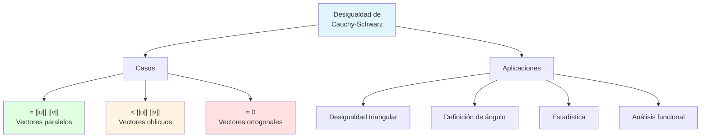
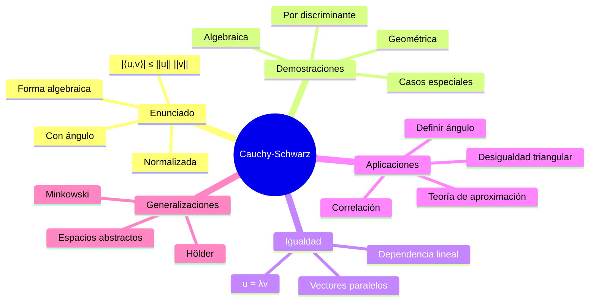

# 🎯 Desigualdad de Cauchy–Schwarz

## 📐 Introducción

> [!info]- 💡 ¿Qué es la Desigualdad de Cauchy–Schwarz?
> 
> La **desigualdad de Cauchy–Schwarz** es una de las desigualdades más fundamentales y elegantes del álgebra lineal. Establece una relación universal entre el producto interno de dos vectores y sus normas.
> 
> **Enunciado:** Para vectores **u** y **v** en un espacio con producto interno:
> 
> $$|\langle \mathbf{u}, \mathbf{v} \rangle| \leq |\mathbf{u}| \cdot |\mathbf{v}|$$
> 
> **Interpretación:** El valor absoluto del producto interno de dos vectores nunca excede el producto de sus longitudes.
> 
> **Analogía práctica:** Imagina dos fuerzas aplicadas a un objeto. La componente de una fuerza en la dirección de la otra nunca puede ser mayor que el producto de sus magnitudes. Es como intentar empujar un objeto: la efectividad de tu empuje en cierta dirección está limitada por tu fuerza total.
> 
> **¿Por qué es importante?**
> 
> |Aspecto|Descripción|Ejemplo de Uso|
> |---|---|---|
> |**Fundamental**|Base de muchas otras desigualdades|Desigualdad triangular, Minkowski|
> |**Geométrica**|Relaciona ángulos y longitudes|Definición de ángulo entre vectores|
> |**Analítica**|Crucial en análisis funcional|Espacios L², convergencia|
> |**Probabilística**|Correlación y covarianza|Coeficiente de Pearson ≤ 1|
> |**Optimización**|Límites en problemas de máximos|Teoría de aproximación|



---

## 📊 Enunciado y Formulaciones

### 🎯 Forma Estándar en ℝⁿ

> [!example]- 📏 Desigualdad en Espacios Euclidianos
> 
> **Teorema (Cauchy-Schwarz en ℝⁿ):**
> 
> Para vectores **u** = (u₁, u₂, ..., uₙ) y **v** = (v₁, v₂, ..., vₙ) en ℝⁿ:
> 
> $$|u_1v_1 + u_2v_2 + \cdots + u_nv_n| \leq \sqrt{u_1^2 + u_2^2 + \cdots + u_n^2} \cdot \sqrt{v_1^2 + v_2^2 + \cdots + v_n^2}$$
> 
> **Forma compacta:**
> 
> $$\left|\sum_{i=1}^{n} u_iv_i\right| \leq \sqrt{\sum_{i=1}^{n} u_i^2} \cdot \sqrt{\sum_{i=1}^{n} v_i^2}$$
> 
> **O usando notación de producto interno:**
> 
> $$|\langle \mathbf{u}, \mathbf{v} \rangle| \leq |\mathbf{u}| \cdot |\mathbf{v}|$$
> 
> **Ejemplos numéricos:**
> 
> ```
> Ejemplo 1 - ℝ²:
> u = (3, 4)
> v = (1, 2)
> 
> Lado izquierdo:
> |⟨u, v⟩| = |3(1) + 4(2)| = |11| = 11
> 
> Lado derecho:
> ||u|| ||v|| = √(9 + 16) · √(1 + 4)
>             = 5 · √5
>             ≈ 11.18
> 
> 11 ≤ 11.18 ✅
> 
> Ejemplo 2 - ℝ³:
> u = (1, 0, 0)
> v = (0, 1, 0)
> 
> |⟨u, v⟩| = |0| = 0
> ||u|| ||v|| = 1 · 1 = 1
> 
> 0 ≤ 1 ✅ (Caso de ortogonalidad)
> 
> Ejemplo 3 - ℝ³ (vectores paralelos):
> u = (2, 4, 6)
> v = (1, 2, 3)
> 
> |⟨u, v⟩| = |2 + 8 + 18| = 28
> ||u|| = √(4 + 16 + 36) = √56 = 2√14
> ||v|| = √(1 + 4 + 9) = √14
> ||u|| ||v|| = 2√14 · √14 = 28
> 
> 28 = 28 ✅ (Igualdad: vectores paralelos)
> ```
> 
> **Casos especiales:**
> 
> |Relación entre u y v|⟨u,v⟩|Desigualdad|
> |---|---|---|
> |**Paralelos misma dirección**|‖u‖‖v‖|Igualdad|
> |**Paralelos dirección opuesta**|−‖u‖‖v‖|Igualdad|
> |**Ortogonales**|0|Estricta (0 < ‖u‖‖v‖)|
> |**Oblicuos**|Entre límites|Estricta|
> 
> **Visualización en ℝ²:**
> 
> ```mermaid
> graph LR
>     A[Origen] -->|u| B[Extremo u]
>     A -->|v| C[Extremo v]
>     
>     B -.->|"⟨u,v⟩"| D[Proyección]
>     C -.->|"||v||"| E[Longitud v]
>     
>     F["⟨u,v⟩ ≤ ||u|| ||v||"] --> G[Siempre cierto]
>     
>     style A fill:#e1f5ff
>     style F fill:#e1ffe1
>     style G fill:#e1ffe1
> ```

### 🔄 Formulaciones Equivalentes

> [!note]- 📐 Otras Formas de la Desigualdad
> 
> **1. Forma algebraica (desigualdad cuadrática):**
> 
> $$\left(\sum_{i=1}^{n} u_iv_i\right)^2 \leq \left(\sum_{i=1}^{n} u_i^2\right)\left(\sum_{i=1}^{n} v_i^2\right)$$
> 
> Esta es la forma más común en demostraciones algebraicas.
> 
> **2. Forma con ángulo:**
> 
> $$\langle \mathbf{u}, \mathbf{v} \rangle = |\mathbf{u}| \cdot |\mathbf{v}| \cdot \cos\theta$$
> 
> donde θ es el ángulo entre **u** y **v**.
> 
> Como |cos θ| ≤ 1, se sigue que |⟨**u**, **v**⟩| ≤ ‖**u**‖ ‖**v**‖
> 
> **3. Forma normalizada:**
> 
> Para vectores unitarios **û** y **v̂**:
> 
> $$|\langle \hat{\mathbf{u}}, \hat{\mathbf{v}} \rangle| \leq 1$$
> 
> **4. Forma de desigualdad de coeficientes:**
> 
> $$-1 \leq \frac{\langle \mathbf{u}, \mathbf{v} \rangle}{|\mathbf{u}| \cdot |\mathbf{v}|} \leq 1$$
> 
> (Esta fracción es precisamente cos θ)
> 
> **5. Forma en términos de matrices:**
> 
> Para vectores columna **u** y **v**:
> 
> $$|\mathbf{u}^T\mathbf{v}|^2 \leq (\mathbf{u}^T\mathbf{u})(\mathbf{v}^T\mathbf{v})$$
> 
> **Tabla comparativa:**
> 
> |Forma|Ventaja|Uso Principal|
> |---|---|---|
> |Producto interno|Más general|Espacios abstractos|
> |Algebraica|Fácil de probar|Demostraciones|
> |Con ángulo|Interpretación geométrica|Geometría, física|
> |Normalizada|Simplicidad|Vectores unitarios|
> |Coeficientes|Define coseno|Definición de ángulo|
> |Matricial|Notación compacta|Álgebra matricial|
> 
> **Equivalencias:**
> 
> ```mermaid
> graph TD
>     A[Cauchy-Schwarz] <--> B[|⟨u,v⟩| ≤ ||u|| ||v||]
>     B <--> C["(Σuᵢvᵢ)² ≤ (Σuᵢ²)(Σvᵢ²)"]
>     B <--> D["|cos θ| ≤ 1"]
>     B <--> E["-1 ≤ ⟨u,v⟩/(||u||||v||) ≤ 1"]
>     
>     style A fill:#e1f5ff
>     style B fill:#e1ffe1
> ```

---

## 🔬 Demostraciones

### 📐 Demostración Geométrica

> [!success]- 🎨 Enfoque Geométrico Intuitivo
> 
> **Idea:** Usar la proyección ortogonal de **u** sobre **v**.
> 
> **Demostración:**
> 
> ```
> Paso 1: Proyección de u sobre v
> La proyección de u sobre v es:
> 
> proj_v(u) = (⟨u,v⟩/||v||²)v
> 
> Paso 2: Norma de la proyección
> La longitud de esta proyección es:
> 
> ||proj_v(u)|| = |⟨u,v⟩|/||v||
> 
> Paso 3: Aplicar descomposición ortogonal
> u = proj_v(u) + componente ortogonal
> 
> Por el teorema de Pitágoras:
> ||u||² = ||proj_v(u)||² + ||componente ortogonal||²
> 
> Paso 4: Como el segundo término es no negativo:
> ||u||² ≥ ||proj_v(u)||²
> 
> Sustituyendo:
> ||u||² ≥ (⟨u,v⟩/||v||)²
> 
> Paso 5: Multiplicar ambos lados por ||v||²:
> ||u||² ||v||² ≥ ⟨u,v⟩²
> 
> Tomando raíz cuadrada:
> ||u|| ||v|| ≥ |⟨u,v⟩|  ∎
> ```
> 
> **Interpretación visual:**
> 
> - La proyección de **u** sobre **v** nunca puede ser más larga que **u** mismo
> - |⟨**u**, **v**⟩|/‖**v**‖ es la longitud de la proyección
> - Esta longitud está acotada por ‖**u**‖
> 
> **Caso de igualdad:**
> 
> La igualdad ocurre cuando la componente ortogonal es cero, es decir, cuando **u** es paralelo a **v**.
> 
> ```mermaid
> graph TD
>     A[Vector u] --> B[Proyección sobre v]
>     A --> C[Componente ortogonal]
>     
>     B -.->|"Longitud = |⟨u,v⟩|/||v||"| D[Acotada por ||u||]
>     C -.->|"≥ 0"| E[Pitágoras]
>     
>     D --> F[Cauchy-Schwarz]
>     E --> F
>     
>     style A fill:#e1f5ff
>     style F fill:#e1ffe1
> ```

### 🧮 Demostración Algebraica

> [!tip]- 📊 Enfoque Algebraico (Método Clásico)
> 
> **Demostración usando discriminante:**
> 
> ```
> Para cualquier escalar t ∈ ℝ, consideremos:
> 
> ||u + tv||² ≥ 0
> 
> Expandiendo:
> ⟨u + tv, u + tv⟩ ≥ 0
> 
> Por linealidad:
> ⟨u,u⟩ + 2t⟨u,v⟩ + t²⟨v,v⟩ ≥ 0
> 
> ||u||² + 2t⟨u,v⟩ + t²||v||² ≥ 0
> 
> Esta es una función cuadrática en t que es no negativa para todo t.
> 
> Para que esto sea cierto, el discriminante debe ser ≤ 0:
> 
> Δ = (2⟨u,v⟩)² - 4||u||²||v||² ≤ 0
> 
> 4⟨u,v⟩² ≤ 4||u||²||v||²
> 
> ⟨u,v⟩² ≤ ||u||²||v||²
> 
> Tomando raíz cuadrada:
> |⟨u,v⟩| ≤ ||u|| ||v||  ∎
> ```
> 
> **Interpretación:** El hecho de que ‖**u** + t**v**‖² sea siempre no negativo impone una restricción en el producto interno.
> 
> **Caso de igualdad:**
> 
> La igualdad ocurre cuando el discriminante es cero, lo que significa que existe t₀ tal que:
> 
> ‖**u** + t₀**v**‖ = 0
> 
> Por lo tanto: **u** + t₀**v** = **0**, es decir, **u** = −t₀**v** (vectores paralelos)

### 🎓 Demostración por Inducción

> [!example]- 📝 Enfoque por Casos (ℝ²)
> 
> **Demostración directa para n = 2:**
> 
> ```
> Sean u = (u₁, u₂) y v = (v₁, v₂)
> 
> Queremos probar:
> (u₁v₁ + u₂v₂)² ≤ (u₁² + u₂²)(v₁² + v₂²)
> 
> Expandiendo el lado derecho:
> (u₁² + u₂²)(v₁² + v₂²) = u₁²v₁² + u₁²v₂² + u₂²v₁² + u₂²v₂²
> 
> Expandiendo el lado izquierdo:
> (u₁v₁ + u₂v₂)² = u₁²v₁² + 2u₁v₁u₂v₂ + u₂²v₂²
> 
> La diferencia es:
> LR - LI = u₁²v₂² + u₂²v₁² - 2u₁v₁u₂v₂
>         = (u₁v₂ - u₂v₁)²
>         ≥ 0  ✅
> 
> Por lo tanto: (u₁v₁ + u₂v₂)² ≤ (u₁² + u₂²)(v₁² + v₂²)  ∎
> ```
> 
> **Interpretación del término (u₁v₂ − u₂v₁)²:**
> 
> Este es el cuadrado del determinante de la matriz formada por **u** y **v**, que mide el "área del paralelogramo" formado por los vectores.

---

## ⚖️ Casos de Igualdad

### 🎯 Condiciones de Igualdad

> [!warning]- 📏 Cuándo se Alcanza la Igualdad
> 
> **Teorema:** La igualdad en Cauchy-Schwarz ocurre si y solo si los vectores son **linealmente dependientes**.
> 
> $$|\langle \mathbf{u}, \mathbf{v} \rangle| = |\mathbf{u}| \cdot |\mathbf{v}| \iff \mathbf{u} = \lambda \mathbf{v} \text{ para algún } \lambda \in \mathbb{R}$$
> 
> **Casos específicos:**
> 
> 1. **Vectores paralelos con misma dirección:**
>     - **u** = λ**v** con λ > 0
>     - ⟨**u**, **v**⟩ = λ‖**v**‖² > 0
>     - ‖**u**‖ = λ‖**v**‖
>     - ⟨**u**, **v**⟩ = ‖**u**‖ ‖**v**‖ ✅
> 2. **Vectores paralelos con dirección opuesta:**
>     - **u** = λ**v** con λ < 0
>     - ⟨**u**, **v**⟩ = λ‖**v**‖² < 0
>     - |⟨**u**, **v**⟩| = |λ|‖**v**‖² = ‖**u**‖ ‖**v**‖ ✅
> 3. **Uno de los vectores es cero:**
>     - 0 = 0 (trivialmente cierto)
> 
> **Ejemplos:**
> 
> ```
> Ejemplo 1 - Igualdad alcanzada:
> u = (2, 4, 6)
> v = (1, 2, 3)
> u = 2v
> 
> ⟨u, v⟩ = 2 + 8 + 18 = 28
> ||u|| ||v|| = √56 · √14 = √784 = 28 ✅
> 
> Ejemplo 2 - Igualdad NO alcanzada:
> u = (1, 0)
> v = (1, 1)
> 
> ⟨u, v⟩ = 1
> ||u|| ||v|| = 1 · √2 ≈ 1.414
> 1 < 1.414 ✅ (desigualdad estricta)
> 
> Ejemplo 3 - Dirección opuesta:
> u = (3, 6)
> v = (-1, -2)
> u = -3v
> 
> ⟨u, v⟩ = -3 - 12 = -15
> |⟨u, v⟩| = 15
> ||u|| ||v|| = √45 · √5 = √225 = 15 ✅
> ```
> 
> **Tabla de casos:**
> 
> |Relación|λ|Producto Interno|Igualdad|
> |---|---|---|---|
> |**u** = λ**v**, λ > 0|Positivo|⟨u,v⟩ = ‖u‖‖v‖|✅ Sí|
> |**u** = λ**v**, λ < 0|Negativo|⟨u,v⟩ = −‖u‖‖v‖|✅ Sí (con valor absoluto)|
> |**u** ≠ λ**v**|N/A|−‖u‖‖v‖ < ⟨u,v⟩ < ‖u‖‖v‖|❌ No|
> |**u** ⊥ **v**|N/A|⟨u,v⟩ = 0|❌ No (a menos que uno sea cero)|
> 
> **Diagrama de casos:**
> 
> ```mermaid
> flowchart TD
>     A{Vectores u y v} --> B{¿Uno es cero?}
>     
>     B -->|Sí| C[Igualdad trivial<br/>0 = 0]
>     B -->|No| D{¿Paralelos?}
>     
>     D -->|Sí| E[Igualdad alcanzada<br/>|⟨u,v⟩| = ||u|| ||v||]
>     D -->|No| F{¿Ortogonales?}
>     
>     F -->|Sí| G[Desigualdad estricta<br/>0 < ||u|| ||v||]
>     F -->|No| H[Desigualdad estricta<br/>|⟨u,v⟩| < ||u|| ||v||]
>     
>     style C fill:#e1ffe1
>     style E fill:#e1ffe1
>     style G fill:#fff4e1
>     style H fill:#fff4e1
> ```

---

## 🌟 Aplicaciones Fundamentales

### 📐 Definición del Ángulo entre Vectores

> [!success]- 🎯 Motivación Geométrica
> 
> **Problema:** ¿Cómo definir el ángulo entre vectores en ℝⁿ para n > 3?
> 
> **Solución:** Cauchy-Schwarz garantiza que podemos definir:
> 
> $$\cos\theta = \frac{\langle \mathbf{u}, \mathbf{v} \rangle}{|\mathbf{u}| \cdot |\mathbf{v}|}$$
> 
> donde θ ∈ [0, π]
> 
> **Justificación:**
> 
> Por Cauchy-Schwarz: $$-1 \leq \frac{\langle \mathbf{u}, \mathbf{v} \rangle}{|\mathbf{u}| \cdot |\mathbf{v}|} \leq 1$$
> 
> Como el rango de coseno en [0, π] es exactamente [−1, 1], la definición es válida.
> 
> **Casos especiales:**
> 
> |Ángulo θ|cos θ|⟨u, v⟩|Interpretación|
> |---|---|---|---|
> |0°|1|‖u‖‖v‖|Misma dirección|
> |90°|0|0|Ortogonales|
> |180°|−1|−‖u‖‖v‖|Dirección opuesta|
> |0° < θ < 90°|0 < cos θ < 1|0 < ⟨u,v⟩ < ‖u‖‖v‖|Ángulo agudo|
> |90° < θ < 180°|−1 < cos θ < 0|−‖u‖‖v‖ < ⟨u,v⟩ < 0|Ángulo obtuso|
> 
> **Ejemplos:**
> 
> ```
> Ejemplo 1 - Calcular ángulo en ℝ²:
> u = (1, 0)
> v = (1, 1)
> 
> cos θ = ⟨u,v⟩/(||u|| ||v||)
>       = 1/(1 · √2)
>       = 1/√2
>       ≈ 0.707
> 
> θ = arccos(1/√2) = 45° = π/4 radianes
> 
> Ejemplo 2 - Ángulo en ℝ³:
> u = (1, 0, 0)
> v = (1, 1, 0)
> 
> cos θ = 1/(1 · √2) = 1/√2
> θ = 45°
> 
> Ejemplo 3 - Ángulo en ℝ⁴:
> u = (1, 1, 1, 1)
> v = (1, 0, 0, 0)
> 
> cos θ = 1/(2 · 1) = 1/2
> θ = arccos(1/2) = 60° = π/3 radianes
> ```
> 
> **Propiedades del ángulo:**
> 
> 1. **Simetría:** ángulo(u, v) = ángulo(v, u)
> 2. **Homogeneidad:** ángulo(λu, v) = ángulo(u, v) para λ > 0
> 3. **Ortogonalidad:** ángulo(u, v) = 90° ⟺ ⟨u, v⟩ = 0

### 📏 Desigualdad Triangular

> [!tip]- 🔺 Consecuencia Directa
> 
> **Teorema (Desigualdad triangular):**
> 
> Para vectores **u** y **v**:
> 
> $$|\mathbf{u} + \mathbf{v}| \leq |\mathbf{u}| + |\mathbf{v}|$$
> 
> **Demostración usando Cauchy-Schwarz:**
> 
> ```
> ||u + v||² = ⟨u + v, u + v⟩
>            = ⟨u,u⟩ + 2⟨u,v⟩ + ⟨v,v⟩
>            = ||u||² + 2⟨u,v⟩ + ||v||²
>            ≤ ||u||² + 2|⟨u,v⟩| + ||v||²
>            ≤ ||u||² + 2||u|| ||v|| + ||v||²    (Cauchy-Schwarz)
>            = (||u|| + ||v||)²
> 
> Tomando raíz cuadrada:
> ||u + v|| ≤ ||u|| + ||v||  ∎
> ```
> 
> **Interpretación geométrica:**
> 
> La longitud de un lado de un triángulo nunca excede la suma de las longitudes de los otros dos lados.
> 
> **Ejemplos:**
> 
> ```
> Ejemplo 1:
> u = (3, 0)
> v = (0, 4)
> 
> ||u + v|| = ||(3, 4)|| = 5
> ||u|| + ||v|| = 3 + 4 = 7
> 5 ≤ 7 ✅
> 
> Ejemplo 2 - Caso de igualdad:
> u = (2, 0)
> v = (3, 0)    (misma dirección)
> 
> ||u + v|| = 5
> ||u|| + ||v|| = 2 + 3 = 5 ✅ (igualdad)
> ```
> 
> **Variantes:**
> 
> 1. **Desigualdad triangular inversa:** ‖**u** − **v**‖ ≥ |‖**u**‖ − ‖**v**‖|
>     
> 2. **Forma general (n vectores):** ‖**v₁** + **v₂** + ⋯ + **vₙ**‖ ≤ ‖**v₁**‖ + ‖**v₂**‖ + ⋯ + ‖**vₙ**‖
>     
> 
> ```mermaid
> graph LR
>     A[Origen] -->|u| B[Punto B]
>     A -->|v| C[Punto C]
>     B -->|v| D[u + v]
>     A -->|u + v| D
>     
>     B -.->|"||u||"| E[Longitud u]
>     C -.->|"||v||"| F[Longitud v]
>     D -.->|"||u + v|| ≤ ||u|| + ||v||"| G[Desigualdad triangular]
>     
>     style A fill:#e1f5ff
>     style G fill:#e1ffe1
> ```

### 📊 Coeficiente de Correlación

> [!example]- 📈 Aplicación en Estadística
> 
> **Definición:** El coeficiente de correlación de Pearson entre variables X e Y es:
> 
> $$\rho_{X,Y} = \frac{\text{Cov}(X,Y)}{\sigma_X \sigma_Y} = \frac{E[(X-\mu_X)(Y-\mu_Y)]}{\sigma_X \sigma_Y}$$
> 
> **Conexión con Cauchy-Schwarz:**
> Si consideramos los vectores:
> 
> - **u** = (X₁ − μₓ, X₂ − μₓ, ..., Xₙ − μₓ)
> - **v** = (Y₁ − μᵧ, Y₂ − μᵧ, ..., Yₙ − μᵧ)
> 
> Entonces: $$|\rho_{X,Y}| = \frac{|\langle \mathbf{u}, \mathbf{v} \rangle|}{|\mathbf{u}| \cdot |\mathbf{v}|} \leq 1$$
> 
> **Interpretación:**
> 
> |Valor de ρ|Interpretación|
> |---|---|
> |ρ = 1|Correlación lineal perfecta positiva|
> |0.7 < ρ < 1|Correlación fuerte positiva|
> |0.3 < ρ < 0.7|Correlación moderada positiva|
> |−0.3 < ρ < 0.3|Correlación débil o nula|
> |−0.7 < ρ < −0.3|Correlación moderada negativa|
> |−1 < ρ < −0.7|Correlación fuerte negativa|
> |ρ = −1|Correlación lineal perfecta negativa|
> 
> **Ejemplo:**
> 
> ```
> Datos:
> X = [1, 2, 3, 4, 5]
> Y = [2, 4, 5, 4, 5]
> 
> Calcular correlación:
> μₓ = 3, μᵧ = 4
> 
> X - μₓ = [-2, -1, 0, 1, 2]
> Y - μᵧ = [-2, 0, 1, 0, 1]
> 
> Cov(X,Y) = Σ(Xᵢ-μₓ)(Yᵢ-μᵧ)/n
>          = (4 + 0 + 0 + 0 + 2)/5
>          = 1.2
> 
> σₓ = √2, σᵧ ≈ 1.095
> 
> ρ = 1.2/(√2 · 1.095) ≈ 0.775
> 
> Por Cauchy-Schwarz: 0.775 ≤ 1 ✅
> ```

---

## 🎯 Extensiones y Generalizaciones

### 🌐 Espacios con Producto Interno

> [!info]- 📚 Forma General
> 
> **Teorema (Cauchy-Schwarz general):**
> 
> En cualquier espacio con producto interno V:
> 
> $$|\langle u, v \rangle| \leq |u| \cdot |v|$$
> 
> donde ‖u‖ = √⟨u, u⟩
> 
> **Ejemplos de espacios:**
> 
> |Espacio|Producto Interno|Norma|
> |---|---|---|
> |**ℝⁿ**|⟨u,v⟩ = Σuᵢvᵢ|‖u‖ = √(Σuᵢ²)|
> |**ℂⁿ**|⟨u,v⟩ = Σūᵢvᵢ|‖u‖ = √(Σ\|uᵢ\|²)|
> |**L²[a,b]**|⟨f,g⟩ = ∫ₐᵇ f(x)g(x)dx|‖f‖ = √(∫ₐᵇ f²(x)dx)|
> |**Matrices**|⟨A,B⟩ = tr(A^TB)|‖A‖_F = √(Σᵢⱼaᵢⱼ²)|
> 
> **Aplicación en funciones:**
> 
> ```
> Ejemplo - Espacio L²[0,1]:
> f(x) = x
> g(x) = x²
> 
> ⟨f,g⟩ = ∫₀¹ x · x² dx = ∫₀¹ x³ dx = 1/4
> 
> ||f|| = √(∫₀¹ x² dx) = √(1/3)
> ||g|| = √(∫₀¹ x⁴ dx) = √(1/5)
> 
> Cauchy-Schwarz:
> 1/4 ≤ √(1/3) · √(1/5) = √(1/15) ≈ 0.258
> 0.25 ≤ 0.258 ✅
> ```

### 🔄 Desigualdad de Hölder

> [!tip]- 📊 Generalización con Normas p
> 
> **Desigualdad de Hölder:**
> 
> Para 1/p + 1/q = 1 con p, q > 1:
> 
> $$\sum_{i=1}^{n} |u_iv_i| \leq \left(\sum_{i=1}^{n} |u_i|^p\right)^{1/p} \left(\sum_{i=1}^{n} |v_i|^q\right)^{1/q}$$
> 
> **Caso especial p = q = 2:**
> 
> Esto es precisamente Cauchy-Schwarz.
> 
> **Ejemplos de casos:**
> 
> |p|q|Nombre|
> |---|---|---|
> |2|2|Cauchy-Schwarz|
> |1|∞|Desigualdad trivial|
> |3/2|3|Caso específico|
> |4|4/3|Caso específico|
> 
> **Ejemplo numérico:**
> 
> ```
> p = 3, q = 3/2 (cumple 1/3 + 2/3 = 1)
> 
> u = (1, 2)
> v = (3, 4)
> 
> Lado izquierdo:
> |1·3| + |2·4| = 3 + 8 = 11
> 
> Lado derecho:
> (1³ + 2³)^(1/3) · (3^(3/2) + 4^(3/2))^(2/3)
> = 9^(1/3) · (5.196 + 8)^(2/3)
> ≈ 2.08 · 6.37
> ≈ 13.25
> 
> 11 ≤ 13.25 ✅
> ```

### 📐 Desigualdad de Minkowski

> [!note]- 🔺 Generalización de la Triangular
> 
> **Desigualdad de Minkowski:**
> 
> Para p ≥ 1:
> 
> $$\left(\sum_{i=1}^{n} |u_i + v_i|^p\right)^{1/p} \leq \left(\sum_{i=1}^{n} |u_i|^p\right)^{1/p} + \left(\sum_{i=1}^{n} |v_i|^p\right)^{1/p}$$
> 
> **Caso p = 2:**
> 
> Esta es la desigualdad triangular estándar derivada de Cauchy-Schwarz.
> 
> **Relación con normas:**
> 
> Define la norma-p: ‖**u**‖ₚ = (Σ|uᵢ|ᵖ)^(1/p)
> 
> Minkowski dice: ‖**u** + **v**‖ₚ ≤ ‖**u**‖ₚ + ‖**v**‖ₚ

---

## 🎓 Ejercicios Guiados

### Nivel Básico

> [!example]- 💪 Ejercicio 1: Verificar Cauchy-Schwarz
> 
> **Problema:** Verificar la desigualdad de Cauchy-Schwarz para:
> 
> a) **u** = (1, 2, 3), **v** = (4, 5, 6) b) **u** = (1, −1), **v** = (1, 1)
> 
> **Solución:**
> 
> ```
> a) Cálculos:
> ⟨u, v⟩ = 1(4) + 2(5) + 3(6) = 4 + 10 + 18 = 32
> 
> ||u|| = √(1 + 4 + 9) = √14
> ||v|| = √(16 + 25 + 36) = √77
> 
> ||u|| ||v|| = √14 · √77 = √1078 ≈ 32.83
> 
> Verificación:
> |32| ≤ 32.83 ✅
> 
> b) Cálculos:
> ⟨u, v⟩ = 1(1) + (−1)(1) = 0
> 
> ||u|| = √(1 + 1) = √2
> ||v|| = √(1 + 1) = √2
> 
> ||u|| ||v|| = 2
> 
> Verificación:
> |0| ≤ 2 ✅
> (Vectores ortogonales)
> ```

> [!example]- 💪 Ejercicio 2: Calcular Ángulo
> 
> **Problema:** Encontrar el ángulo entre:
> 
> **u** = (1, 0, 0) y **v** = (1, 1, 1)
> 
> **Solución:**
> 
> ```
> Paso 1: Producto interno
> ⟨u, v⟩ = 1(1) + 0(1) + 0(1) = 1
> 
> Paso 2: Normas
> ||u|| = 1
> ||v|| = √3
> 
> Paso 3: Coseno
> cos θ = ⟨u,v⟩/(||u|| ||v||)
>       = 1/(1 · √3)
>       = 1/√3
>       ≈ 0.577
> 
> Paso 4: Ángulo
> θ = arccos(1/√3)
>   ≈ 54.74°
>   ≈ 0.955 radianes
> ```

### Nivel Intermedio

> [!example]- 💪 Ejercicio 3: Caso de Igualdad
> 
> **Problema:** Para qué valor de λ se alcanza la igualdad en Cauchy-Schwarz si:
> 
> **u** = (2, 3), **v** = (λ, 4)
> 
> **Solución:**
> 
> ```
> Para igualdad, u debe ser múltiplo de v (o viceversa):
> (2, 3) = k(λ, 4)
> 
> De la segunda componente:
> 3 = 4k  →  k = 3/4
> 
> De la primera componente:
> 2 = kλ  →  2 = (3/4)λ
> λ = 8/3
> 
> Verificación:
> u = (2, 3)
> v = (8/3, 4)
> 
> Comprobar que u = (3/4)v:
> (3/4)(8/3, 4) = (2, 3) ✅
> 
> Respuesta: λ = 8/3
> ```

> [!example]- 💪 Ejercicio 4: Desigualdad Triangular
> 
> **Problema:** Verificar que ‖**u** + **v**‖ ≤ ‖**u**‖ + ‖**v**‖ para:
> 
> **u** = (3, 4), **v** = (1, 2)
> 
> **Solución:**
> 
> ```
> Paso 1: Calcular u + v
> u + v = (4, 6)
> 
> Paso 2: Lado izquierdo
> ||u + v|| = √(16 + 36) = √52 ≈ 7.21
> 
> Paso 3: Lado derecho
> ||u|| = √(9 + 16) = 5
> ||v|| = √(1 + 4) = √5 ≈ 2.24
> ||u|| + ||v|| ≈ 7.24
> 
> Verificación:
> 7.21 ≤ 7.24 ✅
> ```

### Nivel Avanzado

> [!example]- 💪 Ejercicio 5: Funciones
> 
> **Problema:** Verificar Cauchy-Schwarz para funciones en L²[0,1]:
> 
> f(x) = 1, g(x) = x
> 
> **Solución:**
> 
> ```
> Paso 1: Producto interno
> ⟨f, g⟩ = ∫₀¹ 1 · x dx = [x²/2]₀¹ = 1/2
> 
> Paso 2: Norma de f
> ||f||² = ∫₀¹ 1² dx = 1
> ||f|| = 1
> 
> Paso 3: Norma de g
> ||g||² = ∫₀¹ x² dx = [x³/3]₀¹ = 1/3
> ||g|| = 1/√3
> 
> Paso 4: Verificar
> |⟨f,g⟩| = 1/2
> ||f|| ||g|| = 1 · (1/√3) = 1/√3 ≈ 0.577
> 
> 1/2 = 0.5 ≤ 0.577 ✅
> ```

---

## 📊 Resumen Visual Completo

### Mapa Conceptual



### Tabla Resumen

> [!note]- 📋 Conceptos Clave
> 
> |Aspecto|Contenido|Importancia|
> |---|---|---|
> |**Desigualdad**|‖⟨u,v⟩‖ ≤ ‖u‖ ‖v‖|⭐⭐⭐⭐⭐|
> |**Igualdad**|Cuando u = λv|⭐⭐⭐⭐|
> |**Aplicación 1**|Definir cos θ|⭐⭐⭐⭐⭐|
> |**Aplicación 2**|Des. triangular|⭐⭐⭐⭐⭐|
> |**Aplicación 3**|Correlación ≤ 1|⭐⭐⭐⭐|
> |**Generalización**|Hölder, Minkowski|⭐⭐⭐|

---

**Tags:** #álgebra-lineal #cauchy-schwarz #desigualdades #producto-interno #geometría #ángulos #correlación #análisis-funcional #espacios-vectoriales