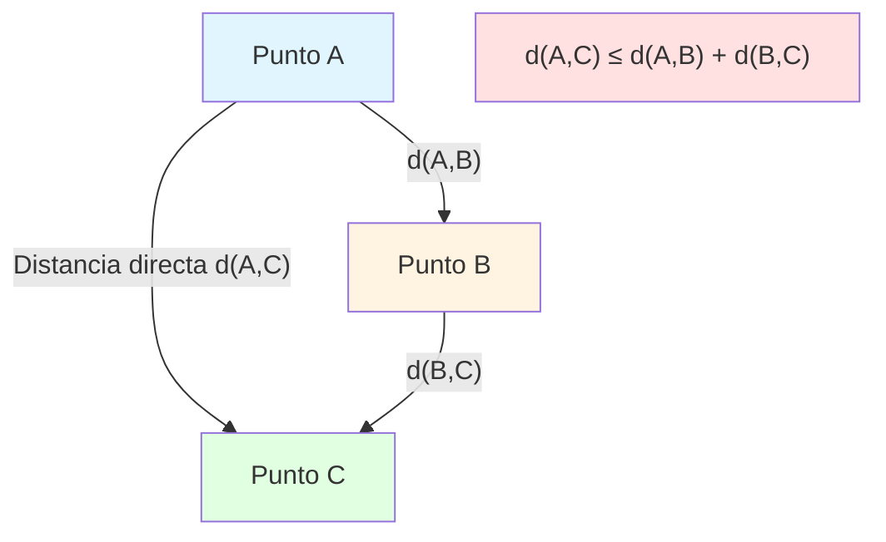
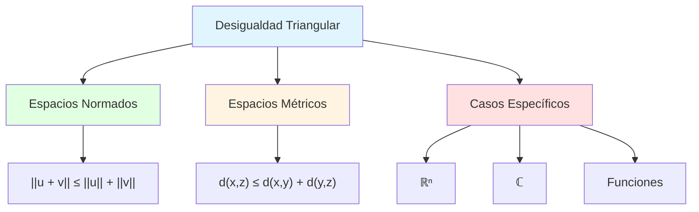
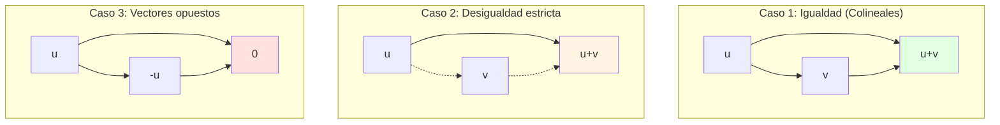
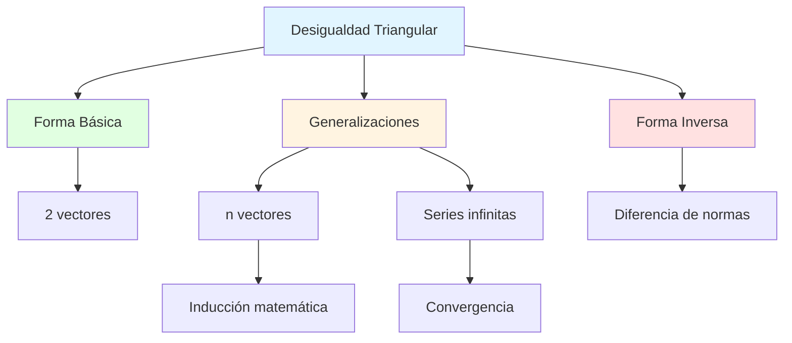
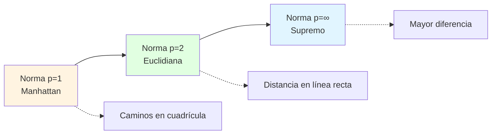
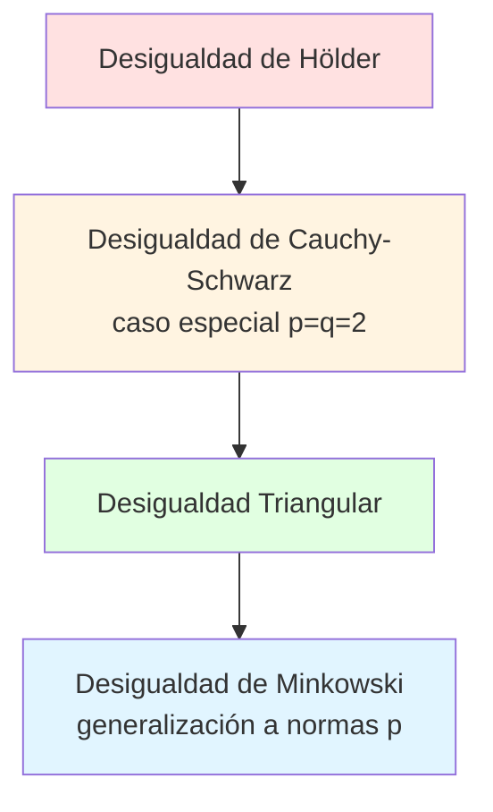

# 📐 Desigualdad Triangular

## 🎯 Introducción

> [!info]- 💡 ¿Qué es la Desigualdad Triangular?
> 
> La **desigualdad triangular** es un principio fundamental en matemáticas que establece una relación entre las longitudes de los lados de un triángulo y las normas de vectores. Este concepto tiene aplicaciones profundas en álgebra lineal, análisis funcional, geometría y ciencias de la computación.
> 
> **Analogía práctica:** Imagina que quieres ir del punto A al punto C. Tienes dos opciones:
> 
> - **Ruta directa:** Caminar en línea recta de A a C
> - **Ruta indirecta:** Ir primero de A a B, luego de B a C
> 
> La desigualdad triangular nos dice que **la ruta directa siempre será más corta o igual** que cualquier ruta indirecta que pase por puntos intermedios.
> 
> **¿Por qué es importante?**
> 
> |Aspecto|Descripción|Ejemplo de Uso|
> |---|---|---|
> |**Optimización**|Encontrar caminos más cortos|GPS, rutas de entrega|
> |**Análisis de errores**|Acotar propagación de errores|Algoritmos numéricos|
> |**Teoría de espacios métricos**|Definir distancias válidas|Machine Learning, clustering|
> |**Compresión de datos**|Estimar tamaños de representaciones|Algoritmos de compresión|
> |**Geometría computacional**|Validar construcciones geométricas|Gráficos por computadora|



---

## 📊 Enunciado Formal

### 📐 Definición Matemática

> [!example]- 📝 Formulación en Diferentes Contextos
> 
> **1. En espacios vectoriales con norma:**
> 
> Para cualesquiera vectores **u**, **v** ∈ V (donde V es un espacio vectorial con norma ||·||):
> 
> ```
> ||u + v|| ≤ ||u|| + ||v||
> ```
> 
> **Interpretación:** La norma de la suma de dos vectores nunca excede la suma de sus normas individuales.
> 
> **2. En espacios métricos:**
> 
> Para cualesquiera puntos x, y, z en un espacio métrico (X, d):
> 
> ```
> d(x, z) ≤ d(x, y) + d(y, z)
> ```
> 
> **Interpretación:** La distancia directa entre dos puntos nunca excede la distancia que resulta de pasar por un punto intermedio.
> 
> **3. En ℝⁿ con producto interno:**
> 
> Para vectores **u**, **v** ∈ ℝⁿ:
> 
> ```
> ||u + v|| = √(⟨u + v, u + v⟩) ≤ ||u|| + ||v||
> ```
> 
> **Comparación de formulaciones:**
> 
> |Contexto|Notación|Objetos|Aplicación Principal|
> |---|---|---|---|
> |**Espacios normados**|\|\|u + v\|\| ≤ \|
> |**Espacios métricos**|d(x,z) ≤ d(x,y) + d(y,z)|Puntos|Topología, análisis|
> |**ℝⁿ estándar**|\|\|u + v\|\|₂ ≤ \|
> |**Números complejos**|\|z₁ + z₂\| ≤ \|z₁\| + \|z₂\||Complejos|Análisis complejo|



### 🔍 Interpretación Geométrica

> [!note]- 🎨 Visualización en el Plano
> 
> **Representación en ℝ²:**
> 
> Consideremos tres puntos que forman un triángulo:
> 
> - A = (0, 0)
> - B = (3, 4)
> - C = (6, 0)
> 
> ```mermaid
> graph LR
>     A["A(0,0)"] -->|"d(A,B) = 5"| B["B(3,4)"]
>     B -->|"d(B,C) = 5"| C["C(6,0)"]
>     A -.->|"d(A,C) = 6"| C
>     
>     Note["6 ≤ 5 + 5<br/>6 ≤ 10 ✓"]
>     
>     style A fill:#e1f5ff
>     style B fill:#fff4e1
>     style C fill:#e1ffe1
>     style Note fill:#e1ffe1
> ```
> 
> **Cálculo de distancias:**
> 
> ```
> d(A,B) = √[(3-0)² + (4-0)²] = √(9+16) = 5
> d(B,C) = √[(6-3)² + (0-4)²] = √(9+16) = 5
> d(A,C) = √[(6-0)² + (0-0)²] = 6
> 
> Verificación: 6 ≤ 5 + 5 → 6 ≤ 10 ✓
> ```
> 
> **Casos extremos:**
> 
> |Caso|Condición|Relación|Interpretación Geométrica|
> |---|---|---|---|
> |**Igualdad**|\|\|u + v\|\| = \|
> |**Desigualdad estricta**|\|\|u + v\|\| < \|
> |**Vectores opuestos**|v = -u|\|\|u + v\|
> 
> **Visualización de casos:**



---

## 🧮 Demostración

### 📚 Demostración usando Desigualdad de Cauchy-Schwarz

> [!success]- 🎓 Prueba Rigurosa
> 
> **Teorema previo necesario:** Desigualdad de Cauchy-Schwarz
> 
> Para vectores **u**, **v** en un espacio con producto interno:
> 
> ```
> |⟨u, v⟩| ≤ ||u|| · ||v||
> ```
> 
> **Demostración de la Desigualdad Triangular:**
> 
> **Paso 1:** Elevar al cuadrado ambos lados
> 
> Queremos demostrar: ||u + v|| ≤ ||u|| + ||v||
> 
> Elevamos al cuadrado (ambos lados son no negativos):
> 
> ```
> ||u + v||² ≤ (||u|| + ||v||)²
> ```
> 
> **Paso 2:** Expandir el lado izquierdo usando el producto interno
> 
> ```
> ||u + v||² = ⟨u + v, u + v⟩
>            = ⟨u, u⟩ + ⟨u, v⟩ + ⟨v, u⟩ + ⟨v, v⟩
>            = ||u||² + 2⟨u, v⟩ + ||v||²
> ```
> 
> **Paso 3:** Expandir el lado derecho
> 
> ```
> (||u|| + ||v||)² = ||u||² + 2||u|| · ||v|| + ||v||²
> ```
> 
> **Paso 4:** Comparar ambas expresiones
> 
> Necesitamos demostrar que:
> 
> ```
> ||u||² + 2⟨u, v⟩ + ||v||² ≤ ||u||² + 2||u|| · ||v|| + ||v||²
> ```
> 
> Simplificando (restando ||u||² + ||v||² de ambos lados):
> 
> ```
> 2⟨u, v⟩ ≤ 2||u|| · ||v||
> ```
> 
> Dividiendo por 2:
> 
> ```
> ⟨u, v⟩ ≤ ||u|| · ||v||
> ```
> 
> **Paso 5:** Aplicar Cauchy-Schwarz
> 
> Por la desigualdad de Cauchy-Schwarz, sabemos que:
> 
> ```
> |⟨u, v⟩| ≤ ||u|| · ||v||
> ```
> 
> Lo que implica:
> 
> ```
> ⟨u, v⟩ ≤ |⟨u, v⟩| ≤ ||u|| · ||v||
> ```
> 
> Por lo tanto, la desigualdad se cumple. ∎
> 
> **Flujo lógico de la demostración:**
> ```mermaid
> flowchart TD
>     A["Objetivo: ||u + v|| ≤ ||u|| + ||v||"] --> B[Elevar al cuadrado]
>     B --> C["||u + v||² ≤ ||u|| + ||v||²"]
>     C --> D[Expandir usando<br/>producto interno]
>     D --> E["||u||² + 2⟨u,v⟩ + ||v||²"]
>     D --> F["||u||² + 2||u||||v|| + ||v||²"]
>     E --> G[Simplificar]
>     F --> G
>     G --> H["⟨u,v⟩ ≤ ||u||||v||"]
>     H --> I[Aplicar<br/>Cauchy-Schwarz]
>     I --> J[Demostración<br/>completa ✓]
>     
>     style A fill:#e1f5ff
>     style I fill:#fff4e1
>     style J fill:#e1ffe1
> ```
> **Caso de igualdad:**
> 
> La igualdad ||u + v|| = ||u|| + ||v|| se alcanza cuando:
> 
> - **u** y **v** son linealmente dependientes
> - **v** = λ**u** donde λ ≥ 0
> - Los vectores apuntan en la misma dirección

### 🔢 Demostración en ℝⁿ con Norma Euclidiana

> [!example]- 📐 Caso Específico para Vectores Numéricos
> 
> **Datos:** u = (u₁, u₂, ..., uₙ), v = (v₁, v₂, ..., vₙ) ∈ ℝⁿ
> 
> **Queremos probar:**
> 
> ```
> √[(u₁+v₁)² + (u₂+v₂)² + ... + (uₙ+vₙ)²] ≤ 
> √[u₁² + u₂² + ... + uₙ²] + √[v₁² + v₂² + ... + vₙ²]
> ```
> 
> **Ejemplo numérico en ℝ³:**
> 
> Sean:
> 
> - u = (1, 2, 2)
> - v = (2, 1, 2)
> 
> **Paso 1:** Calcular ||u|| y ||v||
> 
> ```
> ||u|| = √(1² + 2² + 2²) = √(1 + 4 + 4) = √9 = 3
> ||v|| = √(2² + 1² + 2²) = √(4 + 1 + 4) = √9 = 3
> ```
> 
> **Paso 2:** Calcular u + v
> 
> ```
> u + v = (1+2, 2+1, 2+2) = (3, 3, 4)
> ```
> 
> **Paso 3:** Calcular ||u + v||
> 
> ```
> ||u + v|| = √(3² + 3² + 4²) = √(9 + 9 + 16) = √34 ≈ 5.831
> ```
> 
> **Paso 4:** Verificar la desigualdad
> 
> ```
> ||u + v|| ≤ ||u|| + ||v||
> 5.831 ≤ 3 + 3
> 5.831 ≤ 6 ✓
> ```
> 
> **Tabla de verificación:**
> 
> |Componente|Valor u|Valor v|Suma (u+v)|Cuadrado|
> |---|---|---|---|---|
> |Primera|1|2|3|9|
> |Segunda|2|1|3|9|
> |Tercera|2|2|4|16|
> |**Suma de cuadrados**|-|-|-|**34**|
> |**Norma**|3|3|√34 ≈ 5.831|-|
> 
> **Verificación:** 5.831 < 6 ✓

---

## 🎯 Propiedades y Variantes

### 📋 Propiedades Fundamentales

> [!note]- 🔑 Características Esenciales
> 
> **1. Propiedad de simetría**
> 
> La desigualdad es simétrica respecto a los vectores:
> 
> ```
> ||u + v|| ≤ ||u|| + ||v||
> ||v + u|| ≤ ||v|| + ||u||  (es lo mismo)
> ```
> 
> **2. Generalización a múltiples vectores**
> 
> Para n vectores u₁, u₂, ..., uₙ:
> 
> ```
> ||u₁ + u₂ + ... + uₙ|| ≤ ||u₁|| + ||u₂|| + ... + ||uₙ||
> ```
> 
> **Demostración por inducción:**
> 
> - **Caso base (n=2):** Ya demostrado
> - **Paso inductivo:** Suponer cierto para n-1, demostrar para n
> 
> ```
> ||u₁ + ... + uₙ|| = ||(u₁ + ... + uₙ₋₁) + uₙ||
>                   ≤ ||u₁ + ... + uₙ₋₁|| + ||uₙ||     (caso base)
>                   ≤ (||u₁|| + ... + ||uₙ₋₁||) + ||uₙ||  (hipótesis inductiva)
>                   = ||u₁|| + ... + ||uₙ||
> ```
> 
> **3. Desigualdad triangular inversa**
> 
> También se cumple:
> 
> ```
> | ||u|| - ||v|| | ≤ ||u - v||
> ```
> 
> **Interpretación:** La diferencia de normas nunca excede la norma de la diferencia.
> 
> **4. Monotonía con respecto a subespacios**
> 
> Si W ⊆ V es un subespacio y u + v ∈ W:
> 
> ```
> ||u + v||_W ≤ ||u||_V + ||v||_V
> ```
> 
> **Tabla resumen de propiedades:**
> 
> |Propiedad|Enunciado|Uso Principal|
> |---|---|---|
> |**Básica**|\|\|u + v\|
> |**Generalizada**|\|\|Σuᵢ\|
> |**Inversa**|\| \|\|u\|
> |**n-dimensional**|d(x,z) ≤ Σd(xᵢ,xᵢ₊₁)|Caminos en grafos|



### 🔄 Variantes Importantes

> [!tip]- 🌟 Formas Alternativas
> 
> **1. Desigualdad triangular para distancias**
> 
> En un espacio métrico (X, d):
> 
> ```
> d(x, z) ≤ d(x, y) + d(y, z)
> ```
> 
> **Aplicación:** Encontrar cotas superiores para distancias.
> 
> **2. Desigualdad de Minkowski (generalización)**
> 
> Para p ≥ 1 y vectores en ℝⁿ:
> 
> ```
> (Σ|uᵢ + vᵢ|ᵖ)^(1/p) ≤ (Σ|uᵢ|ᵖ)^(1/p) + (Σ|vᵢ|ᵖ)^(1/p)
> ```
> 
> **Casos especiales:**
> 
> - p = 1: Norma taxicab (Manhattan)
> - p = 2: Norma euclidiana (caso clásico)
> - p = ∞: Norma del supremo
> 
> **3. Para integrales (espacios Lᵖ)**
> 
> ```
> ||f + g||_p ≤ ||f||_p + ||g||_p
> ```
> 
> donde ||f||_p = (∫|f(x)|ᵖ dx)^(1/p)
> 
> **4. En espacios de matrices**
> 
> Para normas matriciales subordinadas:
> 
> ```
> ||A + B|| ≤ ||A|| + ||B||
> ```
> 
> **Comparación de variantes:**
> 
> |Variante|Espacio|Forma|Aplicación|
> |---|---|---|---|
> |**Clásica**|ℝⁿ (norma 2)|\|\|u+v\|
> |**Minkowski p=1**|ℝⁿ (norma 1)|\|\|u+v\|
> |**Supremo**|C[a,b]|\|\|f+g\|
> |**Matricial**|Mₙₓₙ(ℝ)|\|\|A+B\|



---

## 💼 Aplicaciones Prácticas

### 📊 Análisis de Errores Numéricos

> [!warning]- ⚠️ Propagación de Errores
> 
> **Contexto:** En cálculos numéricos, los errores se acumulan. La desigualdad triangular proporciona cotas superiores.
> 
> **Fórmula de propagación:**
> 
> Si calculamos x + y con errores εₓ y εᵧ:
> 
> ```
> |error(x + y)| ≤ |error(x)| + |error(y)|
> ```
> 
> **Ejemplo: Suma de 3 números con error**
> 
> ```
> Valores reales:    x = 1.0,  y = 2.0,  z = 3.0
> Valores medidos:   x̃ = 1.1,  ỹ = 1.9,  z̃ = 3.2
> Errores:          εₓ = 0.1, εᵧ = 0.1, εᵧ = 0.2
> 
> Error en suma:
> |(x̃ + ỹ + z̃) - (x + y + z)| ≤ |εₓ| + |εᵧ| + |εᵧ|
> |6.2 - 6.0| ≤ 0.1 + 0.1 + 0.2
> 0.2 ≤ 0.4 ✓
> ```
> 
> **Aplicación en algoritmos iterativos:**
> 
> Para n iteraciones con error máximo ε por paso:
> 
> ```
> Error total ≤ n · ε
> ```
> 
> **Ejemplo: Serie de cálculos**
> 
> ```java
> // Acumulación de error en suma de vectores
> double errorTotal = 0;
> for (Vector v : vectores) {
>     resultado = resultado.sumar(v);
>     errorTotal += v.getError();
> }
> // errorTotal es cota superior del error final
> ```
> 
> **Tabla de propagación:**
> 
> |Operación|Error Individual|Error Acumulado (cota)|
> |---|---|---|
> |x₁ + x₂|ε₁, ε₂|ε₁ + ε₂|
> |Σⁿᵢ₌₁ xᵢ|εᵢ|Σⁿᵢ₌₁ εᵢ|
> |Integral numérica|ε por subintervalo|n · ε (n subintervalos)|

## 📊 Análisis Comparativo

### 📈 Tabla de Casos Especiales

> [!note]- 🔍 Comportamiento en Diferentes Escenarios
> 
> |Caso|Condición|Relación|Factor|Interpretación Geométrica|
> |---|---|---|---|---|
> |**Paralelos mismo sentido**|v = λu, λ > 0|\|\|u+v\|\| = \|
> |**Ortogonales**|⟨u,v⟩ = 0|\|\|u+v\|\|² = \|
> |**Paralelos sentido opuesto**|v = λu, λ < 0|\|\|\|u\|\| - \|
> |**Opuestos iguales**|v = -u|\|\|u+v\|\| = 0|
> |**Ángulo agudo**|⟨u,v⟩ > 0|\|\|u+v\|\| > √(\|
> |**Ángulo obtuso**|⟨u,v⟩ < 0|\|\|u+v\|\| < √(\|

### 🎓 Comparación con Otras Desigualdades

> [!tip]- 🌟 Relación con Desigualdades Famosas
> 
> **1. Conexión con Cauchy-Schwarz:**
> 
> La desigualdad triangular se deriva de Cauchy-Schwarz:
> 
> ```
> Cauchy-Schwarz:  |⟨u,v⟩| ≤ ||u|| · ||v||
>            ⇓
> Desigualdad Triangular: ||u + v|| ≤ ||u|| + ||v||
> ```
> 
> **2. Comparación con Minkowski:**
> 
> |Desigualdad|Forma|Generalización|
> |---|---|---|
> |**Triangular**|\|\|u+v\|
> |**Minkowski**|\|\|u+v\|
> |**Hölder**|\|\|u·v\|
> 
> **3. Jerarquía de fuerza:**



---

## 🔬 Teoremas Relacionados

### 📚 Consecuencias Importantes

> [!success]- 🎓 Teoremas que Dependen de la Desigualdad Triangular
> 
> **1. Continuidad de la norma:**
> 
> La desigualdad triangular implica que la función norma es continua:
> 
> ```
> | ||u|| - ||v|| | ≤ ||u - v||
> ```
> 
> **Demostración:** Por desigualdad triangular:
> 
> ```
> ||u|| = ||u - v + v|| ≤ ||u - v|| + ||v||
> ⇒ ||u|| - ||v|| ≤ ||u - v||
> 
> Similarmente:
> ||v|| - ||u|| ≤ ||u - v||
> 
> Por lo tanto:
> | ||u|| - ||v|| | ≤ ||u - v||
> ```
> 
> **2. Convergencia en espacios normados:**
> 
> Si {uₙ} converge a u, entonces {||uₙ||} converge a ||u||.
> 
> **Prueba:** Por continuidad de la norma:
> 
> ```
> | ||uₙ|| - ||u|| | ≤ ||uₙ - u|| → 0
> ```
> 
> **3. Desigualdad del paralelogramo (relacionada):**
> 
> En espacios con producto interno:
> 
> ```
> ||u + v||² + ||u - v||² = 2(||u||² + ||v||²)
> ```
> 
> **4. Acotación de series:**
> 
> Para serie convergente Σvₙ:
> 
> ```
> || Σvₙ || ≤ Σ||vₙ||
> ```

### 🎯 Aplicaciones Teóricas

> [!example]- 🔭 Uso en Demostraciones
> 
> **1. Espacios completos (Banach):**
> 
> La desigualdad triangular es esencial para definir sucesiones de Cauchy:
> 
> ```
> {uₙ} es de Cauchy si:
> ∀ε > 0, ∃N: ∀m,n > N, ||uₘ - uₙ|| < ε
> ```
> 
> **2. Compacidad:**
> 
> Para demostrar que conjuntos son acotados:
> 
> ```
> Si ||uₙ - u₀|| < R para todo n,
> entonces ||uₙ|| ≤ ||u₀|| + R
> ```
> 
> **3. Teorema del punto fijo:**
> 
> Las contracciones usan la desigualdad:
> 
> ```
> ||T(u) - T(v)|| ≤ k||u - v||, 0 < k < 1
> ```
> 
> **4. Análisis funcional:**
> 
> Definición de funcionales acotados:
> 
> ```
> ||T(u + v)|| ≤ ||T(u)|| + ||T(v)||
> ```

---

## 🎯 Ejercicios Resueltos

### 📝 Nivel Básico

> [!example]- ✏️ Ejercicio 1: Verificación Directa
> 
> **Enunciado:** Verificar la desigualdad triangular para:
> 
> - u = (1, 2, 2)
> - v = (3, 0, 4)
> 
> **Solución:**
> 
> **Paso 1:** Calcular ||u||
> 
> ```
> ||u|| = √(1² + 2² + 2²)
>       = √(1 + 4 + 4)
>       = √9
>       = 3
> ```
> 
> **Paso 2:** Calcular ||v||
> 
> ```
> ||v|| = √(3² + 0² + 4²)
>       = √(9 + 0 + 16)
>       = √25
>       = 5
> ```
> 
> **Paso 3:** Calcular u + v
> 
> ```
> u + v = (1+3, 2+0, 2+4) = (4, 2, 6)
> ```
> 
> **Paso 4:** Calcular ||u + v||
> 
> ```
> ||u + v|| = √(4² + 2² + 6²)
>           = √(16 + 4 + 36)
>           = √56
>           ≈ 7.483
> ```
> 
> **Paso 5:** Verificar
> 
> ```
> ||u + v|| ≤ ||u|| + ||v||
> 7.483 ≤ 3 + 5
> 7.483 ≤ 8 ✓
> ```
> 
> **Respuesta:** La desigualdad se cumple. ✓

> [!example]- ✏️ Ejercicio 2: Caso de Igualdad
> 
> **Enunciado:** Encontrar λ tal que para u = (2, 1) y v = (λ·2, λ·1), se alcance la igualdad en la desigualdad triangular.
> 
> **Solución:**
> 
> La igualdad se alcanza cuando los vectores son paralelos y apuntan en la misma dirección, es decir, v = λu con λ > 0.
> 
> **Para cualquier λ > 0:**
> 
> ```
> u = (2, 1)
> v = (2λ, λ)
> u + v = (2 + 2λ, 1 + λ) = (2(1+λ), 1+λ)
> 
> ||u|| = √(4 + 1) = √5
> ||v|| = √((2λ)² + λ²) = √(4λ² + λ²) = λ√5
> ||u + v|| = √[4(1+λ)² + (1+λ)²] = (1+λ)√5
> 
> Verificar igualdad:
> ||u + v|| = ||u|| + ||v||
> (1+λ)√5 = √5 + λ√5
> (1+λ)√5 = (1+λ)√5 ✓
> ```
> 
> **Respuesta:** Para cualquier λ > 0, se alcanza la igualdad. Por ejemplo, λ = 1, 2, 3, etc.

### 🎓 Nivel Intermedio

> [!example]- ✏️ Ejercicio 3: Desigualdad con Tres Vectores
> 
> **Enunciado:** Demostrar que para u, v, w en ℝⁿ:
> 
> ```
> ||u + v + w|| ≤ ||u|| + ||v|| + ||w||
> ```
> 
> **Solución:**
> 
> **Método 1: Aplicación iterada**
> 
> ```
> ||u + v + w|| = ||(u + v) + w||
>               ≤ ||u + v|| + ||w||        (desigualdad triangular)
>               ≤ (||u|| + ||v||) + ||w||  (desigualdad triangular nuevamente)
>               = ||u|| + ||v|| + ||w||
> ```
> 
> **Método 2: Inducción**
> 
> Ya sabemos que para n=2 (caso base):
> 
> ```
> ||u + v|| ≤ ||u|| + ||v||
> ```
> 
> Supongamos cierto para n vectores. Para n+1:
> 
> ```
> ||u₁ + ... + uₙ + uₙ₊₁|| = ||(u₁ + ... + uₙ) + uₙ₊₁||
>                           ≤ ||u₁ + ... + uₙ|| + ||uₙ₊₁||
>                           ≤ (||u₁|| + ... + ||uₙ||) + ||uₙ₊₁||
>                           = ||u₁|| + ... + ||uₙ|| + ||uₙ₊₁||
> ```
> 
> **Respuesta:** Queda demostrado por inducción matemática. ∎

> [!example]- ✏️ Ejercicio 4: Aplicación Práctica
> 
> **Enunciado:** Una persona camina 3 km al este, luego 4 km al norte. ¿Cuál es la distancia mínima al punto de partida? ¿Se cumple la desigualdad triangular?
> 
> **Solución:**
> 
> **Modelado:**
> 
> - Punto inicial: O = (0, 0)
> - Después del primer desplazamiento: A = (3, 0)
> - Punto final: B = (3, 4)
> 
> **Vectores:**
> 
> ```
> u = (3, 0)  (este)
> v = (0, 4)  (norte)
> u + v = (3, 4)
> ```
> 
> **Cálculo de distancias:**
> 
> ```
> ||u|| = 3 km
> ||v|| = 4 km
> ||u + v|| = √(3² + 4²) = √25 = 5 km
> ```
> 
> **Verificación:**
> 
> ```
> ||u + v|| ≤ ||u|| + ||v||
> 5 ≤ 3 + 4
> 5 ≤ 7 ✓
> ```
> 
> **Interpretación:**
> 
> - Distancia caminada: 3 + 4 = 7 km
> - Distancia directa: 5 km
> - Ahorro si hubiera ido en línea recta: 2 km
> 
> **Respuesta:** La distancia mínima es 5 km. La desigualdad se cumple (5 ≤ 7). ✓

### 🏆 Nivel Avanzado

> [!example]- ✏️ Ejercicio 5: Desigualdad Triangular Inversa
> 
> **Enunciado:** Demostrar la desigualdad triangular inversa:
> 
> ```
> | ||u|| - ||v|| | ≤ ||u - v||
> ```
> 
> **Solución:**
> 
> **Parte 1:** Demostrar ||u|| - ||v|| ≤ ||u - v||
> 
> Partimos de la desigualdad triangular básica:
> 
> ```
> ||u|| = ||(u - v) + v||
>       ≤ ||u - v|| + ||v||
> 
> Por lo tanto:
> ||u|| - ||v|| ≤ ||u - v||    ...(1)
> ```
> 
> **Parte 2:** Demostrar ||v|| - ||u|| ≤ ||u - v||
> 
> Análogamente:
> 
> ```
> ||v|| = ||(v - u) + u||
>       ≤ ||v - u|| + ||u||
>       = ||u - v|| + ||u||     (||v - u|| = ||u - v||)
> 
> Por lo tanto:
> ||v|| - ||u|| ≤ ||u - v||    ...(2)
> ```
> 
> **Parte 3:** Combinar ambos resultados
> 
> De (1) y (2):
> 
> ```
> ||u|| - ||v|| ≤ ||u - v||
> ||v|| - ||u|| ≤ ||u - v||
> 
> ⇒ -||u - v|| ≤ ||u|| - ||v|| ≤ ||u - v||
> ⇒ | ||u|| - ||v|| | ≤ ||u - v||
> ```
> 
> **Respuesta:** Queda demostrado. ∎

> [!example]- ✏️ Ejercicio 6: Optimización con Restricciones
> 
> **Enunciado:** Dados u, v ∈ ℝ² con ||u|| = 3, ||v|| = 4, encontrar el valor máximo y mínimo posibles para ||u + v||.
> 
> **Solución:**
> 
> **Análisis:**
> 
> Por la desigualdad triangular y su inversa:
> 
> ```
> | ||u|| - ||v|| | ≤ ||u + v|| ≤ ||u|| + ||v||
> ```
> 
> **Cota inferior:**
> 
> ```
> ||u + v|| ≥ | ||u|| - ||v|| |
>          = | 3 - 4 |
>          = 1
> ```
> 
> Esta cota se alcanza cuando u y v son paralelos pero en sentidos opuestos.
> 
> **Cota superior:**
> 
> ```
> ||u + v|| ≤ ||u|| + ||v||
>          = 3 + 4
>          = 7
> ```
> 
> Esta cota se alcanza cuando u y v son paralelos y en el mismo sentido.
> 
> **Verificación con ejemplos:**
> 
> _Mínimo (vectores opuestos):_
> 
> ```
> u = (3, 0)
> v = (-4, 0)
> u + v = (-1, 0)
> ||u + v|| = 1 ✓
> ```
> 
> _Máximo (vectores paralelos):_
> 
> ```
> u = (3, 0)
> v = (4, 0)
> u + v = (7, 0)
> ||u + v|| = 7 ✓
> ```
> 
> **Respuesta:**
> 
> - Valor mínimo: 1 (vectores opuestos)
> - Valor máximo: 7 (vectores paralelos mismo sentido)

---

## 📖 Resumen y Conclusiones

> [!success]- 🎯 Puntos Clave
> 
> **Conceptos Fundamentales:**
> 
> 1. **Enunciado:** ||u + v|| ≤ ||u|| + ||v||
> 2. **Interpretación:** La ruta directa nunca es más larga que una ruta indirecta
> 3. **Demostración:** Se basa en la desigualdad de Cauchy-Schwarz
> 4. **Igualdad:** Se alcanza cuando los vectores son paralelos (mismo sentido)
> 
> **Casos Especiales:**
> 
> |Situación|Resultado|Factor|
> |---|---|---|
> |Paralelos (mismo sentido)|Igualdad exacta|1.0|
> |Ortogonales|Teorema de Pitágoras|~0.707|
> |Opuestos|Cancelación parcial/total|0.0-0.5|
> 
> **Aplicaciones Importantes:**
> 
> - Navegación y rutas óptimas
> - Algoritmos de clustering (K-means)
> - Análisis de errores numéricos
> - Gráficos por computadora
> - Teoría de espacios métricos
> 
> **Conexión con otras desigualdades:**
> 
> ```mermaid
> graph TD
>     A[Cauchy-Schwarz] --> B[Desigualdad Triangular]
>     B --> C[Minkowski]
>     B --> D[Espacios Métricos]
>     C --> E[Normas Lp]
>     D --> F[Topología]
>     
>     style B fill:#e1ffe1
>     style A fill:#e1f5ff
>     style C fill:#fff4e1
> ```
> 
---

## 🔗 Conexión con Próximos Temas

> [!quote]- 🌟 Continuando el Aprendizaje
> 
> **Has dominado:**
> 
> ```mermaid
> mindmap
>   root((Desigualdad<br/>Triangular))
>     Definición
>       Espacios normados
>       Espacios métricos
>       Casos especiales
>     Demostración
>       Cauchy-Schwarz
>       Producto interno
>       Casos de igualdad
>     Aplicaciones
>       Navegación
>       Machine Learning
>       Análisis numérico
>     Variantes
>       Inversa
>       Minkowski
>       Múltiples vectores
> ```
> 
> **Progresión natural del aprendizaje:**
> 
> |Nivel|Tema|Por qué es el siguiente paso|
> |---|---|---|
> |**Previo**|Desigualdad de Cauchy-Schwarz|Base para la demostración|
> |**Actual**|Desigualdad Triangular|Fundamental para geometría|
> |**Siguiente**|Espacios métricos|Generalización del concepto|
> |**Avanzado**|Teoría de la medida|Integración y espacios Lp|
> |**Aplicado**|Optimización|Algoritmos de camino mínimo|
> 
> **Roadmap de evolución:**
> 
> ```mermaid
> graph LR
>     A[Producto Interno] --> B[Cauchy-Schwarz]
>     B --> C[Desigualdad Triangular]
>     C --> D[Espacios Métricos]
>     D --> E[Topología]
>     
>     C --> F[Minkowski]
>     F --> G[Espacios Lp]
>     
>     C --> H[Optimización]
>     H --> I[Algoritmos de grafos]
>     
>     style C fill:#e1ffe1
>     style B fill:#fff4e1
>     style D fill:#e1f5ff
> ```

---

**Tags:** #matematicas #algebra-lineal #desigualdad-triangular #normas #espacios-vectoriales #geometria #cauchy-schwarz #producto-interno #aplicaciones #java #mermaid #visualizacion