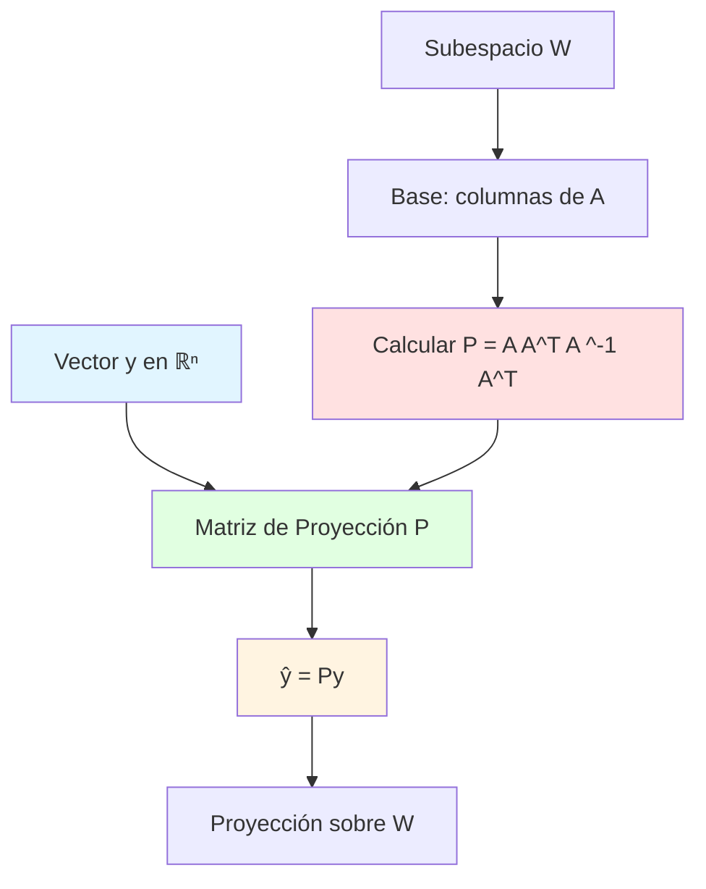

# 📐 Proyección Ortogonal sobre un Subespacio (Forma Matricial)

## 🎯 Introducción

> [!info]- 💡 ¿Qué es la Proyección Ortogonal Matricial?
> 
> La **proyección ortogonal en forma matricial** es una representación de la proyección de vectores sobre subespacios utilizando multiplicación de matrices. Esta formulación permite expresar la proyección como una transformación lineal mediante una **matriz de proyección**.
> 
> **Definición:**
> 
> Sea **W** un subespacio de ℝⁿ con matriz **A** cuyas columnas forman una base de W. La matriz de proyección **P** sobre W se define como:
> 
> **P = A(A^T A)^(-1) A^T**
> 
> La proyección de cualquier vector **y** sobre W es:
> 
> **ŷ = Py**
> 
> **Analogía práctica:** Imagina una máquina que toma cualquier vector y automáticamente lo proyecta sobre un plano. La matriz P es el "programa" de esa máquina: multiplicar cualquier vector por P produce su proyección.
> 
> **¿Por qué es importante?**
> 
> |Aspecto|Descripción|Aplicación|
> |---|---|---|
> |**Computación eficiente**|Proyectar múltiples vectores rápidamente|Procesamiento de datos masivos|
> |**Representación compacta**|Una matriz representa toda la transformación|Software matemático|
> |**Propiedades algebraicas**|Facilita demostraciones y análisis|Teoría matemática|
> |**Implementación numérica**|Directo en software (MATLAB, Python)|Algoritmos computacionales|
> |**Generalización**|Mismo marco para cualquier dimensión|Escalabilidad|



---

## 🏗️ Fundamentos Matriciales

### 📊 Matriz de Proyección

> [!example]- 🔢 Construcción y Definición
> 
> **Definición formal:**
> 
> Sea **W = Col(A)** el espacio columna de una matriz **A ∈ ℝ^(n×k)** con columnas linealmente independientes. La **matriz de proyección ortogonal** sobre W es:
> 
> **P = A(A^T A)^(-1) A^T**
> 
> **Componentes:**
> 
> - **A**: Matriz n×k cuyas columnas son base de W
> - **A^T A**: Matriz k×k (producto de Gram)
> - **(A^T A)^(-1)**: Inversa de A^T A (existe si columnas de A son independientes)
> - **A^T**: Transpuesta de A
> 
> **Dimensiones:**
> 
> ```
> P = A · (A^T A)^(-1) · A^T
>     ↓       ↓           ↓
>   (n×k)   (k×k)      (k×n)
>     
> Resultado: P es n×n
> ```
> 
> **Ejemplo en ℝ³:**
> 
> ```
> W = span{(1, 0, 0), (0, 1, 0)} (plano xy)
> 
> A = [ 1  0 ]
>     [ 0  1 ]
>     [ 0  0 ]
> 
> A^T A = [ 1  0  0 ] [ 1  0 ]   [ 1  0 ]
>         [ 0  1  0 ] [ 0  1 ] = [ 0  1 ]
>                     [ 0  0 ]
> 
> (A^T A)^(-1) = [ 1  0 ]
>                [ 0  1 ]
> 
> P = [ 1  0 ] [ 1  0 ] [ 1  0  0 ]
>     [ 0  1 ] [ 0  1 ] [ 0  1  0 ]
>     [ 0  0 ]
> 
>   = [ 1  0 ] [ 1  0  0 ]
>     [ 0  1 ] [ 0  1  0 ]
>     [ 0  0 ]
> 
>   = [ 1  0  0 ]
>     [ 0  1  0 ]
>     [ 0  0  0 ]
> 
> Verificar proyección de y = (2, 3, 5):
> Py = [ 1  0  0 ] [ 2 ]   [ 2 ]
>      [ 0  1  0 ] [ 3 ] = [ 3 ]
>      [ 0  0  0 ] [ 5 ]   [ 0 ]
> 
> (Proyecta sobre plano xy, elimina componente z) ✅
> ```
> 
> **Visualización del proceso:**
> 
> ```mermaid
> flowchart LR
>     A[Subespacio W] --> B[Elegir base]
>     B --> C[Formar matriz A<br/>columnas = base]
>     C --> D[Calcular A^T A]
>     D --> E[Invertir: A^T A ^-1]
>     E --> F[P = A A^T A ^-1 A^T]
>     
>     G[Vector y] --> H[Multiplicar: ŷ = Py]
>     F --> H
>     H --> I[Proyección ŷ ∈ W]
>     
>     style C fill:#e1ffe1
>     style F fill:#fff4e1
>     style I fill:#e1f5ff
> ```
> 
> **Propiedades fundamentales:**
> 
> |Propiedad|Fórmula|Significado|
> |---|---|---|
> |**Simétrica**|P^T = P|Matriz simétrica|
> |**Idempotente**|P² = P|Proyectar dos veces = proyectar una vez|
> |**Rango**|rango(P) = dim(W)|Dimensión del subespacio|
> |**Valores propios**|λ ∈ {0, 1}|Solo 0 y 1|
> |**Traza**|tr(P) = dim(W)|Suma de dimensiones|

### 🎯 Caso Especial: Base Ortonormal

> [!success]- ⚡ Simplificación Significativa
> 
> **Teorema:**
> 
> Si las columnas de **Q** forman una base **ortonormal** de W, entonces:
> 
> **P = QQ^T**
> 
> (No se necesita invertir Q^T Q porque Q^T Q = I)
> 
> **Demostración:**
> 
> ```
> Si Q tiene columnas ortonormales:
> Q^T Q = I  (matriz identidad)
> 
> P = Q(Q^T Q)^(-1) Q^T
>   = Q · I^(-1) · Q^T
>   = Q · I · Q^T
>   = QQ^T ✅
> ```
> 
> **Ventajas computacionales:**
> 
> ```mermaid
> graph TB
>     A[Base de W] --> B{¿Ortonormal?}
>     B -->|No| C[P = A A^T A ^-1 A^T]
>     B -->|Sí| D[P = QQ^T]
>     
>     C --> E[Requiere inversión<br/>Más costoso]
>     D --> F[Solo multiplicación<br/>Muy eficiente]
>     
>     E --> G[O n³ operaciones]
>     F --> H[O n² operaciones]
>     
>     style D fill:#e1ffe1
>     style F fill:#e1ffe1
>     style C fill:#ffe1e1
> ```
> 
> **Ejemplo en ℝ³:**
> 
> ```
> Base ortonormal de W:
> q₁ = (1/√2, 1/√2, 0)
> q₂ = (0, 0, 1)
> 
> Q = [ 1/√2   0  ]
>     [ 1/√2   0  ]
>     [  0     1  ]
> 
> P = QQ^T = [ 1/√2   0  ] [ 1/√2  1/√2  0 ]
>            [ 1/√2   0  ] [  0     0    1 ]
>            [  0     1  ]
> 
>          = [ 1/2   1/2   0 ]
>            [ 1/2   1/2   0 ]
>            [  0     0    1 ]
> 
> Proyección de y = (4, 2, 3):
> Py = [ 1/2   1/2   0 ] [ 4 ]   [ 3 ]
>      [ 1/2   1/2   0 ] [ 2 ] = [ 3 ]
>      [  0     0    1 ] [ 3 ]   [ 3 ]
> ```
> 
> **Forma expandida:**
> 
> ```
> Si Q = [q₁ q₂ ... qₖ] es ortonormal:
> 
> P = QQ^T = [q₁ q₂ ... qₖ] [ q₁^T ]
>                           [ q₂^T ]
>                           [  ⋮   ]
>                           [ qₖ^T ]
> 
>   = q₁q₁^T + q₂q₂^T + ... + qₖqₖ^T
> 
> (Suma de proyectores sobre vectores individuales)
> ```
> 
> **Comparación:**
> 
> |Aspecto|Base general A|Base ortonormal Q|
> |---|---|---|
> |**Fórmula**|A(A^T A)^(-1)A^T|QQ^T|
> |**Inversión**|Sí (A^T A)^(-1)|No (Q^T Q = I)|
> |**Complejidad**|O(n³)|O(n²k)|
> |**Estabilidad numérica**|Puede ser problemática|Excelente|
> |**Recomendación**|Ortonormalizar primero|Usar directamente|

### 📐 Proyección sobre Línea (1D)

> [!note]- 📏 Caso Unidimensional
> 
> **Proyección sobre línea generada por vector a:**
> 
> Cuando **W = span{a}** (una línea):
> 
> **P = (aa^T)/(a^T a) = aa^T/‖a‖²**
> 
> **Derivación:**
> 
> ```
> A = [a] (matriz con una sola columna)
> 
> A^T A = [a^T][a] = a^T a = ‖a‖² (escalar 1×1)
> 
> (A^T A)^(-1) = 1/(a^T a) = 1/‖a‖²
> 
> P = A(A^T A)^(-1)A^T
>   = a · (1/‖a‖²) · a^T
>   = (aa^T)/‖a‖² ✅
> ```
> 
> **Ejemplo en ℝ²:**
> 
> ```
> a = (3, 4)
> ‖a‖² = 9 + 16 = 25
> 
> P = (1/25) [ 3 ] [3  4]
>            [ 4 ]
> 
>   = (1/25) [ 9   12 ]
>            [ 12  16 ]
> 
>   = [ 9/25   12/25 ]
>     [ 12/25  16/25 ]
> 
> Proyectar y = (5, 0):
> Py = [ 9/25   12/25 ] [ 5 ]   [ 45/25 ]   [ 9/5 ]
>      [ 12/25  16/25 ] [ 0 ] = [ 60/25 ] = [ 12/5 ]
> 
> Verificar que Py está en span{(3,4)}:
> Py = (9/5, 12/5) = (3/5)(3, 4) ✅
> ```
> 
> **Si a es unitario (‖a‖ = 1):**
> 
> ```
> P = aa^T
> 
> Ejemplo: a = (3/5, 4/5)
> 
> P = [ 3/5 ] [3/5  4/5]
>     [ 4/5 ]
> 
>   = [ 9/25   12/25 ]
>     [ 12/25  16/25 ]
> 
> (Mismo resultado que antes)
> ```
> 
> **Estructura de aa^T:**
> 
> ```mermaid
> graph LR
>     A[Vector a<br/>n×1] --> B[a^T<br/>1×n]
>     A --> C[aa^T<br/>n×n]
>     B --> C
>     
>     C --> D[Matriz de rango 1]
>     D --> E[Todas las filas<br/>son múltiplos]
>     
>     style C fill:#e1ffe1
>     style D fill:#fff4e1
> ```

---

## 🔍 Propiedades de las Matrices de Proyección

### ⚡ Idempotencia

> [!example]- 🔄 P² = P
> 
> **Teorema:**
> 
> Una matriz de proyección ortogonal P satisface **P² = P**
> 
> **Significado intuitivo:**
> 
> Proyectar un vector dos veces es lo mismo que proyectarlo una vez:
> 
> - Primera proyección: y → ŷ (ŷ ∈ W)
> - Segunda proyección: ŷ → ŷ (ya está en W)
> 
> **Demostración (caso ortonormal):**
> 
> ```
> Si P = QQ^T donde Q tiene columnas ortonormales:
> 
> P² = (QQ^T)(QQ^T)
>    = Q(Q^T Q)Q^T
>    = Q · I · Q^T    (porque Q^T Q = I)
>    = QQ^T
>    = P ✅
> ```
> 
> **Demostración (caso general):**
> 
> ```
> P = A(A^T A)^(-1)A^T
> 
> P² = [A(A^T A)^(-1)A^T][A(A^T A)^(-1)A^T]
>    = A(A^T A)^(-1)[A^T A](A^T A)^(-1)A^T
>    = A(A^T A)^(-1)I(A^T A)^(-1)A^T
>    = A(A^T A)^(-1)A^T
>    = P ✅
> ```
> 
> **Ejemplo numérico:**
> 
> ```
> P = [ 1  0  0 ]
>     [ 0  1  0 ]
>     [ 0  0  0 ]
> 
> P² = [ 1  0  0 ] [ 1  0  0 ]   [ 1  0  0 ]
>      [ 0  1  0 ] [ 0  1  0 ] = [ 0  1  0 ] = P ✅
>      [ 0  0  0 ] [ 0  0  0 ]   [ 0  0  0 ]
> ```
> 
> **Consecuencia:**
> 
> ```
> P³ = P² · P = P · P = P
> P⁴ = P³ · P = P · P = P
>  ⋮
> Pⁿ = P para todo n ≥ 1
> ```
> 
> **Visualización:**
> 
> ```mermaid
> flowchart LR
>     A[y fuera de W] -->|P| B[ŷ en W]
>     B -->|P| C[ŷ mismo]
>     C -->|P| D[ŷ mismo]
>     
>     E[P² = P<br/>P³ = P<br/>...] -.-> B
>     
>     style B fill:#e1ffe1
>     style C fill:#e1ffe1
>     style D fill:#e1ffe1
> ```

### 🔄 Simetría

> [!success]- 📊 P^T = P
> 
> **Teorema:**
> 
> Una matriz de proyección ortogonal es **simétrica**: **P^T = P**
> 
> **Demostración:**
> 
> ```
> P = A(A^T A)^(-1)A^T
> 
> P^T = [A(A^T A)^(-1)A^T]^T
>     = (A^T)^T[(A^T A)^(-1)]^T A^T
>     = A[(A^T A)^(-1)]^T A^T
> 
> Ahora, (A^T A)^(-1) es simétrica porque A^T A es simétrica:
> (A^T A)^T = A^T(A^T)^T = A^T A
> 
> → [(A^T A)^(-1)]^T = (A^T A)^(-1)
> 
> Por lo tanto:
> P^T = A(A^T A)^(-1)A^T = P ✅
> ```
> 
> **Verificación numérica:**
> 
> ```
> P = [ 1/2   1/2   0 ]
>     [ 1/2   1/2   0 ]
>     [  0     0    1 ]
> 
> P^T = [ 1/2   1/2   0 ]
>       [ 1/2   1/2   0 ]
>       [  0     0    1 ] = P ✅
> ```
> 
> **Importancia:**
> 
> |Aspecto|Consecuencia|
> |---|---|
> |**Valores propios**|Todos reales|
> |**Vectores propios**|Ortogonales|
> |**Diagonalización**|P = QΛQ^T con Q ortogonal|
> |**Cálculo**|Simplifica operaciones|
> |**Geometría**|Proyección es "auto-adjunta"|

### 🎯 Rango y Núcleo

> [!tip]- 📐 Espacios Fundamentales
> 
> **Teorema:**
> 
> Para matriz de proyección P sobre subespacio W:
> 
> - **Im(P) = W** (imagen de P es W)
> - **Nul(P) = W⊥** (núcleo de P es W⊥)
> - **rango(P) = dim(W)**
> - **nulidad(P) = dim(W⊥) = n - dim(W)**
> 
> **Demostración de Im(P) = W:**
> 
> ```
> (⊆) Todo vector Py está en W:
> Si P = A(A^T A)^(-1)A^T y y es cualquier vector:
> Py = A(A^T A)^(-1)A^T y
>    = A · [algún vector en ℝᵏ]
>    = combinación lineal de columnas de A
>    ∈ W ✅
> 
> (⊇) Todo vector en W puede expresarse como Py:
> Si w ∈ W, entonces w = Ac para algún c
> Pw = P(Ac) = A(A^T A)^(-1)A^T Ac
>             = A(A^T A)^(-1)(A^T A)c
>             = Ac = w
> Por lo tanto w = Pw, entonces w ∈ Im(P) ✅
> ```
> 
> **Demostración de Nul(P) = W⊥:**
> 
> ```
> Pv = 0 ⟺ v ∈ W⊥
> 
> (⟹) Si Pv = 0:
> v = v - Pv (porque Pv = 0)
> v - Pv ∈ W⊥ (componente ortogonal)
> → v ∈ W⊥
> 
> (⟸) Si v ∈ W⊥:
> La proyección de v sobre W es 0
> → Pv = 0
> → v ∈ Nul(P) ✅
> ```
> 
> **Ejemplo:**
> 
> ```
> P = [ 1  0  0 ]
>     [ 0  1  0 ]  (proyección sobre plano xy)
>     [ 0  0  0 ]
> 
> Im(P) = {(x, y, 0) : x, y ∈ ℝ} = plano xy = W ✅
> 
> Nul(P): Pv = 0
> [ 1  0  0 ] [ x ]   [ 0 ]
> [ 0  1  0 ] [ y ] = [ 0 ]
> [ 0  0  0 ] [ z ]   [ 0 ]
> 
> → x = 0, y = 0, z libre
> Nul(P) = {(0, 0, z) : z ∈ ℝ} = eje z = W⊥ ✅
> 
> rango(P) = 2 = dim(W)
> nulidad(P) = 1 = dim(W⊥)
> ```
> 
> **Diagrama de espacios:**
> 
> ```mermaid
> graph TB
>     A[ℝⁿ] --> B[Aplicar P]
>     B --> C{Resultado}
>     
>     C --> D[Im P = W<br/>rango = dim W ]
>     C --> E[Nul P = W⊥<br/>nulidad = n - dim W ]
>     
>     F[Teorema del rango:<br/>rango + nulidad = n] -.-> C
>     
>     style D fill:#e1ffe1
>     style E fill:#fff4e1
>     style F fill:#e1f5ff
> ```

### 🔢 Valores y Vectores Propios

> [!note]- 🎨 Espectro de P
> 
> **Teorema:**
> 
> Los valores propios de una matriz de proyección ortogonal son **solo 0 y 1**.
> 
> **Demostración:**
> 
> ```
> Sea λ valor propio y v vector propio:
> Pv = λv
> 
> Aplicar P a ambos lados:
> P²v = P(λv) = λPv = λ²v
> 
> Pero P² = P (idempotencia):
> Pv = λ²v
> 
> Comparando con Pv = λv:
> λv = λ²v
> (λ - λ²)v = 0
> λ(1 - λ)v = 0
> 
> Como v ≠ 0 (vector propio):
> λ(1 - λ) = 0
> → λ = 0 o λ = 1 ✅
> ```
> 
> **Multiplicidades:**
> 
> ```
> - Valor propio λ = 1:
>   Multiplicidad = dim(W)
>   Espacio propio = W
> 
> - Valor propio λ = 0:
>   Multiplicidad = dim(W⊥) = n - dim(W)
>   Espacio propio = W⊥
> ```
> 
> **Ejemplo:**
> 
> ```
> P = [ 1  0  0 ]
>     [ 0  1  0 ]
>     [ 0  0  0 ]
> 
> Valores propios:
> det(P - λI) = det([ 1-λ   0    0  ])
>                  ([  0   1-λ   0  ])
>                  ([  0    0   -λ  ])
> 
> = (1-λ)(1-λ)(-λ) = 0
> 
> λ₁ = 1 (multiplicidad 2)
> λ₂ = 0 (multiplicidad 1)
> 
> Vectores propios para λ = 1:
> (P - I)v = 0
> [ 0  0  0 ] [ x ]   [ 0 ]
> [ 0  0  0 ] [ y ] = [ 0 ]
> [ 0  0 -1 ] [ z ]   [ 0 ]
> 
> → z = 0, x y y libres
> Espacio propio: plano xy = W ✅
> 
> Vectores propios para λ = 0:
> Pv = 0 → v ∈ Nul(P) = eje z = W⊥ ✅
> ```
> 
> **Diagonalización:**
> 
> ```
> P = QΛQ^T
> 
> donde:
> Λ = [ I_{k×k}    0     ]
>     [   0     0_{(n-k)×(n-k)} ]
> 
> (k = dim(W))
> 
> Q = [vectores propios ortonormales]
>   = [base ortonormal de W | base ortonormal de W⊥]
> ```
> 
> **Tabla de propiedades espectrales:**
> 
> |Propiedad|Valor|Significado|
> |---|---|---|
> |**Valores propios**|{0, 1}|Solo dos valores posibles|
> |**Traza**|tr(P) = dim(W)|Suma de valores propios|
> |**Determinante**|det(P) = 0 si dim(W) < n|Producto de valores propios|
> |**Polinomio mínimo**|m(λ) = λ(λ-1)|Raíces simples|

---

## 🛠️ Cálculo y Construcción

### 📋 Algoritmo General

> [!example]- 🔢 Pasos para Construir P
> 
> **Procedimiento completo:**
> 
> ```
> Entrada: Subespacio W con base {v₁, v₂, ..., vₖ}
> Salida: Matriz de proyección P
> 
> PASO 1: Formar matriz A
> A = [v₁ v₂ ... vₖ]  (columnas son vectores de la base)
> 
> PASO 2: Calcular A^T A
> Multiplicar la transpuesta de A por A
> Resultado: matriz k×k
> 
> PASO 3: Verificar invertibilidad
> det(A^T A) ≠ 0  (garantizado si v₁,...,vₖ son independientes)
> 
> PASO 4: Calcular (A^T A)^(-1)
> Invertir la matriz k×k
> Método: Gauss-Jordan, fórmula para 2×2, etc.
> 
> PASO 5: Calcular A^T
> Transponer A
> 
> PASO 6: Multiplicar
> P = A · (A^T A)^(-1) · A^T
> Realizar las multiplicaciones en orden
> 
> PASO 7: Verificar (opcional)
> - P^T = P (simetría)
> - P² = P (idempotencia)
> ```
> 
> **Ejemplo completo en ℝ³:**
> 
> ```
> W = span{(1, 1, 0), (0, 1, 1)}
> 
> PASO 1: Formar A
> A = [ 1  0 ]
>     [ 1  1 ]
>     [ 0  1 ]
> 
> PASO 2: Calcular A^T A
> A^T = [ 1  1  0 ]
>       [ 0  1  1 ]
> 
> A^T A = [ 1  1  0 ] [ 1  0 ]   [ 2  1 ]
>         [ 0  1  1 ] [ 1  1 ] = [ 1  2 ]
>                     [ 0  1 ]
> 
> PASO 3: Verificar
> det(A^T A) = 2(2) - 1(1) = 3 ≠ 0 ✅
> 
> PASO 4: Invertir
> (A^T A)^(-1) = (1/3) [  2  -1 ]
>                      [ -1   2 ]
> 
> PASO 5: Ya tenemos A^T del paso 2
> 
> PASO 6: Multiplicar
> P = A · (A^T A)^(-1) · A^T
> 
> Primero: (A^T A)^(-1) · A^T
> (1/3) [  2  -1 ] [ 1  1  0 ]   (1/3) [  2  1  -1 ]
>       [ -1   2 ] [ 0  1  1 ] =       [ -1  1   2 ]
> 
> Luego: A · resultado
> P = [ 1  0 ] · (1/3) [  2  1  -1 ]
>     [ 1  1 ]         [ -1  1   2 ]
>     [ 0  1 ]
> 
>   = (1/3) [ 1  0 ] [  2  1  -1 ]
>           [ 1  1 ] [ -1  1   2 ]
>           [0 1 ]
> = (1/3) [ 2 1 -1 ] [ 1 2 1 ] [ -1 1 2 ]
> 
> P = [ 2/3 1/3 -1/3 ] [ 1/3 2/3 1/3 ] [-1/3 1/3 2/3 ]
> 
> PASO 7: Verificar P^T = P ✅ (simétrica) P² = P ✅ (idempotente, verificar por multiplicación)
> 
> ````
> 
> **Flujo del algoritmo:**
> 
> ```mermaid
> flowchart TD
>     A[Base de W:<br/> v₁,...,vₖ ] --> B[Formar A = v₁...vₖ ]
>     B --> C[Calcular A^T A]
>     C --> D{¿Invertible?}
>     D -->|No| E[❌ Vectores no<br/>independientes]
>     D -->|Sí| F[Calcular A^T A ^-1]
>     F --> G[Calcular A^T]
>     G --> H[P = A A^T A ^-1 A^T]
>     H --> I[Verificar propiedades]
>     
>     style H fill:#e1ffe1
>     style I fill:#fff4e1
> ````

### ⚡ Optimización: Usar Base Ortonormal

> [!success]- 🚀 Método Eficiente
> 
> **Estrategia recomendada:**
> 
> ```
> En lugar de usar la base original directamente:
> 
> 1. Aplicar Gram-Schmidt a {v₁, ..., vₖ}
> 2. Obtener base ortonormal {q₁, ..., qₖ}
> 3. Usar fórmula simplificada: P = QQ^T
> ```
> 
> **Ventajas:**
> 
> |Aspecto|Base original|Base ortonormal|
> |---|---|---|
> |**Inversión**|Necesaria|No necesaria|
> |**Complejidad**|O(k³) para invertir|O(nk²) solo multiplicar|
> |**Estabilidad**|Problemas si A^T A mal condicionada|Excelente|
> |**Pasos**|6 pasos|3 pasos|
> 
> **Ejemplo comparativo:**
> 
> ```
> W = span{(1, 1, 0), (0, 1, 1)}
> 
> MÉTODO 1: Base original (como antes)
> [Requiere invertir matriz 2×2, múltiples multiplicaciones]
> 
> MÉTODO 2: Ortonormalizar primero
> 
> Gram-Schmidt:
> u₁ = (1, 1, 0)
> q₁ = u₁/‖u₁‖ = (1/√2, 1/√2, 0)
> 
> u₂ = (0, 1, 1) - ((0,1,1)·q₁)q₁
>     = (0, 1, 1) - (1/√2)(1/√2, 1/√2, 0)
>     = (0, 1, 1) - (1/2, 1/2, 0)
>     = (-1/2, 1/2, 1)
> 
> q₂ = u₂/‖u₂‖ = (-1/2, 1/2, 1)/√(3/2)
>     = (-1/√6, 1/√6, 2/√6)
> 
> Formar Q:
> Q = [ 1/√2   -1/√6 ]
>     [ 1/√2    1/√6 ]
>     [  0      2/√6 ]
> 
> Calcular P = QQ^T:
> P = [ 1/√2   -1/√6 ] [ 1/√2  1/√2   0   ]
>     [ 1/√2    1/√6 ] [-1/√6  1/√6  2/√6 ]
>     [  0      2/√6 ]
> 
>   = [ 1/2+1/6     1/2-1/6    -2/6  ]
>     [ 1/2-1/6     1/2+1/6     2/6  ]
>     [ -2/6         2/6        4/6  ]
> 
>   = [ 2/3   1/3  -1/3 ]
>     [ 1/3   2/3   1/3 ]
>     [-1/3   1/3   2/3 ]
> 
> (Mismo resultado, pero sin invertir) ✅
> ```
> 
> **Pseudocódigo optimizado:**
> 
> ```
> función proyección_ortogonal(vectores_base):
>     // Ortonormalizar
>     Q = gram_schmidt(vectores_base)
>     
>     // Calcular proyección
>     P = Q × Q^T
>     
>     retornar P
> fin
> ```

### 🔧 Casos Especiales

> [!tip]- 📐 Situaciones Particulares
> 
> **1. Proyección sobre todo el espacio (W = ℝⁿ):**
> 
> ```
> Si W = ℝⁿ:
> P = I (matriz identidad)
> 
> Razón: Todo vector ya está en W
> Py = y para todo y
> ```
> 
> **2. Proyección sobre {0}:**
> 
> ```
> Si W = {0}:
> P = 0 (matriz cero)
> 
> Razón: La proyección de cualquier vector es 0
> Py = 0 para todo y
> ```
> 
> **3. Proyección sobre eje coordenado:**
> 
> ```
> Proyección sobre eje x (en ℝ³):
> W = span{(1, 0, 0)}
> 
> P = [ 1  0  0 ]
>     [ 0  0  0 ]
>     [ 0  0  0 ]
> 
> Py = (x, 0, 0) si y = (x, y, z)
> ```
> 
> **4. Proyección sobre plano coordenado:**
> 
> ```
> Proyección sobre plano xy (en ℝ³):
> W = span{(1,0,0), (0,1,0)}
> 
> P = [ 1  0  0 ]
>     [ 0  1  0 ]
>     [ 0  0  0 ]
> 
> Py = (x, y, 0) si y = (x, y, z)
> ```
> 
> **5. Proyección sobre complemento ortogonal:**
> 
> ```
> Si P proyecta sobre W, entonces:
> P_⊥ = I - P proyecta sobre W⊥
> 
> Verificación:
> - (I - P)² = I - 2P + P² = I - 2P + P = I - P ✅
> - (I - P)^T = I - P^T = I - P ✅
> ```
> 
> **Tabla de casos:**
> 
> |Subespacio W|Matriz P|Dimensión|Ejemplo|
> |---|---|---|---|
> |**{0}**|0|0|Proyección trivial|
> |**Línea**|aa^T/‖a‖²|1|Eje x, diagonal|
> |**Plano**|Cálculo general|2|Plano xy|
> |**Hiperplano**|I - nn^T/‖n‖²|n-1|Perpendicular a vector|
> |**ℝⁿ**|I|n|Identidad|

---

## 🎯 Aplicaciones

### 📉 Mínimos Cuadrados (Forma Matricial)

> [!example]- 📊 Solución mediante Proyección
> 
> **Problema:**
> 
> Resolver Ax = b cuando el sistema es incompatible (no tiene solución exacta).
> 
> **Solución:**
> 
> Encontrar x̂ que minimice ‖Ax - b‖
> 
> **Método matricial:**
> 
> ```
> 1. La solución x̂ satisface:
>    Ax̂ = proj_Col(A)(b)
>    
>    donde Col(A) es el espacio columna de A
> 
> 2. Usando P = A(A^T A)^(-1)A^T:
>    Ax̂ = Pb
>    
> 3. Como Ax̂ está en Col(A), existe x̂ tal que:
>    Ax̂ = A(A^T A)^(-1)A^T b
>    
> 4. Simplificando:
>    x̂ = (A^T A)^(-1)A^T b
>    
> (Solución de mínimos cuadrados)
> ```
> 
> **Interpretación geométrica:**
> 
> ```mermaid
> graph TB
>     A[Vector b] --> B[Proyectar sobre Col A ]
>     B --> C[b̂ = Pb]
>     C --> D[Resolver Ax̂ = b̂]
>     D --> E[x̂ = A^T A ^-1 A^T b]
>     
>     F[Error: z = b - b̂] -.-> G[z ⊥ Col A ]
>     G -.-> H[A^T z = 0]
>     H -.-> E
>     
>     style C fill:#e1ffe1
>     style E fill:#fff4e1
> ```
> 
> **Ejemplo numérico:**
> 
> ```
> Ajustar recta y = c₀ + c₁t a puntos:
> (0, 1), (1, 2), (2, 4)
> 
> Sistema:
> c₀ + 0c₁ = 1
> c₀ + 1c₁ = 2
> c₀ + 2c₁ = 4
> 
> Forma matricial:
> A = [ 1  0 ]    b = [ 1 ]
>     [ 1  1 ]        [ 2 ]
>     [ 1  2 ]        [ 4 ]
> 
> Calcular A^T A:
> A^T A = [ 1  1  1 ] [ 1  0 ]   [ 3  3 ]
>         [ 0  1  2 ] [ 1  1 ] = [ 3  5 ]
>                     [ 1  2 ]
> 
> Calcular (A^T A)^(-1):
> det = 15 - 9 = 6
> (A^T A)^(-1) = (1/6) [  5  -3 ]
>                      [ -3   3 ]
> 
> Calcular A^T b:
> A^T b = [ 1  1  1 ] [ 1 ]   [ 7 ]
>         [ 0  1  2 ] [ 2 ] = [ 10 ]
>                     [ 4 ]
> 
> Solución:
> x̂ = (A^T A)^(-1) A^T b
>    = (1/6) [  5  -3 ] [  7 ]
>            [ -3   3 ] [ 10 ]
>    = (1/6) [ 35 - 30 ]   [ 5/6  ]
>            [-21 + 30 ] = [ 3/2  ]
> 
> Recta: y = 5/6 + (3/2)t
> ```

### 📡 Filtrado de Señales

> [!success]- 🎵 Eliminación de Componentes
> 
> **Concepto:**
> 
> Proyectar una señal sobre un subespacio para eliminar ruido o componentes no deseadas.
> 
> **Aplicación: Filtro paso bajo**
> 
> ```
> Señal: s = componente baja frecuencia + componente alta frecuencia
>         = s_bajo + s_alto
> 
> Subespacio W = span{funciones de baja frecuencia}
> 
> Señal filtrada: s_filtrada = Ps
> 
> donde P proyecta sobre W
> 
> Resultado: s_filtrada ≈ s_bajo (elimina altas frecuencias)
> ```
> 
> **Ejemplo discreto:**
> 
> ```
> Señal con 8 muestras: s = [s₀, s₁, ..., s₇]
> 
> Base de bajas frecuencias (primeras 4 frecuencias de Fourier):
> W = span{w₁, w₂, w₃, w₄}
> 
> Formar Q = [w₁ w₂ w₃ w₄] (ortonormalizada)
> 
> Matriz de proyección: P = QQ^T
> 
> Señal filtrada: s_filtrada = Ps
> 
> Componente eliminada (altas frecuencias): s_alto = (I - P)s
> ```
> 
> **Diagrama del proceso:**
> 
> ```mermaid
> flowchart LR
>     A[Señal original s] --> B[Matriz P<br/>bajas frecuencias]
>     B --> C[s_bajo = Ps]
>     
>     A --> D[Matriz I-P<br/>altas frecuencias]
>     D --> E[s_alto = I-P s]
>     
>     C --> F[Señal filtrada]
>     E --> G[Ruido eliminado]
>     
>     style C fill:#e1ffe1
>     style E fill:#fff4e1
> ```

### 🖼️ Compresión y Aproximación

> [!tip]- 📸 Reducción de Dimensionalidad
> 
> **PCA (Análisis de Componentes Principales):**
> 
> ```
> Datos: X (n muestras × p variables)
> 
> Objetivo: Proyectar sobre k < p dimensiones principales
> 
> Pasos:
> 1. Centrar datos: X_centrado = X - media
> 2. Calcular matriz de covarianza: C = (1/n)X^T X
> 3. Encontrar k vectores propios principales: {v₁, ..., vₖ}
> 4. Formar Q = [v₁ ... vₖ]
> 5. Matriz de proyección: P = QQ^T
> 6. Datos proyectados: X_reducido = XP
> ```
> 
> **Aproximación de bajo rango:**
> 
> ```
> Imagen A (m×n píxeles)
> 
> Aproximar usando solo k componentes:
> 
> 1. SVD: A = UΣV^T
> 2. Retener k valores singulares más grandes
> 3. Qₖ = primeras k columnas de U
> 4. P = QₖQₖ^T
> 5. Aproximación: A_k = PA = QₖQₖ^T A
> 
> Almacenamiento:
> - Original: mn valores
> - Comprimido: k(m+n) valores
> - Ratio: k(m+n)/(mn) = k(1/n + 1/m)
> ```
> 
> **Ejemplo numérico:**
> 
> ```
> Imagen 1000×1000 = 1,000,000 píxeles
> 
> Aproximación con k = 50 componentes:
> Almacenamiento = 50(1000 + 1000) = 100,000 valores
> Ratio de compresión = 100,000/1,000,000 = 10%
> 
> (90% de reducción manteniendo características principales)
> ```

---

## 💡 Ejercicios y Problemas

### 📝 Ejercicios Básicos

> [!example]- 🎯 Cálculos Fundamentales
> 
> **Ejercicio 1: Proyección sobre línea**
> 
> ```
> Calcular la matriz de proyección sobre W = span{(2, 1)}.
> 
> Solución:
> a = (2, 1)
> ‖a‖² = 4 + 1 = 5
> 
> P = (aa^T)/‖a‖²
>   = (1/5) [ 2 ] [2  1]
>           [ 1 ]
>   = (1/5) [ 4  2 ]
>           [ 2  1 ]
>   = [ 4/5  2/5 ]
>     [ 2/5  1/5 ]
> 
> Verificar idempotencia:
> P² = [ 4/5  2/5 ] [ 4/5  2/5 ]
>      [ 2/5  1/5 ] [ 2/5  1/5 ]
>    = [ (16+4)/25  (8+2)/25  ]
>      [ (8+2)/25   (4+1)/25  ]
>    = [ 20/25  10/25 ]
>      [ 10/25   5/25 ]
>    = [ 4/5  2/5 ] = P ✅
>      [ 2/5  1/5 ]
> ```
> 
> **Ejercicio 2: Proyección sobre plano**
> 
> ```
> Calcular la matriz de proyección sobre el plano xy en ℝ³.
> 
> Solución:
> Base ortonormal: {(1, 0, 0), (0, 1, 0)}
> 
> Q = [ 1  0 ]
>     [ 0  1 ]
>     [ 0  0 ]
> 
> P = QQ^T = [ 1  0 ] [ 1  0  0 ]
>            [ 0  1 ] [ 0  1  0 ]
>            [ 0  0 ]
> 
>          = [ 1  0  0 ]
>            [ 0  1  0 ]
>            [ 0  0  0 ]
> 
> Proyectar y = (3, 4, 5):
> Py = [ 1  0  0 ] [ 3 ]   [ 3 ]
>      [ 0  1  0 ] [ 4 ] = [ 4 ]
>      [ 0  0  0 ] [ 5 ]   [ 0 ]
> 
> (Elimina componente z) ✅
> ```
> 
> **Ejercicio 3: Verificar propiedades**
> 
> ```
> Dada P = [ 1/2   1/2 ]
>          [ 1/2   1/2 ]
> 
> Verificar que P es matriz de proyección.
> 
> Solución:
> a) Simetría: P^T = P
> P^T = [ 1/2   1/2 ] = P ✅
>       [ 1/2   1/2 ]
> 
> b) Idempotencia: P² = P
> P² = [ 1/2   1/2 ] [ 1/2   1/2 ]
>      [ 1/2   1/2 ] [ 1/2   1/2 ]
>    = [ 1/4+1/4   1/4+1/4 ]
>      [ 1/4+1/4   1/4+1/4 ]
>    = [ 1/2   1/2 ] = P ✅
>      [ 1/2   1/2 ]
> 
> c) Valores propios ∈ {0, 1}
> det(P - λI) = det([ 1/2-λ    1/2   ])
>                  ([  1/2    1/2-λ  ])
> 
> = (1/2-λ)² - 1/4 = 0
> λ² - λ = 0
> λ(λ-1) = 0
> λ = 0 o λ = 1 ✅
> 
> Por lo tanto, P es matriz de proyección.
> ```

### 🧮 Ejercicios Intermedios

> [!note]- 📊 Aplicaciones y Cálculos
> 
> **Ejercicio 4: Proyección con base no ortonormal**
> 
> ```
> Calcular P para W = span{(1, 1, 0), (1, 0, 1)}.
> 
> Solución:
> A = [ 1  1 ]
>     [ 1  0 ]
>     [ 0  1 ]
> 
> A^T A = [ 1  1  0 ] [ 1  1 ]   [ 2  1 ]
>         [ 1  0  1 ] [ 1  0 ] = [ 1  2 ]
>                     [ 0  1 ]
> 
> det(A^T A) = 4 - 1 = 3
> (A^T A)^(-1) = (1/3) [  2  -1 ]
>                      [ -1   2 ]
> 
> P = A(A^T A)^(-1)A^T
>   = [ 1  1 ] · (1/3) [  2  -1 ] · [ 1  1  0 ]
>     [ 1  0 ]         [ -1   2 ]   [ 1  0  1 ]
>     [ 0  1 ]
> 
>   = (1/3) [ 1  1 ] [  2  -1 ] [ 1  1  0 ]
>           [ 1  0 ] [ -1   2 ] [ 1  0  1 ]
>           [ 0  1 ]
> 
>   = (1/3) [ 1  1 ] [  1   2  -1 ]
>           [ 1  0 ] [  1  -1   2 ]
>           [ 0  1 ]
> 
>   = (1/3) [  2   1   1 ]
>           [  1   2  -1 ]
>           [  1  -1   2 ]
> 
> P = [ 2/3   1/3   1/3 ]
>     [ 1/3   2/3  -1/3 ]
>     [ 1/3  -1/3   2/3 ]
> ```
> 
> **Ejercicio 5: Complemento ortogonal**
> 
> ```
> Si P proyecta sobre W, calcular P_⊥ = I - P
> que proyecta sobre W⊥.
> 
> Del ejercicio anterior:
> P = [ 2/3   1/3   1/3 ]
>     [ 1/3   2/3  -1/3 ]
>     [ 1/3  -1/3   2/3 ]
> 
> P_⊥ = I - P
>     = [ 1  0  0 ]   [ 2/3   1/3   1/3 ]
>       [ 0  1  0 ] - [ 1/3   2/3  -1/3 ]
>       [ 0  0  1 ]   [ 1/3  -1/3   2/3 ]
> 
>     = [ 1/3  -1/3  -1/3 ]
>       [-1/3   1/3   1/3 ]
>       [-1/3   1/3   1/3 ]
> 
> Verificar:
> P + P_⊥ = I ✅
> P_⊥² = P_⊥ ✅ (verificar por multiplicación)
> ```
> 
> **Ejercicio 6: Mínimos cuadrados**
> 
> ```
> Resolver por mínimos cuadrados:
> x + y = 1
> x + 2y = 3
> 2x + y = 2
> 
> Solución:
> A = [ 1  1 ]    b = [ 1 ]
>     [ 1  2 ]        [ 3 ]
>     [ 2  1 ]        [ 2 ]
> 
> A^T A = [ 1  1  2 ] [ 1  1 ]   [ 6  4 ]
>         [ 1  2  1 ] [ 1  2 ] = [ 4  6 ]
>                     [ 2  1 ]
> 
> det = 36 - 16 = 20
> (A^T A)^(-1) = (1/20) [  6  -4 ]
>                       [ -4   6 ]
> 
> A^T b = [ 1  1  2 ] [ 1 ]   [ 7 ]
>         [ 1  2  1 ] [ 3 ] = [ 9 ]
>                     [ 2 ]
> 
> x̂ = (A^T A)^(-1)A^T b
>    = (1/20) [  6  -4 ] [ 7 ]
>             [ -4   6 ] [ 9 ]
>    = (1/20) [ 42 - 36 ]   [ 6/20  ]   [ 0.3 ]
>             [-28 + 54 ] = [ 26/20 ] = [ 1.3 ]
> 
> Solución de mínimos cuadrados: x = 0.3, y = 1.3
> ```

### 🔬 Problemas Avanzados

> [!tip]- 🎓 Teoría y Demostraciones
> 
> **Problema 7: Demostrar unicidad de P**
> 
> ```
> Demostrar que la matriz de proyección sobre W es única.
> 
> Demostración:
> Supongamos que P₁ y P₂ son matrices de proyección sobre W.
> 
> Para cualquier y ∈ ℝⁿ:
> - P₁y ∈ W y (y - P₁y) ∈ W⊥
> - P₂y ∈ W y (y - P₂y) ∈ W⊥
> 
> Por el Teorema de Descomposición Ortogonal,
> la descomposición y = ŷ + z con ŷ ∈ W, z ∈ W⊥ es única.
> 
> Por lo tanto:
> P₁y = P₂y para todo y
> → P₁ = P₂ ✅
> ```
> 
> **Problema 8: Rango de matrices de proyección**
> 
> ```
> Demostrar que rango(P) = tr(P) para matriz de proyección.
> 
> Demostración:
> P tiene valores propios solo 0 y 1.
> 
> Sea k = multiplicidad de λ = 1
> Entonces:
> - rango(P) = k (espacio propio de λ=1 es Im(P))
> - tr(P) = suma de valores propios = k·1 + (n-k)·0 = k
> 
> Por lo tanto: rango(P) = tr(P) ✅
> ```

---

## 📚 Resumen y Conclusiones

> [!success]- 🎯 Puntos Clave
> 
> **Fórmulas fundamentales:**
> 
> ```mermaid
> mindmap
>   root((Proyección<br/>Matricial))
>     Fórmula general
>       P = A A^T A ^-1 A^T
>       ŷ = Py
>     Base ortonormal
>       P = QQ^T
>       Más eficiente
>     Propiedades
>       P^T = P
>       P² = P
>       valores propios ∈ 0,1
>     Aplicaciones
>       Mínimos cuadrados
>       Filtrado señales
>       Compresión datos
> ```
> 
> **Tabla de fórmulas:**
> 
> |Contexto|Matriz P|Condición|
> |---|---|---|
> |**General**|A(A^T A)^(-1)A^T|Columnas de A independientes|
> |**Ortonormal**|QQ^T|Columnas de Q ortonormales|
> |**Línea**|aa^T/‖a‖²|W = span{a}|
> |**Complemento**|I - P|P proyecta sobre W|
> 
> **Propiedades esenciales:**
> 
> - **Simétrica**: P^T = P
> - **Idempotente**: P² = P
> - **Valores propios**: {0, 1}
> - **Rango**: rango(P) = dim(W) = tr(P)
> - **Unicidad**: Una sola matriz P por subespacio W
> 
> **Aplicaciones principales:**
> 
> 1. 📉 **Mínimos cuadrados**: x̂ = (A^T A)^(-1)A^T b
> 2. 📡 **Procesamiento de señales**: Filtrado y descomposición
> 3. 📊 **PCA**: Reducción de dimensionalidad
> 4. 🖼️ **Compresión**: Aproximación de bajo rango
> 5. 🎯 **Geometría**: Distancias y perpendiculares

---

**Tags:** #álgebra-lineal #proyección-ortogonal #matrices #forma-matricial #mínimos-cuadrados #PCA #transformaciones-lineales #idempotencia #simetría #valores-propios #aplicaciones #mermaid #matemáticas
