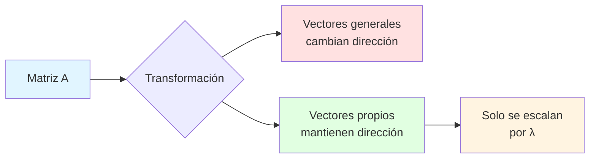
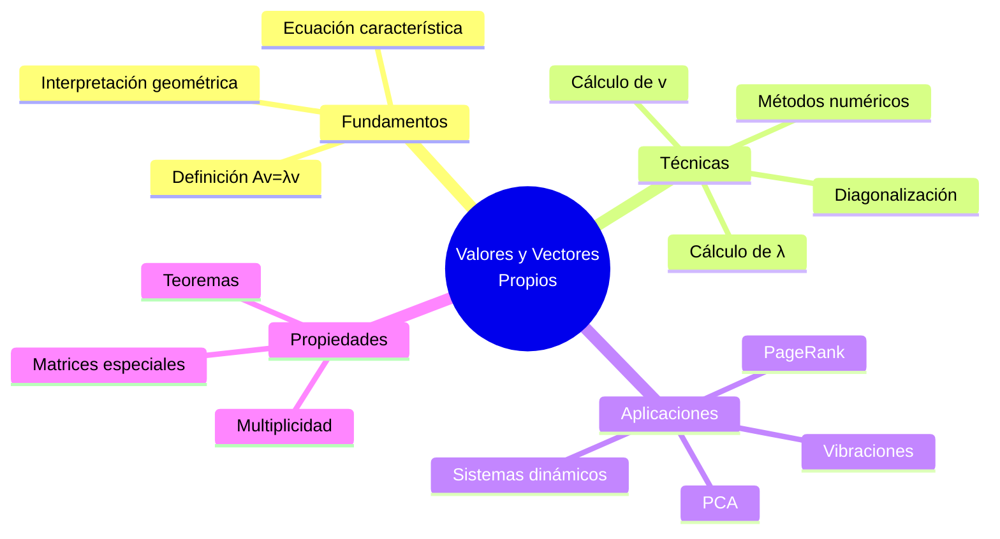
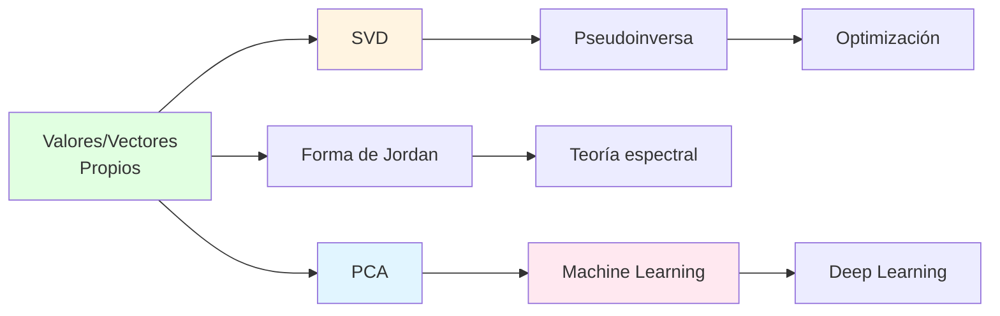

# 🎯 Valores y Vectores Propios en Álgebra Lineal

## 📚 Introducción

> [!info]- 💡 ¿Qué son los Valores y Vectores Propios?
> 
> Los **valores propios** (eigenvalues) y **vectores propios** (eigenvectors) son conceptos fundamentales en álgebra lineal que describen direcciones especiales en las que una transformación lineal actúa simplemente como un escalamiento.
> 
> **Analogía práctica:** Imagina una transformación que estira, rota y deforma el espacio. Los vectores propios son como "ejes de estabilidad" que solo se estiran o contraen (no cambian de dirección), y los valores propios nos dicen cuánto se estiran.
> 
> **Definición formal:**
> Para una matriz **A** de tamaño n×n, un vector no nulo **v** es un vector propio si:
> 
> $$A\vec{v} = \lambda\vec{v}$$
> 
> Donde:
> - **v** es el **vector propio** (eigenvector)
> - **λ** (lambda) es el **valor propio** (eigenvalue)
> - **A** es la matriz de transformación
> 
> **¿Por qué son importantes?**
> 
> | Aspecto | Descripción | Ejemplo de Uso |
> |---------|-------------|----------------|
> | **Simplificación** | Reducen problemas complejos | Diagonalización de matrices |
> | **Análisis de sistemas** | Estudian comportamiento a largo plazo | Estabilidad en ecuaciones diferenciales |
> | **Compresión de datos** | Identifican direcciones principales | PCA en machine learning |
> | **Vibraciones** | Modos naturales de oscilación | Análisis estructural, cuerdas |
> | **Ranking** | Importancia de elementos | PageRank de Google |



---

## 🎨 Interpretación Geométrica

### 📐 Visualización del Concepto

> [!example]- 🔍 ¿Qué Significa Geométricamente?
> 
> **Comparación visual de vectores:**
> 
> ```mermaid
> graph TD
>     A[Vector cualquiera] --> B[Transformación A]
>     B --> C[Cambia dirección<br/>Y magnitud]
>     
>     D[Vector propio] --> E[Transformación A]
>     E --> F[Solo cambia magnitud<br/>mantiene dirección]
>     
>     style C fill:#ffe1e1
>     style F fill:#e1ffe1
> ```
> 
> **Ejemplo concreto:**
> 
> Sea la matriz de transformación:
> $$A = \begin{pmatrix} 3 & 1 \\ 0 & 2 \end{pmatrix}$$
> 
> | Tipo de Vector | Vector Original | Después de A | Observación |
> |----------------|-----------------|--------------|-------------|
> | **General** | $\begin{pmatrix} 1 \\ 1 \end{pmatrix}$ | $\begin{pmatrix} 4 \\ 2 \end{pmatrix}$ | ❌ Cambió dirección |
> | **Propio (λ=3)** | $\begin{pmatrix} 1 \\ 0 \end{pmatrix}$ | $\begin{pmatrix} 3 \\ 0 \end{pmatrix}$ | ✓ Solo escaló 3x |
> | **Propio (λ=2)** | $\begin{pmatrix} 1 \\ -1 \end{pmatrix}$ | $\begin{pmatrix} 2 \\ -2 \end{pmatrix}$ | ✓ Solo escaló 2x |
> 
> **Representación gráfica:**
> 
> ```mermaid
> graph LR
>     A[Vector v] -->|Multiplicar por A| B{¿Es vector propio?}
>     B -->|No| C[Av cambia<br/>dirección y magnitud]
>     B -->|Sí| D[Av = λv<br/>solo escala]
>     
>     D --> E[λ > 1: estira]
>     D --> F[0 < λ < 1: contrae]
>     D --> G[λ < 0: invierte]
>     
>     style C fill:#ffe1e1
>     style D fill:#e1ffe1
>     style E fill:#ccffcc
>     style F fill:#fff4cc
>     style G fill:#ffcccc
> ```
> 
> **Casos especiales de valores propios:**
> 
> | Valor de λ | Efecto Geométrico | Interpretación |
> |------------|-------------------|----------------|
> | **λ > 1** | Estiramiento | Vector se alarga |
> | **λ = 1** | Sin cambio | Vector permanece igual |
> | **0 < λ < 1** | Contracción | Vector se acorta |
> | **λ = 0** | Colapso | Vector ↄ origen |
> | **λ < 0** | Inversión + escala | Vector apunta al lado opuesto |

---

## 🔢 Cálculo de Valores Propios

### 📝 Ecuación Característica

> [!note]- 🎯 Método para Encontrar λ
> 
> **Derivación de la ecuación característica:**
> 
> Partimos de la ecuación fundamental:
> $$A\vec{v} = \lambda\vec{v}$$
> 
> Reordenando:
> $$A\vec{v} - \lambda\vec{v} = \vec{0}$$
> $$(A - \lambda I)\vec{v} = \vec{0}$$
> 
> Donde **I** es la matriz identidad.
> 
> Para que existan soluciones no triviales (v ≄ 0):
> $$\det(A - \lambda I) = 0$$
> 
> Esta es la **ecuación característica**.
> 
> **Proceso paso a paso:**
> 
> ```mermaid
> flowchart TD
>     A[Matriz A] --> B[Formar A - λI]
>     B --> C[Calcular determinante]
>     C --> D[Igualar a cero]
>     D --> E[Resolver ecuación<br/>polinomial]
>     E --> F[Obtener valores propios λ]
>     
>     style A fill:#e1f5ff
>     style C fill:#fff4e1
>     style F fill:#e1ffe1
> ```
> 
> **Ejemplo detallado (2×2):**
> 
> Sea $A = \begin{pmatrix} 4 & 1 \\ 2 & 3 \end{pmatrix}$
> 
> **Paso 1:** Formar A - λI
> $$A - \lambda I = \begin{pmatrix} 4 & 1 \\ 2 & 3 \end{pmatrix} - \lambda\begin{pmatrix} 1 & 0 \\ 0 & 1 \end{pmatrix} = \begin{pmatrix} 4-\lambda & 1 \\ 2 & 3-\lambda \end{pmatrix}$$
> 
> **Paso 2:** Calcular determinante
> $$\det(A - \lambda I) = (4-\lambda)(3-\lambda) - (1)(2)$$
> $$= 12 - 4\lambda - 3\lambda + \lambda^2 - 2$$
> $$= \lambda^2 - 7\lambda + 10$$
> 
> **Paso 3:** Resolver ecuación característica
> $$\lambda^2 - 7\lambda + 10 = 0$$
> 
> Factorizando:
> $$(\lambda - 5)(\lambda - 2) = 0$$
> 
> **Soluciones:**
> $$\lambda_1 = 5, \quad \lambda_2 = 2$$
> 
> **Propiedades importantes:**
> 
> | Propiedad | Descripción | Fórmula |
> |-----------|-------------|---------|
> | **Grado** | El polinomio característico tiene grado n | Para matriz n×n |
> | **Raíces** | Hasta n valores propios | Pueden ser complejos o repetidos |
> | **Suma** | Suma de λ = traza de A | $\sum \lambda_i = \text{tr}(A)$ |
> | **Producto** | Producto de λ = det(A) | $\prod \lambda_i = \det(A)$ |

### 🧮 Ejemplos de Cálculo

> [!success]- 💪 Ejemplos Resueltos
> 
> **Ejemplo 1: Matriz 2×2 simple**
> 
> $$A = \begin{pmatrix} 5 & 3 \\ 1 & 3 \end{pmatrix}$$
> 
> ```
> Paso 1: A - λI
> ┄           ┄
> ┄ 5-λ   3   ┄
> ┄  1   3-λ  ┄
> ┄           ┄
> 
> Paso 2: Determinante
> (5-λ)(3-λ) - 3·1 = 0
> 15 - 5λ - 3λ + λ² - 3 = 0
> λ² - 8λ + 12 = 0
> 
> Paso 3: Resolver
> (λ - 6)(λ - 2) = 0
> 
> ✓ λ₄ = 6, λ₄ = 2
> ```
> 
> **Verificación de propiedades:**
> - Traza: 5 + 3 = 8 = λ₄ + λ₄ ✓
> - Determinante: 5·3 - 3·1 = 12 = λ₁·λ₂ ✓
> 
> ---
> 
> **Ejemplo 2: Matriz 3×3**
> 
> $$A = \begin{pmatrix} 2 & 1 & 0 \\ 0 & 2 & 0 \\ 0 & 0 & 3 \end{pmatrix}$$
> 
> ```
> Paso 1: A - λI
> ┄               ┄
> ┄ 2-λ   1    0  ┄
> ┄  0   2-λ   0  ┄
> ┄  0    0   3-λ ┄
> ┄               ┄
> 
> Paso 2: Determinante (expansión por tercera fila)
> det = (3-λ)[(2-λ)(2-λ) - 0]
>     = (3-λ)(2-λ)²
> 
> Paso 3: Resolver
> (3-λ)(2-λ)² = 0
> 
> ✓ λ₄ = 3 (multiplicidad 1)
> ✓ λ₄ = 2 (multiplicidad 2)
> ```
> 
> **Tabla resumen:**
> 
> | Matriz | Valores Propios | Multiplicidad | Tipo |
> |--------|-----------------|---------------|------|
> | Ejemplo 1 | 6, 2 | Simple (1, 1) | Distintos |
> | Ejemplo 2 | 3, 2, 2 | (1, 2) | Con repetición |
> 
> ---
> 
> **Ejemplo 3: Matriz diagonal**
> 
> $$A = \begin{pmatrix} 7 & 0 & 0 \\ 0 & -2 & 0 \\ 0 & 0 & 5 \end{pmatrix}$$
> 
> ```
> Propiedad especial: Para matrices DIAGONALES,
> los valores propios son los elementos de la diagonal.
> 
> ✓ λ₄ = 7, λ₄ = -2, λ₄ = 5
> 
> (No necesita cálculo!)
> ```
> 
> **Casos especiales:**
> 
> ```mermaid
> graph TD
>     A[Tipo de Matriz] --> B[Diagonal]
>     A --> C[Triangular]
>     A --> D[Simétrica]
>     
>     B --> E[λ = elementos<br/>diagonales]
>     C --> F[λ = elementos<br/>diagonales]
>     D --> G[λ siempre<br/>REALES]
>     
>     style E fill:#e1ffe1
>     style F fill:#e1ffe1
>     style G fill:#e1f5ff
> ```

---

## 🎯 Cálculo de Vectores Propios

### 🔍 Método de Solución

> [!tip]- 🛠︄ Encontrar Vectores Propios
> 
> **Una vez conocidos los valores propios λ:**
> 
> Para cada λ, resolver el sistema:
> $$(A - \lambda I)\vec{v} = \vec{0}$$
> 
> **Proceso algorítmico:**
> 
> ```mermaid
> flowchart TD
>     A[Valor propio λ conocido] --> B[Formar A - λI]
>     B --> C[Plantear sistema<br/>homogéneo]
>     C --> D[Reducir a forma<br/>escalonada]
>     D --> E[Identificar variables<br/>libres]
>     E --> F[Expresar solución<br/>general]
>     F --> G[Vector propio v]
>     
>     style A fill:#e1f5ff
>     style D fill:#fff4e1
>     style G fill:#e1ffe1
> ```
> 
> **Ejemplo completo:**
> 
> Usando $A = \begin{pmatrix} 4 & 1 \\ 2 & 3 \end{pmatrix}$ con λ = 5
> 
> **Paso 1:** Formar A - λI
> $$A - 5I = \begin{pmatrix} 4-5 & 1 \\ 2 & 3-5 \end{pmatrix} = \begin{pmatrix} -1 & 1 \\ 2 & -2 \end{pmatrix}$$
> 
> **Paso 2:** Plantear sistema
> $$\begin{pmatrix} -1 & 1 \\ 2 & -2 \end{pmatrix}\begin{pmatrix} v_1 \\ v_2 \end{pmatrix} = \begin{pmatrix} 0 \\ 0 \end{pmatrix}$$
> 
> Ecuaciones:
> ```
> -v₄ + v₄ = 0  ↄ  v₄ = v₄
>  2v₄ - 2v₄ = 0  ↄ  v₄ = v₄  (ecuación redundante)
> ```
> 
> **Paso 3:** Solución general
> $$\vec{v} = \begin{pmatrix} v_1 \\ v_1 \end{pmatrix} = v_1\begin{pmatrix} 1 \\ 1 \end{pmatrix}$$
> 
> Eligiendo v₄ = 1:
> $$\vec{v}_1 = \begin{pmatrix} 1 \\ 1 \end{pmatrix}$$
> 
> **Para λ₄ = 2:**
> 
> $$A - 2I = \begin{pmatrix} 2 & 1 \\ 2 & 1 \end{pmatrix}$$
> 
> ```
> 2v₄ + v₄ = 0  ↄ  v₄ = -2v₄
> 
> ✓ Vector propio: v₄ = [-1]
>                        [ 2]
> ```
> 
> **Verificación:**
> 
> | Verificar | Cálculo | Resultado |
> |-----------|---------|-----------|
> | λ₄ = 5 | $A\begin{pmatrix} 1 \\ 1 \end{pmatrix} = \begin{pmatrix} 5 \\ 5 \end{pmatrix} = 5\begin{pmatrix} 1 \\ 1 \end{pmatrix}$ | ✓ |
> | λ₄ = 2 | $A\begin{pmatrix} -1 \\ 2 \end{pmatrix} = \begin{pmatrix} -2 \\ 4 \end{pmatrix} = 2\begin{pmatrix} -1 \\ 2 \end{pmatrix}$ | ✓ |

### 🔄 Normalización y Base

> [!success]- 📏 Vectores Propios Normalizados
> 
> **¿Por qué normalizar?**
> 
> Los vectores propios tienen **infinitas** representaciones (cualquier múltiplo escalar). La normalización da una forma única y estándar.
> 
> **Fórmula de normalización:**
> $$\hat{v} = \frac{\vec{v}}{||\vec{v}||} = \frac{\vec{v}}{\sqrt{v_1^2 + v_2^2 + ... + v_n^2}}$$
> 
> **Ejemplo:**
> 
> Vector original: $\vec{v} = \begin{pmatrix} 3 \\ 4 \end{pmatrix}$
> 
> ```
**Paso 1: Calcular norma**
> 
> ||v|| = √(3² + 4²) = √(9 + 16) = √25 = 5
> 
> **Paso 2: Dividir cada componente**
> 
> v̂ = (1/5) [3] = [0.6] [4] [0.8]
> 
> **Verificación:** ||v̂|| = √(0.6² + 0.8²) = √1 = 1 ✓
> ```
> 
> **Propiedades de vectores propios:**
> 
> | Propiedad | Descripción | Ejemplo |
> |-----------|-------------|---------|
> | **Múltiplos** | cv también es vector propio | Si v, entonces 2v, -v, 0.5v... |
> | **Únicos salvo escala** | Definen una dirección | $\begin{pmatrix} 1 \\ 1 \end{pmatrix}$ = $\begin{pmatrix} 2 \\ 2 \end{pmatrix}$ (dirección) |
> | **Independencia** | Vectores propios de λ distintos son LI | Base del espacio |
> | **Ortogonalidad** | En matrices simétricas son perpendiculares | A = Aᵄ |
> 
> **Base de vectores propios:**
> 
> ```mermaid
> graph LR
>     A[Matriz A<br/>n×n] --> B{¿n vectores propios<br/>linealmente independientes?}
>     B -->|Sí| C[A es diagonalizable]
>     B -->|No| D[A no es diagonalizable]
>     
>     C --> E[Base de vectores<br/>propios]
>     E --> F[Representación<br/>simplificada]
>     
>     style C fill:#e1ffe1
>     style D fill:#ffe1e1
>     style F fill:#e1f5ff
> ```

---

## 🎓 Diagonalización

### 🔀 Concepto y Proceso

> [!info]- 🎯 ¿Qué es Diagonalizar?
> 
> **Diagonalizar** una matriz A significa encontrar matrices P y D tales que:
> $$A = PDP^{-1}$$
> 
> Donde:
> - **D** es diagonal (valores propios en la diagonal)
> - **P** tiene los vectores propios como columnas
> - **P⁻¹** es la inversa de P
> 
> **Equivalentemente:**
> $$D = P^{-1}AP$$
> 
> **Beneficios de la diagonalización:**
> 
> | Ventaja | Sin Diagonalizar | Diagonalizada |
> |---------|------------------|---------------|
> | **Potencias** | A¹⁰⁰ = A·A·A...·A (100 veces) | A¹⁰⁰ = PD¹⁰⁰P⁻¹ (fácil!) |
> | **Exponencial** | e^A (difícil) | e^A = Pe^DP⁻¹ |
> | **Comprensión** | Oscura | Clara (ejes propios) |
> | **Cálculos** | O(n³) por multiplicación | O(n) en diagonal |
> 
> **Visualización geométrica:**
> 
> ```mermaid
> graph LR
>     A[Espacio<br/>Original] -->|P⁻¹¹| B[Espacio de<br/>Vectores Propios]
>     B -->|D escala| C[Transformación<br/>Simple]
>     C -->|P| D[Vuelta al<br/>Espacio Original]
>     
>     A -.->|A transforma<br/>complicado| D
>     
>     style B fill:#e1ffe1
>     style C fill:#fff4e1
> ```
> 
> **Proceso de diagonalización:**
> 
> ```mermaid
> flowchart TD
>     A[Matriz A] --> B[Calcular valores<br/>propios λ]
>     B --> C[Calcular vectores<br/>propios v]
>     C --> D{¿n vectores LI?}
>     D -->|Sí| E[Formar matriz P<br/>columnas = vectores propios]
>     D -->|No| F[❌ No diagonalizable]
>     E --> G[Formar matriz D<br/>diagonal = λ]
>     G --> H[✓ A = PDP⁻¹¹]
>     
>     style D fill:#fff4e1
>     style F fill:#ffe1e1
>     style H fill:#e1ffe1
> ```

### 📊 Ejemplo Completo

> [!example]- 💡 Diagonalización Paso a Paso
> 
> **Matriz a diagonalizar:**
> $$A = \begin{pmatrix} 4 & 1 \\ 2 & 3 \end{pmatrix}$$
> 
> ---
> 
> **PASO 1: Valores propios** (ya calculados antes)
> 
> ```
> λ₄ = 5, λ₄ = 2
> ```
> 
> ---
> 
> **PASO 2: Vectores propios** (ya calculados)
> 
> ```
> Para λ₄ = 5: v₄ = [1]
>                    [1]
> 
> Para λ₄ = 2: v₄ = [-1]
>                    [ 2]
> ```
> 
> ---
> 
> **PASO 3: Formar matriz P**
> 
> Las columnas son los vectores propios:
> $$P = \begin{pmatrix} 1 & -1 \\ 1 & 2 \end{pmatrix}$$
> 
> ---
> 
> **PASO 4: Formar matriz D**
> 
> Diagonal con los valores propios:
> $$D = \begin{pmatrix} 5 & 0 \\ 0 & 2 \end{pmatrix}$$
> 
> ---
> 
> **PASO 5: Calcular P⁻¹**
> 
> Para matriz 2×2: $\begin{pmatrix} a & b \\ c & d \end{pmatrix}^{-1} = \frac{1}{ad-bc}\begin{pmatrix} d & -b \\ -c & a \end{pmatrix}$
> 
> ```
> det(P) = 1·2 - (-1)·1 = 2 + 1 = 3
> 
> P⁻¹ = (1/3)[  2   1 ]
>            [ -1   1 ]
> ```
> 
> ---
> 
> **PASO 6: Verificación**
> 
> Verificar que A = PDP⁻¹:
> 
> ```
> PD = [1  -1][5  0] = [ 5  -2]
>      [1   2][0  2]   [ 5   4]
> 
> PDP⁻¹ = [ 5  -2] · (1/3)[  2   1]
>         [ 5   4]        [ -1   1]
> 
>       = (1/3)[12   3] = [4  1] = A ✓
>              [ 6   9]   [2  3]
> ```
> 
> **Aplicación: Calcular A¹⁄**
> 
> ```
> Sin diagonalizar: A¹⁄ = A·A·A·A·A·A·A·A·A·A (tedioso)
> 
> Con diagonalización:
> A¹⁄ = PD¹⁰P⁻¹
> 
> D¹⁄ = [5¹⁄    0  ] = [9765625      0]
>       [ 0    2¹⁰]   [      0   1024]
> 
> A¹⁄ = P · D¹⁄ · P⁻¹  (solo 2 multiplicaciones!)
> ```

---

## 🌟 Aplicaciones Prácticas

### 📈 Sistemas Dinámicos

> [!success]- 🔄 Evolución de Sistemas
> 
> **Modelo general:**
> $$\vec{x}_{n+1} = A\vec{x}_n$$
> 
> Donde x_n es el estado en el paso n.
> 
> **Con diagonalización:**
> $$\vec{x}_n = A^n\vec{x}_0 = PD^nP^{-1}\vec{x}_0$$
> 
> **Ejemplo: Población de conejos y zorros**
> 
> Sistema:
> ```
> Conejos(n+1) = 0.8·Conejos(n) + 0.1·Zorros(n)
> Zorros(n+1)  = 0.2·Conejos(n) + 0.9·Zorros(n)
> ```
> 
> Matriz:
> $$A = \begin{pmatrix} 0.8 & 0.1 \\ 0.2 & 0.9 \end{pmatrix}$$
> 
> Valores propios: λ₄ = 1, λ₄ = 0.7
> 
> **Interpretación:**
> 
> | λ | Significado | Comportamiento |
> |---|-------------|----------------|
> | λ₄ = 1 | Modo estable | Población se estabiliza |
> | λ₄ = 0.7 | Modo decreciente | Oscilaciones se amortiguan |
> 
> A largo plazo (n→∞):
> - Solo importa el modo con λ = 1
> - Sistema converge a equilibrio
> 
> ```mermaid
> graph TD
>     A[Estado inicial] --> B[Aplicar A]
>     B --> C[Aplicar A]
>     C --> D[...]
>     D --> E[λ > 1: crece<br/>λ = 1: estable<br/>λ < 1: decrece]
>     
>     style E fill:#e1ffe1
> ```

### 🔬 Análisis de Componentes Principales (PCA)

> [!tip]- 📊 Reducción de Dimensionalidad
> 
> **Problema:** Datos en muchas dimensiones ↄ difícil visualizar y procesar
> 
> **Solución:** Encontrar las direcciones de mayor varianza (componentes principales)
> 
> **Proceso:**
> 
> ```mermaid
> flowchart LR
>     A[Datos originales<br/>n dimensiones] --> B[Calcular matriz<br/>de covarianza]
>     B --> C[Valores y vectores<br/>propios]
>     C --> D[Ordenar por<br/>λ decreciente]
>     D --> E[Seleccionar<br/>k componentes]
>     E --> F[Proyectar datos<br/>k dimensiones]
>     
>     style C fill:#e1ffe1
>     style F fill:#e1f5ff
> ```
> 
> **Ejemplo: Reducir de 3D a 2D**
> 
> | Paso | Acción | Resultado |
> |------|--------|-----------|
> | 1 | Datos originales (x, y, z) | 1000 puntos en R³ |
> | 2 | Matriz de covarianza 3×3 | Describe variabilidad |
> | 3 | Valores propios | λ₄=15, λ₄=8, λ₄=0.5 |
> | 4 | Interpretación | 87% varianza en PC1+PC2 |
> | 5 | Proyección | Datos en 2D (retiene 87% info) |
> 
> **Aplicaciones:**
> - 🖼︄ Compresión de imágenes
> - 🧬 Análisis de expresión genética
> - 💰 Análisis financiero (factores de riesgo)
> - 🎭 Reconocimiento facial

### 🏗︄ Ingeniería: Modos de Vibración

> [!example]- 🎵 Análisis Modal
> 
> **Problema:** Estructura vibrante (puente, edificio, guitarra)
> 
> **Modelo:**
> $$M\ddot{x} + Kx = 0$$
> 
> Donde:
> - **M** = matriz de masa
> - **K** = matriz de rigidez
> - **x** = desplazamiento
> 
> **Solución:**
> $$M^{-1}Kx = \omega^2x$$
> 
> Los valores propios λ = ω² dan las **frecuencias naturales**
> Los vectores propios dan los **modos de vibración**
> 
> **Ejemplo: Cuerda de guitarra**
> 
> ```mermaid
> graph TD
>     A[Sistema vibrante] --> B[Calcular eigenvalores<br/>de M⁻¹K]
>     B --> C[λ₄, λ₄, λ₄...]
>     C --> D[ω₄ = √λ₁<br/>Frecuencia fundamental]
>     C --> E[ω₄ = √λ₂<br/>Primer armónico]
>     
>     D --> F[Modo 1:<br/>~ sonido más grave]
>     E --> G[Modo 2:<br/>~ octava superior]
>     
>     style D fill:#e1ffe1
>     style E fill:#fff4e1
> ```
> 
> **Tabla de modos:**
> 
> | Modo | Frecuencia | Vector Propio | Forma Física |
> |------|-----------|---------------|--------------|
> | 1 | ω₄ | v₄ | ∄ (una onda) |
> | 2 | 2ω₄ | v₄ | ∿∿ (dos ondas) |
> | 3 | 3ω₄ | v₄ | ∿∿∄ (tres ondas) |
> 
> **Importancia en ingeniería:**
> - 🌉 Evitar resonancia en puentes
> - 🏢 Diseño antisísmico de edificios
> - ✈️ Análisis de alas de aviones
> - 🎸 Diseño de instrumentos musicales

### 🔍 Google PageRank

> [!info]- 🌐 El Algoritmo que Cambió Internet
> 
> **Problema:** ¿Cómo clasificar miles de millones de páginas web?
> 
> **Solución:** La importancia de una página es un **vector propio**
> 
> **Modelo matemático:**
> 
> Sea **A** la matriz de enlaces:
> - A[i][j] = 1/n si la página j enlaza a i (n = total de enlaces en j)
> - A[i][j] = 0 si no hay enlace
> 
> El **PageRank** es el vector propio correspondiente a λ = 1
> 
> **Ejemplo simplificado:**
> 
> ```mermaid
> graph LR
>     A[Página A] --> B[Página B]
>     B --> C[Página C]
>     C --> A
>     B --> A
>     
>     style A fill:#e1ffe1
>     style B fill:#fff4e1
>     style C fill:#e1f5ff
> ```
> 
> Matriz de enlaces:
> $$M = \begin{pmatrix} 0 & 0.5 & 1 \\ 1 & 0 & 0 \\ 0 & 0.5 & 0 \end{pmatrix}$$
> 
> ```
> Calcular vector propio para λ = 1:
> 
> PageRank = [0.4]  ↄ A tiene 40% importancia
>            [0.4]  ↄ B tiene 40% importancia
>            [0.2]  ↄ C tiene 20% importancia
> ```
> 
> **Interpretación:**
> - Páginas más enlazadas ↄ mayor valor propio ↄ mayor PageRank
> - Enlaces desde páginas importantes ↄ más valor
> - Es un proceso iterativo: x_{n+1} = Mx_n

---

## 🧮 Propiedades Importantes

### 📐 Teoremas Clave

> [!note]- 📚 Resultados Fundamentales
> 
> **1. Teorema de Diagonalización**
> 
> Una matriz n×n es diagonalizable ⟄ tiene n vectores propios linealmente independientes
> 
> **Condiciones suficientes:**
> 
> | Condición | Garantiza Diagonalización | Ejemplo |
> |-----------|---------------------------|---------|
> | **n valores propios distintos** | ✓ Sí | λ = {1, 2, 3, 4, 5} |
> | **Matriz simétrica** | ✓ Sí | A = Aᵄ |
> | **Matriz ortogonal** | ✓ Sí | AAᵄ = I |
> | **Valores propios repetidos** | ⚠️ Tal vez | Depende de mult. geométrica |
> 
> ---
> 
> **2. Propiedades de Matrices Simétricas**
> 
> Si A = Aᵄ (simétrica):
> 
> ```mermaid
> graph TD
>     A[Matriz Simétrica<br/>A = Aᵄ] --> B[λ siempre REALES]
>     A --> C[Vectores propios<br/>ORTOGONALES]
>     A --> D[SIEMPRE<br/>diagonalizable]
>     
>     C --> E[Podemos formar<br/>base ortonormal]
>     D --> F[A = QΛQᵄ<br/>Q ortogonal]
>     
>     style A fill:#e1f5ff
>     style B fill:#e1ffe1
>     style C fill:#e1ffe1
>     style D fill:#e1ffe1
> ```
> 
> **Ventajas:**
> - Q⁻ = Qᵄ (fácil de calcular)
> - Base ortonormal (geometría clara)
> - Computacionalmente eficiente
> 
> ---
> 
> **3. Traza y Determinante**
> 
> $$\text{tr}(A) = \sum_{i=1}^{n} a_{ii} = \sum_{i=1}^{n} \lambda_i$$
> 
> $$\det(A) = \prod_{i=1}^{n} \lambda_i$$
> 
> **Aplicaciones:**
> 
> | Uso | Fórmula | Utilidad |
> |-----|---------|----------|
> | **Verificación** | Suma λ = traza | Comprobar cálculos |
> | **Invertibilidad** | det ≄ 0 ⟄ ningún λ = 0 | Saber si existe A⁻ |
> | **Rango** | #(λ ≄ 0) = rango(A) | Dimensión de imagen |
> 
> **Ejemplo:**
> 
> $$A = \begin{pmatrix} 2 & 1 & 0 \\ 1 & 2 & 1 \\ 0 & 1 & 2 \end{pmatrix}$$
> 
> ```
> Traza: 2 + 2 + 2 = 6
> Determinante: 4
> 
> Si λ = {λ₄, λ₄, λ₃}:
> λ₄ + λ₄ + λ₄ = 6
> λ₄ · λ₄ · λ₄ = 4
> ```
> 
> ---
> 
> **4. Multiplicidad**
> 
> Existen dos tipos:
> 
> | Tipo | Definición | Ejemplo |
> |------|-----------|---------|
> | **Algebraica** | Veces que aparece λ en ec. característica | (λ-2)³ ↄ mult. 3 |
> | **Geométrica** | Dimensión del espacio propio | dim(ker(A-λI)) |
> 
> **Regla:** Multiplicidad geométrica ≄ Multiplicidad algebraica
> 
> ```mermaid
> graph TD
>     A[λ con multiplicidad m] --> B{Geométrica = Algebraica?}
>     B -->|Sí| C[✓ Diagonalizable<br/>en ese λ]
>     B -->|No| D[❌ Deficiente<br/>no diagonalizable]
>     
>     style C fill:#e1ffe1
>     style D fill:#ffe1e1
> ```

### 🔢 Casos Especiales

> [!success]- 🎯 Matrices con Propiedades Especiales
> 
> **1. Matrices Ortogonales (Q)**
> 
> Definición: QQᵄ = I (columnas ortonormales)
> 
> Propiedades de eigenvalores:
> - **|λ| = 1** (todos en el círculo unitario)
> - **Complejos en pares conjugados** si la matriz es real
> 
> ```
> Ejemplo: Matriz de rotación 90°
> Q = [ 0  -1]
>     [ 1   0]
> 
> Valores propios: λ = i, -i
> |λ| = ∄(0² + 1²) = 1 ✓
> ```
> 
> ---
> 
> **2. Matrices de Proyección (P)**
> 
> Definición: P² = P
> 
> Propiedades:
> - **λ ∄ {0, 1}** únicamente
> - **λ = 1:** vectores en el espacio de proyección
> - **λ = 0:** vectores en el espacio ortogonal
> 
> ```
> Ejemplo: Proyección sobre eje x
> P = [1  0]
>     [0  0]
> 
> λ₄ = 1 con v₄ = [1]  (eje x)
>                 [0]
> 
> λ₄ = 0 con v₄ = [0]  (eje y)
>                 [1]
> ```
> 
> ---
> 
> **3. Matrices de Markov**
> 
> Definición: Elementos ≄ 0, suma de columnas = 1
> 
> Propiedades:
> - **λ_max = 1** siempre
> - **|λ| ≄ 1** para todos
> - Vector propio con λ=1 es **distribución estacionaria**
> 
> ```
> Ejemplo: Transiciones de clima
> M = [0.8  0.3]  (sol ↄ sol: 80%, lluvia ↄ sol: 30%)
>     [0.2  0.7]  (sol ↄ lluvia: 20%, lluvia ↄ lluvia: 70%)
> 
> λ = 1 con v = [0.6]  ↄ Estado estacionario:
>               [0.4]     60% días sol, 40% lluvia
> ```
> 
> ---
> 
> **4. Matrices Definidas Positivas**
> 
> Definición: xᵄAx > 0 para todo x ≄ 0
> 
> Propiedades:
> - **λ > 0** (todos positivos)
> - **Siempre invertible** (det > 0)
> - **Importante en optimización**
> 
> | Tipo | Condición λ | Forma Cuadrática |
> |------|-------------|------------------|
> | Definida positiva | λ > 0 | Mínimo |
> | Definida negativa | λ < 0 | Máximo |
> | Indefinida | λ mixtos | Punto silla |
> 
> **Resumen comparativo:**
> 
> ```mermaid
> graph TD
>     A[Tipo de Matriz] --> B[Ortogonal<br/>|λ|=1]
>     A --> C[Proyección<br/>λ ∄ {0,1}]
>     A --> D[Markov<br/>λ_max=1]
>     A --> E[Def. Positiva<br/>λ>0]
>     
>     style B fill:#e1f5ff
>     style C fill:#e1ffe1
>     style D fill:#fff4e1
>     style E fill:#ffe8f0
> ```

---

## 💻 Métodos Computacionales

### 🔢 Método de las Potencias

> [!tip]- ⚄ Algoritmo Iterativo para λ_max
> 
> **Objetivo:** Encontrar el valor propio de mayor magnitud
> 
> **Algoritmo:**
> 
> ```
> 1. Comenzar con vector aleatorio x₄ (normalizado)
> 2. Repetir:
>    - x_{k+1} = Ax_k
>    - Normalizar: x_{k+1} = x_{k+1}/||x_{k+1}||
>    - Calcular: λ ≄ x_k^T A x_k
> 3. Hasta convergencia
> ```
> 
> **Pseudocódigo:**
> 
> ```python
> def metodo_potencias(A, tolerancia=1e-6, max_iter=1000):
>     n = len(A)
>     # Vector inicial aleatorio
>     x = [1.0] * n
>     x = normalizar(x)
>     
>     for i in range(max_iter):
>         # Multiplicar A*x
>         x_nuevo = multiplicar_matriz_vector(A, x)
>         
>         # Estimar valor propio
>         lambda_nuevo = producto_punto(x, x_nuevo)
>         
>         # Normalizar
>         x_nuevo = normalizar(x_nuevo)
>         
>         # Verificar convergencia
>         if distancia(x, x_nuevo) < tolerancia:
>             return lambda_nuevo, x_nuevo
>             
>         x = x_nuevo
>     
>     return lambda_nuevo, x
> ```
> 
> **Ejemplo numérico:**
> 
> $$A = \begin{pmatrix} 4 & 1 \\ 2 & 3 \end{pmatrix}$$
> 
> | Iteración | x_k | ||Ax_k|| | λ estimado |
> |-----------|-----|----------|------------|
> | 0 | [1, 1] | - | - |
> | 1 | [0.707, 0.707] | 5.0 | 4.5 |
> | 2 | [0.745, 0.667] | 5.2 | 4.8 |
> | 3 | [0.754, 0.657] | 5.1 | 4.95 |
> | ... | ... | ... | ... |
> | 10 | [0.707, 0.707] | 5.0 | 5.0 ✓ |
> 
> **Convergencia:**
> 
> ```mermaid
> graph LR
>     A[Vector inicial<br/>aleatorio] --> B[Aplicar A<br/>repetidamente]
>     B --> C[Vector se alinea<br/>con v_max]
>     C --> D[Converge a<br/>λ_max]
>     
>     style C fill:#fff4e1
>     style D fill:#e1ffe1
> ```
> 
> **Limitaciones:**
> - Solo encuentra λ de **mayor magnitud**
> - No funciona si |λ₁| = |λ₂|
> - Convergencia lenta si λ₄ ≄ λ₄

### 🎯 Método QR

> [!example]- 🔄 Algoritmo Avanzado para Todos los λ
> 
> **Idea:** Descomponer A = QR iterativamente
> 
> **Algoritmo:**
> 
> ```
> A₄ = A
> Para k = 1, 2, 3, ...
>   1. Factorizar: A_k = Q_k R_k
>   2. Recomponer: A_{k+1} = R_k Q_k
> 
> A_k converge a forma triangular superior
> Diagonal ↄ valores propios
> ```
> 
> **Proceso visual:**
> 
> ```mermaid
> flowchart TD
>     A[A₄ = A] --> B[Descomponer<br/>A₄ = Q₄R₄]
>     B --> C[Recomponer<br/>A₄ = R₄Q₄]
>     C --> D[Descomponer<br/>A₄ = Q₁R₁]
>     D --> E[Recomponer<br/>A₄ = R₁Q₁]
>     E --> F[...]
>     F --> G[A_∄ ≄ matriz<br/>triangular superior]
>     G --> H[Diagonal =<br/>valores propios]
>     
>     style G fill:#fff4e1
>     style H fill:#e1ffe1
> ```
> 
> **Ventajas sobre Método de Potencias:**
> 
> | Característica | Potencias | QR |
> |----------------|-----------|-----|
> | **Todos los λ** | ❌ Solo λ_max | ✓ Sí |
> | **Velocidad** | Lenta | Rápida |
> | **Estabilidad** | Media | Excelente |
> | **Complejidad** | Simple | Compleja |
> | **Uso profesional** | Casos simples | Producción |
> 
> **Ejemplo:**
> 
> $$A = \begin{pmatrix} 4 & 1 \\ 2 & 3 \end{pmatrix}$$
> 
> ```
> Iteración 0: A₄ = [4  1]
>                   [2  3]
> 
> Iteración 5: A₄ ≄ [4.98  0.15]
>                   [0.02  2.01]
> 
> Iteración 10: A₁₀ ≄ [5.00  0.01]
>                     [0.00  2.00]
> 
> ✓ Valores propios: λ₄ = 5, λ₄ = 2
> ```

### 💾 Software y Librerías

> [!info]- 🛠︄ Herramientas Profesionales
> 
> **Python - NumPy/SciPy:**
> 
> ```python
> import numpy as np
> from scipy import linalg
> 
> # Definir matriz
> A = np.array([[4, 1],
>               [2, 3]])
> 
> # Método 1: NumPy (usa LAPACK)
> eigenvalues, eigenvectors = np.linalg.eig(A)
> 
> print("Valores propios:", eigenvalues)
> print("Vectores propios:\n", eigenvectors)
> 
> # Método 2: Solo valores propios (más rápido)
> eigenvalues = np.linalg.eigvals(A)
> 
> # Para matrices simétricas (más eficiente)
> if np.allclose(A, A.T):
>     eigenvalues, eigenvectors = np.linalg.eigh(A)
> 
> # Verificación
> for i in range(len(eigenvalues)):
>     v = eigenvectors[:, i]
>     lambda_i = eigenvalues[i]
>     print(f"A*v = {A @ v}")
>     print(f"λ*v = {lambda_i * v}")
> ```
> 
> **MATLAB:**
> 
> ```matlab
> % Definir matriz
> A = [4 1; 2 3];
> 
> % Calcular valores y vectores propios
> [V, D] = eig(A);
> 
> % V = matriz de vectores propios
> % D = matriz diagonal de valores propios
> 
> disp('Valores propios:');
> disp(diag(D));
> 
> disp('Vectores propios:');
> disp(V);
> 
> % Para matrices simétricas
> if issymmetric(A)
>     [V, D] = eig(A, 'vector');  % Más eficiente
> end
> ```
> 
> **Julia:**
> 
> ```julia
> using LinearAlgebra
> 
> # Definir matriz
> A = [4 1; 2 3]
> 
> # Calcular eigenvalores y eigenvectores
> eigenvalues = eigvals(A)
> eigenvectors = eigvecs(A)
> 
> # O ambos a la vez
> F = eigen(A)
> println("λ = ", F.values)
> println("v = ", F.vectors)
> 
> # Para matrices simétricas (Hermitian)
> if ishermitian(A)
>     F = eigen(Hermitian(A))  # Más eficiente
> end
> ```
> 
> **Comparación de rendimiento:**
> 
> | Librería | Velocidad | Precisión | Facilidad de uso |
> |----------|-----------|-----------|------------------|
> | **NumPy** | ⭐⭐⭐⭐ | ⭐⭐⭐⭐⭄ | ⭐⭐⭐⭐⭄ |
> | **MATLAB** | ⭐⭐⭐⭐⭄ | ⭐⭐⭐⭐⭄ | ⭐⭐⭐⭐ |
> | **Julia** | ⭐⭐⭐⭐⭄ | ⭐⭐⭐⭐⭄ | ⭐⭐⭐⭐ |
> | **R** | ⭐⭐⭄ | ⭐⭐⭐⭐ | ⭐⭐⭐⭐ |
> 
> **Todas usan LAPACK internamente** (algoritmos optimizados de álgebra lineal)

---

## 🎓 Ejercicios Guiados

> [!example]- 💪 Práctica con Ejemplos

### **Nivel Básico:**

**Ejercicio 1: Matriz 2×2**

```
Dada A = [3  1]
         [0  2]

a) Calcular valores propios
b) Encontrar vectores propios
c) Verificar Av = λv
```

**Solución:**

```
Paso 1: Ecuación característica
det(A - λI) = det[3-λ   1 ] = 0
                [  0  2-λ]

(3-λ)(2-λ) - 0 = 0
6 - 3λ - 2λ + λ² = 0
λ² - 5λ + 6 = 0
(λ-3)(λ-2) = 0

✓ λ₄ = 3, λ₄ = 2

Paso 2: Vectores propios

Para λ₄ = 3:
[3-3   1][v₁] = [0]  ↄ  [0  1][v₁] = [0]
[  0  2-3][v₂]   [0]     [0 -1][v₂]   [0]

v₄ = 0, v₄ libre
✓ v₄ = [1]
        [0]

Para λ₄ = 2:
[3-2   1][v₁] = [0]  ↄ  [1  1][v₁] = [0]
[  0  2-2][v₂]   [0]     [0  0][v₂]   [0]

v₄ + v₄ = 0  ↄ  v₄ = -v₄
✓ v₄ = [ 1]
        [-1]

Paso 3: Verificación
A·v₄ = [3  1][1] = [3] = 3[1] ✓
       [0  2][0]   [0]    [0]

A·v₄ = [3  1][ 1] = [ 2] = 2[ 1] ✓
       [0  2][-1]   [-2]    [-1]
```

---

**Ejercicio 2: Matriz simétrica 2×2**

```
Dada A = [5  2]
         [2  2]

a) Verificar que es simétrica
b) Calcular valores propios
c) Verificar que vectores son ortogonales
```

**Solución:**

```
Paso 1: Verificar simetría
Aᵄ = [5  2] = A ✓ Es simétrica
     [2  2]

Paso 2: Valores propios
det[5-λ   2 ] = 0
   [  2  2-λ]

(5-λ)(2-λ) - 4 = 0
10 - 5λ - 2λ + λ² - 4 = 0
λ² - 7λ + 6 = 0

✓ λ₄ = 6, λ₄ = 1

Paso 3: Vectores propios
Para λ₄ = 6:
[-1   2][v₁] = [0]  ↄ  v₄ = 0.5v₄
[  2  -4][v₂]   [0]

v₄ = [2]  (o normalizado: [0.894])
     [1]                   [0.447])

Para λ₄ = 1:
[4   2][v₁] = [0]  ↄ  v₄ = -2v₄
[2   1][v₂]   [0]

v₄ = [ 1]  (o normalizado: [ 0.447])
     [-2]                   [-0.894])

Paso 4: Verificar ortogonalidad
v₄ · v₄ = 2·1 + 1·(-2) = 2 - 2 = 0 ✓
```

---

### **Nivel Intermedio:**

**Ejercicio 3: Diagonalización completa**

```
Dada A = [1  2]
         [2  1]

a) Calcular valores y vectores propios
b) Formar matrices P y D
c) Verificar A = PDP⁻¹
d) Calcular A⁄ usando diagonalización
```

**Solución:**

```
a) Valores y vectores propios:

det[1-λ   2 ] = 0
   [  2  1-λ]

(1-λ)² - 4 = 0
λ² - 2λ - 3 = 0
(λ-3)(λ+1) = 0

λ₄ = 3, λ₄ = -1

Para λ₄ = 3: v₄ = [1]
                  [1]

Para λ₄ = -1: v₄ = [ 1]
                   [-1]

b) Formar P y D:

P = [1   1]     D = [3   0]
    [1  -1]         [0  -1]

c) Calcular P⁻¹:

det(P) = -1 - 1 = -2

P⁻¹ = -1/2[-1  -1] = [ 0.5   0.5]
          [-1   1]   [ 0.5  -0.5]

Verificar PDP⁻¹:
PD = [1   1][3   0] = [3  -1]
     [1  -1][0  -1]   [3   1]

PDP⁻¹ = [3  -1][ 0.5   0.5]
        [3   1][ 0.5  -0.5]
      
      = [1  2] = A ✓
        [2  1]

d) Calcular A⁄:

A⁄ = PD⁵P⁻¹

D⁄ = [3⁄    0 ] = [243    0]
     [ 0  (-1)⁵]   [  0   -1]

A⁄ = [1   1][243    0][ 0.5   0.5]
     [1  -1][  0   -1][ 0.5  -0.5]

   = [1   1][121.5  121.5]
     [1  -1][121.5 -121.5]

   = [121  122]
     [122  121]

Verificación (opcional):
A² = [5  4]    A³ = [13  14]    ...
     [4  5]         [14  13]
```

---

### **Nivel Avanzado:**

**Ejercicio 4: Aplicación a sistema dinámico**

```
Sistema de población:
x_{n+1} = Ax_n

Donde A = [0.7  0.2]
          [0.3  0.8]

Estado inicial: x₄ = [100]  (100 en región 1, 50 en región 2)
                     [ 50]

a) Encontrar valores y vectores propios
b) Estado a largo plazo (n→∞)
c) Estado después de 10 iteraciones
```

**Solución:**

```
a) Valores propios:

det[0.7-λ   0.2 ] = 0
   [ 0.3  0.8-λ]

(0.7-λ)(0.8-λ) - 0.06 = 0
0.56 - 0.7λ - 0.8λ + λ² - 0.06 = 0
λ² - 1.5λ + 0.5 = 0

λ = (1.5 ± ∄(2.25 - 2))/2
λ = (1.5 ± 0.5)/2

✓ λ₄ = 1, λ₄ = 0.5

Vectores propios:
Para λ₄ = 1: v₄ = [2]
                  [3]

Para λ₄ = 0.5: v₄ = [ 1]
                    [-1]

b) Estado a largo plazo:

Como λ₄ = 1, el sistema converge al vector propio v₄.

x_∄ = c·[2]  donde c se determina por conservación
         [3]

Total población: 100 + 50 = 150

2c+ 3c = 150  ↄ  c = 30

✓ x_∄ = [60]  (40% en región 1, 60% en región 2)
         [90]

c) Estado después de 10 iteraciones:

Método 1 (directo): Calcular A¹⁰·x₄
Método 2 (diagonalización):

x₄ en base de vectores propios:
x₄ = α₁v₄ + α₂v₄

[100] = α₁[2] + α₂[ 1]
[ 50]      [3]     [-1]

Resolviendo: α₄ = 30, α₄ = 40

x₁₀ = α₁λ₁¹⁰v₄ + α₂λ₂¹⁰v₄
    = 30·1¹⁰·v₄ + 40·(0.5)¹⁰·v₄
    = 30v₄ + 40·0.00098·v₄
    ≄ 30v₄  (el término con λ₄ es despreciable)

✓ x₁₀ ≄ [60]
         [90]

(Ya prácticamente en equilibrio!)
```

---

## 📊 Resumen Visual Completo

### Mapa Conceptual General

```mermaid
mindmap
  root((Valores y Vectores<br/>Propios))
    Definición
      Av = λv
      λ: valor propio
      v: vector propio
      Ecuación característica
    Cálculo
      det(A - λI) = 0
      Resolver para λ
      Encontrar v para cada λ
      Normalización
    Diagonalización
      A = PDP⁻¹
      P: vectores propios
      D: valores propios
      Simplifica potencias
    Aplicaciones
      Sistemas dinámicos
      PCA
      PageRank
      Vibraciones
      Estabilidad
    Propiedades
      Matrices simétricas
      Traza y determinante
      Ortogonalidad
      Multiplicidad
```

### Tabla Resumen Completa

> [!success]- 📋 Referencia Rápida

| Concepto | Fórmula/Definición | Interpretación |
|----------|-------------------|----------------|
| **Vector propio** | $A\vec{v} = \lambda\vec{v}$ | Dirección que solo escala |
| **Valor propio** | $\det(A - \lambda I) = 0$ | Factor de escalamiento |
| **Ecuación característica** | Polinomio de grado n | Raíces = valores propios |
| **Diagonalización** | $A = PDP^{-1}$ | Representación simplificada |
| **Traza** | $\text{tr}(A) = \sum \lambda_i$ | Suma de valores propios |
| **Determinante** | $\det(A) = \prod \lambda_i$ | Producto de valores propios |
| **Matriz simétrica** | $A = A^T$ | λ reales, v ortogonales |
| **Multiplicidad algebraica** | Orden en polinomio | Repeticiones de λ |
| **Multiplicidad geométrica** | dim(espacio propio) | Vectores LI para λ |

### Flowchart de Resolución

```mermaid
flowchart TD
    A[Problema con matriz A] --> B{¿Qué necesitas?}
    
    B -->|Valores propios| C[Calcular det(A-λI)=0]
    B -->|Vectores propios| D[Ya tienes λ?]
    B -->|Diagonalizar| E[Necesitas λ y v]
    B -->|Aplicación| F[Identificar tipo]
    
    C --> G[Resolver polinomio]
    G --> H[✓ Valores propios λ]
    
    D -->|No| C
    D -->|Sí| I[Resolver (A-λI)v=0]
    I --> J[✓ Vectores propios v]
    
    E --> C
    E --> I
    J --> K[Formar P y D]
    K --> L[Calcular P⁻¹¹]
    L --> M[✓ A = PDP⁻¹¹]
    
    F --> N[Sistema dinámico]
    F --> O[PCA]
    F --> P[Vibraciones]
    
    style H fill:#e1ffe1
    style J fill:#e1ffe1
    style M fill:#e1ffe1
```

---

## 🎯 Casos Comunes y Atajos

> [!tip]- ⚄ Trucos para Resolver Más Rápido

**1. Matrices 2×2**

Para $A = \begin{pmatrix} a & b \\ c & d \end{pmatrix}$:

```
Valores propios:
λ = (traza ± ∄(traza² - 4·det)) / 2
  = ((a+d) ± ∄((a+d)² - 4(ad-bc))) / 2

Atajo si b=c (simétrica):
λ₄ = (a+d)/2 + ∄((a-d)² + 4b²)/2
λ₄ = (a+d)/2 - ∄((a-d)² + 4b²)/2
```

**2. Matrices Diagonales**

```
Si A = [a₄  0   0 ]
       [ 0  a₄  0 ]
       [ 0   0  a₃]

¡Los valores propios SON la diagonal!
λ₄ = a₄, λ₄ = a₄, λ₄ = a₄

Vectores propios = vectores canónicos
v₄ = [1,0,0], v₄ = [0,1,0], v₄ = [0,0,1]
```

**3. Matrices Triangulares**

```
Si A = [a₄  *   * ]
       [ 0  a₄  * ]
       [ 0   0  a₃]

Los valores propios también son la diagonal!
λ₄ = a₄, λ₄ = a₄, λ₄ = a₄
```

**4. Verificaciones Rápidas**

| Verificar | Fórmula | Uso |
|-----------|---------|-----|
| **Suma correcta** | $\sum \lambda_i = \text{tr}(A)$ | Detectar errores |
| **Producto correcto** | $\prod \lambda_i = \det(A)$ | Confirmar cálculos |
| **Vector válido** | $A\vec{v} = \lambda\vec{v}$ | Verificación final |
| **Invertibilidad** | $\lambda_i \neq 0$ para todo i | A invertible ⟄ det≄0 |

---

## 🔗 Conexión con Próximos Temas

> [!quote]- 🌟 Continuando el Aprendizaje

**Has dominado:**



**Progresión natural del aprendizaje:**

| Nivel | Tema | Por qué es el siguiente paso |
|-------|------|------------------------------|
| **Actual** | Valores y vectores propios | Base de transformaciones |
| **Siguiente** | Descomposición en valores singulares (SVD) | Generalización para matrices no cuadradas |
| **Avanzado** | Formas canónicas de Jordan | Cuando no es diagonalizable |
| **Aplicado** | Análisis espectral | Señales y frecuencias |
| **Numérico** | Algoritmos de Krylov | Matrices muy grandes |
| **Profesional** | Tensores y multilineal | Machine learning avanzado |

**Roadmap de evolución:**



---

**Tags:** #algebra-lineal #valores-propios #vectores-propios #eigenvalues #eigenvectors #diagonalización #matrices #transformaciones-lineales #pca #aplicaciones #mermaid #diagramas