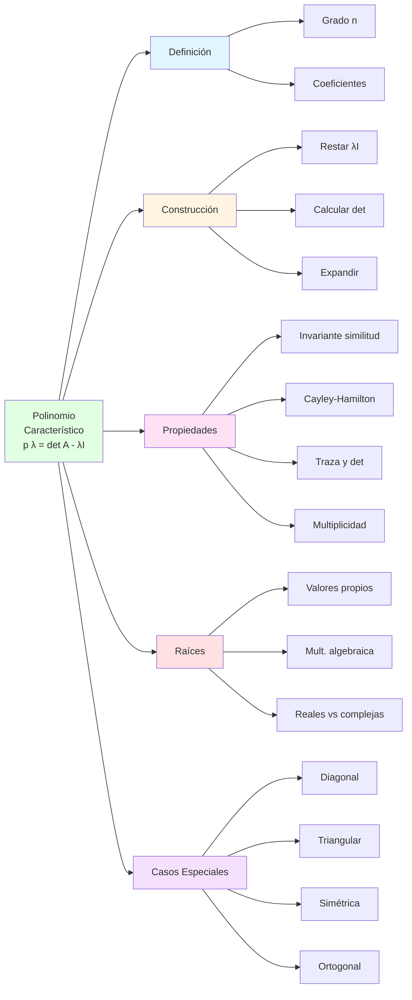
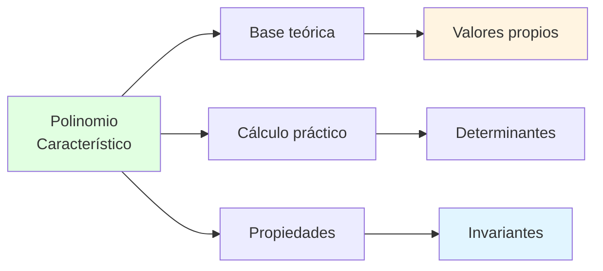
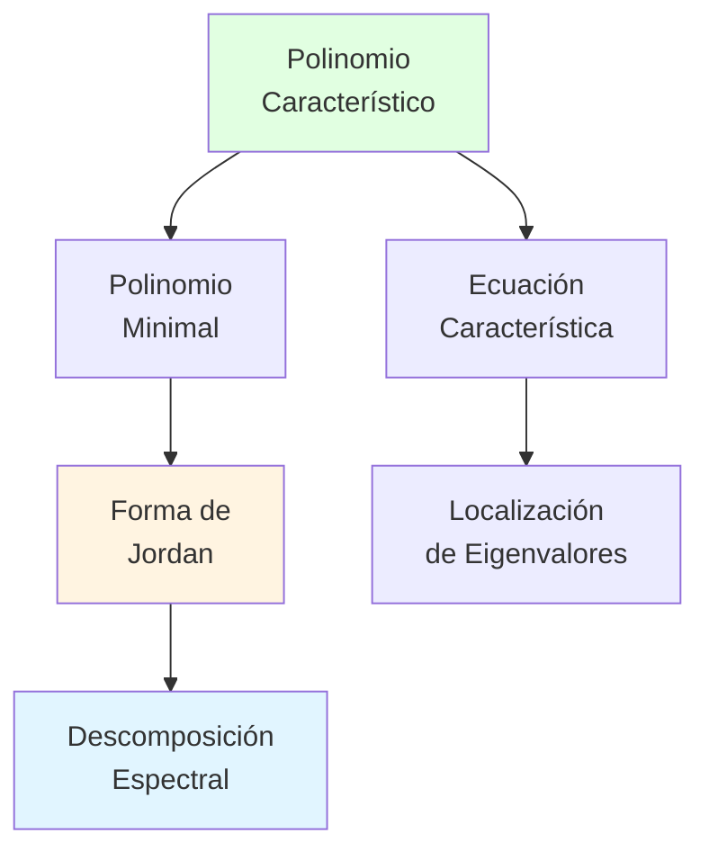

# 🎯 Polinomio Característico

## 📚 Introducción

> [!info]- 💡 ¿Qué es el Polinomio Característico?
> 
> El **polinomio característico** es una función polinomial asociada a una matriz que codifica información fundamental sobre sus valores propios y su estructura algebraica.
> 
> **Analogía práctica:** Imagina el polinomio característico como el "código genético" de una matriz. Así como el ADN contiene toda la información sobre un organismo, el polinomio característico contiene información esencial sobre el comportamiento de la transformación lineal.
> 
> **Definición formal:**
> 
> Para una matriz **A** de tamaño n×n, el polinomio característico es:
> $$p(\lambda) = \det(A - \lambda I)$$
> 
> Donde:
> - **λ** es la variable (indeterminada)
> - **I** es la matriz identidad n×n
> - **det** denota el determinante
> 
> **¿Por qué es importante?**
> 
> | Aspecto | Descripción | Importancia |
> |---------|-------------|-------------|
> | **Valores propios** | Sus raíces son los eigenvalores | Fundamental para diagonalización |
> | **Invariante** | No cambia con cambio de base | Característica intrínseca de A |
> | **Información estructural** | Grado, coeficientes tienen significado | Traza, determinante, rango |
> | **Clasificación** | Distingue matrices similares | Teoría de matrices |
> | **Herramienta computacional** | Base para algoritmos numéricos | Cálculo práctico |


---

## 🔍 Construcción del Polinomio Característico

### 📐 Proceso de Formación

> [!example]- 🛠️ ¿Cómo se Construye?
> 
> **Pasos fundamentales:**
> 
> ```mermaid
> flowchart TD
>     A[Matriz A<br/>n×n] --> B[Restar λI<br/>de A]
>     B --> C[A - λI<br/>matriz con λ]
>     C --> D[Calcular<br/>determinante]
>     D --> E[Expandir<br/>expresión]
>     E --> F["p(λ)<br/>polinomio de grado n"]
>     
>     style A fill:#e1f5ff
>     style C fill:#fff4e1
>     style F fill:#e1ffe1
> ```
> 
> **Ejemplo detallado para matriz 2×2:**
> 
> Sea $A = \begin{pmatrix} 3 & 1 \\ 2 & 4 \end{pmatrix}$
> 
> **Paso 1:** Formar A - λI
> 
> $$A - \lambda I = \begin{pmatrix} 3 & 1 \\ 2 & 4 \end{pmatrix} - \lambda\begin{pmatrix} 1 & 0 \\ 0 & 1 \end{pmatrix}$$
> 
> $$= \begin{pmatrix} 3 & 1 \\ 2 & 4 \end{pmatrix} - \begin{pmatrix} \lambda & 0 \\ 0 & \lambda \end{pmatrix}$$
> 
> $$= \begin{pmatrix} 3-\lambda & 1 \\ 2 & 4-\lambda \end{pmatrix}$$
> 
> **Paso 2:** Calcular determinante
> 
> Para matriz 2×2: $\det\begin{pmatrix} a & b \\ c & d \end{pmatrix} = ad - bc$
> 
> $$p(\lambda) = \det(A - \lambda I) = (3-\lambda)(4-\lambda) - (1)(2)$$
> 
> **Paso 3:** Expandir
> 
> $$= 12 - 3\lambda - 4\lambda + \lambda^2 - 2$$
> $$= \lambda^2 - 7\lambda + 10$$
> 
> **Resultado:**
> $$\boxed{p(\lambda) = \lambda^2 - 7\lambda + 10}$$
> 
> **Forma general 2×2:**
> 
> Para $A = \begin{pmatrix} a & b \\ c & d \end{pmatrix}$:
> 
> $$p(\lambda) = \lambda^2 - (a+d)\lambda + (ad-bc)$$
> $$= \lambda^2 - \text{tr}(A)\lambda + \det(A)$$
> 
> | Término | Coeficiente | Significado |
> |---------|-------------|-------------|
> | $\lambda^2$ | 1 | Término principal |
> | $\lambda^1$ | $-(a+d)$ | Negativo de la traza |
> | $\lambda^0$ | $ad-bc$ | Determinante |

### 🎨 Ejemplos de Construcción

> [!success]- 📝 Casos Ilustrativos
> 
> **Ejemplo 1: Matriz diagonal**
> 
> $$A = \begin{pmatrix} 5 & 0 \\ 0 & 3 \end{pmatrix}$$
> 
> ```
> Paso 1: A - λI
> [5-λ    0  ]
> [ 0    3-λ ]
> 
> Paso 2: Determinante
> p(λ) = (5-λ)(3-λ) - 0
>      = (5-λ)(3-λ)
> 
> Paso 3: Expandir
> p(λ) = 15 - 5λ - 3λ + λ²
>      = λ² - 8λ + 15
> 
> Forma factorizada:
> p(λ) = (λ-5)(λ-3)
> 
> ✅ Raíces evidentes: λ₁ = 5, λ₂ = 3
> ```
> 
> **Observación:** Para matrices diagonales, el polinomio característico es el producto de (λ - aᵢᵢ)
> 
> ---
> 
> **Ejemplo 2: Matriz simétrica**
> 
> $$A = \begin{pmatrix} 2 & 1 \\ 1 & 2 \end{pmatrix}$$
> 
> ```
> A - λI = [2-λ   1  ]
>          [ 1   2-λ ]
> 
> p(λ) = (2-λ)² - 1
>      = 4 - 4λ + λ² - 1
>      = λ² - 4λ + 3
>      = (λ-3)(λ-1)
> 
> ✅ λ₁ = 3, λ₂ = 1
> ```
> 
> ---
> 
> **Ejemplo 3: Matriz con ceros**
> 
> $$A = \begin{pmatrix} 4 & 2 \\ 0 & 1 \end{pmatrix}$$
> 
> ```
> A - λI = [4-λ   2  ]
>          [ 0   1-λ ]
> 
> p(λ) = (4-λ)(1-λ) - 0
>      = (4-λ)(1-λ)
>      = λ² - 5λ + 4
> 
> Verificación:
> Traza: 4 + 1 = 5 ✅
> Det: 4·1 - 2·0 = 4 ✅
> 
> p(λ) = (λ-4)(λ-1)
> ✅ λ₁ = 4, λ₂ = 1
> ```
> 
> **Comparación de formas:**
> 
> | Tipo de Matriz | Forma p(λ) | Característica |
> |----------------|------------|----------------|
> | **Diagonal** | $\prod(a_{ii} - \lambda)$ | Factorizado directamente |
> | **Triangular** | $\prod(a_{ii} - \lambda)$ | Igual que diagonal |
> | **Simétrica** | Coef. reales | Raíces reales garantizadas |
> | **General** | Expandir determinante | Puede tener raíces complejas |

---

## 📊 Estructura del Polinomio Característico

### 🔢 Forma General

> [!note]- 📐 Expresión Estándar
> 
> Para una matriz A de orden n×n, el polinomio característico tiene la forma:
> 
> $$p(\lambda) = \det(A - \lambda I) = (-1)^n\lambda^n + c_{n-1}\lambda^{n-1} + \cdots + c_1\lambda + c_0$$
> 
> **Propiedades estructurales:**
> 
> | Componente | Expresión | Significado Geométrico |
> |------------|-----------|------------------------|
> | **Grado** | n | Dimensión de la matriz |
> | **Coef. líder** | $(-1)^n$ | Siempre ±1 |
> | **Coef. $\lambda^{n-1}$** | $(-1)^{n-1}\text{tr}(A)$ | Relacionado con la traza |
> | **Término independiente** | $\det(A)$ | Determinante de A |
> | **Raíces** | $\lambda_1, \ldots, \lambda_n$ | Valores propios (con multiplicidad) |
> 
> **Forma factorizada:**
> 
> $$p(\lambda) = (-1)^n(\lambda - \lambda_1)^{m_1}(\lambda - \lambda_2)^{m_2}\cdots(\lambda - \lambda_k)^{m_k}$$
> 
> Donde:
> - $\lambda_i$ son los valores propios distintos
> - $m_i$ es la multiplicidad algebraica de $\lambda_i$
> - $\sum_{i=1}^k m_i = n$
> 
> ```mermaid
> graph TD
>     A[Polinomio característico<br/>grado n] --> B[Forma expandida]
>     A --> C[Forma factorizada]
>     
>     B --> D[λⁿ + ... + c₁λ + c₀]
>     C --> E[(λ-λ₁)^m₁...(λ-λₖ)^mₖ]
>     
>     D --> F[Coeficientes]
>     E --> G[Raíces]
>     
>     F --> H[Traza, determinante]
>     G --> I[Valores propios]
>     
>     style A fill:#e1f5ff
>     style D fill:#fff4e1
>     style E fill:#e1ffe1
> ```

### 🎯 Coeficientes Significativos

> [!tip]- 🔍 Relación con Propiedades de la Matriz
> 
> **Teorema de los coeficientes:**
> 
> Para $p(\lambda) = (-1)^n(\lambda^n + c_{n-1}\lambda^{n-1} + \cdots + c_0)$:
> 
> **1. Coeficiente de $\lambda^{n-1}$:**
> $$c_{n-1} = -\text{tr}(A) = -(a_{11} + a_{22} + \cdots + a_{nn})$$
> 
> **2. Término independiente:**
> $$c_0 = \det(A)$$
> 
> **3. Suma de raíces (Vieta):**
> $$\sum_{i=1}^n \lambda_i = -\frac{c_{n-1}}{(-1)^{n-1}} = \text{tr}(A)$$
> 
> **4. Producto de raíces:**
> $$\prod_{i=1}^n \lambda_i = (-1)^n c_0 = \det(A)$$
> 
> **Ejemplo completo 3×3:**
> 
> $$A = \begin{pmatrix} 1 & 2 & 0 \\ 0 & 3 & 1 \\ 0 & 0 & 2 \end{pmatrix}$$
> 
> ```
> Traza: tr(A) = 1 + 3 + 2 = 6
> Determinante: det(A) = 1·3·2 = 6 (triangular)
> 
> Polinomio característico (triangular):
> p(λ) = (1-λ)(3-λ)(2-λ)
>      = -λ³ + 6λ² - 11λ + 6
> 
> Verificación:
> - Grado: 3 ✅
> - Coef. λ²: -(−6) = 6 = tr(A) ✅
> - Término independiente: 6 = det(A) ✅
> - Raíces: λ = 1, 3, 2
>   Suma: 1+3+2 = 6 = tr(A) ✅
>   Producto: 1·3·2 = 6 = det(A) ✅
> ```
> 
> **Tabla resumen para n=2:**
> 
> | Matriz | Traza | Det | p(λ) | Raíces |
> |--------|-------|-----|------|--------|
> | $\begin{pmatrix} 2 & 1 \\ 1 & 2 \end{pmatrix}$ | 4 | 3 | $\lambda^2-4\lambda+3$ | 3, 1 |
> | $\begin{pmatrix} 5 & 0 \\ 0 & 3 \end{pmatrix}$ | 8 | 15 | $\lambda^2-8\lambda+15$ | 5, 3 |
> | $\begin{pmatrix} 1 & 2 \\ 2 & 1 \end{pmatrix}$ | 2 | -3 | $\lambda^2-2\lambda-3$ | 3, -1 |
> 
> **Interpretación geométrica:**
> 
> ```mermaid
> graph LR
>     A[Coeficientes<br/>del polinomio] --> B[c_{n-1}]
>     A --> C[c_0]
>     
>     B --> D[Traza<br/>suma diagonal]
>     C --> E[Determinante<br/>volumen]
>     
>     D --> F[Suma de λ]
>     E --> G[Producto de λ]
>     
>     style D fill:#e1ffe1
>     style E fill:#fff4e1
> ```

---

## 🧮 Cálculo para Matrices de Diferentes Órdenes

### 📏 Matrices 2×2

> [!example]- 2️⃣ Caso Más Simple
> 
> **Fórmula directa:**
> 
> Para $A = \begin{pmatrix} a & b \\ c & d \end{pmatrix}$:
> 
> $$p(\lambda) = \lambda^2 - (a+d)\lambda + (ad-bc)$$
> 
> **Método alternativo (fórmula cuadrática):**
> 
> Las raíces son:
> $$\lambda = \frac{(a+d) \pm \sqrt{(a+d)^2 - 4(ad-bc)}}{2}$$
> $$= \frac{\text{tr}(A) \pm \sqrt{[\text{tr}(A)]^2 - 4\det(A)}}{2}$$
> 
> **Discriminante:**
> $$\Delta = [\text{tr}(A)]^2 - 4\det(A)$$
> 
> | Valor de Δ | Tipo de Raíces | Interpretación |
> |------------|----------------|----------------|
> | **Δ > 0** | Dos reales distintas | Dos direcciones propias |
> | **Δ = 0** | Una real repetida | Una dirección (deficiente) |
> | **Δ < 0** | Dos complejas conjugadas | Rotación + escalamiento |
> 
> **Ejemplos clasificados:**
> 
> **Caso 1: Δ > 0 (raíces reales distintas)**
> 
> $$A = \begin{pmatrix} 4 & 1 \\ 2 & 3 \end{pmatrix}$$
> 
> ```
> tr(A) = 7, det(A) = 10
> p(λ) = λ² - 7λ + 10
> Δ = 49 - 40 = 9 > 0
> 
> λ = (7 ± 3)/2 = 5, 2
> ```
> 
> **Caso 2: Δ = 0 (raíz repetida)**
> 
> $$A = \begin{pmatrix} 3 & 1 \\ -1 & 1 \end{pmatrix}$$
> 
> ```
> tr(A) = 4, det(A) = 4
> p(λ) = λ² - 4λ + 4 = (λ-2)²
> Δ = 16 - 16 = 0
> 
> λ = 2 (multiplicidad 2)
> ```
> 
> **Caso 3: Δ < 0 (raíces complejas)**
> 
> $$A = \begin{pmatrix} 1 & -1 \\ 1 & 1 \end{pmatrix}$$
> 
> ```
> tr(A) = 2, det(A) = 2
> p(λ) = λ² - 2λ + 2
> Δ = 4 - 8 = -4 < 0
> 
> λ = (2 ± 2i)/2 = 1 ± i
> 
> Interpretación: Rotación de 45° + escalamiento
> ```

### 📐 Matrices 3×3

> [!note]- 3️⃣ Caso Intermedio
> 
> **Métodos de cálculo:**
> 
> ```mermaid
> graph TD
>     A[Calcular p(λ)<br/>para 3×3] --> B[Método 1:<br/>Regla de Sarrus]
>     A --> C[Método 2:<br/>Expansión por cofactores]
>     A --> D[Método 3:<br/>Si es triangular]
>     
>     B --> E[Para determinante<br/>directo]
>     C --> F[Para estructura<br/>con ceros]
>     D --> G[Lectura<br/>inmediata]
>     
>     style B fill:#e1ffe1
>     style C fill:#fff4e1
>     style D fill:#e1f5ff
> ```
> 
> **Ejemplo con expansión por cofactores:**
> 
> $$A = \begin{pmatrix} 2 & 1 & 0 \\ 1 & 2 & 1 \\ 0 & 1 & 2 \end{pmatrix}$$
> 
> ```
> Paso 1: Formar A - λI
> 
> A - λI = [2-λ   1     0  ]
>          [ 1   2-λ    1  ]
>          [ 0    1    2-λ ]
> 
> Paso 2: Expandir por primera fila
> 
> det = (2-λ)·|2-λ   1  | - 1·|1    1  | + 0
>             | 1   2-λ |     |0   2-λ |
> 
>     = (2-λ)[(2-λ)² - 1] - 1[(2-λ)]
> 
> Paso 3: Simplificar
> 
>     = (2-λ)[4 - 4λ + λ² - 1] - (2-λ)
>     = (2-λ)[λ² - 4λ + 3] - (2-λ)
>     = (2-λ)[λ² - 4λ + 3 - 1]
>     = (2-λ)(λ² - 4λ + 2)
> 
> No factoriza fácilmente, usar fórmula cuadrática:
> λ² - 4λ + 2 = 0
> λ = (4 ± √8)/2 = 2 ± √2
> 
> ✅ Valores propios: λ₁ = 2, λ₂ = 2+√2, λ₃ = 2-√2
> ```
> 
> **Verificación:**
> ```
> Suma: 2 + (2+√2) + (2-√2) = 6 = tr(A) ✅
> ```
> 
> **Caso especial: Matriz triangular superior**
> 
> $$A = \begin{pmatrix} 3 & 4 & 5 \\ 0 & 2 & 6 \\ 0 & 0 & 1 \end{pmatrix}$$
> 
> ```
> Para matrices triangulares:
> p(λ) = (a₁₁ - λ)(a₂₂ - λ)(a₃₃ - λ)
>      = (3 - λ)(2 - λ)(1 - λ)
> 
> ✅ λ₁ = 3, λ₂ = 2, λ₃ = 1
> 
> (¡No necesita cálculo del determinante!)
> ```
> 
> **Propiedades del polinomio 3×3:**
> 
> $$p(\lambda) = -\lambda^3 + c_2\lambda^2 + c_1\lambda + c_0$$
> 
> | Coeficiente | Fórmula | Significado |
> |-------------|---------|-------------|
> | $c_2$ | $a_{11} + a_{22} + a_{33}$ | Traza |
> | $c_1$ | Suma de menores 2×2 principales | Relacionado con cofactores |
> | $c_0$ | $\det(A)$ | Determinante |

### 📊 Matrices n×n General

> [!tip]- 🔢 Caso General
> 
> **Complejidad computacional:**
> 
> | Orden n | Operaciones | Método Recomendado |
> |---------|-------------|-------------------|
> | **n = 2** | ~5 | Fórmula directa |
> | **n = 3** | ~20 | Expansión por cofactores |
> | **n = 4** | ~100 | Métodos numéricos |
> | **n ≥ 5** | O(n!) | Algoritmos especializados |
> 
> **Estrategias según estructura:**
> 
> ```mermaid
> graph TD
>     A[Matriz n×n] --> B{¿Tipo?}
>     
>     B -->|Diagonal| C[Leer diagonal<br/>O(n)]
>     B -->|Triangular| D[Leer diagonal<br/>O(n)]
>     B -->|Simétrica| E[Métodos<br/>especializados]
>     B -->|Dispersa| F[Aprovechar<br/>estructura]
>     B -->|Densa| G[QR o<br/>Hessenberg]
>     
>     style C fill:#e1ffe1
>     style D fill:#e1ffe1
>     style E fill:#fff4e1
>     style G fill:#ffe1e1
> ```
> 
> **Forma general n×n:**
> 
> $$p(\lambda) = \det(A - \lambda I) = \sum_{k=0}^n c_k\lambda^k$$
> 
> Donde:
> - $c_n = (-1)^n$
> - $c_{n-1} = (-1)^{n-1}\text{tr}(A)$
> - $c_0 = \det(A)$
> - Coeficientes intermedios involucran sumas de menores principales
> 
> **Teorema de Cayley-Hamilton:**
> 
> Toda matriz satisface su propio polinomio característico:
> $$p(A) = 0$$
> 
> Es decir, si $p(\lambda) = \lambda^n + c_{n-1}\lambda^{n-1} + \cdots + c_0$, entonces:
> $$A^n + c_{n-1}A^{n-1} + \cdots + c_1A + c_0I = 0$$
> 
> **Ejemplo para n=2:**
> 
> $$A = \begin{pmatrix} 1 & 2 \\ 3 & 4 \end{pmatrix}, \quad p(\lambda) = \lambda^2 - 5\lambda - 2$$
> 
> ```
> Verificar p(A) = 0:
> 
> A² = [1 2][1 2] = [ 7  10]
>      [3 4][3 4]   [15  22]
> 
> p(A) = A² - 5A - 2I
>      = [ 7  10] - 5[1 2] - 2[1 0]
>        [15  22]    [3 4]    [0 1]
> 
>      = [ 7  10] - [ 5  10] - [2 0]
>        [15  22]   [15  20]   [0 2]
> 
>      = [0 0] ✅
>        [0 0]
> ```

---

## 🎯 Propiedades Fundamentales

### 📐 Teoremas Clásicos

> [!success]- 🏆 Resultados Importantes
> 
> **1. Teorema de Invarianza**
> 
> El polinomio característico es un **invariante de similitud**:
> 
> Si $B = P^{-1}AP$ (matrices similares), entonces:
> $$p_B(\lambda) = p_A(\lambda)$$
> 
> **Demostración:**
> ```
> p_B(λ) = det(B - λI)
>        = det(P⁻¹AP - λI)
>        = det(P⁻¹AP - λP⁻¹IP)
>        = det(P⁻¹(A - λI)P)
>        = det(P⁻¹)·det(A - λI)·det(P)
>        = det(A - λI)
>        = p_A(λ) ✅
> ```
> 
> **Interpretación:** Matrices que representan la misma transformación en bases diferentes tienen el mismo polinomio característico.
> 
> ---
> 
> **2. Relación con Valores Propios**
> 
> $$\lambda \text{ es valor propio de } A \iff p(\lambda) = 0$$
> 
> **Consecuencias:**
> - Matriz n×n tiene **máximo n valores propios** (contando multiplicidad)
> - Si A tiene n valores propios distintos → A es diagonalizable
> - Valores propios complejos aparecen en **pares conjugados** (si A es real)
> 
> ```mermaid
> graph LR
>     A[p(λ) = 0] <--> B[λ es valor propio]
>     B --> C[Existe v ≠ 0:<br/>Av = λv]
>     C --> D[det(A - λI) = 0]
>     D --> A
>     
>     style A fill:#e1ffe1
>     style B fill:#fff4e1
> ```
> 
> ---
> 
> **3. Teorema de Cayley-Hamilton**
> 
> **Enunciado:** Toda matriz cuadrada A satisface su propio polinomio característico:
> $$p(A) = 0$$
> 
> **Ejemplo 2×2:**
> 
> $$A = \begin{pmatrix} 3 & 1 \\ 0 & 2 \end{pmatrix}$$
> 
> ```
> p(λ) = (3-λ)(2-λ) = λ² - 5λ + 6
> 
> Verificar p(A) = A² - 5A + 6I = 0:
> 
> A² = [9  5]
>      [0  4]
> 
> A² - 5A + 6I = [9  5] - [15  5] + [6 0]
>                [0  4]   [ 0 10]   [0 6]
> 
>              = [0 0] ✅
>                [0 0]
> ```
> 
> **Aplicaciones:**
> - Calcular potencias altas de matrices
> - Encontrar matriz inversa
> - Simplificar expresiones matriciales
> 
> ---
> 
> **4. Multiplicidad Algebraica**
> 
> Si el polinomio característico se factoriza como:
> $$p(\lambda) = (\lambda - \lambda_1)^{m_1}(\lambda - \lambda_2)^{m_2}\cdots(\lambda - \lambda_k)^{m_k}$$
> 
> Entonces $m_i$ es la **multiplicidad algebraica** de $\lambda_i$.
> 
> | Propiedad | Descripción | Ejemplo |
> |-----------|-------------|---------|
> | **Suma de multiplicidades** | $\sum m_i = n$ | Siempre |
> | **Mult. geométrica ≤ mult. algebraica** | dim(E_λ) ≤ m_λ| Para cada λ |
> | **Igualdad → diagonalizable** | Si iguales para todo λ | Suficiente |
> 
> **Ejemplo:**
> 
> $$p(\lambda) = (\lambda - 2)^3(\lambda + 1)^2$$
> 
> ```
> Matriz 5×5
> λ₁ = 2 con mult. algebraica 3
> λ₂ = -1 con mult. algebraica 2
> 
> Para que sea diagonalizable:
> - dim(E₂) debe ser 3
> - dim(E₋₁) debe ser 2
> ```

### 🔄 Relaciones Algebraicas

> [!note]- 🔗 Conexiones entre Propiedades
> 
> **1. Traza y Coeficientes:**
> 
> $$\text{tr}(A) = \sum_{i=1}^n a_{ii} = \sum_{i=1}^n \lambda_i$$
> 
> **Demostración intuitiva:**
> ```
> Si A es diagonalizable: A ~ D
> tr(A) = tr(D) = λ₁ + λ₂ + ... + λₙ
> 
> Por invarianza, válido para cualquier A
> ```
> 
> ---
> 
> **2. Determinante y Producto:**
> 
> $$\det(A) = \prod_{i=1}^n \lambda_i$$
> 
> **Consecuencias:**
> 
> | Condición | Implicación | Interpretación |
> |-----------|-------------|----------------|
> | $\det(A) = 0$ | Al menos un λ = 0 | A es singular |
> | $\det(A) \neq 0$ | Todos λ ≠ 0 | A es invertible |
> | $\det(A) > 0$ | Producto λ positivo | Orientación preservada |
> | $\det(A) < 0$ | Producto λ negativo | Orientación invertida |
> 
> ---
> 
> **3. Potencias de Matrices:**
> 
> Si $p(\lambda) = \det(A - \lambda I)$, entonces para $A^k$:
> $$p_{A^k}(\lambda) = \det(A^k - \lambda I)$$
> 
> Los valores propios de $A^k$ son $\lambda_i^k$.
> 
> **Ejemplo:**
> 
> $$A = \begin{pmatrix} 2 & 0 \\ 0 & 3 \end{pmatrix}, \quad \lambda_A = \{2, 3\}$$
> 
> ```
> A² tiene valores propios: {4, 9}
> A³ tiene valores propios: {8, 27}
> A⁻¹ tiene valores propios: {1/2, 1/3}
> ```
> 
> **Fórmula general:**
> $$p_{A^k}(\mu) = p_A(\mu^{1/k})^k$$
> 
> ---
> 
> **4. Matriz Transpuesta:**
> 
> $$p_{A^T}(\lambda) = p_A(\lambda)$$
> 
> **Demostración:**
> ```
> p_{Aᵀ}(λ) = det(Aᵀ - λI)
>          = det((A - λI)ᵀ)
>          = det(A - λI)
>          = p_A(λ) ✅
> ```
> 
> **Conclusión:** A y Aᵀ tienen los mismos valores propios.
> 
> ---
> 
> **5. Matriz Inversa:**
> 
> Si A es invertible (det(A) ≠ 0):
> - Valores propios de A⁻¹ son $1/\lambda_i$
> - $p_{A^{-1}}(\mu) = \frac{(-\mu)^n}{\det(A)} \cdot p_A(1/\mu)$
> 
> **Diagrama de relaciones:**
> 
> ```mermaid
> graph TD
>     A[Polinomio<br/>característico] --> B[Coeficientes]
>     A --> C[Raíces]
>     
>     B --> D[Traza]
>     B --> E[Determinante]
>     
>     C --> F[Valores propios]
>     F --> G[Multiplicidad]
>     
>     D --> H[Suma de λ]
>     E --> I[Producto de λ]
>     
>     style A fill:#e1f5ff
>     style F fill:#e1ffe1
> ```

---

## 🎨 Casos Especiales y Patrones

### 🔷 Matrices con Estructura Especial

> [!example]- 🎯 Simplificaciones por Tipo
> 
> **1. Matrices Diagonales**
> 
> $$D = \begin{pmatrix} d_1 & 0 & \cdots & 0 \\ 0 & d_2 & \cdots & 0 \\ \vdots & \vdots & \ddots & \vdots \\ 0 & 0 & \cdots & d_n \end{pmatrix}$$
> 
> ```
> Polinomio característico:
> p(λ) = (d₁ - λ)(d₂ - λ)···(dₙ - λ)
> 
> Valores propios: λᵢ = dᵢ
> ```
> 
> **Ventaja:** ¡Lectura inmediata!
> 
> ---
> 
> **2. Matrices Triangulares Superiores**
> 
> $$U = \begin{pmatrix} u_{11} & u_{12} & u_{13} \\ 0 & u_{22} & u_{23} \\ 0 & 0 & u_{33} \end{pmatrix}$$
> 
> ```
> p(λ) = (u₁₁ - λ)(u₂₂ - λ)(u₃₃ - λ)
> 
> Valores propios = elementos diagonales
> ```
> 
> **Igual para triangulares inferiores.**
> 
> ---
> 
> **3. Matrices Simétricas**
> 
> Si $A = A^T$:
> 
> | Propiedad | Garantía | Importancia |
> |-----------|----------|-------------|
> | **Raíces reales** | Siempre | No hay λ complejos |
> | **Diagonalizable** | Siempre | Base ortogonal |
> | **Vectores ortogonales** | Para λ distintos | Geometría simple |
> 
> **Ejemplo:**
> 
> $$A = \begin{pmatrix} 3 & 1 \\ 1 & 3 \end{pmatrix}$$
> 
> ```
> p(λ) = λ² - 6λ + 8 = (λ-4)(λ-2)
> λ = 4, 2 (ambos reales) ✅
> ```
> 
> ---
> 
> **4. Matrices Antissimétricas**
> 
> Si $A = -A^T$ y n es impar:
> - $\det(A) = 0$ (siempre)
> - $\lambda = 0$ es valor propio
> - Otros valores propios son **imaginarios puros** o cero
> 
> **Ejemplo 2×2:**
> 
> $$A = \begin{pmatrix} 0 & a \\ -a & 0 \end{pmatrix}$$
> 
> ```
> p(λ) = λ² + a²
> λ = ±ai (imaginarios puros)
> 
> Representa rotación pura
> ```
> 
> ---
> 
> **5. Matrices Ortogonales**
> 
> Si $Q^TQ = I$:
> - $|\lambda| = 1$ (todos en círculo unitario)
> - Si λ es real, entonces λ = ±1
> 
> **Ejemplo: Rotación 90°**
> 
> $$Q = \begin{pmatrix} 0 & -1 \\ 1 & 0 \end{pmatrix}$$
> 
> ```
> p(λ) = λ² + 1
> λ = ±i
> |λ| = 1 ✅
> ```
> 
> ---
> 
> **6. Matrices Idempotentes**
> 
> Si $P^2 = P$ (proyecciones):
> - Valores propios solo pueden ser **0 o 1**
> - $p(\lambda) = \lambda^k(1-\lambda)^{n-k}$
> 
> **Ejemplo:**
> 
> $$P = \begin{pmatrix} 1 & 0 \\ 0 & 0 \end{pmatrix}$$
> 
> ```
> p(λ) = (1-λ)(0-λ) = λ(1-λ)
> λ = 0, 1 ✅
> ```
> 
> **Resumen visual:**
> 
> ```mermaid
> graph TD
>     A[Tipo de Matriz] --> B[Diagonal/Triangular<br/>λ = diagonal]
>     A --> C[Simétrica<br/>λ reales]
>     A --> D[Antis simétrica<br/>λ imaginarios]
>     A --> E[Ortogonal<br/>|λ| = 1]
>     A --> F[Idempotente<br/>λ ∈ {0,1}]
>     
>     style B fill:#e1ffe1
>     style C fill:#e1f5ff
>     style D fill:#fff4e1
>     style E fill:#ffe8f0
>     style F fill:#f0f0f0
> ```

### 🌟 Patrones Notables

> [!tip]- 🔍 Formas Reconocibles
> 
> **1. Matriz de rotación en 2D**
> 
> $$R(\theta) = \begin{pmatrix} \cos\theta & -\sin\theta \\ \sin\theta & \cos\theta \end{pmatrix}$$
> 
> ```
> p(λ) = λ² - 2cos(θ)λ + 1
> 
> λ = cos(θ) ± i·sin(θ) = e^{±iθ}
> 
> |λ| = 1 (rotación pura, sin escalamiento)
> ```
> 
> ---
> 
> **2. Matriz compañera**
> 
> Para el polinomio $q(x) = x^n + a_{n-1}x^{n-1} + \cdots + a_1x + a_0$:
> 
> $$C = \begin{pmatrix} 
> 0 & 0 & \cdots & 0 & -a_0 \\
> 1 & 0 & \cdots & 0 & -a_1 \\
> 0 & 1 & \cdots & 0 & -a_2 \\
> \vdots & \vdots & \ddots & \vdots & \vdots \\
> 0 & 0 & \cdots & 1 & -a_{n-1}
> \end{pmatrix}$$
> 
> **Propiedad especial:**
> $$p_C(\lambda) = q(\lambda)$$
> 
> El polinomio característico de C **ES** q(x).
> 
> ---
> 
> **3. Matriz de Hankel**
> 
> Entradas constantes en anti-diagonales:
> 
> $$H = \begin{pmatrix} a & b & c \\ b & c & d \\ c & d & e \end{pmatrix}$$
> 
> No hay fórmula general simple, pero útil en:
> - Procesamiento de señales
> - Análisis de series temporales
> 
> ---
> 
> **4. Matriz circulante**
> 
> Cada fila es rotación de la anterior:
> 
> $$C = \begin{pmatrix} c_0 & c_{n-1} & \cdots & c_1 \\ c_1 & c_0 & \cdots & c_2 \\ \vdots & \vdots & \ddots & \vdots \\ c_{n-1} & c_{n-2} & \cdots & c_0 \end{pmatrix}$$
> 
> **Valores propios:** Relacionados con transformada de Fourier
> $$\lambda_k = \sum_{j=0}^{n-1} c_j \omega^{jk}$$
> donde $\omega = e^{2\pi i/n}$
> 
> **Tabla comparativa:**
> 
> | Matriz | Dificultad Cálculo | Forma p(λ) | Aplicación Principal |
> |--------|-------------------|------------|---------------------|
> | Diagonal | ⭐ Trivial | Factorizado | Base canónica |
> | Triangular | ⭐ Trivial | Factorizado | Eliminación Gaussian |
> | Simétrica | ⭐⭐ Media | Raíces reales | Optimización |
> | Rotación | ⭐⭐ Media | Raíces complejas | Geometría |
> | Compañera | ⭐⭐⭐ Compleja | Por diseño | Teoría de control |
> | General | ⭐⭐⭐⭐ Difícil | Expansión completa | Caso general |

---

## 📝 Ejercicios Guiados

> [!example]- 💪 Práctica Paso a Paso
> ### **Nivel Básico:**
> 
> **Ejercicio 1: Cálculo directo 2×2**
> 
> ```
> Calcular el polinomio característico de:
> 
> A = [5  2]
>     [1  4]
> 
> a) Método determinante
> b) Usar fórmula directa
> c) Verificar traza y determinante
> ```
> 
> **Solución:**
> 
> ```
> a) Método determinante:
> 
> A - λI = [5-λ   2  ]
>          [ 1   4-λ ]
> 
> p(λ) = det(A - λI)
>      = (5-λ)(4-λ) - (2)(1)
>      = 20 - 5λ - 4λ + λ² - 2
>      = λ² - 9λ + 18
> 
> b) Fórmula directa:
> 
> p(λ) = λ² - tr(A)·λ + det(A)
> 
> tr(A) = 5 + 4 = 9
> det(A) = 5·4 - 2·1 = 18
> 
> p(λ) = λ² - 9λ + 18 ✅
> 
> c) Verificación:
> 
> Factorizar: λ² - 9λ + 18 = (λ-6)(λ-3)
> Raíces: λ₁ = 6, λ₂ = 3
> 
> Verificar:
> - Suma: 6 + 3 = 9 = tr(A) ✅
> - Producto: 6 · 3 = 18 = det(A) ✅
> ```
> 
> ---
> 
> **Ejercicio 2: Matriz con parámetro**
> 
> ```
> Sea A = [3   1]
>         [k   2]
> 
> Encontrar k tal que λ = 4 sea valor propio.
> ```
> 
> **Solución:**
> 
> ```
> Paso 1: Polinomio característico
> 
> p(λ) = (3-λ)(2-λ) - k
>      = 6 - 3λ - 2λ + λ² - k
>      = λ² - 5λ + (6-k)
> 
> Paso 2: Condición λ = 4
> 
> p(4) = 0
> 16 - 20 + (6-k) = 0
> 2 - k = 0
> k = 2
> 
> Verificación:
> p(λ) = λ² - 5λ + 4 = (λ-4)(λ-1)
> ✅ λ = 4 es raíz cuando k = 2
> ```
> 
> ---
> 
> ### **Nivel Intermedio:**
> 
> **Ejercicio 3: Matriz 3×3 con estructura**
> 
> ```
> Calcular p(λ) para:
> 
> A = [2  1  0]
>     [0  2  0]
>     [0  0  3]
> 
> Usar la estructura triangular.
> ```
> 
> **Solución:**
> 
> ```
> La matriz es triangular superior.
> 
> Para matrices triangulares:
> p(λ) = producto de (diagonal - λ)
> 
> p(λ) = (2-λ)(2-λ)(3-λ)
>      = (2-λ)²(3-λ)
> 
> Expandir:
> (2-λ)² = 4 - 4λ + λ²
> 
> p(λ) = (4 - 4λ + λ²)(3-λ)
>      = 12 - 4λ - 12λ + 4λ² + 3λ² - λ³
>      = -λ³ + 7λ² - 16λ + 12
> 
> Valores propios:
> λ₁ = 2 (multiplicidad 2)
> λ₂ = 3 (multiplicidad 1)
> 
> Verificación:
> tr(A) = 2 + 2 + 3 = 7
> Coef. λ²: 7 ✅
> 
> det(A) = 2·2·3 = 12
> Término independiente: 12 ✅
> ```
> 
> ---
> 
> **Ejercicio 4: Aplicar Cayley-Hamilton**
> 
> ```
> Sea A = [1  2]
>         [3  4]
> 
> a) Calcular p(λ)
> b) Verificar p(A) = 0
> c) Usar para calcular A³
> ```
> 
> **Solución:**
> 
> ```
> a) Polinomio característico:
> 
> p(λ) = λ² - 5λ - 2
> 
> b) Verificar Cayley-Hamilton:
> 
> A² = [1 2][1 2] = [ 7  10]
>      [3 4][3 4]   [15  22]
> 
> p(A) = A² - 5A - 2I
>      = [ 7  10] - [5  10] - [2 0]
>        [15  22]   [15 20]   [0 2]
>      = [0 0] ✅
>        [0 0]
> 
> c) Calcular A³:
> 
> De p(A) = 0:
> A² = 5A + 2I
> 
> A³ = A·A² = A(5A + 2I)
>    = 5A² + 2A
>    = 5(5A + 2I) + 2A
>    = 25A + 10I + 2A
>    = 27A + 10I
> 
> A³ = 27[1 2] + 10[1 0]
>        [3 4]      [0 1]
> 
>    = [27  54] + [10  0]
>      [81 108]   [ 0 10]
> 
>    = [37   54]
>      [81  118]
> 
> Verificación directa:
> A³ = A²·A = [ 7  10][1 2] = [37   54] ✅
>             [15  22][3 4]   [81  118]
> ```
> 
> ---
> 
> ### **Nivel Avanzado:**
> 
> **Ejercicio 5: Matriz con patrón**
> 
> ```
> Calcular p(λ) para la matriz circulante:
> 
> A = [a  b  c]
>     [c  a  b]
>     [b  c  a]
> 
> Expresar en términos de a, b, c.
> ```
> 
> **Solución:**
> 
> ```
> Paso 1: Formar A - λI
> 
> A - λI = [a-λ   b     c  ]
>          [ c    a-λ   b  ]
>          [ b     c    a-λ]
> 
> Paso 2: Determinante (expansión por primera fila)
> 
> det = (a-λ)|a-λ   b | - b| c    b | + c| c    a-λ|
>             | c   a-λ|     | b   a-λ|     | b     c |
> 
> = (a-λ)[(a-λ)² - bc] - b[c(a-λ) - b²] + c[c² - b(a-λ)]
> 
> Simplificando (álgebra extensa):
> 
> p(λ) = -λ³ + 3aλ² - (3a² - b² - bc - c²)λ + (a³ + 3abc - a(b² + bc + c²))
> 
> Para casos especiales:
> - Si b = c: simetría adicional
> - Si a = b = c: todos elementos iguales
> 
> Caso a = b = c = 1:
> A = [1 1 1]
>     [1 1 1]
>     [1 1 1]
> 
> p(λ) = -λ²(λ - 3)
> Valores propios: 0 (mult. 2), 3
> ```
> 
> ---
> 
> **Ejercicio 6: Relación entre polinomios**
> 
> ```
> Sea A matriz 3×3 con p_A(λ) = λ³ - 6λ² + 11λ - 6
> 
> a) Encontrar valores propios
> b) Hallar p_{A²}(μ)
> c) Si A es invertible, hallar p_{A⁻¹}(ν)
> ```
> 
> **Solución:**
> 
> ```
> a) Valores propios de A:
> 
> p_A(λ) = λ³ - 6λ² + 11λ - 6
> 
> Probar λ = 1:
> p(1) = 1 - 6 + 11 - 6 = 0 ✅
> 
> Factorizar:
> λ³ - 6λ² + 11λ - 6 = (λ-1)(λ² - 5λ + 6)
>                     = (λ-1)(λ-2)(λ-3)
> 
> Valores propios de A: λ = {1, 2, 3}
> 
> b) Polinomio de A²:
> 
> Valores propios de A²: {1, 4, 9}
> 
> p_{A²}(μ) = (μ-1)(μ-4)(μ-9)
>           = μ³ - 14μ² + 49μ - 36
> 
> Verificar:
> tr(A²) = 1 + 4 + 9 = 14 ✅
> det(A²) = 1·4·9 = 36 ✅
> 
> c) Polinomio de A⁻¹:
> 
> A es invertible (det(A) = 1·2·3 = 6 ≠ 0)
> 
> Valores propios de A⁻¹: {1, 1/2, 1/3}
> 
> p_{A⁻¹}(ν) = (ν-1)(ν-1/2)(ν-1/3)
> 
> Expandir:
> = (ν-1)[(ν-1/2)(ν-1/3)]
> = (ν-1)[ν² - (1/2 + 1/3)ν + 1/6]
> = (ν-1)[ν² - (5/6)ν + 1/6]
> 
> = ν³ - (5/6)ν² + (1/6)ν - ν² + (5/6)ν - 1/6
> = ν³ - (11/6)ν² + (6/6)ν - 1/6
> = ν³ - (11/6)ν² + ν - 1/6
> 
> Multiplicar por 6:
> 6p_{A⁻¹}(ν) = 6ν³ - 11ν² + 6ν - 1
> 
> Verificar:
> det(A⁻¹) = 1/(det A) = 1/6 ✅
> ```
> 
> ---
> 
## 📊 Resumen Visual Completo



### Tabla Resumen Global

> [!success]- 📋 Referencia Completa
> 
> | Aspecto | Fórmula/Propiedad | Significado |
> |---------|------------------|-------------|
> | **Definición** | $p(\lambda) = \det(A - \lambda I)$ | Polinomio de grado n |
> | **Grado** | n (orden de A) | Máximo n valores propios |
> | **Coef. líder** | $(-1)^n$ | Siempre ±1 |
> | **Coef. $\lambda^{n-1}$** | $(-1)^{n-1}\text{tr}(A)$ | Relacionado con traza |
> | **Término independiente** | $\det(A)$ | Determinante |
> | **Raíces** | Valores propios | $p(\lambda_i) = 0$ |
> | **Cayley-Hamilton** | $p(A) = 0$ | A satisface su polinomio |
> | **Invarianza** | $p_{P^{-1}AP} = p_A$ | No cambia con similitud |
> | **Suma raíces** | $\sum \lambda_i = \text{tr}(A)$ | Vieta |
> | **Producto raíces** | $\prod \lambda_i = \det(A)$ | Vieta |
> 
> ---
> 
## 🔗 Conexión con Próximos Temas

> [!quote]- 🌟 Hacia Conceptos Avanzados

**Has dominado:**



**Próximos pasos:**

| Tema | Conexión | Aplicación |
|------|----------|------------|
| **Polinomio minimal** | Divide a p(λ) | Más eficiente |
| **Forma canónica de Jordan** | Cuando no diagonaliza | Estructura fina |
| **Teoría espectral** | Análisis de autovalores | Física cuántica |
| **Localización de raíces** | Teoremas de Gerschgorin | Estimación rápida |
| **Polinomios matriciales** | Generalización | Ecuaciones diferenciales |

**Roadmap:**



---

**Tags:** #algebra-lineal #polinomio-característico #valores-propios #determinante #cayley-hamilton #invariantes #teoría-matrices #mermaid #diagramas