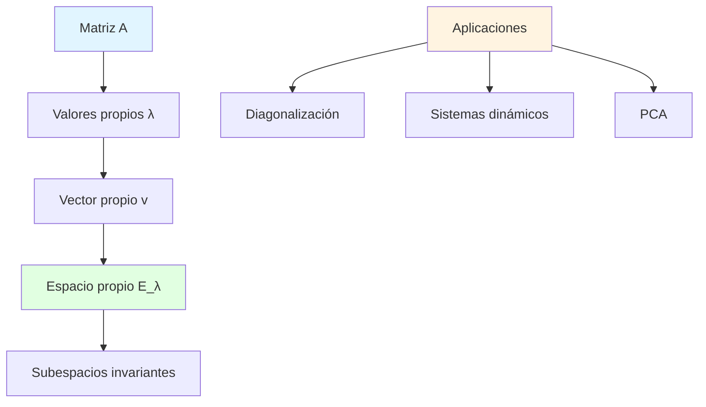

# 🎯 Espacios Propios (Eigenspaces)

## 🎯 Introducción

> [!info]- 💡 ¿Qué es un Espacio Propio?
> 
> Un **espacio propio** (o eigenespacio) asociado a un valor propio λ de una matriz A es el conjunto de todos los vectores que son transformados por A en múltiplos de sí mismos (con factor λ), junto con el vector cero.
> 
> **Analogía práctica:** Imagina una transformación lineal como estirar o comprimir el espacio. Los espacios propios son las direcciones especiales que solo se estiran o comprimen, pero no cambian de dirección.
> 
> **¿Por qué son importantes?**
> 
> |Aspecto|Descripción|Ejemplo de Uso|
> |---|---|---|
> |**Diagonalización**|Simplificar matrices|Calcular potencias A^n|
> |**Sistemas dinámicos**|Estudiar evolución a largo plazo|Modelos de población|
> |**Vibraciones**|Análisis de frecuencias naturales|Ingeniería estructural|
> |**Gráficos**|Análisis de componentes principales|Reducción de dimensionalidad|
> |**Mecánica cuántica**|Estados estacionarios|Niveles de energía|



---
## 🏗️ Definición de Espacio Propio

### 📊 Concepto Formal

> [!success]- 🎨 Espacio Propio E_λ
> 
> Sea A una matriz n×n y λ un valor propio de A. El **espacio propio** asociado a λ, denotado E_λ, es:
> 
> $$E_\lambda = {\vec{v} \in \mathbb{R}^n : A\vec{v} = \lambda\vec{v}} = \text{Nul}(A - \lambda I)$$
> 
> **En palabras:** E_λ es el conjunto de todos los vectores propios asociados a λ, más el vector cero.
> 
> **Componentes:**
> 
> |Elemento|Significado|
> |---|---|
> |**E_λ**|Espacio propio de λ|
> |**Nul(A - λI)**|Núcleo o espacio nulo de (A - λI)|
> |**{v : Av = λv}**|Todos los vectores que cumplen la ecuación|
> |**Incluye 0**|El vector cero siempre está en E_λ|
> 
> **Propiedades fundamentales:**
> 
> 1. **Es un subespacio:** E_λ es un subespacio vectorial de ℝⁿ
> 2. **Contiene al menos un vector no nulo:** Si λ es valor propio, E_λ ≠ {0}
> 3. **Dimensión ≥ 1:** dim(E_λ) ≥ 1 para cada valor propio λ
> 4. **Cerrado bajo combinaciones lineales:** Si v₁, v₂ ∈ E_λ, entonces c₁v₁ + c₂v₂ ∈ E_λ
> 
> **Verificación de subespacio:**
> 
> ```mermaid
> graph TD
>     A["E_λ = Nul(A - λI)"] --> B[¿Contiene 0?]
>     B -->|Sí: A0 = λ0| C[✓]
>     
>     A --> D[¿Cerrado bajo suma?]
>     D -->|v₁,v₂ ∈ E_λ| E["A(v₁+v₂) = λ(v₁+v₂)?"]
>     E -->|Sí| F[✓]
>     
>     A --> G[¿Cerrado bajo mult. escalar?]
>     G -->|v ∈ E_λ, c ∈ ℝ| H["A(cv) = λ(cv)?"]
>     H -->|Sí| I[✓]
>     
>     C --> J[E_λ es subespacio]
>     F --> J
>     I --> J
>     
>     style A fill:#e1f5ff
>     style J fill:#e1ffe1
> ```

### 🔧 Cálculo de Espacios Propios

> [!example]- 🎯 Procedimiento Paso a Paso
> 
> **Para encontrar E_λ:**
> 
> 1. Calcular valores propios de A
> 2. Para cada λ, resolver el sistema homogéneo (A - λI)v = 0
> 3. Encontrar el espacio solución (base del núcleo)
> 4. El espacio propio E_λ = span{vectores base}
> 
> **Ejemplo completo:**
> 
> Encontrar todos los espacios propios de $A = \begin{bmatrix} 3 & 1 \\ 1 & 3 \end{bmatrix}$
> 
> ```
> Paso 1: Valores propios (ya calculados)
> λ₁ = 4, λ₂ = 2
> 
> Paso 2: Espacio propio para λ₁ = 4
> 
> (A - 4I)v = 0
> ([3-4   1  ][v₁]) = [0]
>  [1     3-4][v₂]    [0]
> 
> ([-1  1][v₁]) = [0]
>  [1  -1][v₂]    [0]
> 
> Sistema: -v₁ + v₂ = 0  →  v₂ = v₁
> 
> Solución general: v = [v₁] = v₁[1]
>                       [v₁]     [1]
> 
> Base de E₄: {[1, 1]ᵀ}
> 
> E₄ = span{[1, 1]ᵀ} = {t[1, 1]ᵀ : t ∈ ℝ}
> dim(E₄) = 1
> 
> Paso 3: Espacio propio para λ₂ = 2
> 
> (A - 2I)v = 0
> ([3-2   1  ][v₁]) = [0]
>  [1     3-2][v₂]    [0]
> 
> ([1  1][v₁]) = [0]
>  [1  1][v₂]    [0]
> 
> Sistema: v₁ + v₂ = 0  →  v₂ = -v₁
> 
> Solución general: v = [ v₁] = v₁[ 1]
>                       [-v₁]     [-1]
> 
> Base de E₂: {[1, -1]ᵀ}
> 
> E₂ = span{[1, -1]ᵀ} = {t[1, -1]ᵀ : t ∈ ℝ}
> dim(E₂) = 1
> 
> Respuesta:
> E₄ = span{[1, 1]ᵀ}
> E₂ = span{[1, -1]ᵀ}
> ```
> 
> **Interpretación geométrica (2D):**
> 
> ```mermaid
> graph LR
>     A[Plano ℝ²] --> B[E₄: recta y = x]
>     A --> C[E₂: recta y = -x]
>     
>     B --> D[Vectores se estiran 4×]
>     C --> E[Vectores se estiran 2×]
>     
>     style A fill:#e1f5ff
>     style B fill:#e1ffe1
>     style C fill:#fff4e1
> ```

---

## 📊 Multiplicidad Algebraica y Geométrica

### 🎯 Tipos de Multiplicidad

> [!note]- 📐 Conceptos Importantes
> 
> **Multiplicidad algebraica (MA):**
> 
> La multiplicidad de λ como raíz del polinomio característico.
> 
> $$\text{MA}(\lambda) = \text{número de veces que } (\lambda - \lambda_i) \text{ aparece en } \det(A - \lambda I)$$
> 
> **Multiplicidad geométrica (MG):**
> 
> La dimensión del espacio propio E_λ.
> 
> $$\text{MG}(\lambda) = \dim(E_\lambda) = \dim(\text{Nul}(A - \lambda I))$$
> 
> **Relación fundamental:**
> 
> $$1 \leq \text{MG}(\lambda) \leq \text{MA}(\lambda)$$
> 
> **Tabla comparativa:**
> 
> |Característica|MA|MG|
> |---|---|---|
> |**Definición**|Multiplicidad como raíz|Dimensión de E_λ|
> |**Rango**|≥ 1|Entre 1 y MA|
> |**Cálculo**|Del polinomio característico|De dim(Nul(A - λI))|
> |**Para diagonalización**|No es suficiente|Debe igualar MA|
> 
> **Ejemplo:**
> 
> ```
> Sea A con polinomio característico:
> p(λ) = (λ - 2)³(λ - 5)
> 
> Valores propios: λ₁ = 2, λ₂ = 5
> 
> MA(2) = 3  (aparece 3 veces)
> MA(5) = 1  (aparece 1 vez)
> 
> Para MG, necesitamos calcular:
> MG(2) = dim(E₂) = dim(Nul(A - 2I))
> MG(5) = dim(E₅) = dim(Nul(A - 5I))
> 
> Posibilidades para λ = 2:
> - MG(2) = 1: un vector propio linealmente independiente
> - MG(2) = 2: dos vectores propios LI
> - MG(2) = 3: tres vectores propios LI (mejor caso)
> 
> Siempre: 1 ≤ MG(2) ≤ 3 = MA(2)
> ```

### 🔍 Casos Especiales

> [!example]- 🎨 Ejemplos de Multiplicidades
> 
> **Caso 1: MG = MA (ideal para diagonalización)**
> 
> ```
> A = [2  0  0]
>     [0  2  0]
>     [0  0  5]
> 
> Polinomio: (λ-2)²(λ-5)
> 
> λ = 2: MA(2) = 2
>        E₂ = span{[1,0,0]ᵀ, [0,1,0]ᵀ}
>        MG(2) = 2  ✓ (MG = MA)
> 
> λ = 5: MA(5) = 1
>        E₅ = span{[0,0,1]ᵀ}
>        MG(5) = 1  ✓ (MG = MA)
> 
> A es diagonalizable
> ```
> 
> **Caso 2: MG < MA (no diagonalizable)**
> 
> ```
> A = [2  1  0]
>     [0  2  0]
>     [0  0  5]
> 
> Polinomio: (λ-2)²(λ-5)
> 
> λ = 2: MA(2) = 2
>        (A - 2I) = [0  1  0]
>                   [0  0  0]
>                   [0  0  3]
>        
>        E₂ = span{[1,0,0]ᵀ}
>        MG(2) = 1  ✗ (MG < MA)
> 
> λ = 5: MA(5) = 1
>        E₅ = span{[0,0,1]ᵀ}
>        MG(5) = 1  ✓
> 
> A NO es diagonalizable (falta un vector propio)
> ```

---

## 🎓 Propiedades de los Espacios Propios

### 📋 Propiedades Fundamentales

> [!tip]- 🔧 Teoremas Importantes
> 
> **Propiedad 1: Independencia lineal**
> 
> Vectores propios correspondientes a valores propios **distintos** son linealmente independientes.
> 
> ```
> Si Av₁ = λ₁v₁ y Av₂ = λ₂v₂ con λ₁ ≠ λ₂
> Entonces {v₁, v₂} es LI
> ```
> 
> **Propiedad 2: Suma directa**
> 
> Si λ₁, λ₂, ..., λₖ son valores propios distintos:
> 
> $$E_{\lambda_1} \oplus E_{\lambda_2} \oplus \cdots \oplus E_{\lambda_k} \subseteq \mathbb{R}^n$$
> 
> Los espacios propios para diferentes valores propios son "independientes".
> 
> **Propiedad 3: Bases y diagonalización**
> 
> A es diagonalizable si y solo si:
> 
> $$\dim(E_{\lambda_1}) + \dim(E_{\lambda_2}) + \cdots + \dim(E_{\lambda_k}) = n$$
> 
> Es decir: la suma de las dimensiones de todos los espacios propios = n
> 
> **Propiedad 4: Invariancia**
> 
> Los espacios propios son **invariantes** bajo A:
> 
> Si v ∈ E_λ, entonces Av ∈ E_λ
> 
> **Tabla resumen:**
> 
> |Propiedad|Condición|Consecuencia|
> |---|---|---|
> |**Independencia**|λᵢ ≠ λⱼ|vᵢ y vⱼ son LI|
> |**Suma directa**|Valores propios distintos|E_λᵢ ∩ E_λⱼ = {0}|
> |**Diagonalización**|Σ dim(E_λᵢ) = n|A es diagonalizable|
> |**Invariancia**|v ∈ E_λ|Av ∈ E_λ|

---

## 🎯 Aplicaciones

### 🔄 Diagonalización de Matrices

> [!success]- 🎨 Proceso de Diagonalización
> 
> Una matriz A es **diagonalizable** si existe una matriz invertible P tal que:
> 
> $$A = PDP^{-1}$$
> 
> donde D es diagonal.
> 
> **Construcción de P y D:**
> 
> - **Columnas de P:** vectores propios de A
> - **Diagonal de D:** valores propios correspondientes
> 
> ```mermaid
> flowchart TD
>     A[Matriz A] --> B[Calcular valores propios]
>     B --> C[Calcular espacios propios]
>     C --> D{Σ dim(E_λᵢ) = n?}
>     D -->|Sí| E[A es diagonalizable]
>     D -->|No| F[A NO es diagonalizable]
>     
>     E --> G[Formar P con vectores propios]
>     E --> H[Formar D con valores propios]
>     G --> I[A = PDP⁻¹]
>     H --> I
>     
>     style A fill:#e1f5ff
>     style E fill:#e1ffe1
>     style F fill:#ffe1e1
>     style I fill:#fff4e1
> ```
> 
> **Ejemplo completo:**
> 
> Diagonalizar $A = \begin{bmatrix} 3 & 1 \ 1 & 3 \end{bmatrix}$
> 
> ```
> Paso 1: Valores propios (ya calculados)
> λ₁ = 4, λ₂ = 2
> 
> Paso 2: Vectores propios (ya calculados)
> v₁ = [1, 1]ᵀ para λ₁ = 4
> v₂ = [1, -1]ᵀ para λ₂ = 2
> 
> Paso 3: Verificar diagonalizabilidad
> dim(E₄) + dim(E₂) = 1 + 1 = 2 = n ✓
> 
> Paso 4: Formar matrices
> P = [v₁ | v₂] = [1   1]
>                 [1  -1]
> 
> D = [λ₁  0 ] = [4  0]
>     [0   λ₂]   [0  2]
> 
> Paso 5: Calcular P⁻¹
> P⁻¹ = 1/det(P) · [adjunta de P]
>     = 1/(-2) · [-1  -1]
>                [-1   1]
>     = [1/2   1/2]
>       [1/2  -1/2]
> 
> Paso 6: Verificar
> PDP⁻¹ = [1   1][4  0][1/2   1/2]
>         [1  -1][0  2][1/2  -1/2]
>       
>       = [1   1][2    2]
>         [1  -1][1   -1]
>       
>       = [3  1]  = A ✓
>         [1  3]
> ```

### 📊 Potencias de Matrices

> [!example]- 🚀 Cálculo Eficiente de A^n
> 
> Si A = PDP⁻¹, entonces:
> 
> $$A^n = PD^nP^{-1}$$
> 
> y calcular D^n es trivial (elevar elementos diagonales):
> 
> $$D^n = \begin{bmatrix} \lambda_1^n & 0 & \cdots \ 0 & \lambda_2^n & \cdots \ \vdots & \vdots & \ddots \end{bmatrix}$$
> 
> **Ejemplo:**
> 
> Calcular A¹⁰⁰ para $A = \begin{bmatrix} 3 & 1 \ 1 & 3 \end{bmatrix}$
> 
> ```
> Paso 1: Usar diagonalización conocida
> A = PDP⁻¹ donde:
> P = [1   1]    D = [4  0]    P⁻¹ = [1/2   1/2]
>     [1  -1]        [0  2]          [1/2  -1/2]
> 
> Paso 2: Calcular D¹⁰⁰
> D¹⁰⁰ = [4¹⁰⁰    0  ]
>        [0     2¹⁰⁰]
> 
> Paso 3: Calcular A¹⁰⁰
> A¹⁰⁰ = PD¹⁰⁰P⁻¹
>      = [1   1][4¹⁰⁰    0  ][1/2   1/2]
>        [1  -1][0     2¹⁰⁰][1/2  -1/2]
>      
>      = [1   1][4¹⁰⁰/2    4¹⁰⁰/2 ]
>        [1  -1][2¹⁰⁰/2   -2¹⁰⁰/2]
>      
>      = [(4¹⁰⁰ + 2¹⁰⁰)/2    (4¹⁰⁰ - 2¹⁰⁰)/2]
>        [(4¹⁰⁰ - 2¹⁰⁰)/2    (4¹⁰⁰ + 2¹⁰⁰)/2]
> 
> Sin diagonalización esto sería prácticamente imposible!
> ```

---

## 📊 Resumen Visual

> [!note]- 📐 Mapa Conceptual
> 
> ```mermaid
> mindmap
>   root((Espacios<br/>Propios))
>     Valores propios λ
>       Ecuación característica
>       det(A - λI) = 0
>       Raíces del polinomio
>     Vectores propios v
>       Av = λv
>       v ≠ 0
>       Dirección invariante
>     Espacio propio E_λ
>       Subespacio
>       E_λ = Nul(A - λI)
>       dim(E_λ) ≥ 1
>     Multiplicidades
>       Algebraica MA
>       Geométrica MG  
>       1 ≤ MG ≤ MA
>     Aplicaciones
>       Diagonalización
>       Potencias de matrices
>       Sistemas dinámicos
> ```
> 
> **Tabla de fórmulas clave:**
> 
> |Concepto|Fórmula|Interpretación|
> |---|---|---|
> |**Ecuación característica**|det(A - λI) = 0|Encontrar λ|
> |**Espacio propio**|E_λ = {v : Av = λv}|Conjunto de vectores|
> |**Dimensión**|dim(E_λ) = MG(λ)|Multiplicidad geométrica|
> |**Diagonalización**|A = PDP⁻¹|P = vectores propios|
> |**Potencias**|A^n = PD^nP⁻¹|Cálculo eficiente|

---

## 🎓 Ejemplos Completos

> [!example]- 📝 Problema 1: Matriz 3×3
> 
> **Enunciado:** Encontrar todos los espacios propios y verificar si es diagonalizable:
> 
> $$A = \begin{bmatrix} 2 & 0 & 0 \ 1 & 2 & -1 \ 1 & 0 & 1 \end{bmatrix}$$
> 
> ```
> Solución:
> 
> Paso 1: Calcular polinomio característico
> det(A - λI) = det([2-λ   0     0  ])
>                  [1     2-λ   -1  ]
>                  [1     0     1-λ ]
> 
> Expandiendo por primera fila:
> = (2-λ) · det([2-λ   -1 ])
>              [0     1-λ]
> = (2-λ)[(2-λ)(1-λ) - 0]
> = (2-λ)(2-λ)(1-λ)
> = (2-λ)²(1-λ)
> 
> Paso 2: Valores propios
> λ₁ = 2 con MA(2) = 2
> λ₂ = 1 con MA(1) = 1
> 
> Paso 3: Espacio propio E₂
> (A - 2I)v = 0
> ([0   0    0][v₁])   ([0])
> [1 0 -1][v₂] = [0] [1 0 -1][v₃] [0]
> 
> Sistema: v₁ - v₃ = 0 → v₁ = v₃ v₂ libre
> 
> Solución: v = [v₃] = v₂[0] + v₃[1] [v₂] [1] [0] [v₃] [0] [1]
> 
> E₂ = span{[0,1,0]ᵀ, [1,0,1]ᵀ} MG(2) = 2 ✓ (MG = MA)
> 
> Paso 4: Espacio propio E₁ (A - I)v = 0 ([1 0 0][v₁]) ([0]) [1 1 -1][v₂] = [0] [1 0 0][v₃] [0]
> 
> Sistema: v₁ = 0 v₁ + v₂ - v₃ = 0 → v₂ = v₃
> 
> Solución: v = [0 ] = v₃[0] [v₃] [1] [v₃] [1]
> 
> E₁ = span{[0,1,1]ᵀ} MG(1) = 1 ✓ (MG = MA)
> 
> Paso 5: Verificar diagonalizabilidad dim(E₂) + dim(E₁) = 2 + 1 = 3 ✓
> 
> A es diagonalizable con: P = [0 1 0] D = [2 0 0] [1 0 1] [0 2 0] [0 1 1] [0 0 1]
> 
> Respuesta: E₂ = span{[0,1,0]ᵀ, [1,0,1]ᵀ} E₁ = span{[0,1,1]ᵀ} A es diagonalizable
> ```

---

**Tags:** #algebra-lineal #espacios-propios #valores-propios #vectores-propios #diagonalizacion #multiplicidad #subespacios #eigenspaces
