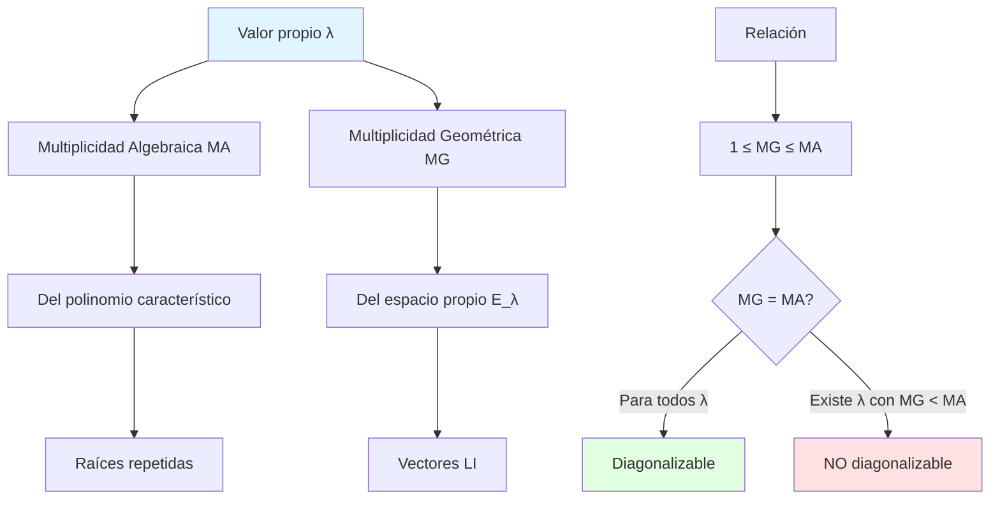

# 🔢 Multiplicidad Algebraica y Geométrica

## 🎯 Introducción

> [!info]- 💡 ¿Qué son las Multiplicidades?
> 
> Las **multiplicidades** son conceptos fundamentales que describen "cuántas veces" aparece un valor propio, pero desde dos perspectivas diferentes:
> 
> - **Algebraica:** desde el polinomio característico
> - **Geométrica:** desde el espacio de vectores propios
> 
> **Analogía práctica:** Imagina una orquesta donde el director (valor propio) puede tener:
> 
> - **Multiplicidad algebraica:** cuántas sillas están asignadas para ese director
> - **Multiplicidad geométrica:** cuántos músicos independientes realmente ocupan esas sillas
> 
> **¿Por qué son importantes?**
> 
> |Aspecto|Descripción|Ejemplo de Uso|
> |---|---|---|
> |**Diagonalización**|Determinar si A es diagonalizable|Condición: MG = MA para todos los λ|
> |**Estructura**|Entender la forma de la matriz|Bloques de Jordan|
> |**Sistemas dinámicos**|Comportamiento a largo plazo|Estabilidad de soluciones|
> |**Dimensión**|Contar vectores propios independientes|Bases de espacios propios|



---

## 📐 Multiplicidad Algebraica (MA)

### 🎨 Definición Formal

> [!note]- 📘 Concepto de Multiplicidad Algebraica
> 
> Sea λ un valor propio de la matriz A (n×n). La **multiplicidad algebraica** de λ, denotada MA(λ) o alg(λ), es la **multiplicidad de λ como raíz del polinomio característico**.
> 
> $$\text{MA}(\lambda) = \text{exponente de } (\lambda - \lambda_i) \text{ en } p_A(\lambda)$$
> 
> **Polinomio característico factorizado:**
> 
> $$p_A(\lambda) = \det(A - \lambda I) = (\lambda - \lambda_1)^{m_1}(\lambda - \lambda_2)^{m_2} \cdots (\lambda - \lambda_k)^{m_k}$$
> 
> donde:
> 
> - λ₁, λ₂, ..., λₖ son los valores propios **distintos**
> - m₁, m₂, ..., mₖ son sus multiplicidades algebraicas
> 
> **Componentes:**
> 
> |Símbolo|Significado|Restricción|
> |---|---|---|
> |**MA(λ)**|Multiplicidad algebraica|≥ 1|
> |**p_A(λ)**|Polinomio característico|Grado n|
> |**mᵢ**|Exponente de (λ - λᵢ)|1 ≤ mᵢ ≤ n|
> |**Σmᵢ**|Suma de multiplicidades|= n|
> 
> **Propiedades fundamentales:**
> 
> ```mermaid
> graph LR
>     A[Matriz A n×n] --> B[Polinomio p_A de grado n]
>     B --> C[n raíces contadas con multiplicidad]
>     C --> D["Σ MA(λᵢ) = n"]
>     
>     E[Cada valor propio] --> F["MA(λ) ≥ 1"]
>     
>     style A fill:#e1f5ff
>     style D fill:#e1ffe1
> ```
> 
> **Tabla de propiedades:**
> 
> |Propiedad|Descripción|Fórmula|
> |---|---|---|
> |**Suma total**|Suma de todas las MA|Σ MA(λᵢ) = n|
> |**Mínimo**|Cada valor propio cuenta al menos una vez|MA(λ) ≥ 1|
> |**Máximo**|No puede exceder n|MA(λ) ≤ n|
> |**Valores distintos**|Si todos λᵢ distintos|MA(λᵢ) = 1 para todo i|

### 📝 Ejemplos de Cálculo

> [!example]- 🎯 Ejemplos Detallados
> 
> **Ejemplo 1: MA simple (todos distintos)**
> 
> $$A = \begin{bmatrix} 1 & 0 & 0 \\ 0 & 2 & 0 \\ 0 & 0 & 3 \end{bmatrix}$$
> 
> ```
> Paso 1: Polinomio característico
> p_A(λ) = det(A - λI) = det([1-λ  0    0  ])
>                           [0    2-λ  0  ]
>                           [0    0    3-λ]
> = (1-λ)(2-λ)(3-λ)
> 
> Paso 2: Factorización
> p_A(λ) = (λ-1)¹(λ-2)¹(λ-3)¹
> 
> Paso 3: Multiplicidades algebraicas
> λ₁ = 1: MA(1) = 1
> λ₂ = 2: MA(2) = 1
> λ₃ = 3: MA(3) = 1
> 
> Verificar: Σ MA = 1 + 1 + 1 = 3 = n ✓
> ```
> 
> **Ejemplo 2: MA repetidas**
> 
> $$A = \begin{bmatrix} 2 & 1 & 0 \\ 0 & 2 & 0 \\ 0 & 0 & 5 \end{bmatrix}$$
> 
> ```
> Paso 1: Polinomio característico (matriz triangular)
> p_A(λ) = (2-λ)(2-λ)(5-λ)
>        = (2-λ)²(5-λ)
>        = (λ-2)²(λ-5)
> 
> Paso 2: Multiplicidades algebraicas
> λ₁ = 2: MA(2) = 2  ← valor propio repetido
> λ₂ = 5: MA(5) = 1
> 
> Verificar: Σ MA = 2 + 1 = 3 = n ✓
> ```
> 
> **Ejemplo 3: MA máxima**
> 
> $$A = \begin{bmatrix} 3 & 1 & 0 \\ 0 & 3 & 1 \\ 0 & 0 & 3 \end{bmatrix}$$
> 
> ```
> Paso 1: Polinomio característico (triangular)
> p_A(λ) = (3-λ)³
>        = (λ-3)³
> 
> Paso 2: Multiplicidad algebraica
> λ = 3: MA(3) = 3  ← único valor propio con MA máxima
> 
> Verificar: Σ MA = 3 = n ✓
> ```

---

## 🏗️ Multiplicidad Geométrica (MG)

### 📊 Definición Formal

> [!success]- 🎨 Concepto de Multiplicidad Geométrica
> 
> Sea λ un valor propio de la matriz A (n×n). La **multiplicidad geométrica** de λ, denotada MG(λ) o geo(λ), es la **dimensión del espacio propio** E_λ.
> 
> $$\text{MG}(\lambda) = \dim(E_\lambda) = \dim(\text{Nul}(A - \lambda I))$$
> 
> **En otras palabras:**
> 
> MG(λ) = número máximo de vectores propios **linealmente independientes** asociados a λ
> 
> **Componentes:**
> 
> |Concepto|Fórmula|Interpretación|
> |---|---|---|
> |**E_λ**|{v : Av = λv}|Espacio propio|
> |**Nul(A-λI)**|{v : (A-λI)v = 0}|Núcleo o espacio nulo|
> |**dim(E_λ)**|Número de vectores en base de E_λ|MG(λ)|
> |**Base de E_λ**|{v₁, v₂, ..., vₘ} donde m = MG(λ)|Vectores LI|
> 
> **Proceso de cálculo:**
> 
> ```mermaid
> flowchart TD
>     A[Valor propio λ] --> B[Formar A - λI]
>     B --> C[Resolver A - λI v = 0]
>     C --> D[Encontrar espacio solución]
>     D --> E[Determinar base del espacio]
>     E --> F[Contar vectores en la base]
>     F --> G[MG = # vectores en base]
>     
>     style A fill:#e1f5ff
>     style G fill:#e1ffe1
> ```
> 
> **Relación con el rango:**
> 
> $$\text{MG}(\lambda) = \dim(\text{Nul}(A - \lambda I)) = n - \text{rango}(A - \lambda I)$$
> 
> Por el teorema de la dimensión: $$n = \text{rango}(A - \lambda I) + \text{nulidad}(A - \lambda I)$$

### 📝 Ejemplos de Cálculo

> [!example]- 🎯 Cálculo de MG
> 
> **Ejemplo 1: MG = 1 (caso simple)**
> 
> Para $A = \begin{bmatrix} 2 & 1 \\ 1 & 2 \end{bmatrix}$ con λ = 3
> 
> ```
> Paso 1: Formar A - λI
> A - 3I = [2-3   1  ] = [-1  1]
>          [1    2-3]   [1  -1]
> 
> Paso 2: Resolver (A - 3I)v = 0
> [-1  1][v₁] = [0]
> [1  -1][v₂]   [0]
> 
> Sistema: -v₁ + v₂ = 0  →  v₂ = v₁
> 
> Paso 3: Solución general
> v = [v₁] = v₁[1]  = t[1]
>     [v₁]     [1]     [1]
> 
> Paso 4: Base de E₃
> Base = {[1, 1]ᵀ}
> 
> Paso 5: Multiplicidad geométrica
> MG(3) = dim(E₃) = 1
> 
> Solo hay UN vector propio LI para λ = 3
> ```
> 
> **Ejemplo 2: MG = 2 (dos vectores LI)**
> 
> Para $A = \begin{bmatrix} 2 & 0 & 0 \\ 0 & 2 & 0 \\ 0 & 0 & 5 \end{bmatrix}$ con λ = 2
> 
> ```
> Paso 1: Formar A - λI
> A - 2I = [0  0  0]
>          [0  0  0]
>          [0  0  3]
> 
> Paso 2: Resolver (A - 2I)v = 0
> [0  0  0][v₁]   [0]
> [0  0  0][v₂] = [0]
> [0  0  3][v₃]   [0]
> 
> Sistema: 3v₃ = 0  →  v₃ = 0
>          v₁, v₂ libres
> 
> Paso 3: Solución general
> v = [v₁]   [1]     [0]
>     [v₂] = v₁[0] + v₂[1]
>     [0 ]   [0]     [0]
> 
> Paso 4: Base de E₂
> Base = {[1,0,0]ᵀ, [0,1,0]ᵀ}
> 
> Paso 5: Multiplicidad geométrica
> MG(2) = dim(E₂) = 2
> 
> Hay DOS vectores propios LI para λ = 2
> ```
> 
> **Ejemplo 3: MG < MA (deficiente)**
> 
> Para $A = \begin{bmatrix} 2 & 1 & 0 \\ 0 & 2 & 0 \\ 0 & 0 & 2 \end{bmatrix}$ con λ = 2
> 
> ```
> Sabemos: MA(2) = 3 (del polinomio (λ-2)³)
> 
> Paso 1: Formar A - 2I
> A - 2I = [0  1  0]
>          [0  0  0]
>          [0  0  0]
> 
> Paso 2: Resolver (A - 2I)v = 0
> [0  1  0][v₁]   [0]
> [0  0  0][v₂] = [0]
> [0  0  0][v₃]   [0]
> 
> Sistema: v₂ = 0
>          v₁, v₃ libres
> 
> Paso 3: Solución general
> v = [v₁]   [1]     [0]
>     [0 ] = v₁[0] + v₃[0]
>     [v₃]   [0]     [1]
> 
> Paso 4: Base de E₂
> Base = {[1,0,0]ᵀ, [0,0,1]ᵀ}
> 
> Paso 5: Multiplicidad geométrica
> MG(2) = 2
> 
> ¡MG(2) = 2 < 3 = MA(2)!
> Hay solo DOS vectores propios LI, pero MA dice que "debería" haber 3
> ```

---

## ⚖️ Relación entre MA y MG

### 🎯 Teorema Fundamental

> [!success]- 📐 Desigualdad Fundamental
> 
> **Teorema:** Para cualquier valor propio λ de una matriz A:
> 
> $$1 \leq \text{MG}(\lambda) \leq \text{MA}(\lambda)$$
> 
> **Componentes de la desigualdad:**
> 
> |Parte|Significado|
> |---|---|
> |**1 ≤ MG**|Siempre hay al menos un vector propio|
> |**MG ≤ MA**|No puede haber más vectores LI que raíces|
> 
> **Interpretación:**
> 
> ```mermaid
> graph LR
>     A[MG = 1] --> B[Mínimo: un vector propio]
>     C[MG < MA] --> D[Deficiente: matriz NO diagonalizable]
>     E[MG = MA] --> F[Ideal: suficientes vectores propios]
>     G[MG > MA] --> H[IMPOSIBLE]
>     
>     style B fill:#e1f5ff
>     style D fill:#ffe1e1
>     style F fill:#e1ffe1
>     style H fill:#ff0000
> ```
> 
> **Casos posibles:**
> 
> |Relación|Descripción|Consecuencia|
> |---|---|---|
> |**MG = MA**|Caso ideal|Contribuye a diagonalización|
> |**MG < MA**|Deficiencia|Impide diagonalización|
> |**MG > MA**|Imposible|No puede ocurrir|

### 🔍 Condición de Diagonalización

> [!tip]- 🎨 Criterio de Diagonalización
> 
> **Teorema de Diagonalización:**
> 
> Una matriz A (n×n) es **diagonalizable** si y solo si:
> 
> $$\text{MG}(\lambda_i) = \text{MA}(\lambda_i) \quad \text{para todo valor propio } \lambda_i$$
> 
> **Equivalentemente:**
> 
> $$\sum_{i=1}^{k} \text{MG}(\lambda_i) = n$$
> 
> donde k es el número de valores propios distintos.
> 
> **Análisis de casos:**
> 
> ```mermaid
> flowchart TD
>     A[Matriz A n×n] --> B[Calcular todos los valores propios]
>     B --> C[Para cada λᵢ]
>     C --> D[Calcular MA λᵢ]
>     C --> E[Calcular MG λᵢ]
>     
>     D --> F{¿MG = MA?}
>     E --> F
>     
>     F -->|Para todos λᵢ| G[A es DIAGONALIZABLE]
>     F -->|Existe λᵢ con MG < MA| H[A NO es diagonalizable]
>     
>     G --> I[Existe base de vectores propios]
>     H --> J[Insuficientes vectores propios]
>     
>     style A fill:#e1f5ff
>     style G fill:#e1ffe1
>     style H fill:#ffe1e1
> ```
> 
> **Checklist de verificación:**
> 
> - [ ] Encontrar todos los valores propios distintos
> - [ ] Para cada λ, calcular MA del polinomio
> - [ ] Para cada λ, calcular MG del espacio propio
> - [ ] Comparar: ¿MG = MA para todos los λ?
> - [ ] Si todos cumplen: diagonalizable ✓
> - [ ] Si alguno no cumple: NO diagonalizable ✗

---

## 📊 Ejemplos Completos

### 🎓 Análisis Detallado de Matrices

> [!example]- 📝 Ejemplo 1: Matriz Diagonalizable
> 
> **Enunciado:** Analizar multiplicidades y diagonalización de:
> 
> $$A = \begin{bmatrix} 1 & 2 & 0 \\ 0 & 1 & 0 \\ 0 & 0 & 3 \end{bmatrix}$$
> 
> ```
> PASO 1: MULTIPLICIDADES ALGEBRAICAS
> 
> Polinomio característico (matriz triangular):
> p_A(λ) = (1-λ)(1-λ)(3-λ)
>        = (1-λ)²(3-λ)
>        = (λ-1)²(λ-3)
> 
> Valores propios:
> λ₁ = 1: MA(1) = 2
> λ₂ = 3: MA(3) = 1
> 
> Verificar: 2 + 1 = 3 = n ✓
> 
> PASO 2: MULTIPLICIDAD GEOMÉTRICA PARA λ = 1
> 
> A - I = [0  2  0]
>         [0  0  0]
>         [0  0  2]
> 
> Resolver (A - I)v = 0:
> 2v₂ = 0  →  v₂ = 0
> 2v₃ = 0  →  v₃ = 0
> v₁ libre
> 
> Espacio solución:
> v = [v₁]   [1]
>     [0 ] = v₁[0]
>     [0 ]   [0]
> 
> Base de E₁: {[1,0,0]ᵀ}
> MG(1) = 1
> 
> ¡Problema! MG(1) = 1 < 2 = MA(1)
> 
> PASO 3: MULTIPLICIDAD GEOMÉTRICA PARA λ = 3
> 
> A - 3I = [-2  2  0]
>          [0  -2  0]
>          [0   0  0]
> 
> Resolver (A - 3I)v = 0:
> -2v₁ + 2v₂ = 0  →  v₁ = v₂
> -2v₂ = 0  →  v₂ = 0, luego v₁ = 0
> v₃ libre
> 
> Espacio solución:
> v = [0 ]   [0]
>     [0 ] = v₃[0]
>     [v₃]   [1]
> 
> Base de E₃: {[0,0,1]ᵀ}
> MG(3) = 1 = MA(3) ✓
> 
> PASO 4: CONCLUSIÓN
> 
> Resumen de multiplicidades:
> λ = 1: MA = 2, MG = 1  ✗ (MG < MA)
> λ = 3: MA = 1, MG = 1  ✓ (MG = MA)
> 
> Total de vectores propios LI: 1 + 1 = 2 < 3
> 
> A NO ES DIAGONALIZABLE
> Razón: Deficiencia en λ = 1
> ```

> [!example]- 📝 Ejemplo 2: Matriz Diagonalizable
> 
> **Enunciado:** Analizar multiplicidades y diagonalización de:
> 
> $$A = \begin{bmatrix} 4 & 0 & 0 \\ 1 & 4 & 0 \\ 0 & 0 & 5 \end{bmatrix}$$
> 
> ```
> PASO 1: MULTIPLICIDADES ALGEBRAICAS
> 
> Polinomio característico:
> p_A(λ) = (4-λ)²(5-λ)
>        = (λ-4)²(λ-5)
> 
> Valores propios:
> λ₁ = 4: MA(4) = 2
> λ₂ = 5: MA(5) = 1
> 
> PASO 2: MULTIPLICIDAD GEOMÉTRICA PARA λ = 4
> 
> A - 4I = [0  0  0]
>          [1  0  0]
>          [0  0  1]
> 
> Resolver (A - 4I)v = 0:
> v₁ = 0
> v₃ = 0
> v₂ libre
> 
> Espacio solución:
> v = [0 ]   [0]
>     [v₂] = v₂[1]
>     [0 ]   [0]
> 
> Base de E₄: {[0,1,0]ᵀ}
> MG(4) = 1
> 
> ¡Problema! MG(4) = 1 < 2 = MA(4)
> 
> PASO 3: MULTIPLICIDAD GEOMÉTRICA PARA λ = 5
> 
> A - 5I = [-1  0  0]
>          [1  -1  0]
>          [0   0  0]
> 
> Resolver (A - 5I)v = 0:
> -v₁ = 0  →  v₁ = 0
> v₁ - v₂ = 0  →  v₂ = 0
> v₃ libre
> 
> Base de E₅: {[0,0,1]ᵀ}
> MG(5) = 1 = MA(5) ✓
> 
> PASO 4: CONCLUSIÓN
> 
> Resumen:
> λ = 4: MA = 2, MG = 1  ✗
> λ = 5: MA = 1, MG = 1  ✓
> 
> A NO ES DIAGONALIZABLE
> Solo hay 2 vectores propios LI, necesitamos 3
> ```

> [!example]- 📝 Ejemplo 3: Matriz SÍ Diagonalizable
> 
> **Enunciado:** Analizar multiplicidades de:
> 
> $$A = \begin{bmatrix} 2 & 0 & 0 & 0 \\ 0 & 2 & 0 & 0 \\ 0 & 0 & 2 & 0 \\ 0 & 0 & 0 & 5 \end{bmatrix}$$
> 
> ```
> PASO 1: MULTIPLICIDADES ALGEBRAICAS
> 
> Matriz diagonal por bloques:
> p_A(λ) = (2-λ)³(5-λ)
> 
> λ₁ = 2: MA(2) = 3
> λ₂ = 5: MA(5) = 1
> 
> PASO 2: MULTIPLICIDAD GEOMÉTRICA PARA λ = 2
> 
> A - 2I = [0  0  0  0]
>          [0  0  0  0]
>          [0  0  0  0]
>          [0  0  0  3]
> 
> Resolver (A - 2I)v = 0:
> 3v₄ = 0  →  v₄ = 0
> v₁, v₂, v₃ libres
> 
> Espacio solución:
> v = [v₁]     [1]     [0]     [0]
>     [v₂] = v₁[0] + v₂[1] + v₃[0]
>     [v₃]     [0]     [0]     [1]
>     [0 ]     [0]     [0]     [0]
> 
> Base de E₂: {[1,0,0,0]ᵀ, [0,1,0,0]ᵀ, [0,0,1,0]ᵀ}
> MG(2) = 3 = MA(2) ✓
> 
> PASO 3: MULTIPLICIDAD GEOMÉTRICA PARA λ = 5
> 
> A - 5I = [-3  0  0  0]
>          [0  -3  0  0]
>          [0   0 -3  0]
>          [0   0  0  0]
> 
> Resolver (A - 5I)v = 0:
> -3v₁ = 0  →  v₁ = 0
> -3v₂ = 0  →  v₂ = 0
> -3v₃ = 0  →  v₃ = 0
> v₄ libre
> 
> Base de E₅: {[0,0,0,1]ᵀ}
> MG(5) = 1 = MA(5) ✓
> 
> PASO 4: CONCLUSIÓN
> 
> Resumen:
> λ = 2: MA = 3, MG = 3  ✓
> λ = 5: MA = 1, MG = 1  ✓
> 
> Total: 3 + 1 = 4 vectores propios LI
> 
> A ES DIAGONALIZABLE ✓
> 
> Matriz de diagonalización:
> P = [[1,0,0,0]ᵀ | [0,1,0,0]ᵀ | [0,0,1,0]ᵀ | [0,0,0,1]ᵀ]
> 
> D = [2  0  0  0]
>     [0  2  0  0]
>     [0  0  2  0]
>     [0  0  0  5]
> ```

---

## 📋 Tabla Resumen y Comparación

> [!note]- 📊 Cuadro Comparativo Completo
> 
> |Aspecto|Multiplicidad Algebraica (MA)|Multiplicidad Geométrica (MG)|
> |---|---|---|
> |**Definición**|Exponente en p_A(λ)|dim(E_λ)|
> |**Cálculo**|Del polinomio característico|Del espacio nulo|
> |**Fórmula**|Raíz repetida m veces|# vectores en base de E_λ|
> |**Rango**|1 ≤ MA ≤ n|1 ≤ MG ≤ MA|
> |**Información**|"Cuántas veces aparece λ"|"Cuántos vectores propios LI"|
> |**Siempre es...**|≥ MG|≤ MA|
> |**Para diagonalización**|No suficiente por sí sola|Debe igualar MA|
> 
> **Casos especiales:**
> 
> |Situación|MA|MG|¿Diagonalizable?|Ejemplo|
> |---|---|---|---|---|
> |Valores propios distintos|Todas = 1|Todas = 1|✓ Sí|Matriz diagonal|
> |λ con MA = n|n|Varía|Dep||. de MG | A = kI tiene MG = n |
> | Deficiente | > MG | < MA | ✗ No | Matrices de Jordan | | Ideal | = MG | = MA | ✓ Sí | Matrices simétricas |

---

## 🎯 Estrategia de Análisis

> [!tip]- 🗺️ Guía Paso a Paso
> ```mermaid
> flowchart TD
>     A[Matriz A]
>     A --> B[Calcular polinomio característico]
>     B --> C["Factorizar p_A(λ)"]
>     C --> D[Identificar valores propios]
>     D --> E[Determinar MA de cada λ]
> 
>     E --> F[Para cada valor propio λᵢ]
>     F --> G[Formar A − λᵢI]
>     G --> H["Resolver (A − λᵢI)v = 0"]
>     H --> I[Encontrar base de E_λᵢ]
>     I --> J["Calcular MG(λᵢ)"]
> 
>     J --> K{"¿MG(λᵢ) = MA(λᵢ)?"}
>     K -->|Sí, todos| L[DIAGONALIZABLE]
>     K -->|No| M[NO diagonalizable]
> 
>     L --> N[Formar matriz P]
>     L --> O[Formar matriz D]
> 
> ```

**Tags:** #algebra-lineal #multiplicidad #algebraica #geometrica #diagonalizacion #valores-propios #espacios-propios #vectores-propios