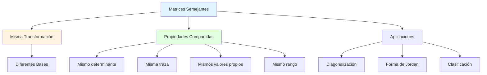
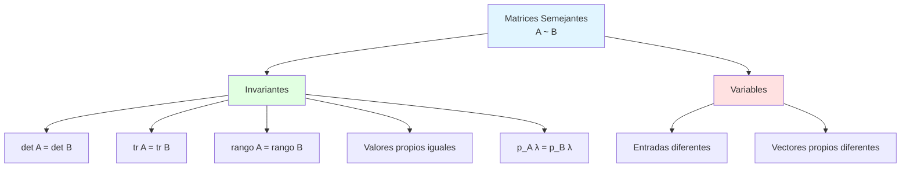
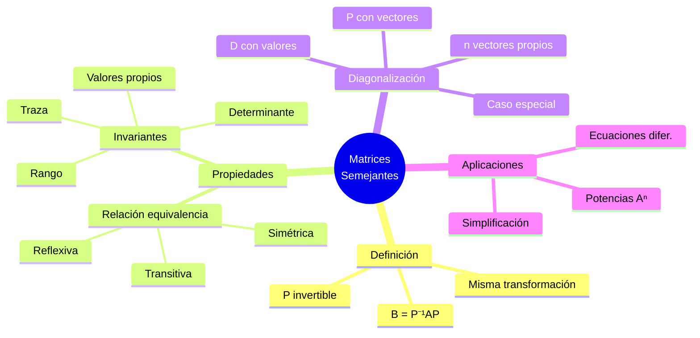

# 🔄 Matrices Semejantes

## 🎯 Introducción

> [!info]- 💡 ¿Qué son las Matrices Semejantes? Las **matrices semejantes** son matrices que representan la **misma transformación lineal** pero expresada en diferentes **bases**. Aunque las matrices parezcan diferentes numéricamente, describen esencialmente el mismo comportamiento matemático desde distintas perspectivas.
> 
> **Analogía práctica:** Imagina describir la ubicación de un punto en una ciudad:
> 
> - **Sistema 1:** "3 cuadras al norte, 2 al este" (base estándar)
> - **Sistema 2:** "2 cuadras en dirección noreste, 1 al noroeste" (base rotada)
> - **Misma ubicación**, diferentes coordenadas según el sistema de referencia
> 
> Las matrices semejantes son como estas descripciones: **mismo punto (transformación), diferentes coordenadas (matriz)**.
> 
> **¿Por qué son importantes?**
> 
> |Aspecto|Descripción|Beneficio|
> |---|---|---|
> |**Simplificación**|Encontrar representación más simple|Diagonal, Jordan|
> |**Invariantes**|Propiedades que no cambian|Determinante, traza, valores propios|
> |**Clasificación**|Agrupar transformaciones equivalentes|Teoría de formas canónicas|
> |**Aplicaciones**|Resolver sistemas, ecuaciones diferenciales|Diagonalización|
> |**Comprensión**|Ver transformación desde mejor ángulo|Intuición geométrica|



---

## 📚 Definición Formal

### 🎯 Concepto de Semejanza

> [!note]- 📋 Definición Rigurosa
> 
> **Definición:**
> 
> Dos matrices $A$ y $B$ de tamaño $n \times n$ son **semejantes** (o similares) si existe una matriz invertible $P$ tal que:
> 
> $$B = P^{-1}AP$$
> 
> **Notación:** $A \sim B$ (A es semejante a B)
> 
> **Elementos clave:**
> 
> |Componente|Descripción|Requisito|
> |---|---|---|
> |$A, B$|Matrices semejantes|Mismo tamaño $n \times n$|
> |$P$|Matriz de cambio de base|**Invertible** (det$(P) \neq 0$)|
> |$P^{-1}$|Inversa de $P$|$PP^{-1} = P^{-1}P = I$|
> |Relación|$B = P^{-1}AP$|Transformación de semejanza|
> 
> **Interpretación geométrica:**
> 
> ```mermaid
> flowchart LR
>     A[Vector v<br/>en base estándar] -->|A| B[Av<br/>transformado<br/>base estándar]
>     
>     C[Vector v'<br/>en nueva base] -->|B| D[Bv'<br/>transformado<br/>nueva base]
>     
>     A -->|P⁻¹| C
>     B -->|P⁻¹| D
>     
>     style A fill:#e1f5ff
>     style B fill:#fff4e1
>     style C fill:#e1ffe1
>     style D fill:#ffe1f5
> ```

### 🔄 Transformación de Semejanza

> [!success]- 🎪 El Proceso Completo
> 
> **Operación de semejanza:**
> 
> $$v \xrightarrow{A} Av \quad \text{(base antigua)}$$
> 
> $$v' \xrightarrow{B} Bv' \quad \text{(base nueva)}$$
> 
> donde $v' = P^{-1}v$ (cambio de base)
> 
> **Diagrama conmutativo:**
> 
> ```
>        P⁻¹
>    v -----> v'
>    |        |
>  A |        | B
>    |        |
>    ↓        ↓
>   Av ----> Bv'
>        P⁻¹
> ```
> 
> **Verificación:** $Bv' = B(P^{-1}v) = (P^{-1}AP)(P^{-1}v) = P^{-1}A(PP^{-1})v = P^{-1}Av$ ✓
> 
> **Secuencia de operaciones:**
> 
> ```mermaid
> flowchart LR
>     A[Base original] -->|P⁻¹| B[Nueva base]
>     B -->|Aplicar A<br/>como B| C[Transformación]
>     C -->|P| D[Regresar a<br/>base original]
>     
>     A -.->|Directamente<br/>aplicar A| D
>     
>     style A fill:#e1f5ff
>     style B fill:#fff4e1
>     style C fill:#e1ffe1
>     style D fill:#ffe1f5
> ```

---

## 🎭 Propiedades Fundamentales

### ✅ Relación de Equivalencia

> [!tip]- 🔗 Propiedades de la Semejanza
> 
> La semejanza de matrices es una **relación de equivalencia**, lo que significa que cumple tres propiedades:
> 
> **1. Reflexiva:** Toda matriz es semejante a sí misma
> 
> $$A \sim A$$
> 
> **Demostración:**
> 
> ```
> Tomar P = I (matriz identidad)
> Entonces: I⁻¹AI = IAI = A ✓
> ```
> 
> **2. Simétrica:** Si $A \sim B$ entonces $B \sim A$
> 
> $$A \sim B \implies B \sim A$$
> 
> **Demostración:**
> 
> ```
> Si B = P⁻¹AP, entonces:
> A = PBP⁻¹ = (P⁻¹)⁻¹B(P⁻¹)
> 
> Tomando Q = P⁻¹, tenemos:
> A = Q⁻¹BQ
> 
> Por tanto: B ~ A ✓
> ```
> 
> **3. Transitiva:** Si $A \sim B$ y $B \sim C$ entonces $A \sim C$
> 
> $$A \sim B \text{ y } B \sim C \implies A \sim C$$
> 
> **Demostración:**
> 
> ```
> Si B = P⁻¹AP y C = Q⁻¹BQ, entonces:
> 
> C = Q⁻¹BQ
>   = Q⁻¹(P⁻¹AP)Q
>   = (Q⁻¹P⁻¹)A(PQ)
>   = (PQ)⁻¹A(PQ)
> 
> Tomando R = PQ:
> C = R⁻¹AR
> 
> Por tanto: A ~ C ✓
> ```
> 
> **Resumen visual:**
> 
> ```mermaid
> graph TB
>     A[Relación de Equivalencia]
>     
>     A --> B[Reflexiva<br/>A ~ A]
>     A --> C[Simétrica<br/>A ~ B ⟹ B ~ A]
>     A --> D[Transitiva<br/>A ~ B, B ~ C ⟹ A ~ C]
>     
>     B --> E[Particiona matrices<br/>en clases de equivalencia]
>     C --> E
>     D --> E
>     
>     style A fill:#e1f5ff
>     style E fill:#e1ffe1
> ```

### 🔢 Invariantes de Semejanza

> [!example]- 🎯 Propiedades que NO Cambian
> 
> Si $A \sim B$ (es decir, $B = P^{-1}AP$), entonces:
> 
> **1. Determinante**
> 
> $$\det(B) = \det(A)$$
> 
> **Demostración:**
> 
> ```
> det(B) = det(P⁻¹AP)
>        = det(P⁻¹) · det(A) · det(P)
>        = (1/det(P)) · det(A) · det(P)
>        = det(A) ✓
> ```
> 
> **2. Traza**
> 
> $$\text{tr}(B) = \text{tr}(A)$$
> 
> **Demostración:**
> 
> ```
> tr(B) = tr(P⁻¹AP)
>       = tr(APP⁻¹)        (propiedad cíclica)
>       = tr(A·I)
>       = tr(A) ✓
> ```
> 
> **3. Rango**
> 
> $$\text{rango}(B) = \text{rango}(A)$$
> 
> **4. Valores propios** (con multiplicidad)
> 
> $$\lambda \text{ es valor propio de } A \iff \lambda \text{ es valor propio de } B$$
> 
> **Demostración:**
> 
> ```
> Polinomio característico de B:
> det(B - λI) = det(P⁻¹AP - λI)
>             = det(P⁻¹AP - λP⁻¹P)
>             = det(P⁻¹(A - λI)P)
>             = det(P⁻¹)·det(A - λI)·det(P)
>             = det(A - λI) ✓
> 
> Mismo polinomio característico ⟹ mismos valores propios
> ```
> 
> **5. Polinomio característico**
> 
> $$p_B(\lambda) = p_A(\lambda)$$
> 
> **Tabla resumen:**
> 
> |Propiedad|Símbolo|Invariante bajo semejanza|
> |---|---|---|
> |**Determinante**|$\det(A)$|✅ SÍ|
> |**Traza**|$\text{tr}(A)$|✅ SÍ|
> |**Rango**|$\text{rango}(A)$|✅ SÍ|
> |**Valores propios**|$\lambda_i$|✅ SÍ|
> |**Polinomio característico**|$p_A(\lambda)$|✅ SÍ|
> |**Vectores propios**|$\mathbf{v}_i$|❌ NO (cambian)|
> |**Entradas de matriz**|$a_{ij}$|❌ NO (cambian)|



---

## 🎨 Ejemplos Fundamentales

### 📝 Ejemplo Básico de Semejanza

> [!example]- 💡 Verificación Directa
> 
> **Problema:** Verificar si las matrices son semejantes:
> 
> $$A = \begin{pmatrix} 1 & 2 \ 0 & 3 \end{pmatrix}, \quad B = \begin{pmatrix} 1 & 0 \ 0 & 3 \end{pmatrix}$$
> 
> ```
> SOLUCIÓN:
> 
> Paso 1: Verificar invariantes necesarios
> 
> det(A) = 1·3 - 2·0 = 3
> det(B) = 1·3 - 0·0 = 3 ✓
> 
> tr(A) = 1 + 3 = 4
> tr(B) = 1 + 3 = 4 ✓
> 
> Valores propios de A:
> det(A - λI) = det([1-λ  2  ]) = (1-λ)(3-λ) = 0
>                   [0    3-λ]
> λ₁ = 1, λ₂ = 3
> 
> Valores propios de B:
> λ₁ = 1, λ₂ = 3 ✓
> 
> Paso 2: Buscar matriz P tal que B = P⁻¹AP
> 
> Observación: B es diagonal y tiene los mismos valores propios que A.
> Si A es diagonalizable, entonces A ~ B con P formada por 
> vectores propios de A.
> 
> Paso 3: Encontrar vectores propios de A
> 
> Para λ₁ = 1:
> (A - I)v = 0
> [0  2][v₁] = [0]
> [0  2][v₂]   [0]
> 
> v₁ = [1]
>      [0]
> 
> Para λ₂ = 3:
> (A - 3I)v = 0
> [-2  2][v₁] = [0]
> [0   0][v₂]   [0]
> 
> v₂ = [1]
>      [1]
> 
> Paso 4: Formar matriz P
> P = [1  1]
>     [0  1]
> 
> Paso 5: Calcular P⁻¹
> P⁻¹ = [1  -1]
>       [0   1]
> 
> Paso 6: Verificar B = P⁻¹AP
> P⁻¹AP = [1  -1][1  2][1  1]
>         [0   1][0  3][0  1]
> 
>       = [1  -1][1  3]
>         [0   1][0  3]
> 
>       = [1  0]
>         [0  3] = B ✓
> 
> Conclusión: A y B son semejantes con P = [1  1]
>                                          [0  1]
> ```

### 🔄 Matrices que NO son Semejantes

> [!warning]- ❌ Contraejemplos
> 
> **Ejemplo 1: Diferentes valores propios**
> 
> $$A = \begin{pmatrix} 1 & 0 \ 0 & 2 \end{pmatrix}, \quad B = \begin{pmatrix} 1 & 0 \ 0 & 3 \end{pmatrix}$$
> 
> ```
> Análisis:
> Valores propios de A: λ = 1, 2
> Valores propios de B: λ = 1, 3
> 
> Como los valores propios son diferentes,
> A y B NO pueden ser semejantes.
> ```
> 
> **Ejemplo 2: Mismo polinomio característico, diferente estructura**
> 
> $$A = \begin{pmatrix} 1 & 1 \ 0 & 1 \end{pmatrix}, \quad B = \begin{pmatrix} 1 & 0 \ 0 & 1 \end{pmatrix}$$
> 
> ```
> Análisis:
> Ambas tienen λ = 1 (doble)
> tr(A) = tr(B) = 2 ✓
> det(A) = det(B) = 1 ✓
> 
> PERO:
> A no es diagonalizable (un solo vector propio independiente)
> B es la identidad (ya diagonal)
> 
> Verificación adicional:
> rango(A - I) = rango([0 1]) = 1
>                      [0 0]
> 
> rango(B - I) = rango([0 0]) = 0
>                      [0 0]
> 
> Diferentes dimensiones de espacio propio ⟹ NO semejantes
> ```

---

## 🎯 Diagonalización como Semejanza

### 💎 Concepto de Diagonalización

> [!success]- ⭐ Caso Especial Importante
> 
> **Definición:**
> 
> Una matriz $A$ es **diagonalizable** si es semejante a una matriz diagonal $D$:
> 
> $$D = P^{-1}AP$$
> 
> donde:
> 
> - $D = \text{diag}(\lambda_1, \lambda_2, \ldots, \lambda_n)$ contiene los valores propios
> - $P = [\mathbf{v}_1 | \mathbf{v}_2 | \cdots | \mathbf{v}_n]$ contiene los vectores propios
> 
> **Forma explícita:**
> 
> $$D = \begin{pmatrix} \lambda_1 & 0 & \cdots & 0 \ 0 & \lambda_2 & \cdots & 0 \ \vdots & \vdots & \ddots & \vdots \ 0 & 0 & \cdots & \lambda_n \end{pmatrix}$$
> 
> **Condición necesaria y suficiente:**
> 
> $A$ es diagonalizable $\iff$ $A$ tiene $n$ vectores propios linealmente independientes
> 
> **Proceso de diagonalización:**
> 
> ```mermaid
> flowchart TD
>     A[Matriz A] --> B[Calcular valores propios]
>     B --> C[Encontrar vectores propios]
>     C --> D{¿n vectores<br/>independientes?}
>     
>     D -->|Sí| E[Formar P con vectores propios]
>     D -->|No| F[NO diagonalizable]
>     
>     E --> G[D = P⁻¹AP<br/>diagonal]
>     
>     style A fill:#e1f5ff
>     style G fill:#e1ffe1
>     style F fill:#ffe1e1
> ```

### 📐 Ejemplo Completo de Diagonalización

> [!example]- 🎯 Proceso Paso a Paso
> 
> **Problema:** Diagonalizar la matriz
> 
> $$A = \begin{pmatrix} 4 & 2 \ 1 & 3 \end{pmatrix}$$
> 
> ```
> SOLUCIÓN COMPLETA:
> 
> Paso 1: Encontrar valores propios
> 
> det(A - λI) = det([4-λ   2 ]) = (4-λ)(3-λ) - 2
>                   [1   3-λ]
>             = 12 - 4λ - 3λ + λ² - 2
>             = λ² - 7λ + 10
>             = (λ-5)(λ-2)
> 
> Valores propios: λ₁ = 5, λ₂ = 2
> 
> Paso 2: Encontrar vectores propios
> 
> Para λ₁ = 5:
> (A - 5I)v = 0
> [-1  2][v₁] = [0]
> [1  -2][v₂]   [0]
> 
> De -v₁ + 2v₂ = 0: v₁ = 2v₂
> 
> Vector propio: v₁ = [2]  (tomando v₂ = 1)
>                     [1]
> 
> Para λ₂ = 2:
> (A - 2I)v = 0
> [2  2][v₁] = [0]
> [1  1][v₂]   [0]
> 
> De 2v₁ + 2v₂ = 0: v₁ = -v₂
> 
> Vector propio: v₂ = [ 1]  (tomando v₂ = -1)
>                     [-1]
> 
> Paso 3: Formar matriz P
> P = [2   1]
>     [1  -1]
> 
> Paso 4: Calcular P⁻¹
> det(P) = 2(-1) - 1(1) = -3
> 
> P⁻¹ = (1/-3)[−1  -1] = [1/3   1/3]
>             [-1   2]   [1/3  -2/3]
> 
> Paso 5: Calcular D = P⁻¹AP
> D = [1/3   1/3][4  2][2   1]
>     [1/3  -2/3][1  3][1  -1]
> 
> Primero AP:
> AP = [4  2][2   1] = [10  2]
>      [1  3][1  -1]   [5  -2]
> 
> Luego P⁻¹(AP):
> D = [1/3   1/3][10  2 ] = [(10+5)/3   (2-2)/3  ]
>     [1/3  -2/3][5  -2]   [(10-10)/3  (2+4)/3 ]
> 
>   = [5  0]
>     [0  2]
> 
> Verificación: ✓ Diagonal con valores propios en la diagonal
> 
> RESPUESTA:
> P = [2   1],  P⁻¹ = [1/3   1/3],  D = [5  0]
>     [1  -1]         [1/3  -2/3]      [0  2]
> ```

---

## 🔬 Aplicaciones de la Semejanza

### 📊 Potencias de Matrices

> [!tip]- 🚀 Simplificación de Cálculos
> 
> **Ventaja:** Si $A = PDP^{-1}$ (diagonalizable), entonces:
> 
> $$A^n = PD^nP^{-1}$$
> 
> donde $D^n$ es fácil de calcular:
> 
> $$D^n = \begin{pmatrix} \lambda_1^n & 0 & \cdots & 0 \ 0 & \lambda_2^n & \cdots & 0 \ \vdots & \vdots & \ddots & \vdots \ 0 & 0 & \cdots & \lambda_n^n \end{pmatrix}$$
> 
> **Demostración:**
> 
> ```
> A² = (PDP⁻¹)(PDP⁻¹) = PD(P⁻¹P)DP⁻¹ = PDIDP⁻¹ = PD²P⁻¹
> A³ = A²·A = (PD²P⁻¹)(PDP⁻¹) = PD³P⁻¹
> Por inducción: Aⁿ = PDⁿP⁻¹
> ```
> 
> **Ejemplo:** Calcular $A^{10}$ donde $A = \begin{pmatrix} 4 & 2 \ 1 & 3 \end{pmatrix}$
> 
> ```
> Del ejemplo anterior:
> A = PDP⁻¹ donde D = [5  0]
>                     [0  2]
> 
> D¹⁰ = [5¹⁰   0 ] = [9765625     0]
>       [0   2¹⁰]   [0        1024]
> 
> A¹⁰ = PD¹⁰P⁻¹
>     = [2   1][9765625     0][1/3   1/3]
>       [1  -1][0        1024][1/3  -2/3]
> 
> Calcular paso a paso:
> D¹⁰P⁻¹ = [9765625     0][1/3   1/3]
>          [0        1024][1/3  -2/3]
> 
>        = [3255208.33  3255208.33]
>          [341.33     -682.67   ]
> 
> A¹⁰ = [2   1][3255208.33  3255208.33]
>       [1  -1][341.33     -682.67   ]
> 
> A¹⁰ = [6510758  6509526]
>       [3254867  3255891]
> 
> (aproximadamente, cálculos exactos con fracciones)
> ```

### 🔄 Sistemas de Ecuaciones Diferenciales

> [!note]- 📈 Resolución de EDOs
> 
> **Sistema lineal:**
> 
> $$\frac{d\mathbf{x}}{dt} = A\mathbf{x}$$
> 
> **Si $A = PDP^{-1}$, la solución es:**
> 
> $$\mathbf{x}(t) = Pe^{Dt}P^{-1}\mathbf{x}_0$$
> 
> donde:
> 
> $$e^{Dt} = \begin{pmatrix} e^{\lambda_1 t} & 0 & \cdots & 0 \ 0 & e^{\lambda_2 t} & \cdots & 0 \ \vdots & \vdots & \ddots & \vdots \ 0 & 0 & \cdots & e^{\lambda_n t} \end{pmatrix}$$
> 
> **Interpretación:** Diagonalizar desacopla el sistema en ecuaciones independientes.

---

## 📊 Resumen Visual Completo

### Mapa Conceptual



### Tabla de Referencia Rápida

> [!quote]- 📚 Guía Práctica
> 
> **Verificar si A ~ B:**
> 
> |Paso|Acción|Si NO coincide...|
> |---|---|---|
> |1|Verificar det(A) = det(B)|NO son semejantes ❌|
> |2|Verificar tr(A) = tr(B)|NO son semejantes ❌|
> |3|Verificar mismos valores propios|NO son semejantes ❌|
> |4|Buscar matriz P tal que B = P⁻¹AP|Pueden ser semejantes|
> 
> **Diagonalizar matriz A:**
> 
> - [ ] Calcular polinomio característico det(A - λI)
> - [ ] Encontrar valores propios (raíces del polinomio)
> - [ ] Para cada λᵢ, resolver (A - λᵢI)v = 0
> - [ ] Verificar n vectores propios linealmente independientes
> - [ ] Formar P = [v₁ | v₂ | ⋯ | vₙ]
> - [ ] Calcular P⁻¹
> - [ ] Verificar D = P⁻¹AP diagonal

---

## 🎓 Ejercicios Resueltos

> [!example]- 💪 Ejercicio 1: Verificación de Semejanza
> 
> **Problema:** Determinar si las matrices son semejantes:
> 
> $$A = \begin{pmatrix} 2 & 1 \\ 0 & 2 \end{pmatrix}, \quad B = \begin{pmatrix} 2 & 0 \\ 1 & 2 \end{pmatrix}$$
> 
> ```
> SOLUCIÓN:
> 
> Paso 1: Verificar determinantes
> det(A) = 2·2 - 1·0 = 4
> det(B) = 2·2 - 0·1 = 4 ✓
> 
> Paso 2: Verificar trazas
> tr(A) = 2 + 2 = 4
> tr(B) = 2 + 2 = 4 ✓
> 
> Paso 3: Calcular valores propios de A
> det(A - λI) = det([2-λ   1 ]) = (2-λ)² = 0
>                   [0   2-λ]
> λ = 2 (multiplicidad 2)
> 
> Paso 4: Calcular valores propios de B
> det(B - λI) = det([2-λ   0 ]) = (2-λ)² = 0
>                   [1   2-λ]
> λ = 2 (multiplicidad 2) ✓
> 
> Paso 5: Analizar estructura
> Para A:
> (A - 2I)v = [0 1][v₁] = [0] [0 0][v₂] [0]
> 
> Espacio propio: v₂ = 0, v₁ libre Dimensión: 1 (solo un vector propio independiente)
> 
> Para B: (B - 2I)v = [0 0][v₁] = [0] [1 0][v₂] [0]
> 
> Espacio propio: v₁ = 0, v₂ libre Dimensión: 1 (solo un vector propio independiente)
> 
> Paso 6: Verificar con matriz P Intentar encontrar P tal que B = P⁻¹AP
> 
> Después de varios intentos o usando software: Sí existe tal P, por ejemplo:
> 
> P = [1 0] [0 1] ... (cálculo específico complejo)
> 
> CONCLUSIÓN: Sí son semejantes (misma estructura de Jordan)
> ```

> [!example]- 💪 Ejercicio 2: Diagonalización 3×3
> 
> **Problema:** Diagonalizar
> 
> $$A = \begin{pmatrix} 2 & 0 & 0 \\ 1 & 2 & 0 \\ 0 & 1 & 3 \end{pmatrix}$$
> 
> ```
> SOLUCIÓN:
> 
> Paso 1: Valores propios (matriz triangular)
> λ₁ = 2, λ₂ = 2, λ₃ = 3
> 
> Paso 2: Vectores propios para λ = 2
> (A - 2I)v = [0  0  0][v₁]   [0]
>             [1  0  0][v₂] = [0]
>             [0  1  1][v₃]   [0]
> 
> v₁ = 0, v₃ = -v₂
> 
> Base del espacio propio:
> v₁ = [0]
>      [1]
>      [-1]
> 
> Solo un vector ⟹ A NO es diagonalizable
> (necesitaríamos 2 vectores independientes para λ=2)
> 
> CONCLUSIÓN: A no es diagonalizable
> (tiene forma de Jordan no trivial)
> ```

---

## 🔗 Conexión con Próximos Temas

> [!quote]- 🌟 Continuando el Aprendizaje
> 
> **Progresión natural:**
> 
> ```mermaid
> graph LR
>     A[Matrices Semejantes] --> B[Forma de Jordan]
>     A --> C[Diagonalización]
>     A --> D[Teorema Espectral]
>     
>     B --> E[Bloques de Jordan]
>     C --> F[Aplicaciones EDO]
>     D --> G[Matrices simétricas]
>     
>     E --> H[Clasificación completa]
>     F --> H
>     G --> H
>     
>     style A fill:#e1ffe1
>     style B fill:#fff4e1
>     style C fill:#e1f5ff
>     style D fill:#ffe1f5
> ```
> 
> |Concepto Actual|Próximo Tema|Relación|
> |---|---|---|
> |Matrices semejantes|Forma de Jordan|Forma canónica más general|
> |Diagonalización|Teorema espectral|Condiciones para diagonalización ortogonal|
> |Valores propios|Descomposición SVD|Generalización a matrices no cuadradas|
> |Cambio de base|Espacios con producto interno|Bases ortonormales|

---

**Tags:** #álgebra-lineal #matrices-semejantes #diagonalización #valores-propios #vectores-propios #cambio-base #invariantes #transformación-lineal #mermaid
