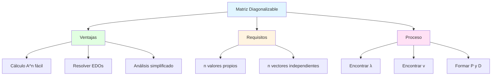
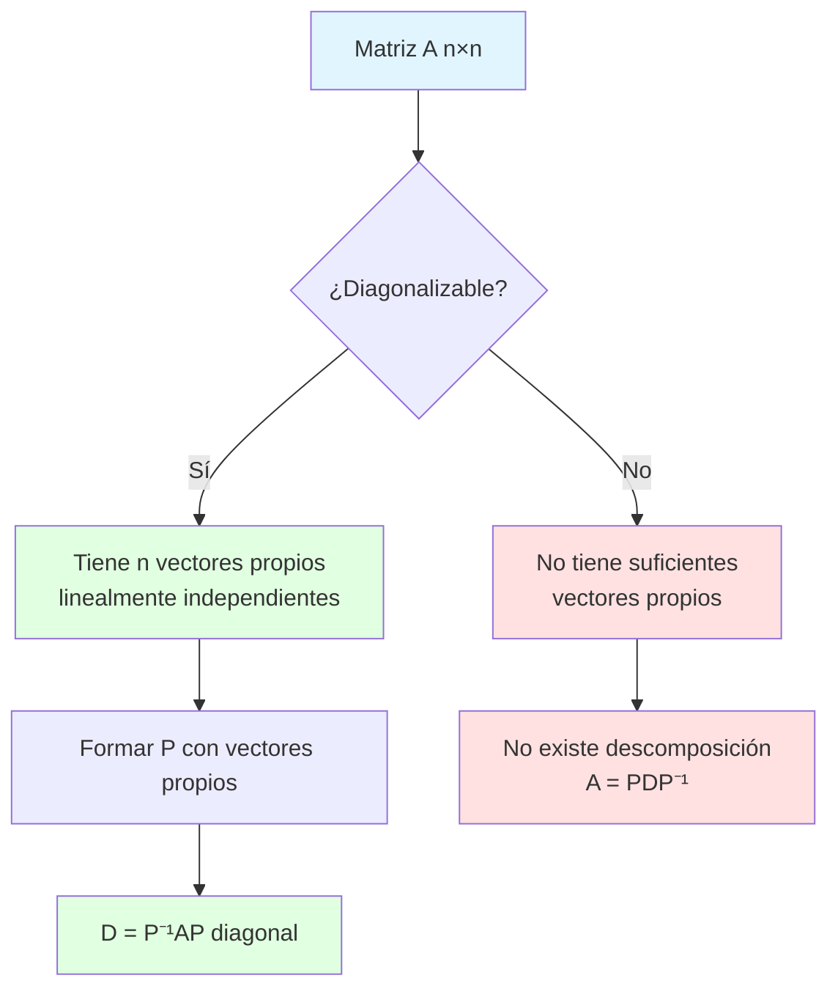
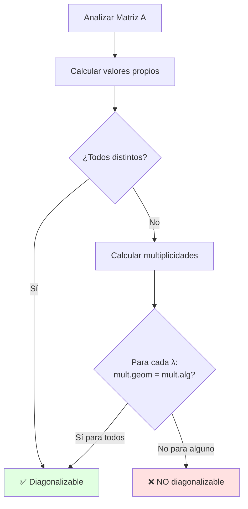
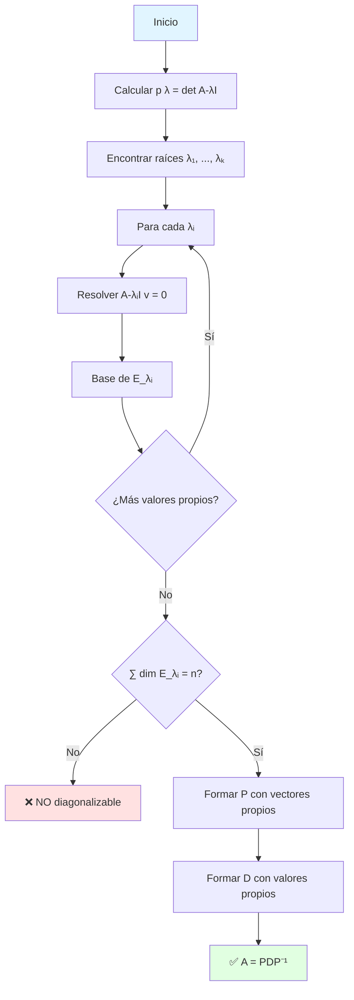
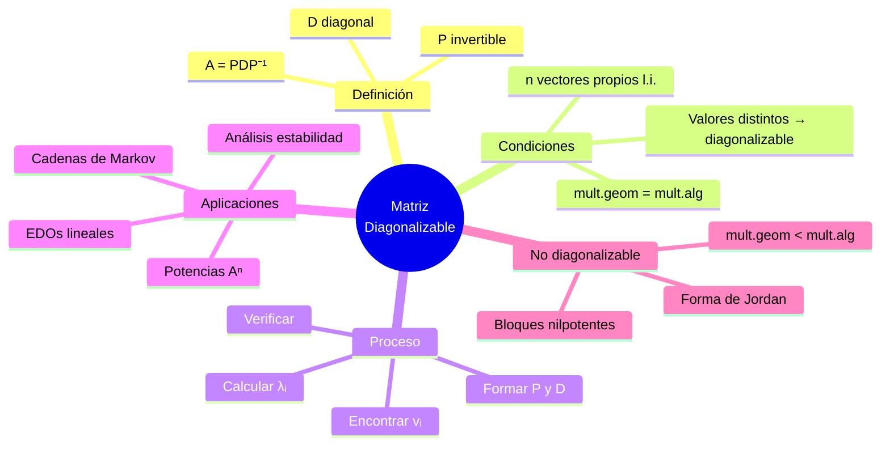

# 💎 Matriz Diagonalizable

## 🎯 Introducción

> [!info]- 💡 ¿Qué es una Matriz Diagonalizable? Una **matriz diagonalizable** es aquella que puede transformarse en una matriz diagonal mediante un cambio de base apropiado. Es decir, una matriz que es **semejante a una matriz diagonal**. Esta propiedad es fundamental porque las matrices diagonales son extremadamente fáciles de trabajar.
> 
> **Analogía práctica:** Imagina un sistema complejo de ecuaciones interconectadas:
> 
> - **Sistema original (matriz A):** Todas las variables se afectan entre sí
> - **Sistema diagonalizado (matriz D):** Cada ecuación es independiente
> - **Cambio de base (matriz P):** La "traducción" que desacopla el sistema
> 
> Diagonalizar es como encontrar el "lenguaje natural" donde el problema se vuelve trivial.
> 
> **¿Por qué es importante?**
> 
> |Aspecto|Descripción|Aplicación|
> |---|---|---|
> |**Simplificación**|Convertir problema complejo en simple|Cálculo de potencias $A^n$|
> |**Desacoplamiento**|Variables independientes|Sistemas de ecuaciones diferenciales|
> |**Eficiencia**|Cálculos más rápidos|Algoritmos computacionales|
> |**Comprensión**|Ver estructura esencial|Análisis de transformaciones|
> |**Estabilidad**|Análisis de comportamiento|Sistemas dinámicos|



---

## 📚 Definición y Conceptos Fundamentales

### 🎯 Definición Formal

> [!note]- 📋 ¿Qué Significa Ser Diagonalizable?
> 
> **Definición:**
> 
> Una matriz cuadrada $A \in \mathbb{M}_{n \times n}$ es **diagonalizable** si existe una matriz invertible $P$ y una matriz diagonal $D$ tales que:
> 
> $$A = PDP^{-1}$$
> 
> o equivalentemente:
> 
> $$D = P^{-1}AP$$
> 
> **Componentes:**
> 
> |Elemento|Nombre|Descripción|Propiedades|
> |---|---|---|---|
> |$A$|Matriz original|Matriz a diagonalizar|$n \times n$|
> |$D$|Matriz diagonal|Contiene valores propios|$D = \text{diag}(\lambda_1, \ldots, \lambda_n)$|
> |$P$|Matriz de paso|Columnas = vectores propios|Invertible, $\det(P) \neq 0$|
> |$P^{-1}$|Inversa de P|Cambio inverso de base|$P^{-1}P = I$|
> 
> **Forma explícita:**
> 
> $$D = \begin{pmatrix} \lambda_1 & 0 & \cdots & 0 \\ 0 & \lambda_2 & \cdots & 0 \\ \vdots & \vdots & \ddots & \vdots \\ 0 & 0 & \cdots & \lambda_n \end{pmatrix}$$
> 
> $$P = \begin{pmatrix} | & | & & | \\ \mathbf{v}_1 & \mathbf{v}_2 & \cdots & \mathbf{v}_n \\ | & | & & | \end{pmatrix}$$
> 
> donde $\lambda_i$ son los valores propios y $\mathbf{v}_i$ los vectores propios correspondientes.

### 🔑 Teorema Fundamental

> [!success]- ⭐ Condición Necesaria y Suficiente
> 
> **Teorema:**
> 
> Una matriz $A \in \mathbb{M}_{n \times n}$ es diagonalizable si y solo si tiene $n$ vectores propios **linealmente independientes**.
> 
> $$A \text{ diagonalizable} \iff \text{dim}(\text{span}{\mathbf{v}_1, \ldots, \mathbf{v}_n}) = n$$
> 
> **Demostración (⇒):**
> 
> ```
> Si A = PDP⁻¹, entonces:
> AP = PD
> 
> Escribiendo P = [v₁ | v₂ | ⋯ | vₙ]:
> A[v₁ | v₂ | ⋯ | vₙ] = [v₁ | v₂ | ⋯ | vₙ]D
> 
> [Av₁ | Av₂ | ⋯ | Avₙ] = [λ₁v₁ | λ₂v₂ | ⋯ | λₙvₙ]
> 
> Por tanto: Avᵢ = λᵢvᵢ para i = 1, ..., n
> 
> Los vᵢ son vectores propios, y como P es invertible,
> son linealmente independientes. ✓
> ```
> 
> **Demostración (⇐):**
> 
> ```
> Si tenemos n vectores propios l.i. v₁, ..., vₙ:
> Avᵢ = λᵢvᵢ para i = 1, ..., n
> 
> Formar P = [v₁ | v₂ | ⋯ | vₙ]
> P es invertible (columnas l.i.)
> 
> AP = A[v₁ | v₂ | ⋯ | vₙ]
>    = [Av₁ | Av₂ | ⋯ | Avₙ]
>    = [λ₁v₁ | λ₂v₂ | ⋯ | λₙvₙ]
>    = [v₁ | v₂ | ⋯ | vₙ][λ₁  0   ⋯  0 ]
>                          [0  λ₂  ⋯  0 ]
>                          [⋮   ⋮   ⋱  ⋮ ]
>                          [0   0  ⋯  λₙ]
>    = PD
> 
> Por tanto: A = PDP⁻¹ ✓
> ```



---

## 🔍 Criterios de Diagonalización

### ✅ Condiciones Suficientes

> [!tip]- 🎯 Cuándo Una Matriz ES Diagonalizable
> 
> **Criterio 1: Valores propios distintos**
> 
> Si $A$ tiene $n$ valores propios **distintos**, entonces $A$ es diagonalizable.
> 
> **Demostración:**
> 
> ```
> Teorema: Vectores propios correspondientes a valores propios
> distintos son linealmente independientes.
> 
> Si λ₁, λ₂, ..., λₙ son distintos, entonces los n vectores
> propios v₁, v₂, ..., vₙ son l.i.
> 
> Por tanto, A es diagonalizable. ✓
> ```
> 
> **Criterio 2: Suma de dimensiones de espacios propios**
> 
> $$A \text{ diagonalizable} \iff \sum_{i=1}^{k} \dim(E_{\lambda_i}) = n$$
> 
> donde $E_{\lambda_i}$ es el espacio propio asociado a $\lambda_i$.
> 
> **Criterio 3: Multiplicidad algebraica = geométrica**
> 
> Para cada valor propio $\lambda_i$:
> 
> $$\text{mult. algebraica}(\lambda_i) = \text{mult. geométrica}(\lambda_i)$$
> 
> donde:
> 
> - **Multiplicidad algebraica** = multiplicidad como raíz del polinomio característico
> - **Multiplicidad geométrica** = $\dim(E_{\lambda_i})$ = número de vectores propios l.i.
> 
> **Tabla comparativa:**
> 
> |Criterio|Condición|Tipo|Facilidad|
> |---|---|---|---|
> |**Valores distintos**|$\lambda_i \neq \lambda_j$ para $i \neq j$|Suficiente|⭐⭐⭐ Muy fácil|
> |**Suma dimensiones**|$\sum \dim(E_{\lambda_i}) = n$|Necesaria y suficiente|⭐⭐ Medio|
> |**Multiplicidades**|alg = geom para todo $\lambda$|Necesaria y suficiente|⭐ Complejo|

### ❌ Condiciones de NO Diagonalización

> [!warning]- 🚫 Cuándo Una Matriz NO ES Diagonalizable
> 
> **Señales de que A NO es diagonalizable:**
> 
> |Indicador|Explicación|Ejemplo|
> |---|---|---|
> |**mult. geom < mult. alg**|No hay suficientes vectores propios|$\lambda = 2$ (doble), pero $\dim(E_2) = 1$|
> |**$\sum \dim(E_{\lambda_i}) < n$**|Espacios propios muy pequeños|Suma de dimensiones = $n-1$|
> |**Bloque de Jordan**|Estructura no diagonalizable|$\begin{pmatrix} \lambda & 1 \ 0 & \lambda \end{pmatrix}$|
> 
> **Ejemplo clásico NO diagonalizable:**
> 
> $$A = \begin{pmatrix} 2 & 1 \ 0 & 2 \end{pmatrix}$$
> 
> ```
> Análisis:
> 
> Polinomio característico:
> det(A - λI) = (2-λ)² = 0
> λ = 2 (multiplicidad algebraica = 2)
> 
> Espacio propio:
> (A - 2I)v = [0  1][v₁] = [0]
>             [0  0][v₂]   [0]
> 
> v₂ = 0, v₁ libre
> E₂ = span{[1, 0]ᵀ}
> dim(E₂) = 1 (multiplicidad geométrica = 1)
> 
> Como mult. geom (1) < mult. alg (2),
> A NO es diagonalizable. ❌
> ```



---

## 🔧 Proceso de Diagonalización

### 📐 Método Paso a Paso

> [!example]- 🎯 Algoritmo Completo
> 
> **Entrada:** Matriz $A \in \mathbb{M}_{n \times n}$
> 
> **Salida:** Matrices $P$, $D$ tales que $A = PDP^{-1}$ (si existe)
> 
> **PASO 1: Calcular el polinomio característico**
> 
> $$p(\lambda) = \det(A - \lambda I)$$
> 
> **PASO 2: Encontrar valores propios**
> 
> Resolver $p(\lambda) = 0$ para obtener $\lambda_1, \lambda_2, \ldots, \lambda_k$
> 
> **PASO 3: Para cada valor propio $\lambda_i$:**
> 
> a) Resolver el sistema homogéneo: $$(A - \lambda_i I)\mathbf{v} = \mathbf{0}$$
> 
> b) Encontrar una base del espacio propio $E_{\lambda_i}$
> 
> c) Anotar $m_i = \dim(E_{\lambda_i})$ (multiplicidad geométrica)
> 
> **PASO 4: Verificar diagonalizabilidad**
> 
> $$\sum_{i=1}^{k} m_i = n \quad ?$$
> 
> - Si **SÍ**: Continuar al paso 5
> - Si **NO**: La matriz NO es diagonalizable ❌
> 
> **PASO 5: Formar matriz P**
> 
> $$P = [\mathbf{v}_1 | \mathbf{v}_2 | \cdots | \mathbf{v}_n]$$
> 
> donde los $\mathbf{v}_i$ son todos los vectores propios encontrados.
> 
> **PASO 6: Formar matriz D**
> 
> $$D = \text{diag}(\lambda_1, \lambda_1, \ldots, \lambda_2, \lambda_2, \ldots, \lambda_k)$$
> 
> (cada $\lambda_i$ aparece tantas veces como su multiplicidad geométrica)
> 
> **PASO 7: Verificación (opcional pero recomendado)**
> 
> Calcular $PD$ y $AP$, verificar que son iguales.



### 💡 Ejemplo Completo 2×2

> [!example]- 📝 Diagonalización Detallada
> 
> **Problema:** Diagonalizar
> 
> $$A = \begin{pmatrix} 1 & 2 \\ 2 & 1 \end{pmatrix}$$
> 
> ```
> SOLUCIÓN COMPLETA:
> 
> PASO 1: Polinomio característico
> 
> det(A - λI) = det([1-λ   2 ])
>                   [2   1-λ]
>             = (1-λ)(1-λ) - 4
>             = 1 - 2λ + λ² - 4
>             = λ² - 2λ - 3
>             = (λ-3)(λ+1)
> 
> PASO 2: Valores propios
> λ₁ = 3, λ₂ = -1
> 
> ✓ Dos valores distintos ⟹ Definitivamente diagonalizable
> 
> PASO 3a: Vector propio para λ₁ = 3
> 
> (A - 3I)v = [1-3   2 ][v₁] = [0]
>             [2   1-3][v₂]   [0]
> 
>           = [-2  2][v₁] = [0]
>             [2  -2][v₂]   [0]
> 
> De -2v₁ + 2v₂ = 0: v₁ = v₂
> 
> Vector propio: v₁ = [1]  (tomando v₁ = v₂ = 1)
>                     [1]
> 
> PASO 3b: Vector propio para λ₂ = -1
> 
> (A + I)v = [1+1   2 ][v₁] = [0]
>            [2   1+1][v₂]   [0]
> 
>          = [2  2][v₁] = [0]
>            [2  2][v₂]   [0]
> 
> De 2v₁ + 2v₂ = 0: v₁ = -v₂
> 
> Vector propio: v₂ = [ 1]  (tomando v₁ = 1, v₂ = -1)
>                     [-1]
> 
> PASO 4: Verificar diagonalizabilidad
> Tenemos 2 vectores propios l.i. para matriz 2×2 ✓
> 
> PASO 5: Formar P
> P = [1   1]
>     [1  -1]
> 
> PASO 6: Formar D
> D = [3   0]
>     [0  -1]
> 
> PASO 7: Calcular P⁻¹
> det(P) = 1(-1) - 1(1) = -2
> 
> P⁻¹ = (1/-2)[-1  -1] = [1/2   1/2]
>             [-1   1]   [1/2  -1/2]
> 
> PASO 8: Verificación
> PD = [1   1][3   0] = [3  -1]
>      [1  -1][0  -1]   [3   1]
> 
> AP = [1  2][1   1] = [3  -1]
>      [2  1][1  -1]   [3   1]
> 
> PD = AP ✓
> 
> RESPUESTA FINAL:
> 
> A = PDP⁻¹ donde:
> 
> P = [1   1],  D = [3   0],  P⁻¹ = [1/2   1/2]
>     [1  -1]       [0  -1]         [1/2  -1/2]
> ```

### 🎲 Ejemplo Completo 3×3

> [!example]- 📝 Caso con Valor Propio Repetido
> 
> **Problema:** Diagonalizar
> 
> $$A = \begin{pmatrix} 2 & 1 & 1 \ 1 & 2 & 1 \ 1 & 1 & 2 \end{pmatrix}$$
> 
> ```
> SOLUCIÓN:
> 
> PASO 1: Polinomio característico
> 
> det(A - λI) = det([2-λ   1    1 ])
>                   [1   2-λ   1 ]
>                   [1    1   2-λ]
> 
> Expandiendo por primera fila:
> = (2-λ)[(2-λ)² - 1] - 1[(2-λ) - 1] + 1[1 - (2-λ)]
> = (2-λ)[(2-λ)² - 1] - (1-λ) + (λ-1)
> = (2-λ)[(2-λ)² - 1]
> = (2-λ)[(2-λ-1)(2-λ+1)]
> = (2-λ)(1-λ)(3-λ)
> = -(λ-2)(λ-1)(λ-3)
> 
> PASO 2: Valores propios
> λ₁ = 1, λ₂ = 2, λ₃ = 3
> 
> ✓ Tres valores distintos ⟹ Diagonalizable
> 
> PASO 3a: Vector propio para λ₁ = 1
> 
> (A - I)v = [1  1  1][v₁]   [0]
>            [1  1  1][v₂] = [0]
>            [1  1  1][v₃]   [0]
> 
> v₁ + v₂ + v₃ = 0
> 
> Solución: v₁ = -v₂ - v₃
> 
> Vectores base: [-1]  [-1]
>                [1 ], [0 ]
>                [0 ]  [1 ]
> 
> Elegimos: v₁ = [-1]
>                [1 ]
>                [0 ]
> 
> PASO 3b: Vector propio para λ₂ = 2
> 
> (A - 2I)v = [0  1  1][v₁]   [0]
>             [1  0  1][v₂] = [0]
>             [1  1  0][v₃]   [0]
> 
> De v₂ + v₃ = 0: v₃ = -v₂
> De v₁ + v₃ = 0: v₁ = -v₃ = v₂
> 
> v₂ = [ 1]
>      [ 1]
>      [-1]
> 
> PASO 3c: Vector propio para λ₃ = 3
> 
> (A - 3I)v = [-1  1  1][v₁]   [0]
>             [1  -1  1][v₂] = [0]
>             [1   1 -1][v₃]   [0]
> 
> De -v₁ + v₂ + v₃ = 0: v₁ = v₂ + v₃
> De v₁ - v₂ + v₃ = 0: v₁ + v₃ = v₂
> 
> Resolviendo: v₁ = v₂ = v₃
> 
> v₃ = [1]
>      [1]
>      [1]
> 
> PASO 5: Formar P
> P = [-1  1  1]
>     [ 1  1  1]
>     [ 0 -1  1]
> 
> PASO 6: Formar D
> D = [1  0  0]
>     [0  2  0]
>     [0  0  3]
> 
> RESPUESTA:
> A = PDP⁻¹ con las matrices anteriores
> ```

---

## 🚀 Aplicaciones de la Diagonalización

### 📊 Potencias de Matrices

> [!tip]- ⚡ Cálculo Eficiente de $A^n$
> 
> **Propiedad fundamental:**
> 
> Si $A = PDP^{-1}$, entonces:
> 
> $$A^n = PD^nP^{-1}$$
> 
> donde:
> 
> $$D^n = \begin{pmatrix} \lambda_1^n & 0 & \cdots & 0 \ 0 & \lambda_2^n & \cdots & 0 \ \vdots & \vdots & \ddots & \vdots \ 0 & 0 & \cdots & \lambda_k^n \end{pmatrix}$$
> 
> **Demostración:**
> 
> ```
> A² = (PDP⁻¹)(PDP⁻¹) = PD(P⁻¹P)DP⁻¹ = PDIDP⁻¹ = PD²P⁻¹
> A³ = A²A = (PD²P⁻¹)(PDP⁻¹) = PD³P⁻¹
> 
> Por inducción: Aⁿ = PDⁿP⁻¹
> ```
> 
> **Ventaja computacional:**
> 
> |Método|Operaciones|Complejidad|
> |---|---|---|
> |**Multiplicación directa**|$(n-1)$ multiplicaciones de matrices|$O(n^4)$|
> |**Con diagonalización**|2 multiplicaciones + potencia diagonal|$O(n^3) + O(n)$|
> 
> **Ejemplo:** Calcular $A^{10}$ donde $A = \begin{pmatrix} 1 & 2 \ 2 & 1 \end{pmatrix}$
> 
> ```
> Del ejemplo anterior sabemos:
> A = PDP⁻¹ con D = [3   0]
>                     [0  -1]
> 
> D¹⁰ = [3¹⁰    0  ] = [59049      0]
>       [0   (-1)¹⁰]   [0          1]
> 
> A¹⁰ = PD¹⁰P⁻¹
>     = [1   1][59049  0][1/2   1/2]
>       [1  -1][0      1][1/2  -1/2]
> 
> Paso intermedio:
> D¹⁰P⁻¹ = [59049  0][1/2   1/2]
>          [0      1][1/2  -1/2]
> 
>        = [29524.5  29524.5]
>          [0.5     -0.5    ]
> 
> A¹⁰ = [1   1][29524.5  29524.5]
>       [1  -1][0.5     -0.5    ]
> 
>     = [29525  29524]
>       [29524  29525]
> ```

### 🔄 Sistemas de Ecuaciones Diferenciales

> [!success]- 📈 Resolución de EDOs Lineales
> 
> **Sistema lineal homogéneo:**
> 
> $$\frac{d\mathbf{x}}{dt} = A\mathbf{x}$$
> 
> **Si $A = PDP^{-1}$ es diagonalizable, la solución es:**
> 
> $$\mathbf{x}(t) = Pe^{Dt}P^{-1}\mathbf{x}_0$$
> 
> donde:
> 
> $$e^{Dt} = \begin{pmatrix} e^{\lambda_1 t} & 0 & \cdots & 0 \ 0 & e^{\lambda_2 t} & \cdots & 0 \ \vdots & \vdots & \ddots & \vdots \ 0 & 0 & \cdots & e^{\lambda_n t} \end{pmatrix}$$
> 
> **Ejemplo:** Resolver
> 
> $$\frac{d}{dt}\begin{pmatrix} x \ y \end{pmatrix} = \begin{pmatrix} 1 & 2 \ 2 & 1 \end{pmatrix}\begin{pmatrix} x \ y \end{pmatrix}, \quad \begin{pmatrix} x(0) \ y(0) \end{pmatrix} = \begin{pmatrix} 1 \ 0 \end{pmatrix}$$
> 
> ```
> Solución:
> 
> De ejemplos anteriores: A = PDP⁻¹ con
> D = [3   0], P = [1   1], P⁻¹ = [1/2   1/2]
>     [0  -1]      [1  -1]         [1/2  -1/2]
> 
> e^(Dt) = [e^(3t)    0  ]
>          [0      e^(-t)]
> 
> x(t) = Pe^(Dt)P⁻¹x₀
>      = [1   1][e^(3t)    0  ][1/2   1/2][1]
>        [1  -1][0      e^(-t)][1/2  -1/2][0]
> 
> P⁻¹x₀ = [1/2]
>         [1/2]
> 
> e^(Dt)P⁻¹x₀ = [e^(3t)/2  ]
>               [e^(-t)/2  ]
> 
> x(t) = [1   1][e^(3t)/2  ]
>        [1  -1][e^(-t)/2  ]
> 
>      = [(e^(3t) + e^(-t))/2]
>        [(e^(3t) - e^(-t))/2]
> 
> Por tanto:
> x(t) = (e^(3t) + e^(-t))/2
> y(t) = (e^(3t) - e^(-t))/2
> ```

### 🌊 Cadenas de Markov

> [!note]- 🎲 Análisis de Procesos Estocásticos
> 
> **Matriz de transición P:**
> 
> Si $P$ es diagonalizable: $P = QDQ^{-1}$
> 
> **Estado después de n pasos:**
> 
> $$\mathbf{x}_n = P^n\mathbf{x}_0 = QD^nQ^{-1}\mathbf{x}_0$$
> 
> **Comportamiento a largo plazo:**
> 
> $$\lim_{n \to \infty} P^n = \lim_{n \to \infty} QD^nQ^{-1}$$
> 
> - Si $|\lambda_i| < 1$ para $i \geq 2$, el sistema converge al vector propio de $\lambda_1 = 1$

---

## 📊 Resumen Visual Completo

### Mapa Conceptual



### Tabla de Referencia Rápida

> [!quote]- 📚 Guía Práctica
> 
> **Checklist de diagonalización:**
> 
> - [ ] Calcular $p(\lambda) = \det(A - \lambda I)$
> - [ ] Encontrar valores propios (raíces de $p(\lambda)$)
> - [ ] Para cada $\lambda_i$: resolver $(A - \lambda_i I)\mathbf{v} = \mathbf{0}$
> - [ ] Verificar: ¿$\sum \dim(E_{\lambda_i}) = n$?
> - [ ] Formar $P = [\mathbf{v}_1 | \cdots | \mathbf{v}_n]$
> - [ ] Formar $D = \text{diag}(\lambda_1, \ldots, \lambda_n)$
> - [ ] Calcular $P^{-1}$
> - [ ] Verificar: $AP = PD$
> 
> **Decisión rápida:**
> 
> |Situación|¿Diagonalizable?|
> |---|---|
> |$n$ valores propios distintos|✅ SÍ|
> |Matriz simétrica real|✅ SÍ (ortogonalmente)|
> |mult.geom < mult.alg para algún $\lambda$|❌ NO|
> |$\sum \dim(E_{\lambda_i}) < n$|❌ NO|

---

## 🎓 Ejercicios Resueltos Avanzados

> [!example]- 💪 Ejercicio 1: Matriz 3×3 con Valor Propio Triple
> 
> **Problema:** Determinar si es diagonalizable:
> 
> $$A = \begin{pmatrix} 2 & 0 & 0 \ 1 & 2 & 0 \ 0 & 1 & 2 \end{pmatrix}$$
> 
> ```
> SOLUCIÓN:
> 
> Paso 1: Valores propios (matriz triangular)
> λ = 2 (multiplicidad algebraica = 3)
> 
> Paso 2: Espacio propio para λ = 2
> (A - 2I)v = [0  0  0][v₁]   [0]
>             [1  0  0][v₂] = [0]
>             [0  1  0][v₃]   [0]
> 
> De las ecuaciones:
> v₁ = 0
> v₂ = 0
> v₃ libre
> 
> E₂ = span{[0, 0, 1]ᵀ}
> dim(E₂) = 1
> 
> Paso 3: Verificar diagonalizabilidad
> mult. algebraica = 3
> mult. geométrica = 1
> 
> Como 1 < 3, A NO es diagonalizable ❌
> 
> Conclusión: A tiene forma de Jordan:
> J = [2  1  0]
>     [0  2  1]
>     [0  0  2]
> ```

> [!example]- 💪 Ejercicio 2: Aplicación a Fibonacci
> 
> **Problema:** Usar diagonalización para encontrar fórmula cerrada de Fibonacci.
> 
> La recurrencia $F_{n+1} = F_n + F_{n-1}$ puede escribirse como:
> 
> $$\begin{pmatrix} F_{n+1} \ F_n \end{pmatrix} = \begin{pmatrix} 1 & 1 \ 1 & 0 \end{pmatrix}\begin{pmatrix} F_n \ F_{n-1} \end{pmatrix}$$
> 
> ```
> SOLUCIÓN:
> 
> Sea A = [1  1]
>         [1  0]
> 
> Paso 1: Valores propios
> det(A - λI) = λ² - λ - 1 = 0
> 
> λ = (1 ± √5)/2
> 
> λ₁ = φ = (1 + √5)/2  (razón áurea)
> λ₂ = ψ = (1 - √5)/2
> 
> Paso 2: Vectores propios
> Para λ₁ = φ:
> v₁ = [φ]
>      [1]
> 
> Para λ₂ = ψ:
> v₂ = [ψ]
>      [1]
> 
> Paso 3: Diagonalización
> A = PDP⁻¹ con P = [φ  ψ], D = [φ  0]
>                    [1  1]      [0  ψ]
> 
> Paso 4: Fórmula de Fibonacci
> [F_n  ] = Aⁿ[1] = PDⁿP⁻¹[1]
> [F_n-1]     [0]          [0]
> 
> Después de cálculos:
> F_n = (φⁿ - ψⁿ)/√5
>     = ((1+√5)/2)ⁿ - ((1-√5)/2)ⁿ
>       ────────────────────────────
>                 √5
> 
> ✓ Fórmula de Binet
> ```

---

## 🔗 Conexión con Próximos Temas

> [!quote]- 🌟 Continuando el Aprendizaje
> 
> **Progresión natural:**
> 
> ```mermaid
> graph LR
>     A[Matriz Diagonalizable] --> B[Formas Canónicas]
>     A --> C[Diagonalización Ortogonal]
>     A --> D[Descomposición SVD]
>     
>     B --> E[Forma de Jordan]
>     C --> F[Teorema Espectral]
>     D --> G[Análisis de Datos]
>     
>     E --> H[Clasificación completa]
>     F --> H
>     G --> H
>     
>     style A fill:#e1ffe1
>     style B fill:#fff4e1
>     style C fill:#e1f5ff
>     style D fill:#ffe1f5
> ```
> 
> |Concepto Actual|Próximo Tema|Relación|
> |---|---|---|
> |Diagonalización|Forma de Jordan|Generalización para matrices no diagonalizables|
> |Vectores propios|Teorema espectral|Bases ortonormales de vectores propios|
> |Valores propios|SVD|Valores singulares (generalización)|
> |$A = PDP^{-1}$|$A = QDQ^T$|Diagonalización ortogonal (matrices simétricas)|

---

**Tags:** #álgebra-lineal #diagonalización #valores-propios #vectores-propios #matrices #transformaciones-lineales #aplicaciones #EDO #potencias #mermaid
