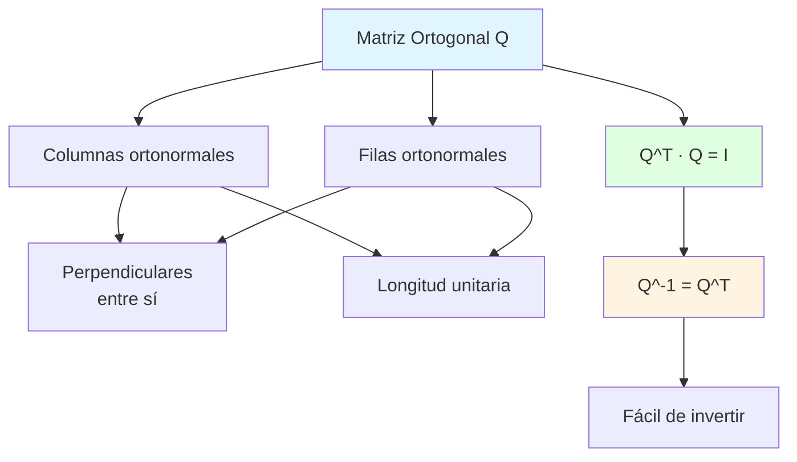

# 📊 Matriz Ortogonal 

## 🎯 Introducción

> [!info]- 💡 ¿Qué es una Matriz Ortogonal?
> 
> Una **matriz ortogonal** es una matriz cuadrada cuyas columnas (y filas) forman un conjunto de vectores **ortonormales**. Es uno de los conceptos más importantes en álgebra lineal por sus propiedades de preservación geométrica.
> 
> **Definición formal:** Una matriz **Q** es ortogonal si y solo si:
> 
> **Q^T · Q = Q · Q^T = I**
> 
> Donde:
> 
> - **Q^T** es la transpuesta de Q
> - **I** es la matriz identidad
> - Equivalentemente: **Q^(-1) = Q^T**
> 
> **Analogía práctica:** Imagina los ejes coordenados (x, y, z) en el espacio 3D. Son perpendiculares entre sí y tienen longitud unitaria. Una matriz ortogonal mantiene estas propiedades al transformar el espacio.
> 
> **¿Por qué es importante?**
> 
> |Aspecto|Descripción|Aplicación|
> |---|---|---|
> |**Preserva distancias**|No deforma objetos|Rotaciones en gráficos 3D|
> |**Preserva ángulos**|Mantiene perpendicularidad|Sistemas de coordenadas|
> |**Inversión trivial**|Q^(-1) = Q^T (muy rápido)|Algoritmos numéricos|
> |**Estabilidad numérica**|No amplifica errores|Computación científica|
> |**Cambios de base**|Transforma coordenadas|Física, ingeniería|



---

## 🏗️ Fundamentos Matemáticos

### 📐 Vectores Ortogonales y Ortonormales

> [!example]- 🔢 Conceptos Base
> 
> **1. Producto escalar (producto punto):**
> 
> Para vectores **u** = (u₁, u₂, ..., uₙ) y **v** = (v₁, v₂, ..., vₙ):
> 
> **u · v = u₁v₁ + u₂v₂ + ... + uₙvₙ**
> 
> Ejemplo en ℝ³:
> 
> ```
> u = (1, 2, 3)
> v = (4, 5, 6)
> 
> u · v = 1(4) + 2(5) + 3(6) = 4 + 10 + 18 = 32
> ```
> 
> **2. Norma (longitud) de un vector:**
> 
> **‖u‖ = √(u · u) = √(u₁² + u₂² + ... + uₙ²)**
> 
> Ejemplo:
> 
> ```
> u = (3, 4)
> ‖u‖ = √(3² + 4²) = √(9 + 16) = √25 = 5
> ```
> 
> **3. Vectores ortogonales:**
> 
> Dos vectores **u** y **v** son **ortogonales** si:
> 
> **u · v = 0**
> 
> Ejemplo:
> 
> ```
> u = (1, 2)
> v = (-2, 1)
> 
> u · v = 1(-2) + 2(1) = -2 + 2 = 0  ✅ Ortogonales
> ```
> 
> **Visualización geométrica:**
> 
> ```mermaid
> graph LR
>     A[Origen] --> B[Vector u]
>     A --> C[Vector v]
>     
>     B -.-> D[Ángulo = 90°]
>     C -.-> D
>     
>     E[u · v = 0] --> F[Perpendiculares]
>     
>     style B fill:#e1ffe1
>     style C fill:#fff4e1
>     style F fill:#ffe1e1
> ```
> 
> **4. Vectores ortonormales:**
> 
> Dos vectores son **ortonormales** si:
> 
> - Son **ortogonales**: u · v = 0
> - Tienen **norma unitaria**: ‖u‖ = ‖v‖ = 1
> 
> Ejemplo:
> 
> ```
> u = (1, 0)
> v = (0, 1)
> 
> u · v = 1(0) + 0(1) = 0           ✅ Ortogonales
> ‖u‖ = √(1² + 0²) = 1              ✅ Unitario
> ‖v‖ = √(0² + 1²) = 1              ✅ Unitario
> 
> → u y v son ortonormales
> ```
> 
> **Tabla comparativa:**
> 
> |Propiedad|Vectores Generales|Ortogonales|Ortonormales|
> |---|---|---|---|
> |**Producto escalar**|Cualquier valor|= 0|= 0|
> |**Norma**|Cualquier valor|Cualquiera|= 1|
> |**Ángulo**|0° a 180°|90°|90°|
> |**Independencia lineal**|No garantizada|✅ Garantizada|✅ Garantizada|
> |**Forman base**|Depende|✅ Base ortogonal|✅ Base ortonormal|

### 🎨 Definición de Matriz Ortogonal

> [!note]- 📝 Caracterización Completa
> 
> **Definición 1 (Mediante la transpuesta):**
> 
> Una matriz **Q ∈ ℝⁿˣⁿ** es ortogonal si:
> 
> **Q^T Q = I**
> 
> Donde I es la matriz identidad n×n.
> 
> **Ejemplo en ℝ²:**
> 
> ```
> Q = [ cos(θ)  -sin(θ) ]
>     [ sin(θ)   cos(θ) ]
> 
> Q^T = [ cos(θ)   sin(θ) ]
>       [-sin(θ)   cos(θ) ]
> 
> Q^T Q = [ cos²(θ)+sin²(θ)   -cos(θ)sin(θ)+sin(θ)cos(θ) ]
>         [-sin(θ)cos(θ)+cos(θ)sin(θ)   sin²(θ)+cos²(θ) ]
> 
>       = [ 1  0 ]  = I  ✅
>         [ 0  1 ]
> ```
> 
> **Definición 2 (Mediante columnas ortonormales):**
> 
> Q es ortogonal si sus columnas **q₁, q₂, ..., qₙ** son ortonormales:
> 
> - **qᵢ · qⱼ = 0** si i ≠ j (ortogonales)
> - **qᵢ · qᵢ = 1** (norma unitaria)
> 
> **Ejemplo:**
> 
> ```
> Q = [ 1/√2   1/√2 ]
>     [ 1/√2  -1/√2 ]
> 
> Columna 1: q₁ = (1/√2, 1/√2)
> Columna 2: q₂ = (1/√2, -1/√2)
> 
> Verificación:
> q₁ · q₂ = (1/√2)(1/√2) + (1/√2)(-1/√2) = 1/2 - 1/2 = 0  ✅
> ‖q₁‖ = √((1/√2)² + (1/√2)²) = √(1/2 + 1/2) = 1  ✅
> ‖q₂‖ = √((1/√2)² + (-1/√2)²) = √(1/2 + 1/2) = 1  ✅
> ```
> 
> **Propiedades equivalentes:**
> 
> ```mermaid
> graph TD
>     A[Matriz Ortogonal Q] --> B[Q^T Q = I]
>     A --> C[Q Q^T = I]
>     A --> D[Q^-1 = Q^T]
>     A --> E[Columnas ortonormales]
>     A --> F[Filas ortonormales]
>     A --> G[det Q = ±1]
>     
>     B -.-> H[Todas son<br/>equivalentes]
>     C -.-> H
>     D -.-> H
>     E -.-> H
>     F -.-> H
>     G -.-> H
>     
>     style A fill:#e1f5ff
>     style H fill:#e1ffe1
> ```
> 
> **Matriz identidad como matriz ortogonal:**
> 
> ```
> I = [ 1  0  0 ]
>     [ 0  1  0 ]
>     [ 0  0  1 ]
> 
> I^T I = I · I = I  ✅
> 
> Columnas: (1,0,0), (0,1,0), (0,0,1)
> - Perpendiculares entre sí
> - Cada una tiene norma 1
> ```

### 🔍 Verificación de Ortogonalidad

> [!success]- ✅ Proceso de Comprobación
> 
> **Método 1: Multiplicar Q^T por Q**
> 
> ```
> Dada:
> Q = [ 0  -1 ]
>     [ 1   0 ]
> 
> Paso 1: Calcular Q^T
> Q^T = [ 0   1 ]
>       [-1   0 ]
> 
> Paso 2: Calcular Q^T Q
> Q^T Q = [ 0   1 ] [ 0  -1 ]
>         [-1   0 ] [ 1   0 ]
> 
>       = [ 0(0)+1(1)    0(-1)+1(0) ]
>         [-1(0)+0(1)   -1(-1)+0(0) ]
> 
>       = [ 1  0 ]  = I  ✅ Es ortogonal
>         [ 0  1 ]
> ```
> 
> **Método 2: Verificar columnas ortonormales**
> 
> ```
> Q = [ 3/5  -4/5 ]
>     [ 4/5   3/5 ]
> 
> Columna 1: c₁ = (3/5, 4/5)
> Columna 2: c₂ = (-4/5, 3/5)
> 
> Paso 1: Verificar ortogonalidad
> c₁ · c₂ = (3/5)(-4/5) + (4/5)(3/5)
>         = -12/25 + 12/25 = 0  ✅
> 
> Paso 2: Verificar normas
> ‖c₁‖ = √((3/5)² + (4/5)²) = √(9/25 + 16/25) = √(25/25) = 1  ✅
> ‖c₂‖ = √((-4/5)² + (3/5)²) = √(16/25 + 9/25) = √(25/25) = 1  ✅
> 
> → Q es ortogonal
> ```
> 
> **Flujo de verificación:**
> 
> ```mermaid
> flowchart TD
>     A[Matriz Q cuadrada] --> B{¿Calcular Q^T Q?}
>     B -->|Sí| C[Multiplicar matrices]
>     C --> D{¿Resultado = I?}
>     D -->|Sí| E[✅ ES ORTOGONAL]
>     D -->|No| F[❌ NO ES ORTOGONAL]
>     
>     B -->|No| G[Extraer columnas]
>     G --> H[Verificar producto punto<br/>entre cada par]
>     H --> I{¿Todos = 0?}
>     I -->|No| F
>     I -->|Sí| J[Calcular norma<br/>de cada columna]
>     J --> K{¿Todas = 1?}
>     K -->|Sí| E
>     K -->|No| F
>     
>     style E fill:#e1ffe1
>     style F fill:#ffe1e1
> ```
> 
> **Casos de matrices NO ortogonales:**
> 
> ```
> Ejemplo 1: Columnas no perpendiculares
> A = [ 1  1 ]
>     [ 0  1 ]
> 
> c₁ = (1, 0), c₂ = (1, 1)
> c₁ · c₂ = 1(1) + 0(1) = 1 ≠ 0  ❌
> 
> Ejemplo 2: Columnas no unitarias
> B = [ 2  0 ]
>     [ 0  2 ]
> 
> ‖c₁‖ = √(2² + 0²) = 2 ≠ 1  ❌
> 
> Ejemplo 3: No cuadrada
> C = [ 1  0 ]
>     [ 0  1 ]
>     [ 0  0 ]
> 
> No es cuadrada → No puede ser ortogonal  ❌
> ```

---

## 🎨 Tipos y Ejemplos de Matrices Ortogonales

### 🔄 Matrices de Rotación

> [!example]- 🌀 Rotaciones en el Plano
> 
> **Matriz de rotación en ℝ²:**
> 
> Rota vectores un ángulo **θ** en sentido antihorario:
> 
> **R(θ) = [ cos(θ) -sin(θ) ]** **[ sin(θ) cos(θ) ]**
> 
> **Ejemplos específicos:**
> 
> ```
> 1. Rotación 90° (π/2 radianes):
> R(90°) = [ 0  -1 ]
>          [ 1   0 ]
> 
> Efecto: (x, y) → (-y, x)
> Ejemplo: (3, 2) → (-2, 3)
> 
> 2. Rotación 180° (π radianes):
> R(180°) = [ -1   0 ]
>           [  0  -1 ]
> 
> Efecto: (x, y) → (-x, -y)
> Ejemplo: (3, 2) → (-3, -2)
> 
> 3. Rotación 45° (π/4 radianes):
> R(45°) = [ 1/√2  -1/√2 ]
>          [ 1/√2   1/√2 ]
> 
> Efecto: (1, 0) → (1/√2, 1/√2)
> ```
> 
> **Visualización geométrica:**
> 
> ```mermaid
> graph TB
>     A[Vector Original] --> B[Aplicar R θ ]
>     B --> C[Vector Rotado]
>     
>     D[Propiedades:] --> E[✅ Mantiene longitud]
>     D --> F[✅ Mantiene ángulos]
>     D --> G[✅ Preserva orientación]
>     
>     H[det R θ = 1] --> I[Rotación pura<br/>sin reflexión]
>     
>     style B fill:#e1ffe1
>     style E fill:#e1f5ff
>     style F fill:#e1f5ff
>     style G fill:#e1f5ff
> ```
> 
> **Composición de rotaciones:**
> 
> ```
> R(α) · R(β) = R(α + β)
> 
> Ejemplo:
> R(30°) · R(60°) = R(90°)
> 
> [ cos(30°)  -sin(30°) ] [ cos(60°)  -sin(60°) ]   [ 0  -1 ]
> [ sin(30°)   cos(30°) ] [ sin(60°)   cos(60°) ] = [ 1   0 ]
> ```
> 
> **Rotaciones en ℝ³ (alrededor de ejes):**
> 
> ```
> Rotación alrededor del eje Z:
> Rz(θ) = [ cos(θ)  -sin(θ)   0 ]
>         [ sin(θ)   cos(θ)   0 ]
>         [   0        0      1 ]
> 
> Rotación alrededor del eje X:
> Rx(θ) = [ 1     0        0     ]
>         [ 0   cos(θ)  -sin(θ) ]
>         [ 0   sin(θ)   cos(θ) ]
> 
> Rotación alrededor del eje Y:
> Ry(θ) = [  cos(θ)   0   sin(θ) ]
>         [    0      1     0    ]
>         [ -sin(θ)   0   cos(θ) ]
> ```

### 🪞 Matrices de Reflexión

> [!tip]- ↔️ Transformaciones de Espejo
> 
> **Reflexión respecto al eje X:**
> 
> ```
> Rx = [ 1   0 ]
>      [ 0  -1 ]
> 
> Efecto: (x, y) → (x, -y)
> Ejemplo: (3, 2) → (3, -2)
> ```
> 
> **Reflexión respecto al eje Y:**
> 
> ```
> Ry = [ -1  0 ]
>      [  0  1 ]
> 
> Efecto: (x, y) → (-x, y)
> Ejemplo: (3, 2) → (-3, 2)
> ```
> 
> **Reflexión respecto al origen:**
> 
> ```
> Ro = [ -1   0 ]
>      [  0  -1 ]
> 
> Efecto: (x, y) → (-x, -y)
> Ejemplo: (3, 2) → (-3, -2)
> ```
> 
> **Reflexión respecto a una línea y = mx:**
> 
> Fórmula general para reflexión sobre línea con ángulo θ:
> 
> ```
> R(θ) = [ cos(2θ)   sin(2θ) ]
>        [ sin(2θ)  -cos(2θ) ]
> 
> Ejemplo: Reflexión sobre y = x (θ = 45°):
> R(45°) = [ 0  1 ]
>          [ 1  0 ]
> 
> Efecto: (x, y) → (y, x)
> Ejemplo: (3, 2) → (2, 3)
> ```
> 
> **Comparación rotación vs reflexión:**
> 
> ```mermaid
> graph LR
>     A[Matriz Ortogonal] --> B{det Q = ?}
>     B -->|det = +1| C[🔄 Rotación]
>     B -->|det = -1| D[🪞 Reflexión]
>     
>     C --> E[Preserva orientación]
>     D --> F[Invierte orientación]
>     
>     style C fill:#e1ffe1
>     style D fill:#fff4e1
>     style E fill:#e1ffe1
>     style F fill:#fff4e1
> ```
> 
> **Tabla comparativa:**
> 
> |Propiedad|Rotación|Reflexión|
> |---|---|---|
> |**Determinante**|+1|-1|
> |**Orientación**|Preserva|Invierte|
> |**Composición consigo misma**|Rotación acumulada|Identidad (R²=I)|
> |**Ejemplo 2D**|R(90°)|Espejo en eje X|
> |**Quiralidad**|Mantiene|Cambia (objeto ↔ imagen espejo)|

### 🎲 Matrices de Permutación

> [!note]- 🔀 Intercambio de Coordenadas
> 
> **Definición:**
> 
> Matrices que reordenan componentes de un vector. Se obtienen permutando las filas (o columnas) de la matriz identidad.
> 
> **Ejemplos en ℝ³:**
> 
> ```
> 1. Intercambiar primera y segunda coordenada:
> P₁₂ = [ 0  1  0 ]
>       [ 1  0  0 ]
>       [ 0  0  1 ]
> 
> Efecto: (x, y, z) → (y, x, z)
> Ejemplo: (1, 2, 3) → (2, 1, 3)
> 
> 2. Intercambiar segunda y tercera coordenada:
> P₂₃ = [ 1  0  0 ]
>       [ 0  0  1 ]
>       [ 0  1  0 ]
> 
> Efecto: (x, y, z) → (x, z, y)
> Ejemplo: (1, 2, 3) → (1, 3, 2)
> 
> 3. Rotación cíclica:
> Pc = [ 0  0  1 ]
>      [ 1  0  0 ]
>      [ 0  1  0 ]
> 
> Efecto: (x, y, z) → (z, x, y)
> Ejemplo: (1, 2, 3) → (3, 1, 2)
> ```
> 
> **Propiedades especiales:**
> 
> - **P^T = P^(-1)** (ortogonales)
> - **P² = I** para permutaciones simples
> - **det(P) = ±1** (paridad de la permutación)
> - Solo contienen 0s y 1s
> - Exactamente un 1 por fila y columna
> 
> **Todas las permutaciones de ℝ²:**
> 
> ```
> Identidad:          Intercambio:
> I = [ 1  0 ]       P = [ 0  1 ]
>     [ 0  1 ]           [ 1  0 ]
> ```
> 
> **Aplicaciones:**
> 
> |Contexto|Uso|
> |---|---|
> |**Álgebra lineal**|Eliminación gaussiana con pivoteo|
> |**Combinatoria**|Contar permutaciones|
> |**Criptografía**|Algoritmos de mezcla|
> |**Procesamiento señales**|Reordenar datos FFT|

---

## 🛠️ Propiedades Fundamentales

### ⚡ Propiedad de Inversión Trivial

> [!success]- 🔄 Q^(-1) = Q^T
> 
> **Teorema:**
> 
> Si Q es ortogonal, entonces **Q^(-1) = Q^T**
> 
> **Demostración:**
> 
> ```
> Por definición de matriz ortogonal:
> Q^T Q = I
> 
> Multiplicando ambos lados por Q^(-1) a la derecha:
> Q^T Q Q^(-1) = I Q^(-1)
> Q^T I = Q^(-1)
> Q^T = Q^(-1)  ✅
> ```
> 
> **Importancia computacional:**
> 
> ```mermaid
> graph TD
>     A[Necesito calcular Q^-1] --> B{¿Q es ortogonal?}
>     B -->|No| C[Algoritmo general<br/>Eliminación gaussiana<br/>O n³ operaciones]
>     B -->|Sí| D[Simplemente transponer<br/>O n² operaciones]
>     
>     C --> E[Lento y costoso]
>     D --> F[✅ Rápido y eficiente]
>     
>     style C fill:#ffe1e1
>     style D fill:#e1ffe1
>     style E fill:#ffe1e1
>     style F fill:#e1ffe1
> ```
> 
> **Ejemplo práctico:**
> 
> ```
> Dada la matriz de rotación:
> Q = [ cos(30°)  -sin(30°) ]  ≈  [ 0.866  -0.5 ]
>     [ sin(30°)   cos(30°) ]     [ 0.5    0.866 ]
> 
> Para invertir (rotar en sentido contrario):
> 
> Método tradicional (complejo):
> - Calcular determinante
> - Calcular adjunta
> - Dividir entre determinante
> 
> Método para ortogonales (simple):
> Q^(-1) = Q^T = [ 0.866   0.5  ]
>                [-0.5    0.866 ]
> 
> Verificación:
> Q Q^T = [ 0.866  -0.5 ] [ 0.866   0.5  ]
>         [ 0.5    0.866 ] [-0.5    0.866 ]
> 
>       = [ 1  0 ]  ✅
>         [ 0  1 ]
> ```
> 
> **Comparación de costos:**
> 
> |Operación|Matriz general n×n|Matriz ortogonal n×n|
> |---|---|---|
> |**Inversión**|O(n³)|O(n²)|
> |**Tiempo típico (n=100)**|~1,000,000 ops|~10,000 ops|
> |**Estabilidad numérica**|Puede acumular errores|Muy estable|

### 📏 Preservación de Normas y Productos

> [!example]- 📐 Propiedades Geométricas
> 
> **Teorema 1: Preservación de la norma**
> 
> Si Q es ortogonal y v es un vector, entonces:
> 
> **‖Qv‖ = ‖v‖**
> 
> **Demostración:**
> 
> ```
> ‖Qv‖² = (Qv)^T(Qv)
>       = v^T Q^T Q v
>       = v^T I v        (porque Q^T Q = I)
>       = v^T v
>       = ‖v‖²
> 
> Por lo tanto: ‖Qv‖ = ‖v‖  ✅
> ```
> 
> **Interpretación geométrica:**
> 
> Las matrices ortogonales son **isometrías**: transformaciones que preservan distancias.
> 
> ```
> Ejemplo:
> v = (3, 4)
> ‖v‖ = √(9 + 16) = 5
> 
> Q = [ 0  -1 ]  (rotación 90°)
>     [ 1   0 ]
> 
> Qv = [ 0  -1 ] [ 3 ]  =  [ -4 ]
>      [ 1   0 ] [ 4 ]     [  3 ]
> 
> ‖Qv‖ = √(16 + 9) = 5  ✅ Igual que ‖v‖
> ```
> 
> **Teorema 2: Preservación del producto escalar**
> 
> Para vectores u, v y matriz ortogonal Q:
> 
> **(Qu) · (Qv) = u · v**
> 
> **Demostración:**
> 
> ```
> (Qu) · (Qv) = (Qu)^T(Qv)
>             = u^T Q^T Q v
>             = u^T I v
>             = u^T v
>             = u · v  ✅
> ```
> 
> **Consecuencia: Preservación de ángulos**
> 
> ```
> cos(θ) = (u · v) / (‖u‖ ‖v‖)
> 
> cos(θ') = (Qu · Qv) / (‖Qu‖ ‖Qv‖)
>         = (u · v) / (‖u‖ ‖v‖)    (por los teoremas anteriores)
>         = cos(θ)
> 
> Por lo tanto: θ' = θ  ✅
> ```
> 
> **Visualización:**
> 
> ```mermaid
> graph TB
>     A[Matriz Ortogonal Q] --> B[Preserva normas<br/>Qv = v]
>     A --> C[Preserva productos<br/>Qu · Qv = u · v]
>     
>     B --> D[Preserva distancias<br/>d Qu,Qv = d u,v]
>     C --> E[Preserva ángulos<br/>∠ Qu,Qv = ∠ u,v]
>     
>     D --> F[🎯 Isometría]
>     E --> F
>     
>     style A fill:#e1f5ff
>     style F fill:#e1ffe1
> ```
> 
> **Ejemplo completo:**
> 
> ```
> Vectores:
> u = (1, 0)
> v = (0,> Verificar: u · v = 0 (perpendiculares) ‖u‖ = ‖v‖ = 1 (unitarios)
> 
> Matriz ortogonal (rotación 45°): Q = [ 1/√2 -1/√2 ] [ 1/√2 1/√2 ]
> 
> Transformados: Qu = [ 1/√2 ] [ 1/√2 ]
> 
> Qv = [ -1/√2 ] [ 1/√2 ]
> 
> Verificar preservación: Qu · Qv = (1/√2)(-1/√2) + (1/√2)(1/√2) = -1/2 + 1/2 = 0 ✅ ‖Qu‖ = √(1/2 + 1/2) = 1 ✅ ‖Qv‖ = √(1/2 + 1/2) = 1 ✅
> ```

### 🎲 Determinante

> [!tip]- 🔢 det(Q) = ±1
> 
> **Teorema:**
> 
> Si Q es una matriz ortogonal, entonces **det(Q) = ±1**
> 
> **Demostración:**
> 
> ```
> Sabemos que: Q^T Q = I
> 
> Tomando determinante en ambos lados:
> det(Q^T Q) = det(I)
> det(Q^T) · det(Q) = 1
> det(Q) · det(Q) = 1      (porque det(Q^T) = det(Q))
> [det(Q)]² = 1
> det(Q) = ±1  ✅
> ```
> 
> **Interpretación geométrica:**
> 
> El determinante indica cómo cambia el volumen bajo la transformación:
> 
> - **det(Q) = +1**: Preserva orientación (rotación)
> - **det(Q) = -1**: Invierte orientación (reflexión)
> 
> ```mermaid
> graph LR
>     A[Matriz Ortogonal Q] --> B{det Q = ?}
>     B -->|+1| C[Rotación propia<br/>SO n ]
>     B -->|-1| D[Rotación impropia<br/>reflexión]
>     
>     C --> E[Ejemplos:<br/>Rotaciones<br/>Identidad]
>     D --> F[Ejemplos:<br/>Reflexiones<br/>Inversiones]
>     
>     style C fill:#e1ffe1
>     style D fill:#fff4e1
> ```
> 
> **Ejemplos:**
> 
> ```
> 1. Rotación 45°:
> Q = [ 1/√2  -1/√2 ]
>     [ 1/√2   1/√2 ]
> 
> det(Q) = (1/√2)(1/√2) - (-1/√2)(1/√2)
>        = 1/2 + 1/2
>        = 1  ✅ (rotación)
> 
> 2. Reflexión en eje X:
> Q = [ 1   0 ]
>     [ 0  -1 ]
> 
> det(Q) = (1)(-1) - (0)(0)
>        = -1  ✅ (reflexión)
> 
> 3. Permutación:
> Q = [ 0  1 ]
>     [ 1  0 ]
> 
> det(Q) = (0)(0) - (1)(1)
>        = -1  ✅ (número impar de intercambios)
> ```
> 
> **Volumen bajo transformación:**
> 
> Para una región R con volumen V:
> 
> - **Si det(Q) = 1**: Vol(Q(R)) = V
> - **Si det(Q) = -1**: Vol(Q(R)) = V (pero orientación invertida)
> 
> En ambos casos: **|det(Q)| · V = V**, preservando el volumen absoluto.
> 
> **Grupo especial ortogonal SO(n):**
> 
> |Grupo|Definición|Significado|
> |---|---|---|
> |**O(n)**|Todas las matrices ortogonales n×n|det = ±1|
> |**SO(n)**|Matrices ortogonales con det = +1|Solo rotaciones|
> 
> SO(n) es un subgrupo de O(n) que excluye las reflexiones.

---

## 🎯 Aplicaciones

### 🎮 Gráficos por Computadora y Videojuegos

> [!example]- 🖼️ Transformaciones 3D
> 
> **Transformaciones fundamentales en 3D:**
> 
> Las matrices ortogonales son esenciales para manipular objetos en espacios tridimensionales.
> 
> **1. Sistema de cámara:**
> 
> ```
> Vectores de la cámara:
> - Forward (f): Dirección de visión
> - Right (r): Vector lateral
> - Up (u): Vector superior
> 
> Matriz de orientación de cámara:
> Q = [ rx  ry  rz ]
>     [ ux  uy  uz ]
>     [ fx  fy  fz ]
> 
> Propiedades:
> - f ⊥ r ⊥ u (perpendiculares)
> - ‖f‖ = ‖r‖ = ‖u‖ = 1 (unitarios)
> - Q es ortogonal ✅
> ```
> 
> **2. Rotación de objetos 3D:**
> 
> ```
> Para rotar un modelo:
> 
> Rx(θ) = [ 1      0         0     ]
>         [ 0    cos(θ)  -sin(θ) ]
>         [ 0    sin(θ)   cos(θ) ]
> 
> Cada vértice v del modelo:
> v' = Rx(θ) · v
> 
> Ventajas de ortogonalidad:
> ✅ No distorsiona el objeto
> ✅ Mantiene proporciones
> ✅ Inversión rápida (para deshacer rotación)
> ```
> 
> **3. Interpolación de rotaciones (SLERP):**
> 
> ```
> Problema: Interpolar suavemente entre dos orientaciones
> 
> Entrada: Q₀ (orientación inicial), Q₁ (orientación final)
> Salida: Q(t) para t ∈ [0,1]
> 
> Q(t) debe ser ortogonal para todo t
> 
> Método: Interpolación esférica
> - Garantiza rotación suave
> - Preserva ortogonalidad
> - Usado en animaciones de cámara y personajes
> ```
> 
> **Pipeline gráfico:**
> 
> ```mermaid
> flowchart LR
>     A[Modelo 3D<br/>Vértices] --> B[Rotación Q₁<br/>Matriz ortogonal]
>     B --> C[Escalado S]
>     C --> D[Traslación T]
>     D --> E[Proyección<br/>Pantalla 2D]
>     
>     F[Ortogonalidad] -.-> B
>     F -.-> G[✅ Sin deformación<br/>✅ Inversión rápida]
>     
>     style B fill:#e1ffe1
>     style F fill:#e1f5ff
> ```

### 🔬 Física y Mecánica

> [!note]- ⚙️ Sistemas de Referencia
> 
> **1. Cambio de sistemas de coordenadas:**
> 
> ```
> Problema: Convertir entre sistemas de referencia
> 
> Sistema laboratorio (fijo): S
> Sistema móvil (rotado): S'
> 
> Vector en S: v
> Mismo vector en S': v'
> 
> Relación: v' = Q · v
> 
> Donde Q es ortogonal (preserva distancias físicas)
> ```
> 
> **2. Tensor de inercia:**
> 
> ```
> El tensor de inercia I de un cuerpo rígido se transforma bajo rotación Q:
> 
> I' = Q I Q^T
> 
> Como Q es ortogonal:
> - Los valores propios (momentos principales) no cambian
> - Solo cambia la orientación de los ejes principales
> ```
> 
> **3. Ley de conservación del momento angular:**
> 
> ```
> Momento angular: L = I ω
> 
> Bajo rotación Q:
> L' = Q L = Q I ω
> 
> ‖L'‖ = ‖L‖  (preservado porque Q es ortogonal)
> 
> → La magnitud del momento angular es invariante bajo rotaciones
> ```
> 
> **Aplicaciones específicas:**
> 
> |Campo|Uso de matrices ortogonales|
> |---|---|
> |**Mecánica clásica**|Ecuaciones de Euler para cuerpos rígidos|
> |**Mecánica cuántica**|Operadores unitarios (análogos complejos)|
> |**Relatividad**|Transformaciones de Lorentz (generalización)|
> |**Cristalografía**|Grupos de simetría de cristales|

### 📊 Análisis de Datos y Estadística

> [!success]- 📈 Reducción de Dimensionalidad
> 
> **Análisis de Componentes Principales (PCA):**
> 
> ```
> Objetivo: Reducir dimensiones preservando varianza
> 
> Proceso:
> 1. Datos originales: X (n muestras × p variables)
> 2. Matriz de covarianza: C = (1/n) X^T X
> 3. Calcular vectores propios de C
> 4. Formar matriz ortogonal Q con vectores propios
> 5. Datos transformados: Y = X Q
> 
> Q es ortogonal porque:
> - Vectores propios de matriz simétrica son ortogonales
> - Normalizados a longitud 1
> 
> Ventaja:
> ✅ Q^T Q = I garantiza que componentes principales son independientes
> ```
> 
> **Ejemplo simplificado:**
> 
> ```
> Datos 2D con correlación:
> X = [ x₁  y₁ ]
>     [ x₂  y₂ ]
>     [ ...  ... ]
> 
> PCA encuentra rotación Q tal que:
> Y = X Q
> 
> Donde Y tiene componentes no correlacionados:
> - Primera columna: dirección de máxima varianza
> - Segunda columna: dirección perpendicular
> 
> Q preserva distancias → análisis geométrico válido
> ```
> 
> **Visualización:**
> 
> ```mermaid
> graph TB
>     A[Datos originales<br/>X correlacionados] --> B[Aplicar PCA<br/>Calcular Q ortogonal]
>     B --> C[Datos transformados<br/>Y = X Q]
>     
>     D[Propiedades de Q] --> E[✅ Vectores ortogonales]
>     D --> F[✅ Preserva distancias]
>     D --> G[✅ Maximiza varianza]
>     
>     C --> H[Componentes<br/>independientes]
>     
>     style B fill:#e1ffe1
>     style C fill:#fff4e1
> ```
> 
> **Otras aplicaciones estadísticas:**
> 
> |Método|Rol de matrices ortogonales|
> |---|---|
> |**Análisis factorial**|Rotación de factores (varimax, quartimax)|
> |**Análisis discriminante**|Transformación canónica|
> |**Clustering espectral**|Vectores propios del grafo Laplaciano|
> |**Whitening**|Decorrelacionar variables aleatorias|

### 🔐 Procesamiento de Señales

> [!tip]- 📡 Transformadas y Compresión
> 
> **Transformada Discreta del Coseno (DCT):**
> 
> ```
> Base matemática de compresión JPEG
> 
> Matriz DCT (ortogonal):
> D[i,j] = α(i) cos((π(2j+1)i)/(2n))
> 
> Transformación:
> Y = D X D^T
> 
> Inversión (por ortogonalidad):
> X = D^T Y D
> 
> Ventajas:
> ✅ Rápida (D^(-1) = D^T)
> ✅ Concentra energía en pocos coeficientes
> ✅ Permite compresión con pérdida
> ```
> 
> **Transformada de Fourier Discreta:**
> 
> ```
> Descomposición en frecuencias
> 
> Matriz DFT compleja (análogo unitario):
> W[i,j] = e^(-2πijk/n)
> 
> W^H W = I  (donde W^H es conjugada transpuesta)
> 
> Similar a matrices ortogonales pero en dominio complejo
> ```
> 
> **Aplicación en procesamiento de imágenes:**
> 
> ```
> Pipeline de compresión JPEG:
> 
> 1. Imagen original: bloques 8×8
> 2. Aplicar DCT: Y = D X D^T
> 3. Cuantizar coeficientes
> 4. Codificar (Huffman)
> 
> Descompresión:
> 1. Decodificar
> 2. Decuantizar
> 3. DCT inversa: X ≈ D^T Y D
> 
> Ortogonalidad → sin pérdida en transformación
> (solo en cuantización)
> ```

---

## 🔄 Descomposiciones con Matrices Ortogonales

### 📐 Descomposición QR

> [!example]- 🎯 Factorización Fundamental
> 
> **Definición:**
> 
> Toda matriz **A ∈ ℝ^(m×n)** con m ≥ n puede descomponerse como:
> 
> **A = QR**
> 
> Donde:
> 
> - **Q ∈ ℝ^(m×m)**: Matriz ortogonal
> - **R ∈ ℝ^(m×n)**: Matriz triangular superior
> 
> **Interpretación:**
> 
> Q contiene una base ortonormal para el espacio columna de A.
> 
> **Ejemplo en ℝ³:**
> 
> ```
> A = [ 1  1 ]
>     [ 1  0 ]
>     [ 0  1 ]
> 
> Descomposición QR:
> 
> Q = [ 1/√2   1/√6   1/√3 ]
>     [ 1/√2  -1/√6  -1/√3 ]
>     [  0     2/√6  -1/√3 ]
> 
> R = [ √2    1/√2 ]
>     [  0    √(3/2) ]
>     [  0      0    ]
> 
> Verificar: Q Q^T = I  ✅
> ```
> 
> **Algoritmo: Proceso de Gram-Schmidt**
> 
> ```
> Entrada: Columnas de A = {a₁, a₂, ..., aₙ}
> 
> Para i = 1 hasta n:
>   1. Proyección ortogonal:
>      v_i = a_i - Σ(j=1 hasta i-1) (a_i · q_j) q_j
>   
>   2. Normalizar:
>      q_i = v_i / ‖v_i‖
>   
>   3. Coeficientes R:
>      r_ji = a_i · q_j  (para j ≤ i)
> 
> Salida: Q = [q₁ q₂ ... qₙ], R = [r_ij]
> ```
> 
> **Flujo del algoritmo:**
> 
> ```mermaid
> flowchart TD
>     A[Columnas de A] --> B[Primera columna a₁]
>     B --> C[Normalizar:<br/>q₁ = a₁/‖a₁‖]
>     
>     C --> D[Segunda columna a₂]
>     D --> E[Restar proyección:<br/>v₂ = a₂ - a₂·q₁q₁]
>     E --> F[Normalizar:<br/>q₂ = v₂/‖v₂‖]
>     
>     F --> G[Tercera columna a₃]
>     G --> H[Restar proyecciones:<br/>v₃ = a₃ - a₃·q₁q₁ - a₃·q₂q₂]
>     H --> I[Normalizar:<br/>q₃ = v₃/‖v₃‖]
>     
>     I --> J[Continuar...]
>     
>     style C fill:#e1ffe1
>     style F fill:#e1ffe1
>     style I fill:#e1ffe1
> ```
> 
> **Aplicaciones:**
> 
> |Área|Uso de QR|
> |---|---|
> |**Sistemas lineales**|Resolver Ax = b como Rx = Q^T b|
> |**Mínimos cuadrados**|Regresión lineal ‖Ax - b‖²|
> |**Valores propios**|Algoritmo QR iterativo|
> |**Proyecciones**|Proyectar sobre subespacio columna de A|
> |**Ortonormalización**|Convertir base arbitraria a ortonormal|

### 🎭 Descomposición en Valores Singulares (SVD)

> [!success]- 🌟 La Descomposición Suprema
> 
> **Teorema (SVD):**
> 
> Toda matriz **A ∈ ℝ^(m×n)** puede descomponerse como:
> 
> **A = UΣV^T**
> 
> Donde:
> 
> - **U ∈ ℝ^(m×m)**: Matriz ortogonal (vectores singulares izquierdos)
> - **Σ ∈ ℝ^(m×n)**: Matriz diagonal (valores singulares σ₁ ≥ σ₂ ≥ ... ≥ 0)
> - **V ∈ ℝ^(n×n)**: Matriz ortogonal (vectores singulares derechos)
> 
> **Estructura visual:**
> 
> ```
> A (m×n) = U (m×m) · Σ (m×n) · V^T (n×n)
> 
> [  *  *  ]   [  |  |  ]   [ σ₁  0  ]   [  —  —  ]
> [  *  *  ] = [  u₁ u₂ ] · [ 0  σ₂ ] · [  v₁^T   ]
> [  *  *  ]   [  |  |  ]   [ 0   0  ]   [  v₂^T   ]
> ```
> 
> **Interpretación geométrica:**
> 
> Cualquier transformación lineal puede descomponerse en:
> 
> 1. **V^T**: Rotación en espacio origen
> 2. **Σ**: Escalado a lo largo de direcciones principales
> 3. **U**: Rotación en espacio destino
> 
> ```mermaid
> graph LR
>     A[Vector x] --> B[Rotar: V^T x]
>     B --> C[Escalar: Σ V^T x]
>     C --> D[Rotar: U Σ V^T x]
>     D --> E[Resultado: Ax]
>     
>     F[Ortogonal V] -.-> B
>     G[Valores singulares] -.-> C
>     H[Ortogonal U] -.-> D
>     
>     style B fill:#e1ffe1
>     style C fill:#fff4e1
>     style D fill:#e1ffe1
> ```
> 
> **Ejemplo en ℝ²:**
> 
> ```
> A = [ 3  2 ]
>     [ 2  3 ]
> 
> SVD:
> U = [ 1/√2   1/√2 ]
>     [ 1/√2  -1/√2 ]
> 
> Σ = [ 5  0 ]
>     [ 0  1 ]
> 
> V = [ 1/√2   1/√2 ]
>     [ 1/√2  -1/√2 ]
> 
> Verificar:
> A = U Σ V^T
> 
> [ 3  2 ] = [ 1/√2   1/√2 ] [ 5  0 ] [ 1/√2   1/√2 ]
> [ 2  3 ]   [ 1/√2  -1/√2 ] [ 0  1 ] [ 1/√2  -1/√2 ]  ✅
> ```
> 
> **Relaciones con matrices auxiliares:**
> 
> ```
> AA^T = U Σ Σ^T U^T = U Σ² U^T
> → Columnas de U son vectores propios de AA^T
> → σᵢ² son valores propios de AA^T
> 
> A^T A = V Σ^T Σ V^T = V Σ² V^T
> → Columnas de V son vectores propios de A^T A
> → σᵢ² son valores propios de A^T A
> ```
> 
> **Aplicaciones principales:**
> 
> |Aplicación|Método|
> |---|---|
> |**Compresión de imágenes**|Retener solo k valores singulares más grandes|
> |**Reducción de dimensionalidad**|PCA mediante SVD|
> |**Pseudoinversa**|A^+ = V Σ^+ U^T|
> |**Rango de matriz**|Número de valores singulares no nulos|
> |**Sistemas de recomendación**|Factorización de matriz usuario-ítem|
> |**Procesamiento lenguaje natural**|Análisis semántico latente (LSA)|
> 
> **Aproximación de bajo rango:**
> 
> ```
> A ≈ Aₖ = Σ(i=1 hasta k) σᵢ uᵢ vᵢ^T
> 
> Teorema de Eckart-Young:
> Aₖ es la mejor aproximación de rango k a A
> 
> Error: ‖A - Aₖ‖ = σₖ₊₁
> ```

### 🔢 Descomposición Espectral

> [!tip]- 🎨 Diagonalización Ortogonal
> 
> **Teorema espectral para matrices simétricas:**
> 
> Si **A** es simétrica (A = A^T), entonces:
> 
> **A = QΛQ^T**
> 
> Donde:
> 
> - **Q**: Matriz ortogonal de vectores propios
> - **Λ**: Matriz diagonal de valores propios (λ₁, λ₂, ..., λₙ)
> 
> **Por qué Q es ortogonal:**
> 
> ```
> Teorema: Vectores propios de matriz simétrica correspondientes
> a valores propios distintos son ortogonales.
> 
> Demostración:
> Sea Av₁ = λ₁v₁ y Av₂ = λ₂v₂ con λ₁ ≠ λ₂
> 
> λ₁(v₁ · v₂) = (Av₁) · v₂
>              = v₁ · (Av₂)     (A simétrica)
>              = v₁ · (λ₂v₂)
>              = λ₂(v₁ · v₂)
> 
> (λ₁ - λ₂)(v₁ · v₂) = 0
> 
> Como λ₁ ≠ λ₂ → v₁ · v₂ = 0  ✅
> ```
> 
> **Ejemplo:**
> 
> ```
> A = [ 2  1 ]
>     [ 1  2 ]
> 
> Valores propios: λ₁ = 3, λ₂ = 1
> 
> Vectores propios:
> v₁ = (1/√2, 1/√2)
> v₂ = (1/√2, -1/√2)
> 
> Verificar ortogonalidad:
> v₁ · v₂ = (1/√2)(1/√2) + (1/√2)(-1/√2) = 0  ✅
> 
> Descomposición:
> Q = [ 1/√2   1/√2 ]
>     [ 1/√2  -1/√2 ]
> 
> Λ = [ 3  0 ]
>     [ 0  1 ]
> 
> A = Q Λ Q^T  ✅
> ```
> 
> **Forma expandida:**
> 
> ```
> A = λ₁q₁q₁^T + λ₂q₂q₂^T + ... + λₙqₙqₙ^T
> 
> Cada término λᵢqᵢqᵢ^T es una matriz de rango 1
> que proyecta sobre el vector propio qᵢ
> ```
> 
> **Aplicaciones:**
> 
> ```mermaid
> graph TB
>     A[Descomposición Espectral<br/>A = QΛQ^T] --> B[Potencias de matriz]
>     A --> C[Función de matriz]
>     A --> D[Formas cuadráticas]
>     
>     B --> E[A^n = QΛ^nQ^T]
>     C --> F[f A = Qf Λ Q^T]
>     D --> G[x^T Ax = y^T Λy]
>     
>     F --> H[e^A, sin A, √A...]
>     
>     style A fill:#e1f5ff
>     style E fill:#e1ffe1
>     style F fill:#e1ffe1
>     style G fill:#e1ffe1
> ```
> 
> **Cálculo de funciones matriciales:**
> 
> ```
> Si A = QΛQ^T, entonces:
> 
> f(A) = Q f(Λ) Q^T = Q diag(f(λ₁), ..., f(λₙ)) Q^T
> 
> Ejemplos:
> - A² = Q Λ² Q^T
> - √A = Q √Λ Q^T
> - e^A = Q e^Λ Q^T
> - A^(-1) = Q Λ^(-1) Q^T
> ```

---

## 🎓 Teoremas y Resultados Avanzados

### 🏆 Teorema de Caracterización

> [!note]- 📜 Caracterizaciones Equivalentes
> 
> **Teorema:** Para una matriz cuadrada Q, las siguientes afirmaciones son equivalentes:
> 
> 1. **Q es ortogonal**
> 2. **Q^T Q = I**
> 3. **Q Q^T = I**
> 4. **Q^(-1) = Q^T**
> 5. **Las columnas de Q forman una base ortonormal**
> 6. **Las filas de Q forman una base ortonormal**
> 7. **Q preserva el producto escalar: (Qx) · (Qy) = x · y**
> 8. **Q preserva la norma: ‖Qx‖ = ‖x‖**
> 9. **det(Q) = ±1**
> 
> **Esquema de equivalencias:**
> 
> ```mermaid
> graph TD
>     A[1. Q ortogonal] <--> B[2. Q^T Q = I]
>     B <--> C[3. Q Q^T = I]
>     C <--> D[4. Q^-1 = Q^T]
>     D <--> E[5. Columnas ortonormales]
>     E <--> F[6. Filas ortonormales]
>     F <--> G[7. Preserva producto]
>     G <--> H[8. Preserva norma]
>     H <--> I[9. det = ±1]
>     I <--> A
>     
>     style A fill:#e1f5ff
> ```
> 
> **Demostración de algunas implicaciones:**
> 
> ```
> (2) → (5):
> Q^T Q = I significa que:
> (Columna i)^T · (Columna j) = δᵢⱼ
> 
> Donde δᵢⱼ = {1 si i=j, 0 si i≠j}
> 
> → Columnas ortogonales (δᵢⱼ=0 para i≠j)
> → Columnas unitarias (δᵢᵢ=1)
> → Columnas ortonormales ✅
> 
> (8) → (2):
> ‖Qx‖ = ‖x‖ para todo x
> ‖Qx‖² = ‖x‖²
> (Qx)^T(Qx) = x^T x
> x^T Q^T Q x = x^T x para todo x
> Q^T Q = I ✅
> ```

### 🔄 Propiedades de Clausura

> [!example]- 🎯 Operaciones que Preservan Ortogonalidad
> 
> **Teorema 1: Producto de matrices ortogonales**
> Si Q₁ y Q₂ son ortogonales, entonces **Q₁Q₂** también es ortogonal.
> 
> **Demostración:**
> 
> ```
> (Q₁Q₂)^T(Q₁Q₂) = Q₂^T Q₁^T Q₁ Q₂
>                 = Q₂^T I Q₂
>                 = Q₂^T Q₂
>                 = I  ✅
> ```
> 
> **Teorema 2: Inversa de matriz ortogonal**
> 
> Si Q es ortogonal, entonces **Q^(-1) = Q^T** también es ortogonal.
> 
> **Demostración:**
> 
> ```
> (Q^T)^T Q^T = Q Q^T = I  ✅
> ```
> 
> **Teorema 3: Transpuesta de matriz ortogonal**
> 
> Si Q es ortogonal, entonces **Q^T** es ortogonal.
> 
> (Igual que Teorema 2)
> 
> **Estructura de grupo:**
> 
> ```mermaid
> graph TB
>     A[Conjunto de matrices<br/>ortogonales n×n] --> B[Operación: Multiplicación]
>     
>     B --> C[✅ Cerradura:<br/>Q₁Q₂ ortogonal]
>     B --> D[✅ Asociatividad:<br/> Q₁ Q₂Q₃ =  Q₁Q₂ Q₃]
>     B --> E[✅ Identidad:<br/>I ortogonal]
>     B --> F[✅ Inversos:<br/>Q^-1 = Q^T ortogonal]
>     
>     C --> G[Grupo Ortogonal O n ]
>     D --> G
>     E --> G
>     F --> G
>     
>     style A fill:#e1f5ff
>     style G fill:#e1ffe1
> ```
> 
> **Propiedades adicionales:**
> 
> |Propiedad|Resultado|
> |---|---|
> |**Potencias**|Q^n es ortogonal para todo n ∈ ℤ|
> |**Raíz cuadrada**|Si Q = R², entonces R es ortogonal|
> |**Combinación lineal**|αQ₁ + βQ₂ generalmente NO es ortogonal|
> |**Suma**|Q₁ + Q₂ generalmente NO es ortogonal|

### 🌐 Grupos Ortogonales

> [!success]- 📐 Estructura Algebraica
> 
> **Grupo ortogonal O(n):**
> 
> ```
> O(n) = {Q ∈ ℝⁿˣⁿ : Q^T Q = I}
> 
> Propiedades:
> - Conjunto de todas las matrices ortogonales n×n
> - Cerrado bajo multiplicación
> - Forma un grupo bajo multiplicación matricial
> - Dimensión: n(n-1)/2
> ```
> 
> **Grupo especial ortogonal SO(n):**
> 
> ```
> SO(n) = {Q ∈ O(n) : det(Q) = 1}
> 
> Propiedades:
> - Subgrupo de O(n)
> - Solo rotaciones (sin reflexiones)
> - Conexo (puede ir de cualquier rotación a otra continuamente)
> - También llamado grupo de rotaciones
> ```
> 
> **Relación entre O(n) y SO(n):**
> 
> ```mermaid
> graph TB
>     A[O n <br/>Matrices ortogonales] --> B[det = +1]
>     A --> C[det = -1]
>     
>     B --> D[SO n <br/>Rotaciones]
>     C --> E[Reflexiones e<br/>inversiones]
>     
>     F[Tamaño de O n ] --> G[2 × Tamaño de SO n ]
>     
>     style A fill:#e1f5ff
>     style D fill:#e1ffe1
>     style E fill:#fff4e1
> ```
> 
> **Ejemplos en dimensiones bajas:**
> 
> ```
> SO(2): Rotaciones en el plano
> - Parametrizadas por un ángulo θ ∈ [0, 2π)
> - Forma de círculo S¹
> 
> SO(3): Rotaciones en el espacio 3D
> - Parametrizadas por eje + ángulo
> - Estructura topológica compleja
> - Fundamental en física y robótica
> 
> O(1) = {±1}
> SO(1) = {1}
> ```
> 
> **Tabla comparativa:**
> 
> |Grupo|Dimensión|Conexión|Compacto|Aplicaciones|
> |---|---|---|---|---|
> |**O(1)**|0|No|Sí|Reflexiones 1D|
> |**SO(2)**|1|Sí|Sí|Rotaciones 2D, números complejos|
> |**O(3)**|3|No|Sí|Simetrías moleculares|
> |**SO(3)**|3|Sí|Sí|Orientación 3D, quaterniones|

---

## 💡 Ejercicios y Problemas

### 📝 Ejercicios Básicos

> [!example]- 🎯 Verificación y Cálculo
> 
> **Ejercicio 1: Verificar ortogonalidad**
> 
> ```
> Determinar si las siguientes matrices son ortogonales:
> 
> a) Q = [ 1   0 ]
>        [ 0  -1 ]
> 
> Solución:
> Q^T = [ 1   0 ]
>       [ 0  -1 ]
> 
> Q^T Q = [ 1   0 ] [ 1   0 ]  =  [ 1  0 ]  = I  ✅ Ortogonal
>         [ 0  -1 ] [ 0  -1 ]     [ 0  1 ]
> 
> det(Q) = -1 (reflexión)
> 
> b) A = [ 1  1 ]
>        [ 0  1 ]
> 
> Solución:
> A^T A = [ 1  0 ] [ 1  1 ]  =  [ 1  1 ]  ≠ I  ❌ No ortogonal
>         [ 1  1 ] [ 0  1 ]     [ 1  2 ]
> ```
> 
> **Ejercicio 2: Calcular Q^T Q**
> 
> ```
> Q = [ 3/5   4/5 ]
>     [ 4/5  -3/5 ]
> 
> Solución:
> Q^T = [ 3/5   4/5 ]
>       [ 4/5  -3/5 ]
> 
> Q^T Q = [ 3/5   4/5 ] [ 3/5   4/5 ]
>         [ 4/5  -3/5 ] [ 4/5  -3/5 ]
> 
>       = [ 9/25+16/25    12/25-12/25 ]
>         [ 12/25-12/25   16/25+9/25  ]
> 
>       = [ 25/25   0   ]  =  [ 1  0 ]  = I  ✅
>         [  0    25/25 ]     [ 0  1 ]
> ```
> 
> **Ejercicio 3: Encontrar la inversa**
> 
> ```
> Si Q = [ cos(60°)  -sin(60°) ]
>        [ sin(60°)   cos(60°) ]
> 
> Calcular Q^(-1):
> 
> Solución:
> Como Q es ortogonal: Q^(-1) = Q^T
> 
> Q^(-1) = [ cos(60°)   sin(60°) ]
>          [-sin(60°)   cos(60°) ]
> 
>        = [ 1/2      √3/2 ]
>          [-√3/2     1/2  ]
> 
> (Rotación de -60°)
> ```

### 🧮 Ejercicios Intermedios

> [!tip]- 📊 Aplicaciones y Transformaciones
> 
> **Ejercicio 4: Composición de rotaciones**
> 
> ```
> Dadas las rotaciones:
> R₁ = Rotación de 30°
> R₂ = Rotación de 45°
> 
> Calcular R = R₁ · R₂
> 
> Solución:
> R₁ = [ cos(30°)  -sin(30°) ]  ≈  [ 0.866  -0.5   ]
>      [ sin(30°)   cos(30°) ]     [ 0.5    0.866 ]
> 
> R₂ = [ cos(45°)  -sin(45°) ]  ≈  [ 0.707  -0.707 ]
>      [ sin(45°)   cos(45°) ]     [ 0.707   0.707 ]
> 
> R = R₁ · R₂ = Rotación de (30° + 45°) = 75°
> 
> R = [ cos(75°)  -sin(75°) ]  ≈  [ 0.259  -0.966 ]
>     [ sin(75°)   cos(75°) ]     [ 0.966   0.259 ]
> ```
> 
> **Ejercicio 5: Ortonormalización de Gram-Schmidt**
> 
> ```
> Ortonormalizar los vectores:
> v₁ = (1, 1, 0)
> v₂ = (1, 0, 1)
> 
> Solución:
> Paso 1: Normalizar v₁
> u₁ = v₁/‖v₁‖ = (1,1,0)/√2 = (1/√2, 1/√2, 0)
> 
> Paso 2: Ortogonalizar v₂
> proj = (v₂ · u₁)u₁ = (1/√2)(1/√2, 1/√2, 0) = (1/2, 1/2, 0)
> w₂ = v₂ - proj = (1,0,1) - (1/2,1/2,0) = (1/2, -1/2, 1)
> 
> Paso 3: Normalizar w₂
> u₂ = w₂/‖w₂‖ = (1/2,-1/2,1)/√(3/2) = (1/√6, -1/√6, 2/√6)
> 
> Resultado:
> u₁ = (1/√2, 1/√2, 0)
> u₂ = (1/√6, -1/√6, 2/√6)
> 
> Verificar:
> u₁ · u₂ = 1/√12 - 1/√12 + 0 = 0  ✅
> ‖u₁‖ = 1, ‖u₂‖ = 1  ✅
> ```
> 
> **Ejercicio 6: Preservación de norma**
> 
> ```
> Sea Q matriz de rotación 90° y v = (3, 4)
> 
> Demostrar que ‖Qv‖ = ‖v‖
> 
> Solución:
> Q = [ 0  -1 ]
>     [ 1   0 ]
> 
> Qv = [ 0  -1 ] [ 3 ]  =  [ -4 ]
>      [ 1   0 ] [ 4 ]     [  3 ]
> 
> ‖v‖ = √(3² + 4²) = √25 = 5
> ‖Qv‖ = √((-4)² + 3²) = √25 = 5  ✅
> 
> La norma se preserva como esperado.
> ```

### 🔬 Problemas Avanzados

> [!note]- 🎓 Teoría y Demostraciones
> 
> **Problema 7: Demostrar propiedad de determinante**
> 
> ```
> Demostrar que si Q es ortogonal, entonces det(Q)² = 1
> 
> Demostración:
> Q^T Q = I
> 
> Aplicando determinante a ambos lados:
> det(Q^T Q) = det(I)
> 
> Por propiedades del determinante:
> det(Q^T) · det(Q) = 1
> 
> Como det(Q^T) = det(Q):
> [det(Q)]² = 1
> 
> Por lo tanto: det(Q) = ±1  ∎
> ```
> 
> **Problema 8: Caracterizar reflexiones**
> 
> ```
> Demostrar que una reflexión a través de un hiperplano
> con vector normal unitario n es ortogonal.
> 
> Fórmula de reflexión: Rv = v - 2(v · n)n
> 
> En forma matricial: R = I - 2nn^T
> 
> Demostración de ortogonalidad:
> R^T R = (I - 2nn^T)^T (I - 2nn^T)
>       = (I - 2nn^T)(I - 2nn^T)
>       = I - 2nn^T - 2nn^T + 4nn^T nn^T
>       = I - 4nn^T + 4nn^T(n^T n)
>       = I - 4nn^T + 4nn^T(1)      (porque ‖n‖=1)
>       = I  ✅
> 
> Por lo tanto R es ortogonal ∎
> ```
> 
> **Problema 9: Descomposición QR**
> 
> ```
> Encontrar la descomposición QR de:
> 
> A = [ 1  -1   4 ]
>     [ 1   4   -2 ]
>     [ 1   4    2 ]
>     [ 1  -1    0 ]
> 
> Proceso (simplificado):
> 1. Aplicar Gram-Schmidt a las columnas
> 2. Formar Q con vectores ortonormales
> 3. Calcular R = Q^T A
> 
> Resultado:
> Q = [ 1/2  -1/2   1/2 ]
>     [ 1/2   1/2  -1/2 ]
>     [ 1/2   1/2   1/2 ]
>     [ 1/2  -1/2  -1/2 ]
> 
> R = [ 2   3   2 ]
>     [ 0   5  -2 ]
>     [ 0   0   4 ]
> 
> Verificar: A = QR
> ```

---

## 📚 Resumen y Conclusiones

> [!success]- 🎯 Puntos Clave
> 
> **Definiciones fundamentales:**
> 
> ```mermaid
> mindmap
>   root((Matriz<br/>Ortogonal))
>     Definición matemática
>       Q^T Q = I
>       Q^-1 = Q^T
>       det Q = ±1
>     Columnas/Filas
>       Ortonormales
>       Base ortonormal
>       Perpendiculares unitarios
>     Propiedades geométricas
>       Preserva normas
>       Preserva ángulos
>       Isometría
>     Tipos
>       Rotaciones det=+1
>       Reflexiones det=-1
>       Permutaciones
> ```
> 
> **Propiedades esenciales:**
> 
> |Propiedad|Fórmula|Significado|
> |---|---|---|
> |**Inversa trivial**|Q^(-1) = Q^T|Inversión muy eficiente|
> |**Preservación norma**|‖Qv‖ = ‖v‖|Mantiene longitudes|
> |**Preservación producto**|(Qu)·(Qv) = u·v|Mantiene ángulos|
> |**Determinante**|det(Q) = ±1|Preserva volumen|
> |**Clausura**|Q₁Q₂ ortogonal|Forma grupo|
> 
> **Aplicaciones principales:**
> 
> - 🎮 **Gráficos 3D**: Rotaciones, cámaras, transformaciones
> - 🔬 **Física**: Cambios de referencia, mecánica cuántica
> - 📊 **Estadística**: PCA, análisis factorial
> - 📡 **Procesamiento señales**: DCT, DFT, compresión
> - 🔢 **Álgebra numérica**: QR, SVD, valores propios
> 
> **Descomposiciones:**
> 
> ```
> - QR: A = QR (Q ortogonal, R triangular)
> - SVD: A = UΣV^T (U, V ortogonales)
> - Espectral: A = QΛQ^T (A simétrica, Q ortogonal)
> ```

---

**Tags:** #álgebra-lineal #matrices-ortogonales #transformaciones-lineales #geometría #rotaciones #reflexiones #descomposiciones #QR #SVD #PCA #isometrías #grupos-ortogonales #mermaid #matemáticas
