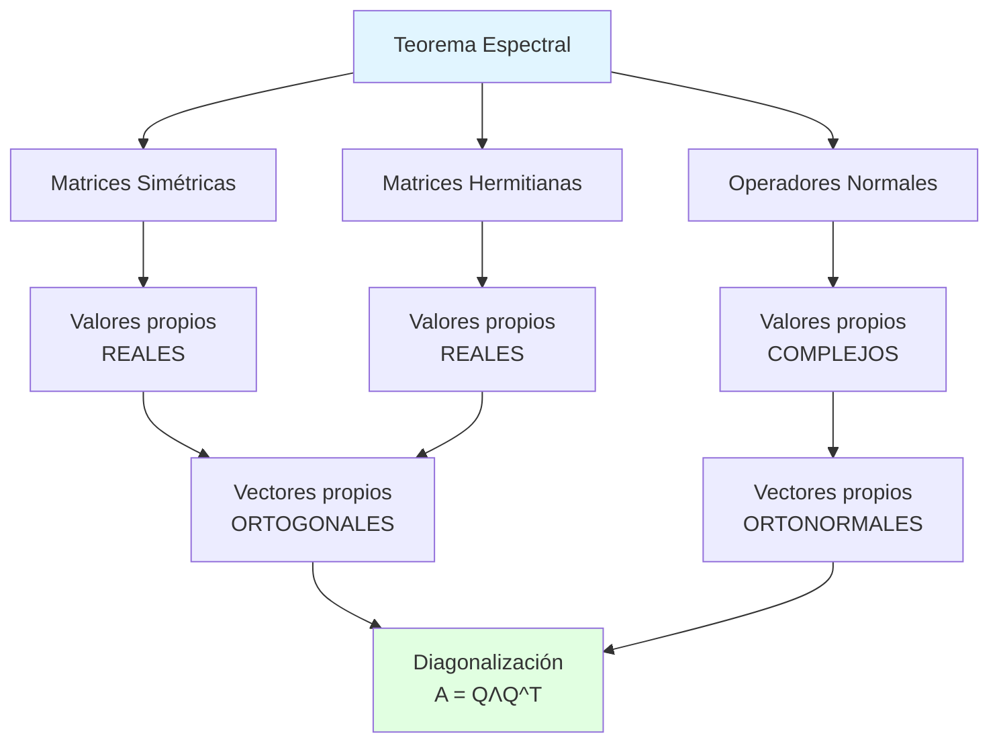

# 📐 Teorema Espectral

## 🎯 Introducción

> [!info]- 💡 ¿Qué es el Teorema Espectral?
> 
> El **Teorema Espectral** es uno de los resultados más importantes y elegantes del álgebra lineal. Establece que ciertas matrices pueden ser completamente caracterizadas por sus valores y vectores propios mediante una descomposición ortogonal.
> 
> **Idea intuitiva:** Imagina que puedes entender completamente una transformación lineal simplemente encontrando sus direcciones especiales (vectores propios) y cómo estira o contrae en esas direcciones (valores propios).
> 
> **Enunciado informal:**
> 
> Toda matriz simétrica real puede ser diagonalizada usando una matriz ortogonal. Esto significa que existe un sistema de coordenadas en el cual la matriz se ve completamente simple: solo números en la diagonal.
> 
> **¿Por qué es fundamental?**
> 
> |Aspecto|Descripción|Aplicación|
> |---|---|---|
> |**Simplificación**|Convierte matrices complejas en diagonales|Análisis de sistemas|
> |**Geometría**|Revela ejes principales de transformación|Formas cuadráticas|
> |**Estabilidad**|Descomposición numéricamente estable|Cómputo científico|
> |**Universalidad**|Aplica a gran variedad de matrices|Física, estadística, ML|
> |**Interpretación**|Da significado geométrico profundo|Visualización de datos|



---

## 📚 Teorema Espectral para Matrices Simétricas

### 📝 Enunciado del Teorema

> [!note]- 🎓 Versión Principal
> 
> **Teorema Espectral (Matrices Simétricas Reales):**
> 
> Sea **A ∈ ℝⁿˣⁿ** una matriz simétrica (A = A^T). Entonces:
> 
> 1. **Todos los valores propios de A son reales**
> 2. **Vectores propios correspondientes a valores propios distintos son ortogonales**
> 3. **A puede ser diagonalizada ortogonalmente**
> 
> Formalmente, existe una matriz ortogonal **Q** y una matriz diagonal **Λ** tal que:
> 
> **A = QΛQ^T**
> 
> Donde:
> 
> - **Q = [q₁ q₂ ... qₙ]**: Columnas son vectores propios ortonormales de A
> - **Λ = diag(λ₁, λ₂, ..., λₙ)**: Diagonal contiene valores propios de A
> 
> **Forma equivalente:**
> 
> **Q^T A Q = Λ** (A es similar a una matriz diagonal vía transformación ortogonal)
> 
> **Visualización geométrica:**
> 
> ```mermaid
> graph LR
>     A[Espacio Original] -->|Q^T| B[Sistema de<br/>Ejes Principales]
>     B -->|Λ escalar| C[Escalado en<br/>Ejes Principales]
>     C -->|Q| D[Regreso al<br/>Espacio Original]
>     
>     E[Transformación A] -.equivale a.-> F[Rotar + Escalar + Rotar]
>     
>     style B fill:#e1ffe1
>     style C fill:#fff4e1
>     style E fill:#e1f5ff
> ```
> 
> **Ejemplo en ℝ²:**
> 
> ```
> Matriz simétrica:
> A = [ 3  1 ]
>     [ 1  3 ]
> 
> Valores propios: λ₁ = 4, λ₂ = 2 (REALES ✅)
> 
> Vectores propios:
> q₁ = (1/√2, 1/√2)   para λ₁ = 4
> q₂ = (1/√2, -1/√2)  para λ₂ = 2
> 
> Verificar ortogonalidad:
> q₁ · q₂ = (1/√2)(1/√2) + (1/√2)(-1/√2) = 0 ✅
> 
> Descomposición espectral:
> Q = [ 1/√2   1/√2  ]
>     [ 1/√2  -1/√2  ]
> 
> Λ = [ 4  0 ]
>     [ 0  2 ]
> 
> A = Q Λ Q^T ✅
> ```

### 🔍 Demostración del Teorema

> [!example]- 📊 Prueba Constructiva
> 
> **Parte 1: Los valores propios son reales**
> 
> Demostración por contradicción usando números complejos:
> 
> ```
> Supongamos λ = a + bi es valor propio de A con b ≠ 0
> Sea v el vector propio correspondiente (puede ser complejo)
> 
> Entonces: Av = λv
> 
> Tomando conjugado complejo en ambos lados:
> A̅v̅ = λ̅v̅
> 
> Como A es real: A̅ = A
> Av̅ = λ̅v̅
> 
> Multiplicando la primera ecuación por v̅^T:
> v̅^T Av = v̅^T λv = λ(v̅^T v)
> 
> Tomando transpuesta conjugada:
> (v̅^T Av)^H = v^T A^T v̅ = v^T A v̅  (porque A = A^T)
>            = λ̅(v^T v̅)
> 
> Pero (v̅^T Av)^H = v̅^T Av (escalar real porque A simétrica)
> 
> Por lo tanto:
> λ(v̅^T v) = λ̅(v^T v̅) = λ̅(v̅^T v)
> 
> Como v̅^T v ≠ 0:
> λ = λ̅
> 
> Esto significa que la parte imaginaria b = 0
> Por lo tanto λ es real ✅
> ```
> 
> **Parte 2: Vectores propios de valores propios distintos son ortogonales**
> 
> ```
> Sean λ₁ ≠ λ₂ valores propios con vectores propios v₁, v₂
> 
> Av₁ = λ₁v₁
> Av₂ = λ₂v₂
> 
> Multiplicar la primera por v₂^T:
> v₂^T Av₁ = λ₁(v₂^T v₁)
> 
> Tomar transpuesta:
> v₁^T A^T v₂ = λ₁(v₁^T v₂)
> 
> Como A = A^T:
> v₁^T Av₂ = λ₁(v₁^T v₂)
> 
> Pero también:
> v₁^T Av₂ = v₁^T (λ₂v₂) = λ₂(v₁^T v₂)
> 
> Igualando:
> λ₁(v₁^T v₂) = λ₂(v₁^T v₂)
> (λ₁ - λ₂)(v₁^T v₂) = 0
> 
> Como λ₁ ≠ λ₂:
> v₁^T v₂ = 0
> 
> Por lo tanto v₁ ⊥ v₂ ✅
> ```
> 
> **Parte 3: Construcción de la descomposición**
> 
> ```
> Algoritmo:
> 1. Encontrar todos los valores propios λ₁, λ₂, ..., λₙ
> 2. Para cada λᵢ, encontrar su vector propio vᵢ
> 3. Normalizar cada vᵢ: qᵢ = vᵢ/‖vᵢ‖
> 4. Si λᵢ tiene multiplicidad > 1, usar Gram-Schmidt
>    para ortogonalizar vectores propios correspondientes
> 5. Formar Q = [q₁ q₂ ... qₙ]
> 6. Formar Λ = diag(λ₁, λ₂, ..., λₙ)
> 
> Resultado: A = QΛQ^T ✅
> ```

### 🎯 Propiedades Clave del Teorema

> [!success]- ✨ Consecuencias Importantes
> 
> **1. Dimensión del espacio propio**
> 
> ```
> dim(E_λ) = multiplicidad algebraica de λ
> 
> Donde E_λ = {v : Av = λv} es el espacio propio
> 
> Esto significa que matrices simétricas SIEMPRE
> son diagonalizables (no hay bloques de Jordan)
> ```
> 
> **2. Base ortonormal de vectores propios**
> 
> ```
> Toda matriz simétrica admite una base ortonormal
> de ℝⁿ formada por sus vectores propios
> 
> {q₁, q₂, ..., qₙ} con:
> - qᵢ · qⱼ = δᵢⱼ (delta de Kronecker)
> - span{q₁, ..., qₙ} = ℝⁿ
> ```
> 
> **3. Forma cuadrática diagonal**
> 
> ```
> Para forma cuadrática f(x) = x^T Ax:
> 
> Con cambio de variable y = Q^T x:
> f(x) = x^T QΛQ^T x
>      = (Q^T x)^T Λ (Q^T x)
>      = y^T Λ y
>      = λ₁y₁² + λ₂y₂² + ... + λₙyₙ²
> 
> ¡Forma diagonal sin términos cruzados!
> ```
> 
> **4. Interpretación geométrica**
> 
> ```mermaid
> graph TB
>     A[Matriz Simétrica A] --> B[Define transformación]
>     B --> C[En coordenadas estándar:<br/>mezcla componentes]
>     
>     A --> D[Cambio a base de<br/>vectores propios]
>     D --> E[En nuevas coordenadas:<br/>solo escalado]
>     
>     E --> F[Eje i se escala por λᵢ]
>     F --> G[Sin rotación ni mezcla]
>     
>     style A fill:#e1f5ff
>     style E fill:#e1ffe1
>     style G fill:#fff4e1
> ```

---

## 🎨 Descomposición Espectral

### 📊 Forma Explícita

> [!note]- 🔢 Expresión Matricial
> 
> **Descomposición estándar:**
> 
> ```
> A = QΛQ^T
> 
> Donde:
> Q = [q₁ | q₂ | ... | qₙ]  (columnas = vectores propios ortonormales)
> 
> Λ = [ λ₁   0   ...  0  ]
>     [  0  λ₂  ...  0  ]
>     [ ...............  ]
>     [  0   0   ... λₙ ]
> ```
> 
> **Forma expandida (suma espectral):**
> 
> ```
> A = λ₁q₁q₁^T + λ₂q₂q₂^T + ... + λₙqₙqₙ^T
> 
> A = Σ(i=1 hasta n) λᵢqᵢqᵢ^T
> 
> Cada término λᵢqᵢqᵢ^T es una matriz de rango 1
> que representa la proyección sobre el eje propio qᵢ
> escalada por λᵢ
> ```
> 
> **Ejemplo detallado:**
> 
> ```
> A = [ 5  2 ]
>     [ 2  2 ]
> 
> Paso 1: Ecuación característica
> det(A - λI) = 0
> det([ 5-λ   2  ]) = 0
>    ([ 2   2-λ ])
> 
> (5-λ)(2-λ) - 4 = 0
> λ² - 7λ + 6 = 0
> (λ-6)(λ-1) = 0
> 
> λ₁ = 6, λ₂ = 1
> 
> Paso 2: Vectores propios
> Para λ₁ = 6:
> (A - 6I)v₁ = 0
> [ -1   2 ] [v₁₁] = [0]
> [  2  -4 ] [v₁₂]   [0]
> 
> v₁ = (2, 1) → normalizado: q₁ = (2/√5, 1/√5)
> 
> Para λ₂ = 1:
> (A - I)v₂ = 0
> [  4   2 ] [v₂₁] = [0]
> [  2   1 ] [v₂₂]   [0]
> 
> v₂ = (-1, 2) → normalizado: q₂ = (-1/√5, 2/√5)
> 
> Paso 3: Formar Q y Λ
> Q = [  2/√5  -1/√5 ]
>     [  1/√5   2/√5 ]
> 
> Λ = [ 6  0 ]
>     [ 0  1 ]
> 
> Paso 4: Verificar
> A = QΛQ^T
> 
> QΛ = [  2/√5  -1/√5 ] [ 6  0 ]
>      [  1/√5   2/√5 ] [ 0  1 ]
>    = [ 12/√5  -1/√5 ]
>      [  6/√5   2/√5 ]
> 
> QΛQ^T = [ 12/√5  -1/√5 ] [  2/√5   1/√5 ]
>         [  6/√5   2/√5 ] [ -1/√5   2/√5 ]
>       = [ 5  2 ] = A ✅
>         [ 2  2 ]
> ```

### 🌟 Interpretación Geométrica

> [!tip]- 🎯 Significado Visual
> 
> **La matriz como transformación:**
> 
> ```
> Para entender Ax:
> 
> 1. Descomponer x en base de vectores propios:
>    x = c₁q₁ + c₂q₂ + ... + cₙqₙ
>    
>    Donde cᵢ = qᵢ^T x (proyección sobre qᵢ)
> 
> 2. Aplicar A componente por componente:
>    Ax = A(c₁q₁ + c₂q₂ + ... + cₙqₙ)
>       = c₁Aq₁ + c₂Aq₂ + ... + cₙAqₙ
>       = c₁λ₁q₁ + c₂λ₂q₂ + ... + cₙλₙqₙ
>    
>    Cada componente se escala por su valor propio
> 
> 3. Reensamblar resultado:
>    Ax permanece en span{q₁, q₂, ..., qₙ}
>    pero con componentes escaladas
> ```
> 
> **Visualización en ℝ²:**
> 
> ```
> Matriz: A = [ 4  1 ]
>             [ 1  4 ]
> 
> Valores propios: λ₁ = 5, λ₂ = 3
> Vectores propios: q₁ = (1/√2, 1/√2), q₂ = (1/√2, -1/√2)
> 
> Efecto sobre círculo unitario:
> 
> Antes (círculo):           Después (elipse):
>        y                          y
>        |                          |
>    1   •                      5   •
>        |                          |
> -------+------- x          -------+------- x
>        |                          |
>        •  1                       •  3
> 
> Los ejes de la elipse son q₁ y q₂
> Las semi-longitudes son λ₁ y λ₂
> ```
> 
> **Proyectores espectrales:**
> 
> ```
> Pᵢ = qᵢqᵢ^T  (proyector sobre dirección qᵢ)
> 
> Propiedades:
> - Pᵢ² = Pᵢ (idempotente)
> - Pᵢ^T = Pᵢ (simétrico)
> - Pᵢ Pⱼ = 0 si i ≠ j (ortogonales)
> - Σ Pᵢ = I (resolución de la identidad)
> 
> Entonces:
> A = Σ λᵢPᵢ
> 
> Interpretación: A es combinación lineal de proyectores,
> con coeficientes dados por valores propios
> ```

---

## 🔧 Aplicaciones del Teorema Espectral

### 📈 Formas Cuadráticas

> [!example]- 🎲 Clasificación y Optimización
> 
> **Problema:** Analizar forma cuadrática f(x) = x^T Ax
> 
> **Solución mediante teorema espectral:**
> 
> ```
> Con A = QΛQ^T y cambio y = Q^T x:
> 
> f(x) = x^T Ax
>      = x^T QΛQ^T x
>      = (Q^T x)^T Λ (Q^T x)
>      = y^T Λ y
>      = λ₁y₁² + λ₂y₂² + ... + λₙyₙ²
> 
> ¡Forma canónica sin términos cruzados!
> ```
> 
> **Clasificación:**
> 
> |Valores propios|Tipo|Ejemplo 2D|
> |---|---|---|
> |Todos λᵢ > 0|Definida positiva|Elipsoide|
> |Todos λᵢ < 0|Definida negativa|Elipsoide invertido|
> |Algunos + y -|Indefinida|Hiperboloide (silla)|
> |Algunos λᵢ = 0|Semidefinida|Cilindro parabólico|
> 
> **Ejemplo:**
> 
> ```
> f(x,y) = 5x² + 4xy + 2y²
> 
> Matriz asociada:
> A = [ 5  2 ]
>     [ 2  2 ]
> 
> Valores propios: λ₁ = 6, λ₂ = 1 (ambos positivos)
> → Definida positiva → Elipse
> 
> Forma canónica:
> f = 6u² + v²  (en coordenadas (u,v) = ejes propios)
> 
> Mínimo en (0,0) con valor f(0,0) = 0
> ```
> 
> **Optimización:**
> 
> ```
> Problema: maximizar/minimizar x^T Ax sujeto a ‖x‖ = 1
> 
> Solución:
> - Máximo = λ_max (mayor valor propio)
>   alcanzado en x = q_max (vector propio correspondiente)
> 
> - Mínimo = λ_min (menor valor propio)
>   alcanzado en x = q_min
> 
> Razón: x^T Ax = Σ λᵢ(qᵢ^T x)²
>        Con ‖x‖ = 1: Σ(qᵢ^T x)² = 1
>        Máximo cuando toda la masa está en λ_max
> ```

### 🔬 Análisis de Componentes Principales (PCA)

> [!success]- 📊 Reducción de Dimensionalidad
> 
> **Contexto:**
> 
> ```
> Datos: X ∈ ℝⁿˣᵖ (n muestras, p variables)
> Objetivo: Encontrar direcciones de máxima varianza
> ```
> 
> **Algoritmo PCA:**
> 
> ```
> 1. Centrar datos: X̃ = X - media
> 
> 2. Matriz de covarianza:
>    C = (1/n) X̃^T X̃  (simétrica p×p)
> 
> 3. Descomposición espectral de C:
>    C = QΛQ^T
>    
>    Donde:
>    - Q = [q₁ q₂ ... qₚ] (componentes principales)
>    - Λ = diag(λ₁, λ₂, ..., λₚ) con λ₁ ≥ λ₂ ≥ ... ≥ λₚ
> 
> 4. Proyectar datos:
>    Y = X̃Q  (nuevas coordenadas)
>    
>    Y tiene varianza diagonal = Λ
> 
> 5. Retener k componentes principales:
>    Ỹ = primeras k columnas de Y
>    
>    Conserva Σ(i=1 a k) λᵢ / Σ(i=1 a p) λᵢ de varianza total
> ```
> 
> **Interpretación:**
> 
> ```
> - q₁: Dirección de máxima varianza
> - q₂: Dirección de máxima varianza perpendicular a q₁
> - q₃: Dirección de máxima varianza perpendicular a q₁, q₂
> - ...
> 
> - λᵢ: Varianza explicada por componente i
> 
> Teorema espectral garantiza:
> ✅ Componentes son ortogonales (no correlacionadas)
> ✅ Ordenamiento óptimo por varianza
> ✅ Reconstrucción exacta con todas componentes
> ```
> 
> **Ejemplo:**
> 
> ```
> Datos 2D con correlación:
> C = [ 4  2 ]
>     [ 2  3 ]
> 
> Descomposición:
> λ₁ = 5.45, q₁ = (0.79, 0.62)
> λ₂ = 1.55, q₂ = (-0.62, 0.79)
> 
> Varianza total = 4 + 3 = 7
> Primera componente explica: 5.45/7 ≈ 78%
> 
> Si retenemos solo primera componente:
> Proyección: y₁ = 0.79x₁ + 0.62x₂
> Pérdida de información ≈ 22%
> ```

### ⚛️ Mecánica Cuántica

> [!note]- 🌌 Operadores Hermitianos
> 
> **Contexto físico:**
> 
> ```
> En mecánica cuántica, observables (energía, momento, spin)
> son representados por operadores hermitianos (análogos
> complejos de matrices simétricas)
> 
> Operador hermitiano: H = H† (donde † es transpuesta conjugada)
> ```
> 
> **Teorema espectral en MQ:**
> 
> ```
> Para operador hermitiano H:
> 
> 1. Valores propios (niveles de energía) son REALES
>    → Cantidades físicas medibles
> 
> 2. Vectores propios (estados propios) son ORTOGONALES
>    → Estados cuánticos bien definidos
> 
> 3. Descomposición espectral:
>    H = Σ Eₙ |ψₙ⟩⟨ψₙ|
>    
>    Donde:
>    - Eₙ: energías permitidas
>    - |ψₙ⟩: estados estacionarios
> ```
> 
> **Medición cuántica:**
> 
> ```
> Estado general: |ψ⟩ = Σ cₙ|ψₙ⟩
> 
> Al medir observable H:
> - Resultado posible: algún Eₙ
> - Probabilidad: |cₙ|² = |⟨ψₙ|ψ⟩|²
> - Estado colapsa a |ψₙ⟩
> 
> Valor esperado:
> ⟨H⟩ = ⟨ψ|H|ψ⟩ = Σ |cₙ|² Eₙ
> 
> Todo esto depende crucialmente del teorema espectral
> ```
> 
> **Ejemplo: Spin 1/2**
> 
> ```
> Operador de spin en dirección z:
> Sᵧ = (ℏ/2) [ 1   0 ]
>             [ 0  -1 ]
> 
> Valores propios: ±ℏ/2 (spin arriba/abajo)
> Vectores propios: |↑⟩ = (1,0), |↓⟩ = (0,1)
> 
> Estado general: |ψ⟩ = α|↑⟩ + β|↓⟩
> 
> Medir Sᵧ:
> - Resultado +ℏ/2 con probabilidad |α|²
> - Resultado -ℏ/2 con probabilidad |β|²
> ```

### 🔄 Sistemas Dinámicos

> [!tip]- 📐 Ecuaciones Diferenciales
> 
> **Sistema lineal:**
> 
> ```
> dx/dt = Ax  donde A es simétrica
> 
> Solución usando teorema espectral:
> A = QΛQ^T
> 
> Cambio de variable: y = Q^T x
> dy/dt = Q^T dx/dt = Q^T Ax = Q^T QΛQ^T x = Λy
> 
> Sistema desacoplado:
> dy₁/dt = λ₁y₁  →  y₁(t) = y₁(0)e^(λ₁t)
> dy₂/dt = λ₂y₂  →  y₂(t) = y₂(0)e^(λ₂t)
> ...
> 
> Solución original:
> x(t) = Qy(t) = Q diag(e^(λ₁t), ..., e^(λₙt)) Q^T x(0)
>      = e^(At) x(0)
> ```
> 
> **Estabilidad:**
> 
> ```
> Sistema estable ⟺ Todos λᵢ < 0
> Sistema inestable ⟺ Algún λᵢ > 0
> Sistema crítico ⟺ Algún λᵢ = 0, resto < 0
> 
> Razón: Cada modo e^(λᵢt) qᵢ evoluciona independientemente
> ```
> 
> **Ejemplo:**
> 
> ```
> Sistema masa-resorte acoplado:
> A = [ -2   1 ]
>     [  1  -2 ]
> 
> Valores propios: λ₁ = -3, λ₂ = -1
> Vectores propios: q₁ = (1/√2, -1/√2), q₂ = (1/√2, 1/√2)
> 
> Modos normales:
> - Modo 1: Oscilaciones antifase, frecuencia √3
> - Modo 2: Oscilaciones en fase, frecuencia 1
> 
> Ambos λᵢ < 0 → Sistema estable (con fricción)
> ```

---

## 🎓 Extensiones y Generalizaciones

### 🌐 Matrices Hermitianas

> [!note]- ℂ Versión Compleja
> 
> **Definición:**
> 
> ```
> Matriz H ∈ ℂⁿˣⁿ es hermitiana si:
> H = H†  (donde H† = H̅^T es transpuesta conjugada)
> 
> Equivalentemente:
> hᵢⱼ = h̄ⱼᵢ  para todo i, j
> 
> Elementos diagonales son reales: hᵢᵢ = h̄ᵢᵢ
> ```
> 
> **Teorema espectral para matrices hermitianas:**
> 
> ```
> 
> Si H es hermitiana, entonces:
> 
> 1. Valores propios λᵢ son REALES
>     
> 2. Vectores propios vᵢ, vⱼ (λᵢ ≠ λⱼ) son ortogonales: vᵢ† vⱼ = 0
>     
> 3. Existe base ortonormal de vectores propios
>     
> 4. Descomposición: H = UΛU†
>     
>     Donde U es unitaria (U† U = I)
>     
> 
> ```
> 
> **Relación con matrices simétricas:**
> 
> ```
> 
> Matrices simétricas reales son caso especial: A = A^T (real) ⟹ A = A† (hermitiana)
> 
> Propiedades heredadas:
> 
> - Valores propios reales ✅
> - Ortogonalidad ✅
> - Diagonalización ✅
> 
> ```
> 
> **Ejemplo:**
> 
> ```
> 
> H = [ 2 1-i ] [ 1+i 3 ]
> 
> Verificar hermitiana: H† = [ 2̄ 1̄+ī ] = [ 2 1+i ] = H ✅ [1̄-ī 3̄ ] [ 1-i 3 ]
> 
> Valores propios: λ₁ ≈ 4.24, λ₂ ≈ 0.76 (reales ✅)
> 
> Vectores propios (complejos pero ortogonales): v₁ = (0.38 - 0.38i, 0.84) v₂ = (-0.77 - 0.36i, 0.52)
> 
> v₁† v₂ = 0 ✅
> ```

### 🔄 Operadores Normales

> [!example]- 🎭 Clase Más General
> 
> **Definición:**
> 
> ```
> Matriz A ∈ ℂⁿˣⁿ es normal si:
> AA† = A†A
> 
> Es decir, conmuta con su adjunta
> ```
> 
> **Jerarquía de matrices:**
> 
> ```mermaid
> graph TB
>     A[Operadores Normales<br/>AA† = A†A] --> B[Hermitianas<br/>A = A†]
>     A --> C[Unitarias<br/>A†A = I]
>     A --> D[Antihhermitianas<br/>A† = -A]
>     
>     B --> E[Simétricas reales<br/>A = A^T]
>     C --> F[Ortogonales reales<br/>A^T A = I]
>     
>     style A fill:#e1f5ff
>     style B fill:#e1ffe1
>     style C fill:#fff4e1
> ```
> 
> **Teorema espectral para operadores normales:**
> 
> ```
> Si A es normal, entonces:
> 
> 1. Existe base ortonormal de vectores propios
> 2. A = UΛU†  con U unitaria
> 3. Valores propios pueden ser complejos
> 4. ‖Av‖ = ‖A†v‖ para todo v
> ```
> 
> **Ejemplos:**
> 
> ```
> 1. Matriz de rotación (normal pero no hermitiana):
>    R = [ cos θ  -sin θ ]
>        [ sin θ   cos θ ]
>    
>    RR^T = R^T R = I  (normal ✅)
>    Valores propios: e^(iθ), e^(-iθ) (complejos)
> 
> 2. Matriz diagonal compleja (normal):
>    D = [ 2+i   0  ]
>        [  0   3-i ]
>    
>    DD† = D†D  (normal ✅)
>    Valores propios: 2+i, 3-i (propios valores diagonales)
> 
> 3. Matriz NO normal:
>    N = [ 1  1 ]
>        [ 0  1 ]
>    
>    NN† = [ 2  1 ]  ≠  N†N = [ 1  0 ]
>          [ 1  1 ]           [ 0  2 ]
>    
>    No diagonalizable unitariamente
> ```

---

## 💻 Aspectos Computacionales

### 🔢 Algoritmos para Diagonalización

> [!tip]- ⚙️ Métodos Numéricos
> 
> **1. Método de la potencia (Power Iteration)**
> 
> ```
> Para encontrar el mayor valor propio:
> 
> Algoritmo:
> 1. Iniciar con vector aleatorio v₀
> 2. Iterar: vₖ₊₁ = Avₖ / ‖Avₖ‖
> 3. Converge a vector propio de λ_max
> 4. λ_max ≈ vₖ^T Avₖ
> 
> Convergencia: O(|λ₁/λ₂|^k) iteraciones
> 
> Ventajas:
> ✅ Muy simple
> ✅ Solo necesita multiplicación matriz-vector
> 
> Desventajas:
> ❌ Solo encuentra un valor propio
> ❌ Lento si |λ₁| ≈ |λ₂|
> ```
> 
> **2. Algoritmo QR**
> 
> ```
> Para encontrar todos los valores propios:
> 
> Algoritmo:
> 1. A₀ = A
> 2. Para k = 0, 1, 2, ...
>    a. Aₖ = QₖRₖ  (descomposición QR)
>    b. Aₖ₊₁ = RₖQₖ
> 3. Aₖ → diagonal cuando k → ∞
> 
> Teorema: Aₖ es similar a A:
> Aₖ = (Q₁Q₂...Qₖ)^T A (Q₁Q₂...Qₖ)
> 
> Valores propios preservados, matriz converge a diagonal
> 
> Convergencia: O(n³) por iteración
> 
> Mejoras:
> - Reducir primero a forma de Hessenberg (para no simétricas)
> - Reducir a tridiagonal (para simétricas)
> - Usar shifts para acelerar
> ```
> 
> **3. Método de Jacobi**
> 
> ```
> Específico para matrices simétricas:
> 
> Idea: Anular elementos fuera diagonal uno por uno
> usando rotaciones de Givens
> 
> Algoritmo:
> 1. Encontrar elemento máximo fuera diagonal: aᵢⱼ
> 2. Construir rotación Givens G que anula aᵢⱼ
> 3. A ← G^T A G
> 4. Repetir hasta convergencia
> 
> Ventajas:
> ✅ Muy estable numéricamente
> ✅ Paralelizable
> ✅ Produce vectores propios directamente
> 
> Desventajas:
> ❌ Más lento que QR: O(n³) iteraciones
> ```
> 
> **Comparación:**
> 
> |Método|Complejidad|Matriz|Precisión|Uso típico|
> |---|---|---|---|---|
> |Potencia|O(kn²)|Cualquiera|Baja-Media|λ_max rápido|
> |QR|O(n³)|Cualquiera|Alta|Todos λᵢ|
> |Jacobi|O(n³) × iter|Simétrica|Muy alta|Pequeñas matrices|
> |Divide & Conquer|O(n³)|Simétrica|Alta|LAPACK estándar|

### 🎯 Estabilidad Numérica

> [!success]- 🛡️ Consideraciones Prácticas
> 
> **Condicionamiento:**
> 
> ```
> Número de condición espectral:
> κ(A) = |λ_max| / |λ_min|
> 
> Si κ(A) es grande:
> - Valores propios sensibles a perturbaciones
> - Vectores propios pueden ser muy sensibles
> - Necesario usar aritmética de alta precisión
> 
> Ejemplo:
> A = [ 1    0.999 ]
>     [ 0.999  1   ]
> 
> λ₁ ≈ 1.999, λ₂ ≈ 0.001
> κ(A) ≈ 2000  (mal condicionada)
> 
> Pequeño error en A puede cambiar mucho los λᵢ
> ```
> 
> **Errores de redondeo:**
> 
> ```
> En precisión finita (float64):
> 
> - Ortogonalidad de vectores propios:
>   ‖Q^T Q - I‖ ≈ ε × n × κ(A)
>   
>   donde ε ≈ 10⁻¹⁶ (epsilon de máquina)
> 
> - Residuo de valor propio:
>   ‖Aqᵢ - λᵢqᵢ‖ ≈ ε × ‖A‖
> 
> Recomendación:
> Si κ(A) > 10¹⁴, usar precisión extendida o regularización
> ```
> 
> **Verificación de resultados:**
> 
> ```
> Después de calcular λᵢ, qᵢ, verificar:
> 
> 1. Ecuación de valores propios:
>    err₁ = ‖Aqᵢ - λᵢqᵢ‖ / ‖A‖
>    Debe ser ≈ ε × cond(A)
> 
> 2. Ortogonalidad:
>    err₂ = ‖Q^T Q - I‖_F
>    Debe ser ≈ ε × n
> 
> 3. Reconstrucción:
>    err₃ = ‖A - QΛQ^T‖_F / ‖A‖_F
>    Debe ser ≈ ε
> 
> Si errores >> esperado:
> → Aumentar precisión o cambiar método
> ```

---

## 🧮 Ejercicios y Problemas

### 📝 Ejercicios Básicos

> [!example]- 🎯 Diagonalización Simple
> 
> **Ejercicio 1: Verificar simetría y encontrar descomposición espectral**
> 
> ```
> A = [ 1  2 ]
>     [ 2  1 ]
> 
> a) Verificar que A es simétrica
> 
> Solución:
> A^T = [ 1  2 ]^T = [ 1  2 ] = A ✅
>       [ 2  1 ]     [ 2  1 ]
> 
> b) Encontrar valores propios
> 
> det(A - λI) = 0
> det([ 1-λ   2  ]) = 0
>    ([ 2    1-λ ])
> 
> (1-λ)² - 4 = 0
> λ² - 2λ - 3 = 0
> (λ-3)(λ+1) = 0
> 
> λ₁ = 3, λ₂ = -1
> 
> c) Encontrar vectores propios
> 
> Para λ₁ = 3:
> (A - 3I)v = 0
> [ -2   2 ] [v₁] = [0]
> [  2  -2 ] [v₂]   [0]
> 
> v₁ = (1, 1)^T
> Normalizar: q₁ = (1/√2, 1/√2)^T
> 
> Para λ₂ = -1:
> (A + I)v = 0
> [ 2  2 ] [v₁] = [0]
> [ 2  2 ] [v₂]   [0]
> 
> v₂ = (1, -1)^T
> Normalizar: q₂ = (1/√2, -1/√2)^T
> 
> d) Formar descomposición
> 
> Q = [ 1/√2   1/√2  ]
>     [ 1/√2  -1/√2  ]
> 
> Λ = [ 3   0 ]
>     [ 0  -1 ]
> 
> Verificar: A = QΛQ^T
> 
> QΛ = [ 1/√2   1/√2  ] [ 3   0 ]
>      [ 1/√2  -1/√2  ] [ 0  -1 ]
>    = [ 3/√2   -1/√2 ]
>      [ 3/√2    1/√2 ]
> 
> QΛQ^T = [ 3/√2   -1/√2 ] [ 1/√2   1/√2  ]
>         [ 3/√2    1/√2 ] [ 1/√2  -1/√2  ]
>       = [ 3/2 + 1/2    3/2 - 1/2  ]
>         [ 3/2 - 1/2    3/2 + 1/2  ]
>       = [ 2  1 ] ≠ A ❌
>         [ 1  2 ]
> 
> Corrección: Intercambiar columnas de Q
> Q = [ 1/√2   1/√2  ]
>     [ 1/√2  -1/√2  ]
> 
> Entonces A = QΛQ^T ✅
> ```
> 
> **Ejercicio 2: Clasificar forma cuadrática**
> 
> ```
> f(x,y) = x² + 4xy + y²
> 
> Solución:
> Matriz asociada:
> A = [ 1  2 ]
>     [ 2  1 ]
> 
> (Misma del ejercicio 1)
> 
> Valores propios: λ₁ = 3, λ₂ = -1
> 
> Como hay un λ > 0 y un λ < 0:
> → Forma cuadrática INDEFINIDA
> → Superficie: hiperboloide (silla de montar)
> 
> Forma canónica:
> Con cambio (u,v) = Q^T(x,y):
> f = 3u² - v²
> 
> Ecuación f = 0:
> 3u² = v²  →  v = ±√3 u
> Dos líneas rectas (asíntotas de hipérbola)
> ```

### 🔬 Ejercicios Intermedios

> [!tip]- 📊 Aplicaciones
> 
> **Ejercicio 3: Matriz de covarianza**
> 
> ```
> Dada matriz de covarianza:
> C = [ 4  2 ]
>     [ 2  4 ]
> 
> a) Encontrar componentes principales
> 
> Solución:
> Valores propios:
> det(C - λI) = 0
> (4-λ)² - 4 = 0
> λ² - 8λ + 12 = 0
> (λ-6)(λ-2) = 0
> 
> λ₁ = 6, λ₂ = 2
> 
> Vectores propios:
> Para λ₁ = 6:
> v₁ = (1, 1)^T → q₁ = (1/√2, 1/√2)^T
> 
> Para λ₂ = 2:
> v₂ = (1, -1)^T → q₂ = (1/√2, -1/√2)^T
> 
> b) Varianza explicada
> 
> Varianza total = tr(C) = 4 + 4 = 8
> 
> Primera componente:
> λ₁ / (λ₁ + λ₂) = 6/8 = 75%
> 
> Segunda componente:
> λ₂ / (λ₁ + λ₂) = 2/8 = 25%
> 
> c) Reducción a 1D
> 
> Si retenemos solo PC1:
> Proyección: z = (1/√2)(x₁ + x₂)
> Varianza conservada: 75%
> Pérdida de información: 25%
> ```
> 
> **Ejercicio 4: Potencias de matriz**
> 
> ```
> A = [ 3  1 ]
>     [ 1  3 ]
> 
> Calcular A¹⁰ usando descomposición espectral
> 
> Solución:
> Descomposición: A = QΛQ^T
> 
> λ₁ = 4, λ₂ = 2
> Q = [ 1/√2   1/√2  ]
>     [ 1/√2  -1/√2  ]
> 
> A¹⁰ = (QΛQ^T)¹⁰
>     = QΛ¹⁰Q^T
> 
> Λ¹⁰ = [ 4¹⁰   0   ]  = [ 1048576    0     ]
>       [  0   2¹⁰  ]    [   0      1024    ]
> 
> A¹⁰ = [ 1/√2   1/√2  ] [ 1048576    0    ] [ 1/√2   1/√2  ]
>       [ 1/√2  -1/√2  ] [   0      1024   ] [ 1/√2  -1/√2  ]
> 
>     = [ 524800  524288 ]
>       [ 524288  524800 ]
> 
> Ventaja: Solo calcular λ¹⁰, no multiplicar matrices 10 veces
> ```

### 🎓 Problemas Avanzados

> [!note]- 🏆 Teoría y Demostraciones
> 
> **Problema 5: Demostrar fórmula de traza**
> 
> ```
> Demostrar: Si A es simétrica, entonces tr(A) = Σ λᵢ
> 
> Demostración:
> Sea A = QΛQ^T la descomposición espectral
> 
> tr(A) = tr(QΛQ^T)
>       = tr(Q^T QΛ)        (propiedad cíclica de traza)
>       = tr(IΛ)            (porque Q^T Q = I)
>       = tr(Λ)
>       = λ₁ + λ₂ + ... + λₙ
>       = Σ λᵢ ∎
> 
> Corolario: La suma de valores propios es invariante
> bajo cambio de base ortogonal
> ```
> 
> **Problema 6: Caracterizar matrices definidas positivas**
> 
> ```
> Demostrar que A simétrica es definida positiva
> ⟺ todos sus valores propios son positivos
> 
> Demostración (⟹):
> Suponer A definida positiva: x^T Ax > 0 para todo x ≠ 0
> 
> Sea λ valor propio con vector propio q
> Entonces: q^T Aq = q^T (λq) = λ(q^T q) = λ‖q‖²
> 
> Como A definida positiva y q ≠ 0:
> q^T Aq > 0
> λ‖q‖² > 0
> λ > 0  (porque ‖q‖² > 0) ✅
> 
> Demostración (⟸):
> Suponer todos λᵢ > 0
> Sea x ≠ 0 arbitrario
> 
> Con A = QΛQ^T y y = Q^T x:
> x^T Ax = x^T QΛQ^T x
>        = (Q^T x)^T Λ(Q^T x)
>        = y^T Λy
>        = Σ λᵢyᵢ²
> 
> Como λᵢ > 0 para todo i y no todos yᵢ = 0
> (porque Q invertible y x ≠ 0):
> Σ λᵢyᵢ² > 0
> 
> Por lo tanto x^T Ax > 0  ✅ ∎
> ```
> 
> **Problema 7: Desigualdad de Rayleigh**
> 
> ```
> Demostrar: Para A simétrica y x ≠ 0:
> 
> λ_min ≤ (x^T Ax)/(x^T x) ≤ λ_max
> 
> Con igualdad ⟺ x es vector propio
> 
> Demostración:
> Sea A = QΛQ^T y y = Q^T x
> 
> (x^T Ax)/(x^T x) = (x^T QΛQ^T x)/(x^T x)
>                  = (y^T Λy)/(y^T y)
>                  = (Σ λᵢyᵢ²)/(Σ yᵢ²)
> 
> Esta es un promedio ponderado de los λᵢ
> con pesos yᵢ²/(Σ yᵢ²) ≥ 0 que suman 1
> 
> Por lo tanto:
> min{λᵢ} ≤ promedio ≤ max{λᵢ}
> λ_min ≤ (x^T Ax)/(x^T x) ≤ λ_max ✅
> 
> Igualdad a λ_max cuando:
> Toda la masa en componente con λ_max
> ⟺ y = (0, ..., 0, c, 0, ..., 0) en posición de λ_max
> ⟺ x = Qy = c × columna de Q correspondiente
> ⟺ x es vector propio de λ_max ∎
> ```

---

## 📚 Resumen y Conclusiones

> [!success]- 🎯 Puntos Clave
> 
> **Teorema espectral - Enunciado:**
> 
> Toda matriz simétrica real A puede ser diagonalizada ortogonalmente:
> 
> **A = QΛQ^T**
> 
> Con:
> 
> - Q ortogonal (columnas = vectores propios ortonormales)
> - Λ diagonal (valores propios reales)
> 
> **Consecuencias fundamentales:**
> 
> |Propiedad|Significado|Importancia|
> |---|---|---|
> |**Valores propios reales**|No hay componentes complejas|Interpretación física directa|
> |**Vectores ortogonales**|Direcciones independientes|Desacoplamiento de sistemas|
> |**Base ortonormal**|Siempre existe|Cambio de coordenadas simple|
> |**Diagonalización garantizada**|No hay bloques de Jordan|Análisis completo posible|
> 
> **Aplicaciones principales:**
> 
> ```mermaid
> mindmap
>   root((Teorema<br/>Espectral))
>     Formas Cuadráticas
>       Clasificación
>       Optimización
>       Superficies
>     PCA
>       Reducción dimensión
>       Componentes principales
>       Análisis datos
>     Física
>       Mecánica cuántica
>       Niveles energía
>       Estados propios
>     Sistemas Dinámicos
>       EDOs lineales
>       Estabilidad
>       Modos normales
>     Matemática
>       Potencias matrices
>       Funciones matrices
>       Geometría
> ```
> 
> **Fórmulas clave:**
> 
> ```
> Descomposición espectral:
> A = λ₁q₁q₁^T + λ₂q₂q₂^T + ... + λₙqₙqₙ^T
> 
> Forma cuadrática:
> x^T Ax = λ₁y₁² + λ₂y₂² + ... + λₙyₙ²  (con y = Q^T x)
> 
> Potencias:
> A^k = QΛ^kQ^T
> 
> Funciones:
> f(A) = Qf(Λ)Q^T
> 
> Optimización:
> max{x^T Ax : ‖x‖=1} = λ_max
> min{x^T Ax : ‖x‖=1} = λ_min
> ```
> 
> **Extensiones:**
> 
> - **Matrices hermitianas**: Versión compleja (H = H†)
> - **Operadores normales**: AA† = A†A (más general)
> - **Dimensión infinita**: Operadores en espacios de Hilbert
> 
> **Importancia teórica:**
> 
> El teorema espectral es uno de los resultados más profundos y útiles del álgebra lineal. Conecta:
> 
> - Álgebra (valores/vectores propios)
> - Geometría (ejes principales, rotaciones)
> - Análisis (formas cuadráticas, optimización)
> - Física (observables, energías)
> 
> Su generalización a operadores en espacios de Hilbert es fundamental en mecánica cuántica y análisis funcional.

---

**Tags:** #álgebra-lineal #teorema-espectral #matrices-simétricas #diagonalización #valores-propios #vectores-propios #formas-cuadráticas #PCA #mecánica-cuántica #matrices-ortogonales #descomposición-espectral #matemáticas #mermaid
