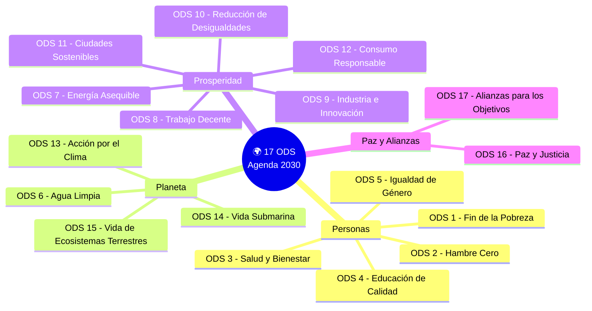

# 🟩 ODS — Objetivos de Desarrollo Sostenible y Tecnología

## 🎯 Introducción

> [!info]- 🌍 ¿Qué son los ODS?
> 
> Los **Objetivos de Desarrollo Sostenible (ODS)** son un conjunto de **17 objetivos globales** adoptados por los **193 países miembros de la ONU en 2015**, como parte de la **Agenda 2030**. Buscan erradicar la pobreza, proteger el planeta y garantizar una vida digna para todas las personas antes del año 2030.
> 
> **Estado actual (Informe ODS 2025):**
> 
> |Indicador|Dato|
> |---|---|
> |Metas en vías de cumplirse|Solo el **17–18%**|
> |Metas con avance moderado o lento|**~47%**|
> |Metas estancadas o en retroceso|**~18%**|
> |Países líderes|Países nórdicos: Suecia, Dinamarca, Finlandia|
> |Países más rezagados|Yemen, Sudán del Sur, Haití, Myanmar|
> 
> > _"Los ODS siguen estando a nuestro alcance, pero solo si actuamos con decisión y actuamos ahora."_ — António Guterres, Secretario General de la ONU, 2025
> 
> **Este documento responde 3 preguntas por cada ODS:**
> 
> 1. 🔴 ¿Cuál es la necesidad actual?
> 2. 🟢 ¿Puede la tecnología ayudar y cómo?
> 3. 🌐 ¿Cómo están los países respecto a este objetivo?

---

## 📋 Los 17 Objetivos — Resumen General



---

## 🔴 ODS 1 — Fin de la Pobreza

> [!note]- 📌 Análisis Completo
> 
> **🔴 Necesidad actual:** Más de **700 millones de personas** viven con menos de $2.15 al día. El COVID-19 revirtió décadas de progreso y la inflación global ha empeorado la situación en países ya vulnerables.
> 
> **🟢 ¿Puede la tecnología ayudar?** Sí. Los algoritmos de IA y blockchain permiten identificar comunidades en pobreza extrema con datos demográficos y económicos, dirigiendo recursos de forma más eficiente. Sistemas de transferencias digitales directas eliminan intermediarios corruptos.
> 
> **🌐 Países:**
> 
> |País/Región|Situación|
> |---|---|
> |**Suecia / Dinamarca**|Pobreza extrema casi erradicada, sistemas de bienestar sólidos|
> |**China**|Sacó a más de 800 millones de la pobreza en 30 años — caso de éxito histórico|
> |**Sub-Sahara africana**|~40% de la población en pobreza extrema — el mayor reto global|
> |**Haití**|Sin informe voluntario a la ONU; infraestructura colapsada tras terremotos|

---

## 🟠 ODS 2 — Hambre Cero

> [!note]- 📌 Análisis Completo
> 
> **🔴 Necesidad actual:** Más de **733 millones de personas** sufren hambre crónica. La malnutrición infantil sigue siendo crítica en África subsahariana y Asia meridional. El cambio climático destruye cosechas cada vez con más frecuencia.
> 
> **🟢 ¿Puede la tecnología ayudar?** Sí. La biotecnología desarrolla cultivos resistentes a sequías y plagas. La IA optimiza la producción agrícola con sensores y datos climáticos. El **Hunger Map LIVE** de la ONU (con IA) monitorea el hambre en más de 90 países en tiempo real para intervenciones oportunas.
> 
> **🌐 Países:**
> 
> |País/Región|Situación|
> |---|---|
> |**Brasil**|Salió del mapa del hambre en 2014, pero volvió a entrar en 2022 por crisis económica|
> |**Somalia / Etiopía**|Crisis alimentaria severa; millones en riesgo de hambruna por sequías y conflictos|
> |**India**|A pesar de ser potencia económica, ocupa el puesto 111/125 en el Índice Global del Hambre 2023|
> |**Países nórdicos**|Hambre cero prácticamente alcanzado; modelos de distribución alimentaria eficiente|

---

## 🟡 ODS 3 — Salud y Bienestar

> [!note]- 📌 Análisis Completo
> 
> **🔴 Necesidad actual:** Millones de personas en países en desarrollo no tienen acceso a atención médica básica. La mortalidad materna e infantil sigue siendo alta en África y Asia. Las enfermedades prevenibles como la malaria siguen matando por falta de acceso a medicamentos.
> 
> **🟢 ¿Puede la tecnología ayudar?** Sí. La IA diagnostica enfermedades mediante imágenes médicas con alta precisión. El big data permite anticipar brotes epidémicos. La telemedicina lleva atención a zonas remotas sin hospitales. La IA de DeepMind (Google) resolvió el problema del plegamiento de proteínas, acelerando el desarrollo de vacunas y medicamentos.
> 
> **🌐 Países:**
> 
> |País/Región|Situación|
> |---|---|
> |**Japón / Suiza**|Esperanza de vida más alta del mundo (+84 años); sistemas de salud universales|
> |**Sierra Leona**|Tasa de mortalidad materna más alta del mundo: 443 muertes por cada 100,000 nacimientos|
> |**EE.UU.**|Alto gasto en salud pero desigualdad enorme; millones sin seguro médico|
> |**Cuba**|A pesar de ser país en desarrollo, tiene indicadores de salud comparables a países ricos|

---

## 🟢 ODS 4 — Educación de Calidad

> [!note]- 📌 Análisis Completo
> 
> **🔴 Necesidad actual:** Más de **250 millones de niños** no van a la escuela. La calidad educativa es desigual incluso en países con alta escolarización. La brecha digital excluye a millones del aprendizaje en línea.
> 
> **🟢 ¿Puede la tecnología ayudar?** Sí. La IA personaliza el aprendizaje detectando dificultades individuales tempranamente. Plataformas como Khan Academy o Duolingo democratizan el acceso a la educación. La IA puede liberar a los docentes de tareas administrativas para enfocarse en enseñar. Traducciones automáticas rompen barreras idiomáticas.
> 
> **🌐 Países:**
> 
> |País/Región|Situación|
> |---|---|
> |**Finlandia**|Modelo educativo referente mundial; énfasis en pensamiento crítico sobre memorización|
> |**Níger / Malí**|Tasas de alfabetización por debajo del 30%; millones de niñas sin acceso a educación|
> |**Ecuador**|Escolarización básica alta, pero calidad y acceso rural siguen siendo desafíos|
> |**Corea del Sur**|Pasó de país devastado en 1950 a potencia educativa global en 50 años gracias a inversión en educación|

---

## 🔵 ODS 5 — Igualdad de Género

> [!note]- 📌 Análisis Completo
> 
> **🔴 Necesidad actual:** Las mujeres siguen ganando en promedio un **20% menos** que los hombres por el mismo trabajo. En muchos países, no tienen derecho a votar, estudiar, trabajar o decidir sobre su propio cuerpo. La violencia de género afecta a 1 de cada 3 mujeres en el mundo.
> 
> **🟢 ¿Puede la tecnología ayudar?** Sí, pero con precaución — la IA también puede perpetuar sesgos de género (como vimos en el ODS anterior). Bien usada: plataformas digitales dan voz a mujeres en zonas rurales, apps de seguridad personal, acceso a educación financiera digital y microcréditos para emprendedoras.
> 
> **🌐 Países:**
> 
> |País/Región|Situación|
> |---|---|
> |**Islandia**|Líder mundial en igualdad de género por 14 años consecutivos (Foro Económico Mundial)|
> |**Arabia Saudita**|Las mujeres apenas obtuvieron permiso de conducir en 2018; aún existen restricciones legales severas|
> |**Afganistán**|Desde el retorno talibán (2021), las mujeres no pueden estudiar ni trabajar en la mayoría de sectores|
> |**América Latina**|Avances en representación política, pero la violencia de género sigue siendo una crisis regional|

---

## 💧 ODS 6 — Agua Limpia y Saneamiento

> [!note]- 📌 Análisis Completo
> 
> **🔴 Necesidad actual:** Más de **2,200 millones de personas** no tienen acceso a agua potable gestionada de forma segura. Más de **3,500 millones** carecen de saneamiento básico. La contaminación de ríos y acuíferos se agrava por la actividad industrial.
> 
> **🟢 ¿Puede la tecnología ayudar?** Sí. Sensores IoT monitorean la calidad del agua en tiempo real. IA optimiza redes de distribución reduciendo pérdidas. Tecnologías de desalinización solar llevan agua potable a zonas áridas. Drones detectan fugas en tuberías.
> 
> **🌐 Países:**
> 
> |País/Región|Situación|
> |---|---|
> |**Países nórdicos**|Acceso universal a agua potable; sistemas de saneamiento de referencia mundial|
> |**Chad / República Centroafricana**|Menos del 30% de la población tiene acceso a agua potable básica|
> |**India**|Proyecto "Har Ghar Jal" conectó 100 millones de hogares rurales a agua corriente (2019–2024)|
> |**Ecuador**|Ciudades principales con buena cobertura; zonas amazónicas y rurales con déficit importante|

---

## ⚡ ODS 7 — Energía Asequible y No Contaminante

> [!note]- 📌 Análisis Completo
> 
> **🔴 Necesidad actual:** Más de **730 millones de personas** viven sin electricidad. Muchos países siguen dependiendo de combustibles fósiles contaminantes. La energía limpia es cara y su infraestructura no llega a zonas rurales.
> 
> **🟢 ¿Puede la tecnología ayudar?** Sí. En 2023, el acceso mundial a electricidad alcanzó el 92% gracias a expansión de renovables. La IA optimiza redes eléctricas inteligentes (smart grids). Paneles solares cada vez más baratos llevan energía a comunidades aisladas. Baterías de almacenamiento resuelven la intermitencia.
> 
> **🌐 Países:**
> 
> |País/Región|Situación|
> |---|---|
> |**Islandia**|100% energía renovable (geotérmica e hidroeléctrica)|
> |**Alemania**|Líder en transición energética (_Energiewende_); >50% electricidad de renovables en 2024|
> |**África Subsahariana**|~600 millones sin electricidad; pero expansión solar descentralizada avanza rápidamente|
> |**China**|Mayor instalador de energía solar y eólica del mundo, aunque sigue siendo el mayor emisor de CO₂|

---

## 💼 ODS 8 — Trabajo Decente y Crecimiento Económico

> [!note]- 📌 Análisis Completo
> 
> **🔴 Necesidad actual:** El desempleo juvenil global supera el **13%**. El trabajo informal sin protecciones afecta al 60% de la fuerza laboral en países en desarrollo. La automatización amenaza con eliminar millones de empleos.
> 
> **🟢 ¿Puede la tecnología ayudar?** Sí y no. La IA crea nuevos empleos en tecnología pero elimina otros en manufactura y servicios. Plataformas digitales generan trabajo independiente (gig economy). La formación online recapacita a trabajadores desplazados. La clave es que la tecnología se acompañe de políticas de protección social.
> 
> **🌐 Países:**
> 
> |País/Región|Situación|
> |---|---|
> |**Suiza / Noruega**|Desempleo mínimo (<4%), salarios altos y trabajo decente generalizado|
> |**Yemen / Sudán**|Economías destruidas por conflictos; desempleo masivo y trabajo infantil extendido|
> |**Bangladesh**|Creció económicamente via manufactura textil, pero con condiciones laborales cuestionables|
> |**Ecuador**|Alto índice de empleo informal (~46%); desafío pendiente de formalización|

---

## 🏭 ODS 9 — Industria, Innovación e Infraestructura

> [!note]- 📌 Análisis Completo
> 
> **🔴 Necesidad actual:** Los países en desarrollo carecen de infraestructura básica (carreteras, internet, energía) que frena su crecimiento. La brecha tecnológica entre países ricos y pobres se amplía con la IA.
> 
> **🟢 ¿Puede la tecnología ayudar?** Sí. La conectividad a internet creció del 40% al 68% entre 2015 y 2024. Satélites de bajo costo (como Starlink) llevan internet a zonas remotas. La IA optimiza cadenas de producción industrial. Impresión 3D democratiza la manufactura local.
> 
> **🌐 Países:**
> 
> |País/Región|Situación|
> |---|---|
> |**Corea del Sur / Japón**|Líderes en innovación; alta inversión en I+D y patentes tecnológicas|
> |**África Central**|Infraestructura vial y energética mínima; dificulta el desarrollo industrial|
> |**China**|"Fábrica del mundo" en transición hacia industria de alto valor e IA|
> |**Estonia**|País pequeño pero líder digital; primer gobierno 100% digital del mundo|

---

## ⚖️ ODS 10 — Reducción de las Desigualdades

> [!note]- 📌 Análisis Completo
> 
> **🔴 Necesidad actual:** El 1% más rico del mundo posee más riqueza que el 99% restante. La desigualdad de ingresos creció en casi todos los países durante la pandemia. Las personas con discapacidad, migrantes y minorías étnicas son sistemáticamente más pobres.
> 
> **🟢 ¿Puede la tecnología ayudar?** Con precaución. La IA mal aplicada perpetúa desigualdades (como vimos en sesgos). Bien usada: fintech lleva servicios bancarios a poblaciones sin acceso a bancos tradicionales. Transferencias digitales directas reducen corrupción en programas sociales. Telemedicina y educación online reducen brechas geográficas.
> 
> **🌐 Países:**
> 
> |País/Región|Situación|
> |---|---|
> |**Países nórdicos**|Coeficiente Gini más bajo del mundo (menor desigualdad)|
> |**Sudáfrica**|Coeficiente Gini más alto del mundo (~0.63); desigualdad racial heredada del apartheid|
> |**EE.UU.**|Alta riqueza promedio pero enorme brecha; el 10% más rico posee el 70% de la riqueza|
> |**América Latina**|Región más desigual del mundo en distribución de la riqueza|

---

## 🏙️ ODS 11 — Ciudades y Comunidades Sostenibles

> [!note]- 📌 Análisis Completo
> 
> **🔴 Necesidad actual:** Más de **1,100 millones de personas** viven en barrios marginales sin servicios básicos. La urbanización no planificada genera contaminación, tráfico y segregación. Los desastres naturales afectan desproporcionadamente a los más pobres.
> 
> **🟢 ¿Puede la tecnología ayudar?** Sí. Las **ciudades inteligentes (smart cities)** usan IA para gestionar tráfico, residuos y energía. Sensores predicen inundaciones y terremotos para alertas tempranas. El diseño urbano asistido por IA optimiza espacios verdes y transporte público.
> 
> **🌐 Países:**
> 
> |País/Región|Situación|
> |---|---|
> |**Singapur**|Ciudad-estado referente mundial en planificación urbana inteligente|
> |**Bangladesh / Nigeria**|Megaciudades con crecimiento descontrolado; millones en asentamientos informales|
> |**Medellín, Colombia**|Caso de éxito: pasó de ser la ciudad más violenta del mundo a modelo de innovación urbana|
> |**Japón**|Líder en sistemas de alerta temprana de terremotos y tsunamis|

---

## ♻️ ODS 12 — Producción y Consumo Responsables

> [!note]- 📌 Análisis Completo
> 
> **🔴 Necesidad actual:** Se producen más de **2,500 millones de toneladas** de residuos sólidos al año. El desperdicio alimentario representa el 30% de toda la comida producida. Los residuos electrónicos crecen un 4% anual y solo el 17% se recicla formalmente.
> 
> **🟢 ¿Puede la tecnología ayudar?** Sí. IA optimiza cadenas de suministro reduciendo excedentes. Apps conectan supermercados con excedente alimentario a bancos de alimentos. Blockchain rastrea la huella ambiental de productos. Economía circular asistida por IA diseña productos para ser reparados, no desechados.
> 
> **🌐 Países:**
> 
> |País/Región|Situación|
> |---|---|
> |**Alemania / Holanda**|Líderes en reciclaje y economía circular; tasas de reciclaje >60%|
> |**EE.UU.**|Mayor generador de residuos per cápita del mundo (~800 kg/persona/año)|
> |**Ruanda**|Primer país africano en prohibir bolsas plásticas (2008); modelo de gestión de residuos|
> |**China**|Mayor generador de residuos electrónicos del mundo en términos absolutos|

---

## 🌡️ ODS 13 — Acción por el Clima

> [!note]- 📌 Análisis Completo
> 
> **🔴 Necesidad actual:** **2024 fue el año más cálido registrado** en la historia. Las emisiones de CO₂ están en niveles históricos. Los eventos climáticos extremos (huracanes, sequías, inundaciones) se multiplican e intensifican. Los países más afectados son los que menos contribuyen al problema.
> 
> **🟢 ¿Puede la tecnología ayudar?** Sí. IA modela el clima con precisión para predicciones y políticas. Satélites monitorean emisiones en tiempo real. Energías renovables reducen dependencia de combustibles fósiles. Captura de carbono y reforestación asistida por drones.
> 
> **🌐 Países:**
> 
> |País/Región|Situación|
> |---|---|
> |**Unión Europea**|Líder en legislación climática; Green Deal apunta a neutralidad de carbono en 2050|
> |**Islas del Pacífico (Tuvalu, Kiribati)**|En peligro de desaparecer bajo el mar por el aumento del nivel oceánico|
> |**EE.UU.**|Segundo mayor emisor del mundo; salida del Acuerdo de París bajo Trump generó retrocesos|
> |**China**|Mayor emisor absoluto pero también mayor inversor en energías renovables del mundo|

---

## 🐠 ODS 14 — Vida Submarina

> [!note]- 📌 Análisis Completo
> 
> **🔴 Necesidad actual:** El **90% de los arrecifes de coral** podrían desaparecer para 2050 si el calentamiento continúa. Más de **8 millones de toneladas** de plástico entran al mar cada año. La sobrepesca amenaza la seguridad alimentaria de millones de personas costeras.
> 
> **🟢 ¿Puede la tecnología ayudar?** Sí. Drones submarinos y satélites monitorean la salud oceánica. IA detecta pesca ilegal en tiempo real. Materiales biodegradables reemplazan plásticos. Proyectos de restauración de corales con impresión 3D y robótica submarina.
> 
> **🌐 Países:**
> 
> |País/Región|Situación|
> |---|---|
> |**Australia**|La Gran Barrera de Coral (patrimonio mundial) pierde el 50% de su cobertura coralina desde 1995|
> |**Noruega / Islandia**|Conflictos internacionales por cuotas de pesca; modelos de pesca sostenible en desarrollo|
> |**Indonesia / Filipinas**|Biodiversidad marina excepcional pero amenazada por pesca ilegal y contaminación|
> |**Ecuador (Galápagos)**|Reserva marina de importancia global; desafíos por pesca ilegal de flotas extranjeras|

---

## 🌳 ODS 15 — Vida de Ecosistemas Terrestres

> [!note]- 📌 Análisis Completo
> 
> **🔴 Necesidad actual:** Se pierden más de **10 millones de hectáreas** de bosque al año. La sexta extinción masiva está en curso: más de 1 millón de especies en peligro. Sudamérica registró la mayor pérdida de bosques del planeta en la última década.
> 
> **🟢 ¿Puede la tecnología ayudar?** Sí. Satélites y IA detectan deforestación ilegal en tiempo real. Drones reforestan en zonas inaccesibles (hasta 100,000 árboles/día). Análisis de ADN ambiental monitorea biodiversidad sin capturar animales. Modelos de IA predicen migración de especies por cambio climático.
> 
> **🌐 Países:**
> 
> |País/Región|Situación|
> |---|---|
> |**Brasil**|Amazonía pierde entre 7,000–12,000 km² anuales; pero ha reducido deforestación desde 2023|
> |**Costa Rica**|Pasó del 21% al 57% de cobertura forestal en 30 años — modelo de reforestación mundial|
> |**Indonesia**|Segunda selva tropical más grande del mundo; amenazada por palma de aceite y minería|
> |**Europa**|Continente que más ha recuperado bosques en el siglo XX gracias a regulación ambiental|

---

## 🕊️ ODS 16 — Paz, Justicia e Instituciones Sólidas

> [!note]- 📌 Análisis Completo
> 
> **🔴 Necesidad actual:** Más de **56 conflictos armados activos** en el mundo en 2024. La corrupción sigue siendo endémica en muchos países. Millones de personas no tienen acceso a sistemas de justicia. La libertad de prensa está en retroceso global.
> 
> **🟢 ¿Puede la tecnología ayudar?** Sí. Blockchain genera registros públicos incorruptibles para contratos, elecciones y propiedades. IA detecta patrones de corrupción en datos financieros. Plataformas digitales de denuncia ciudadana con anonimato protegido. Acceso digital a sistemas legales para poblaciones rurales.
> 
> **🌐 Países:**
> 
> |País/Región|Situación|
> |---|---|
> |**Dinamarca / Nueva Zelanda**|Los países menos corruptos del mundo según Transparencia Internacional|
> |**Somalia / Siria / Yemen**|Estados fallidos o en conflicto; sin instituciones funcionales ni acceso a justicia|
> |**Rusia / Bielorrusia**|Restricciones severas a la libertad de prensa y persecución a opositores|
> |**Venezuela**|Deterioro institucional grave; migración masiva de más de 7 millones de personas|

---

## 🤝 ODS 17 — Alianzas para Lograr los Objetivos

> [!note]- 📌 Análisis Completo
> 
> **🔴 Necesidad actual:** Los países en desarrollo necesitan financiamiento que los países ricos prometieron pero no han entregado completamente. La deuda externa aplasta a muchas economías emergentes. La cooperación internacional se debilita con el auge del nacionalismo.
> 
> **🟢 ¿Puede la tecnología ayudar?** Sí. La conectividad a internet creció del 40% al 68% entre 2015 y 2024. La inversión extranjera directa alcanzó 1.4 billones de dólares en 2024. Plataformas digitales facilitan colaboración científica global. Open data permite transparencia en el uso de fondos de cooperación.
> 
> **🌐 Países:**
> 
> |País/Región|Situación|
> |---|---|
> |**Barbados / Jamaica**|Líderes mundiales en compromiso con el multilateralismo (ranking ONU 2025)|
> |**EE.UU.**|Último lugar en apoyo al multilateralismo por segundo año consecutivo (ONU 2025)|
> |**Unión Europea**|Mayor bloque cooperante del mundo; aumentó asistencia oficial al desarrollo 33% desde 2019|
> |**China**|Activo en cooperación sur-sur con África y Asia, aunque con críticas por condiciones de préstamos|

---

## 🌐 Resumen: Países vs. ODS

> [!tip]- 📊 ¿Cómo están los países?
> 
> ```mermaid
> graph TD
>     A[🌍 Países del Mundo] --> B[🟢 Países Líderes]
>     A --> C[🟡 Países en Progreso]
>     A --> D[🔴 Países más Rezagados]
> 
>     B --> B1["Nórdicos: Suecia, Dinamarca, Finlandia, etc.<br/>Lideran casi todos los ODS"]
>     B --> B2["Europa Occidental, Japón, Australia, Canadá<br/>Avance sólido con retos climáticos"]
> 
>     C --> C1["China, Brasil, India, América Latina<br/>Grandes avances pero desigualdad persistente"]
>     C --> C2["Asia Oriental: Nepal, Bangladesh, Camboya<br/>Progreso más rápido desde 2015"]
> 
>     D --> D1["África Subsahariana, Yemen, Haití, Myanmar<br/>Conflictos + pobreza + falta de infraestructura"]
> 
>     style B fill:#e1ffe1
>     style C fill:#fff4e1
>     style D fill:#ffe1e1
>     style B1 fill:#f0fff0
>     style B2 fill:#f0fff0
>     style C1 fill:#fffdf0
>     style C2 fill:#fffdf0
>     style D1 fill:#fff0f0
> ```
> 
> **Dato clave 2025:** Solo el **17–18% de las metas** están en vías de cumplirse para 2030.

---

## 🗂️ Tabla Resumen — Los 17 ODS

> [!NOTE] Todo lo que necesitas saber
> 
> |#|ODS|Necesidad crítica|¿Tecnología ayuda?|Líder|Rezagado|
> |---|---|---|---|---|---|
> |1|Fin de la Pobreza|700M+ en pobreza extrema|✅ IA + Blockchain|Países nórdicos|Sub-Sahara africana|
> |2|Hambre Cero|733M con hambre crónica|✅ Biotecnología + IA agrícola|Países nórdicos|Somalia / Etiopía|
> |3|Salud y Bienestar|Sin acceso a salud básica|✅ Telemedicina + IA médica|Japón / Suiza|Sierra Leona|
> |4|Educación de Calidad|250M niños sin escuela|✅ Plataformas educativas + IA|Finlandia|Níger / Malí|
> |5|Igualdad de Género|Brecha salarial + violencia|⚠️ Ayuda pero puede sesgar|Islandia|Afganistán|
> |6|Agua Limpia|2,200M sin agua segura|✅ IoT + sensores hídricos|Países nórdicos|Chad / RCA|
> |7|Energía Asequible|730M sin electricidad|✅ Solar + smart grids|Islandia|África Subsahariana|
> |8|Trabajo Decente|13% desempleo juvenil|⚠️ Crea y destruye empleos|Noruega / Suiza|Yemen / Sudán|
> |9|Industria e Innovación|Brecha digital creciente|✅ Satélites + internet rural|Corea del Sur|África Central|
> |10|Reducción Desigualdades|1% posee más que 99%|⚠️ Depende de aplicación|Países nórdicos|Sudáfrica|
> |11|Ciudades Sostenibles|1,100M en barrios marginales|✅ Smart cities + alertas|Singapur|Bangladesh / Nigeria|
> |12|Consumo Responsable|Residuos electrónicos crecientes|✅ IA + economía circular|Alemania|EE.UU.|
> |13|Acción por el Clima|2024: año más cálido|✅ Modelos climáticos + IA|Unión Europea|Islas del Pacífico|
> |14|Vida Submarina|90% corales en peligro|✅ Drones + monitoreo satelital|Noruega|Australia / Indonesia|
> |15|Ecosistemas Terrestres|10M areas de bosque perdidas/año|✅ Satélites + drones|Costa Rica|Brasil / Indonesia|
> |16|Paz y Justicia|56 conflictos activos|✅ Blockchain anticorrupción|Dinamarca / NZ|Somalia / Siria|
> |17|Alianzas|Financiamiento incumplido|✅ Conectividad + open data|Unión Europea|EE.UU. (multilateralismo)|
> 

---

## 📚 Referencias (Formato IEEE)

> [!quote]- 📖 Fuentes Consultadas
> 
> [1] Naciones Unidas, _Informe sobre los Objetivos de Desarrollo Sostenible 2025_, Nueva York: ONU, 2025. [En línea]. Disponible en: https://unstats.un.org/sdgs/report/2025/
> 
> [2] SDSN, _Sustainable Development Report 2025_, J. Sachs, G. Lafortune, G. Fuller, G. Iablonovski, París: SDSN / Dublin University Press, 2025.
> 
> [3] PNUD, "Objetivos de Desarrollo Sostenible", _Programa de las Naciones Unidas para el Desarrollo_, 2025. [En línea]. Disponible en: https://www.undp.org/es/sustainable-development-goals
> 
> [4] ONU, "Inteligencia artificial y desarrollo sostenible", _Naciones Unidas_, 2024. [En línea]. Disponible en: https://www.un.org/es/global-issues/artificial-intelligence
> 
> [5] UNCTAD, _Informe sobre Tecnología e Innovación 2025: Inteligencia Artificial Inclusiva para el Desarrollo_, Ginebra: UNCTAD, 2025.
> 
> [6] A. Guterres, "Momento ODS 2025: Un llamado a acelerar el cumplimiento de los Objetivos de Desarrollo Sostenible", _Naciones Unidas en México_, 2025. [En línea]. Disponible en: https://mexico.un.org/es/302006-momento-ods-2025

---

## 📖 Glosario

> [!info]- 🌍 Países y Regiones mencionados
> 
> |Término|¿Dónde queda?|¿Por qué aparece en los ODS?|
> |---|---|---|
> |**Somalia**|África Oriental, costa del Océano Índico|Estado fallido desde los 90s; sin gobierno funcional, con hambruna crónica y conflictos armados constantes|
> |**Etiopía**|África Oriental, sin salida al mar|Segundo país más poblado de África; enfrenta sequías severas, conflictos internos y crisis alimentaria recurrente|
> |**Sierra Leona**|África Occidental, costa atlántica|Uno de los países más pobres del mundo; tiene la tasa de mortalidad materna más alta del planeta|
> |**Níger**|África Occidental, zona del Sahara|País más pobre del mundo según el IDH; tasas de alfabetización menores al 30% y matrimonio infantil extendido|
> |**Malí**|África Occidental, interior del continente|Crisis de seguridad severa por grupos armados; millones de niños sin acceso a educación por conflictos|
> |**Chad**|África Central, interior del continente|Sin salida al mar; una de las regiones más áridas del mundo con acceso mínimo a agua potable|
> |**RCA**|República Centroafricana, corazón de África|Conflicto armado interno desde 2013; infraestructura prácticamente inexistente fuera de la capital|
> |**Yemen**|Península Arábiga, sur de Arabia Saudita|En guerra civil desde 2015; considerada la peor crisis humanitaria del mundo en años recientes|
> |**Myanmar**|Sudeste Asiático, entre India y Tailandia|Golpe de estado militar en 2021; persecución étnica de la minoría Rohingya y crisis de derechos humanos|
> |**Haití**|Caribe, isla La Española|País más pobre de América; devastado por terremotos (2010, 2021) y crisis política permanente|
> |**Tuvalu / Kiribati**|Océano Pacífico, islas de baja altitud|Naciones insulares que literalmente desaparecerán bajo el mar si el nivel oceánico sigue subiendo por el cambio climático|
> |**Sub-Sahara africana**|África al sur del desierto del Sahara|Región de ~50 países con los indicadores de desarrollo más bajos del mundo en casi todos los ODS|
> |**África Subsahariana**|Mismo concepto que Sub-Sahara|Se usan indistintamente para referirse a la misma región geográfica|

> [!info]- 💻 Tecnologías y Conceptos Técnicos
> 
> |Término|Explicación simple|
> |---|---|
> |**Blockchain**|Una especie de libro contable digital que muchas computadoras guardan al mismo tiempo. Nadie puede modificar lo que ya está escrito sin que todos lo noten. Se usa para registros que no deben alterarse: votos, propiedades, contratos, transferencias de dinero.|
> |**Smart Grid**|Una red eléctrica "inteligente". A diferencia de las redes eléctricas normales que solo llevan luz de la planta a tu casa, una smart grid tiene sensores e IA que detectan dónde hay exceso o falta de energía y la redistribuyen automáticamente, reduciendo apagones y desperdicio.|
> |**IoT**|_Internet of Things_ (Internet de las Cosas). Son objetos del mundo real conectados a internet: sensores en ríos que miden contaminación, medidores de luz en tu casa que se leen solos, o detectores de humedad en campos agrícolas. Envían datos en tiempo real sin que una persona tenga que ir a medirlos.|
> |**RAG / Grounding**|Técnica para reducir alucinaciones en IA. En lugar de que el modelo invente respuestas de memoria, se le conecta a fuentes reales y actualizadas (sitios web, documentos, bases de datos) para que consulte antes de responder. RAG significa _Retrieval-Augmented Generation_.|
> |**Fintech**|Abreviación de _Financial Technology_. Son aplicaciones y servicios financieros digitales: billeteras móviles, microcréditos por app, transferencias sin banco físico. Permiten que personas sin acceso a bancos tradicionales puedan ahorrar, pagar y recibir dinero desde el celular.|
> |**Biotecnología**|Uso de organismos vivos o sus componentes para crear productos útiles. En agricultura: diseñar semillas resistentes a sequías o plagas usando modificación genética. En salud: desarrollar vacunas y medicamentos a partir de organismos biológicos.|
> |**Desalinización solar**|Proceso de convertir agua de mar en agua potable usando energía del sol. El agua salada se calienta o filtra mediante membranas especiales hasta eliminar la sal. Es especialmente útil en países áridos con costa pero sin agua dulce.|
> |**Economía circular**|Modelo económico donde los productos están diseñados para repararse, reutilizarse o reciclarse, en lugar de ser desechados. Se opone al modelo lineal tradicional: fabricar → usar → tirar.|
> |**Gig Economy**|Modelo laboral donde las personas trabajan por encargos o proyectos cortos en lugar de tener un empleo fijo. Ejemplos: conductores de Uber, repartidores de Rappi, freelancers en plataformas digitales. Ofrece flexibilidad pero generalmente sin beneficios sociales.|
> |**Coeficiente Gini**|Número entre 0 y 1 que mide la desigualdad económica de un país. Si el Gini es 0, todos ganan exactamente lo mismo. Si es 1, una sola persona tiene todo el dinero. Los países nórdicos tienen Gini ~0.25 (muy igualitarios); Sudáfrica tiene ~0.63 (muy desigual).|
> |**IDH**|Índice de Desarrollo Humano. Número calculado por la ONU que combina tres factores: esperanza de vida, nivel educativo e ingreso per cápita. Va de 0 a 1. Un IDH cercano a 1 indica alto desarrollo (Noruega: 0.96); cercano a 0 indica desarrollo muy bajo (Níger: 0.39).|
> |**Smart Cities**|Ciudades que usan tecnología e IA para gestionar mejor sus recursos: semáforos que ajustan tiempos según el tráfico real, contenedores de basura que avisan cuando están llenos, sistemas de alerta temprana para inundaciones, transporte público coordinado por datos en tiempo real.|
> |**Open Data**|Datos públicos que cualquier persona puede descargar, usar y analizar libremente. Gobiernos y organizaciones publican estadísticas, presupuestos y resultados en formatos abiertos para que ciudadanos, periodistas e investigadores puedan verificarlos.|
> |**RLHF**|_Reinforcement Learning from Human Feedback_. Técnica para mejorar modelos de IA donde personas reales evalúan las respuestas del modelo (buena/mala) y ese feedback se usa para entrenarlo a dar mejores respuestas. Así funciona el afinamiento de modelos como ChatGPT.|
> |**Energía geotérmica**|Energía obtenida del calor interno de la Tierra. Países como Islandia, que está sobre una zona volcánica activa, aprovechan ese calor para generar electricidad y calentar hogares de forma prácticamente gratuita e infinita.|
> |**Captura de carbono**|Tecnología que atrapa el CO₂ del aire o de chimeneas industriales antes de que llegue a la atmósfera. El carbono capturado se almacena bajo tierra o se reutiliza. Es una de las estrategias para frenar el cambio climático mientras se reduce el uso de combustibles fósiles.|

---

**Tags:** #computacion #sociedad #ODS #agenda2030 #ONU #tecnologia #desarrollo-sostenible #IA