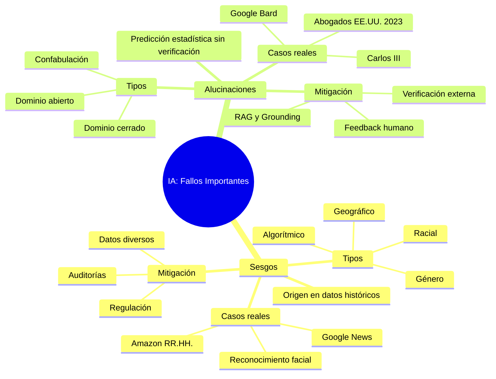

# Sesgos y Alucinaciones en la Inteligencia Artificial

## 🎯 Introducción

> [!info]- 💡 ¿Por qué importa este tema?
> 
> La inteligencia artificial ya toma decisiones que afectan la vida real: selecciona candidatos de trabajo, aprueba créditos, asiste en diagnósticos médicos y hasta genera contenido informativo. Cuando estos sistemas fallan de forma sistemática o inventan información, las consecuencias pueden ser serias.
> 
> Este documento cubre dos de los problemas más relevantes de la IA actual:
> 
> |Problema|¿Qué es?|¿Por qué importa?|
> |---|---|---|
> |**Sesgo**|Discriminación sistemática en los resultados|Perpetúa desigualdades sociales|
> |**Alucinación**|Generación de información falsa pero convincente|Produce desinformación y errores graves|
> 
> **Analogía práctica:** Si la IA fuera un estudiante, el sesgo sería como tener prejuicios inconscientes al responder, y la alucinación sería inventar una respuesta con total confianza cuando no sabe la verdad.

---

## 🔴 Parte 1 — Sesgos en la IA

### ¿Qué es un Sesgo?

> [!note]- 📖 Definición
> 
> Según el estándar **ISO/IEC 22989**, un sesgo es la _"diferencia sistemática de trato de determinados objetos, personas o grupos en comparación con otros"_. A diferencia de un error aleatorio, el sesgo sigue un **patrón repetible y predecible**.
> 
> El Instituto Nacional de Estándares y Tecnología de EE.UU. (NIST) lo describe así:
> 
> > _"El sesgo es un efecto que priva a un resultado estadístico de representatividad al distorsionarlo, a diferencia de un error aleatorio, que puede distorsionarlo en cualquier ocasión, pero se equilibra en promedio."_
> 
> En resumen: **si hay predeterminación o parcialidad y el resultado está distorsionado de forma consistente → hay sesgo.**

### ¿Cómo se originan los sesgos?

> [!example]- 🧠 Orígenes del Sesgo
> 
> ```mermaid
> graph TD
>     A[🗃️ Datos de Entrenamiento Sesgados] --> E[⚠️ IA con Sesgo]
>     B[👨‍💻 Decisiones de Diseño del Algoritmo] --> E
>     C[👥 Sesgos Humanos Incorporados] --> E
>     D[🌍 Datos No Representativos] --> E
> 
>     E --> F[Discriminación Intencional]
>     E --> G[Discriminación No Intencional]
> 
>     style A fill:#ffe1e1
>     style B fill:#fff4e1
>     style C fill:#ffe1e1
>     style D fill:#fff4e1
>     style E fill:#ffcccc
>     style F fill:#e1f5ff
>     style G fill:#e1ffe1
> ```
> 
> - **Datos desequilibrados:** Si el modelo se entrena con más datos de un grupo que de otro, aprenderá a favorecer al grupo mayoritario.
> - **Sesgos históricos:** Si los datos reflejan discriminaciones del pasado (ej. contratar solo hombres), la IA los aprende y los repite.
> - **Falta de diversidad:** Conjuntos de datos con predominancia del hemisferio norte, por ejemplo, generan sesgos geográficos y culturales.

### Tipos de Sesgo

> [!tip]- 🗂️ Clasificación de los Sesgos
> 
> |Tipo|Descripción|Ejemplo|
> |---|---|---|
> |**Sesgo de datos**|Proviene de conjuntos de datos desequilibrados|Más imágenes de personas blancas → peor reconocimiento facial de personas negras|
> |**Sesgo de género**|Asociaciones estereotipadas por sexo|Buscar "inteligente" → fotos de hombres; "emocional" → fotos de mujeres|
> |**Sesgo racial**|Discriminación basada en raza o etnia|Algoritmos de reconocimiento facial con mayor tasa de error en pieles oscuras|
> |**Sesgo geográfico**|Infrarrepresentación de ciertas regiones|Bases de datos con exceso de datos del hemisferio norte|
> |**Sesgo algorítmico**|Surge del diseño del propio algoritmo|Variables de diseño que crean parcialidades no intencionadas|
> |**Sesgo de confirmación**|El modelo refuerza lo que ya "sabe"|Resultados que repiten estereotipos en lugar de cuestionarlos|

### Ejemplos Reales

> [!example]- 📌 Casos Documentados
> 
> **1. Amazon — Algoritmo de Selección de Personal (2018)**
> 
> ```
> Problema:  El algoritmo discriminaba currículums que contenían
>            la palabra "mujer" (ej. "club de mujeres en STEM").
> Causa:     Fue entrenado con CVs históricos donde los contratados
>            eran mayoritariamente hombres.
> Resultado: Amazon tuvo que retirar el sistema.
> ```
> 
> **2. Google News — Analogías de Género**
> 
> ```
> Problema:  Al resolver "hombre es a programador como mujer es a X",
>            la IA respondió: "ama de casa".
> Causa:     Datos de entrenamiento que reflejaban roles de género
>            históricos y estereotipados.
> ```
> 
> **3. Reconocimiento Facial — Sesgo Racial**
> 
> ```
> Problema:  Sistemas como CamFind y Rekognition mostraron tasas
>            de error significativamente más altas en personas
>            de piel oscura vs. piel clara.
> Impacto:   Identificaciones erróneas con consecuencias legales
>            y sociales graves.
> ```
> 
> **4. Generadores de Imágenes — Sesgos Visuales**
> 
> ```
> Problema:  Al pedir "persona migrante", la IA generaba imágenes
>            de personas negras con vestidos autóctonos cargando
>            canastas de frutas.
> Causa:     Asociaciones estereotipadas en los datos de entrenamiento.
> Impacto:   Perpetúa y refuerza prejuicios sociales.
> ```

---

## 🟡 Parte 2 — Alucinaciones en la IA

### ¿Qué es una Alucinación?

> [!note]- 📖 Definición
> 
> Una **alucinación en IA** es un fenómeno en el que un modelo genera una respuesta que parece completamente coherente y segura, pero que es **falsa, inexacta o inventada**, sin base en la realidad verificable.
> 
> > _"Una alucinación es una afirmación generada por la IA que parece plausible, pero no está respaldada por la realidad."_ — BBVA Innovation
> 
> **Diferencia clave con el error humano:**
> 
> ```
> Humano:  "No estoy seguro de eso, déjame verificar."
>           ↑ Reconoce su límite
> 
> IA:      "El estudio publicado en la revista X en 2021 demuestra que..."
>           ↑ Inventa la cita con total confianza
> ```
> 
> El término es **metafórico** — la IA no "alucina" como un ser humano. Lo que ocurre es que el modelo predice palabras estadísticamente probables, sin verificar si corresponden a hechos reales.

### ¿Por qué ocurren?

> [!warning]- ⚙️ Causas Técnicas
> 
> ```mermaid
> graph LR
>     A[LLM genera texto por probabilidad estadística] --> B{¿Tiene datos suficientes?}
>     B -- Sí --> C[Respuesta correcta ✅]
>     B -- No --> D[Inventa una respuesta plausible ❌]
>     D --> E[ALUCINACIÓN]
> 
>     style C fill:#e1ffe1
>     style D fill:#ffe1e1
>     style E fill:#ffcccc
> ```
> 
> |Causa|Descripción|
> |---|---|
> |**Predicción estadística**|Los LLM predicen la siguiente palabra más probable, no verifican hechos|
> |**Sobreajuste (Overfitting)**|El modelo memorizó patrones muy específicos y los aplica fuera de contexto|
> |**Datos insuficientes (Long-tail)**|Temas poco frecuentes en los datos → el modelo "rellena" con inventos|
> |**Sin acceso a realidad**|El modelo no "consulta" fuentes externas al generar; opera con lo que aprendió|
> |**Contexto mal interpretado**|Malinterpreta la pregunta y construye una respuesta coherente pero equivocada|

### Tipos de Alucinaciones

> [!tip]- 🗂️ Clasificación
> 
> |Tipo|Descripción|Ejemplo|
> |---|---|---|
> |**Confabulación**|Inventa datos, leyes, estudios o estadísticas|Citar un artículo científico que no existe|
> |**Dominio cerrado**|La respuesta contradice la información dada por el usuario|El usuario da un texto y la IA lo resume con datos que no estaban|
> |**Dominio abierto**|Genera información sin base en ninguna fuente|Inventar una sentencia judicial o evento histórico|
> |**Alucinación visual**|En reconocimiento de imágenes, "ve" objetos inexistentes|Detectar una enfermedad en una imagen médica normal|

### Ejemplos Reales

> [!example]- 📌 Casos Documentados
> 
> **1. El Caso de los Abogados (EE.UU., 2023)**
> 
> ```
> Qué pasó:  Abogados usaron ChatGPT para preparar un escrito judicial.
>            Presentaron varias sentencias como precedente legal.
> Problema:  Las sentencias no existían — fueron inventadas por la IA.
> Resultado: El juez descubrió el fraude y los abogados fueron
>            sancionados por incluir precedentes falsos.
> Lección:   En contextos legales, médicos o académicos,
>            la verificación es obligatoria.
> ```
> 
> **2. La Coronación de Carlos III — ChatGPT**
> 
> ```
> Qué pasó:  Se le pidió a ChatGPT una semblanza sobre la coronación
>            de Carlos III.
> Problema:  El modelo incluyó detalles del evento que no habían
>            ocurrido (fecha futura al corte de sus datos).
> Lección:   Los LLM no saben lo que no saben — inventan
>            para completar la respuesta.
> ```
> 
> **3. Google Bard — Error en Presentación Pública (2023)**
> 
> ```
> Qué pasó:  En su presentación oficial, Google mostró a Bard
>            respondiendo que el telescopio James Webb tomó "las
>            primeras fotografías de un planeta fuera del sistema solar".
> Problema:  Eso es incorrecto — ese logro fue de otro telescopio años antes.
> Impacto:   Las acciones de Google cayeron ~9% ese día.
> ```
> 
> **4. IA Médica — Diagnóstico Erróneo**
> 
> ```
> Qué pasó:  Un modelo de IA sanitaria identificó incorrectamente
>            una lesión cutánea benigna como maligna.
> Impacto:   Potencial de generar intervenciones médicas innecesarias.
> Lección:   En medicina, la IA debe ser apoyo, no diagnóstico final.
> ```

---

## ⚖️ Parte 3 — Sesgos vs. Alucinaciones

> [!info]- 🔍 Diferencias Clave
> 
> |Aspecto|Sesgo|Alucinación|
> |---|---|---|
> |**¿Qué es?**|Discriminación sistemática y repetible|Información falsa generada con confianza|
> |**Origen**|Datos de entrenamiento o diseño del algoritmo|Límites estadísticos del modelo de lenguaje|
> |**¿Es intencional?**|Generalmente no, pero puede serlo|No — es un fallo estructural|
> |**¿Se repite?**|Sí, sigue un patrón sistemático|No necesariamente — puede variar|
> |**Impacto principal**|Discriminación, desigualdad social|Desinformación, errores factuales|
> |**Ejemplo**|Algoritmo que favorece CVs masculinos|IA que inventa una sentencia judicial|
> 
> ```mermaid
> graph TD
>     A[Fallo de IA] --> B[¿Sigue un patrón sistemático?]
>     B -- Sí --> C[🔴 SESGO: Discrimina de forma consistente]
>     B -- No --> D[¿Genera información factualmente incorrecta?]
>     D -- Sí --> E[🟡 ALUCINACIÓN: Inventa con confianza]
>     D -- No --> F[Otro tipo de error]
> 
>     style C fill:#ffe1e1
>     style E fill:#fff4e1
>     style F fill:#e1f5ff
> ```

---

## 🛡️ Parte 4 — ¿Cómo se pueden reducir?

> [!success]- ✅ Estrategias de Mitigación
> 
> **Para los Sesgos:**
> 
> |Estrategia|Descripción|
> |---|---|
> |**Datos diversos y representativos**|Incluir datos de distintos géneros, razas, regiones y culturas|
> |**Auditorías de algoritmos**|Revisar regularmente los modelos para detectar discriminaciones|
> |**Democratización de la IA**|Involucrar a más comunidades en la creación de datos y modelos|
> |**Regulación**|Leyes como el AI Act de la UE que exigen transparencia|
> |**Equipos diversos**|Desarrolladores con distintos orígenes reducen puntos ciegos|
> 
> **Para las Alucinaciones:**
> 
> |Estrategia|Descripción|
> |---|---|
> |**Datos de entrenamiento más amplios**|Reducir zonas de conocimiento escaso|
> |**Grounding / RAG**|Conectar el modelo a fuentes verificables en tiempo real|
> |**Feedback humano (RLHF)**|Entrenamiento con correcciones humanas para reducir errores|
> |**Advertencias al usuario**|Indicar cuándo el modelo tiene baja confianza en su respuesta|
> |**Verificación obligatoria**|En contextos críticos (medicina, derecho), siempre contrastar|

---

## 📊 Resumen Visual



---

## 🗂️ Tabla Resumen General
> [!info] Todo lo que necesitas saber
> | Aspecto                    | 🔴 Sesgo                                               | 🟡 Alucinación                                               |
> | -------------------------- | ------------------------------------------------------ | ------------------------------------------------------------ |
> | **Definición**             | Discriminación sistemática en los resultados de la IA  | Generación de información falsa pero coherente y convincente |
> | **Causa principal**        | Datos de entrenamiento sesgados o diseño del algoritmo | Predicción estadística sin verificación de hechos reales     |
> | **¿Es intencional?**       | Generalmente no                                        | No — es un fallo estructural del modelo                      |
> | **¿Se repite?**            | Sí, sigue un patrón consistente                        | No necesariamente — puede variar por consulta                |
> | **Áreas de impacto**       | RRHH, salud, justicia, reconocimiento facial           | Derecho, medicina, periodismo, educación                     |
> | **Caso real clave**        | Amazon descartó CVs femeninos automáticamente          | Abogados presentaron sentencias inventadas por ChatGPT       |
> | **Impacto social**         | Perpetúa desigualdades y discriminación                | Genera desinformación y errores con consecuencias graves     |
> | **Cómo reducirlo**         | Datos diversos, auditorías, regulación                 | RAG/Grounding, feedback humano, verificación externa         |
> | **Estándar de referencia** | ISO/IEC 22989, NIST AI RMF                             | Literatura científica de LLMs (NLP)                          |
> 

---
## 📚 Referencias (Formato IEEE)

> [!quote]- 📖 Fuentes Consultadas
> 
> [1] Instituto Nacional de Estándares y Tecnología (NIST), _Towards a Standard for Identifying and Managing Bias in Artificial Intelligence_, Gaithersburg, MD: NIST, 2022.
> 
> [2] ISO/IEC, _ISO/IEC 22989:2022 — Artificial Intelligence Concepts and Terminology_, Geneva: International Organization for Standardization, 2022.
> 
> [3] IBM, "¿Qué son las alucinaciones de IA?", _IBM Think_, 2024. [En línea]. Disponible en: https://www.ibm.com/es-es/think/topics/ai-hallucinations
> 
> [4] BBVA Innovation, "Alucinaciones en IA generativa: por qué ocurren y por qué se están reduciendo", _BBVA_, 2025. [En línea]. Disponible en: https://www.bbva.com/es/innovacion/alucinaciones-en-ia-generativa
> 
> [5] I. Salazar, "Innovación y tecnología para combatir los sesgos de la inteligencia artificial", _BBVA_, mayo 2025. [En línea]. Disponible en: https://www.bbva.com/es/innovacion/innovacion-y-tecnologia-para-combatir-los-sesgos
> 
> [6] Educ.ar, "Sesgos, citas falsas y alucinaciones: fallas en la inteligencia artificial", _Portal Educativo — Secretaría de Educación de Argentina_. [En línea]. Disponible en: https://www.educ.ar/recursos/159082

---

**Tags:** #computacion #sociedad #IA #sesgos #alucinaciones #etica #inteligencia-artificial