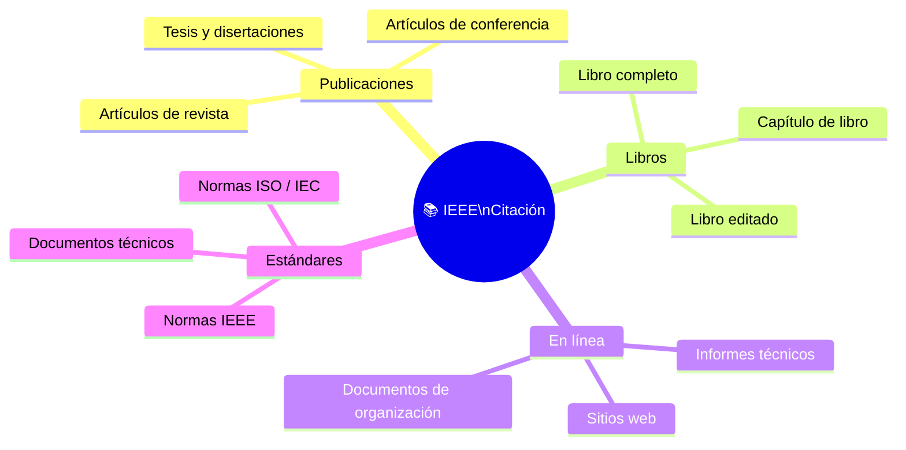

# 📚 Referencias IEEE — Computación y Sociedad

## 🎯 Introducción

> [!info]- 📖 ¿Qué es el formato IEEE?
>
> El **formato IEEE** (*Institute of Electrical and Electronics Engineers*) es el estándar de citación más utilizado en ingeniería, computación y tecnología. A diferencia de APA o MLA, las referencias se numeran entre corchetes `[1]` en el orden en que aparecen en el texto.
>
> **Estructura general de una referencia IEEE:**
>
> | Elemento | Descripción |
> |---|---|
> | `[N]` | Número de referencia en orden de aparición |
> | Autor(es) | Inicial(es) del nombre + Apellido |
> | *"Título del artículo"* | Entre comillas si es artículo/capítulo |
> | *Título del libro o revista* | En cursiva |
> | Volumen, número, páginas | Para publicaciones periódicas |
> | Año | Entre paréntesis o al final |
> | DOI / URL | Para fuentes en línea |
>
> > *"Las referencias no son solo formalidad — son el respaldo de todo argumento técnico y científico."*
>
> **Este documento organiza las referencias en 4 categorías:**
> 1. 📰 Artículos de revista y conferencia
> 2. 📘 Libros y capítulos
> 3. 🌐 Fuentes en línea e informes institucionales
> 4. 🎓 Normas, estándares y documentos técnicos

---

## 📋 Estructura del Formato IEEE



---

## 📰 Plantillas de Citación

> [!note]- 📌 Artículo de Revista
>
> **Formato:**
> ```
> [N] I. Apellido, "Título del artículo", Nombre de la Revista, vol. X, no. Y, pp. ZZ–ZZ, Mes Año, doi: XX.XXXX/XXXX.
> ```
>
> **Ejemplo:**
> ```
> [1] A. García y B. López, "Impacto de la inteligencia artificial en la sociedad digital", IEEE Trans. Technol. Soc., vol. 5, no. 2, pp. 112–124, Jun. 2024, doi: 10.1109/TTS.2024.1234567.
> ```
>
> **Campos requeridos:**
> | Campo | ¿Obligatorio? |
> |---|---|
> | Autor(es) | ✅ |
> | Título del artículo | ✅ |
> | Nombre de la revista | ✅ |
> | Volumen y número | ✅ |
> | Páginas | ✅ |
> | Año | ✅ |
> | DOI | ✅ (si existe) |

---

> [!note]- 📌 Artículo de Conferencia
>
> **Formato:**
> ```
> [N] I. Apellido, "Título del artículo", en Proc. Nombre de la Conferencia (SIGLA), Ciudad, País, Año, pp. ZZ–ZZ.
> ```
>
> **Ejemplo:**
> ```
> [2] C. Rodríguez, "Ética en sistemas de IA para toma de decisiones públicas", en Proc. IEEE Int. Conf. Comput. Soc. (ICCS), Buenos Aires, Argentina, 2024, pp. 45–52.
> ```

---

> [!note]- 📌 Libro Completo
>
> **Formato:**
> ```
> [N] I. Apellido, Título del libro, Xª ed. Ciudad, País: Editorial, Año.
> ```
>
> **Ejemplo:**
> ```
> [3] N. Carr, The Shallows: What the Internet Is Doing to Our Brains. Nueva York, EE.UU.: W. W. Norton, 2020.
> ```

---

> [!note]- 📌 Capítulo en Libro Editado
>
> **Formato:**
> ```
> [N] I. Apellido, "Título del capítulo", en Título del libro, I. Editor, Ed. Ciudad: Editorial, Año, pp. ZZ–ZZ.
> ```
>
> **Ejemplo:**
> ```
> [4] M. Torres, "Brecha digital en América Latina", en Tecnología y Sociedad en el Siglo XXI, P. Ramírez, Ed. Quito: Editorial Universitaria, 2023, pp. 88–104.
> ```

---

> [!note]- 📌 Fuente en Línea / Sitio Web
>
> **Formato:**
> ```
> [N] Autor o Organización, "Título de la página", Nombre del sitio, Año. [En línea]. Disponible en: https://url.ejemplo. [Accedido: Día Mes Año].
> ```
>
> **Ejemplo:**
> ```
> [5] UNESCO, "Recomendación sobre la ética de la inteligencia artificial", UNESCO, 2021. [En línea]. Disponible en: https://www.unesco.org/es/artificial-intelligence/recommendation-ethics. [Accedido: 10 May 2025].
> ```

---

> [!note]- 📌 Informe Técnico o Institucional
>
> **Formato:**
> ```
> [N] Organización, Título del informe, Rep. Técnico, No. XX, Ciudad: Organización, Año.
> ```
>
> **Ejemplo:**
> ```
> [6] UNCTAD, Informe sobre Tecnología e Innovación 2025: Inteligencia Artificial Inclusiva para el Desarrollo, Ginebra: UNCTAD, 2025.
> ```

---

> [!note]- 📌 Tesis o Disertación
>
> **Formato:**
> ```
> [N] I. Apellido, "Título de la tesis", Tipo de tesis (M.S. / Ph.D.), Depto. Área, Universidad, Ciudad, País, Año.
> ```
>
> **Ejemplo:**
> ```
> [7] J. Herrera, "Impacto social de los algoritmos de recomendación en plataformas digitales", tesis de maestría, Depto. Ingeniería de Sistemas, Universidad de Guayaquil, Guayaquil, Ecuador, 2024.
> ```

---

## 🌐 Referencias de la Materia — Computación y Sociedad

> [!quote]- 📖 ODS y Tecnología
>
> [1] Naciones Unidas, *Informe sobre los Objetivos de Desarrollo Sostenible 2025*, Nueva York: ONU, 2025. [En línea]. Disponible en: https://unstats.un.org/sdgs/report/2025/. [Accedido: 10 May 2025].
>
> [2] J. Sachs, G. Lafortune, G. Fuller y G. Iablonovski, *Sustainable Development Report 2025*, París: SDSN / Dublin University Press, 2025.
>
> [3] PNUD, "Objetivos de Desarrollo Sostenible", *Programa de las Naciones Unidas para el Desarrollo*, 2025. [En línea]. Disponible en: https://www.undp.org/es/sustainable-development-goals. [Accedido: 10 May 2025].
>
> [4] ONU, "Inteligencia artificial y desarrollo sostenible", *Naciones Unidas*, 2024. [En línea]. Disponible en: https://www.un.org/es/global-issues/artificial-intelligence. [Accedido: 10 May 2025].
>
> [5] UNCTAD, *Informe sobre Tecnología e Innovación 2025: Inteligencia Artificial Inclusiva para el Desarrollo*, Ginebra: UNCTAD, 2025.
>
> [6] A. Guterres, "Momento ODS 2025: Un llamado a acelerar el cumplimiento de los Objetivos de Desarrollo Sostenible", *Naciones Unidas en México*, 2025. [En línea]. Disponible en: https://mexico.un.org/es/302006-momento-ods-2025. [Accedido: 10 May 2025].

---

> [!quote]- 📖 Ética e IA
>
> [7] UNESCO, "Recomendación sobre la ética de la inteligencia artificial", *UNESCO*, 2021. [En línea]. Disponible en: https://www.unesco.org/es/artificial-intelligence/recommendation-ethics. [Accedido: 10 May 2025].
>
> [8] IEEE, *Ethically Aligned Design: A Vision for Prioritizing Human Well-being with Autonomous and Intelligent Systems*, 1ª ed. Piscataway, NJ: IEEE, 2019. [En línea]. Disponible en: https://ethicsinaction.ieee.org/.
>
> [9] V. Eubanks, *Automating Inequality: How High-Tech Tools Profile, Police, and Punish the Poor*. Nueva York, EE.UU.: St. Martin's Press, 2018.
>
> [10] K. Crawford, *Atlas of AI: Power, Politics, and the Planetary Costs of Artificial Intelligence*. New Haven, CT: Yale University Press, 2021.

---

> [!quote]- 📖 Sociedad Digital y Brecha Tecnológica
>
> [11] ITU, *Measuring Digital Development: Facts and Figures 2024*, Ginebra: Unión Internacional de Telecomunicaciones, 2024. [En línea]. Disponible en: https://www.itu.int/en/ITU-D/Statistics/Pages/facts/default.aspx.
>
> [12] N. Carr, *The Shallows: What the Internet Is Doing to Our Brains*. Nueva York, EE.UU.: W. W. Norton, 2020.
>
> [13] S. Zuboff, *The Age of Surveillance Capitalism: The Fight for a Human Future at the New Frontier of Power*. Nueva York, EE.UU.: PublicAffairs, 2019.
>
> [14] CEPAL, "Tecnologías digitales para un nuevo estilo de desarrollo en América Latina y el Caribe", *Comisión Económica para América Latina y el Caribe*, Santiago: CEPAL, 2022. [En línea]. Disponible en: https://www.cepal.org/es/publicaciones/47855.

---

> [!quote]- 📖 Seguridad, Privacidad y Ciberseguridad
>
> [15] W. Stallings y L. Brown, *Computer Security: Principles and Practice*, 4ª ed. Hoboken, NJ: Pearson, 2018.
>
> [16] B. Schneier, *Data and Goliath: The Hidden Battles to Collect Your Data and Control Your World*. Nueva York, EE.UU.: W. W. Norton, 2015.
>
> [17] ENISA, *ENISA Threat Landscape 2024*, Heraklion: Agencia de la Unión Europea para la Ciberseguridad, 2024. [En línea]. Disponible en: https://www.enisa.europa.eu/publications/enisa-threat-landscape-2024.

---

## 🗂️ Tabla Resumen — Tipos de Fuentes IEEE

| Tipo | Indicador clave | Ejemplo de uso |
|---|---|---|
| Artículo de revista | `vol., no., pp., doi:` | Investigación científica revisada |
| Artículo de conferencia | `en Proc. ... , pp.` | Presentaciones académicas y técnicas |
| Libro completo | `Editorial, Año` | Fundamentos teóricos de un campo |
| Capítulo de libro | `en Título del libro, Ed.` | Contribución específica en compilación |
| Sitio web / en línea | `[En línea]. Disponible en:` | Documentos institucionales y noticias |
| Informe técnico | `Rep. Técnico, No.` | Datos estadísticos y reportes oficiales |
| Tesis | `tesis de maestría / Ph.D.` | Investigaciones académicas locales |
| Norma / Estándar | `Std. XXXX-XXXX` | Regulaciones técnicas y protocolos |

---

## ⚠️ Errores Comunes a Evitar

> [!warning]- 🚫 Errores frecuentes en citación IEEE
>
> | Error | Correcto |
> |---|---|
> | Poner el nombre completo del autor | Solo inicial + apellido: `J. García` |
> | No incluir el DOI cuando existe | Siempre agregar `doi: XX.XXXX/...` |
> | Citar Wikipedia como fuente principal | Wikipedia no es fuente académica válida en IEEE |
> | No indicar fecha de acceso en sitios web | Siempre agregar `[Accedido: DD Mes AAAA]` |
> | Mezclar formatos APA e IEEE | Usar exclusivamente la estructura IEEE |
> | No numerar en orden de aparición | Las referencias `[1], [2]...` siguen el orden del texto |
> | Usar "et al." antes de 3 autores | "et al." se usa con 4 o más autores |

---

## 🔗 Herramientas Útiles

> [!tip]- 🛠️ Generadores y gestores de referencias
>
> | Herramienta | Uso | Enlace |
> |---|---|---|
> | **Zotero** | Gestor de referencias gratuito y de código abierto | https://www.zotero.org |
> | **Mendeley** | Gestor con integración a Word y LaTeX | https://www.mendeley.com |
> | **Citation Machine** | Generador automático de citas IEEE | https://www.citationmachine.net |
> | **IEEE Reference Guide** | Guía oficial del formato IEEE | https://ieeeauthorcenter.ieee.org |
> | **DOI.org** | Verificador de DOI para artículos | https://www.doi.org |
> | **Google Scholar** | Búsqueda de artículos con cita automática | https://scholar.google.com |

---

**Tags:** #computacion #sociedad #referencias #IEEE #citacion #investigacion #metodologia

**Relacionado:** [[02 - ODS y Tecnología]] | [[03 - Ética en IA]] | [[00 - Índice]]
