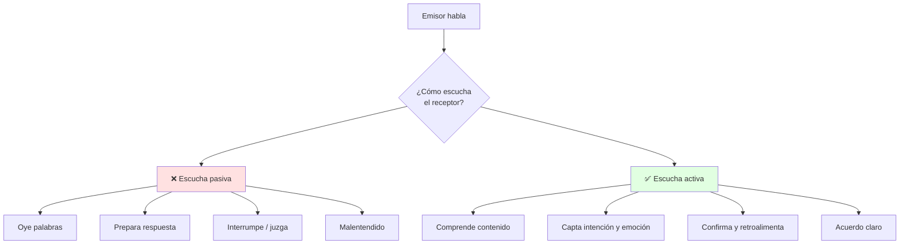
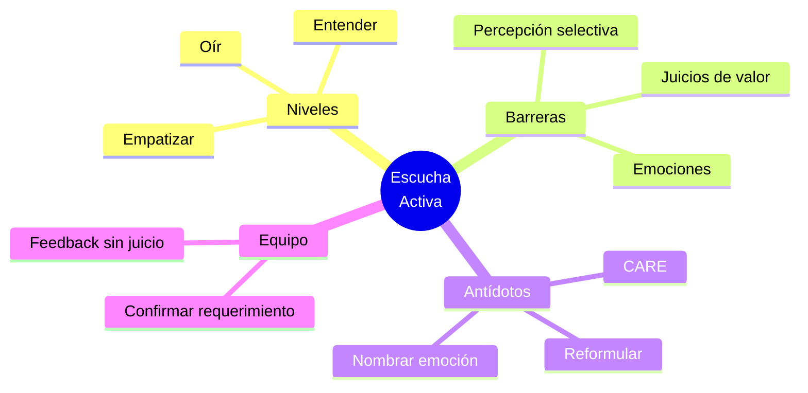

# 👂 Escucha Activa, Empatía y Barreras

## 🎯 Introducción

> [!info] 💡 ¿Por Qué Escuchar Activamente?
>
> La **comunicación interpersonal efectiva** no es hablar más, es **escuchar mejor**. En ingeniería, un malentendido en un requerimiento cuesta horas de código.
>
> **Analogía del mundo real:** Piensa en un debug de código:
>
> - **Sin escucha activa** → Lees el error por encima y cambias código al azar
> - **Con escucha activa** → Lees el stack trace completo, reproduces, preguntas, confirmas
> - **Empatía** → Entiendes qué quiso decir el cliente, no solo lo que dijo
> - **Barreras** → Son los bugs de la comunicación: percepción selectiva, juicios, emociones
>
> **¿Por qué es crítico en lo académico y profesional?**
>
> | Razón | Sin Escucha Activa | Con Escucha Activa |
> |---|---|---|
> | **Comprensión** | Entiendes 25% y asumes el resto | Retienes intención + contenido + emoción |
> | **Relaciones** | Conflictos por malentendidos | Confianza y colaboración |
> | **Trabajo en equipo** | Decisiones apresuradas | Decisiones con información completa |
> | **Liderazgo** | Equipo se siente ignorado | Equipo se siente validado |



---

## 🧠 Intención Comunicativa y Niveles de Escucha

### 🎭 Del Oír al Escuchar

> [!note] 🎨 Los 3 Niveles
>
> **¿Qué es la intención comunicativa?**
>
> Es el propósito detrás del mensaje: informar, pedir, persuadir, expresar emoción. Escuchar activo es detectarla, no solo las palabras.
>
> ```mermaid
> graph LR
>     U[Mensaje] --> E[Palabras]
>     E --> I[Intención]
>     I --> EA[Escucha activa]
>     EA --> R[Respuesta ajustada]
>
>     N1[Nivel 1<br/>Oír] -.Superficial.-> E
>     N2[Nivel 2<br/>Entender] -.Contenido.-> I
>     N3[Nivel 3<br/>Empatizar] -.Emoción + contexto.-> EA
>
>     style EA fill:#e1f5ff
>     style N1 fill:#ffe1e1
>     style N3 fill:#e1ffe1
> ```
>
> **Comparación visual:**
>
> | Aspecto | Nivel 1: Oír | Nivel 2: Entender | Nivel 3: Empatizar |
> |---|---|---|---|
> | **Foco** | En mí (qué respondo) | En el mensaje | En la persona |
> | **Preguntas** | ❌ No pregunto | ✅ Aclaro datos | ✅ Exploro emociones |
> | **Lenguaje corporal** | Miro el celular | Contacto visual | Asiento, reflejo |
> | **Resultado** | Asumo | Comprendo | Conecto |

### 🔍 Técnica CARE para Escucha Activa

> [!example] 🧪 Protocolo en 4 Pasos
>
> **Método para practicar en clases y equipos:**
>
> C - Concentrarse: elimina distractores, contacto visual, postura abierta
> A - Asentir y Acompañar: gestos, "ajá", "entiendo", no interrumpir
> R - Reformular: "Si entiendo bien, necesitas X porque Y, ¿correcto?"
> E - Emocionar: nombra la emoción "Noto que esto te frustra/preocupa"
>
> **Salida esperada en un equipo:**
>
> [Sin CARE] "Ya, haz el informe así nomás"
> [Con CARE] "¿Me confirmas si el informe es técnico para el profe o ejecutivo para el cliente?"

---

## 🚧 Barreras en la Comunicación Interpersonal

> [!danger] 🚫 Los Bugs Más Comunes
>
> **Las 3 barreras del syllabus:**
>
> ```mermaid
> graph TD
>     A[Mensaje claro] --> B{¿Qué barrera<br/>aparece?}
>     B --> C[👁️ Percepción selectiva]
>     B --> D[⚖️ Juicios de valor]
>     B --> E[😡 Emociones]
>
>     C --> C1[Solo oigo lo que me conviene]
>     D --> D1[Etiqueto antes de entender]
>     E --> E1[Ansiedad/enojo distorsiona]
>
>     style C fill:#fff4e1
>     style D fill:#ffe1e1
>     style E fill:#f0e1ff
> ```
>
> **Síntomas y antídotos:**
>
> | Barrera | Ejemplo | Antídoto CARE |
> |---|---|---|
> | 👁️ **Percepción selectiva** | Solo recuerdas la crítica, no el reconocimiento | Reformular completo, tomar notas |
> | ⚖️ **Juicios de valor** | "Eso es imposible" antes de escuchar datos | Suspender juicio 2 min, preguntar "¿qué datos tienes?" |
> | 😡 **Emociones** | Con estrés, todo suena a ataque | Respirar, nombrar emoción, pedir pausa si hace falta |
> | 📱 **Distractores** | Revisar celular en exposición | Modo avión, contacto visual |
> | 🗣️ **Lenguaje corporal cerrado** | Brazos cruzados, sin contacto visual | Postura abierta, asentir |

---

## ❤️ Empatía y Gestión de Emociones

### 🎯 Empatía Operativa

> [!success] 🏆 La Herramienta Estándar
>
> **Empatía no es estar de acuerdo, es entender el marco del otro.**
>
> ```mermaid
> graph TB
>     EDT[Yo escucho]
>     WT[Otro habla]
>
>     EDT -->|1. Pausa| SW[No juzgo aún]
>     SW -->|2. Pregunto| WT
>     WT -->|3. Explica| EDT
>     EDT -->|4. Reflejo| UI[Valido emoción]
>     WT -->|5. Confirma| EDT
>
>     style EDT fill:#e1f5ff
>     style WT fill:#fff4e1
>     style SW fill:#e1ffe1
> ```
>
> **Frases plantilla:**
>
> | Situación | En vez de | Mejor |
> |---|---|---|
> | Compañero frustrado | "No es para tanto" | "Veo que te frustra el taller, ¿qué parte te traba?" |
> | Cliente confuso | "Ya te expliqué" | "Te lo explico de otra forma con un ejemplo, ¿te sirve?" |
> | Debate acalorado | "Estás mal" | "Entiendo tu punto por X, mi dato es Y, ¿cómo lo unimos?" |

---

## 🎨 Patrones Comunes en Equipos ESPOL

### 📥 Patrón: Confirmación de Requerimiento

> [!example] 💾 Evitar Retrabajo
>
> 1. Escucha la petición completa sin interrumpir
> 2. Reformula: "Entonces necesitas [producto] para [audiencia] el [fecha], ¿correcto?"
> 3. Pide el criterio de éxito: "¿Cómo sabremos que quedó bien?"
> 4. Deja constancia escrita en el chat del curso / Aula Virtual

### 📤 Patrón: Feedback sin Juicio

> [!example] 💿 Corregir sin Romper Relación
>
> 1. Dato observable: "En la diapo 3 hay 3 faltas de tilde"
> 2. Impacto: "Eso nos baja puntos en redacción"
> 3. Pregunta: "¿Quieres que lo revisemos juntos 10 min?"
> 4. Acuerdo: quién, qué, cuándo

---

## ⚠️ Problemas Comunes y Soluciones

> [!danger] ❌ Error Frecuente: Preparar Respuesta Mientras Escuchas
>
> **Síntomas:**
>
> - Interrumpes a mitad de frase
> - Respondes algo que ya habían aclarado
> - El otro siente que no lo escuchaste
>
> **Solución:**
>
> - Anota tu idea en 3 palabras y vuelve a escuchar
> - Espera 2 segundos tras que termine para responder
> - Reformula antes de opinar

---

## 🎯 Mejores Prácticas

> [!tip] 🏆 Checklist Profesional
>
> **1. SIEMPRE reformular en temas académicos**
>
> - ❌ EVITAR
> "Ya entendí" (sin verificar)
>
> - ✅ PREFERIR
> "Te repito para confirmar: X, Y, Z. ¿Voy bien?"
>
> **2. Gestiona emociones nombrándolas**
>
> "Noto tensión, ¿hacemos pausa 2 min y retomamos?"
>
> **3. Cuida tu no verbal (se verá en Unidad 4)**
>
> Contacto visual + postura abierta + gestos moderados
>
> **4. Evaluación 1 de esta semana (S1): La escucha activa (TAF asincrónica)**
>
> - Revisa el material en Aula Virtual antes de clase
> - Practica CARE en la actividad de integración
> - Participación 1: Mentor activo 3 semanas

---

## 📊 Resumen Visual



> [!success] 🔍 Comparación Final
>
> | Aspecto | Escucha Pasiva | Escucha Activa |
> |---|---|---|
> | **Atención** | ❌ Dividida | ✅ Plena |
> | **Comprensión** | Palabras | Intención + emoción |
> | **Respuesta** | Reactiva | Confirmada |
> | **Uso Recomendado** | Ninguno académico | ✅ **Estándar profesional** |

---

## 🚀 Próximos Pasos

> [!quote] 🌟 Continuando
>
> **Has aprendido:**
>
> ✅ Intención comunicativa y 3 niveles de escucha
> ✅ Barreras: percepción selectiva, juicios, emociones
> ✅ Empatía operativa y gestión emocional
> ✅ Patrones CARE para equipos
>
> **Próximo tema:**
>
> | Tema | Qué verás | Por qué importa |
> |---|---|---|
> | **Comunicación grupal y estratégica** | Dinámicas, manejo de grupos, identidad/imagen | Base del Taller 1 caso de estudio (S2) |

---

## 🔗 Seguir estudiando

> [!info] 📚 Seguir estudiando
>
> - Mapa de contenido: [[Comunicación]]
> - Índice Unidad 1: [[00 - Índice Unidad 1]]
> - Siguiente: [[02 - Comunicación grupal y estratégica]]
> - Syllabus: [[Bienvenida y Syllabus Comunicación]]
> - Base MOOC: [[Preuniversitario/MOOC de Comunicación/Comunicación Efectiva|MOOC de Comunicación]]
> - Base específica: [[Preuniversitario/MOOC de Comunicación/Unidad 1 - El proceso de la comunicación/01 - El proceso y las funciones de la comunicación|MOOC U1 — Proceso y funciones]]

## 📚 Referencias

> [!quote] 📖 Fuentes
>
> - Sílabo IDIG2012, Unidad 1: Comunicación efectiva — interpersonal, barreras, grupal (4h).
> - Planificación PAO 2-2026 S1: escucha activa, intención comunicativa, gestión de emociones.
> - [1] M. Sánchez Fernández, *Comunicación efectiva y trabajo en equipo*, CEP, 2014.
> - [2] A. Codina Jiménez, *Saber escuchar. Un intangible valioso*, 2004 — https://www.redalyc.org/pdf/549/54900303.pdf

---

**Tags:** #IDIG2012 #unidad1 #escucha-activa #empatia #comunicacion
