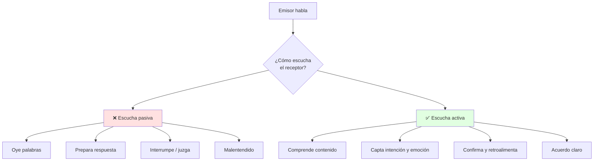
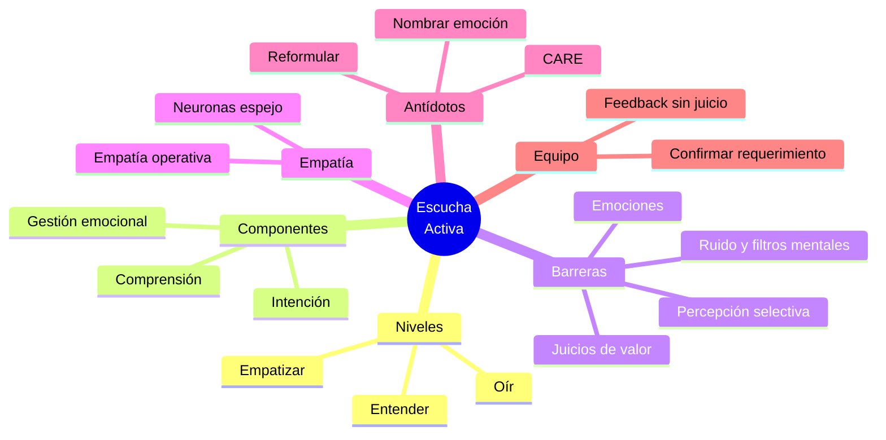

# 👂 Escucha Activa, Empatía y Barreras

## 🎯 Introducción

> [!info] 💡 ¿Por Qué Escuchar Activamente?
>
> La **comunicación interpersonal efectiva** no es hablar más, es **escuchar mejor**. En ingeniería, un malentendido en un requerimiento cuesta horas de código.
>
> **Analogía del mundo real:** Piensa en un debug de código:
>
> - **Sin escucha activa** → Lees el error por encima y cambias código al azar
> - **Con escucha activa** → Lees el stack trace completo, reproduces, preguntas, confirmas
> - **Empatía** → Entiendes qué quiso decir el cliente, no solo lo que dijo
> - **Barreras** → Son los bugs de la comunicación: percepción selectiva, juicios, emociones
>
> **¿Por qué es crítico en lo académico y profesional?**
>
> | Razón | Sin Escucha Activa | Con Escucha Activa |
> |---|---|---|
> | **Comprensión** | Entiendes 25% y asumes el resto | Retienes intención + contenido + emoción |
> | **Relaciones** | Conflictos por malentendidos | Confianza y colaboración |
> | **Trabajo en equipo** | Decisiones apresuradas | Decisiones con información completa |
> | **Liderazgo** | Equipo se siente ignorado | Equipo se siente validado |



---

## 🧠 Del Oír al Escuchar: Niveles e Intención Comunicativa

> [!note] 🎨 Los 3 Niveles
>
> **¿Qué es la intención comunicativa?**
>
> Es el propósito detrás del mensaje: informar, pedir, persuadir, expresar emoción. Escuchar activamente es detectar esa intención, no solo las palabras.
>
> ```mermaid
> graph LR
>     U[Mensaje] --> E[Palabras]
>     E --> I[Intención]
>     I --> EA[Escucha activa]
>     EA --> R[Respuesta ajustada]
>     N1[Nivel 1<br/>Oír] -.Superficial.-> E
>     N2[Nivel 2<br/>Entender] -.Contenido.-> I
>     N3[Nivel 3<br/>Empatizar] -.Emoción + contexto.-> EA
>     style EA fill:#e1f5ff
>     style N1 fill:#ffe1e1
>     style N3 fill:#e1ffe1
> ```
>
> **Comparación visual:**
>
> | Aspecto | Nivel 1: Oír | Nivel 2: Entender | Nivel 3: Empatizar |
> |---|---|---|---|
> | **Foco** | En mí (qué respondo) | En el mensaje | En la persona |
> | **Preguntas** | ❌ No pregunto | ✅ Aclaro datos | ✅ Exploro emociones |
> | **Lenguaje corporal** | Miro el celular | Contacto visual | Asiento, reflejo |
> | **Resultado** | Asumo | Comprendo | Conecto |

> [!note] 📋 Diferencia Clave: Oír vs. Escuchar
>
> Esta distinción es la base de los 3 niveles anteriores:
>
> | Aspecto | **Oír** | **Escuchar** |
> |---|---|---|
> | **Naturaleza** | Involuntario, no requiere esfuerzo | Acto intencional, consciente |
> | **Esfuerzo** | Ninguno | Requiere atención y voluntad |
> | **Proceso** | Automático | Consciente y voluntario |
> | **Resultado** | Solo percibes sonido | Comprendes, retienes, respondes |

---

## 🧩 Los 3 Componentes de la Escucha Activa

> [!note] 🎨 Estructura Operativa
>
> El material de clase define **tres componentes inseparables**:
>
> ```mermaid
> graph LR
>     A[Escucha Activa] --> B[1. Comprensión<br/>y retención]
>     A --> C[2. Identificación<br/>intención comunicativa]
>     A --> D[3. Identificación y<br/>gestión de emociones]
>     style D fill:#e1ffe1
> ```
>
> | Componente | Qué Hace | Clave |
> |---|---|---|
> | **1. Comprensión y retención** | Capta y guarda el contenido | Parafrasea para confirmar |
> | **2. Intención comunicativa** | Detecta qué quiere el otro (informar, pedir, persuadir, desahogar) | Pregunta "¿qué necesitas?" |
> | **3. Gestión emocional** | Nombra y valida la emoción del otro (y la propia) | "Veo que te frustra..." |
>
> **Retener sin memorizar (Parte 1):** jerarquiza ideas por relevancia y parafrasea lo recibido con tus palabras — la memoria colapsa si intentas guardarlo todo literal. Apóyate en esquemas y anotaciones.
>
> **Métodos de toma de notas (Parte 1):** Cornell (preguntas + puntos principales + resumen), Outline (jerarquía numerada), esquema conceptual / mapa (relaciones visuales).
>
> **Recapitulando:** la escucha activa es una práctica **consciente y voluntaria** — no es innata, se trabaja. Permite retener contenidos, identificar intenciones e instrucciones, consensuar y solucionar problemas.
>
> **Objetivo de la unidad (PAO 2-2026):** Reconocer la gestión emocional como herramienta para el crecimiento profesional.

---

## 🔍 Técnica CARE para Escucha Activa

> [!example] 🧪 Protocolo en 4 Pasos
>
> **Método para practicar en clases y equipos:**
>
> C - Concentrarse: elimina distractores, contacto visual, postura abierta
> A - Asentir y Acompañar: gestos, "ajá", "entiendo", no interrumpir
> R - Reformular: "Si entiendo bien, necesitas X porque Y, ¿correcto?"
> E - Emocionar: nombra la emoción "Noto que esto te frustra/preocupa"
>
> **Salida esperada en un equipo:**
>
> [Sin CARE] "Ya, haz el informe así nomás"
> [Con CARE] "¿Me confirmas si el informe es técnico para el profe o ejecutivo para el cliente?"

---

## 📋 Ventajas de la Práctica de Escucha Activa

> [!note] 📋 Beneficios Comprobados
>
> El material de clase detalla **seis ventajas concretas** de practicar la escucha activa:
>
> | Ventaja | Descripción |
> |---|---|
> | **Recopilación de información** | Acceso más completo y preciso a los datos |
> | **Acceso a puntos de vista** | Entiendes perspectivas distintas a la tuya |
> | **Cumplimiento exitoso de instrucciones** | Menos errores por malentendidos |
> | **Generación de consensos** | Facilita acuerdos en equipo |
> | **Solución de problemas** | Detectas la raíz real del conflicto |
> | **Generación de planes** | Bases sólidas para planificar |

---

## 🚧 Barreras para la Escucha Activa

> [!danger] 🚫 Las 3 Barreras del Syllabus (marco base)
>
> ```mermaid
> graph TD
>     A[Mensaje claro] --> B{¿Qué barrera<br/>aparece?}
>     B --> C[👁️ Percepción selectiva]
>     B --> D[⚖️ Juicios de valor]
>     B --> E[😡 Emociones]
>     C --> C1[Solo oigo lo que me conviene]
>     D --> D1[Etiqueto antes de entender]
>     E --> E1[Ansiedad/enojo distorsiona]
>     style C fill:#fff4e1
>     style D fill:#ffe1e1
>     style E fill:#f0e1ff
> ```
>
> **Síntomas y antídotos:**
>
> | Barrera | Ejemplo | Antídoto CARE |
> |---|---|---|
> | 👁️ **Percepción selectiva** | Solo recuerdas la crítica, no el reconocimiento | Reformular completo, tomar notas |
> | ⚖️ **Juicios de valor** | "Eso es imposible" antes de escuchar datos | Suspender juicio 2 min, preguntar "¿qué datos tienes?" |
> | 😡 **Emociones** | Con estrés, todo suena a ataque | Respirar, nombrar emoción, pedir pausa si hace falta |
> | 📱 **Distractores** | Revisar celular en exposición | Modo avión, contacto visual |
> | 🗣️ **Lenguaje corporal cerrado** | Brazos cruzados, sin contacto visual | Postura abierta, asentir |

> [!warning] ⚠️ Clasificación Ampliada (material de clase)
>
> Más allá de las 3 barreras del syllabus, el material de clase distingue estas categorías adicionales:
>
> **Ruido** (afecta la señal antes de que llegue a procesarse):
>
> | Tipo | Descripción | Ejemplo |
> |---|---|---|
> | **Físico** | Ruido ambiental externo | Obras, tráfico, aire acondicionado |
> | **Psicológico** | Estados internos que distraen | Ansiedad, preocupaciones, sesgos |
> | **Fisiológico** | Condiciones corporales | Fatiga, hambre, dolor, enfermedad |
> | **Semántico** | Ambigüedad en el lenguaje | Jerga técnica, palabras polisémicas |
>
> **Atención dividida:** la impaciencia y la multitarea ("hacer varias tareas a la vez") repercuten negativamente en la capacidad de escucha activa.
>
> **Filtros mentales:** no reconocer los propios sesgos personales y prejuicios profesionales enturbia la capacidad de escuchar genuinamente a los interlocutores (relacionado con "juicios de valor", pero a nivel de sesgo inconsciente más que de juicio explícito).
>
> **Distracciones por apariencia:**
>
> | Tipo | Ejemplo |
> |---|---|
> | **Apariencia** | Ropa, aspecto físico |
> | **Tics** | Movimientos repetitivos |
> | **Muletillas** | "eh", "este", "o sea" |
> | **Aseo** | Higiene personal |

---

## ❤️ Empatía: Base Biológica y Aplicación Práctica

> [!note] 🧠 Base Neurobiológica — Neuronas Espejo
>
> El material de clase menciona que la empatía tiene base biológica en el **sistema de neuronas espejo**:
>
> - Las **neuronas espejo** se activan tanto cuando realizamos una acción como cuando observamos a otro realizarla.
> - Permiten "simular" internamente la experiencia del otro → base biológica de la empatía.
> - Explican por qué "sentimos" la emoción del otro al ver su expresión facial o escuchar su tono.
> - Base neurofisiológica del **contagio emocional** y la **resonancia empática**.
>
> ```mermaid
> graph LR
>     A[Observo acción/emoción] --> B[Neuronas espejo<br/>se activan]
>     B --> C[Simulación interna<br/>de la experiencia]
>     C --> D[Resonancia empática<br/>entiendo/siento lo que sientes]
>     style D fill:#e1ffe1
> ```
>
> **Implicación práctica:** la escucha activa no es solo técnica — activa el sistema de neuronas espejo, mejorando la empatía natural con práctica deliberada.

> [!success] 🏆 Empatía Operativa: la Herramienta Estándar
>
> **Empatía no es estar de acuerdo, es entender el marco del otro.**
>
> ```mermaid
> graph TB
>     EDT[Yo escucho]
>     WT[Otro habla]
>     EDT -->|1. Pausa| SW[No juzgo aún]
>     SW -->|2. Pregunto| WT
>     WT -->|3. Explica| EDT
>     EDT -->|4. Reflejo| UI[Valido emoción]
>     WT -->|5. Confirma| WT
>     style EDT fill:#e1f5ff
>     style WT fill:#fff4e1
>     style SW fill:#e1ffe1
> ```
>
> **Frases plantilla:**
>
> | Situación | En vez de | Mejor |
> |---|---|---|
> | Compañero frustrado | "No es para tanto" | "Veo que te frustra el taller, ¿qué parte te traba?" |
> | Cliente confuso | "Ya te expliqué" | "Te lo explico de otra forma con un ejemplo, ¿te sirve?" |
> | Debate acalorado | "Estás mal" | "Entiendo tu punto por X, mi dato es Y, ¿cómo lo unimos?" |

---

## 🧩 Gestión de Emociones en la Escucha Activa

> [!note] 📋 El Modelo de 4 Pasos
>
> El material de clase resume la gestión emocional en la escucha activa en cuatro acciones:
>
> | Paso | Acción | Qué Logra |
> |---|---|---|
> | **1** | **Considera** las necesidades emocionales del interlocutor | Valida su experiencia |
> | **2** | **Comunica** al interlocutor que le estás escuchando | Genera seguridad psicológica |
> | **3** | **Reafirma** con gestos, miradas, tonos, interjecciones | Demuestra presencia activa |
> | **4** | **Incide** en entornos y en el individuo | Crea entorno seguro para la comunicación |
>
> **Resultado:** el interlocutor se siente escuchado, validado en sus expresiones e individualidad.

> [!note] 🎭 Guía Práctica: Antes / Durante / Después
>
> | Fase | Qué Hacer | Qué Evitar |
> |---|---|---|
> | **Antes** | Empatice — prepárese mentalmente | Juzgar por anticipado |
> | **Durante** | Identifique emociones, escuche para comprender, aclare con preguntas | Juzgue, interrumpa, asuma |
> | **Durante** | Aclare su papel como facilitador, no juez | Asuma el rol de experto/juez |
> | **Durante** | Observe indicios no verbales (gestos, tono, postura) | Ignore lo no verbal |
> | **Después** | No juzgue verbales ni no verbales | Etiquete al interlocutor |
> | **Después** | Reafirme lo comprendido, valide | Desestime lo expresado |

> [!tip] 🎭 Checklist Rápido: Qué Hacer / Qué Evitar
>
> | Qué Hacer | Qué Evitar |
> |---|---|
> | **Empatice** — póngase en el lugar del otro | Juzgue antes de entender |
> | **Identifique** — nombre la emoción que percibe | Ignore las señales no verbales |
> | **Escuche** — para comprender, no para responder | Interrumpa o termine frases ajenas |
> | **Aclare** — pida ejemplos, reformule | Asuma que entendió sin verificar |
> | **No juzgue** — suspenda la evaluación | Etiquete al interlocutor |
>
> **Regla de oro:** la gestión emocional en la escucha activa permite identificar necesidades, comunicar que se está escuchando, reafirmar con gestos/tonos, e incidir en entornos y contextos.

---

## 📺 Ejemplos Prácticos: Casos de Estudio

> [!example] 📺 Caso 1: Everybody Loves Raymond
>
> El material de clase incluye un extracto de la serie *Everybody Loves Raymond* que ilustra la diferencia entre oír y escuchar activamente. El extracto muestra cómo la falta de escucha activa genera malentendidos familiares que se resuelven cuando los personajes aplican los componentes de la escucha activa.

> [!example] 📺 Caso 2: The Big Bang Theory
>
> El material de clase incluye un extracto de la serie *The Big Bang Theory* para observar y determinar qué acciones permiten la regulación de las emociones en una conversación. El extracto muestra cómo los personajes aplican (o fallan en) la identificación y gestión emocional durante una conversación técnica acalorada.
>
> **Actividad sugerida:** observa el video, identifica qué acciones permiten la regulación emocional y qué barreras aparecen (filtros mentales, distracciones, ruido semántico).

> [!example] 📺 Caso 3: Los Simpson
>
> El material de clase incluye un extracto de *Los Simpson* para identificar emociones en imágenes y gestos: ¿qué transmiten los personajes y cómo inciden sus expresiones en quien escucha? Conecta directo con neuronas espejo y comunicación multimodal.

---

## 🎨 Patrones Comunes en Equipos ESPOL

> [!example] 💾 Patrón: Confirmación de Requerimiento (Evitar Retrabajo)
>
> 1. Escucha la petición completa sin interrumpir
> 2. Reformula: "Entonces necesitas [producto] para [audiencia] el [fecha], ¿correcto?"
> 3. Pide el criterio de éxito: "¿Cómo sabremos que quedó bien?"
> 4. Deja constancia escrita en el chat del curso / Aula Virtual

> [!example] 💿 Patrón: Feedback sin Juicio (Corregir sin Romper Relación)
>
> 1. Dato observable: "En la diapo 3 hay 3 faltas de tilde"
> 2. Impacto: "Eso nos baja puntos en redacción"
> 3. Pregunta: "¿Quieres que lo revisemos juntos 10 min?"
> 4. Acuerdo: quién, qué, cuándo

---

## ⚠️ Problemas Comunes y Soluciones

> [!danger] ❌ Error Frecuente: Preparar Respuesta Mientras Escuchas (viola **escuchar antes de responder**)
>
> **Síntomas:**
>
> - Interrumpes a mitad de frase
> - Respondes algo que ya habían aclarado
> - El otro siente que no lo escuchaste
>
> **Ejemplo completo:**
>
> - ❌ **EL ERROR ESTÁ AQUÍ:** "Sí, sí, eso ya lo sé, lo que hay que hacer es..." (respondes al minuto 1 de una explicación de 3).
> - ✅ Así sí: anotas "idea: cambiar formato" en 3 palabras, esperas 2 segundos tras que termine y reformulas antes de opinar.
>
> **Solución:**
>
> - Anota tu idea en 3 palabras y vuelve a escuchar
> - Espera 2 segundos tras que termine para responder
> - Reformula antes de opinar

> [!danger] ❌ Señales de que NO Practicas la Escucha (viola **atención plena, Parte 1**)
>
> **Ejemplo completo:**
>
> - ❌ **EL ERROR ESTÁ AQUÍ:** "Ajá... sí... oye, ¿viste el partido ayer?" (cambias de tema + miras el celular mientras te explican el taller).
> - ✅ Así sí: celular guardado, contacto visual, "¿me repites la fecha de entrega para anotarla bien?".
>
> - Interrumpes al interlocutor o le cambias de tema súbitamente
> - Refutas sin haber finalizado su intervención
> - Dependencia de dispositivos aunque el entorno sea adecuado
> - Pides repetir información por no haber atendido
>
> ---

## 🎯 Mejores Prácticas

> [!tip] 🏆 Checklist Profesional
>
> **1. SIEMPRE reformular en temas académicos**
>
> - ❌ **EVITAR**: "Ya entendí" (sin verificar)
> - ✅ **PREFERIR**: "Te repito para confirmar: X, Y, Z. ¿Voy bien?"
>
> **2. Gestiona emociones nombrándolas**
>
> "Noto tensión, ¿hacemos pausa 2 min y retomamos?"
>
> **3. Cuida tu no verbal (se verá en Unidad 4)**
>
> Contacto visual + postura abierta + gestos moderados
>
> **4. Evaluación 1 de esta semana (S1): La escucha activa (TAF asincrónica)**
>
> - Revisa el material en Aula Virtual antes de clase
> - Practica CARE en la actividad de integración
> - Participación 1: Mentor activo 3 semanas

---

## 📊 Resumen Visual



> [!success] 🔍 Comparación Final
>
> | Aspecto | Escucha Pasiva | Escucha Activa |
> |---|---|---|
> | **Atención** | ❌ Dividida | ✅ Plena |
> | **Comprensión** | Palabras | Intención + emoción |
> | **Respuesta** | Reactiva | Confirmada |
> | **Uso Recomendado** | Ninguno académico | ✅ **Estándar profesional** |

---

## 🚀 Próximos Pasos

> [!quote] 🌟 Continuando
>
> **Has aprendido:**
>
> ✅ Intención comunicativa y 3 niveles de escucha
> ✅ Barreras: percepción selectiva, juicios, emociones, ruido, filtros mentales
> ✅ Empatía: base biológica (neuronas espejo) y empatía operativa
> ✅ Gestión emocional: modelo de 4 pasos y guía Antes/Durante/Después
> ✅ Patrones CARE para equipos
>
> **Próximo tema:**
>
> | Tema | Qué verás | Por qué importa |
> |---|---|---|
> | **Comunicación grupal y estratégica** | Dinámicas, manejo de grupos, identidad/imagen | Base del Taller 1 caso de estudio (S2) |

---

## 🔗 Seguir estudiando

> [!info] 📚 Seguir estudiando
>
> - Mapa de contenido: [[Comunicación]]
> - Índice Unidad 1: [[00 - Índice Unidad 1]]
> - Siguiente: [[02 - Comunicación grupal y estratégica]]
> - Syllabus: [[Bienvenida y Syllabus Comunicación]]
> - Base MOOC: [[Preuniversitario/MOOC de Comunicación/Comunicación Efectiva|MOOC de Comunicación]]
> - Base específica: [[Preuniversitario/MOOC de Comunicación/Unidad 1 - El proceso de la comunicación/01 - El proceso y las funciones de la comunicación|MOOC U1 — Proceso y funciones]]

## 📚 Referencias

> [!quote] 📖 Fuentes
>
> - Sílabo IDIG2012, Unidad 1: Comunicación efectiva — interpersonal, barreras, grupal (4h).
> - Planificación PAO 2-2026 S1: escucha activa, intención comunicativa, gestión de emociones.
> - Material de clase PAO 2-2026: Escucha Activa (PDFs con OCR).
> 1. M. Sánchez Fernández, *Comunicación efectiva y trabajo en equipo*, CEP, 2014.
> 2. A. Codina Jiménez, *Saber escuchar. Un intangible valioso*, 2004 — https://www.redalyc.org/pdf/549/54900303.pdf
> - Burra, N. y Kerzel, D. (2021). *Meeting another's gaze shortens subjective time by capturing attention*. Cognition, 21. https://doi.org/10.1016/j.cognition.2021.104734
> - Hernández, A. y Lesmes, A. (2017). *La escucha activa como elemento necesario para el diálogo*. Convicciones, 9(1), 83-87. https://www.fesc.edu.co/Revistas/0JS/Index.pnp/convicciones/article/view/272
> - Rogers, C. y Farson, R. (1987). *Active listening*. https://wholebeinginstitute.com/wp-content/uploads/Rogers-Farson_Active-Listening.pdf
> - Newman, R. G., Danziger, M. A. y Cohen, M. (eds.). *Communication in Business Today*. Washington C.C. https://archive.org/details/communicatinginb0000newm/page/n665/mode/2up
> - Wang, S. y Lu, J. (2022). *"I'm listening, did it make any difference to your negative emotions?" Evidence from hyperscanning*. Neuroscience Letters, 788(25). https://doi.org/10.1016/j.neulet.2022.136867
> - Forner, P. (s.f.). *Escucha activa: técnicas prácticas para convertirte en un experto*. Habilidad Social. https://habilidadsocial.com/escucha-activa/
> - Martins, J. (2021). *Escuchar para comprender: cómo practicar la escucha activa (con ejemplos)*. Asana. https://asana.com/es/resources/active-listening
> - Serrano, O. (2022). *La escucha activa: características y beneficios*. Comma.
> - Yates, J. (s.f.). *Active Listening and Reflective Responses*. MIT Sloan Communication Program.

---

**Tags:** #IDIG2012 #unidad1 #escucha-activa #empatia #comunicacion #neuronas-espejo
