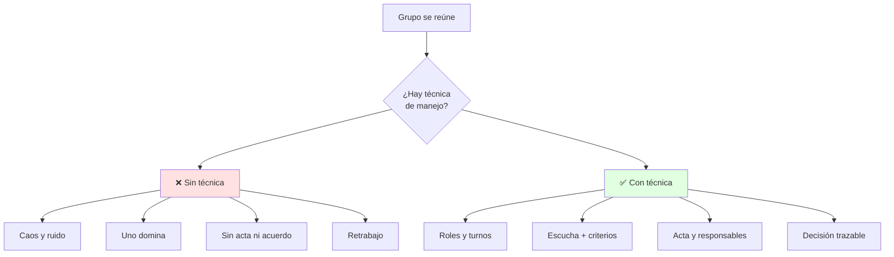
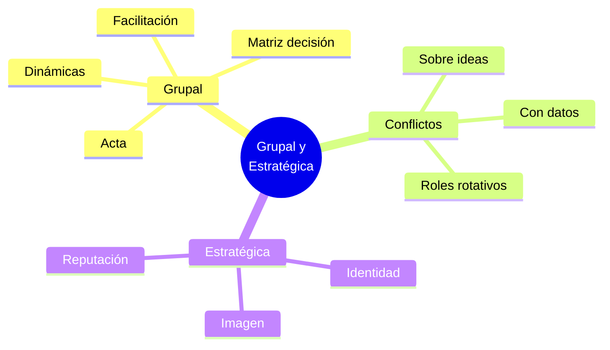

# 👥 Comunicación Grupal y Estratégica

## 🎯 Introducción

> [!info] 💡 ¿Por Qué el Grupo Decide Mejor (o Peor)?
>
> La **comunicación grupal** define si un equipo ESPOL entrega un informe TED sólido o un collage de partes inconexas. Y la **comunicación estratégica** define cómo te perciben: identidad, imagen y reputación.
>
> **Analogía del mundo real:** Piensa en un equipo de desarrollo:
>
> - **Sin técnica grupal** → Todos hablan a la vez, nadie decide, el repo tiene 5 versiones
> - **Con técnica grupal** → Roles claros, turnos, acta, decisión por criterios
> - **Sin estrategia** → Subes cualquier foto y texto a LinkedIn
> - **Con estrategia** → Tu identidad (quién eres) + imagen (qué muestras) = reputación (qué recuerdan)
>
> | Razón | Sin Técnica | Con Técnica |
> |---|---|---|
> | **Decisiones** | Por grito o por voto rápido | Por criterios y datos |
> | **Conflictos** | Se evitan y explotan | Se gestionan y resuelven |
> | **Cohesión** | Subgrupos enfrentados | Compromiso compartido |
> | **Imagen profesional** | Improvisada | Planificada y coherente |



---

## 🧵 Dinámicas de Grupo y Toma de Decisiones

### 🎭 Cómo Influyen en el Resultado

> [!note] 🎨 El Corazón del Equipo
>
> **¿Qué es una dinámica de grupo?**
>
> Es el patrón invisible de interacción: quién habla, quién calla, cómo se decide. Si no la gestionas, ella te gestiona a ti.
>
> ```mermaid
> graph LR
>     U[Problema] --> E[Opciones]
>     E --> G[Deliberación<br/>grupal]
>     G --> R[Decisión]
>     G --> A[Conflicto gestionado]
>     W1[Facilitador] -.Ordena turnos.-> G
>     W2[Secretario] -.Registra acuerdos.-> G
>     W3[Tiempo] -.Limita debate.-> G
>     style G fill:#e1f5ff
>     style W1 fill:#fff4e1
>     style W2 fill:#fff4e1
>     style W3 fill:#fff4e1
> ```
>
> **Regla de Oro del grupo universitario:**
>
> - ✅ REGLA 1: Todo acuerdo queda escrito: qué, quién, cuándo
> - ✅ REGLA 2: Ninguna decisión larga sin criterios previos
>
> **Comparación visual:**
>
> | Aspecto | Sin Facilitación | Con Facilitación |
> |---|---|---|
> | **Participación** | 20% habla 80% | Turnos equilibrados |
> | **Decisión** | Por cansancio | Por matriz de criterios |
> | **Conflicto** | Personal | Sobre ideas con datos |
> | **Seguimiento** | Se olvida | Acta en Aula Virtual |

### 🔍 Técnicas de Manejo para Colaboración

> [!example] 🧪 Caja de Herramientas S2
>
> **1. Phillips 6-6 (para Taller 1 caso de estudio):**
>
> 6 personas discuten 6 minutos, luego un vocero resume 1 min.
> Ideal cuando el curso es grande y hay poco tiempo.
>
> **2. Mesa redonda con turnos:**
>
> Cada uno 2 min sin interrupciones → ronda de preguntas → síntesis.
> Úsala para definir tesis del texto expositivo (Unidad 3).
>
> **3. Matriz de decisión rápida:**
>
> Opción | Impacto 1-5 | Esfuerzo 1-5 | Riesgo 1-5 | Total
> A      |      5      |       3      |      2      |  10
> B      |      4      |       2      |      1      |   7
> Gana A con sustento, no con gritos.

---

## 🛡️ Comunicación Estratégica: Identidad, Imagen, Reputación

### 🎯 Definiciones Operativas

> [!success] 🏆 El Triángulo Profesional
>
> **No es marketing vacío, es coherencia entre lo que eres, muestras y recuerdan.**
>
> ```mermaid
> graph TB
>     ID[Identidad<br/>Quién soy]
>     IM[Imagen<br/>Qué muestro]
>     RE[Reputación<br/>Qué recuerdan]
>     ID -->|comunico| IM
>     IM -->|repito coherente| RE
>     RE -->|valida| ID
>     style ID fill:#e1f5ff
>     style IM fill:#fff4e1
>     style RE fill:#e1ffe1
> ```
>
> | Concepto | Pregunta | Ejemplo ingeniero |
> |---|---|---|
> | **Identidad** | ¿Quién soy y qué valores tengo? | "Soy dev que documenta y cumple fechas" |
> | **Imagen** | ¿Qué muestro en clase/redes? | Diapos limpias, correo formal, GitHub ordenado |
> | **Reputación** | ¿Qué dicen cuando no estoy? | "Es el que entrega a tiempo y explica claro" |
>
> **Fórmula:**
>
> Identidad clara + Imagen coherente x Tiempo = Reputación sólida

---

## 🎨 Patrones para Taller 1 (S2)

### 📥 Patrón: Caso de Estudio en Equipo

> [!example] 💾 Protocolo S2 — 5-oct
>
> 1. Lectura individual 10 min (sin hablar, subraya hechos vs opiniones)
> 2. Phillips 6-6: cada uno 1 min de diagnóstico
> 3. Facilitador agrupa causas en pizarra (máx 3)
> 4. Matriz rápida para elegir solución
> 5. Vocero expone 3 min: problema → evidencia → propuesta → responsable
> 6. Suben acta + foto a Aula Virtual el mismo día

### 📤 Patrón: Gestión de Conflicto

> [!example] 💿 Desacuerdo Técnico sin Pelea
>
> 1. Dato: "El código falla en X con error Y"
> 2. Impacto: "Nos retrasa 1 día la entrega"
> 3. Opciones A/B con criterios (tiempo, calidad, aprendizaje)
> 4. Voto razonado + prueba piloto 30 min
> 5. Si persiste: pide criterio al docente con datos, no con quejas

---

## ⚠️ Problemas Comunes y Soluciones

> [!danger] ❌ Error: Un Líder Domina y Otros Se Apagan (viola **participación equilibrada**)
>
> **Síntomas:**
>
> - Solo 1-2 hablan, resto en celular
> - Decisiones sin acta se olvidan
> - Taller 1 queda a medio hacer
>
> **Ejemplo completo:**
>
> - ❌ **EL ERROR ESTÁ AQUÍ:** "Bueno equipo, yo ya decidí: hacemos la opción A. ¿Alguien en contra?... Nadie. Listo, sigamos." (monopolio + silencio confundido con acuerdo).
> - ✅ Así sí: "Ana, tu diagnóstico en 1 min; luego Luis. Votamos con la matriz y el secretario anota."
>
> **Solución con roles rotativos:**
>
> - Facilitador: da turnos y corta monopolios ("gracias, vamos con Ana")
> - Secretario: escribe acuerdos en vivo
> - Tiempo: avisa "quedan 5 min"
> - Rota roles cada taller para entrenar liderazgo (criterio ESPOL)

---

## 🎯 Mejores Prácticas

> [!tip] 🏆 Checklist S2
>
> **1. Prepara tu identidad profesional desde ya**
>
> - ❌ EVITAR
> Correo "dark_gamer123@..." para entregar informe
>
> - ✅ PREFERIR
> nombre.apellido@espol.edu.ec + asunto claro + firma
>
> **2. Lleva acta siempre**
>
> Fecha | Asistentes | Acuerdos | Responsable | Fecha entrega
>
> **3. Conecta con Unidad 4 (charla TED)**
>
> Lo que practiques en dinámicas (turnos, escucha, síntesis)
> es lo que usarás en videocast, debate, foro y TED final.

---

## 📊 Resumen Visual



> [!success] 🔍 Comparación Final
>
> | Aspecto | Grupo sin Técnica | Grupo Profesional |
> |---|---|---|
> | **Habla** | ❌ Monopolio | ✅ Turnos |
> | **Decide** | Por impulso | Por criterios |
> | **Registra** | Nada | Acta trazable |
> | **Imagen** | Improvisada | Estratégica |
> | **Uso Recomendado** | Ninguno académico | ✅ **Estándar ESPOL** |

---

## 🚀 Próximos Pasos

> [!quote] 🌟 Continuando
>
> **Has aprendido:**
>
> ✅ Dinámicas y su efecto en decisiones
> ✅ Técnicas: Phillips, mesa redonda, matriz
> ✅ Identidad vs imagen vs reputación
> ✅ Patrones para Taller 1 S2
>
> **Próximo tema Unidad 2:**
>
> | Tema | Qué verás | Por qué importa |
> |---|---|---|
> | **Pensamiento complejo y crítico** | Complejo vs lineal, realidades emergentes | Base Evaluación 2 + perfil prosumidor |

---

## 🔗 Seguir estudiando

> [!info] 📚 Seguir estudiando
>
> - Mapa de contenido: [[Comunicación]]
> - Índice Unidad 1: [[00 - Índice Unidad 1]]
> - Anterior: [[01 - Escucha activa, empatía y barreras]]
> - Syllabus: [[Bienvenida y Syllabus Comunicación]]
> - Base MOOC: [[Preuniversitario/MOOC de Comunicación/Comunicación Efectiva|MOOC de Comunicación]]
> - Base específica: [[Preuniversitario/MOOC de Comunicación/Unidad 1 - El proceso de la comunicación/01 - El proceso y las funciones de la comunicación|MOOC U1 — Proceso y funciones]]

## 📚 Referencias

> [!quote] 📖 Fuentes
>
> - Sílabo IDIG2012, Unidad 1: comunicación grupal, dinámicas, toma de decisiones (4h).
> - Planificación PAO 2-2026 S2: dinámicas de grupo + comunicación estratégica (identidad, imagen, reputación) + Taller 1 caso.
> - [1] M. Sánchez Fernández, *Comunicación efectiva y trabajo en equipo*, CEP, 2014.
> - [2] P. Capriotti, *Planificación Estratégica de la Imagen Corporativa*, 2013.

---

**Tags:** #IDIG2012 #unidad1 #grupal #estrategia #comunicacion
