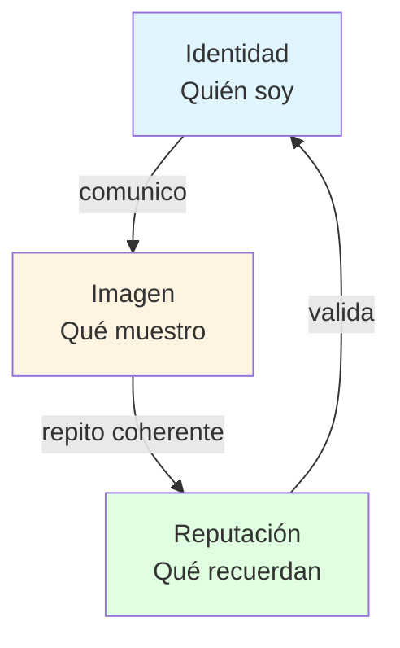
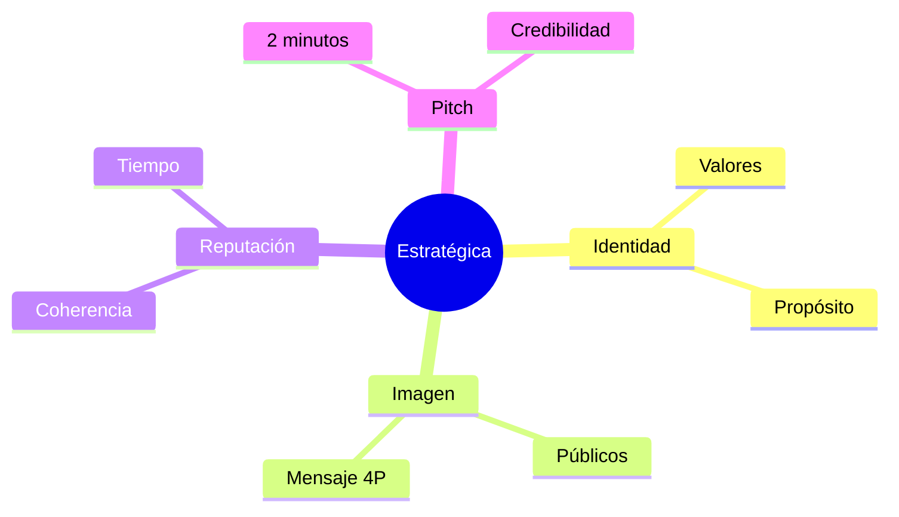

# 🎯 Comunicación Estratégica, IIR y Pitch Personal

## 🎯 Introducción

> [!info] 💡 ¿Por Qué Te Perciben Como Te Perciben?
>
> La **comunicación estratégica** no es marketing vacío: es la coherencia entre lo que eres, lo que muestras y lo que recuerdan. En ESPOL decide tu Taller 1, tu pitch y, fuera de clases, tu primer empleo.
>
> **Analogía del mundo real:** piensa en tu LinkedIn:
>
> - **Sin estrategia** → Foto recortada de una fiesta, titular vacío, correo informal
> - **Con estrategia** → Tu identidad (dev que documenta y cumple) + imagen (portafolio ordenado) = reputación ("es el que entrega a tiempo")
>
> | Razón | Sin Estrategia | Con Estrategia |
> |---|---|---|
> | **Imagen** | Improvisada | Planificada y coherente |
> | **Mensajes** | El mismo para todos | Adaptado a cada público |
> | **Reputación** | Azarosa | Construida en el tiempo |
> | **Oportunidades** | Se pierden | Te buscan |



---

## 🧵 Definiciones Operativas

> [!success] 🏆 El Triángulo Profesional
>
> | Concepto | Pregunta | Ejemplo ingeniero |
> |---|---|---|
> | **Identidad** | ¿Quién soy y qué valores tengo? | "Soy dev que documenta y cumple fechas" |
> | **Imagen** | ¿Qué muestro en clase/redes? | Diapos limpias, correo formal, GitHub ordenado |
> | **Reputación** | ¿Qué dicen cuando no estoy? | "Es el que entrega a tiempo y explica claro" |
>
> **Fórmula:**
>
> Identidad clara + Imagen coherente x Tiempo = Reputación sólida

### 📜 Fundamentación teórica

> [!quote] 📖 Área de Comunicación ESPOL — base de cátedra
>
> - **Capriotti (2009):** gestión de la comunicación organizacional para construir imagen coherente alineada a la identidad y fortalecer la reputación. Aplica igual a tu imagen personal y profesional.
> - **Massoni (2013):** no es emitir mensajes (acción unilateral), es construir diálogos con los públicos: interpretar el entorno, adaptarse y co-crear significados.
> - **Aljure (2015):** función gerencial que vincula objetivos organizacionales con intereses de los públicos mediante planificación. El profesional estratégico planifica, evalúa y adapta — no improvisa.
> - **Mapa de públicos (Herrera y Requeijo 2016):** representación gráfica y analítica de actores que afectan o son afectados; se prioriza por poder, interés, cercanía, actitud o frecuencia. Ejemplo IES: estudiantes, docentes, administrativos, autoridades, medios, padres, aliados — cada uno exige un abordaje distinto.
> - **Planificar el mensaje = 4 preguntas (Cornelissen 2020):** ¿qué comunico? ¿a quién? ¿con qué propósito? ¿por qué canal? Coherente con tus valores y adaptado a intereses del receptor.
> - **Ejemplo ingeniero:** el mismo proyecto se cuenta distinto al gerente (números, riesgo), al cliente (beneficio, plazo) y al contratista (especificación, tolerancia). Adaptar no es mentir: es inteligencia emocional aplicada.

---

## 🛠️ Método: Planificar y Presentar

> [!example] 🧪 Protocolo S3 — del mensaje al pitch
>
> **1. Mapea tus públicos (5 min):**
>
> Lista quién te escucha y ordénalos por poder + interés. Para el pitch de clase: docente (poder alto) y compañeros (interés medio).
>
> **2. Responde las 4 preguntas:**
>
> ¿Qué comunico? (soy un profesional creíble) → ¿A quién? (audiencia S3) → ¿Con qué propósito? (persuadir) → ¿Por qué canal? (pitch presencial de 2 min).
>
> **Canal por audiencia (HubSpot):** el canal se elige por el público, no por comodidad — presencial para persuadir, escrito para informar, red para posicionar. Escucha antes de hablar y personaliza siempre.
>
> **3. Estructura tu pitch personal (1:45–2:00):**
>
> ```mermaid
> graph LR
>     A[Quién soy<br/>20s] --> B[Qué hago<br/>y qué sé 40s]
>     B --> C[Prueba<br/>logro o dato 30s]
>     C --> D[Cierre<br/>qué aporto 20s]
>     style A fill:#e1f5ff
>     style D fill:#e1ffe1
> ```
>
> **4. Gestiona tu I+I+R cada semana:**
>
> Define tu identidad y propósito → actúa coherente (dicho = hecho) → comunica claro y profesional → invierte en mejora continua.
>
> ### 🗣️ Pitch modelo (225 palabras ≈ 1:45–2:00)
>
> > [!example] 💾 Guion listo para ensayar (entrenador: `Universidad/Herramientas/pitch_trainer.py`)
> >
> > *Soy Freddy Sánchez, estudiante de tercer semestre de Ingeniería de Software en la ESPOL. Mi identidad profesional es clara: soy el desarrollador que documenta lo que construye, cumple las fechas que promete y explica sin rodeos lo que hizo y por qué lo hizo así.*
> >
> > *Hoy manejo Python y Java, diseño de bases de datos relacionales desde el modelo entidad-relación hasta las tablas, y publico mis apuntes de cada materia en un sitio web que mantengo yo mismo con Obsidian, Git y despliegue continuo.*
> >
> > *Como prueba, mis notas de Bases de Datos incluyen más de cuarenta diagramas verificados uno por uno y casos completos resueltos como Tiny College. En Comunicación, preparé este pitch con estructura medida por bloques y ensayado con cronómetro. Además, convierto el material de cada clase, incluso fotos del pizarrón, en documentos ordenados que mis compañeros también pueden usar.*
> >
> > *Si trabajo con ustedes, aporto código trazable, actas claras después de cada reunión y comunicación directa cuando algo se atrasa, con la causa y el plan, no con excusas. Busco un equipo donde la exigencia sea mutua: yo llego preparado a cada entrega, y espero lo mismo de quienes trabajan conmigo. Esa es mi propuesta: constancia verificable. Gracias.*
>
> ### 🔁 Contraste: elevator pitch clásico (IEBS) vs pitch S3
>
> > [!quote] 📖 L. Ramírez, IEBSchool (2022) — base externa
> >
> > - **60 segundos vs 2 minutos:** el elevator clásico dura ≤60s (un viaje en ascensor) y busca solo despertar interés para un café después; el S3 dura 1:45–2:00 y debe probar credibilidad completa.
> > - **5 pasos IEBS:** preséntate (1 oración) → plantea el problema (ejemplo cercano) → ofrece la solución (lo más importante) → propuesta de valor (qué te distingue) → gancho final (dato o pregunta + contacto).
> > - **Fórmula PAR (entrevistas):** Problema → Acción → Resultado, con número (*"reduje desperdicio 65%"*). Úsala en tu bloque Prueba.
> > - **Ejemplo incorrecto típico:** jerga sin números (*"embudos sinérgicos con machine learning"*) vs correcto: qué haces + propuesta + cifra + pregunta.
> > - **Ensayo:** cronometra, grábate (velocidad, tono, cuerpo) y practica ante alguien. Que suene natural, no recitado.
> >
> > **Cómo usarlo aquí:** los 5 pasos caben en tus 4 bloques (problema+solución viven en Prueba; gancho en Cierre). Si te piden versión corta, recorta a 60s con solo Quién + Prueba + Gancho.

---

## 🎨 Caso de Clase S3: "Espol nos reprobó"

> [!example] 💡 Identidad, imagen y reputación con un profesor
>
> - **Identidad:** lo que el profesor dice ser y proyecta intencionalmente. Ej. se presenta como exigente pero justo.
> - **Imagen:** la percepción que cada estudiante construye al interactuar con él. Ej. un alumno cree que es demasiado estricto; otro, que es inspirador.
> - **Reputación:** la opinión colectiva formada con el tiempo desde muchas experiencias. Ej. "es exigente, pero sales preparado".
> - **Moraleja para ti:** no controlas la imagen que cada uno se forma, pero sí la identidad que proyectas y la constancia que construye reputación.

---

## ⚠️ Problemas Comunes y Soluciones

> [!danger] ❌ Error: Improvisar la imagen (viola **coherencia estratégica**)
>
> **Síntomas:**
>
> - Mismo mensaje genérico para gerente, cliente y docente
> - Correo "dark_gamer123@..." para entregar el informe
> - LinkedIn abandonado y GitHub desordenado
>
> **Ejemplo completo:**
>
> - ❌ **EL ERROR ESTÁ AQUÍ:** "Buenas, aquí le mando el trabajo, espero que esté bien. Saludos." (sin asunto, sin nombre, sin firma: imagen improvisada).
> - ✅ Así sí: asunto claro + nombre.apellido@espol.edu.ec + cuerpo de 3 líneas (qué envío, qué contiene, qué sigue) + firma.
>
> **Solución con las 4 preguntas:**
>
> - Antes de enviar, responde: ¿qué, a quién, con qué propósito, por qué canal?
> - Si el público cambia, el mensaje cambia (gerente: números; cliente: beneficio; contratista: especificación).

---

## 🎯 Mejores Prácticas

> [!tip] 🏆 Checklist S3
>
> **1. Prepara tu identidad profesional desde ya**
>
> - ❌ EVITAR
> Correo informal para entregas académicas
>
> - ✅ PREFERIR
> nombre.apellido@espol.edu.ec + asunto claro + firma
>
> **2. Un público, un mensaje**
>
> Nunca copies-pegues el mismo texto al docente y al grupo de WhatsApp.
>
> **3. Ensaya tu pitch con cronómetro**
>
> 1:45–2:00 min, grábate una vez y corrige muletillas antes de presentar.

---

## 📊 Resumen Visual



> [!success] 🔍 Comparación Final
>
> | Aspecto | Sin Estrategia | Con Estrategia |
> |---|---|---|
> | **Mensaje** | Genérico para todos | Adaptado por público |
> | **Imagen** | ❌ Improvisada | ✅ Planificada |
> | **Reputación** | Azar | Construcción coherente |
> | **Uso Recomendado** | Ninguno profesional | ✅ **Estándar ESPOL** |

---

## 📝 Ejercicios Propuestos

> [!info] ℹ️ Cómo trabajarlos
> Lo evaluable de S3: mapa de públicos, mensaje adaptado y pitch. Tapa la solución, resuelve, compara.

### ✏️ Ejercicio 1 — Mapea tus públicos

> [!example] 📋 Planteamiento
>
> Para tu pitch de clase, lista 3 públicos (docente, compañeros, LinkedIn) y ordénalos por poder + interés. ¿Qué cambia en el mensaje para cada uno?
>
> > [!success]- ✅ Solución guiada
> >
> > Docente (poder alto): evidencia y estructura. Compañeros (interés medio): cercanía y ejemplo. LinkedIn (poder futuro): logros medibles. Mismo "quién soy", distinto énfasis.

### ✏️ Ejercicio 2 — Un mensaje, dos públicos

> [!example] 📋 Planteamiento
>
> Toma este mensaje genérico: *"Hice un sistema de ventas"*. Reescríbelo para (a) un gerente y (b) un cliente, respondiendo las 4 preguntas (qué/a quién/propósito/canal).
>
> > [!success]- ✅ Solución guiada
> >
> > (a) Gerente: números y riesgo ("sistema que redujo 30% el tiempo de facturación, implementado en 3 semanas"). (b) Cliente: beneficio y plazo ("factura en 2 clics, listo esta semana"). Adaptar no es mentir.

### ✏️ Ejercicio 3 — Esquema tu pitch

> [!example] 📋 Planteamiento
>
> Escribe tu pitch en 4 bloques con tiempos (20s/40s/30s/20s) y ensáyalo con el entrenador (`pitch_trainer.py`). ¿En qué bloque te pasas del tiempo?
>
> > [!success]- ✅ Solución guiada
> >
> > Quién soy / qué hago / prueba con dato / cierre y aporte. El bloque que siempre se pasa es la prueba (quieres contar todo): recorta a 1 solo logro con número.

---

## 🔁 Repaso SR (flashcards)

#flashcards/comunicacion-u1

> [!note] 🧠 Repasa con el plugin Spaced Repetition
>
> - ¿Capriotti, Massoni y Aljure en 1 línea cada uno?::Imagen coherente desde la identidad / diálogos co-creados, no emisión unilateral / vincular objetivos con públicos mediante planificación.
> - ¿Identidad, imagen y reputación?::Quién soy y mis valores / cómo me perciben los otros / juicio sostenido en el tiempo sobre mi actuar.
> - ¿Mapa de públicos y sus criterios?::Actores que afectan o son afectados; se prioriza por poder, interés, cercanía, actitud o frecuencia.
> - ¿4 preguntas para planificar un mensaje?::¿Qué? ¿A quién? ¿Con qué propósito? ¿Por qué canal?
> - ¿Caso "Espol nos reprobó" (I/I/R)?::Identidad: exigente pero justo (lo que proyecta). Imagen: estricto vs inspirador (percepción individual). Reputación: "sales preparado" (opinión colectiva en el tiempo).
> - ¿4 acciones para gestionar tu I+I+R?::Definir identidad y propósito; coherencia dicho-hecho; comunicar claro y profesional; educación continua.
> - ¿Estructura del pitch personal S3?::Quién soy (20s) + qué hago (40s) + prueba (30s) + cierre/qué aporto (20s); total 1:45–2:00.
- ¿Elevator clásico vs S3?::Clásico ≤60s para despertar interés; S3 2min para probar credibilidad (5 pasos IEBS caben en los 4 bloques).
- ¿Fórmula PAR?::Problema → Acción → Resultado con número, para el bloque Prueba.

## 🚀 Próximos Pasos

> [!quote] 🌟 Continuando
>
> **Has aprendido:**
>
> ✅ Triángulo identidad-imagen-reputación
> ✅ Mapa de públicos y 4 preguntas del mensaje
> ✅ Caso S3 + pitch personal de 2 minutos
>
> **Próximo tema Unidad 2:**
>
> | Tema | Qué verás | Por qué importa |
> |---|---|---|
> | **Pensamiento complejo y crítico** | Complejo vs lineal, realidades emergentes | Base Evaluación 2 + perfil prosumidor |

---

## 🔗 Seguir estudiando

> [!info] 📚 Seguir estudiando
>
> - Mapa de contenido: [[Comunicación]]
> - Índice Unidad 1: [[00 - Índice Unidad 1]]
> - Anterior: [[02 - Comunicación grupal y toma de decisiones]]
> - Capturas clase S3: [[Clase S3 - Comunicación estratégica (capturas)|Unidad 0 — Clase S3 (capturas)]]
> - Syllabus: [[Bienvenida y Syllabus Comunicación]]
> - Base MOOC: [[Preuniversitario/MOOC de Comunicación/Comunicación Efectiva|MOOC de Comunicación]]

## 📚 Referencias

> [!quote] 📖 Fuentes
>
> - Sílabo IDIG2012, Unidad 1: comunicación estratégica (identidad, imagen, reputación) (4h).
> - Planificación PAO 2-2026 S3: comunicación estratégica + pitch personal.
> - [1] M. Sánchez Fernández, *Comunicación efectiva y trabajo en equipo*, CEP, 2014.
> - [2] P. Capriotti, *Planificación Estratégica de la Imagen Corporativa*, 2013.
> - [3] Área de Comunicación ESPOL, *Fundamentación teórica: Comunicación estratégica* (material de cátedra, PAO 2-2026): Capriotti, Massoni, Aljure, Herrera-Requeijo, Cornelissen.
> - L. Ramírez, "Elevator pitch en 5 pasos", IEBSchool, 2022 (60s, PAR, ejemplo correcto/incorrecto).
> - HubSpot, "Comunicación con el cliente: canales y estrategias", 2024 (canal por audiencia).

---

**Tags:** #IDIG2012 #unidad1 #estrategia #iir #pitch #comunicacion
