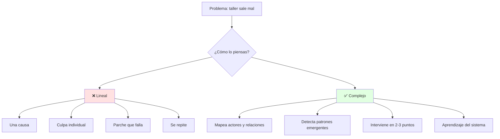
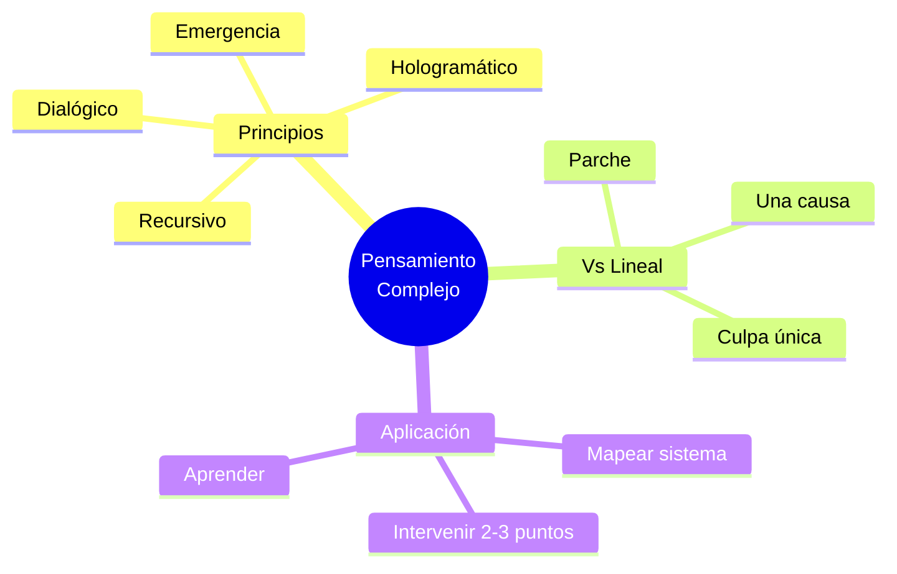

# 🧠 Pensamiento Complejo vs Pensamiento Lineal

## 🎯 Introducción

> [!info] 💡 ¿Por Qué Pensar en Red y no en Línea?
>
> El **pensamiento lineal** ve causas únicas: "el informe salió mal por la redacción". El **pensamiento complejo** ve sistemas: redacción + datos + audiencia + tiempo + herramienta IA usada sin criterio.
>
> **Analogía del mundo real:** Piensa en depurar un sistema distribuido:
>
> - **Lineal** → "Falla el login, culpo al frontend" y cambias el botón
> - **Complejo** → Revisas frontend + API + base de datos + red + carga concurrente
> - **Realidad emergente** → El fallo solo aparece cuando todo interactúa (como un malentendido grupal que no existe en 1:1)
> - **Holístico** → Entiendes el todo antes de optimizar la parte
>
> | Razón | Pensamiento Lineal | Pensamiento Complejo |
> |---|---|---|
> | **Causa** | Una sola y directa | Múltiples e interconectadas |
> | **Error típico** | Culpar a una persona | Mapear el sistema completo |
> | **Solución** | Parche rápido | Intervención en varios puntos |
> | **En comunicación** | "Habla más claro" | Ajusta mensaje + canal + audiencia + contexto |



---

## 🧵 Definición y Principios (Morin)

### 🎭 Las 3 Ideas Base

> [!note] 🎨 Complejidad en 5 Minutos
>
> **¿Qué es el pensamiento complejo?**
>
> Es pensar el todo sin mutilar las partes: orden + desorden + organización interactuando. Un equipo, un texto y una audiencia son sistemas, no sumas de piezas.
>
> ```mermaid
> graph LR
>     U[Partes] --> E[Interacciones]
>     E --> S[Sistema]
>     S --> EM[Emergencia]
>     EM --> R[Retroalimenta a partes]
>
>     style S fill:#e1f5ff
>     style EM fill:#e1ffe1
> ```
>
> **Principios operativos para tus talleres:**
>
> | Principio | Qué significa | Aplicación en Comunicación |
> |---|---|---|
> | **Dialógico** | Dos lógicas opuestas conviven | Ser claro Y empático; técnico Y divulgativo |
> | **Recursivo** | El producto modifica al productor | Tu texto cambia tu idea; el debate cambia al equipo |
> | **Hologramático** | La parte contiene al todo | Un correo mal escrito revela tu método de trabajo |
> | **Emergencia** | Surgen propiedades nuevas | La cohesión grupal no está en ningún individuo |

### 🔍 Lineal vs Holístico con Ejemplo

> [!example] 🧪 Caso Taller: Texto Expositivo Flojo
>
> **Diagnóstico lineal (flojo):**
>
> "Está mal redactado" → pide que "lo redacten mejor" → sigue flojo
>
> **Diagnóstico complejo (bueno):**
>
> 1. Fuentes: ¿usaron 1 blog o 3 papers? (Unidad 3: síntesis)
> 2. Audiencia: ¿técnica o ejecutiva? (tono mal ajustado)
> 3. Proceso: ¿hubo acta y roles? (Unidad 1: grupal)
> 4. Herramienta: ¿IA sin prompt ni verificación? (Unidad 3: IA ética)
> 5. Intervención: 1 taller de síntesis + 1 plantilla + revisión cruzada

---

## 🛠️ Del Pensamiento Complejo al Crítico (Puente)

> [!success] 🏆 Conexión Directa
>
> El complejo mapea el sistema; el crítico lo evalúa con evidencia. Sin el primero, criticas a ciegas; sin el segundo, mapeas y no decides.
>
> Complejo: ¿qué partes interactúan y qué emerge?
> Crítico: ¿qué afirmación tiene evidencia y qué sesgo la sostiene?
> Prosumidor: ¿produzco contenido que aporta o solo consumo y repito?

---

## ⚠️ Problemas Comunes y Soluciones

> [!danger] ❌ Error: Reduccionismo ("es solo redacción")
>
> **Síntomas:** corriges tildes y el texto sigue sin tesis ni datos.
>
> **Solución:**
>
> - Pregunta sistémica: ¿fuentes, audiencia, proceso, herramienta?
> - Ataca 2 causas raíz, no 10 síntomas

---

## 🎯 Mejores Prácticas

> [!tip] 🏆 Checklist S3 (12-oct)
>
> **1. Ante un problema, dibuja el sistema en 3 nodos mínimo**
>
> Actores → Relaciones → Emergencia (¿qué aparece entre ellos?)
>
> **2. Participación 2 S3: Realidades Emergentes**
>
> - Elige una realidad emergente (IA en clases, desinformación, trabajo híbrido)
> - Describe partes + interacción + lo emergente en 5 líneas
>
> **3. Evaluación 2 S3: Fundamentación teórica (TAP asincrónica)**
>
> - Repasa definiciones y principios con tus palabras
> - Un ejemplo lineal vs complejo por principio

---

## 📊 Resumen Visual



> [!success] 🔍 Comparación Final
>
> | Aspecto | Lineal | Complejo |
> |---|---|---|
> | **Causa** | ❌ Única | ✅ Red de causas |
> | **Equipo** | Culpa | Sistema + roles |
> | **Texto** | Tildes | Fuentes + audiencia + proceso |
> | **Uso Recomendado** | Solo problemas triviales | ✅ **Estándar universitario** |

---

## 🚀 Próximos Pasos

> [!quote] 🌟 Continuando
>
> **Has aprendido:**
>
> ✅ Definición y principios del pensamiento complejo
> ✅ Lineal vs holístico con caso aplicado
> ✅ Puente hacia pensamiento crítico
>
> **Próximo tema:**
>
> | Tema | Qué verás | Por qué importa |
> |---|---|---|
> | **Pensamiento crítico y perfil prosumidor** | Criterios, sesgos, verificación, producir vs consumir | Base Evaluación 2 + texto expositivo S4 |

---

## 🔗 Seguir estudiando

> [!info] 📚 Seguir estudiando
>
> - Mapa de contenido: [[Comunicación]]
> - Índice Unidad 2: [[00 - Índice Unidad 2]]
> - Siguiente: [[02 - Pensamiento crítico y perfil prosumidor]]
> - Syllabus: [[Bienvenida y Syllabus Comunicación]]
> - Base MOOC: [[Preuniversitario/MOOC de Comunicación/Comunicación Efectiva|MOOC de Comunicación]]

## 📚 Referencias

> [!quote] 📖 Fuentes
>
> - Sílabo IDIG2012, Unidad 2: pensamiento complejo, definición y principios (4h).
> - Planificación PAO 2-2026 S3: realidades emergentes + Evaluación 2 TAP.
> - [1] E. Morin, *Introducción al pensamiento complejo*, Gedisa, 2005.
> - [2] M. Sánchez Fernández, *Comunicación efectiva y trabajo en equipo*, CEP, 2014.

---

**Tags:** #IDIG2012 #unidad2 #pensamiento-complejo #comunicacion
