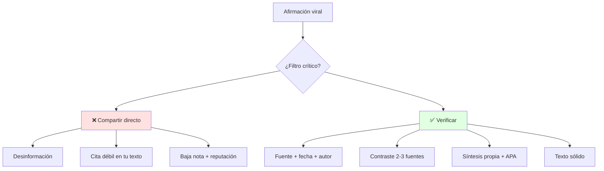
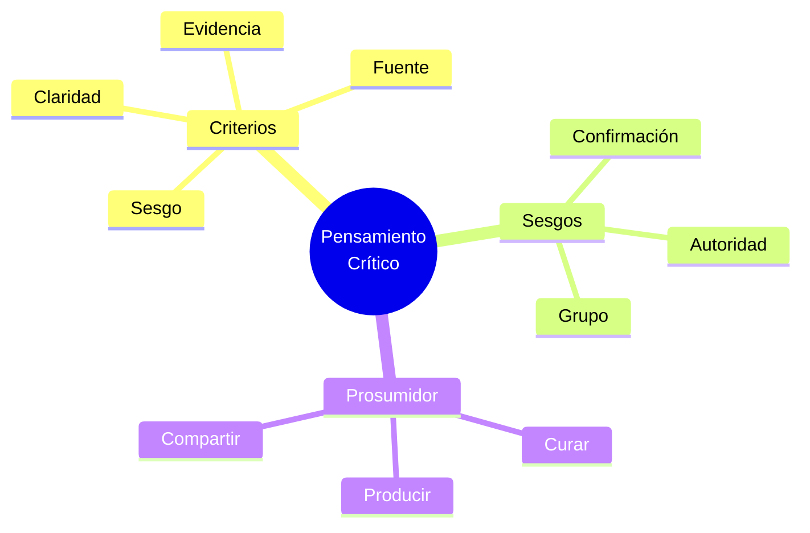

# 🔍 Pensamiento Crítico y Perfil Prosumidor

## 🎯 Introducción

> [!info] 💡 ¿Por Qué Criticar con Método?
>
> El **pensamiento crítico** no es criticar por criticar: es evaluar afirmaciones con criterios y evidencia antes de compartirlas o citarlas en tu texto expositivo.
>
> **Analogía del mundo real:** Piensa en hacer code review:
>
> - **Sin criterio** → Apruebas el PR porque "se ve bien"
> - **Con criterio** → Revisas tests, legibilidad, rendimiento, seguridad
> - **Prosumidor** → No solo consumes tutoriales: produces guías, corriges docs, aportas
> - **Holístico** → Evalúas el aporte en su contexto, no aislado
>
> | Razón | Consumidor Pasivo | Prosumidor Crítico |
> |---|---|---|
> | **Fuentes** | Comparte el primer link | Verifica 2-3 fuentes y fecha |
> | **Textos** | Copia-pega sin citar | Sintetiza, parafrasea y cita APA |
> | **IA** | Pega salida sin revisar | Promptea, verifica y declara uso ético |
> | **Equipo** | Repite opiniones | Aporta evidencia y alternativas |



---

## 🧵 Criterios y Sesgos Frecuentes

### 🎭 La Lista Corta que Sí Usarás

> [!note] 🎨 Evaluar en 4 Preguntas
>
> **Test rápido para cualquier lectura S3-S4:**
>
> ```mermaid
> graph LR
>     U[Afirmación] --> E[Evidencia?]
>     E --> F[Fuente confiable?]
>     F --> G[¿Sesgo?]
>     G --> R[Juicio: usar / descartar / matizar]
>     style R fill:#e1f5ff
> ```
>
> | Criterio | Pregunta | Señal de alerta |
> |---|---|---|
> | **Claridad** | ¿Qué afirma exactamente? | Generalidades sin datos |
> | **Evidencia** | ¿Qué datos la sostienen? | Solo anécdotas |
> | **Fuente** | ¿Quién, cuándo, dónde publicó? | Sin autor ni fecha |
> | **Sesgo** | ¿Qué interés hay detrás? | Solo confirma lo que creo (sesgo confirmación) |
> | **Contexto** | ¿Aplica a mi audiencia? | Estudio de otro país sin adaptar |

### 🔍 Sesgos que Más te Afectan en Talleres

> [!example] 🧪 Catálogo Mínimo
>
> 1. Confirmación: solo lees lo que apoya tu tesis → busca 1 fuente contraria a propósito
> 2. Autoridad: "lo dijo un influencer" → pide paper, dato, método
> 3. Disponibilidad: lo reciente parece más importante → verifica fecha y vigencia
> 4. Grupo: el equipo asiente por no pelear → disiente con datos 1 vez por sesión

---

## 🛠️ Perfil Prosumidor: de Consumidor a Productor

> [!success] 🏆 El Estándar ESPOL
>
> **Prosumidor = produces + consumes con criterio.** En esta materia se potencia con lecturas académicas y redacción de informes.
>
> ```mermaid
> graph TB
>     C[Consumidor] -->|lee con criterio| S[Sintetiza]
>     S -->|cita APA| P[Produce informe]
>     P -->|comparte| E[Comunidad aprende]
>     E -->|retroalimenta| C
>     style P fill:#e1ffe1
> ```
>
> **Niveles:**
>
> | Nivel | Haces | Ejemplo S4-S7 |
> |---|---|---|
> | 1. Consumidor | Lees y resumes | Resumen de 1 paper |
> | 2. Curador | Filtras lo confiable | Tabla comparativa 3 fuentes |
> | 3. Productor | Creas texto propio | Texto expositivo + presentación oral |
> | 4. Prosumidor | Publicas y mejoras con feedback | Charla TED con storytelling y datos |

---

## 🎨 Patrones para Evaluación 2 y Participación 2

### 📥 Patrón: Ficha de Lectura Crítica (S3)

> [!example] 💾 Plantilla de 6 Filas
>
> 1. Tesis del autor (1 línea)
> 2. Evidencia principal (dato + fuente)
> 3. Supuesto oculto (¿qué da por hecho?)
> 4. Contraevidencia (1 fuente que matice)
> 5. Mi juicio (usar / matizar / descartar + por qué)
> 6. Cita APA lista para tu texto

### 📤 Patrón: Realidades Emergentes (Participación 2)

> [!example] 💿 Estructura de 5 Líneas
>
> 1. Fenómeno (ej: IA genera informes en 1 min)
> 2. Partes (estudiantes, docentes, herramientas, normas)
> 3. Interacción (rapidez vs verificación)
> 4. Emergente (nueva norma: declarar uso de IA)
> 5. Implicación para tu carrera (1 línea)

---

## ⚠️ Problemas Comunes y Soluciones

> [!danger] ❌ Error: Citar sin Leer, solo abstract (viola **evidencia verificada**)
>
> **Síntomas:** citas que no sostienen tu tesis en la defensa oral.
>
> **Ejemplo completo:**
>
> - ❌ **EL ERROR ESTÁ AQUÍ:** "Según García (2020), la escucha activa mejora equipos." (leíste solo el abstract; en defensa te preguntan el método y no sabes si fue encuesta, experimento o ensayo).
> - ✅ Así sí: lees introducción + método + conclusión (15 min) y anotas "García 2020, encuesta n=120, sirve para X, límite Y".
>
> **Solución:**
>
> - Lee introducción + método + conclusión (15 min por paper)
> - Si no entiendes el método, no la cites como evidencia fuerte
> - Marca citas dudosas con [verificar] y reemplázalas antes del Taller 2

---

## 🎯 Mejores Prácticas

> [!tip] 🏆 Checklist S3-S4
>
> **1. Verifica antes de citar**
>
> Autor + fecha + medio + evidencia > título atractivo
>
> **2. Declara tu uso de IA (ética Unidad 3)**
>
> "Borrador asistido con IA, verificado con [fuentes], redacción final propia"
>
> **3. Conecta con Unidad 3 (texto expositivo)**
>
> Lo que filtres hoy son las fuentes confiables que
> la Participación 3 S4 te pedirá para el texto expositivo.

---

## 📊 Resumen Visual



> [!success] 🔍 Comparación Final
>
> | Aspecto | Sin Criterio | Con Criterio |
> |---|---|---|
> | **Lectura** | ❌ Acepta todo | ✅ Ficha crítica |
> | **Cita** | Débil | Trazable APA |
> | **IA** | Pega sin revisar | Promptea + verifica |
> | **Uso Recomendado** | Ninguno académico | ✅ **Estándar profesional** |

---

## 🚀 Próximos Pasos

> [!quote] 🌟 Continuando
>
> **Has aprendido:**
>
> ✅ Criterios de evaluación y sesgos comunes
> ✅ Perfil prosumidor en 4 niveles
> ✅ Fichas para Evaluación 2 y Participación 2
>
> **Próximo tema Unidad 3:**
>
> | Tema | Qué verás | Por qué importa |
> |---|---|---|
> | **Redacción y texto expositivo** | Claridad, APA, síntesis, informes | Base Taller 2 + PAC (S5-S7) |

---

## 🔗 Seguir estudiando

> [!info] 📚 Seguir estudiando
>
> - Mapa de contenido: [[Comunicación]]
> - Índice Unidad 2: [[00 - Índice Unidad 2]]
> - Anterior: [[01 - Pensamiento complejo vs pensamiento lineal]]
> - Syllabus: [[Bienvenida y Syllabus Comunicación]]
> - Base MOOC: [[Preuniversitario/MOOC de Comunicación/Comunicación Efectiva|MOOC de Comunicación]]

## 📚 Referencias

> [!quote] 📖 Fuentes
>
> - Sílabo IDIG2012, Unidad 2: pensamiento crítico y perfil prosumidor (4h).
> - Planificación PAO 2-2026 S3: Evaluación 2 TAP + Participación 2 realidades emergentes.
> - [1] E. Morin, *Introducción al pensamiento complejo*, Gedisa, 2005.
> - [2] UNESCO, *IA y educación. Guía para políticas*, 2021.

---

**Tags:** #IDIG2012 #unidad2 #pensamiento-critico #prosumidor #comunicacion
