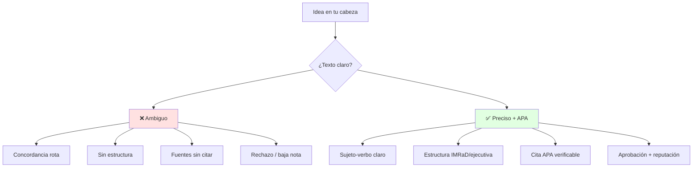
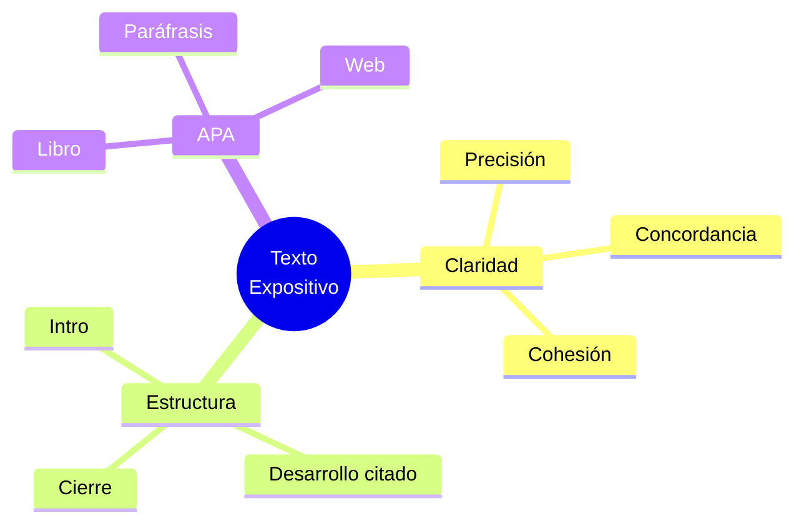

# 📝 Texto Expositivo, Claridad y APA

## 🎯 Introducción

> [!info] 💡 ¿Por Qué lo Expositivo Sostiene tu Carrera?
>
> El **texto expositivo** informa con objetividad: el informe que entregas, el correo que pides, la tesis que defiendes. Sin claridad ni APA, tu evidencia se vuelve ruido.
>
> **Analogía del mundo real:** Piensa en documentar una API:
>
> - **Sin claridad** → README ambiguo que nadie entiende ni cita
> - **Con claridad** → Endpoints, ejemplos y errores precisos
> - **Sin APA** → Copias código sin licencia ni autor
> - **Con APA** → Atribuyes, versionas y das trazabilidad
>
> | Razón | Texto Impreciso | Texto Claro + APA |
> |---|---|---|
> | **Comprensión** | Releen 3 veces y adivinan | Entienden a la primera |
> | **Credibilidad** | Sin fuentes verificables | Citas trazables |
> | **Evaluación** | Baja en Evaluación 3 y 4 (S4) | Puntos seguros gramaticales y APA |
> | **Profesionalismo** | Correo confuso al jefe | Correo ejecutivo preciso |



---

## 🧵 Fundamentos: Precisión, Concordancia y Cohesión (S4)

### 🎭 Las 3 Reglas de la Semana 4

> [!note] 🎨 Escribir para que no Adivinen
>
> **Precisión:** palabra exacta, dato exacto. *Hecho vs opinión*: "el taller duró 2h" (hecho) vs "el taller fue bueno" (opinión).
>
> ```mermaid
> graph LR
>     U[Idea] --> E[Oración]
>     E --> P[Precisión]
>     P --> C[Concordancia]
>     C --> H[Cohesión]
>     H --> T[Texto claro]
>     style T fill:#e1ffe1
> ```
>
> | Regla | Qué revisa | Ejemplo malo → bueno |
> |---|---|---|
> | **Concordancia** | Género, número, tiempo verbal | "Los datos *fue* claro" → "Los datos *fueron* claros" |
> | **Cohesión** | Conectores lógicos | "Y... y... y..." → "Primero... además... por tanto..." |
> | **Claridad** | Una idea por oración | Párrafo de 8 líneas → 3 oraciones cortas |
> | **Guía de correos (S4)** | Asunto + saludo + pedido + cierre | "Hola, necesito..." → "Asunto: Solicitud Taller 2 — Grupo 3..." |

### 🔍 Tipologías Textuales en 1 Tabla

> [!example] 🧪 Qué Texto Usar Cuándo
>
> | Tipo | Intención | Ejemplo en tu semestre |
> |---|---|---|
> | **Expositivo** | Informar con objetividad | Informe del Taller 2, PAC |
> | **Argumentativo** | Persuadir (Unidad 4) | Guion charla TED |
> | **Instructivo** | Guiar pasos | Manual de práctica, acta |
> | **Ejecutivo** | Decidir rápido | Resumen de 1 página para directivo |
>
> **Estructura expositiva base (úsala en Taller 2):**
>
> 1. Introducción: tema + objetivo + alcance (5 líneas)
> 2. Desarrollo: 3 ideas con evidencia citada APA
> 3. Cierre: síntesis + recomendación (no opinión suelta)

---

## 🛡️ Normas APA Esenciales (Evaluación 4 S4)

> [!success] 🏆 Citar sin Sufrir
>
> **Solo lo que usarás este parcial:**
>
> | Caso | Formato | Ejemplo |
> |---|---|---|
> | **Libro** | Apellido, Inicial. (Año). *Título*. Editorial. | Sánchez Fernández, M. (2014). *Comunicación efectiva y trabajo en equipo*. CEP. |
> | **Cita corta (<40 palabras)** | "Texto" (Apellido, año, p. X). | "La escucha activa sostiene la cohesión" (Sánchez, 2014, p. 32). |
> | **Paráfrasis** | Idea con tus palabras + (Apellido, año). | La cohesión depende de turnos claros (Sánchez, 2014). |
> | **Web con autor** | Apellido, Inicial. (Año). Título. URL | Codina Jiménez, A. (2004). *Saber escuchar*. https://www.redalyc.org/pdf/549/54900303.pdf |
>
> Errores que restan: sin fecha, sin cursiva en libro, URL cruda sin datos.

---

## ⚠️ Problemas Comunes y Soluciones

> [!danger] ❌ Error: Hecho y Opinión Mezclados (viola **objetividad expositiva**)
>
> **Síntomas:** "El informe es bueno porque los datos son 2024" — mezcla juicio con dato.
>
> **Ejemplo completo:**
>
> - ❌ **EL ERROR ESTÁ AQUÍ:** "El taller fue excelente y participaron 30 estudiantes, por lo que el método es el mejor." (juicios + dato sin fuente ni criterio).
> - ✅ Así sí: "Participaron 30 estudiantes (lista de asistencia, Anexo 1). Con ese dato, *recomiendo* repetir el formato porque la asistencia subió 40% vs el taller anterior."
>
> **Solución:**
>
> - Subraya hechos (verificables) en azul y opiniones en amarillo
> - Opinión solo en cierre con evidencia: "Recomiendo X porque los datos muestran Y"

## 🧹 Vicios que Restan Puntos (del MOOC)

> [!warning] 📝 Tautologías y Pleonasmos Frecuentes
>
> Destilado de [[Preuniversitario/MOOC de Comunicación/Unidad 1 - El proceso de la comunicación/03 - Errores comunes, acentuación y puntuación|MOOC U1 — Errores comunes]]:
>
> | Dilo mal | Dilo bien | Por qué |
> |---|---|---|
> | Subir arriba / bajar abajo | Subir / bajar | La dirección ya va incluida |
> | Resumen breve | Resumen | Resumir ya es abreviar |
> | Repetir de nuevo | Repetir | Repetir ya es de nuevo |
> | Opinión personal | Opinión | Toda opinión es personal |
> | Planear con anticipación | Planear | Planear ya mira al futuro |
> | Finalmente terminar | Terminar | Terminar ya es el final |
> | Necesario e indispensable | Indispensable | Lo indispensable ya es necesario |
> | Cada uno de los alumnos *tienen* | Cada uno... *tiene* | El sujeto es "cada uno" (singular) |
>
> **Regla de oro:** si al quitar la palabra sobrante nada se pierde, sobraba.

---

## 🎯 Mejores Prácticas

> [!tip] 🏆 Checklist S4
>
> **1. Pasa el test de 1 lectura**
>
> Si un compañero no entiende a la primera, recorta 20% y agrega 1 conector.
>
> **2. Correo ejecutivo plantilla**
>
> Asunto: [Materia] Pedido concreto — Grupo N
> Saludo + contexto 1 línea + pedido numerado + cierre con fecha
> Firma: nombre, carrera, paralelo
>
> **3. Evaluación 3 (gramática, asincrónica) + Evaluación 4 (APA)**
>
> - Repasa concordancia con 10 oraciones propias del Taller 2
> - Arma tu banco APA con las 4 fuentes del syllabus

---

## 📊 Resumen Visual



> [!success] 🔍 Comparación Final
>
> | Aspecto | Sin Norma | Con Norma |
> |---|---|---|
> | **Legibilidad** | ❌ Relectura | ✅ 1 pasada |
> | **Cita** | Copia riesgosa | Trazable APA |
> | **Uso Recomendado** | Ninguno académico | ✅ **Estándar ESPOL** |

---

## 🚀 Próximos Pasos

> [!quote] 🌟 Continuando
>
> **Has aprendido:**
>
> ✅ Precisión, concordancia, cohesión y correos
> ✅ Tipologías y estructura expositiva
> ✅ APA esencial para Evaluación 4
>
> **Próximo tema:**
>
> | Tema | Qué verás | Por qué importa |
> |---|---|---|
> | **Informes, síntesis y paráfrasis** | Técnicos vs ejecutivos, Taller 2 manuscrito | Base Talleres 2-3 + PAC |

---

## 🔗 Seguir estudiando

> [!info] 📚 Seguir estudiando
>
> - Mapa de contenido: [[Comunicación]]
> - Índice Unidad 3: [[00 - Índice Unidad 3]]
> - Siguiente: [[02 - Informes técnicos y ejecutivos, síntesis y paráfrasis]]
> - Syllabus: [[Bienvenida y Syllabus Comunicación]]
> - Base MOOC: [[Preuniversitario/MOOC de Comunicación/Comunicación Efectiva|MOOC de Comunicación]]
> - Bases específicas: [[Preuniversitario/MOOC de Comunicación/Unidad 5 - Textos expositivos/01 - El texto expositivo (concepto, tipos y estructura)|MOOC U5 — Expositivo]], [[Preuniversitario/MOOC de Comunicación/Unidad 5 - Textos expositivos/02 - Análisis del texto expositivo|Análisis]], [[Preuniversitario/MOOC de Comunicación/Unidad 1 - El proceso de la comunicación/03 - Errores comunes, acentuación y puntuación|MOOC U1 — Errores y tildes]], [[Preuniversitario/MOOC de Comunicación/Unidad 3 - Tipología textual/04 - Signos de puntuación y uso de mayúsculas|MOOC U3 — Puntuación]]

## 📚 Referencias

> [!quote] 📖 Fuentes
>
> - Sílabo IDIG2012, Unidad 3: texto, tipologías, claridad y precisión (6h).
> - Planificación PAO 2-2026 S4: gramática, correos, APA (Evaluaciones 3 y 4).
> - [1] J. Pérez Insuasti, *Fundamentos de la escritura técnica y académica*, 2024.
> - [2] M. Sánchez Fernández, *Comunicación efectiva y trabajo en equipo*, CEP, 2014.

---

**Tags:** #IDIG2012 #unidad3 #expositivo #apa #redaccion
