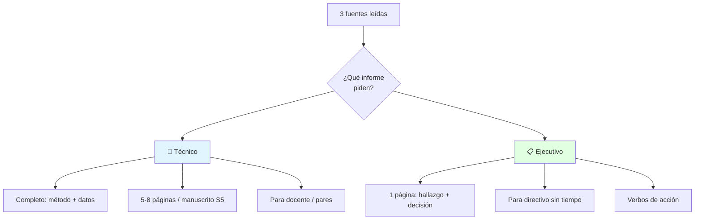
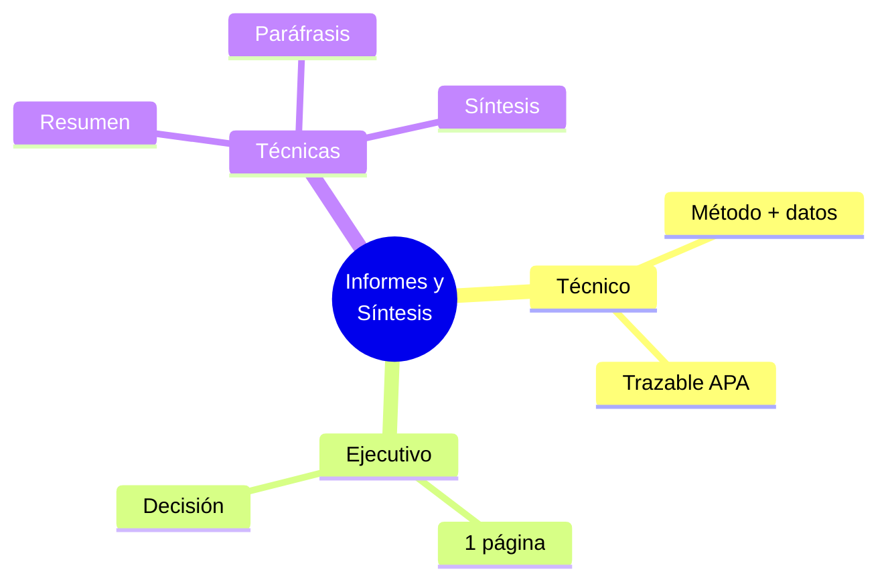

# 📊 Informes Técnicos y Ejecutivos, Síntesis y Paráfrasis

## 🎯 Introducción

> [!info] 💡 ¿Por Qué el Informe Decide tu Nota y tu Práctica?
>
> El **Taller 2 (S5-S7)** pide un texto expositivo grupal manuscrito y el **Taller 3** su defensa oral. Quien domina síntesis y paráfrasis entrega en 2 páginas lo que otros no dicen en 6.
>
> **Analogía del mundo real:** Piensa en un pull request:
>
> - **Informe técnico** → Descripción completa: contexto, cambios, pruebas, riesgos
> - **Informe ejecutivo** → Título del PR: qué cambia y qué se aprueba en 30 seg
> - **Síntesis** → Changelog que condensa 20 commits en 5 líneas
> - **Paráfrasis** → Reescribes el error del log con tus palabras sin cambiar el sentido
>
> | Razón | Texto Largo sin Foco | Informe + Síntesis |
> |---|---|---|
> | **Audiencia técnica** | Se pierde en adjetivos | Datos, método, evidencia |
> | **Audiencia directiva** | No lee 6 páginas | 1 página: hallazgo + decisión |
> | **Originalidad** | Copia-pega detectable | Paráfrasis citada APA |
> | **Evaluación** | Taller 2 flojo + PAC débil | Taller 2 sólido + PAC lista |

---

## 🧵 Informes: Técnico vs Ejecutivo

### 🎭 Plantillas que Sí Pasarás a Mano (Taller 2)

> [!note] 🎨 Estructuras Copiables
>
> **Informe técnico (Taller 2 manuscrito grupal):**
>
> 1. Portada: materia, título, grupo, fecha
> 2. Objetivo y alcance (5 líneas)
> 3. Marco breve: 3 fuentes sintetizadas + APA
> 4. Desarrollo: hechos numerados + 1 tabla o figura
> 5. Conclusiones: 3 hallazgos verificables
> 6. Recomendación: 1 acción concreta
> 7. Referencias APA
>
> **Informe ejecutivo (1 página, para directivo):**
>
> Asunto | Decisión que pides | 3 bullets de evidencia | Riesgo de no actuar | Próximo paso + fecha
>
> | Aspecto | Técnico | Ejecutivo |
> |---|---|---|
> | **Lector** | Docente / par técnico | Directivo / cliente |
> | **Largo** | Completo y trazable | 1 página, escaneable |
> | **Tono** | Formal y detallado | Directo y accionable |
> | **Cierre** | Conclusiones + referencias | Decisión + fecha |

### 🔍 Síntesis vs Resumen vs Paráfrasis

> [!example] 🧪 Diferencias que Evalúan en PAC
>
> | Técnica | Qué hace | Ejemplo |
> |---|---|---|
> | **Resumen** | Condensa 1 fuente manteniendo ideas | Paper de 10 pág → 10 líneas |
> | **Síntesis** | Integra 2+ fuentes en idea nueva | 3 papers → 1 tabla comparativa + juicio |
> | **Paráfrasis** | Reescribe 1 idea con tus palabras | "La cohesión emerge del grupo" → "El grupo produce unión que ningún miembro tiene solo (Sánchez, 2014)" |
>
> **Test antiplagio:**
>
> Si cambiaste solo 3 palabras, es copia. Reescribe estructura + cita.

---

## 🛠️ Patrones Taller 2 y Taller 3 (S5-S7)

### 📥 Patrón: Texto Expositivo Grupal Manuscrito

> [!example] 💾 Protocolo Taller 2
>
> 1. Repartan 1 fuente por miembro + ficha de lectura (ver Unidad 2)
> 2. Sintetizan en tabla: fuente | tesis | evidencia | límite
> 3. Redactan a mano con plantilla técnica (letra legible, márgenes)
> 4. Intercambian con otro grupo 10 min: ¿hecho vs opinión marcado?
> 5. Entregan + foto para Aula Virtual el mismo día

### 📤 Patrón: Presentación Oral del Texto (Taller 3)

> [!example] 💿 Defensa en 5 Minutos
>
> 1 min: problema + objetivo | 2 min: 3 hallazgos con 1 visual | 1 min: recomendación | 1 min: preguntas
> Regla: 1 idea por diapositiva, lee al público no a la pantalla.

---

## ⚠️ Problemas Comunes y Soluciones

> [!danger] ❌ Error: Pegar Párrafos sin Sintetizar
>
> **Síntomas:** informe de 6 páginas que dice lo mismo 3 veces, sin tabla comparativa.
>
> **Solución:**
>
> - Obliga 1 tabla síntesis antes de redactar
> - Cada párrafo: idea + evidencia + cita; si falta 1, se elimina

---

## 🎯 Mejores Prácticas

> [!tip] 🏆 Checklist S5-S7
>
> **1. Hecho vs opinión marcado desde el borrador**
>
> Azul = verificable, amarillo = juicio. Amarillo solo en cierre.
>
> **2. Participación 3 S4: lleva 3 fuentes confiables a clase**
>
> Sin fuentes no hay Taller 2. Llega con PDFs + fichas hechas.
>
> **3. PAC (Aula Virtual, Lab CIB o e-learning)**
>
> Repasa tipologías + síntesis + paráfrasis + APA con tarjetas de 1 cara.

---

## 📊 Resumen Visual

> [!success] 🔍 Comparación Final
>
> | Aspecto | Pegar Fuentes | Sintetizar |
> |---|---|---|
> | **Originalidad** | ❌ Riesgo plagio | ✅ Voz propia citada |
> | **Utilidad** | Relleno | Decisión accionable |
> | **Uso Recomendado** | Nunca académico | ✅ **Estándar Taller 2** |

---

## 🚀 Próximos Pasos

> [!quote] 🌟 Continuando
>
> **Has aprendido:**
>
> ✅ Informes técnicos vs ejecutivos con plantillas
> ✅ Síntesis, resumen y paráfrasis con test antiplagio
> ✅ Protocolos Talleres 2-3 y PAC
>
> **Próximo tema:**
>
> | Tema | Qué verás | Por qué importa |
> |---|---|---|
> | **IA ética y prompts** | Promptear, verificar, declarar uso | Participación 4 + redacción asistida |

---

## 🔗 Seguir estudiando

> [!info] 📚 Seguir estudiando
>
> - Mapa de contenido: [[Comunicación]]
> - Índice Unidad 3: [[00 - Índice Unidad 3]]
> - Anterior: [[01 - Texto expositivo, claridad y APA]]
> - Siguiente: [[03 - IA ética y prompts para redacción]]
> - Syllabus: [[Bienvenida y Syllabus Comunicación]]
> - Base MOOC: [[Preuniversitario/MOOC de Comunicación/Comunicación Efectiva|MOOC de Comunicación]]
> - Bases específicas: [[Preuniversitario/MOOC de Comunicación/Unidad 4 - Resumen y síntesis/01 - El resumen académico|MOOC U4 — Resumen]], [[Preuniversitario/MOOC de Comunicación/Unidad 4 - Resumen y síntesis/03 - La síntesis de múltiples fuentes|Síntesis]], [[Preuniversitario/MOOC de Comunicación/Unidad 4 - Resumen y síntesis/02 - Técnicas de parafraseo y citación|Parafraseo]]

## 📚 Referencias

> [!quote] 📖 Fuentes
>
> - Sílabo IDIG2012, Unidad 3: redacción laboral, informes técnicos y ejecutivos (6h).
> - Planificación PAO 2-2026 S5-S7: Taller 2 manuscrito + Taller 3 oral + PAC + Participación 3.
> - [1] J. Pérez Insuasti, *Fundamentos de la escritura técnica y académica*, 2024.
> - [2] UNESCO, *IA y educación. Guía para políticas*, 2021.

---

**Tags:** #IDIG2012 #unidad3 #informes #sintesis #parafrasis
