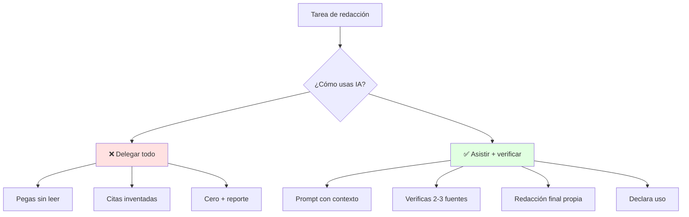
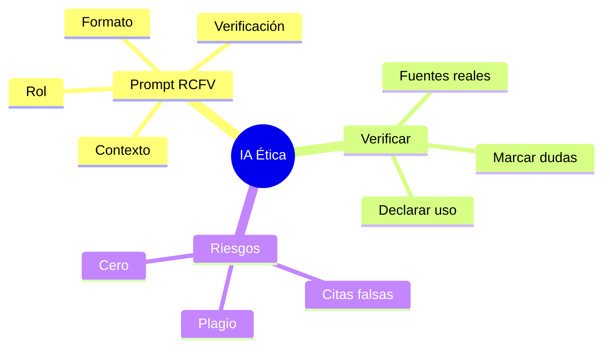

# 🤖 IA Ética y Prompts para Redacción

## 🎯 Introducción

> [!info] 💡 ¿Por Qué la IA es Asistente y no Autora?
>
> La **IA optimiza** redacción, tiempos y automatización (sílabo 3.4), pero el criterio, la verificación y la firma son tuyos. En ESPOL el uso no declarado o sin verificar es deshonestidad académica: cero puntos.
>
> **Analogía del mundo real:** Piensa en un copiloto de código:
>
> - **Sin ética** → Aceptas el diff sin leer y rompes producción
> - **Con ética** → Revisas, testeas, atribuyes y firmas el commit
> - **Sin prompt** → "Hazme el informe" y recibes humo genérico
> - **Con prompt** → Rol + contexto + formato + fuentes y recibes borrador útil
>
> | Razón | Uso Ingenuo | Uso Ético Pro |
> |---|---|---|
> | **Calidad** | Genérico e inventa citas | Borrador verificable + APA real |
> | **Tiempo** | Reescribes todo igual | Ahorras 40% en estructura y estilo |
> | **Riesgo** | Plagio / datos falsos | Declarado y verificado |
> | **Evaluación** | Cero por deshonestidad | Participación 4 S6 a favor |

---

## 🧵 Prompts que Sí Sirven (Actividad S6)

### 🎭 Fórmula RCFV

> [!note] 🎨 Rol, Contexto, Formato, Verificación
>
> **Plantilla copiable para tus informes:**
>
> Rol: actúa como editor académico de ingeniería.
> Contexto: informe expositivo sobre [tema] para [audiencia] en ESPOL.
> Fuentes: usa solo [pega tus 3 fuentes] y cita APA.
> Formato: intro 5 líneas + 3 hallazgos numerados + cierre con recomendación.
> Restricción: marca [verificar] lo no respaldado. Tono formal.
> Verificación: al final lista qué afirmación viene de qué fuente.
>
> | Parte | Qué logra | Error común |
> |---|---|---|
> | **Rol** | Tono experto | Sin rol → tono blog |
> | **Contexto** | Ajusta audiencia | Sin audiencia → genérico |
> | **Formato** | Estructura evaluable | Sin formato → bloque informe |
> | **Verificación** | Evita alucinaciones | Sin pedir fuentes → citas falsas |

### 🔍 Ciclo de Verificación en 10 Minutos

> [!example] 🧪 Protocolo Participación 4 (S6, sincrónico TAF)
>
> 1. Genera borrador con RCFV (3 min)
> 2. Subraya cada dato numérico y busca su fuente real (4 min)
> 3. Elimina lo no respaldado o márcalo [verificar] (2 min)
> 4. Reescribe cierre con tus palabras + declara: "Borrador asistido con IA, verificado con [fuentes]"

---

## 🛡️ Ética y Políticas ESPOL

> [!success] 🏆 Reglas No Negociables
>
> - **Autoría:** toda idea ajena citada; plagio = 0 (Políticas 7.3).
> - **Declaración:** si usaste IA, dilo en el informe y en clase.
> - **Evidencia:** ninguna cita IA sin fuente primaria abierta.
> - **Datos:** no subas datos sensibles de terceros a herramientas públicas.
>
> Frase de declaración: "Se usó IA para estructura y estilo; el contenido
> fue verificado con [fuentes APA] y la redacción final es propia."

---

## ⚠️ Problemas Comunes y Soluciones

> [!danger] ❌ Error: Citas APA Inventadas por la IA (viola **verificación de fuentes**)
>
> **Síntomas:** referencias con DOI falso o páginas que no existen.
>
> **Ejemplo completo:**
>
> - ❌ **EL ERROR ESTÁ AQUÍ:** bibliografía entregada con "Pérez, J. (2022). *Escucha y cerebro*. Revista NeuroCom, 4(2), 12-20. https://doi.org/10.xxxx/falso" — el DOI no resuelve y la revista no existe.
> - ✅ Así sí: pedir a la IA solo estructura y armar cada referencia desde el PDF real abierto, cruzando 1 búsqueda académica.
>
> **Solución:**
>
> - Pide a la IA solo estructura, nunca bibliografía final
> - Arma tu APA desde PDFs reales de Unidad 0 / biblioteca
> - Cruza con 1 búsqueda académica antes de entregar

---

## 🎯 Mejores Prácticas

> [!tip] 🏆 Checklist S6-S7
>
> **1. IA para estilo, tú para evidencia**
>
> IA: conectores, concisión, variantes de título.
> Tú: datos, citas, juicio y firma.
>
> **2. Guarda tus prompts**
>
> Anexa el prompt usado: muestra método y te defiende en revisión.
>
> **3. Conecta con PAC y Taller 3**
>
> Lo verificado hoy es lo que expones mañana sin leer diapositivas.

---

## 📊 Resumen Visual

> [!success] 🔍 Comparación Final
>
> | Aspecto | Sin Método | Con RCFV + Verificación |
> |---|---|---|
> | **Borrador** | ❌ Humo | ✅ Estructurado |
> | **Citas** | Inventadas | Reales APA |
> | **Uso Recomendado** | Nunca académico | ✅ **Estándar ético** |

---

## 🚀 Próximos Pasos

> [!quote] 🌟 Continuando
>
> **Has aprendido:**
>
> ✅ Fórmula RCFV y ciclo de verificación 10 min
> ✅ Reglas éticas y declaración de uso
> ✅ Antídoto contra citas inventadas
>
> **Próximo tema Unidad 4:**
>
> | Tema | Qué verás | Por qué importa |
> |---|---|---|
> | **Comportamiento comunicacional** | Argumentación, storytelling, TED | Proyecto final = Examen II parcial |

---

## 🔗 Seguir estudiando

> [!info] 📚 Seguir estudiando
>
> - Mapa de contenido: [[Comunicación]]
> - Índice Unidad 3: [[00 - Índice Unidad 3]]
> - Anterior: [[02 - Informes técnicos y ejecutivos, síntesis y paráfrasis]]
> - Syllabus: [[Bienvenida y Syllabus Comunicación]]
> - Base MOOC: [[Preuniversitario/MOOC de Comunicación/Comunicación Efectiva|MOOC de Comunicación]]

## 📚 Referencias

> [!quote] 📖 Fuentes
>
> - Sílabo IDIG2012, Unidad 3.4: IA ética para redacción y automatización.
> - Planificación PAO 2-2026 S6: IA + prompts + Participación 4 (TAF).
> - [1] UNESCO, *IA y educación. Guía para políticas*, 2021.
> - [2] Políticas PAO 2-2026, §7.3: ética y deshonestidad académica.

---

**Tags:** #IDIG2012 #unidad3 #ia-etica #prompts #redaccion
