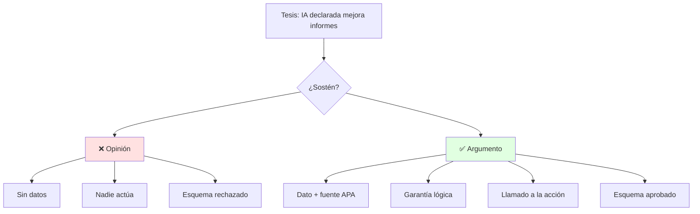
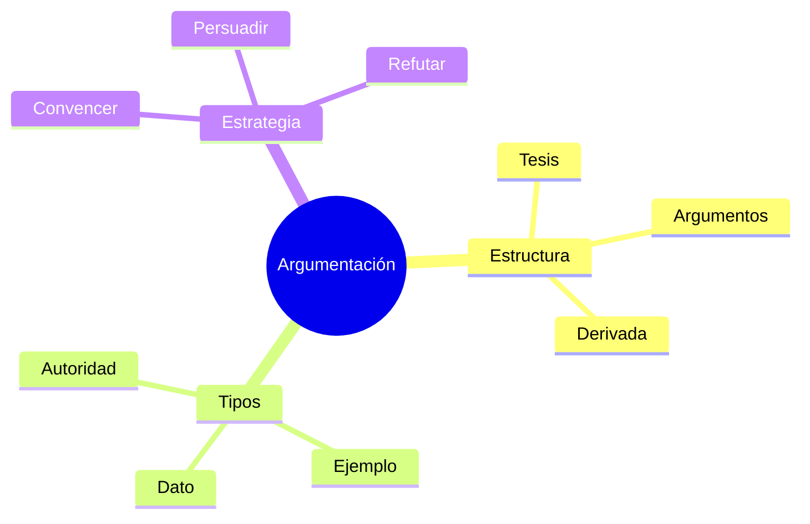

# 🗣️ Argumentación Efectiva: Convencer vs Persuadir

## 🎯 Introducción

> [!info] 💡 ¿Por Qué tu TED Necesita Argumentos y no Opiniones?
>
> La **argumentación** es la columna del guion TED (S8-S9): tesis + argumentos + subargumentos + conclusión derivada. Sin ella, tu charla es anécdota; con ella, es evidencia que mueve decisiones.
>
> **Analogía del mundo real:** Piensa en defender una arquitectura de software:
>
> - **Sin argumento** → "Microservicios porque están de moda"
> - **Con argumento** → "Propongo X porque reduce latencia 30% (dato), con costo Y (evidencia), por tanto conviene para Z (derivada)"
> - **Convencer** → Apela a la razón con pruebas
> - **Persuadir** → Mueve a la acción con razón + emoción ética
>
> | Razón | Opinión Suelta | Argumento Estructurado |
> |---|---|---|
> | **Base** | "Me parece" | Tesis + evidencia + garantía |
> | **Efecto** | Duda | Convence (razón) y persuade (acción) |
> | **Evaluación** | Esquema flojo S8 | Esquema aprobado → guion S10 |
> | **TED final** | Charla olvidable | Charla finalista Voces con Ciencia |



---

## 🧵 Estructura, Tipos y Estrategias

### 🎭 Anatomía del Argumento TED

> [!note] 🎨 Tesis, Argumentos, Derivada
>
> **Estructura que pide el syllabus 4.1:**
>
> ```mermaid
> graph LR
>     T[Tesis] --> A1[Arg 1<br/>dato]
>     T --> A2[Arg 2<br/>ejemplo]
>     T --> A3[Arg 3<br/>autoridad]
>     A1 --> S[Subargumentos]
>     A2 --> S
>     A3 --> S
>     S --> C[Conclusión derivada<br/>+ acción]
>     style T fill:#e1f5ff
>     style C fill:#e1ffe1
> ```
>
> | Tipo de argumento | Cuándo usarlo en tu charla | Ejemplo |
> |---|---|---|
> | **Dato/estadística** | Abrir con impacto | "60% de informes se rechazan por falta de claridad (Sánchez, 2014)" |
> | **Ejemplo/caso** | Humanizar el dato | "Mi grupo pasó de 70 a 95 con acta y roles" |
> | **Autoridad** | Respaldar criterio | "Morin (2005): el todo emerge de las partes" |
> | **Analogía** | Explicar lo técnico | "Un equipo sin acta es un repo sin commits" |
> | **Causa-efecto** | Justificar acción | "Si declaras IA y verificas, evitas el cero" |
>
> **Convencer vs persuadir:**
>
> Convencer = razón suficiente (datos, lógica) → "entiendo que es verdad"
> Persuadir = razón + emoción ética (historia, valores) → "actúo en consecuencia"
> Tu TED necesita ambos: convence en el cuerpo, persuade en el cierre.

### 🔍 Los 5 Filtros de una Tesis Válida (del MOOC)

> [!example] 🧪 Pasa tu Tesis por los 5 Filtros
>
> Destilado de [[Preuniversitario/MOOC de Comunicación/Unidad 6 - Textos argumentativos/02 - Formulación y validación de la tesis|MOOC U6 — Tesis válida]] (ahí están los ejercicios 04.1 con soluciones):
>
> | # | Filtro | ❌ Falla | ✅ Pasa |
> |---|---|---|---|
> | 1 | **Debatible** (opinable, no hecho) | "El agua hierve a 100°C." | "La nuclear debería liderar la matriz eléctrica." |
> | 2 | **Específica** (sin todos/nadie/siempre) | "Todos los políticos son corruptos." | "La falta de rendición de cuentas favorece la corrupción." |
> | 3 | **Aseverativa** (afirma, no pregunta) | "¿Regular redes en menores?" | "Regular redes en menores de 13 por ley." |
> | 4 | **Cierta** (firme, no hipotética) | "Si se invirtiera, tal vez..." | "Invertir en educación mejora la economía." |
> | 5 | **Completa** (oración con verbo) | "La importancia de reducir..." | "Reducir la desigualdad debe ser prioridad." |
>
> Si tu tesis del TED falla un filtro, reformúlala antes del esquema S8: un esquema sobre tesis inválida se devuelve.

### 🔍 Estrategias de Esquema (Taller 1 S8)

> [!example] 🧪 Esquema en 6 Líneas
>
> 1. Tesis (1 oración, postura clara)
> 2. Arg 1 + evidencia APA
> 3. Arg 2 + ejemplo propio S1-S7
> 4. Objeción anticipada + refutación ("dirán X, pero Y porque...")
> 5. Derivada: ¿qué debe hacer la audiencia mañana?
> 6. Cierre memorable (frase de 10 palabras)

---

## ⚠️ Problemas Comunes y Soluciones

> [!danger] ❌ Error: Falacia del Ataque Personal (viola **atacar ideas, no personas**)
>
> **Síntomas:** "El otro grupo opina eso porque son vagos" — atacas persona, no idea; el jurado penaliza.
>
> **Ejemplo completo:**
>
> - ❌ **EL ERROR ESTÁ AQUÍ:** "Su propuesta no sirve porque ellos siempre entregan tarde y no saben del tema." (cero datos sobre la propuesta).
> - ✅ Así sí: "Su propuesta usa datos de 2015; la cifra actual del INEC dice X, por eso propongo Y."
>
> **Solución:**
>
> - Ataca la evidencia, no a la persona: "Ese dato es 2015, el actual dice..."
> - Registra 1 objeción real a tu tesis y refútala con datos

---

## 🎯 Mejores Prácticas

> [!tip] 🏆 Checklist S8 (Evaluación 1-2 + Taller 1 esquema)
>
> **1. Tesis falsable en 1 línea**
>
> "Los equipos con acta y roles entregan informes 30% mejores" (medible, no gusto)
>
> **2. 3 argumentos de distinto tipo**
>
> Dato + caso + autoridad. Si los 3 son anécdotas, es débil.
>
> **3. Participación 1 S8: tesis aprobada**
>
> Llega con 2 opciones de tesis; sal con 1 validada por el docente.

---

## 📊 Resumen Visual



> [!success] 🔍 Comparación Final
>
> | Aspecto | Opinión | Argumento TED |
> |---|---|---|
> | **Sostén** | ❌ Ninguno | ✅ Evidencia APA |
> | **Acción** | No mueve | Persuade éticamente |
> | **Uso Recomendado** | Fuera del aula | ✅ **Base del guion** |

---

## 🚀 Próximos Pasos

> [!quote] 🌟 Continuando
>
> **Has aprendido:**
>
> ✅ Estructura tesis–argumentos–derivada
> ✅ Tipos y estrategias convencer/persuadir
> ✅ Esquema S8 listo para guion
>
> **Próximo tema:**
>
> | Tema | Qué verás | Por qué importa |
> |---|---|---|
> | **Storytelling científico** | Personajes, conflicto, resolución con datos | Guion que emociona sin perder rigor |

---

## 🔗 Seguir estudiando

> [!info] 📚 Seguir estudiando
>
> - Mapa de contenido: [[Comunicación]]
> - Índice Unidad 4: [[00 - Índice Unidad 4]]
> - Siguiente: [[02 - Storytelling para comunicar ciencia]]
> - Syllabus: [[Bienvenida y Syllabus Comunicación]]
> - Base MOOC: [[Preuniversitario/MOOC de Comunicación/Comunicación Efectiva|MOOC de Comunicación]]
> - Bases específicas: [[Preuniversitario/MOOC de Comunicación/Unidad 6 - Textos argumentativos/01 - El texto argumentativo (concepto, ámbitos y estructura)|MOOC U6 — Argumentativo]], [[Preuniversitario/MOOC de Comunicación/Unidad 6 - Textos argumentativos/02 - Formulación y validación de la tesis|Tesis válida]], [[Preuniversitario/MOOC de Comunicación/Unidad 6 - Textos argumentativos/03 - Análisis y desmontaje de textos argumentativos|Desmontaje]]

## 📚 Referencias

> [!quote] 📖 Fuentes
>
> - Sílabo IDIG2012, Unidad 4.1: argumentación, tipos, convencer vs persuadir (14h).
> - Planificación PAO 2-2026 S8: esquema argumentativo + Evaluaciones 1-2 + Participación 1 (tesis).
> - [1] M. Sánchez Fernández, *Comunicación efectiva y trabajo en equipo*, CEP, 2014.

---

**Tags:** #IDIG2012 #unidad4 #argumentacion #ted #comunicacion
